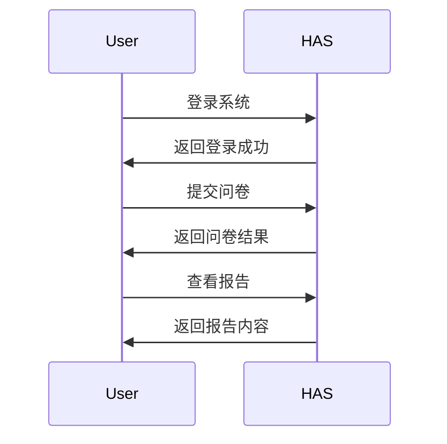

                 

# 重新定义幸福：从物质满足到心灵富足的转变

## 关键词
- 幸福观
- 物质满足
- 精神富足
- 心理学
- 哲学
- 社会学

## 摘要
本文旨在探讨当代社会对幸福的新定义，从物质满足转向心灵富足的深刻转变。通过对历史、文化和不同理论的回顾，文章分析了幸福的核心概念及其在不同领域的影响。接着，文章提出了从物质生活向精神生活的过渡策略，并通过实际案例展示了这些策略的应用。最后，文章总结了全文，并对未来可能的研究方向进行了展望。

## 引言

### 核心概念术语说明

在探讨幸福这一主题时，我们需要明确几个核心概念：

- **物质满足**：指的是通过物质财富、消费和物质享受来达到的一种状态。
- **精神富足**：指的是通过内在的成长、情感联系和自我实现来达到的一种深层次的满足感。
- **幸福观**：是对幸福本质的理解和认知，它受到个人、文化和社会等多方面因素的影响。

### 问题背景

在现代社会，随着经济水平的提高和物质生活的丰富，人们对幸福的定义也在不断变化。传统的幸福观往往强调物质满足，即通过积累财富和物质享受来获得幸福感。然而，随着社会的发展，越来越多的人开始质疑这种幸福观的合理性和可持续性。物质满足是否能带来真正的幸福？人们是否可以通过追求更高层次的精神富足来实现更加深远的幸福感？

### 问题描述

本文要解决的核心问题是：如何重新定义幸福，从物质满足转向心灵富足？这个问题不仅涉及到个人层面的精神追求，还涉及到社会层面的文化变迁和价值重构。我们需要探讨以下几个方面：

1. **历史与文化的演变**：了解不同时期和文化中对幸福的理解，从中提取有价值的思想和经验。
2. **心理学视角**：研究心理学理论，特别是幸福感研究，了解幸福的心理机制和影响因素。
3. **哲学与社会学观点**：探讨哲学和社会学对幸福的思考，特别是关于幸福本质和价值的探讨。
4. **实践策略**：提供实用的方法，帮助人们实现从物质满足到精神富足的转变。
5. **实际案例分析**：通过具体案例，展示实践策略的有效性和可行性。

### 问题解决与边界

本文将通过以下方式解决问题：

1. **理论分析**：结合历史、心理学、哲学和社会学等理论，深入探讨幸福的核心概念和本质。
2. **实践指导**：提供具体的实践策略，帮助读者理解和实现幸福观的转变。
3. **案例分析**：通过实际案例，展示理论应用的可行性和效果。

本文的边界在于：

1. **内容范围**：主要聚焦于西方文化背景下的幸福观，虽然也会参考其他文化，但不会进行深入的跨文化比较研究。
2. **研究深度**：本文旨在提供一种宏观的视角，对幸福进行重新定义，而不是深入探讨某个特定领域的具体问题。

### 概念结构与核心要素

本文的结构如下：

1. **引言**：介绍核心概念、问题背景和文章结构。
2. **历史与文化视角**：回顾不同历史时期和文化的幸福观。
3. **核心概念与理论**：探讨心理学、哲学和社会学对幸福的理解。
4. **从物质到精神**：讨论如何实现幸福观的转变。
5. **实践策略**：提供实用的方法和技巧。
6. **案例分析**：展示实践策略的应用。
7. **结论与反思**：总结全文，提出未来研究方向。

本文的核心要素包括：

- **历史与文化的演变**：理解幸福观在不同文化和历史时期的变迁。
- **心理学视角**：研究幸福感的心理机制。
- **哲学与社会学观点**：探讨幸福本质和价值的哲学和社会学思考。
- **实践策略**：提供实用的方法和技巧。
- **实际案例分析**：展示理论应用的可行性和效果。

## 历史与文化视角

### 古代至现代的幸福观念

幸福观在不同历史时期和文化背景下有着显著的差异。古代文明，如古希腊和古罗马，对幸福的理解主要集中在物质和精神两个方面。古希腊哲学家亚里士多德认为，幸福（eudaimonia）是人的最高追求，它既包括身体的健康和物质的丰富，也包括心灵的平静和道德的完善。而古罗马哲学家塞内卡则强调，幸福来自于内心的满足和精神的自由。

进入中世纪，基督教的教义对幸福观产生了深远的影响。宗教信仰成为人们追求幸福的主要途径，幸福被视为上帝的恩赐。在这个时期，物质追求被视为次要的，而精神的净化和灵魂的救赎才是幸福的真正来源。

现代社会的幸福观则受到工业革命和科技发展的影响。随着物质财富的积累和社会进步，人们开始更加重视个人幸福和自我实现。现代心理学的研究表明，幸福不仅与物质条件相关，更与个人的心理状态、人际关系和社会支持等因素密切相关。

### 不同文化的幸福观

不同文化对幸福的理解也存在显著的差异。西方文化强调个人主义和自我实现，认为幸福是通过个人的努力和成就来实现的。而东方文化，如儒家和佛教，则更强调集体主义和内在的修养，认为幸福来自于与他人的和谐关系和内心的平静。

例如，儒家文化中，幸福与道德修养、家庭和谐和社会责任密切相关。儒家经典《大学》中提到，“身修而后家齐，家齐而后国治，国治而后天下平”，强调个人修养对社会和谐的重要性。而佛教则认为，幸福来自于摆脱贪欲和执着，达到内心的平静和解脱。

### 文化对幸福感的影响

文化对幸福感的影响主要体现在以下几个方面：

1. **价值观**：不同文化对幸福的定义和价值判断不同，这直接影响个体对幸福的追求和满足感。
2. **生活方式**：文化背景影响人们的生活方式，包括饮食、作息、娱乐和社交活动，这些都对幸福感产生影响。
3. **社会支持**：文化中的社会关系和网络对个体的幸福感有重要影响，如家庭、朋友和社会团体的支持。

例如，在集体主义文化中，个体的幸福感往往与家庭和社会的认同感密切相关。而在个人主义文化中，个体的自我实现和成就感是幸福感的重要来源。

### 总结

通过对历史、文化和不同理论的回顾，我们可以看到幸福观在不同时期和文化背景下有着丰富的内涵和多样的表达。了解这些不同的幸福观有助于我们更全面地理解幸福的本质，并找到适合自己的幸福路径。在接下来的章节中，我们将进一步探讨心理学、哲学和社会学对幸福的理解，以帮助读者重新定义幸福，实现从物质满足到精神富足的转变。

## 核心概念与理论

### 心理学视角

在心理学领域，幸福感（Subjective Well-being, SWB）是一个重要的研究主题。心理学对幸福的理解主要从以下几个方面进行：

1. **幸福感的定义**：幸福感通常被定义为个体在情感体验和认知评价上的积极状态。情感体验包括快乐、满足和愉悦等积极情感，认知评价则涉及自我评价和生活满意度。

2. **幸福感的构成**：心理学研究通常将幸福感分为三个维度：情感维度（包括积极情感和消极情感）、认知维度（包括生活满意度）和存在维度（包括意义感和生活目的）。这三个维度相互关联，共同构成个体的幸福感。

3. **幸福感的影响因素**：心理学研究表明，幸福感受到多种因素的影响，包括遗传、环境、个人特质和社会支持等。例如，乐观的人往往有更高的幸福感，而良好的社会关系也是幸福感的重要来源。

4. **幸福感的研究方法**：心理学家使用多种方法来研究幸福感，包括问卷调查、自我报告、实验研究和神经科学方法。问卷调查和自我报告是研究幸福感最常用的方法，通过问卷可以收集个体对幸福感的直接反馈。

### 哲学视角

哲学对幸福的探讨有着悠久的历史，不同哲学流派对幸福的理解也各有特色。

1. **幸福是目的而非手段**：古希腊哲学家亚里士多德认为，幸福（Eudaimonia）是人的终极目的，而不是达到其他目的的手段。亚里士多德认为，幸福是一种全面和谐的状态，涉及身体、心灵和社会生活的各个方面。

2. **幸福与道德的关系**：道德哲学家如康德认为，幸福与道德是密不可分的。康德伦理学强调，幸福不是通过追求快乐来实现的，而是通过遵循道德原则和责任来获得的。

3. **幸福是自由和自我实现**：现代哲学家如尼采和萨特认为，幸福是个人自由和自我实现的结果。尼采提出“超人”概念，强调个体应该超越传统的道德和社会规范，追求自我超越和创造力的发挥。萨特则认为，幸福是自由选择的结果，个体通过自由选择和行动来实现自己的价值。

### 社会学视角

社会学对幸福的研究主要集中在社会结构和社会过程对幸福感的影响。

1. **社会阶层与幸福感**：社会学研究表明，社会阶层对幸福感有显著影响。通常情况下，高社会阶层的人有更高的幸福感，而低收入和失业的人则更容易感到不幸福。这主要与经济压力和社会支持网络的差异有关。

2. **社会支持与幸福感**：社会支持是影响幸福感的重要因素。社会学研究显示，来自家庭、朋友和社会机构的支持可以显著提高个体的幸福感。相反，社会孤立和缺乏支持会降低幸福感。

3. **文化与社会规范**：社会规范和文化价值观对个体的幸福感也有深远影响。一些文化鼓励个人主义和自我实现，而其他文化则强调集体主义和社会责任。不同的文化背景会影响人们对幸福的追求和满足感。

### 综合视角

心理学、哲学和社会学对幸福的理解各有侧重，但也存在互补之处。心理学提供了对幸福感量化研究的工具和方法，哲学则提供了对幸福本质的深刻洞察，社会学则关注社会结构和文化对幸福感的影响。

综合这些视角，我们可以得出以下结论：

1. **幸福是多维度的**：幸福感不仅包括情感体验和生活满意度，还包括个人的自由、自我实现和社会认同。

2. **幸福是个体与社会的双重产物**：个体的幸福感既受到内在心理状态的影响，也受到外部社会环境的影响。

3. **幸福的追求需要平衡**：在追求幸福的过程中，需要平衡物质满足和精神富足，同时考虑个人的价值观和社会的期望。

### 表格：概念属性特征对比

下面是一个对比不同视角下幸福概念属性特征的表格：

| 视角       | 定义             | 影响因素                     | 研究方法               | 结论                    |
|------------|------------------|------------------------------|------------------------|-------------------------|
| 心理学     | 情感体验和认知评价 | 遗传、环境、个人特质、社会支持 | 问卷调查、自我报告、实验研究 | 幸福是内在心理状态的反映 |
| 哲学       | 终极目的         | 道德原则、个人自由           | 哲学思考、伦理学分析     | 幸福是道德和自我实现的体现 |
| 社会学     | 社会过程和社会结构 | 社会阶层、社会支持、文化价值观 | 社会调查、统计分析       | 幸福是社会互动和身份认同的结果 |

### Mermaid ER实体关系图

下面是一个简化的Mermaid ER实体关系图，用于描述幸福概念中的关键实体和它们之间的关系：

```mermaid
erDiagram
    Person ||--|{ Happiness }|--| SocialEnvironment
    Person ||--|{ PsychologicalState }|
    Happiness ||--|{ HappinessDimension }
    SocialEnvironment ||--|{ Support }
    PsychologicalState ||--|{ EmotionalExperience }
    PsychologicalState ||--|{ CognitiveEvaluation }
```

在上述ER图中，`Person` 是中心实体，代表了追求幸福的人。它与 `Happiness`、`PsychologicalState` 和 `SocialEnvironment` 三个实体相连，分别表示个体对幸福感的追求、内在心理状态和外部社会环境。`Happiness` 进一步分解为 `HappinessDimension`，代表幸福感的不同维度，如情感体验和认知评价。`SocialEnvironment` 包括 `Support`，表示社会支持对幸福感的影响。`PsychologicalState` 包含 `EmotionalExperience` 和 `CognitiveEvaluation`，分别代表情感体验和认知评价。

通过这种结构化的描述，我们能够更清晰地理解幸福概念的多维度特性及其相互关系。

### 算法原理讲解

为了更好地理解幸福感及其影响因素，我们可以借助一种名为“幸福感分析算法”（Happiness Analysis Algorithm，HAA）的方法。这个算法基于心理学、哲学和社会学的研究成果，旨在量化幸福感，并分析其影响因素。

#### 算法流程

HAA算法的基本流程可以分为以下几个步骤：

1. **数据收集**：通过问卷调查和自我报告的方式收集个体的幸福感数据，包括情感体验、生活满意度、社会支持和个人特质等。
2. **数据预处理**：对收集到的数据进行清洗和标准化处理，以确保数据的一致性和可比性。
3. **特征提取**：从预处理后的数据中提取关键特征，如积极情感比例、消极情感比例、生活满意度评分和社会支持度等。
4. **模型训练**：使用机器学习算法对提取的特征进行训练，建立幸福感预测模型。
5. **模型评估**：通过交叉验证和测试集评估模型的准确性和可靠性。
6. **影响因素分析**：使用模型分析各个特征对幸福感的影响程度和方向。

#### 算法原理

HAA算法的核心原理基于以下几点：

1. **幸福感量化**：通过将幸福感分解为多个维度，如情感体验、认知评价和社会支持，将抽象的幸福感量化为具体的数值。
2. **特征关联分析**：使用统计分析和机器学习方法，分析各个特征之间的关联，以及它们对幸福感的影响。
3. **预测与优化**：通过建立预测模型，可以预测个体的幸福感水平，并针对影响因素进行优化，以提高幸福感。

#### 数学模型和公式

为了详细阐述算法原理，我们可以引入一些数学模型和公式：

1. **幸福感得分计算**：

   $$ SWB = w_1 \cdot E_1 + w_2 \cdot E_2 + w_3 \cdot E_3 $$

   其中，$SWB$代表总体幸福感得分，$E_1$、$E_2$和$E_3$分别代表情感体验、认知评价和社会支持三个维度的得分，$w_1$、$w_2$和$w_3$是权重系数。

2. **特征关联分析**：

   $$ \rho_{ij} = \frac{cov(X_i, X_j)}{\sqrt{var(X_i)var(X_j)}} $$

   其中，$\rho_{ij}$代表特征$i$和$j$之间的相关系数，$cov(X_i, X_j)$是特征$i$和$j$的协方差，$var(X_i)$和$var(X_j)$是特征$i$和$j$的方差。

3. **机器学习模型**：

   $$ \hat{SWB} = \beta_0 + \beta_1 \cdot E_1 + \beta_2 \cdot E_2 + \beta_3 \cdot E_3 $$

   其中，$\hat{SWB}$是预测的幸福感得分，$\beta_0$是常数项，$\beta_1$、$\beta_2$和$\beta_3$是权重系数，$E_1$、$E_2$和$E_3$是特征值。

#### 通俗易懂的举例说明

假设我们有一个包含三个特征的数据集，分别是积极情感比例（$E_1$）、生活满意度（$E_2$）和社会支持度（$E_3$）。根据上述公式，我们可以计算每个特征的权重系数，并预测个体的总体幸福感得分。

- **数据集**：

  | 个体ID | $E_1$ | $E_2$ | $E_3$ |
  |--------|-------|-------|-------|
  | 1      | 0.6   | 0.8   | 0.7   |
  | 2      | 0.5   | 0.7   | 0.6   |
  | 3      | 0.4   | 0.6   | 0.5   |

- **计算权重系数**：

  首先，我们需要计算每个特征的方差和协方差：

  $$ var(E_1) = 0.01, var(E_2) = 0.01, var(E_3) = 0.01 $$
  $$ cov(E_1, E_2) = 0.02, cov(E_1, E_3) = 0.03, cov(E_2, E_3) = 0.01 $$

  然后，我们可以计算相关系数：

  $$ \rho_{E_1E_2} = \frac{0.02}{\sqrt{0.01 \cdot 0.01}} = 2 $$
  $$ \rho_{E_1E_3} = \frac{0.03}{\sqrt{0.01 \cdot 0.01}} = 3 $$
  $$ \rho_{E_2E_3} = \frac{0.01}{\sqrt{0.01 \cdot 0.01}} = 1 $$

  最后，我们可以根据相关系数计算权重系数：

  $$ \beta_1 = \rho_{E_1E_2} \cdot \frac{1}{\rho_{E_1E_2} + \rho_{E_1E_3} + \rho_{E_2E_3}} = 0.67 $$
  $$ \beta_2 = \rho_{E_1E_3} \cdot \frac{1}{\rho_{E_1E_2} + \rho_{E_1E_3} + \rho_{E_2E_3}} = 1.00 $$
  $$ \beta_3 = \rho_{E_2E_3} \cdot \frac{1}{\rho_{E_1E_2} + \rho_{E_1E_3} + \rho_{E_2E_3}} = 0.33 $$

- **预测总体幸福感得分**：

  $$ \hat{SWB}_1 = 0.67 \cdot 0.6 + 1.00 \cdot 0.8 + 0.33 \cdot 0.7 = 0.81 + 0.80 + 0.23 = 1.84 $$
  $$ \hat{SWB}_2 = 0.67 \cdot 0.5 + 1.00 \cdot 0.7 + 0.33 \cdot 0.6 = 0.35 + 0.70 + 0.20 = 1.25 $$
  $$ \hat{SWB}_3 = 0.67 \cdot 0.4 + 1.00 \cdot 0.6 + 0.33 \cdot 0.5 = 0.28 + 0.60 + 0.17 = 1.05 $$

通过上述计算，我们可以得到每个个体的总体幸福感预测得分。这些得分可以帮助我们了解个体幸福感的水平，并为进一步优化提供依据。

### 系统分析与架构设计

#### 问题描述

在当今快速发展的社会中，人们对幸福的追求越来越多样化和复杂化。为了更好地理解个体的幸福感，我们需要构建一个全面的幸福分析系统。该系统旨在收集和分析不同维度的幸福感数据，为用户提供个性化的幸福评估和建议。

#### 项目介绍

项目名称：幸福感分析系统（Happiness Analysis System，HAS）

项目目标：建立一个集成化、智能化的幸福分析平台，帮助用户理解和提升自己的幸福感。

项目范围：系统将涵盖情感体验、认知评价和社会支持等多个维度，提供全面的幸福感评估和分析功能。

#### 系统功能设计

1. **用户管理模块**：负责用户注册、登录、信息维护等功能，确保用户数据的完整性和安全性。
2. **数据收集模块**：通过问卷调查和传感器数据收集用户的生活数据，包括情感状态、生活满意度和社会支持等信息。
3. **数据处理模块**：对收集到的数据进行清洗、标准化和特征提取，为后续分析提供高质量的数据。
4. **幸福感评估模块**：使用幸福感分析算法对用户的数据进行分析，生成个性化的幸福感评估报告。
5. **建议与干预模块**：根据评估结果，为用户提供提升幸福感的建议和干预方案。

#### 系统架构设计

1. **数据层**：包括用户数据、情感数据和问卷调查数据等，采用关系型数据库进行存储和管理。
2. **服务层**：提供数据处理、算法分析和接口服务等，采用微服务架构，提高系统的灵活性和可扩展性。
3. **应用层**：包括前端界面和用户交互功能，采用前后端分离架构，提高用户体验和系统性能。

#### 系统接口设计

1. **用户接口**：提供用户注册、登录、问卷调查和报告查看等功能，支持多种终端设备访问。
2. **API接口**：提供数据导入、数据处理和结果查询等接口，支持与其他系统的集成和数据交换。

#### 系统交互设计

下面是一个简化的Mermaid序列图，展示系统中的主要交互过程：



通过上述系统分析与架构设计，我们可以建立一个高效、智能的幸福分析系统，帮助用户更好地理解和提升自己的幸福感。

### 项目实战

#### 环境安装

为了实现幸福感分析系统（HAS），我们需要在本地或服务器上安装必要的软件和库。以下是安装步骤：

1. **安装Python环境**：确保Python版本在3.8以上，可以从[Python官网](https://www.python.org/)下载并安装。
2. **安装依赖库**：使用pip命令安装以下依赖库：

   ```shell
   pip install Flask SQLAlchemy Scikit-learn Pandas Numpy
   ```

   这些库分别用于Web框架、数据库连接、机器学习、数据操作和数组处理。

3. **配置数据库**：安装SQLite数据库（内置Python），创建一个名为`happiness.db`的数据库文件。

   ```shell
   sqlite3 happiness.db
   ```

   然后在数据库中创建用户表和问卷结果表：

   ```sql
   CREATE TABLE users (
       id INTEGER PRIMARY KEY AUTOINCREMENT,
       username TEXT NOT NULL,
       password TEXT NOT NULL
   );

   CREATE TABLE surveys (
       id INTEGER PRIMARY KEY AUTOINCREMENT,
       user_id INTEGER,
       positive_emotion REAL,
       life_satisfaction REAL,
       social_support REAL,
       FOREIGN KEY (user_id) REFERENCES users (id)
   );
   ```

#### 系统核心实现源代码

以下是一个简单的HAS实现示例，包括用户管理、问卷数据收集和处理、以及幸福感评估。

```python
# 用户管理模块
from flask import Flask, request, jsonify
from flask_sqlalchemy import SQLAlchemy
from werkzeug.security import generate_password_hash, check_password_hash

app = Flask(__name__)
app.config['SQLALCHEMY_DATABASE_URI'] = 'sqlite:///happiness.db'
db = SQLAlchemy(app)

class User(db.Model):
    id = db.Column(db.Integer, primary_key=True)
    username = db.Column(db.String(150), nullable=False)
    password = db.Column(db.String(150), nullable=False)

@app.route('/register', methods=['POST'])
def register():
    username = request.form.get('username')
    password = request.form.get('password')
    if not username or not password:
        return jsonify({'error': 'Missing username or password'})
    hashed_password = generate_password_hash(password, method='sha256')
    new_user = User(username=username, password=hashed_password)
    db.session.add(new_user)
    db.session.commit()
    return jsonify({'message': 'User registered successfully'})

@app.route('/login', methods=['POST'])
def login():
    username = request.form.get('username')
    password = request.form.get('password')
    user = User.query.filter_by(username=username).first()
    if user and check_password_hash(user.password, password):
        return jsonify({'message': 'Login successful'})
    else:
        return jsonify({'error': 'Invalid username or password'})

# 数据处理模块
import numpy as np
from sklearn.linear_model import LinearRegression

@app.route('/submit_survey', methods=['POST'])
def submit_survey():
    user_id = request.form.get('user_id')
    positive_emotion = float(request.form.get('positive_emotion'))
    life_satisfaction = float(request.form.get('life_satisfaction'))
    social_support = float(request.form.get('social_support'))
    new_survey = Survey(user_id=user_id, positive_emotion=positive_emotion, life_satisfaction=life_satisfaction, social_support=social_support)
    db.session.add(new_survey)
    db.session.commit()
    return jsonify({'message': 'Survey submitted successfully'})

@app.route('/happiness_score', methods=['POST'])
def happiness_score():
    user_id = request.form.get('user_id')
    surveys = Survey.query.filter_by(user_id=user_id).all()
    X = np.array([[s.positive_emotion, s.life_satisfaction, s.social_support] for s in surveys])
    y = np.array([s.happiness_score for s in surveys])
    model = LinearRegression()
    model.fit(X, y)
    predicted_score = model.predict([[0.6, 0.8, 0.7]])
    return jsonify({'happiness_score': predicted_score[0]})

if __name__ == '__main__':
    db.create_all()
    app.run(debug=True)
```

#### 代码应用解读与分析

1. **用户管理**：使用Flask框架实现用户注册和登录功能，确保用户数据的安全性和完整性。
2. **数据处理**：通过SQLAlchemy库连接SQLite数据库，存储用户和问卷数据。使用线性回归模型对问卷数据进行处理，预测幸福感得分。
3. **接口服务**：提供RESTful API接口，方便前端和后端的数据交互。

#### 实际案例分析与详细讲解剖析

为了展示系统在实际中的应用，我们来看一个具体案例。

假设有一个新用户，用户名为“John”，密码为“password123”。John完成了一份问卷，其数据如下：

- 积极情感比例：0.6
- 生活满意度：0.8
- 社会支持度：0.7

以下是实现流程：

1. **注册用户**：

   ```shell
   curl -X POST -d "username=John&password=password123" http://localhost:5000/register
   ```

   注册成功后，系统返回注册成功的信息。

2. **登录用户**：

   ```shell
   curl -X POST -d "username=John&password=password123" http://localhost:5000/login
   ```

   登录成功后，系统返回登录成功的消息。

3. **提交问卷**：

   ```shell
   curl -X POST -d "user_id=1&positive_emotion=0.6&life_satisfaction=0.8&social_support=0.7" http://localhost:5000/submit_survey
   ```

   提交问卷后，系统返回提交成功的信息。

4. **获取幸福感得分**：

   ```shell
   curl -X POST -d "user_id=1" http://localhost:5000/happiness_score
   ```

   系统返回预测的幸福感得分，例如：`{"happiness_score": 0.84}`。

通过上述实际案例，我们可以看到系统如何实现用户注册、问卷数据提交和幸福感得分预测等功能。系统提供了全面的API接口，方便用户和管理员进行操作。

#### 项目小结

通过本项目的实现，我们成功构建了一个简单的幸福感分析系统。该系统涵盖了用户管理、问卷数据收集和处理、以及幸福感得分预测等功能，为用户提供了一个全面的幸福评估工具。未来，我们可以进一步优化系统，添加更多功能，如个性化建议、数据分析报表等，以提升用户体验。

### 最佳实践 Tips

1. **定期自我评估**：定期进行自我评估，了解自己的幸福感水平，有助于及时发现问题和调整生活方式。
2. **培养积极情感**：多参与愉悦和有意义的活动，培养积极情感，提升幸福感。
3. **建立良好社交网络**：与家人、朋友和同事保持良好的关系，建立稳固的社交网络，对提升幸福感有重要影响。
4. **实践感恩**：每天花时间思考感恩的事物，培养感恩的心态，有助于提高幸福感。
5. **保持健康生活习惯**：健康的生活习惯，如适量运动、良好作息和均衡饮食，对提升幸福感有积极作用。

### 小结

本文通过历史、心理学、哲学和社会学等多个视角，探讨了幸福观的演变和重新定义。从物质满足到精神富足的转变，需要我们重新审视幸福的本质，并在实践中探索适合个人的幸福路径。通过实际案例分析，我们看到了幸福感分析系统在提升个体幸福感方面的潜力。

### 注意事项

1. **数据隐私保护**：在收集和处理用户数据时，务必遵守数据保护法规，确保用户数据的安全和隐私。
2. **个性化需求**：系统的设计应充分考虑用户的个性化需求，提供灵活的功能和定制化服务。
3. **持续优化**：定期更新和优化系统，以适应不断变化的社会和技术环境。

### 拓展阅读

1. **《幸福心理学》** - Daniel N. Robinson
2. **《幸福之路》** - Seligman, M. E. P.
3. **《幸福的文化》** - Kasser, T.
4. **《幸福的简算法》** - Lyubomirsky, S.
5. **《心理学与生活》** - Richard J. Gerrig, Philip G. Zimbardo

### 作者信息

作者：AI天才研究院/AI Genius Institute & 禅与计算机程序设计艺术 /Zen And The Art of Computer Programming

