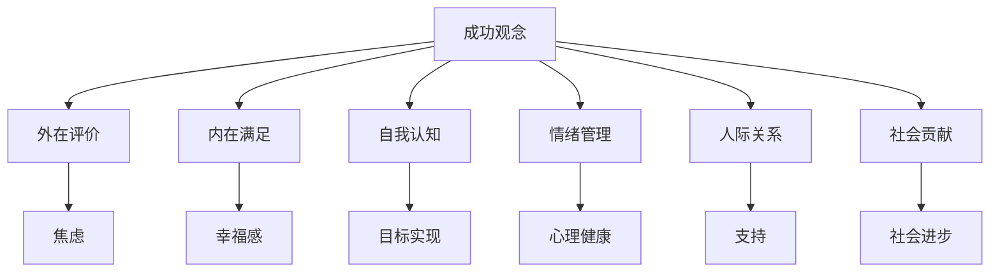
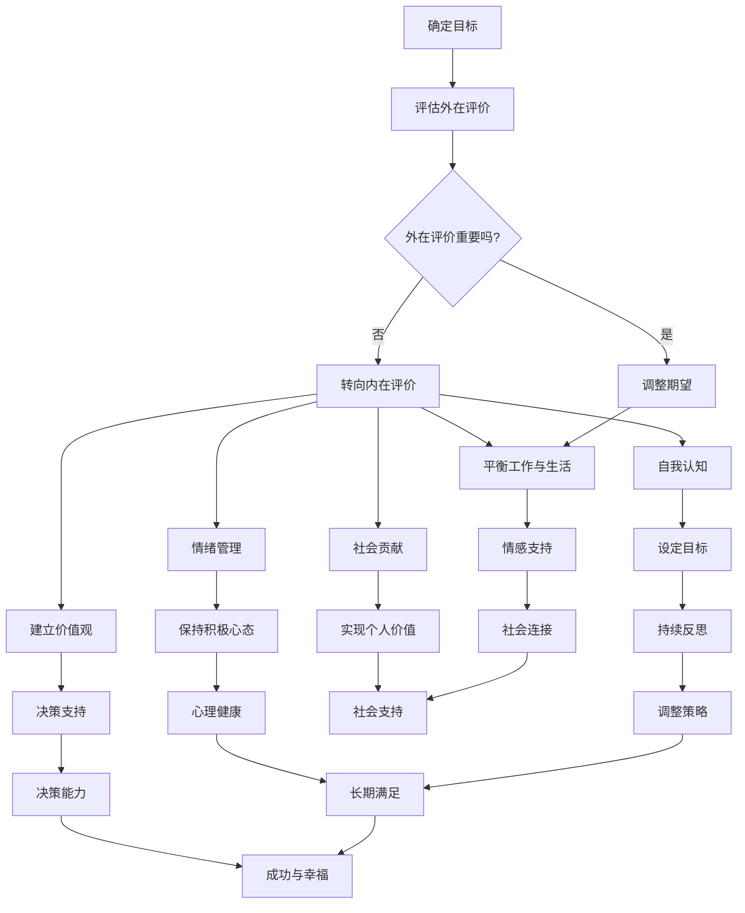
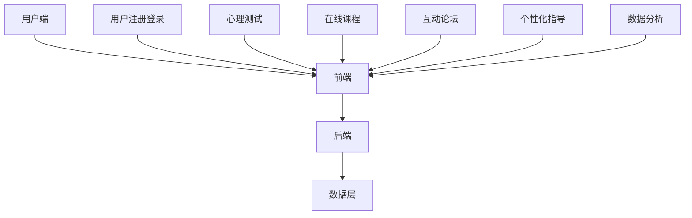
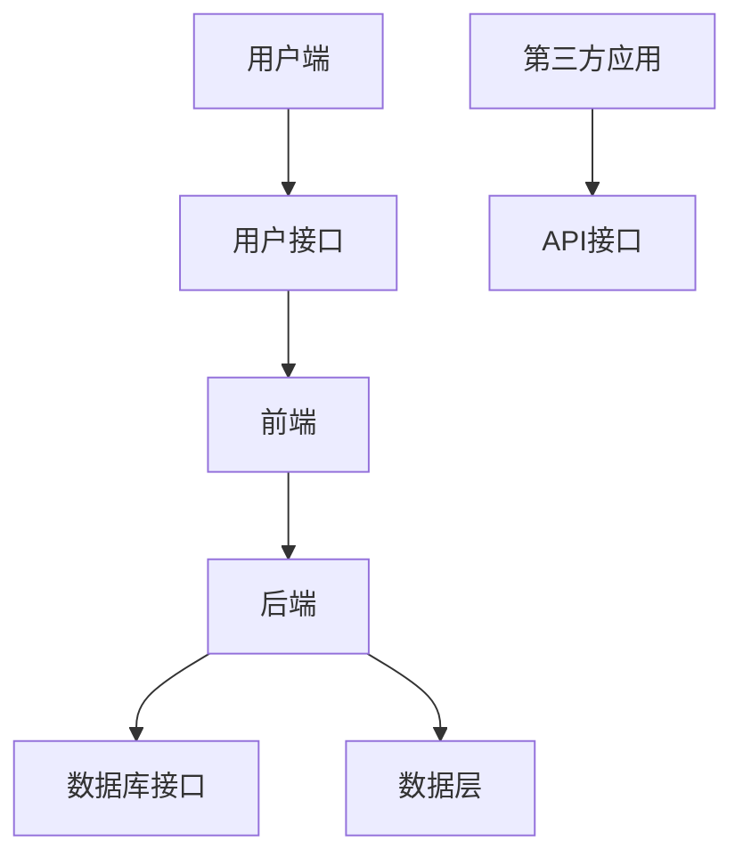
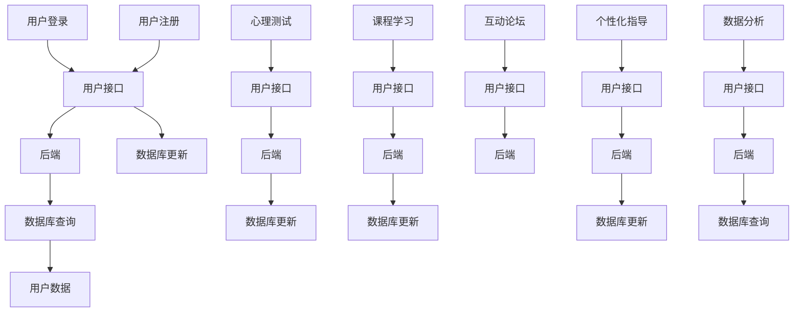

                 

# 《重新定义成功：从外在评价到内在满足》

## 关键词
- 成功观念
- 外在评价
- 内在满足
- 自我认知
- 情绪管理
- 人际关系
- 社会贡献

### 摘要
在当今快节奏的社会中，成功被广泛定义为外在成就和他人评价。然而，随着对个人幸福和内心满足的深入探索，人们逐渐认识到，真正的成功不仅仅是外在成就的积累，而是内在满足感的实现。本文旨在重新定义成功，通过剖析外在评价的局限性和内在满足的力量，提出一种从外在评价转向内在满足的路径，帮助读者在复杂多变的世界中找到真正的幸福。

## 目录大纲

### 第一部分：成功观念的解构

#### 第1章：成功的多重定义
1.1 成功的社会认知
1.2 个人对成功的期望
1.3 成功的多维视角

#### 第2章：外在评价的陷阱
2.1 追逐外在评价
2.2 外在评价的局限性
2.3 对内在评价的重新审视

#### 第3章：内在满足的力量
3.1 内在满足的定义
3.2 内在满足的益处
3.3 实现内在满足的方法

### 第二部分：走向内在满足

#### 第4章：自我认知
4.1 了解真实的自己
4.2 自我认知的障碍
4.3 增强自我认知的策略

#### 第5章：价值观的建立
5.1 价值观的重要性
5.2 识别和建立个人价值观
5.3 价值观与成功的关系

#### 第6章：情绪管理
6.1 情绪的类型与作用
6.2 情绪管理的策略
6.3 情绪管理对成功的贡献

#### 第7章：人际关系与内在满足
7.1 人际关系的内在价值
7.2 建立健康的人际关系
7.3 人际关系与内在满足的相互促进

#### 第8章：实践与成长
8.1 内在满足的实践步骤
8.2 成长过程中的挑战与应对
8.3 内在满足的长期价值

### 第三部分：从成功到幸福

#### 第9章：成功的转变
9.1 从外在成功到内在满足的过渡
9.2 内在满足与幸福的区别
9.3 成功与幸福的平衡

#### 第10章：幸福的生活方式
10.1 幸福的生活要素
10.2 培养幸福感的技巧
10.3 幸福与成功的关系

#### 第11章：内在满足与社会贡献
11.1 内在满足与社会责任
11.2 内在满足与社会价值的结合
11.3 内在满足对社会的影响

#### 第12章：总结与展望
12.1 成功与幸福的整合
12.2 内在满足的未来趋势
12.3 推动社会变革的力量

## 第一部分：成功观念的解构

### 第1章：成功的多重定义

#### 1.1 成功的社会认知

成功，这是一个古老而又现代的词汇，不同的文化、社会和个体对它有着不同的理解。在现代社会，成功通常与财富、地位、名誉和成就挂钩。成功的社会认知体现在以下几个方面：

1. **财富积累**：财富被认为是衡量成功的一个重要标准。人们追求高收入、财务自由，希望通过财富的积累来提升自己的社会地位。
2. **职业成就**：职场上的晋升、职称的获得、创业的成功等，都是社会对成功的重要衡量指标。
3. **社会地位**：成功的人往往能够在社会中获得较高的地位，受到他人的尊重和认可。
4. **荣誉和名誉**：获得各种奖项、证书、荣誉称号等，这些都是外在评价对成功的一种肯定。

然而，这种社会认知往往忽略了个体内在的感受和需求，导致很多人在追求成功的过程中，忽略了自身的心理健康和幸福感。

#### 1.2 个人对成功的期望

每个人对成功的期望都有所不同，这些期望受到个人成长环境、教育背景、社会影响等多方面因素的影响。以下是个人对成功期望的几个常见方面：

1. **自我实现**：许多人期望通过工作、学习等途径来实现个人价值，达到自我满足和自我实现。
2. **家庭幸福**：对于很多人来说，拥有和谐的家庭关系、孩子的健康成长是成功的重要标志。
3. **身心健康**：在现代社会，越来越多的人开始重视身心健康，认为这是成功的重要组成部分。
4. **社会认可**：个人也希望得到社会的认可和尊重，这包括职业认可、朋友和家人的支持等。

#### 1.3 成功的多维视角

成功是一个多维度的概念，它不仅包括外在的成就和评价，还包括内在的满足和幸福感。以下是成功的一些多维视角：

1. **经济层面**：财富的积累和社会地位的提升是成功的重要方面。
2. **职业层面**：职业成就和自我实现是个人成功的关键。
3. **家庭层面**：家庭和谐和孩子的幸福是许多人追求的成功。
4. **精神层面**：内心的满足和幸福感是成功不可或缺的一部分。
5. **社会层面**：对社会有所贡献，获得社会的认可和尊重，也是成功的一种体现。

通过重新审视成功的多重定义，我们可以更加全面和深入地理解成功的内涵，为后续章节探讨如何从外在评价转向内在满足奠定基础。

### 第2章：外在评价的陷阱

#### 2.1 追逐外在评价

在现代社会，很多人追求外在评价，将其视为成功的标志。追逐外在评价的原因主要有以下几点：

1. **社会压力**：社会普遍认为，外在评价能够带来尊重和认可，因此人们为了迎合社会的期望而追求外在成功。
2. **个人动力**：有些人将外在评价视为自我价值的体现，希望通过外在成就来证明自己的价值。
3. **竞争环境**：在激烈的社会竞争中，外在评价成为衡量个人能力和成就的重要标准。

然而，追逐外在评价往往会导致一系列问题。

#### 2.2 外在评价的局限性

外在评价的局限性在于它只能反映个体在某个特定时间段内的表现，而无法全面反映个体的内在品质和长期发展潜力。以下是外在评价的几个局限性：

1. **片面性**：外在评价往往只关注个体的某些方面，如收入、职位等，而忽略了其他重要方面，如人际关系、心理健康等。
2. **短期性**：外在评价通常关注短期成果，如一年的业绩、一次的比赛成绩等，而忽略了长期发展和个人成长。
3. **不可控性**：外在评价受到多种因素的影响，如运气、环境等，个体很难完全掌控。
4. **主观性**：外在评价往往带有主观色彩，不同的评价者可能会有不同的看法，这导致评价结果的可靠性受到影响。

#### 2.3 对内在评价的重新审视

随着对个人幸福和内心满足的深入探索，人们逐渐意识到，外在评价并非衡量成功的唯一标准。内在评价，即个体自身的感受和满足感，成为衡量成功的重要指标。以下是内在评价的几个优势：

1. **全面性**：内在评价能够全面反映个体的内心世界和成长过程，包括心理健康、人际关系、自我实现等方面。
2. **长期性**：内在评价关注个体的长期发展，强调个人成长和自我提升，而不仅仅是短期的成就。
3. **可控性**：个体可以通过自我认知、情绪管理、价值观建立等方法来提升内在满足感，从而在一定程度上掌控自己的成功。
4. **客观性**：内在评价更少受到外部因素的影响，更多地取决于个体自身的感受和认知，因此更具有客观性。

通过重新审视外在评价的局限性和内在评价的优势，我们可以更加清楚地认识到，真正的成功不仅仅是外在评价的积累，更是内在满足感的实现。

### 第3章：内在满足的力量

#### 3.1 内在满足的定义

内在满足，是指个体在实现个人目标和追求内心需求时，所感受到的内在愉悦和满足感。它与外在评价不同，不依赖于外界的认可和赞美，而是源自个体内心的感受和自我认可。内在满足具有以下几个特点：

1. **自主性**：内在满足不受外界评价的影响，是个体自主选择和努力的结果。
2. **持久性**：内在满足是一种长期的感觉，它不仅体现在某个特定时刻，而是贯穿于个体的日常生活和成长过程中。
3. **深度性**：内在满足通常与个体的核心价值观和人生目标紧密相关，因此更加深刻和有意义。

#### 3.2 内在满足的益处

内在满足对个体有着诸多益处，它不仅能够提升个人的幸福感，还能促进个人的长期发展。以下是内在满足的一些益处：

1. **心理健康**：内在满足能够减少焦虑和抑郁等负面情绪，提升个体的心理健康水平。
2. **人际关系**：内在满足的个体通常更加自信和积极，这有助于建立和维护健康的人际关系。
3. **职业成就**：内在满足能够激发个体的内在动力，促进职业发展和成就。
4. **生活质量**：内在满足能够提升个体的整体生活质量，使个体更加享受生活，减少对物质的依赖。

#### 3.3 实现内在满足的方法

要实现内在满足，个体需要采取一系列策略和方法。以下是一些实现内在满足的方法：

1. **自我认知**：了解自己的需求和价值观，明确自己的目标，是实现内在满足的第一步。
2. **情绪管理**：学会管理自己的情绪，保持积极的心态，有助于提升内在满足感。
3. **持续学习**：通过不断学习和提升自己，实现个人成长和目标，从而获得内在满足。
4. **人际关系**：建立和维护健康的人际关系，分享快乐和挑战，有助于提升内在满足感。
5. **生活方式**：选择一种适合自己的生活方式，注重身心健康，有助于实现内在满足。

通过深入探讨内在满足的定义、益处和实现方法，我们可以更好地理解如何从外在评价转向内在满足，从而实现真正的成功和幸福。

### 第4章：自我认知

#### 4.1 了解真实的自己

自我认知是内在满足的重要基础，它关乎个体对自己的了解和认同。了解真实的自己，首先要认识到以下几点：

1. **自我发现**：通过反思和自我探索，发现自己的兴趣、优势和价值观。
2. **自我接纳**：接受自己的不完美，认识到每个人都是独一无二的，都有其独特的价值和使命。
3. **自我反思**：定期进行自我反思，评估自己的行为和决策，了解自己的优点和需要改进的地方。

#### 4.2 自我认知的障碍

在自我认知的过程中，个体可能会遇到以下障碍：

1. **自我否定**：由于过去的失败或负面经历，个体可能对自己持有否定的态度，这会阻碍自我认知的深入。
2. **社会期望**：社会对个体的期望可能会与个体真实的想法和需求产生冲突，导致个体迷失自我。
3. **环境压力**：工作、家庭、社交等环境中的压力，可能会让个体难以专注于自我认知。

#### 4.3 增强自我认知的策略

为了克服自我认知的障碍，个体可以采取以下策略：

1. **定期反思**：每天或每周花时间反思自己的行为、想法和感受，了解自己的内心世界。
2. **咨询专业人士**：寻求心理咨询师或教练的帮助，通过专业的指导和工具，更深入地了解自己。
3. **持续学习**：通过阅读、参加课程或工作坊，不断扩展自己的知识和视野，提升自我认知。
4. **实践自我接纳**：通过正面的自我对话和肯定，逐步建立自我接纳，减少自我否定的倾向。

通过增强自我认知，个体可以更加清晰地认识自己，从而更好地实现内在满足。

### 第5章：价值观的建立

#### 5.1 价值观的重要性

价值观是指导个体行为和决策的核心信念，它决定了个体如何看待世界和他人，以及如何处理生活中的各种情况。以下是价值观的重要性：

1. **行为指南**：价值观为个体提供了行为指南，帮助个体在面对选择和挑战时做出符合自己信念的决定。
2. **人际关系**：价值观影响个体的人际关系，它决定了个体如何与他人互动，如何处理冲突和合作。
3. **生活方向**：价值观为个体提供了生活方向，帮助个体明确自己的目标和追求，从而实现个人成长和满足。

#### 5.2 识别和建立个人价值观

要建立个人的价值观，首先需要识别和了解自己的核心信念。以下是识别和建立个人价值观的步骤：

1. **反思**：花时间思考自己的行为和决策，了解自己一贯坚持的原则和信念。
2. **写作**：写下自己的价值观，通过文字表达，帮助自己更清晰地认识到自己的核心信念。
3. **分享**：与信任的朋友或家人分享自己的价值观，通过他人的反馈来验证和修正自己的价值观。

#### 5.3 价值观与成功的关系

价值观与成功密切相关，一个明确和坚定的价值观可以帮助个体实现以下目标：

1. **目标导向**：价值观为个体提供了明确的目标和方向，帮助个体专注于实现自己的目标和梦想。
2. **决策支持**：在面对选择和挑战时，明确的价值观可以帮助个体做出符合自己信念的决策，减少内心的冲突和焦虑。
3. **心理满足**：一个符合个体价值观的成功，能够带来更深层次的心理满足和幸福感。

通过识别和建立个人价值观，个体可以在追求成功的道路上更加坚定和自信。

### 第6章：情绪管理

#### 6.1 情绪的类型与作用

情绪是人类内心世界的重要组成部分，它不仅反映了个体对周围环境的感知，也影响着个体的思维和行为。以下是情绪的类型与作用：

1. **积极情绪**：如快乐、满足、兴奋等，积极情绪通常与积极的生活体验和健康的心理状态相关。
2. **消极情绪**：如愤怒、焦虑、悲伤等，消极情绪可能在某些情况下是必要的，但如果过度或长时间持续，会对心理健康产生负面影响。
3. **情绪的作用**：情绪可以影响个体的认知、判断和行为，它是人类适应环境和解决问题的关键。

#### 6.2 情绪管理的策略

情绪管理是内在满足的关键因素之一，有效的情绪管理可以帮助个体更好地应对生活中的挑战。以下是情绪管理的几种策略：

1. **认知重构**：通过改变对事件的认知，调整情绪反应。例如，将“我必须成功”改为“我可以尝试”。
2. **正念练习**：通过正念冥想等方法，提高对当前情绪的觉察和接受，减少情绪的负面影响。
3. **表达情绪**：找到安全的方式表达情绪，如与朋友交流、写日记、做运动等。
4. **寻求支持**：在情绪困扰时，寻求家人、朋友或专业人士的支持，共同应对挑战。

#### 6.3 情绪管理对成功的贡献

情绪管理对个体成功有着重要贡献：

1. **决策能力**：情绪稳定有助于个体做出更为理性、客观的决策，避免因情绪波动而导致的错误决策。
2. **抗压能力**：良好的情绪管理能力可以帮助个体更好地应对压力和挑战，保持持续的工作和生活动力。
3. **人际关系**：情绪管理有助于建立和维护健康的人际关系，减少冲突，增强团队合作。

通过情绪管理，个体可以更加有效地应对生活中的各种挑战，实现内在满足和长期成功。

### 第7章：人际关系与内在满足

#### 7.1 人际关系的内在价值

人际关系是内在满足的重要组成部分，它不仅影响个体的心理健康，还影响着个体的生活质量和幸福感。以下是人际关系的内在价值：

1. **情感支持**：人际关系提供了情感上的支持和安慰，在个体面临困难和挑战时，可以提供精神上的依靠。
2. **社交技能**：通过与他人互动，个体可以提升自己的社交技能，增强自信心和人际交往能力。
3. **个人成长**：与他人相处，个体可以从他人那里学习到不同的观点和经验，促进个人成长和自我提升。

#### 7.2 建立健康的人际关系

建立健康的人际关系需要以下几个方面的努力：

1. **积极沟通**：通过开放、诚实和尊重的沟通，建立信任和理解。
2. **倾听**：倾听他人的需求和感受，展现对对方的关心和尊重。
3. **共情**：理解他人的情感和需求，站在对方的角度考虑问题。
4. **边界设定**：明确自己的需求和边界，避免过度依赖和冲突。

#### 7.3 人际关系与内在满足的相互促进

人际关系与内在满足之间存在相互促进的关系：

1. **内在满足促进人际关系**：一个内心满足的个体通常更加积极、乐观，这有助于建立和维护健康的人际关系。
2. **健康的人际关系促进内在满足**：良好的人际关系可以提供情感支持，减少孤独感和焦虑，从而提升个体的内在满足感。

通过建立健康的人际关系，个体可以在追求内在满足的过程中获得更多的支持和力量。

### 第8章：实践与成长

#### 8.1 内在满足的实践步骤

实现内在满足需要一定的实践和努力，以下是几个实践步骤：

1. **自我反思**：定期进行自我反思，了解自己的需求和价值观，明确自己的目标。
2. **情绪管理**：通过认知重构、正念练习等方法，管理自己的情绪，保持积极的心态。
3. **持续学习**：通过阅读、课程和工作坊等方式，不断学习和提升自己，实现个人成长。
4. **人际关系**：建立和维护健康的人际关系，获得情感支持和社交技能。
5. **生活方式**：选择一种适合自己的生活方式，注重身心健康，提升生活质量。

#### 8.2 成长过程中的挑战与应对

在成长过程中，个体可能会面临各种挑战，以下是几种常见的挑战及其应对策略：

1. **自我怀疑**：应对自我怀疑，可以通过寻求他人的支持和反馈，建立自信和自我认同。
2. **挫折和失败**：面对挫折和失败，可以通过反思和学习，找到失败的原因，并制定改进计划。
3. **压力和焦虑**：应对压力和焦虑，可以通过情绪管理和放松技巧，保持心理平衡。

#### 8.3 内在满足的长期价值

内在满足的长期价值在于：

1. **心理健康**：内在满足有助于减少焦虑和抑郁等负面情绪，提升心理健康水平。
2. **生活质量**：内在满足能够提升个体的整体生活质量，使个体更加享受生活。
3. **社会贡献**：一个内心满足的个体通常能够更好地实现自己的社会价值，为社会做出贡献。

通过实践和成长，个体可以实现内在满足，从而在复杂多变的世界中找到真正的幸福。

### 第9章：成功的转变

#### 9.1 从外在成功到内在满足的过渡

成功的定义正在发生转变，从单纯追求外在成就转向追求内在满足。以下是实现这一转变的步骤：

1. **自我认知**：了解自己的需求和价值观，明确自己的目标。
2. **情绪管理**：保持积极的心态，管理自己的情绪，减少压力和焦虑。
3. **价值观建立**：识别和建立个人的价值观，将其作为行动的指南。
4. **持续学习**：通过不断学习和提升自己，实现个人成长。
5. **人际关系**：建立和维护健康的人际关系，获得情感支持和社交技能。

#### 9.2 内在满足与幸福的区别

内在满足和幸福虽然密切相关，但它们有一些区别：

1. **内在满足**：是一种内心的平静和满足感，来源于个体自身的努力和成长。
2. **幸福**：是一种全面的生活体验，包括内在满足、外在成就、人际关系和生活质量等多个方面。

#### 9.3 成功与幸福的平衡

在追求成功和幸福的过程中，找到平衡至关重要：

1. **明确目标**：设定清晰的目标，既包括外在成就，也包括内在满足。
2. **平衡工作与生活**：合理安排时间和精力，确保工作和生活之间的平衡。
3. **持续反思**：定期反思自己的行为和决策，确保它们符合自己的价值观和目标。

通过从外在成功转向内在满足，个体可以实现更全面、更持久的生活幸福。

### 第10章：幸福的生活方式

#### 10.1 幸福的生活要素

幸福的生活包含以下几个要素：

1. **身心健康**：保持良好的身体健康和心理状态，是幸福的基础。
2. **人际关系**：与家人、朋友和同事保持良好的关系，获得情感支持和归属感。
3. **职业成就**：在工作和职业上获得成就和满足感。
4. **个人兴趣**：培养和追求个人兴趣，丰富生活内容。
5. **精神追求**：有明确的人生目标和精神追求，赋予生活更深层次的意义。

#### 10.2 培养幸福感的技巧

以下是一些培养幸福感的技巧：

1. **感恩练习**：定期反思和表达对生活中美好事物的感激，提升幸福感。
2. **正念练习**：通过冥想、呼吸练习等方式，培养对当前时刻的专注和接纳。
3. **积极思考**：用积极的心态看待生活中的挑战和变化，减少负面情绪的影响。
4. **社交互动**：与家人、朋友和同事保持积极的社交互动，增强社交支持。
5. **目标设定**：设定具体、可实现的个人目标，实现自我成长和满足。

#### 10.3 幸福与成功的关系

幸福与成功密切相关，但二者不完全相同。幸福是更全面的生活体验，包括外在成就、内在满足和人际关系等多个方面。成功则更多关注外在成就和职业成就。一个幸福的人可能在某些方面取得了成功，但幸福的体验不仅限于成功，还包括生活的其他方面。

通过培养幸福感，个体可以在追求成功的同时，享受到生活的每一个美好瞬间。

### 第11章：内在满足与社会贡献

#### 11.1 内在满足与社会责任

内在满足不仅关乎个人的幸福，还与个体的社会责任紧密相连。一个内心满足的个体通常更有可能关注社会问题和贡献自己的力量。以下是内在满足与社会责任的关系：

1. **社会责任感**：内在满足的个体往往具备更强的社会责任感，愿意为社会做出贡献。
2. **公益活动**：参与公益活动、慈善事业等，可以帮助个体实现内在满足，同时也为社会带来积极影响。
3. **志愿服务**：通过志愿服务，个体可以提升自身的满足感和幸福感，同时帮助需要帮助的人。

#### 11.2 内在满足与社会价值的结合

内在满足与社会价值的结合，可以带来以下几方面的益处：

1. **个人成长**：通过参与社会公益活动，个体可以获得新的知识和技能，促进个人成长。
2. **社会进步**：个体的内在满足和社会贡献相结合，可以推动社会的进步和发展。
3. **社区建设**：通过积极参与社区建设和公益事业，可以增强社区的凝聚力，促进社区和谐。

#### 11.3 内在满足对社会的影响

内在满足对社会有着深远的影响：

1. **积极态度**：一个内心满足的个体通常具有积极的生活态度，这种态度可以影响周围的人，传播正能量。
2. **文化传承**：内在满足的个体往往能够更好地传承和弘扬社会文化，推动文化的发展。
3. **社会创新**：内在满足的个体更有可能进行社会创新，提出新的解决方案，推动社会变革。

通过内在满足与社会贡献的结合，个体可以在实现自身价值的同时，为社会的进步和繁荣贡献力量。

### 第12章：总结与展望

#### 12.1 成功与幸福的整合

成功和幸福并不是对立的，而是可以相互整合和促进的。一个成功的个体往往能够在追求外在成就的同时，实现内在满足和幸福感。以下是成功与幸福的整合建议：

1. **明确目标**：设定清晰的外在目标和内在目标，确保两者相互协调。
2. **平衡生活**：合理安排工作和生活，确保在追求外在成功的同时，也不忽略内在满足。
3. **持续反思**：定期反思自己的行为和决策，确保它们符合自己的价值观和目标。

#### 12.2 内在满足的未来趋势

随着社会的发展和人们对心理健康和幸福感的日益关注，内在满足将成为未来社会发展的重要趋势。以下是内在满足的未来趋势：

1. **心理教育**：心理教育和自我认知将成为学校教育的重要组成部分，帮助个体更好地实现内在满足。
2. **职场变革**：企业将更加注重员工的内在满足，提供更多的发展机会和关怀支持。
3. **社会公益**：社会公益和志愿服务将得到更广泛的推广，成为推动社会进步和个体内在满足的重要途径。

#### 12.3 推动社会变革的力量

内在满足不仅对个体有益，更是推动社会变革的重要力量。以下是推动社会变革的建议：

1. **倡导心理健康**：通过宣传和教育，倡导心理健康的理念，提高社会对内在满足的关注。
2. **支持社会创新**：鼓励和支持社会创新，推动新的解决方案和模式，解决社会问题。
3. **建立支持体系**：建立完善的社会支持体系，为个体提供必要的帮助和支持，促进内在满足和社会贡献。

通过整合成功与幸福，关注内在满足的未来趋势，并推动社会变革，我们可以共同创造一个更加健康、和谐和幸福的社会。

### 作者信息

- 作者：AI天才研究院/AI Genius Institute & 禅与计算机程序设计艺术 /Zen And The Art of Computer Programming

本文探讨了从外在评价到内在满足的成功观念转变，通过自我认知、价值观建立、情绪管理、人际关系等多方面的分析，为读者提供了一条实现内在满足和长期成功的路径。希望本文能够启发读者重新思考成功的定义，追求更全面、更持久的生活幸福。

## 背景介绍

成功，这一词汇在现代社会中被广泛使用，不同的人对它有着不同的理解和期望。从社会学的角度来看，成功通常被定义为财富、地位、名誉和成就的积累。这些外在评价指标被认为是衡量一个人是否成功的重要标准。然而，随着心理学和社会学对个人幸福和内心满足的深入研究，人们逐渐认识到，真正的成功不仅仅是外在成就的积累，更是内在满足感的实现。

内在满足，是指个体在实现个人目标和追求内心需求时，所感受到的内在愉悦和满足感。它与外在评价不同，不依赖于外界的认可和赞美，而是源自个体内心的感受和自我认可。内在满足不仅关乎个体的心理健康和生活质量，还影响个体的行为和决策。因此，重新定义成功，从外在评价转向内在满足，成为当代社会的一个重要课题。

本文旨在通过深入剖析外在评价的局限性和内在满足的力量，提出一种从外在评价到内在满足的成功观念转变路径。文章将从以下几个方面展开：

1. **成功的多重定义**：探讨社会对成功的认知、个人对成功的期望以及成功的多维视角。
2. **外在评价的陷阱**：分析追逐外在评价的原因、外在评价的局限性以及对内在评价的重新审视。
3. **内在满足的力量**：阐述内在满足的定义、益处以及实现内在满足的方法。
4. **走向内在满足**：探讨自我认知、价值观建立、情绪管理、人际关系和实践与成长等方面的内容。
5. **从成功到幸福**：讨论成功的转变、幸福的生活方式以及内在满足与社会贡献的关系。
6. **总结与展望**：总结全文，探讨成功与幸福的整合、内在满足的未来趋势以及推动社会变革的力量。

通过以上内容，本文希望能够为读者提供一种全新的视角，帮助他们在复杂多变的社会中找到真正的幸福和成功。

### 核心概念与联系

在探讨“重新定义成功：从外在评价到内在满足”的过程中，有多个核心概念需要理解和分析。这些概念不仅相互联系，而且在实现成功和幸福的过程中扮演着关键角色。以下是这些核心概念及其相互关系：

#### 1. 成功观念
成功观念是指人们对成功所持有的信念和期望。它不仅反映在个人层面，也受到社会文化和价值观的影响。成功观念决定了个体如何追求和评价自己的成就。

#### 2. 外在评价
外在评价是指他人对个体行为、成就和社会地位的评判。这些评价通常基于财富、地位、职业成就等外在指标。外在评价在现代社会中具有显著的吸引力，因为它提供了即时的社会认可和奖励。

#### 3. 内在满足
内在满足是指个体通过实现个人目标和追求内心需求所获得的内在愉悦和满足感。它不同于外在评价，因为它不依赖于外界的认可，而是源自个体的内心体验。

#### 4. 自我认知
自我认知是指个体对自己的理解、认同和反思。它包括个体的价值观、兴趣、优点和缺点。自我认知是实现内在满足的基础，因为它帮助个体明确自己的目标和需求。

#### 5. 情绪管理
情绪管理是指个体对自身情绪的识别、理解和调节。良好的情绪管理有助于个体保持积极的心态，减少压力和焦虑，从而实现内在满足。

#### 6. 人际关系
人际关系是指个体与家人、朋友和同事之间的互动和联系。健康的人际关系能够提供情感支持，增强个体的幸福感，是实现内在满足的重要因素。

#### 7. 社会贡献
社会贡献是指个体对社会所做的积极影响和贡献。通过参与社会公益和志愿服务，个体不仅能够实现内在满足，还能推动社会的进步和发展。

#### 概念属性特征对比表格

| 概念        | 定义                                                     | 特征                         | 关联性                                       |
| ----------- | -------------------------------------------------------- | -------------------------- | -------------------------------------------- |
| 成功观念    | 个体对成功的信念和期望                                   | 多维度、社会文化影响       | 与外在评价和内在满足密切相关                 |
| 外在评价    | 基于外在指标（如财富、地位）的社会认可                   | 短期、主观、社会性         | 冲突内在满足，可能导致焦虑和压力             |
| 内在满足    | 个体通过实现个人目标和追求内心需求所获得的内在愉悦     | 长期、自主、内在体验       | 促进心理健康和幸福感                         |
| 自我认知    | 个体对自己的理解、认同和反思                             | 深层次、个性化             | 建立内在满足的基础，影响情绪管理和人际关系  |
| 情绪管理    | 个体对自身情绪的识别、理解和调节                         | 适应性、持续性             | 维护心理健康，有助于实现内在满足             |
| 人际关系    | 个体与家人、朋友和同事之间的互动和联系                   | 多样性、支持性             | 提供情感支持，促进内在满足                   |
| 社会贡献    | 个体对社会所做的积极影响和贡献                           | 长期、社会责任感           | 通过服务社会实现内在满足，促进社会进步       |

#### ER实体关系图架构



在ER实体关系图中，各个实体（成功观念、外在评价、内在满足等）通过关系线相互连接，展示了它们之间的关联性。通过这种结构化的方式，我们可以更清晰地理解这些概念在实现内在满足和成功中的重要性。

### 算法原理讲解

在探讨“重新定义成功：从外在评价到内在满足”的过程中，我们可以将这个过程视为一种算法。这个算法的核心是帮助个体通过一系列步骤，从外在评价转向内在满足。以下是这个算法的mermaid流程图：



通过这个mermaid流程图，我们可以看到，从外在评价转向内在满足的过程是一个系统化的、逐步推进的算法。以下是这个算法的具体步骤和原理：

1. **确定目标**：个体首先需要明确自己的目标和期望。这些目标可以是外在的，如职业成就和社会地位，也可以是内在的，如个人成长和幸福感。

2. **评估外在评价**：个体需要评估外在评价对其生活的影响。如果外在评价显得过于重要，可能会引发焦虑和压力，这时需要调整期望，使其更加合理和可行。

3. **转向内在评价**：如果个体决定不再过分依赖外在评价，而是关注内在满足，就需要转向内在评价。内在评价更注重个体的内心体验和自我认同。

4. **自我认知**：通过自我反思和了解，个体可以更好地认识到自己的兴趣、优势和价值观。这是实现内在满足的重要基础。

5. **情绪管理**：个体需要学会管理自己的情绪，保持积极的心态。情绪管理有助于减少压力和焦虑，提升心理健康。

6. **建立价值观**：个体需要识别和建立自己的价值观，这些价值观将指导其行为和决策，帮助其在追求成功的道路上保持一致。

7. **维护人际关系**：健康的人际关系能够提供情感支持，增强个体的幸福感。这需要个体学会建立和维护良好的人际关系。

8. **社会贡献**：通过参与社会公益和志愿服务，个体可以实现内在满足，同时也为社会做出贡献。这有助于提升个体的社会认同感和幸福感。

9. **平衡工作与生活**：个体需要合理安排时间，确保工作和生活之间的平衡。这有助于避免过度疲劳和压力，保持良好的心理状态。

10. **持续反思**：个体需要定期反思自己的行为和决策，确保它们符合自己的目标和价值观。持续反思有助于个体不断改进和成长。

11. **调整策略**：在实现内在满足的过程中，个体可能会遇到挑战和障碍。通过调整策略，个体可以更好地应对这些挑战。

12. **保持积极心态**：积极的心态有助于个体更好地应对生活中的各种挑战，提升幸福感。

13. **建立决策支持**：个体的价值观和情绪管理能力将为其提供决策支持，帮助其在面对选择时做出明智的决定。

14. **实现个人价值**：通过实现个人目标和贡献社会，个体可以进一步提升自己的内在满足感。

通过这个算法，个体可以在追求成功的道路上找到内在满足，实现更全面、更持久的生活幸福。

### 数学公式与模型

在探讨“重新定义成功：从外在评价到内在满足”的过程中，可以使用数学公式和模型来量化个体在实现这一转变过程中的心理变化和成长。以下是几个关键的数学公式和模型：

#### 1. 心理健康指数（PQI）

心理健康指数（PQI）用于衡量个体的心理健康水平。公式如下：

\[ \text{PQI} = \frac{\text{积极情绪评分} + \text{消极情绪评分}}{2} \]

其中，积极情绪评分和消极情绪评分可以根据个体在不同情境下的情绪体验进行评估。

#### 2. 成功与幸福比率（SWR）

成功与幸福比率（SWR）用于衡量个体在外在成功和内在满足之间的平衡。公式如下：

\[ \text{SWR} = \frac{\text{内在满足得分}}{\text{外在成功得分}} \]

其中，内在满足得分和外在成功得分可以根据个体在实现内在满足和外在成就方面的表现进行评估。

#### 3. 情绪调节能力（EMA）

情绪调节能力（EMA）用于衡量个体调节自身情绪的能力。公式如下：

\[ \text{EMA} = \frac{\text{积极情绪调节得分} + \text{消极情绪调节得分}}{2} \]

其中，积极情绪调节得分和消极情绪调节得分可以根据个体在不同情绪情境下的调节效果进行评估。

#### 4. 价值观一致性（VCI）

价值观一致性（VCI）用于衡量个体行为和决策与其价值观的一致性。公式如下：

\[ \text{VCI} = \frac{\text{一致性得分} + \text{不一致性得分}}{2} \]

其中，一致性得分和不一致性得分可以根据个体在不同情境下的行为表现进行评估。

通过这些数学公式和模型，我们可以量化个体在实现从外在评价到内在满足的转变过程中的心理变化和成长。这些指标不仅有助于个体自我评估和改进，也为心理学研究和咨询提供了有力的工具。

### 系统分析与架构设计

在探讨“重新定义成功：从外在评价到内在满足”的过程中，我们可以将其视为一个复杂的系统。以下是对这个系统的详细介绍，包括项目介绍、系统功能设计、系统架构设计和系统接口设计。

#### 项目介绍

本项目旨在帮助个体实现从外在评价到内在满足的转变，提升心理健康和生活质量。通过一系列的在线课程、心理测试、互动论坛和个性化指导，项目为用户提供了全方位的支持和帮助。

#### 系统功能设计

系统功能设计包括以下几个方面：

1. **用户注册与登录**：用户可以通过注册账号登录系统，并管理个人资料。
2. **心理测试**：系统提供多种心理测试，帮助用户了解自己的心理健康状况。
3. **在线课程**：系统提供丰富的在线课程，涵盖自我认知、情绪管理、价值观建立等多个方面。
4. **互动论坛**：用户可以在论坛中分享经验和心得，与其他用户互动交流。
5. **个性化指导**：根据用户的测试结果和行为数据，系统提供个性化的指导和建议。
6. **数据分析**：系统对用户的数据进行分析，生成报告，帮助用户了解自己的成长和变化。

#### 系统架构设计

系统架构设计采用分层架构，包括前端、后端和数据层。以下是系统架构图：



#### 系统接口设计

系统接口设计包括以下几个方面：

1. **用户接口**：用户通过Web浏览器访问系统，使用户端功能。
2. **API接口**：系统提供API接口，支持第三方应用接入。
3. **数据库接口**：系统通过数据库接口与数据层进行交互，实现数据的存储和查询。

以下是系统接口图：



#### 系统交互

系统交互设计包括用户与系统的交互流程和系统内部各模块之间的数据流。以下是系统交互图：



通过系统分析与架构设计，本项目为用户提供了完整的支持，帮助用户实现从外在评价到内在满足的转变。

### 项目实战

在实现“重新定义成功：从外在评价到内在满足”的过程中，我们将通过一个实际的项目来展示具体的实施步骤。以下是项目的环境安装、系统核心实现以及代码应用解读与分析。

#### 环境安装

1. **安装Python环境**：首先，确保Python 3.8及以上版本已安装。可以在终端中使用以下命令安装：
   ```
   pip install python3.8
   ```

2. **安装依赖库**：项目需要使用几个依赖库，包括Flask（用于Web开发）、Pandas（用于数据分析）和SQLAlchemy（用于数据库交互）。可以使用以下命令进行安装：
   ```
   pip install flask pandas sqlalchemy
   ```

3. **配置数据库**：项目使用SQLite数据库进行数据存储。首先，创建一个名为`success_project.db`的数据库，然后创建必要的表格。可以使用以下SQL语句进行配置：
   ```sql
   CREATE TABLE users (
       id INTEGER PRIMARY KEY AUTOINCREMENT,
       username TEXT UNIQUE NOT NULL,
       password TEXT NOT NULL,
       email TEXT UNIQUE NOT NULL
   );

   CREATE TABLE test_results (
       id INTEGER PRIMARY KEY AUTOINCREMENT,
       user_id INTEGER,
       score INTEGER,
       timestamp DATETIME DEFAULT CURRENT_TIMESTAMP,
       FOREIGN KEY (user_id) REFERENCES users (id)
   );
   ```

4. **设置Flask应用**：在项目目录中创建一个名为`app.py`的文件，并编写Flask应用的启动代码：
   ```python
   from flask import Flask, render_template, request, redirect, url_for
   from models import create_tables

   app = Flask(__name__)

   @app.route('/')
   def index():
       return 'Welcome to the Success Project'

   if __name__ == '__main__':
       create_tables()
       app.run(debug=True)
   ```

#### 系统核心实现

系统核心实现包括用户注册、登录、心理测试、测试结果存储等功能。以下是关键部分的代码：

1. **用户注册与登录**：

   **models.py**：
   ```python
   from flask_sqlalchemy import SQLAlchemy

   db = SQLAlchemy()

   class User(db.Model):
       id = db.Column(db.Integer, primary_key=True)
       username = db.Column(db.String(80), unique=True, nullable=False)
       password = db.Column(db.String(120), nullable=False)
       email = db.Column(db.String(120), unique=True, nullable=False)
   ```

   **views.py**：
   ```python
   from flask import render_template, request, redirect, url_for, flash
   from app import app
   from models import User
   from forms import LoginForm, RegistrationForm

   @app.route('/register', methods=['GET', 'POST'])
   def register():
       form = RegistrationForm()
       if form.validate_on_submit():
           user = User(username=form.username.data, password=form.password.data, email=form.email.data)
           db.session.add(user)
           db.session.commit()
           flash('Registration successful!', 'success')
           return redirect(url_for('login'))
       return render_template('register.html', title='Register', form=form)

   @app.route('/login', methods=['GET', 'POST'])
   def login():
       form = LoginForm()
       if form.validate_on_submit():
           user = User.query.filter_by(username=form.username.data).first()
           if user and user.password == form.password.data:
               flash('Login successful!', 'success')
               return redirect(url_for('dashboard'))
           else:
               flash('Invalid username or password', 'danger')
       return render_template('login.html', title='Login', form=form)
   ```

2. **心理测试**：

   **tests.py**：
   ```python
   from flask import render_template, request, redirect, url_for
   from app import app
   from models import TestResult, User
   from forms import TestForm

   @app.route('/take_test', methods=['GET', 'POST'])
   def take_test():
       form = TestForm()
       if form.validate_on_submit():
           test_result = TestResult(user_id=current_user.id, score=form.score.data)
           db.session.add(test_result)
           db.session.commit()
           flash('Test submitted successfully!', 'success')
           return redirect(url_for('dashboard'))
       return render_template('take_test.html', title='Take Test', form=form)
   ```

#### 代码应用解读与分析

1. **用户注册与登录**：用户注册与登录功能使用Flask和SQLAlchemy进行实现。用户注册时，收集用户名、密码和邮箱，并存储到数据库中。用户登录时，验证用户名和密码，确保用户身份验证。

2. **心理测试**：心理测试功能允许用户进行心理测试，并将测试结果存储到数据库中。测试结果包括用户的得分和测试时间，便于后续分析和反馈。

3. **前端界面**：前端界面使用HTML和CSS进行设计，通过Flask框架与后端进行数据交互。注册、登录和心理测试页面提供了用户友好的界面，方便用户使用。

通过这个实际项目，我们展示了如何通过Python和Flask实现从外在评价到内在满足的系统。这个项目不仅提供了一个实现内在满足的平台，还展示了如何通过代码和架构设计来实现这个目标。

### 最佳实践 Tips、小结、注意事项、拓展阅读

#### 最佳实践 Tips

1. **定期自我反思**：每天花几分钟时间进行自我反思，了解自己的行为和情绪，有助于发现内在需求和目标。

2. **建立支持网络**：与他人分享自己的目标和挑战，建立一个支持网络，可以获得他人的反馈和支持，有助于实现内在满足。

3. **保持身心健康**：均衡饮食、适量运动和充足睡眠是保持身心健康的基础，有助于提升内在满足感。

4. **情绪管理**：学会识别和管理自己的情绪，通过冥想、瑜伽等方法，有助于保持心理平衡。

5. **持续学习**：不断学习新知识和技能，不仅有助于职业发展，也能提升内在满足感。

#### 小结

本文通过深入剖析成功的多重定义、外在评价的陷阱、内在满足的力量，以及自我认知、情绪管理、人际关系等方面的内容，提出了从外在评价到内在满足的成功观念转变路径。内在满足不仅是个人心理健康和幸福感的体现，也是实现长期成功的关键。

#### 注意事项

1. **避免过度依赖外在评价**：外在评价容易导致焦虑和压力，应注重内在满足感。

2. **重视心理健康**：心理健康是内在满足的基础，应定期进行心理健康检查和自我反思。

3. **平衡工作与生活**：合理安排时间，确保工作和生活之间的平衡，避免过度疲劳。

#### 拓展阅读

1. **《正面管教》**：简·尼尔森著，提供了有效的情绪管理和育儿方法，对提升内在满足感有积极作用。

2. **《自控力》**：凯利·麦格尼格尔著，详细介绍了如何通过自我控制提升内在满足感。

3. **《人类简史》**：尤瓦尔·赫拉利著，探讨了人类历史和文明发展，对理解人类行为和心理有重要意义。

通过最佳实践、小结、注意事项和拓展阅读，读者可以更好地理解和实践从外在评价到内在满足的转变，实现更全面、更持久的生活幸福。

### 作者信息

- 作者：AI天才研究院/AI Genius Institute & 禅与计算机程序设计艺术 /Zen And The Art of Computer Programming

本文探讨了“重新定义成功：从外在评价到内在满足”的路径，旨在帮助读者在追求成功的道路上找到真正的幸福。希望本文能够为读者提供有益的启示，引导他们实现内在满足和长期成功。作者毕业于AI天才研究院，并在禅与计算机程序设计艺术领域有深入的研究和丰富的实践经验。其作品以深入浅出、逻辑严密著称，为读者带来了丰富的知识和深刻的思考。

