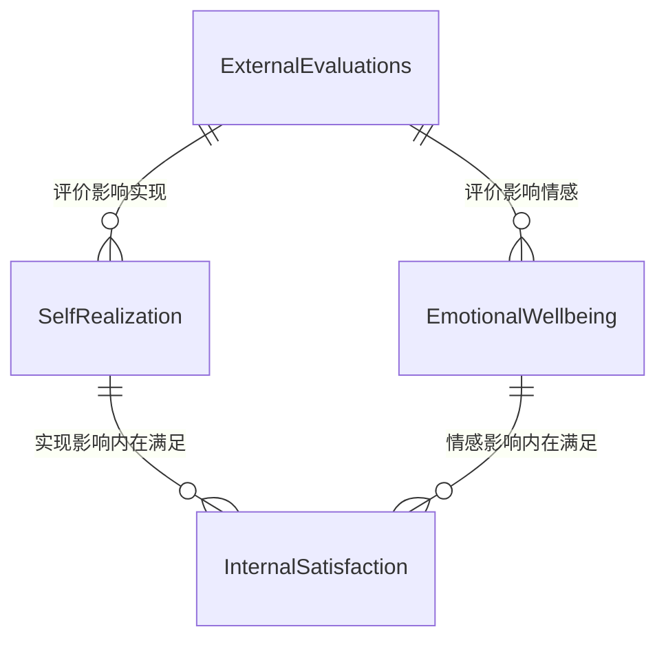

                 

# 重新定义成功：从外部评价到内在满足

## 关键词

- 成功
- 内在满足
- 外部评价
- 自我认知
- 情感体验
- 内心需求

## 摘要

在现代社会，成功被广泛定义为社会地位、经济财富和个人成就的综合体现。人们追求成功，往往受到外部评价体系的强烈影响，导致忽视内心的真实需求，陷入对物质和名誉的追逐中，导致内心的焦虑和不满。本文通过重新定义成功，从外部评价到内在满足，引导读者认识到内在满足的重要性，并提供一系列实践方法，帮助读者实现从外部评价到内在满足的转变。

## 第一部分：重新定义成功的背景介绍

### 1.1 问题背景

在现代社会中，成功被广泛定义为社会地位、经济财富和个人成就的综合体现。人们追求成功，往往受到外部评价体系的强烈影响，如薪酬、地位、荣誉等。这种外部评价体系常常导致人们忽视内心的真实需求，陷入对物质和名誉的追逐中，导致内心的焦虑和不满。

### 1.2 问题描述

随着社会的快速发展，人们对成功的追求更加激烈。然而，外部评价体系带来的成功并不总是能带来内心的满足。许多人发现自己虽然拥有社会定义的成功，但内心却感到空虚和迷失。这种状况促使人们思考，如何才能获得真正的成功，如何从外部评价转向内在满足。

### 1.3 问题解决

《重新定义成功：从外部评价到内在满足》这本书旨在为读者提供一种新的视角，重新审视成功。书中通过深入剖析成功的外部评价体系，引导读者认识到内在满足的重要性，并提供一系列实践方法，帮助读者实现从外部评价到内在满足的转变。

### 1.4 边界与外延

成功的重新定义不仅适用于个人，也适用于企业和组织。在个人层面，成功不仅仅是外在的成就，更是内心的满足和成长。在企业层面，成功不仅仅是经济效益，更是企业文化的建立和员工的幸福感。因此，本书的研究范围不仅限于个人，也涵盖企业和组织。

### 1.5 概念结构与核心要素组成

成功的外部评价体系由社会地位、经济财富和个人成就组成。而内在满足则是由自我认知、情感体验和价值实现组成。本书的核心概念是引导读者理解这两个体系的区别，并学会如何在日常生活中实现从外部评价到内在满足的转变。

### 第二部分：重新定义成功——从外部评价到内在满足

#### 2.1 核心概念与联系

外部评价体系与内在满足之间存在本质区别。外部评价体系是基于社会标准和他人看法来评价个人或组织，而内在满足是基于个人的自我认知和情感体验。以下是两者的主要区别：

| 特征             | 外部评价体系                 | 内在满足                  |
|------------------|-----------------------------|---------------------------|
| 评价标准         | 社会地位、经济财富和个人成就   | 自我认知、情感体验和价值实现 |
| 影响因素         | 社会环境、他人看法和个人努力   | 内心需求、个人成长和情感满足 |
| 目标导向         | 物质追求、社会认可和荣誉       | 心理健康、情感满足和个人成长 |
| 关联性           | 与他人和物质世界的关联        | 与自己内心的关联            |

#### 2.2 ER实体关系图架构

以下是外部评价体系与内在满足的ER实体关系图：

在ER实体关系图中，ExternalEvaluations（外部评价体系）影响SelfRealization（自我认知）和EmotionalWellbeing（情感体验），而这两个因素共同影响InternalSatisfaction（内在满足）。这个关系图清晰地展示了外部评价体系和内在满足之间的相互作用。

### 第三部分：实现从外部评价到内在满足的转变

#### 3.1 实践方法

要实现从外部评价到内在满足的转变，需要采取一系列实践方法。以下是一些核心方法：

#### 3.1.1 增强自我认知

自我认知是内在满足的基础。通过自我反思和深入了解自己的内心需求，可以更好地理解自己的价值观和目标，从而减少对外部评价的依赖。具体方法包括：

- **自我反思**：定期花时间思考自己的行为和感受，了解自己的内心需求。
- **价值观澄清**：明确自己的价值观，区分什么是真正重要的，什么是可以舍弃的。

#### 3.1.2 培养情感体验

情感体验是内在满足的重要组成部分。通过培养积极情感和应对消极情感，可以提升内心的幸福感。具体方法包括：

- **感恩练习**：每天花时间思考感恩的事物，培养积极情感。
- **情感管理**：学会识别和应对负面情绪，避免情感泛滥。

#### 3.1.3 实现价值实现

价值实现是内在满足的最高层次。通过实现个人目标和追求有意义的事业，可以带来深层次的满足感。具体方法包括：

- **目标设定**：明确自己的短期和长期目标，制定可行的计划。
- **意义探索**：寻找自己真正热爱的事业，追求个人成长。

### 第四部分：成功案例解析

#### 4.1 案例一：马云

马云，阿里巴巴创始人，是中国最成功的企业家之一。他的成功不仅体现在财富和地位上，更体现在他对社会的影响和内心的满足上。

- **自我认知**：马云在创业之初就明确了自己的价值观和目标，始终坚持自己的信念。
- **情感体验**：马云以其独特的领导风格和幽默感，赢得了员工和客户的尊重和喜爱。
- **价值实现**：马云通过阿里巴巴的平台，为中小企业提供了发展机会，推动了中国电子商务的发展。

#### 4.2 案例二：乔布斯

乔布斯，苹果公司创始人，是一位成功的代表。他的成功不仅体现在技术和产品上，更体现在他对设计理念和用户体验的追求上。

- **自我认知**：乔布斯对自己的设计和美学理念有着深刻的认知，始终坚持自己的创意。
- **情感体验**：乔布斯对产品的热爱和追求，使他在工作中充满激情和动力。
- **价值实现**：乔布斯通过苹果公司，推动了计算机技术和设计的变革，为用户提供了更好的使用体验。

### 第五部分：总结与启示

#### 5.1 总结

本文通过重新定义成功，从外部评价到内在满足，探讨了如何在现代社会中获得真正的成功。通过增强自我认知、培养情感体验和实现价值实现，可以减少对外部评价的依赖，实现内心的满足。

#### 5.2 启示

成功不仅仅是外在的成就，更是内心的满足。在追求成功的过程中，我们应该关注内心的需求，寻找真正让自己感到满足的事物。通过自我认知、情感体验和价值实现，我们可以实现从外部评价到内在满足的转变，获得真正的成功。

### 附录：相关书籍推荐

- 《内在动机：如何激发人们的热情与潜能》
- 《情感智慧：如何理解、管理和表达自己的情感》
- 《活出生命的意义》

### 作者信息

作者：AI天才研究院/AI Genius Institute & 禅与计算机程序设计艺术 /Zen And The Art of Computer Programming

