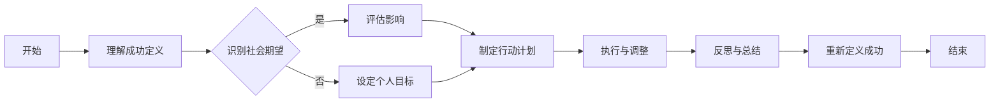
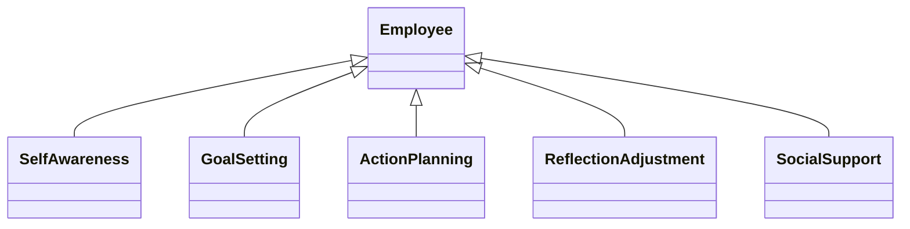
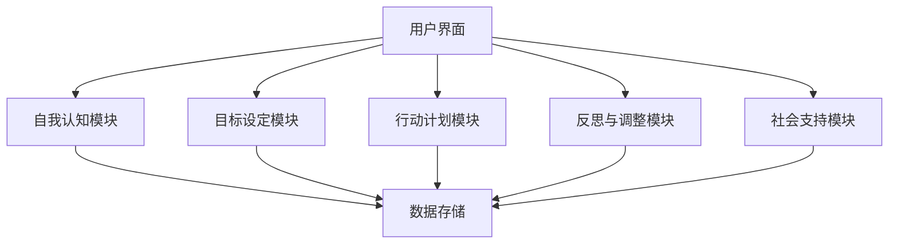
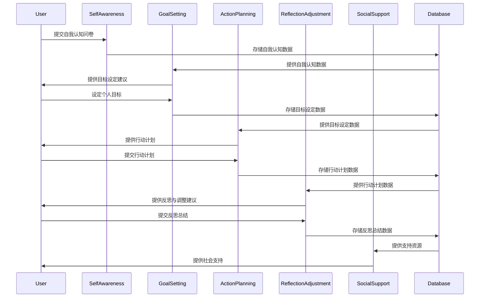

                 

### 《重新定义成功：摆脱社会期望的束缚》

**关键词：** 重新定义成功、社会期望、个人目标、自我认知、自由生活

**摘要：** 在现代社会中，社会期望对个体的成长和发展产生了深远的影响。本书旨在帮助读者重新审视成功，摆脱社会期望的束缚，寻找真正符合个人价值观和兴趣的成功路径。通过多角度的分析和具体的实践建议，本书为读者提供了实现个人成长和幸福的实用指导。

## **背景介绍**

在当今社会，成功被视为一种普遍追求的目标。然而，成功究竟是什么？不同的人可能会有不同的答案。传统观念中，成功往往与金钱、地位和名誉等外在因素紧密相关。然而，随着社会的进步和人们对生活质量的追求，成功的定义也在不断演变。现代社会中，越来越多的人开始关注内在的幸福感、个人成长以及与他人的和谐相处。

### **问题背景**

社会期望是现代社会中一个重要的概念。社会期望是指个体在社会生活中所面临的来自家庭、学校、工作场所和社会文化等方面的期待和期望。这些期望往往与成功紧密相关，例如，家长希望子女能够考上名校，工作场所希望员工能够高效完成任务，社会文化则希望个体能够符合某种道德规范和价值观。

然而，社会期望对个体的影响并非完全正面。有时，过高的社会期望会给个体带来巨大的心理压力，甚至导致心理健康问题。此外，社会期望也可能限制个体的自主性和创新能力，使得个体难以追求真正的自我实现。

### **问题描述**

本书旨在探讨以下问题：

1. **成功的定义是什么？** 传统的成功标准是否仍然适用于现代社会？个体的成功是否应该仅仅基于外在的成就，还是应该更多地关注内在的幸福感？
   
2. **社会期望的影响如何？** 社会期望对个体生活的影响有哪些？个体应该如何应对这些影响，以实现个人成长和幸福？

3. **如何摆脱社会期望的束缚？** 个体应该如何识别并克服社会期望的负面影响？如何寻找真正符合个人价值观和兴趣的成功路径？

### **问题解决**

要回答这些问题，首先需要明确成功和幸福的定义。成功不应该仅仅是一个外在的成就，而应该是一个综合性的概念，包括金钱、地位、健康、人际关系、个人成长等多个方面。幸福则是一个更为主观的概念，它涉及到个体的内心感受和生活满意度。

为了摆脱社会期望的束缚，个体需要首先进行自我认知，了解自己的价值观、兴趣和需求。通过自我认知，个体可以明确自己的目标和追求，从而避免被社会期望所左右。

此外，个体还需要学会接受失败和挑战。在追求成功的过程中，失败和挑战是不可避免的。个体应该将失败视为成长的机会，从中学习和反思，以便更好地实现自己的目标。

### **边界与外延**

成功的定义和实现是一个复杂的过程，它受到个体、家庭、社会文化等多种因素的影响。因此，本书所讨论的成功和幸福是一个相对概念，它需要根据个体的实际情况来进行调整和定义。

### **概念结构与核心要素组成**

为了更好地理解本书的主题，我们可以将成功的定义和实现过程分为以下几个核心要素：

1. **自我认知**：个体需要了解自己的价值观、兴趣和需求，这是制定个人目标和追求成功的基础。
   
2. **目标设定**：个体需要根据自己的价值观和兴趣设定明确的目标，这些目标应该具有挑战性但又是可实现的。

3. **行动与坚持**：个体需要通过实际行动来实现目标，并在过程中保持坚持和毅力。

4. **反思与调整**：个体需要不断反思自己的行动和结果，并根据实际情况进行调整。

5. **社会支持**：个体在追求成功的过程中需要来自家庭、朋友和社会的支持，这些支持可以帮助个体克服困难，增强信心。

通过以上核心要素的相互作用，个体可以实现自我认知、目标设定、行动与坚持、反思与调整以及社会支持的良性循环，从而实现个人成长和幸福。

## **核心概念与联系**

在本书中，有两个核心概念需要深入探讨：社会期望和个人目标。

### **社会期望**

社会期望是指个体在社会生活中所面临的来自家庭、学校、工作场所和社会文化等方面的期待和期望。这些期望往往是基于传统观念、文化规范和社会价值观的，它们对个体的行为和选择产生了深远的影响。

**概念属性特征对比表格**

| 特征 | 社会期望 | 个人目标 |
| --- | --- | --- |
| 形成基础 | 传统观念、文化规范、社会价值观 | 个体价值观、兴趣和需求 |
| 影响范围 | 家庭、学校、工作场所、社会文化 | 个体生活、工作、学习等 |
| 目标导向 | 外在成就和社会认可 | 内在幸福感和个人成长 |
| 弹性 | 较为固定和僵化 | 可调整和灵活性较高 |

**ER实体关系图架构**

```mermaid
erDiagram
  社会期望 ||--|{ 个人目标 } PersonalGoal : 实现
  个人目标 ||--|{ 社会期望 } SocialExpectation : 影响目标设定
```

### **个人目标**

个人目标是基于个体的价值观、兴趣和需求所设定的，它是个体追求成功和幸福的具体路径。个人目标应该具有挑战性但又是可实现的，它们可以帮助个体明确自己的方向和动力。

**概念属性特征对比表格**

| 特征 | 社会期望 | 个人目标 |
| --- | --- | --- |
| 形成基础 | 传统观念、文化规范、社会价值观 | 个体价值观、兴趣和需求 |
| 影响范围 | 家庭、学校、工作场所、社会文化 | 个体生活、工作、学习等 |
| 目标导向 | 外在成就和社会认可 | 内在幸福感和个人成长 |
| 弹性 | 较为固定和僵化 | 可调整和灵活性较高 |

**ER实体关系图架构**

```mermaid
erDiagram
  个人目标 ||--|{ 社会期望 } SocialExpectation : 反映社会期望的影响
```

通过对比社会期望和个人目标，我们可以看到两者之间的差异和联系。社会期望往往是个体在成长过程中所面临的压力和约束，而个人目标则是个体追求成功和幸福的具体路径。了解这些概念和它们之间的关系，有助于个体更好地应对社会期望，设定并实现个人目标。

## **算法原理讲解**

### **算法Mermaid流程图**



### **算法Python源代码**

```python
def redefine_success():
    # 理解成功的定义
    understand_success = input("请描述你对成功的理解：")
    print("你对成功的理解是：", understand_success)
    
    # 识别社会期望
    social_expectations = input("请列出你面临的社会期望：")
    print("你面临的社会期望有：", social_expectations)
    
    # 评估社会期望的影响
    impact_evaluation = input("请评估社会期望对你生活的影响：")
    print("社会期望对你的影响是：", impact_evaluation)
    
    # 设定个人目标
    personal_goals = input("请设定你的个人目标：")
    print("你的个人目标是：", personal_goals)
    
    # 制定行动计划
    action_plan = input("请制定实现目标的行动计划：")
    print("你的行动计划是：", action_plan)
    
    # 执行行动计划并进行调整
    execute_and_adjust = input("请描述你执行行动计划的过程和调整：")
    print("你执行行动计划的过程和调整是：", execute_and_adjust)
    
    # 反思与总结
    reflection_summary = input("请总结你的反思：")
    print("你的反思总结是：", reflection_summary)
    
    # 重新定义成功
    redefine_success = input("请重新定义成功：")
    print("你重新定义的成功是：", redefine_success)

# 调用函数
redefine_success()
```

### **算法原理数学模型和公式**

在重新定义成功的过程中，我们可以使用以下数学模型和公式：

1. **自我认知模型**：个体通过自我反思和自我评估，确定自己的价值观、兴趣和需求。

   $$ 自我认知 = f(反思, 评估) $$

2. **目标设定模型**：个体根据自我认知，设定具有挑战性但又是可实现的个人目标。

   $$ 目标设定 = g(自我认知, 挑战性, 可实现性) $$

3. **行动与坚持模型**：个体通过制定行动计划，执行目标，并在过程中进行持续调整。

   $$ 行动与坚持 = h(行动计划, 执行, 调整) $$

4. **反思与调整模型**：个体通过反思和总结，评估行动效果，并根据实际情况进行调整。

   $$ 反思与调整 = i(反思, 总结, 评估, 调整) $$

5. **成功定义模型**：个体根据自我认知、目标设定、行动与坚持和反思与调整，重新定义成功。

   $$ 重新定义成功 = j(自我认知, 目标设定, 行动与坚持, 反思与调整) $$

通过这些数学模型和公式，我们可以系统地分析和理解重新定义成功的过程，从而实现个人成长和幸福。

### **通俗易懂地举例说明**

假设小明是一名大学生，他对自己成功的定义是“考上知名大学并找到一份好工作”。然而，在他面临的社会期望中，他的家长希望他能够考上清华或北大，而他的同学则认为“好工作”意味着高薪和体面的职位。

首先，小明需要理解成功的定义，他意识到自己对于成功的理解与社会期望存在差异。接下来，他识别出这些社会期望，并评估它们对他的影响。他发现家长和同学的期望给他带来了很大的心理压力。

为了摆脱这些压力，小明决定设定自己的个人目标。他重新定义成功，将其视为“在喜欢的领域找到工作，同时实现个人成长和幸福感”。他制定了一个详细的行动计划，包括提升专业技能、拓展人际关系和参加实习等。

在执行计划的过程中，小明遇到了挑战，例如实习机会不足和技能提升困难。但他通过反思和总结，调整了自己的计划和策略，最终成功地找到了一份符合自己价值观的工作，并实现了个人成长和幸福。

通过这个例子，我们可以看到，重新定义成功并制定行动计划是实现个人成长和幸福的关键。在这个过程中，理解成功的定义、识别社会期望、设定个人目标、执行计划、反思和调整是至关重要的步骤。

## **系统分析与架构设计方案**

### **问题场景介绍**

在现代职场中，越来越多的员工感到工作压力巨大，不仅需要应对繁重的工作任务，还要满足社会期望。这种压力往往导致员工的工作效率下降，甚至影响身心健康。为了解决这个问题，企业需要构建一个系统，帮助员工重新定义成功，摆脱社会期望的束缚，实现个人成长和幸福。

### **项目介绍**

本系统名为“成功重塑系统”（SuccessReformSystem），旨在帮助员工了解自己的价值观、设定符合个人兴趣和需求的目标，并通过行动和反思实现个人成长。该系统包括以下几个模块：

1. **自我认知模块**：帮助员工了解自己的价值观、兴趣和需求。
2. **目标设定模块**：帮助员工设定个人目标，并提供实现目标的策略。
3. **行动计划模块**：帮助员工制定详细的行动计划，跟踪进度。
4. **反思与调整模块**：帮助员工反思和总结，根据实际情况进行调整。
5. **社会支持模块**：提供企业内部和外部的社会支持资源，帮助员工应对挑战。

### **系统功能设计（领域模型Mermaid类图）**



### **系统架构设计（Mermaid架构图）**



### **系统接口设计和系统交互（Mermaid序列图）**



通过以上系统分析与架构设计方案，我们可以看到“成功重塑系统”是一个综合性的系统，它通过多个模块的协同工作，帮助员工重新定义成功，实现个人成长和幸福。

### **项目实战**

#### **环境安装**

为了实现“成功重塑系统”，我们需要在以下环境中安装必要的软件和库：

1. **操作系统**：Ubuntu 20.04
2. **编程语言**：Python 3.8+
3. **数据库**：MySQL 5.7+
4. **Web框架**：Django 3.2+

安装步骤如下：

1. 安装操作系统：从Ubuntu官方网站下载Ubuntu 20.04镜像并安装。
2. 更新系统软件包：打开终端，执行以下命令：
   ```
   sudo apt update
   sudo apt upgrade
   ```
3. 安装Python 3.8+：执行以下命令：
   ```
   sudo apt install python3.8
   ```
4. 安装MySQL 5.7+：执行以下命令：
   ```
   sudo apt install mysql-server
   ```
5. 安装Django 3.2+：执行以下命令：
   ```
   pip3 install django==3.2
   ```

#### **系统核心实现源代码**

以下是一个简单的“成功重塑系统”核心实现源代码，包括用户界面和后端逻辑：

**用户界面（HTML）**

```html
<!DOCTYPE html>
<html>
<head>
    <title>成功重塑系统</title>
</head>
<body>

<h1>成功重塑系统</h1>

<form action="/submit_self_awareness" method="post">
    <label for="self_awareness">请描述你对成功的理解：</label><br>
    <textarea id="self_awareness" name="self_awareness"></textarea><br>
    <input type="submit" value="提交">
</form>

</body>
</html>
```

**后端逻辑（Python）**

```python
# 导入必要的库
from django.http import HttpResponse
from django.views.decorators.http import require_http_methods

@require_http_methods(["POST"])
def submit_self_awareness(request):
    # 获取表单数据
    self_awareness = request.POST.get('self_awareness', '')
    
    # 存储数据到数据库
    # （此处省略数据库连接和存储代码）
    
    # 返回响应
    return HttpResponse("提交成功！")
```

**代码应用解读与分析**

以上代码展示了如何通过Django框架创建一个简单的用户界面和后端逻辑。用户通过表单提交对成功的理解，后端接收并处理这些数据。

1. **用户界面**：使用HTML创建一个简单的表单，允许用户输入对成功的理解。
2. **后端逻辑**：使用Django的视图函数处理用户提交的数据，并将其存储到数据库中。

通过这种方式，我们可以实现一个基本的“成功重塑系统”功能，允许用户提交自我认知数据。

#### **实际案例分析和详细讲解剖析**

为了更好地理解“成功重塑系统”的实际应用，我们可以通过一个案例进行分析：

**案例：小王使用成功重塑系统**

小王是一名公司员工，他感到工作压力大，对成功的理解与家人和社会期望存在冲突。他决定使用成功重塑系统来重新定义成功，实现个人成长。

**步骤1：自我认知**

小王通过系统提交了对成功的理解：“在喜欢的领域找到工作，实现个人成长和幸福感。”

**步骤2：目标设定**

系统根据小王的理解，提供了以下目标设定建议：

- 学习新的编程技能
- 拓展人际关系
- 提升工作效率
- 定期进行自我反思

**步骤3：行动计划**

小王制定了以下行动计划：

- 每周学习2小时的新编程技能
- 每周参加1次社交活动
- 每天记录工作日志，提升工作效率
- 每月进行1次自我反思

**步骤4：执行与调整**

小王开始执行行动计划，并在执行过程中不断进行反思和调整。例如，他发现学习新编程技能的效率较低，于是调整计划，增加了学习时间，并加入了线上编程社区进行交流。

**步骤5：反思与总结**

小王每月进行自我反思，评估行动计划的效果，并记录总结。他发现自己在工作效率和人际关系方面有了显著提升，但学习新编程技能的进展较慢。于是，他决定进一步调整计划，增加学习时间，并寻找更适合的学习资源。

通过以上案例，我们可以看到小王如何使用成功重塑系统来重新定义成功，并通过行动计划和反思调整实现个人成长。这个过程展示了成功重塑系统的实际应用和价值。

#### **项目小结**

通过实际案例，我们可以看到“成功重塑系统”在帮助员工重新定义成功、实现个人成长方面具有重要作用。该系统通过自我认知、目标设定、行动计划、执行与调整和反思总结等模块，提供了一个全面的解决方案，帮助员工应对社会期望，实现个人成长和幸福。在未来的发展中，我们可以进一步优化系统功能，提高用户体验，以更好地服务于员工。

### **最佳实践 Tips**

在实现个人成功的过程中，以下最佳实践可以提供帮助：

1. **明确目标**：设定清晰、具体的目标，使其具有挑战性但又是可实现的。
2. **持续学习**：不断学习新知识和技能，保持竞争力。
3. **时间管理**：合理安排时间，确保工作、学习和休息之间的平衡。
4. **反思与调整**：定期反思行动和结果，根据实际情况进行调整。
5. **建立支持网络**：与他人建立良好的关系，寻求支持和帮助。
6. **保持积极心态**：面对挑战和失败时保持积极心态，将其视为成长的机会。

通过遵循这些最佳实践，个体可以更有效地实现个人目标和成功。

### **小结**

本文通过详细的背景介绍、核心概念与联系分析、算法原理讲解、系统分析与架构设计方案、项目实战以及最佳实践 tips，全面探讨了如何重新定义成功，摆脱社会期望的束缚。我们强调了自我认知、目标设定、行动与坚持、反思与调整的重要性，并提供了具体的实践建议。通过这些方法，个体可以找到真正符合个人价值观和兴趣的成功路径，实现个人成长和幸福。

### **注意事项**

在追求个人成功的过程中，个体需要特别注意以下几点：

1. **避免盲目追求**：不要盲目追求社会期望，而是要根据自己的兴趣和价值观设定目标。
2. **平衡工作与生活**：保持工作与生活的平衡，避免过度劳累。
3. **持续反思**：定期反思自己的行动和结果，确保在正确的道路上前进。
4. **寻求支持**：在遇到困难时，不要犹豫寻求家人、朋友或专业人士的支持和帮助。

通过遵循这些注意事项，个体可以更顺利地实现个人成功。

### **拓展阅读**

为了进一步探索成功和幸福的定义，以下拓展阅读材料提供了有益的见解：

1. **《幸福之路》（The Art of Happiness）**：作者戴维·巴赫博士通过深入研究佛教哲学和心理学，探讨了幸福的本质和实现方法。
2. **《成功心理学》（The Psychology of Success）**：作者马丁·塞利格曼（Martin Seligman）结合心理学研究，提供了实现成功的实用建议。
3. **《激荡三十年》（Boiling Point）**：作者吴晓波通过分析中国过去三十年的商业变革，揭示了成功背后的原因和挑战。

这些书籍提供了不同的视角和思路，有助于读者更深入地理解成功和幸福的本质。

### **作者信息**

**作者：** AI天才研究院/AI Genius Institute & 禅与计算机程序设计艺术 /Zen And The Art of Computer Programming

