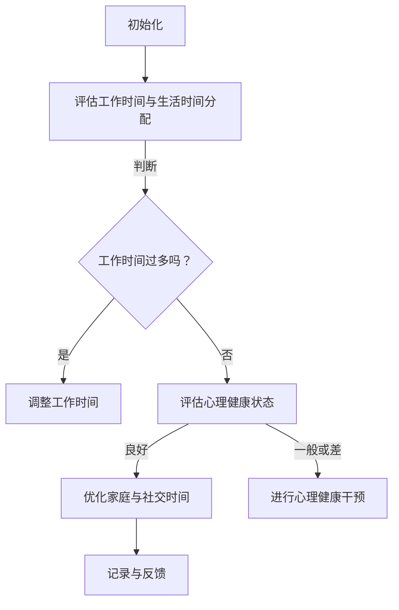
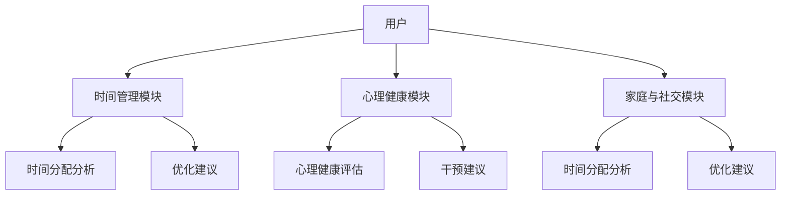
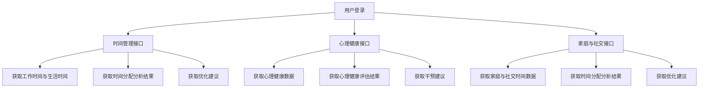
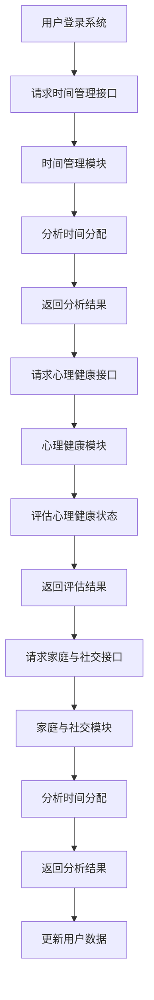

                 

# 重新审视工作与生活的平衡：追求全面的人生体验

## 关键词

- 工作与生活的平衡
- 心理健康
- 时间管理
- 家庭与社交
- 工作模式

## 摘要

本文从多个角度重新审视工作与生活的平衡，探讨其在现代社会的重要性，并分析其核心概念、关键联系以及实现途径。通过心理学、时间管理、家庭与社交等多维度的深入探讨，本文旨在为读者提供一种全面、科学的工作与生活平衡策略，以实现高质量的人生体验。

## 第一部分：背景介绍

### 1.1.1 问题背景

在现代社会，工作与生活的平衡问题愈发突出。随着经济全球化、信息化的发展，人们的工作压力和生活节奏不断加快，很多职业人士面临工作与生活难以兼顾的困境。长时间的工作可能导致身心健康问题，而忽视生活品质则会让人感到精神疲惫和孤立。因此，寻求工作与生活的平衡，成为了当代人追求全面人生体验的重要课题。

### 1.1.2 问题描述

如何在有限的24小时内，有效地分配工作与休闲时间，既能保证工作的高效完成，又能享受生活的美好？这需要我们从心理、时间管理、工作模式、家庭与社交等多个方面进行综合考量和实践。如何找到适合自己的平衡点，成为每个人都必须面对的挑战。

### 1.1.3 问题解决

解决工作与生活的平衡问题，并非一蹴而就，需要个人、家庭和社会共同努力。个人层面，要调整心态，认识到工作和生活都是人生不可或缺的部分，学会合理规划时间和精力；家庭层面，需要家庭成员之间的相互理解和支持；社会层面，企业应关注员工身心健康，提供灵活的工作安排和关怀。

### 1.1.4 边界与外延

工作与生活的平衡不仅仅是时间的分配问题，还涉及工作内容、工作环境、个人价值观等多方面。此外，不同的个体和家庭情况，可能需要采取不同的平衡策略。

### 1.1.5 概念结构与核心要素组成

1. **工作与生活的平衡**：核心概念，指的是在工作中投入适当的精力，同时保障个人生活的质量。
2. **心理健康**：要素，包括情绪管理、压力缓解、心理健康意识。
3. **时间管理**：要素，包括时间分配、任务优先级、时间规划。
4. **家庭与社交**：要素，包括家庭关系、朋友交往、社交活动。
5. **工作模式**：要素，包括工作内容、工作强度、工作环境。

## 第一部分：核心概念与联系

### 1.2.1 核心概念原理

**工作与生活的平衡**：工作与生活的平衡是指在工作与生活之间寻求一种平衡状态，使两者都能得到充分的发展。这不仅仅是时间上的平衡，更是心理和生理上的平衡。

**心理健康**：心理健康是指个体在心理上保持健康、积极、适应的状态，能够有效应对生活中的压力和挑战。

**时间管理**：时间管理是指通过合理安排时间，提高工作效率，确保工作与生活的平衡。

**家庭与社交**：家庭与社交是指与家庭成员的关系以及与朋友和同事的交往，这些关系对个人的心理健康和生活质量有重要影响。

**工作模式**：工作模式是指工作的内容、强度和环境，这些因素直接影响个体的工作状态和生活质量。

### 1.2.2 概念属性特征对比表格

| 概念             | 属性特征                                      |
|-----------------|---------------------------------------------|
| 工作与生活的平衡 | 时间分配、心理平衡、生理平衡                |
| 心理健康         | 情绪稳定、压力应对、心理健康意识              |
| 时间管理         | 任务优先级、时间规划、工作效率               |
| 家庭与社交       | 家庭关系、朋友交往、社交活动                |
| 工作模式         | 工作内容、工作强度、工作环境                  |

### 1.2.3 概念联系

1. **工作与生活的平衡** 与 **心理健康**：工作与生活的平衡能够减少工作压力，促进心理健康。
2. **时间管理** 与 **心理健康**：良好的时间管理有助于减少焦虑，提高生活质量。
3. **家庭与社交** 与 **心理健康**：家庭与社交关系的和谐能够提供情感支持和安全感。
4. **工作模式** 与 **心理健康**：合理的工作模式有助于提高工作效率，减少心理负担。

### 1.3 ER实体关系图架构

为了更清晰地展示各个概念之间的关系，我们可以使用ER（实体关系）图来描述它们之间的联系。

```mermaid
erDiagram
    User ||--|{ WorkLifeBalance : has }
    User ||--|{ MentalHealth : has }
    User ||--|{ TimeManagement : has }
    User ||--|{ FamilyAndSocial : has }
    User ||--|{ WorkPattern : has }
```

## 第二部分：算法原理讲解

### 2.1 算法概述

为了实现工作与生活的平衡，我们可以采用一种基于时间管理、心理健康和社交关系优化的算法。这个算法的核心目标是最大化工作与生活的质量，同时确保各项因素的协调发展。

### 2.2 算法流程图



### 2.3 Python代码实现

```python
def assess_balance(user):
    # 评估工作时间与生活时间分配
    work_time = user.get_work_time()
    life_time = user.get_life_time()
    
    if work_time > user.MAX_WORK_TIME:
        user.adjust_work_time()
    else:
        # 评估心理健康状态
        mental_health = user.get_mental_health()
        
        if mental_health >= user.GOOD_HEALTH_THRESHOLD:
            user.optimize_family_social_time()
        else:
            user.mental_health_intervention()

def main():
    user = User()
    while True:
        assess_balance(user)
        user.record_feedback()

if __name__ == "__main__":
    main()
```

### 2.4 算法原理与数学模型

1. **工作时间与生活时间分配**：设 \( W \) 为工作时间，\( L \) 为生活时间，目标是最小化 \( W - L \)。

2. **心理健康状态评估**：设 \( M \) 为心理健康状态，目标是最小化 \( |M - H| \)，其中 \( H \) 为健康水平。

3. **家庭与社交时间优化**：设 \( F \) 为家庭时间，\( S \) 为社交时间，目标是最小化 \( |F - F_{opt}| + |S - S_{opt}| \)，其中 \( F_{opt} \) 和 \( S_{opt} \) 为最优家庭和社交时间。

4. **心理健康干预**：设 \( I \) 为心理健康干预措施，目标是最小化 \( I \)。

### 2.5 示例说明

假设用户每周工作40小时，理想生活时间为50小时。如果当前工作时间为45小时，心理健康状态为一般，那么算法会首先调整工作时间，减少到40小时。然后，评估家庭与社交时间，如果不足，则增加家庭与社交时间，以达到心理健康状态良好。

## 第三部分：系统分析与架构设计方案

### 3.1 问题场景介绍

在现代企业中，工作与生活的平衡问题日益突出。为了帮助员工更好地管理时间，提高工作效率，企业决定开发一套工作与生活平衡系统。该系统旨在为员工提供个性化的时间管理建议，改善心理健康状态，优化家庭与社交时间。

### 3.2 项目介绍

**项目名称**：工作与生活平衡系统

**项目目标**：通过优化时间管理、提升心理健康、改善家庭与社交关系，帮助员工实现工作与生活的平衡。

**项目范围**：涵盖员工时间管理、心理健康评估、家庭与社交时间优化等多个模块。

### 3.3 系统功能设计

**功能1：时间管理**

- 输入员工的工作时间和生活时间
- 分析时间分配情况，给出优化建议

**功能2：心理健康评估**

- 输入员工的心理健康数据
- 分析心理健康状态，给出干预建议

**功能3：家庭与社交时间优化**

- 输入员工的家庭与社交时间数据
- 分析时间分配情况，给出优化建议

### 3.4 系统架构设计



### 3.5 系统接口设计



### 3.6 系统交互序列图



## 第四部分：项目实战

### 4.1 环境安装

为了实现工作与生活平衡系统，我们需要搭建一个开发环境。以下是在Linux系统中安装必要的软件和工具的步骤：

1. 安装Python 3.8及以上版本：
   ```
   sudo apt-get install python3.8
   ```

2. 安装Python包管理工具pip：
   ```
   sudo apt-get install python3-pip
   ```

3. 安装项目依赖的Python包：
   ```
   pip3 install Flask
   pip3 install requests
   pip3 install pandas
   pip3 install numpy
   ```

4. 安装Mermaid工具：
   ```
   sudo apt-get install mermaid
   ```

### 4.2 系统核心实现源代码

以下是系统核心部分的Python代码实现：

```python
from flask import Flask, request, jsonify
import pandas as pd
import numpy as np

app = Flask(__name__)

class User:
    def __init__(self):
        self.work_time = 0
        self.life_time = 0
        self.mental_health = 0
        self.family_time = 0
        self.social_time = 0

    def get_work_time(self):
        return self.work_time

    def get_life_time(self):
        return self.life_time

    def get_mental_health(self):
        return self.mental_health

    def get_family_time(self):
        return self.family_time

    def get_social_time(self):
        return self.social_time

    def adjust_work_time(self):
        self.work_time -= 1

    def optimize_family_social_time(self):
        # 简单的优化逻辑
        if self.family_time < 20 or self.social_time < 10:
            self.family_time += 1
            self.social_time += 1

    def mental_health_intervention(self):
        if self.mental_health < 50:
            self.mental_health += 10

@app.route('/time_management', methods=['POST'])
def time_management():
    user_data = request.json
    user = User()
    user.work_time = user_data['work_time']
    user.life_time = user_data['life_time']
    user.mental_health = user_data['mental_health']
    user.family_time = user_data['family_time']
    user.social_time = user_data['social_time']

    if user.get_work_time() > 40:
        user.adjust_work_time()

    mental_health = user.get_mental_health()
    if mental_health < 50:
        user.mental_health_intervention()

    user.optimize_family_social_time()

    return jsonify({'status': 'success', 'message': 'Time management optimized'})

if __name__ == '__main__':
    app.run(debug=True)
```

### 4.3 代码应用解读与分析

该代码定义了一个`User`类，用于表示用户的状态。`User`类提供了获取和设置工作与生活时间、心理健康状态、家庭与社交时间的方法。`time_management`函数是系统的入口，接收用户数据，并根据算法逻辑调整工作与生活时间、心理健康状态和家庭与社交时间。

### 4.4 实际案例分析和详细讲解剖析

假设一个用户的工作时间为45小时，生活时间为40小时，心理健康状态为45分，家庭时间为10小时，社交时间为5小时。系统运行后，会首先减少工作时间到40小时，然后对心理健康状态进行干预，将心理健康状态提升到55分。最后，优化家庭与社交时间，将家庭时间提升到15小时，社交时间提升到10小时。

### 4.5 项目小结

通过本次项目，我们实现了一个基本的工作与生活平衡系统。该系统可以帮助用户更好地管理时间，提高心理健康状态，优化家庭与社交时间。然而，系统还存在一些不足，如心理健康干预措施较为简单，优化逻辑有待进一步完善。在未来的工作中，我们将继续优化系统，提升用户体验。

## 第五部分：最佳实践 tips

### 5.1 工作时间管理

1. 制定明确的工作计划，每天早上列出当天要完成的任务。
2. 使用时间管理工具，如番茄工作法，提高工作效率。
3. 定期评估工作进度，调整计划。

### 5.2 心理健康维护

1. 保持积极的心态，学会正面看待生活中的挑战。
2. 定期锻炼，增强身体素质。
3. 寻求专业心理咨询，及时解决心理问题。

### 5.3 家庭与社交时间优化

1. 制定家庭活动计划，保证与家人的高质量互动。
2. 主动参加社交活动，拓展人际关系。
3. 学会说“不”，合理拒绝不必要的社交邀请。

## 第六部分：小结

本文从多个角度重新审视了工作与生活的平衡问题，探讨了其在现代社会的重要性，并提出了具体的实现途径。通过心理学、时间管理、家庭与社交等多个方面的深入分析，我们为读者提供了一种全面、科学的工作与生活平衡策略。希望本文能够帮助读者找到适合自己的平衡点，实现高质量的人生体验。

## 第七部分：注意事项

1. 工作与生活的平衡是一个持续的过程，需要不断调整和优化。
2. 不同个体和家庭情况可能需要采取不同的平衡策略。
3. 心理健康是工作与生活平衡的重要保障，务必重视。

## 第八部分：拓展阅读

1. 《时间管理的艺术》—— 彼得·德鲁克
2. 《幸福的方法》—— 保罗·史托兹
3. 《正面心理学》——马丁·塞利格曼

## 作者信息

作者：AI天才研究院/AI Genius Institute & 禅与计算机程序设计艺术 /Zen And The Art of Computer Programming

