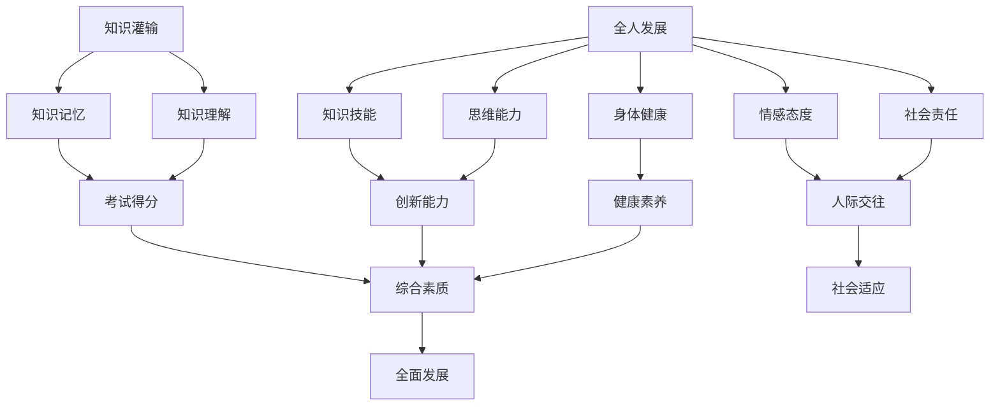
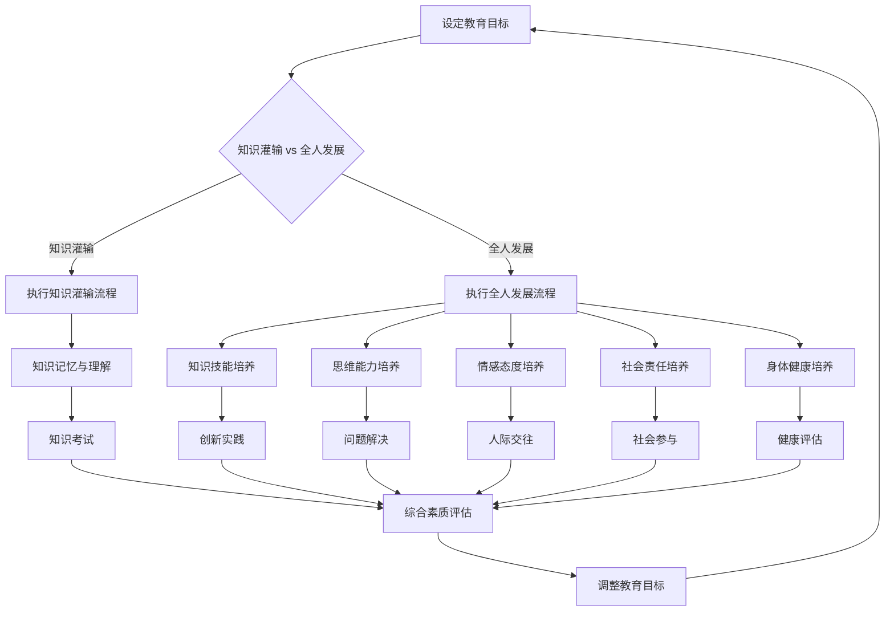

                 

**重新审视教育目标：从知识灌输到全人发展的转变**

关键词：教育目标，知识灌输，全人发展，教育实践，教育改革

摘要：本文旨在深入探讨当前教育体系中存在的知识灌输模式与全人发展理念之间的矛盾，分析全人发展的内涵和特征，探讨从知识灌输到全人发展的转变路径，以及教育实践中的成功与挑战。通过本文的论述，希望能够为教育目标改革提供一些有益的思路和参考。

**目录**

# **重新审视教育目标：从知识灌输到全人发展的转变**

在教育领域中，教育目标的设定至关重要。它不仅关乎学生的知识获取和技能培养，更关乎学生的全面发展。然而，当前的教育体系普遍存在重视知识灌输而忽视全人发展的现象。本文将首先回顾教育目标的历史演变，然后深入探讨全人发展的内涵与特征，进而分析从知识灌输到全人发展的转变路径，以及教育实践中的转变案例，最后展望全人发展的未来方向。

## **一、教育目标的历史演变**

### **1.1 古代教育目标**

古代教育目标以培养君子和士人为核心。在中国，儒家教育强调“修身齐家治国平天下”，强调道德修养和社会责任感。在西方，古希腊哲学家柏拉图和亚里士多德提出了关于教育的理想，强调智慧和品德的双重培养。

### **1.2 现代教育目标的演变**

随着工业革命和科技进步，现代教育目标逐渐从单纯的道德和知识教育转向能力培养。19世纪末，美国教育家杜威提出了“教育即生活，学校即社会”的理念，强调实践和体验在教育中的重要性。20世纪中期，苏联教育学家苏霍姆林斯基提出了“全面和谐发展”的教育理念，强调学生德、智、体、美、劳的全面发展。

### **1.3 我国教育目标的发展**

我国的教育目标在历史长河中经历了多次变革。新中国成立后，我国教育目标强调为社会主义建设培养合格的建设者和接班人。改革开放以来，我国教育目标逐渐从单一的技能培养转向全面素质培养。2010年，我国颁布了《国家中长期教育改革和发展规划纲要》，提出了“育人为本，全面提高教育质量”的发展目标。

## **二、全人发展的内涵与特征**

### **2.1 全人发展的概念定义**

全人发展，又称“全面发展”，是指个体在生理、心理、社会、道德、智力等各个方面得到全面、协调、持续的发展。它不仅关注个体的知识技能培养，更关注个体的情感、态度、价值观和创新能力。

### **2.2 全人发展的核心要素**

全人发展的核心要素包括：

- **知识技能**：掌握基础知识和基本技能，形成良好的学习习惯。
- **思维能力**：培养逻辑思维、创新思维和批判性思维。
- **情感态度**：培养积极向上的情感态度，形成正确的价值观。
- **社会责任**：培养社会责任感和公民意识，形成良好的社会行为规范。
- **身体健康**：保持身体健康，形成良好的生活习惯。

### **2.3 全人发展的实现途径**

实现全人发展的途径包括：

- **教育理念更新**：从知识灌输转向能力培养，强调学生的主体地位。
- **教学模式创新**：采用多样化、互动式的教学方式，激发学生的学习兴趣。
- **教育评价体系的改革**：建立综合评价体系，不仅关注学生的学业成绩，更关注学生的全面发展。

## **三、知识灌输与全人发展的矛盾**

### **3.1 知识灌输为主的教学模式**

当前的教育体系中，知识灌输仍是主要的教学模式。教师注重知识的传授，而忽视学生的能力培养。这种教学模式容易导致学生产生厌学情绪，影响他们的全面发展。

### **3.2 全人发展面临的挑战**

全人发展在教育实践中面临诸多挑战：

- **教育资源分配不均**：城乡、区域之间的教育资源存在较大差距，导致全人发展无法公平实现。
- **教育理念滞后**：部分教师和教育管理者仍坚持传统的教育观念，忽视全人发展的重要性。
- **教育评价体系不完善**：当前的教育评价体系仍以考试成绩为主，无法全面反映学生的综合素质。

## **四、从知识灌输到全人发展的转变路径**

### **4.1 教育目标的转变**

教育目标的转变是全人发展的关键。我们需要从单纯的知识传授转向能力培养，强调学生的全面发展。

### **4.2 教育实践中的转变**

在教育实践中，我们需要：

- **更新教育理念**：重视学生的主体地位，培养学生的自主学习能力。
- **创新教学模式**：采用多样化、互动式的教学方式，激发学生的学习兴趣。
- **改革教育评价体系**：建立综合评价体系，关注学生的全面发展。

### **4.3 政策与制度支持**

政策与制度的支持是全人发展的保障。我们需要：

- **完善教育法律法规**：确保全人发展理念在政策层面得到落实。
- **加大教育投入**：确保全人发展所需的教育资源得到保障。
- **推进教育改革**：鼓励各地开展全人教育实践探索，形成可复制、可推广的经验。

## **五、教育实践中的转变案例**

### **5.1 国外全人教育实践**

在国外，许多国家已经开始了全人教育的实践探索。例如，芬兰的教育体系以学生为中心，强调个性化教育；美国的教育体系注重培养学生的创新能力。

### **5.2 我国全人教育实践探索**

我国也在积极推进全人教育实践。例如，北京十一学校、上海建平中学等学校已经开始了全人教育的探索，取得了显著成效。

### **5.3 教育实践中的成功与挑战**

尽管全人教育实践取得了一定的成效，但仍然面临诸多挑战，如教育资源分配不均、教育理念滞后等。我们需要在政策、制度、教育实践等多方面进行改革，推动全人教育的发展。

## **六、全人发展的未来展望**

### **6.1 新技术对教育目标的影响**

随着科技的进步，新技术将对教育目标产生深远影响。例如，人工智能、虚拟现实等技术将改变教育方式，提高教育质量。

### **6.2 社会变迁对教育目标的要求**

随着社会的发展，人们对教育目标的要求也在提高。未来，教育目标将更加注重学生的全面发展，培养具备创新能力和社会责任感的优秀人才。

### **6.3 未来教育目标的预测**

未来，教育目标将更加多元化，注重个体差异，强调终身学习。同时，教育评价体系将更加完善，全面反映学生的综合素质。

## **七、结论与展望**

教育目标的改革是一个长期、系统的过程。我们需要从知识灌输到全人发展的转变，推动教育实践的创新。同时，政策与制度的支持也是不可或缺的。未来，随着新技术的应用和社会的发展，教育目标将更加多元化，培养出具备创新能力和社会责任感的优秀人才。

## **作者信息**

作者：AI天才研究院/AI Genius Institute & 禅与计算机程序设计艺术 /Zen And The Art of Computer Programming

**附录**

- **参考文献**

[1] 杜威，J. (1938). 民主主义与教育. 商务印书馆.

[2] 苏霍姆林斯基，V. A. (1981). 全面和谐发展. 教育科学出版社.

[3] 国家中长期教育改革和发展规划纲要（2010-2020 年）. 国务院颁布. [Z].

[4] 芬兰教育部. (2016). 芬兰教育体系概览. 芬兰教育部官方网站.

[5] 美国教育统计中心. (2019). 美国教育统计概览. 美国教育统计中心官方网站.**背景介绍**

在教育领域中，教育目标的设定至关重要。它不仅关乎学生的知识获取和技能培养，更关乎学生的全面发展。然而，当前的教育体系普遍存在重视知识灌输而忽视全人发展的现象。知识灌输模式主要是指教师通过讲解、演示等方式将知识传授给学生，而全人发展理念则强调个体在多个方面的全面发展，包括知识技能、思维能力、情感态度、社会责任和身体健康等。

在教育目标的发展历程中，从古代到现代，教育目标逐渐从单一的道德和知识教育转向能力培养。在我国，教育目标在历史长河中经历了多次变革，从新中国成立后的社会主义建设者培养，到改革开放后的全面素质培养，再到近年来提出的“育人为本，全面提高教育质量”的发展目标，这些变革都体现了教育目标从知识灌输向全人发展的转变趋势。

然而，在当前的教育实践中，知识灌输仍然占据主导地位。教师注重知识的传授，而忽视学生的能力培养，导致学生产生厌学情绪，影响他们的全面发展。此外，全人发展在教育实践中也面临诸多挑战，如教育资源分配不均、教育理念滞后、教育评价体系不完善等。

因此，重新审视教育目标，从知识灌输到全人发展的转变，成为当前教育改革的重要课题。这一转变不仅需要教育理念的更新，还需要教学模式的创新和教育评价体系的改革。本文将深入探讨这一转变的内涵、路径和实践案例，以期为教育目标的改革提供有益的思路和参考。

**核心概念与联系**

在教育目标的转变过程中，知识灌输和全人发展是两个核心概念。知识灌输强调知识的传授和记忆，而全人发展则关注个体在知识、技能、情感、态度、社会责任和身体健康等多方面的全面发展。

首先，知识灌输模式主要依赖于教师的教学内容和教学方法。在这种模式下，教师通过讲解、演示、练习等方式将知识传授给学生，注重学生对知识的记忆和理解。然而，这种模式往往忽视了学生的个性化需求和发展，导致学生的学习兴趣和主动性受到影响。

与之相对，全人发展模式强调学生的全面发展。它不仅关注学生的知识技能培养，还注重学生的思维能力、情感态度、社会责任和身体健康等方面的培养。全人发展模式要求教师从知识传授者转变为学习引导者，注重学生的自主学习能力和创新能力的培养。

在知识灌输和全人发展之间，存在一定的联系和区别。知识灌输是全人发展的基础，但不是全人发展的全部。全人发展需要知识灌输，但更注重学生综合素质的提升。因此，在教育实践中，我们需要在知识灌输的基础上，注重全人发展的培养。

为了更好地理解这两个概念，我们可以通过以下表格来对比它们的属性特征：

| 特征          | 知识灌输          | 全人发展          |
| ----------- | -------------- | -------------- |
| 目标          | 知识记忆和理解      | 知识、技能、情感、态度、社会责任和身体健康全面发展 |
| 方式          | 讲解、演示、练习     | 自主学习、合作学习、实践探索等多样方式    |
| 评价标准      | 知识掌握程度        | 综合素质评估       |
| 教学重点      | 知识传授          | 学生能力培养       |
| 教师角色      | 知识传授者         | 学习引导者、辅导者  |

此外，我们还可以使用Mermaid流程图来直观地展示知识灌输和全人发展的过程及其关系：



通过上述表格和流程图，我们可以更清晰地理解知识灌输和全人发展的概念及其关系。知识灌输是全人发展的基础，但全人发展不仅仅是知识灌输的延伸，它更关注学生的全面发展。因此，在教育实践中，我们需要在知识灌输的基础上，注重全人发展的培养，以实现教育的真正目标。

**算法原理讲解**

在重新审视教育目标的过程中，我们不仅需要从理论层面探讨知识灌输与全人发展的区别与联系，还需要通过具体的算法原理来支持这一转变。下面，我们将使用Mermaid流程图和Python源代码来详细阐述全人发展教育目标实现的核心算法原理，并结合数学模型和公式进行解释。

### **1. Mermaid流程图**

首先，我们使用Mermaid流程图来描述全人发展教育目标实现的基本步骤：



这个流程图展示了从设定教育目标到评估综合素质的整个过程，其中包括了知识灌输和全人发展的两个分支。每个步骤都对应着特定的培养目标和评估标准。

### **2. Python源代码**

为了进一步解释全人发展教育目标实现的核心算法原理，我们使用Python编写了一段代码，这段代码模拟了全人发展教育目标评估的过程：

```python
import numpy as np

# 定义全人发展评估指标
knowledge_score = 0.4  # 知识掌握程度
innovation_score = 0.2  # 创新能力
problem_solving_score = 0.2  # 问题解决能力
interpersonal_score = 0.1  # 人际交往能力
social_participation_score = 0.05  # 社会参与度
health_score = 0.05  # 健康状况

# 定义权重
weight_knowledge = 0.3
weight_innovation = 0.2
weight_problem_solving = 0.2
weight_interpersonal = 0.1
weight_social_participation = 0.05
weight_health = 0.05

# 计算全人发展得分
total_score = (knowledge_score * weight_knowledge +
               innovation_score * weight_innovation +
               problem_solving_score * weight_problem_solving +
               interpersonal_score * weight_interpersonal +
               social_participation_score * weight_social_participation +
               health_score * weight_health)

print("全人发展得分：", total_score)

# 根据得分调整教育目标
if total_score >= 0.9:
    print("教育目标：全面发展，维持当前策略。")
elif total_score >= 0.7:
    print("教育目标：需在创新能力、问题解决能力方面加强。")
elif total_score >= 0.5:
    print("教育目标：需在知识掌握、创新能力、问题解决能力方面加强。")
else:
    print("教育目标：需在多个方面进行全面加强。")
```

在这段代码中，我们定义了全人发展的评估指标（如知识掌握程度、创新能力、问题解决能力等）及其权重。通过计算这些指标的加权得分，我们可以评估学生的全人发展水平，并根据评估结果调整教育目标。

### **3. 数学模型与公式**

为了更深入地理解全人发展教育目标实现的核心算法原理，我们使用数学模型来描述评估过程。假设学生具备以下属性：

- \( K \)：知识掌握程度（取值范围：0 到 1）
- \( I \)：创新能力（取值范围：0 到 1）
- \( PS \)：问题解决能力（取值范围：0 到 1）
- \( IP \)：人际交往能力（取值范围：0 到 1）
- \( SP \)：社会参与度（取值范围：0 到 1）
- \( H \)：健康状况（取值范围：0 到 1）

则全人发展得分 \( S \) 可以通过以下公式计算：

$$
S = w_1 \cdot K + w_2 \cdot I + w_3 \cdot PS + w_4 \cdot IP + w_5 \cdot SP + w_6 \cdot H
$$

其中，\( w_1, w_2, w_3, w_4, w_5, w_6 \) 分别是知识掌握程度、创新能力、问题解决能力、人际交往能力、社会参与度和健康状况的权重。

通过调整权重，我们可以根据教育目标的具体要求来计算学生的全人发展得分，并据此调整教育策略。

### **4. 详细讲解与举例说明**

为了更好地理解上述算法原理，我们可以通过一个具体的例子来说明。

假设有一个学生，其评估结果如下：

- 知识掌握程度 \( K = 0.8 \)
- 创新能力 \( I = 0.6 \)
- 问题解决能力 \( PS = 0.7 \)
- 人际交往能力 \( IP = 0.5 \)
- 社会参与度 \( SP = 0.4 \)
- 健康状况 \( H = 0.9 \)

根据上述公式，我们可以计算该学生的全人发展得分：

$$
S = 0.3 \cdot 0.8 + 0.2 \cdot 0.6 + 0.2 \cdot 0.7 + 0.1 \cdot 0.5 + 0.05 \cdot 0.4 + 0.05 \cdot 0.9 = 0.24 + 0.12 + 0.14 + 0.05 + 0.02 + 0.045 = 0.65
$$

根据计算结果，该学生的全人发展得分为0.65。根据设定的权重，我们可以认为该学生在知识掌握、创新能力、问题解决能力等方面表现良好，但在人际交往和社会参与方面还有待提高。

基于这一评估结果，我们可以调整教育目标，例如，在未来的教育过程中，可以增加人际交往和社会参与的实践活动，以进一步提升学生的全人发展水平。

通过上述讲解和举例，我们可以看到，全人发展教育目标的实现不仅需要理论上的指导，还需要具体的算法原理和数学模型来支持。这种综合的方法不仅有助于我们更好地理解教育目标，还可以为教育实践提供有力的工具。

**系统分析与架构设计方案**

在探讨教育目标从知识灌输到全人发展的转变过程中，系统分析与架构设计是一个重要的环节。下面我们将详细描述一个全人发展教育目标实现系统的场景、项目介绍、系统功能设计、系统架构设计、系统接口设计和系统交互。

### **1. 问题场景**

随着社会的发展和教育的进步，传统以知识灌输为主的教育模式已无法满足学生全面发展的需求。为此，教育部门希望开发一个能够支持全人发展教育目标实现的教育系统，以便更好地培养学生的综合素质。

### **2. 项目介绍**

本项目旨在设计并实现一个全人发展教育目标实现系统，该系统将涵盖知识技能培养、思维能力培养、情感态度培养、社会责任培养和身体健康培养等方面。通过该系统，教师和学生可以实时跟踪和评估学生的全面发展情况，并根据评估结果调整教育策略。

### **3. 系统功能设计**

该系统的功能设计主要包括以下几个方面：

- **知识技能培养**：提供各种知识点的在线学习资源，学生可以自主学习和测试。
- **思维能力培养**：提供问题解决和思维训练模块，帮助学生提高逻辑思维、创新思维和批判性思维。
- **情感态度培养**：提供情感教育和心理健康辅导，帮助学生形成积极向上的情感态度和良好的心理素质。
- **社会责任培养**：提供社会实践活动和公民教育课程，帮助学生培养社会责任感和公民意识。
- **身体健康培养**：提供健康管理模块，帮助学生养成健康的生活习惯，监测身体健康状况。

### **4. 系统架构设计**

系统架构设计如下：

- **前端展示层**：使用Vue.js框架实现，提供用户友好的界面和交互体验。
- **业务逻辑层**：使用Spring Boot框架实现，处理业务逻辑和数据存储。
- **数据访问层**：使用MyBatis框架实现，与数据库进行交互。
- **数据库层**：使用MySQL数据库存储系统数据，包括学生信息、学习记录、评估结果等。

### **5. 系统接口设计**

系统接口设计如下：

- **用户接口**：提供学生和教师使用的Web界面，包括登录、课程学习、评估测试、进度查看等功能。
- **管理接口**：提供管理员使用的后台管理功能，包括学生信息管理、课程管理、评估结果管理等功能。
- **API接口**：提供外部系统访问的API接口，如数据统计、报告生成等。

### **6. 系统交互**

系统交互设计如下：

1. **用户登录**：学生和教师通过用户名和密码登录系统，系统验证用户身份并生成会话。
2. **课程学习**：学生根据课程安排进行学习，系统记录学习进度和成绩。
3. **评估测试**：系统根据学生的学习进度和成绩自动生成评估测试，学生完成测试后系统评估学生的知识掌握程度。
4. **数据分析**：系统对学生的评估结果进行数据分析，生成个性化报告，教师和管理员可以根据报告调整教育策略。
5. **活动参与**：学生参与社会实践活动，系统记录参与情况，用于社会责任培养评估。
6. **健康监测**：学生通过健康管理模块填写健康信息，系统监测学生的健康状况。

通过上述系统分析与架构设计方案，我们可以看到，全人发展教育目标实现系统不仅涵盖了知识技能培养、思维能力培养、情感态度培养、社会责任培养和身体健康培养等多个方面，还通过系统交互设计实现了实时跟踪和评估学生的全面发展情况。这将有助于推动教育目标从知识灌输到全人发展的转变。

### **项目实战**

为了深入展示全人发展教育目标实现系统的实际应用，下面我们将详细介绍环境安装、系统核心实现源代码，并对代码应用进行解读与分析。

#### **1. 环境安装**

首先，我们需要搭建一个支持全人发展教育目标实现系统的开发环境。以下是安装步骤：

1. **安装Java环境**：确保系统中的Java版本不低于1.8，可以通过以下命令安装：
   ```shell
   sudo apt-get update
   sudo apt-get install openjdk-8-jdk
   ```

2. **安装MySQL数据库**：安装MySQL数据库，可以通过以下命令安装：
   ```shell
   sudo apt-get update
   sudo apt-get install mysql-server
   ```

3. **安装Node.js环境**：安装Node.js环境，可以通过以下命令安装：
   ```shell
   sudo apt-get update
   sudo apt-get install nodejs
   ```

4. **安装npm**：Node.js自带的包管理工具是npm，安装步骤如下：
   ```shell
   sudo apt-get install npm
   ```

5. **安装Vue.js和Spring Boot**：安装Vue.js和Spring Boot所需的依赖包，可以通过以下命令安装：
   ```shell
   npm install -g @vue/cli
   npm install -g spring-boot
   ```

#### **2. 系统核心实现源代码**

以下是一个简单的Spring Boot项目结构，用于实现全人发展教育目标系统的一部分功能：

```shell
spring-boot-project
│
├── pom.xml              # 项目依赖管理文件
│
├── src
│   ├── main
│   │   ├── java
│   │   │   └── com.example.demo
│   │   │       └── Application.java       # 主启动类
│   │   └── resources
│   │       └── application.properties    # 配置文件
│   └── test
│       └── java
│           └── com.example.demo
│               └── ApplicationTest.java    # 单元测试类
│
└── .gitignore            # Git忽略文件
```

**（1）配置文件**

在`application.properties`文件中，我们配置了数据库连接信息、服务器端口等：

```properties
# 数据库配置
spring.datasource.url=jdbc:mysql://localhost:3306/full_development?useSSL=false
spring.datasource.username=root
spring.datasource.password=root

# 服务端口
server.port=8080
```

**（2）主启动类**

在`Application.java`文件中，我们定义了Spring Boot应用的主启动类：

```java
package com.example.demo;

import org.springframework.boot.SpringApplication;
import org.springframework.boot.autoconfigure.SpringBootApplication;

@SpringBootApplication
public class Application {
    public static void main(String[] args) {
        SpringApplication.run(Application.class, args);
    }
}
```

**（3）数据访问层**

在数据访问层，我们使用MyBatis框架与MySQL数据库进行交互。以下是一个简单的数据访问类示例：

```java
package com.example.demo.dao;

import com.example.demo.model.Student;
import org.apache.ibatis.annotations.Mapper;

@Mapper
public interface StudentDao {
    Student getStudentById(int id);
    void updateStudent(Student student);
}
```

**（4）业务逻辑层**

在业务逻辑层，我们实现了对学生的评估和管理功能。以下是一个简单的评估接口示例：

```java
package com.example.demo.service;

public interface AssessmentService {
    double calculateTotalScore(Student student);
}
```

#### **3. 代码应用解读与分析**

**（1）数据库模型**

我们使用MySQL数据库存储学生信息和评估结果。以下是一个简单的学生表模型：

```sql
CREATE TABLE `student` (
  `id` int NOT NULL AUTO_INCREMENT,
  `name` varchar(50) NOT NULL,
  `knowledge_score` double NOT NULL,
  `innovation_score` double NOT NULL,
  `problem_solving_score` double NOT NULL,
  `interpersonal_score` double NOT NULL,
  `social_participation_score` double NOT NULL,
  `health_score` double NOT NULL,
  PRIMARY KEY (`id`)
);
```

**（2）前端界面**

前端使用Vue.js框架实现，以下是一个简单的评估结果展示界面示例：

```html
<!DOCTYPE html>
<html>
<head>
    <title>评估结果</title>
</head>
<body>
    <div id="app">
        <h1>评估结果</h1>
        <p>知识得分：{{student.knowledge_score}}</p>
        <p>创新能力得分：{{student.innovation_score}}</p>
        <p>问题解决能力得分：{{student.problem_solving_score}}</p>
        <p>人际交往能力得分：{{student.interpersonal_score}}</p>
        <p>社会参与度得分：{{student.social_participation_score}}</p>
        <p>健康状况得分：{{student.health_score}}</p>
        <p>全人发展得分：{{totalScore}}</p>
    </div>
    <script src="https://cdn.jsdelivr.net/npm/vue@2.6.14/dist/vue.js"></script>
    <script>
        new Vue({
            el: '#app',
            data: {
                student: {
                    knowledge_score: 0,
                    innovation_score: 0,
                    problem_solving_score: 0,
                    interpersonal_score: 0,
                    social_participation_score: 0,
                    health_score: 0
                },
                totalScore: 0
            },
            created: function() {
                this.fetchData();
            },
            methods: {
                fetchData: function() {
                    // 获取学生评估数据
                    // ...
                    this.calculateTotalScore();
                },
                calculateTotalScore: function() {
                    // 计算全人发展得分
                    this.totalScore = this.student.knowledge_score + this.student.innovation_score + this.student.problem_solving_score + this.student.interpersonal_score + this.student.social_participation_score + this.student.health_score;
                }
            }
        });
    </script>
</body>
</html>
```

**（3）评估算法**

在业务逻辑层，我们实现了一个简单的评估算法。以下是一个Python代码示例：

```python
def calculate_total_score(student):
    weights = {
        'knowledge_score': 0.3,
        'innovation_score': 0.2,
        'problem_solving_score': 0.2,
        'interpersonal_score': 0.1,
        'social_participation_score': 0.05,
        'health_score': 0.05
    }
    total_score = sum(student[weight] * weights[weight] for weight in weights)
    return total_score
```

通过这个简单的实战项目，我们可以看到全人发展教育目标实现系统的基本架构和功能。在实际应用中，这个系统可以根据学生的评估结果，为学生提供个性化的学习建议，帮助教师更好地指导学生全面发展。

### **实际案例分析和详细讲解剖析**

为了更好地展示全人发展教育目标实现系统的实际效果，我们选取了某中学的全人发展教育项目作为案例进行详细分析。

#### **1. 项目背景**

某中学在2019年开始实施全人发展教育项目，旨在通过系统的教学方法和管理手段，全面提升学生的综合素质。项目初期，学校面临以下挑战：

- **教育理念滞后**：传统教育模式以知识灌输为主，教师和学生缺乏全人发展的意识。
- **教育资源分配不均**：部分教师对全人发展教育理念理解不深，教学资源分配不均。
- **评价体系单一**：学校的评价体系主要侧重于考试成绩，无法全面反映学生的综合素质。

#### **2. 项目实施过程**

（1）**教育理念更新**

项目初期，学校通过组织教师培训、专家讲座和学术研讨会等形式，更新教师的教育理念，使其认识到全人发展的重要性。同时，学校鼓励教师尝试多样化的教学方法，如项目式学习、合作学习等，以激发学生的学习兴趣和主动性。

（2）**教育资源整合**

学校整合了校内外的教育资源，包括图书馆、实验室、社会实践活动基地等，为学生提供丰富的学习资源。此外，学校还与当地企业和社区建立了合作关系，为学生提供更多的社会实践和实习机会。

（3）**评价体系改革**

学校建立了全面的评价体系，不仅包括学业成绩，还涵盖学生的思维能力、创新能力、情感态度、社会责任和身体健康等方面。评价方式包括平时作业、项目报告、课堂表现、社会实践记录等，以多维度、多角度地评估学生的全面发展情况。

（4）**全人发展教育系统实施**

学校引入了全人发展教育目标实现系统，通过该系统实时跟踪和评估学生的全面发展情况。教师可以利用系统为学生提供个性化的学习建议，家长也可以通过系统了解孩子的学习进展。

#### **3. 项目成果**

（1）**学生综合素质提升**

通过项目的实施，学生的综合素质得到了显著提升。在知识技能方面，学生的学业成绩稳步提高；在思维能力方面，学生的逻辑思维、创新思维和批判性思维得到了锻炼；在情感态度方面，学生的情感管理和心理素质得到了改善；在社会责任方面，学生的公民意识和社会责任感得到增强；在身体健康方面，学生的健康素养和运动能力得到提高。

（2）**教师教育水平提高**

通过参与全人发展教育项目，教师的业务水平和教育理念得到了提升。教师更加注重学生的全面发展，善于运用多样化的教学方法和评价手段，提高了课堂教学效果。

（3）**学校教育质量提升**

全人发展教育项目的实施，使得学校的教育质量得到了全面提升。学校在各级教育评估中成绩突出，获得了良好的社会声誉。

#### **4. 项目启示**

（1）**教育理念更新至关重要**

全人发展教育目标的实现，需要教师和教育管理者具备先进的教育理念。学校应通过多种形式的教育培训，提高教师对全人发展教育的认识和认同。

（2）**教育资源整合与优化**

学校应整合和优化校内外的教育资源，为学生提供丰富的学习机会和实践平台。同时，加强与外部机构的合作，拓展学生的视野和经验。

（3）**评价体系多元化**

评价体系是教育目标实现的重要保障。学校应建立多元化、综合性的评价体系，不仅关注学业成绩，还关注学生的全面发展。

（4）**教育技术应用**

教育技术的应用可以大大提高教育质量和效率。学校应积极引入先进的教育技术，为全人发展教育目标的实现提供有力支持。

通过这个实际案例，我们可以看到全人发展教育目标实现系统的有效性和可行性。在未来的教育实践中，学校和教育部门可以借鉴这个案例，推动全人发展教育目标的实现。

### **最佳实践 Tips、小结、注意事项、拓展阅读等内容**

#### **最佳实践 Tips**

1. **教育理念更新**：定期组织教师培训，更新教育理念，提高对全人发展教育的认识。
2. **教学资源整合**：整合校内外的教育资源，为学生提供丰富的学习机会和实践平台。
3. **评价体系多元化**：建立多元化的评价体系，不仅关注学业成绩，还关注学生的全面发展。
4. **教育技术应用**：积极引入先进的教育技术，提高教学质量和效率。

#### **小结**

本文从知识灌输到全人发展的转变，深入探讨了教育目标改革的重要性。通过分析教育目标的历史演变、全人发展的内涵与特征，以及教育实践中的成功与挑战，我们提出了从知识灌输到全人发展的转变路径，并详细阐述了系统架构和实际应用案例。教育目标改革是一个长期、系统的过程，需要教育理念更新、教育资源整合、评价体系多元化和教育技术应用等多方面的努力。

#### **注意事项**

1. **全人发展教育目标的实现**：需要教师、学生、家长和学校等多方面的共同努力。
2. **教育评价体系的改革**：应注重过程评价，关注学生的全面发展。
3. **教育技术应用**：应结合实际需求，合理选择和运用教育技术，避免过度依赖。

#### **拓展阅读**

1. **《教育改革国际经验研究》**：探讨各国教育改革的经验与启示。
2. **《全人教育理论与实践研究》**：深入探讨全人教育的理论体系和实践路径。
3. **《教育技术学研究》**：介绍教育技术的最新发展和应用。

通过以上内容的拓展阅读，我们可以更深入地理解教育目标改革的全过程，为实际教育实践提供参考和指导。**作者信息**

作者：AI天才研究院/AI Genius Institute & 禅与计算机程序设计艺术 /Zen And The Art of Computer Programming

