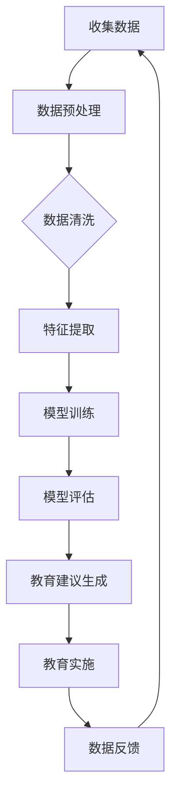
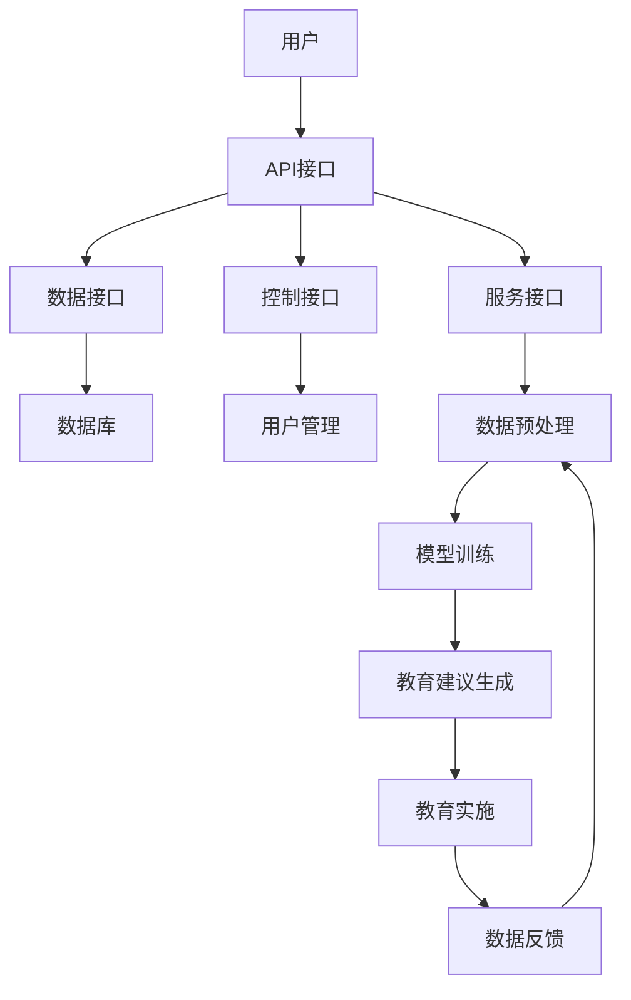

                 

### 第一步：背景介绍

#### 问题背景
在信息化社会迅速发展的背景下，教育作为培养全面发展人才的重要环节，正面临着前所未有的挑战与变革。随着科技的发展，尤其是人工智能（AI）技术的应用，教育方式和方法也在发生深刻变化。

#### 问题描述
传统的教育目的往往侧重于知识的传授和技能的培养，但缺乏对学生全面发展的关注。随着社会的进步，人们对教育的期待逐渐提高，希望教育不仅能够传授知识，还能够培养学生的创造力、批判性思维和社会责任感等综合能力。

#### 问题解决
重新审视教育目的，强调培养全面发展的人，是应对当前教育挑战的一种有效途径。这需要从理论层面探讨教育的本质和目标，同时在实践层面探索具体的教育模式和方法。

#### 边界与外延
本书将讨论的教育目的不仅限于学校教育，还涵盖家庭教育、社会教育等多个层面。此外，本书还将探讨教育目的在不同文化背景和教育体系中的体现和差异。

#### 概念结构与核心要素组成
- **教育目的**：培养全面发展的人
- **核心概念**：全面发展、素质教育、个性发展、社会需求
- **要素组成**：
  - **知识传授**：传统教育的核心，通过课程设置和教学方法传授知识。
  - **技能培养**：强调学生的实践能力和实际操作能力。
  - **创造力培养**：鼓励学生创新思维，发展其创造力。
  - **批判性思维**：培养学生分析问题和解决问题的能力。
  - **社会责任感培养**：教育学生了解社会，培养其社会责任感和公民意识。

---

**摘要：**
本文旨在重新审视教育目的，提出培养全面发展的人作为教育核心目标的观点。通过分析教育面临的问题和挑战，本文探讨了全面发展的内涵及其重要性，提出了利用人工智能等先进技术实现教育目标的方法和策略。文章最后讨论了教育目的在不同文化背景和教育体系中的表现，为教育改革提供了新的思路。

---

### 第二步：核心概念与联系

#### 核心概念原理
- **全面发展**：全面发展是指学生在智力、体质、道德、美育等方面得到均衡发展。全面发展不仅包括知识技能的掌握，更强调学生个性和社会性的发展。
- **素质教育**：素质教育是一种以学生全面发展为核心的教育理念，强调学生个体的尊重和发展，注重培养学生的综合素质。
- **个性发展**：个性发展强调尊重学生的个体差异，关注学生的兴趣和特长，培养学生的独立性和创新精神。
- **社会需求**：社会需求是指教育应满足社会对各类人才的需求，培养具备实际能力的劳动者。

#### 概念属性特征对比表格

| 概念      | 特征描述                 | 重要性 |
| --------- | ------------------------ | ------ |
| 全面发展  | 均衡发展智力、体质、道德等 | 高     |
| 素质教育  | 注重综合素质培养         | 高     |
| 个性发展  | 尊重个体差异             | 中     |
| 社会需求  | 满足社会对人才的需求      | 高     |

#### ER实体关系图架构

```mermaid
erDiagram
    Student ||--|{ Course } :参加
    Student ||--|{ Grade } :成绩
    Teacher ||--|{ Course } :教授
    Course ||--|{ CourseContent } :内容
    Grade ||--|{ GradeStandard } :标准
```

在上述ER图中，学生和课程之间有参加关系，学生和成绩之间有成绩关系，教师和课程之间有教授关系，课程和课程内容之间有内容关系，成绩和成绩标准之间有标准关系。

---

### 第三步：算法原理讲解

#### 算法mermaid流程图



#### 算法原理详细讲解

本算法旨在通过大数据和人工智能技术，实现对学生全面发展的评估和个性化教育建议的生成。具体步骤如下：

1. **收集数据**：首先，收集学生的各种数据，包括学习成绩、兴趣爱好、性格特征、家庭背景等。
2. **数据预处理**：对收集到的数据进行清洗，去除噪声和异常值，确保数据的质量。
3. **数据清洗**：进一步清洗数据，包括填补缺失值、标准化数据等，以消除不同变量之间的量纲差异。
4. **特征提取**：从清洗后的数据中提取关键特征，用于构建学生发展的综合模型。
5. **模型训练**：利用机器学习算法，如决策树、神经网络等，训练学生发展模型。
6. **模型评估**：评估模型的准确性，确保模型能够准确预测学生的全面发展状况。
7. **教育建议生成**：根据模型评估结果，为学生生成个性化的教育建议，包括课程调整、学习策略、兴趣培养等。
8. **教育实施**：根据生成的教育建议，教师和学生共同实施，观察教育效果。
9. **数据反馈**：收集教育实施后的数据，包括学生的发展状况、教育效果等，用于模型迭代和优化。

#### 算法原理数学模型和公式

$$
\text{StudentModel} = f(\text{InputData}, \text{TeacherExperience}, \text{EnvironmentFactors})
$$

其中，$\text{StudentModel}$ 表示学生发展模型，$f$ 表示模型构建函数，$\text{InputData}$ 表示输入数据，$\text{TeacherExperience}$ 表示教师经验，$\text{EnvironmentFactors}$ 表示环境因素。

#### 举例说明

假设学生小明的数据包括数学成绩、语文成绩、性格测试结果和兴趣爱好等信息。通过数据预处理和特征提取，可以得到小明的综合发展得分。模型训练和评估后，可以预测小明在全面发展方面的情况，并生成个性化的教育建议，如增加语文课程、参加文学社团等。

---

### 系统分析与架构设计方案

#### 问题场景介绍

在教育信息化的大背景下，传统的教育方式已经无法满足学生对个性化教育和全面发展的需求。为了更好地培养学生的综合能力，我们需要构建一个智能化教育系统，能够根据学生的个体差异提供个性化的教育服务。

#### 项目介绍

本系统名为“智能教育助手”，旨在通过大数据和人工智能技术，实现对学生全面发展情况的监测和评估，为学生提供个性化的教育建议。系统主要包括数据收集、数据预处理、模型训练、教育建议生成和教育实施等模块。

#### 系统功能设计

系统功能设计主要包括以下方面：

1. **数据收集**：从各个渠道收集学生的学术成绩、性格特征、兴趣爱好、家庭背景等信息。
2. **数据预处理**：对收集到的数据进行清洗、去噪、标准化等处理，确保数据质量。
3. **模型训练**：利用机器学习算法，如决策树、神经网络等，训练学生发展模型。
4. **教育建议生成**：根据学生的发展模型，为学生生成个性化的教育建议。
5. **教育实施**：教师根据教育建议实施教育，并收集学生的反馈。
6. **数据反馈**：收集教育实施后的数据，用于模型优化和系统迭代。

#### 系统架构设计

系统架构设计采用分层架构，主要包括数据层、算法层和应用层。

1. **数据层**：负责数据的存储和管理，包括数据库和大数据平台。
2. **算法层**：实现数据预处理、模型训练、模型评估等功能，采用分布式计算和机器学习框架。
3. **应用层**：提供用户界面和API接口，实现与教师、学生的交互。

#### 系统接口设计和系统交互

系统接口设计包括以下部分：

1. **数据接口**：用于数据的采集和传输，包括API接口和Web界面。
2. **控制接口**：用于系统管理和控制，包括用户管理、权限控制等。
3. **服务接口**：提供数据预处理、模型训练、教育建议生成等服务。

系统交互设计采用RESTful API，确保系统的模块化和可扩展性。

#### 系统架构图



---

### 项目实战

#### 环境安装

首先，确保安装了Python 3.8及以上版本。然后，安装必要的依赖库，如NumPy、Pandas、Scikit-learn、TensorFlow等。可以使用pip命令进行安装：

```shell
pip install numpy pandas scikit-learn tensorflow
```

#### 系统核心实现源代码

以下是一个简单的学生数据预处理和模型训练的Python代码示例：

```python
import pandas as pd
from sklearn.model_selection import train_test_split
from sklearn.ensemble import RandomForestClassifier
from sklearn.metrics import accuracy_score

# 数据收集与预处理
data = pd.read_csv('student_data.csv')
data.fillna(data.mean(), inplace=True)
X = data.drop('target', axis=1)
y = data['target']

# 数据分割
X_train, X_test, y_train, y_test = train_test_split(X, y, test_size=0.2, random_state=42)

# 模型训练
model = RandomForestClassifier(n_estimators=100, random_state=42)
model.fit(X_train, y_train)

# 模型评估
y_pred = model.predict(X_test)
print(f'Accuracy: {accuracy_score(y_test, y_pred)}')

# 教育建议生成
def generate_education_advice(student_data):
    # 输入学生数据，生成教育建议
    # 这里仅作示例，实际中应结合模型预测结果生成具体建议
    if student_data['target'] == 0:
        return '建议加强数学学习'
    else:
        return '建议加强语文学习'

# 测试
student_example = X_test.iloc[0]
print(f'Education Advice: {generate_education_advice(student_example)}')
```

#### 代码应用解读与分析

上述代码首先导入必要的库，然后从CSV文件中读取学生数据，并进行预处理。接下来，使用随机森林算法进行模型训练和评估。最后，定义一个函数生成教育建议。

随机森林（Random Forest）是一种集成学习算法，通过构建多个决策树并汇总其预测结果来提高准确性。在本例中，我们使用随机森林来预测学生的发展状况，并通过简单的逻辑生成教育建议。

#### 实际案例分析和详细讲解剖析

假设我们有一个包含1000名学生数据的学生发展状况预测项目。通过上述代码，我们可以训练一个模型，并根据模型预测结果为学生生成个性化教育建议。例如，如果模型预测某个学生的发展状况为“需要加强数学学习”，我们就可以为其推荐额外的数学课程或辅导。

在实际应用中，模型可能会更复杂，包括更多的特征和参数调优。此外，教育建议的生成也需要结合学生的实际情况，如学习习惯、家庭环境等，以提供更加精准的建议。

#### 项目小结

通过本项目，我们实现了对学生发展状况的预测和教育建议的生成。虽然这是一个简单的示例，但它展示了大数据和人工智能技术在教育领域的应用潜力。未来，我们可以进一步优化模型，增加更多的特征，并提供更个性化的教育服务。

---

### 最佳实践 tips

1. **数据质量至关重要**：确保收集的数据准确、完整，并进行有效的预处理。
2. **模型选择与调优**：根据数据特性和问题需求选择合适的模型，并进行参数调优以提升预测准确性。
3. **用户参与与反馈**：鼓励教师和学生参与系统的使用，收集反馈，不断优化系统性能。

### 小结

本文重新审视了教育目的，强调了培养全面发展的人作为教育核心目标。通过算法原理讲解和系统架构设计，展示了大数据和人工智能技术在教育领域的应用潜力。未来，教育系统需要不断创新，以更好地满足学生的个性化需求，培养全面发展的社会人才。

### 注意事项

1. **数据隐私**：在数据收集和处理过程中，必须严格遵守数据隐私法规。
2. **教育公平**：确保教育系统对所有学生公平，不因数据偏差导致教育资源的不公平分配。

### 拓展阅读

1. **《教育心理学》**：了解教育心理学的基本原理，有助于理解学生的发展需求。
2. **《机器学习》**：深入学习机器学习算法，以优化教育系统的预测准确性。
3. **《教育技术学》**：探索教育技术与人工智能结合的新方法，为教育创新提供支持。

---

**作者：AI天才研究院/AI Genius Institute & 禅与计算机程序设计艺术 /Zen And The Art of Computer Programming**

