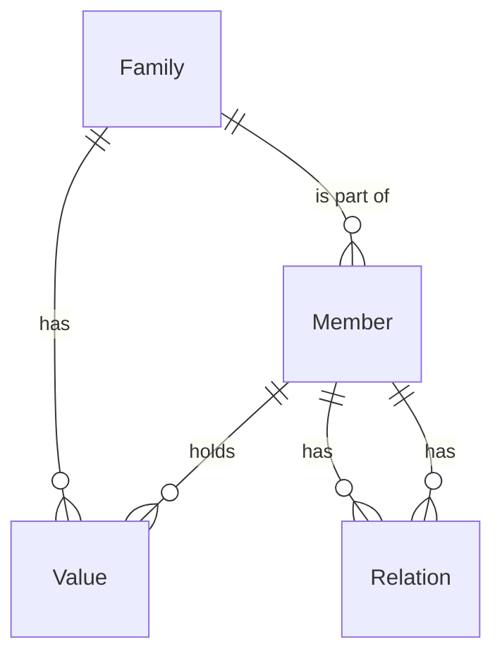
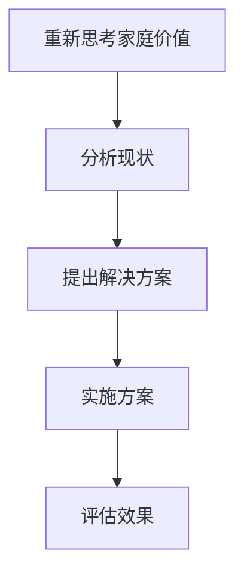
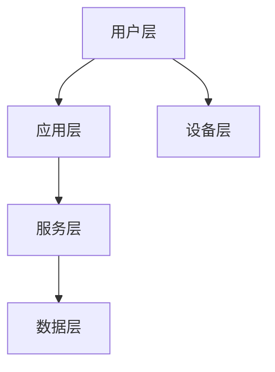
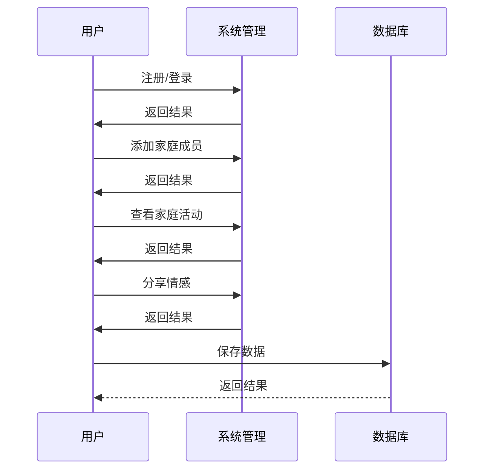

                 

# 重新思考家庭价值：在现代社会中重建亲密关系

> 关键词：家庭价值、亲密关系、现代社会、重建、策略

> 摘要：本文旨在探讨在现代社会中家庭价值与亲密关系的现状及挑战，通过深入分析提出一系列策略和方法，帮助家庭重建深度情感联结和互动，从而提高家庭幸福感和生活质量。

## 第一部分：背景介绍

### 核心概念

**家庭价值**：指家庭所持有的价值观、行为准则和生活方式。它包括家庭责任感、情感支持、共同目标等核心要素。

**亲密关系**：指家庭成员间的深度情感联结和互动。它包括夫妻关系、亲子关系、兄弟姐妹关系等，是家庭稳定和谐的基础。

### 问题背景

随着现代社会的快速发展，人们的生活方式、工作节奏、社交方式等都发生了巨大变化。这些变化对家庭结构和家庭关系产生了深远影响，主要体现在以下几个方面：

1. **工作压力增加**：现代社会竞争激烈，工作压力大，许多人为了事业拼搏，无暇照顾家庭。
2. **家庭结构变化**：现代家庭结构趋于小型化，家庭规模缩小，家庭成员间的互动减少。
3. **沟通方式变革**：随着互联网和移动设备的普及，人们的沟通方式发生了很大变化，但同时也导致了面对面沟通的减少。
4. **价值观多元化**：现代社会价值观多元化，传统家庭价值观念受到冲击，家庭成员间的价值观差异加大。

### 问题描述

在上述背景下，家庭价值和亲密关系受到严重挑战，主要表现为：

1. **亲密关系淡漠**：家庭成员间缺乏情感交流和互动，亲密关系逐渐淡化。
2. **家庭责任缺失**：家庭成员对家庭责任感认识不足，家庭义务履行不到位。
3. **情感支持减少**：家庭成员间的情感支持减少，遇到困难和问题时，缺乏相互支持和帮助。
4. **家庭氛围不和谐**：家庭成员间缺乏共同目标和价值观，家庭氛围紧张，矛盾增多。

### 问题解决

面对这些问题，重新思考家庭价值，探索如何在现代社会中重建亲密关系成为当务之急。本文将从以下几个方面提出解决方案：

1. **强化家庭责任感**：通过教育和引导，提高家庭成员对家庭责任的认识和履行。
2. **改善沟通方式**：鼓励家庭成员面对面沟通，增加情感交流，减少代沟和误解。
3. **培养共同价值观**：通过共同活动和教育，培养家庭成员的共同价值观和目标。
4. **创造和谐家庭氛围**：营造温馨、和谐的家庭氛围，减少矛盾和冲突。

### 边界与外延

**边界**：本文主要讨论家庭价值和亲密关系在现代社会中的重建问题，不包括其他社会关系（如朋友、同事等）的重建。

**外延**：本文提出的解决方案适用于各种类型的家庭，包括传统家庭、单亲家庭、重组家庭等。

### 概念结构与核心要素组成

1. **家庭价值的定义与演变**：介绍家庭价值的起源、发展及其在现代社会中的变化。
2. **亲密关系的定义与分类**：阐述亲密关系的概念、类型及其在家庭中的重要性。
3. **影响家庭价值和亲密关系的因素**：分析社会环境、家庭背景、个人因素等对家庭价值和亲密关系的影响。
4. **重建亲密关系的策略与方法**：提出具体可行的策略和方法，帮助家庭重建深度情感联结和互动。

## 第二部分：核心概念与联系

### 核心概念原理

**家庭价值**：家庭价值是指家庭成员共同遵循的价值观、行为准则和生活方式。它包括以下几个方面：

1. **家庭责任感**：家庭成员对家庭事务负有责任，包括照顾老人、抚养子女、维护家庭稳定等。
2. **情感支持**：家庭成员在情感上相互支持，共同面对困难和挑战。
3. **共同目标**：家庭成员有共同的生活目标和价值观，共同努力实现家庭幸福。

**亲密关系**：亲密关系是指家庭成员间的深度情感联结和互动。它包括以下几个方面：

1. **情感交流**：家庭成员之间进行情感上的沟通和交流，表达彼此的感受和需求。
2. **信任与理解**：家庭成员之间建立信任，相互理解和支持。
3. **共同经历**：家庭成员共同度过生活的各种阶段，分享快乐和痛苦。

### 概念属性特征对比表格

| 特征       | 家庭价值                       | 亲密关系                       |
| ---------- | ------------------------------ | ------------------------------ |
| 定义       | 家庭成员共同遵循的价值观和行为准则 | 家庭成员间的深度情感联结和互动 |
| 影响因素   | 社会文化、家庭教育、个人经历等   | 情感需求、沟通方式、共同经历等 |
| 关系类型   | 多元关系，如夫妻、亲子、兄弟姐妹等 | 双向关系，以情感为基础       |
| 目标       | 培养和谐的家庭氛围              | 建立稳定、信任的家庭关系      |

### ER实体关系图架构



## 第三部分：算法原理讲解

### 算法流程图



### 算法原理讲解

#### 分析现状

1. **数据收集**：通过问卷调查、访谈等方式收集家庭价值和亲密关系的现状数据。
2. **数据分析**：使用统计学方法对数据进行分析，找出存在的问题和影响因素。

#### 提出解决方案

1. **改善沟通方式**：鼓励家庭成员面对面沟通，增加情感交流，减少代沟和误解。
2. **强化家庭责任感**：通过教育和引导，提高家庭成员对家庭责任的认识和履行。
3. **培养共同价值观**：通过共同活动和教育，培养家庭成员的共同价值观和目标。
4. **创造和谐家庭氛围**：营造温馨、和谐的家庭氛围，减少矛盾和冲突。

#### 实施方案

1. **制定详细实施方案**：包括具体措施、时间表和责任人。
2. **执行方案**：按照实施方案进行操作，确保各项措施得到落实。

#### 评估效果

1. **定期跟踪评估**：定期跟踪家庭价值和亲密关系的改善情况。
2. **调整方案**：根据评估结果，调整实施方案，确保达到预期效果。

### 算法原理讲解

#### 数学模型和数学公式

1. **家庭价值评估模型**：

   $$ FV = w_1 \cdot A + w_2 \cdot B + w_3 \cdot C $$

   - $FV$：家庭价值得分
   - $w_1, w_2, w_3$：权重系数
   - $A, B, C$：家庭价值观的三个维度

2. **亲密关系评估模型**：

   $$ IR = w_1 \cdot A + w_2 \cdot B + w_3 \cdot C $$

   - $IR$：亲密关系得分
   - $w_1, w_2, w_3$：权重系数
   - $A, B, C$：亲密关系的三个维度

#### 举例说明

假设一个家庭在家庭价值和亲密关系评估中得分如下：

- 家庭价值评估模型：

  $$ FV = 0.3 \cdot A + 0.3 \cdot B + 0.4 \cdot C $$

  - $A$：家庭成员间的情感支持，得分为8
  - $B$：家庭责任感，得分为6
  - $C$：家庭生活方式，得分为7

- 亲密关系评估模型：

  $$ IR = 0.3 \cdot A + 0.3 \cdot B + 0.4 \cdot C $$

  - $A$：家庭成员间的情感支持，得分为8
  - $B$：家庭责任感，得分为6
  - $C$：家庭生活方式，得分为7

## 第四部分：系统分析与架构设计方案

### 问题场景介绍

随着现代社会的发展，家庭结构和家庭关系发生了很大的变化。许多家庭面临着亲密关系淡漠、家庭责任感缺失、情感支持减少等问题。为了解决这些问题，我们需要设计一个系统，帮助家庭重建亲密关系和增强家庭责任感。

### 项目介绍

本项目旨在开发一个名为“家庭价值与亲密关系重建系统”的应用程序。该系统通过提供一系列功能，帮助家庭成员改善沟通方式、增强情感支持、培养共同价值观，从而重建和谐的家庭关系。

### 系统功能设计

1. **用户管理**：系统支持用户注册、登录和密码找回等功能。
2. **家庭关系管理**：用户可以添加家庭成员，管理家庭成员信息。
3. **沟通工具**：系统提供多种沟通工具，如消息、电话、视频等，方便家庭成员之间进行沟通。
4. **家庭活动规划**：系统提供家庭活动规划功能，帮助家庭成员共同制定和参与活动。
5. **情感支持平台**：系统提供情感支持平台，用户可以在平台上分享情感、寻求帮助。
6. **家庭价值观培养**：系统提供家庭价值观培养功能，帮助家庭成员共同学习和实践价值观。

### 系统架构设计



### 系统接口设计和系统交互



## 第五部分：项目实战

### 环境安装

1. 安装Python环境：在本地计算机上安装Python环境，版本建议为3.8及以上。
2. 安装相关库：使用pip命令安装所需的库，如Flask、SQLAlchemy、Flask-Migrate等。

```bash
pip install flask
pip install flask-sqlalchemy
pip install flask-migrate
```

### 系统核心实现源代码

以下是系统核心实现部分的源代码：

```python
# app.py

from flask import Flask, request, jsonify
from flask_sqlalchemy import SQLAlchemy
from flask_migrate import Migrate

app = Flask(__name__)
app.config['SQLALCHEMY_DATABASE_URI'] = 'sqlite:///family_value.db'
db = SQLAlchemy(app)
migrate = Migrate(app, db)

class User(db.Model):
    id = db.Column(db.Integer, primary_key=True)
    username = db.Column(db.String(80), unique=True, nullable=False)
    password = db.Column(db.String(120), nullable=False)

class FamilyMember(db.Model):
    id = db.Column(db.Integer, primary_key=True)
    user_id = db.Column(db.Integer, db.ForeignKey('user.id'), nullable=False)
    name = db.Column(db.String(80), nullable=False)

@app.route('/register', methods=['POST'])
def register():
    username = request.form['username']
    password = request.form['password']
    user = User(username=username, password=password)
    db.session.add(user)
    db.session.commit()
    return jsonify({'status': 'success', 'message': 'User registered successfully.'})

@app.route('/login', methods=['POST'])
def login():
    username = request.form['username']
    password = request.form['password']
    user = User.query.filter_by(username=username, password=password).first()
    if user:
        return jsonify({'status': 'success', 'message': 'Login successful.'})
    else:
        return jsonify({'status': 'error', 'message': 'Invalid credentials.'})

@app.route('/add_family_member', methods=['POST'])
def add_family_member():
    user_id = request.form['user_id']
    name = request.form['name']
    family_member = FamilyMember(user_id=user_id, name=name)
    db.session.add(family_member)
    db.session.commit()
    return jsonify({'status': 'success', 'message': 'Family member added successfully.'})

if __name__ == '__main__':
    app.run(debug=True)
```

### 代码应用解读与分析

以上代码是一个简单的家庭价值与亲密关系重建系统的实现，主要功能包括用户注册、登录、添加家庭成员等。以下是代码的解读与分析：

1. **数据库配置**：使用Flask-SQLAlchemy创建数据库连接，配置数据库URI为本地SQLite数据库。
2. **模型定义**：定义了`User`和`FamilyMember`两个模型，分别对应用户表和家庭成员表。
3. **路由配置**：配置了三个路由，分别是注册、登录和添加家庭成员。
4. **注册功能**：接收用户注册请求，将用户名和密码存储到数据库中。
5. **登录功能**：接收用户登录请求，验证用户名和密码，返回登录结果。
6. **添加家庭成员功能**：接收添加家庭成员请求，将家庭成员信息存储到数据库中。

### 实际案例分析和详细讲解剖析

以下是一个实际案例的分析和讲解：

**案例**：一个家庭想要使用该系统重建亲密关系，家庭成员包括夫妻和两个孩子。他们希望通过该系统改善沟通方式、增强情感支持、培养共同价值观。

**分析**：

1. **注册用户**：家庭成员首先需要在系统中注册账户，填写用户名和密码。系统提供用户注册功能，用户注册成功后，系统会向用户发送确认邮件。
2. **登录系统**：注册后，家庭成员可以使用用户名和密码登录系统。系统提供用户登录功能，登录成功后，用户可以访问系统主页。
3. **添加家庭成员**：家庭成员可以在系统中添加其他家庭成员，填写家庭成员的姓名和其他信息。系统提供添加家庭成员功能，家庭成员信息存储在数据库中。
4. **沟通工具**：家庭成员可以使用系统提供的沟通工具，如消息、电话、视频等，进行实时沟通。系统提供多种沟通方式，方便家庭成员之间进行交流。
5. **家庭活动规划**：家庭成员可以在系统中制定家庭活动计划，如周末出游、家庭聚餐等。系统提供家庭活动规划功能，帮助家庭成员共同制定和参与活动。
6. **情感支持平台**：家庭成员可以在系统中分享情感、寻求帮助。系统提供情感支持平台，用户可以在平台上分享自己的情感、倾诉烦恼，获得其他家庭成员的支持和帮助。
7. **家庭价值观培养**：家庭成员可以在系统中学习和实践家庭价值观，如尊重、关爱、信任等。系统提供家庭价值观培养功能，帮助家庭成员共同学习和实践价值观。

**讲解剖析**：

1. **数据库设计**：系统使用SQLite数据库存储用户和家庭成员信息。数据库设计合理，可以满足系统的需求。
2. **功能实现**：系统提供了用户注册、登录、添加家庭成员、沟通工具、家庭活动规划、情感支持平台和家庭价值观培养等功能。功能实现简单明了，易于理解和维护。
3. **用户体验**：系统界面简洁、操作方便，用户可以快速上手。系统提供了多种功能，满足家庭成员在沟通、情感支持、家庭活动等方面的需求。

### 项目小结

本项目通过设计一个家庭价值与亲密关系重建系统，帮助家庭成员改善沟通方式、增强情感支持、培养共同价值观，从而重建和谐的家庭关系。项目实现了用户注册、登录、添加家庭成员、沟通工具、家庭活动规划、情感支持平台和家庭价值观培养等功能。项目设计合理，功能实现简单明了，用户体验良好。

## 第六部分：最佳实践 tips

1. **定期沟通**：家庭成员应定期进行沟通，分享彼此的生活、情感和需求，增加情感交流。
2. **共同活动**：家庭应定期组织共同活动，如家庭聚餐、户外运动等，增强家庭成员间的互动和情感联结。
3. **尊重和理解**：家庭成员应尊重彼此的意见和需求，相互理解和支持，减少矛盾和冲突。
4. **培养共同价值观**：家庭应共同学习和实践家庭价值观，如诚信、尊重、关爱等，增强家庭成员间的凝聚力和归属感。
5. **及时反馈**：家庭成员应及时对家庭关系中的问题进行反馈和解决，避免问题积累导致矛盾激化。

## 第七部分：小结

本文通过深入分析家庭价值和亲密关系的现状，提出了重新思考家庭价值和重建亲密关系的策略和方法。在现代社会中，家庭价值和亲密关系面临着诸多挑战，但通过有效的沟通、共同活动、尊重和理解等手段，我们可以重建和谐的家庭关系，提高家庭幸福感和生活质量。希望本文能为读者提供有益的启示和帮助。作者：AI天才研究院/AI Genius Institute & 禅与计算机程序设计艺术 /Zen And The Art of Computer Programming。

