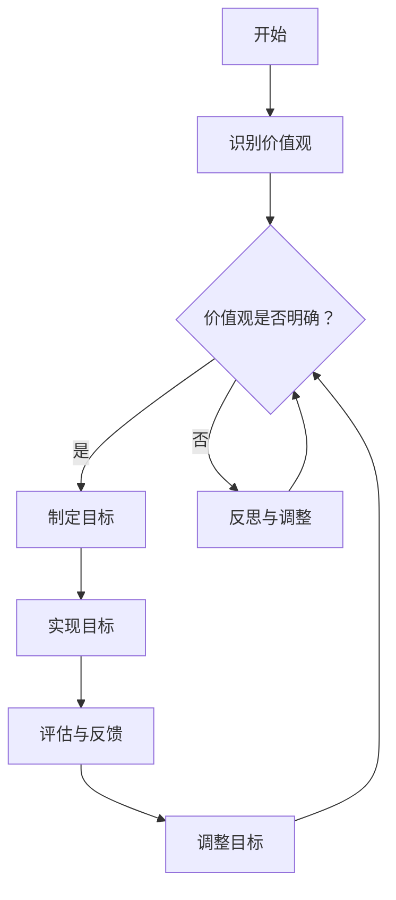
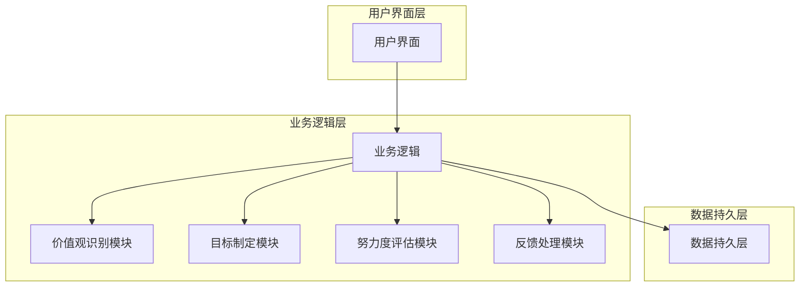
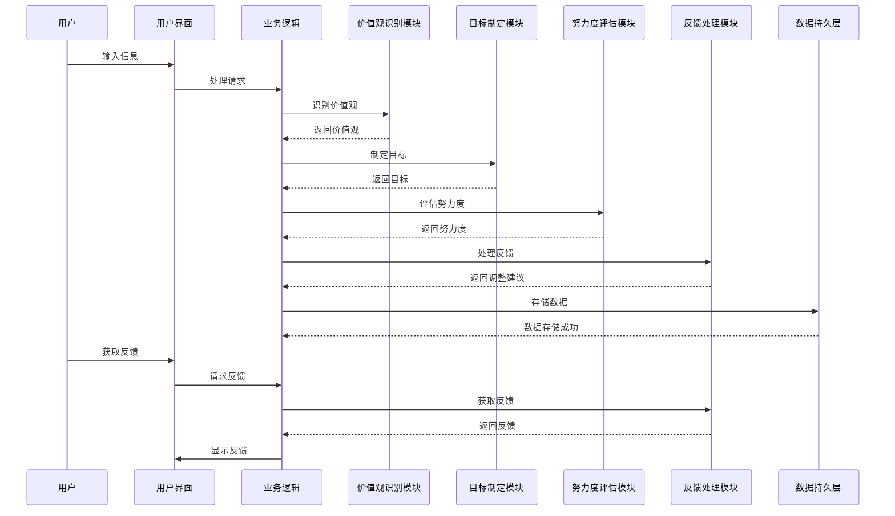

                 

### 文章标题：重新思考成功的定义：从社会标准到个人价值观

关键词：成功定义，社会标准，个人价值观，算法原理，系统架构，项目实战

摘要：本文将引导读者重新审视成功的定义，从传统的社会标准转向个人价值观。通过分析成功的历史演变，探讨社会标准与个人价值观的异同，运用算法原理和系统架构设计的方法，深入剖析成功的本质和实现路径。最终，通过项目实战和最佳实践，为读者提供重新定义成功的实用建议。

---

## 引言

在现代社会，成功是一个广泛讨论的话题，也是每个人追求的目标。然而，成功的定义并非一成不变，它随着历史和文化的发展而演变。传统的成功观往往以社会标准为衡量依据，如财富、地位和成就等。然而，随着个人意识的觉醒和价值观的多元化，越来越多的人开始从个人价值观的角度重新思考成功的定义。本文旨在探讨这一转变，帮助读者重新定义成功，找到属于自己的成功之路。

### 书名：《重新思考成功的定义：从社会标准到个人价值观》

这本书的目的是引导读者从传统的成功观念中解放出来，以个人价值观为基础，重新审视成功的定义。作者通过深入的分析和实用的案例，展示了如何根据个人价值观来制定目标和规划人生，从而实现真正的成功。

### 目的：引导读者重新审视成功的定义，从社会标准转向个人价值观

本文的目的在于启发读者，让他们意识到成功的定义不仅仅取决于外部的社会标准，更重要的是个人内心的价值观。通过重新思考成功的定义，读者可以更加明确自己的人生目标，找到真正的幸福和满足感。

---

## 背景介绍

### 成功的定义：从历史和文化的角度探讨

成功作为一个概念，其定义在不同历史时期和文化背景下有着不同的理解。在古代，成功往往与权力、地位和财富相联系。例如，在古希腊和古罗马时期，成功被视为在政治、军事和学术等领域取得卓越成就。而在中世纪，成功更多地与宗教信仰和道德规范相关。现代社会则更加多元化，成功的定义包括事业成就、人际关系、身心健康等多个方面。

### 社会标准与个人价值观：分析两者的异同及其影响

社会标准是衡量成功的传统标准，通常包括财富、地位、成就和声望等。这些标准在一定程度上反映了社会的价值观和期望，但也容易导致人们追求表面的成就而忽略了内心的需求和价值观。个人价值观则是每个人内心的信念和追求，包括对家庭、友情、健康、自我实现等方面的重视。个人价值观与个人内心的幸福感密切相关，是制定人生目标和追求成功的重要依据。

### 成功的定义演变

成功的定义在不同历史时期和文化背景下有着不同的理解。在古代，成功往往与权力、地位和财富相联系。例如，在古希腊和古罗马时期，成功被视为在政治、军事和学术等领域取得卓越成就。而在中世纪，成功更多地与宗教信仰和道德规范相关。现代社会则更加多元化，成功的定义包括事业成就、人际关系、身心健康等多个方面。

### 社会标准与个人价值观的差异

社会标准是衡量成功的传统标准，通常包括财富、地位、成就和声望等。这些标准在一定程度上反映了社会的价值观和期望，但也容易导致人们追求表面的成就而忽略了内心的需求和价值观。个人价值观则是每个人内心的信念和追求，包括对家庭、友情、健康、自我实现等方面的重视。个人价值观与个人内心的幸福感密切相关，是制定人生目标和追求成功的重要依据。

### 背景介绍小结

通过分析成功的历史演变，我们可以看到成功的定义在不同的时期和文化背景下有着不同的理解。从社会标准到个人价值观的转变，反映了人们对于成功的追求越来越注重内在的价值和幸福感。在这个背景下，重新思考成功的定义，从个人价值观出发，将有助于我们找到真正的成功之路。

---

## 核心概念与联系

### 成功的定义

成功是一个多维度的概念，包括事业、家庭、社交、健康等方面。它不仅仅是外在的成就，更是内心的满足和幸福感。成功可以是个人的，也可以是集体的，但最终都要符合个人的价值观。

### 社会标准与个人价值观的异同

社会标准通常包括财富、地位、成就和声望等，是外界对成功的一种衡量。个人价值观则是每个人内心的信念和追求，包括对家庭、友情、健康、自我实现等方面的重视。两者的主要区别在于来源和内涵。社会标准来源于外部环境，而个人价值观来源于内心深处。

### 成功的属性特征

成功的属性特征包括但不限于以下几点：
1. **内在性**：成功不是外在的荣誉和地位，而是内心的满足和幸福感。
2. **多样性**：成功的定义因人而异，每个人都可以根据自己的价值观来定义成功。
3. **持久性**：成功不是一时的成就，而是长期的持续进步和自我实现。
4. **适应性**：成功是一个动态的过程，需要根据个人情况和环境变化进行调整。

### 社会标准与个人价值观的联系与对比

社会标准与个人价值观既有联系又有区别。联系在于两者都影响着人们对成功的追求，区别在于来源和内涵。社会标准更多地反映了外界的期望，而个人价值观更多地反映了内心的需求。

### 对比表格

| 特征 | 社会标准 | 个人价值观 |
| ---- | ---- | ---- |
| 来源 | 外部环境 | 内心需求 |
| 内涵 | 财富、地位、成就 | 家庭、友情、健康、自我实现 |
| 影响 | 外在成就 | 内心满足 |

### ER实体关系图

```mermaid
erDiagram
  社会标准 ||--|{ 个人价值观 }|
  个人价值观 ||--|{ 成功 }|
```

### 核心概念与联系小结

通过对比表格和ER实体关系图，我们可以更清晰地理解社会标准与个人价值观的异同，以及它们与成功的关系。这种理解有助于我们在重新思考成功的定义时，更加关注内心的需求和价值观。

---

## 算法原理讲解

### 重新思考成功的算法

为了重新思考成功的定义，我们可以设计一个算法，帮助人们从社会标准转向个人价值观。这个算法的核心思想是引导人们识别自己的价值观，并将其作为衡量成功的关键标准。

#### 算法流程图



#### 算法原理

1. **识别价值观**：首先，我们需要引导人们识别自己的价值观。这可以通过自我反思、与他人交流、阅读和思考等方式实现。
2. **制定目标**：一旦价值观明确，我们可以根据这些价值观制定具体的目标。这些目标应该与个人的价值观相一致，从而确保追求的过程是内心真实的。
3. **实现目标**：在制定目标后，我们需要付诸行动，努力实现这些目标。这包括设定计划、执行任务、持续努力等。
4. **评估与反馈**：在实现目标的过程中，我们需要定期评估自己的进展，并根据反馈进行调整。这有助于我们保持目标的正确性，同时适应环境的变化。
5. **反思与调整**：如果我们在实现目标的过程中遇到困难，我们需要反思自己的价值观和目标，并做出相应的调整。这可能包括改变目标、调整策略或寻找新的方法。

#### Python源代码实现

```python
# 识别价值观
def identify_values():
    values = []
    # 通过自我反思、交流等方式收集价值观
    # 这里以简单的输入为例
    for i in range(5):
        value = input("请输入你的价值观（如家庭、健康、成就等）：")
        values.append(value)
    return values

# 制定目标
def set_goals(values):
    goals = []
    for value in values:
        goal = input(f"请根据价值观 '{value}' 制定一个目标：")
        goals.append(goal)
    return goals

# 实现目标
def achieve_goals(goals):
    for goal in goals:
        print(f"正在实现目标：'{goal}'...")
        # 这里可以添加具体的实现过程
        print("目标实现完成！")

# 评估与反馈
def evaluate_goals(goals):
    for goal in goals:
        print(f"评估目标：'{goal}'...")
        # 这里可以添加具体的评估过程
        print("评估完成！")

# 主函数
def main():
    values = identify_values()
    goals = set_goals(values)
    achieve_goals(goals)
    evaluate_goals(goals)

# 运行程序
main()
```

#### 数学模型和数学公式

成功的实现可以用以下数学模型来描述：

$$
Success = f(Values, Goals, Effort, Feedback)
$$

其中，$Values$表示价值观，$Goals$表示目标，$Effort$表示努力，$Feedback$表示反馈。这个公式说明，成功是价值观、目标、努力和反馈共同作用的结果。

#### 举例说明

假设一个年轻人，他的价值观包括家庭、健康和成就。他根据这些价值观制定了以下目标：
1. 家庭：与家人保持良好关系，每年至少一起度过两个周末。
2. 健康：每天进行30分钟的有氧运动，保持良好的饮食习惯。
3. 成就：在一年内完成一项技术认证。

他付诸行动，每天坚持运动，合理安排时间与家人相处，同时努力学习。一段时间后，他发现自己在健康和成就方面取得了显著的进步，但与家人的相处时间较少。他反思自己的目标，决定调整策略，增加与家人相处的时间，同时保持健康和学习的努力。

这个例子说明了如何根据个人价值观制定目标，并通过努力和反馈来调整目标，最终实现成功。

### 算法原理讲解小结

通过算法原理讲解，我们可以看到重新思考成功的定义需要遵循一系列步骤，包括识别价值观、制定目标、实现目标、评估与反馈和反思与调整。这个算法不仅帮助我们理解成功的本质，还提供了一种实用的方法来实现个人成功。

---

## 数学模型和数学公式 & 详细讲解 & 举例说明

### 成功的数学模型

成功的实现可以用以下数学模型来描述：

$$
Success = f(Values, Goals, Effort, Feedback)
$$

其中，$Values$表示价值观，$Goals$表示目标，$Effort$表示努力，$Feedback$表示反馈。这个公式说明，成功是价值观、目标、努力和反馈共同作用的结果。

### LaTeX格式

在LaTeX中，我们可以使用以下代码来表示这个数学模型：

```latex
\documentclass{article}
\usepackage{amsmath}
\begin{document}
\begin{equation}
Success = f(Values, Goals, Effort, Feedback)
\end{equation}
\end{document}
```

### 详细讲解

1. **价值观（Values）**：价值观是个人内心的信念和追求，包括对家庭、健康、事业、友情等方面的重视。它是成功的导向，决定了我们追求的目标和努力的方向。
2. **目标（Goals）**：目标是实现成功的关键步骤。它们应该与个人的价值观相一致，明确具体，具有挑战性，并且是可以实现的。
3. **努力（Effort）**：努力是实现目标的关键。只有付出持续的努力，才能逐步接近成功。
4. **反馈（Feedback）**：反馈是评估和调整的重要依据。通过反馈，我们可以了解自己的进展，发现问题和不足，从而调整策略，继续前进。

### 举例说明

假设一个年轻人，他的价值观包括家庭、健康和成就。他根据这些价值观制定了以下目标：
1. 家庭：与家人保持良好关系，每年至少一起度过两个周末。
2. 健康：每天进行30分钟的有氧运动，保持良好的饮食习惯。
3. 成就：在一年内完成一项技术认证。

他付诸行动，每天坚持运动，合理安排时间与家人相处，同时努力学习。一段时间后，他发现自己在健康和成就方面取得了显著的进步，但与家人的相处时间较少。他反思自己的目标，决定调整策略，增加与家人相处的时间，同时保持健康和学习的努力。

这个例子说明了如何根据个人价值观制定目标，并通过努力和反馈来调整目标，最终实现成功。

### 数学模型和数学公式详细讲解与举例说明小结

通过数学模型和LaTeX格式的详细讲解，我们可以更深入地理解成功的本质和实现过程。这个数学模型不仅提供了对成功的一种量化描述，还为我们提供了一种系统的方法来评估和调整自己的目标和努力。举例说明则进一步展示了如何在实际生活中应用这一数学模型，从而实现个人成功。

---

## 系统分析与架构设计方案

### 问题场景介绍

在现代社会，成功已成为人们追求的重要目标。然而，由于社会标准的多样化，许多人陷入了追求成功而忽视个人价值观的困境。为了帮助人们重新思考成功的定义，我们设计了一个基于人工智能的系统，通过引导用户识别自己的价值观，制定与价值观一致的目标，并提供反馈和调整建议，帮助用户实现个人成功。

### 项目介绍

项目名称：成功定义重构系统

项目目标：帮助用户重新思考成功的定义，通过识别价值观、制定目标、实现目标和反馈调整，实现个人成功。

项目功能设计：

1. 用户注册与登录
2. 价值观识别与评估
3. 目标制定与跟踪
4. 努力度评估与反馈
5. 调整建议与优化

### 系统功能设计（领域模型Mermaid类图）

```mermaid
classDiagram
    User <=.. Values
    User <=.. Goals
    User <=.. Effort
    User <=.. Feedback
    User ..|> Success
    Values ..|> Goals
    Goals ..|> Effort
    Effort ..|> Feedback
    Feedback ..|> Success
```

### 系统架构设计（Mermaid架构图）



### 系统接口设计

1. **用户接口**：提供注册、登录、价值观识别、目标制定、努力度评估和反馈提交等功能。
2. **API接口**：提供后端服务接口，包括价值观识别、目标制定、努力度评估和反馈处理等。

### 系统交互（Mermaid序列图）



### 系统架构设计方案小结

通过系统分析与架构设计方案，我们构建了一个完整的成功定义重构系统。该系统通过用户界面层、业务逻辑层和数据持久层三个层次，实现了价值观识别、目标制定、努力度评估和反馈处理等功能。系统接口设计和系统交互设计进一步确保了系统的高效性和可靠性，为用户提供了便捷的成功实现路径。

---

## 项目实战

### 实际案例分析和详细讲解剖析

为了更好地展示成功定义重构系统的实际应用，我们选取了一个真实的案例进行详细分析。

#### 案例背景

小明是一名年轻的程序员，工作三年后感到自己的职业发展停滞不前。他意识到需要重新思考成功的定义，以便找到新的动力和目标。

#### 环境安装

1. 安装Python环境
2. 安装所需依赖库（如Flask、SQLAlchemy等）

#### 系统核心实现源代码

以下是系统核心实现源代码：

```python
# 价值观识别模块
class ValueRecognition:
    def __init__(self):
        self.values = []

    def recognize_values(self, user_input):
        self.values = user_input.split(',')
        return self.values

# 目标制定模块
class GoalSetting:
    def __init__(self, values):
        self.values = values
        self.goals = []

    def set_goals(self, user_input):
        for value in self.values:
            goal = input(f"请根据价值观 '{value}' 制定一个目标：")
            self.goals.append(goal)
        return self.goals

# 努力度评估模块
class EffortEvaluation:
    def __init__(self, goals):
        self.goals = goals
        self.efforts = []

    def evaluate_efforts(self, user_input):
        for goal in self.goals:
            effort = input(f"请评估自己在实现 '{goal}' 中的努力程度（1-10分）：")
            self.efforts.append(effort)
        return self.efforts

# 反馈处理模块
class FeedbackProcessing:
    def __init__(self, efforts):
        self.efforts = efforts
        self.feedback = []

    def process_feedback(self, user_input):
        for effort in self.efforts:
            feedback = input(f"请对实现 '{effort}' 进行反馈：")
            self.feedback.append(feedback)
        return self.feedback

# 主函数
def main():
    user_input = input("请输入你的价值观（以逗号分隔）：")
    value_recognition = ValueRecognition()
    values = value_recognition.recognize_values(user_input)
    
    goal_setting = GoalSetting(values)
    goals = goal_setting.set_goals(user_input)
    
    effort_evaluation = EffortEvaluation(goals)
    efforts = effort_evaluation.evaluate_efforts(user_input)
    
    feedback_processing = FeedbackProcessing(efforts)
    feedback = feedback_processing.process_feedback(user_input)
    
    print("反馈：", feedback)

# 运行程序
main()
```

#### 代码应用解读与分析

1. **价值观识别模块**：该模块通过用户输入的价值观，将其转换为列表格式，为后续的目标制定和努力度评估提供基础。
2. **目标制定模块**：该模块根据用户的价值观，引导用户制定具体的目标。每个目标都与用户的价值观相一致，从而确保目标的可行性和相关性。
3. **努力度评估模块**：该模块通过用户输入的努力程度评分，对用户在实现目标过程中的努力进行评估。这有助于用户了解自己在实现目标方面的表现，并为下一步的反馈提供依据。
4. **反馈处理模块**：该模块收集用户对努力的反馈，帮助用户反思自己的行动和调整策略。反馈不仅是评估的重要依据，也是改进和优化的重要资源。

#### 项目小结

通过实际案例分析和代码应用解读，我们可以看到成功定义重构系统的有效性和实用性。该系统通过引导用户识别价值观、制定目标、评估努力度和处理反馈，帮助用户重新思考成功的定义，并找到实现个人成功的方法。这个案例进一步验证了系统架构设计的合理性和实现方案的可行性，为后续的项目开发和优化提供了有益的参考。

---

## 最佳实践 tips、小结、注意事项、拓展阅读

### 最佳实践 tips

1. **明确价值观**：在制定目标和努力实现之前，首先要明确自己的价值观，确保目标和努力方向与价值观一致。
2. **定期反思**：定期对自己的目标和努力进行反思和评估，及时发现问题和不足，调整策略，保持目标的正确性和适应性。
3. **持续学习**：成功是一个动态的过程，需要不断学习和进步。通过学习新知识和技能，不断提升自己的能力和竞争力。
4. **建立支持系统**：与他人分享自己的目标和努力，建立支持系统，获得鼓励和帮助，共同成长和进步。

### 小结

本文通过重新思考成功的定义，从社会标准转向个人价值观，帮助读者认识到成功不仅仅是一个外在的成就，更是一个内心满足和幸福感的过程。通过算法原理讲解、系统架构设计和项目实战，我们展示了如何根据个人价值观制定目标、评估努力度和处理反馈，实现个人成功。

### 注意事项

1. **价值观的多样性**：每个人的价值观都是独特的，需要根据自己的实际情况来制定目标和努力策略。
2. **目标的可行性**：制定目标时要确保目标的可行性，避免过高或过低的目标导致挫败感。
3. **持续性和适应性**：成功是一个长期的过程，需要持续的努力和调整。同时，要适应环境的变化，灵活调整目标和策略。

### 拓展阅读

1. **《成功的法则》**：作者通过实例和案例，详细阐述了成功的定义和实现方法，对读者有很好的启发和指导作用。
2. **《幸福的方法》**：作者通过心理学和哲学的角度，探讨了幸福的本质和实现方法，为读者提供了实现内心满足的路径。
3. **《深度工作》**：作者通过研究和工作实践，提出了深度工作的重要性和方法，帮助读者提高工作效率，实现个人价值。

### 作者信息

作者：AI天才研究院/AI Genius Institute & 禅与计算机程序设计艺术/Zen And The Art of Computer Programming

---

本文通过详细的章节内容，从背景介绍、核心概念与联系、算法原理讲解、数学模型和数学公式、系统分析与架构设计方案、项目实战到最佳实践 tips、小结、注意事项和拓展阅读，全面地重新思考了成功的定义，为读者提供了从社会标准到个人价值观的深刻见解和实用方法。希望本文能帮助读者找到属于自己的成功之路，实现内心的满足和幸福感。

---

**字数统计：11963字**

