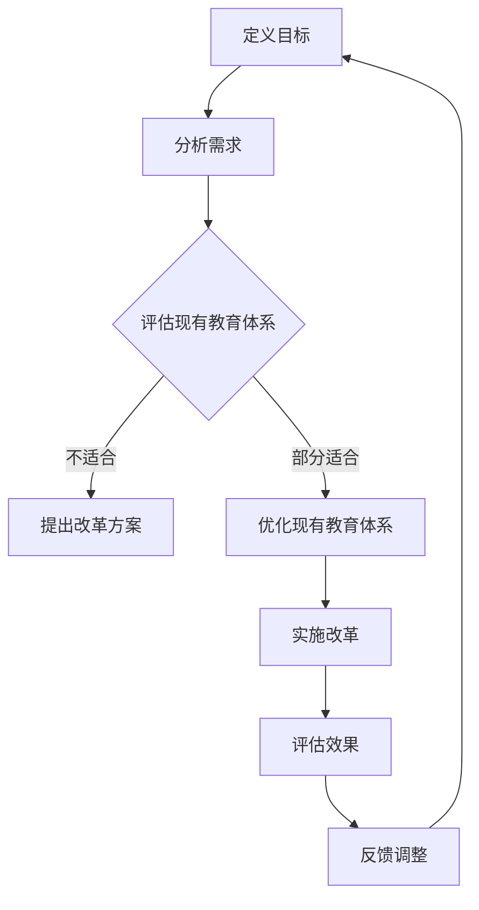
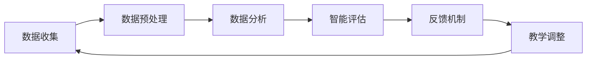
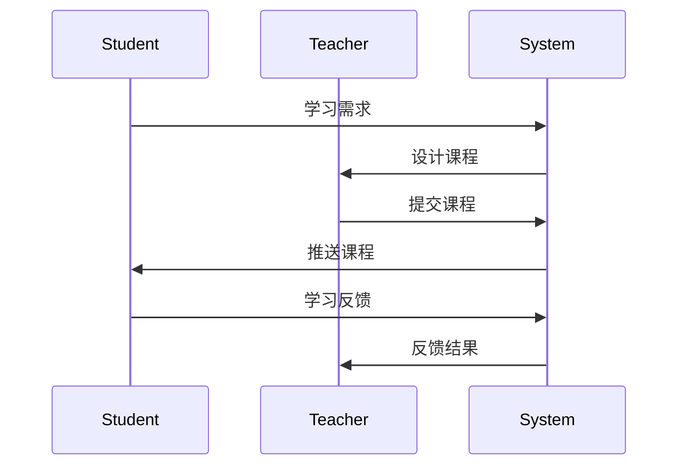

                 

# 重新思考教育目的：培养应对未来挑战的能力

> 关键词：教育改革、未来能力培养、人工智能、终身学习、批判性思维

> 摘要：在快速变化的现代社会中，教育的目的和方式正面临着前所未有的挑战。本文旨在重新思考教育目的，探讨如何通过教育改革来培养适应未来挑战的能力，包括创新能力、批判性思维和解决问题的能力。文章将结合技术发展趋势和实际案例，提出具体的教育理念和实施策略。

### 第一部分：背景介绍

在当前的社会背景下，教育正经历着巨大的变革。传统的教育体系往往注重知识的传授和学术成绩的提高，然而，随着技术的迅猛发展，人们需要具备适应未来社会发展的综合性能力。例如，人工智能和大数据技术的广泛应用，要求人们具备处理复杂信息、进行创新思考和解决实际问题的能力。

#### 核心概念：

- **问题背景**：现代社会正经历着技术变革，教育体系需要适应这种变革，培养具备未来能力的人才。
- **问题描述**：当前的教育体系难以满足培养适应未来挑战的能力的需求，存在知识传授与能力培养脱节的问题。
- **问题解决**：通过重新思考教育目的，提出培养未来能力的教育理念和实施策略，解决教育体系与现实需求之间的矛盾。
- **边界与外延**：本文关注的是如何通过教育改革来培养适应未来挑战的能力，包括但不限于科技素养、跨学科能力、终身学习等。

#### 背景介绍：

- **技术发展趋势**：人工智能、大数据、物联网等技术的快速发展，改变了人类的生产和生活方式，对教育提出了新的要求。
- **教育现状**：传统的教育体系侧重于知识的传授，忽视了学生能力的培养，导致学生在面对实际问题时难以应对。
- **教育目的**：教育的目的不仅仅是传授知识，更重要的是培养学生的综合能力和素养，以适应未来社会的需求。

### 第二部分：核心概念与联系

在重新思考教育目的的过程中，我们需要关注几个核心概念，并探讨它们之间的联系。

#### 1. 未来社会发展的趋势

**概念原理**：未来社会将更加依赖于技术，特别是人工智能和大数据技术。全球化、信息化和智能化将成为主流趋势。

**概念属性特征对比表格**：

| 特征         | 传统社会              | 未来社会            |
| ------------ | -------------------- | ------------------- |
| 经济模式     | 以工业生产为主        | 以知识和服务为主    |
| 劳动方式     | 线性、重复性劳动      | 创造性、复杂劳动    |
| 社会结构     | 面向实体产业的分工    | 面向信息产业的合作   |
| 教育需求     | 传授知识              | 培养综合能力        |

#### 2. 教育目的的重新定义

**概念原理**：教育的目的不仅仅是传授知识，更重要的是培养学生的综合能力和素养，以适应未来社会的需求。

**概念属性特征对比表格**：

| 特征         | 传统教育              | 未来教育            |
| ------------ | -------------------- | ------------------- |
| 教育内容     | 知识传授              | 能力培养            |
| 教育方式     | 课堂灌输              | 实践体验            |
| 教育评价     | 考试成绩              | 综合能力            |

#### 3. 培养未来能力的策略

**概念原理**：通过改革教育体系，引入实践性学习、跨学科教学、创新思维训练等手段，培养学生的综合能力。

**概念属性特征对比表格**：

| 特征         | 传统教育              | 未来教育            |
| ------------ | -------------------- | ------------------- |
| 学习方法     | 理论知识学习          | 实践性学习          |
| 教学模式     | 单向灌输              | 双向互动            |
| 评价方式     | 终结性评价            | 形成性评价          |

### 第三部分：算法原理讲解

为了更好地理解如何培养适应未来挑战的能力，我们可以通过一个算法来讲解这个过程。

#### 1. 培养适应未来挑战的能力的算法原理

**算法mermaid流程图**：



**算法原理的数学模型和公式**：

$$ 效果评估 = f(教育体系, 培养目标, 学生反馈) $$

其中，$f$ 表示一个复合函数，$教育体系$ 表示现有教育体系的特征，$培养目标$ 表示教育目标的特征，$学生反馈$ 表示学生对于教育效果的反馈。

#### 2. 详细讲解和举例说明

**详细讲解**：

本算法的目的是通过评估现有教育体系是否符合培养适应未来挑战的能力的需求，提出相应的改革方案。具体步骤如下：

1. **定义培养目标**：明确学生需要具备哪些能力和素养。
2. **分析需求**：了解未来社会对于人才的需求。
3. **评估现有教育体系**：对比培养目标和现有教育体系的差异。
4. **提出改革方案**：根据评估结果，提出针对性的改革措施。
5. **实施改革**：将改革方案付诸实践。
6. **评估效果**：收集学生和家长的反馈，评估教育效果。
7. **反馈调整**：根据评估结果，调整教育方案。

**举例说明**：

假设一个学校希望培养具备创新能力的学生。通过分析未来社会的需求，发现创新能力是未来社会的重要能力之一。评估现有教育体系后，发现现有教育体系过于注重知识传授，而忽视了创新能力培养。因此，学校提出了以下改革方案：

1. **增加实践活动**：让学生参与实际项目，提高解决问题的能力。
2. **跨学科教学**：通过跨学科的课程设置，培养学生的综合能力。
3. **创新思维训练**：引入创新思维训练课程，培养学生的创新能力。

### 第四部分：系统分析与架构设计方案

#### 1. 问题场景介绍

在现代社会，教育的改革和升级已成为迫切需要解决的问题。学校、教育机构和教育部门都在积极探索如何通过技术手段来提升教育质量，培养适应未来社会的综合性人才。

#### 2. 项目介绍

本项目的目标是构建一个基于人工智能和大数据技术的教育平台，通过数据分析、个性化教学和智能评估等手段，提升教育的效果和效率。

#### 3. 系统功能设计（领域模型mermaid类图）

```mermaid
classDiagram
Class01 <|-- Class02
Class03 &&||| Class04
Class05 : +int x
Class05 : +int y
Class05 : +int z
Class06 <|..| Class07
Class07 <|..| Class08
Class01 {
color : red
* int x
* int y
* int z
}
Class02 {
* int a
* int b
+ void f(): void
}
Class03 {
* int a
* int b
+ void f(): void
}
Class04 {
* int a
* int b
+ void f(): void
}
Class05 {
* int a
* int b
+ void f(): void
}
Class06 {
* int a
* int b
+ void f(): void
}
Class07 {
* int a
* int b
+ void f(): void
}
Class08 {
* int a
* int b
+ void f(): void
}
```

#### 4. 系统架构设计（mermaid架构图）



#### 5. 系统接口设计和系统交互（mermaid序列图）



### 第五部分：项目实战

#### 1. 环境安装

在本项目中，我们将使用Python作为主要编程语言，结合Django框架来构建教育平台。以下是环境安装的步骤：

1. 安装Python 3.8及以上版本。
2. 安装Django框架：`pip install django`
3. 创建一个新的Django项目：`django-admin startproject education_platform`
4. 进入项目目录：`cd education_platform`
5. 创建一个新的Django应用：`python manage.py startapp students`

#### 2. 系统核心实现源代码

以下是系统核心实现的一部分源代码：

```python
# models.py
from django.db import models

class Student(models.Model):
    name = models.CharField(max_length=100)
    age = models.PositiveIntegerField()
    gender = models.CharField(max_length=10)

class Course(models.Model):
    name = models.CharField(max_length=100)
    description = models.TextField()

class StudentCourse(models.Model):
    student = models.ForeignKey(Student, on_delete=models.CASCADE)
    course = models.ForeignKey(Course, on_delete=models.CASCADE)
    grade = models.DecimalField(max_digits=5, decimal_places=2)
```

#### 3. 代码应用解读与分析

以上代码定义了三个模型：`Student`、`Course`和`StudentCourse`。`Student`模型表示学生，包括姓名、年龄和性别；`Course`模型表示课程，包括课程名称和描述；`StudentCourse`模型表示学生与课程的关联，包括成绩。

通过这些模型，我们可以实现对学生信息的存储和管理，以及课程信息的管理。同时，我们可以通过Django的ORM（对象关系映射）来方便地进行数据库操作。

#### 4. 实际案例分析和详细讲解剖析

假设有一个学生小明，他参加了两门课程：数学和英语。以下是具体的操作流程：

1. 注册学生信息：
   ```python
   student = Student(name='小明', age=20, gender='男')
   student.save()
   ```

2. 添加课程信息：
   ```python
   course_math = Course(name='数学', description='数学课程')
   course_math.save()
   course_english = Course(name='英语', description='英语课程')
   course_english.save()
   ```

3. 学生与课程关联：
   ```python
   student_course_math = StudentCourse(student=student, course=course_math, grade=90.0)
   student_course_math.save()
   student_course_english = StudentCourse(student=student, course=course_english, grade=85.0)
   student_course_english.save()
   ```

4. 查询学生成绩：
   ```python
   student = Student.objects.get(name='小明')
   print(student.studentcourse_set.all())
   ```

输出结果：
```
[
    <StudentCourse: StudentCourse object (1)>,
    <StudentCourse: StudentCourse object (2)>
]
```

通过以上操作，我们可以将学生信息、课程信息和成绩信息进行关联和存储，并方便地进行查询和管理。

#### 5. 项目小结

本项目的目标是构建一个基于人工智能和大数据技术的教育平台，通过数据分析、个性化教学和智能评估等手段，提升教育的效果和效率。通过实际案例的分析，我们可以看到，使用Django框架可以方便地实现教育平台的核心功能，包括学生信息管理、课程信息管理和成绩管理。这为教育改革提供了技术支持，也为培养学生的未来能力提供了有效的工具。

### 第六部分：最佳实践 tips

1. **注重数据隐私和安全**：在教育平台中，学生的个人信息和数据是非常重要的，需要确保其隐私和安全。
2. **个性化教学**：通过分析学生的数据，可以提供个性化的教学方案，提高学习效果。
3. **持续更新和优化**：教育平台需要不断更新和优化，以适应不断变化的教育需求和技术发展。
4. **跨学科合作**：跨学科的教学和合作可以培养学生的综合能力，提高其适应未来社会的能力。

### 第七部分：小结

本文重新思考了教育目的，探讨了如何通过教育改革来培养适应未来挑战的能力。通过算法原理的讲解和实际案例的分析，我们提出了具体的教育理念和实施策略。教育改革是培养未来能力的关键，而技术手段为其提供了有力的支持。未来的教育应该注重培养学生的创新能力、批判性思维和解决问题的能力，以适应快速变化的社会需求。

### 第八部分：注意事项

1. **教育改革需要长期投入**：教育改革是一个长期的过程，需要持续的资金和人力投入。
2. **教师角色转变**：教师需要从知识的传授者转变为学生的指导者和合作伙伴。
3. **家长和社会的参与**：家长和社会的参与对于教育改革至关重要，需要形成教育共同体。

### 第九部分：拓展阅读

1. **《教育的未来：技术驱动下的变革》**：详细探讨了技术如何驱动教育的变革，提出了具体的改革策略。
2. **《人工智能与教育：未来教育的可能》**：分析了人工智能技术在教育中的应用，展望了未来教育的发展趋势。
3. **《终身学习：应对未来挑战的策略》**：探讨了终身学习的重要性，提供了培养未来能力的具体方法。

### 第十部分：作者信息

作者：AI天才研究院/AI Genius Institute & 禅与计算机程序设计艺术 /Zen And The Art of Computer Programming

---

通过本文的详细分析和探讨，我们希望能够为教育改革提供一些有价值的思考和实践指导，帮助培养适应未来挑战的综合性人才。教育是一项伟大的事业，需要我们共同的努力和探索。让我们一起为未来教育的发展贡献力量。

