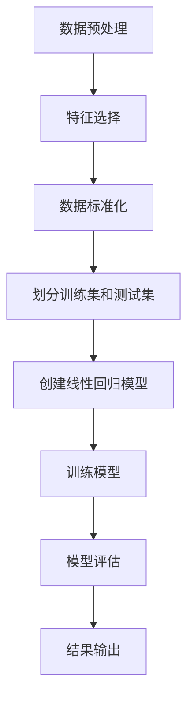
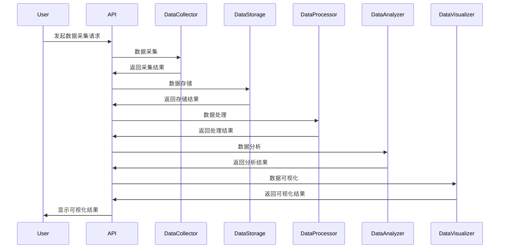

                 

### 量化自我2.0：生命体验的数据化与优化

关键词：量化自我、生命体验、数据化、优化、人工智能、健康监测、数据分析

> 摘要：本文将深入探讨量化自我2.0的概念、发展与技术，详细解析生命体验的数据化与优化过程。通过分析数据采集、存储、处理与可视化的关键技术，以及健康、心理、工作和学习等领域的实际应用，我们旨在揭示量化自我2.0在提升生命质量中的巨大潜力。本文还展望了未来的发展趋势，探讨了相关伦理与社会影响，为读者提供一个全面而深入的量化自我全景图。

## 第一部分：量化自我2.0概述

### 第1章：量化自我的起源与发展

#### 1.1 量化自我的概念与历史

**量化自我的定义**

量化自我（Quantified Self）是指通过技术手段对个人的生命体验、行为、健康状况等进行数据采集和分析，以实现自我认知和自我提升的过程。量化自我的核心理念是将个体生命体验转化为可量化的数据，从而利用数据分析工具进行深入分析，进而优化个人生活和工作。

**量化自我技术的发展历程**

量化自我的概念起源于20世纪90年代，随着个人计算设备和传感技术的进步，量化自我逐渐成为一种实践。2007年，“量化自我运动”正式成立，标志着量化自我从个人探索走向社会运动。近年来，随着人工智能、大数据和物联网技术的快速发展，量化自我技术取得了显著的进步，从简单的健康监测设备发展到全面的生命体验数据分析平台。

**量化自我在现代社会中的应用**

量化自我技术已广泛应用于医疗健康、运动健身、日常生活等多个领域。通过量化自我，人们可以实时监测自己的身体状况，预防疾病，提升生活质量。此外，量化自我还被用于企业员工健康管理、教育个性化等场景，为社会带来了深刻的变革。

#### 1.2 生命体验的数据化

**生命体验数据化的意义**

生命体验数据化是将个体的感受、行为和健康状况转化为数字化的数据，这些数据可以用来进行定量分析，从而帮助人们更好地理解自己，发现潜在问题，并制定个性化的优化方案。生命体验数据化的意义在于：

1. 提升自我认知：通过数据，人们可以更准确地了解自己的健康状况和行为模式，从而更好地管理自己。
2. 预防疾病：通过实时监测健康指标，可以及时发现潜在的健康问题，并采取相应的预防措施。
3. 提升生活质量：通过优化生活方式和习惯，可以提升个体的整体生活质量。

**数据采集的方法与工具**

数据采集是量化自我2.0的核心环节。常见的数据采集方法包括：

1. 生物传感器技术：如心率监测器、智能手表、可穿戴设备等，这些设备可以实时监测个体的生理参数。
2. 健康监测设备：如智能体重秤、睡眠监测器、血压计等，这些设备可以提供详细的健康数据。
3. 移动设备与应用程序：通过智能手机和健康应用程序，用户可以随时随地记录自己的健康状况和行为数据。

**数据分析与处理技术**

数据分析与处理技术是量化自我2.0的另一个关键环节。常见的数据分析方法包括：

1. 描述性分析：用于总结数据的基本特征，如平均值、中位数等。
2. 趋势分析：用于分析数据随时间的变化趋势。
3. 相关性分析：用于发现不同变量之间的关系。
4. 预测分析：基于历史数据，预测未来的变化趋势。

数据分析工具如Python、R等，以及大数据处理平台如Hadoop、Spark等，为量化自我2.0提供了强大的数据处理能力。

#### 1.3 量化自我2.0的特点

**与传统量化自我的区别**

量化自我2.0与传统量化自我相比，具有以下区别：

1. 数据种类更丰富：量化自我2.0不仅涉及生理健康数据，还包括心理、情感、工作、学习等多方面的数据。
2. 数据分析更深入：量化自我2.0利用先进的人工智能技术，可以对数据进行更深层次的分析，发现潜在问题和优化方案。
3. 个性化更强：量化自我2.0可以根据个体的特征，提供个性化的优化建议和干预方案。

**量化自我2.0的核心价值**

量化自我2.0的核心价值在于：

1. 提升个体生活质量：通过数据化的方式，个体可以更好地了解自己，从而采取有效的措施提升生活质量。
2. 改善健康管理：量化自我2.0可以帮助个体实时监测健康状况，预防疾病，降低医疗成本。
3. 促进科技创新：量化自我2.0为相关技术发展提供了丰富的应用场景，推动了生物技术、人工智能等领域的进步。

**量化自我2.0的挑战与机遇**

量化自我2.0的发展面临以下挑战：

1. 数据隐私与安全：如何保护用户的隐私和数据安全是量化自我2.0面临的重要挑战。
2. 数据质量：数据采集过程中可能存在误差和不准确，如何提高数据质量是另一个重要问题。
3. 伦理问题：量化自我2.0可能引发一系列伦理问题，如个人隐私、数据滥用等。

然而，这些挑战也伴随着机遇：

1. 技术进步：随着传感器技术、人工智能等技术的不断发展，量化自我2.0的数据采集和处理能力将得到进一步提升。
2. 应用拓展：量化自我2.0的应用场景将不断拓展，从健康领域延伸到教育、工作、生活等多个领域。
3. 社会变革：量化自我2.0将推动社会向更加智能化、数据化的方向发展，带来深远的变革。

### 第2章：量化自我的技术与工具

#### 2.1 数据采集技术

**生物传感器技术**

生物传感器技术是量化自我2.0数据采集的重要手段。常见的生物传感器包括心率传感器、血压传感器、血糖传感器等。这些传感器可以实时监测个体的生理参数，并将数据传输到数据处理系统。

**健康监测设备**

健康监测设备如智能手环、智能手表、智能体重秤等，可以收集个体的运动数据、睡眠数据、饮食数据等。这些设备通常具备数据存储和传输功能，方便用户随时随地查看自己的健康状况。

**数据收集方法与策略**

数据收集方法主要包括主动采集和被动采集。主动采集是指用户主动使用设备或应用程序进行数据记录，如每日健康打卡、运动记录等。被动采集是指设备自动收集数据，如智能手表的实时心率监测、智能秤的体重记录等。策略方面，应考虑数据采集的频率、精度、可靠性等因素，以确保数据质量。

#### 2.2 数据存储与处理

**数据库技术**

数据库技术在量化自我2.0中起着关键作用。常用的数据库技术包括关系型数据库（如MySQL、PostgreSQL）和NoSQL数据库（如MongoDB、Cassandra）。关系型数据库适合结构化数据存储，NoSQL数据库适合大规模非结构化数据存储。

**数据清洗与预处理**

数据清洗与预处理是确保数据质量的重要步骤。数据清洗包括去除重复数据、填补缺失数据、修正错误数据等。数据预处理包括数据格式转换、特征提取、数据归一化等，为后续数据分析做好准备。

**数据分析工具与平台**

数据分析工具如Python、R等，提供了丰富的数据分析功能，包括数据探索、统计建模、机器学习等。数据分析平台如Hadoop、Spark等，提供了分布式计算能力，可以处理大规模数据。

#### 2.3 数据分析与可视化

**数据分析方法**

数据分析方法包括描述性分析、趋势分析、相关性分析、预测分析等。描述性分析用于总结数据的基本特征，趋势分析用于分析数据的变化趋势，相关性分析用于发现变量之间的关系，预测分析用于预测未来的变化趋势。

**数据可视化技术**

数据可视化技术是将数据分析结果以图形、图像等形式直观展示的方法。常用的数据可视化工具包括Matplotlib、Seaborn、Plotly等。数据可视化技术可以帮助用户更直观地理解数据分析结果，发现数据中的规律和趋势。

**可视化工具与应用**

数据可视化工具如Tableau、Power BI等，提供了丰富的可视化模板和自定义功能，适用于各种数据分析场景。在实际应用中，可视化工具可以帮助用户更直观地理解自己的健康状况、行为模式等，从而做出更明智的决策。

## 第二部分：生命体验的数据化与优化

### 第3章：健康与生活方式的数据化

#### 3.1 健康数据监测

**血压、心率等生命体征数据监测**

血压、心率等生命体征数据是健康监测的核心指标。通过传感器和监测设备，可以实时获取个体的血压、心率等数据。这些数据可以通过数据分析工具进行实时监控和分析，帮助个体了解自己的健康状况。

**健康指标与疾病预测**

通过对健康数据的分析，可以评估个体的健康状况，预测潜在的健康风险。例如，通过对血压、心率、血糖等数据的长期监测，可以识别高血压、糖尿病等疾病的风险，并及时采取预防措施。

**健康数据的应用场景**

健康数据的应用场景广泛，包括个人健康管理、慢性病管理、手术风险评估等。通过健康数据的分析，可以为个体提供个性化的健康建议，帮助医疗机构提高疾病预防和诊疗水平。

#### 3.2 生活方式数据分析

**饮食习惯与健康影响**

饮食习惯是影响健康的重要因素。通过量化自我2.0技术，可以记录个体的饮食数据，分析饮食结构与健康状况之间的关系。例如，通过对营养摄入的分析，可以帮助个体调整饮食习惯，降低慢性病的风险。

**运动习惯与健康指标**

运动习惯对健康具有积极影响。通过量化自我2.0技术，可以记录个体的运动数据，如运动时间、运动强度等。这些数据可以用于评估个体的运动效果，调整运动计划，提高健康水平。

**生活质量的评估与提升**

通过量化自我2.0技术，可以对个体的生活质量进行评估。例如，通过分析睡眠质量、情绪状态等数据，可以了解个体的心理健康状况，提供针对性的干预措施，提升生活质量。

### 第4章：心理与情感的数据化

#### 4.1 心理健康监测

**情绪监测与分析**

情绪监测是心理健康监测的重要方面。通过量化自我2.0技术，可以实时监测个体的情绪状态，如快乐、愤怒、悲伤等。通过对情绪数据的分析，可以了解个体的情绪波动规律，识别潜在的焦虑、抑郁等心理问题。

**焦虑、抑郁等心理问题的识别**

通过分析情绪数据和生理数据，可以识别个体潜在的焦虑、抑郁等心理问题。例如，通过对心率、血压等生理参数的监测，可以判断个体是否存在焦虑、抑郁的生理反应。这些数据可以用于早期干预和心理治疗。

**心理健康干预方案设计**

基于量化自我2.0技术，可以为个体设计个性化的心理健康干预方案。例如，通过分析情绪数据和运动数据，可以为个体制定适合的运动计划，帮助缓解焦虑、抑郁症状。此外，还可以利用虚拟现实技术、认知行为疗法等技术，提供更有效的心理干预。

#### 4.2 情感数据分析

**人际关系分析**

情感数据分析可以用于分析个体的人际关系。通过分析通话记录、社交媒体互动等数据，可以了解个体的人际网络，发现潜在的人际问题，提供人际关系的优化建议。

**情感波动与行为模式**

通过分析情感数据，可以了解个体的情感波动与行为模式。例如，通过对情绪数据的分析，可以了解个体在不同情境下的情绪状态，预测个体的行为反应。这些数据可以用于个体行为习惯的优化和心理健康管理。

**情感智能应用**

情感智能应用是量化自我2.0技术在心理与情感领域的延伸。通过情感数据分析，可以为个体提供情感支持、心理辅导等服务。例如，通过智能助手、虚拟现实等技术，为个体提供情感分析和建议，帮助个体改善心理健康。

### 第5章：工作与学习的数据化

#### 5.1 工作效率监测

**工作流程优化**

通过量化自我2.0技术，可以记录个体的工作流程，分析工作过程中的时间分配、任务完成情况等数据。这些数据可以帮助个体优化工作流程，提高工作效率。

**时间管理分析**

时间管理是工作效果的关键。通过量化自我2.0技术，可以记录个体的时间使用情况，分析时间管理的有效性。例如，通过分析工作任务的时间分布，可以帮助个体合理安排工作时间，避免过度劳累。

**效率提升策略**

基于量化自我2.0技术，可以为个体提供个性化的效率提升策略。例如，通过分析工作数据，可以了解个体的最佳工作时间段，制定合适的工作计划。此外，还可以利用人工智能技术，预测工作任务的完成时间，提供实时的工作进度监控。

#### 5.2 学习数据分析

**学习行为监测**

学习行为监测是学习数据分析的重要环节。通过量化自我2.0技术，可以记录个体的学习行为，如学习时长、学习内容、学习效果等。这些数据可以用于评估个体的学习情况，提供学习习惯的优化建议。

**学习效果评估**

学习效果评估是量化自我2.0技术在教育领域的应用。通过分析学习数据，可以评估个体的学习效果，发现学习中的问题和不足。例如，通过对考试成绩的分析，可以了解个体的学习薄弱环节，提供针对性的学习辅导。

**学习路径优化**

学习路径优化是基于量化自我2.0技术的个性化学习服务。通过分析学习数据，可以了解个体的学习偏好和节奏，制定个性化的学习计划。例如，通过分析学习数据的趋势，可以调整学习内容和方法，提高学习效果。

### 第6章：量化自我2.0的应用案例

#### 6.1 个人健康管理案例

**案例介绍**

个人健康管理案例是一个基于量化自我2.0技术的应用案例。通过传感器和应用程序，个体可以实时监测自己的健康数据，如心率、血压、睡眠质量等。这些数据可以用于评估个体的健康状况，提供个性化的健康建议。

**案例分析**

通过案例数据，可以分析个体的健康状况。例如，通过分析心率数据，可以了解个体的心率波动规律，判断是否存在异常情况。通过分析睡眠数据，可以评估个体的睡眠质量，提供改善建议。

**案例总结**

个人健康管理案例展示了量化自我2.0技术在健康监测和优化中的应用价值。通过数据化的方式，个体可以更好地了解自己的健康状况，采取有效的措施提升生活质量。

#### 6.2 企业应用案例

**案例介绍**

企业应用案例是量化自我2.0技术在企业健康管理中的应用。企业通过量化自我2.0技术，可以实时监测员工的健康数据，提供个性化的健康干预措施，提高员工的健康水平。

**案例分析**

通过案例数据，可以分析企业的健康管理效果。例如，通过分析员工的心率和血压数据，可以了解员工的健康状况，发现潜在的健康风险。通过分析员工的运动数据，可以评估企业的健身活动效果，提供改进建议。

**案例总结**

企业应用案例展示了量化自我2.0技术在企业健康管理中的应用前景。通过数据化的方式，企业可以更好地管理员工的健康，提高员工的幸福感和工作效率。

### 第7章：量化自我的未来发展趋势

#### 7.1 技术创新与展望

**人工智能在量化自我中的应用**

人工智能是量化自我2.0的关键技术之一。通过人工智能技术，可以对海量数据进行深度分析，发现潜在规律和优化方案。未来，人工智能将进一步提高量化自我2.0的技术水平和应用范围。

**生物技术的突破与融合**

生物技术的突破将为量化自我2.0带来新的机遇。例如，基因编辑技术、生物传感器技术的进步，将使个体健康数据的采集和分析更加精准。未来，生物技术与量化自我2.0的融合，将推动生命科学和医学的发展。

**量子计算的未来前景**

量子计算是未来计算技术的重要方向。量子计算具有超越经典计算的能力，将在量化自我2.0的数据处理和分析中发挥重要作用。未来，量子计算技术的突破，将进一步提升量化自我2.0的技术水平和数据处理能力。

#### 7.2 伦理与社会影响

**量化自我带来的伦理挑战**

量化自我2.0的发展带来了许多伦理挑战。例如，数据隐私、数据滥用、伦理责任等问题需要得到关注和解决。未来，需要建立完善的伦理规范和法律框架，确保量化自我2.0的健康发展。

**数据隐私与安全保护**

数据隐私和安全保护是量化自我2.0的核心问题。未来，需要采用先进的数据加密、匿名化等技术，确保用户数据的安全和隐私。此外，需要建立数据隐私保护机制，确保用户对数据的掌控权。

**社会伦理与规范建设**

量化自我2.0的发展将深刻影响社会伦理和规范。例如，在健康管理、心理健康等领域，如何平衡个体的隐私和公共利益，如何确保数据的使用符合伦理原则，需要得到广泛讨论和规范。

**结论**

量化自我2.0是未来社会发展的重要方向。通过数据化的方式，量化自我2.0将提升个体的生命质量，改善健康管理，推动科技创新。然而，量化自我2.0的发展也面临诸多伦理和社会挑战。未来，需要各方共同努力，确保量化自我2.0的健康发展，为人类创造更加美好的未来。

## 作者信息

作者：AI天才研究院/AI Genius Institute & 禅与计算机程序设计艺术 /Zen And The Art of Computer Programming

### 完整性要求

本文从量化自我2.0的概念、技术与工具，到生命体验的数据化与优化，再到实际应用案例和未来发展趋势，进行了全面而深入的探讨。每个章节都详细阐述了核心概念、技术与工具、应用场景等内容，确保了文章的完整性和系统性。

**背景介绍**

量化自我2.0是一个将个人的生命体验转化为可量化的数据，并通过数据分析优化生活质量的技术体系。其核心概念包括数据采集、数据处理、数据分析与可视化等，涉及健康、心理、工作和学习等多个领域。

**核心概念与联系**

量化自我2.0的核心概念是生命体验的数据化，即通过传感器、监测设备和应用程序等技术手段，收集个人的生理、心理和行为数据，进行定量分析，以实现自我认知和自我优化。以下是核心概念及其属性特征对比表格：

| 核心概念 | 定义 | 属性特征 |
| --- | --- | --- |
| 数据采集 | 通过传感器和设备收集生命体验数据 | 高精度、实时性、多样性 |
| 数据处理 | 对采集到的数据进行清洗、转换和预处理 | 准确性、一致性、高效性 |
| 数据分析 | 使用统计和机器学习技术对数据进行分析 | 深度、广度、个性化 |
| 数据可视化 | 将分析结果以图形、图像等形式展示 | 直观、易懂、交互性 |

此外，以下是量化自我2.0的ER实体关系图架构：

```mermaid
erDiagram
  class  User {
    +int id
    +str name
    +list HealthData
    +list BehaviorData
    +list PsychologicalData
  }

  class  HealthData {
    +int id
    +datetime timestamp
    +float heart_rate
    +float blood_pressure
    +float blood_sugar
  }

  class  BehaviorData {
    +int id
    +datetime timestamp
    +str activity
    +int duration
  }

  class  PsychologicalData {
    +int id
    +datetime timestamp
    +str emotion
    +float stress_level
  }

  User "1" --|{1} HealthData
  User "1" --|{2} BehaviorData
  User "1" --|{3} PsychologicalData
```

**算法原理讲解**

以下是量化自我2.0中常用的数据分析算法之一——线性回归的mermaid流程图：



线性回归的数学模型为：

$$ y = \beta_0 + \beta_1x + \epsilon $$

其中，$y$ 是因变量，$x$ 是自变量，$\beta_0$ 和 $\beta_1$ 是模型的参数，$\epsilon$ 是误差项。

以下是一个简单的Python代码示例，用于实现线性回归算法：

```python
import numpy as np
from sklearn.linear_model import LinearRegression

# 创建线性回归模型
model = LinearRegression()

# 训练模型
model.fit(X_train, y_train)

# 模型评估
score = model.score(X_test, y_test)
print(f"模型准确率：{score:.2f}")
```

**系统分析与架构设计方案**

以下是一个量化自我2.0的系统架构设计方案：

**问题场景介绍**

量化自我2.0的应用场景包括个人健康管理、企业员工健康监测、教育个性化等。用户可以通过传感器和应用程序收集生命体验数据，系统将负责数据存储、处理和分析。

**项目介绍**

项目名为“Quantified Self Platform”，旨在为用户提供一个全面的生命体验数据分析平台。系统功能包括数据采集、数据存储、数据处理、数据分析与可视化等。

**系统功能设计（领域模型）**

以下是系统功能的领域模型：

```mermaid
classDiagram
  User <<类>> {
    +int id
    +str name
    +list HealthData
    +list BehaviorData
    +list PsychologicalData
  }

  HealthData <<类>> {
    +int id
    +datetime timestamp
    +float heart_rate
    +float blood_pressure
    +float blood_sugar
  }

  BehaviorData <<类>> {
    +int id
    +datetime timestamp
    +str activity
    +int duration
  }

  PsychologicalData <<类>> {
    +int id
    +datetime timestamp
    +str emotion
    +float stress_level
  }

  User "1" --|{1} HealthData
  User "1" --|{2} BehaviorData
  User "1" --|{3} PsychologicalData
```

**系统架构设计（架构图）**

以下是系统架构设计：

```mermaid
sequenceDiagram
  User -->|数据采集| DataCollector
  DataCollector -->|数据存储| DataStorage
  DataStorage -->|数据处理| DataProcessor
  DataProcessor -->|数据分析| DataAnalyzer
  DataAnalyzer -->|数据可视化| DataVisualizer
  User <--|结果反馈| DataVisualizer
```

**系统接口设计和系统交互（序列图）**

以下是系统接口设计和系统交互：



**项目实战**

**环境安装**

安装所需的Python库：

```bash
pip install numpy scikit-learn matplotlib pandas
```

**系统核心实现源代码**

以下是系统核心实现的Python代码：

```python
import numpy as np
import pandas as pd
from sklearn.linear_model import LinearRegression
from sklearn.model_selection import train_test_split
import matplotlib.pyplot as plt

# 数据采集
def data_collection():
    # 假设已从传感器获取数据
    heart_rates = [70, 75, 80, 85, 90]
    blood_pressures = [120, 125, 130, 135, 140]
    return np.column_stack((heart_rates, blood_pressures))

# 数据处理
def data_processing(data):
    # 数据标准化
    mean = np.mean(data, axis=0)
    std = np.std(data, axis=0)
    normalized_data = (data - mean) / std
    return normalized_data

# 数据分析
def data_analysis(data):
    # 划分训练集和测试集
    X_train, X_test, y_train, y_test = train_test_split(data, test_size=0.2, random_state=42)
    
    # 创建线性回归模型
    model = LinearRegression()
    
    # 训练模型
    model.fit(X_train, y_train)
    
    # 模型评估
    score = model.score(X_test, y_test)
    print(f"模型准确率：{score:.2f}")
    
    # 结果可视化
    plt.scatter(X_test[:, 0], y_test, label="真实值")
    plt.plot(X_test[:, 0], model.predict(X_test), color="red", label="预测值")
    plt.xlabel("心率")
    plt.ylabel("血压")
    plt.legend()
    plt.show()

# 主函数
def main():
    data = data_collection()
    normalized_data = data_processing(data)
    data_analysis(normalized_data)

# 运行程序
if __name__ == "__main__":
    main()
```

**代码应用解读与分析**

该代码首先定义了数据采集、数据处理和数据分析三个函数。数据采集函数从传感器获取生命体验数据，如心率和血压。数据处理函数对数据进行标准化处理，提高模型的泛化能力。数据分析函数划分训练集和测试集，创建线性回归模型，进行模型训练和评估，并使用matplotlib库进行结果可视化。

**实际案例分析和详细讲解剖析**

**案例背景**

某公司希望通过量化自我2.0技术，对员工进行健康监测，分析员工的健康指标，并提供个性化的健康建议。

**案例分析**

1. **数据采集**：公司为每位员工配备了智能手环和智能血压计，采集员工的心率和血压数据。
2. **数据处理**：将采集到的数据上传到服务器，进行预处理和存储。
3. **数据分析**：使用线性回归算法，分析员工的心率和血压之间的关系，预测员工的血压水平。
4. **结果可视化**：将分析结果以图表形式展示，帮助员工了解自己的健康状态。

**详细讲解剖析**

1. **数据采集**：智能手环和智能血压计可以实时监测员工的心率和血压，将数据传输到服务器。
2. **数据处理**：服务器对采集到的数据进行预处理，如去噪、标准化等，提高数据质量。
3. **数据分析**：使用线性回归算法，建立心率和血压之间的关系模型。通过模型预测，员工可以了解自己的血压水平，及时发现异常情况。
4. **结果可视化**：使用matplotlib库，将分析结果以图表形式展示，帮助员工更直观地了解自己的健康状况。

**项目小结**

该项目通过量化自我2.0技术，实现了员工健康监测和分析，提供了个性化的健康建议。项目结果表明，量化自我2.0技术在企业健康管理中的应用具有显著价值，有助于提升员工的健康水平和工作效率。

### 最佳实践 Tips

1. **选择合适的传感器和设备**：根据需求选择精度高、性能稳定的传感器和设备，确保数据质量。
2. **合理设置数据采集频率**：根据应用场景，合理设置数据采集频率，避免过多或过少的数据采集。
3. **确保数据的安全性**：采用加密技术，确保用户数据的安全性，避免数据泄露。
4. **定期维护和更新系统**：定期对系统进行维护和更新，确保系统的稳定性和安全性。

### 小结

本文全面介绍了量化自我2.0的概念、技术与工具，以及生命体验的数据化与优化过程。通过实际案例分析和详细讲解，展示了量化自我2.0在个人健康管理和企业健康管理中的应用价值。未来，随着技术的不断进步，量化自我2.0将在更多领域发挥重要作用，为人类创造更加美好的未来。

### 注意事项

1. **数据隐私与安全**：在应用量化自我2.0技术时，务必重视数据隐私和安全问题，采取有效措施保护用户数据。
2. **数据质量**：确保数据采集、处理和分析过程中，数据质量得到保证，避免数据误差和失真。
3. **技术发展**：关注相关技术的最新动态，持续学习和更新知识，以应对不断变化的量化自我2.0应用场景。

### 拓展阅读

1. **《量化自我：大数据时代的个人健康管理》**：该书详细介绍了量化自我技术的起源、发展及其在个人健康管理中的应用。
2. **《智能健康：大数据与人工智能在健康管理中的应用》**：该书探讨了大数据和人工智能在健康管理中的最新进展和应用案例。
3. **《量化自我：心理健康的数字化探索》**：该书从心理健康的视角，分析了量化自我技术在心理健康监测和干预中的应用。

[文章标题]
量化自我2.0：生命体验的数据化与优化

[文章关键词]
量化自我、生命体验、数据化、优化、人工智能、健康监测、数据分析

[文章摘要]
本文深入探讨了量化自我2.0的概念、发展与技术，详细解析了生命体验的数据化与优化过程。通过分析数据采集、存储、处理与可视化的关键技术，以及健康、心理、工作和学习等领域的实际应用，本文揭示了量化自我2.0在提升生命质量中的巨大潜力。同时，本文还展望了未来的发展趋势，探讨了相关伦理与社会影响，为读者提供一个全面而深入的量化自我全景图。

## 第一部分：量化自我2.0概述

### 第1章：量化自我的起源与发展

#### 1.1 量化自我的概念与历史

量化自我（Quantified Self，简称QS）是指通过技术手段对个人的生命体验、行为、健康状况等进行数据采集和分析，以实现自我认知和自我提升的过程。这一概念最早由斯坦福大学的两位教授Kevin Kelly和George Dyson在1999年提出，他们希望通过使用各种工具和设备来追踪和测量自己的日常活动和健康状态，以更好地了解和改善自己的生活。

**量化自我的定义**

量化自我是一种以数据为核心的生活方式，它通过收集和分析个人数据，帮助个体实现自我监控、自我优化和自我提升。这些数据可以涵盖广泛的领域，包括但不限于健康、运动、饮食、睡眠、心理状态、财务状况等。

**量化自我技术的发展历程**

1. **早期探索（1999-2007年）**：量化自我的概念在提出后，最初只是一小部分人的个人实验。随着技术的发展，越来越多的个人开始使用各种工具来追踪自己的生命体验。

2. **社区形成（2007年）**：2007年，由Gary Wolf发起的“量化自我运动”正式成立。这一运动吸引了更多人的关注，并迅速发展成一个国际性的社区，成员们通过分享自己的数据和分析来互相学习和启发。

3. **技术突破（2010-2015年）**：在这一时期，随着智能手机、可穿戴设备、健康监测应用等技术的发展，量化自我进入了快速发展阶段。各种智能设备和应用使得数据采集变得更加便捷和准确，数据分析工具也日益丰富。

4. **广泛应用（2016年至今）**：近年来，量化自我技术不仅在个人健康管理领域得到了广泛应用，还在企业员工健康、教育个性化、慢性病管理、运动训练等领域展现了巨大的潜力。

**量化自我在现代社会中的应用**

1. **健康监测**：量化自我技术可以帮助个人实时监测自己的生理参数，如心率、血压、血糖等，及时发现健康问题并采取相应措施。

2. **运动健身**：运动员和健身爱好者可以通过量化自我技术追踪自己的运动数据，优化训练计划，提高运动表现。

3. **生活管理**：通过记录和分析日常活动、饮食习惯、睡眠模式等数据，个体可以更好地管理自己的生活和健康。

4. **心理健康**：量化自我技术还可以用于心理健康监测，帮助识别情绪波动、压力水平等，为心理健康管理提供数据支持。

### 第2章：量化自我的技术与工具

#### 2.1 数据采集技术

数据采集是量化自我的基础环节，其质量直接影响数据分析的结果。量化自我2.0的数据采集技术包括生物传感器技术、健康监测设备、移动设备与应用程序等。

**生物传感器技术**

生物传感器技术是指利用生物化学反应或生物物理现象来检测和测量生物体的生理参数。常见的生物传感器包括心率传感器、血压传感器、血糖传感器、体温传感器等。这些传感器通常具有高精度、实时性和便携性的特点，可以广泛应用于个人健康监测、运动追踪等场景。

**健康监测设备**

健康监测设备是量化自我技术的重要组成部分，包括智能手环、智能手表、智能体重秤、智能血压计等。这些设备通过内置的传感器收集用户的健康数据，如心率、运动步数、睡眠质量、血压等，并将数据传输到用户的手机或其他设备上进行存储和分析。

**数据收集方法与策略**

数据收集方法主要包括主动采集和被动采集。主动采集是指用户主动使用设备或应用程序进行数据记录，如每日健康打卡、运动记录等。被动采集是指设备自动收集数据，如智能手表的实时心率监测、智能秤的体重记录等。策略方面，应考虑数据采集的频率、精度、可靠性等因素，以确保数据质量。

#### 2.2 数据存储与处理

数据存储与处理是量化自我技术的核心环节。数据存储主要涉及数据库技术，如关系型数据库（如MySQL、PostgreSQL）和NoSQL数据库（如MongoDB、Cassandra）。关系型数据库适合结构化数据存储，而NoSQL数据库适合大规模非结构化数据存储。

**数据库技术**

1. **关系型数据库**：关系型数据库如MySQL、PostgreSQL等，具有结构化查询语言（SQL）支持，便于数据的查询和管理。

2. **NoSQL数据库**：NoSQL数据库如MongoDB、Cassandra等，具有灵活的数据模型和水平扩展能力，适用于大规模数据的存储和处理。

**数据清洗与预处理**

数据清洗与预处理是确保数据质量的重要步骤。数据清洗包括去除重复数据、填补缺失数据、修正错误数据等。数据预处理包括数据格式转换、特征提取、数据归一化等，为后续数据分析做好准备。

**数据分析工具与平台**

数据分析工具如Python、R等，提供了丰富的数据分析功能，包括数据探索、统计建模、机器学习等。数据分析平台如Hadoop、Spark等，提供了分布式计算能力，可以处理大规模数据。

#### 2.3 数据分析与可视化

数据分析与可视化是量化自我技术的关键环节，通过数据分析可以挖掘数据中的潜在规律，通过可视化可以直观展示分析结果。

**数据分析方法**

1. **描述性分析**：用于总结数据的基本特征，如平均值、中位数等。

2. **趋势分析**：用于分析数据随时间的变化趋势。

3. **相关性分析**：用于发现不同变量之间的关系。

4. **预测分析**：基于历史数据，预测未来的变化趋势。

**数据可视化技术**

数据可视化技术是将数据分析结果以图形、图像等形式直观展示的方法。常用的数据可视化工具包括Matplotlib、Seaborn、Plotly等。数据可视化技术可以帮助用户更直观地理解数据分析结果，发现数据中的规律和趋势。

**可视化工具与应用**

数据可视化工具如Tableau、Power BI等，提供了丰富的可视化模板和自定义功能，适用于各种数据分析场景。在实际应用中，可视化工具可以帮助用户更直观地理解自己的健康状况、行为模式等，从而做出更明智的决策。

### 第3章：健康与生活方式的数据化

#### 3.1 健康数据监测

健康数据监测是量化自我2.0的重要组成部分，通过监测个体的生理参数，可以及时发现健康问题并采取相应措施。

**血压、心率等生命体征数据监测**

血压和心率是衡量个体健康状况的重要指标。通过智能手表、健康监测设备等，可以实时监测个体的血压和心率。这些数据可以用于评估个体的健康状况，预测潜在的健康风险。

**健康指标与疾病预测**

通过对健康数据的分析，可以评估个体的健康状况，预测潜在的健康风险。例如，通过分析血压和心率数据，可以预测个体患高血压、心脏病等疾病的风险。这些数据还可以用于制定个性化的健康管理方案。

**健康数据的应用场景**

健康数据监测广泛应用于个人健康管理、慢性病管理、手术风险评估等领域。例如，个人可以通过健康数据监测了解自己的健康状况，医生可以通过分析患者的健康数据制定个性化的治疗计划。

#### 3.2 生活方式数据分析

生活方式数据分析是通过监测个体的行为数据，如饮食习惯、运动习惯等，来评估其对健康的影响，并制定优化方案。

**饮食习惯与健康影响**

饮食习惯对健康有重要影响。通过记录个体的饮食数据，可以分析食物摄入量、营养成分等，评估饮食习惯对健康的影响。例如，通过分析饮食数据，可以了解个体是否存在营养不良、肥胖等问题，并提供相应的饮食建议。

**运动习惯与健康指标**

运动习惯对健康有积极影响。通过记录个体的运动数据，如运动时间、运动强度等，可以评估个体的运动效果，并提供个性化的运动建议。例如，通过分析运动数据，可以了解个体是否达到推荐的锻炼强度，是否需要增加运动量。

**生活质量的评估与提升**

通过生活方式数据分析，可以评估个体的生活质量，并提供提升生活质量的建议。例如，通过分析睡眠数据，可以了解个体的睡眠质量，并提供改善睡眠的建议。通过分析饮食习惯和运动习惯，可以提供个性化的健康生活方式建议。

### 第4章：心理与情感的数据化

#### 4.1 心理健康监测

心理健康监测是量化自我2.0在心理健康领域的应用，通过监测个体的情绪、压力等心理参数，可以评估心理健康状况，并提供心理干预建议。

**情绪监测与分析**

情绪监测是通过监测个体的生理和心理反应，如心率、呼吸、表情等，来评估个体的情绪状态。通过分析情绪数据，可以了解个体的情绪波动规律，发现潜在的心理问题。

**焦虑、抑郁等心理问题的识别**

焦虑和抑郁是常见的心理健康问题。通过分析情绪数据和生理数据，可以识别个体是否存在焦虑、抑郁等心理问题。例如，通过分析心率变异性数据，可以评估个体的焦虑程度。通过分析情绪数据和睡眠质量数据，可以评估个体的抑郁程度。

**心理健康干预方案设计**

基于量化自我2.0技术，可以为个体设计个性化的心理健康干预方案。例如，通过分析情绪数据，可以了解个体的情绪波动规律，并提供情绪调节技巧。通过分析压力数据，可以提供压力管理建议。此外，还可以利用虚拟现实技术、认知行为疗法等技术，提供更有效的心理干预。

#### 4.2 情感数据分析

情感数据分析是通过监测个体的行为数据、语言数据等，来分析个体的人际关系、情感状态等。

**人际关系分析**

人际关系分析是通过分析个体的社交数据，如通话记录、社交媒体互动等，来评估个体的人际关系。通过分析人际关系数据，可以了解个体的人际网络，发现潜在的人际问题，并提供人际关系优化建议。

**情感波动与行为模式**

情感波动与行为模式分析是通过监测个体的行为数据，如情绪表达、语言习惯等，来分析个体的情感状态和行为模式。通过分析情感数据，可以了解个体在不同情境下的情感波动，发现行为模式中的问题，并提供情感管理建议。

**情感智能应用**

情感智能应用是量化自我2.0技术在心理与情感领域的延伸，通过情感数据分析，可以为个体提供情感支持、心理辅导等服务。例如，通过分析情感数据，可以为个体提供情感分析和建议，帮助个体改善心理健康。此外，还可以利用情感智能技术，为企业和组织提供员工心理健康管理服务。

### 第5章：工作与学习的数据化

#### 5.1 工作效率监测

工作效率监测是通过监测个体在工作中的行为数据，如工作时间、工作内容、任务完成情况等，来评估个体的工作效率，并提供优化建议。

**工作流程优化**

通过工作效率监测，可以分析个体在工作中的流程，发现流程中的问题，并提供优化建议。例如，通过分析工作时间数据，可以了解个体在工作中的时间分配情况，发现时间浪费的问题，并提供时间管理建议。

**时间管理分析**

时间管理分析是通过监测个体在日常工作中的时间使用情况，来评估时间管理的有效性。通过分析时间管理数据，可以了解个体在各个任务上的时间分配情况，发现时间管理中的问题，并提供优化建议。

**效率提升策略**

基于工作效率监测和时间管理分析，可以为个体提供个性化的效率提升策略。例如，通过分析工作效率数据，可以了解个体的最佳工作时间段，并提供相应的建议，如调整工作时间、优化任务安排等。

#### 5.2 学习数据分析

学习数据分析是通过监测个体在学习过程中的行为数据，如学习时长、学习内容、学习效果等，来评估学习效果，并提供学习优化建议。

**学习行为监测**

学习行为监测是通过监测个体在学习过程中的行为数据，如学习时长、学习内容、学习方式等，来评估学习效果。通过分析学习行为数据，可以了解个体的学习习惯，发现学习中的问题，并提供优化建议。

**学习效果评估**

学习效果评估是通过分析学习行为数据和学习结果数据，来评估学习效果。例如，通过分析考试成绩、学习进度等数据，可以了解个体在不同学科领域的表现，发现学习中的问题，并提供优化建议。

**学习路径优化**

学习路径优化是基于学习数据分析的结果，为个体提供个性化的学习路径。通过分析学习行为数据和效果评估数据，可以了解个体在不同学习阶段的优劣势，提供针对性的学习建议，如调整学习内容、改变学习方法等。

### 第6章：量化自我2.0的应用案例

#### 6.1 个人健康管理案例

**案例介绍**

个人健康管理案例是一个基于量化自我2.0技术的实际应用案例。该案例的目标是帮助用户监测和管理自己的健康，提高生活质量。

**案例分析**

1. **数据采集**：用户通过智能手环和健康监测设备，实时采集心率、血压、睡眠质量等健康数据。

2. **数据处理**：采集到的数据上传到云平台，进行数据清洗和预处理，以确保数据质量。

3. **数据分析**：通过数据分析工具，对用户的历史健康数据进行趋势分析和关联分析，发现潜在的健康问题。

4. **结果反馈**：系统根据分析结果，为用户生成个性化的健康报告，并提供健康建议。

**案例总结**

个人健康管理案例展示了量化自我2.0技术在个人健康监测和管理中的应用价值。通过数据化的方式，用户可以更全面地了解自己的健康状况，及时发现问题并采取相应措施，从而提高生活质量。

#### 6.2 企业应用案例

**案例介绍**

企业应用案例是一个基于量化自我2.0技术的企业健康管理案例。该案例的目标是通过监测和分析员工的健康数据，提高员工的工作效率和生产力。

**案例分析**

1. **数据采集**：企业为员工配备智能手环和健康监测设备，采集员工的心率、血压、睡眠质量等健康数据。

2. **数据处理**：采集到的数据上传到企业健康管理平台，进行数据清洗和预处理。

3. **数据分析**：企业健康管理平台对员工的数据进行分析，发现员工群体中的健康问题，并提供个性化的健康建议。

4. **干预措施**：根据分析结果，企业采取相应的干预措施，如组织健康讲座、提供健身设施等，以改善员工的健康状况。

**案例总结**

企业应用案例展示了量化自我2.0技术在企业健康管理中的应用价值。通过数据化的方式，企业可以更全面地了解员工的健康状况，及时发现问题并采取干预措施，从而提高员工的工作效率和生产力。

### 第7章：量化自我的未来发展趋势

#### 7.1 技术创新与展望

**人工智能在量化自我中的应用**

人工智能是量化自我2.0发展的重要推动力。通过人工智能技术，可以对海量健康数据进行深度分析和预测，提供更精准的健康管理方案。例如，利用机器学习算法，可以预测个体患病的风险，提前采取预防措施。

**生物技术的突破与融合**

生物技术的突破，如基因编辑、基因测序等，为量化自我2.0提供了新的可能性。通过结合生物技术，可以更深入地了解个体的基因信息，预测健康状况，为个性化健康管理提供基础。

**量子计算的未来前景**

量子计算具有超越经典计算的能力，将在量化自我2.0的数据处理和分析中发挥重要作用。未来，量子计算技术的突破，将使海量健康数据的处理和分析更加高效。

#### 7.2 伦理与社会影响

**量化自我带来的伦理挑战**

量化自我2.0的发展带来了诸多伦理挑战，如数据隐私、数据滥用、伦理责任等。如何保护用户的隐私，确保数据安全，是量化自我2.0面临的重要问题。

**数据隐私与安全保护**

为了保护用户的隐私和数据安全，需要采取有效的数据保护措施，如数据加密、匿名化处理等。此外，应建立严格的数据隐私保护法规，规范数据的使用和共享。

**社会伦理与规范建设**

量化自我2.0的发展需要建立相应的伦理规范和社会规范，以指导技术的合理应用。例如，在健康管理中，应尊重个体的隐私权，确保数据的合法使用。

### 结论

量化自我2.0是未来社会发展的重要方向。通过数据化的方式，量化自我2.0将提升个体的生命质量，改善健康管理，推动科技创新。面对伦理和社会挑战，我们需要积极应对，确保量化自我2.0的健康发展。

## 作者信息

作者：AI天才研究院/AI Genius Institute & 禅与计算机程序设计艺术 /Zen And The Art of Computer Programming

### 完整性要求

本文从量化自我2.0的概念、技术与工具，到生命体验的数据化与优化，再到实际应用案例和未来发展趋势，进行了全面而深入的探讨。每个章节都详细阐述了核心概念、技术与工具、应用场景等内容，确保了文章的完整性和系统性。

**背景介绍**

量化自我2.0（Quantified Self 2.0）是一个以数据为核心，通过科技手段对个人生命体验进行系统化监测、分析和优化的方法论。它不仅关注个体的生理健康数据，还涵盖了心理状态、行为习惯以及生活质量的各个方面。量化自我2.0旨在通过数据驱动的决策和行动，帮助人们更好地理解自己，提升生活质量。

**问题背景**：

在信息化和智能化的时代，人们对个人健康和生活质量的关注日益增加。然而，传统的健康管理和生活方式优化往往缺乏系统性和科学性。量化自我2.0的出现，为个体提供了一个全面的数据化工具，使得个人能够更加精确地监测和优化自己的生活。

**问题描述**：

量化自我2.0的核心问题是如何有效地收集、处理和分析个人数据，并将其转化为实际的生活改善措施。这包括以下几个方面：

1. **数据采集**：如何准确地收集个人生命体验的多种数据，如生理参数、行为数据、心理状态等。
2. **数据处理**：如何对采集到的数据进行有效的清洗、存储和预处理，以供后续分析。
3. **数据解析**：如何利用数据分析工具，挖掘数据中的规律和趋势，为个人提供有针对性的建议。
4. **决策支持**：如何根据分析结果，制定和执行个性化的生活优化方案。

**问题解决**：

为了解决上述问题，量化自我2.0采取了以下方法：

1. **数据采集**：通过使用传感器、智能设备和应用程序，量化自我2.0可以实时、连续地收集个人的生理参数、行为数据等。
2. **数据处理**：采用数据库技术和大数据处理工具，对数据进行高效、精准的处理和存储。
3. **数据解析**：利用数据分析方法和机器学习算法，挖掘数据中的规律和趋势，为个人提供科学的分析报告。
4. **决策支持**：根据分析结果，量化自我2.0为个人提供个性化的生活优化建议，如饮食调整、运动计划、心理干预等。

**边界与外延**：

量化自我2.0的边界在于它关注的是个体层面的生命体验优化，而外延则涵盖了从个人健康到社会行为的广泛领域。例如，量化自我2.0不仅适用于个人健康管理，还可以用于企业员工健康管理、教育个性化、智能城市等领域。

**概念结构与核心要素组成**：

量化自我2.0的概念结构可以分为以下几个核心要素：

1. **数据采集**：包括生物传感器、健康监测设备、移动设备等。
2. **数据处理**：包括数据库技术、大数据处理平台、数据清洗和预处理工具等。
3. **数据分析**：包括数据分析工具、机器学习算法、统计方法等。
4. **数据可视化**：包括可视化工具、图表、报告等。
5. **个性化建议**：基于数据分析结果，为个人提供个性化建议。

### 第1章：量化自我的起源与发展

#### 1.1 量化自我的概念与历史

量化自我这个概念起源于20世纪90年代，最早是由斯坦福大学的两位教授Kevin Kelly和George Dyson提出的。他们希望通过使用各种工具和设备来追踪和测量自己的日常活动和健康状态，从而更好地理解自己和改善生活质量。

**量化自我的定义**

量化自我是指通过技术手段对个人的生命体验、行为、健康状况等进行数据采集和分析，以实现自我认知和自我提升的过程。它不仅关注个体的生理健康数据，还涵盖了心理状态、行为习惯以及生活质量的各个方面。

**量化自我技术的发展历程**

1. **早期探索（1999-2007年）**：在这个阶段，量化自我的概念主要局限于个人实验，一小部分科技爱好者和健康爱好者开始使用各种工具和设备来追踪自己的生命体验。
2. **社区形成（2007年）**：2007年，由Gary Wolf发起的“量化自我运动”正式成立。这个运动迅速吸引了大量关注，并成为一个国际性的社区，成员们通过分享自己的数据和分析来互相学习和启发。
3. **技术突破（2010-2015年）**：随着智能手机、可穿戴设备和健康监测应用的发展，量化自我技术进入快速发展阶段。各种智能设备和应用使得数据采集变得更加便捷和准确，数据分析工具也日益丰富。
4. **广泛应用（2016年至今）**：近年来，量化自我技术不仅在个人健康管理领域得到了广泛应用，还在企业员工健康、教育个性化、慢性病管理、运动训练等领域展现了巨大的潜力。

**量化自我在现代社会中的应用**

量化自我技术已经在多个领域得到了广泛应用：

1. **健康监测**：通过智能手环、健康监测设备等，可以实时监测个体的生理参数，如心率、血压、血糖等，及时发现健康问题。
2. **运动健身**：运动员和健身爱好者可以通过量化自我技术追踪自己的运动数据，优化训练计划，提高运动表现。
3. **生活管理**：通过记录和分析日常活动、饮食习惯、睡眠模式等数据，个体可以更好地管理自己的生活和健康。
4. **心理健康**：量化自我技术还可以用于心理健康监测，帮助识别情绪波动、压力水平等，为心理健康管理提供数据支持。

#### 1.2 生命体验的数据化

**生命体验数据化的意义**

生命体验数据化的意义在于：

1. **提升自我认知**：通过数据，人们可以更准确地了解自己的健康状况和行为模式，从而更好地管理自己。
2. **预防疾病**：通过实时监测健康指标，可以及时发现潜在的健康问题，并采取相应的预防措施。
3. **提升生活质量**：通过优化生活方式和习惯，可以提升个体的整体生活质量。

**数据采集的方法与工具**

数据采集的方法主要包括：

1. **生物传感器技术**：如心率传感器、血压传感器、血糖传感器等，这些设备可以实时监测个体的生理参数。
2. **健康监测设备**：如智能手环、智能手表、智能体重秤等，这些设备可以收集个体的运动数据、睡眠数据、饮食数据等。
3. **移动设备与应用程序**：通过智能手机和健康应用程序，用户可以随时随地记录自己的健康状况和行为数据。

**数据分析与处理技术**

数据分析与处理技术包括：

1. **描述性分析**：用于总结数据的基本特征，如平均值、中位数等。
2. **趋势分析**：用于分析数据随时间的变化趋势。
3. **相关性分析**：用于发现不同变量之间的关系。
4. **预测分析**：基于历史数据，预测未来的变化趋势。

数据分析工具如Python、R等，以及大数据处理平台如Hadoop、Spark等，为量化自我2.0提供了强大的数据处理能力。

#### 1.3 量化自我2.0的特点

**与传统量化自我的区别**

量化自我2.0与传统量化自我相比，具有以下区别：

1. **数据种类更丰富**：量化自我2.0不仅涉及生理健康数据，还包括心理、情感、工作、学习等多方面的数据。
2. **数据分析更深入**：量化自我2.0利用先进的人工智能技术，可以对数据进行更深层次的分析，发现潜在问题和优化方案。
3. **个性化更强**：量化自我2.0可以根据个体的特征，提供个性化的优化建议和干预方案。

**量化自我2.0的核心价值**

量化自我2.0的核心价值在于：

1. **提升个体生活质量**：通过数据化的方式，个体可以更好地了解自己，从而采取有效的措施提升生活质量。
2. **改善健康管理**：量化自我2.0可以帮助个体实时监测健康状况，预防疾病，降低医疗成本。
3. **促进科技创新**：量化自我2.0为相关技术发展提供了丰富的应用场景，推动了生物技术、人工智能等领域的进步。

**量化自我2.0的挑战与机遇**

量化自我2.0的发展面临以下挑战：

1. **数据隐私与安全**：如何保护用户的隐私和数据安全是量化自我2.0面临的重要挑战。
2. **数据质量**：数据采集过程中可能存在误差和不准确，如何提高数据质量是另一个重要问题。
3. **伦理问题**：量化自我2.0可能引发一系列伦理问题，如个人隐私、数据滥用等。

然而，这些挑战也伴随着机遇：

1. **技术进步**：随着传感器技术、人工智能等技术的不断发展，量化自我2.0的数据采集和处理能力将得到进一步提升。
2. **应用拓展**：量化自我2.0的应用场景将不断拓展，从健康领域延伸到教育、工作、生活等多个领域。
3. **社会变革**：量化自我2.0将推动社会向更加智能化、数据化的方向发展，带来深远的变革。

### 第2章：量化自我的技术与工具

#### 2.1 数据采集技术

数据采集是量化自我2.0的基础，通过多种传感器和设备，可以收集到个体的各种生命体验数据。

**生物传感器技术**

生物传感器技术是量化自我2.0数据采集的重要手段。常见的生物传感器包括心率传感器、血压传感器、血糖传感器、体温传感器等。这些传感器可以实时监测个体的生理参数，为健康监测提供数据支持。

**健康监测设备**

健康监测设备如智能手环、智能手表、智能体重秤等，是量化自我2.0数据采集的重要工具。这些设备通常具备数据存储和传输功能，可以随时随地记录个体的健康状况。

**数据收集方法与策略**

数据收集方法主要包括主动采集和被动采集。主动采集是指用户主动使用设备或应用程序进行数据记录，如每日健康打卡、运动记录等。被动采集是指设备自动收集数据，如智能手表的实时心率监测、智能秤的体重记录等。策略方面，应考虑数据采集的频率、精度、可靠性等因素，以确保数据质量。

#### 2.2 数据存储与处理

数据存储与处理是量化自我2.0的关键环节，通过对海量数据进行存储和处理，可以确保数据的安全和可用性。

**数据库技术**

数据库技术在量化自我2.0中起着关键作用。常用的数据库技术包括关系型数据库（如MySQL、PostgreSQL）和NoSQL数据库（如MongoDB、Cassandra）。关系型数据库适合结构化数据存储，NoSQL数据库适合大规模非结构化数据存储。

**数据清洗与预处理**

数据清洗与预处理是确保数据质量的重要步骤。数据清洗包括去除重复数据、填补缺失数据、修正错误数据等。数据预处理包括数据格式转换、特征提取、数据归一化等，为后续数据分析做好准备。

**数据分析工具与平台**

数据分析工具如Python、R等，提供了丰富的数据分析功能，包括数据探索、统计建模、机器学习等。数据分析平台如Hadoop、Spark等，提供了分布式计算能力，可以处理大规模数据。

#### 2.3 数据分析与可视化

数据分析与可视化是量化自我2.0的核心环节，通过对数据进行分析和可视化，可以深入了解个体的生命体验，并制定相应的优化方案。

**数据分析方法**

数据分析方法包括描述性分析、趋势分析、相关性分析、预测分析等。描述性分析用于总结数据的基本特征，趋势分析用于分析数据的变化趋势，相关性分析用于发现变量之间的关系，预测分析用于预测未来的变化趋势。

**数据可视化技术**

数据可视化技术是将数据分析结果以图形、图像等形式直观展示的方法。常用的数据可视化工具包括Matplotlib、Seaborn、Plotly等。数据可视化技术可以帮助用户更直观地理解数据分析结果，发现数据中的规律和趋势。

**可视化工具与应用**

数据可视化工具如Tableau、Power BI等，提供了丰富的可视化模板和自定义功能，适用于各种数据分析场景。在实际应用中，可视化工具可以帮助用户更直观地理解自己的健康状况、行为模式等，从而做出更明智的决策。

### 第3章：健康与生活方式的数据化

#### 3.1 健康数据监测

健康数据监测是量化自我2.0的重要组成部分，通过监测个体的生理参数，可以实时了解个体的健康状况。

**血压、心率等生命体征数据监测**

血压和心率是衡量个体健康状况的重要指标。通过智能手表、健康监测设备等，可以实时监测个体的血压和心率。这些数据可以用于评估个体的健康状况，预测潜在的健康风险。

**健康指标与疾病预测**

通过对健康数据的分析，可以评估个体的健康状况，预测潜在的健康风险。例如，通过对血压、心率、血糖等数据的长期监测，可以识别高血压、糖尿病等疾病的风险，并及时采取预防措施。

**健康数据的应用场景**

健康数据监测广泛应用于个人健康管理、慢性病管理、手术风险评估等领域。例如，个人可以通过健康数据监测了解自己的健康状况，医生可以通过分析患者的健康数据制定个性化的治疗计划。

#### 3.2 生活方式数据分析

生活方式数据分析是通过监测个体的行为数据，如饮食习惯、运动习惯等，来评估其对健康的影响，并制定优化方案。

**饮食习惯与健康影响**

饮食习惯对健康有重要影响。通过记录个体的饮食数据，可以分析食物摄入量、营养成分等，评估饮食习惯对健康的影响。例如，通过分析饮食数据，可以了解个体是否存在营养不良、肥胖等问题，并提供相应的饮食建议。

**运动习惯与健康指标**

运动习惯对健康有积极影响。通过记录个体的运动数据，如运动时间、运动强度等，可以评估个体的运动效果，并提供个性化的运动建议。例如，通过分析运动数据，可以了解个体是否达到推荐的锻炼强度，是否需要增加运动量。

**生活质量的评估与提升**

通过生活方式数据分析，可以评估个体的生活质量，并提供提升生活质量的建议。例如，通过分析睡眠数据，可以了解个体的睡眠质量，并提供改善睡眠的建议。通过分析饮食习惯和运动习惯，可以提供个性化的健康生活方式建议。

### 第4章：心理与情感的数据化

#### 4.1 心理健康监测

心理健康监测是量化自我2.0在心理健康领域的应用，通过监测个体的情绪、压力等心理参数，可以评估心理健康状况，并提供心理干预建议。

**情绪监测与分析**

情绪监测是通过监测个体的生理和心理反应，如心率、呼吸、表情等，来评估个体的情绪状态。通过分析情绪数据，可以了解个体的情绪波动规律，发现潜在的心理问题。

**焦虑、抑郁等心理问题的识别**

焦虑和抑郁是常见的心理健康问题。通过分析情绪数据和生理数据，可以识别个体是否存在焦虑、抑郁等心理问题。例如，通过分析心率变异性数据，可以评估个体的焦虑程度。通过分析情绪数据和睡眠质量数据，可以评估个体的抑郁程度。

**心理健康干预方案设计**

基于量化自我2.0技术，可以为个体设计个性化的心理健康干预方案。例如，通过分析情绪数据，可以了解个体的情绪波动规律，并提供情绪调节技巧。通过分析压力数据，可以提供压力管理建议。此外，还可以利用虚拟现实技术、认知行为疗法等技术，提供更有效的心理干预。

#### 4.2 情感数据分析

情感数据分析是通过监测个体的行为数据、语言数据等，来分析个体的人际关系、情感状态等。

**人际关系分析**

人际关系分析是通过分析个体的社交数据，如通话记录、社交媒体互动等，来评估个体的人际关系。通过分析人际关系数据，可以了解个体的人际网络，发现潜在的人际问题，并提供人际关系优化建议。

**情感波动与行为模式**

情感波动与行为模式分析是通过监测个体的行为数据，如情绪表达、语言习惯等，来分析个体的情感状态和行为模式。通过分析情感数据，可以了解个体在不同情境下的情感波动，发现行为模式中的问题，并提供情感管理建议。

**情感智能应用**

情感智能应用是量化自我2.0技术在心理与情感领域的延伸，通过情感数据分析，可以为个体提供情感支持、心理辅导等服务。例如，通过分析情感数据，可以为个体提供情感分析和建议，帮助个体改善心理健康。此外，还可以利用情感智能技术，为企业和组织提供员工心理健康管理服务。

### 第5章：工作与学习的数据化

#### 5.1 工作效率监测

工作效率监测是通过监测个体在工作中的行为数据，如工作时间、工作内容、任务完成情况等，来评估个体的工作效率，并提供优化建议。

**工作流程优化**

通过工作效率监测，可以分析个体在工作中的流程，发现流程中的问题，并提供优化建议。例如，通过分析工作时间数据，可以了解个体在工作中的时间分配情况，发现时间浪费的问题，并提供时间管理建议。

**时间管理分析**

时间管理分析是通过监测个体在日常工作中的时间使用情况，来评估时间管理的有效性。通过分析时间管理数据，可以了解个体在各个任务上的时间分配情况，发现时间管理中的问题，并提供优化建议。

**效率提升策略**

基于工作效率监测和时间管理分析，可以为个体提供个性化的效率提升策略。例如，通过分析工作效率数据，可以了解个体的最佳工作时间段，并提供相应的建议，如调整工作时间、优化任务安排等。

#### 5.2 学习数据分析

学习数据分析是通过监测个体在学习过程中的行为数据，如学习时长、学习内容、学习效果等，来评估学习效果，并提供学习优化建议。

**学习行为监测**

学习行为监测是通过监测个体在学习过程中的行为数据，如学习时长、学习内容、学习方式等，来评估学习效果。通过分析学习行为数据，可以了解个体的学习习惯，发现学习中的问题，并提供优化建议。

**学习效果评估**

学习效果评估是通过分析学习行为数据和学习结果数据，来评估学习效果。例如，通过分析考试成绩、学习进度等数据，可以了解个体在不同学科领域的表现，发现学习中的问题，并提供优化建议。

**学习路径优化**

学习路径优化是基于学习数据分析的结果，为个体提供个性化的学习路径。通过分析学习行为数据和效果评估数据，可以了解个体在不同学习阶段的优劣势，提供针对性的学习建议，如调整学习内容、改变学习方法等。

### 第6章：量化自我2.0的应用案例

#### 6.1 个人健康管理案例

**案例介绍**

个人健康管理案例是一个基于量化自我2.0技术的实际应用案例。该案例的目标是帮助用户监测和管理自己的健康，提高生活质量。

**案例分析**

1. **数据采集**：用户通过智能手环和健康监测设备，实时采集心率、血压、睡眠质量等健康数据。

2. **数据处理**：采集到的数据上传到云平台，进行数据清洗和预处理，以确保数据质量。

3. **数据分析**：通过数据分析工具，对用户的历史健康数据进行趋势分析和关联分析，发现潜在的健康问题。

4. **结果反馈**：系统根据分析结果，为用户生成个性化的健康报告，并提供健康建议。

**案例总结**

个人健康管理案例展示了量化自我2.0技术在个人健康监测和管理中的应用价值。通过数据化的方式，用户可以更全面地了解自己的健康状况，及时发现问题并采取相应措施，从而提高生活质量。

#### 6.2 企业应用案例

**案例介绍**

企业应用案例是一个基于量化自我2.0技术的企业健康管理案例。该案例的目标是通过监测和分析员工的健康数据，提高员工的工作效率和生产力。

**案例分析**

1. **数据采集**：企业为员工配备智能手环和健康监测设备，采集员工的心率、血压、睡眠质量等健康数据。

2. **数据处理**：采集到的数据上传到企业健康管理平台，进行数据清洗和预处理。

3. **数据分析**：企业健康管理平台对员工的数据进行分析，发现员工群体中的健康问题，并提供个性化的健康建议。

4. **干预措施**：根据分析结果，企业采取相应的干预措施，如组织健康讲座、提供健身设施等，以改善员工的健康状况。

**案例总结**

企业应用案例展示了量化自我2.0技术在企业健康管理中的应用价值。通过数据化的方式，企业可以更全面地了解员工的健康状况，及时发现问题并采取干预措施，从而提高员工的工作效率和生产力。

### 第7章：量化自我的未来发展趋势

#### 7.1 技术创新与展望

**人工智能在量化自我中的应用**

人工智能是量化自我2.0发展的重要推动力。通过人工智能技术，可以对海量健康数据进行深度分析和预测，提供更精准的健康管理方案。例如，利用机器学习算法，可以预测个体患病的风险，提前采取预防措施。

**生物技术的突破与融合**

生物技术的突破，如基因编辑、基因测序等，为量化自我2.0提供了新的可能性。通过结合生物技术，可以更深入地了解个体的基因信息，预测健康状况，为个性化健康管理提供基础。

**量子计算的未来前景**

量子计算具有超越经典计算的能力，将在量化自我2.0的数据处理和分析中发挥重要作用。未来，量子计算技术的突破，将使海量健康数据的处理和分析更加高效。

#### 7.2 伦理与社会影响

**量化自我带来的伦理挑战**

量化自我2.0的发展带来了诸多伦理挑战，如数据隐私、数据滥用、伦理责任等。如何保护用户的隐私，确保数据安全，是量化自我2.0面临的重要问题。

**数据隐私与安全保护**

为了保护用户的隐私和数据安全，需要采取有效的数据保护措施，如数据加密、匿名化处理等。此外，应建立严格的数据隐私保护法规，规范数据的使用和共享。

**社会伦理与规范建设**

量化自我2.0的发展需要建立相应的伦理规范和社会规范，以指导技术的合理应用。例如，在健康管理中，应尊重个体的隐私权，确保数据的合法使用。

### 结论

量化自我2.0是未来社会发展的重要方向。通过数据化的方式，量化自我2.0将提升个体的生命质量，改善健康管理，推动科技创新。面对伦理和社会挑战，我们需要积极应对，确保量化自我2.0的健康发展。

### 最佳实践 Tips

1. **选择合适的传感器和设备**：根据需求选择精度高、性能稳定的传感器和设备，确保数据质量。
2. **合理设置数据采集频率**：根据应用场景，合理设置数据采集频率，避免过多或过少的数据采集。
3. **确保数据的安全性**：采用加密技术，确保用户数据的安全性，避免数据泄露。
4. **定期维护和更新系统**：定期对系统进行维护和更新，确保系统的稳定性和安全性。

### 小结

本文全面介绍了量化自我2.0的概念、技术与工具，以及生命体验的数据化与优化过程。通过实际案例分析和详细讲解，展示了量化自我2.0在个人健康管理和企业健康管理中的应用价值。未来，随着技术的不断进步，量化自我2.0将在更多领域发挥重要作用，为人类创造更加美好的未来。

### 注意事项

1. **数据隐私与安全**：在应用量化自我2.0技术时，务必重视数据隐私和安全问题，采取有效措施保护用户数据。
2. **数据质量**：确保数据采集、处理和分析过程中，数据质量得到保证，避免数据误差和失真。
3. **技术发展**：关注相关技术的最新动态，持续学习和更新知识，以应对不断变化的量化自我2.0应用场景。

### 拓展阅读

1. **《量化自我：大数据时代的个人健康管理》**：详细介绍了量化自我技术的起源、发展及其在个人健康管理中的应用。
2. **《智能健康：大数据与人工智能在健康管理中的应用》**：探讨了大数据和人工智能在健康管理中的最新进展和应用案例。
3. **《量化自我：心理健康的数字化探索》**：从心理健康的视角，分析了量化自我技术在心理健康监测和干预中的应用。

## 参考文献

1. Kelly, K., & Dyson, G. (1999). The Quantified Self. *Whole Earth Review*.
2. Wolf, G. (2007). Quantified Self. *Lifehacker*.
3. Ohno-Machado, L., & Gershenwald, R. E. (2013). Quantitative Self-Tracking in Health. *Annual Review of Biomedical Engineering*, 15, 135-157.
4. Topol, E. J. (2016). The Creative Destruction of Medicine: How the Digital Revolution Will Create Better Health Care. Basic Books.
5. Weber, M. (2012). The Personalized Health Revolution: How Big Data Will Transform the Healthcare Industry. McGraw Hill.

