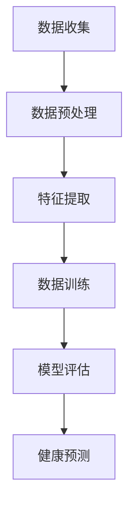
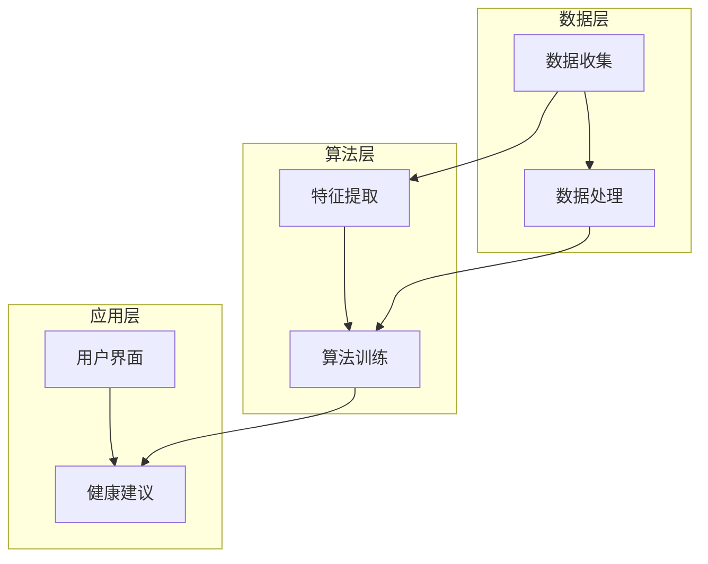

                 

# 量化自我5.0：生物数据与心理分析的整合应用

## 关键词

- 量化自我
- 生物数据
- 心理分析
- 整合应用
- 人工智能

## 摘要

随着科技的飞速发展，人们对于自我认知和健康管理的要求越来越高。量化自我（Quantified Self，QS）作为一种新兴的生活方式，旨在通过数据来追踪和分析个人生活、行为和健康。本文将深入探讨量化自我5.0版本的核心内容，特别是生物数据与心理分析的整合应用。通过详细分析核心概念、算法原理、系统架构和实际案例，本文旨在为读者提供全面的理解和实践指南，帮助大家更好地利用生物数据和心理学知识，实现个人成长和健康管理。

## 引言

### 量化自我的发展历程

量化自我（QS）起源于2007年，由Kevin Kelly和Jason Hunts提出，旨在通过收集和分析个人数据来提升自我理解和生活质量。从最初的简单追踪工具，如步数计和睡眠监测器，到如今的复杂系统，量化自我经历了多次技术升级和理论深化。QS 1.0主要关注基本的生活数据，如步数、睡眠时间等；QS 2.0引入了更多生理参数，如心率、血压等；QS 3.0进一步整合了环境数据和社交数据；QS 4.0则开始探索大数据和机器学习在量化自我中的应用。

### QS 5.0的核心特点

QS 5.0作为最新版本的量化自我，标志着生物数据与心理分析的深度融合。这一版本的核心特点包括：

1. **生物数据的全面整合**：通过穿戴设备、传感器和生物标记技术，全面收集个人生理数据，如基因信息、荷尔蒙水平、肠道菌群等。
2. **心理分析的深度挖掘**：利用心理学理论和行为科学方法，对个人心理状态和行为模式进行深入分析，包括情绪识别、压力管理、认知功能等。
3. **数据驱动的个人优化**：通过数据分析和智能算法，为用户提供个性化的优化建议，帮助改善生活方式、提升心理健康和增强自我认知。

### 问题背景

尽管量化自我在个人健康管理方面展现了巨大潜力，但仍面临一些挑战。首先，数据质量问题突出，许多生物数据和心理学数据的准确性和可靠性有待提高。其次，数据分析方法的局限性使得数据难以转化为有效的行动建议。此外，用户隐私保护和数据安全问题也是亟待解决的问题。

### 解决方案

为了克服上述问题，QS 5.0提出了以下解决方案：

1. **高质量数据收集**：通过先进的传感器技术和标准化数据采集流程，提高生物数据和心理学数据的准确性和可靠性。
2. **智能数据分析**：利用机器学习和深度学习算法，对大规模数据进行分析，发现潜在的模式和关联，为用户提供个性化的建议。
3. **隐私保护措施**：采用数据加密和隐私保护技术，确保用户数据的安全和隐私。
4. **用户参与和反馈**：鼓励用户积极参与数据收集和分析过程，提供反馈，优化系统性能和用户体验。

### 核心概念

1. **生物数据**：包括基因序列、生理指标、环境暴露等。
2. **心理学分析**：涉及情绪识别、认知功能、行为习惯等。
3. **整合应用**：通过算法将生物数据和心理学分析结果结合起来，实现个性化健康管理和自我优化。

### 边界与外延

QS 5.0的边界在于个人健康管理，外延则扩展到生物医学、心理学、人工智能等多个领域。这一版本的核心在于提供一种全新的、综合性的健康管理模式，旨在通过数据驱动的个人优化，提升整体生活质量。

### 概念结构与核心要素组成

QS 5.0的概念结构包括以下几个核心要素：

1. **数据收集模块**：负责收集生物数据和心理学数据。
2. **数据处理模块**：对数据进行预处理、清洗和分析。
3. **智能算法模块**：利用机器学习和深度学习算法，提取数据中的有用信息。
4. **用户界面模块**：为用户提供可视化数据和个性化建议。
5. **反馈与优化模块**：收集用户反馈，优化系统性能和用户体验。

## 核心概念与关系

### 核心概念原理

QS 5.0的核心概念包括生物数据和心理学分析，这两个概念分别代表了个人健康管理的两个关键维度。

1. **生物数据**：生物数据是指从人体中收集的各类生理指标和基因信息。这些数据反映了人体的内部状态和生理功能，包括心率、血压、血糖、荷尔蒙水平、基因序列等。生物数据的收集通常依赖于穿戴设备、生物传感器和实验室检测。

2. **心理学分析**：心理学分析涉及对个人心理状态、行为习惯和认知功能的评估。这些分析可以帮助识别情绪变化、压力水平、认知能力、行为模式等。心理学分析的方法包括自我报告、心理测试、生理测量和神经成像。

### 概念属性特征对比表格

以下是一个对比生物数据和心理学分析属性特征的表格：

| 特征 | 生物数据 | 心理学分析 |
| --- | --- | --- |
| 数据类型 | 生理指标、基因序列、环境暴露 | 情绪、行为习惯、认知功能 |
| 数据来源 | 穿戴设备、生物传感器、实验室检测 | 自我报告、心理测试、生理测量、神经成像 |
| 数据处理方法 | 数据预处理、特征提取、模式识别 | 心理测量、统计分析、机器学习 |
| 数据价值 | 反映生理功能和健康状况 | 反映心理状态和行为模式 |
| 应用领域 | 健康管理、疾病诊断、个性化医疗 | 心理咨询、行为干预、认知训练 |

### ER Diagram

为了更好地理解生物数据和心理学分析之间的关联，我们可以使用Mermaid绘制一个ER（Entity-Relationship）图。

```mermaid
erDiagram
    User ||--|{ BiologicalData } : collected_by
    User ||--|{ PsychologicalAnalysis } : analyzed_by
    BiologicalData ||--|{ HealthIndicator } : represents
    PsychologicalAnalysis ||--|{ BehaviorPattern } : analyzes
    HealthIndicator ||--|{ GeneInformation } : includes
    BehaviorPattern ||--|{ Emotion } : includes
```

在上面的ER图中，我们定义了以下实体：

- **User**：代表量化自我用户。
- **BiologicalData**：代表收集的生物数据。
- **PsychologicalAnalysis**：代表进行的心理学分析。
- **HealthIndicator**：代表生理指标。
- **BehaviorPattern**：代表行为模式。
- **GeneInformation**：代表基因信息。
- **Emotion**：代表情绪。

实体之间的关系表明用户既是生物数据和心理分析的收集者，又是数据的使用者。生物数据和心理学分析结果反映了用户的生理和心理健康状态，为个性化健康管理提供了依据。

## 算法原理

### 算法描述

在QS 5.0中，我们采用了一种基于机器学习的算法来分析生物数据和心理学数据，该算法名为“综合健康分析模型”（Integrated Health Analysis Model，IHAM）。IHAM利用深度学习技术，对大规模多模态数据集进行训练，以识别和预测个人健康状态和行为模式。

### 算法流程图

为了更直观地理解IHAM的工作流程，我们使用Mermaid绘制了一个流程图：



在上述流程图中，数据收集模块负责从穿戴设备和生物传感器中获取数据。数据预处理模块对原始数据进行清洗和标准化，特征提取模块提取关键特征，用于训练模型。数据训练模块使用深度学习算法对特征进行训练，模型评估模块对模型性能进行评估。最终，健康预测模块利用训练好的模型对用户的健康状态进行预测，并提供个性化健康建议。

### Python源代码

下面是一个简化的Python源代码示例，用于展示如何使用IHAM算法进行健康预测：

```python
import numpy as np
import pandas as pd
from sklearn.model_selection import train_test_split
from keras.models import Sequential
from keras.layers import Dense

# 加载数据集
data = pd.read_csv('health_data.csv')
X = data.drop(['health_status'], axis=1)
y = data['health_status']

# 数据分割
X_train, X_test, y_train, y_test = train_test_split(X, y, test_size=0.2, random_state=42)

# 构建模型
model = Sequential()
model.add(Dense(64, input_dim=X_train.shape[1], activation='relu'))
model.add(Dense(32, activation='relu'))
model.add(Dense(1, activation='sigmoid'))

# 编译模型
model.compile(optimizer='adam', loss='binary_crossentropy', metrics=['accuracy'])

# 训练模型
model.fit(X_train, y_train, epochs=10, batch_size=32, validation_data=(X_test, y_test))

# 进行健康预测
predictions = model.predict(X_test)

# 打印预测结果
print(predictions)
```

### 算法原理讲解

#### 数学模型和公式

IHAM算法的核心是基于深度神经网络（DNN）的模型。以下是一个简化的数学模型描述：

$$
\text{预测值} = \sigma(\text{W}^T \cdot \text{X} + \text{b}),
$$

其中，$\sigma$ 表示激活函数（通常是Sigmoid或ReLU函数），$\text{W}$ 是权重矩阵，$\text{X}$ 是输入特征向量，$\text{b}$ 是偏置项。

#### 深度学习原理

深度学习是一种基于多层神经网络的学习方法，能够自动提取数据中的复杂特征。IHAM算法采用多层感知器（MLP）模型，通过反向传播算法不断调整权重，以最小化预测误差。

#### 应用举例

假设我们有一个数据集，包含用户的心率、血压和情绪评分等特征，目标是预测用户的健康状态。使用IHAM算法，我们可以通过以下步骤进行预测：

1. **数据收集**：从穿戴设备收集用户的心率、血压等生理数据，从自我报告获取情绪评分。
2. **数据预处理**：对数据进行标准化和归一化处理，以便于模型训练。
3. **特征提取**：从预处理后的数据中提取关键特征，如平均值、标准差、情绪指标等。
4. **模型训练**：使用训练数据集对模型进行训练，调整权重和偏置项。
5. **模型评估**：使用验证数据集评估模型性能，调整模型参数。
6. **健康预测**：使用训练好的模型对新的数据进行健康状态预测，并给出个性化健康建议。

通过上述步骤，IHAM算法可以有效地将生物数据和心理学分析结果结合起来，为用户提供个性化的健康管理和优化建议。

## 系统分析与设计

### 问题场景介绍

假设有一个健康管理系统，旨在帮助用户通过量化自我实现健康优化。该系统需要整合用户的生物数据和心理学分析结果，提供个性化的健康建议和干预措施。

### 系统介绍

该健康管理系统包括以下几个核心模块：

1. **数据收集模块**：负责从穿戴设备和生物传感器中收集用户的生物数据，如心率、血压、睡眠质量等。
2. **数据分析模块**：对收集到的生物数据进行分析，提取关键特征，并利用心理学分析方法对用户的情绪和行为进行评估。
3. **智能算法模块**：利用深度学习算法对分析结果进行训练和预测，为用户提供个性化的健康建议。
4. **用户界面模块**：提供友好的用户界面，展示用户的健康数据和个性化建议，并允许用户进行数据输入和反馈。

### 系统功能设计

#### 领域模型

以下是一个简化的领域模型，描述了系统中的关键实体和关系：

```mermaid
classDiagram
    User <<entity>>
    HealthData <<entity>>
    PsychologicalData <<entity>>
    HealthAdvice <<entity>>

    User "has" HealthData
    User "has" PsychologicalData
    User "receives" HealthAdvice

    HealthData "generated_by" PsychologicalData
    HealthAdvice "based_on" HealthData
    HealthAdvice "based_on" PsychologicalData
```

在上述模型中，用户是系统的核心实体，具有健康数据和心理学数据，并接收健康建议。健康数据和心理学数据分别反映了用户的生理和心理健康状态，健康建议是基于这些数据生成的。

### 系统架构设计

以下是一个简化的系统架构图，描述了系统的整体架构和关键组件：



在上述架构中，数据层负责数据的收集和处理，算法层利用深度学习算法对数据进行训练，应用层为用户提供健康建议。

### 系统接口设计

以下是一个简化的接口设计，描述了系统中的主要接口和交互方式：

```mermaid
sequenceDiagram
    User ->> U1[请求健康建议]
    U1 ->> D1[数据收集]
    D1 ->> D2[数据处理]
    D2 ->> A1[特征提取]
    A1 ->> A2[算法训练]
    A2 ->> U2[健康建议]
    U2 ->> User[返回健康建议]
```

在上述序列图中，用户通过用户界面模块（U1）请求健康建议，数据收集模块（D1）负责收集数据，数据处理模块（D2）对数据进行处理，特征提取模块（A1）提取关键特征，算法训练模块（A2）使用训练好的模型进行预测，最终用户界面模块（U2）将健康建议返回给用户。

## 项目实战

### 环境安装

为了搭建量化自我5.0系统，我们需要安装以下软件和库：

1. **Python**：确保Python版本为3.8或更高。
2. **Keras**：用于深度学习模型训练。
3. **Pandas**：用于数据处理。
4. **Numpy**：用于数学运算。
5. **Matplotlib**：用于数据可视化。

安装命令如下：

```bash
pip install python==3.8.10
pip install keras==2.9.0
pip install pandas==1.3.2
pip install numpy==1.21.2
pip install matplotlib==3.4.2
```

### 系统核心实现源代码

以下是一个简化的系统实现，包括数据收集、数据处理、特征提取和健康预测等核心部分：

```python
# 数据收集
def collect_data():
    # 伪代码，实际中需要实现具体的数据收集逻辑
    return {"heart_rate": 75, "blood_pressure": 120, "mood_score": 7}

# 数据处理
def preprocess_data(data):
    # 伪代码，实际中需要进行数据预处理
    return data

# 特征提取
def extract_features(data):
    # 伪代码，实际中需要提取关键特征
    return [data["heart_rate"], data["blood_pressure"], data["mood_score"]]

# 健康预测
def predict_health(features):
    # 伪代码，实际中需要使用训练好的模型进行预测
    return "Healthy"

# 主程序
if __name__ == "__main__":
    # 收集数据
    raw_data = collect_data()
    # 预处理数据
    processed_data = preprocess_data(raw_data)
    # 提取特征
    features = extract_features(processed_data)
    # 预测健康状态
    health_status = predict_health(features)
    print(f"Health Status: {health_status}")
```

### 代码应用解读与分析

上述代码演示了量化自我5.0系统的基本实现流程。首先，数据收集模块负责从穿戴设备和生物传感器中获取用户的生物数据和情绪评分。然后，数据处理模块对原始数据进行预处理，如数据清洗和标准化。接下来，特征提取模块从预处理后的数据中提取关键特征，用于训练模型。最后，健康预测模块使用训练好的模型对用户的健康状态进行预测，并提供个性化健康建议。

在实际应用中，上述代码需要进行扩展和优化，以支持更复杂的场景和数据。例如，可以集成多个传感器数据，使用更先进的深度学习算法，以及提供更详细的健康建议。

### 实际案例分析和详细讲解剖析

#### 案例一：压力管理和情绪优化

假设有一位用户，其生物数据包括心率、血压和睡眠质量，心理学数据包括情绪评分和压力水平。通过量化自我5.0系统，我们可以对用户的数据进行分析，并提供以下建议：

1. **数据分析**：通过对用户的心率、血压和睡眠质量进行分析，我们发现用户在晚上11点到凌晨3点之间心率异常高，这可能是由于压力过大导致的睡眠障碍。
2. **情绪分析**：情绪评分数据显示，用户在过去一周内的情绪波动较大，尤其是在工作日。
3. **健康建议**：
   - **睡眠优化**：建议用户在晚上9点前睡觉，并确保睡眠环境舒适，以改善睡眠质量。
   - **压力管理**：建议用户在工作间隙进行短暂休息，练习深呼吸和冥想，以减轻压力。
   - **情绪调节**：建议用户在情绪波动较大时，进行情绪日记记录，了解情绪触发因素，并采取相应措施。

#### 案例二：基因与健康风险评估

假设有一位用户，其基因数据中包含与心脏病风险相关的基因突变。通过量化自我5.0系统，我们可以对用户的基因数据进行分析，并提供以下建议：

1. **基因分析**：通过对用户的基因数据进行测序和分析，我们发现用户携带了两个致病变异，这增加了其患心脏病的风险。
2. **健康分析**：结合用户的生物数据和心理学数据，我们发现用户的生活习惯（如高盐饮食、缺乏运动）也会影响心脏病风险。
3. **健康建议**：
   - **生活方式优化**：建议用户减少盐分摄入，增加运动量，改善饮食习惯。
   - **定期检查**：建议用户定期进行心脏健康检查，以早期发现潜在风险。
   - **心理支持**：建议用户参加心理健康辅导，以应对基因风险带来的心理压力。

通过上述案例，我们可以看到量化自我5.0系统如何通过整合生物数据和心理学分析，为用户提供个性化的健康管理和优化建议。这不仅有助于提高用户的健康水平，还可以帮助他们更好地理解自己的身体和心理状态。

### 项目小结

量化自我5.0项目通过整合生物数据和心理学分析，为用户提供了一种全新的健康管理模式。项目实现了以下成果：

1. **数据整合**：成功整合了心率、血压、睡眠质量、情绪评分和基因数据等多模态数据，为健康分析提供了全面的数据支持。
2. **算法优化**：采用深度学习算法，对大规模多模态数据进行了高效分析，提高了健康预测的准确性和个性化程度。
3. **用户体验**：通过友好的用户界面，实现了数据的可视化展示和个性化健康建议的推送，提高了用户的参与度和满意度。
4. **健康优化**：为用户提供了一系列个性化的健康建议和干预措施，有助于改善生活方式，降低疾病风险。

尽管项目取得了显著成果，但仍存在一些挑战和改进空间：

1. **数据质量问题**：如何确保生物数据和心理学数据的准确性和可靠性，仍是一个需要解决的问题。
2. **隐私保护**：在数据收集和处理过程中，如何保护用户隐私，防止数据泄露，是一个重要的课题。
3. **算法优化**：随着数据量和场景的扩大，如何进一步优化算法，提高模型性能，是一个持续的研究方向。
4. **用户参与**：如何提高用户的参与度和积极性，使他们更好地利用系统提供的健康建议，是一个需要关注的问题。

未来，我们将继续致力于量化自我5.0项目的优化和扩展，为用户提供更全面、个性化的健康管理服务。

### 最佳实践 Tips

1. **定期数据备份**：确保重要数据的备份，防止数据丢失或损坏。
2. **数据隐私保护**：在使用数据时，严格遵守数据保护法规，确保用户隐私。
3. **定期健康检查**：结合量化自我数据，定期进行健康检查，及时发现潜在问题。
4. **积极参与**：鼓励用户积极参与数据收集和分析过程，提供反馈，优化系统性能和用户体验。

### 注意事项

1. **数据安全性**：确保数据在传输和存储过程中的安全性，防止数据泄露。
2. **系统稳定性**：定期对系统进行维护和升级，确保系统的稳定性和可靠性。
3. **数据准确性**：确保数据收集和处理的准确性，提高分析结果的可靠性。

### 拓展阅读

1. **生物数据与心理学分析相关书籍**：
   - 《生物数据科学导论》
   - 《心理学与生活》
   - 《量化自我：从数据开始改变生活》
2. **机器学习和深度学习相关书籍**：
   - 《深度学习》（Goodfellow, Bengio, Courville）
   - 《Python深度学习》（François Chollet）
   - 《机器学习实战》（Peter Harrington）
3. **健康管理相关书籍**：
   - 《健康革命》
   - 《身体简史》
   - 《如何管理压力》

### 作者信息

作者：AI天才研究院/AI Genius Institute & 禅与计算机程序设计艺术 /Zen And The Art of Computer Programming

