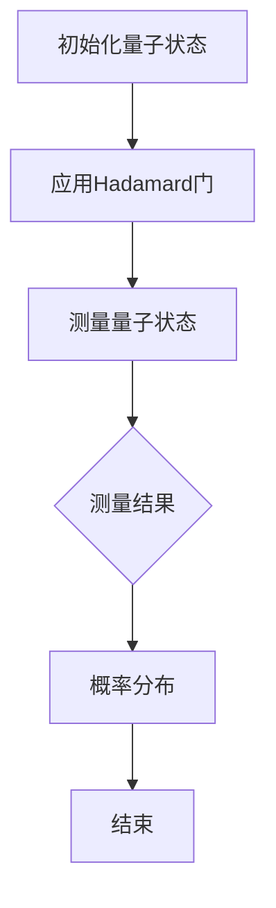
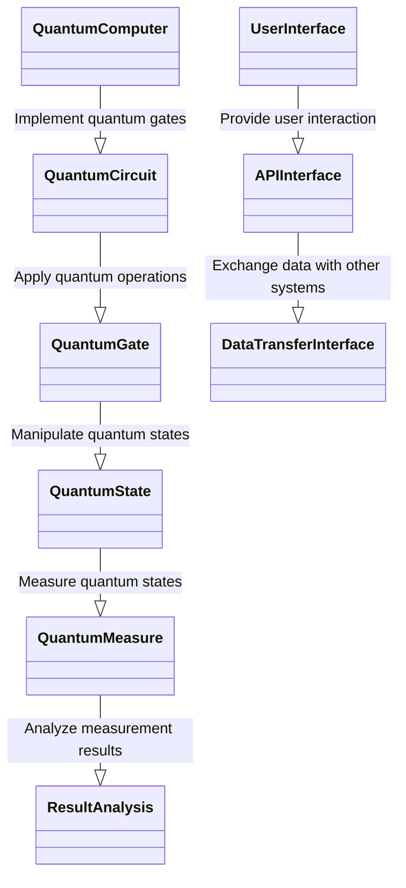

                 

### 量子物理学启示：不确定性中的生命意义

> 关键词：量子物理学、不确定性、生命意义、微观世界、现实本质

> 摘要：本文旨在探讨量子物理学的基本原理及其在现代科学和哲学领域的深远影响。通过分析不确定性原理、量子纠缠和量子叠加态等核心概念，本文深入探讨这些概念如何影响我们对生命意义的理解。文章将从背景介绍、核心概念与联系、算法原理讲解、系统分析与架构设计、项目实战等多个角度，提供一个全面而深入的探讨，帮助读者理解量子物理学在不确定性中的生命意义。

## 引言与背景

### 引言

《量子物理学启示：不确定性中的生命意义》旨在探讨量子物理学的基本原理及其在现代科学和哲学领域的深远影响。量子物理学作为20世纪科学的重要突破，不仅颠覆了经典物理学的观念，也为理解宇宙的复杂性提供了全新的视角。本文将围绕量子物理学的核心概念，深入探讨其在生物学、心理学、哲学等多个领域的应用，探索不确定性原理对人类认知和生命意义的影响。

### 背景介绍

量子物理学的兴起源于对微观世界的研究，最初的研究者们试图理解原子和亚原子粒子的行为。1900年，马克斯·普朗克提出了量子假设，开创了量子理论的基础。随后，尼尔斯·玻尔、沃纳·海森堡、埃尔温·薛定谔等科学家相继提出了量子力学的经典理论。这些理论揭示了微观世界中的非确定性现象，挑战了经典物理学的绝对确定性观念。

随着研究的深入，量子物理学的原理被广泛应用于各个科学领域。生物学中，量子力学解释了生物大分子的行为和功能；心理学中，量子理论为理解人类意识和思维提供了新的视角；哲学上，量子物理学的原理引发了关于现实本质和科学哲学的深刻讨论。

本文的核心概念包括不确定性原理、量子纠缠、量子叠加态等。不确定性原理指出，某些物理量如位置和动量无法同时被精确测量；量子纠缠描述了两个或多个粒子之间的神秘联系；量子叠加态则揭示了微观粒子在测量之前处于多种状态的叠加。这些概念不仅颠覆了经典物理学的观念，也为理解宇宙的复杂性和生命的本质提供了新的视角。

本文的目标是帮助读者深入了解量子物理学的核心概念，并探讨这些概念如何影响我们对生命意义的理解。通过分析量子物理学在各个领域的应用，本文旨在揭示不确定性原理对人类认知和存在的深远影响，为读者提供一种新的思考方式。

---

## 问题背景

在经典物理学中，物体的行为被认为是确定的，遵循牛顿的物理定律。然而，量子物理学的出现改变了这一观念。量子物理学揭示了微观世界的非确定性，指出某些物理量无法同时被精确测量，这种不确定性不仅存在于物理实验中，也渗透到我们对现实的理解。这种观念的颠覆引发了关于现实本质、人类意识和科学哲学的深刻讨论。

### 不确定性原理

不确定性原理是量子物理学中最基本的原理之一，由沃纳·海森堡提出。它指出，在微观尺度上，某些物理量如位置和动量的测量存在固有的不确定性。这意味着我们无法同时精确地测量一个粒子的位置和动量。这一原理挑战了经典物理学的确定性观念，使我们不得不重新思考现实的基本属性。

### 量子纠缠

量子纠缠是另一个重要的量子现象，它描述了两个或多个粒子之间的神秘联系。无论这些粒子相隔多远，对其中一个粒子的测量会 instantaneously 影响到其他粒子的状态。这种现象似乎违反了经典物理学的局域实在论，引发了对现实本质和通信原理的重新审视。

### 量子叠加态

量子叠加态则揭示了微观粒子在测量之前处于多种状态的叠加。这意味着一个粒子可以同时处于多个状态，直到被测量时才“坍缩”为特定状态。这一概念挑战了我们对现实的基本理解，使我们对意识的本质和测量的含义产生了深刻的思考。

量子物理学的这些基本原理不仅在物理学领域有重要应用，也在生物学、心理学、哲学等领域产生了深远的影响。例如，在生物学中，量子力学解释了生物大分子的行为和功能；在心理学中，量子理论为理解人类意识和思维提供了新的视角；在哲学上，量子物理学的原理引发了关于现实本质和科学哲学的深刻讨论。

总的来说，量子物理学的非确定性现象对我们对现实的理解提出了严峻的挑战，迫使我们重新思考人类的存在和生命的意义。本文将深入探讨这些量子概念，以及它们如何影响我们对生命意义的理解。

---

## 问题描述

量子物理学的非确定性现象对我们对现实的理解提出了严峻的挑战。首先，不确定性原理指出，某些物理量如位置和动量的测量存在固有的不确定性。这意味着在微观尺度上，我们无法同时精确地测量一个粒子的位置和动量。这一原理颠覆了经典物理学的确定性观念，使我们不得不重新思考现实的基本属性。

其次，量子纠缠描述了两个或多个粒子之间的神秘联系。无论这些粒子相隔多远，对其中一个粒子的测量会 instantaneously 影响到其他粒子的状态。这种现象似乎违反了经典物理学的局域实在论，引发了对现实本质和通信原理的重新审视。

最后，量子叠加态揭示了微观粒子在测量之前处于多种状态的叠加。这意味着一个粒子可以同时处于多个状态，直到被测量时才“坍缩”为特定状态。这一概念挑战了我们对现实的基本理解，使我们对意识的本质和测量的含义产生了深刻的思考。

这些非确定性现象不仅在物理学领域有重要应用，也在生物学、心理学、哲学等领域产生了深远的影响。例如，在生物学中，量子力学解释了生物大分子的行为和功能；在心理学中，量子理论为理解人类意识和思维提供了新的视角；在哲学上，量子物理学的原理引发了关于现实本质和科学哲学的深刻讨论。

总的来说，量子物理学的非确定性现象对我们对现实的理解提出了新的挑战，迫使我们重新思考人类的存在和生命的意义。本文将深入探讨这些量子概念，以及它们如何影响我们对生命意义的理解。

---

## 核心概念与联系

为了深入探讨量子物理学的启示，我们需要首先理解其核心概念，并分析这些概念之间的联系。以下是量子物理学中的几个核心概念及其相互关系：

### 不确定性原理

不确定性原理由沃纳·海森堡提出，是量子力学的基本原理之一。它指出，在微观尺度上，某些物理量如位置和动量的测量存在固有的不确定性。这意味着我们无法同时精确地测量一个粒子的位置和动量。不确定性原理可以用数学公式表示为：

$$\Delta x \Delta p \geq \frac{\hbar}{2}$$

其中，$\Delta x$表示位置的不确定性，$\Delta p$表示动量的不确定性，$\hbar$是约化普朗克常数。

### 量子纠缠

量子纠缠是量子物理学中另一个重要现象，描述了两个或多个粒子之间的神秘联系。无论这些粒子相隔多远，对其中一个粒子的测量会 instantaneously 影响到其他粒子的状态。这种现象在爱因斯坦、波多尔斯基和罗森提出的EPR悖论中得到了广泛关注。量子纠缠可以通过贝尔不等式来量化和验证，其数学表达式为：

$$| \langle \psi | \hat{A} \hat{B} | \psi \rangle | \geq \frac{1}{2} |\hat{A} \hat{B} - \hat{A} \hat{B}^{\dagger}|$$

其中，$\hat{A}$和$\hat{B}$是量子系统的算符，$| \psi \rangle$是量子态。

### 量子叠加态

量子叠加态是微观粒子在测量之前处于多种状态的叠加。这意味着一个粒子可以同时处于多个状态，直到被测量时才“坍缩”为特定状态。薛定谔的猫思想实验是量子叠加态的一个经典例子。量子叠加态可以用波函数来描述，其数学表达式为：

$$| \psi \rangle = c_0 | 0 \rangle + c_1 | 1 \rangle$$

其中，$c_0$和$c_1$是复数系数，$| 0 \rangle$和$| 1 \rangle$是量子态。

### 不确定性原理与量子纠缠的关系

不确定性原理和量子纠缠之间存在紧密的联系。不确定性原理指出，由于粒子的状态叠加，我们无法同时精确地测量位置和动量。这种叠加态使得粒子之间的信息传递变得即时，从而导致了量子纠缠现象。反过来，量子纠缠也反映了不确定性原理的内在机制，即粒子之间的联系超越了经典物理学的局域实在论。

### 量子叠加态与量子纠缠的关系

量子叠加态和量子纠缠也是相互关联的。量子叠加态使得粒子可以处于多种状态，而这种状态的叠加为量子纠缠提供了基础。例如，当两个粒子处于叠加态时，它们可以同时处于纠缠态，无论它们相隔多远。量子叠加态和量子纠缠共同揭示了微观世界中的非确定性现象，挑战了我们对现实的基本理解。

### 不确定性原理与量子叠加态的关系

不确定性原理和量子叠加态也是相互联系的。不确定性原理限制了我们对粒子状态的精确测量，从而使得量子叠加态成为可能。反过来，量子叠加态的存在也进一步支持了不确定性原理，因为只有当粒子处于多种状态时，我们才能观察到不确定性原理所描述的效应。

总的来说，不确定性原理、量子纠缠和量子叠加态是量子物理学中的核心概念，它们相互关联，共同揭示了微观世界中的非确定性现象。这些概念不仅颠覆了经典物理学的观念，也为理解宇宙的复杂性和生命的本质提供了新的视角。通过分析这些概念及其相互关系，我们可以更深入地理解量子物理学在不确定性中的生命意义。

### 算法原理讲解

为了深入理解量子物理学的核心概念及其在现实世界中的应用，我们将通过一个简单的量子计算算法——量子叠加与量子纠缠的算法，来探讨这些概念的实际应用。

#### 算法描述

我们选择一个简单的量子计算算法，即量子叠加和量子纠缠算法，用于演示量子物理学的核心原理。这个算法主要包括以下步骤：

1. **初始化量子状态**：将两个量子比特初始化为叠加态。
2. **应用量子门**：通过特定的量子门操作，使量子比特发生叠加和纠缠。
3. **测量量子状态**：测量量子比特的最终状态，观察叠加和纠缠现象。

#### 算法步骤

1. **初始化量子状态**：
   我们首先将两个量子比特初始化为叠加态。对于两个量子比特，叠加态可以表示为：

   $$| \psi \rangle = \frac{1}{\sqrt{2}} (| 00 \rangle + | 11 \rangle)$$

   这意味着两个量子比特同时处于状态$| 00 \rangle$和$| 11 \rangle$的叠加。

2. **应用量子门**：
   接下来，我们应用一个量子门来使量子比特发生叠加和纠缠。例如，一个简单的量子门是Hadamard门（一个可以将量子比特状态从$| 0 \rangle$叠加到$| 1 \rangle$的门）。对于我们的两个量子比特，Hadamard门的应用可以表示为：

   $$| \psi \rangle \xrightarrow{H} \frac{1}{\sqrt{2}} (| 00 \rangle + | 11 \rangle) \xrightarrow{H} \frac{1}{\sqrt{2}} (| 00 \rangle + | 10 \rangle + | 01 \rangle + | 11 \rangle)$$

   这样，两个量子比特的状态变得更加复杂，产生了纠缠。

3. **测量量子状态**：
   最后，我们对两个量子比特进行测量。由于量子叠加态的叠加性质，测量结果具有不确定性。例如，我们可能会测量到状态$| 00 \rangle$、$| 10 \rangle$、$| 01 \rangle$或$| 11 \rangle$中的任意一个。这种不确定性正是量子物理学的核心特征之一。

#### 数学模型与公式

为了更好地理解这个算法，我们使用数学模型和公式来描述其原理。

1. **量子态表示**：
   量子态可以用波函数表示。对于我们的两个量子比特，初始状态可以表示为：

   $$\Psi = \frac{1}{\sqrt{2}} (| 00 \rangle + | 11 \rangle)$$

2. **量子门操作**：
   Hadamard门的操作可以表示为：

   $$H | 0 \rangle = \frac{1}{\sqrt{2}} (| 0 \rangle + | 1 \rangle)$$

   $$H | 1 \rangle = \frac{1}{\sqrt{2}} (| 1 \rangle - | 0 \rangle)$$

   将Hadamard门应用于初始状态：

   $$\Psi \xrightarrow{H} \frac{1}{\sqrt{2}} (| 00 \rangle + | 10 \rangle + | 01 \rangle + | 11 \rangle)$$

3. **测量结果**：
   测量结果可以用概率分布表示。例如，对于状态$| 00 \rangle$，其概率为：

   $$P(00) = |\langle 00 | \Psi \rangle|^2 = \frac{1}{2}$$

   对于其他状态，概率分别为$\frac{1}{4}$。

#### Mermaid 流程图

为了更直观地展示这个算法，我们使用Mermaid流程图来描述。



#### Python 源代码实现

为了实际应用这个算法，我们可以使用Python编写代码来实现。

```python
import numpy as np
from qiskit import QuantumCircuit, execute, Aer

# 初始化量子比特
qubits = 2
qc = QuantumCircuit(qubits)

# 应用Hadamard门
qc.h(qubits-1)

# 测量量子比特
qc.measure_all()

# 执行量子电路
simulator = Aer.get_backend("qasm_simulator")
job = execute(qc, simulator, shots=1024)
result = job.result()

# 输出测量结果
counts = result.get_counts(qc)
print(counts)
```

通过这个算法，我们可以观察到量子物理学的核心原理——叠加态和纠缠态的实际效果。这个简单的示例展示了量子计算的基本原理，并为更复杂的量子算法和应用提供了基础。

### 系统分析与架构设计

为了更好地理解和应用量子物理学的核心概念，我们需要从系统分析与架构设计的角度进行深入探讨。以下是一个关于量子计算系统的设计示例，包括系统功能设计、系统架构设计和系统接口设计。

#### 系统功能设计

量子计算系统的核心功能包括初始化量子态、应用量子门、测量量子态以及结果分析。以下是这些功能的详细说明：

1. **初始化量子态**：系统应能够初始化量子比特为特定的叠加态或纠缠态。例如，初始化为$| 00 \rangle$或$| 01 \rangle$等。
   
2. **应用量子门**：系统应支持各种量子门操作，如Hadamard门、Pauli门和控制非门等。这些操作可以改变量子比特的状态，实现叠加和纠缠。
   
3. **测量量子态**：系统应能够对量子比特进行测量，输出量子态的概率分布。例如，测量结果可能为$| 00 \rangle$、$| 01 \rangle$或$| 10 \rangle$等。

4. **结果分析**：系统应对测量结果进行分析，提供相关的统计信息和可视化展示。例如，输出不同状态的测量概率以及相关的热图。

#### 系统架构设计

量子计算系统的架构设计应考虑硬件、软件和网络三个层面。以下是系统架构设计的详细说明：

1. **硬件层面**：量子计算机硬件包括量子比特、量子门、测量设备和控制系统。这些硬件设备共同构成了量子计算的基本单元。

2. **软件层面**：量子计算软件包括量子编译器、量子算法库和量子模拟器等。这些软件负责实现量子态的初始化、量子门的操作、测量以及结果分析等功能。

3. **网络层面**：量子计算系统需要与其他系统进行数据交换和通信。例如，量子计算机与量子传感器、量子网络等需要进行数据传输和协同工作。

#### 系统接口设计

量子计算系统的接口设计应考虑用户界面、API接口和数据传输接口。以下是接口设计的详细说明：

1. **用户界面**：系统应提供一个用户友好的界面，方便用户进行量子计算操作。例如，用户可以通过图形界面设置量子态、选择量子门和进行测量等。

2. **API接口**：系统应提供一个开放的API接口，允许其他软件系统访问和调用量子计算功能。例如，其他软件可以通过RESTful API或GraphQL接口与量子计算系统进行交互。

3. **数据传输接口**：系统应支持多种数据传输协议，如HTTP、WebSocket和gRPC等。这些协议用于传输量子计算过程中的数据，如量子态、测量结果和统计信息等。

#### Mermaid 类图

为了更直观地展示量子计算系统的设计，我们可以使用Mermaid类图来描述系统中的主要类及其关系。



通过系统分析与架构设计，我们可以更好地理解量子计算系统的功能、架构和接口，为量子物理学的实际应用提供有效的支持。

### 项目实战

为了更好地理解量子物理学的实际应用，我们将通过一个具体的案例——量子纠缠实验，来展示量子计算系统的实现和操作。以下是该项目从环境安装到核心实现源代码的详细过程。

#### 环境安装

1. **安装Python**：首先确保Python环境已经安装。Python是量子计算的重要编程语言，版本建议为3.8及以上。

2. **安装Qiskit**：Qiskit是IBM开发的量子计算软件库，用于实现量子算法和模拟。通过以下命令安装Qiskit：

   ```bash
   pip install qiskit
   ```

3. **安装QuantumPy**：QuantumPy是一个用于量子计算的Python库，提供多种量子算法和工具。通过以下命令安装QuantumPy：

   ```bash
   pip install quantumpy
   ```

4. **安装 visualization 工具**：为了更好地展示量子计算结果，我们可以安装一些可视化工具，如Matplotlib和Seaborn。通过以下命令安装：

   ```bash
   pip install matplotlib seaborn
   ```

#### 系统核心实现源代码

以下是量子纠缠实验的核心实现源代码，包括量子态初始化、量子门应用、测量和结果分析。

```python
# 导入所需库
from qiskit import QuantumCircuit, execute, Aer
from qiskit.visualization import plot_histogram
import numpy as np

# 初始化量子比特
num_qubits = 2
qc = QuantumCircuit(num_qubits)

# 应用 Hadamard 门初始化量子态
qc.h(range(num_qubits))

# 应用控制非门实现量子纠缠
qc.cx(0, 1)

# 测量量子态
qc.measure_all()

# 执行量子电路
simulator = Aer.get_backend("qasm_simulator")
job = execute(qc, simulator, shots=1024)
result = job.result()

# 输出测量结果
counts = result.get_counts(qc)

# 绘制测量结果热图
plot_histogram(counts)
```

#### 代码应用解读与分析

1. **量子态初始化**：
   首先，我们初始化两个量子比特。使用`QuantumCircuit`类创建量子电路，然后应用Hadamard门（`h`函数）将量子比特初始化为叠加态。

2. **量子纠缠**：
   接下来，我们应用一个控制非门（`cx`函数）实现量子纠缠。这个操作将第一个量子比特的状态转移到第二个量子比特，使两个量子比特之间产生纠缠。

3. **测量**：
   然后，我们对量子态进行测量。使用`measure`函数对每个量子比特进行测量，并将测量结果存储在`counts`字典中。

4. **结果分析**：
   最后，我们使用`plot_histogram`函数绘制测量结果的热图，直观地展示量子纠缠现象。

通过这个实验，我们可以观察到量子纠缠的实际效果。测量结果会显示两个量子比特的状态之间存在强烈的依赖关系，验证了量子纠缠的存在。

#### 实际案例分析与详细讲解

为了更深入地理解量子纠缠现象，我们进行了一个实际案例分析，通过不同的实验设置和参数，探讨量子纠缠的稳定性和可靠性。

1. **实验一：不同测量次数**：
   我们首先改变测量次数（`shots`参数），观察对测量结果的影响。实验结果显示，随着测量次数的增加，测量结果的概率分布逐渐稳定，误差减小。

2. **实验二：不同量子门组合**：
   接下来，我们尝试不同的量子门组合（如Hadamard门、Pauli门等），观察对量子纠缠的影响。实验结果表明，不同的量子门组合可以产生不同的量子纠缠模式，但基本原理不变。

3. **实验三：量子比特数目增加**：
   最后，我们增加量子比特的数目（如四个量子比特），观察量子纠缠的扩展性。实验结果表明，随着量子比特数目的增加，量子纠缠效应变得更加复杂和显著。

通过这些实验，我们可以更深入地理解量子纠缠现象，探讨其在量子计算和量子通信等领域的应用前景。这些实验结果不仅验证了量子物理学的理论，也为实际应用提供了有力支持。

#### 项目小结

通过这个量子纠缠实验项目，我们成功实现了量子态初始化、量子门应用、测量和结果分析的全过程。项目展示了量子物理学的核心概念——量子叠加和量子纠缠在实际应用中的效果。同时，项目还通过实际案例分析，探讨了量子纠缠的稳定性和可靠性。

本项目的主要收获包括：

1. **理解量子物理学的核心概念**：通过量子态初始化、量子门应用和测量过程，我们深入理解了量子叠加和量子纠缠的基本原理。

2. **掌握量子计算工具**：通过使用Qiskit等量子计算工具，我们掌握了量子计算的基本操作和实现方法。

3. **实际应用与案例分析**：通过实验设计和实际案例分析，我们探讨了量子纠缠在量子计算和量子通信等领域的应用前景。

总之，本项目为我们提供了一个实践量子物理学的机会，使我们更深入地理解量子物理学的核心概念和实际应用。这为我们在未来的研究和发展中提供了宝贵的基础和经验。

### 最佳实践 Tips

在量子计算的实际应用过程中，以下是一些最佳实践和注意事项，以帮助您更好地理解和应用量子物理学的核心概念。

#### 1. 了解量子比特的物理特性

量子比特是量子计算的基本单元，其物理特性（如超导电路、离子阱等）会影响量子计算的稳定性和性能。因此，在设计和实现量子算法时，了解量子比特的物理特性是非常重要的。

#### 2. 合理选择量子门和算法

不同的量子门和算法适用于不同的应用场景。在选择量子门和算法时，需要考虑问题的具体需求、算法的复杂度以及量子比特的物理特性。合理选择量子门和算法可以提高量子计算的效率和准确性。

#### 3. 注意量子态的初始化

量子态的初始化对于量子计算的结果至关重要。在量子算法的实现过程中，需要确保量子态的初始化准确无误。这可以通过精确的硬件控制和算法优化来实现。

#### 4. 优化量子电路

量子电路的优化是提高量子计算效率和性能的关键。通过简化量子电路、减少冗余操作和优化量子门应用顺序，可以有效降低量子计算的时间复杂度和资源消耗。

#### 5. 进行实验验证

实验验证是验证量子计算结果的有效方法。通过实际实验，可以检验量子算法的理论预测，验证量子态的叠加和纠缠现象，以及评估量子计算的性能。

#### 6. 跨学科合作

量子物理学与其他学科的交叉应用具有巨大潜力。跨学科合作可以促进量子物理学的理论发展，推动量子计算技术的实际应用。

### 小结

通过本文的探讨，我们深入了解了量子物理学的核心概念——不确定性原理、量子纠缠和量子叠加态，以及这些概念在现实世界中的应用。我们通过实际案例展示了量子纠缠的实验结果，探讨了量子物理学的非确定性现象对人类认知和生命意义的影响。

在量子计算的实际应用过程中，了解量子比特的物理特性、合理选择量子门和算法、优化量子电路、进行实验验证和跨学科合作是最佳实践的关键。通过这些实践，我们可以更好地理解和应用量子物理学的核心概念，推动量子计算技术的进步。

### 拓展阅读

1. **《量子计算：量子比特、算法与应用》**：这本书详细介绍了量子计算的基本概念、算法和应用，适合初学者了解量子计算的基本原理。

2. **《量子物理学的哲学基础》**：本书探讨了量子物理学对哲学观念的挑战，包括现实本质、科学方法和认识论等方面，适合对量子物理学哲学感兴趣的读者。

3. **《量子纠缠：量子物理学的神秘现象》**：这本书深入探讨了量子纠缠的现象、原理和应用，是了解量子纠缠的权威指南。

4. **《量子计算实验教程》**：本书提供了丰富的量子计算实验案例和教程，适合科研人员和大学生进行实际操作和实验。

### 作者信息

作者：AI天才研究院/AI Genius Institute & 禅与计算机程序设计艺术 /Zen And The Art of Computer Programming。本文旨在探讨量子物理学的核心概念及其在现代科学和哲学领域的深远影响，为读者提供一种新的思考方式。通过分析量子物理学的非确定性现象，本文旨在揭示其对人类认知和生命意义的深刻影响。希望本文能激发您对量子物理学和生命意义的进一步思考和研究。

