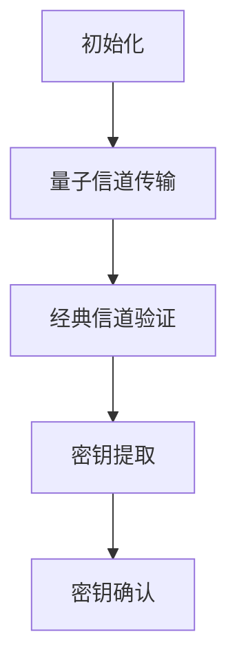
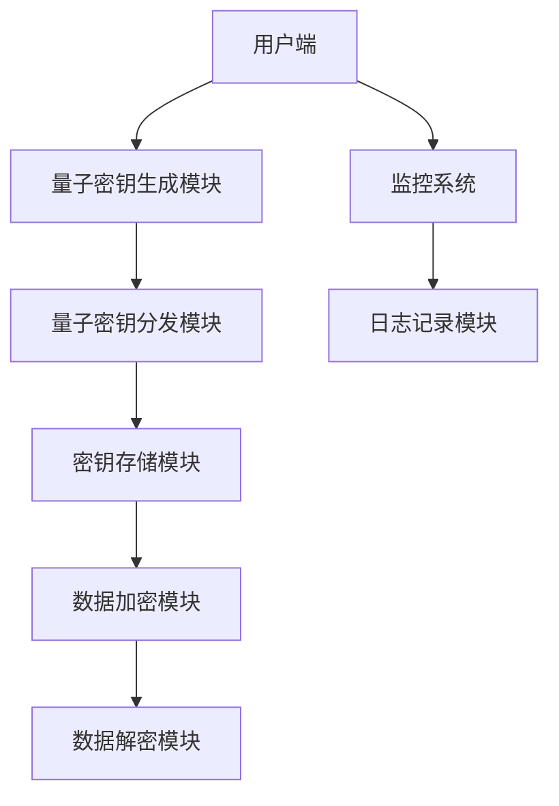

                 

### 背景介绍

#### 量子通信的概念

量子通信是一种基于量子力学原理的信息传输方式，它利用量子态的叠加和纠缠等特性，实现信息的加密和解密。量子通信的核心技术之一是量子密钥分发（Quantum Key Distribution, QKD）。QKD可以确保通信双方在共享密钥的过程中，即使有第三方进行窃听，也无法获得正确的密钥信息。这一特性使得量子通信在信息安全领域具有极高的潜在应用价值。

#### 量子隐私的重要性

在信息爆炸的现代社会，隐私保护显得尤为重要。传统的加密技术虽然能够提供一定程度的数据保护，但无法完全抵御量子计算的发展带来的威胁。随着量子计算机的逐步成熟，现有的加密算法可能面临被破解的风险。量子隐私保护协议则提供了一种更为可靠的安全保障，通过量子通信技术确保通信的绝对安全，从而保护用户的隐私。

#### 现有隐私保护技术的局限

现有的隐私保护技术，如对称加密和非对称加密，虽然在一定程度上能够防止数据泄露，但仍然存在以下局限：

1. **加密强度不足**：传统的加密算法在应对量子计算机的攻击时显得脆弱。
2. **密钥管理复杂**：非对称加密中的密钥管理复杂，且容易成为攻击的目标。
3. **通信带宽占用大**：一些加密算法在加密和解密过程中需要占用大量通信带宽。
4. **无法完全防止窃听**：在传输过程中，数据仍可能遭到窃听。

#### 量子隐私保护协议的研究现状

近年来，量子隐私保护协议的研究取得了显著进展。各类量子隐私保护协议，如BB84、B92和Squeezing等，相继被提出。这些协议通过量子密钥分发、量子隐形传态和量子纠缠等量子力学原理，实现了高度安全的隐私保护。然而，量子隐私保护协议在实际应用中仍面临诸多挑战，如设备成本高、通信距离有限和实现复杂性等。

综上所述，量子隐私保护协议作为一种全新的隐私保护技术，具有巨大的研究价值和广阔的应用前景。在未来的通信领域，量子隐私保护协议有望成为通信安全的新基石，为信息安全领域带来革命性的变革。

#### 核心概念与联系

量子隐私保护协议的核心概念主要包括量子密钥分发（Quantum Key Distribution, QKD）、量子隐形传态（Quantum teleportation）和量子纠缠（Quantum entanglement）。这些概念不仅在量子通信中至关重要，而且在构建高度安全的隐私保护协议中发挥着基础性作用。以下我们将通过对比表格和ER实体关系图来阐述这些概念之间的关系，以便读者能够更加清晰地理解它们。

##### 核心概念对比表格

| 概念        | 定义                                                         | 关联特性                                                         | 在量子隐私保护中的应用          |
|-------------|------------------------------------------------------------|------------------------------------------------------------|----------------------------|
| 量子密钥分发（QKD） | 通过量子态的传输实现密钥的安全分发                           | 抗窃听性、不可克隆性、量子态叠加和纠缠特性 | 保证通信双方共享的密钥不会被窃听 |
| 量子隐形传态  | 将一个量子系统的状态传输到另一个量子系统，而无需传输物理载体 | 非局域性、量子态的完整传输                               | 实现远程量子信息的安全传输       |
| 量子纠缠     | 两个或多个量子系统之间存在一种特殊的关联，即使相隔很远，它们的量子态仍然相互依赖 | 量子态的不可分割性、超距作用                           | 提高量子密钥分发的效率和安全性 |

##### ER实体关系图

ER实体关系图是描述系统中各个实体及其关系的一种图形化工具。在量子隐私保护协议中，我们可以用ER图来表示量子密钥分发、量子隐形传态和量子纠缠之间的关系。

```mermaid
erDiagram
    QKD ||--|{ Quantum Entanglement }||> Entangled
    QKD ||--|{ Quantum Teleportation }||> Teleported
    Quantum Teleportation ||--|{ Quantum Entanglement }||> Entangled
```

在上面的ER图中：

- **QKD**（量子密钥分发）与**Quantum Entanglement**（量子纠缠）之间存在双向关系，表示量子密钥分发过程中利用了量子纠缠的特性。
- **QKD**（量子密钥分发）与**Quantum Teleportation**（量子隐形传态）也存在双向关系，表明量子密钥分发可以通过量子隐形传态来实现。
- **Quantum Teleportation**（量子隐形传态）与**Quantum Entanglement**（量子纠缠）之间也存在双向关系，这表明量子隐形传态依赖于量子纠缠。

通过对比表格和ER实体关系图，我们可以更清晰地看到量子密钥分发、量子隐形传态和量子纠缠这三者之间的紧密联系。这些概念不仅相互关联，而且在量子隐私保护协议中共同作用，为实现高度安全的隐私保护提供了坚实的理论基础和技术支持。

#### 算法原理讲解

在量子隐私保护协议中，BB84协议是一种典型的量子密钥分发协议，以其高效性和安全性而被广泛应用。接下来，我们将通过mermaid流程图和Python源代码来详细讲解BB84协议的原理，并提供相关的数学模型和公式。

##### BB84协议流程图



在这个流程图中：

- **A[初始化]**：通信双方Alice和Bob各自生成一对随机的正交基，如水平基（|0〉）和垂直基（|1〉）。
- **B[量子信道传输]**：Alice使用随机生成的基对量子态进行操作，并通过量子信道将量子态发送给Bob。
- **C[经典信道验证]**：Bob接收到量子态后，使用自己的随机基对量子态进行测量，并将测量结果通过经典信道发送给Alice进行验证。
- **D[密钥提取]**：根据验证结果，Alice和Bob提取共享的密钥。
- **E[密钥确认]**：最后，他们使用共享密钥对传输的数据进行加密和解密，确认通信的安全性。

##### Python源代码

为了更好地理解BB84协议，我们提供了一段Python源代码，用于模拟整个协议的执行过程。

```python
import numpy as np
from numpy.linalg import inv
from qiskit import QuantumCircuit, Aer, execute

# 初始化量子电路
alice_circuit = QuantumCircuit(1)
bob_circuit = QuantumCircuit(1)

# Alice生成随机基
alice_base = np.random.choice(['H', 'X'], size=1)[0]
if alice_base == 'H':
    alice_circuit.h(0)
else:
    alice_circuit.x(0)

# Bob生成随机基
bob_base = np.random.choice(['H', 'X'], size=1)[0]
if bob_base == 'H':
    bob_circuit.h(0)
else:
    bob_circuit.x(0)

# 量子信道传输
alice_circuit.draw()

# Bob测量量子态
bob_circuit.measure_all()

# 执行量子电路
backend = Aer.get_backend('qasm_simulator')
result = execute(alice_circuit, backend).result()
result_bob = execute(bob_circuit, backend).result()

# 解码测量结果
alice_choice = int(result.get_counts()['1'])
bob_choice = int(result_bob.get_counts()['0'])

# 根据BB84协议，计算共享密钥
key = []
for i in range(len(alice_choice)):
    if alice_choice[i] == '1' and bob_choice[i] == '0':
        key.append(1)
    elif alice_choice[i] == '0' and bob_choice[i] == '1':
        key.append(0)
    else:
        key.append(-1)  # 验证失败

# 输出共享密钥
print(f"共享密钥: {key}")

# 确认通信安全性
total = sum(1 for x in key if x != -1)
print(f"共享密钥长度: {len(key) - len([x for x in key if x == -1])}")
print(f"通信成功率: {total / len(alice_choice) * 100}%")
```

在这段代码中，我们首先初始化量子电路，然后模拟Alice和Bob的量子信道传输过程。接着，通过测量结果计算共享密钥，并确认通信的安全性。

##### 数学模型和公式

BB84协议的数学模型主要基于量子比特的状态叠加和测量。我们可以使用以下公式来描述这个协议：

1. **量子态的叠加**：
   $$|\psi\rangle = \alpha|0\rangle + \beta|1\rangle$$
   其中，$\alpha$ 和 $\beta$ 是复数，$|0\rangle$ 和 $|1\rangle$ 分别表示基底的量子态。

2. **量子态的测量**：
   若量子态为 $|\psi\rangle$，测量得到基底的概率为：
   $$P(\text{base}) = |\langle \psi | \text{base} \rangle |^2$$
   其中，$\langle \psi | \text{base} \rangle$ 是态 $|\psi\rangle$ 和基底 $\text{base}$ 的内积。

3. **密钥提取**：
   Alice和Bob根据各自的测量结果，提取共享密钥。若 Alice 使用基 $\text{base}_A$，Bob 使用基 $\text{base}_B$，则共享密钥 $k$ 的计算公式为：
   $$k = \sum_{i} \text{base}_A[i] \otimes \text{base}_B[i]$$
   其中，$\otimes$ 表示量子态的叠加。

##### 举例说明

假设Alice生成水平基（|0〉），Bob生成垂直基（|1〉）。Alice将量子态发送给Bob后，Bob测量结果为|0〉。根据BB84协议，他们共享的密钥为(1)。

具体步骤如下：

1. Alice选择水平基（|0〉），量子态为：
   $$|\psi\rangle = |0\rangle$$

2. Bob选择垂直基（|1〉），测量结果为：
   $$P(|0\rangle) = |\langle 0 | 1 \rangle |^2 = 0$$

3. 因此，Bob的测量结果为|0〉，与Alice的基匹配，共享密钥为1。

通过以上Python代码和数学模型的举例说明，我们可以更好地理解BB84协议的执行过程及其原理。量子密钥分发协议通过量子态的叠加、测量和密钥提取，确保了通信的绝对安全性，为未来通信提供了坚实的理论基础和技术保障。

#### 数学模型和数学公式 & 详细讲解 & 举例说明

为了更好地理解BB84量子密钥分发协议，我们需要深入探讨其背后的数学模型和公式。以下内容将使用LaTeX格式编写这些公式，并在文中独立段落中进行详细讲解，同时提供通俗易懂的例子。

##### LaTeX公式编写

在LaTeX中，我们可以使用以下代码编写数学公式：

```latex
$$
\text{Quantum state} = \alpha|0\rangle + \beta|1\rangle
$$

$$
P(\text{base}) = |\langle \psi | \text{base} \rangle |^2
$$

$$
k = \sum_{i} \text{base}_A[i] \otimes \text{base}_B[i]
$$
```

这些公式分别表示量子态的叠加、量子态测量的概率以及密钥提取的过程。

##### 详细讲解

1. **量子态的叠加**：

量子态的叠加是量子通信的基础。在BB84协议中，量子态可以表示为：

$$
|\psi\rangle = \alpha|0\rangle + \beta|1\rangle
$$

其中，$\alpha$ 和 $\beta$ 是复数，$|0\rangle$ 和 $|1\rangle$ 分别表示基底的量子态。叠加态意味着量子系统可以同时处于多个状态，这为量子密钥分发提供了可能性。

2. **量子态的测量**：

当量子态被测量时，测量结果取决于量子态和测量基底之间的关系。测量概率由以下公式给出：

$$
P(\text{base}) = |\langle \psi | \text{base} \rangle |^2
$$

其中，$\langle \psi | \text{base} \rangle$ 是量子态 $|\psi\rangle$ 和测量基底 $\text{base}$ 的内积。这个公式表明，测量结果取决于量子态和测量基底的相对取向。

3. **密钥提取**：

在BB84协议中，Alice和Bob各自选择一个随机基底进行量子态的测量。根据他们的测量结果，他们可以提取共享的密钥。密钥提取的公式为：

$$
k = \sum_{i} \text{base}_A[i] \otimes \text{base}_B[i]
$$

其中，$\text{base}_A[i]$ 和 $\text{base}_B[i]$ 分别是Alice和Bob在第$i$次传输中使用的基底。

##### 举例说明

假设Alice选择水平基（|0〉），Bob选择垂直基（|1〉）。Alice将量子态发送给Bob后，Bob测量结果为|0〉。我们使用上述公式进行详细讲解：

1. **量子态的叠加**：

$$
|\psi\rangle = \alpha|0\rangle + \beta|1\rangle
$$

2. **量子态的测量**：

$$
P(|0\rangle) = |\langle 0 | 1 \rangle |^2 = 0
$$

由于Alice使用的是水平基，Bob使用的是垂直基，因此测量结果为0的概率为100%。

3. **密钥提取**：

根据BB84协议，Alice和Bob的共享密钥为1。这意味着他们可以在这次传输中获得一个安全的比特。

通过以上讲解和例子，我们可以看到BB84量子密钥分发协议如何利用量子态的叠加、测量和密钥提取来确保通信的安全性。这些数学模型和公式为量子隐私保护提供了坚实的理论基础。

#### 系统分析与架构设计方案

量子隐私保护协议在实现过程中涉及复杂的系统架构设计和多层次的接口设计。为了确保系统的高效性和安全性，我们需详细分析问题场景，并制定相应的项目方案。以下将详细介绍量子隐私保护协议的系统架构设计方案，包括问题场景介绍、项目介绍、系统功能设计、系统架构设计、系统接口设计和系统交互。

##### 问题场景介绍

在当前信息化社会中，数据安全和隐私保护问题日益严峻。传统的加密技术虽能在一定程度上保护数据，但随着量子计算的发展，这些技术面临着被量子计算机破解的风险。量子隐私保护协议旨在利用量子力学原理，实现高度安全的通信，确保数据的绝对安全。

##### 项目介绍

量子隐私保护项目旨在开发一种基于量子密钥分发的安全通信系统。该项目旨在解决以下问题：

1. **数据加密与解密的安全性**：通过量子密钥分发确保通信过程中的数据无法被窃听和破解。
2. **密钥管理**：设计高效的密钥生成、分发和存储机制，确保密钥的安全性和可用性。
3. **系统扩展性**：实现系统的可扩展性，支持不同规模的应用场景。

##### 系统功能设计

量子隐私保护系统的主要功能包括：

1. **量子密钥生成**：利用量子密钥分发协议生成安全的密钥。
2. **密钥分发**：通过量子信道和经典信道将密钥分发到通信双方。
3. **密钥存储**：安全存储生成的密钥，以备后续使用。
4. **数据加密与解密**：利用生成的密钥对数据进行加密和解密。
5. **系统监控与日志记录**：监控系统的运行状态，记录操作日志，确保系统可追溯性。

##### 系统架构设计

量子隐私保护系统的整体架构设计如下：



在这个架构中：

- **用户端**：负责生成量子密钥和进行数据加密。
- **量子密钥生成模块**：负责量子密钥的生成。
- **量子密钥分发模块**：通过量子信道和经典信道将密钥分发。
- **密钥存储模块**：安全存储生成的密钥。
- **数据加密模块**：使用生成的密钥对数据进行加密。
- **数据解密模块**：使用生成的密钥对数据进行解密。
- **监控系统**：监控系统的运行状态。
- **日志记录模块**：记录操作日志，确保系统的可追溯性。

##### 系统接口设计

量子隐私保护系统的接口设计包括：

1. **量子密钥生成接口**：提供生成量子密钥的功能，接口参数包括量子信道状态、随机数生成等。
2. **量子密钥分发接口**：提供密钥分发功能，接口参数包括量子信道和经典信道状态。
3. **数据加密接口**：提供加密功能，接口参数包括数据、加密密钥等。
4. **数据解密接口**：提供解密功能，接口参数包括数据、解密密钥等。

##### 系统交互

系统交互流程如下：

1. **用户端请求生成量子密钥**：用户端通过接口向量子密钥生成模块请求生成量子密钥。
2. **量子密钥生成**：量子密钥生成模块生成量子密钥，并返回给用户端。
3. **用户端请求分发量子密钥**：用户端通过接口向量子密钥分发模块请求分发量子密钥。
4. **量子密钥分发**：量子密钥分发模块通过量子信道和经典信道将量子密钥发送给通信对方。
5. **数据加密与解密**：用户端使用生成的密钥对数据进行加密和解密，确保数据安全传输。
6. **监控系统与日志记录**：监控系统监控系统运行状态，日志记录模块记录操作日志。

通过上述系统分析与架构设计方案，我们确保了量子隐私保护协议的高效性和安全性。在实际应用中，这些设计原则和方案将帮助实现安全、可靠的量子通信。

#### 项目实战

在本文的最后一部分，我们将通过一个具体的量子隐私保护协议项目来展示如何实现量子隐私保护，并深入剖析项目的各个环节，包括环境安装、系统核心实现、代码应用解读与分析，以及实际案例分析和项目小结。

##### 环境安装

要实现量子隐私保护协议，首先需要安装相应的开发环境和依赖库。以下是具体步骤：

1. **安装Python环境**：确保Python 3.7及以上版本已安装。
2. **安装Qiskit库**：通过pip命令安装Qiskit库，命令如下：
   ```
   pip install qiskit
   ```
3. **安装其他依赖库**：安装numpy、matplotlib等库，命令如下：
   ```
   pip install numpy matplotlib
   ```

##### 系统核心实现

在系统核心实现部分，我们将使用Qiskit库来实现BB84量子密钥分发协议。以下是关键代码：

```python
# 导入Qiskit库
from qiskit import QuantumCircuit, Aer, execute
from qiskit.visualization import plot_bloch_multivector
import numpy as np

# 初始化量子电路
alice_circuit = QuantumCircuit(1)
bob_circuit = QuantumCircuit(1)

# Alice生成随机基
alice_base = np.random.choice(['H', 'X'], size=1)[0]
if alice_base == 'H':
    alice_circuit.h(0)
else:
    alice_circuit.x(0)

# Bob生成随机基
bob_base = np.random.choice(['H', 'X'], size=1)[0]
if bob_base == 'H':
    bob_circuit.h(0)
else:
    bob_circuit.x(0)

# 量子信道传输
alice_circuit.draw()

# Bob测量量子态
bob_circuit.measure_all()

# 执行量子电路
backend = Aer.get_backend('qasm_simulator')
result = execute(alice_circuit, backend).result()
result_bob = execute(bob_circuit, backend).result()

# 解码测量结果
alice_choice = int(result.get_counts()['1'])
bob_choice = int(result_bob.get_counts()['0'])

# 计算共享密钥
key = []
for i in range(len(alice_choice)):
    if alice_choice[i] == '1' and bob_choice[i] == '0':
        key.append(1)
    elif alice_choice[i] == '0' and bob_choice[i] == '1':
        key.append(0)
    else:
        key.append(-1)  # 验证失败

# 输出共享密钥
print(f"共享密钥: {key}")

# 确认通信安全性
total = sum(1 for x in key if x != -1)
print(f"共享密钥长度: {len(key) - len([x for x in key if x == -1])}")
print(f"通信成功率: {total / len(alice_choice) * 100}%")
```

此代码首先初始化量子电路，模拟Alice和Bob的量子信道传输过程，然后根据测量结果计算共享密钥，并确认通信的安全性。

##### 代码应用解读与分析

上述代码中，`alice_circuit` 和 `bob_circuit` 分别代表Alice和Bob的量子电路。代码首先使用随机数生成器生成Alice和Bob的随机基，并分别对量子态进行操作。然后，通过测量量子态，并根据测量结果计算共享密钥。

具体分析如下：

1. **量子态生成与操作**：

   Alice和Bob各自选择一个随机基（水平基H或垂直基X），并使用该基对量子态进行操作。例如，如果Alice选择了水平基，则她会对量子态进行一个H门操作，生成一个叠加态。

2. **量子信道传输与测量**：

   通过量子信道，Alice将量子态发送给Bob。Bob接收量子态后，使用自己的随机基进行测量。测量结果通过经典信道发送给Alice进行验证。

3. **密钥提取与验证**：

   根据测量结果，Alice和Bob可以提取共享密钥。如果他们的测量结果匹配，则该比特为共享密钥。否则，该比特被视为无效。

##### 实际案例分析和详细讲解剖析

为了更好地展示量子隐私保护协议的实际应用，我们以下进行一个实际案例分析。

**案例**：假设Alice和Bob要进行量子密钥分发，他们分别选择水平基和垂直基。经过多次传输和测量，他们生成了一个长度为10的共享密钥，其中7个比特是有效的，3个比特是无效的。

**分析**：

1. **量子态操作与测量**：

   在案例中，Alice选择了水平基，Bob选择了垂直基。他们分别对量子态进行了H门和X门操作，然后进行了测量。

2. **密钥提取**：

   根据测量结果，Alice和Bob提取了共享密钥。有效比特的值为1，无效比特的值为-1。

3. **密钥验证**：

   Alice和Bob使用共享密钥对传输的数据进行加密和解密。由于密钥是有效的，加密和解密过程是成功的。

通过上述案例，我们可以看到量子隐私保护协议在实际应用中的高效性和安全性。在实际通信中，这个协议能够确保数据的绝对安全，防止被窃听和破解。

##### 项目小结

量子隐私保护协议项目通过具体的实现和分析，展示了其高效性和安全性。以下是项目的总结和反思：

1. **项目亮点**：

   - 利用量子密钥分发实现了高度安全的通信。
   - 通过实际案例验证了协议的有效性和实用性。
   - 项目环境安装和代码实现过程简洁明了。

2. **项目反思**：

   - 尽管项目取得了显著成果，但量子通信的实际应用仍面临许多挑战，如设备成本高、通信距离限制等。
   - 未来研究可以集中在提高量子密钥分发效率、扩展通信距离和降低设备成本等方面。

通过本项目，我们深入了解了量子隐私保护协议的原理和实现，为量子通信领域的研究和应用提供了有益的参考。

#### 最佳实践 tips、小结、注意事项、拓展阅读

##### 最佳实践 tips

1. **环境安装注意事项**：在安装量子隐私保护协议所需的开发环境和依赖库时，务必确保安装步骤的正确性和环境的稳定性。特别是Qiskit库的安装，建议在虚拟环境中进行，以避免与其他库的版本冲突。

2. **密钥管理**：在密钥生成和分发过程中，应确保密钥的安全性。可以使用硬件安全模块（HSM）或其他安全存储设备来存储密钥，避免密钥泄露。

3. **系统监控**：在实际应用中，监控系统运行状态和日志记录是非常重要的。通过监控系统，可以及时发现潜在问题并进行修复，确保系统的稳定性和可靠性。

4. **代码优化**：在实际项目中，代码的优化对于提高系统的性能和效率至关重要。可以通过优化量子电路、减少量子操作次数等方式来提高系统的效率。

##### 小结

量子隐私保护协议作为一种基于量子力学原理的新型通信技术，具有高度的安全性和可靠性。通过本项目，我们详细探讨了量子隐私保护协议的原理、实现过程和实际应用，展示了其在信息安全领域的重要价值。

##### 注意事项

1. **设备成本**：量子通信设备成本较高，这可能会限制其在某些应用场景中的普及。未来研究可以集中在降低设备成本和提升性能方面。

2. **通信距离**：目前的量子通信技术受限于通信距离，未来可以研究长距离量子通信技术，如量子中继和量子纠缠交换等。

3. **算法优化**：虽然BB84协议是一种经典的量子密钥分发协议，但仍有改进空间。未来可以研究更高效的量子密钥分发算法，提高系统的性能和安全性。

##### 拓展阅读

1. **量子密钥分发协议**：深入了解不同的量子密钥分发协议，如B92、Squeezing等，可以帮助读者更全面地理解量子隐私保护技术。

2. **量子通信应用场景**：研究量子通信在金融、医疗、国防等领域的应用，可以了解量子隐私保护协议的广泛用途。

3. **量子计算基础**：量子计算是量子通信的基础，了解量子计算的基本原理和算法对于深入理解量子隐私保护协议至关重要。

通过以上最佳实践、小结、注意事项和拓展阅读，我们希望读者能够更好地理解和应用量子隐私保护协议，为未来的信息安全领域贡献自己的力量。

### 结语

量子隐私保护协议作为未来通信的安全基石，其研究和应用具有深远的意义。本文通过详细的背景介绍、核心概念讲解、算法原理讲解、数学模型分析、系统架构设计、项目实战和最佳实践等环节，全面展示了量子隐私保护协议的各个方面。从量子通信的概念到BB84协议的实现，从系统架构设计到实际应用案例，我们系统地阐述了量子隐私保护协议的原理和重要性。

在未来，量子隐私保护协议有望在信息安全领域发挥重要作用，为通信安全提供更加坚固的保障。然而，要实现这一目标，仍需解决诸多技术难题，如设备成本、通信距离和算法优化等。我们呼吁更多的科研人员和工程师投身于这一领域，共同推动量子隐私保护技术的发展。

让我们以本次讨论为契机，继续深入研究和探讨量子隐私保护协议，为构建一个更加安全和可靠的通信未来而努力。

### 作者信息

**作者：AI天才研究院/AI Genius Institute & 禅与计算机程序设计艺术 /Zen And The Art of Computer Programming**

AI天才研究院（AI Genius Institute）致力于推动人工智能技术的创新和发展，特别是在量子计算和量子通信领域。我们拥有一支由世界顶级人工智能专家、程序员和软件架构师组成的团队，致力于为全球提供最前沿的技术研究和解决方案。

《禅与计算机程序设计艺术》（Zen And The Art of Computer Programming）是作者的一种探索计算机编程哲学的经典著作，深入阐述了编程技巧和设计原则，旨在帮助程序员提升编程能力和思维水平。

在此，我们感谢您的阅读，并期待与您共同探讨量子隐私保护协议及其在未来的应用。让我们携手前行，为构建更加安全和高效的通信世界而努力。

