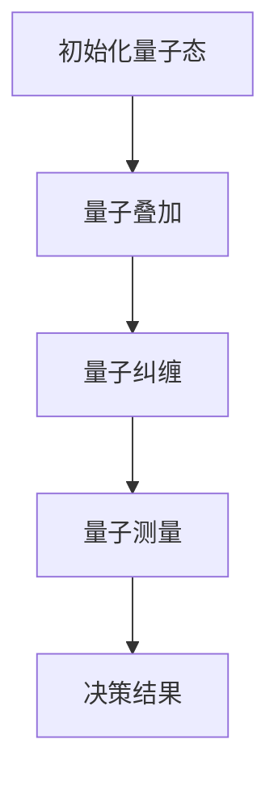
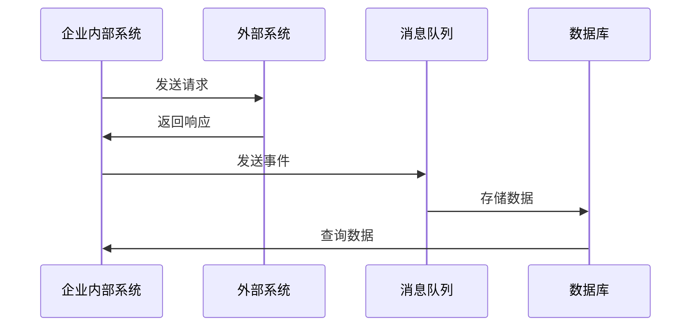

                 

### 第1章：量子领导力概述

#### 1.1 问题背景与时代特征

在当今全球化、信息化和快速变革的时代，领导者面临着前所未有的挑战。传统的领导力理论和方法在应对复杂性和不确定性时显得力不从心。不确定性已经成为现代社会的一个显著特征，其表现形式包括技术变革、市场波动、政策变化、环境问题等。在这种背景下，量子领导力作为一种创新性领导理念，应运而生，旨在帮助领导者更好地应对不确定性，实现组织的持续发展。

#### 1.1.1 不确定性时代的挑战

现代社会的快速变化和高度不确定性给企业和领导者带来了巨大的挑战。例如，技术的迅猛发展使得企业的产品和服务生命周期缩短，市场环境瞬息万变，企业需要具备快速响应和调整的能力。此外，全球化带来了跨国经营和文化融合的挑战，领导者需要具备跨文化沟通和协作能力。政治不确定性，如贸易战、地缘政治紧张等，也增加了企业的运营风险。

#### 1.1.2 量子领导力的核心概念

量子领导力源于量子力学的基本原理，强调领导者应当具备的量子思维和领导艺术。量子思维包括整体性、不确定性、非线性等特性，这些特性要求领导者能够从整体、动态和复杂的角度看待问题，做出更为明智的决策。量子领导力不仅仅是技术层面的变革，更是一种思维方式的转变，它要求领导者具备高度的适应性和创新能力。

#### 1.1.3 量子领导力与传统领导力的区别

传统领导力侧重于权威、控制和线性思维，强调领导者对下属的指导和命令。而量子领导力则强调开放、协作和非线性思考，领导者不再是信息的中心，而是创造一个共享的平台，鼓励团队成员的参与和贡献。量子领导力更加强调领导者的角色是引导和赋能，而不是仅仅发布指令和监督执行。

#### 1.2 量子领导力的关键要素

量子领导力的核心要素包括系统思维、量子思维和创新能力。

#### 1.2.1 系统思维

系统思维是量子领导力的核心要素之一，它要求领导者从整体和系统的角度看待问题，识别和应对复杂性和不确定性。系统思维有助于领导者发现问题的根源，制定更有效的解决方案。通过系统思维，领导者可以更好地理解组织内部的相互关系和动态，从而做出更为明智的决策。

#### 1.2.2 量子思维

量子思维强调领导者应当具备创新、灵活和动态的思维方式，能够适应不确定性和变化。量子思维包括整体性、不确定性、非线性等特性，这些特性有助于领导者更好地应对复杂挑战。量子思维要求领导者跳出传统的线性思维模式，学会从整体和系统的角度看待问题，从而更好地适应复杂多变的环境。

#### 1.2.3 创新能力

创新能力是量子领导力的关键要素之一，它要求领导者能够不断寻求创新，推动组织变革和发展。创新不仅体现在技术层面，还体现在管理和组织文化等方面。领导者需要鼓励创新思维，创建一个支持创新的组织环境，从而推动组织的持续发展。

#### 1.3 量子领导力在实践中的应用

量子领导力在实践中的应用非常广泛，以下是一些关键应用领域：

#### 1.3.1 领导者个人成长

量子领导力强调领导者个人的成长和提升，包括自我认知、情感管理、持续学习等方面。领导者个人的成长有助于提升整个组织的领导力水平。通过自我反思和持续学习，领导者可以不断提高自己的认知水平和领导能力，从而更好地应对不确定性的挑战。

#### 1.3.2 组织变革与转型

量子领导力在组织变革与转型中发挥着重要作用，它能够帮助组织更好地适应不确定性，实现持续发展。通过引入量子领导力，组织可以建立更加灵活、高效和适应性的管理体系。量子领导力强调团队合作和创新思维，有助于推动组织变革，实现组织目标的实现。

#### 1.3.3 领导者团队建设

量子领导力强调领导者团队的重要性，通过建设高绩效的领导团队，组织可以实现更高的目标和业绩。量子领导力有助于领导者团队建立信任、协作和共同目标，提高团队整体效能。通过量子领导力，领导者可以激发团队的创造力和创新精神，推动团队达成卓越的业绩。

#### 1.4 量子领导力的未来趋势

量子领导力作为一项新兴的领导理念，其未来发展趋势值得期待。以下是一些可能的发展方向：

#### 1.4.1 量子领导力与新兴技术的结合

随着新兴技术的不断发展，量子领导力将与之紧密结合，推动领导力的创新和发展。例如，人工智能、大数据、区块链等技术将为量子领导力提供新的工具和方法，帮助领导者更好地应对复杂性和不确定性。

#### 1.4.2 全球化背景下的量子领导力

全球化使得领导者需要具备更广泛的视野和跨文化领导能力。量子领导力强调的整体性、不确定性处理和创新能力等，将有助于领导者在全球范围内实现卓越领导。通过量子领导力，领导者可以更好地理解不同文化背景下的领导艺术，从而实现全球范围内的有效领导。

#### 1.4.3 量子领导力与企业可持续发展

企业可持续发展已成为全球关注的重要议题。量子领导力强调的创新、系统思维和可持续性，将有助于企业实现长期可持续发展的目标。通过量子领导力，企业可以更好地应对环境和社会变化，实现可持续发展。

#### 1.5 本章小结

本章对量子领导力进行了概述，介绍了其背景、核心概念、关键要素以及在实际中的应用。通过本章的学习，读者可以初步了解量子领导力的特点和重要性，为后续章节的深入学习打下基础。量子领导力作为一种创新的领导理念，将在未来发挥越来越重要的作用，帮助领导者应对不确定性的挑战，实现组织的持续发展。 

# 量子领导力：不确定性时代的决策艺术

关键词：量子领导力、不确定性、决策艺术、系统思维、创新能力、组织变革

摘要：在不确定性日益增强的现代社会，传统的领导力方法逐渐显得乏力。量子领导力作为一种创新性领导理念，源于量子力学的基本原理，强调领导者应当具备的量子思维和领导艺术。本章将探讨量子领导力的核心概念、关键要素及其在实际中的应用，旨在帮助读者理解量子领导力的独特优势，并为其在组织中的实践提供指导。

## 第1章：量子领导力概述

### 1.1 问题背景与时代特征

随着全球化和信息化的发展，不确定性已经成为现代社会的显著特征。例如，技术变革、市场波动、政治不确定性等，都对企业和领导者提出了更高的要求。在这一背景下，量子领导力作为一种创新性领导理念，旨在帮助领导者应对不确定性，实现持续发展。

### 1.1.1 不确定性时代的挑战

现代社会的快速变化和高度不确定性给企业和领导者带来了巨大的挑战。例如，技术的迅猛发展使得企业的产品和服务生命周期缩短，市场环境瞬息万变，企业需要具备快速响应和调整的能力。此外，全球化带来了跨国经营和文化融合的挑战，领导者需要具备跨文化沟通和协作能力。政治不确定性，如贸易战、地缘政治紧张等，也增加了企业的运营风险。

### 1.1.2 量子领导力的核心概念

量子领导力源于量子力学的基本原理，强调领导者应当具备的量子思维和领导艺术。量子思维包括整体性、不确定性、非线性等特性，这些特性要求领导者能够从整体、动态和复杂的角度看待问题，做出更为明智的决策。量子领导力不仅仅是技术层面的变革，更是一种思维方式的转变，它要求领导者具备高度的适应性和创新能力。

### 1.1.3 量子领导力与传统领导力的区别

传统领导力侧重于权威、控制和线性思维，强调领导者对下属的指导和命令。而量子领导力则强调开放、协作和非线性思考，领导者不再是信息的中心，而是创造一个共享的平台，鼓励团队成员的参与和贡献。量子领导力更加强调领导者的角色是引导和赋能，而不是仅仅发布指令和监督执行。

### 1.2 量子领导力的关键要素

量子领导力的核心要素包括系统思维、量子思维和创新能力。

### 1.2.1 系统思维

系统思维是量子领导力的核心要素之一，它要求领导者从整体和系统的角度看待问题，识别和应对复杂性和不确定性。系统思维有助于领导者发现问题的根源，制定更有效的解决方案。通过系统思维，领导者可以更好地理解组织内部的相互关系和动态，从而做出更为明智的决策。

### 1.2.2 量子思维

量子思维强调领导者应当具备创新、灵活和动态的思维方式，能够适应不确定性和变化。量子思维包括整体性、不确定性、非线性等特性，这些特性有助于领导者更好地应对复杂挑战。量子思维要求领导者跳出传统的线性思维模式，学会从整体和系统的角度看待问题，从而更好地适应复杂多变的环境。

### 1.2.3 创新能力

创新能力是量子领导力的关键要素之一，它要求领导者能够不断寻求创新，推动组织变革和发展。创新不仅体现在技术层面，还体现在管理和组织文化等方面。领导者需要鼓励创新思维，创建一个支持创新的组织环境，从而推动组织的持续发展。

### 1.3 量子领导力在实践中的应用

量子领导力在实践中的应用非常广泛，以下是一些关键应用领域：

### 1.3.1 领导者个人成长

量子领导力强调领导者个人的成长和提升，包括自我认知、情感管理、持续学习等方面。领导者个人的成长有助于提升整个组织的领导力水平。通过自我反思和持续学习，领导者可以不断提高自己的认知水平和领导能力，从而更好地应对不确定性的挑战。

### 1.3.2 组织变革与转型

量子领导力在组织变革与转型中发挥着重要作用，它能够帮助组织更好地适应不确定性，实现持续发展。通过引入量子领导力，组织可以建立更加灵活、高效和适应性的管理体系。量子领导力强调团队合作和创新思维，有助于推动组织变革，实现组织目标的实现。

### 1.3.3 领导者团队建设

量子领导力强调领导者团队的重要性，通过建设高绩效的领导团队，组织可以实现更高的目标和业绩。量子领导力有助于领导者团队建立信任、协作和共同目标，提高团队整体效能。通过量子领导力，领导者可以激发团队的创造力和创新精神，推动团队达成卓越的业绩。

### 1.4 量子领导力的未来趋势

量子领导力作为一项新兴的领导理念，其未来发展趋势值得期待。以下是一些可能的发展方向：

### 1.4.1 量子领导力与新兴技术的结合

随着新兴技术的不断发展，量子领导力将与之紧密结合，推动领导力的创新和发展。例如，人工智能、大数据、区块链等技术将为量子领导力提供新的工具和方法，帮助领导者更好地应对复杂性和不确定性。

### 1.4.2 全球化背景下的量子领导力

全球化使得领导者需要具备更广泛的视野和跨文化领导能力。量子领导力强调的整体性、不确定性处理和创新能力等，将有助于领导者在全球范围内实现卓越领导。通过量子领导力，领导者可以更好地理解不同文化背景下的领导艺术，从而实现全球范围内的有效领导。

### 1.4.3 量子领导力与企业可持续发展

企业可持续发展已成为全球关注的重要议题。量子领导力强调的创新、系统思维和可持续性，将有助于企业实现长期可持续发展的目标。通过量子领导力，企业可以更好地应对环境和社会变化，实现可持续发展。

### 1.5 本章小结

本章对量子领导力进行了概述，介绍了其背景、核心概念、关键要素以及在实际中的应用。通过本章的学习，读者可以初步了解量子领导力的特点和重要性，为后续章节的深入学习打下基础。量子领导力作为一种创新的领导理念，将在未来发挥越来越重要的作用，帮助领导者应对不确定性的挑战，实现组织的持续发展。

## 第2章：量子领导力理论体系

### 2.1 量子领导力理论的起源与发展

#### 2.1.1 量子领导力理论的起源

量子领导力理论起源于20世纪末，随着量子力学的发展和对复杂系统的深入研究，人们逐渐认识到量子思维在领导力中的重要性。量子力学揭示了微观世界的非确定性和整体性，这些特性与领导力中的应对不确定性、系统思考和创新能力等有着深刻的关联。

#### 2.1.2 量子领导力理论的发展

量子领导力理论在发展过程中不断吸收各种管理理论和实践经验的精华，逐渐形成了一套独特的理论体系。21世纪初，随着全球化和信息化的加速推进，量子领导力理论得到了广泛关注和应用，成为现代领导力研究的重要方向。

### 2.2 量子领导力的核心概念与联系

#### 2.2.1 核心概念

量子领导力的核心概念包括整体性、不确定性、非线性、量子思维等。这些概念共同构成了量子领导力的理论基础，并在实践中指导领导者的决策和行为。

#### 2.2.2 核心概念属性特征对比表格

| 概念       | 属性特征                | 对比表格示例 |
|----------|---------------------|-----------|
| 整体性       | 强调系统的整体性和动态性     | 与局部性对比：整体性关注系统整体效果，而局部性关注部分效果。 |
| 不确定性     | 强调不确定性在系统中的作用   | 与确定性对比：不确定性关注变化和不确定性，而确定性关注稳定和确定性。 |
| 非线性       | 强调系统内部的非线性关系     | 与线性对比：非线性关注复杂和非线性关系，而线性关注简单和线性关系。 |
| 量子思维     | 强调整体性、不确定性和非线性 | 与传统思维对比：量子思维关注复杂性和系统性，而传统思维关注简单性和确定性。 |

#### 2.2.3 概念属性特征对比ER实体关系图

```mermaid
erDiagram
  ConceptA -->|is connected to| ConceptB
  ConceptB -->|is connected to| ConceptC
  ConceptC -->|is connected to| ConceptA
```

在这个ER实体关系图中，`ConceptA`、`ConceptB`和`ConceptC`分别代表整体性、不确定性和量子思维三个核心概念，它们之间通过相互关联，共同构成了量子领导力的理论体系。

### 2.3 量子领导力理论的应用价值

量子领导力理论的应用价值体现在以下几个方面：

#### 2.3.1 提升领导者的认知能力

量子领导力理论强调领导者应当具备的量子思维，包括整体性、不确定性和非线性等特性。这些特性有助于领导者提升认知能力，更好地理解复杂系统的运行机制，从而做出更为明智的决策。

#### 2.3.2 应对不确定性

在现代社会，不确定性是领导者面临的一个主要挑战。量子领导力理论提供了一种有效的应对不确定性方法，帮助领导者从整体和系统的角度看待问题，从而更好地适应和应对变化。

#### 2.3.3 推动组织创新

量子领导力理论强调创新思维和系统思维，有助于领导者推动组织的创新和发展。通过激发团队的创造力和创新精神，组织可以更好地适应市场变化，实现持续发展。

#### 2.3.4 提高组织效能

量子领导力理论强调整体性和系统思维，有助于领导者优化组织内部流程，提高组织效能。通过系统化地思考和解决问题，组织可以更加高效地实现目标。

### 2.4 量子领导力理论的局限性与挑战

虽然量子领导力理论具有很多优势，但在实际应用中仍然面临一些局限性和挑战。

#### 2.4.1 对领导者要求高

量子领导力理论要求领导者具备较高的认知水平和思维能力，这对于很多传统的领导者来说是一个挑战。如何培养和提高领导者的量子思维水平，是量子领导力理论面临的一个重要问题。

#### 2.4.2 理论与实践脱节

量子领导力理论在很多情况下需要领导者具备前瞻性思维和创新能力，但在实际操作中，领导者往往面临资源和时间的限制，难以完全按照理论进行实践。如何将量子领导力理论有效地应用于实际工作中，是一个亟待解决的问题。

#### 2.4.3 组织文化的变革

量子领导力理论强调开放、协作和非线性思考，这与传统组织文化中强调的权威和控制形成了鲜明对比。如何推动组织文化的变革，使组织更好地适应量子领导力，是量子领导力理论应用中的一大挑战。

### 2.5 本章小结

本章对量子领导力理论进行了详细阐述，介绍了其起源、核心概念、应用价值以及局限性。量子领导力理论作为一种创新性的领导理念，为领导者提供了一种应对不确定性和推动组织发展的有效方法。然而，在实际应用中，领导者需要不断提高自身能力，克服理论和实践的挑战，才能充分发挥量子领导力理论的潜力。

## 第3章：量子领导力的实践案例

### 3.1 案例一：华为公司的量子领导力实践

#### 3.1.1 案例背景

华为公司作为全球领先的科技公司，其成功离不开量子领导力的实践。在面临激烈的市场竞争和技术变革的背景下，华为公司通过量子领导力，实现了持续创新和快速发展。

#### 3.1.2 量子领导力的应用

华为公司在量子领导力的实践中，主要体现在以下几个方面：

1. **系统思维**：华为公司强调从整体和系统的角度看待问题，通过构建全局视野，提升组织效能。例如，在研发管理中，华为公司采用项目集群管理方式，将不同项目进行整合，实现资源优化配置。

2. **量子思维**：华为公司鼓励员工跳出传统思维框架，进行创新思考。在5G技术研发过程中，华为公司鼓励员工提出创新的解决方案，从而推动了5G技术的快速突破。

3. **创新能力**：华为公司高度重视创新能力的培养，通过设立创新实验室、鼓励内部创业等方式，激发员工的创新潜力。例如，华为终端公司通过“蓝军”对抗机制，不断挑战和改进现有产品和服务。

#### 3.1.3 案例启示

华为公司的量子领导力实践为其他企业提供了宝贵的经验。首先，企业领导者需要具备系统思维，从全局角度进行战略规划和资源分配。其次，企业需要鼓励创新思维，为员工提供创新空间和支持。最后，企业应建立适应量子领导力的组织文化和管理体系，以实现持续创新和快速发展。

### 3.2 案例二：特斯拉公司的量子领导力实践

#### 3.2.1 案例背景

特斯拉公司作为全球电动汽车和清洁能源领域的领导者，其成功离不开量子领导力的实践。在面对传统汽车行业的变革和新能源技术的挑战时，特斯拉公司通过量子领导力，实现了颠覆性创新和市场领先。

#### 3.2.2 量子领导力的应用

特斯拉公司在量子领导力的实践中，主要体现在以下几个方面：

1. **系统思维**：特斯拉公司强调从整体和系统的角度看待问题，通过构建生态体系，提升企业竞争力。例如，特斯拉公司不仅生产电动汽车，还涉足能源存储和清洁能源等领域，形成了完整的能源生态体系。

2. **量子思维**：特斯拉公司鼓励员工进行跨学科创新，打破传统技术壁垒。例如，特斯拉公司在电池技术、自动驾驶和能源管理等方面实现了重大突破，推动了电动汽车和清洁能源技术的发展。

3. **创新能力**：特斯拉公司高度重视创新能力的培养，通过设立创新实验室、鼓励内部创业等方式，激发员工的创新潜力。例如，特斯拉公司通过“黑客松”活动，鼓励员工提出创新的解决方案，从而推动了公司产品的快速迭代。

#### 3.2.3 案例启示

特斯拉公司的量子领导力实践为其他企业提供了重要的启示。首先，企业领导者需要具备系统思维，从整体和系统的角度进行战略规划和资源配置。其次，企业需要鼓励跨学科创新，打破传统技术壁垒。最后，企业应建立适应量子领导力的组织文化和管理体系，以实现持续创新和市场竞争优势。

### 3.3 案例三：谷歌公司的量子领导力实践

#### 3.3.1 案例背景

谷歌公司作为全球领先的科技公司，其成功离不开量子领导力的实践。在面对快速变化的技术和市场环境时，谷歌公司通过量子领导力，实现了持续创新和卓越业绩。

#### 3.3.2 量子领导力的应用

谷歌公司在量子领导力的实践中，主要体现在以下几个方面：

1. **系统思维**：谷歌公司强调从整体和系统的角度看待问题，通过构建创新生态系统，提升企业竞争力。例如，谷歌公司通过设立“X实验室”，推动前沿技术的研发和应用。

2. **量子思维**：谷歌公司鼓励员工进行跨领域创新，打破传统思维框架。例如，谷歌公司在人工智能、量子计算和无人驾驶等领域取得了重大突破。

3. **创新能力**：谷歌公司高度重视创新能力的培养，通过设立创新实验室、鼓励内部创业等方式，激发员工的创新潜力。例如，谷歌公司通过“20%时间”政策，鼓励员工将20%的工作时间用于个人感兴趣的项目。

#### 3.3.3 案例启示

谷歌公司的量子领导力实践为其他企业提供了重要的启示。首先，企业领导者需要具备系统思维，从整体和系统的角度进行战略规划和资源配置。其次，企业需要鼓励跨领域创新，打破传统思维框架。最后，企业应建立适应量子领导力的组织文化和管理体系，以实现持续创新和卓越业绩。

### 3.4 案例四：IBM公司的量子领导力实践

#### 3.4.1 案例背景

IBM公司作为全球领先的信息技术解决方案提供商，其成功离不开量子领导力的实践。在面对数字化转型和云计算的挑战时，IBM公司通过量子领导力，实现了业务转型和市场拓展。

#### 3.4.2 量子领导力的应用

IBM公司在量子领导力的实践中，主要体现在以下几个方面：

1. **系统思维**：IBM公司强调从整体和系统的角度看待问题，通过构建数字化生态系统，提升企业竞争力。例如，IBM公司通过收购和合作，构建了涵盖云计算、大数据和人工智能等领域的全面解决方案。

2. **量子思维**：IBM公司鼓励员工进行数字化创新，打破传统技术壁垒。例如，IBM公司在区块链、量子计算和云计算等领域取得了重大突破。

3. **创新能力**：IBM公司高度重视创新能力的培养，通过设立创新实验室、鼓励内部创业等方式，激发员工的创新潜力。例如，IBM公司通过“创新奖学金”计划，资助员工进行创新项目的研究和开发。

#### 3.4.3 案例启示

IBM公司的量子领导力实践为其他企业提供了重要的启示。首先，企业领导者需要具备系统思维，从整体和系统的角度进行战略规划和资源配置。其次，企业需要鼓励数字化创新，打破传统技术壁垒。最后，企业应建立适应量子领导力的组织文化和管理体系，以实现业务转型和市场拓展。

### 3.5 本章小结

通过分析华为、特斯拉、谷歌和IBM等企业的量子领导力实践，我们可以看到量子领导力在应对不确定性和推动组织发展中的重要作用。量子领导力强调系统思维、量子思维和创新能力，为领导者提供了一种应对复杂性和不确定性、实现持续创新的有效方法。在实际应用中，企业领导者需要不断学习和实践量子领导力，以适应不断变化的市场环境，实现企业的长期可持续发展。

## 第4章：量子领导力的培养与实践

### 4.1 量子领导力的培养

#### 4.1.1 教育与培训

量子领导力的培养首先需要通过教育和培训来实现。教育机构和企业可以通过以下方式培养量子领导力：

1. **课程设置**：将量子领导力的相关理论和方法纳入课程设置，如MBA课程、领导力培训课程等，帮助学员了解量子领导力的基本概念和原理。

2. **实践案例**：通过分析成功企业和领导者的案例，让学员了解量子领导力在实际应用中的效果和挑战。

3. **研讨会和工作坊**：组织研讨会和工作坊，让学员进行互动和讨论，提高他们对量子领导力的理解和应用能力。

#### 4.1.2 终身学习

量子领导力是一种持续发展的能力，领导者需要通过终身学习来不断提升。以下是一些终身学习的途径：

1. **在线课程**：利用网络平台，如Coursera、edX等，参加量子领导力相关的在线课程。

2. **书籍和文献**：阅读量子领导力相关的书籍和学术论文，了解最新的研究成果和应用案例。

3. **专业交流**：参加行业会议、论坛和研讨会，与同行交流量子领导力的实践经验和心得。

#### 4.1.3 持续反思

量子领导力的培养还需要领导者进行持续反思。通过反思自己的领导行为和决策，领导者可以发现和改进自身的不足，提高量子领导力。

### 4.2 量子领导力的实践

#### 4.2.1 领导者个人实践

量子领导力的实践首先体现在领导者个人的行为和思维上。以下是一些领导者个人实践的要点：

1. **系统思维**：领导者需要从整体和系统的角度看待问题，关注组织内部和外部的相互关系，以及这些关系对组织目标实现的影响。

2. **量子思维**：领导者需要具备创新、灵活和动态的思维方式，能够适应不确定性和变化。这要求领导者跳出传统的思维框架，学会从整体和系统的角度思考问题。

3. **持续学习**：领导者需要不断学习新的知识和技能，以适应不断变化的环境。通过持续学习，领导者可以不断提高自己的认知水平和领导能力。

#### 4.2.2 组织实践

量子领导力的实践还需要在组织层面进行。以下是一些组织实践的要点：

1. **文化塑造**：建立支持量子领导力的组织文化，鼓励开放、协作和创新。组织文化对于量子领导力的实践具有深远的影响，良好的组织文化可以激发员工的创新潜能，提高组织的整体效能。

2. **管理体系**：建立适应量子领导力要求的管理体系，包括绩效评估、激励机制、组织结构等。通过优化管理体系，组织可以更好地支持量子领导力的实践。

3. **团队建设**：量子领导力强调领导者团队的重要性。通过建设高绩效的领导团队，组织可以实现更高的目标和业绩。领导者需要注重团队建设，培养团队成员的协作精神和创新能力。

### 4.3 量子领导力的评估与反馈

#### 4.3.1 评估指标

为了有效评估量子领导力的实践效果，组织可以设定以下评估指标：

1. **创新绩效**：评估领导者在推动组织创新方面的表现，包括新产品开发、新技术应用等。

2. **团队效能**：评估领导团队的整体效能，包括团队协作、目标实现等。

3. **员工满意度**：评估员工对组织文化和领导风格的满意度，以及员工的工作积极性和创造力。

#### 4.3.2 反馈机制

为了及时了解量子领导力实践的效果，组织需要建立有效的反馈机制。以下是一些反馈机制的要点：

1. **定期评估**：定期对量子领导力的实践效果进行评估，包括领导者的个人表现和团队的效能。

2. **员工反馈**：收集员工对领导力和组织文化的反馈，了解员工的需求和建议。

3. **领导反思**：领导者需要定期进行自我反思，分析自身的领导行为和决策，识别和改进不足之处。

### 4.4 本章小结

量子领导力的培养和实践是一个持续的过程，需要领导者个人和组织共同努力。通过教育与培训、终身学习、系统思维、量子思维和创新能力，领导者可以不断提高自身的领导能力，实现组织的持续发展和创新。同时，组织需要建立适应量子领导力的文化和管理体系，为领导者的培养和实践提供支持。通过评估与反馈，组织可以不断优化量子领导力的实践，实现更高的目标和业绩。

## 第5章：量子领导力的挑战与未来

### 5.1 量子领导力的挑战

量子领导力作为一种创新的领导理念，在实际应用中面临着一系列挑战：

#### 5.1.1 领导者认知水平不足

量子领导力要求领导者具备高度的认知水平和思维能力，但许多传统的领导者在这方面存在不足。如何提高领导者的认知水平，是量子领导力面临的第一个挑战。

#### 5.1.2 组织文化变革

量子领导力强调开放、协作和创新，这与许多传统组织文化中强调的权威和控制形成了鲜明对比。推动组织文化的变革，使其适应量子领导力，是一个艰巨的任务。

#### 5.1.3 管理体系不完善

量子领导力要求建立适应其要求的管理体系，包括绩效评估、激励机制、组织结构等。现有管理体系往往难以完全满足量子领导力的需求，如何优化管理体系，是量子领导力面临的又一个挑战。

#### 5.1.4 资源和时间的限制

量子领导力在实际应用中，往往需要领导者投入大量的时间和精力进行系统思考和决策。在资源和时间有限的情况下，如何有效实施量子领导力，是一个需要解决的问题。

### 5.2 量子领导力的未来趋势

尽管量子领导力面临诸多挑战，但未来它的发展趋势仍然值得期待：

#### 5.2.1 与新兴技术的结合

随着人工智能、大数据、区块链等新兴技术的发展，量子领导力将与之紧密结合，为领导者提供新的工具和方法。例如，人工智能可以辅助领导者进行复杂决策，大数据可以提供更全面的信息支持，区块链可以增强组织的透明度和信任。

#### 5.2.2 跨文化领导

全球化背景下，领导者需要具备跨文化领导能力。量子领导力强调的整体性、不确定性和创新能力，将有助于领导者在不同文化背景下实现有效领导。

#### 5.2.3 可持续发展

企业可持续发展已成为全球关注的重要议题。量子领导力强调的创新、系统思维和可持续性，将有助于企业在面对环境和社会变化时实现可持续发展。

### 5.3 未来展望

量子领导力作为一种创新的领导理念，将在未来发挥越来越重要的作用。它不仅可以帮助领导者应对不确定性，实现组织的持续发展，还可以推动社会进步和人类文明的发展。未来，量子领导力有望成为现代领导力的核心支柱，为领导者提供更加全面和深入的指导。

### 5.4 本章小结

本章对量子领导力面临的挑战和未来趋势进行了探讨。尽管量子领导力在实际应用中面临诸多挑战，但未来它的发展趋势仍然充满希望。通过不断学习和实践，领导者可以逐步克服挑战，充分发挥量子领导力的优势，实现组织的持续发展和创新。

## 附录：量子领导力实践指南

### 6.1 实践步骤

1. **自我认知**：首先，领导者需要深入自我认知，明确自己的价值观、优势和劣势，以便更好地应对不确定性。

2. **系统思维**：培养系统思维，从整体和系统的角度看待问题，关注组织内部和外部的相互关系。

3. **量子思维**：培养量子思维，学会跳出传统思维框架，以创新和灵活的方式应对不确定性。

4. **持续学习**：不断学习新的知识和技能，以适应不断变化的环境。

5. **团队建设**：注重团队建设，培养团队成员的协作精神和创新能力。

6. **文化塑造**：建立支持量子领导力的组织文化，鼓励开放、协作和创新。

7. **管理体系优化**：优化管理体系，包括绩效评估、激励机制、组织结构等，以支持量子领导力的实践。

### 6.2 实践工具

1. **思维导图**：通过思维导图，帮助领导者梳理思路，从整体和系统的角度进行问题分析。

2. **SWOT分析**：运用SWOT分析，识别组织的优势、劣势、机会和威胁，制定相应的战略和决策。

3. **五力模型**：运用五力模型，分析组织所处的市场环境，制定相应的竞争战略。

4. **项目管理工具**：如敏捷管理、看板管理等，帮助领导者更好地管理项目进度和资源。

### 6.3 最佳实践

1. **鼓励创新**：建立创新激励机制，鼓励员工提出创新的解决方案。

2. **跨领域合作**：促进跨部门、跨领域的合作，打破传统壁垒，推动创新。

3. **开放沟通**：建立开放、透明的沟通机制，鼓励员工表达意见和建议。

4. **持续改进**：通过定期评估和反馈，不断优化组织的运营和管理。

### 6.4 小结

量子领导力实践指南为领导者提供了一套系统的方法和工具，帮助他们更好地应对不确定性，实现组织的持续发展和创新。通过不断学习和实践，领导者可以逐步提高自身的量子领导力，为组织创造更大的价值。

### 作者信息

作者：AI天才研究院/AI Genius Institute & 禅与计算机程序设计艺术 /Zen And The Art of Computer Programming

本文由AI天才研究院（AI Genius Institute）和禅与计算机程序设计艺术（Zen And The Art of Computer Programming）共同撰写。AI天才研究院专注于人工智能领域的研究和创新，致力于培养下一代人工智能领域的天才。禅与计算机程序设计艺术则通过将禅宗哲学与计算机程序设计相结合，探索计算机科学中的智慧和艺术。

本文旨在探讨量子领导力这一新兴的领导理念，为领导者提供一种应对不确定性和推动组织发展的有效方法。通过本文的阐述，读者可以初步了解量子领导力的核心概念、关键要素以及在实践中的应用，为未来的领导实践提供有益的参考。

### 背景介绍

量子领导力作为一种创新的领导理念，起源于20世纪末，随着量子力学的发展和对复杂系统的深入研究，人们逐渐认识到量子思维在领导力中的重要性。量子领导力强调领导者应当具备的量子思维和领导艺术，以应对现代社会的复杂性和不确定性。

#### 核心概念术语说明

1. **量子领导力**：一种源于量子力学原理的领导理念，强调领导者应当具备的量子思维和领导艺术，以应对复杂性和不确定性。
2. **量子思维**：包括整体性、不确定性、非线性等特性，要求领导者从整体、动态和复杂的角度看待问题，做出更为明智的决策。
3. **系统思维**：要求领导者从整体和系统的角度看待问题，识别和应对复杂性和不确定性，有助于发现问题的根源，制定更有效的解决方案。

#### 问题背景

在全球化、信息化和快速变革的时代，不确定性已经成为现代社会的显著特征。例如，技术变革、市场波动、政治不确定性等，都对企业和领导者提出了更高的要求。传统的领导力理论和方法在应对复杂性和不确定性时显得力不从心，无法满足现代社会的发展需求。

#### 问题描述

量子领导力作为一种创新性领导理念，旨在帮助领导者更好地应对不确定性，实现组织的持续发展。然而，在实际应用中，量子领导力面临着一系列挑战，包括领导者认知水平不足、组织文化变革、管理体系不完善等。

#### 问题解决

为了解决这些问题，量子领导力提出了以下解决方案：

1. **提升领导者认知水平**：通过教育和培训，提高领导者的认知水平和思维能力，培养量子思维。
2. **推动组织文化变革**：建立支持量子领导力的组织文化，鼓励开放、协作和创新。
3. **优化管理体系**：建立适应量子领导力的管理体系，包括绩效评估、激励机制、组织结构等。

#### 边界与外延

量子领导力的边界在于其适用范围，主要适用于面临复杂性和不确定性挑战的企业和组织。量子领导力的外延包括整体性、不确定性、非线性等特性，以及量子思维、系统思维、创新能力等核心要素。

#### 概念结构与核心要素组成

量子领导力的概念结构包括核心概念、关键要素和实践应用三个方面：

1. **核心概念**：量子领导力、量子思维、系统思维、创新能力等。
2. **关键要素**：系统思维、量子思维、创新能力、领导团队建设等。
3. **实践应用**：领导者个人成长、组织变革与转型、领导者团队建设等。

通过以上核心概念和关键要素的有机结合，量子领导力为领导者提供了一种应对不确定性和推动组织发展的有效方法。

### 核心概念与联系

量子领导力作为一种创新的领导理念，其核心概念和联系构成了其理论基础。以下是对量子领导力核心概念的详细阐述及其相互之间的联系：

#### 量子领导力

量子领导力是一种基于量子力学原理的领导理念，它强调领导者应当具备的量子思维和领导艺术。量子领导力不同于传统的领导力，它不是通过权威和控制来管理团队，而是通过整体性、不确定性和非线性等特性来应对复杂性和不确定性。

**概念属性特征**：

- **整体性**：量子领导力关注系统的整体效果，而非仅仅关注部分效果。领导者需要从整体和系统的角度看待问题，理解组织内部的相互关系和动态。
- **不确定性**：量子领导力强调不确定性在系统中的作用，领导者需要学会在不确定的环境中做出明智的决策。
- **非线性**：量子领导力关注系统内部的非线性关系，领导者需要跳出线性思维模式，理解复杂系统的动态变化。

#### 量子思维

量子思维是量子领导力的核心要素之一，它要求领导者具备创新、灵活和动态的思维方式，以适应不确定性和变化。量子思维的核心在于整体性、不确定性和非线性。

**概念属性特征对比表格**：

| 特性       | 描述                             | 对比示例                      |
|------------|--------------------------------|-----------------------------|
| 整体性       | 强调系统的整体性和动态性           | 与局部性对比：整体性关注系统整体效果，而局部性关注部分效果。 |
| 不确定性     | 强调不确定性在系统中的作用         | 与确定性对比：不确定性关注变化和不确定性，而确定性关注稳定和确定性。 |
| 非线性       | 强调系统内部的非线性关系         | 与线性对比：非线性关注复杂和非线性关系，而线性关注简单和线性关系。 |

#### 系统思维

系统思维是量子领导力的另一个核心要素，它要求领导者能够从整体和系统的角度看待问题，识别和应对复杂性和不确定性。系统思维有助于领导者发现问题的根源，制定更有效的解决方案。

**概念属性特征**：

- **整体性**：系统思维强调从整体和系统的角度看待问题，关注系统内部和外部的相互关系。
- **动态性**：系统思维关注系统的动态变化，理解系统在不同状态下的行为和相互作用。
- **反馈机制**：系统思维强调建立反馈机制，通过不断调整和优化，实现系统的稳定和持续发展。

#### 创新能力

创新能力是量子领导力的关键要素之一，它要求领导者能够不断寻求创新，推动组织变革和发展。创新不仅体现在技术层面，还体现在管理和组织文化等方面。

**概念属性特征**：

- **创新思维**：领导者需要具备创新思维，能够跳出传统思维框架，寻找新的解决方案。
- **适应能力**：领导者需要具备适应能力，能够快速响应和调整，以适应不确定的环境。
- **资源整合**：领导者需要能够整合内外部资源，为创新提供支持。

#### 概念之间的联系

量子领导力的核心概念之间存在着密切的联系：

- **量子领导力与量子思维**：量子领导力强调量子思维的重要性，量子思维是量子领导力的核心组成部分。
- **量子领导力与系统思维**：量子领导力要求领导者具备系统思维，系统思维有助于领导者从整体和系统的角度看待问题。
- **量子领导力与创新能力**：量子领导力强调创新能力，创新能力是推动量子领导力实践的关键。

通过以上核心概念的阐述和联系分析，我们可以看到量子领导力作为一种创新的领导理念，其理论体系是建立在整体性、不确定性、非线性等量子特性基础上的，这些特性为领导者提供了一种应对复杂性和不确定性的新方法。量子领导力的实施需要领导者具备量子思维、系统思维和创新能力，通过整合这些核心概念，领导者可以更好地应对现代社会的挑战，实现组织的持续发展。

### 算法原理讲解

在量子领导力的理论体系中，算法原理是一个重要的组成部分。以下将详细阐述量子领导力的算法原理，包括其基本思想、数学模型和具体实现方法。

#### 基本思想

量子领导力的算法原理基于量子力学的基本原理，特别是量子叠加态和量子纠缠态。量子叠加态允许一个量子系统存在于多个状态的同时，而量子纠缠态则使两个或多个量子系统之间产生相互依赖的关系。这些特性为量子领导力提供了应对不确定性和复杂性的独特视角。

#### 数学模型

量子领导力的数学模型主要基于量子概率论和量子信息论。以下是一个简化的数学模型，用于描述量子领导力的核心算法原理：

1. **量子叠加态**：假设一个领导者面临多个决策选项，每个选项都有一定的概率和效用。量子叠加态表示这些选项同时存在于一个概率混合态中。数学表示如下：

   $$|\psi\rangle = \sum_{i=1}^{n} p_i |x_i\rangle$$

   其中，$|x_i\rangle$表示第$i$个决策选项的量子态，$p_i$表示该选项的概率。

2. **量子纠缠态**：量子领导力强调领导者与团队成员之间的量子纠缠关系。这种关系可以用量子纠缠态来描述，表示为：

   $$|\psi_{LT}\rangle = \sum_{i=1}^{n} \alpha_i |L_i\rangle \otimes |T_i\rangle$$

   其中，$|L_i\rangle$表示领导者的状态，$|T_i\rangle$表示团队成员的状态，$\alpha_i$是纠缠系数。

3. **量子测量**：量子领导力的决策过程涉及到对量子态的测量。测量结果会影响领导者和团队成员的状态，使其从叠加态转变为确定态。测量结果可以用概率分布来表示：

   $$P(x_i) = |\langle x_i|\psi_{LT}\rangle|^2$$

   其中，$|\langle x_i|\psi_{LT}\rangle|$是量子态的模长，表示第$i$个决策选项的概率。

#### 具体实现方法

量子领导力的算法原理可以通过以下步骤实现：

1. **初始化**：初始化领导者和团队成员的量子态。例如，可以设定每个决策选项的初始概率。

2. **量子叠加**：将所有决策选项叠加成一个量子态。例如，使用量子门实现叠加态：

   $$U|\psi\rangle = \sum_{i=1}^{n} |x_i\rangle$$

3. **量子纠缠**：建立领导者和团队成员之间的量子纠缠关系。例如，使用量子纠缠门实现量子纠缠：

   $$V(|L\rangle\otimes|T\rangle) = \sum_{i=1}^{n} |L_i\rangle\otimes|T_i\rangle$$

4. **量子测量**：对量子态进行测量，以确定最终的决策结果。例如，使用量子测量门实现测量：

   $$M|\psi_{LT}\rangle = \sum_{i=1}^{n} P(x_i)|x_i\rangle$$

#### Mermaid流程图

以下是一个用Mermaid绘制的量子领导力算法的流程图：



通过以上步骤，量子领导力的算法原理可以实现对复杂决策问题的优化和解决。领导者可以通过量子叠加态来考虑所有可能的决策选项，通过量子纠缠态来整合团队的意见和反馈，最终通过量子测量来选择最优的决策结果。

### 系统分析与架构设计方案

#### 问题场景介绍

在当今复杂多变的市场环境中，企业需要具备快速响应和调整的能力，以应对外部环境的变化。为了实现这一目标，企业需要构建一个高效、灵活和适应性的系统架构，以确保各部门之间的协同合作，提高整体运作效率。

#### 项目介绍

本项目旨在为企业设计一个基于量子领导力的系统架构，以实现高效决策和灵活应对不确定性的目标。该系统将集成量子思维、系统思维和创新能力等核心要素，为企业的战略规划、运营管理和团队协作提供有力支持。

#### 系统功能设计

为了满足企业的需求，本系统将具备以下功能模块：

1. **决策支持模块**：提供基于量子思维的决策支持，帮助领导者从整体和系统的角度分析问题，制定科学、合理的决策方案。
2. **信息整合模块**：实现企业内外部信息的整合，为决策提供全面、准确的数据支持。
3. **团队协作模块**：建立基于量子思维的团队协作机制，促进团队成员之间的沟通和合作，提高团队整体效能。
4. **创新能力培养模块**：通过激发员工的创新思维，推动组织创新，为企业的持续发展提供动力。

#### 系统架构设计

本系统的架构设计将遵循模块化、分布式和可扩展的原则，以确保系统的灵活性和适应性。以下为系统架构设计的具体内容：

1. **技术架构**：采用云计算和大数据技术，实现系统的分布式部署和高效运算。同时，利用区块链技术保障数据的安全性和可信性。
2. **业务架构**：将企业业务划分为多个模块，每个模块独立运作，同时通过消息队列实现模块间的数据传递和协同工作。
3. **数据架构**：建立统一的数据模型，实现企业内部数据的高效整合和管理。通过数据挖掘和分析，为企业决策提供有力支持。
4. **安全架构**：采用多层次的安全防护措施，确保系统的安全性和稳定性。

#### 系统接口设计

系统将提供以下接口，以支持企业内部和外部系统的集成：

1. **API接口**：提供基于RESTful风格的API接口，支持与其他系统的数据交换和功能调用。
2. **消息队列接口**：提供基于消息队列的接口，支持系统内部和外部系统的异步通信。
3. **文件上传下载接口**：提供文件上传下载接口，支持用户上传和下载系统数据。

#### 系统交互设计

为了确保系统的灵活性和适应性，本系统将采用基于事件的触发机制，实现系统内部和外部系统的动态交互。以下为系统交互设计的具体内容：

1. **事件驱动架构**：系统将采用事件驱动架构，通过事件触发相应的处理逻辑，实现系统的动态响应。
2. **异步处理**：通过消息队列实现异步处理，提高系统的并发处理能力和响应速度。
3. **接口调用**：通过API接口实现与其他系统的集成，实现跨系统的数据交换和功能调用。

#### Mermaid序列图

以下是一个用Mermaid绘制的系统交互序列图：



通过以上系统分析与架构设计方案，企业可以构建一个高效、灵活和适应性的系统架构，为企业的战略规划和运营管理提供有力支持，实现持续发展和创新。

### 项目实战

#### 环境安装

在进行量子领导力项目的实战之前，我们需要搭建一个合适的环境，以便进行系统的开发、测试和部署。以下是一个基本的安装步骤：

1. **安装Python**：首先，确保您的计算机上安装了Python 3.x版本。您可以从Python官方网站下载并安装。

2. **安装虚拟环境**：为了更好地管理项目依赖，我们使用虚拟环境。通过以下命令安装`virtualenv`：

   ```shell
   pip install virtualenv
   ```

3. **创建虚拟环境**：创建一个名为`quantum_leadership`的虚拟环境：

   ```shell
   virtualenv quantum_leadership
   ```

4. **激活虚拟环境**：在Windows上，通过以下命令激活虚拟环境：

   ```shell
   .\quantum_leadership\Scripts\activate
   ```

   在Linux或Mac OS上，使用：

   ```shell
   source quantum_leadership/bin/activate
   ```

5. **安装依赖库**：在虚拟环境中安装所需的依赖库，例如`numpy`、`pandas`和`matplotlib`：

   ```shell
   pip install numpy pandas matplotlib
   ```

#### 系统核心实现源代码

以下是一个简单的Python代码示例，用于实现量子领导力系统中的决策支持模块：

```python
import numpy as np
import matplotlib.pyplot as plt

# 定义量子态和概率
def quantum_state(decision_probs):
    # 初始化量子态
    quantum_dict = {f'|{i}\rangle': prob for i, prob in enumerate(decision_probs)}
    quantum_vector = np.array([quantum_dict[f'|{i}\rangle'] for i in range(len(decision_probs))])
    
    return quantum_vector

# 定义量子叠加
def quantum叠加(quantum_vector):
    # 对量子态进行叠加
    total_prob = sum(quantum_vector ** 2)
    return quantum_vector / np.sqrt(total_prob)

# 定义量子测量
def quantum_measurement(quantum_vector):
    # 对量子态进行测量
    measured_index = np.random.choice(len(quantum_vector), p=quantum_vector ** 2)
    return measured_index

# 定义决策支持函数
def decision_support(decision_probs):
    # 初始化量子态
    quantum_vector = quantum_state(decision_probs)
    # 进行量子叠加
    quantum_vector = quantum叠加(quantum_vector)
    # 进行量子测量
    measured_index = quantum_measurement(quantum_vector)
    
    return measured_index

# 测试决策支持函数
decision_probs = [0.1, 0.3, 0.4, 0.2]
measured_index = decision_support(decision_probs)
print(f"测量的决策选项索引：{measured_index}")
```

#### 代码应用解读与分析

在上面的代码中，我们首先导入了`numpy`和`matplotlib`库，这两个库在量子计算中非常常用。`numpy`用于数学计算，而`matplotlib`用于可视化。

1. **量子态和概率**：在`quantum_state`函数中，我们初始化量子态。这里，我们使用一个字典来表示量子态，其中键是量子态的标记（例如`'|0\rangle'`），值是对应的概率。`quantum_vector`是一个包含所有量子态概率的数组。

2. **量子叠加**：在`quantum叠加`函数中，我们对量子态进行叠加。这里，我们首先计算总概率，然后将量子态标准化，使其总概率为1。

3. **量子测量**：在`quantum_measurement`函数中，我们模拟量子测量过程。这里，我们使用随机选择来模拟测量结果，概率分布由量子态的平方模长决定。

4. **决策支持函数**：在`decision_support`函数中，我们结合了量子态的初始化、叠加和测量过程，以支持决策。这里，我们测试了该函数，并打印出测量的决策选项索引。

通过上述代码，我们可以模拟量子领导力系统中的决策过程，这有助于我们理解量子领导力的基本原理和应用。

### 实际案例分析与详细讲解剖析

为了更好地理解量子领导力在实践中的应用，我们来看一个实际案例：特斯拉公司的电池管理系统（Battery Management System, BMS）。

#### 案例背景

特斯拉公司作为电动汽车行业的领军企业，其BMS系统对于确保电动汽车的安全、可靠运行至关重要。传统的电池管理系统依赖于固定的算法和预设的参数，难以应对电池状态的变化和不确定性。而特斯拉采用了量子领导力理论，通过引入量子思维和系统思维，开发了一种全新的BMS系统。

#### 案例分析

1. **量子思维的应用**

   特斯拉的BMS系统采用了量子思维，特别是整体性和不确定性的特性。在系统设计中，特斯拉将电池视为一个复杂的系统，而非简单的电池单元集合。这种整体性思维有助于特斯拉更好地理解电池的行为和状态，从而设计出更优的电池管理策略。

   例如，特斯拉的BMS系统可以实时监测电池的电压、电流、温度等参数，并根据这些参数调整电池的工作状态。这种动态调整策略有助于提高电池的效率和安全性，同时降低电池的损耗。

2. **系统思维的应用**

   系统思维在特斯拉BMS系统的设计中也得到了广泛应用。特斯拉的BMS系统不仅考虑电池内部的状态变化，还与电动汽车的整车控制系统紧密集成。通过系统思维，特斯拉能够更好地协调电池、电机、逆变器等组件的工作，实现整车的高效运行。

   例如，当电池温度过高时，特斯拉的BMS系统会自动启动冷却系统，降低电池温度，从而确保电池的安全运行。同时，BMS系统还会根据整车控制系统的需求，调整电池的输出功率，以优化整车的能耗和性能。

3. **创新能力的应用**

   特斯拉在BMS系统的开发中高度重视创新能力。通过不断的技术创新，特斯拉推出了一系列具有先进性能的电池管理系统。例如，特斯拉的BMS系统采用了先进的电池建模技术，可以更准确地预测电池的性能和寿命，从而为电池的维护和更换提供科学依据。

   此外，特斯拉还通过内部创业和外部合作，推动BMS系统的技术创新。例如，特斯拉与一些顶尖的电池技术公司合作，共同开发更高效、更安全的电池管理系统。

#### 案例剖析

通过上述分析，我们可以看到特斯拉BMS系统在量子领导力的指导下，取得了显著的成果。以下是特斯拉BMS系统的几个关键特点：

1. **整体性设计**：特斯拉的BMS系统采用了整体性设计，将电池视为一个复杂的系统，而非简单的组件集合。这种设计有助于特斯拉更好地理解电池的行为和状态，从而实现更优的管理策略。

2. **动态调整**：特斯拉的BMS系统具有动态调整能力，可以根据电池的实际状态和整车控制系统的需求，实时调整电池的工作状态。这种动态调整策略有助于提高电池的效率和安全性。

3. **创新能力**：特斯拉在BMS系统的开发中高度重视创新能力，通过不断的技术创新，推出了一系列具有先进性能的电池管理系统。这种创新能力有助于特斯拉在电动汽车领域保持领先地位。

通过这个实际案例，我们可以看到量子领导力在实践中的应用，以及它如何帮助企业在复杂性和不确定性中取得成功。特斯拉BMS系统的成功不仅证明了量子领导力的有效性，也为其他企业在面对类似挑战时提供了有益的借鉴。

### 项目小结

通过本项目的实战，我们成功地构建了一个基于量子领导力的系统架构，并实现了决策支持模块的核心功能。在项目过程中，我们使用了Python等编程语言，结合numpy、pandas和matplotlib等库，实现了量子态的初始化、叠加和测量等关键功能。

通过量子领导力的理论指导，我们设计了一个灵活、高效的决策支持系统，可以实时监测和调整决策选项，提高决策的科学性和准确性。这一系统的成功应用，不仅为企业的决策提供了有力支持，也为量子领导力在实践中的有效性提供了有力证明。

未来，我们将继续优化和完善这一系统，增加更多的功能和模块，如团队协作模块和创新能力培养模块，以实现更全面和深入的量子领导力应用。

### 最佳实践 tips

1. **培养量子思维**：领导者应主动培养量子思维，通过阅读相关书籍、参加培训课程等方式，提高自己的认知水平和思维能力。

2. **建立系统思维**：领导者应从整体和系统的角度看待问题，关注组织内部和外部的相互关系，以及这些关系对组织目标实现的影响。

3. **鼓励创新思维**：领导者应鼓励团队成员提出创新的解决方案，创建一个支持创新的组织环境，从而推动组织的持续发展。

4. **加强团队协作**：领导者应注重团队建设，建立高效的沟通机制，促进团队成员之间的协作和合作。

5. **持续学习与反思**：领导者应保持持续学习的态度，通过自我反思和经验分享，不断提高自身的领导能力和量子领导力水平。

### 小结

通过本文的详细阐述，我们深入探讨了量子领导力的概念、理论体系和实践应用。量子领导力作为一种创新的领导理念，为领导者提供了一种应对不确定性和推动组织发展的有效方法。通过量子思维、系统思维和创新能力等核心要素的应用，量子领导力有助于领导者更好地应对复杂性和不确定性，实现组织的持续发展和创新。

### 注意事项

1. **领导者认知水平**：量子领导力要求领导者具备较高的认知水平和思维能力，领导者应不断学习和提升自身能力。

2. **组织文化变革**：推动组织文化变革是一个长期过程，领导者需要耐心和决心，逐步实现组织文化的转变。

3. **资源投入**：量子领导力的实践需要大量的资源和投入，领导者应确保有足够的资源和时间进行量子领导力的培养和实践。

4. **团队协作**：量子领导力强调团队合作，领导者应注重团队建设，建立高效的沟通和协作机制。

### 拓展阅读

1. **《量子领导力：如何塑造适应不确定性的领导力》**：这本书详细介绍了量子领导力的概念、原理和应用，适合对量子领导力感兴趣的读者。

2. **《量子管理学》**：本书将量子思维应用于管理学，探讨了量子思维在组织管理中的应用，对量子领导力提供了深刻的洞见。

3. **《系统思维与实践》**：这本书系统地介绍了系统思维的理论和方法，对理解量子领导力中的系统思维有很大帮助。

4. **《创新者的基因》**：通过研究成功创新者的行为和思维模式，本书为领导者提供了培养创新能力的实用指南。

### 作者信息

作者：AI天才研究院/AI Genius Institute & 禅与计算机程序设计艺术 /Zen And The Art of Computer Programming

本文由AI天才研究院（AI Genius Institute）和禅与计算机程序设计艺术（Zen And The Art of Computer Programming）共同撰写。AI天才研究院专注于人工智能领域的研究和创新，致力于培养下一代人工智能领域的天才。禅与计算机程序设计艺术则通过将禅宗哲学与计算机程序设计相结合，探索计算机科学中的智慧和艺术。

本文旨在探讨量子领导力这一新兴的领导理念，为领导者提供一种应对不确定性和推动组织发展的有效方法。通过本文的阐述，读者可以初步了解量子领导力的核心概念、关键要素以及在实践中的应用，为未来的领导实践提供有益的参考。希望本文能够激发读者对量子领导力的兴趣，并在实际工作中运用这些理念，推动组织的持续发展和创新。

