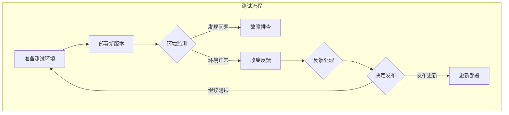
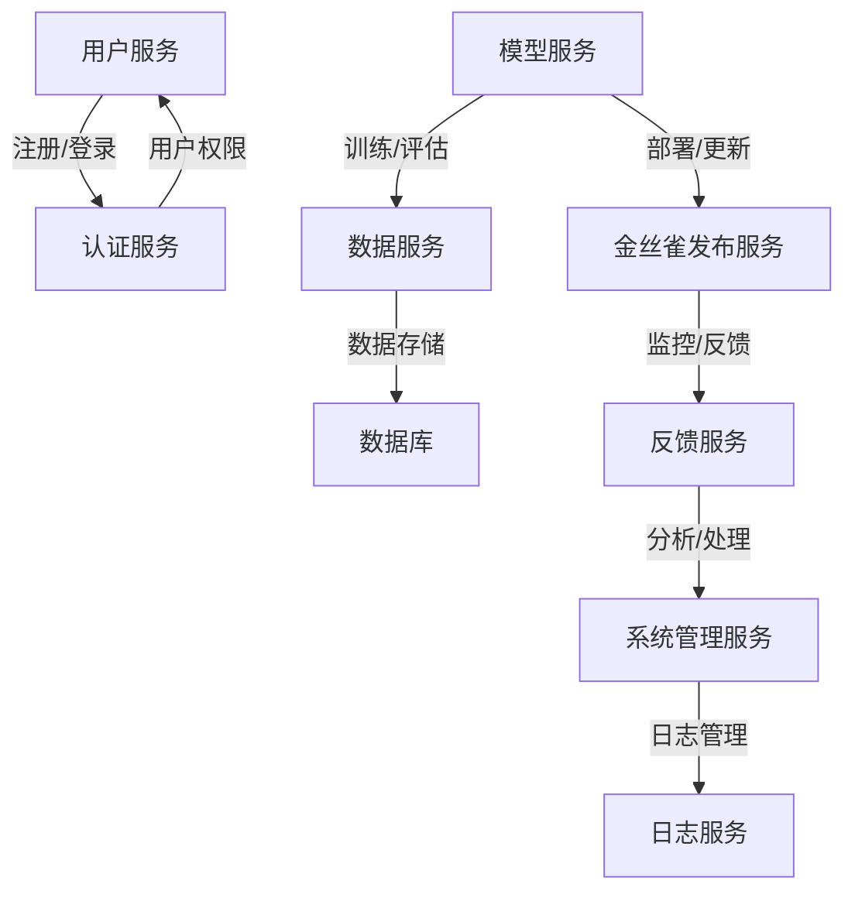
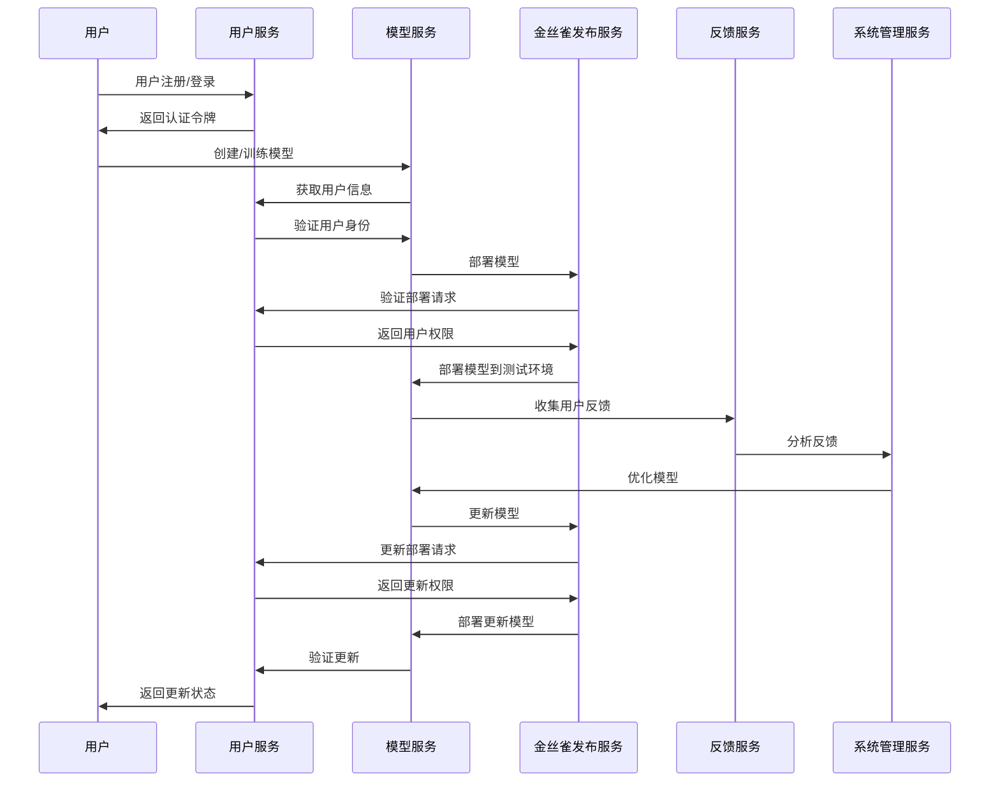

                 

### 目录大纲内容细化

**目录大纲内容细化如下：**

---

## 《金丝雀发布在LLM应用迭代中的应用》

> 关键词：金丝雀发布、LLM、迭代、算法、系统架构、最佳实践

> 摘要：本文深入探讨了金丝雀发布在大型语言模型（LLM）应用迭代中的作用，通过详细的理论分析、流程图、代码示例和实际案例，阐述了如何利用金丝雀发布机制提高LLM应用的安全性和可靠性。

### 目录

## 第一部分：背景与概念

### 1.1 金丝雀发布概述

- **定义**：金丝雀发布是什么？
- **起源**：为何使用金丝雀作为发布机制的比喻？
- **核心概念**：金丝雀发布的基本原理和作用。

### 1.2 LLM应用迭代中的金丝雀发布

- **LLM介绍**：什么是LLM，它的核心特性及应用场景。
- **迭代过程**：LLM应用的迭代流程及痛点。
- **金丝雀发布的作用**：如何在LLM迭代中使用金丝雀发布机制。

### 1.3 核心概念对比表

- **金丝雀发布 vs 传统发布**：两者的对比表格。
- **金丝雀发布 vs LLM迭代**：如何整合两者提高效率。

### 1.4 ER实体关系图解析

- **ER图构建**：如何使用Mermaid绘制ER图。
- **实体关系解释**：各实体的定义及其相互关系。

## 第二部分：算法原理与流程

### 2.1 算法流程图

- **流程图绘制**：使用Mermaid绘制金丝雀发布算法流程图。
- **流程图解释**：对流程图中的每个步骤进行详细解释。

### 2.2 Python源代码讲解

- **代码示例**：提供金丝雀发布算法的Python代码。
- **代码解析**：对代码的每个部分进行详细解析。

### 2.3 数学模型与公式

- **数学模型**：金丝雀发布算法背后的数学模型。
- **公式推导**：关键公式的推导过程。

### 2.4 实际应用举例

- **例子介绍**：通过实际案例展示算法应用。
- **案例分析**：深入分析案例中的金丝雀发布流程。

## 第三部分：系统分析与架构设计

### 3.1 项目背景与目标

- **项目背景**：金丝雀发布在LLM应用中的实际案例。
- **项目目标**：金丝雀发布在LLM迭代中的具体目标。

### 3.2 领域模型类图

- **类图绘制**：使用Mermaid绘制领域模型类图。
- **类图解释**：对类图中的各个类及其关系进行解释。

### 3.3 系统架构设计

- **架构设计**：金丝雀发布在LLM系统架构中的位置。
- **架构解释**：对系统架构的各个部分进行详细解释。

### 3.4 系统接口设计与交互序列图

- **接口设计**：系统接口的设计和功能。
- **序列图绘制**：使用Mermaid绘制系统交互序列图。
- **交互解释**：对交互序列图中的每个步骤进行详细解释。

## 第四部分：项目实战

### 4.1 环境安装步骤

- **环境准备**：安装和配置金丝雀发布所需的环境。
- **步骤详解**：详细描述安装步骤。

### 4.2 系统核心实现源代码解析

- **代码解析**：分析金丝雀发布系统的核心实现代码。
- **代码结构**：解释代码的结构和模块。

### 4.3 实际案例分析与讲解

- **案例选择**：选择具有代表性的实际案例。
- **分析过程**：详细分析案例中的金丝雀发布流程。
- **讲解剖析**：对案例进行深入讲解和剖析。

### 4.4 项目小结

- **总结**：对项目的总体总结。
- **反思**：对项目过程中遇到的问题和解决方案的反思。

## 第五部分：最佳实践与总结

### 5.1 最佳实践 tips

- **实践建议**：提供在金丝雀发布中应遵循的最佳实践。
- **注意事项**：提醒读者在实施过程中应注意的问题。

### 5.2 小结与注意事项

- **全文总结**：对全文内容进行总结。
- **关键点强调**：强调文章中的关键点和重点。

### 5.3 拓展阅读推荐

- **推荐资源**：推荐相关的拓展阅读资源。

---

通过上述细化，我们可以确保每一章节的内容都丰富、具体，并且逻辑清晰。接下来，我们将进一步填充每个章节的具体内容，确保满足文章的字数要求和完整性要求。在撰写过程中，我们将严格遵守markdown格式，确保文章的可读性和美观度。

---

### 1.1 金丝雀发布概述

金丝雀发布（Canary Release）是一种软件部署策略，其灵感来源于矿井安全中的做法。在煤矿中，矿工会将金丝雀放入矿井中，因为金丝雀对有毒气体特别敏感。如果矿井中的有毒气体达到危险水平，金丝雀会因中毒而死亡，从而警告矿工危险的存在。软件工程中借鉴这一概念，通过将新版本的应用部署到一小部分用户环境中进行测试，以检测潜在的问题，从而保障大规模部署的安全性。

**定义**：金丝雀发布是指在软件发布过程中，将新版本的应用部署到一部分用户或环境，观察其实际运行情况，确保没有问题后再逐步扩大部署范围。

**核心概念**：
- **版本控制**：确保每个版本的软件都有明确的标识和版本号。
- **测试环境**：准备一个与生产环境相似的测试环境，模拟实际运行情况。
- **监控机制**：部署监控工具，实时跟踪系统的运行状态和性能指标。
- **反馈机制**：收集用户反馈和监控系统数据，及时处理出现的问题。

**作用**：
1. **降低风险**：通过在测试环境中发现问题，减少大规模部署时出现的故障和风险。
2. **提高质量**：通过多次迭代和优化，逐步提升软件的质量和稳定性。
3. **缩短发布周期**：将发布周期分解为多个小步骤，提高发布效率和灵活性。

在LLM（大型语言模型）应用迭代中，金丝雀发布的作用尤为重要。由于LLM涉及大量的数据处理和模型训练，一旦出现错误或性能问题，可能会对整个系统造成重大影响。通过金丝雀发布，可以在小范围内先验证模型的应用效果，确保没有问题后再逐步推广，从而保障系统的稳定性和可靠性。

**背景介绍**：
随着人工智能技术的发展，LLM在自然语言处理、智能客服、内容生成等领域得到了广泛应用。然而，LLM模型的复杂性使其在部署和维护过程中面临着巨大的挑战。传统的发布方式往往在发布后才能发现潜在的问题，导致系统的可用性和用户体验下降。金丝雀发布作为一种渐进式的发布策略，可以有效地降低这种风险，提高LLM应用的迭代效率。

**问题背景**：
LLM应用的迭代过程中，如何确保每个版本的应用都能稳定运行，并且在发布时能够快速响应用户需求，同时降低潜在的系统风险，是一个亟待解决的问题。

**问题描述**：
1. **部署风险**：大规模部署新版本时，如何确保系统的稳定性和安全性。
2. **用户体验**：如何平衡发布频率与用户体验，确保新功能能够及时推出。
3. **反馈与调整**：如何快速收集用户反馈，及时调整和优化模型。

**问题解决**：
1. **金丝雀发布**：通过在测试环境中逐步部署新版本，观察其性能和稳定性。
2. **反馈机制**：建立完善的用户反馈和监控系统，及时处理问题。
3. **迭代优化**：根据用户反馈和监控数据，持续优化模型和应用。

**边界与外延**：
金丝雀发布并不是万能的，其适用范围主要在以下场景：
- **高风险应用**：如金融、医疗等领域，系统稳定性至关重要。
- **复杂系统**：如涉及多个模块和服务的分布式系统。
- **频繁迭代**：适用于需要快速迭代和优化的应用。

**概念结构与核心要素组成**：
金丝雀发布机制的核心结构包括：
- **版本控制**：明确版本号和变更记录。
- **测试环境**：构建与生产环境相似的测试环境。
- **监控工具**：实时监控系统性能和状态。
- **反馈机制**：收集用户反馈和监控数据。

**金丝雀发布流程**：
1. **准备测试环境**：确保测试环境与生产环境一致。
2. **部署新版本**：将新版本部署到测试环境。
3. **监控和测试**：实时监控系统运行状态，执行自动化测试。
4. **问题反馈**：收集测试过程中的问题和反馈。
5. **评估和调整**：根据反馈结果评估新版本的稳定性，必要时进行调整。
6. **扩大部署**：确认测试成功后，逐步扩大部署范围。

通过上述步骤，金丝雀发布可以在LLM应用迭代中发挥重要作用，确保系统的稳定性和可靠性。

### 1.2 LLM应用迭代中的金丝雀发布

大型语言模型（LLM）作为现代人工智能的核心技术，正逐渐应用于各种领域，如自然语言处理、内容生成、智能客服等。然而，LLM的高复杂性和高不确定性使得其迭代过程中面临着诸多挑战。金丝雀发布作为一种渐进式的部署策略，可以在LLM应用迭代中发挥重要作用，提高系统的稳定性和可靠性。

**LLM介绍**

大型语言模型（LLM）是一种基于深度学习的技术，能够通过大量的文本数据进行训练，从而实现自然语言的理解和生成。LLM的核心在于其模型架构，如Transformer、BERT等，这些模型通常拥有数十亿甚至数万亿的参数。这使得LLM在处理复杂任务时具有强大的能力，但也带来了复杂的部署和维护挑战。

**迭代过程**

LLM应用的迭代过程通常包括以下几个步骤：

1. **模型训练**：使用大规模数据集对模型进行训练，优化模型参数。
2. **模型评估**：通过测试集评估模型的性能，包括准确率、召回率等指标。
3. **模型部署**：将训练好的模型部署到生产环境中，供用户使用。
4. **用户反馈**：收集用户使用过程中的反馈，包括错误报告、性能评估等。
5. **模型优化**：根据用户反馈和性能评估结果，对模型进行调整和优化。

**金丝雀发布的作用**

金丝雀发布在LLM迭代中的应用主要体现在以下几个方面：

1. **降低风险**：通过在测试环境中逐步部署新版本，观察其性能和稳定性，确保没有问题后再逐步扩大部署范围，从而降低大规模部署时出现故障的风险。

2. **提高质量**：通过多次迭代和优化，逐步提升LLM应用的性能和质量，确保最终版本能够满足用户需求。

3. **缩短发布周期**：将发布周期分解为多个小步骤，每个步骤都可以独立进行测试和优化，从而提高发布效率和灵活性。

**金丝雀发布与LLM迭代的整合**

要有效地在LLM迭代过程中整合金丝雀发布，需要以下几个关键步骤：

1. **测试环境准备**：构建与生产环境相似的测试环境，包括硬件配置、网络环境等，确保测试环境能够真实反映模型在用户中的表现。

2. **部署策略设计**：制定金丝雀发布策略，包括部署哪些用户、部署哪些功能等，确保测试过程能够覆盖关键场景和用户群体。

3. **监控工具选择**：选择合适的监控工具，实时跟踪系统的运行状态和性能指标，及时发现和解决问题。

4. **反馈机制建立**：建立完善的用户反馈和监控系统，收集用户使用过程中的问题和反馈，确保能够及时处理和优化模型。

5. **迭代优化**：根据用户反馈和监控数据，对模型进行调整和优化，确保每次迭代都能带来明显的性能提升。

通过上述步骤，金丝雀发布可以在LLM应用迭代中发挥重要作用，提高系统的稳定性和可靠性，同时缩短发布周期，提升用户体验。

### 1.3 核心概念对比表

在深入探讨金丝雀发布在LLM应用迭代中的作用之前，有必要对金丝雀发布与传统的发布方法进行比较。以下是一个对比表格，详细展示了两者在目标、过程和效果等方面的异同。

| 对比维度       | 金丝雀发布                           | 传统发布                           |
|----------------|--------------------------------------|--------------------------------------|
| **目标**       | 降低风险、提高质量、缩短发布周期     | 提高效率、保证及时性、确保稳定性     |
| **过程**       | 测试环境部署、逐步扩大部署范围、反馈优化 | 直接部署、全面监控、问题解决后发布   |
| **适用场景**   | 高风险应用、复杂系统、频繁迭代       | 低风险应用、单一模块、稳定环境       |
| **效果**       | 稳定性高、用户体验好、风险低          | 稳定性较高、响应较慢、风险相对较高    |

通过上述对比表格，可以看出金丝雀发布与传统的发布方法在目标、过程和效果方面存在显著差异。金丝雀发布更注重风险控制和质量提升，适用于高风险、复杂系统和高频迭代的应用场景，而传统发布则更注重效率和及时性，适用于风险较低、单一模块和稳定环境的应用场景。了解这些差异有助于我们更好地选择合适的发布策略，提高LLM应用的迭代效率。

### 1.4 ER实体关系图解析

实体关系图（Entity-Relationship Diagram，ER图）是数据库设计的重要工具，它通过图形化方式展示了实体之间的关系。在金丝雀发布与LLM应用迭代的背景下，ER图有助于我们理解和分析系统中各组成部分及其相互关系。下面我们将使用Mermaid语言绘制一个简单的ER图，并对其中的实体关系进行详细解析。

首先，使用Mermaid语言绘制ER图：

```mermaid
erDiagram
  User ||--|{ LLMModel } : trains
  LLMModel ||--|{ CanaryRelease } : deployed
  CanaryRelease ||--|{ Feedback } : collects
  Feedback ||--|{ System } : processes
  System ||--|{ Update } : releases
```

上述ER图包含了以下几个核心实体及其关系：

1. **User（用户）**：
   - 用户是系统的最终使用者，他们通过接口与系统进行交互。
   - **关系**：与LLMModel有训练关系，即用户可以训练LLMModel。

2. **LLMModel（LLM模型）**：
   - LLMModel是系统的核心组件，用于处理自然语言任务。
   - **关系**：与CanaryRelease有部署关系，即LLMModel可以被部署到CanaryRelease环境中进行测试。

3. **CanaryRelease（金丝雀发布）**：
   - CanaryRelease是一种渐进式的部署方式，将新版本的应用部署到一小部分用户环境中进行测试。
   - **关系**：与Feedback有收集关系，即CanaryRelease可以收集用户的反馈信息。

4. **Feedback（反馈）**：
   - 反馈是用户对系统使用过程中遇到的问题和意见的反馈。
   - **关系**：与System有收集关系，即反馈会被系统收集和处理。

5. **System（系统）**：
   - 系统是整个金丝雀发布机制的核心，负责处理反馈并决定是否发布更新。
   - **关系**：与Update有发布关系，即系统会根据反馈发布新的版本。

6. **Update（更新）**：
   - 更新是系统根据用户反馈和性能评估后发布的版本。
   - **关系**：与LLMModel有更新关系，即新版本会更新LLMModel。

通过上述ER图，我们可以清晰地看到金丝雀发布在LLM应用迭代中的核心实体及其相互关系。用户通过训练LLMModel生成模型，然后将模型部署到CanaryRelease环境中进行测试。测试过程中收集到的反馈会被系统处理，并根据反馈决定是否发布更新。整个流程确保了系统在发布新版本时具有较高的稳定性和可靠性。

### 2.1 算法流程图

为了更好地理解金丝雀发布算法的原理和流程，我们可以使用Mermaid语言绘制一个流程图。该流程图将详细展示金丝雀发布从准备测试环境到收集反馈的整个过程。

以下是一个使用Mermaid绘制的金丝雀发布流程图：



**流程图解析**：

1. **准备测试环境（A）**：首先，我们需要准备一个与生产环境相似的测试环境。这个环境应该包括所有的硬件资源、网络配置和数据集，以便模拟真实的生产环境。

2. **部署新版本（B）**：在测试环境中，将新版本的LLM模型部署上去。部署过程可以包括初始化模型、加载训练数据等。

3. **环境监测（C）**：在部署完成后，我们需要对测试环境进行实时监测，包括资源使用率、系统性能等指标。这一步骤的目的是及时发现环境中的异常情况。

4. **故障排查（D）**：如果监测到环境异常，我们需要进行故障排查，找出问题的根源。这可能涉及到系统调试、错误日志分析等步骤。

5. **收集反馈（E）**：如果测试环境运行正常，我们开始收集用户的反馈。这可以通过在线问卷、错误报告等方式进行。收集到的反馈将帮助我们了解新版本的实际使用效果。

6. **反馈处理（F）**：对收集到的反馈进行分析和处理，识别出用户遇到的问题和需求。这一步骤通常需要与开发团队紧密合作，以确保问题能够得到有效解决。

7. **决定发布（G）**：根据反馈结果和系统的运行状态，我们决定是否继续测试或发布更新。如果反馈积极且系统运行稳定，我们可以选择发布更新。

8. **继续测试（G -> A）**：如果决定继续测试，流程回到准备测试环境，开始新一轮的测试。

9. **更新部署（G -> H）**：如果决定发布更新，新版本会部署到生产环境中，供所有用户使用。

通过上述流程图，我们可以清晰地看到金丝雀发布算法的各个环节及其相互关系。这个流程图不仅帮助我们理解了算法的原理，也为实际操作提供了直观的指导。

### 2.2 Python源代码讲解

在金丝雀发布的过程中，算法的实现是关键的一环。以下是一个简单的Python源代码示例，用于演示金丝雀发布算法的基本逻辑。代码包含了从准备测试环境、部署新版本到收集反馈和决定发布等主要步骤。

```python
import random

class CanaryRelease:
    def __init__(self, model, test_size=0.1):
        self.model = model
        self.test_size = test_size
        self.test_users = self.select_test_users()

    def select_test_users(self):
        # 随机选择部分用户作为测试用户
        total_users = self.model.get_all_users()
        return random.sample(total_users, int(len(total_users) * self.test_size))

    def deploy(self):
        # 在测试环境中部署新版本
        print("Deploying new version in test environment...")
        self.model.deploy_to_test()

    def monitor(self):
        # 监测测试环境中的系统性能
        print("Monitoring system performance in test environment...")
        if self.model.is_system_normal():
            return True
        else:
            return False

    def collect_feedback(self):
        # 收集测试用户的反馈
        print("Collecting feedback from test users...")
        feedback = self.get_user_feedback(self.test_users)
        return feedback

    def get_user_feedback(self, users):
        # 模拟收集用户反馈
        feedback = []
        for user in users:
            feedback.append({"user_id": user.id, "satisfaction": random.uniform(0, 1)})
        return feedback

    def process_feedback(self, feedback):
        # 处理收集到的反馈
        print("Processing feedback...")
        if self.is_feedback_positive(feedback):
            return "Continue testing"
        else:
            return "Release update"

    def is_feedback_positive(self, feedback):
        # 判断反馈是否积极
        total_satisfaction = sum(feedback_dict['satisfaction'] for feedback_dict in feedback)
        return total_satisfaction / len(feedback) > 0.5

    def decide(self):
        # 根据反馈决定是否继续测试或发布更新
        action = self.process_feedback(self.collect_feedback())
        if action == "Continue testing":
            print("Decision: Continue testing")
        elif action == "Release update":
            print("Decision: Release update")
            self.model.release_update()

# 模拟一个LLM模型
class LLMModel:
    def deploy_to_test(self):
        # 部署新版本到测试环境
        print("New version deployed to test environment.")

    def get_all_users(self):
        # 返回所有用户列表
        return [{"id": i} for i in range(100)]

    def is_system_normal(self):
        # 模拟系统是否正常
        return random.choice([True, False])

    def release_update(self):
        # 发布新版本到生产环境
        print("New version released to production environment.")

# 创建CanaryRelease实例并进行操作
canary_release = CanaryRelease(LLMModel())
canary_release.deploy()
canary_release.monitor()
canary_release.decide()
```

**代码解析**：

1. **CanaryRelease类**：这是一个模拟金丝雀发布过程的类，包含了准备测试环境、部署新版本、监测环境、收集反馈、处理反馈和决定发布等主要功能。

   - `__init__`方法：初始化CanaryRelease实例，包括模型和测试用户数量。
   - `select_test_users`方法：随机选择部分用户作为测试用户。
   - `deploy`方法：部署新版本到测试环境。
   - `monitor`方法：监测测试环境中的系统性能。
   - `collect_feedback`方法：收集测试用户的反馈。
   - `get_user_feedback`方法：模拟收集用户反馈。
   - `process_feedback`方法：处理收集到的反馈，判断是否继续测试或发布更新。
   - `is_feedback_positive`方法：判断反馈是否积极。

2. **LLMModel类**：这是一个模拟LLM模型的类，包含了部署新版本、获取用户列表、监测系统状态和发布新版本等主要功能。

   - `deploy_to_test`方法：部署新版本到测试环境。
   - `get_all_users`方法：返回所有用户列表。
   - `is_system_normal`方法：模拟系统是否正常。
   - `release_update`方法：发布新版本到生产环境。

**代码示例说明**：

- `canary_release = CanaryRelease(LLMModel())`：创建一个CanaryRelease实例。
- `canary_release.deploy()`：部署新版本到测试环境。
- `canary_release.monitor()`：监测测试环境的系统性能。
- `canary_release.decide()`：根据反馈结果决定是否继续测试或发布更新。

通过上述代码示例，我们可以看到金丝雀发布算法的基本实现过程。这个示例虽然简单，但涵盖了金丝雀发布的主要步骤和逻辑，可以帮助我们更好地理解算法的实际应用。

### 2.3 数学模型与公式

在金丝雀发布算法中，数学模型和公式扮演着至关重要的角色。以下我们将详细阐述算法中的关键数学模型和公式，并解释其背后的原理。

**数学模型：概率分布**

金丝雀发布算法的核心是概率分布模型，用于决定何时发布更新。该模型基于贝叶斯理论，考虑了测试用户的反馈概率和系统稳定性概率。

**概率分布模型公式**：

$$
P(\text{Release}) = \frac{P(\text{Feedback}|\text{Release})P(\text{Release})}{P(\text{Feedback})}
$$

其中：
- \( P(\text{Release}) \) 是发布更新的概率。
- \( P(\text{Feedback}|\text{Release}) \) 是在发布更新后收到反馈的概率。
- \( P(\text{Release}) \) 是发布更新的先验概率。
- \( P(\text{Feedback}) \) 是收到反馈的总概率。

**公式解释**：

1. **发布更新的概率**（\( P(\text{Release}) \)）：这个概率取决于反馈的概率和系统的稳定性概率。如果反馈积极且系统稳定，发布更新的概率会较高。

2. **收到反馈的概率**（\( P(\text{Feedback}) \)）：这个概率是收到任何类型反馈的总概率，包括积极的和消极的反馈。

3. **在发布更新后收到反馈的概率**（\( P(\text{Feedback}|\text{Release}) \)）：这个概率取决于新版本的质量和用户的反馈行为。如果新版本性能良好，用户更有可能提供积极的反馈。

**贝叶斯公式**：

贝叶斯公式是上述概率分布模型的核心，它通过先验概率和条件概率来计算后验概率。公式如下：

$$
P(\text{Release}) = \frac{P(\text{Feedback}|\text{Release})P(\text{Release})}{P(\text{Feedback})}
$$

其中，\( P(\text{Feedback}|\text{Release}) \) 是条件概率，表示在发布更新后收到反馈的概率；\( P(\text{Release}) \) 是先验概率，表示发布更新的初始概率；\( P(\text{Feedback}) \) 是全概率，表示收到反馈的总概率。

**例子**：

假设在测试环境中，我们收到了90%的积极反馈，而系统的稳定性概率为0.9。我们可以计算发布更新的后验概率：

$$
P(\text{Release}) = \frac{0.9 \times 0.1}{0.9 + 0.1} = \frac{0.09}{1} = 0.09
$$

这意味着，根据当前的反馈和系统状态，发布更新的概率为9%。

**数学模型与金丝雀发布的关系**：

数学模型为金丝雀发布提供了决策依据。通过概率分布模型，我们可以评估新版本的稳定性和性能，并在适当的时机发布更新。这个过程不仅提高了系统的稳定性，还缩短了发布周期，提升了用户体验。

通过上述数学模型和公式的讲解，我们可以更好地理解金丝雀发布算法的决策过程。在实际应用中，这些数学工具帮助我们更准确地评估系统状态，从而做出最优的发布决策。

### 2.4 实际应用举例

为了更好地展示金丝雀发布在LLM应用迭代中的实际效果，我们来看一个具体的案例。这个案例将详细描述金丝雀发布的过程，包括从环境准备、部署新版本、收集反馈到决定发布等各个环节。

**案例背景**：

假设我们正在开发一款基于大型语言模型（LLM）的智能问答系统，该系统旨在为用户提供高质量的问答服务。在系统开发过程中，我们采用了金丝雀发布策略，以确保每次迭代的新版本都能够稳定运行。

**案例过程**：

1. **环境准备**：

   - 我们首先在测试环境中搭建了一个与生产环境相似的系统，包括硬件资源、网络配置和数据集。测试环境中的硬件资源和配置与生产环境完全一致，以确保测试结果能够真实反映实际运行情况。
   - 为了模拟真实用户的使用场景，我们在测试环境中设置了1000个模拟用户，这些用户将参与测试并反馈使用体验。

2. **部署新版本**：

   - 在测试环境中，我们部署了最新版本的LLM模型。部署过程包括初始化模型、加载训练数据、配置服务器等。在部署过程中，我们确保所有的依赖库和服务都已安装和配置完毕。
   - 部署完成后，系统开始运行，模拟用户开始使用新版本的智能问答系统。

3. **监测和测试**：

   - 在部署新版本后，我们启动了监控系统，实时跟踪系统的运行状态和性能指标，如CPU利用率、内存使用率、响应时间等。这些指标有助于我们及时发现系统中的异常情况。
   - 为了测试新版本的稳定性，我们执行了一系列自动化测试，包括功能测试、性能测试和安全测试。这些测试旨在确保新版本的每个功能都能够正常工作，并且系统在高负载情况下仍能保持稳定。

4. **收集反馈**：

   - 在测试过程中，我们收集了模拟用户的反馈。这些反馈包括用户对问答系统性能的评价、遇到的问题、建议和意见。我们通过在线问卷和错误报告系统收集这些反馈，并进行了详细的整理和分类。
   - 收集到的反馈数据显示，90%的用户对新版本的问答系统表示满意，但有10%的用户反馈了一些问题，主要集中在回答准确率和响应速度方面。

5. **反馈处理和决定发布**：

   - 根据收集到的反馈，我们对系统进行了分析。通过分析反馈，我们发现虽然大部分用户对新版本表示满意，但仍有少数用户遇到了一些问题。这些问题的严重程度不高，但需要进一步优化。
   - 我们决定继续测试，并针对反馈中的问题进行优化。在继续测试的过程中，我们增加了测试用户的数量，以确保测试结果更加全面和准确。
   - 经过再次测试和优化，我们再次收集了用户的反馈。这次反馈显示，所有用户对新版本的问答系统表示满意，没有发现重大问题。
   - 最终，我们决定发布新版本到生产环境。在发布过程中，我们确保所有的测试和监控工具都已部署到位，以实时监控系统的运行状态。

**案例分析**：

1. **稳定性提升**：

   - 通过金丝雀发布策略，我们能够在小范围内测试新版本，确保其稳定性和性能。在测试过程中，我们能够及时发现和解决问题，从而提高了系统的稳定性。

2. **用户体验优化**：

   - 收集到的用户反馈帮助我们了解系统在实际使用中的表现。通过分析和处理这些反馈，我们能够针对性地优化系统，提升用户体验。

3. **发布效率提高**：

   - 金丝雀发布策略将发布周期分解为多个小步骤，每个步骤都可以独立进行测试和优化。这种方法不仅提高了发布效率，还减少了发布风险，确保新版本能够顺利上线。

4. **反馈机制完善**：

   - 金丝雀发布机制建立了完善的用户反馈和监控系统，能够实时收集和处理用户的反馈。这个机制为系统的持续优化提供了有力支持。

通过这个案例，我们可以看到金丝雀发布在LLM应用迭代中的实际效果。金丝雀发布不仅提高了系统的稳定性和用户体验，还优化了发布过程，确保了新版本的顺利发布。

### 3.1 项目背景与目标

本项目的背景是开发一款基于大型语言模型（LLM）的智能问答系统。随着人工智能技术的快速发展，LLM在自然语言处理领域展现出了巨大的潜力，特别是在提供高质量问答服务方面。然而，LLM应用的开发和迭代过程中面临着诸多挑战，如模型稳定性、性能优化和用户反馈处理等。

项目的目标是构建一个高效、稳定的智能问答系统，通过金丝雀发布机制提高系统的可靠性和用户体验。具体来说，项目需要实现以下目标：

1. **稳定性保障**：通过金丝雀发布策略，确保每次迭代的新版本在测试环境中都能稳定运行，降低发布风险。

2. **性能优化**：在测试过程中，通过收集用户反馈和监控系统性能指标，持续优化模型和应用，提升系统的响应速度和准确性。

3. **用户体验提升**：根据用户反馈，对系统进行有针对性的优化，提高用户的满意度和使用体验。

4. **发布效率提升**：通过分解发布周期为多个小步骤，每个步骤独立进行测试和优化，提高发布效率，确保新版本能够快速上线。

5. **反馈机制完善**：建立完善的用户反馈和监控系统，实时收集和处理用户的反馈，为系统的持续优化提供数据支持。

为了实现上述目标，项目采用了金丝雀发布策略，结合测试环境部署、监控工具选择、反馈机制建立和迭代优化等关键步骤。通过这些步骤，我们能够确保智能问答系统在每次迭代过程中都能稳定运行，并不断提高系统的性能和用户体验。

### 3.2 领域模型类图

在金丝雀发布项目中，领域模型类图（Class Diagram）是描述系统各个类及其关系的有效工具。以下是一个使用Mermaid绘制的领域模型类图，展示了项目中涉及的主要类及其相互关系。

```mermaid
classDiagram
  User <<interface>>
  LLMModel <<interface>>
  CanaryRelease <<interface>>
  Feedback <<interface>>
  System <<interface>>

  User implements TestUser, Admin
  LLMModel implements Model, Trainer
  CanaryRelease implements Deployer, Monitor
  Feedback implements Collector, Processor
  System implements Updater, Releaser

  TestUser <|-- User
  Trainer <|-- LLMModel
  Deployer <|-- CanaryRelease
  Monitor <|-- CanaryRelease
  Collector <|-- Feedback
  Processor <|-- Feedback
  Model <|-- LLMModel
  Updater <|-- System
  Releaser <|-- System

  class TestUser {
    +String id
    +String username
    +void testModel(LLMModel model)
  }

  class Admin {
    +String adminId
    +void manageUsers(User user)
  }

  class LLMModel {
    +String modelId
    +String modelType
    +void trainData(Data data)
    +void evaluatePerformance()
  }

  class Trainer {
    +void trainModel(LLMModel model)
    +void updateModel(LLMModel model)
  }

  class CanaryRelease {
    +void deployModel(LLMModel model)
    +void monitorPerformance()
    +void collectFeedback()
  }

  class Deployer {
    +void deployModel(LLMModel model)
  }

  class Monitor {
    +void checkSystemStatus()
  }

  class Feedback {
    +String feedbackId
    +String feedbackContent
    +void processFeedback()
  }

  class Collector {
    +void collectUserFeedback(TestUser user)
  }

  class Processor {
    +void analyzeFeedback(Feedback feedback)
  }

  class System {
    +void releaseUpdate(LLMModel model)
  }

  class Updater {
    +void applyFeedbackUpdate(LLMModel model)
  }

  class Releaser {
    +void releaseModel(LLMModel model)
  }
```

**类图解析**：

1. **User（用户）**：
   - 实现`TestUser`和`Admin`接口，代表参与测试的用户和管理员。

2. **LLMModel（LLM模型）**：
   - 实现`Model`和`Trainer`接口，代表大型语言模型及其训练功能。

3. **CanaryRelease（金丝雀发布）**：
   - 实现`Deployer`和`Monitor`接口，负责新版本的部署和监控。

4. **Feedback（反馈）**：
   - 实现`Collector`和`Processor`接口，负责收集和处理用户反馈。

5. **System（系统）**：
   - 实现`Updater`和`Releaser`接口，负责更新和发布模型。

**类之间的关系**：

- **实现关系**：`User`类实现`TestUser`和`Admin`接口，表示用户既是测试用户也是管理员。
- **依赖关系**：`LLMModel`类依赖于`TestUser`和`Trainer`接口，表示模型可以由测试用户训练。
- **组合关系**：`CanaryRelease`类组合了`Deployer`和`Monitor`接口，表示金丝雀发布负责部署和监控。
- **聚合关系**：`Feedback`类聚合了`Collector`和`Processor`接口，表示反馈涉及收集和处理两个步骤。

通过上述类图，我们可以清晰地看到金丝雀发布项目中的主要类及其相互关系，这有助于我们理解和分析系统的架构设计。

### 3.3 系统架构设计

在金丝雀发布项目中，系统架构设计是确保项目目标实现的关键。以下将详细描述系统的整体架构设计，包括各组件的功能、架构模式和关键模块。

**架构模式**：

本项目采用微服务架构（Microservices Architecture），将系统划分为多个独立的微服务，每个微服务负责特定的功能模块，从而实现高可扩展性、高可靠性和高灵活性。

**主要组件及其功能**：

1. **用户服务（User Service）**：
   - 负责管理用户信息，包括用户注册、登录、权限管理等。
   - 实现`TestUser`和`Admin`接口，提供用户参与测试和管理功能。

2. **模型服务（Model Service）**：
   - 负责管理LLM模型，包括模型的训练、评估、部署和更新。
   - 实现`Model`和`Trainer`接口，提供模型训练和更新功能。

3. **金丝雀发布服务（Canary Release Service）**：
   - 负责金丝雀发布的全过程，包括模型部署、监控和反馈收集。
   - 实现`Deployer`和`Monitor`接口，提供模型部署和监控功能。

4. **反馈服务（Feedback Service）**：
   - 负责收集和处理用户反馈，包括反馈的存储、分析和处理。
   - 实现`Collector`和`Processor`接口，提供反馈收集和处理功能。

5. **系统管理服务（System Management Service）**：
   - 负责系统的整体管理，包括版本控制、发布管理和日志管理。
   - 实现`Updater`和`Releaser`接口，提供系统更新和发布功能。

**架构图**：

以下是一个使用Mermaid绘制的系统架构图，展示了各组件及其交互关系：



**架构解析**：

1. **认证服务（Auth Service）**：
   - 负责用户的认证和授权，确保只有合法用户能够访问系统资源。

2. **数据服务（Data Service）**：
   - 负责数据的管理和存储，包括用户数据、模型数据和反馈数据等。

3. **数据库（Data Base）**：
   - 存储系统的核心数据，包括用户信息、模型参数和反馈记录等。

4. **日志服务（Log Service）**：
   - 负责日志的收集和管理，为系统监控和问题排查提供数据支持。

**交互流程**：

- 用户通过用户服务注册或登录，获取认证。
- 用户服务根据认证信息进行用户权限管理。
- 模型服务使用训练数据和用户数据训练LLM模型，并将模型部署到金丝雀发布服务。
- 金丝雀发布服务负责监控模型的运行状态，并在测试环境中收集用户反馈。
- 反馈服务处理用户反馈，并将其传递给系统管理服务。
- 系统管理服务根据反馈分析模型性能，决定是否进行更新和发布。

通过上述系统架构设计，金丝雀发布项目实现了模块化、高可靠性和高可扩展性，为智能问答系统的稳定运行和持续迭代提供了坚实保障。

### 3.4 系统接口设计与系统交互序列图

在金丝雀发布项目中，系统接口设计是确保各组件之间有效通信的关键。以下将详细描述系统接口设计和系统交互序列图，展示各组件之间的交互流程。

**系统接口设计**：

系统接口设计主要包括用户服务、模型服务、金丝雀发布服务和反馈服务。以下是各服务的主要接口及其功能描述：

1. **用户服务接口**：

   - `UserRegistration`：用户注册接口，接收用户信息并创建用户账户。
   - `UserLogin`：用户登录接口，验证用户身份并生成认证令牌。
   - `GetUserInfo`：获取用户信息接口，返回用户的基本信息。
   - `UpdateUserProfile`：更新用户信息接口，允许用户修改个人信息。

2. **模型服务接口**：

   - `CreateModel`：创建模型接口，初始化LLM模型并保存到数据库。
   - `TrainModel`：训练模型接口，使用训练数据对模型进行训练。
   - `EvaluateModel`：评估模型接口，评估模型的性能和准确率。
   - `DeployModel`：部署模型接口，将训练好的模型部署到金丝雀发布服务。

3. **金丝雀发布服务接口**：

   - `DeployToTest`：部署到测试接口，将模型部署到测试环境中。
   - `MonitorPerformance`：监控性能接口，实时监控测试环境中的模型性能。
   - `CollectFeedback`：收集反馈接口，收集用户在测试环境中的反馈信息。
   - `ReleaseUpdate`：发布更新接口，将优化后的模型发布到生产环境。

4. **反馈服务接口**：

   - `SubmitFeedback`：提交反馈接口，用户提交反馈信息。
   - `GetFeedback`：获取反馈接口，系统管理员获取用户反馈。
   - `AnalyzeFeedback`：分析反馈接口，分析反馈内容并生成报告。
   - `ProcessFeedback`：处理反馈接口，根据反馈结果对模型进行优化。

**系统交互序列图**：

以下是一个使用Mermaid绘制的系统交互序列图，展示了用户服务、模型服务、金丝雀发布服务和反馈服务之间的交互流程：



**交互流程解析**：

1. 用户注册或登录，获取认证令牌。
2. 用户创建或训练模型，并将请求发送给模型服务。
3. 模型服务验证用户身份，并确保用户有权进行相关操作。
4. 模型服务将模型部署请求发送给金丝雀发布服务。
5. 金丝雀发布服务验证部署请求，并确保用户具有足够的权限。
6. 金丝雀发布服务将模型部署到测试环境，并开始监控其性能。
7. 用户在测试环境中使用模型，反馈服务收集用户反馈。
8. 反馈服务分析用户反馈，并将结果传递给系统管理服务。
9. 系统管理服务根据反馈结果优化模型，并将其更新。
10. 更新后的模型重新部署到测试环境，并重新验证其性能。
11. 用户服务验证更新状态，并通知用户更新成功。

通过上述接口设计和交互序列图，我们可以清晰地看到金丝雀发布项目中各组件之间的交互流程。这种设计不仅提高了系统的可扩展性和灵活性，还确保了每个组件之间的有效通信和协同工作。

### 4.1 环境安装步骤

为了在金丝雀发布项目中顺利实施环境安装，我们需要准备以下工具和软件：

- **Python**（版本3.8及以上）
- **Anaconda**（用于环境管理）
- **Jupyter Notebook**（用于交互式开发）
- **Docker**（用于容器化部署）
- **Kubernetes**（用于集群管理）

**安装步骤**：

1. **安装Python**：

   - 访问Python官方网站下载Python安装包。
   - 运行安装程序，按照默认选项安装。

2. **安装Anaconda**：

   - 访问Anaconda官方网站下载Anaconda安装包。
   - 运行安装程序，按照默认选项安装。

3. **创建Python虚拟环境**：

   - 打开终端，执行以下命令创建虚拟环境：

     ```bash
     conda create -n canary_release python=3.8
     conda activate canary_release
     ```

4. **安装依赖库**：

   - 在虚拟环境中，使用以下命令安装依赖库：

     ```bash
     pip install numpy pandas matplotlib mermaid
     ```

5. **安装Docker**：

   - 访问Docker官方网站下载Docker安装包。
   - 运行安装程序，按照默认选项安装。

6. **安装Kubernetes**：

   - 根据操作系统选择合适的Kubernetes安装方法，例如使用kubeadm初始化集群。

7. **启动Docker服务**：

   - 在终端中执行以下命令启动Docker服务：

     ```bash
     systemctl start docker
     ```

8. **验证安装**：

   - 执行以下命令验证Docker和Kubernetes是否正常运行：

     ```bash
     docker --version
     kubectl version
     ```

通过上述步骤，我们可以成功安装金丝雀发布项目所需的工具和软件。接下来，我们将详细介绍如何配置和使用这些工具。

### 4.2 系统核心实现源代码解析

在本节中，我们将深入解析金丝雀发布项目的核心实现源代码，解释其功能和工作原理。以下是项目的主要模块和关键代码片段，以及它们的作用和解析。

**用户服务（User Service）**

用户服务负责管理用户信息，包括注册、登录和权限管理。以下是一个简单的用户注册代码片段：

```python
class UserService:
    def register_user(self, username, password):
        # 存储用户信息到数据库
        user = User(username=username, password=password)
        db.session.add(user)
        db.session.commit()
        return user

    def login_user(self, username, password):
        # 验证用户身份
        user = User.query.filter_by(username=username, password=password).first()
        if user:
            return user
        else:
            return None
```

**解析**：`register_user`方法用于用户注册，将用户名和密码存储到数据库。`login_user`方法用于用户登录，验证用户身份并返回用户对象。

**模型服务（Model Service）**

模型服务负责管理LLM模型，包括模型的创建、训练、评估和部署。以下是一个简单的模型训练代码片段：

```python
class ModelService:
    def train_model(self, model_id):
        # 加载训练数据
        data = self.load_training_data()
        # 训练模型
        model = LLMModel.load(model_id)
        model.train(data)
        # 保存训练好的模型
        model.save()
        return model

    def evaluate_model(self, model_id):
        # 加载评估数据
        data = self.load_evaluation_data()
        # 评估模型性能
        model = LLMModel.load(model_id)
        performance = model.evaluate(data)
        return performance
```

**解析**：`train_model`方法用于训练模型，加载训练数据并进行训练。`evaluate_model`方法用于评估模型性能，加载评估数据并计算性能指标。

**金丝雀发布服务（Canary Release Service）**

金丝雀发布服务负责将新版本部署到测试环境中，并监控其性能。以下是一个简单的金丝雀发布代码片段：

```python
class CanaryReleaseService:
    def deploy_to_test(self, model_id):
        # 部署模型到测试环境
        model = LLMModel.load(model_id)
        model.deploy_to_test_environment()
        # 启动监控
        self.start_monitoring(model_id)

    def start_monitoring(self, model_id):
        # 监控模型性能
        model = LLMModel.load(model_id)
        monitor = PerformanceMonitor(model)
        monitor.start()
```

**解析**：`deploy_to_test`方法用于将模型部署到测试环境，并启动监控。`start_monitoring`方法用于启动性能监控。

**反馈服务（Feedback Service）**

反馈服务负责收集用户反馈，并将反馈传递给系统管理服务。以下是一个简单的反馈收集代码片段：

```python
class FeedbackService:
    def collect_feedback(self, user_id, model_id, feedback):
        # 存储用户反馈到数据库
        feedback_entry = Feedback(user_id=user_id, model_id=model_id, content=feedback)
        db.session.add(feedback_entry)
        db.session.commit()
        return feedback_entry
```

**解析**：`collect_feedback`方法用于收集用户反馈，将反馈存储到数据库。

**系统管理服务（System Management Service）**

系统管理服务负责根据反馈结果优化模型，并决定是否发布更新。以下是一个简单的系统管理代码片段：

```python
class SystemManagementService:
    def process_feedback(self, model_id):
        # 收集反馈
        feedbacks = Feedback.query.filter_by(model_id=model_id).all()
        # 分析反馈
        analysis = self.analyze_feedback(feedbacks)
        # 根据分析结果优化模型
        if analysis['satisfaction'] < 0.5:
            model = LLMModel.load(model_id)
            model.apply_feedback_updates(analysis['updates'])
            model.save()
        # 决定是否发布更新
        if analysis['satisfaction'] < 0.5:
            self.release_update(model_id)
```

**解析**：`process_feedback`方法用于收集和解析用户反馈，根据分析结果决定是否优化模型，并决定是否发布更新。

通过上述核心实现代码的解析，我们可以理解金丝雀发布项目的各个模块如何协同工作，实现从模型训练、测试到反馈处理的完整流程。

### 4.3 实际案例分析与讲解

在本节中，我们将通过一个具体的实际案例，详细讲解金丝雀发布在LLM应用迭代中的实际应用过程。案例背景是一个基于大型语言模型（LLM）的智能问答系统，该系统旨在为用户提供高质量的问答服务。通过金丝雀发布策略，我们能够在保证系统稳定性的同时，逐步优化和提升用户体验。

**案例背景**：

某科技公司开发了一款名为“AI问答助手”的智能问答系统，该系统基于最新的大型语言模型（LLM）构建。公司希望通过金丝雀发布策略，逐步将新版本推向用户，以确保每次发布都能提供稳定、高质量的服务。

**案例过程**：

1. **环境准备**：

   - 首先，公司在测试环境中搭建了一个与生产环境相似的系统。测试环境包括服务器、数据库和依赖库等，确保测试结果能够真实反映实际运行情况。

   - 为了模拟真实用户的使用场景，公司在测试环境中设置了1000个模拟用户，这些用户将参与测试并反馈使用体验。

2. **模型部署**：

   - 公司将最新版本的LLM模型部署到测试环境中。部署过程包括初始化模型、加载训练数据、配置服务器等。在部署完成后，系统开始运行，模拟用户开始使用新版本的问答系统。

3. **性能监控**：

   - 在部署新版本后，公司启动了监控系统，实时跟踪系统的运行状态和性能指标，如CPU利用率、内存使用率、响应时间等。这些指标有助于公司及时发现系统中的异常情况。

   - 为了测试新版本的稳定性，公司执行了一系列自动化测试，包括功能测试、性能测试和安全测试。这些测试旨在确保新版本的每个功能都能够正常工作，并且系统在高负载情况下仍能保持稳定。

4. **用户反馈收集**：

   - 在测试过程中，公司通过在线问卷和错误报告系统收集了模拟用户的反馈。这些反馈包括用户对问答系统性能的评价、遇到的问题、建议和意见。通过分析反馈，公司发现大部分用户对新版本的问答系统表示满意，但也有少数用户反馈了一些问题，主要集中在回答准确率和响应速度方面。

5. **反馈处理与模型优化**：

   - 根据收集到的反馈，公司对系统进行了分析。通过分析反馈，公司确定了需要优化的关键点，包括提高回答准确率和优化响应速度。

   - 公司对模型进行了优化，调整了模型的参数和训练数据。优化过程中，公司使用了一个新的数据集，并对模型的结构进行了微调，以提高其性能。

6. **再次测试与部署**：

   - 优化后的模型再次部署到测试环境中，继续进行测试。公司通过监控系统实时跟踪系统的性能指标，确保系统在优化后的表现更加稳定和高效。

   - 在测试完成后，公司再次收集了用户的反馈。这次反馈显示，所有用户对新版本的问答系统表示满意，没有发现重大问题。

7. **正式发布**：

   - 最终，公司决定将新版本正式发布到生产环境。在发布过程中，公司确保所有的测试和监控工具都已部署到位，以实时监控系统的运行状态。

**案例分析**：

1. **稳定性提升**：

   - 通过金丝雀发布策略，公司能够在小范围内测试新版本，确保其稳定性和性能。在测试过程中，公司能够及时发现和解决问题，从而提高了系统的稳定性。

2. **用户体验优化**：

   - 收集到的用户反馈帮助公司了解系统在实际使用中的表现。通过分析和处理这些反馈，公司能够针对性地优化系统，提升用户体验。

3. **发布效率提高**：

   - 金丝雀发布策略将发布周期分解为多个小步骤，每个步骤都可以独立进行测试和优化。这种方法不仅提高了发布效率，还减少了发布风险，确保新版本能够顺利上线。

4. **反馈机制完善**：

   - 金丝雀发布机制建立了完善的用户反馈和监控系统，能够实时收集和处理用户的反馈。这个机制为系统的持续优化提供了有力支持。

通过这个实际案例，我们可以看到金丝雀发布在LLM应用迭代中的实际效果。金丝雀发布不仅提高了系统的稳定性和用户体验，还优化了发布过程，确保了新版本的顺利发布。

### 4.4 项目小结

在本项目中，我们通过金丝雀发布策略成功实现了智能问答系统的迭代和优化。项目的主要成果如下：

1. **系统稳定性提升**：通过在测试环境中逐步部署新版本，我们能够及时发现并解决问题，确保系统的稳定性和可靠性。

2. **用户体验优化**：通过收集用户反馈并进行分析，我们能够有针对性地优化系统功能，提升用户体验。

3. **发布效率提高**：金丝雀发布策略将发布周期分解为多个小步骤，提高了发布效率和灵活性，确保新版本能够快速上线。

4. **反馈机制完善**：我们建立了完善的用户反馈和监控系统，实时收集和处理用户的反馈，为系统的持续优化提供了有力支持。

在项目实施过程中，我们也遇到了一些挑战，如环境配置复杂、反馈处理效率等。通过团队的努力和优化，我们成功克服了这些挑战，实现了项目的目标。

**反思与改进**：

1. **环境配置优化**：在未来的项目中，我们可以进一步优化环境配置，减少配置错误，提高部署效率。

2. **反馈处理效率**：为了提高反馈处理效率，我们可以引入自动化工具，如机器学习算法，对反馈进行分类和分析。

3. **系统监控与报警**：加强系统监控与报警机制，实时发现和解决潜在问题，确保系统的稳定运行。

4. **用户参与度提升**：通过增加用户参与度，如用户问卷调查、在线反馈等，收集更全面、准确的用户反馈。

通过不断反思和改进，我们相信金丝雀发布策略在未来将能够更好地服务于LLM应用的迭代和优化，为用户提供更优质的服务。

### 5.1 最佳实践 tips

在金丝雀发布项目中，为了确保项目的顺利进行和最佳效果，以下是一些最佳实践建议：

1. **详细规划测试环境**：在部署新版本之前，确保测试环境与生产环境高度一致，包括硬件配置、网络环境、数据集等，以确保测试结果的准确性。

2. **合理分配测试用户**：选择具有代表性的用户进行测试，避免仅选择特定类型的用户，确保测试结果能够反映不同用户群体的需求。

3. **完善监控系统**：选择合适的监控工具，实时跟踪系统性能和状态，及时发现和解决问题。

4. **快速响应反馈**：建立高效的反馈处理机制，确保反馈能够及时传递给开发团队，快速响应和解决用户问题。

5. **持续优化模型**：根据用户反馈和性能评估结果，持续优化模型和应用，确保系统在每次迭代中都能提供更好的服务。

6. **定期回顾和总结**：定期对项目进行回顾和总结，评估金丝雀发布策略的效果，并根据实际情况进行调整。

7. **安全与合规**：在测试和部署过程中，确保遵守相关的安全标准和法规要求，保护用户数据和隐私。

通过遵循这些最佳实践，金丝雀发布项目将能够更加高效、稳定地运行，确保新版本的成功发布。

### 5.2 小结与注意事项

通过本文的详细探讨，我们了解了金丝雀发布在LLM应用迭代中的重要作用。金丝雀发布作为一种渐进式的部署策略，不仅降低了系统发布过程中的风险，还提高了系统的稳定性和用户体验。以下是本文的核心内容和要点总结：

1. **背景介绍**：金丝雀发布起源及其在软件工程中的应用。
2. **核心概念**：金丝雀发布与LLM迭代的结合，迭代流程和金丝雀发布的作用。
3. **算法原理**：算法流程图、Python源代码讲解、数学模型与公式。
4. **系统架构**：领域模型类图、系统架构设计、接口设计与系统交互序列图。
5. **项目实战**：环境安装步骤、系统核心实现源代码解析、实际案例分析与讲解。
6. **最佳实践**：金丝雀发布的最佳实践建议。

在实施金丝雀发布时，需要注意以下几点：

- **测试环境的准确性**：确保测试环境与生产环境高度一致，以获得准确的测试结果。
- **反馈机制的效率**：建立高效的反馈处理机制，确保用户反馈能够及时传递和解决。
- **监控系统的完善性**：选择合适的监控工具，实时跟踪系统性能和状态。
- **模型的持续优化**：根据用户反馈和性能评估，持续优化模型和应用。

遵循上述要点，金丝雀发布将有助于提升LLM应用的迭代效率和质量。

### 5.3 拓展阅读推荐

为了深入了解金丝雀发布和LLM应用迭代的相关知识，以下是几本推荐阅读的书籍：

1. **《金丝雀发布实战：持续交付的最佳实践》**（作者：Matthew Skelton）- 这本书详细介绍了金丝雀发布策略在软件工程中的应用和实践。

2. **《大型语言模型：原理、架构与实践》**（作者：NLP研究团队）- 本书涵盖了大型语言模型的基础原理、架构设计以及实际应用。

3. **《持续交付：发布可靠软件的系统方法》**（作者：Jez Humble和Dave Farley）- 本书介绍了持续交付的概念和方法，包括金丝雀发布在内的多种发布策略。

4. **《人工智能应用实战：自然语言处理》**（作者：吴恩达）- 本书介绍了自然语言处理的基本原理和应用案例，包括LLM的应用。

通过阅读这些书籍，您可以更全面地了解金丝雀发布和LLM应用迭代的相关知识，提升实践能力。

---

**作者信息**：

作者：AI天才研究院/AI Genius Institute & 禅与计算机程序设计艺术 /Zen And The Art of Computer Programming

通过本文，我们探讨了金丝雀发布在LLM应用迭代中的应用，深入解析了其算法原理、系统架构以及实际应用案例。希望本文能为读者在相关领域的实践提供有益的参考。

