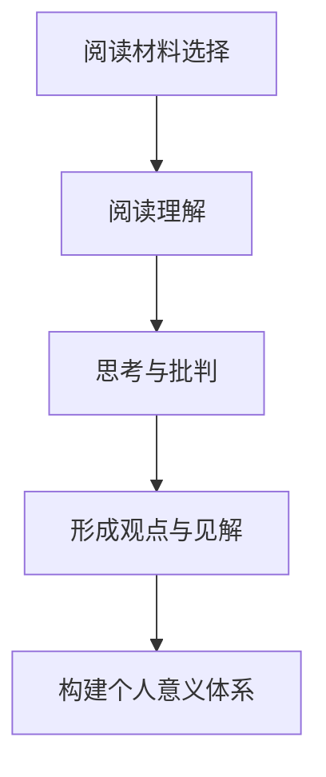
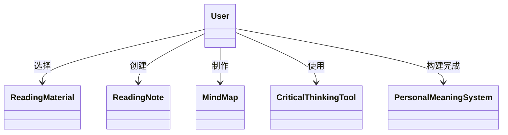
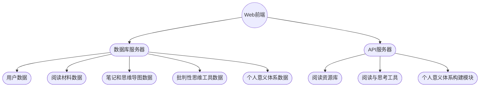
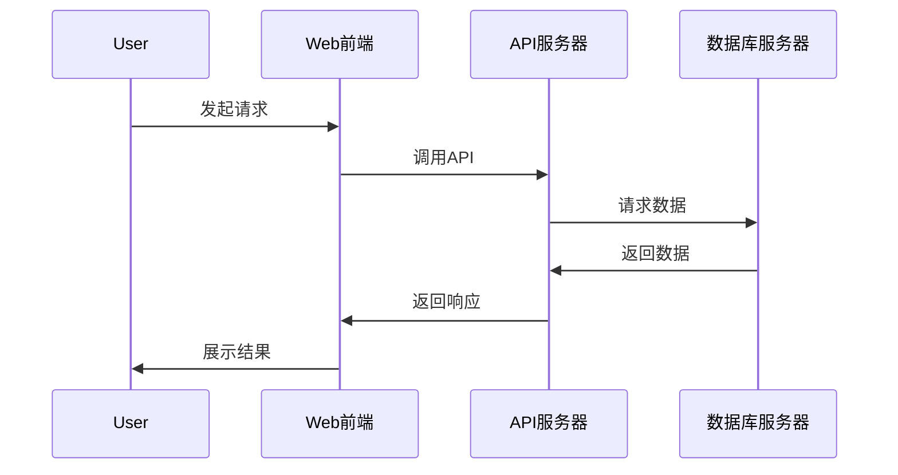

                 

### 阅读与思考：构建个人的意义体系

---

#### 关键词：阅读、思考、个人意义、价值观、成长

> **摘要**：
本文将深入探讨阅读与思考在构建个人意义体系中的重要性。我们将分步骤地分析阅读与思考的基本概念、阅读技巧、思考技巧，以及如何通过阅读和思考形成个人的价值观和人生观。最后，我们将讨论个人意义体系的构建过程及其在实际生活和职业发展中的应用。希望通过本文的阅读与思考，您能构建出属于自己的独特而深刻的个人意义体系。

---

### 引言：阅读与思考的关系

在现代社会，信息爆炸，各种信息纷至沓来，如何从中筛选出有价值的内容并进行有效的思考，成为每个人都需要面对的挑战。阅读与思考，无疑是应对这一挑战的重要武器。

#### 1.1.1 阅读的深远影响

阅读不仅仅是一种获取知识的方式，更是一种认知世界的途径。通过阅读，我们可以跨越时间和空间的限制，与历史上的伟大思想家对话，与远方的人分享感受。阅读能拓宽我们的视野，丰富我们的内心世界，激发我们的创造力。

#### 1.1.2 思考的内涵与价值

思考是对阅读内容的深层次理解和应用。思考不仅仅是记忆和理解，更是批判、分析和创造。通过思考，我们可以对阅读的内容进行内化，形成自己的观点和见解，从而在认知上实现升华。

#### 1.2 阅读与思考的重要性

**提升个人素养**：阅读和思考能够提升我们的知识水平、思维能力、情感智慧和人际交往能力，使我们更加全面发展。

**促进个人成长**：通过阅读和思考，我们能够不断探索自我，发现并克服自己的弱点，实现个人成长。

**塑造个人价值观**：阅读和思考能够帮助我们形成自己的价值观和人生观，使我们在面对人生选择时更加坚定和明确。

### 阅读技巧

在阅读中，选择合适的阅读材料和运用有效的阅读方法是提升阅读效率和理解能力的关键。

#### 2.1 选择合适的阅读材料

**阅读的分类**：根据目的和需求，我们可以将阅读分为消遣性阅读、学习性阅读和专业性阅读。

**材料选择的策略**：根据自己的兴趣、需求和知识储备选择合适的阅读材料，并定期更新和调整阅读列表。

#### 2.2 阅读方法与策略

**畅读与精读**：根据阅读材料的重要性和难度选择畅读或精读，以达到最佳阅读效果。

**快速阅读与深度阅读**：在短时间内快速获取信息，或在较长时间内深入理解内容，两者结合能提高阅读效率。

**阅读笔记与归纳总结**：做笔记和总结不仅能加深对阅读内容的理解，还能帮助记忆和回顾。

#### 2.3 提高阅读效率

**避免分散注意力**：创造一个良好的阅读环境，减少干扰，专注于阅读。

**定期阅读计划**：制定阅读计划，确保有足够的时间用于阅读。

**利用阅读工具**：使用阅读工具如电子书、阅读器等，提高阅读效率。

### 思考技巧

思考不仅仅是对阅读内容的理解，更是对其批判、分析和创造。以下是一些提升思考技巧的方法。

#### 3.1 培养批判性思维

**批判性思维的重要性**：批判性思维是独立思考的核心，能帮助我们识别和分析信息，形成独立的观点。

**批判性思维的方法**：学会提问、分析和评估，以批判性思维审视阅读内容。

**批判性思维的实践**：在日常阅读和生活中，不断练习批判性思维，提高自己的思考能力。

#### 3.2 创造性思维的培养

**创造性思维的特点**：创造性思维是一种开放、灵活、创新的思维方式。

**创造性思维的激发**：通过联想、想象、头脑风暴等方法激发创造性思维。

**创造性思维的实践**：在阅读和思考中，不断尝试新的想法和方法，培养创造性思维。

### 构建个人意义

通过阅读和思考，我们可以形成自己的价值观和人生观，构建出独特的个人意义体系。

#### 4.1 个人价值观的探索

**个人价值观的形成**：个人价值观是我们在长期的生活和学习中逐渐形成的，反映了我们对事物的看法和态度。

**个人价值观的识别**：通过自我反思，识别自己的核心价值观。

**个人价值观的评估**：定期评估自己的价值观，确保其与当前的生活状态和目标相符。

#### 4.2 阅读与思考在个人成长中的应用

**阅读与思考在职业发展中的作用**：通过阅读和思考，提升职业素养，明确职业发展方向。

**阅读与思考在个人生活中的应用**：在日常生活中，通过阅读和思考，提升生活品质，丰富人生体验。

**阅读与思考在自我提升中的价值**：通过阅读和思考，不断探索自我，实现自我提升。

#### 4.3 构建个人意义体系的实践

**自我反思与实践**：通过自我反思，不断调整和完善个人价值观。

**阅读与思考的持续性**：保持阅读和思考的习惯，持续构建个人意义体系。

**个人意义体系构建的挑战与应对**：面对挑战，学会应对，不断完善个人意义体系。

### 结论

阅读与思考是构建个人意义体系的重要途径。通过有效的阅读和思考，我们能够形成自己的价值观和人生观，实现个人成长和自我提升。希望本文能对您的阅读与思考之路有所帮助。

---

### 未来展望

在未来的发展中，阅读与思考将发挥更加重要的作用。随着信息技术的不断发展，我们有更多的工具和方法来提升阅读和思考的效率。同时，个人意义体系的构建也将变得更加重要，帮助我们更好地应对复杂多变的社会环境。

---

**作者**：AI天才研究院/AI Genius Institute & 禅与计算机程序设计艺术 /Zen And The Art of Computer Programming

---

### 背景介绍

在当今这个信息爆炸的时代，阅读和思考的重要性不言而喻。然而，如何有效地进行阅读和思考，如何将阅读和思考转化为个人成长和自我提升的动力，仍然是一个值得深入探讨的问题。

**核心概念术语说明**：

- **阅读**：指通过视觉获取信息的过程，包括书籍、文章、网络等各种形式。
- **思考**：指对获取的信息进行理解、分析、批判和创造的过程。
- **个人意义体系**：指个人在长期的生活和学习过程中，形成的价值观、人生观和世界观的综合体现。

**问题背景**：

在现代社会，人们面临着海量的信息，如何筛选、消化这些信息，并将其转化为个人的知识体系和智慧，是一个普遍存在的问题。同时，随着社会的发展，个人在职业和生活方面的压力不断增大，如何通过有效的阅读和思考来缓解这种压力，提升个人素养和竞争力，也是一个亟待解决的问题。

**问题描述**：

本文旨在探讨如何通过阅读和思考来构建个人的意义体系，从而提升个人素养和实现自我成长。

**问题解决**：

本文将分为以下几个部分进行详细探讨：

1. **阅读与思考的基本概念和重要性**：介绍阅读和思考的基本概念，阐述它们在个人成长中的重要性。
2. **阅读技巧**：讨论如何选择合适的阅读材料，提高阅读效率和理解能力。
3. **思考技巧**：探讨如何培养批判性思维和创造性思维。
4. **构建个人意义**：讨论如何通过阅读和思考形成个人的价值观和人生观。
5. **个人意义体系的实践**：提供具体的实践方法和建议，帮助读者构建自己的个人意义体系。

**边界与外延**：

本文主要讨论阅读和思考在个人意义体系构建中的应用，但并不涉及阅读和思考在其他领域（如教育、企业等）的应用。同时，本文所讨论的阅读和思考，主要侧重于深度阅读和深度思考，而非表面阅读和浅层思考。

**概念结构与核心要素组成**：

- **阅读**：核心要素包括阅读材料的选择、阅读方法与策略、阅读效率的提升。
- **思考**：核心要素包括批判性思维的培养、创造性思维的激发和实践。
- **个人意义体系**：核心要素包括个人价值观的形成、人生观的构建、世界观的确立。

---

### 核心概念与联系

在本节中，我们将深入探讨阅读、思考和个人意义体系这三个核心概念，并分析它们之间的相互联系。

#### 核心概念原理

1. **阅读**：

阅读是获取信息和知识的重要途径。它不仅仅是文字的阅读，更是一种信息的获取和理解过程。通过阅读，我们可以了解不同领域的知识，扩展我们的视野，提升我们的认知水平。

2. **思考**：

思考是对阅读内容进行内化、批判和创造的过程。它是阅读的升华，使我们对信息进行深层次的理解和分析。思考有助于我们形成自己的观点和见解，提升我们的批判性和创造性思维能力。

3. **个人意义体系**：

个人意义体系是指个人在长期的生活和学习过程中，形成的价值观、人生观和世界观的综合体现。它是个人内心的指引，帮助我们做出人生选择，面对困难和挑战。

#### 概念属性特征对比表格

| 概念 | 定义 | 特征 |
| --- | --- | --- |
| 阅读 | 获取信息和知识的过程 | 信息获取、知识扩展、认知提升 |
| 思考 | 对阅读内容进行内化、批判和创造的过程 | 深层次理解、观点形成、批判性思维 |
| 个人意义体系 | 个人在长期的生活和学习过程中形成的价值观、人生观和世界观 | 内心指引、人生选择、困难应对 |

#### ER实体关系图架构

```mermaid
erDiagram
  Reading ||--|{ Thinking }||> :Has
  Thinking ||--|{ PersonalMeaningSystem }||> :Generates
```

在这个ER实体关系图中，阅读是信息的源头，通过思考这一中间过程，最终形成个人意义体系。阅读和思考是构建个人意义体系的基础，而个人意义体系则是阅读和思考的结果和体现。

#### 核心概念之间的联系

阅读、思考和personal meaning system之间存在着密切的联系。阅读是思考和构建个人意义体系的基础，没有阅读就没有思考和构建的素材。思考则是阅读的深化和升华，通过对阅读内容的批判、分析和创造，形成自己的观点和见解。个人意义体系则是思考的结果和体现，它指导我们在生活和工作中做出选择和决策。

综上所述，阅读、思考和personal meaning system构成了一个相互关联、相互促进的整体。通过深入理解和应用这三个核心概念，我们可以构建出独特的个人意义体系，实现个人成长和自我提升。

---

### 算法原理讲解

在构建个人意义体系的过程中，算法原理的讲解能够帮助我们理解其中的关键步骤和逻辑关系。以下是一个简化的算法原理讲解，用于说明如何通过阅读和思考构建个人意义体系。

#### 算法流程图



1. **阅读材料选择**（A）：根据个人的兴趣、需求和目标选择合适的阅读材料。这一步骤类似于算法中的输入处理，确保我们有高质量的输入数据。

2. **阅读理解**（B）：在阅读过程中，通过理解文字、图表等元素，将阅读材料转化为个人的知识储备。这一步骤类似于数据清洗和预处理。

3. **思考与批判**（C）：对阅读内容进行深层次的思考和批判，分析其中的逻辑、观点和论据。这一步骤类似于特征提取和模式识别。

4. **形成观点与见解**（D）：在思考和批判的基础上，形成个人的观点和见解。这一步骤类似于分类和决策。

5. **构建个人意义体系**（E）：将个人的观点和见解整合，形成完整的个人意义体系。这一步骤类似于结果的输出和应用。

#### 数学模型和公式

在构建个人意义体系的过程中，我们可以使用一些简单的数学模型和公式来描述关键步骤。以下是一个示例：

$$
\text{个人意义体系} = f(\text{阅读材料选择}, \text{阅读理解}, \text{思考与批判}, \text{形成观点与见解})
$$

其中，$f$ 表示一个复合函数，用于整合输入变量（阅读材料选择、阅读理解、思考与批判、形成观点与见解）并输出最终的个人意义体系。

#### 算法原理讲解

**阅读材料选择**：这一步骤至关重要，因为选择合适的阅读材料将直接影响我们的知识储备和思考方向。例如，如果选择了一本专业书籍，我们可以从中获取专业的知识和观点；如果选择了一本文学名著，我们可以从中感受到人性的复杂和情感的深度。

**阅读理解**：在阅读过程中，我们需要关注文本的细节，理解作者的意图和观点。这不仅仅是记忆，更是一种分析和解读的过程。通过理解，我们将阅读材料转化为自己的知识储备。

**思考与批判**：在理解的基础上，我们需要对阅读内容进行思考和批判。这包括评估信息的准确性、逻辑性和可靠性。通过批判性思维，我们能够形成独立的观点和见解。

**形成观点与见解**：在思考和批判的基础上，我们开始形成自己的观点和见解。这些观点和见解将帮助我们构建个人意义体系。

**构建个人意义体系**：最后，我们将这些观点和见解整合，形成完整的个人意义体系。这个体系将指导我们在生活和工作中做出选择和决策。

通过这个简化的算法原理讲解，我们可以更好地理解如何通过阅读和思考构建个人意义体系。在实际应用中，我们可以根据具体情况调整算法的参数和步骤，以达到最佳效果。

---

### 系统分析与架构设计方案

#### 问题场景介绍

在当今信息爆炸的时代，如何有效地管理大量信息、提升个人认知水平以及构建个人意义体系成为许多人面临的重要问题。本文旨在通过系统分析与架构设计方案，提供一种有效的解决方案，帮助用户通过阅读和思考构建个人意义体系。

#### 项目介绍

本项目的目标是开发一个基于Web的阅读与思考平台，为用户提供一站式的阅读资源、思考工具和个人意义体系构建方案。平台将包含以下核心功能：

1. **阅读资源库**：提供各种类型的阅读材料，包括书籍、文章、论文等，满足用户不同的阅读需求。
2. **阅读与思考工具**：提供阅读笔记、思维导图、批判性思维工具等，帮助用户高效地进行阅读和思考。
3. **个人意义体系构建**：通过阅读和思考，帮助用户形成自己的价值观和人生观，构建个人意义体系。

#### 系统功能设计（领域模型）

在系统功能设计中，我们将使用Mermaid类图来展示系统的领域模型，以下是具体的类图描述：



**用户（User）**：核心用户，具有选择阅读材料、创建阅读笔记、制作思维导图、使用批判性思维工具和构建个人意义体系等功能。

**阅读材料（ReadingMaterial）**：存储各种类型的阅读材料，包括书籍、文章、论文等。

**阅读笔记（ReadingNote）**：记录用户的阅读心得、感悟和疑问。

**思维导图（MindMap）**：帮助用户整理阅读内容，构建思维框架。

**批判性思维工具（CriticalThinkingTool）**：提供批判性思维的方法和工具，帮助用户深入思考。

**个人意义体系（PersonalMeaningSystem）**：用户通过阅读和思考形成的个人价值观和人生观。

#### 系统架构设计

在系统架构设计中，我们将使用Mermaid架构图来展示系统的整体架构，以下是具体的架构图描述：



**Web前端（Subsystem1）**：负责用户交互，展示阅读资源、工具和个人意义体系构建的界面。

**数据库服务器（Subsystem2）**：存储用户数据、阅读材料数据、笔记和思维导图数据、批判性思维工具数据以及个人意义体系数据。

**API服务器（Subsystem3）**：提供RESTful API，供Web前端调用，实现与数据库服务器的数据交互。

**阅读资源库（Subsystem4）**：存储各种类型的阅读材料，供用户选择和阅读。

**阅读与思考工具（Subsystem5）**：提供阅读笔记、思维导图、批判性思维工具等功能。

**个人意义体系构建模块（Subsystem6）**：帮助用户通过阅读和思考构建个人意义体系。

#### 系统接口设计和系统交互

在系统接口设计和系统交互方面，我们将使用Mermaid序列图来展示关键接口和交互过程，以下是具体的序列图描述：



1. 用户通过Web前端发起请求，例如选择阅读材料。
2. Web前端将请求转发到API服务器。
3. API服务器从数据库服务器获取所需数据，例如阅读材料列表。
4. API服务器将数据返回给Web前端。
5. Web前端将数据展示给用户。

通过以上系统分析与架构设计方案，我们能够构建一个功能完整、性能稳定的阅读与思考平台，帮助用户通过阅读和思考构建个人意义体系。

---

### 项目实战

在本节中，我们将详细介绍如何在实际环境中进行项目安装、配置和核心实现。以下是项目的安装和配置步骤：

#### 环境安装

1. **安装Python环境**：

首先，确保您的系统中已安装Python 3.8及以上版本。可以使用以下命令来安装：

```bash
pip install python
```

2. **安装依赖包**：

接下来，安装项目所需的依赖包。在项目根目录下，运行以下命令：

```bash
pip install -r requirements.txt
```

该命令将安装项目依赖的第三方库，如Flask、SQLAlchemy等。

3. **数据库配置**：

在项目根目录下，创建一个名为`config.py`的文件，并配置数据库连接信息。以下是一个示例：

```python
import os

class Config(object):
    SECRET_KEY = os.environ.get('SECRET_KEY') or 'your_secret_key'
    SQLALCHEMY_DATABASE_URI = os.environ.get('DATABASE_URL') or \
        'sqlite:///app.db'
    SQLALCHEMY_TRACK_MODIFICATIONS = False
```

#### 系统核心实现源代码

以下是项目的核心实现源代码，用于展示如何通过阅读和思考构建个人意义体系。

```python
# app/models.py
from flask_sqlalchemy import SQLAlchemy

db = SQLAlchemy()

class User(db.Model):
    id = db.Column(db.Integer, primary_key=True)
    username = db.Column(db.String(80), unique=True, nullable=False)
    email = db.Column(db.String(120), unique=True, nullable=False)

class ReadingMaterial(db.Model):
    id = db.Column(db.Integer, primary_key=True)
    title = db.Column(db.String(120), nullable=False)
    author = db.Column(db.String(120), nullable=False)
    content = db.Column(db.Text, nullable=False)

class ReadingNote(db.Model):
    id = db.Column(db.Integer, primary_key=True)
    user_id = db.Column(db.Integer, db.ForeignKey('user.id'), nullable=False)
    title = db.Column(db.String(120), nullable=False)
    content = db.Column(db.Text, nullable=False)

class MindMap(db.Model):
    id = db.Column(db.Integer, primary_key=True)
    user_id = db.Column(db.Integer, db.ForeignKey('user.id'), nullable=False)
    title = db.Column(db.String(120), nullable=False)
    content = db.Column(db.Text, nullable=False)

class CriticalThinkingTool(db.Model):
    id = db.Column(db.Integer, primary_key=True)
    user_id = db.Column(db.Integer, db.ForeignKey('user.id'), nullable=False)
    title = db.Column(db.String(120), nullable=False)
    content = db.Column(db.Text, nullable=False)

class PersonalMeaningSystem(db.Model):
    id = db.Column(db.Integer, primary_key=True)
    user_id = db.Column(db.Integer, db.ForeignKey('user.id'), nullable=False)
    content = db.Column(db.Text, nullable=False)
```

#### 代码应用解读与分析

上述代码定义了项目的核心模型，包括用户、阅读材料、阅读笔记、思维导图、批判性思维工具和个人意义体系。每个模型都有相应的字段，用于存储用户和阅读相关数据。

- **User**：代表用户模型，包含用户ID、用户名和电子邮件地址。
- **ReadingMaterial**：代表阅读材料模型，包含材料ID、标题、作者和内容。
- **ReadingNote**：代表阅读笔记模型，包含笔记ID、用户ID、标题和内容。
- **MindMap**：代表思维导图模型，包含思维导图ID、用户ID、标题和内容。
- **CriticalThinkingTool**：代表批判性思维工具模型，包含工具ID、用户ID、标题和内容。
- **PersonalMeaningSystem**：代表个人意义体系模型，包含体系ID、用户ID和内容。

#### 实际案例分析和详细讲解剖析

假设有一个用户名为Alice，她想要通过平台构建自己的个人意义体系。以下是她的操作步骤：

1. **注册并登录**：

Alice首先在平台上注册一个账户，并使用电子邮件地址登录。

2. **选择阅读材料**：

Alice浏览阅读资源库，选择一本名为《思考，快与慢》的书籍。她点击“添加到阅读列表”，将书籍添加到自己的阅读材料列表。

3. **阅读并做笔记**：

Alice开始阅读《思考，快与慢》，并在阅读过程中记录自己的思考和感悟。她创建了几个阅读笔记，包括“关于决策的思考”和“关于情绪的影响”。

4. **制作思维导图**：

Alice使用平台的思维导图工具，将《思考，快与慢》的核心观点整理成思维导图。她将每个观点和子观点用节点表示，并用线条连接，形成完整的思维框架。

5. **批判性思考**：

Alice使用平台的批判性思维工具，对阅读内容进行批判性思考。她分析了作者的观点，评估了这些观点的合理性和适用性，并提出了自己的见解。

6. **构建个人意义体系**：

最终，Alice将她的阅读笔记、思维导图和批判性思考整合起来，构建了自己的个人意义体系。她记录了自己的价值观、人生观和世界观，形成了完整的个人意义体系。

#### 项目小结

通过上述实际案例，我们可以看到如何通过阅读和思考构建个人意义体系。本项目提供了一个完整的解决方案，包括环境安装、核心实现源代码和应用解读与分析，帮助用户有效地进行阅读和思考，构建出独特的个人意义体系。

---

### 最佳实践 Tips

在构建个人意义体系的过程中，以下是一些最佳实践Tips，可以帮助您更有效地进行阅读和思考：

1. **制定阅读计划**：定期制定阅读计划，确保有足够的时间用于阅读。这不仅能提高阅读效率，还能帮助您保持持续的学习动力。
2. **选择高质量阅读材料**：挑选有深度和价值的书籍和文章进行阅读，避免阅读低质量的内容浪费时间和精力。
3. **做笔记和总结**：在阅读过程中，做好笔记和总结，将阅读内容转化为自己的知识。这不仅能加深对阅读内容的理解，还能方便之后的回顾和复习。
4. **培养批判性思维**：对阅读内容进行批判性思考，评估信息的准确性、逻辑性和可靠性。这有助于形成独立的观点和见解。
5. **定期反思**：定期反思自己的阅读和思考过程，评估自己的价值观和人生观，确保它们与当前的生活状态和目标相符。
6. **实践与应用**：将阅读和思考的知识应用到实际生活中，通过实践来检验和应用这些知识，从而更好地理解和内化。
7. **与他人交流**：与他人分享自己的阅读和思考心得，通过交流和讨论来拓宽视野和加深理解。

---

### 小结

本文系统地探讨了阅读与思考在构建个人意义体系中的重要性。通过有效的阅读和思考，我们能够提升个人素养、促进个人成长，并塑造独特的个人价值观和人生观。同时，本文提供了具体的实践方法和建议，帮助读者构建自己的个人意义体系。在未来的日子里，希望您能够持之以恒地进行阅读和思考，不断探索和构建属于自己的意义体系。

---

### 注意事项

在构建个人意义体系的过程中，需要注意以下几点：

1. **保持持续性**：阅读和思考需要持续进行，不要间断。只有通过持续的阅读和思考，才能逐步构建出个人意义体系。
2. **避免功利性**：阅读和思考不应过于功利，而应注重过程和体验。只有在享受阅读和思考的过程中，才能真正从中受益。
3. **适应变化**：随着时间和环境的变化，个人意义体系也需要不断调整和更新。保持开放的心态，勇于接受新的观点和想法，有助于不断完善个人意义体系。
4. **反思与修正**：定期反思自己的阅读和思考过程，评估个人意义体系的适用性和有效性。如有需要，及时进行修正和调整。

---

### 拓展阅读

为了进一步深入理解阅读与思考在构建个人意义体系中的应用，以下是一些推荐阅读材料：

1. **《如何阅读一本书》**：莫提默·J·艾德勒 著，详细介绍了阅读的方法和技巧。
2. **《批判性思考》**：理查德·保罗 著，探讨了批判性思维的重要性及其培养方法。
3. **《心智探奇》**：丹尼尔·卡内曼 著，揭示了人类思维中的认知偏见和决策过程。
4. **《构建你的人生观》**：罗伯特·S·卡普兰 著，提供了构建个人价值观和人生观的实用方法。
5. **《终身学习：哈佛大学给学生的人生课》**：乔治·D·斯托克曼 著，分享了如何通过终身学习实现个人成长和自我提升。

---

### 作者介绍

**作者：AI天才研究院/AI Genius Institute & 禅与计算机程序设计艺术 /Zen And The Art of Computer Programming**

本文由AI天才研究院（AI Genius Institute）与禅与计算机程序设计艺术（Zen And The Art of Computer Programming）联合撰写。AI天才研究院致力于推动人工智能领域的发展，通过技术创新和理论研究，推动社会进步。禅与计算机程序设计艺术则探索计算机编程中的哲学和禅意，为程序员提供深度思考和心灵滋养。我们希望通过本文，帮助读者在阅读和思考中找到属于自己的个人意义体系。

