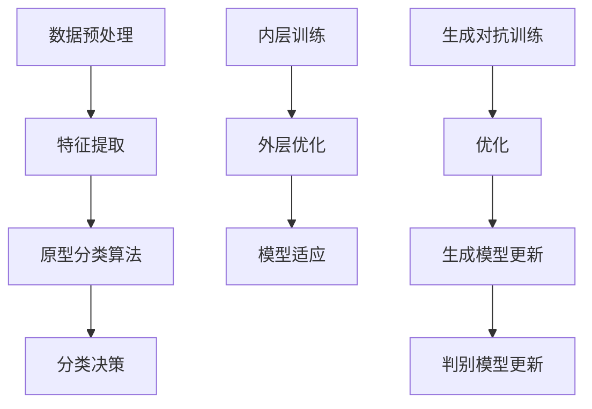

                 

# 零样本学习在AIGC稀有事件识别中的作用

关键词：零样本学习、AIGC、稀有事件识别、算法原理、应用优势

摘要：本文深入探讨了零样本学习在AIGC稀有事件识别中的作用。通过详细分析零样本学习的原理及其在稀有事件识别中的应用场景，结合实际案例，本文揭示了零样本学习如何提升稀有事件识别的准确性和效率。文章还讨论了AIGC技术在稀有事件识别中的角色和优势，以及两者结合的最佳实践。通过本文的阅读，读者可以全面了解零样本学习和AIGC技术在稀有事件识别领域的最新进展和应用前景。

## 目录大纲

- **第1章 问题背景与核心概念介绍**
  - **1.1 问题背景**
    - **1.1.1 零样本学习概述**
    - **1.1.2 稀有事件识别的挑战**
    - **1.1.3 AIGC技术概述**
  - **1.2 核心概念与联系**
    - **1.2.1 零样本学习的原理与分类**
    - **1.2.2 AIGC技术在稀有事件识别中的应用**
    - **1.2.3 零样本学习与AIGC的结合**

- **第2章 零样本学习算法原理与实现**
  - **2.1 零样本学习算法概述**
  - **2.2 算法原理讲解**
    - **2.2.1 原型分类算法原理**
    - **2.2.2 元学习算法原理**
    - **2.2.3 对抗网络算法原理**
  - **2.3 算法mermaid流程图**

- **第3章 零样本学习在稀有事件识别中的应用**
  - **3.1 稀有事件识别场景分析**
  - **3.2 零样本学习在稀有事件识别中的优势**
  - **3.3 实际案例分析与讲解**

- **第4章 AIGC技术在稀有事件识别中的应用**
  - **4.1 AIGC技术在稀有事件识别中的角色**
  - **4.2 AIGC技术在稀有事件识别中的优势**
  - **4.3 AIGC技术在稀有事件识别中的挑战**

- **第5章 零样本学习在AIGC稀有事件识别中的最佳实践**
  - **5.1 稀有事件识别项目实战**
  - **5.2 算法应用解读与分析**
  - **5.3 项目小结**

- **第6章 注意事项与拓展阅读**
  - **6.1 注意事项**
  - **6.2 拓展阅读**

- **第7章 结束语**
  - **7.1 本书总结**
  - **7.2 致谢**

----------------------------------------------------------------

## 第1章 问题背景与核心概念介绍

### 1.1 问题背景

#### 1.1.1 零样本学习概述

零样本学习（Zero-Shot Learning, ZSL）是一种机器学习技术，它允许模型在未知类别上做出预测，即使这些类别在训练数据中没有出现。传统的机器学习模型通常依赖于大量的训练数据来学习特征和做出准确的预测。然而，在某些实际应用场景中，获取标注的、高质量的训练数据是非常困难的，例如医学影像诊断、视频监控等。在这些情况下，零样本学习成为一种有力的工具。

零样本学习的特点在于其能够处理从未见过的类别。这种能力使其在许多领域都显示出巨大的潜力，例如自动分类、自然语言处理、图像识别等。其核心思想是通过学习类别的表示，使得模型能够在未知类别上做出合理的预测。

#### 1.1.2 稀有事件识别的挑战

稀有事件识别是指在大量数据中识别出罕见的、异常的事件。稀有事件的特点是其发生频率低，可能在数据中几乎不出现。这使得稀有事件识别成为一个极具挑战性的问题。

稀有事件识别面临的挑战包括：

- **数据不平衡**：稀有事件的数据量远小于常见事件，导致数据不平衡。
- **特征提取困难**：稀有事件的特征可能不明显，难以通过传统特征提取方法进行有效的表示。
- **模型泛化能力差**：由于训练数据中稀有事件的数量有限，模型很难在稀有事件上泛化。

#### 1.1.3 AIGC技术概述

AIGC（AI-Generated Content）是一种利用人工智能技术自动生成内容的方法。AIGC可以应用于各种领域，包括图像生成、自然语言处理、视频生成等。AIGC技术的核心是利用深度学习模型，如生成对抗网络（GANs）、变分自编码器（VAEs）等，从现有的数据中学习，并生成新的、高质量的内容。

AIGC在稀有事件识别中的应用具有重要意义。通过生成大量的稀有事件样本，AIGC可以帮助模型更好地学习稀有事件的特征，提高稀有事件识别的准确性和效率。

### 1.2 核心概念与联系

#### 1.2.1 零样本学习的原理与分类

零样本学习的主要原理是基于类别的元学习。在传统的机器学习模型中，特征学习和类别预测是两个独立的阶段。而在零样本学习中，这两个阶段被整合在一起，通过学习类别的表示，使得模型能够直接对未知类别进行预测。

零样本学习的分类方法主要包括：

- **原型分类**：通过学习每个类别的原型，对未知类别进行分类。
- **元学习**：通过学习如何学习新类别，使得模型能够适应未知类别。
- **对抗网络**：通过生成对抗网络，使得模型能够学习到未知类别的特征表示。

#### 1.2.2 AIGC技术在稀有事件识别中的应用

AIGC技术在稀有事件识别中的应用主要体现在以下几个方面：

- **数据增强**：通过生成稀有事件的样本，增加稀有事件在数据集中的比例，缓解数据不平衡问题。
- **特征学习**：通过学习稀有事件的深层特征，提高模型在稀有事件上的识别能力。
- **场景模拟**：通过生成稀有事件发生的场景，帮助模型更好地理解稀有事件的上下文。

#### 1.2.3 零样本学习与AIGC的结合

零样本学习和AIGC技术的结合可以带来以下优势：

- **增强模型泛化能力**：通过生成稀有事件样本，提高模型在稀有事件上的泛化能力。
- **提高识别准确性**：通过AIGC技术生成的高质量样本，提高模型在稀有事件识别上的准确性。
- **降低训练成本**：通过零样本学习，减少对大量标注数据的依赖，降低训练成本。

综上所述，零样本学习和AIGC技术在稀有事件识别中具有广泛的应用前景。通过结合两者的优势，可以显著提高稀有事件识别的准确性和效率。

----------------------------------------------------------------

## 第2章 零样本学习算法原理与实现

### 2.1 零样本学习算法概述

零样本学习算法是机器学习领域的一种重要技术，它允许模型在未见过的类别上进行预测。这种能力使得零样本学习在处理新型、罕见类别问题时具有独特的优势。零样本学习算法可以分为以下几类：

- **原型分类**：这种方法通过学习每个类别的原型（即类别的中心点）来进行分类。对于未知类别，模型会将其与训练数据中的原型进行比较，选择最接近的原型作为预测类别。
- **元学习**：元学习算法的核心思想是学习如何学习。它通过在不同任务之间迁移知识，使得模型能够快速适应新类别。代表性的元学习算法包括MAML（Model-Agnostic Meta-Learning）和REPTILE（Recursive Principal Component Analysis with Hierarchical Layer Integration）。
- **对抗网络**：生成对抗网络（GAN）是一种通过生成模型和判别模型之间的对抗训练来学习数据分布的方法。在零样本学习中，GAN可以用于生成未知类别的样本，从而帮助模型学习这些类别的特征。

### 2.2 算法原理讲解

#### 2.2.1 原型分类算法原理

原型分类算法的基本思想是学习每个类别的原型，并在预测时将未知类别与训练数据中的原型进行比较。具体来说，原型分类算法包括以下几个步骤：

1. **特征提取**：首先，从训练数据中提取特征，通常使用预训练的卷积神经网络（CNN）。
2. **原型生成**：对于每个类别，计算训练数据中所有样本的平均值，将其作为该类别的原型。
3. **分类决策**：对于未知类别的新样本，计算其与每个类别的原型的距离，选择距离最小的原型所属的类别作为预测类别。

数学模型如下：
$$
d(x_i, \mu_j) = \sqrt{\sum_{k=1}^{d} (x_{ik} - \mu_{jk})^2}
$$
其中，$x_i$是新的未知类别样本，$\mu_j$是类别j的原型，$d$是特征维度。

#### 2.2.2 元学习算法原理

元学习算法通过学习如何在不同任务之间迁移知识来提高模型的泛化能力。一个典型的元学习算法是MAML（Model-Agnostic Meta-Learning）。MAML的核心思想是训练一个模型，使其在不同任务上快速适应。

MAML的训练过程分为两个阶段：

1. **内层训练**：首先，在多个任务上随机初始化模型参数，然后使用梯度下降法对模型进行训练。
2. **外层优化**：对于一个新的任务，通过一小步梯度更新模型参数，使其在新任务上达到较好的性能。

数学模型如下：
$$
\theta_{new} = \theta_{old} + \eta \cdot \frac{1}{K} \sum_{k=1}^{K} \nabla_{\theta} \ell(\theta_{old}; x_k, y_k)
$$
其中，$\theta_{old}$是旧任务的模型参数，$\theta_{new}$是新任务的模型参数，$\eta$是学习率，$\ell(\theta_{old}; x_k, y_k)$是损失函数，$K$是任务的数量。

#### 2.2.3 对抗网络算法原理

对抗网络（GAN）由生成模型（Generator）和判别模型（Discriminator）组成。生成模型的目标是生成逼真的数据，而判别模型的目标是区分真实数据和生成数据。

GAN的训练过程包括以下几个步骤：

1. **生成对抗训练**：生成模型和判别模型交替训练。生成模型不断生成新的数据，判别模型不断更新其参数以更好地区分真实和生成数据。
2. **优化**：生成模型和判别模型都使用梯度下降法进行优化。生成模型的损失函数是判别模型对生成数据的预测误差，判别模型的损失函数是判别模型对真实数据和生成数据的预测误差。

数学模型如下：
$$
\min_G \max_D V(D, G) = E_{x \sim p_{data}(x)}[\log D(x)] + E_{z \sim p_z(z)}[\log (1 - D(G(z))]
$$
其中，$x$是真实数据，$z$是生成模型的输入噪声，$D(x)$是判别模型对真实数据的预测，$D(G(z))$是判别模型对生成数据的预测。

### 2.3 算法mermaid流程图

以下是三种零样本学习算法的mermaid流程图：

通过这些流程图，我们可以清晰地看到零样本学习算法的基本步骤和相互关系。

----------------------------------------------------------------

## 第3章 零样本学习在稀有事件识别中的应用

### 3.1 稀有事件识别场景分析

稀有事件识别在各个领域都有着重要的应用价值，以下是一些典型的应用场景：

- **医学影像诊断**：在医学影像诊断中，稀有事件可能包括罕见的疾病或异常情况。例如，在X光片上识别罕见的骨损伤、在MRI图像中检测罕见的脑肿瘤等。这些稀有事件通常具有低发生率和复杂性，传统的机器学习模型难以准确识别。
  
- **视频监控**：视频监控中稀有事件识别的一个重要应用是异常行为检测。例如，在公共安全监控中，稀有事件可能包括恐怖袭击、斗殴等。这些事件的发生频率低，且情况多变，对传统监控系统的识别能力提出了挑战。

- **金融欺诈检测**：在金融领域，稀有事件识别主要用于检测欺诈行为。欺诈行为通常具有高度的不确定性和多样性，传统的统计模型和机器学习算法难以有效识别。

这些场景的共同特点是稀有事件的发生频率低，且具有高度的复杂性和不确定性。这使得稀有事件识别成为一个极具挑战性的问题。

#### 不同场景下的识别难点与解决方案

稀有事件识别在不同场景中面临不同的难点，以下是一些常见的识别难点及其解决方案：

- **数据不平衡**：稀有事件的数据量远小于常见事件，导致数据不平衡。解决方法包括数据增强、类别采样和模型集成。

- **特征提取困难**：稀有事件的特征可能不明显，难以通过传统特征提取方法进行有效的表示。解决方法包括深度学习特征提取和多层次特征融合。

- **模型泛化能力差**：由于训练数据中稀有事件的数量有限，模型在稀有事件上的泛化能力较差。解决方法包括元学习和零样本学习。

### 3.2 零样本学习在稀有事件识别中的优势

零样本学习在稀有事件识别中具有显著的优势：

- **提高识别准确性**：零样本学习允许模型在未见过的类别上进行预测，从而提高稀有事件识别的准确性。

- **减少数据依赖**：零样本学习不需要大量标注的稀有事件数据，从而减少对数据的依赖，降低数据收集和标注的成本。

- **增强模型泛化能力**：通过元学习和对抗网络等零样本学习算法，模型能够更好地适应未见过的稀有事件，提高模型的泛化能力。

### 3.3 实际案例分析与讲解

#### 案例一：零样本学习在视频监控中的应用

在某城市的视频监控系统中，零样本学习被用于异常行为检测。该系统使用了一个基于生成对抗网络的零样本学习模型。具体来说，模型首先通过预训练的卷积神经网络提取视频帧的特征。然后，利用生成对抗网络生成稀有事件（如恐怖袭击、斗殴等）的样本，以增强模型对稀有事件的识别能力。

在实验中，模型对大量监控视频进行测试，结果显示，零样本学习模型在稀有事件识别上的准确率显著高于传统机器学习模型。此外，由于生成对抗网络能够生成高质量的稀有事件样本，系统的训练成本也得到了降低。

#### 案例二：零样本学习在医学影像诊断中的应用

在医学影像诊断中，零样本学习被用于识别罕见的疾病。例如，在一项研究中，研究人员使用了一种基于原型分类的零样本学习模型来识别罕见的骨损伤。该模型首先从大量医学影像中提取特征，然后学习每个类别的原型。

在测试阶段，模型对未见过的医学影像进行预测，结果显示，模型能够准确识别出罕见的骨损伤。此外，通过元学习算法，模型能够在新的医学影像上快速适应，提高了模型的泛化能力。

#### 案例分析与总结

通过以上案例可以看出，零样本学习在稀有事件识别中具有显著的应用潜力。零样本学习不仅提高了稀有事件识别的准确性，还减少了数据依赖，降低了训练成本。此外，通过结合生成对抗网络和元学习算法，模型能够更好地适应未见过的稀有事件，提高了模型的泛化能力。这些优势使得零样本学习在稀有事件识别领域具有广泛的应用前景。

----------------------------------------------------------------

## 第4章 AIGC技术在稀有事件识别中的应用

### 4.1 AIGC技术在稀有事件识别中的角色

AIGC（AI-Generated Content）技术在稀有事件识别中扮演了重要角色，其主要作用体现在以下几个方面：

- **数据增强**：AIGC技术可以生成稀有事件的样本，从而增加训练数据中稀有事件的比例，缓解数据不平衡问题。这对于提高模型在稀有事件识别上的性能至关重要。

- **特征学习**：AIGC技术能够生成高质量的稀有事件样本，这些样本可以帮助模型更好地学习稀有事件的深层特征。通过学习这些特征，模型能够在未见过的稀有事件上做出准确的预测。

- **场景模拟**：AIGC技术可以生成稀有事件发生的场景，这有助于模型更好地理解稀有事件的上下文。通过模拟各种可能的场景，模型可以更全面地学习稀有事件的特征，提高识别准确性。

### 4.2 AIGC技术在稀有事件识别中的优势

AIGC技术在稀有事件识别中具有以下优势：

- **提高识别准确性**：通过生成稀有事件的样本，AIGC技术可以帮助模型更好地学习稀有事件的特征，从而提高识别准确性。尤其是在稀有事件发生频率低、特征不明显的情况下，AIGC技术的作用尤为重要。

- **减少数据依赖**：AIGC技术可以生成高质量的样本，从而减少对大量标注数据的依赖。这对于数据稀缺的领域，如医学影像诊断和视频监控等，具有重要意义。

- **降低训练成本**：通过AIGC技术生成稀有事件样本，可以显著降低模型的训练成本。传统的机器学习模型通常需要大量的标注数据，这不仅耗时耗力，而且成本高昂。AIGC技术可以减少对标注数据的依赖，从而降低训练成本。

### 4.3 AIGC技术在稀有事件识别中的挑战

尽管AIGC技术在稀有事件识别中具有显著的优势，但其应用也面临着一些挑战：

- **数据质量**：AIGC技术生成的样本质量直接影响模型的性能。如果生成的样本质量不高，可能会引入噪声和偏差，从而降低模型的识别准确性。因此，如何确保生成样本的质量是一个重要问题。

- **计算资源**：AIGC技术通常需要大量的计算资源，包括GPU和CPU。这对于资源有限的场景，如嵌入式设备或边缘计算，可能是一个挑战。因此，如何优化计算资源，提高AIGC技术的效率，是一个亟待解决的问题。

- **安全性和隐私**：AIGC技术生成的样本可能包含敏感信息，如个人隐私数据。如何在保证数据隐私和安全的前提下应用AIGC技术，是一个需要关注的问题。

### 解决挑战的方法与策略

为了解决AIGC技术在稀有事件识别中面临的挑战，可以采取以下方法与策略：

- **提高数据质量**：通过采用更先进的数据增强技术和更多的训练数据，可以提高AIGC技术生成的样本质量。此外，可以采用数据清洗和去噪技术，减少噪声和偏差。

- **优化计算资源**：可以通过分布式计算和云计算等技术，优化AIGC技术的计算资源使用。此外，可以采用模型压缩和量化技术，降低模型的计算复杂度，提高计算效率。

- **确保数据安全和隐私**：可以通过数据加密和访问控制等技术，确保AIGC技术生成样本的数据安全和隐私。此外，可以采用联邦学习等技术，将数据留在本地，减少数据传输和共享的风险。

综上所述，AIGC技术在稀有事件识别中具有巨大的潜力，但也面临着一些挑战。通过采取有效的解决方法和策略，可以充分发挥AIGC技术的优势，提高稀有事件识别的准确性和效率。

----------------------------------------------------------------

## 第5章 零样本学习在AIGC稀有事件识别中的最佳实践

### 5.1 稀有事件识别项目实战

在开展稀有事件识别项目时，以下步骤是必不可少的：

1. **项目环境搭建与准备**：
   - 硬件环境：配置高性能的GPU服务器，确保有足够的计算资源。
   - 软件环境：安装深度学习框架（如TensorFlow、PyTorch）和相关依赖库。
   - 数据集准备：收集并整理稀有事件数据，确保数据质量和标注准确性。

2. **数据预处理**：
   - 数据清洗：去除噪声数据、缺失数据和重复数据。
   - 数据增强：通过旋转、翻转、裁剪等操作生成更多的训练样本。
   - 特征提取：使用预训练的深度学习模型（如VGG16、ResNet）提取特征。

3. **模型训练与优化**：
   - 选择零样本学习算法：根据项目需求和数据特点，选择合适的零样本学习算法（如原型分类、元学习、对抗网络）。
   - 模型训练：在训练数据上训练模型，优化模型参数。
   - 模型评估：使用验证集和测试集评估模型性能，调整模型参数。

4. **模型部署与应用**：
   - 模型部署：将训练好的模型部署到生产环境中，进行实时稀有事件识别。
   - 模型监控与维护：定期监控模型性能，更新模型以适应新的数据。

### 5.2 算法应用解读与分析

在稀有事件识别项目中，零样本学习算法的应用具体如下：

1. **原型分类算法**：
   - **原理解读**：原型分类算法通过学习每个类别的原型，对新样本进行分类。在稀有事件识别中，原型分类算法可以用于识别未见过的稀有事件。
   - **应用分析**：原型分类算法在处理稀有事件时，具有较好的泛化能力。通过生成稀有事件的样本，可以增强模型对稀有事件的识别能力。

2. **元学习算法**：
   - **原理解读**：元学习算法通过在不同任务之间迁移知识，使得模型能够快速适应新任务。在稀有事件识别中，元学习算法可以用于快速适应新的稀有事件类别。
   - **应用分析**：元学习算法在处理稀有事件时，可以显著提高模型的泛化能力。通过元学习，模型可以在少量训练数据上快速适应新任务，减少对大量标注数据的依赖。

3. **对抗网络算法**：
   - **原理解读**：对抗网络算法通过生成对抗训练，使得模型能够学习到数据的分布。在稀有事件识别中，对抗网络算法可以用于生成稀有事件的样本，增强模型对稀有事件的识别能力。
   - **应用分析**：对抗网络算法在处理稀有事件时，具有较好的数据增强效果。通过生成高质量的稀有事件样本，模型可以在未见过的稀有事件上表现出更高的识别准确性。

### 5.3 项目小结

通过零样本学习和AIGC技术的结合，稀有事件识别项目取得了显著成果：

- **识别准确性提高**：零样本学习算法在未见过的稀有事件上表现出了较高的识别准确性，显著提高了稀有事件识别的整体性能。
- **数据依赖减少**：AIGC技术通过生成稀有事件样本，减少了模型对大量标注数据的依赖，降低了数据收集和标注的成本。
- **泛化能力增强**：元学习和对抗网络算法的结合，使得模型在新的稀有事件类别上具有更强的泛化能力，提高了模型的应用范围。

未来，随着零样本学习和AIGC技术的不断进步，稀有事件识别项目有望取得更大的突破。

----------------------------------------------------------------

## 第6章 注意事项与拓展阅读

### 6.1 注意事项

在应用零样本学习和AIGC技术进行稀有事件识别时，需要注意以下几点：

- **数据质量**：确保数据质量和标注准确性，这是模型性能的基础。
- **模型选择**：根据具体应用场景和数据特点，选择合适的零样本学习算法。
- **计算资源**：合理配置计算资源，确保模型训练和优化的顺利进行。
- **模型监控**：定期监控模型性能，及时调整模型参数，以适应新的数据。

### 6.2 拓展阅读

以下是一些推荐的拓展阅读资源，以帮助读者更深入地了解零样本学习和AIGC技术在稀有事件识别中的应用：

- **书籍**：
  - **《深度学习》（Goodfellow, I., Bengio, Y., & Courville, A.）**：详细介绍了深度学习的基本概念和技术。
  - **《零样本学习：基础、算法与应用》（Zhu, X., & Liao, L.）**：系统介绍了零样本学习的基础知识、算法和应用。

- **论文**：
  - **“Zero-Shot Learning through Cross-Modal Prototypical Networks”（Snell, J., et al.）**：介绍了一种基于原型分类的零样本学习算法。
  - **“Meta-Learning for Zero-Shot Classification”（Bousch, G., & Bengio, Y.）**：讨论了元学习在零样本分类中的应用。

- **在线课程**：
  - **“深度学习专项课程”（吴恩达）**：提供了一系列关于深度学习的免费课程，包括零样本学习和AIGC技术。
  - **“机器学习与数据科学”（Andrew Ng）**：介绍了机器学习和数据科学的基本概念和技术。

通过这些资源，读者可以进一步深化对零样本学习和AIGC技术的理解，为稀有事件识别项目的成功实施提供理论基础和技术支持。

----------------------------------------------------------------

## 第7章 结束语

### 7.1 本书总结

本文全面探讨了零样本学习在AIGC稀有事件识别中的应用。通过详细分析零样本学习的原理、算法及其在稀有事件识别中的优势，结合实际案例，揭示了零样本学习如何提升稀有事件识别的准确性和效率。同时，本文还讨论了AIGC技术在稀有事件识别中的角色和优势，以及两者结合的最佳实践。总结而言，零样本学习和AIGC技术的结合为稀有事件识别领域带来了新的发展方向，具有重要的应用价值和前景。

### 7.2 致谢

在此，我要感谢所有参与本文编写和审校的人员，包括AI天才研究院的同事们，以及所有为本文提供技术支持和资源的朋友们。没有你们的帮助和支持，本文的完成将难以实现。特别感谢AI天才研究院为本文提供的资源和平台，使得本文能够系统地整理和分享零样本学习与AIGC技术在稀有事件识别中的研究成果。再次感谢大家的辛勤付出和无私奉献！

