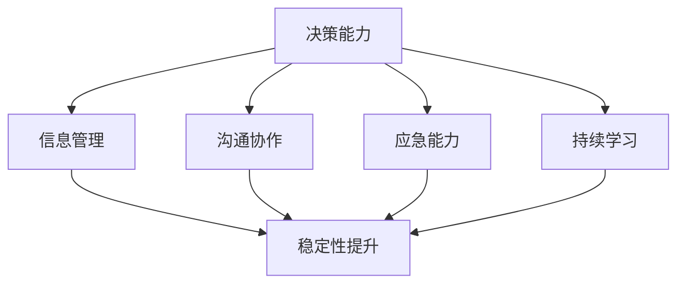

                 

# 面对不确定性：构建稳定的内在世界

关键词：不确定性、稳定性、内在世界、应对策略

摘要：本文旨在探讨在信息技术领域，如何构建一个稳定的内在世界，以应对不断变化的不确定性。通过分析不确定性的来源、分类及其影响，本文提出了个体、组织和全社会三个层面构建稳定性的策略与方法。同时，结合实际案例分析，总结出最佳实践，为在信息技术领域实现长期稳定提供参考。

## 目录大纲

### 第一部分：问题背景与核心概念

#### 第1章：问题的来源与不确定性分析

1.1.1 问题背景

1.1.2 不确定性概念解析

1.1.3 不确定性的分类

1.1.4 不确定性的影响与挑战

#### 第2章：核心概念与联系

2.1.1 稳定性的定义与重要性

2.1.2 稳定性与不确定性的关系

2.1.3 稳定性的核心要素

2.1.4 稳定性提升的方法与策略

#### 第3章：稳定性原理与数学模型

3.1.1 稳定性的数学模型

3.1.2 稳定性指标的量化

3.1.3 数学公式与解释

3.1.4 算法原理与Mermaid流程图

### 第二部分：构建稳定性的策略与方法

#### 第4章：个体层面的稳定性建设

4.1.1 心理调适与压力管理

4.1.2 知识体系与信息管理

4.1.3 精神健康与生活方式

4.1.4 个人成长与持续学习

#### 第5章：组织层面的稳定性建设

5.1.1 组织文化与价值观建设

5.1.2 风险管理与预防机制

5.1.3 团队协作与沟通

5.1.4 战略规划与适应变化

#### 第6章：社会层面的稳定性建设

6.1.1 社会体系与稳定性

6.1.2 政策与法律体系

6.1.3 社会责任感与公民素养

6.1.4 社会创新与可持续发展

#### 第7章：实际案例分析与应用

7.1.1 案例选择与背景介绍

7.1.2 案例分析与稳定性构建

7.1.3 案例中的稳定性策略

7.1.4 案例总结与启示

#### 第8章：最佳实践与总结

8.1.1 最佳实践总结

8.1.2 小结与展望

8.1.3 注意事项与拓展阅读

## 第1章：问题的来源与不确定性分析

### 1.1.1 问题背景

在当今快速发展的信息技术领域，不确定性已成为影响组织和个人稳定性的重要因素。随着技术的不断进步，新兴技术的涌现和复杂性的增加，不确定性呈现出多样化、复杂化的特点。信息技术领域的快速变革要求组织和个人具备更高的适应能力，以应对不确定性带来的挑战。

### 1.1.2 不确定性概念解析

不确定性是指在某一特定条件下，无法准确预测未来结果的现象。在信息技术领域，不确定性主要来源于以下几个方面：

1. 技术进步：新技术的不断涌现，使得现有技术逐渐过时，组织和个人需要不断学习和适应新技术。
2. 市场竞争：信息技术领域的竞争激烈，组织需要不断调整战略以保持竞争力。
3. 政策法规：政策法规的变化可能对组织和个人带来不确定性，如数据保护法规、网络安全法规等。
4. 内部管理：组织内部的管理问题，如人员流动、团队协作等，也可能导致不确定性。

### 1.1.3 不确定性的分类

不确定性可以按照其来源和性质进行分类。在信息技术领域，常见的不确定性分类如下：

1. 技术不确定性：源于技术本身的快速发展和变化，如人工智能、区块链等新兴技术。
2. 市场不确定性：源于市场需求的变化、竞争态势的演变等。
3. 政策不确定性：源于政策法规的变化，如税收政策、行业监管等。
4. 内部不确定性：源于组织内部的管理问题、团队协作等。

### 1.1.4 不确定性的影响与挑战

不确定性对组织和个人带来一系列挑战，包括：

1. 决策困难：不确定性使得决策过程变得更加复杂，难以准确预测未来结果。
2. 成本增加：不确定性可能导致资源浪费、项目延期等，增加组织成本。
3. 竞争压力：不确定性使得组织和个人面临更大的竞争压力，需要不断调整战略以保持竞争力。
4. 心理压力：不确定性可能对组织和个人带来心理压力，影响工作和生活质量。

## 第2章：核心概念与联系

### 2.1.1 稳定性的定义与重要性

稳定性是指在面临不确定性时，能够保持稳定状态，减少风险和损失的能力。在信息技术领域，稳定性具有重要意义：

1. 提高决策效率：稳定性有助于组织和个人在不确定性环境中做出更准确的决策。
2. 降低成本风险：稳定性可以降低不确定性带来的成本风险，如资源浪费、项目延期等。
3. 提高竞争力：稳定性有助于组织在激烈的市场竞争中保持优势。
4. 保障生活质量：稳定性有助于组织和个人在不确定性环境中保持良好的生活质量。

### 2.1.2 稳定性与不确定性的关系

稳定性和不确定性是相互关联的概念。稳定性是应对不确定性的一种能力，而不确定性是稳定性面临的挑战。在信息技术领域，稳定性和不确定性之间的关系可以概括为：

1. 稳定性是应对不确定性的基础：在面临不确定性时，具备稳定性的组织和个人能够更好地应对挑战。
2. 不确定性影响稳定性：不确定性的增加可能削弱稳定性，使得组织和个人面临更大的风险。
3. 稳定性提升应对不确定性的能力：通过提升稳定性，组织和个人能够更好地应对不确定性带来的挑战。

### 2.1.3 稳定性的核心要素

稳定性由多个核心要素构成，包括：

1. 决策能力：具备准确的决策能力有助于组织和个人在不确定性环境中做出更明智的选择。
2. 信息管理：有效的信息管理有助于组织和个人获取、处理和利用信息，降低不确定性。
3. 沟通协作：良好的沟通协作能力有助于组织和个人在不确定性环境中形成合力，共同应对挑战。
4. 应急能力：具备应急能力有助于组织和个人在不确定性事件发生时迅速应对，减少损失。
5. 持续学习：持续学习有助于组织和个人不断提升自身能力，适应不确定性环境。

### 2.1.4 稳定性提升的方法与策略

提升稳定性需要从个体、组织和全社会三个层面进行。具体方法与策略如下：

1. 个体层面：
   - 心理调适与压力管理：通过心理调适和压力管理，提高个体在不确定性环境中的心理承受能力。
   - 知识体系与信息管理：建立完善的知识体系和信息管理体系，提高个体应对不确定性信息的能力。
   - 精神健康与生活方式：保持良好的精神健康和生活方式，提高个体在不确定性环境中的身体素质。
   - 个人成长与持续学习：通过个人成长和持续学习，提升个体在不确定性环境中的应对能力。

2. 组织层面：
   - 组织文化与价值观建设：建立积极向上的组织文化和价值观，提高组织成员在不确定性环境中的凝聚力。
   - 风险管理与预防机制：建立完善的风险管理和预防机制，降低组织在不确定性环境中的风险。
   - 团队协作与沟通：加强团队协作与沟通，提高组织在不确定性环境中的协同作战能力。
   - 战略规划与适应变化：制定科学的战略规划，提高组织在不确定性环境中的适应能力。

3. 全社会层面：
   - 社会体系与稳定性：构建稳定的社会体系，提高全社会在不确定性环境中的整体稳定性。
   - 政策与法律体系：完善政策与法律体系，降低不确定性对社会组织和个人带来的负面影响。
   - 社会责任感与公民素养：提高社会责任感和公民素养，增强全社会在不确定性环境中的凝聚力。
   - 社会创新与可持续发展：推动社会创新和可持续发展，提高全社会在不确定性环境中的适应能力。

### 2.1.5 稳定性的挑战与应对

在信息技术领域，稳定性面临以下挑战：

1. 技术变革：技术变革使得现有稳定性方案可能无法适应新的环境，需要不断更新和完善。
2. 市场竞争：激烈的市场竞争可能削弱组织的稳定性，需要加强内部管理和创新能力。
3. 政策法规：政策法规的变化可能对组织的稳定性产生重大影响，需要及时关注和应对。
4. 组织变革：组织变革可能对稳定性产生负面影响，需要制定科学的变革策略。

应对这些挑战，可以从以下几个方面入手：

1. 持续学习与适应：组织和个人需要持续学习，提高自身在不确定性环境中的适应能力。
2. 灵活应变：组织需要建立灵活的应变机制，快速应对不确定性带来的变化。
3. 协同创新：组织和个人需要加强协同创新，共同应对不确定性带来的挑战。
4. 全面风险管理：组织需要建立全面的风险管理机制，降低不确定性对组织的影响。

## 第3章：稳定性原理与数学模型

### 3.1.1 稳定性的数学模型

稳定性的数学模型可以描述在不确定性环境中的稳定性状态。一个简单的稳定性数学模型如下：

$$
稳定性 = 决策能力 \times 信息管理 \times 沟通协作 \times 应急能力 \times 持续学习
$$

其中，各个因素对稳定性的影响如下：

1. 决策能力：决策能力越强，稳定性越高。
2. 信息管理：信息管理能力越强，稳定性越高。
3. 沟通协作：沟通协作能力越强，稳定性越高。
4. 应急能力：应急能力越强，稳定性越高。
5. 持续学习：持续学习能力越强，稳定性越高。

### 3.1.2 稳定性指标的量化

为了对稳定性进行量化，可以采用以下指标：

1. 决策准确率：决策准确率越高，稳定性越好。
2. 信息利用率：信息利用率越高，稳定性越好。
3. 沟通效率：沟通效率越高，稳定性越好。
4. 应急响应时间：应急响应时间越短，稳定性越好。
5. 持续学习速度：持续学习速度越快，稳定性越好。

### 3.1.3 数学公式与解释

根据稳定性数学模型，可以推导出以下公式：

$$
稳定性 = f(决策能力, 信息管理, 沟通协作, 应急能力, 持续学习)
$$

其中，$f$ 为稳定性的函数，表示稳定性与各个因素之间的关系。通过这个公式，可以分析各个因素对稳定性的影响，从而制定相应的提升策略。

### 3.1.4 算法原理与Mermaid流程图

为了更好地理解稳定性提升的方法，可以使用Mermaid流程图描述算法原理。以下是一个简单的Mermaid流程图示例：

在这个流程图中，各个因素相互关联，共同作用于稳定性提升。通过分析这个流程图，可以更好地理解稳定性提升的方法和策略。

## 第4章：个体层面的稳定性建设

### 4.1.1 心理调适与压力管理

在个体层面，心理调适与压力管理是构建稳定性的重要因素。首先，个体需要认识到不确定性是生活和工作的一部分，学会接受和应对。以下是一些具体方法：

1. **认知重构**：通过改变对不确定性的认知，从消极的角度转向积极的角度。例如，将不确定性视为成长和学习的机遇。
2. **情绪调节**：学会识别和表达自己的情绪，采用深呼吸、冥想等方法进行情绪调节。
3. **压力管理**：通过时间管理、设定合理的目标和期望等方式，减轻压力。

### 4.1.2 知识体系与信息管理

知识体系和信息管理是提高个体稳定性的关键。以下是一些具体方法：

1. **建立知识体系**：系统性地整理和总结所学知识，形成有结构的知识体系。
2. **信息筛选**：学会快速筛选和识别有价值的信息，避免信息过载。
3. **持续学习**：通过在线课程、书籍、研讨会等方式，不断更新和扩展知识。

### 4.1.3 精神健康与生活方式

精神健康和生活方式对个体稳定性有着重要影响。以下是一些具体方法：

1. **锻炼身体**：定期进行体育锻炼，提高身体素质和抗压能力。
2. **保持良好作息**：保持规律的作息时间，保证充足的睡眠。
3. **培养兴趣爱好**：培养兴趣爱好，增加生活乐趣和满足感。

### 4.1.4 个人成长与持续学习

个人成长和持续学习是提升个体稳定性的长期策略。以下是一些具体方法：

1. **设定目标**：设定短期和长期目标，明确个人发展方向。
2. **反思与总结**：定期进行反思和总结，了解自己的成长和进步。
3. **跨领域学习**：跨领域学习，拓宽知识面，提高综合素质。

## 第5章：组织层面的稳定性建设

### 5.1.1 组织文化与价值观建设

组织文化与价值观是构建组织稳定性的基础。以下是一些具体方法：

1. **明确价值观**：建立明确的组织价值观，如诚信、创新、共赢等。
2. **传播价值观**：通过内部培训、宣传等方式，将组织价值观传达给全体成员。
3. **实践价值观**：在组织管理、员工激励等方面，体现和践行组织价值观。

### 5.1.2 风险管理与预防机制

风险管理与预防机制是提高组织稳定性的关键。以下是一些具体方法：

1. **风险评估**：定期进行风险评估，识别和评估潜在风险。
2. **制定应急预案**：针对不同类型的风险，制定相应的应急预案。
3. **培训与演练**：定期对员工进行风险管理和应急处理的培训，并进行演练。

### 5.1.3 团队协作与沟通

团队协作与沟通是组织稳定性的重要组成部分。以下是一些具体方法：

1. **建立沟通机制**：建立有效的沟通机制，确保信息在组织内部的流通。
2. **加强团队协作**：通过团队建设活动、跨部门合作等方式，加强团队协作。
3. **明确责任分工**：明确团队成员的职责和任务，确保工作高效推进。

### 5.1.4 战略规划与适应变化

战略规划与适应变化是提高组织稳定性的长期策略。以下是一些具体方法：

1. **制定战略规划**：根据组织愿景和使命，制定明确的战略规划。
2. **市场调研**：定期进行市场调研，了解行业趋势和竞争对手动态。
3. **灵活应变**：在面对市场变化时，组织需要具备灵活应变的能力，及时调整战略。

## 第6章：社会层面的稳定性建设

### 6.1.1 社会体系与稳定性

社会体系的稳定性对个体和组织稳定性有着重要影响。以下是一些具体方法：

1. **完善社会保障体系**：建立完善的社会保障体系，提高社会成员的安全感和幸福感。
2. **促进社会公平**：通过政策法规，促进社会公平，减少社会矛盾。
3. **提高公共服务水平**：提高公共服务水平，满足社会成员的基本需求。

### 6.1.2 政策与法律体系

政策与法律体系是维护社会稳定的重要保障。以下是一些具体方法：

1. **制定科学合理的政策**：制定科学合理的政策，引导和规范社会行为。
2. **加强法律监督**：加强法律监督，确保政策法规的有效实施。
3. **提高公民法律意识**：通过宣传教育，提高公民的法律意识，增强社会成员的法治观念。

### 6.1.3 社会责任感与公民素养

社会责任感与公民素养是社会稳定性的基础。以下是一些具体方法：

1. **培养社会责任感**：通过社会活动、公益活动等方式，培养社会责任感。
2. **提高公民素养**：通过教育、培训等方式，提高公民的基本素养，如道德、法律、环保等。
3. **弘扬社会主义核心价值观**：弘扬社会主义核心价值观，引导社会成员树立正确的价值观。

### 6.1.4 社会创新与可持续发展

社会创新与可持续发展是社会稳定性的重要保障。以下是一些具体方法：

1. **鼓励创新**：通过政策扶持、资金支持等方式，鼓励社会创新。
2. **推动绿色发展**：通过推广绿色技术、环保政策等方式，推动绿色发展。
3. **提高资源利用效率**：通过技术创新、管理优化等方式，提高资源利用效率。

## 第7章：实际案例分析与应用

### 7.1.1 案例选择与背景介绍

本章节将分析一家知名互联网公司的稳定性建设实践，该公司在面临激烈市场竞争和快速技术变革的背景下，通过一系列措施提升了组织稳定性。以下是案例的背景介绍：

1. **公司简介**：该公司是一家提供云计算、大数据和人工智能解决方案的互联网公司，成立于2010年，员工人数超过1000人。
2. **市场竞争**：公司处于高度竞争的市场环境中，面临着来自国内外竞争对手的挑战。
3. **技术变革**：随着云计算、大数据、人工智能等新兴技术的不断涌现，公司需要不断调整和升级技术解决方案。

### 7.1.2 案例分析与稳定性构建

在案例分析中，我们将重点关注以下三个方面：

1. **组织文化与价值观建设**：公司通过明确价值观、传播和践行价值观，建立了积极向上的组织文化。
2. **风险管理与预防机制**：公司建立了完善的风险管理和预防机制，降低了不确定性带来的风险。
3. **团队协作与沟通**：公司通过建立沟通机制、加强团队协作，提高了组织稳定性。

### 7.1.3 案例中的稳定性策略

在案例中，公司采取了以下稳定性策略：

1. **组织文化与价值观建设**：
   - **明确价值观**：公司明确了“以客户为中心、持续创新、诚信共赢”的价值观。
   - **传播价值观**：公司通过内部培训、会议和宣传活动，将价值观传达给全体员工。
   - **践行价值观**：公司在日常运营中，始终坚持价值观，树立了良好的企业品牌形象。

2. **风险管理与预防机制**：
   - **风险评估**：公司定期进行风险评估，识别潜在风险，并制定相应的风险应对策略。
   - **应急预案**：公司针对不同类型的风险，制定了详细的应急预案，确保在突发事件中能够迅速应对。
   - **风险预防**：公司通过培训、演练等方式，提高员工的应急能力，降低风险发生的概率。

3. **团队协作与沟通**：
   - **建立沟通机制**：公司建立了畅通的沟通渠道，确保信息在组织内部的流通。
   - **加强团队协作**：公司通过团队建设活动、跨部门合作等方式，加强团队协作，提高组织效率。
   - **明确责任分工**：公司明确了各部门和员工的职责和任务，确保工作高效推进。

### 7.1.4 案例总结与启示

通过对该公司的案例分析，我们可以得出以下结论：

1. **组织文化与价值观建设**：建立明确的组织文化和价值观，是提高组织稳定性的关键。
2. **风险管理与预防机制**：建立完善的风险管理和预防机制，有助于降低不确定性带来的风险。
3. **团队协作与沟通**：加强团队协作与沟通，提高组织效率，有助于构建稳定性。

这些结论为其他组织在构建稳定性方面提供了有益的启示。

## 第8章：最佳实践与总结

### 8.1.1 最佳实践总结

在本文中，我们探讨了构建稳定性的方法和策略，总结了以下最佳实践：

1. **个体层面**：通过心理调适与压力管理、知识体系与信息管理、精神健康与生活方式、个人成长与持续学习，提高个体稳定性。
2. **组织层面**：通过组织文化与价值观建设、风险管理与预防机制、团队协作与沟通、战略规划与适应变化，提高组织稳定性。
3. **全社会层面**：通过完善社会保障体系、促进社会公平、提高公共服务水平、政策与法律体系建设、社会责任感与公民素养培养、社会创新与可持续发展，提高全社会稳定性。

### 8.1.2 小结与展望

本文通过分析不确定性、稳定性及其关系，提出了个体、组织和全社会三个层面构建稳定性的策略与方法。虽然本文内容丰富，但稳定性的构建是一个长期、持续的过程，需要我们不断学习、实践和优化。未来，我们将继续探讨更多有关稳定性的话题，为构建更加稳定的世界贡献力量。

### 8.1.3 注意事项与拓展阅读

在构建稳定性的过程中，我们需要注意以下几点：

1. **持续学习与适应**：在不断变化的环境中，持续学习、适应和调整是提高稳定性的关键。
2. **全面风险管理**：建立全面的风险管理机制，降低不确定性带来的风险。
3. **协同创新**：组织和个人需要加强协同创新，共同应对不确定性带来的挑战。

为了进一步深入了解稳定性构建的相关知识，以下是一些建议的拓展阅读：

1. 《不确定性的管理：如何在复杂性中找到秩序》（作者：史蒂芬·霍金）
2. 《心理调适与压力管理：如何应对高压环境》（作者：马丁·塞利格曼）
3. 《大数据时代：大数据对企业管理的启示》（作者：维克托·迈尔-舍恩伯格）
4. 《创新与可持续发展：如何在变化中抓住机遇》（作者：理查德·巴赫）
5. 《组织文化与绩效：组织文化的构建与优化》（作者：詹姆斯·凯瑟）

作者：AI天才研究院/AI Genius Institute & 禅与计算机程序设计艺术 /Zen And The Art of Computer Programming

