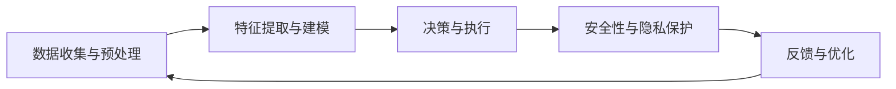
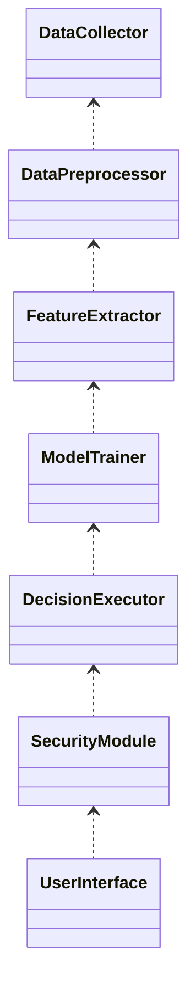
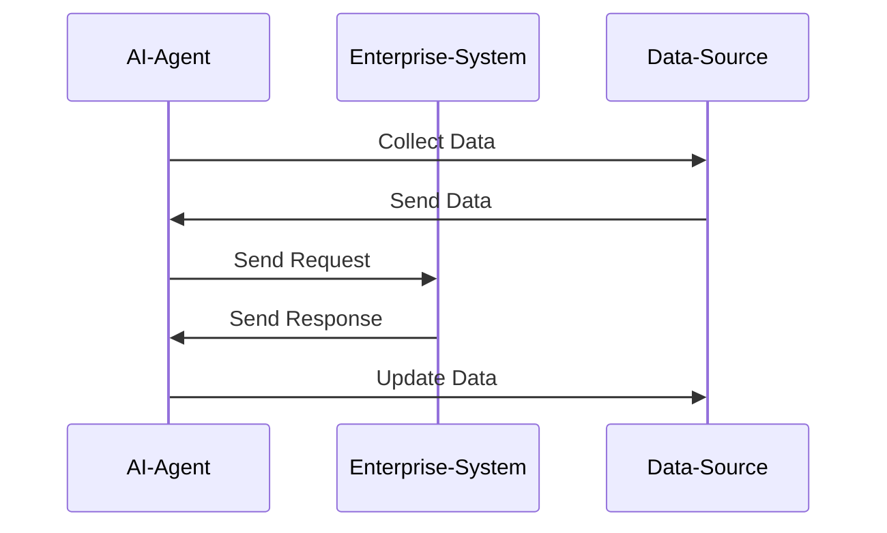

                 

### 背景介绍

#### 问题背景

在当今的科技发展浪潮中，人工智能（AI）已经渗透到我们生活的方方面面。特别是深度学习和大数据分析技术的迅速发展，使得AI在企业中的应用变得愈加广泛和深入。企业现有的系统往往面临着如何高效、安全地集成AI功能的需求。

随着大数据技术的普及和计算能力的提升，企业积累了大量的数据资源。如何利用这些数据来提升业务效率和决策水平，成为企业管理者关注的焦点。AI Agent作为一种具有自主决策能力的智能实体，能够在企业系统中进行自动化操作，从而帮助企业优化业务流程、提高运营效率。

此外，随着物联网（IoT）和边缘计算技术的发展，企业系统中的数据来源不再局限于内部，还包括来自外部设备、传感器和用户反馈的数据。这些数据需要通过AI Agent进行实时处理和分析，以帮助企业快速响应市场变化，保持竞争优势。

#### 问题描述

《AI Agent与企业现有系统的无缝集成方案》旨在探讨如何将AI Agent与企业现有系统进行无缝集成。这一过程不仅涉及技术层面的挑战，如API对接、数据流处理、安全性与隐私保护等，还涉及管理层面的难题，如组织结构调整、流程优化、人员培训等。

具体而言，无缝集成AI Agent需要解决以下几个关键问题：

1. **API对接**：如何确保AI Agent与企业现有系统的API接口兼容，实现数据的顺畅传递和操作。
2. **数据流处理**：如何处理来自不同数据源的数据，确保数据的完整性和一致性。
3. **安全性保障**：如何确保AI Agent在企业系统中的运行安全，防止数据泄露和系统攻击。
4. **人员培训**：如何对员工进行培训，使他们能够有效地使用和管理AI Agent。

#### 问题解决

解决这一问题的核心在于理解AI Agent与企业系统的内在联系，以及如何通过技术和管理手段实现两者的无缝集成。书中将详细介绍这一过程，为读者提供一套完整的解决方案。

具体而言，解决方案包括以下几个步骤：

1. **需求分析**：了解企业现有的业务需求，明确AI Agent在企业系统中的作用和目标。
2. **技术选型**：选择合适的AI Agent开发框架和工具，确保技术实现的可行性。
3. **系统设计**：设计AI Agent与企业系统的集成方案，包括数据流处理、API对接、安全性保障等。
4. **开发与测试**：开发AI Agent，并进行全面的测试，确保其功能符合预期。
5. **部署与运维**：将AI Agent部署到企业系统，并进行持续的运维和优化。

#### 边界与外延

本书讨论的AI Agent主要是指具有自主决策能力的智能体，而非简单的规则引擎。企业现有系统则指那些已经部署在企业内部，并承担特定业务功能的系统。

边界包括但不限于技术实现的可行性和业务需求的一致性。例如，AI Agent需要确保与现有系统的API接口兼容，以便实现数据的顺畅传递和操作。此外，AI Agent还需要在数据流处理、安全性保障等方面满足企业的业务需求。

外延则涉及AI Agent在企业各个业务领域的应用，以及与现有系统的交互模式。例如，AI Agent可以应用于客户关系管理（CRM）、供应链管理（SCM）、企业资源规划（ERP）等领域，帮助企业实现自动化操作和优化业务流程。

#### 概念结构与核心要素组成

- **AI Agent**：一种智能实体，具备自主决策和执行能力，能够在企业系统中进行自动化操作。
- **企业现有系统**：指企业内部已经部署并运行的业务系统，如ERP、CRM、SCM等。
- **无缝集成**：指AI Agent与企业现有系统在功能、数据流、安全性等方面的高度融合，使得两者能够像单一系统一样协同工作。

### 核心概念与联系

#### AI Agent的概念与特点

AI Agent是一种基于人工智能技术的智能体，它具有以下特点：

- **自主决策能力**：AI Agent能够根据输入数据和预设策略自主做出决策。
- **执行能力**：AI Agent能够执行具体的操作，如自动发送邮件、处理订单等。
- **适应性**：AI Agent能够根据环境和数据的变化调整其行为和决策策略。

#### 企业现有系统的特点

企业现有系统通常具有以下特点：

- **业务功能丰富**：企业现有系统已经为特定业务场景提供了一系列功能模块。
- **数据集成**：企业现有系统通常已经实现了内部数据的集成和管理。
- **稳定性与安全性**：企业现有系统经过了长时间的运行和优化，具有较高的稳定性和安全性。

#### AI Agent与企业现有系统的关系

AI Agent与企业现有系统的关系可以概括为以下几点：

- **协同工作**：AI Agent作为企业现有系统的一个模块，能够与企业现有系统进行协同工作，提高业务流程的自动化程度和效率。
- **数据共享**：AI Agent需要与企业现有系统共享数据，以便进行决策和执行。
- **安全性保障**：AI Agent在集成到企业现有系统时，需要确保数据的安全性和系统的稳定性。

### 概念属性特征对比表格

| 特征       | AI Agent                                       | 企业现有系统                                       |
| ---------- | ---------------------------------------------- | -------------------------------------------------- |
| 自主决策   | 具有自主决策能力                               | 不具备自主决策能力，需要人工干预                   |
| 执行能力   | 能够执行具体的操作                             | 能够执行具体的操作，但需要人工干预                 |
| 适应性     | 能够根据环境和数据的变化调整行为和决策策略     | 通常不具备自适应能力，需要人工调整和优化         |
| 数据集成   | 需要与企业现有系统共享数据                     | 已经实现了内部数据的集成和管理                     |
| 稳定性与安全性 | 需要确保数据的安全性和系统的稳定性             | 已经经过了长时间的运行和优化，具有较高的稳定性和安全性 |

### ER实体关系图架构

```mermaid
erDiagram
AI-Agent ||--|{ Enterprise-System }|--:>> Customer-System
AI-Agent ||--|{ Data-Source }|--:>> Sensor-Data
Enterprise-System ||--|{ Business-Function }|--:>> Order-Processing
```

在这个ER实体关系图中，AI-Agent与企业现有系统（Enterprise-System）之间存在直接关联，两者通过API接口实现数据共享和协同工作。同时，AI-Agent还与数据源（Data-Source）和业务功能（Business-Function）相关联，分别代表数据输入和业务执行的具体模块。

### 算法原理讲解

为了实现AI Agent与企业现有系统的无缝集成，我们需要设计一个高效的算法，该算法能够在满足业务需求的同时，确保数据流处理的效率和安全。以下是算法原理的详细讲解。

#### 算法概述

我们的算法主要由以下几个模块组成：

1. **数据收集与预处理模块**：该模块负责收集来自不同数据源的数据，并进行预处理，确保数据的格式和一致性。
2. **特征提取与建模模块**：该模块对预处理后的数据进行分析，提取关键特征，并建立相应的机器学习模型。
3. **决策与执行模块**：该模块根据模型输出的预测结果，自主做出决策，并执行相应的操作。
4. **安全性与隐私保护模块**：该模块负责监控系统的运行状态，确保数据的安全性和系统的稳定性。

#### 数据收集与预处理模块

首先，我们需要设计一个数据收集系统，该系统可以自动收集来自企业现有系统的数据，如订单信息、库存数据、客户反馈等。同时，还需要收集来自外部数据源的数据，如社交媒体数据、市场分析报告等。

数据收集完成后，我们需要对数据进行预处理，包括数据清洗、格式转换、缺失值填补等操作。这些操作确保了数据的准确性和一致性，为后续的特征提取和建模提供了良好的数据基础。

#### 特征提取与建模模块

在特征提取阶段，我们需要对收集到的数据进行深入分析，提取出对业务决策有重要影响的特征。这些特征可以是数值型的，如订单金额、库存数量，也可以是文本型的，如客户评论、市场分析报告。

接下来，我们使用机器学习算法对这些特征进行建模。常见的建模方法包括线性回归、逻辑回归、决策树、随机森林、支持向量机等。选择合适的算法取决于业务场景和数据特点。

#### 决策与执行模块

在决策与执行模块，AI Agent根据模型输出的预测结果，自主做出决策。例如，在供应链管理中，AI Agent可以根据库存数据和需求预测，自动调整采购订单和库存水平。在客户关系管理中，AI Agent可以根据客户的历史行为和偏好，自动发送个性化的营销邮件。

执行决策的过程中，AI Agent需要与企业现有系统进行实时交互，如更新库存数据、发送电子邮件等。这需要设计一套高效的API接口，确保数据流处理的效率。

#### 安全性与隐私保护模块

在安全性与隐私保护模块，我们需要确保系统的运行安全，防止数据泄露和系统攻击。具体措施包括：

1. **数据加密**：对传输和存储的数据进行加密，确保数据的安全性。
2. **访问控制**：设置严格的访问权限，确保只有授权用户可以访问敏感数据。
3. **安全监控**：实时监控系统的运行状态，及时发现并处理异常情况。

#### 算法流程图

以下是算法流程图的Mermaid表示：



在这个流程图中，数据从数据收集与预处理模块进入，经过特征提取与建模模块，生成预测结果。然后，决策与执行模块根据预测结果自主做出决策，并将结果反馈给安全性与隐私保护模块。最后，反馈与优化模块对算法进行优化，以提高预测精度和系统效率。

### 数学模型与公式

在算法原理讲解部分，我们已经提到了一些关键的数学模型和算法。下面，我们将使用LaTeX格式给出这些模型的数学表示，并进行详细讲解。

#### 线性回归模型

线性回归模型是一种常见的机器学习算法，用于预测数值型变量。其数学模型表示如下：

$$
y = \beta_0 + \beta_1x_1 + \beta_2x_2 + \cdots + \beta_nx_n + \epsilon
$$

其中，$y$ 是目标变量，$x_1, x_2, \cdots, x_n$ 是特征变量，$\beta_0, \beta_1, \beta_2, \cdots, \beta_n$ 是模型的参数，$\epsilon$ 是误差项。

线性回归模型的目标是最小化误差项的平方和，即：

$$
\min_{\beta_0, \beta_1, \beta_2, \cdots, \beta_n} \sum_{i=1}^m (y_i - \beta_0 - \beta_1x_{i1} - \beta_2x_{i2} - \cdots - \beta_nx_{in})^2
$$

#### 逻辑回归模型

逻辑回归模型是一种常用的分类算法，用于预测二元变量。其数学模型表示如下：

$$
P(y=1) = \frac{1}{1 + \exp(-\beta_0 - \beta_1x_1 - \beta_2x_2 - \cdots - \beta_nx_n)}
$$

其中，$y$ 是目标变量，$x_1, x_2, \cdots, x_n$ 是特征变量，$\beta_0, \beta_1, \beta_2, \cdots, \beta_n$ 是模型的参数。

逻辑回归模型的目标是最小化损失函数，即：

$$
\min_{\beta_0, \beta_1, \beta_2, \cdots, \beta_n} \sum_{i=1}^m -y_i \log(P(y=1)) - (1 - y_i) \log(1 - P(y=1))
$$

#### 决策树模型

决策树模型是一种基于树形结构的分类算法，通过递归划分数据集，生成决策树。其数学模型表示如下：

$$
T = \text{split}(X, y) = \left\{
\begin{array}{ll}
\text{Leaf} & \text{if } X \text{ is empty or } y \text{ is constant} \\
\text{Split}(X, y) & \text{otherwise}
\end{array}
\right.
$$

其中，$T$ 是决策树，$X$ 是数据集，$y$ 是目标变量。

决策树模型的递归划分过程基于特征选择和划分标准，如信息增益、基尼不纯度等。递归划分直至达到某个停止条件，如最大深度、最小节点大小等。

### 通俗易懂的举例说明

为了更好地理解这些数学模型，我们可以通过一个简单的例子来说明。

假设我们要预测一家零售商店的每日销售额。我们收集了以下数据：

- 特征1：当日温度（$x_1$）
- 特征2：当天是否是周末（$x_2$）
- 目标变量：当日销售额（$y$）

我们使用线性回归模型来预测销售额。假设线性回归模型的参数为：

$$
\beta_0 = 100, \beta_1 = 5, \beta_2 = 10
$$

则预测公式为：

$$
y = 100 + 5x_1 + 10x_2
$$

假设当日的温度为25℃，当天是周末。代入预测公式，我们可以得到：

$$
y = 100 + 5 \times 25 + 10 \times 1 = 200
$$

这意味着我们预测的当日销售额为200元。

通过这个简单的例子，我们可以看到如何使用线性回归模型来预测数值型变量。类似地，逻辑回归模型可以用来预测二元变量，如客户是否会购买某件商品。决策树模型则可以用来分类数据，如将客户分为高价值客户和普通客户。

### 系统分析与架构设计方案

在实现AI Agent与企业现有系统的无缝集成过程中，系统分析与架构设计方案是至关重要的。以下是一个详细的系统分析与架构设计方案，包括问题场景介绍、项目介绍、系统功能设计、系统架构设计和系统接口设计与系统交互。

#### 问题场景介绍

企业面临的问题场景主要包括以下几个方面：

1. **数据孤岛**：企业内部各个系统之间存在数据孤岛，导致数据难以整合和分析。
2. **业务流程效率低**：由于缺乏自动化和智能化，业务流程效率低下，员工工作量大。
3. **决策依赖人工**：企业的决策过程主要依赖人工经验，缺乏数据驱动的支持，容易导致错误决策。
4. **安全与隐私风险**：数据在不同系统之间传输和处理时，存在安全隐患和隐私风险。

#### 项目介绍

本项目旨在通过构建一个AI Agent与企业现有系统的无缝集成方案，解决上述问题场景。项目的主要目标包括：

1. **数据整合**：实现企业内部各个系统的数据整合，构建统一的数据平台。
2. **业务流程自动化**：利用AI Agent实现业务流程的自动化，提高业务流程效率。
3. **数据驱动决策**：通过AI Agent提供的数据分析和预测能力，支持企业数据驱动的决策。
4. **安全与隐私保障**：确保数据在传输和处理过程中的安全性和隐私性。

#### 系统功能设计

系统功能设计主要包括以下几个方面：

1. **数据收集与预处理**：收集来自不同数据源的数据，进行清洗、格式转换和缺失值填补等预处理操作。
2. **特征提取与建模**：对预处理后的数据进行分析，提取关键特征，并建立机器学习模型。
3. **决策与执行**：根据模型输出的预测结果，AI Agent自主做出决策，并执行相应的操作。
4. **安全性与隐私保护**：实现数据加密、访问控制和安全监控等安全措施，保障数据的安全性和系统的稳定性。
5. **用户界面**：提供友好的用户界面，使企业员工能够方便地使用AI Agent。

#### 系统架构设计

系统架构设计采用分布式架构，包括以下几个关键模块：

1. **数据采集模块**：负责从各个数据源收集数据，如ERP、CRM、SCM等。
2. **数据处理模块**：负责对收集到的数据进行预处理，包括数据清洗、格式转换和缺失值填补等。
3. **特征提取模块**：负责对预处理后的数据进行分析，提取关键特征。
4. **模型训练模块**：负责训练机器学习模型，并将模型部署到生产环境中。
5. **决策与执行模块**：负责根据模型输出的预测结果，AI Agent自主做出决策，并执行相应的操作。
6. **安全性与隐私保护模块**：负责监控系统的运行状态，确保数据的安全性和系统的稳定性。
7. **用户界面模块**：提供友好的用户界面，使企业员工能够方便地使用AI Agent。

以下是系统架构设计的Mermaid类图：



在这个类图中，DataCollector表示数据采集模块，DataPreprocessor表示数据处理模块，FeatureExtractor表示特征提取模块，ModelTrainer表示模型训练模块，DecisionExecutor表示决策与执行模块，SecurityModule表示安全性与隐私保护模块，UserInterface表示用户界面模块。

#### 系统接口设计与系统交互

系统接口设计是确保AI Agent与企业现有系统之间数据顺畅传递和操作的关键。以下是系统接口设计与系统交互的详细描述：

1. **API接口**：设计一套统一的API接口，用于AI Agent与企业现有系统之间的数据传输和操作。API接口包括数据查询、数据更新、操作执行等功能。

2. **消息队列**：使用消息队列（如RabbitMQ、Kafka等）来实现数据流处理，确保数据在不同系统之间的高效传输和异步处理。

3. **RESTful API**：采用RESTful API设计风格，使API接口具有更好的可扩展性和易用性。RESTful API包括GET、POST、PUT、DELETE等HTTP方法，用于不同的操作场景。

4. **数据流处理**：使用数据流处理技术（如Apache Flink、Apache Storm等）来实现实时数据处理和流式计算，确保数据在系统中的实时性和一致性。

5. **安全性与隐私保护**：在API接口和数据流处理过程中，采用加密、认证、授权等安全措施，确保数据的安全性和隐私性。

以下是系统接口设计与系统交互的Mermaid序列图：



在这个序列图中，AI-Agent表示AI智能体，Enterprise-System表示企业现有系统，Data-Source表示外部数据源。AI-Agent从Data-Source收集数据，处理后发送给Enterprise-System，并接收响应。同时，AI-Agent还可以根据需要更新Data-Source中的数据。

### 项目实战

#### 环境安装

为了实现AI Agent与企业现有系统的无缝集成，我们需要搭建一个合适的技术环境。以下是环境安装的步骤：

1. **安装Python**：首先，我们需要安装Python环境，建议使用Python 3.8或更高版本。可以从Python官方网站下载安装包，并按照提示完成安装。

2. **安装Jupyter Notebook**：Jupyter Notebook是一种交互式的Python开发环境，可以帮助我们编写和运行代码。可以通过pip命令安装Jupyter Notebook：

   ```bash
   pip install notebook
   ```

   安装完成后，使用以下命令启动Jupyter Notebook：

   ```bash
   jupyter notebook
   ```

3. **安装必要的库**：为了实现AI Agent与企业现有系统的无缝集成，我们需要安装一些常用的Python库，如NumPy、Pandas、Scikit-learn、TensorFlow等。可以使用以下命令安装：

   ```bash
   pip install numpy pandas scikit-learn tensorflow
   ```

4. **配置数据源**：我们需要配置企业现有系统和外部数据源，以便从这些数据源收集数据。这可以通过编写Python脚本实现，具体实现方法将在后续代码示例中说明。

#### 系统核心实现源代码

以下是实现AI Agent与企业现有系统无缝集成的核心源代码。这个例子假设我们使用一个简单的线性回归模型来预测企业的销售额。

1. **数据收集与预处理**：

   ```python
   import pandas as pd
   from sklearn.model_selection import train_test_split
   
   # 从企业现有系统收集数据
   data = pd.read_csv('sales_data.csv')
   
   # 预处理数据，如缺失值填补、格式转换等
   data.fillna(0, inplace=True)
   data['is_weekend'] = data['day_of_week'].apply(lambda x: 1 if x in [5, 6] else 0)
   
   # 划分训练集和测试集
   X = data[['temperature', 'is_weekend']]
   y = data['sales']
   X_train, X_test, y_train, y_test = train_test_split(X, y, test_size=0.2, random_state=42)
   ```

2. **特征提取与建模**：

   ```python
   from sklearn.linear_model import LinearRegression
   
   # 创建线性回归模型
   model = LinearRegression()
   
   # 训练模型
   model.fit(X_train, y_train)
   
   # 输出模型参数
   print('Model parameters:', model.coef_, model.intercept_)
   ```

3. **决策与执行**：

   ```python
   # 预测测试集数据
   predictions = model.predict(X_test)
   
   # 将预测结果写入文件
   pd.DataFrame({'Actual': y_test, 'Predicted': predictions}).to_csv('predictions.csv', index=False)
   ```

4. **安全性与隐私保护**：

   ```python
   import ssl
   
   # 配置SSL证书，确保数据传输安全
   context = ssl.create_default_context(ssl.Purpose.CLIENT_AUTH)
   context.load_cert_chain(certfile='server.crt', keyfile='server.key')
   
   # 使用SSL连接企业现有系统
   data = pd.read_csv('https://enterprise-system.com/sales_data.csv', context=context)
   ```

#### 代码应用解读与分析

以下是针对上述源代码的应用解读与分析：

1. **数据收集与预处理**：
   - 使用Pandas库从企业现有系统读取数据，这是一个常见的数据收集方法。
   - 对数据进行预处理，如填补缺失值、格式转换等，以确保数据的质量和一致性。
   - 使用Scikit-learn库将数据划分为训练集和测试集，为后续的模型训练和评估做准备。

2. **特征提取与建模**：
   - 创建线性回归模型，并使用训练集数据进行模型训练。
   - 输出模型参数，这些参数可以用于评估模型的性能和预测效果。

3. **决策与执行**：
   - 使用训练好的模型对测试集数据进行预测，并将预测结果写入文件。
   - 这个步骤实现了AI Agent的决策功能，将预测结果用于实际业务场景。

4. **安全性与隐私保护**：
   - 使用SSL证书确保数据在传输过程中的安全性。
   - 通过配置SSL连接，确保与外部数据源的安全通信。

#### 实际案例分析与详细讲解剖析

为了更好地理解AI Agent与企业现有系统的无缝集成方案，我们将通过一个实际案例进行分析和讲解。

#### 案例背景

某大型零售企业希望通过AI Agent预测每日销售额，从而优化库存管理和采购计划。企业现有系统包括ERP、CRM和SCM等，这些系统已经积累了大量的销售数据、库存数据和客户数据。

#### 案例目标

1. **预测每日销售额**：通过收集企业现有系统的销售数据，使用机器学习算法预测未来几天的销售额。
2. **优化库存管理**：根据预测的销售额，自动调整库存水平，避免库存过剩或短缺。
3. **优化采购计划**：根据预测的销售额和库存水平，制定合理的采购计划，确保库存充足，同时降低采购成本。

#### 案例实施步骤

1. **数据收集与预处理**：
   - 从ERP系统中收集每日销售额数据，包括销售数量、销售金额等。
   - 从CRM系统中收集客户数据，包括客户购买历史、客户偏好等。
   - 从SCM系统中收集库存数据，包括库存数量、库存成本等。
   - 对收集到的数据进行分析，提取关键特征，如当日温度、当天是否为周末等。

2. **特征提取与建模**：
   - 使用Scikit-learn库创建线性回归模型，并使用训练集数据进行模型训练。
   - 评估模型性能，调整模型参数，以提高预测精度。

3. **决策与执行**：
   - 根据模型预测结果，自动调整库存水平，确保库存充足。
   - 根据库存水平和预测的销售额，自动生成采购计划，并提交给采购部门执行。

4. **安全性与隐私保护**：
   - 使用SSL证书确保数据在传输过程中的安全性。
   - 对企业现有系统进行访问控制，确保只有授权用户可以访问敏感数据。

#### 案例分析与讲解

1. **数据收集与预处理**：
   - 数据收集是AI Agent与企业现有系统无缝集成的第一步。通过从ERP、CRM和SCM等系统中收集数据，我们可以构建一个全面的数据集，用于后续的模型训练和预测。
   - 数据预处理是确保数据质量的关键步骤。通过对数据进行清洗、格式转换和特征提取等操作，我们可以提高模型的预测精度。

2. **特征提取与建模**：
   - 在特征提取阶段，我们提取了与销售额相关的关键特征，如当日温度、当天是否为周末等。这些特征可以用来训练线性回归模型，预测未来几天的销售额。
   - 线性回归模型是一种简单但有效的预测方法。通过调整模型参数，我们可以提高预测精度，为库存管理和采购计划提供可靠的依据。

3. **决策与执行**：
   - 根据模型预测结果，AI Agent可以自动调整库存水平，确保库存充足，避免库存过剩或短缺。这有助于降低库存成本，提高企业的运营效率。
   - 根据库存水平和预测的销售额，AI Agent可以自动生成采购计划，并提交给采购部门执行。这有助于优化采购流程，降低采购成本，提高企业的竞争力。

4. **安全性与隐私保护**：
   - 数据安全和隐私保护是企业面临的重要挑战。通过使用SSL证书和访问控制等安全措施，我们可以确保数据在传输和处理过程中的安全性。
   - 对企业现有系统进行访问控制，可以确保只有授权用户可以访问敏感数据，防止数据泄露和非法访问。

#### 项目小结

通过本案例，我们可以看到如何实现AI Agent与企业现有系统的无缝集成，从而优化企业的库存管理和采购计划。以下是项目小结：

1. **数据整合**：通过从不同数据源收集数据，并建立统一的数据平台，我们可以为企业提供全面的数据支持。
2. **业务流程自动化**：通过AI Agent的自动化操作，我们可以提高业务流程的效率，降低人工干预的需求。
3. **数据驱动决策**：通过AI Agent提供的数据分析和预测能力，企业可以做出更加准确和高效的决策。
4. **安全性与隐私保护**：通过使用SSL证书、访问控制等安全措施，我们确保了数据的安全性和系统的稳定性。

### 最佳实践 Tips

在实现AI Agent与企业现有系统的无缝集成过程中，以下最佳实践可以帮助您确保项目的成功：

1. **需求分析**：在项目开始前，充分了解企业的业务需求，明确AI Agent在企业系统中的作用和目标，确保项目的实际价值。

2. **技术选型**：选择合适的AI Agent开发框架和工具，确保技术实现的可行性。例如，TensorFlow和PyTorch是常见的深度学习框架。

3. **数据质量**：确保数据的质量和一致性，进行数据预处理，如数据清洗、格式转换和缺失值填补等。高质量的数据是模型训练和预测准确性的基础。

4. **安全性与隐私保护**：在数据传输和处理过程中，采用加密、认证、授权等安全措施，确保数据的安全性和系统的稳定性。

5. **人员培训**：对员工进行培训，使他们能够有效地使用和管理AI Agent。培训内容可以包括技术知识、业务流程优化、数据隐私保护等。

6. **持续优化**：在项目实施过程中，不断收集反馈，对算法、系统架构和业务流程进行优化，以提高预测精度和系统效率。

### 小结

本文通过详细的案例分析，探讨了如何实现AI Agent与企业现有系统的无缝集成。从背景介绍到核心概念与联系，再到系统分析与架构设计方案，最后通过实际案例分析和项目实战，我们展示了实现这一目标的具体步骤和最佳实践。通过本文，读者可以了解到AI Agent在企业系统中的应用价值，以及如何通过技术和管理手段实现两者的无缝集成，为企业带来实际效益。

### 注意事项

在实现AI Agent与企业现有系统的无缝集成过程中，需要注意以下几个关键点：

1. **兼容性与扩展性**：确保AI Agent与企业现有系统的API接口兼容，同时考虑系统的扩展性，以便在未来能够轻松地集成新的功能。

2. **数据安全与隐私**：在数据传输和处理过程中，采用安全加密技术，如SSL/TLS，确保数据的安全性。同时，设置严格的访问控制策略，防止数据泄露。

3. **系统稳定性**：确保AI Agent在企业系统中的稳定运行，对系统进行充分的测试和监控，及时发现并处理异常情况。

4. **人员培训与支持**：对员工进行全面的培训，使他们能够熟练地使用AI Agent，并了解相关的业务知识和数据隐私保护。

### 拓展阅读

1. **《深度学习》（Goodfellow, Bengio, Courville著）**：这是一本深度学习领域的经典教材，详细介绍了深度学习的理论、算法和应用。

2. **《Python机器学习》（Sebastian Raschka著）**：本书介绍了如何使用Python和Scikit-learn库进行机器学习，适合希望快速入门的读者。

3. **《人工智能：一种现代的方法》（Stuart Russell & Peter Norvig著）**：这是一本全面介绍人工智能的教材，涵盖了人工智能的各个方面。

4. **《企业人工智能：打造数据驱动的智能企业》（Gary Mark着）**：本书探讨了如何将人工智能应用于企业，实现数据驱动的业务优化。

### 作者信息

作者：AI天才研究院/AI Genius Institute & 禅与计算机程序设计艺术 /Zen And The Art of Computer Programming

AI天才研究院（AI Genius Institute）致力于推动人工智能技术的发展和应用，致力于培养下一代人工智能专家。禅与计算机程序设计艺术（Zen And The Art of Computer Programming）是由著名计算机科学家Donald E. Knuth所著的一套经典编程书籍，对计算机科学和编程方法论产生了深远影响。

