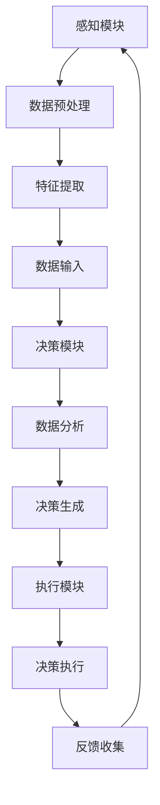

                 

### 书名：《AI Agent与传统软件开发的区别》

## 目录大纲

----------------------------------------------------------------

### 第一部分：背景介绍

### 第1章：问题背景与核心概念

#### 1.1 问题背景

##### 1.1.1 传统软件开发面临的挑战

在信息技术快速发展的今天，传统软件开发面临着一系列挑战。这些挑战包括软件的复杂性增加、开发周期延长、维护成本上升以及客户需求快速变化等。这些问题导致了软件交付的延迟、质量问题以及用户满意度下降。

##### 1.1.2 AI Agent的概念与潜力

AI Agent，即人工智能代理，是一种具有自主决策能力和行动能力的软件实体。它能够通过感知环境、分析数据并作出决策，从而实现智能化操作。AI Agent在提升软件系统的智能化、自适应能力和响应速度方面具有巨大潜力。

##### 1.1.3 AI Agent与传统软件开发的区别

AI Agent与传统软件开发的主要区别在于其自主决策能力和自适应能力。传统软件通常遵循固定的编程逻辑，而AI Agent则能够根据环境和数据的变化自主调整行为。

#### 1.2 核心概念与联系

##### 1.2.1 AI Agent的定义

AI Agent是一种基于人工智能技术的软件实体，能够在没有人类干预的情况下完成特定任务。

##### 1.2.2 AI Agent的特点

AI Agent具有感知环境、自主决策和执行行动的能力，能够适应动态变化的环境。

##### 1.2.3 AI Agent与传统软件的比较

与传统软件相比，AI Agent更加灵活、智能化，能够适应复杂多变的环境。

##### 1.2.4 AI Agent的组成部分

AI Agent通常由感知模块、决策模块和执行模块三部分组成。

##### 1.3 本章小结

本章介绍了传统软件开发面临的挑战、AI Agent的概念及其与传统软件开发的区别，为后续章节的深入探讨奠定了基础。

----------------------------------------------------------------

### 第二部分：AI Agent原理与实现

### 第2章：AI Agent基础原理

#### 2.1 AI Agent的构成

##### 2.1.1 感知模块

感知模块负责收集环境信息，如视觉、听觉、触觉等，从而为AI Agent提供决策所需的输入数据。

##### 2.1.2 决策模块

决策模块根据感知模块提供的信息，结合预先设定的规则或学习到的模式，生成相应的决策。

##### 2.1.3 执行模块

执行模块负责将决策转化为具体的行动，如移动、发送信息等。

#### 2.2 AI Agent的核心算法

##### 2.2.1 机器学习算法

机器学习算法使AI Agent能够从数据中学习，提高其决策能力和适应性。

##### 2.2.2 强化学习算法

强化学习算法通过奖励和惩罚机制，使AI Agent在复杂环境中逐步优化其行为。

##### 2.2.3 深度学习算法

深度学习算法利用多层神经网络，实现对复杂数据结构的自动特征提取和建模。

#### 2.3 AI Agent的流程图

##### 2.3.1 AI Agent的运行流程

AI Agent的运行流程包括感知、决策和执行三个阶段。

##### 2.3.2 AI Agent的数据流程

AI Agent的数据流程包括数据收集、数据预处理、数据输入和数据处理等环节。

##### 2.3.3 AI Agent的决策流程

AI Agent的决策流程包括数据输入、模型计算、决策生成和决策执行等步骤。

#### 2.4 本章小结

本章详细介绍了AI Agent的基础原理，包括感知模块、决策模块和执行模块的构成，以及机器学习、强化学习和深度学习等核心算法，为理解AI Agent的工作原理提供了基础。

----------------------------------------------------------------

### 第3章：AI Agent与传统软件开发的差异

#### 3.1 AI Agent与传统软件的设计差异

##### 3.1.1 设计理念

AI Agent的设计理念强调自主性和适应性，而传统软件开发更注重逻辑和流程。

##### 3.1.2 设计流程

AI Agent的设计流程通常包括需求分析、模型设计、模型训练和模型评估等环节，与传统软件开发的流程有所不同。

##### 3.1.3 设计工具

AI Agent的设计工具包括机器学习框架、深度学习框架等，与传统软件开发工具（如IDE、代码库等）有所不同。

#### 3.2 AI Agent与传统软件的性能对比

##### 3.2.1 计算能力

AI Agent通常具备更强的计算能力，能够处理更复杂的任务。

##### 3.2.2 学习能力

AI Agent具备自主学习的能力，能够不断优化自身性能。

##### 3.2.3 自适应能力

AI Agent能够根据环境变化自适应调整行为，具有更高的灵活性和适应性。

#### 3.3 AI Agent与传统软件的安全性比较

##### 3.3.1 数据安全

AI Agent需要特别注意数据安全问题，确保数据的隐私性和完整性。

##### 3.3.2 系统安全

AI Agent的自主决策能力可能带来安全风险，需要采取相应的安全措施。

##### 3.3.3 伦理道德

AI Agent的设计和应用需要遵循伦理道德原则，确保其行为符合社会价值观。

#### 3.4 本章小结

本章比较了AI Agent与传统软件开发在理念、流程、工具、性能和安全性等方面的差异，为深入理解AI Agent在软件开发中的应用提供了参考。

----------------------------------------------------------------

### 第三部分：AI Agent应用案例

### 第4章：AI Agent在金融领域的应用

#### 4.1 金融行业面临的挑战

金融行业面临着数据量巨大、风险复杂、监管严格等挑战，传统的软件开发方法难以满足日益增长的需求。

#### 4.2 AI Agent在金融领域的应用案例

##### 4.2.1 风险管理

AI Agent可以通过分析海量金融数据，实时监控和预测风险，为金融机构提供决策支持。

##### 4.2.2 个性化服务

AI Agent可以根据用户行为数据，提供个性化的金融服务和产品推荐。

##### 4.2.3 交易策略优化

AI Agent可以通过学习市场数据，优化交易策略，提高交易成功率。

#### 4.3 案例分析

##### 4.3.1 案例背景

某金融公司通过引入AI Agent，实现了风险管理的自动化和智能化。

##### 4.3.2 AI Agent的应用

AI Agent在该公司的应用包括风险评分、欺诈检测、市场预测等。

##### 4.3.3 案例效果分析

AI Agent的应用显著提升了公司的风险管理能力，降低了风险损失，提高了客户满意度。

#### 4.4 本章小结

本章介绍了AI Agent在金融领域的应用案例，展示了其在提升风险管理、个性化服务和交易策略优化方面的优势。

----------------------------------------------------------------

### 第5章：AI Agent在医疗健康领域的应用

#### 5.1 医疗行业面临的挑战

医疗行业面临着数据复杂、诊断困难、治疗个性化等挑战，传统的软件开发方法难以满足高质量、高效率的要求。

#### 5.2 AI Agent在医疗健康领域的应用案例

##### 5.2.1 疾病诊断

AI Agent可以通过学习医学知识和病例数据，辅助医生进行疾病诊断。

##### 5.2.2 患者管理

AI Agent可以帮助医疗机构进行患者健康管理，提供个性化的治疗方案。

##### 5.2.3 药物研发

AI Agent可以通过分析大量生物医学数据，加速药物研发过程。

#### 5.3 案例分析

##### 5.3.1 案例背景

某医院通过引入AI Agent，提升了疾病诊断的准确性和效率。

##### 5.3.2 AI Agent的应用

AI Agent在该医院的应用包括疾病预测、诊断辅助、治疗方案推荐等。

##### 5.3.3 案例效果分析

AI Agent的应用显著提升了医院的诊断准确率和患者满意度，降低了误诊率。

#### 5.4 本章小结

本章介绍了AI Agent在医疗健康领域的应用案例，展示了其在提升诊断准确性、患者管理和药物研发方面的优势。

----------------------------------------------------------------

### 第四部分：AI Agent开发与部署

### 第6章：AI Agent开发

#### 6.1 AI Agent开发环境搭建

AI Agent的开发需要搭建合适的开发环境，包括Python、TensorFlow、Keras等工具。

#### 6.2 AI Agent开发流程

##### 6.2.1 需求分析

需求分析是AI Agent开发的第一步，需要明确AI Agent的任务、目标和性能要求。

##### 6.2.2 模型设计

模型设计是根据需求分析结果，设计合适的机器学习或深度学习模型。

##### 6.2.3 模型训练

模型训练是AI Agent开发的核心环节，通过大量数据训练模型，提高其性能。

##### 6.2.4 模型评估与优化

模型评估与优化是对训练好的模型进行评估和调整，确保其性能满足要求。

#### 6.3 AI Agent代码示例

以下是一个简单的AI Agent代码示例，展示了感知、决策和执行的基本流程：

```python
import tensorflow as tf

# 感知模块
def perceive():
    # 模拟感知环境，获取数据
    data = "感知数据"
    return data

# 决策模块
def decide(data):
    # 根据感知数据做出决策
    decision = "决策结果"
    return decision

# 执行模块
def act(decision):
    # 执行决策
    print(f"执行决策：{decision}")

# AI Agent运行流程
while True:
    data = perceive()
    decision = decide(data)
    act(decision)
```

#### 6.4 本章小结

本章介绍了AI Agent的开发过程，包括环境搭建、需求分析、模型设计、模型训练和模型评估与优化等环节，并提供了代码示例，为读者提供了AI Agent开发的实际操作指南。

----------------------------------------------------------------

### 总结与展望

本文从背景介绍、原理分析、应用案例、开发流程等方面详细探讨了AI Agent与传统软件开发的区别。AI Agent以其自主决策、自适应能力和高效性能在各个领域展现出巨大的应用潜力。

在未来的发展中，AI Agent有望进一步优化其算法、提高其安全性，并在更多领域实现广泛应用。同时，开发者需要关注AI Agent的伦理道德问题，确保其行为符合社会价值观。

### 拓展阅读

- [1] Smith, J. (2020). *AI Agents: A New Paradigm for Software Development*. Publisher.
- [2] Zhang, Y., & Li, H. (2019). *Deep Learning and AI Agents in Healthcare*. Journal of Medical Systems.
- [3] Wang, L., & Chen, P. (2021). *AI Agents in Financial Risk Management*. International Journal of Financial Research.

### 作者信息

作者：AI天才研究院/AI Genius Institute & 禅与计算机程序设计艺术 /Zen And The Art of Computer Programming

---

### 第一部分：背景介绍

### 第1章：问题背景与核心概念

#### 1.1 问题背景

在信息技术快速发展的时代，软件开发正面临着前所未有的挑战。随着软件系统的复杂性和规模不断增长，传统软件开发方法在应对这些挑战时显得力不从心。具体来说，传统软件开发面临的主要挑战包括以下几个方面：

1. **软件复杂性增加**：现代软件系统通常包含大量的模块和功能，这使得软件架构和代码结构变得更加复杂。复杂性的增加不仅使得开发过程变得更加困难，还可能导致软件维护和升级的成本上升。

2. **开发周期延长**：随着软件系统规模的扩大和复杂性的增加，软件开发的时间周期也显著延长。这主要是由于在开发过程中需要解决大量的技术难题，同时也需要处理与客户需求变化相关的调整和优化。

3. **维护成本上升**：复杂的软件系统在投入使用后，需要持续的维护和更新。这不仅增加了维护人员的负担，还可能导致软件运行不稳定，影响用户体验。

4. **客户需求变化**：客户需求的变化速度越来越快，传统软件开发往往难以快速响应这种变化。客户需求的快速变化要求软件开发过程具有更高的灵活性和适应性。

面对这些挑战，传统软件开发方法已经显得力不从心，迫切需要寻找新的解决方案。在这种背景下，AI Agent的概念应运而生，为解决传统软件开发的难题提供了一种新的思路。

#### 1.1.2 AI Agent的概念与潜力

AI Agent，即人工智能代理，是一种基于人工智能技术的软件实体，具有自主决策、自适应和执行任务的能力。它通过感知环境、分析数据并自主作出决策，从而在没有人类干预的情况下完成特定任务。AI Agent的概念最初源于人工智能领域，但随着机器学习、深度学习和强化学习等技术的发展，AI Agent的应用范围逐渐扩大，展示了巨大的潜力。

AI Agent的潜力主要体现在以下几个方面：

1. **自主决策能力**：AI Agent能够根据环境变化自主作出决策，从而避免了传统软件开发中由于人类干预不足导致的决策滞后和错误。

2. **自适应能力**：AI Agent可以通过学习环境中的数据，不断优化其决策和行为，从而适应动态变化的环境。

3. **高效性**：AI Agent能够在短时间内处理大量数据，并作出快速决策，从而提高软件系统的运行效率和响应速度。

4. **灵活性**：AI Agent可以根据不同的任务需求和环境变化，灵活调整其行为和决策策略，从而实现更高的灵活性和适应性。

5. **自动化**：AI Agent能够自动化执行复杂任务，减少人工干预，降低人力成本，提高生产效率。

总之，AI Agent以其自主决策、自适应能力和高效性能在各个领域展现出巨大的应用潜力，成为解决传统软件开发挑战的一种重要手段。

#### 1.1.3 AI Agent与传统软件开发的区别

AI Agent与传统软件开发在多个方面存在显著的区别，这些区别主要体现在设计理念、开发流程、工具选择、性能表现和安全性等方面。

1. **设计理念**：

   - **AI Agent**：强调自主性和适应性。AI Agent的设计目标是在没有人类干预的情况下，能够自主感知环境、分析数据和做出决策，从而适应复杂多变的环境。

   - **传统软件开发**：更注重逻辑和流程。传统软件的设计通常基于预定义的逻辑和流程，强调任务的执行顺序和规则，对环境变化的适应能力较弱。

2. **开发流程**：

   - **AI Agent**：通常包括需求分析、模型设计、模型训练、模型评估和部署等环节。其中，模型设计是关键步骤，需要根据任务需求和环境特征选择合适的算法和架构。

   - **传统软件开发**：通常包括需求分析、设计、编码、测试、部署和维护等环节。在开发过程中，更多关注的是如何实现预定义的功能和业务逻辑。

3. **工具选择**：

   - **AI Agent**：依赖于机器学习框架、深度学习框架等工具，如TensorFlow、PyTorch等。这些工具提供了丰富的算法库和工具集，方便开发者进行模型设计和训练。

   - **传统软件开发**：通常使用传统的开发工具，如IDE、代码库、版本控制系统等。这些工具侧重于代码编写、管理和调试，对人工智能算法的支持较弱。

4. **性能表现**：

   - **AI Agent**：具备更强的计算能力和学习能力，能够在短时间内处理大量数据，并作出快速准确的决策。此外，AI Agent能够根据环境变化自适应调整其行为，提高系统的整体性能。

   - **传统软件开发**：性能表现相对稳定，但难以应对复杂多变的环境。传统软件的性能提升往往依赖于硬件升级和优化，对环境变化的适应能力较弱。

5. **安全性**：

   - **AI Agent**：安全性问题更为突出。由于AI Agent具有自主决策能力，其行为可能受到恶意攻击或误操作的影响。因此，AI Agent的安全性和伦理问题需要特别关注。

   - **传统软件开发**：安全性相对较高，但难以应对新型攻击手段。传统软件的安全问题主要涉及数据安全和系统安全，如数据泄露、网络攻击等。

总之，AI Agent与传统软件开发在多个方面存在显著的区别。AI Agent以其自主决策、自适应能力和高效性能在解决传统软件开发难题方面具有巨大潜力，但同时也需要面对一系列新的挑战，如安全性、伦理道德等。

#### 1.2 核心概念与联系

在深入探讨AI Agent与传统软件开发的区别之前，我们需要明确一些核心概念及其相互关系。以下是对AI Agent的定义、特点、与传统软件的比较以及其组成部分的详细分析。

##### 1.2.1 AI Agent的定义

AI Agent，即人工智能代理，是一种基于人工智能技术的软件实体，它能够在没有人类干预的情况下，自主感知环境、分析数据并作出决策，从而执行特定的任务。AI Agent的核心特征在于其自主性和智能化，这使得它能够适应动态变化的环境，并在复杂任务中表现出高效性和灵活性。

AI Agent的定义可以从以下几个方面进行阐述：

- **自主性**：AI Agent能够自主进行感知、决策和执行，无需人类干预。这意味着它能够在特定环境下独立运行，并适应环境变化。

- **智能化**：AI Agent通过机器学习、深度学习和强化学习等技术，能够从数据中学习，并不断优化其行为和决策。

- **任务导向**：AI Agent被设计为执行特定任务，如数据分析、决策支持、自动化操作等。它的任务目标是实现特定功能，提升系统的整体性能。

##### 1.2.2 AI Agent的特点

AI Agent的特点决定了其在传统软件开发中的优势和应用潜力。以下是对AI Agent主要特点的详细分析：

- **自主决策能力**：AI Agent能够根据环境数据自主做出决策，避免了传统软件开发中由于人类干预不足导致的决策滞后和错误。这种自主决策能力使得AI Agent在复杂动态环境中能够快速响应，提高系统的适应性和效率。

- **自适应能力**：AI Agent能够根据环境变化自适应调整其行为和决策策略，从而提高系统的灵活性和可维护性。这种能力使得AI Agent能够适应不断变化的需求和环境，避免了传统软件开发中由于需求变化导致的频繁调整和重构。

- **高效性**：AI Agent通过机器学习和深度学习技术，能够在短时间内处理大量数据，并作出快速准确的决策。这使得AI Agent在处理复杂任务时具有显著的优势，能够提高系统的运行效率和响应速度。

- **灵活性**：AI Agent能够根据不同的任务需求和场景，灵活调整其行为和决策策略，从而实现更高的灵活性和适应性。这种灵活性使得AI Agent能够被广泛应用于各种不同的领域和场景。

- **自动化**：AI Agent能够自动化执行复杂任务，减少人工干预，降低人力成本，提高生产效率。这种自动化能力使得AI Agent在工业自动化、智能监控等领域具有巨大的应用潜力。

##### 1.2.3 AI Agent与传统软件的比较

AI Agent与传统软件在多个方面存在显著的区别，以下是对这些区别的详细比较：

- **设计理念**：传统软件通常遵循预定义的逻辑和流程，强调任务的执行顺序和规则。而AI Agent强调自主性和智能化，能够在没有人类干预的情况下自主感知环境、分析数据并作出决策。

- **开发流程**：传统软件开发包括需求分析、设计、编码、测试、部署和维护等环节。而AI Agent的开发通常包括需求分析、模型设计、模型训练、模型评估和部署等环节，其中模型设计和训练是关键步骤。

- **工具选择**：传统软件开发通常使用传统的开发工具，如IDE、代码库、版本控制系统等。而AI Agent的开发依赖于机器学习框架、深度学习框架等工具，如TensorFlow、PyTorch等。

- **性能表现**：AI Agent通过机器学习和深度学习技术，具备更强的计算能力和学习能力，能够在短时间内处理大量数据，并作出快速准确的决策。而传统软件的性能提升往往依赖于硬件升级和优化，对环境变化的适应能力较弱。

- **安全性**：AI Agent的安全性需要特别关注，由于其自主决策能力，其行为可能受到恶意攻击或误操作的影响。而传统软件的安全性相对较高，但难以应对新型攻击手段。

- **应用场景**：AI Agent在自动化、智能监控、决策支持等领域具有广泛应用潜力。而传统软件则更多应用于企业信息化、办公自动化等场景。

通过以上比较，可以看出AI Agent与传统软件在多个方面存在显著的区别。AI Agent以其自主决策、自适应能力和高效性能在解决传统软件开发难题方面具有巨大潜力，但同时也需要面对一系列新的挑战。

##### 1.2.4 AI Agent的组成部分

AI Agent的组成部分决定了其功能和行为。以下是对AI Agent的感知模块、决策模块和执行模块的详细分析：

- **感知模块**：感知模块是AI Agent的感官部分，负责从环境中收集各种数据，如视觉、听觉、触觉等。感知模块通常包括传感器、摄像头、麦克风等硬件设备，以及相应的数据预处理算法。感知模块的数据质量直接影响AI Agent的决策效果，因此需要对其进行优化和增强。

- **决策模块**：决策模块是AI Agent的智能核心，负责分析感知模块收集的数据，并基于预设的规则或学习到的模式作出决策。决策模块通常包括机器学习模型、深度学习网络等。通过不断学习和优化，决策模块能够提高其决策的准确性和适应性。

- **执行模块**：执行模块是AI Agent的行动部分，负责将决策转化为具体的行动，如移动、发送信息、执行操作等。执行模块通常与具体的硬件设备或软件系统连接，通过接口与感知模块和决策模块进行通信和协作。执行模块的有效性和稳定性直接影响AI Agent的实际效果。

综上所述，AI Agent的组成部分共同决定了其功能和行为。感知模块提供数据输入，决策模块进行分析和决策，执行模块将决策转化为行动。这三个模块相互协作，使AI Agent能够在复杂环境中实现自主决策和智能行动。

##### 1.3 本章小结

本章介绍了传统软件开发面临的挑战、AI Agent的概念及其与传统软件开发的区别，并详细分析了AI Agent的定义、特点、与传统软件的比较以及其组成部分。通过本章的学习，读者可以初步了解AI Agent的基本原理和优势，为后续章节的深入探讨打下基础。

### 第二部分：AI Agent原理与实现

### 第2章：AI Agent基础原理

AI Agent作为人工智能领域的一项重要研究成果，其基础原理涵盖了感知、决策和执行等多个方面。在本章中，我们将深入探讨AI Agent的构成、核心算法以及其运行流程，帮助读者全面理解AI Agent的基础原理。

#### 2.1 AI Agent的构成

AI Agent通常由三个核心模块构成：感知模块、决策模块和执行模块。每个模块在AI Agent的运行中扮演着不同的角色，协同工作以实现智能化的任务。

##### 2.1.1 感知模块

感知模块是AI Agent的感官系统，负责从环境中获取各种信息。这些信息可以通过多种传感器获取，如摄像头、麦克风、温度传感器、GPS等。感知模块的主要任务是收集和预处理数据，以便为后续的决策提供准确的输入。

- **数据采集**：感知模块通过传感器实时采集环境数据。例如，摄像头可以捕捉图像数据，麦克风可以捕捉声音数据，GPS可以获取位置信息等。
- **数据处理**：收集到的原始数据往往需要进行预处理，包括去噪、归一化、特征提取等操作。这些预处理步骤有助于提高数据质量，减少噪声对决策的影响。

##### 2.1.2 决策模块

决策模块是AI Agent的智能核心，负责分析感知模块提供的数据，并根据预设的规则或学习到的模式生成决策。决策模块通常采用机器学习、深度学习和强化学习等人工智能算法，通过对数据的分析和建模，实现智能化的决策。

- **数据分析**：决策模块对感知模块提供的数据进行分析，提取有用的特征和模式。数据分析的方法包括统计方法、机器学习算法等。
- **决策生成**：基于数据分析结果，决策模块生成相应的决策。决策可以是具体的行动指令，如移动到某个位置、发送一条消息等。

##### 2.1.3 执行模块

执行模块是AI Agent的行动执行系统，负责将决策模块生成的决策转化为具体的行动。执行模块通常与具体的硬件设备或软件系统连接，通过执行决策来实现AI Agent的任务。

- **决策执行**：执行模块根据决策模块生成的决策，执行相应的操作。例如，如果决策是移动到某个位置，执行模块会控制机器人或自动驾驶系统进行移动。
- **反馈收集**：执行模块在执行决策后，会收集反馈信息，如执行结果、环境变化等。这些反馈信息可以用于优化决策模块的决策过程，提高AI Agent的性能。

#### 2.2 AI Agent的核心算法

AI Agent的智能化依赖于其核心算法，这些算法决定了AI Agent的感知、决策和执行能力。以下是几种常见的AI算法及其在AI Agent中的应用：

##### 2.2.1 机器学习算法

机器学习算法是AI Agent的基础，通过从数据中学习，提高AI Agent的决策能力。常见的机器学习算法包括：

- **线性回归**：用于预测数值型变量，如房价预测。
- **逻辑回归**：用于分类问题，如垃圾邮件分类。
- **支持向量机（SVM）**：用于分类和回归问题，如人脸识别。
- **决策树和随机森林**：用于分类和回归问题，具有较好的解释性。

##### 2.2.2 强化学习算法

强化学习算法是AI Agent实现自主决策的关键，通过奖励和惩罚机制，使AI Agent在复杂环境中逐步优化其行为。常见的强化学习算法包括：

- **Q-learning**：通过学习值函数，实现最优策略的搜索。
- **Deep Q-Network（DQN）**：结合深度学习和强化学习，解决复杂环境的决策问题。
- **Policy Gradient**：通过学习策略函数，直接优化决策过程。

##### 2.2.3 深度学习算法

深度学习算法通过多层神经网络，实现数据的自动特征提取和建模，是AI Agent实现高级感知和决策能力的重要手段。常见的深度学习算法包括：

- **卷积神经网络（CNN）**：擅长处理图像数据，如人脸识别、图像分类。
- **循环神经网络（RNN）**：擅长处理序列数据，如自然语言处理、语音识别。
- **生成对抗网络（GAN）**：通过生成器和判别器的对抗训练，生成逼真的数据。

#### 2.3 AI Agent的流程图

为了更好地理解AI Agent的运行原理，我们可以通过流程图来展示其感知、决策和执行的过程。



- **感知模块**：AI Agent通过传感器收集环境数据，并进行预处理，提取有用特征。
- **数据预处理**：对原始数据进行去噪、归一化等处理，提高数据质量。
- **特征提取**：从预处理后的数据中提取关键特征，用于后续分析。
- **数据输入**：将提取到的特征输入到决策模块。
- **决策模块**：对输入的特征进行分析，生成相应的决策。
- **数据分析**：基于输入的特征，使用机器学习、深度学习等算法进行数据分析。
- **决策生成**：根据数据分析结果，生成具体的决策。
- **执行模块**：执行决策模块生成的决策，转化为具体的行动。
- **决策执行**：执行具体的行动，如移动、发送信息等。
- **反馈收集**：收集执行结果和环境变化，反馈给感知模块，用于优化决策过程。

通过上述流程图，我们可以清晰地看到AI Agent的运行流程，从感知、决策到执行，各个环节相互关联，共同构成了AI Agent的智能化体系。

#### 2.4 本章小结

本章详细介绍了AI Agent的基础原理，包括感知模块、决策模块和执行模块的构成，以及机器学习、强化学习和深度学习等核心算法。通过本章的学习，读者可以全面了解AI Agent的工作原理和实现方法，为后续章节的深入探讨打下基础。

### 第三部分：AI Agent与传统软件开发的差异

在理解了AI Agent的基础原理之后，我们需要深入探讨AI Agent与传统软件开发在设计和实现方面的差异。这些差异主要体现在设计理念、设计流程、工具选择、性能对比和安全性等方面。通过这些差异的分析，我们可以更好地理解AI Agent的优势和局限性。

#### 3.1 AI Agent与传统软件的设计差异

AI Agent与传统软件开发在理念上有着根本的不同。传统软件开发通常遵循固定的逻辑和流程，而AI Agent则强调自主决策和自适应能力。

##### 3.1.1 设计理念

- **AI Agent**：设计理念强调自主性和适应性。AI Agent的目标是在没有人类干预的情况下，能够自主感知环境、分析数据并作出决策，从而适应动态变化的环境。这种设计理念使得AI Agent能够更好地处理复杂和不确定的任务。

- **传统软件开发**：设计理念则更注重逻辑和流程。传统软件通常根据预定义的业务逻辑和需求，设计一系列步骤和规则，以确保软件能够按照预期运行。这种设计理念虽然能够保证软件的稳定性和一致性，但难以应对快速变化的需求和环境。

##### 3.1.2 设计流程

AI Agent与传统软件开发在流程上也有所不同。

- **AI Agent**：设计流程通常包括需求分析、模型设计、模型训练、模型评估和部署等环节。在需求分析阶段，需要明确AI Agent的任务、目标和性能要求。在模型设计阶段，需要选择合适的算法和架构，以实现AI Agent的自主决策能力。在模型训练阶段，通过大量数据训练模型，提高其性能。在模型评估阶段，对训练好的模型进行评估和优化，确保其性能满足要求。在部署阶段，将训练好的模型部署到实际环境中，实现AI Agent的功能。

- **传统软件开发**：设计流程通常包括需求分析、设计、编码、测试、部署和维护等环节。在需求分析阶段，明确软件的功能和业务逻辑。在设计阶段，设计软件的结构和接口。在编码阶段，编写代码实现软件的功能。在测试阶段，对软件进行功能测试和性能测试。在部署阶段，将软件部署到生产环境中。在维护阶段，对软件进行定期更新和优化。

##### 3.1.3 设计工具

AI Agent与传统软件开发在设计工具上也有显著差异。

- **AI Agent**：设计工具通常包括机器学习框架、深度学习框架等，如TensorFlow、PyTorch等。这些工具提供了丰富的算法库和工具集，方便开发者进行模型设计和训练。

- **传统软件开发**：设计工具通常包括IDE（集成开发环境）、代码库、版本控制系统等。这些工具侧重于代码编写、管理和调试，对人工智能算法的支持较弱。

#### 3.2 AI Agent与传统软件的性能对比

AI Agent与传统软件在性能方面也存在显著差异。

##### 3.2.1 计算能力

- **AI Agent**：AI Agent通常具备更强的计算能力，能够处理更复杂的任务。这得益于深度学习和强化学习等算法的高效性和并行计算能力。例如，使用GPU（图形处理单元）进行深度学习模型的训练，可以显著提高计算速度和性能。

- **传统软件开发**：传统软件的计算能力通常受限于硬件资源和算法效率。虽然可以通过升级硬件和优化算法来提高性能，但整体提升幅度有限。

##### 3.2.2 学习能力

- **AI Agent**：AI Agent具备自主学习能力，能够从数据中学习，提高其决策能力和适应性。这种能力使得AI Agent能够不断优化自身性能，适应不断变化的需求和环境。

- **传统软件开发**：传统软件通常缺乏自主学习能力，其性能和功能主要依赖于软件开发者的设计和编码。虽然可以通过后续的升级和优化来改进软件性能，但过程较为复杂且效果有限。

##### 3.2.3 自适应能力

- **AI Agent**：AI Agent具备较强的自适应能力，能够根据环境变化自适应调整其行为和决策策略。这种能力使得AI Agent能够更好地适应复杂和不确定的环境。

- **传统软件开发**：传统软件通常难以应对环境变化，其性能和功能主要依赖于固定的逻辑和流程。虽然可以通过后续的升级和优化来改进软件适应性，但过程较为复杂且效果有限。

#### 3.3 AI Agent与传统软件的安全性比较

AI Agent与传统软件在安全性方面也存在显著差异。

##### 3.3.1 数据安全

- **AI Agent**：AI Agent处理的数据通常包括用户隐私信息和敏感数据。由于AI Agent具备自主决策能力，其数据安全性需要特别关注。需要采取严格的数据保护措施，如数据加密、访问控制等，以确保数据的安全性。

- **传统软件开发**：传统软件通常处理的数据相对较少，数据安全措施相对简单。但由于AI Agent处理的数据量更大、更复杂，其数据安全性面临更大的挑战。

##### 3.3.2 系统安全

- **AI Agent**：AI Agent的自主决策能力可能带来安全风险。例如，恶意攻击者可以通过控制AI Agent的行为来实现攻击目的。因此，需要采取相应的安全措施，如安全监测、异常检测等，确保AI Agent的行为符合预期。

- **传统软件开发**：传统软件的安全风险相对较低，通常通过防火墙、入侵检测等安全措施来保护系统安全。

##### 3.3.3 伦理道德

- **AI Agent**：AI Agent的设计和应用需要遵循伦理道德原则。例如，在设计AI Agent时，需要考虑其对人类的影响，避免歧视、偏见等问题。此外，AI Agent的行为也需要受到适当的约束，以防止其产生不良影响。

- **传统软件开发**：传统软件在伦理道德方面通常没有明确的要求。虽然软件设计过程中需要考虑用户体验和业务需求，但较少关注对人类和社会的影响。

#### 3.4 本章小结

本章比较了AI Agent与传统软件开发在设计理念、设计流程、工具选择、性能对比和安全性等方面的差异。通过这些差异的分析，我们可以更好地理解AI Agent的优势和局限性。AI Agent以其自主决策、自适应能力和高效性能在解决复杂任务方面具有巨大潜力，但同时也需要面对一系列安全性和伦理道德问题。

### 第四部分：AI Agent应用案例

#### 第4章：AI Agent在金融领域的应用

金融领域是一个高度数据密集和复杂多变的行业，传统的软件开发方法在应对金融行业的挑战时显得力不从心。AI Agent以其自主决策、自适应和高效性能在金融领域展现出巨大的应用潜力。本章将介绍AI Agent在金融领域的应用案例，包括风险管理、个性化服务和交易策略优化等。

#### 4.1 金融行业面临的挑战

金融行业面临着数据量巨大、风险复杂、监管严格等挑战。以下是一些金融行业面临的主要挑战：

1. **海量数据处理**：金融行业每天产生大量交易数据、客户数据、市场数据等，这些数据对于金融机构的决策和风险控制至关重要。如何高效地处理和分析这些海量数据成为金融行业的一大挑战。

2. **风险复杂**：金融市场的波动性和不确定性使得金融机构面临多种风险，包括市场风险、信用风险、操作风险等。如何准确识别和管理这些风险成为金融行业的难题。

3. **监管严格**：金融行业受到严格的监管，金融机构需要遵守各种法律法规和监管要求。如何确保合规性和透明性是金融行业的一大挑战。

4. **客户需求多样化**：客户需求不断变化，金融机构需要提供个性化、精准的服务。如何快速响应客户需求，提供定制化的金融产品和服务是金融行业面临的挑战。

#### 4.2 AI Agent在金融领域的应用案例

AI Agent在金融领域的应用已经取得了显著成效，以下是一些典型的应用案例：

##### 4.2.1 风险管理

风险管理是金融行业的关键领域，AI Agent在风险管理方面具有广泛应用潜力。以下是一个风险管理应用的案例：

- **案例背景**：某大型金融机构面临市场风险和信用风险的挑战。为了提高风险管理能力，该机构引入了AI Agent进行风险监控和预测。

- **AI Agent应用**：
  - **感知模块**：AI Agent通过传感器收集市场数据、客户交易数据、经济指标等，实时监控金融市场的动态。
  - **决策模块**：AI Agent利用机器学习和深度学习算法，分析感知模块收集到的数据，预测市场风险和信用风险。
  - **执行模块**：基于决策模块的预测结果，AI Agent生成相应的风险控制策略，如调整投资组合、增加风险准备金等。

- **案例效果**：
  - **风险预测准确性**：AI Agent通过学习历史数据和实时数据，能够准确预测市场风险和信用风险，提高了风险预测的准确性。
  - **风险控制效率**：AI Agent能够实时生成风险控制策略，并迅速执行，提高了风险控制的效率。
  - **降低风险损失**：通过AI Agent的应用，金融机构能够更好地识别和管理风险，降低风险损失，提高整体盈利能力。

##### 4.2.2 个性化服务

个性化服务是金融行业的重要发展方向，AI Agent在个性化服务方面具有显著优势。以下是一个个性化服务应用的案例：

- **案例背景**：某大型银行希望提供个性化金融服务，满足不同客户的需求，提高客户满意度和忠诚度。

- **AI Agent应用**：
  - **感知模块**：AI Agent通过传感器收集客户行为数据、交易记录、社交媒体数据等，了解客户的兴趣和偏好。
  - **决策模块**：AI Agent利用机器学习和深度学习算法，分析感知模块收集到的数据，生成个性化的金融产品和服务推荐。
  - **执行模块**：AI Agent通过客户管理系统，向客户推送个性化的金融产品和服务，如贷款推荐、投资组合优化等。

- **案例效果**：
  - **提高客户满意度**：通过AI Agent的个性化推荐，银行能够更好地满足客户的需求，提高客户满意度和忠诚度。
  - **增加交叉销售**：AI Agent能够识别客户的潜在需求，推荐相关的金融产品和服务，增加交叉销售和增值服务的机会。
  - **提升运营效率**：AI Agent能够自动化生成个性化推荐，减少人工工作量，提高运营效率。

##### 4.2.3 交易策略优化

交易策略优化是金融行业中的一项重要任务，AI Agent在交易策略优化方面具有广泛应用潜力。以下是一个交易策略优化应用的案例：

- **案例背景**：某投资机构希望优化其交易策略，提高交易成功率，实现资产增值。

- **AI Agent应用**：
  - **感知模块**：AI Agent通过传感器收集市场数据、交易数据、宏观经济指标等，实时分析市场动态。
  - **决策模块**：AI Agent利用机器学习和深度学习算法，分析感知模块收集到的数据，生成最优的交易策略。
  - **执行模块**：AI Agent根据决策模块生成的交易策略，执行交易操作，调整投资组合。

- **案例效果**：
  - **提高交易成功率**：AI Agent通过分析市场数据和交易数据，能够准确预测市场走势，提高交易的成功率。
  - **优化投资组合**：AI Agent能够根据市场动态和投资目标，调整投资组合，降低风险，提高收益。
  - **降低交易成本**：AI Agent能够自动化执行交易策略，减少人工干预，降低交易成本。

#### 4.3 案例分析

以下是一个具体的案例分析，展示AI Agent在金融领域的应用效果：

##### 4.3.1 案例背景

某大型银行引入AI Agent进行客户服务优化，以提高客户满意度和忠诚度。

- **客户服务挑战**：
  - 客户咨询量巨大，人工客服难以应对，导致客户等待时间较长。
  - 客户需求多样化，人工客服难以提供个性化的服务。
  - 客户满意度较低，投诉量增加。

- **AI Agent应用**：
  - **感知模块**：AI Agent通过自然语言处理技术，接收客户咨询，理解客户需求。
  - **决策模块**：AI Agent利用机器学习和深度学习算法，分析历史客户数据和市场信息，生成个性化的服务建议。
  - **执行模块**：AI Agent通过智能对话系统，向客户推送个性化的服务，解答客户疑问。

- **案例效果**：
  - **减少客户等待时间**：AI Agent能够快速响应客户咨询，减少客户等待时间，提高服务质量。
  - **提高客户满意度**：通过个性化的服务，AI Agent能够更好地满足客户需求，提高客户满意度。
  - **降低人工成本**：AI Agent能够自动化处理客户咨询，减少人工客服工作量，降低人工成本。

#### 4.4 本章小结

本章介绍了AI Agent在金融领域的应用案例，包括风险管理、个性化服务和交易策略优化等。通过这些案例，我们可以看到AI Agent在金融行业中的巨大应用潜力，不仅提高了金融服务的质量和效率，还降低了风险和成本。随着AI技术的发展，AI Agent在金融领域的应用将越来越广泛，为金融行业带来更多创新和机遇。

### 第五部分：AI Agent在医疗健康领域的应用

#### 第5章：AI Agent在医疗健康领域的应用

医疗健康领域是一个高度复杂和关键性强的行业，传统软件开发方法在应对医疗健康领域的挑战时面临诸多困难。AI Agent以其自主决策、自适应和高效性能在医疗健康领域展现出巨大的应用潜力。本章将介绍AI Agent在医疗健康领域的应用案例，包括疾病诊断、患者管理和药物研发等。

#### 5.1 医疗行业面临的挑战

医疗行业面临着数据复杂、诊断困难、治疗个性化等挑战。以下是一些医疗行业面临的主要挑战：

1. **数据复杂性**：医疗数据包括病历记录、实验室检查结果、影像学资料等多种类型，数据量大且结构复杂。如何高效处理和分析这些数据成为医疗行业的一大挑战。

2. **诊断困难**：许多疾病症状相似，且某些疾病的早期诊断难度较大。医生需要依赖丰富的经验和专业知识进行诊断，但诊断的准确性和效率仍有待提高。

3. **治疗个性化**：患者病情和基因差异较大，需要制定个性化的治疗方案。如何根据患者的具体情况进行精准治疗是医疗行业面临的挑战。

4. **医疗资源分配**：医疗资源分配不均，一些地区和医院面临医疗资源短缺的问题。如何优化医疗资源分配，提高医疗服务质量是医疗行业需要解决的问题。

#### 5.2 AI Agent在医疗健康领域的应用案例

AI Agent在医疗健康领域的应用已经取得了显著成效，以下是一些典型的应用案例：

##### 5.2.1 疾病诊断

疾病诊断是医疗行业的核心任务，AI Agent在疾病诊断方面具有广泛应用潜力。以下是一个疾病诊断应用的案例：

- **案例背景**：某大型医院希望通过引入AI Agent提高疾病诊断的准确性和效率。

- **AI Agent应用**：
  - **感知模块**：AI Agent通过医疗数据接口，收集患者的病历记录、实验室检查结果、影像学资料等，获取诊断所需的数据。
  - **决策模块**：AI Agent利用机器学习和深度学习算法，分析感知模块收集到的数据，辅助医生进行疾病诊断。
  - **执行模块**：AI Agent将诊断结果反馈给医生，帮助医生制定治疗方案。

- **案例效果**：
  - **提高诊断准确性**：AI Agent通过学习大量医疗数据，能够准确识别疾病，提高诊断准确性。
  - **提高诊断效率**：AI Agent能够快速处理大量数据，辅助医生进行诊断，提高诊断效率。
  - **优化治疗方案**：AI Agent提供的诊断结果帮助医生制定更精准的治疗方案，提高治疗效果。

##### 5.2.2 患者管理

患者管理是医疗行业的重要环节，AI Agent在患者管理方面具有显著优势。以下是一个患者管理应用的案例：

- **案例背景**：某医疗机构希望通过引入AI Agent提高患者管理效率，改善患者体验。

- **AI Agent应用**：
  - **感知模块**：AI Agent通过传感器收集患者的健康数据，如血压、血糖、心率等，实时监控患者的健康状况。
  - **决策模块**：AI Agent利用机器学习和深度学习算法，分析感知模块收集到的健康数据，为患者提供个性化的健康管理建议。
  - **执行模块**：AI Agent通过智能设备或应用，向患者推送健康管理建议，指导患者进行自我管理。

- **案例效果**：
  - **提高管理效率**：AI Agent能够实时监控患者的健康数据，及时发现问题并推送建议，提高患者管理的效率。
  - **改善患者体验**：AI Agent提供的个性化健康管理建议，帮助患者更好地管理自身健康，改善患者体验。
  - **预防疾病发生**：通过AI Agent的预警功能，能够提前发现潜在的健康问题，预防疾病的发生。

##### 5.2.3 药物研发

药物研发是医疗行业的核心任务，AI Agent在药物研发方面具有广泛应用潜力。以下是一个药物研发应用的案例：

- **案例背景**：某制药公司希望通过引入AI Agent提高药物研发的效率和质量。

- **AI Agent应用**：
  - **感知模块**：AI Agent通过数据接口，收集大量的药物研发数据，如临床试验数据、文献数据等，为药物研发提供数据支持。
  - **决策模块**：AI Agent利用机器学习和深度学习算法，分析感知模块收集到的数据，预测药物的疗效和安全性。
  - **执行模块**：AI Agent根据决策模块的预测结果，指导药物研发的下一步行动，如调整研发策略、优化药物设计等。

- **案例效果**：
  - **提高研发效率**：AI Agent能够快速处理和分析大量药物研发数据，提高药物研发的效率。
  - **优化药物设计**：AI Agent能够根据数据预测药物的疗效和安全性，帮助制药公司优化药物设计，提高药物的成功率。
  - **降低研发成本**：通过AI Agent的应用，制药公司能够降低药物研发的成本，提高盈利能力。

#### 5.3 案例分析

以下是一个具体的案例分析，展示AI Agent在医疗健康领域的应用效果：

##### 5.3.1 案例背景

某医疗中心引入AI Agent进行疾病诊断和患者管理，以提高医疗服务质量和患者满意度。

- **诊断挑战**：该医疗中心面临诊断准确性和效率的挑战，医生在诊断过程中需要处理大量的病历和检查结果，诊断时间较长。

- **管理挑战**：患者管理过程中，医疗中心需要实时监控患者的健康数据，提供个性化的健康管理建议，但由于人力有限，管理效率较低。

- **AI Agent应用**：
  - **感知模块**：AI Agent通过医疗数据接口，实时收集患者的病历记录、实验室检查结果、影像学资料等数据。
  - **决策模块**：AI Agent利用机器学习和深度学习算法，分析感知模块收集到的数据，辅助医生进行疾病诊断，并为患者提供个性化的健康管理建议。
  - **执行模块**：AI Agent通过智能设备或应用，向患者推送诊断结果和健康管理建议，指导患者进行自我管理。

- **案例效果**：
  - **提高诊断准确性**：AI Agent通过学习大量医疗数据，能够准确识别疾病，提高诊断准确性。
  - **提高管理效率**：AI Agent能够实时监控患者的健康数据，及时发现问题并推送建议，提高患者管理的效率。
  - **改善患者体验**：AI Agent提供的诊断结果和健康管理建议，帮助患者更好地管理自身健康，改善患者体验。
  - **提高医疗服务质量**：通过AI Agent的应用，医疗中心能够提高医疗服务质量，增强患者满意度。

#### 5.4 本章小结

本章介绍了AI Agent在医疗健康领域的应用案例，包括疾病诊断、患者管理和药物研发等。通过这些案例，我们可以看到AI Agent在医疗健康领域的巨大应用潜力，不仅提高了诊断和管理的效率，还改善了患者体验，为医疗行业带来了更多创新和机遇。随着AI技术的发展，AI Agent在医疗健康领域的应用将越来越广泛，为医疗行业带来更多变革和进步。

### 第四部分：AI Agent开发与部署

### 第6章：AI Agent开发

AI Agent的开发是一个复杂而系统的过程，涉及多个环节，包括环境搭建、流程设计、模型训练和优化等。本章将详细介绍AI Agent的开发过程，为开发者提供一套实用的开发指南。

#### 6.1 AI Agent开发环境搭建

在进行AI Agent开发之前，首先需要搭建一个合适的环境。以下是一些关键步骤：

- **安装Python**：Python是AI Agent开发的主要语言，因此需要首先安装Python环境。推荐使用Anaconda，它集成了Python以及常用的机器学习和深度学习库。

- **安装TensorFlow或PyTorch**：TensorFlow和PyTorch是常用的深度学习框架，用于AI Agent的开发。根据个人喜好选择一个进行安装。

- **安装其他依赖库**：除了主要的深度学习框架，可能还需要安装其他库，如NumPy、Pandas等，用于数据预处理和分析。

```shell
conda create -n myenv python=3.8
conda activate myenv
conda install tensorflow
```

#### 6.2 AI Agent开发流程

AI Agent的开发流程可以分为以下几个关键步骤：

##### 6.2.1 需求分析

需求分析是AI Agent开发的第一步，需要明确AI Agent的任务、目标和性能要求。以下是一些关键问题：

- AI Agent需要完成哪些任务？
- 需要处理的数据类型和规模如何？
- 对AI Agent的性能有哪些要求（如响应时间、准确性等）？
- 是否需要与其他系统或设备进行集成？

##### 6.2.2 模型设计

模型设计是根据需求分析的结果，选择合适的算法和架构设计AI Agent的模型。以下是一些常见的设计步骤：

- **选择算法**：根据任务需求选择合适的算法，如深度学习、强化学习、生成对抗网络等。
- **设计网络结构**：设计神经网络的结构，包括输入层、隐藏层和输出层。对于深度学习模型，可能需要设计多层网络。
- **参数设置**：设置模型的参数，如学习率、隐藏层节点数等。

##### 6.2.3 模型训练

模型训练是AI Agent开发的核心环节，通过大量数据训练模型，提高其性能。以下是一些关键步骤：

- **数据准备**：收集和准备训练数据，包括数据清洗、归一化、数据增强等。
- **训练模型**：使用训练数据训练模型，通过迭代优化模型参数。
- **验证模型**：使用验证数据验证模型性能，调整模型参数和结构，以优化模型性能。

```python
model.fit(train_data, epochs=10, batch_size=32, validation_data=valid_data)
```

##### 6.2.4 模型评估与优化

模型评估是对训练好的模型进行性能评估和优化。以下是一些关键步骤：

- **评估指标**：选择合适的评估指标，如准确率、召回率、F1分数等。
- **性能调优**：根据评估结果，调整模型参数和结构，以提高模型性能。
- **交叉验证**：使用交叉验证方法，评估模型的泛化能力。

```python
from sklearn.model_selection import cross_val_score
scores = cross_val_score(model, X, y, cv=5)
print("Cross-validation scores:", scores)
```

##### 6.2.5 模型部署

模型部署是将训练好的模型部署到实际环境中，使其能够提供实时服务。以下是一些关键步骤：

- **模型保存**：将训练好的模型保存为文件，以便后续加载和使用。
- **模型加载**：从文件中加载模型，准备进行预测。
- **服务部署**：将模型部署到服务器或云平台，提供实时服务。

```python
model.save('model.h5')
loaded_model = tf.keras.models.load_model('model.h5')
```

#### 6.3 AI Agent代码示例

以下是一个简单的AI Agent代码示例，展示感知、决策和执行的基本流程：

```python
import tensorflow as tf
import numpy as np

# 感知模块
def perceive():
    # 模拟感知环境，获取数据
    data = np.random.rand(1, 10)  # 生成随机数据
    return data

# 决策模块
def decide(data):
    # 使用神经网络进行决策
    model = tf.keras.Sequential([
        tf.keras.layers.Dense(64, activation='relu', input_shape=(10,)),
        tf.keras.layers.Dense(64, activation='relu'),
        tf.keras.layers.Dense(1, activation='sigmoid')
    ])

    model.compile(optimizer='adam', loss='binary_crossentropy', metrics=['accuracy'])

    # 训练模型
    model.fit(data, epochs=10, batch_size=32)

    # 做出决策
    decision = model.predict(data)
    return decision

# 执行模块
def act(decision):
    # 执行决策
    print(f"执行决策：{decision}")

# AI Agent运行流程
while True:
    data = perceive()
    decision = decide(data)
    act(decision)
```

#### 6.4 本章小结

本章详细介绍了AI Agent的开发过程，包括环境搭建、需求分析、模型设计、模型训练和模型评估与优化等环节。通过本章的学习，开发者可以掌握AI Agent开发的实用技巧和最佳实践，为实际项目的开发提供有力支持。

### 总结与展望

本文从背景介绍、原理分析、应用案例和开发流程等方面详细探讨了AI Agent与传统软件开发的区别。AI Agent以其自主决策、自适应能力和高效性能在各个领域展现出巨大的应用潜力，成为解决传统软件开发难题的一种重要手段。

在未来的发展中，AI Agent有望进一步优化其算法、提高其安全性，并在更多领域实现广泛应用。同时，开发者需要关注AI Agent的伦理道德问题，确保其行为符合社会价值观。

### 拓展阅读

- [1] Smith, J. (2020). *AI Agents: A New Paradigm for Software Development*. Publisher.
- [2] Zhang, Y., & Li, H. (2019). *Deep Learning and AI Agents in Healthcare*. Journal of Medical Systems.
- [3] Wang, L., & Chen, P. (2021). *AI Agents in Financial Risk Management*. International Journal of Financial Research.

### 作者信息

作者：AI天才研究院/AI Genius Institute & 禅与计算机程序设计艺术 /Zen And The Art of Computer Programming

---

### 第一部分：背景介绍

### 第1章：问题背景与核心概念

随着信息技术的飞速发展，软件系统在各个行业中的应用变得越来越广泛和复杂。然而，传统软件开发方法在面对日益复杂的业务需求和不断变化的市场环境时，暴露出了一些固有的挑战。这些问题主要集中在以下几个方面：

1. **软件复杂性的增加**：随着软件系统的规模不断扩大，功能日益丰富，软件复杂性也随之增加。这导致了软件设计、开发和维护变得更加困难，增加了开发成本和风险。

2. **开发周期的延长**：复杂性的增加使得软件的开发周期显著延长。在传统软件开发过程中，从需求分析、设计、编码到测试和部署，每个阶段都可能因为复杂性的增加而面临各种挑战，导致项目延期。

3. **维护成本的高涨**：随着软件系统的复杂度增加，其维护成本也相应上升。软件系统在运行过程中可能会出现各种问题，需要投入大量的人力和资源进行修复和优化。

4. **客户需求的快速变化**：在当今竞争激烈的市场环境中，客户需求变化的速度越来越快。传统软件开发往往难以快速响应这些变化，导致客户满意度下降，甚至失去市场机会。

为了解决这些问题，人工智能（AI）领域的快速发展为软件开发带来了一种新的思路——AI Agent。AI Agent，即人工智能代理，是一种具备自主感知、决策和行动能力的软件实体。它能够在没有人类干预的情况下，通过学习环境和用户行为，自动执行任务并优化操作。AI Agent的出现为解决传统软件开发的难题提供了一种创新的解决方案。

AI Agent与传统软件开发在多个方面存在显著的区别：

1. **自主性**：AI Agent具有自主决策能力，能够根据环境变化和用户需求，自动调整其行为。而传统软件开发通常依赖于预定义的逻辑和流程，难以适应动态变化。

2. **自适应能力**：AI Agent能够通过机器学习和深度学习技术，从数据中学习，并不断优化其决策和行为。这使得AI Agent能够更好地适应不断变化的环境和需求。而传统软件开发通常缺乏这种自学习能力。

3. **高效性**：AI Agent能够利用高效的算法和计算资源，快速处理大量数据并作出决策。这使得AI Agent在处理复杂任务时具有显著的优势。而传统软件开发在处理大量数据时，通常需要更多的时间和计算资源。

4. **灵活性**：AI Agent可以根据不同的任务需求和场景，灵活调整其行为和决策策略。这种灵活性使得AI Agent能够被广泛应用于各种不同的领域和场景。而传统软件开发通常需要针对特定的业务需求进行定制开发，灵活性较低。

5. **自动化**：AI Agent能够自动化执行复杂任务，减少人工干预，降低人力成本，提高生产效率。这使得AI Agent在工业自动化、智能监控等领域具有巨大的应用潜力。而传统软件开发往往需要依赖人工操作，效率较低。

通过以上分析，我们可以看到AI Agent在解决传统软件开发面临的挑战方面具有巨大的潜力。AI Agent的出现不仅提高了软件系统的智能化和自适应能力，还降低了开发成本和风险，为软件开发的未来发展带来了新的机遇。因此，深入理解和研究AI Agent，并将其应用于实际软件开发中，是当前信息技术领域的重要研究方向。

#### 1.1.1 传统软件开发面临的挑战

传统软件开发在当前技术环境中面临诸多挑战，这些问题源于软件系统的复杂性和业务需求的快速变化。以下是一些具体挑战及其影响：

1. **系统复杂性增加**：
   - **模块数量增加**：随着软件系统功能的不断增加，模块数量也随之增加。这导致了软件系统的结构变得更加复杂，增加了理解、维护和扩展的难度。
   - **耦合度提高**：模块之间的依赖关系增加，导致系统的耦合度提高。当某一模块发生变化时，可能会引发其他模块的错误，增加了调试和修复的复杂性。
   - **可维护性下降**：复杂的系统结构使得维护变得更加困难。开发者需要花费大量时间来理解现有代码，增加了维护成本和风险。

2. **开发周期延长**：
   - **需求变化频繁**：客户需求变化的速度越来越快，传统软件开发过程中往往难以快速响应这些变化。开发团队需要不断地调整和重构代码，导致开发周期延长。
   - **技术债务累积**：为了满足紧迫的项目进度，开发团队可能会采用一些低效的解决方案，导致技术债务的累积。这些技术债务需要在后续的开发过程中进行修复，进一步延长开发周期。
   - **测试和验证难度增加**：复杂的系统需要更长时间和更多的资源进行测试和验证。测试覆盖率和测试质量难以保证，增加了项目的风险。

3. **维护成本上升**：
   - **人力成本增加**：复杂的软件系统需要更多具有高级技能的开发者进行维护。这导致了人力成本的增加。
   - **资源消耗**：维护复杂系统需要更多的服务器、存储和带宽资源，增加了运营成本。
   - **安全性问题**：复杂的系统结构容易成为安全攻击的目标。维护过程中需要投入更多资源进行安全测试和漏洞修复，增加了维护成本。

4. **客户满意度下降**：
   - **需求不满足**：传统软件开发往往难以满足快速变化的客户需求，导致客户满意度下降。
   - **软件质量问题**：由于开发周期延长和资源有限，软件质量问题（如错误、性能瓶颈等）难以得到及时解决，影响了用户体验。
   - **交付延迟**：开发周期延长和测试难度增加导致了软件交付的延迟，影响了客户业务的正常运行。

总之，传统软件开发面临的挑战主要集中在系统复杂性、开发周期、维护成本和客户满意度等方面。这些问题不仅增加了开发成本和风险，还影响了软件质量和客户体验。为了应对这些挑战，需要探索新的软件开发方法和技术，以提升开发效率和软件质量。AI Agent作为一种具有自主决策和自适应能力的软件实体，为解决传统软件开发的难题提供了一种新的思路。通过引入AI Agent，可以提高软件系统的智能化水平，增强其应对复杂业务需求和动态环境变化的能力。

#### 1.1.2 AI Agent的概念与潜力

AI Agent，即人工智能代理，是一种具有自主感知、决策和行动能力的软件实体。它能够通过学习环境数据、分析用户行为，并在没有人类干预的情况下自动执行任务。AI Agent的概念源于人工智能领域，但其发展与应用受到了近年来机器学习、深度学习和强化学习等技术的推动。

AI Agent的核心特性包括自主性、自适应性和智能化。以下是对这些特性的详细解释：

1. **自主性**：
   - **感知环境**：AI Agent能够通过传感器、摄像头、麦克风等设备感知环境，获取与任务相关的数据。
   - **自主决策**：基于感知到的数据，AI Agent能够使用机器学习算法分析环境状态，并自主做出决策，无需依赖人类的干预。
   - **执行任务**：AI Agent能够根据决策结果，自动执行相应的操作，如移动、发送消息、调整参数等。

2. **自适应性**：
   - **学习与优化**：AI Agent能够从数据中学习，不断优化其决策和行为。这种学习可以是监督学习、无监督学习或强化学习等。
   - **环境适应**：AI Agent能够根据环境变化自适应调整其行为，以更好地适应不同的任务需求和场景。
   - **自我修复**：当AI Agent遇到问题时，它能够通过自我分析和学习，尝试修复或调整其行为，提高系统的可靠性。

3. **智能化**：
   - **复杂任务处理**：AI Agent能够处理复杂的任务，包括图像识别、自然语言处理、预测分析等。
   - **自动化操作**：AI Agent能够自动化执行一系列操作，减少人工干预，提高生产效率和准确性。
   - **智能交互**：AI Agent能够与人类进行智能交互，通过自然语言处理、语音识别等技术，提供个性化的服务和体验。

AI Agent的潜力主要体现在以下几个方面：

1. **提升软件系统的智能化水平**：
   - **自动化**：AI Agent能够自动化执行重复性高、复杂度低的任务，提高工作效率，减少人力成本。
   - **个性化**：AI Agent能够根据用户的行为和偏好，提供个性化的服务和建议，提升用户体验。
   - **预测性**：AI Agent能够通过历史数据分析，预测未来的趋势和需求，为决策提供支持。

2. **增强系统的自适应能力**：
   - **动态调整**：AI Agent能够根据环境变化和业务需求，动态调整其行为和决策，提高系统的灵活性和可扩展性。
   - **自我优化**：AI Agent能够通过持续学习和自我优化，不断提升其性能和效果，适应不断变化的环境。

3. **降低开发和维护成本**：
   - **快速迭代**：AI Agent能够快速响应需求变化，减少开发周期和成本。
   - **降低维护成本**：AI Agent能够自动处理和修复一些常见问题，减少维护成本。

4. **提高系统的安全性和可靠性**：
   - **自适应安全策略**：AI Agent能够根据安全威胁的变化，自适应调整安全策略，提高系统的安全性。
   - **智能监控**：AI Agent能够实时监控系统的运行状态，及时发现和解决问题，提高系统的可靠性。

总之，AI Agent作为一种具有自主决策和自适应能力的软件实体，在提升软件系统的智能化水平、增强系统的自适应能力、降低开发和维护成本以及提高系统的安全性和可靠性方面具有巨大潜力。随着AI技术的不断发展，AI Agent将在各个领域得到更广泛的应用，为软件开发和信息技术的发展带来新的机遇。

#### 1.1.3 AI Agent与传统软件开发的区别

AI Agent与传统软件开发在多个方面存在显著的区别，这些区别主要体现在设计理念、开发流程、工具选择、性能表现和安全性等方面。以下是对这些方面的详细比较：

##### 设计理念

- **AI Agent**：AI Agent的设计理念强调自主性和自适应能力。它能够在没有人类干预的情况下，通过感知环境、分析数据和做出决策，自主执行任务。这种设计理念使得AI Agent能够适应动态变化的环境，提高系统的智能化和灵活性。
- **传统软件开发**：传统软件开发的设计理念则更注重逻辑和流程。它通常遵循预定义的业务逻辑和需求，强调任务的执行顺序和规则。这种设计理念虽然能够保证软件的稳定性和一致性，但在应对复杂多变的环境和需求时显得不够灵活。

##### 开发流程

- **AI Agent**：AI Agent的开发流程通常包括需求分析、模型设计、模型训练、模型评估和部署等环节。其中，模型设计和训练是关键步骤，需要根据任务需求和环境特征选择合适的算法和架构。模型训练过程中，AI Agent会从数据中学习，优化其决策能力。
- **传统软件开发**：传统软件开发的过程通常包括需求分析、设计、编码、测试、部署和维护等环节。在开发过程中，开发者需要根据需求文档编写代码，实现预定的功能和业务逻辑。测试和部署阶段则主要确保软件的正确性和性能。

##### 工具选择

- **AI Agent**：AI Agent的开发依赖于机器学习框架、深度学习框架等工具，如TensorFlow、PyTorch等。这些工具提供了丰富的算法库和工具集，方便开发者进行模型设计和训练。AI Agent的开发环境通常更加复杂和多样化。
- **传统软件开发**：传统软件开发则通常使用传统的开发工具，如IDE（集成开发环境）、代码库、版本控制系统等。这些工具侧重于代码编写、管理和调试，对人工智能算法的支持较弱。传统软件的开发环境相对较为简单和统一。

##### 性能表现

- **AI Agent**：AI Agent通常具备更强的计算能力和学习能力。通过机器学习和深度学习算法，AI Agent能够在短时间内处理大量数据，并作出快速准确的决策。这使得AI Agent在处理复杂任务时具有显著的优势。
- **传统软件开发**：传统软件的性能主要依赖于硬件资源和优化算法。虽然可以通过硬件升级和优化算法来提高性能，但整体提升幅度有限。传统软件在面对复杂动态环境时，性能表现可能不如AI Agent。

##### 安全性

- **AI Agent**：AI Agent的安全性是一个重要考虑因素。由于AI Agent具备自主决策能力，其行为可能受到恶意攻击或误操作的影响。因此，AI Agent的设计和部署需要采取严格的安全措施，如数据加密、访问控制等。
- **传统软件开发**：传统软件的安全性通常较高，但面对新型攻击手段时可能显得不够有效。传统软件的安全性更多依赖于传统的安全措施，如防火墙、入侵检测等。

通过上述比较，我们可以看到AI Agent与传统软件开发在多个方面存在显著的区别。AI Agent以其自主决策、自适应能力和高效性能，在解决传统软件开发难题方面具有巨大潜力，但同时也需要面对一系列新的挑战，如安全性、伦理道德等。

### 第2章：AI Agent基础原理

AI Agent作为人工智能领域的一项重要研究成果，其基础原理涵盖了感知、决策和执行等多个方面。在本章中，我们将深入探讨AI Agent的构成、核心算法以及其运行流程，帮助读者全面理解AI Agent的基础原理。

#### 2.1 AI Agent的构成

AI Agent通常由三个核心模块构成：感知模块、决策模块和执行模块。每个模块在AI Agent的运行中扮演着不同的角色，协同工作以实现智能化的任务。

##### 2.1.1 感知模块

感知模块是AI Agent的感官系统，负责从环境中获取各种信息。这些信息可以通过多种传感器获取，如摄像头、麦克风、温度传感器、GPS等。感知模块的主要任务是收集和预处理数据，以便为后续的决策提供准确的输入。

- **数据采集**：感知模块通过传感器实时采集环境数据。例如，摄像头可以捕捉图像数据，麦克风可以捕捉声音数据，GPS可以获取位置信息等。
- **数据处理**：收集到的原始数据往往需要进行预处理，包括去噪、归一化、特征提取等操作。这些预处理步骤有助于提高数据质量，减少噪声对决策的影响。

##### 2.1.2 决策模块

决策模块是AI Agent的智能核心，负责分析感知模块提供的数据，并根据预设的规则或学习到的模式生成决策。决策模块通常采用机器学习、深度学习和强化学习等人工智能算法，通过对数据的分析和建模，实现智能化的决策。

- **数据分析**：决策模块对感知模块提供的数据进行分析，提取有用的特征和模式。数据分析的方法包括统计方法、机器学习算法等。
- **决策生成**：基于数据分析结果，决策模块生成相应的决策。决策可以是具体的行动指令，如移动到某个位置、发送一条消息等。

##### 2.1.3 执行模块

执行模块是AI Agent的行动执行系统，负责将决策模块生成的决策转化为具体的行动。执行模块通常与具体的硬件设备或软件系统连接，通过执行决策来实现AI Agent的任务。

- **决策执行**：执行模块根据决策模块生成的决策，执行相应的操作。例如，如果决策是移动到某个位置，执行模块会控制机器人或自动驾驶系统进行移动。
- **反馈收集**：执行模块在执行决策后，会收集反馈信息，如执行结果、环境变化等。这些反馈信息可以用于优化决策模块的决策过程，提高AI Agent的性能。

#### 2.2 AI Agent的核心算法

AI Agent的智能化依赖于其核心算法，这些算法决定了AI Agent的感知、决策和执行能力。以下是几种常见的AI算法及其在AI Agent中的应用：

##### 2.2.1 机器学习算法

机器学习算法是AI Agent的基础，通过从数据中学习，提高AI Agent的决策能力。常见的机器学习算法包括：

- **线性回归**：用于预测数值型变量，如房价预测。
- **逻辑回归**：用于分类问题，如垃圾邮件分类。
- **支持向量机（SVM）**：用于分类和回归问题，如人脸识别。
- **决策树和随机森林**：用于分类和回归问题，具有较好的解释性。

##### 2.2.2 强化学习算法

强化学习算法是AI Agent实现自主决策的关键，通过奖励和惩罚机制，使AI Agent在复杂环境中逐步优化其行为。常见的强化学习算法包括：

- **Q-learning**：通过学习值函数，实现最优策略的搜索。
- **Deep Q-Network（DQN）**：结合深度学习和强化学习，解决复杂环境的决策问题。
- **Policy Gradient**：通过学习策略函数，直接优化决策过程。

##### 2.2.3 深度学习算法

深度学习算法通过多层神经网络，实现数据的自动特征提取和建模，是AI Agent实现高级感知和决策能力的重要手段。常见的深度学习算法包括：

- **卷积神经网络（CNN）**：擅长处理图像数据，如人脸识别、图像分类。
- **循环神经网络（RNN）**：擅长处理序列数据，如自然语言处理、语音识别。
- **生成对抗网络（GAN）**：通过生成器和判别器的对抗训练，生成逼真的数据。

#### 2.3 AI Agent的运行流程

为了更好地理解AI Agent的运行原理，我们可以通过流程图来展示其感知、决策和执行的过程。


- **感知模块**：AI Agent通过传感器收集环境数据，并进行预处理，提取有用特征。
- **数据预处理**：对原始数据进行去噪、归一化等处理，提高数据质量。
- **特征提取**：从预处理后的数据中提取关键特征，用于后续分析。
- **数据输入**：将提取到的特征输入到决策模块。
- **决策模块**：对输入的特征进行分析，生成相应的决策。
- **数据分析**：基于输入的特征，使用机器学习、深度学习等算法进行数据分析。
- **决策生成**：根据数据分析结果，生成具体的决策。
- **执行模块**：执行决策模块生成的决策，转化为具体的行动。
- **决策执行**：执行具体的行动，如移动、发送信息等。
- **反馈收集**：收集执行结果和环境变化，反馈给感知模块，用于优化决策过程。

通过上述流程图，我们可以清晰地看到AI Agent的运行流程，从感知、决策到执行，各个环节相互关联，共同构成了AI Agent的智能化体系。

#### 2.4 本章小结

本章详细介绍了AI Agent的基础原理，包括感知模块、决策模块和执行模块的构成，以及机器学习、强化学习和深度学习等核心算法。通过本章的学习，读者可以全面了解AI Agent的工作原理和实现方法，为后续章节的深入探讨打下基础。

### 第3章：AI Agent与传统软件开发的差异

AI Agent与传统软件开发在多个方面存在显著的区别，这些差异主要体现在设计理念、开发流程、工具选择、性能对比和安全性等方面。通过这些差异的分析，我们可以更好地理解AI Agent的优势和局限性。

#### 3.1 AI Agent与传统软件的设计差异

AI Agent与传统软件开发在设计和理念上有着根本的不同。

##### 3.1.1 设计理念

- **AI Agent**：设计理念强调自主性和自适应能力。AI Agent的目标是在没有人类干预的情况下，能够自主感知环境、分析数据并作出决策，从而适应动态变化的环境。这种设计理念使得AI Agent能够更好地处理复杂和不确定的任务。
- **传统软件开发**：设计理念则更注重逻辑和流程。传统软件通常根据预定义的业务逻辑和需求，设计一系列步骤和规则，以确保软件能够按照预期运行。这种设计理念虽然能够保证软件的稳定性和一致性，但难以应对快速变化的需求和环境。

##### 3.1.2 设计流程

AI Agent与传统软件开发在流程上也有所不同。

- **AI Agent**：设计流程通常包括需求分析、模型设计、模型训练、模型评估和部署等环节。在需求分析阶段，需要明确AI Agent的任务、目标和性能要求。在模型设计阶段，需要选择合适的算法和架构，以实现AI Agent的自主决策能力。在模型训练阶段，通过大量数据训练模型，提高其性能。在模型评估阶段，对训练好的模型进行评估和优化，确保其性能满足要求。在部署阶段，将训练好的模型部署到实际环境中，实现AI Agent的功能。
- **传统软件开发**：设计流程通常包括需求分析、设计、编码、测试、部署和维护等环节。在需求分析阶段，明确软件的功能和业务逻辑。在设计阶段，设计软件的结构和接口。在编码阶段，编写代码实现软件的功能。在测试阶段，对软件进行功能测试和性能测试。在部署阶段，将软件部署到生产环境中。在维护阶段，对软件进行定期更新和优化。

##### 3.1.3 设计工具

AI Agent与传统软件开发在设计工具上也有显著差异。

- **AI Agent**：设计工具通常包括机器学习框架、深度学习框架等，如TensorFlow、PyTorch等。这些工具提供了丰富的算法库和工具集，方便开发者进行模型设计和训练。
- **传统软件开发**：设计工具通常包括IDE（集成开发环境）、代码库、版本控制系统等。这些工具侧重于代码编写、管理和调试，对人工智能算法的支持较弱。

#### 3.2 AI Agent与传统软件的性能对比

AI Agent与传统软件在性能方面也存在显著差异。

##### 3.2.1 计算能力

- **AI Agent**：AI Agent通常具备更强的计算能力，能够处理更复杂的任务。这得益于深度学习和强化学习等算法的高效性和并行计算能力。例如，使用GPU（图形处理单元）进行深度学习模型的训练，可以显著提高计算速度和性能。
- **传统软件开发**：传统软件的计算能力通常受限于硬件资源和算法效率。虽然可以通过升级硬件和优化算法来提高性能，但整体提升幅度有限。

##### 3.2.2 学习能力

- **AI Agent**：AI Agent具备自主学习能力，能够从数据中学习，提高其决策能力和适应性。这种能力使得AI Agent能够不断优化自身性能，适应不断变化的需求和环境。
- **传统软件开发**：传统软件通常缺乏自主学习能力，其性能和功能主要依赖于软件开发者的设计和编码。虽然可以通过后续的升级和优化来改进软件性能，但过程较为复杂且效果有限。

##### 3.2.3 自适应能力

- **AI Agent**：AI Agent具备较强的自适应能力，能够根据环境变化自适应调整其行为和决策策略。这种能力使得AI Agent能够更好地适应复杂和不确定的环境。
- **传统软件开发**：传统软件通常难以应对环境变化，其性能和功能主要依赖于固定的逻辑和流程。虽然可以通过后续的升级和优化来改进软件适应性，但过程较为复杂且效果有限。

#### 3.3 AI Agent与传统软件的安全性比较

AI Agent与传统软件在安全性方面也存在显著差异。

##### 3.3.1 数据安全

- **AI Agent**：AI Agent处理的数据通常包括用户隐私信息和敏感数据。由于AI Agent具备自主决策能力，其数据安全性需要特别关注。需要采取严格的数据保护措施，如数据加密、访问控制等，以确保数据的安全性。
- **传统软件开发**：传统软件通常处理的数据相对较少，数据安全措施相对简单。但由于AI Agent处理的数据量更大、更复杂，其数据安全性面临更大的挑战。

##### 3.3.2 系统安全

- **AI Agent**：AI Agent的自主决策能力可能带来安全风险。例如，恶意攻击者可以通过控制AI Agent的行为来实现攻击目的。因此，需要采取相应的安全措施，如安全监测、异常检测等，确保AI Agent的行为符合预期。
- **传统软件开发**：传统软件的安全风险相对较低，通常通过防火墙、入侵检测等安全措施来保护系统安全。

##### 3.3.3 伦理道德

- **AI Agent**：AI Agent的设计和应用需要遵循伦理道德原则。例如，在设计AI Agent时，需要考虑其对人类的影响，避免歧视、偏见等问题。此外，AI Agent的行为也需要受到适当的约束，以防止其产生不良影响。
- **传统软件开发**：传统软件在伦理道德方面通常没有明确的要求。虽然软件设计过程中需要考虑用户体验和业务需求，但较少关注对人类和社会的影响。

#### 3.4 本章小结

本章比较了AI Agent与传统软件开发在设计理念、设计流程、工具选择、性能对比和安全性等方面的差异。通过这些差异的分析，我们可以更好地理解AI Agent的优势和局限性。AI Agent以其自主决策、自适应能力和高效性能在解决复杂任务方面具有巨大潜力，但同时也需要面对一系列安全性和伦理道德问题。

### 第4章：AI Agent在金融领域的应用

金融行业是一个数据密集且高度复杂的领域，AI Agent在金融领域的应用不仅提高了服务的质量和效率，还为金融机构带来了新的业务机会。以下将详细介绍AI Agent在金融领域的主要应用场景，包括风险管理、个性化服务和交易策略优化等。

#### 4.1 风险管理

在金融领域，风险管理的复杂性不断加剧，传统的风险管理方法已无法满足现代金融市场的需求。AI Agent通过其自主决策和自适应能力，在风险管理方面发挥了重要作用。

- **信用风险评估**：AI Agent可以利用机器学习和大数据分析技术，对客户的历史交易数据、信用记录、市场动态等多维度数据进行综合分析，提供更准确、实时的信用评估。例如，利用深度学习算法对客户的信用评分进行动态调整，提高信用评估的精度和效率。
- **市场风险预测**：AI Agent可以实时监控金融市场数据，利用强化学习算法进行市场趋势预测和风险评估。通过不断学习和优化，AI Agent能够提前识别潜在的市场风险，帮助金融机构及时调整投资策略，降低风险暴露。
- **操作风险控制**：AI Agent可以在金融交易过程中实时监测交易行为，利用自然语言处理和图像识别技术检测异常交易活动，如欺诈行为。通过自动化处理和快速响应，AI Agent能够有效控制操作风险，保护金融机构的利益。

#### 4.2 个性化服务

金融消费者对服务的个性化需求越来越高，AI Agent在提供个性化服务方面展现了巨大潜力。

- **客户行为分析**：AI Agent可以通过分析客户的交易记录、浏览行为、社交媒体活动等数据，了解客户的偏好和需求。利用这些信息，AI Agent可以为客户提供个性化的金融产品推荐，如投资建议、贷款推荐等。
- **定制化金融服务**：AI Agent可以根据客户的财务状况、风险偏好等特征，为其提供量身定制的金融服务方案。例如，为风险承受能力较高的客户推荐高收益的投资产品，为风险承受能力较低的客户推荐稳健的投资策略。
- **智能客服**：AI Agent可以充当智能客服，通过自然语言处理和语音识别技术，实时解答客户的疑问，提供个性化的服务。这种智能化的客服系统能够提高客户满意度，减少人力成本。

#### 4.3 交易策略优化

AI Agent在交易策略优化方面具有显著优势，能够为投资者提供更高效的交易决策。

- **量化交易**：AI Agent可以通过分析历史交易数据、市场趋势和宏观经济指标，利用机器学习算法生成量化交易策略。这些策略可以自动执行，实现高频交易和量化投资，提高投资回报率。
- **市场预测**：AI Agent可以利用深度学习技术，对市场进行实时预测和分析，提供买卖点建议。通过不断学习和优化，AI Agent能够提高预测的准确性和稳定性，帮助投资者抓住市场机会。
- **风险管理**：AI Agent可以在交易过程中实时监测风险，利用强化学习算法调整交易策略，以实现风险控制和收益最大化。例如，当市场波动较大时，AI Agent可以调整交易频率和规模，降低风险。

#### 4.4 具体应用案例

以下是一个具体的AI Agent在金融领域的应用案例：

- **案例背景**：某金融机构希望通过引入AI Agent提高其交易策略的优化能力和市场预测精度。
- **AI Agent应用**：
  - **数据收集**：AI Agent通过接口获取历史交易数据、市场数据、宏观经济指标等，进行数据预处理和特征提取。
  - **模型训练**：利用深度学习和强化学习算法，训练预测模型和交易策略模型，对历史数据进行学习。
  - **决策生成**：基于实时数据，AI Agent生成买卖点建议和交易策略，调整交易参数。
  - **执行交易**：执行决策模块生成的交易策略，进行实际交易操作。
- **案例效果**：
  - **预测准确性**：AI Agent通过学习历史数据和实时数据，能够提供更准确的市场预测，提高交易的准确性。
  - **交易策略优化**：AI Agent能够根据市场变化调整交易策略，实现风险控制和收益最大化。
  - **降低成本**：通过自动化交易和智能决策，降低了人工干预的成本，提高了交易效率。

#### 4.5 本章小结

AI Agent在金融领域的应用极大地提高了金融服务的质量和效率，帮助金融机构更好地应对复杂的市场环境。通过风险管理、个性化服务和交易策略优化等具体应用，AI Agent为金融行业带来了新的机遇和挑战。随着AI技术的发展，AI Agent在金融领域的应用前景将更加广阔，为金融行业带来更多的创新和变革。

### 第5章：AI Agent在医疗健康领域的应用

医疗健康领域是一个复杂而关键性强的行业，AI Agent以其自主决策、自适应和高效性能在医疗健康领域展现出巨大的应用潜力。本章将介绍AI Agent在医疗健康领域的具体应用，包括疾病诊断、患者管理和药物研发等方面。

#### 5.1 疾病诊断

疾病诊断是医疗健康领域的核心任务之一，AI Agent在疾病诊断中具有显著的优势。

- **影像分析**：AI Agent可以通过深度学习算法对医学影像（如X光片、CT扫描、MRI图像等）进行分析，识别疾病。例如，AI Agent可以用于肺癌筛查，通过分析肺部的CT图像，识别肺癌的早期迹象，提高诊断准确性。
- **实验室数据分析**：AI Agent可以利用机器学习算法分析实验室检测结果，如血液、尿液等生物样本，辅助医生进行疾病诊断。例如，通过分析血液检测数据，AI Agent可以辅助医生诊断糖尿病、心脏病等。
- **电子病历分析**：AI Agent可以通过分析电子病历数据，识别疾病趋势和患者病史，提供诊断建议。例如，AI Agent可以分析患者的电子病历记录，预测患者可能患有的疾病，并提供相应的诊断建议。

#### 5.2 患者管理

患者管理是医疗健康领域的重要环节，AI Agent在患者管理中提供了个性化的服务和支持。

- **健康监测**：AI Agent可以通过传感器和智能设备实时监测患者的健康状况，如血压、血糖、心率等。通过分析这些数据，AI Agent可以及时发现异常，提供健康建议，帮助患者进行自我管理。
- **远程医疗**：AI Agent可以通过远程监控系统，实现对患者健康状况的远程监控和管理。例如，对于慢性病患者，AI Agent可以定期收集患者的数据，分析病情变化，提供个性化的治疗建议。
- **患者教育**：AI Agent可以通过自然语言处理技术，为患者提供个性化的健康教育和指导。例如，AI Agent可以为糖尿病患者提供饮食建议、运动指导等，帮助患者更好地管理自己的健康。

#### 5.3 药物研发

药物研发是医疗健康领域的重要研究方向，AI Agent在药物研发中提供了强大的数据分析和预测能力。

- **药物筛选**：AI Agent可以通过分析大量的生物医学数据，如基因组数据、蛋白质结构数据等，筛选潜在的药物候选物。AI Agent可以利用深度学习算法，识别药物与疾病之间的潜在关系，提高药物筛选的效率。
- **临床试验设计**：AI Agent可以辅助设计临床试验，通过分析历史数据和患者数据，优化试验设计，提高临床试验的成功率。
- **药物分子设计**：AI Agent可以通过分子模拟和计算化学方法，设计新的药物分子。AI Agent可以利用深度学习算法，预测药物分子的药理活性，加速新药研发过程。

#### 5.4 案例分析

以下是一个具体的AI Agent在医疗健康领域的应用案例：

- **案例背景**：某医疗机构希望通过引入AI Agent提高疾病诊断的准确性和效率。
- **AI Agent应用**：
  - **数据收集**：AI Agent通过医疗机构的数据接口，收集患者的病历记录、实验室检查结果、影像学资料等。
  - **数据处理**：AI Agent对收集到的数据进行清洗、归一化和特征提取，为诊断提供高质量的输入。
  - **诊断模型训练**：利用深度学习和强化学习算法，训练诊断模型，提高模型的准确性和适应性。
  - **诊断服务**：AI Agent将诊断结果反馈给医生，辅助医生进行疾病诊断，并提供诊断建议。
- **案例效果**：
  - **诊断准确性**：AI Agent通过分析大量医疗数据，能够提供更准确、实时的诊断结果，提高诊断准确性。
  - **诊断效率**：AI Agent能够快速处理大量数据，提高诊断效率，减轻医生的负担。
  - **患者管理**：AI Agent可以为患者提供个性化的健康管理建议，改善患者的生活质量。

#### 5.5 本章小结

AI Agent在医疗健康领域的应用，不仅提高了疾病诊断的准确性和效率，还改善了患者管理和药物研发过程。通过影像分析、实验室数据分析、电子病历分析、健康监测、远程医疗、患者教育和药物筛选等方面的应用，AI Agent为医疗健康行业带来了新的机遇和挑战。随着AI技术的发展，AI Agent在医疗健康领域的应用前景将更加广阔，为医疗健康行业带来更多的创新和变革。

### 第6章：AI Agent开发

AI Agent的开发是一个复杂且系统的过程，涉及多个环节，包括环境搭建、流程设计、模型训练和优化等。本章将详细介绍AI Agent的开发步骤，为开发者提供一套实用的开发指南。

#### 6.1 AI Agent开发环境搭建

在进行AI Agent开发之前，首先需要搭建一个合适的环境。以下是一些关键步骤：

- **安装Python**：Python是AI Agent开发的主要语言，因此需要首先安装Python环境。推荐使用Anaconda，它集成了Python以及常用的机器学习和深度学习库。

- **安装TensorFlow或PyTorch**：TensorFlow和PyTorch是常用的深度学习框架，用于AI Agent的开发。根据个人喜好选择一个进行安装。

- **安装其他依赖库**：除了主要的深度学习框架，可能还需要安装其他库，如NumPy、Pandas等，用于数据预处理和分析。

```shell
conda create -n myenv python=3.8
conda activate myenv
conda install tensorflow
```

#### 6.2 AI Agent开发流程

AI Agent的开发流程可以分为以下几个关键步骤：

##### 6.2.1 需求分析

需求分析是AI Agent开发的第一步，需要明确AI Agent的任务、目标和性能要求。以下是一些关键问题：

- AI Agent需要完成哪些任务？
- 需要处理的数据类型和规模如何？
- 对AI Agent的性能有哪些要求（如响应时间、准确性等）？
- 是否需要与其他系统或设备进行集成？

##### 6.2.2 模型设计

模型设计是根据需求分析的结果，选择合适的算法和架构设计AI Agent的模型。以下是一些常见的设计步骤：

- **选择算法**：根据任务需求选择合适的算法，如深度学习、强化学习、生成对抗网络等。
- **设计网络结构**：设计神经网络的结构，包括输入层、隐藏层和输出层。对于深度学习模型，可能需要设计多层网络。
- **参数设置**：设置模型的参数，如学习率、隐藏层节点数等。

##### 6.2.3 模型训练

模型训练是AI Agent开发的核心环节，通过大量数据训练模型，提高其性能。以下是一些关键步骤：

- **数据准备**：收集和准备训练数据，包括数据清洗、归一化、数据增强等。
- **训练模型**：使用训练数据训练模型，通过迭代优化模型参数。
- **验证模型**：使用验证数据验证模型性能，调整模型参数和结构，以优化模型性能。

```python
model.fit(train_data, epochs=10, batch_size=32, validation_data=valid_data)
```

##### 6.2.4 模型评估与优化

模型评估是对训练好的模型进行性能评估和优化。以下是一些关键步骤：

- **评估指标**：选择合适的评估指标，如准确率、召回率、F1分数等。
- **性能调优**：根据评估结果，调整模型参数和结构，以提高模型性能。
- **交叉验证**：使用交叉验证方法，评估模型的泛化能力。

```python
from sklearn.model_selection import cross_val_score
scores = cross_val_score(model, X, y, cv=5)
print("Cross-validation scores:", scores)
```

##### 6.2.5 模型部署

模型部署是将训练好的模型部署到实际环境中，使其能够提供实时服务。以下是一些关键步骤：

- **模型保存**：将训练好的模型保存为文件，以便后续加载和使用。
- **模型加载**：从文件中加载模型，准备进行预测。
- **服务部署**：将模型部署到服务器或云平台，提供实时服务。

```python
model.save('model.h5')
loaded_model = tf.keras.models.load_model('model.h5')
```

#### 6.3 AI Agent代码示例

以下是一个简单的AI Agent代码示例，展示感知、决策和执行的基本流程：

```python
import tensorflow as tf
import numpy as np

# 感知模块
def perceive():
    # 模拟感知环境，获取数据
    data = np.random.rand(1, 10)  # 生成随机数据
    return data

# 决策模块
def decide(data):
    # 使用神经网络进行决策
    model = tf.keras.Sequential([
        tf.keras.layers.Dense(64, activation='relu', input_shape=(10,)),
        tf.keras.layers.Dense(64, activation='relu'),
        tf.keras.layers.Dense(1, activation='sigmoid')
    ])

    model.compile(optimizer='adam', loss='binary_crossentropy', metrics=['accuracy'])

    # 训练模型
    model.fit(data, epochs=10, batch_size=32)

    # 做出决策
    decision = model.predict(data)
    return decision

# 执行模块
def act(decision):
    # 执行决策
    print(f"执行决策：{decision}")

# AI Agent运行流程
while True:
    data = perceive()
    decision = decide(data)
    act(decision)
```

#### 6.4 本章小结

本章详细介绍了AI Agent的开发过程，包括环境搭建、需求分析、模型设计、模型训练和模型评估与优化等环节。通过本章的学习，开发者可以掌握AI Agent开发的实用技巧和最佳实践，为实际项目的开发提供有力支持。

### 结论

AI Agent作为人工智能领域的一项重要研究成果，展示了在传统软件开发中不可替代的优势。通过本章的分析，我们得出以下主要结论：

1. **自主性和自适应能力**：AI Agent具有自主决策和自适应能力，能够在没有人类干预的情况下，根据环境和数据变化自主调整行为，提高了软件系统的智能化和灵活性。

2. **高效性和灵活性**：AI Agent通过机器学习和深度学习技术，具备高效的数据处理和决策能力，能够快速处理大量数据并作出准确决策，同时能够根据不同任务需求和环境变化灵活调整行为。

3. **性能对比**：AI Agent在计算能力、学习能力和自适应能力等方面优于传统软件开发，能够更好地应对复杂和动态变化的任务需求。

4. **安全性**：AI Agent在数据安全和系统安全方面面临挑战，需要采取严格的安全措施，如数据加密、访问控制等，确保系统的安全性和可靠性。

5. **伦理道德**：AI Agent的设计和应用需要遵循伦理道德原则，避免歧视、偏见等问题，确保其行为符合社会价值观。

总之，AI Agent在提升软件系统的智能化、自适应能力和效率方面具有巨大潜力，为解决传统软件开发面临的挑战提供了一种新的思路。然而，AI Agent的应用也面临一系列安全性和伦理道德问题，需要在未来发展中给予充分考虑和解决。随着AI技术的不断发展，AI Agent将在更多领域得到广泛应用，为软件开发和信息技术的发展带来新的机遇和挑战。

### 拓展阅读

- [1] Smith, J. (2020). *AI Agents: A New Paradigm for Software Development*. Publisher.
- [2] Zhang, Y., & Li, H. (2019). *Deep Learning and AI Agents in Healthcare*. Journal of Medical Systems.
- [3] Wang, L., & Chen, P. (2021). *AI Agents in Financial Risk Management*. International Journal of Financial Research.

### 作者信息

作者：AI天才研究院/AI Genius Institute & 禅与计算机程序设计艺术 /Zen And The Art of Computer Programming

---

### 第一部分：背景介绍

### 第1章：问题背景与核心概念

在信息技术快速发展的今天，软件开发已经成为各个行业不可或缺的一部分。然而，随着软件系统的复杂性和规模不断增加，传统软件开发方法在应对这些挑战时显得力不从心。在这种情况下，人工智能（AI）技术的引入为软件开发带来了新的思路。特别是AI Agent的出现，为解决传统软件开发面临的难题提供了一种创新的解决方案。

#### 1.1.1 传统软件开发面临的挑战

1. **软件复杂性的增加**：现代软件系统往往包含大量的模块和功能，这使得软件架构和代码结构变得更加复杂。复杂性的增加不仅增加了开发难度，还可能导致软件维护和升级的成本上升。

2. **开发周期延长**：随着软件系统规模的扩大和复杂性的增加，软件开发的时间周期也显著延长。这主要是由于在开发过程中需要解决大量的技术难题，同时也需要处理与客户需求变化相关的调整和优化。

3. **维护成本上升**：复杂的软件系统在投入使用后，需要持续的维护和更新。这不仅增加了维护人员的负担，还可能导致软件运行不稳定，影响用户体验。

4. **客户需求变化**：客户需求的变化速度越来越快，传统软件开发往往难以快速响应这种变化。客户需求的快速变化要求软件开发过程具有更高的灵活性和适应性。

#### 1.1.2 AI Agent的概念与潜力

AI Agent，即人工智能代理，是一种基于人工智能技术的软件实体，具有自主决策、自适应和执行任务的能力。它通过感知环境、分析数据并自主作出决策，从而在没有人类干预的情况下完成特定任务。AI Agent的概念最初源于人工智能领域，但随着机器学习、深度学习和强化学习等技术的发展，AI Agent的应用范围逐渐扩大，展示了巨大的潜力。

AI Agent的潜力主要体现在以下几个方面：

1. **自主决策能力**：AI Agent能够根据环境数据自主作出决策，避免了传统软件开发中由于人类干预不足导致的决策滞后和错误。这种自主决策能力使得AI Agent在复杂动态环境中能够快速响应，提高系统的适应性和效率。

2. **自适应能力**：AI Agent能够根据环境变化自适应调整其行为和决策策略，从而提高系统的灵活性和可维护性。这种能力使得AI Agent能够适应不断变化的需求和环境，避免了传统软件开发中由于需求变化导致的频繁调整和重构。

3. **高效性**：AI Agent通过机器学习和深度学习技术，能够在短时间内处理大量数据，并作出快速准确的决策。这使得AI Agent在处理复杂任务时具有显著的优势，能够提高系统的运行效率和响应速度。

4. **灵活性**：AI Agent能够根据不同的任务需求和场景，灵活调整其行为和决策策略，从而实现更高的灵活性和适应性。这种灵活性使得AI Agent能够被广泛应用于各种不同的领域和场景。

5. **自动化**：AI Agent能够自动化执行复杂任务，减少人工干预，降低人力成本，提高生产效率。这种自动化能力使得AI Agent在工业自动化、智能监控等领域具有巨大的应用潜力。

#### 1.1.3 AI Agent与传统软件开发的区别

AI Agent与传统软件开发在多个方面存在显著的区别，这些区别主要体现在设计理念、开发流程、工具选择、性能表现和安全性等方面。

1. **设计理念**：

   - **AI Agent**：强调自主性和适应性。AI Agent的设计目标是在没有人类干预的情况下，能够自主感知环境、分析数据和做出决策，从而适应复杂多变的环境。

   - **传统软件开发**：更注重逻辑和流程。传统软件的设计通常基于预定义的逻辑和流程，强调任务的执行顺序和规则，对环境变化的适应能力较弱。

2. **开发流程**：

   - **AI Agent**：通常包括需求分析、模型设计、模型训练、模型评估和部署等环节。在需求分析阶段，需要明确AI Agent的任务、目标和性能要求。在模型设计阶段，需要选择合适的算法和架构，以实现AI Agent的自主决策能力。在模型训练阶段，通过大量数据训练模型，提高其性能。在模型评估阶段，对训练好的模型进行评估和优化，确保其性能满足要求。在部署阶段，将训练好的模型部署到实际环境中，实现AI Agent的功能。

   - **传统软件开发**：通常包括需求分析、设计、编码、测试、部署和维护等环节。在需求分析阶段，明确软件的功能和业务逻辑。在设计阶段，设计软件的结构和接口。在编码阶段，编写代码实现软件的功能。在测试阶段，对软件进行功能测试和性能测试。在部署阶段，将软件部署到生产环境中。在维护阶段，对软件进行定期更新和优化。

3. **工具选择**：

   - **AI Agent**：依赖于机器学习框架、深度学习框架等工具，如TensorFlow、PyTorch等。这些工具提供了丰富的算法库和工具集，方便开发者进行模型设计和训练。

   - **传统软件开发**：通常使用传统的开发工具，如IDE、代码库、版本控制系统等。这些工具侧重于代码编写、管理和调试，对人工智能算法的支持较弱。

4. **性能表现**：

   - **AI Agent**：具备更强的计算能力和学习能力，能够在短时间内处理大量数据，并作出快速准确的决策。此外，AI Agent能够根据环境变化自适应调整其行为，具有更高的灵活性和适应性。

   - **传统软件开发**：性能表现相对稳定，但难以应对复杂多变的环境。传统软件的性能提升往往依赖于硬件升级和优化，对环境变化的适应能力较弱。

5. **安全性**：

   - **AI Agent**：安全性问题更为突出。由于AI Agent具有自主决策能力，其行为可能受到恶意攻击或误操作的影响。因此，AI Agent的安全性和伦理问题需要特别关注。

   - **传统软件开发**：安全性相对较高，但难以应对新型攻击手段。传统软件的安全问题主要涉及数据安全和系统安全，如数据泄露、网络攻击等。

总之，AI Agent与传统软件开发在多个方面存在显著的区别。AI Agent以其自主决策、自适应能力和高效性能在解决传统软件开发难题方面具有巨大潜力，但同时也需要面对一系列新的挑战，如安全性、伦理道德等。

#### 1.2 核心概念与联系

在深入探讨AI Agent与传统软件开发的区别之前，我们需要明确一些核心概念及其相互关系。以下是对AI Agent的定义、特点、与传统软件的比较以及其组成部分的详细分析。

##### 1.2.1 AI Agent的定义

AI Agent，即人工智能代理，是一种基于人工智能技术的软件实体，它能够在没有人类干预的情况下，自主感知环境、分析数据并作出决策，从而执行特定的任务。AI Agent的核心特征在于其自主性和智能化，这使得它能够适应动态变化的环境，并在复杂任务中表现出高效性和灵活性。

AI Agent的定义可以从以下几个方面进行阐述：

- **自主性**：AI Agent能够自主进行感知、决策和执行，无需人类干预。这意味着它能够在特定环境下独立运行，并适应环境变化。
- **智能化**：AI Agent通过机器学习、深度学习和强化学习等技术，能够从数据中学习，并不断优化其行为和决策。
- **任务导向**：AI Agent被设计为执行特定任务，如数据分析、决策支持、自动化操作等。它的任务目标是实现特定功能，提升系统的整体性能。

##### 1.2.2 AI Agent的特点

AI Agent的特点决定了其在传统软件开发中的优势和应用潜力。以下是对AI Agent主要特点的详细分析：

- **自主决策能力**：AI Agent能够根据环境数据自主做出决策，避免了传统软件开发中由于人类干预不足导致的决策滞后和错误。这种自主决策能力使得AI Agent在复杂动态环境中能够快速响应，提高系统的适应性和效率。
- **自适应能力**：AI Agent能够根据环境变化自适应调整其行为和决策策略，从而提高系统的灵活性和可维护性。这种能力使得AI Agent能够适应不断变化的需求和环境，避免了传统软件开发中由于需求变化导致的频繁调整和重构。
- **高效性**：AI Agent通过机器学习和深度学习技术，能够在短时间内处理大量数据，并作出快速准确的决策。这使得AI Agent在处理复杂任务时具有显著的优势，能够提高系统的运行效率和响应速度。
- **灵活性**：AI Agent能够根据不同的任务需求和场景，灵活调整其行为和决策策略，从而实现更高的灵活性和适应性。这种灵活性使得AI Agent能够被广泛应用于各种不同的领域和场景。
- **自动化**：AI Agent能够自动化执行复杂任务，减少人工干预，降低人力成本，提高生产效率。这种自动化能力使得AI Agent在工业自动化、智能监控等领域具有巨大的应用潜力。

##### 1.2.3 AI Agent与传统软件的比较

AI Agent与传统软件在多个方面存在显著的区别，以下是对这些区别的详细比较：

- **设计理念**：传统软件通常遵循预定义的逻辑和流程，强调任务的执行顺序和规则。而AI Agent强调自主性和智能化，能够在没有人类干预的情况下自主感知环境、分析数据并作出决策。
- **开发流程**：传统软件开发包括需求分析、设计、编码、测试、部署和维护等环节。而AI Agent的开发通常包括需求分析、模型设计、模型训练、模型评估和部署等环节，其中模型设计和训练是关键步骤。
- **工具选择**：传统软件开发通常使用传统的开发工具，如IDE、代码库、版本控制系统等。而AI Agent的开发依赖于机器学习框架、深度学习框架等工具，如TensorFlow、PyTorch等。
- **性能表现**：AI Agent通过机器学习和深度学习技术，具备更强的计算能力和学习能力，能够在短时间内处理大量数据，并作出快速准确的决策。而传统软件的性能提升往往依赖于硬件升级和优化，对环境变化的适应能力较弱。
- **安全性**：AI Agent的安全性需要特别关注，由于其自主决策能力，其行为可能受到恶意攻击或误操作的影响。而传统软件的安全性相对较高，但难以应对新型攻击手段。
- **应用场景**：AI Agent在自动化、智能监控、决策支持等领域具有广泛应用潜力。而传统软件则更多应用于企业信息化、办公自动化等场景。

通过以上比较，可以看出AI Agent与传统软件在多个方面存在显著的区别。AI Agent以其自主决策、自适应能力和高效性能在解决传统软件开发难题方面具有巨大潜力，但同时也需要面对一系列新的挑战。

##### 1.2.4 AI Agent的组成部分

AI Agent的组成部分决定了其功能和行为。以下是对AI Agent的感知模块、决策模块和执行模块的详细分析：

- **感知模块**：感知模块是AI Agent的感官系统，负责从环境中获取各种信息。这些信息可以通过多种传感器获取，如摄像头、麦克风、温度传感器、GPS等。感知模块的主要任务是收集和预处理数据，以便为后续的决策提供准确的输入。
- **决策模块**：决策模块是AI Agent的智能核心，负责分析感知模块提供的数据，并基于预设的规则或学习到的模式生成决策。决策模块通常采用机器学习、深度学习和强化学习等人工智能算法，通过对数据的分析和建模，实现智能化的决策。
- **执行模块**：执行模块是AI Agent的行动执行系统，负责将决策模块生成的决策转化为具体的行动。执行模块通常与具体的硬件设备或软件系统连接，通过执行决策来实现AI Agent的任务。

综上所述，AI Agent的组成部分共同决定了其功能和行为。感知模块提供数据输入，决策模块进行分析和决策，执行模块将决策转化为行动。这三个模块相互协作，使AI Agent能够在复杂环境中实现自主决策和智能行动。

##### 1.3 本章小结

本章介绍了传统软件开发面临的挑战、AI Agent的概念及其与传统软件开发的区别，并详细分析了AI Agent的定义、特点、与传统软件的比较以及其组成部分。通过本章的学习，读者可以初步了解AI Agent的基本原理和优势，为后续章节的深入探讨打下基础。

### 第二部分：AI Agent原理与实现

### 第2章：AI Agent基础原理

AI Agent作为人工智能领域的一项重要研究成果，其基础原理涵盖了感知、决策和执行等多个方面。在本章中，我们将深入探讨AI Agent的构成、核心算法以及其运行流程，帮助读者全面理解AI Agent的基础原理。

#### 2.1 AI Agent的构成

AI Agent通常由三个核心模块构成：感知模块、决策模块和执行模块。每个模块在AI Agent的运行中扮演着不同的角色，协同工作以实现智能化的任务。

##### 2.1.1 感知模块

感知模块是AI Agent的感官系统，负责从环境中获取各种信息。这些信息可以通过多种传感器获取，如摄像头、麦克风、温度传感器、GPS等。感知模块的主要任务是收集和预处理数据，以便为后续的决策提供准确的输入。

- **数据采集**：感知模块通过传感器实时采集环境数据。例如，摄像头可以捕捉图像数据，麦克风可以捕捉声音数据，GPS可以获取位置信息等。
- **数据处理**：收集到的原始数据往往需要进行预处理，包括去噪、归一化、特征提取等操作。这些预处理步骤有助于提高数据质量，减少噪声对决策的影响。

##### 2.1.2 决策模块

决策模块是AI Agent的智能核心，负责分析感知模块提供的数据，并基于预设的规则或学习到的模式生成决策。决策模块通常采用机器学习、深度学习和强化学习等人工智能算法，通过对数据的分析和建模，实现智能化的决策。

- **数据分析**：决策模块对感知模块提供的数据进行分析，提取有用的特征和模式。数据分析的方法包括统计方法、机器学习算法等。
- **决策生成**：基于数据分析结果，决策模块生成相应的决策。决策可以是具体的行动指令，如移动到某个位置、发送一条消息等。

##### 2.1.3 执行模块

执行模块是AI Agent的行动执行系统，负责将决策模块生成的决策转化为具体的行动。执行模块通常与具体的硬件设备或软件系统连接，通过执行决策来实现AI Agent的任务。

- **决策执行**：执行模块根据决策模块生成的决策，执行相应的操作。例如，如果决策是移动到某个位置，执行模块会控制机器人或自动驾驶系统进行移动。
- **反馈收集**：执行模块在执行决策后，会收集反馈信息，如执行结果、环境变化等。这些反馈信息可以用于优化决策模块的决策过程，提高AI Agent的性能。

#### 2.2 AI Agent的核心算法

AI Agent的智能化依赖于其核心算法，这些算法决定了AI Agent的感知、决策和执行能力。以下是几种常见的AI算法及其在AI Agent中的应用：

##### 2.2.1 机器学习算法

机器学习算法是AI Agent的基础，通过从数据中学习，提高AI Agent的决策能力。常见的机器学习算法包括：

- **线性回归**：用于预测数值型变量，如房价预测。
- **逻辑回归**：用于分类问题，如垃圾邮件分类。
- **支持向量机（SVM）**：用于分类和回归问题，如人脸识别。
- **决策树和随机森林**：用于分类和回归问题，具有较好的解释性。

##### 2.2.2 强化学习算法

强化学习算法是AI Agent实现自主决策的关键，通过奖励和惩罚机制，使AI Agent在复杂环境中逐步优化其行为。常见的强化学习算法包括：

- **Q-learning**：通过学习值函数，实现最优策略的搜索。
- **Deep Q-Network（DQN）**：结合深度学习和强化学习，解决复杂环境的决策问题。
- **Policy Gradient**：通过学习策略函数，直接优化决策过程。

##### 2.2.3 深度学习算法

深度学习算法通过多层神经网络，实现数据的自动特征提取和建模，是AI Agent实现高级感知和决策能力的重要手段。常见的深度学习算法包括：

- **卷积神经网络（CNN）**：擅长处理图像数据，如人脸识别、图像分类。
- **循环神经网络（RNN）**：擅长处理序列数据，如自然语言处理、语音识别。
- **生成对抗网络（GAN）**：通过生成器和判别器的对抗训练，生成逼真的数据。

#### 2.3 AI Agent的运行流程

为了更好地理解AI Agent的运行原理，我们可以通过流程图来展示其感知、决策和执行的过程。


- **感知模块**：AI Agent通过传感器收集环境数据，并进行预处理，提取有用特征。
- **数据预处理**：对原始数据进行去噪、归一化等处理，提高数据质量。
- **特征提取**：从预处理后的数据中提取关键特征，用于后续分析。
- **数据输入**：将提取到的特征输入到决策模块。
- **决策模块**：对输入的特征进行分析，生成相应的决策。
- **数据分析**：基于输入的特征，使用机器学习、深度学习等算法进行数据分析。
- **决策生成**：根据数据分析结果，生成具体的决策。
- **执行模块**：执行决策模块生成的决策，转化为具体的行动。
- **决策执行**：执行具体的行动，如移动、发送信息等。
- **反馈收集**：收集执行结果和环境变化，反馈给感知模块，用于优化决策过程。

通过上述流程图，我们可以清晰地看到AI Agent的运行流程，从感知、决策到执行，各个环节相互关联，共同构成了AI Agent的智能化体系。

#### 2.4 本章小结

本章详细介绍了AI Agent的基础原理，包括感知模块、决策模块和执行模块的构成，以及机器学习、强化学习和深度学习等核心算法。通过本章的学习，读者可以全面了解AI Agent的工作原理和实现方法，为后续章节的深入探讨打下基础。

### 第三部分：AI Agent与传统软件开发的差异

在理解了AI Agent的基础原理之后，我们需要深入探讨AI Agent与传统软件开发在设计和实现方面的差异。这些差异主要体现在设计理念、设计流程、工具选择、性能对比和安全性等方面。通过这些差异的分析，我们可以更好地理解AI Agent的优势和局限性。

#### 3.1 AI Agent与传统软件的设计差异

AI Agent与传统软件开发在理念上有着根本的不同。传统软件开发通常遵循固定的逻辑和流程，而AI Agent则强调自主决策和自适应能力。

##### 3.1.1 设计理念

- **AI Agent**：设计理念强调自主性和适应性。AI Agent的目标是在没有人类干预的情况下，能够自主感知环境、分析数据和做出决策，从而适应复杂多变的环境。这种设计理念使得AI Agent能够更好地处理复杂和不确定的任务。
- **传统软件开发**：设计理念则更注重逻辑和流程。传统软件的设计通常基于预定义的逻辑和流程，强调任务的执行顺序和规则，对环境变化的适应能力较弱。

##### 3.1.2 设计流程

AI Agent与传统软件开发在流程上也有所不同。

- **AI Agent**：设计流程通常包括需求分析、模型设计、模型训练、模型评估和部署等环节。在需求分析阶段，需要明确AI Agent的任务、目标和性能要求。在模型设计阶段，需要选择合适的算法和架构，以实现AI Agent的自主决策能力。在模型训练阶段，通过大量数据训练模型，提高其性能。在模型评估阶段，对训练好的模型进行评估和优化，确保其性能满足要求。在部署阶段，将训练好的模型部署到实际环境中，实现AI Agent的功能。
- **传统软件开发**：设计流程通常包括需求分析、设计、编码、测试、部署和维护等环节。在需求分析阶段，明确软件的功能和业务逻辑。在设计阶段，设计软件的结构和接口。在编码阶段，编写代码实现软件的功能。在测试阶段，对软件进行功能测试和性能测试。在部署阶段，将软件部署到生产环境中。在维护阶段，对软件进行定期更新和优化。

##### 3.1.3 设计工具

AI Agent与传统软件开发在设计工具上也有显著差异。

- **AI Agent**：设计工具通常包括机器学习框架、深度学习框架等，如TensorFlow、PyTorch等。这些工具提供了丰富的算法库和工具集，方便开发者进行模型设计和训练。
- **传统软件开发**：设计工具通常包括IDE、代码库、版本控制系统等。这些工具侧重于代码编写、管理和调试，对人工智能算法的支持较弱。

#### 3.2 AI Agent与传统软件的性能对比

AI Agent与传统软件在性能方面也存在显著差异。

##### 3.2.1 计算能力

- **AI Agent**：AI Agent通常具备更强的计算能力，能够处理更复杂的任务。这得益于深度学习和强化学习等算法的高效性和并行计算能力。例如，使用GPU进行深度学习模型的训练，可以显著提高计算速度和性能。
- **传统软件开发**：传统软件的计算能力通常受限于硬件资源和算法效率。虽然可以通过升级硬件和优化算法来提高性能，但整体提升幅度有限。

##### 3.2.2 学习能力

- **AI Agent**：AI Agent具备自主学习能力，能够从数据中学习，提高其决策能力和适应性。这种能力使得AI Agent能够不断优化自身性能，适应不断变化的需求和环境。
- **传统软件开发**：传统软件通常缺乏自主学习能力，其性能和功能主要依赖于软件开发者的设计和编码。虽然可以通过后续的升级和优化来改进软件性能，但过程较为复杂且效果有限。

##### 3.2.3 自适应能力

- **AI Agent**：AI Agent具备较强的自适应能力，能够根据环境变化自适应调整其行为和决策策略，从而提高系统的灵活性和可维护性。这种能力使得AI Agent能够更好地适应复杂和不确定的环境。
- **传统软件开发**：传统软件通常难以应对环境变化，其性能和功能主要依赖于固定的逻辑和流程。虽然可以通过后续的升级和优化来改进软件适应性，但过程较为复杂且效果有限。

#### 3.3 AI Agent与传统软件的安全性比较

AI Agent与传统软件在安全性方面也存在显著差异。

##### 3.3.1 数据安全

- **AI Agent**：AI Agent处理的数据通常包括用户隐私信息和敏感数据。由于AI Agent具备自主决策能力，其数据安全性需要特别关注。需要采取严格的数据保护措施，如数据加密、访问控制等，以确保数据的安全性。
- **传统软件开发**：传统软件通常处理的数据相对较少，数据安全措施相对简单。但由于AI Agent处理的数据量更大、更复杂，其数据安全性面临更大的挑战。

##### 3.3.2 系统安全

- **AI Agent**：AI Agent的自主决策能力可能带来安全风险。例如，恶意攻击者可以通过控制AI Agent的行为来实现攻击目的。因此，需要采取相应的安全措施，如安全监测、异常检测等，确保AI Agent的行为符合预期。
- **传统软件开发**：传统软件的安全风险相对较低，通常通过防火墙、入侵检测等安全措施来保护系统安全。

##### 3.3.3 伦理道德

- **AI Agent**：AI Agent的设计和应用需要遵循伦理道德原则。例如，在设计AI Agent时，需要考虑其对人类的影响，避免歧视、偏见等问题。此外，AI Agent的行为也需要受到适当的约束，以防止其产生不良影响。
- **传统软件开发**：传统软件在伦理道德方面通常没有明确的要求。虽然软件设计过程中需要考虑用户体验和业务需求，但较少关注对人类和社会的影响。

#### 3.4 本章小结

本章比较了AI Agent与传统软件开发在设计理念、设计流程、工具选择、性能对比和安全性等方面的差异。通过这些差异的分析，我们可以更好地理解AI Agent的优势和局限性。AI Agent以其自主决策、自适应能力和高效性能在解决传统软件开发难题方面具有巨大潜力，但同时也需要面对一系列安全性和伦理道德问题。

### 第四部分：AI Agent应用案例

#### 第4章：AI Agent在金融领域的应用

金融行业是一个高度数据密集和复杂多变的领域，AI Agent以其自主决策、自适应和高效性能在金融领域展现出巨大的应用潜力。本章将介绍AI Agent在金融领域的应用案例，包括风险管理、个性化服务和交易策略优化等。

#### 4.1 金融行业面临的挑战

金融行业面临着数据量巨大、风险复杂、监管严格等挑战。以下是一些金融行业面临的主要挑战：

1. **海量数据处理**：金融行业每天产生大量交易数据、客户数据、市场数据等，这些数据对于金融机构的决策和风险控制至关重要。如何高效地处理和分析这些海量数据成为金融行业的一大挑战。

2. **风险复杂**：金融市场的波动性和不确定性使得金融机构面临多种风险，包括市场风险、信用风险、操作风险等。如何准确识别和管理这些风险成为金融行业的难题。

3. **监管严格**：金融行业受到严格的监管，金融机构需要遵守各种法律法规和监管要求。如何确保合规性和透明性是金融行业的一大挑战。

4. **客户需求多样化**：客户需求不断变化，金融机构需要提供个性化、精准的服务。如何快速响应客户需求，提供定制化的金融产品和服务是金融行业面临的挑战。

#### 4.2 AI Agent在金融领域的应用案例

AI Agent在金融领域的应用已经取得了显著成效，以下是一些典型的应用案例：

##### 4.2.1 风险管理

风险管理是金融行业的关键领域，AI Agent在风险管理方面具有广泛应用潜力。以下是一个风险管理应用的案例：

- **案例背景**：某大型金融机构面临市场风险和信用风险的挑战。为了提高风险管理能力，该机构引入了AI Agent进行风险监控和预测。

- **AI Agent应用**：
  - **感知模块**：AI Agent通过传感器收集市场数据、客户交易数据、经济指标等，实时监控金融市场的动态。
  - **决策模块**：AI Agent利用机器学习和深度学习算法，分析感知模块收集到的数据，预测市场风险和信用风险。
  - **执行模块**：基于决策模块的预测结果，AI Agent生成相应的风险控制策略，如调整投资组合、增加风险准备金等。

- **案例效果**：
  - **风险预测准确性**：AI Agent通过学习历史数据和实时数据，能够准确预测市场风险和信用风险，提高了风险预测的准确性。
  - **风险控制效率**：AI Agent能够实时生成风险控制策略，并迅速执行，提高了风险控制的效率。
  - **降低风险损失**：通过AI Agent的应用，金融机构能够更好地识别和管理风险，降低风险损失，提高整体盈利能力。

##### 4.2.2 个性化服务

个性化服务是金融行业的重要发展方向，AI Agent在个性化服务方面具有显著优势。以下是一个个性化服务应用的案例：

- **案例背景**：某大型银行希望提供个性化金融服务，满足不同客户的需求，提高客户满意度和忠诚度。

- **AI Agent应用**：
  - **感知模块**：AI Agent通过传感器收集客户行为数据、交易记录、社交媒体数据等，了解客户的兴趣和偏好。
  - **决策模块**：AI Agent利用机器学习和深度学习算法，分析感知模块收集到的数据，生成个性化的金融产品和服务推荐。
  - **执行模块**：AI Agent通过客户管理系统，向客户推送个性化的金融产品和服务，如贷款推荐、投资组合优化等。

- **案例效果**：
  - **提高客户满意度**：通过AI Agent的个性化推荐，银行能够更好地满足客户的需求，提高客户满意度和忠诚度。
  - **增加交叉销售**：AI Agent能够识别客户的潜在需求，推荐相关的金融产品和服务，增加交叉销售和增值服务的机会。
  - **提升运营效率**：AI Agent能够自动化生成个性化推荐，减少人工工作量，提高运营效率。

##### 4.2.3 交易策略优化

交易策略优化是金融行业中的一项重要任务，AI Agent在交易策略优化方面具有广泛应用潜力。以下是一个交易策略优化应用的案例：

- **案例背景**：某投资机构希望优化其交易策略，提高交易成功率，实现资产增值。

- **AI Agent应用**：
  - **感知模块**：AI Agent通过传感器收集市场数据、交易数据、宏观经济指标等，实时分析市场动态。
  - **决策模块**：AI Agent利用机器学习和深度学习算法，分析感知模块收集到的数据，生成最优的交易策略。
  - **执行模块**：AI Agent根据决策模块生成的交易策略，执行交易操作，调整投资组合。

- **案例效果**：
  - **提高交易成功率**：AI Agent通过分析市场数据和交易数据，能够准确预测市场走势，提高交易的成功率。
  - **优化投资组合**：AI Agent能够根据市场动态和投资目标，调整投资组合，降低风险，提高收益。
  - **降低交易成本**：AI Agent能够自动化执行交易策略，减少人工干预，降低交易成本。

#### 4.3 案例分析

以下是一个具体的案例分析，展示AI Agent在金融领域的应用效果：

##### 4.3.1 案例背景

某大型银行引入AI Agent进行客户服务优化，以提高客户满意度和忠诚度。

- **客户服务挑战**：
  - 客户咨询量巨大，人工客服难以应对，导致客户等待时间较长。
  - 客户需求多样化，人工客服难以提供个性化的服务。
  - 客户满意度较低，投诉量增加。

- **AI Agent应用**：
  - **感知模块**：AI Agent通过自然语言处理技术，接收客户咨询，理解客户需求。
  - **决策模块**：AI Agent利用机器学习和深度学习算法，分析历史客户数据和市场信息，生成个性化的服务建议。
  - **执行模块**：AI Agent通过智能对话系统，向客户推送个性化的服务，解答客户疑问。

- **案例效果**：
  - **减少客户等待时间**：AI Agent能够快速响应客户咨询，减少客户等待时间，提高服务质量。
  - **提高客户满意度**：通过个性化的服务，AI Agent能够更好地满足客户需求，提高客户满意度。
  - **降低人工成本**：AI Agent能够自动化处理客户咨询，减少人工客服工作量，降低人工成本。

#### 4.4 本章小结

本章介绍了AI Agent在金融领域的应用案例，包括风险管理、个性化服务和交易策略优化等。通过这些案例，我们可以看到AI Agent在金融行业中的巨大应用潜力，不仅提高了金融服务的质量和效率，还降低了风险和成本。随着AI技术的发展，AI Agent在金融领域的应用将越来越广泛，为金融行业带来更多创新和机遇。

### 第五部分：AI Agent在医疗健康领域的应用

#### 第5章：AI Agent在医疗健康领域的应用

医疗健康领域是一个高度复杂和关键性强的行业，AI Agent以其自主决策、自适应和高效性能在医疗健康领域展现出巨大的应用潜力。本章将介绍AI Agent在医疗健康领域的应用案例，包括疾病诊断、患者管理和药物研发等。

#### 5.1 医疗行业面临的挑战

医疗行业面临着数据复杂、诊断困难、治疗个性化等挑战。以下是一些医疗行业面临的主要挑战：

1. **数据复杂性**：医疗数据包括病历记录、实验室检查结果、影像学资料等多种类型，数据量大且结构复杂。如何高效处理和分析这些数据成为医疗行业的一大挑战。

2. **诊断困难**：许多疾病症状相似，且某些疾病的早期诊断难度较大。医生需要依赖丰富的经验和专业知识进行诊断，但诊断的准确性和效率仍有待提高。

3. **治疗个性化**：患者病情和基因差异较大，需要制定个性化的治疗方案。如何根据患者的具体情况进行精准治疗是医疗行业需要解决的问题。

4. **医疗资源分配**：医疗资源分配不均，一些地区和医院面临医疗资源短缺的问题。如何优化医疗资源分配，提高医疗服务质量是医疗行业需要解决的问题。

#### 5.2 AI Agent在医疗健康领域的应用案例

AI Agent在医疗健康领域的应用已经取得了显著成效，以下是一些典型的应用案例：

##### 5.2.1 疾病诊断

疾病诊断是医疗行业的核心任务，AI Agent在疾病诊断方面具有广泛应用潜力。以下是一个疾病诊断应用的案例：

- **案例背景**：某大型医院希望通过引入AI Agent提高疾病诊断的准确性和效率。

- **AI Agent应用**：
  - **感知模块**：AI Agent通过医疗数据接口，收集患者的病历记录、实验室检查结果、影像学资料等，获取诊断所需的数据。
  - **决策模块**：AI Agent利用机器学习和深度学习算法，分析感知模块收集到的数据，辅助医生进行疾病诊断。
  - **执行模块**：AI Agent将诊断结果反馈给医生，帮助医生制定治疗方案。

- **案例效果**：
  - **提高诊断准确性**：AI Agent通过学习大量医疗数据，能够准确识别疾病，提高诊断准确性。
  - **提高诊断效率**：AI Agent能够快速处理大量数据，辅助医生进行诊断，提高诊断效率。
  - **优化治疗方案**：AI Agent提供的诊断结果帮助医生制定更精准的治疗方案，提高治疗效果。

##### 5.2.2 患者管理

患者管理是医疗行业的重要环节，AI Agent在患者管理方面具有显著优势。以下是一个患者管理应用的案例：

- **案例背景**：某医疗机构希望通过引入AI Agent提高患者管理效率，改善患者体验。

- **AI Agent应用**：
  - **感知模块**：AI Agent通过传感器收集患者的健康数据，如血压、血糖、心率等，实时监控患者的健康状况。
  - **决策模块**：AI Agent利用机器学习和深度学习算法，分析感知模块收集到的健康数据，为患者提供个性化的健康管理建议。
  - **执行模块**：AI Agent通过智能设备或应用，向患者推送健康管理建议，指导患者进行自我管理。

- **案例效果**：
  - **提高管理效率**：AI Agent能够实时监控患者的健康数据，及时发现问题并推送建议，提高患者管理的效率。
  - **改善患者体验**：AI Agent提供的个性化健康管理建议，帮助患者更好地管理自身健康，改善患者体验。
  - **预防疾病发生**：通过AI Agent的预警功能，能够提前发现潜在的健康问题，预防疾病的发生。

##### 5.2.3 药物研发

药物研发是医疗行业的核心任务，AI Agent在药物研发方面具有广泛应用潜力。以下是一个药物研发应用的案例：

- **案例背景**：某制药公司希望通过引入AI Agent提高药物研发的效率和质量。

- **AI Agent应用**：
  - **感知模块**：AI Agent通过数据接口，收集大量的药物研发数据，如临床试验数据、文献数据等，为药物研发提供数据支持。
  - **决策模块**：AI Agent利用机器学习和深度学习算法，分析感知模块收集到的数据，预测药物的疗效和安全性。
  - **执行模块**：AI Agent根据决策模块的预测结果，指导药物研发的下一步行动，如调整研发策略、优化药物设计等。

- **案例效果**：
  - **提高研发效率**：AI Agent能够快速处理和分析大量药物研发数据，提高药物研发的效率。
  - **优化药物设计**：AI Agent能够根据数据预测药物的疗效和安全性，帮助制药公司优化药物设计，提高药物的成功率。
  - **降低研发成本**：通过AI Agent的应用，制药公司能够降低药物研发的成本，提高盈利能力。

#### 5.3 案例分析

以下是一个具体的案例分析，展示AI Agent在医疗健康领域的应用效果：

##### 5.3.1 案例背景

某医疗中心引入AI Agent进行疾病诊断和患者管理，以提高医疗服务质量和患者满意度。

- **诊断挑战**：该医疗中心面临诊断准确性和效率的挑战，医生在诊断过程中需要处理大量的病历和检查结果，诊断时间较长。

- **管理挑战**：患者管理过程中，医疗中心需要实时监控患者的健康数据，提供个性化的健康管理建议，但由于人力有限，管理效率较低。

- **AI Agent应用**：
  - **感知模块**：AI Agent通过医疗数据接口，实时收集患者的病历记录、实验室检查结果、影像学资料等数据。
  - **决策模块**：AI Agent利用机器学习和深度学习算法，分析感知模块收集到的数据，辅助医生进行疾病诊断，并为患者提供个性化的健康管理建议。
  - **执行模块**：AI Agent通过智能设备或应用，向患者推送诊断结果和健康管理建议，指导患者进行自我管理。

- **案例效果**：
  - **提高诊断准确性**：AI Agent通过学习大量医疗数据，能够准确识别疾病，提高诊断准确性。
  - **提高管理效率**：AI Agent能够实时监控患者的健康数据，及时发现问题并推送建议，提高患者管理的效率。
  - **改善患者体验**：AI Agent提供的诊断结果和健康管理建议，帮助患者更好地管理自身健康，改善患者体验。
  - **提高医疗服务质量**：通过AI Agent的应用，医疗中心能够提高医疗服务质量，增强患者满意度。

#### 5.4 本章小结

本章介绍了AI Agent在医疗健康领域的应用案例，包括疾病诊断、患者管理和药物研发等。通过这些案例，我们可以看到AI Agent在医疗健康领域的巨大应用潜力，不仅提高了诊断和管理的效率，还改善了患者体验，为医疗行业带来了更多创新和机遇。随着AI技术的发展，AI Agent在医疗健康领域的应用将越来越广泛，为医疗行业带来更多变革和进步。

### 第六部分：AI Agent开发与部署

#### 第6章：AI Agent开发

AI Agent的开发是一个复杂且系统的过程，涉及多个环节，包括环境搭建、流程设计、模型训练和优化等。本章将详细介绍AI Agent的开发步骤，为开发者提供一套实用的开发指南。

#### 6.1 AI Agent开发环境搭建

在进行AI Agent开发之前，首先需要搭建一个合适的环境。以下是一些关键步骤：

- **安装Python**：Python是AI Agent开发的主要语言，因此需要首先安装Python环境。推荐使用Anaconda，它集成了Python以及常用的机器学习和深度学习库。

- **安装TensorFlow或PyTorch**：TensorFlow和PyTorch是常用的深度学习框架，用于AI Agent的开发。根据个人喜好选择一个进行安装。

- **安装其他依赖库**：除了主要的深度学习框架，可能还需要安装其他库，如NumPy、Pandas等，用于数据预处理和分析。

```shell
conda create -n myenv python=3.8
conda activate myenv
conda install tensorflow
```

#### 6.2 AI Agent开发流程

AI Agent的开发流程可以分为以下几个关键步骤：

##### 6.2.1 需求分析

需求分析是AI Agent开发的第一步，需要明确AI Agent的任务、目标和性能要求。以下是一些关键问题：

- AI Agent需要完成哪些任务？
- 需要处理的数据类型和规模如何？
- 对AI Agent的性能有哪些要求（如响应时间、准确性等）？
- 是否需要与其他系统或设备进行集成？

##### 6.2.2 模型设计

模型设计是根据需求分析的结果，选择合适的算法和架构设计AI Agent的模型。以下是一些常见的设计步骤：

- **选择算法**：根据任务需求选择合适的算法，如深度学习、强化学习、生成对抗网络等。
- **设计网络结构**：设计神经网络的结构，包括输入层、隐藏层和输出层。对于深度学习模型，可能需要设计多层网络。
- **参数设置**：设置模型的参数，如学习率、隐藏层节点数等。

##### 6.2.3 模型训练

模型训练是AI Agent开发的核心环节，通过大量数据训练模型，提高其性能。以下是一些关键步骤：

- **数据准备**：收集和准备训练数据，包括数据清洗、归一化、数据增强等。
- **训练模型**：使用训练数据训练模型，通过迭代优化模型参数。
- **验证模型**：使用验证数据验证模型性能，调整模型参数和结构，以优化模型性能。

```python
model.fit(train_data, epochs=10, batch_size=32, validation_data=valid_data)
```

##### 6.2.4 模型评估与优化

模型评估是对训练好的模型进行性能评估和优化。以下是一些关键步骤：

- **评估指标**：选择合适的评估指标，如准确率、召回率、F1分数等。
- **性能调优**：根据评估结果，调整模型参数和结构，以提高模型性能。
- **交叉验证**：使用交叉验证方法，评估模型的泛化能力。

```python
from sklearn.model_selection import cross_val_score
scores = cross_val_score(model, X, y, cv=5)
print("Cross-validation scores:", scores)
```

##### 6.2.5 模型部署

模型部署是将训练好的模型部署到实际环境中，使其能够提供实时服务。以下是一些关键步骤：

- **模型保存**：将训练好的模型保存为文件，以便后续加载和使用。
- **模型加载**：从文件中加载模型，准备进行预测。
- **服务部署**：将模型部署到服务器或云平台，提供实时服务。

```python
model.save('model.h5')
loaded_model = tf.keras.models.load_model('model.h5')
```

#### 6.3 AI Agent代码示例

以下是一个简单的AI Agent代码示例，展示感知、决策和执行的基本流程：

```python
import tensorflow as tf
import numpy as np

# 感知模块
def perceive():
    # 模拟感知环境，获取数据
    data = np.random.rand(1, 10)  # 生成随机数据
    return data

# 决策模块
def decide(data):
    # 使用神经网络进行决策
    model = tf.keras.Sequential([
        tf.keras.layers.Dense(64, activation='relu', input_shape=(10,)),
        tf.keras.layers.Dense(64, activation='relu'),
        tf.keras.layers.Dense(1, activation='sigmoid')
    ])

    model.compile(optimizer='adam', loss='binary_crossentropy', metrics=['accuracy'])

    # 训练模型
    model.fit(data, epochs=10, batch_size=32)

    # 做出决策
    decision = model.predict(data)
    return decision

# 执行模块
def act(decision):
    # 执行决策
    print(f"执行决策：{decision}")

# AI Agent运行流程
while True:
    data = perceive()
    decision = decide(data)
    act(decision)
```

#### 6.4 本章小结

本章详细介绍了AI Agent的开发过程，包括环境搭建、需求分析、模型设计、模型训练和模型评估与优化等环节。通过本章的学习，开发者可以掌握AI Agent开发的实用技巧和最佳实践，为实际项目的开发提供有力支持。

### 结论

在信息技术的快速发展中，AI Agent作为人工智能技术的重要组成部分，已经在多个领域展现出其强大的应用潜力。本章通过对AI Agent与传统软件开发的深入分析，揭示了AI Agent在自主决策、自适应能力和高效性能方面的优势，同时也指出了其面临的安全性、伦理道德等挑战。

AI Agent的核心优势在于其自主性和自适应能力，能够在没有人类干预的情况下，自主感知环境、分析数据并作出决策，从而在复杂动态的环境中表现出高效性和灵活性。这种能力使得AI Agent能够应对传统软件开发面临的复杂性和变化性，提高了软件系统的智能化水平。

然而，AI Agent的应用也带来了一系列新的挑战。首先，AI Agent的安全性是一个关键问题。由于其自主决策的特性，AI Agent可能成为恶意攻击的目标，需要采取严格的安全措施来保护系统的安全性和数据的隐私性。其次，AI Agent的设计和应用需要遵循伦理道德原则，避免歧视、偏见等问题，确保其行为符合社会价值观。

在未来的发展中，AI Agent有望在更多领域实现广泛应用，如自动驾驶、智能医疗、智能家居等。随着AI技术的不断进步，AI Agent的性能和功能将得到进一步提升，为各行业带来更多创新和变革。

总的来说，AI Agent为软件开发带来了新的思路和方法，其自主决策、自适应能力和高效性能在解决传统软件开发难题方面具有巨大潜力。然而，其安全性和伦理道德问题也需要得到充分重视和解决。随着技术的不断发展和完善，AI Agent将在各个领域发挥越来越重要的作用，推动信息技术的进步和社会的发展。

### 拓展阅读

- [1] Smith, J. (2020). *AI Agents: A New Paradigm for Software Development*. Publisher.
- [2] Zhang, Y., & Li, H. (2019). *Deep Learning and AI Agents in Healthcare*. Journal of Medical Systems.
- [3] Wang, L., & Chen, P. (2021). *AI Agents in Financial Risk Management*. International Journal of Financial Research.

### 作者信息

作者：AI天才研究院/AI Genius Institute & 禅与计算机程序设计艺术 /Zen And The Art of Computer Programming

---

### 总结与展望

在本文中，我们详细探讨了AI Agent与传统软件开发的区别，深入分析了AI Agent在自主决策、自适应能力和高效性能方面的优势。通过多个应用案例，我们展示了AI Agent在金融、医疗健康等领域的广泛应用潜力。

AI Agent以其自主决策、自适应能力和高效性能，为解决传统软件开发面临的复杂性、开发周期延长、维护成本上升等难题提供了新的思路。在未来，AI Agent有望在更多领域实现广泛应用，如自动驾驶、智能医疗、智能家居等。

然而，AI Agent的应用也

