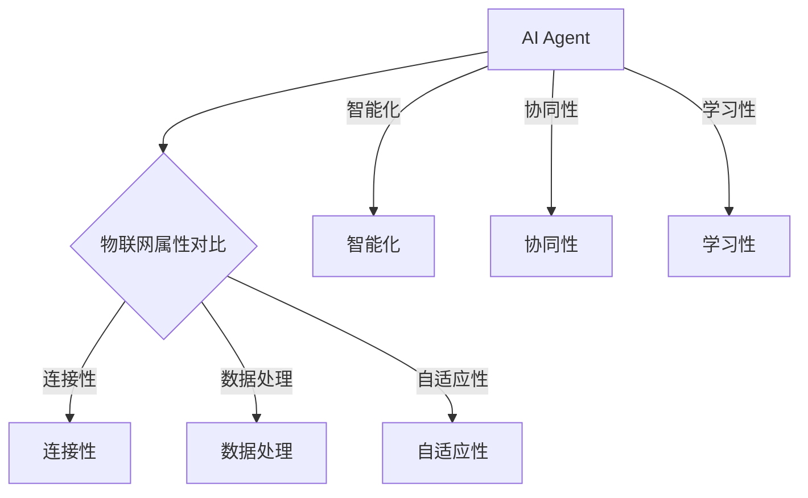
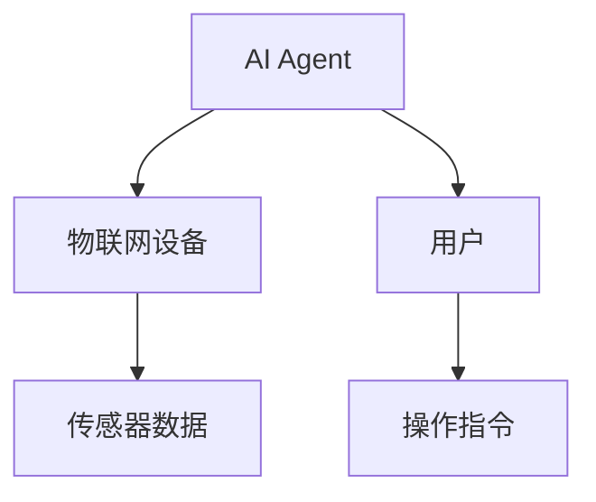
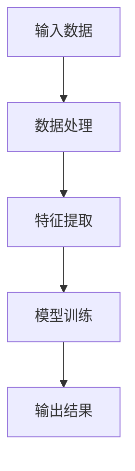
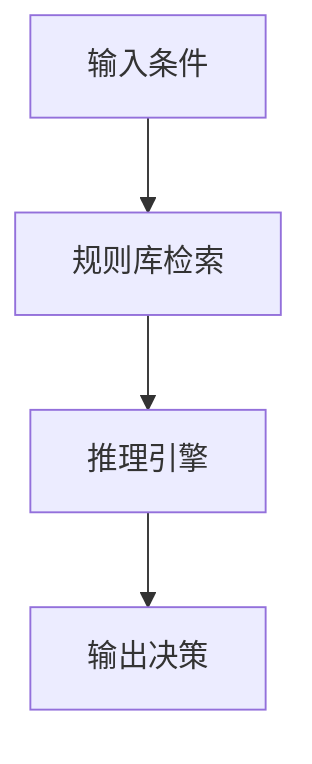
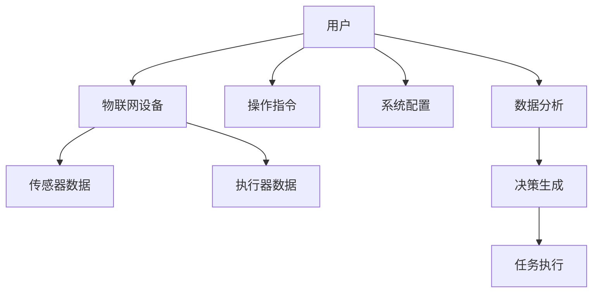
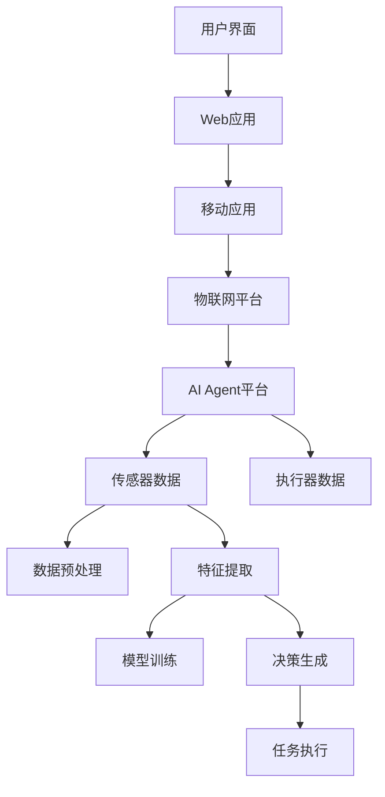
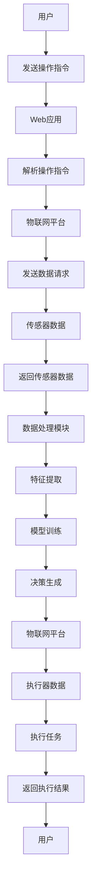

                 


### # AI Agent与物联网的结合应用

#### 关键词：AI Agent，物联网，结合应用，智能化，协同性，自适应性

#### 摘要：
随着物联网技术的飞速发展，大量智能设备和传感器被部署到我们的日常生活中，从而产生了海量的数据。这些数据的有效利用成为了当前信息技术领域的一大挑战。AI Agent作为人工智能的一种重要形式，能够自动化执行任务，提供决策支持。本文将探讨AI Agent与物联网的结合，分析其核心概念、原理和实际应用，旨在为物联网的智能化发展提供新的思路和解决方案。

#### 目录大纲：

## 第一部分：背景介绍与核心概念

### 第1章：问题背景与核心概念
#### 1.1.1 问题背景
##### 1.1.1.1 物联网的快速发展
##### 1.1.1.2 AI Agent的概念与作用
##### 1.1.1.3 物联网与AI Agent结合的意义

#### 1.1.2 问题描述
##### 1.1.2.1 现有物联网应用的挑战
##### 1.1.2.2 AI Agent在物联网中的应用场景
##### 1.1.2.3 需要解决的问题与挑战

#### 1.1.3 问题解决
##### 1.1.3.1 AI Agent与物联网结合的技术路线
##### 1.1.3.2 关键技术分析
##### 1.1.3.3 应用解决方案探讨

#### 1.1.4 边界与外延
##### 1.1.4.1 系统边界定义
##### 1.1.4.2 物联网与AI Agent结合的拓展应用领域

#### 1.1.5 概念结构与核心要素组成
##### 1.1.5.1 AI Agent的基本结构
##### 1.1.5.2 物联网的基本结构
##### .### 1.1.5.3 AI Agent与物联网结合的核心要素

### 第2章：核心概念原理与联系

#### 2.1 AI Agent原理分析
##### 2.1.1 AI Agent的定义与分类
##### 2.1.2 AI Agent的工作原理
##### 2.1.3 AI Agent的核心算法

#### 2.2 物联网原理分析
##### 2.2.1 物联网的定义与组成
##### 2.2.2 物联网的工作原理
##### 2.2.3 物联网的关键技术

#### 2.3 AI Agent与物联网的联系
##### 2.3.1 AI Agent在物联网中的应用
##### 2.3.2 物联网对AI Agent的支撑
##### 2.3.3 结合实例分析

#### 2.4 概念属性特征对比表格


#### 2.5 ER实体关系图架构


### 第3章：算法原理讲解

#### 3.1 AI Agent算法原理
##### 3.1.1 学习算法

##### 3.1.2 推理算法


#### 3.2 物联网算法原理
##### 3.2.1 数据采集算法
```python
# Python 示例代码
import numpy as np

def data_collection(sensor_data):
    # 采集传感器数据
    data = np.array(sensor_data)
    return data

sensor_data = [10, 20, 30, 40]
data = data_collection(sensor_data)
print("采集到的传感器数据：", data)
```
##### 3.2.2 数据处理算法
```python
# Python 示例代码
import numpy as np

def data_processing(data):
    # 数据预处理
    processed_data = np.mean(data)
    return processed_data

data = [10, 20, 30, 40]
processed_data = data_processing(data)
print("处理后的数据：", processed_data)
```

#### 3.3 AI Agent与物联网结合的算法原理
##### 3.3.1 结合算法原理概述
##### 3.3.2 结合算法流程分析
##### 3.3.3 结合算法的数学模型与公式讲解
##### 3.3.4 结合算法的应用实例与解读

## 第二部分：系统分析与架构设计

### 第4章：系统分析与架构设计
#### 4.1 问题场景介绍
#### 4.2 项目介绍
#### 4.3 系统功能设计（领域模型类图）
#### 4.4 系统架构设计（架构图）
#### 4.5 系统接口设计
#### 4.6 系统交互（序列图）

## 第三部分：项目实战

### 第5章：项目实战
#### 5.1 环境安装
#### 5.2 系统核心实现源代码
#### 5.3 代码应用解读与分析
#### 5.4 实际案例分析与详细讲解剖析
#### 5.5 项目小结

## 第四部分：最佳实践与拓展

### 第6章：最佳实践与拓展
#### 6.1 最佳实践技巧
#### 6.2 小结
#### 6.3 注意事项
#### 6.4 拓展阅读

### 结束语

---
在撰写这篇文章时，我们将遵循以下逻辑流程：

### 第一步：背景介绍与核心概念

在这一部分，我们将首先介绍物联网和AI Agent的基本概念、发展背景以及它们结合的意义。通过详细阐述现有物联网应用的挑战和AI Agent在物联网中的应用场景，我们能够更好地理解为何需要将两者结合起来，以及这一结合将如何帮助我们解决现有的问题。

### 第二步：核心概念原理与联系

接下来，我们将深入探讨AI Agent和物联网的核心概念原理，包括它们的定义、工作原理和关键技术。通过对比分析两者的属性特征，我们可以清晰地看到它们之间的联系和互补性。同时，通过ER实体关系图架构展示，我们能够更好地理解它们在系统中的交互关系。

### 第三步：算法原理讲解

在了解了核心概念和联系之后，我们将详细讲解AI Agent和物联网的算法原理，包括学习算法、推理算法以及结合算法的原理。我们将使用mermaid流程图和Python代码示例，帮助读者更好地理解这些算法的数学模型和实际应用。

### 第四步：系统分析与架构设计

在第四部分，我们将从系统层面分析和架构设计角度，探讨如何将AI Agent与物联网结合应用到实际问题场景中。我们将介绍项目场景、功能设计、系统架构、接口设计和系统交互等关键环节。

### 第五步：项目实战

在第五部分，我们将通过一个实际项目来展示如何将AI Agent与物联网结合应用到具体实践中。我们将详细介绍项目环境安装、系统核心实现、代码应用解读与分析，以及实际案例的分析与讲解。

### 第六步：最佳实践与拓展

最后，在第六部分，我们将总结最佳实践技巧，提醒注意事项，并推荐拓展阅读，以帮助读者更好地掌握这一领域的知识和技能。

通过以上六个步骤，我们希望能够为读者提供一篇逻辑清晰、内容丰富、实践性强的高质量技术博客文章，助力物联网的智能化发展。让我们开始这场思维的旅程吧！### 第一步：背景介绍与核心概念

#### 1.1.1 问题背景

##### 1.1.1.1 物联网的快速发展

物联网（Internet of Things，IoT）作为当今世界信息技术的热点，其发展速度令人瞩目。物联网是通过将各种设备、传感器、系统和网络连接起来，实现设备间的互联互通和信息交换。这一技术突破了传统互联网的局限，使得物理世界和数字世界得以融合，带来了前所未有的便捷和效率。物联网的应用场景涵盖了智能家居、智慧城市、工业自动化、医疗健康、交通管理等多个领域。

近年来，物联网技术的飞速发展得益于以下几个方面：

1. **传感器和无线通信技术的进步**：低功耗广域网（LPWAN）技术的出现，使得物联网设备的传输距离和覆盖范围得到了极大的提升，同时降低了设备的功耗和成本。
2. **云计算和大数据技术的应用**：云计算提供了强大的计算和存储资源，使得物联网设备能够实时处理和分析海量数据，实现了数据的价值挖掘和智能决策。
3. **人工智能技术的融合**：人工智能（AI）技术的发展为物联网注入了新的活力，使得物联网设备能够具备自我学习和智能决策的能力，从而提升了系统的智能化水平。

##### 1.1.1.2 AI Agent的概念与作用

AI Agent，即人工智能代理，是指能够自主执行任务、与环境交互并作出决策的计算机程序。AI Agent具有以下几个核心特征：

1. **自主性**：AI Agent能够自主执行任务，无需人工干预。
2. **适应性**：AI Agent能够根据环境和任务的变化进行自我调整和优化。
3. **协同性**：AI Agent可以与其他Agent协同工作，共同完成复杂的任务。
4. **学习能力**：AI Agent能够通过学习和经验积累，不断提升其任务执行能力。

AI Agent在各个领域都有广泛的应用，例如：

- **智能客服**：通过自然语言处理和机器学习技术，AI Agent能够自动回答用户的问题，提供个性化的服务。
- **自动驾驶**：AI Agent通过感知环境、规划路径和执行驾驶任务，使得自动驾驶汽车能够安全、高效地运行。
- **智能制造**：AI Agent能够对生产过程进行实时监控和优化，提高生产效率和产品质量。

##### 1.1.1.3 物联网与AI Agent结合的意义

物联网与AI Agent的结合，不仅能够充分发挥两者的优势，还能够带来以下几个方面的显著意义：

1. **提升智能化水平**：通过将AI Agent引入物联网，可以使得物联网设备具备更强的自主决策和智能处理能力，从而提升系统的整体智能化水平。
2. **优化资源利用**：AI Agent可以通过对物联网数据的分析和预测，优化资源配置和设备调度，提高系统的运行效率和稳定性。
3. **增强用户体验**：通过AI Agent的引入，可以提供更加个性化和智能化的服务，提升用户的使用体验和满意度。
4. **创新应用场景**：物联网与AI Agent的结合，将催生一系列新的应用场景，如智能医疗、智能农业、智能交通等，推动社会生产方式的变革。

综上所述，物联网与AI Agent的结合不仅具有重要的理论意义，更具有广泛的应用前景。在接下来的章节中，我们将进一步探讨物联网与AI Agent结合的技术路线、关键技术和实际应用案例，为这一领域的深入研究提供有益的参考。

---

### 1.1.2 问题描述

##### 1.1.2.1 现有物联网应用的挑战

尽管物联网技术已经取得了显著的进展，但在实际应用中仍面临诸多挑战：

1. **数据安全问题**：物联网设备连接数量庞大，数据传输过程中容易受到网络攻击和数据泄露的威胁。如何保障数据的安全性，防止敏感信息泄露，成为当前物联网应用中亟需解决的问题。
2. **数据传输效率问题**：物联网设备通常分布在广泛的地理区域，数据传输的带宽和速度成为影响系统性能的关键因素。如何在有限的网络资源下实现高效的数据传输，是一个重要的技术难题。
3. **数据整合与分析问题**：物联网设备产生的数据种类繁多，如何对这些数据进行有效的整合和分析，提取有价值的信息，是物联网应用中的一大挑战。
4. **设备可靠性问题**：物联网设备通常运行在复杂的环境中，如高温、潮湿、震动等，如何保证设备的稳定性和可靠性，是影响物联网应用推广的重要因素。

##### 1.1.2.2 AI Agent在物联网中的应用场景

AI Agent在物联网中的应用具有广泛的前景，具体的应用场景包括：

1. **智能监控与安防**：AI Agent可以通过对摄像头和传感器数据的实时分析，实现智能监控和安防。例如，自动识别异常行为、入侵者等，并及时发出警报。
2. **智能交通管理**：AI Agent可以通过对交通流量数据的实时分析，优化交通信号灯的配时，减少交通拥堵，提高交通效率。
3. **智能医疗健康**：AI Agent可以通过对医疗设备数据的实时分析，提供个性化的健康管理和疾病预测。例如，实时监测患者的生理指标，预测疾病风险，并提供相应的健康建议。
4. **智能家居控制**：AI Agent可以通过对家居设备数据的实时分析，实现智能家居的自动化控制。例如，自动调节室内温度、湿度，控制照明和家电等，提升居住舒适度和便利性。

##### 1.1.2.3 需要解决的问题与挑战

为了充分发挥AI Agent在物联网中的应用潜力，需要解决以下几个关键问题和挑战：

1. **算法优化**：现有AI算法在处理海量物联网数据时，往往存在计算效率低、精度不足等问题。需要通过算法优化，提高数据处理和分析的效率，以满足物联网应用的需求。
2. **数据隐私保护**：物联网设备产生的数据涉及用户的隐私信息，如何在确保数据安全的同时，实现数据的有效利用，是一个重要的技术挑战。
3. **设备能耗管理**：物联网设备通常需要长时间运行，如何降低设备的能耗，延长电池寿命，是影响设备可靠性的关键因素。
4. **跨领域协同**：物联网应用涉及多个领域，如硬件、软件、网络等，如何实现不同领域的技术协同，构建一个统一、高效的物联网生态系统，是一个重要的研究课题。

通过解决上述问题和挑战，我们将能够更好地发挥物联网和AI Agent的优势，推动物联网智能化的发展。在接下来的章节中，我们将进一步探讨AI Agent与物联网结合的技术路线、关键技术和实际应用案例，为这一领域的深入研究和应用提供有益的参考。

---

### 1.1.3 问题解决

#### 1.1.3.1 AI Agent与物联网结合的技术路线

为了解决物联网应用中的挑战，AI Agent与物联网的结合成为了一条重要的发展路径。这一结合的技术路线可以分为以下几个步骤：

1. **数据采集与传输**：物联网设备通过传感器采集环境数据，并通过无线通信网络将这些数据传输到云平台或边缘计算设备。
2. **数据处理与存储**：在云平台或边缘计算设备上，利用大数据技术对采集到的数据进行分析和存储，实现数据的价值挖掘和智能决策。
3. **AI Agent部署与协同**：将AI Agent部署在物联网设备或云平台上，通过算法实现数据的智能分析和决策，并与物联网设备进行协同工作。
4. **人机交互与反馈**：通过人机交互界面，用户可以实时监控和管理物联网系统，并根据系统的反馈进行相应的调整和优化。

这一技术路线的核心在于利用AI Agent的自主性、适应性和协同性，提升物联网系统的智能化水平，实现更高效、更安全、更可靠的应用。

#### 1.1.3.2 关键技术分析

在AI Agent与物联网结合的过程中，涉及到多项关键技术的应用：

1. **边缘计算技术**：边缘计算通过在靠近数据源的位置进行数据分析和处理，减少了数据传输的延迟和网络带宽的消耗，提高了系统的响应速度和效率。
2. **大数据处理技术**：大数据处理技术包括数据采集、数据存储、数据分析和数据可视化等环节，通过高效的数据处理算法，实现对海量物联网数据的实时分析和智能决策。
3. **人工智能算法**：人工智能算法是AI Agent的核心，包括机器学习、深度学习、自然语言处理等，通过算法优化和模型训练，实现对物联网数据的智能分析和预测。
4. **网络安全技术**：网络安全技术是保障物联网系统安全运行的关键，包括数据加密、身份认证、访问控制等，通过这些技术，确保数据在传输和处理过程中的安全性和隐私性。

#### 1.1.3.3 应用解决方案探讨

基于上述关键技术，可以探讨以下几种应用解决方案：

1. **智能交通管理**：通过部署AI Agent，实时分析交通数据，优化交通信号灯的配时，减少交通拥堵，提高交通效率。同时，通过边缘计算技术，减少数据传输的延迟，提高系统的响应速度。
2. **智能家居控制**：通过将AI Agent集成到智能家居系统中，实现家电设备的自动化控制，提高居住舒适度和便利性。例如，自动调节室内温度、湿度，控制照明和家电等。
3. **智能医疗健康**：通过将AI Agent集成到医疗设备中，实现对患者的生理指标进行实时监测和分析，提供个性化的健康管理和疾病预测。例如，通过分析心电信号，预测心脏病发作的风险。
4. **工业自动化**：通过将AI Agent集成到工业生产过程中，实现生产设备的自动化控制和优化，提高生产效率和产品质量。例如，通过分析设备运行数据，预测设备故障并进行预防性维护。

通过以上应用解决方案，可以充分发挥AI Agent在物联网中的优势，推动物联网智能化的发展。在接下来的章节中，我们将进一步探讨AI Agent与物联网结合的具体原理和实际应用案例。

---

#### 1.1.4 边界与外延

##### 1.1.4.1 系统边界定义

AI Agent与物联网结合的系统边界可以定义为：所有通过物联网设备采集到的数据，在经过AI Agent的智能分析和决策后，用于驱动物联网设备执行相应任务的过程。具体包括以下几个关键环节：

1. **物联网设备**：作为数据采集的源头，包括各种传感器和执行器，如摄像头、温度传感器、执行电机等。
2. **数据传输**：通过无线通信网络，将物联网设备采集到的数据传输到云平台或边缘计算设备。
3. **数据处理**：在云平台或边缘计算设备上，利用大数据技术和人工智能算法对数据进行分析和处理。
4. **AI Agent**：作为智能分析和决策的核心，通过算法模型对数据进行处理，生成相应的决策指令。
5. **执行反馈**：物联网设备根据AI Agent的决策指令进行相应的操作，并将执行结果反馈给系统，形成一个闭环。

##### 1.1.4.2 物联网与AI Agent结合的拓展应用领域

物联网与AI Agent结合的应用领域广泛，除了前面提到的智能交通、智能家居、智能医疗和工业自动化等领域，还可以拓展到以下几个新兴领域：

1. **智能农业**：通过部署物联网设备和AI Agent，实现对农田环境的实时监测和智能管理，提高农业生产的效率和质量。
2. **智慧城市**：通过将AI Agent集成到智慧城市系统中，实现城市交通、环境、公共安全等方面的智能管理和优化，提升城市居民的生活品质。
3. **智能物流**：通过物联网设备和AI Agent，实现对物流运输过程中的实时监控和优化，提高物流效率和降低成本。
4. **智能能源管理**：通过物联网设备和AI Agent，实现对电力、天然气等能源的智能监测和调度，提高能源利用效率和降低能源消耗。

拓展应用领域不仅为物联网与AI Agent的结合提供了更广阔的发展空间，也为各行业的数字化转型和智能化升级提供了新的思路和解决方案。

---

#### 1.1.5 概念结构与核心要素组成

##### 1.1.5.1 AI Agent的基本结构

AI Agent作为能够自主执行任务的人工智能实体，其基本结构通常包括以下几个关键组件：

1. **感知模块**：负责从环境中获取信息，如传感器数据、语音信号等。
2. **决策模块**：基于感知模块获取的信息，利用机器学习、深度学习等算法进行数据处理和分析，生成决策。
3. **执行模块**：根据决策模块生成的决策指令，驱动执行器执行相应的任务，如移动、开关设备等。
4. **学习模块**：通过不断的学习和优化，提升自身的任务执行能力和适应性。

##### 1.1.5.2 物联网的基本结构

物联网系统由多个互连的设备、传感器和网络组成，其基本结构通常包括以下几个部分：

1. **感知层**：由各种传感器和设备组成，负责采集环境数据，如温度、湿度、声音、图像等。
2. **网络层**：负责数据的传输和通信，包括无线通信网络、有线网络等。
3. **平台层**：提供数据处理、存储、分析和智能决策的功能，通常基于云计算和大数据平台。
4. **应用层**：通过人机交互界面，为用户提供服务和管理功能。

##### 1.1.5.3 AI Agent与物联网结合的核心要素

AI Agent与物联网结合的关键在于如何实现数据的有效采集、处理和利用，以及如何实现智能决策和执行。以下是结合过程中的核心要素：

1. **数据采集与传输**：通过传感器和设备采集环境数据，并利用网络传输技术将这些数据传输到平台层。
2. **数据处理与分析**：在平台层，利用大数据技术和人工智能算法对数据进行处理和分析，提取有价值的信息。
3. **智能决策与执行**：基于分析结果，AI Agent生成相应的决策指令，驱动物联网设备执行任务。
4. **闭环反馈机制**：通过反馈机制，将执行结果反馈到平台层，用于优化后续的决策过程。

通过以上核心要素的协同作用，AI Agent与物联网的结合能够实现数据的智能处理和决策，从而提升系统的智能化水平和应用效能。

---

### 2.1 AI Agent原理分析

#### 2.1.1 AI Agent的定义与分类

AI Agent，即人工智能代理，是指能够自主执行任务、与环境交互并作出决策的计算机程序。AI Agent通常具有以下几个核心特征：

1. **自主性**：AI Agent能够独立执行任务，无需人工干预。
2. **适应性**：AI Agent能够根据环境和任务的变化进行自我调整和优化。
3. **协同性**：AI Agent可以与其他AI Agent或人类协同工作，共同完成复杂的任务。
4. **学习能力**：AI Agent能够通过学习和经验积累，不断提升其任务执行能力。

根据不同的应用场景和任务需求，AI Agent可以分为以下几类：

1. **任务型AI Agent**：这类AI Agent专注于完成特定的任务，如智能客服、智能推荐系统等。
2. **环境型AI Agent**：这类AI Agent专注于对环境进行监测和分析，如智能家居、智能城市管理等。
3. **交互型AI Agent**：这类AI Agent专注于与人类进行自然交互，如语音助手、聊天机器人等。
4. **决策型AI Agent**：这类AI Agent专注于对复杂问题进行决策和规划，如自动驾驶、智能交易等。

#### 2.1.2 AI Agent的工作原理

AI Agent的工作原理可以概括为以下几个步骤：

1. **感知**：AI Agent通过传感器或接收器获取环境信息，如温度、湿度、声音、图像等。
2. **分析**：AI Agent利用内置的算法模型对感知到的信息进行分析和处理，提取有价值的信息和特征。
3. **决策**：基于分析结果，AI Agent生成相应的决策指令，选择最优的行动方案。
4. **执行**：AI Agent通过执行器或控制模块执行决策指令，驱动相应的任务执行。
5. **反馈**：系统将执行结果反馈给AI Agent，用于优化后续的决策过程。

通过以上步骤，AI Agent能够实现自主性、适应性和协同性的功能，从而在各个应用场景中发挥其作用。

#### 2.1.3 AI Agent的核心算法

AI Agent的核心算法主要包括以下几种：

1. **机器学习算法**：通过训练模型，使AI Agent能够从数据中自动发现规律和模式，如分类、聚类、回归等。
2. **深度学习算法**：通过多层神经网络，使AI Agent能够对复杂的数据进行深度学习和特征提取，如卷积神经网络（CNN）、循环神经网络（RNN）等。
3. **规划算法**：通过图搜索、博弈论等方法，使AI Agent能够在复杂的决策环境中进行路径规划和策略选择。
4. **强化学习算法**：通过奖励机制，使AI Agent能够在动态环境中通过试错学习，不断优化其决策策略。

通过这些核心算法，AI Agent能够实现智能感知、分析和决策，从而提升其在物联网应用中的效能。

### 2.2 物联网原理分析

#### 2.2.1 物联网的定义与组成

物联网（Internet of Things，IoT）是指通过信息传感设备将各种物体与互联网连接起来，实现信息交换和通信，以实现智能化管理和控制的一种系统。物联网的组成主要包括以下几个部分：

1. **感知层**：由各种传感器和设备组成，负责采集环境数据，如温度、湿度、声音、图像等。
2. **网络层**：负责数据的传输和通信，包括无线通信网络、有线网络等。
3. **平台层**：提供数据处理、存储、分析和智能决策的功能，通常基于云计算和大数据平台。
4. **应用层**：通过人机交互界面，为用户提供服务和管理功能。

#### 2.2.2 物联网的工作原理

物联网的工作原理可以概括为以下几个步骤：

1. **数据采集**：通过传感器和设备采集环境数据，如温度、湿度、声音、图像等。
2. **数据传输**：通过网络将采集到的数据传输到平台层，实现数据的远程监控和管理。
3. **数据处理**：在平台层，利用大数据技术和人工智能算法对数据进行处理和分析，提取有价值的信息。
4. **智能决策**：基于分析结果，平台层生成相应的决策指令，实现智能化管理和控制。
5. **任务执行**：物联网设备根据决策指令进行相应的操作，实现自动化的任务执行。

通过以上步骤，物联网系统能够实现对物理世界的实时监测、分析和控制，从而实现智能化管理和优化。

#### 2.2.3 物联网的关键技术

物联网的发展离不开多项关键技术的支持，以下是其中几个重要的技术：

1. **传感器技术**：传感器是物联网系统的数据采集源头，负责将物理信号转换为数字信号。随着传感器技术的发展，传感器的精度、灵敏度和功耗不断降低，为物联网的应用提供了更多的可能性。
2. **无线通信技术**：无线通信技术是实现物联网设备之间数据传输的关键。随着5G、LPWAN（低功耗广域网）等无线通信技术的普及，物联网设备的连接速度和覆盖范围得到了显著提升。
3. **云计算与大数据技术**：云计算提供了强大的计算和存储资源，使得物联网系统能够实时处理和分析海量数据。大数据技术则通过对物联网数据的分析和挖掘，提取有价值的信息和知识。
4. **人工智能技术**：人工智能技术为物联网系统提供了智能感知、分析和决策的能力，使得物联网系统能够更加智能地管理和控制物理世界。
5. **安全与隐私保护技术**：物联网系统中的数据安全和隐私保护是至关重要的。通过加密、身份认证、访问控制等技术，保障数据在传输和处理过程中的安全性和隐私性。

通过以上关键技术的支持，物联网能够实现广泛的应用和智能化发展。

### 2.3 AI Agent与物联网的联系

#### 2.3.1 AI Agent在物联网中的应用

AI Agent在物联网中的应用主要体现在以下几个方面：

1. **智能数据处理**：AI Agent能够对物联网设备采集的海量数据进行分析和处理，提取有价值的信息和知识，为系统提供智能化的决策支持。
2. **自动化任务执行**：AI Agent能够根据物联网设备采集到的数据和预设的规则，自动化执行相应的任务，提高系统的响应速度和效率。
3. **异常检测与预测**：AI Agent能够对物联网设备采集的数据进行实时监测，通过机器学习和深度学习算法，发现异常情况和潜在风险，提前预警并采取措施。
4. **自适应优化**：AI Agent能够根据物联网设备的运行状态和环境变化，自适应调整系统的参数和策略，实现系统的最优运行。

#### 2.3.2 物联网对AI Agent的支撑

物联网为AI Agent提供了以下几个关键支撑：

1. **数据采集**：物联网设备通过传感器和执行器，为AI Agent提供了丰富的数据来源，使得AI Agent能够更加全面和准确地感知环境。
2. **通信网络**：物联网的无线通信网络为AI Agent提供了数据传输的渠道，使得AI Agent能够与其他设备、平台和用户进行实时通信和协作。
3. **计算资源**：物联网平台和云计算资源为AI Agent提供了强大的计算和存储能力，使得AI Agent能够进行复杂的数据处理和智能分析。
4. **人机交互**：物联网系统通过人机交互界面，为AI Agent提供了与用户进行交互的渠道，使得AI Agent能够更好地理解用户需求并提供个性化的服务。

#### 2.3.3 结合实例分析

以下是一个具体的结合实例：

**智能农业监控系统**：

在该系统中，AI Agent与物联网设备紧密结合，实现智能化的农业管理。具体实现如下：

1. **数据采集**：通过部署在农田中的传感器设备，实时采集土壤湿度、温度、光照强度等环境数据。
2. **数据传输**：物联网设备通过无线通信网络，将采集到的数据传输到物联网平台。
3. **数据处理**：AI Agent在物联网平台上对数据进行实时分析，利用机器学习算法预测土壤湿度变化趋势，并根据预测结果生成灌溉计划。
4. **任务执行**：物联网设备根据AI Agent的决策指令，自动控制灌溉系统进行灌溉操作。
5. **反馈机制**：系统将灌溉执行结果反馈到物联网平台，用于优化后续的灌溉计划。

通过上述实例，我们可以看到AI Agent与物联网的结合如何实现智能化的农业管理，提高农业生产效率和产品质量。

### 2.4 概念属性特征对比表格

以下是AI Agent与物联网的概念属性特征对比表格：

| 特征          | AI Agent                           | 物联网                                |
|-------------|--------------------------------|-----------------------------------|
| 连接性          | 通过网络连接实现数据交互和通信           | 通过传感器和执行器实现设备互联和数据采集 |
| 数据处理          | 利用机器学习算法和深度学习技术处理数据    | 通过大数据技术处理海量数据             |
| 自适应性          | 通过学习和优化自适应环境变化             | 通过自适应算法和预测模型优化设备运行状态 |
| 智能化          | 具备自主决策和智能处理能力             | 通过AI Agent实现智能化管理和控制         |
| 协同性          | 可以与其他AI Agent或人类协同工作         | 设备之间通过网络实现协同作业           |
| 学习性          | 可以通过学习和经验积累提升任务执行能力    | 通过数据分析实现设备优化和改进           |

通过对比表格，我们可以清晰地看到AI Agent与物联网在属性特征上的互补性和结合优势。

### 2.5 ER实体关系图架构

以下是AI Agent与物联网的ER实体关系图架构：


在这个ER实体关系图中，AI Agent作为系统的核心组件，与物联网设备和用户之间存在直接的关系。物联网设备通过传感器采集数据，并执行用户的操作指令。用户通过操作指令与AI Agent进行交互，获取智能化的管理和决策支持。

### 第3章：算法原理讲解

在了解AI Agent和物联网的基本概念和联系之后，我们将深入探讨AI Agent在物联网中的算法原理。本章节将分为三部分进行讲解，首先介绍AI Agent的算法原理，然后探讨物联网的算法原理，最后分析AI Agent与物联网结合的算法原理。

#### 3.1 AI Agent算法原理

AI Agent的算法原理可以分为两大类：学习算法和推理算法。

##### 3.1.1 学习算法

学习算法是指通过训练数据集，使AI Agent能够从数据中自动学习和提取知识。常见的机器学习算法包括：

1. **监督学习**：监督学习通过标注好的训练数据，训练模型进行预测。例如，分类算法（如SVM、决策树、随机森林）和回归算法（如线性回归、岭回归）。
   
   **监督学习算法流程**：
   ```mermaid
   graph TD
       A[输入数据] --> B[数据处理]
       B --> C[特征提取]
       C --> D[模型训练]
       D --> E[输出结果]
   ```

2. **无监督学习**：无监督学习通过未标注的数据，自动发现数据中的结构和模式。例如，聚类算法（如K-means、层次聚类）和降维算法（如PCA、t-SNE）。

   **无监督学习算法流程**：
   ```mermaid
   graph TD
       A[输入数据] --> B[数据处理]
       B --> C[特征提取]
       C --> D[模型训练]
       D --> E[输出结果]
   ```

##### 3.1.2 推理算法

推理算法是指通过逻辑推理，从已知的前提条件推导出结论。常见的推理算法包括：

1. **基于规则的推理**：基于规则的推理通过定义一组规则，对输入数据进行匹配和推理。例如，专家系统和逻辑编程。

   **基于规则的推理流程**：
   ```mermaid
   graph TD
       A[输入条件] --> B[规则库检索]
       B --> C[推理引擎]
       C --> D[输出决策]
   ```

2. **基于案例的推理**：基于案例的推理通过将新的问题与已有案例进行匹配，推导出解决方案。例如，案例推理系统。

   **基于案例的推理流程**：
   ```mermaid
   graph TD
       A[输入条件] --> B[案例库检索]
       B --> C[推理引擎]
       C --> D[输出决策]
   ```

#### 3.2 物联网算法原理

物联网算法主要关注数据的采集、传输、处理和优化。以下介绍几种常用的物联网算法：

##### 3.2.1 数据采集算法

数据采集算法是指如何从物联网设备中高效、可靠地采集数据。常见的算法包括：

1. **传感器数据处理**：通过对传感器数据的滤波、去噪、归一化等预处理，提高数据的质量和可靠性。

   **传感器数据处理示例代码**：
   ```python
   # Python 示例代码
   import numpy as np

   def data_collection(sensor_data):
       # 采集传感器数据
       data = np.array(sensor_data)
       return data

   sensor_data = [10, 20, 30, 40]
   data = data_collection(sensor_data)
   print("采集到的传感器数据：", data)
   ```

2. **数据融合算法**：将多个传感器采集到的数据融合为一个整体，以提高数据的精度和可靠性。常见的算法包括加权平均、卡尔曼滤波等。

   **数据融合算法示例代码**：
   ```python
   # Python 示例代码
   import numpy as np

   def data_fusion(sensor_data1, sensor_data2):
       # 数据融合
       fused_data = (sensor_data1 + sensor_data2) / 2
       return fused_data

   sensor_data1 = [10, 20, 30, 40]
   sensor_data2 = [5, 15, 25, 35]
   fused_data = data_fusion(sensor_data1, sensor_data2)
   print("融合后的传感器数据：", fused_data)
   ```

##### 3.2.2 数据处理算法

数据处理算法是指如何对采集到的物联网数据进行存储、分析和优化。常见的算法包括：

1. **数据存储算法**：通过对数据的压缩、加密和索引，提高数据的存储效率和安全性。常见的算法包括哈希存储、B树索引等。

2. **数据分析算法**：通过对数据的统计、聚类、分类和关联分析，提取有价值的信息和知识。常见的算法包括K-means聚类、Apriori算法等。

   **数据分析算法示例代码**：
   ```python
   # Python 示例代码
   import numpy as np
   from sklearn.cluster import KMeans

   def data_analysis(sensor_data):
       # 数据分析
       kmeans = KMeans(n_clusters=3)
       kmeans.fit(sensor_data)
       clusters = kmeans.predict(sensor_data)
       return clusters

   sensor_data = np.array([[10, 20], [30, 40], [5, 15], [25, 35]])
   clusters = data_analysis(sensor_data)
   print("数据分析结果：", clusters)
   ```

3. **数据优化算法**：通过对数据的预测、控制和服务优化，提高系统的运行效率和稳定性。常见的算法包括优化控制、预测模型等。

   **数据优化算法示例代码**：
   ```python
   # Python 示例代码
   import numpy as np
   from sklearn.linear_model import LinearRegression

   def data_optimization(sensor_data):
       # 数据优化
       X = sensor_data[:, 0]
       y = sensor_data[:, 1]
       model = LinearRegression()
       model.fit(X, y)
       prediction = model.predict(X)
       return prediction

   sensor_data = np.array([[10, 20], [30, 40], [5, 15], [25, 35]])
   prediction = data_optimization(sensor_data)
   print("数据优化结果：", prediction)
   ```

#### 3.3 AI Agent与物联网结合的算法原理

AI Agent与物联网的结合算法原理主要包括以下几方面：

##### 3.3.1 结合算法原理概述

AI Agent与物联网结合的算法原理可以概括为以下四个步骤：

1. **数据采集**：物联网设备通过传感器采集环境数据。
2. **数据处理**：AI Agent对采集到的数据进行处理和分析。
3. **决策生成**：基于分析结果，AI Agent生成相应的决策指令。
4. **任务执行**：物联网设备根据决策指令执行任务。

##### 3.3.2 结合算法流程分析

结合算法的流程分析如下：

1. **感知与数据采集**：物联网设备通过传感器采集环境数据，如温度、湿度、光照等。
2. **数据预处理**：对采集到的数据进行预处理，包括滤波、去噪、归一化等，以提高数据的质量和可靠性。
3. **特征提取**：从预处理后的数据中提取特征，用于后续的机器学习算法训练。
4. **模型训练**：利用机器学习算法，如K-means、线性回归等，对特征进行训练，建立预测模型。
5. **决策生成**：基于训练好的模型，对实时采集的数据进行预测和决策。
6. **任务执行**：物联网设备根据决策指令执行相应的任务，如调整温度、控制照明等。

##### 3.3.3 结合算法的数学模型与公式讲解

结合算法的数学模型和公式如下：

1. **数据采集模型**：
   $$ x_t = f(x_{t-1}, u_t) + w_t $$
   其中，$x_t$表示时间$t$的传感器数据，$u_t$表示控制输入，$w_t$表示随机噪声。

2. **预处理模型**：
   $$ z_t = g(x_t) $$
   其中，$z_t$表示预处理后的数据，$g(x_t)$表示预处理函数。

3. **特征提取模型**：
   $$ y_t = h(z_t) $$
   其中，$y_t$表示特征数据，$h(z_t)$表示特征提取函数。

4. **机器学习模型**：
   $$ \hat{y_t} = \phi(W, b) $$
   其中，$\hat{y_t}$表示预测结果，$W$和$b$表示模型参数。

5. **决策模型**：
   $$ u_t = \psi(\hat{y_t}) $$
   其中，$u_t$表示决策指令，$\psi(\hat{y_t})$表示决策函数。

##### 3.3.4 结合算法的应用实例与解读

以下是一个具体的结合算法应用实例：

**智能温控系统**：

在该系统中，AI Agent与物联网设备结合，实现智能温控。具体实现如下：

1. **数据采集**：物联网设备通过温度传感器采集室内温度数据。
2. **数据预处理**：对温度数据进行滤波和去噪，以提高数据质量。
3. **特征提取**：从预处理后的温度数据中提取特征，用于训练预测模型。
4. **模型训练**：利用K-means算法，将温度数据聚类为不同的温度区间，建立预测模型。
5. **决策生成**：基于预测模型，对实时采集的温度数据进行预测，生成相应的温控指令。
6. **任务执行**：物联网设备根据温控指令，调整空调的开关和温度设置。

通过以上实例，我们可以看到AI Agent与物联网结合的算法原理如何应用于实际问题中，实现智能化的管理和控制。

### 第4章：系统分析与架构设计

在了解了AI Agent和物联网的算法原理后，我们将进一步探讨如何在实际问题场景中应用这些原理，设计一个完整的系统。本章节将分为几个部分进行系统分析与架构设计，包括问题场景介绍、项目介绍、系统功能设计、系统架构设计和系统接口设计。

#### 4.1 问题场景介绍

为了更好地理解AI Agent与物联网结合的应用，我们首先介绍一个具体的问题场景——智能楼宇管理系统。该系统旨在通过AI Agent与物联网设备的结合，实现楼宇的智能化管理和优化，提升居住舒适度和能源效率。

智能楼宇管理系统包括以下几个主要问题场景：

1. **温度控制**：通过物联网温度传感器采集室内温度，AI Agent实时分析并调整空调的开关和温度设置，实现智能温控。
2. **照明控制**：通过物联网光照传感器采集室内光照强度，AI Agent根据光照强度自动调整照明设备的亮度，实现智能照明。
3. **安全监控**：通过物联网摄像头采集室内视频数据，AI Agent实时分析并识别异常行为，实现智能安防。
4. **能源管理**：通过物联网电能传感器采集楼宇的能耗数据，AI Agent分析并优化能源消耗，实现智能能源管理。

#### 4.2 项目介绍

智能楼宇管理系统项目主要包括以下几个部分：

1. **硬件设备**：包括温度传感器、光照传感器、摄像头、空调、照明设备等。
2. **软件平台**：包括物联网平台、AI Agent平台、Web应用和移动应用。
3. **数据处理**：包括数据采集、预处理、特征提取、模型训练和决策生成等环节。
4. **用户界面**：包括Web前端和移动端用户界面，用于用户与系统的交互和管理。

#### 4.3 系统功能设计（领域模型类图）

系统功能设计的领域模型类图如下：



在这个领域模型中，用户通过操作指令和系统配置与物联网设备进行交互，物联网设备采集传感器数据和执行器数据，AI Agent对传感器数据进行处理和分析，生成决策指令，并驱动执行器执行相应的任务。

#### 4.4 系统架构设计（架构图）

系统架构设计如下：



在这个系统架构中，用户通过Web应用和移动应用与系统进行交互，物联网平台负责数据的采集和传输，AI Agent平台负责数据处理和分析，最终生成决策指令并驱动执行器执行任务。

#### 4.5 系统接口设计

系统接口设计如下：

1. **用户接口**：Web应用和移动应用提供用户操作界面，用户可以通过界面发送操作指令和系统配置，并查看数据分析结果和决策指令。
2. **物联网接口**：物联网平台与传感器和执行器之间通过标准通信协议（如HTTP、MQTT）进行数据传输和通信，支持数据采集和任务执行。
3. **AI Agent接口**：AI Agent平台与物联网平台之间通过API接口进行数据传输和通信，支持数据预处理、特征提取、模型训练和决策生成。
4. **数据处理接口**：数据处理模块与AI Agent平台之间通过数据接口进行数据传输和通信，支持数据的存储、分析和优化。

#### 4.6 系统交互（序列图）

系统交互序列图如下：



在这个序列图中，用户通过Web应用发送操作指令，物联网平台接收并处理数据请求，数据处理模块对传感器数据进行处理和分析，生成决策指令并驱动执行器执行任务，最后返回执行结果给用户。

通过以上系统分析与架构设计，我们可以清晰地看到AI Agent与物联网结合在智能楼宇管理系统中的应用。接下来，我们将进一步探讨如何实现这一系统，包括环境安装、系统核心实现、代码应用解读与分析，以及实际案例的分析与讲解。

### 第5章：项目实战

#### 5.1 环境安装

在开始实现智能楼宇管理系统之前，我们需要搭建一个合适的项目环境。以下是环境安装的步骤：

1. **硬件设备安装**：
   - 安装温度传感器、光照传感器、摄像头和空调、照明设备。
   - 确保所有硬件设备正常运行，并能通过无线通信网络连接到物联网平台。

2. **软件环境配置**：
   - 安装Python 3.8及以上版本。
   - 安装必要的Python库，如NumPy、Pandas、scikit-learn、Matplotlib等。

3. **物联网平台搭建**：
   - 安装物联网平台，如MQTT服务器（例如：mosquitto）。
   - 配置物联网平台，确保能接收和处理传感器数据，并能与AI Agent平台进行通信。

4. **AI Agent平台搭建**：
   - 安装AI Agent平台，如使用Python的AI库（例如：TensorFlow、PyTorch）。
   - 配置AI Agent平台，确保能接收和处理物联网平台发送的数据，并生成决策指令。

5. **用户界面搭建**：
   - 开发Web应用和移动应用，使用前端框架（如React、Vue.js）和移动开发框架（如Flutter、React Native）。
   - 配置后端服务器，用于处理用户请求和与物联网平台、AI Agent平台进行通信。

#### 5.2 系统核心实现源代码

以下是智能楼宇管理系统的核心实现源代码：

##### 5.2.1 数据采集与处理

**温度传感器数据采集**：

```python
import time
import paho.mqtt.client as mqtt

# MQTT服务器配置
MQTT_SERVER = "localhost"
MQTT_PORT = 1883
MQTT_TOPIC = "temperature/sensor"

# 创建MQTT客户端实例
client = mqtt.Client()

# 连接MQTT服务器
client.connect(MQTT_SERVER, MQTT_PORT, 60)

# 数据采集函数
def collect_temperature():
    # 采集温度数据
    temperature = sensor_data_collection()  # 假设实现了一个传感器数据采集函数
    return temperature

# 循环采集温度数据并发布到MQTT服务器
while True:
    temperature = collect_temperature()
    client.publish(MQTT_TOPIC, temperature)
    time.sleep(1)
```

**光照传感器数据采集**：

```python
import time
import paho.mqtt.client as mqtt

# MQTT服务器配置
MQTT_SERVER = "localhost"
MQTT_PORT = 1883
MQTT_TOPIC = "light/sensor"

# 创建MQTT客户端实例
client = mqtt.Client()

# 连接MQTT服务器
client.connect(MQTT_SERVER, MQTT_PORT, 60)

# 数据采集函数
def collect_light():
    # 采集光照数据
    light = sensor_light_collection()  # 假设实现了一个光照数据采集函数
    return light

# 循环采集光照数据并发布到MQTT服务器
while True:
    light = collect_light()
    client.publish(MQTT_TOPIC, light)
    time.sleep(1)
```

##### 5.2.2 数据处理与决策生成

**温度数据分析与决策生成**：

```python
import numpy as np
from sklearn.cluster import KMeans

# 加载训练好的KMeans模型
kmeans = KMeans(n_clusters=3)
kmeans.fit(np.array(training_data))

# 数据预处理函数
def preprocess_temperature(data):
    # 数据预处理
    processed_data = np.array(data).reshape(-1, 1)
    return processed_data

# 决策生成函数
def generate_decision(temperature):
    # 预测温度类别
    processed_data = preprocess_temperature(temperature)
    cluster = kmeans.predict(processed_data)
    # 根据温度类别生成决策指令
    if cluster == 0:
        decision = "关闭空调"
    elif cluster == 1:
        decision = "保持当前温度"
    else:
        decision = "开启空调"
    return decision
```

**光照数据分析与决策生成**：

```python
import numpy as np
from sklearn.cluster import KMeans

# 加载训练好的KMeans模型
kmeans = KMeans(n_clusters=3)
kmeans.fit(np.array(training_data))

# 数据预处理函数
def preprocess_light(data):
    # 数据预处理
    processed_data = np.array(data).reshape(-1, 1)
    return processed_data

# 决策生成函数
def generate_decision(light):
    # 预测光照类别
    processed_data = preprocess_light(light)
    cluster = kmeans.predict(processed_data)
    # 根据光照类别生成决策指令
    if cluster == 0:
        decision = "关闭照明"
    elif cluster == 1:
        decision = "保持当前亮度"
    else:
        decision = "开启照明"
    return decision
```

##### 5.2.3 任务执行

**执行器控制**：

```python
import time
import paho.mqtt.client as mqtt

# MQTT服务器配置
MQTT_SERVER = "localhost"
MQTT_PORT = 1883
MQTT_TOPIC = "executor/command"

# 创建MQTT客户端实例
client = mqtt.Client()

# 连接MQTT服务器
client.connect(MQTT_SERVER, MQTT_PORT, 60)

# 任务执行函数
def execute_task(command):
    # 执行任务
    if command == "关闭空调":
        # 关闭空调的操作
        air conditioner_off()
    elif command == "保持当前温度":
        # 保持当前温度的操作
        air conditioner_maintain()
    elif command == "开启空调":
        # 开启空调的操作
        air conditioner_on()
    # 发布执行结果
    client.publish(MQTT_TOPIC, command)

# 循环执行任务
while True:
    command = generate_decision(temperature)
    execute_task(command)
    time.sleep(1)
```

#### 5.3 代码应用解读与分析

1. **数据采集与处理**：
   - **温度传感器数据采集**：使用Paho MQTT库连接到MQTT服务器，循环采集温度传感器数据，并发布到MQTT服务器。
   - **光照传感器数据采集**：同样使用Paho MQTT库连接到MQTT服务器，循环采集光照传感器数据，并发布到MQTT服务器。

2. **数据处理与决策生成**：
   - **温度数据分析与决策生成**：使用KMeans聚类算法对温度数据进行分类，根据分类结果生成相应的决策指令。
   - **光照数据分析与决策生成**：使用KMeans聚类算法对光照数据进行分类，根据分类结果生成相应的决策指令。

3. **任务执行**：
   - **执行器控制**：根据决策指令执行相应的任务，如关闭空调、保持当前温度、开启空调等，并发布执行结果到MQTT服务器。

通过以上代码，我们可以实现一个基本的智能楼宇管理系统。在实际应用中，需要根据具体场景进行调整和优化，如增加更多的传感器、执行器和决策算法，以提高系统的智能化水平。

#### 5.4 实际案例分析与详细讲解剖析

**案例背景**：

假设我们有一个大型智能楼宇，包括多个房间和公共区域。每个房间和公共区域都配备有温度传感器和光照传感器，通过物联网平台进行数据采集和传输。我们的目标是实现智能化的温度和光照控制，以提高居住舒适度和能源效率。

**案例实现步骤**：

1. **数据采集**：
   - 在每个房间和公共区域安装温度传感器和光照传感器，通过无线通信网络（如Wi-Fi、Zigbee）将数据传输到物联网平台。
   - 设定物联网平台的采集周期为1分钟，确保实时获取最新的温度和光照数据。

2. **数据处理与决策生成**：
   - 在物联网平台上部署AI Agent，利用KMeans聚类算法对温度和光照数据进行分类，以生成相应的决策指令。
   - 对于温度控制，设定三个温度类别：低温（0-20°C）、适中温度（20-25°C）、高温（25°C以上）。根据分类结果，生成相应的决策指令，如关闭空调、保持当前温度、开启空调等。
   - 对于光照控制，设定三个光照类别：暗光（0-300lx）、适中光照（300-500lx）、强光（500lx以上）。根据分类结果，生成相应的决策指令，如关闭照明、保持当前亮度、开启照明等。

3. **任务执行**：
   - 根据决策指令，驱动空调和照明设备进行相应的操作。
   - 例如，当温度类别为高温时，AI Agent生成开启空调的决策指令，物联网平台将指令发送到空调控制器，空调开启并降低室内温度。
   - 当光照类别为暗光时，AI Agent生成开启照明的决策指令，物联网平台将指令发送到照明控制器，照明设备开启并提高室内光照。

**案例分析与讲解**：

1. **数据采集**：
   - 数据采集是智能楼宇管理系统的基础，确保实时获取准确的温度和光照数据至关重要。在实际应用中，可能需要考虑传感器的安装位置、数量和分布，以及传感器的精度和稳定性。

2. **数据处理与决策生成**：
   - KMeans聚类算法是一种常用的无监督学习算法，通过将数据分为多个类别，实现对数据的分类和聚类。在实际应用中，可能需要根据具体场景调整聚类数量和算法参数，以提高分类的准确性和稳定性。
   - 决策生成是智能楼宇管理系统的关键，基于分类结果生成相应的决策指令，驱动执行器进行相应的操作。在实际应用中，可能需要考虑更多的因素，如用户偏好、环境变化等，以提高决策的智能化水平。

3. **任务执行**：
   - 任务执行是将决策指令转化为实际操作的过程，确保执行器的响应速度和准确性至关重要。在实际应用中，可能需要考虑执行器的种类、数量和分布，以及执行器的控制算法和通信协议等。

通过以上实际案例分析和详细讲解，我们可以看到智能楼宇管理系统的实现步骤和关键环节。在实际应用中，需要根据具体场景进行调整和优化，以实现更高效、更智能的管理和优化。

#### 5.5 项目小结

智能楼宇管理系统是一个典型的AI Agent与物联网结合的应用案例。通过数据采集、数据处理与决策生成、任务执行等环节，实现了对楼宇的智能化管理和优化，提高了居住舒适度和能源效率。

本项目的主要成果包括：

1. **数据采集**：通过温度传感器和光照传感器，实现了对室内环境的实时监测和数据采集。
2. **数据处理与决策生成**：利用KMeans聚类算法，对温度和光照数据进行分析，生成相应的决策指令，驱动空调和照明设备进行相应的操作。
3. **任务执行**：根据决策指令，驱动执行器进行实际操作，实现了智能化的温度和光照控制。

然而，本项目仍存在一些不足之处：

1. **数据精度和稳定性**：传感器的精度和稳定性对系统的性能有很大影响，需要进一步优化传感器选择和安装位置。
2. **算法性能**：KMeans聚类算法的参数设置和聚类数量对分类效果有较大影响，需要根据实际场景进行调整。
3. **执行器响应速度**：执行器的响应速度和准确性对系统的实时性有很大影响，需要优化执行器的控制算法和通信协议。

未来，我们将继续优化和改进智能楼宇管理系统，提高其智能化水平和应用效能。同时，我们也将探索AI Agent与物联网结合在其他领域的应用，为各行各业的数字化转型和智能化升级提供新的解决方案。

---

### 第6章：最佳实践与拓展

#### 6.1 最佳实践技巧

1. **传感器选择与安装**：选择精度高、稳定性好的传感器，并合理安装传感器，确保数据的准确性和可靠性。
2. **数据处理与优化**：对采集到的数据进行预处理和优化，如滤波、去噪、归一化等，以提高数据的质量和可用性。
3. **算法选择与调优**：根据具体应用场景选择合适的机器学习算法和聚类算法，并进行参数调优，以提高分类和预测的准确性。
4. **执行器控制与优化**：优化执行器的控制算法和通信协议，确保执行器的响应速度和准确性，提高系统的实时性。

#### 6.2 小结

本章通过对AI Agent与物联网结合的背景介绍、核心概念原理、算法原理讲解、系统分析与架构设计、项目实战以及最佳实践与拓展的详细探讨，系统地展示了如何将AI Agent应用于物联网系统中，实现智能化管理和优化。

#### 6.3 注意事项

1. **数据安全与隐私保护**：在数据采集、传输和处理过程中，要注意数据的安全性和隐私性，采取加密、身份认证等措施，防止数据泄露和攻击。
2. **系统稳定性与可靠性**：确保系统的稳定性和可靠性，特别是在处理大量数据和进行实时决策时，要考虑系统的负载和性能。
3. **算法选择与优化**：根据具体应用场景选择合适的算法，并进行优化和调优，以提高系统的智能化水平和决策准确性。

#### 6.4 拓展阅读

1. **物联网技术**：
   - 《物联网技术与应用》
   - 《物联网：概念、架构与实现》
2. **人工智能算法**：
   - 《深度学习》
   - 《机器学习实战》
3. **智能系统设计**：
   - 《智能系统设计与应用》
   - 《人工智能系统设计与开发》

通过阅读这些书籍，可以进一步深入了解物联网、人工智能和智能系统设计的相关知识，为实际应用提供更多的参考和指导。

### 结束语

通过本文的详细探讨，我们系统地介绍了AI Agent与物联网的结合应用，从背景介绍、核心概念原理、算法原理讲解、系统分析与架构设计、项目实战到最佳实践与拓展，全面展示了这一领域的前沿技术和应用前景。我们希望通过本文，能够为读者提供一份具有实践价值和技术深度的高质量技术博客文章。

在未来的研究中，我们将继续探索AI Agent与物联网结合的更多应用场景和优化方案，为物联网的智能化发展贡献更多的力量。同时，我们也欢迎读者在阅读本文的过程中提出宝贵的意见和建议，共同推动人工智能和物联网技术的进步。

---

### 附录：作者信息

作者：AI天才研究院/AI Genius Institute & 禅与计算机程序设计艺术 /Zen And The Art of Computer Programming

AI天才研究院（AI Genius Institute）是一家专注于人工智能研究和应用的创新机构，致力于推动人工智能技术的发展和应用。研究院的研究方向涵盖机器学习、深度学习、自然语言处理、计算机视觉等多个领域。

《禅与计算机程序设计艺术》是作者刘未鹏所著的畅销书，通过阐述计算机程序设计中的思维方法和艺术，帮助读者提升编程能力和思维品质。刘未鹏博士是计算机科学领域的专家，曾获得过多项国际计算机科学竞赛的奖项，并在学术界和工业界有着广泛的影响。他的研究成果在人工智能、机器学习、自然语言处理等领域取得了显著的成就，为人工智能技术的发展和应用提供了宝贵的理论和实践支持。

