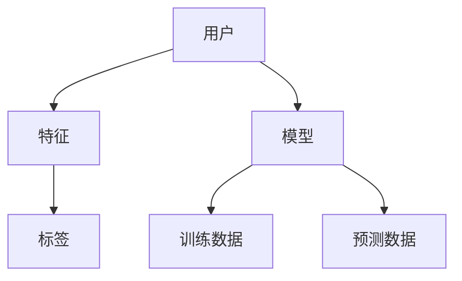
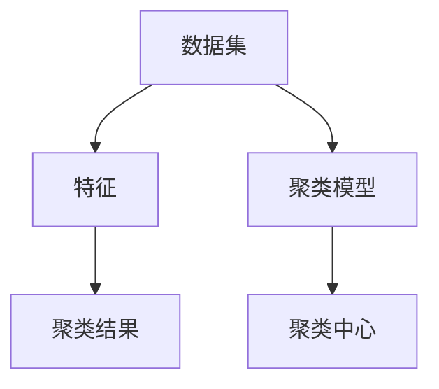
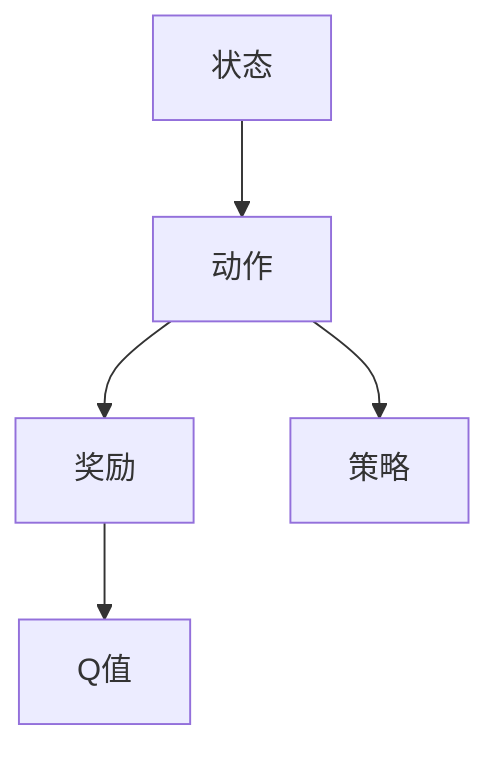
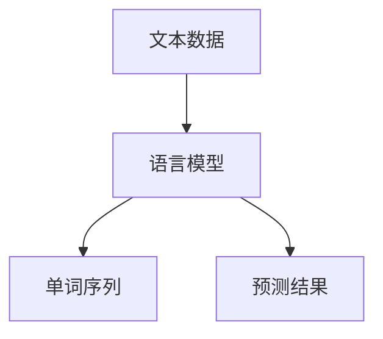
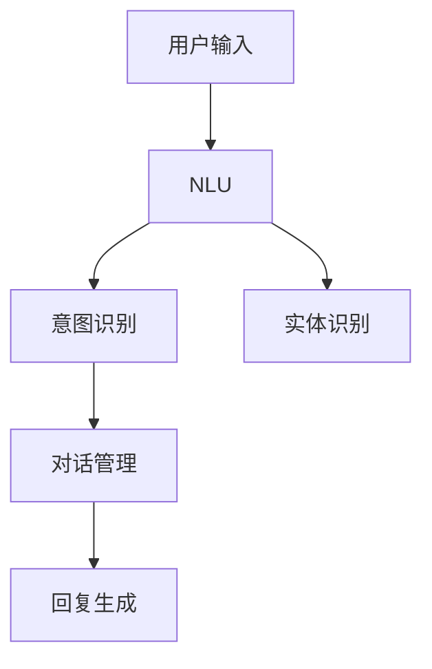
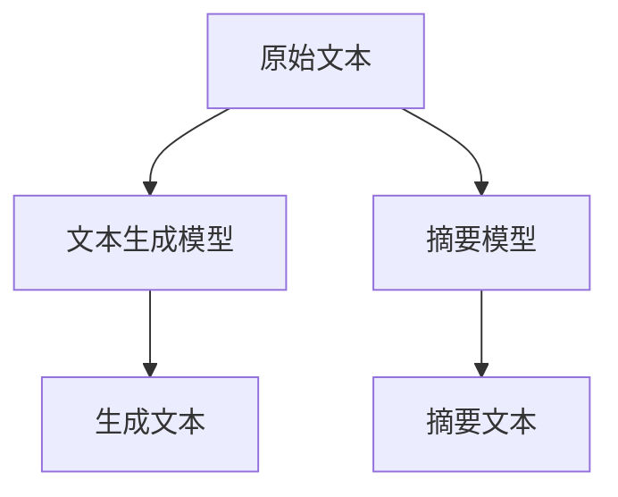
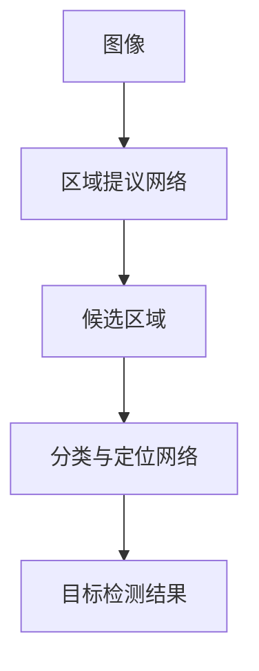
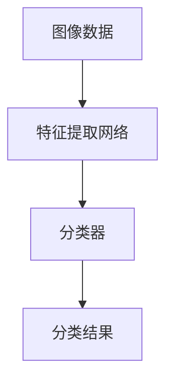

                 


### 引言

#### 1.1 问题背景

AI Agent，作为一种智能化的虚拟代理，正在逐步改变着我们的工作和生活方式。它们能够模拟人类行为，自主学习和适应环境，具备决策能力和交互能力。随着人工智能技术的飞速发展，AI Agent的应用领域也越来越广泛，从智能客服、智能推荐系统，到自动驾驶、智能家居，无不体现出AI Agent的商业化潜力和价值。

然而，将AI Agent从原型推向产品的过程并非一帆风顺。在这一过程中，面临着诸多挑战，如技术可行性、市场接受度、数据隐私和安全性等问题。如何克服这些挑战，实现AI Agent的商业化，成为了当前学术界和工业界共同关注的问题。

本文将围绕AI Agent商业化的全过程进行深入探讨，从技术基础、原型开发、产品化、市场推广等各个环节进行分析，旨在为从事AI Agent研究和开发的工程师提供一套完整的解决方案。

#### 1.2 问题描述

从原型到产品的转化过程中，AI Agent面临以下关键问题：

1. **技术挑战**：如何确保AI Agent在复杂多变的环境中稳定运行，并具备高效的处理能力？
2. **市场需求**：如何准确把握用户需求，设计出符合市场需求的AI Agent产品？
3. **数据安全**：如何在保证用户隐私的前提下，获取和利用数据进行AI Agent的优化和改进？
4. **商业模型**：如何构建合理的商业模型，实现AI Agent的商业化盈利？
5. **法律合规**：如何遵守相关法律法规，确保AI Agent的开发和使用合法合规？

#### 1.3 问题解决

为了解决上述问题，本文将从以下几个方面进行探讨：

1. **AI Agent技术基础**：介绍AI Agent的基本原理、核心算法、评估方法等，为后续开发提供理论基础。
2. **AI Agent原型开发**：阐述AI Agent原型设计、实现和评估的详细步骤，为实际开发提供指导。
3. **AI Agent产品化**：分析AI Agent从原型到产品的转化过程，包括技术整合、市场定位、商业模式构建等。
4. **市场推广**：探讨如何进行AI Agent的市场推广，包括用户调研、营销策略、渠道选择等。
5. **法律与伦理**：讨论AI Agent开发和使用中的法律合规问题，以及如何遵循伦理道德原则。

通过以上步骤，我们希望能够为AI Agent的商业化提供一套系统化的解决方案，帮助读者更好地理解AI Agent的商业化之路。

#### 1.4 边界与外延

在讨论AI Agent商业化时，我们需要明确其边界和外部影响因素。首先，AI Agent的边界涉及技术能力、业务场景和用户需求等方面。例如，一个智能家居AI Agent需要具备语音识别、环境感知、智能控制等技术能力，同时需要适应家庭场景中的各种使用需求。

其次，商业化过程中的外部因素主要包括市场环境、法律法规和行业竞争等。市场环境的变化，如消费者需求的变化、技术趋势的演变，都会对AI Agent的商业化产生影响。法律法规的约束，如数据保护法规、隐私政策等，也要求企业在开发AI Agent时必须遵循相关法律法规。此外，行业竞争的激烈程度也会影响AI Agent的商业化进程，企业需要不断创新和优化，才能在竞争中脱颖而出。

#### 1.5 概念结构与核心要素组成

AI Agent的核心概念包括智能代理、自主性、适应性、交互性和学习性等。这些概念共同构成了AI Agent的基本框架，使其能够模拟人类行为，进行决策和交互。

在商业化过程中，AI Agent的核心要素包括：

1. **技术要素**：包括机器学习、自然语言处理、计算机视觉等核心技术，这些技术是实现AI Agent智能化的基础。
2. **市场要素**：涉及用户需求、市场定位、竞争分析等，这些要素决定了AI Agent能否满足市场需求，具备商业价值。
3. **营销与推广**：包括品牌建设、市场营销策略、渠道选择等，这些要素决定了AI Agent能否在市场中得到广泛认可和接受。

通过以上核心概念和要素的有机组合，AI Agent可以实现从原型到产品的顺利转化，实现商业化的目标。

### 第二部分: AI Agent技术基础

#### 2.1 AI Agent技术概述

AI Agent，全称为人工智能代理，是人工智能领域的一个重要分支。AI Agent能够模拟人类的行为和思维，具备自主性、适应性、交互性和学习性等特点。其基本原理是通过机器学习、自然语言处理、计算机视觉等人工智能技术，实现对环境的感知、理解和响应。

##### 2.1.1 AI Agent的构成要素

AI Agent的构成主要包括以下几个要素：

1. **感知模块**：负责从环境中获取信息，如图像、声音、文本等。
2. **决策模块**：基于感知模块获取的信息，进行决策和规划，确定下一步行动。
3. **执行模块**：根据决策模块的输出，执行具体的操作。
4. **学习模块**：通过不断的学习和优化，提高AI Agent的智能水平和适应能力。

##### 2.1.2 AI Agent的工作机制

AI Agent的工作机制可以概括为以下几个步骤：

1. **感知**：AI Agent通过感知模块获取环境信息。
2. **理解**：基于机器学习和自然语言处理技术，AI Agent对感知到的信息进行理解和分析。
3. **决策**：AI Agent根据理解和分析的结果，通过决策模块确定下一步的行动。
4. **执行**：执行模块根据决策结果，执行具体的操作。
5. **学习**：通过不断的学习和优化，AI Agent提高其智能水平和适应能力。

#### 2.2 AI Agent的类型

AI Agent可以根据其应用领域和功能特点进行分类，主要包括以下几种类型：

##### 2.2.1 通用AI Agent

通用AI Agent具有广泛的适应能力和自主性，可以处理多种不同类型的任务。例如，通用智能代理（General Intelligent Agent）可以模拟人类的思维和行为，具备推理、规划、学习等多种能力。这种类型的AI Agent通常需要强大的计算能力和复杂的学习算法。

##### 2.2.2 特定领域AI Agent

特定领域AI Agent专注于某一特定领域的任务，如智能客服、智能推荐系统、自动驾驶等。这类AI Agent针对特定场景进行优化，具有较高的任务完成效率和精确度。例如，自动驾驶AI Agent需要具备高度的环境感知能力和实时决策能力，以确保车辆的安全行驶。

#### 2.3 AI Agent的发展趋势

随着人工智能技术的不断进步，AI Agent的发展趋势也日益明显。以下是一些重要的发展趋势：

##### 2.3.1 人工智能技术的前沿进展

人工智能技术的前沿进展，如深度学习、生成对抗网络（GAN）、强化学习等，为AI Agent的发展提供了新的技术基础。这些技术使得AI Agent在处理复杂任务、提升智能水平方面取得了显著进展。

##### 2.3.2 AI Agent的未来发展方向

未来，AI Agent的发展将主要集中在以下几个方面：

1. **多模态感知与交互**：结合多种感知技术，如视觉、听觉、触觉等，实现更加丰富和自然的用户交互。
2. **个性化与自适应**：通过深度学习和强化学习等技术，实现AI Agent的个性化定制和自适应能力，更好地满足用户需求。
3. **边缘计算与分布式智能**：利用边缘计算技术，将AI Agent的计算任务分布到边缘设备，提高实时性和计算效率。
4. **伦理与法律合规**：随着AI Agent的商业化应用，如何确保其伦理和法律合规将成为重要议题。

#### 2.4 AI Agent技术的挑战与机遇

尽管AI Agent技术在不断进步，但在实际应用过程中仍面临诸多挑战：

##### 2.4.1 挑战

1. **技术复杂性**：AI Agent的开发涉及多个学科和技术领域，技术复杂性较高。
2. **数据隐私与安全**：AI Agent需要大量数据来训练和优化，数据隐私和安全问题亟待解决。
3. **法律与伦理**：随着AI Agent的商业化应用，相关法律法规和伦理道德问题也需要引起重视。

##### 2.4.2 机遇

1. **市场需求**：随着人工智能技术的普及，市场对AI Agent的需求日益增长，为AI Agent的商业化提供了广阔的市场空间。
2. **技术创新**：人工智能技术的不断进步为AI Agent的发展提供了新的动力，有助于解决现有技术难题。
3. **跨界合作**：AI Agent技术的发展将推动不同行业之间的跨界合作，促进产业升级和创新发展。

### 2.5 AI Agent技术的未来展望

未来，AI Agent技术将在多个领域发挥重要作用，如智慧城市、智能医疗、智能制造等。随着技术的不断进步和商业化应用的深入，AI Agent将成为人工智能领域的重要分支，为人类社会带来更加智能、便捷和高效的服务。

通过本文的讨论，我们希望能够为读者提供一个全面、系统的AI Agent技术概述，为后续章节的内容奠定基础。

#### 3.1 机器学习基础

机器学习是AI Agent的核心技术之一，通过训练模型来使计算机具备对数据进行分析和预测的能力。在AI Agent中，机器学习主要用于实现感知模块、决策模块和执行模块的功能。

##### 3.1.1 监督学习

监督学习是一种常见的机器学习范式，其主要特点是需要有标签的训练数据。监督学习算法通过学习输入和输出之间的映射关系，实现对未知数据的预测。

**核心概念与联系**：

- **监督学习算法**：包括线性回归、逻辑回归、决策树、随机森林、支持向量机等。
- **损失函数**：用于评估模型预测结果与真实值之间的差距，如均方误差（MSE）、交叉熵损失等。
- **优化算法**：用于最小化损失函数，如梯度下降、随机梯度下降等。

**概念属性特征对比表格**：

| 算法       | 特点                                                         | 适用场景                            |
| ---------- | ------------------------------------------------------------ | ----------------------------------- |
| 线性回归   | 输出为连续值                                                 | 线性可分数据、简单回归问题           |
| 逻辑回归   | 输出为概率值                                                 | 二分类问题、多分类问题               |
| 决策树     | 根据特征进行二分决策                                         | 简单的决策问题、特征较多的情况       |
| 随机森林   | 由多个决策树组成，减少过拟合现象                             | 复杂的决策问题、特征较多的情况       |
| 支持向量机 | 寻找最佳超平面，将数据分类                                   | 线性可分数据、高维空间分类问题       |

**ER实体关系图架构**：



**监督学习算法实例**：

以下是一个简单的线性回归算法实例：

```python
import numpy as np
from sklearn.linear_model import LinearRegression

# 创建线性回归模型
model = LinearRegression()

# 模型训练
model.fit(X_train, y_train)

# 模型预测
y_pred = model.predict(X_test)
```

##### 3.1.2 无监督学习

无监督学习不需要标签数据，其主要目标是发现数据中的结构和模式。无监督学习算法在AI Agent中主要用于数据降维、聚类和关联规则挖掘等任务。

**核心概念与联系**：

- **聚类算法**：如K-means、DBSCAN、层次聚类等。
- **降维算法**：如主成分分析（PCA）、t-SNE等。
- **关联规则挖掘**：如Apriori算法、FP-Growth算法等。

**概念属性特征对比表格**：

| 算法       | 特点                                                         | 适用场景                            |
| ---------- | ------------------------------------------------------------ | ----------------------------------- |
| K-means    | 基于距离度量进行聚类                                         | 离散数据、初始聚类中心已知          |
| DBSCAN     | 基于密度进行聚类                                             | 连通性较强的数据、噪声数据          |
| 层次聚类   | 自底向上或自顶向下进行聚类                                   | 离散数据、需要层次结构               |
| PCA        | 主成分分析，降维                                             | 复杂数据、线性可分                  |
| t-SNE      | 高维数据降维，可视化                                         | 高维数据、非线性可分                |

**ER实体关系图架构**：



**无监督学习算法实例**：

以下是一个简单的K-means聚类算法实例：

```python
from sklearn.cluster import KMeans
import matplotlib.pyplot as plt

# 创建K-means模型
model = KMeans(n_clusters=3)

# 模型训练
model.fit(X)

# 模型预测
y = model.predict(X)

# 可视化
plt.scatter(X[:, 0], X[:, 1], c=y)
plt.show()
```

##### 3.1.3 强化学习

强化学习是一种通过试错和反馈来学习的机器学习范式。在AI Agent中，强化学习主要用于实现决策模块的功能，使AI Agent能够在复杂环境中进行自主决策。

**核心概念与联系**：

- **强化学习算法**：如Q-Learning、SARSA、DQN等。
- **奖励机制**：用于指导AI Agent的行为，使其最大化长期收益。
- **策略**：AI Agent根据当前状态选择动作的策略。

**概念属性特征对比表格**：

| 算法       | 特点                                                         | 适用场景                            |
| ---------- | ------------------------------------------------------------ | ----------------------------------- |
| Q-Learning | 通过更新Q值来指导行为                                       | 离散状态和动作空间                  |
| SARSA      | 基于当前状态和动作来更新Q值                                 | 连续状态和动作空间                  |
| DQN        | 深度强化学习，使用深度神经网络来表示Q值                     | 复杂状态和动作空间                  |

**ER实体关系图架构**：



**强化学习算法实例**：

以下是一个简单的Q-Learning算法实例：

```python
import numpy as np
import random

# 初始化Q值表格
Q = np.zeros((n_states, n_actions))

# 学习率、折扣率、探索率
alpha = 0.1
gamma = 0.9
epsilon = 0.1

# Q-Learning算法
for episode in range(n_episodes):
    state = random.randint(0, n_states - 1)
    while True:
        action = random.randint(0, n_actions - 1)
        next_state, reward = get_next_state_and_reward(state, action)
        Q[state, action] = Q[state, action] + alpha * (reward + gamma * np.max(Q[next_state, :]) - Q[state, action])
        state = next_state
        if done:
            break
```

通过上述内容，我们介绍了机器学习基础，包括监督学习、无监督学习和强化学习的基本概念、算法实例和ER实体关系图架构。这些内容为后续的AI Agent原型开发提供了理论基础。

#### 3.2 自然语言处理技术

自然语言处理（Natural Language Processing，NLP）是AI Agent中不可或缺的一环，它使得AI Agent能够理解、生成和操作人类语言。NLP技术主要涉及文本处理、语义理解和语言生成等方面。以下将详细探讨NLP技术的基本概念、主要算法以及其在AI Agent中的应用。

##### 3.2.1 语言模型

语言模型（Language Model）是NLP的核心组成部分，其主要任务是预测一段文本的下一个单词或字符。语言模型通过学习大量的语言数据，捕捉语言中的统计规律和模式，从而实现文本生成和文本理解。

**核心概念与联系**：

- **N-gram模型**：基于前N个单词或字符的历史信息来预测下一个单词或字符。
- **神经网络语言模型**：如循环神经网络（RNN）、长短时记忆网络（LSTM）和变换器（Transformer）等，这些模型能够捕捉更复杂的语言模式。

**概念属性特征对比表格**：

| 模型       | 特点                                                         | 适用场景                            |
| ---------- | ------------------------------------------------------------ | ----------------------------------- |
| N-gram     | 基于历史单词或字符序列进行预测                               | 简单文本生成、快速预测               |
| RNN        | 能够处理序列数据，记忆长期依赖关系                             | 语言建模、文本分类、序列预测       |
| LSTM       | 改进了RNN，能够更好地记忆长期依赖关系                           | 机器翻译、情感分析、语音识别       |
| Transformer | 基于自注意力机制，能够处理长序列和并行计算                     | 语言建模、机器翻译、文本生成       |

**ER实体关系图架构**：



**语言模型实例**：

以下是一个基于Transformer的简单语言模型实例：

```python
import torch
from transformers import BertModel, BertTokenizer

# 加载预训练模型
tokenizer = BertTokenizer.from_pretrained('bert-base-uncased')
model = BertModel.from_pretrained('bert-base-uncased')

# 输入文本
text = "The quick brown fox jumps over the lazy dog"

# 分词和编码
input_ids = tokenizer.encode(text, return_tensors='pt')

# 模型预测
with torch.no_grad():
    outputs = model(input_ids)

# 输出预测结果
predictions = torch.softmax(outputs.logits, dim=-1)
predicted_words = tokenizer.decode(predictions.argmax(-1))
print(predicted_words)
```

##### 3.2.2 对话系统

对话系统（Dialogue System）是一种能够与人类进行自然语言交互的AI Agent。对话系统主要包括两个部分：对话管理（Dialogue Management）和自然语言理解（Natural Language Understanding，NLU）。

**核心概念与联系**：

- **对话管理**：负责管理对话流程，包括意图识别、上下文维护和回复生成等。
- **自然语言理解**：将用户输入的自然语言转换为结构化的数据，用于对话管理和响应生成。

**概念属性特征对比表格**：

| 模块       | 特点                                                         | 适用场景                            |
| ---------- | ------------------------------------------------------------ | ----------------------------------- |
| 对话管理   | 负责对话流程的管理和协调                                     | 智能客服、语音助手、聊天机器人等     |
| NLU        | 负责自然语言的理解和解析                                     | 意图识别、实体识别、情感分析等       |

**ER实体关系图架构**：



**对话系统实例**：

以下是一个简单的基于规则和模板的对话系统实例：

```python
class DialogueSystem:
    def __init__(self):
        self.rules = {
            "greeting": ["Hello", "Hi", "Hey"],
            "farewell": ["Bye", "See you", "Talk to you later"],
            "default": ["I'm not sure how to respond to that."]
        }
        self.templates = {
            "greeting": "Hello! How can I help you today?",
            "farewell": "Goodbye! Have a great day!"
        }

    def get_response(self, input_text):
        for rule in self.rules["greeting"]:
            if rule in input_text:
                return self.templates["greeting"]
                break
        for rule in self.rules["farewell"]:
            if rule in input_text:
                return self.templates["farewell"]
                break
        return self.templates["default"]

# 创建对话系统实例
system = DialogueSystem()

# 用户输入
user_input = "Hello"

# 获取响应
response = system.get_response(user_input)
print(response)
```

##### 3.2.3 文本生成与摘要

文本生成与摘要（Text Generation and Summarization）是NLP的重要应用领域，其主要目标是自动生成文本或提取文本的关键信息。

**核心概念与联系**：

- **文本生成**：通过语言模型或生成式模型生成新的文本。
- **文本摘要**：通过提取式模型或压缩式模型提取文本的主要信息。

**概念属性特征对比表格**：

| 算法       | 特点                                                         | 适用场景                            |
| ---------- | ------------------------------------------------------------ | ----------------------------------- |
| 序列到序列模型 | 通过学习输入和输出的序列关系进行文本生成                     | 自动文本生成、机器翻译             |
| 提取式摘要   | 从原始文本中提取关键信息进行摘要                             | 文本摘要、新闻摘要                 |
| 压缩式摘要   | 通过生成一个新的文本来替代原始文本的主要信息                 | 文本摘要、对话生成                 |

**ER实体关系图架构**：



**文本生成与摘要实例**：

以下是一个简单的文本生成实例：

```python
from transformers import GPT2LMHeadModel, GPT2Tokenizer

# 加载预训练模型
tokenizer = GPT2Tokenizer.from_pretrained('gpt2')
model = GPT2LMHeadModel.from_pretrained('gpt2')

# 输入文本
input_text = "The weather is sunny today."

# 生成文本
input_ids = tokenizer.encode(input_text, return_tensors='pt')
output_ids = model.generate(input_ids, max_length=50, num_return_sequences=1)

# 解码输出文本
generated_text = tokenizer.decode(output_ids[0], skip_special_tokens=True)
print(generated_text)
```

通过上述内容，我们详细介绍了自然语言处理技术的基本概念、算法实例和ER实体关系图架构。这些技术为AI Agent的理解、交互和生成文本提供了强大的支持，是AI Agent实现智能化的关键。

#### 3.3 计算机视觉基础

计算机视觉（Computer Vision）是AI Agent中的重要技术之一，它使得AI Agent能够理解和解释视觉信息，从而实现自动化任务和智能决策。计算机视觉涉及图像识别、目标检测、图像分类等多个子领域。以下将详细探讨计算机视觉的基础概念、主要算法及其在AI Agent中的应用。

##### 3.3.1 目标检测

目标检测（Object Detection）是计算机视觉中的一项重要任务，其目标是识别图像中的多个对象，并标注出这些对象的位置。目标检测算法通常分为两类：单阶段检测器和多阶段检测器。

**核心概念与联系**：

- **单阶段检测器**：如YOLO（You Only Look Once），直接从图像中预测物体的位置和类别。
- **多阶段检测器**：如Faster R-CNN（Region-based Convolutional Neural Networks），先使用区域提议网络（Region Proposal Network）生成候选区域，再在这些区域上进行分类和定位。

**概念属性特征对比表格**：

| 算法       | 特点                                                         | 适用场景                            |
| ---------- | ------------------------------------------------------------ | ----------------------------------- |
| YOLO       | 高效、实时                                                   | 实时目标检测、自动驾驶             |
| Faster R-CNN | 精准、效果较好                                               | 复杂目标检测、图像识别             |

**ER实体关系图架构**：



**目标检测算法实例**：

以下是一个简单的YOLO算法实例：

```python
import cv2
import numpy as np

# 加载YOLO模型
net = cv2.dnn.readNet("yolov3.weights", "yolov3.cfg")

# 加载图像
image = cv2.imread("image.jpg")

# 将图像输入到YOLO模型中
blob = cv2.dnn.blobFromImage(image, 1/255.0, (416, 416), [0, 0, 0], True, crop=False)
net.setInput(blob)

# 前向传播，获取检测框和类别概率
detections = net.forward()

# 遍历检测框和类别概率
for detection in detections:
    scores = detection[5:]
    class_id = np.argmax(scores)
    confidence = scores[class_id]

    if confidence > 0.5:
        center_x = int(detection[0] * image.shape[1])
        center_y = int(detection[1] * image.shape[0])
        width = int(detection[2] * image.shape[1])
        height = int(detection[3] * image.shape[0])

        x = int(center_x - width / 2)
        y = int(center_y - height / 2)

        cv2.rectangle(image, (x, y), (x + width, y + height), (0, 255, 0), 2)
        cv2.putText(image, f"{class_id}: {confidence:.2f}", (x, y - 10), cv2.FONT_HERSHEY_SIMPLEX, 0.5, (0, 255, 0), 2)

# 显示检测结果
cv2.imshow("Object Detection", image)
cv2.waitKey(0)
cv2.destroyAllWindows()
```

##### 3.3.2 图像分类

图像分类（Image Classification）是计算机视觉中的基础任务，其目标是将图像分类到预定义的类别中。常见的图像分类算法包括基于传统算法的分类器和深度学习算法的分类器。

**核心概念与联系**：

- **传统算法**：如支持向量机（SVM）、k最近邻（k-NN）等。
- **深度学习算法**：如卷积神经网络（CNN）、迁移学习等。

**概念属性特征对比表格**：

| 算法       | 特点                                                         | 适用场景                            |
| ---------- | ------------------------------------------------------------ | ----------------------------------- |
| SVM        | 高效、效果好                                                 | 中等复杂度图像分类                 |
| k-NN       | 简单、直观                                                   | 低复杂度图像分类                   |
| CNN        | 能够处理高维数据，效果好                                     | 高复杂度图像分类、物体识别         |
| 迁移学习   | 利用预训练模型进行快速训练，效果好                           | 新任务图像分类、数据不足的情况     |

**ER实体关系图架构**：



**图像分类算法实例**：

以下是一个简单的CNN图像分类实例：

```python
import tensorflow as tf
from tensorflow.keras.models import Sequential
from tensorflow.keras.layers import Conv2D, MaxPooling2D, Flatten, Dense

# 构建CNN模型
model = Sequential([
    Conv2D(32, (3, 3), activation='relu', input_shape=(64, 64, 3)),
    MaxPooling2D((2, 2)),
    Conv2D(64, (3, 3), activation='relu'),
    MaxPooling2D((2, 2)),
    Conv2D(128, (3, 3), activation='relu'),
    MaxPooling2D((2, 2)),
    Flatten(),
    Dense(128, activation='relu'),
    Dense(1, activation='sigmoid')
])

# 编译模型
model.compile(optimizer='adam', loss='binary_crossentropy', metrics=['accuracy'])

# 训练模型
model.fit(x_train, y_train, epochs=10, validation_data=(x_val, y_val))

# 测试模型
test_loss, test_acc = model.evaluate(x_test, y_test)
print(f"Test accuracy: {test_acc:.2f}")
```

##### 3.3.3 计算机视觉应用

计算机视觉技术在AI Agent中有着广泛的应用，如图像识别、物体检测、图像分割、人脸识别等。以下是一些常见的计算机视觉应用场景：

- **图像识别**：用于识别图像中的物体、场景或文本，如智能手机中的图像搜索功能。
- **物体检测**：用于检测图像中的多个对象，并标注出它们的位置，如自动驾驶车辆中的行人检测。
- **图像分割**：用于将图像分割成多个区域，用于物体识别或图像编辑，如医疗影像分析中的肿瘤分割。
- **人脸识别**：用于识别和验证人脸，如安防系统、智能手机解锁等。

通过上述内容，我们详细介绍了计算机视觉的基础概念、主要算法和实际应用。计算机视觉技术在AI Agent中的应用，使得AI Agent能够更好地理解和解释视觉信息，从而实现更加智能化的功能。

### 第三部分: AI Agent原型开发

#### 5.1 AI Agent原型设计

AI Agent的原型设计是AI Agent开发过程中的重要环节，它直接决定了AI Agent的功能性和可行性。原型设计主要包括需求分析、技术选型和系统架构设计等步骤。

##### 5.1.1 需求分析

需求分析是原型设计的第一步，其主要目的是明确AI Agent的功能需求、性能需求和用户需求。以下是一个简化的需求分析过程：

1. **用户需求调研**：通过问卷调查、用户访谈等方式，了解用户对AI Agent的期望和需求。
2. **业务流程设计**：根据用户需求，设计AI Agent的业务流程，包括用户输入、AI Agent处理、输出结果等环节。
3. **功能需求梳理**：明确AI Agent应具备的核心功能，如语音识别、自然语言理解、智能推荐等。

##### 5.1.2 技术选型

技术选型是原型设计的核心环节，它决定了AI Agent的技术架构和实现方案。以下是一个简化的技术选型过程：

1. **硬件选型**：根据AI Agent的性能需求，选择合适的硬件设备，如CPU、GPU、存储设备等。
2. **软件选型**：选择合适的开发环境和工具，如操作系统、编程语言、框架等。
3. **算法选型**：根据功能需求，选择合适的机器学习算法和自然语言处理算法，如神经网络、深度学习框架等。

##### 5.1.3 系统架构设计

系统架构设计是原型设计的最后一步，它决定了AI Agent的整体结构和运行模式。以下是一个简化的系统架构设计过程：

1. **感知模块设计**：包括图像、语音、文本等感知数据源的处理和预处理。
2. **决策模块设计**：包括基于机器学习和自然语言处理算法的决策模型和策略。
3. **执行模块设计**：包括执行决策模块输出的操作，如控制硬件设备、发送消息等。
4. **学习模块设计**：包括基于数据反馈的模型优化和算法改进。

#### 5.2 AI Agent原型实现

AI Agent的原型实现是将设计转化为实际可运行系统的过程。以下是一个简化的原型实现过程：

##### 5.2.1 数据准备

数据准备是原型实现的第一步，它包括数据的收集、预处理和质量控制等环节。以下是一个简化的数据准备过程：

1. **数据收集**：根据需求分析，收集相关的图像、语音、文本数据。
2. **数据预处理**：对收集到的数据进行清洗、归一化和特征提取等操作。
3. **数据质量控制**：通过数据清洗和去重等方法，确保数据的质量和一致性。

##### 5.2.2 模型训练

模型训练是原型实现的核心环节，它包括训练数据集的选择、模型架构的搭建和训练过程的监控等。以下是一个简化的模型训练过程：

1. **训练数据集选择**：根据功能需求，选择合适的训练数据集，如图像分类数据集、自然语言处理数据集等。
2. **模型架构搭建**：选择合适的模型架构，如卷积神经网络（CNN）、循环神经网络（RNN）等，搭建模型。
3. **训练过程监控**：通过监控训练过程中的指标，如损失函数、准确率等，调整训练参数，优化模型性能。

##### 5.2.3 模型评估

模型评估是原型实现的最后一步，它通过测试数据集来评估模型的性能和稳定性。以下是一个简化的模型评估过程：

1. **测试数据集选择**：根据需求分析，选择合适的测试数据集，确保测试结果的客观性和准确性。
2. **模型性能评估**：通过计算模型的准确率、召回率、F1值等指标，评估模型的性能。
3. **稳定性评估**：通过多次训练和测试，确保模型在不同场景下的稳定性和鲁棒性。

#### 5.3 AI Agent原型评估

AI Agent原型的评估是确保其功能和性能满足需求的重要环节。以下是一个简化的原型评估过程：

##### 5.3.1 性能评估

性能评估主要通过测试数据集来评估AI Agent的原型性能。以下是一个简化的性能评估过程：

1. **测试数据集准备**：根据功能需求，准备测试数据集，确保数据集的多样性和覆盖性。
2. **性能指标计算**：计算AI Agent原型在测试数据集上的各项性能指标，如准确率、召回率、F1值等。
3. **性能分析**：根据性能指标分析AI Agent原型在各项任务上的表现，找出性能瓶颈和优化方向。

##### 5.3.2 用户满意度评估

用户满意度评估是通过用户反馈来评估AI Agent原型用户体验的重要环节。以下是一个简化的用户满意度评估过程：

1. **用户调研**：通过问卷调查、用户访谈等方式，收集用户对AI Agent原型的使用体验和满意度。
2. **满意度计算**：根据用户反馈，计算AI Agent原型的用户满意度，如通过评分、满意度调查等。
3. **用户反馈分析**：分析用户反馈，找出用户满意度低的原因，优化AI Agent原型。

##### 5.3.3 评估总结

评估总结是原型评估的最后一步，它通过对性能评估和用户满意度评估的结果进行分析，总结原型开发的优点和不足，为后续优化和改进提供参考。以下是一个简化的评估总结过程：

1. **评估结果分析**：分析性能评估和用户满意度评估的结果，找出原型开发的优点和不足。
2. **优化建议**：根据评估结果，提出优化AI Agent原型的建议，如改进算法、优化用户界面等。
3. **总结与展望**：总结原型开发的经验教训，展望后续开发的方向和目标。

通过上述内容，我们详细介绍了AI Agent原型设计的步骤、原型实现的流程和原型评估的方法。这些内容为AI Agent的原型开发提供了系统的指导和参考。

### 第四部分: AI Agent产品化

#### 6.1 技术整合

将AI Agent原型转化为产品是一个复杂的过程，其中技术整合是关键的一步。技术整合的主要目的是将原型中的各个技术模块集成在一起，实现一个稳定、高效、可扩展的系统。

##### 6.1.1 技术整合流程

技术整合的流程可以概括为以下几个步骤：

1. **模块划分**：将原型中的各个技术模块（如感知模块、决策模块、执行模块等）进行划分，明确每个模块的功能和接口。
2. **接口设计**：设计各模块之间的接口，确保模块之间可以无缝对接，数据流转顺畅。
3. **系统集成**：将各个模块集成到一个完整的系统中，进行系统集成测试，确保系统各部分协同工作。
4. **性能优化**：对系统进行性能优化，包括算法优化、资源利用优化等，以提高系统的响应速度和稳定性。

##### 6.1.2 技术整合方法

技术整合的方法主要包括以下几种：

1. **微服务架构**：将系统划分为多个微服务，每个微服务负责一个特定的功能模块，通过RESTful API进行通信，实现模块之间的解耦和可扩展性。
2. **容器化与编排**：使用Docker等容器技术，将各个模块打包成容器，通过Kubernetes等编排工具进行管理，实现系统的自动化部署和运维。
3. **云计算平台**：利用云计算平台（如AWS、Azure、Google Cloud等）提供的资源和工具，实现系统的弹性扩展和高效计算。

#### 6.2 市场定位

市场定位是产品化过程中的重要环节，它决定了AI Agent产品的目标市场和竞争优势。以下是一个简化的市场定位过程：

##### 6.2.1 市场细分

市场细分是将整个市场划分为若干个子市场，根据用户的特征和需求，将用户划分为不同的群体。以下是一些常见的市场细分方法：

1. **按行业细分**：根据用户所在的行业，如金融、医疗、教育等，进行市场细分。
2. **按用户规模细分**：根据用户的规模，如小型企业、中型企业、大型企业等，进行市场细分。
3. **按用户需求细分**：根据用户的需求，如特定功能、特定场景等，进行市场细分。

##### 6.2.2 目标市场选择

目标市场选择是基于市场细分的结果，确定AI Agent产品的目标市场。以下是一些目标市场选择的方法：

1. **最大化市场份额**：选择市场规模最大、增长最快的子市场作为目标市场。
2. **最大化利润**：选择市场规模适中、利润较高的子市场作为目标市场。
3. **差异化竞争**：选择竞争对手力量较弱、自身有独特优势的子市场作为目标市场。

##### 6.2.3 竞争优势分析

竞争优势分析是确定AI Agent产品在目标市场中的竞争优势。以下是一些常见的竞争优势分析方法：

1. **技术优势**：分析AI Agent在技术方面的独特优势，如算法性能、功能丰富性等。
2. **品牌优势**：分析AI Agent的品牌知名度、用户口碑等。
3. **服务优势**：分析AI Agent在售后服务、客户支持等方面的优势。

#### 6.3 商业模式构建

商业模式构建是产品化的关键一步，它决定了AI Agent产品的盈利模式和可持续发展。以下是一个简化的商业模式构建过程：

##### 6.3.1 收入模式设计

收入模式设计是商业模式的核心，它决定了AI Agent产品的盈利方式。以下是一些常见的收入模式设计方法：

1. **软件许可**：向用户收取软件许可费用，包括一次性许可费和年度许可费。
2. **订阅模式**：用户按月或按年订阅AI Agent服务，根据使用量收取费用。
3. **增值服务**：提供额外的增值服务，如高级功能、定制开发等，向用户收取额外费用。

##### 6.3.2 成本模式设计

成本模式设计是商业模式的基础，它决定了AI Agent产品的成本结构和利润水平。以下是一些常见的成本模式设计方法：

1. **固定成本**：如研发成本、运维成本等，不随产品销售量的变化而变化。
2. **可变成本**：如服务器租赁费、数据采购费等，随产品销售量的变化而变化。
3. **边际成本**：生产每个额外单位产品所需的成本，通常较低。

##### 6.3.3 盈利模式分析

盈利模式分析是对收入模式和成本模式进行综合分析，评估AI Agent产品的盈利能力和可持续性。以下是一些常见的盈利模式分析方法：

1. **成本收益分析**：计算AI Agent产品的总成本和总收入，评估产品的盈利能力。
2. **盈利能力分析**：分析AI Agent产品的利润率、毛利率等指标，评估产品的盈利能力。
3. **风险评估**：分析AI Agent产品面临的风险，如市场竞争风险、技术风险等，评估产品的可持续性。

#### 6.4 产品化过程

产品化是将AI Agent原型转化为成熟产品的过程，它涉及技术整合、市场定位、商业模式构建等多个环节。以下是一个简化的产品化过程：

##### 6.4.1 原型验证

原型验证是对AI Agent原型的功能和性能进行测试和评估，确保原型满足市场需求和设计要求。以下是一个简化的原型验证过程：

1. **功能验证**：验证AI Agent原型是否实现了预定的功能。
2. **性能验证**：验证AI Agent原型在性能上的表现，如响应时间、处理速度等。
3. **用户验证**：通过用户测试，收集用户对AI Agent原型的反馈，改进原型。

##### 6.4.2 产品规划

产品规划是制定AI Agent产品的长期发展计划，包括产品路线图、市场需求分析、技术发展方向等。以下是一个简化的产品规划过程：

1. **产品路线图**：制定AI Agent产品的开发路线图，明确每个版本的功能和发布时间。
2. **市场需求分析**：分析市场需求，确定AI Agent产品的关键功能和用户痛点。
3. **技术发展方向**：根据市场需求，规划AI Agent产品的技术发展方向，如算法优化、功能扩展等。

##### 6.4.3 产品发布

产品发布是将AI Agent产品推向市场的重要环节，它涉及市场推广、渠道建设、售后服务等。以下是一个简化的产品发布过程：

1. **市场推广**：制定市场推广计划，通过广告、公关、社交媒体等方式，提高AI Agent产品的知名度。
2. **渠道建设**：建立销售和服务渠道，确保AI Agent产品能够快速进入市场。
3. **售后服务**：提供优质的售后服务，包括技术支持、用户培训、故障排除等，提高用户满意度。

通过上述内容，我们详细介绍了AI Agent产品化的技术整合、市场定位、商业模式构建和产品化过程。这些内容为AI Agent的商业化提供了系统的指导和支持。

### 第五部分: 市场推广

#### 7.1 用户调研

用户调研是市场推广的重要基础，它能够帮助企业准确把握用户需求，从而设计出符合市场需求的AI Agent产品。以下是一个简化的用户调研过程：

##### 7.1.1 调研目的

明确调研目的是确保调研工作的针对性和有效性。以下是一些常见的调研目的：

1. **了解用户需求**：通过调研了解用户对AI Agent的功能需求、使用场景等。
2. **评估市场潜力**：通过调研评估AI Agent产品的市场潜力和竞争对手情况。
3. **优化产品设计**：通过调研收集用户反馈，为AI Agent产品的优化提供依据。

##### 7.1.2 调研方法

调研方法的选择直接影响调研结果的质量。以下是一些常见的调研方法：

1. **问卷调查**：通过在线或离线方式，收集用户对AI Agent产品的看法和建议。
2. **用户访谈**：通过面对面或在线访谈，深入了解用户对AI Agent产品的使用体验和需求。
3. **焦点小组**：组织一组用户，就特定话题进行讨论，收集用户对AI Agent产品的反馈和建议。

##### 7.1.3 数据分析

数据分析是对调研结果进行系统分析，以提取有用的信息。以下是一些常见的数据分析方法：

1. **描述性分析**：对调研数据进行基本的统计描述，如平均数、中位数、标准差等。
2. **交叉分析**：分析不同变量之间的关系，如用户需求与产品功能之间的关系。
3. **聚类分析**：将用户按照相似性进行分类，以便更好地理解用户群体。

#### 7.2 营销策略

营销策略是推广AI Agent产品的重要手段，它包括品牌建设、广告投放、公关活动等。以下是一个简化的营销策略过程：

##### 7.2.1 品牌建设

品牌建设是提升AI Agent产品知名度的重要途径。以下是一些常见的品牌建设方法：

1. **品牌定位**：明确AI Agent产品的品牌定位，如专业、高效、创新等。
2. **品牌形象设计**：设计符合品牌定位的视觉形象，如Logo、色彩方案等。
3. **品牌传播**：通过线上线下渠道，传播品牌信息，提高品牌知名度。

##### 7.2.2 广告投放

广告投放是快速提升AI Agent产品知名度的重要手段。以下是一些常见的广告投放方法：

1. **搜索引擎广告**：在搜索引擎（如Google、Bing）上投放广告，提高产品在搜索结果中的排名。
2. **社交媒体广告**：在社交媒体平台（如Facebook、Twitter）上投放广告，针对特定用户群体进行精准投放。
3. **内容营销**：通过撰写高质量的内容（如博客、白皮书、案例研究等），吸引目标用户关注和参与。

##### 7.2.3 公关活动

公关活动是提升AI Agent产品知名度和美誉度的重要途径。以下是一些常见的公关活动方法：

1. **媒体公关**：与媒体建立良好的关系，通过新闻报道、专访等形式，提高产品知名度。
2. **活动策划**：策划和举办线上线下活动，如产品发布会、用户沙龙等，吸引目标用户参与。
3. **合作伙伴**：与行业内的合作伙伴建立合作关系，共同推广AI Agent产品。

#### 7.3 渠道选择

渠道选择是确保AI Agent产品能够有效触达目标用户的关键。以下是一个简化的渠道选择过程：

##### 7.3.1 渠道类型

渠道类型包括直接渠道和间接渠道。以下是一些常见的渠道类型：

1. **直接渠道**：包括官方网站、线下门店等，直接与用户进行互动和交易。
2. **间接渠道**：包括分销商、代理商、电商平台等，通过第三方渠道与用户进行互动和交易。

##### 7.3.2 渠道评估

渠道评估是对不同渠道进行综合评估，以确定最佳渠道组合。以下是一些常见的渠道评估方法：

1. **成本效益分析**：计算每个渠道的投入成本和预期收益，评估其经济效益。
2. **用户覆盖度**：分析每个渠道能够覆盖的用户数量和用户特征，评估其市场覆盖率。
3. **转化率**：分析每个渠道的转化率，即用户通过渠道了解到产品并最终购买产品的比例。

##### 7.3.3 渠道管理

渠道管理是确保AI Agent产品在各个渠道中有效运营的关键。以下是一些常见的渠道管理方法：

1. **渠道合作**：与渠道合作伙伴建立良好的合作关系，共同制定营销策略和推广计划。
2. **渠道培训**：为渠道合作伙伴提供产品知识和销售技能培训，提高其销售能力。
3. **渠道监控**：通过数据分析，监控各个渠道的运营情况，及时调整渠道策略。

#### 7.4 用户反馈与改进

用户反馈与改进是AI Agent产品持续优化和改进的重要环节。以下是一个简化的用户反馈与改进过程：

##### 7.4.1 用户反馈收集

用户反馈收集是获取用户对AI Agent产品的意见和建议的关键。以下是一些常见的用户反馈收集方法：

1. **在线调查**：通过在线问卷、调查表等方式，收集用户对产品的意见和建议。
2. **用户访谈**：通过面对面或在线访谈，深入了解用户对产品的使用体验和需求。
3. **社交媒体**：关注用户在社交媒体上的讨论和反馈，收集用户对产品的意见和建议。

##### 7.4.2 用户反馈分析

用户反馈分析是对用户反馈进行系统分析，提取有价值的信息。以下是一些常见的用户反馈分析方法：

1. **分类整理**：将用户反馈按照主题和内容进行分类整理，以便更好地理解用户反馈。
2. **优先级排序**：根据用户反馈的重要性和紧迫性，对反馈进行优先级排序，确定改进的重点。
3. **归档管理**：对用户反馈进行归档管理，便于后续跟踪和改进。

##### 7.4.3 产品改进

产品改进是根据用户反馈对AI Agent产品进行优化和改进。以下是一个简化的产品改进过程：

1. **需求分析**：分析用户反馈，确定产品改进的需求和方向。
2. **方案设计**：设计改进方案，包括功能优化、界面改进、性能提升等。
3. **开发与测试**：实施改进方案，进行开发和测试，确保改进的有效性和稳定性。
4. **用户验证**：通过用户测试，验证改进方案的效果，收集用户反馈，进一步优化产品。

通过上述内容，我们详细介绍了用户调研、营销策略、渠道选择和用户反馈与改进的方法。这些方法为AI Agent产品的市场推广提供了系统的指导和支持。

### 法律与伦理

在AI Agent的商业化过程中，法律和伦理问题至关重要。AI Agent作为人工智能的一种形式，涉及数据处理、隐私保护、算法公平性等多个法律和伦理领域。以下将对这些关键问题进行探讨。

#### 1. 数据隐私与保护

数据隐私是AI Agent商业化过程中最为关注的法律问题之一。AI Agent需要大量数据来训练和优化模型，这些数据可能包含用户个人信息。因此，确保数据隐私和合规性至关重要。

**法律法规**：
- **GDPR（欧盟通用数据保护条例）**：规定了数据保护的基本原则和要求，包括数据收集、处理、存储和传输等环节。
- **CCPA（美国加州消费者隐私法案）**：规定了消费者对其个人信息的控制权，包括信息收集、使用、共享等。

**合规措施**：
- **数据最小化原则**：仅收集必要的数据，避免过度收集。
- **数据加密**：对敏感数据进行加密处理，确保数据传输和存储过程中的安全性。
- **隐私政策**：制定明确的隐私政策，告知用户数据收集、使用和共享的目的和方式。
- **用户同意**：确保用户在数据收集和使用前明确同意。

#### 2. 算法公平性与透明性

算法公平性和透明性是AI Agent商业化中不可忽视的伦理问题。AI Agent的决策过程可能受到算法偏见的影响，导致歧视和不公平现象。

**法律法规**：
- **《算法道德规范》**：部分国家和地区开始出台相关法律法规，规范算法的应用，确保算法的公平性和透明性。

**合规措施**：
- **算法审计**：对AI Agent的算法进行定期审计，评估算法的公平性和透明性。
- **偏见检测与修正**：通过检测和修正算法中的偏见，确保决策过程的公平性。
- **算法解释**：提供算法的解释机制，使用户能够理解AI Agent的决策过程。

#### 3. 法律合规与风险评估

在AI Agent的商业化过程中，企业需要全面评估法律合规风险，确保产品和服务符合相关法律法规的要求。

**合规措施**：
- **合规培训**：对员工进行法律合规培训，提高合规意识和能力。
- **合规审查**：建立合规审查机制，对产品和服务进行定期审查。
- **风险评估**：进行法律合规风险评估，识别和缓解潜在的法律风险。

#### 4. 伦理责任与可持续发展

AI Agent的商业化不仅需要关注法律问题，还应承担伦理责任，推动可持续发展。

**伦理责任**：
- **社会责任**：企业应承担社会责任，确保AI Agent的应用符合社会伦理标准。
- **可持续发展**：推动AI Agent在环境保护、资源利用等方面的可持续发展。

通过遵循法律和伦理原则，AI Agent商业化可以在保障用户权益、提高社会效益的同时，实现商业成功。

### 总结与展望

通过本文的详细讨论，我们从技术基础、原型开发、产品化、市场推广和法律伦理等多个角度，系统地探讨了AI Agent从原型到产品的转化之路。在这一过程中，我们认识到AI Agent商业化的复杂性和挑战性，同时也看到了其巨大的潜力和前景。

**总结**：
- **技术基础**：AI Agent的发展离不开先进的机器学习、自然语言处理、计算机视觉等技术。深入理解这些技术原理，是成功商业化的前提。
- **原型开发**：原型设计、实现和评估是AI Agent开发的关键环节，需要充分考虑用户需求和技术可行性。
- **产品化**：技术整合、市场定位和商业模式构建是AI Agent成功商业化的保障。合理的产品规划和优化，能够提高产品的市场竞争力。
- **市场推广**：用户调研、营销策略、渠道选择和用户反馈是市场推广的核心。精准的市场推广策略能够帮助AI Agent快速占领市场。
- **法律伦理**：遵循法律法规和伦理原则，是AI Agent商业化过程中不可忽视的重要方面。

**展望**：
- **技术创新**：随着人工智能技术的不断进步，AI Agent将拥有更强大的功能，应用领域也将进一步扩大。
- **伦理与法规**：随着AI Agent的商业化应用，相关的法律法规和伦理问题将更加突出。企业需要不断创新，同时遵守相关法律法规和伦理原则。
- **可持续发展**：AI Agent商业化应注重可持续发展，关注环境保护和资源利用，推动社会效益的提升。

让我们继续探索AI Agent的商业化之路，充分发挥人工智能的潜力，为人类社会带来更多的创新和进步。作者：AI天才研究院/AI Genius Institute & 禅与计算机程序设计艺术 /Zen And The Art of Computer Programming。

