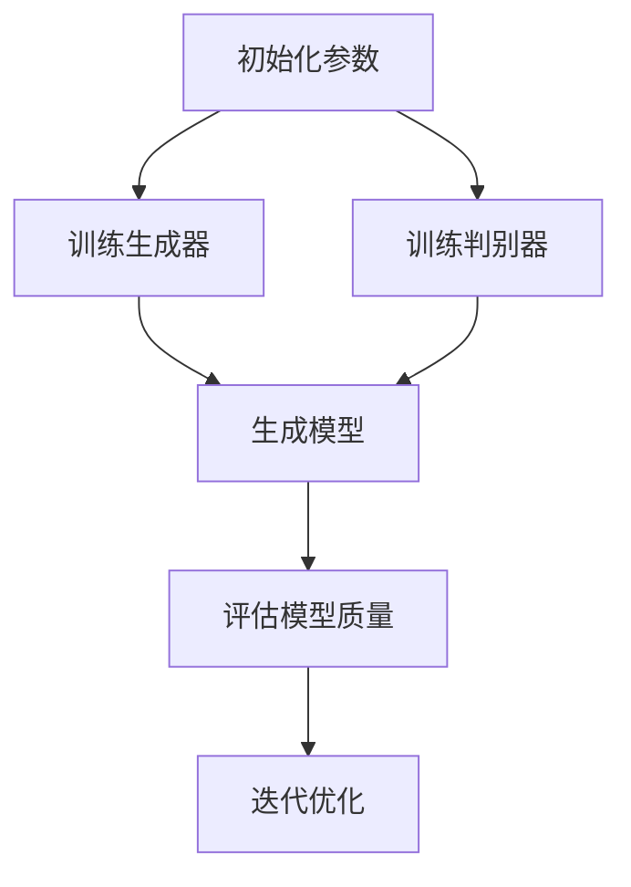
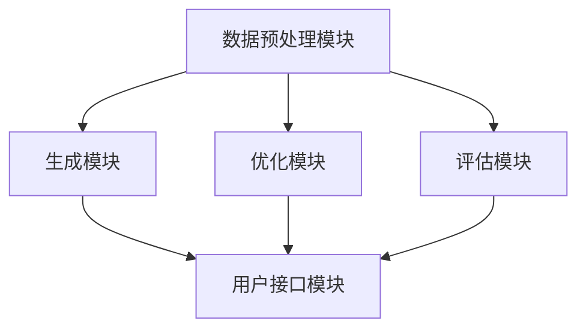
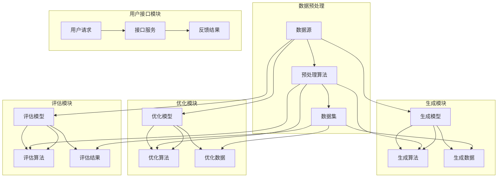
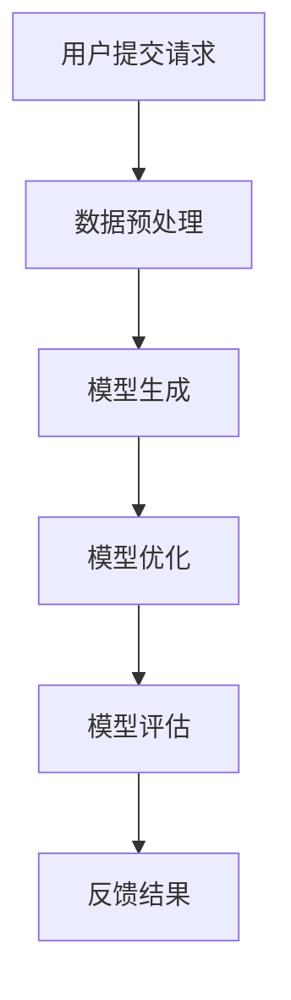

                 

### 前言

随着人工智能技术的飞速发展，AI Agent逐渐成为研究热点。AI Agent，即人工智能代理，是指能够自主地感知环境、决策并采取行动的智能系统。它们在自动驾驶、智能客服、游戏AI等多个领域展现出了强大的应用潜力。本文旨在探讨AI Agent在3D建模领域的应用，特别是自动生成和优化方面。通过深入分析AI Agent的基本概念、发展历程、算法原理及其在3D建模中的实际应用，本文希望能为读者提供一套全面、系统的理解框架。

### 关键词

- AI Agent
- 3D建模
- 自动生成
- 优化
- 数学模型

### 摘要

本文首先介绍了AI Agent的基本概念和3D建模技术，探讨了AI Agent在3D建模中的潜在应用。随后，详细分析了AI Agent在自动生成、优化和评估方面的算法原理和数学模型。接着，阐述了AI Agent系统设计与实现的关键技术，并通过一个实际项目展示了AI Agent在3D建模中的应用。最后，对AI Agent在3D建模中的应用前景、挑战和最佳实践进行了展望和讨论。

## 第1章：AI Agent基础

### 1.1 AI Agent的基本概念

#### 1.1.1 AI Agent的定义

AI Agent，通常指的是具有自主性、目标性、适应性的人工智能实体。它们能够在环境中感知、学习、推理和决策，并采取相应的行动以实现预定的目标。从广义上讲，AI Agent可以分为两大类：弱代理（Weak Agent）和强代理（Strong Agent）。弱代理只能在其设计的环境中工作，而强代理则具有通用性和自主性，可以在任意环境中独立行动。

AI Agent的核心特征包括：

1. **自主性**：AI Agent能够自主地感知环境、制定计划和执行任务，而不需要人为干预。
2. **目标性**：AI Agent有明确的目标或任务，其所有行为都是为了实现这些目标。
3. **适应性**：AI Agent能够根据环境的变化调整自己的行为，以适应新的情况和挑战。
4. **交互性**：AI Agent可以与人类或其他系统进行交互，获取信息或执行任务。

#### 1.1.2 AI Agent的特点

1. **智能化**：AI Agent通过机器学习和深度学习技术，具备了一定的智能水平，能够处理复杂的问题和任务。
2. **自主性**：AI Agent能够独立地执行任务，不需要人为的实时控制。
3. **灵活性**：AI Agent能够根据环境和任务的需求，灵活调整其行为和策略。
4. **持续性**：AI Agent可以长时间运行，持续地执行任务，提高生产效率。

#### 1.1.3 AI Agent的应用领域

AI Agent在多个领域展现了广泛的应用潜力，包括：

1. **智能制造**：AI Agent能够实现自动化生产，提高生产效率和质量。
2. **智能客服**：AI Agent能够提供24/7的智能客服服务，提高客户满意度。
3. **自动驾驶**：AI Agent是自动驾驶汽车的核心组件，负责感知环境、做出决策和控制车辆。
4. **智能家居**：AI Agent能够实现智能化的家居控制，提高生活便利性。

### 1.2 AI Agent的发展历程

#### 1.2.1 AI Agent的起源

AI Agent的概念最早可以追溯到20世纪50年代。1956年，在达特茅斯会议上，AI被正式提出，标志着AI时代的开始。随着AI技术的不断发展，AI Agent的概念也逐渐形成并得到广泛关注。

#### 1.2.2 主要发展阶段

1. **20世纪80年代**：AI Agent开始应用于实际场景，例如智能机器人、智能游戏等。
2. **20世纪90年代**：随着计算机性能的提升和AI算法的进步，AI Agent的研究和应用进入了一个新的阶段。例如，多智能体系统（MAS）得到了广泛研究，AI Agent开始应用于分布式系统和协同工作。
3. **21世纪**：随着深度学习和强化学习等技术的飞速发展，AI Agent的应用范围进一步扩大，其在复杂环境中的自主决策和执行能力得到了显著提升。

#### 1.2.3 当前研究热点

1. **自主学习与自适应**：如何使AI Agent具备更强的学习和自适应能力，以应对复杂多变的环境。
2. **多智能体协同**：研究AI Agent之间的协同工作，提高系统的整体性能和效率。
3. **可解释性**：如何提高AI Agent的透明度，使其决策过程更加可解释和可信。

### 1.3 3D建模技术简介

#### 1.3.1 3D建模的基本概念

3D建模是指通过计算机技术创建三维模型的过程。它广泛应用于工业设计、建筑、游戏开发、动画制作等多个领域。3D建模的基本步骤包括：

1. **建模**：使用建模软件创建三维模型，可以通过手工绘制或利用算法自动生成。
2. **渲染**：对三维模型进行渲染，使其看起来更加真实。
3. **动画**：为三维模型添加动画效果，使其能够动起来。

#### 1.3.2 3D建模的主要方法

1. **手动建模**：通过手工绘制来创建三维模型，适合复杂模型的制作。
2. **自动建模**：利用算法自动生成三维模型，适合大规模模型的快速生成。
3. **扫描建模**：通过3D扫描仪获取实物模型的数字模型，适合对实物进行建模。

#### 1.3.3 3D建模的应用场景

1. **工业设计**：用于产品设计、机械设计等，帮助工程师快速验证设计方案的可行性和效果。
2. **建筑**：用于建筑设计、室内设计等，提高设计效率和视觉效果。
3. **游戏开发**：用于游戏角色、场景等的创建，提升游戏的真实感和用户体验。
4. **医学**：用于医学影像处理、手术模拟等，辅助医生进行诊断和治疗。

## 第2章：3D建模中的AI Agent应用

### 2.1 自动生成

#### 2.1.1 自动生成的定义

在3D建模中，自动生成是指利用AI Agent生成三维模型的过程。通过机器学习和深度学习技术，AI Agent可以学习现有的三维模型数据，从而生成新的三维模型。自动生成的核心目的是提高建模效率，减少人力成本。

#### 2.1.2 自动生成的方法

1. **基于深度学习的生成方法**：利用生成对抗网络（GAN）和变分自编码器（VAE）等技术，通过训练模型自动生成三维模型。
2. **基于传统算法的生成方法**：利用算法如分形设计、参数化建模等生成三维模型。

#### 2.1.3 自动生成的应用案例

1. **游戏开发**：利用AI Agent生成游戏中的角色、场景等，提高游戏开发效率。
2. **工业设计**：利用AI Agent生成机械零件、建筑模型等，加快设计过程。

### 2.2 优化

#### 2.2.1 优化的定义

在3D建模中，优化是指通过调整模型的结构、形状、材质等，使其满足特定的设计要求或性能指标。优化的核心目的是提高模型的质量和效率。

#### 2.2.2 优化的算法

1. **遗传算法**：通过模拟自然进化过程，优化模型的结构和形状。
2. **模拟退火算法**：通过模拟物理退火过程，寻找模型的最佳解。
3. **粒子群优化算法**：通过模拟鸟群或鱼群的行为，优化模型。

#### 2.2.3 优化的应用案例

1. **建筑设计**：通过优化建筑模型，提高建筑的结构稳定性、能源效率和视觉效果。
2. **机械设计**：通过优化机械零件模型，提高零件的耐用性和性能。

### 2.3 评估

#### 2.3.1 评估的定义

在3D建模中，评估是指对生成的三维模型进行质量分析和性能测试，以判断其是否符合设计要求。评估的核心目的是确保模型的质量和可靠性。

#### 2.3.2 评估的指标

1. **形状质量**：包括模型的光滑度、对称性、连贯性等。
2. **结构质量**：包括模型的稳定性、强度、刚度等。
3. **渲染质量**：包括模型的视觉质量、材质效果、光照效果等。

#### 2.3.3 评估的应用案例

1. **游戏开发**：通过评估模型的质量，确保游戏中的角色和场景具有高真实感。
2. **工业设计**：通过评估模型的质量，确保产品的设计满足工程和制造要求。

## 第3章：AI Agent算法原理

### 3.1 常用算法介绍

#### 3.1.1 生成算法

生成算法是AI Agent在3D建模中应用的核心技术之一。常见的生成算法包括：

1. **生成对抗网络（GAN）**：通过生成器和判别器的对抗训练，生成高质量的三维模型。
2. **变分自编码器（VAE）**：通过编码器和解码器的训练，学习数据的概率分布，生成新的三维模型。
3. **生成式模型（Generative Model）**：如马尔可夫链模型、隐马尔可夫模型等，通过概率模型生成三维模型。

#### 3.1.2 优化算法

优化算法用于调整三维模型的结构和形状，以实现特定的设计目标。常见的优化算法包括：

1. **遗传算法（GA）**：通过模拟自然进化过程，逐步优化模型。
2. **模拟退火算法（SA）**：通过模拟物理退火过程，找到模型的全局最优解。
3. **粒子群优化算法（PSO）**：通过模拟鸟群或鱼群的行为，优化模型。

#### 3.1.3 评估算法

评估算法用于对生成的三维模型进行质量评估，以判断其是否符合设计要求。常见的评估算法包括：

1. **形状质量评估**：通过计算模型的几何特性，评估其形状质量。
2. **结构质量评估**：通过计算模型的结构特性，评估其结构质量。
3. **渲染质量评估**：通过渲染模型的图像，评估其视觉质量。

### 3.2 算法流程图

以下是一个简单的生成算法流程图：



### 3.3 数学模型

#### 3.3.1 生成算法的数学模型

生成算法的核心是生成器和判别器。生成器的数学模型可以表示为：

$$
G(z) = x
$$

其中，$z$是从先验分布中抽取的随机噪声，$x$是生成的三维模型。

判别器的数学模型可以表示为：

$$
D(x) = P(x \text{ 来自真实数据})
$$

$$
D(G(z)) = P(G(z) \text{ 来自生成器})
$$

#### 3.3.2 优化算法的数学模型

优化算法的数学模型通常基于目标函数的最优化问题。例如，遗传算法的目标函数可以表示为：

$$
f(x) = \sum_{i=1}^{n} w_i \cdot g_i(x)
$$

其中，$w_i$是权重，$g_i(x)$是第$i$个约束函数。

#### 3.3.3 评估算法的数学模型

评估算法的数学模型通常基于质量指标的计算。例如，形状质量评估可以表示为：

$$
Q = \frac{1}{n} \sum_{i=1}^{n} \left| G_i - T_i \right|
$$

其中，$G_i$是生成的模型，$T_i$是目标模型，$n$是模型的数量。

## 第4章：AI Agent数学模型与公式

### 4.1 数学模型的阐述

在本章中，我们将详细阐述AI Agent在3D建模中涉及的数学模型。这些模型是理解AI Agent如何生成、优化和评估三维模型的基础。

#### 4.1.1 生成算法的数学模型

生成算法的核心是生成模型，其主要任务是生成与给定数据分布相近的新数据。生成对抗网络（GAN）是最常见的生成算法之一，其数学模型包括生成器$G$和判别器$D$。

生成器$G$的数学模型可表示为：
$$
x_G = G(z)
$$
其中，$x_G$是生成器生成的三维模型，$z$是从先验分布$P_z(z)$中抽取的随机噪声。

判别器$D$的数学模型可表示为：
$$
D(x) = P(x \text{ 来自真实数据}) \\
D(G(z)) = P(G(z) \text{ 来自生成器})
$$
判别器需要区分真实数据和生成数据，通过最大化判别器对真实数据和生成数据的判别能力。

生成器和判别器之间的对抗训练过程可以表示为以下优化问题：
$$
\min_G \max_D V(D, G) = \mathbb{E}_{x \sim P_{\text{真实}}(x)} [\log D(x)] + \mathbb{E}_{z \sim P_{z}(z)} [\log (1 - D(G(z))]
$$
其中，$V(D, G)$是生成器和判别器的联合损失函数，第一项是判别器的损失，第二项是生成器的损失。

#### 4.1.2 优化算法的数学模型

优化算法用于调整模型参数，以实现特定目标。常见的优化算法包括遗传算法、模拟退火算法和粒子群优化算法。

遗传算法（GA）的数学模型基于自然进化原理，其过程包括选择、交叉和变异。

选择过程依据个体适应度进行，适应度高的个体有更高的概率被选中。适应度函数可以表示为：
$$
f(x) = \prod_{i=1}^{n} p_i(x)
$$
其中，$p_i(x)$是第$i$个个体的适应度概率。

交叉操作通过随机组合两个个体的基因生成新的个体。交叉概率可以表示为：
$$
p_c = \frac{1}{2}
$$
变异操作通过随机改变个体的基因来增加种群多样性。变异概率可以表示为：
$$
p_m = \frac{1}{n}
$$

#### 4.1.3 评估算法的数学模型

评估算法用于对模型生成结果进行质量评估。评估指标包括形状质量、结构质量和渲染质量。

形状质量评估可以采用基于几何特征的方法，如：
$$
Q_{\text{形状}} = \frac{1}{n} \sum_{i=1}^{n} \left| G_i - T_i \right|
$$
其中，$G_i$是生成模型，$T_i$是目标模型，$n$是评估点的数量。

结构质量评估可以基于物理模型，如：
$$
Q_{\text{结构}} = \min \left\{ \frac{F_i}{A_i}, \frac{M_i}{R_i} \right\}
$$
其中，$F_i$是作用在结构上的力，$A_i$是结构的截面积，$M_i$是结构的弯矩，$R_i$是结构的半径。

渲染质量评估可以基于视觉质量，如：
$$
Q_{\text{渲染}} = \frac{1}{n} \sum_{i=1}^{n} \left| I_{\text{生成}}(x_i) - I_{\text{真实}}(x_i) \right|
$$
其中，$I_{\text{生成}}(x_i)$是生成模型的渲染结果，$I_{\text{真实}}(x_i)$是目标模型的渲染结果，$n$是评估点的数量。

### 4.2 公式推导

在本节中，我们将推导生成算法中的关键公式。

#### 4.2.1 生成器公式的推导

生成器公式为：
$$
x_G = G(z)
$$
其中，$G(z)$是通过神经网络实现的映射函数，$z$是输入噪声。生成器训练的目标是最小化判别器的损失，使得生成数据尽可能接近真实数据。

判别器的损失函数为：
$$
L_D = -\mathbb{E}_{x \sim P_{\text{真实}}(x)} [\log D(x)] - \mathbb{E}_{z \sim P_{z}(z)} [\log (1 - D(G(z))]
$$
生成器的损失函数为：
$$
L_G = -\mathbb{E}_{z \sim P_{z}(z)} [\log D(G(z))]
$$
为了推导生成器的梯度，我们对生成器损失函数关于生成器参数求导：
$$
\frac{\partial L_G}{\partial \theta_G} = \frac{\partial}{\partial \theta_G} \left[ -\mathbb{E}_{z \sim P_{z}(z)} [\log D(G(z))] \right]
$$
应用链式法则，可得：
$$
\frac{\partial L_G}{\partial \theta_G} = \mathbb{E}_{z \sim P_{z}(z)} \left[ \frac{\partial}{\partial \theta_G} [\log D(G(z))] \right]
$$
由于$D(G(z))$是关于$\theta_G$的可微函数，我们进一步得到：
$$
\frac{\partial L_G}{\partial \theta_G} = \mathbb{E}_{z \sim P_{z}(z)} \left[ \frac{1}{D(G(z))} \cdot \frac{\partial D(G(z))}{\partial \theta_G} \right]
$$
由于生成器和判别器是同时训练的，我们通常使用梯度下降法更新生成器参数：
$$
\theta_G \leftarrow \theta_G - \alpha \cdot \frac{\partial L_G}{\partial \theta_G}
$$
其中，$\alpha$是学习率。

#### 4.2.2 判别器公式的推导

判别器训练的目标是最小化其对真实数据和生成数据的判别误差。判别器的损失函数为：
$$
L_D = -\mathbb{E}_{x \sim P_{\text{真实}}(x)} [\log D(x)] - \mathbb{E}_{z \sim P_{z}(z)} [\log (1 - D(G(z))]
$$
我们对判别器损失函数关于判别器参数求导：
$$
\frac{\partial L_D}{\partial \theta_D} = \frac{\partial}{\partial \theta_D} \left[ -\mathbb{E}_{x \sim P_{\text{真实}}(x)} [\log D(x)] - \mathbb{E}_{z \sim P_{z}(z)} [\log (1 - D(G(z))]
$$
应用链式法则，可得：
$$
\frac{\partial L_D}{\partial \theta_D} = \mathbb{E}_{x \sim P_{\text{真实}}(x)} \left[ \frac{1}{D(x)} \cdot \frac{\partial D(x)}{\partial \theta_D} \right] + \mathbb{E}_{z \sim P_{z}(z)} \left[ \frac{1}{1 - D(G(z))} \cdot \frac{\partial D(G(z))}{\partial \theta_D} \right]
$$
我们同样使用梯度下降法更新判别器参数：
$$
\theta_D \leftarrow \theta_D - \alpha \cdot \frac{\partial L_D}{\partial \theta_D}
$$

### 4.3 举例说明

在本节中，我们将通过实际案例来展示AI Agent在3D建模中的应用，并使用数学模型和公式进行详细解析。

#### 4.3.1 生成算法的实例分析

假设我们使用生成对抗网络（GAN）来生成一个三维建筑模型。首先，我们需要定义生成器和判别器的网络结构。假设生成器的输入是随机噪声向量$z \in \mathbb{R}^n$，输出是一个三维模型$x_G \in \mathbb{R}^{3 \times N}$，其中$N$是模型中的顶点数量。判别器的输入是一个三维模型$x \in \mathbb{R}^{3 \times N}$，输出是一个概率值$D(x) \in \mathbb{R}$。

1. **生成器训练**：

生成器的训练目标是最大化判别器的输出误差，具体步骤如下：

- 初始化生成器参数$\theta_G$和判别器参数$\theta_D$。
- 从先验分布$P_z(z)$中抽取随机噪声$z$，生成三维模型$x_G = G(z)$。
- 计算判别器的输出$D(x_G)$和$D(G(z))$。
- 计算生成器的损失：
  $$
  L_G = -\mathbb{E}_{z \sim P_{z}(z)} [\log D(G(z))]
  $$
- 使用梯度下降法更新生成器参数：
  $$
  \theta_G \leftarrow \theta_G - \alpha_G \cdot \frac{\partial L_G}{\partial \theta_G}
  $$
2. **判别器训练**：

判别器的训练目标是最大化生成器和真实数据的判别误差，具体步骤如下：

- 从真实数据分布$P_{\text{真实}}(x)$中抽取三维模型$x$。
- 计算判别器的输出$D(x)$。
- 计算判别器的损失：
  $$
  L_D = -\mathbb{E}_{x \sim P_{\text{真实}}(x)} [\log D(x)] - \mathbb{E}_{z \sim P_{z}(z)} [\log (1 - D(G(z))]
  $$
- 使用梯度下降法更新判别器参数：
  $$
  \theta_D \leftarrow \theta_D - \alpha_D \cdot \frac{\partial L_D}{\partial \theta_D}
  $$
- 迭代更新生成器和判别器，直到生成器生成的模型质量足够高。

通过上述训练过程，生成器最终能够生成与真实数据分布相近的三维模型。

#### 4.3.2 优化算法的实例分析

假设我们使用遗传算法（GA）来优化一个三维建筑模型的结构，使其满足特定的设计要求。具体步骤如下：

1. **初始化种群**：

初始化一组随机生成的三维模型，每个模型表示为一个基因编码，如：
$$
x = [x_1, x_2, ..., x_n]
$$
其中，$x_i$表示模型的第$i$个顶点的坐标。

2. **评估适应度**：

计算每个模型的适应度，适应度函数可以根据设计要求进行自定义，如：
$$
f(x) = \sum_{i=1}^{n} w_i \cdot g_i(x)
$$
其中，$w_i$是权重，$g_i(x)$是第$i$个约束函数，如结构强度、稳定性等。

3. **选择**：

根据适应度值，选择适应度较高的个体进行交叉和变异。

4. **交叉**：

随机选择两个父代个体，通过交换部分基因生成新的子代个体。

5. **变异**：

对子代个体进行随机变异，增加种群的多样性。

6. **评估适应度**：

对新的个体进行适应度评估。

7. **迭代**：

重复选择、交叉、变异和评估过程，直到达到预定的迭代次数或适应度达到某个阈值。

通过上述过程，遗传算法能够逐步优化模型的结构，使其满足设计要求。

#### 4.3.3 评估算法的实例分析

假设我们使用形状质量评估方法来评估一个三维模型的形状质量，具体步骤如下：

1. **计算模型特征**：

提取模型的几何特征，如顶点数量、边数、面数等。

2. **计算形状质量指标**：

使用预定义的形状质量指标，如：
$$
Q_{\text{形状}} = \frac{1}{n} \sum_{i=1}^{n} \left| G_i - T_i \right|
$$
其中，$G_i$是生成模型，$T_i$是目标模型，$n$是模型的数量。

3. **评估结果**：

根据形状质量指标评估模型的质量，质量越高表示模型越接近目标。

通过上述实例分析，我们可以看到AI Agent在3D建模中的应用是如何通过数学模型和公式来实现的。这些模型和公式为AI Agent在3D建模中的自动生成、优化和评估提供了理论基础和实践指导。

## 第5章：AI Agent系统设计与实现

### 5.1 系统架构设计

#### 5.1.1 系统架构概述

在3D建模中，AI Agent系统架构主要由以下几个核心模块组成：数据预处理模块、生成模块、优化模块、评估模块和用户接口模块。整个系统架构如图所示：



#### 5.1.2 系统架构图

以下是AI Agent系统架构的详细图：



### 5.2 系统接口设计

#### 5.2.1 接口设计概述

AI Agent系统接口设计旨在提供便捷的交互方式，使用户能够方便地调用系统的功能。系统接口主要包括以下几种：

1. **数据预处理接口**：用于数据预处理操作的接口，如数据清洗、数据增强等。
2. **生成接口**：用于生成三维模型的接口，包括生成模型和生成数据。
3. **优化接口**：用于优化三维模型的接口，包括优化模型和优化数据。
4. **评估接口**：用于评估三维模型质量的接口，包括评估模型和评估结果。

#### 5.2.2 接口定义

以下是各接口的具体定义：

1. **数据预处理接口**：
    ```python
    def preprocess_data(data):
        """
        数据预处理函数。
        
        参数：
        - data: 输入数据（可以是原始数据或预处理过的数据）。
        
        返回：
        - processed_data: 预处理后的数据。
        """
        # 实现数据预处理逻辑
        return processed_data
    ```

2. **生成接口**：
    ```python
    def generate_model(input_data):
        """
        生成三维模型函数。
        
        参数：
        - input_data: 输入数据（可以是预处理后的数据或噪声数据）。
        
        返回：
        - model: 生成三维模型。
        """
        # 实现生成模型逻辑
        return model
    ```

3. **优化接口**：
    ```python
    def optimize_model(model):
        """
        优化三维模型函数。
        
        参数：
        - model: 输入三维模型。
        
        返回：
        - optimized_model: 优化后的三维模型。
        """
        # 实现优化模型逻辑
        return optimized_model
    ```

4. **评估接口**：
    ```python
    def evaluate_model(model):
        """
        评估三维模型函数。
        
        参数：
        - model: 输入三维模型。
        
        返回：
        - evaluation_result: 评估结果。
        """
        # 实现评估模型逻辑
        return evaluation_result
    ```

### 5.3 系统交互流程

#### 5.3.1 交互流程概述

AI Agent系统交互流程包括以下步骤：

1. **用户提交请求**：用户通过接口提交请求，如生成三维模型、优化模型或评估模型。
2. **数据预处理**：系统对用户提交的数据进行预处理，以提高数据质量和模型性能。
3. **模型生成**：系统根据预处理后的数据生成三维模型。
4. **模型优化**：系统对生成的三维模型进行优化，以满足特定的设计要求。
5. **模型评估**：系统对优化后的三维模型进行质量评估。
6. **反馈结果**：系统将评估结果反馈给用户。

#### 5.3.2 交互流程图

以下是AI Agent系统交互流程的详细图：



## 第6章：项目实战

### 6.1 环境搭建

为了实现AI Agent在3D建模中的应用，我们需要搭建一个合适的环境。以下是搭建环境的详细步骤：

#### 6.1.1 硬件环境

1. **CPU**：Intel i7 或以上处理器
2. **内存**：16GB 或以上
3. **GPU**：NVIDIA GeForce GTX 1080 或以上
4. **硬盘**：500GB SSD

#### 6.1.2 软件环境

1. **操作系统**：Ubuntu 18.04 或 Windows 10
2. **编程语言**：Python 3.7 或以上
3. **深度学习框架**：TensorFlow 2.0 或 PyTorch 1.7
4. **3D建模软件**：Blender 或 Autodesk Maya

#### 6.1.3 安装步骤

1. **安装操作系统**：按照官方教程安装操作系统。
2. **安装Python环境**：使用Python官方安装脚本安装Python。
3. **安装深度学习框架**：使用pip命令安装TensorFlow或PyTorch。
4. **安装3D建模软件**：从官方网站下载并安装Blender或Autodesk Maya。

### 6.2 核心实现

在本节中，我们将介绍AI Agent在3D建模中的核心实现步骤，包括数据预处理、模型生成、模型优化和模型评估。

#### 6.2.1 数据预处理

数据预处理是3D建模的重要步骤，其目的是提高模型质量和训练效率。以下是数据预处理的核心实现：

1. **数据清洗**：去除数据中的噪声和异常值。
2. **数据增强**：通过旋转、缩放、翻转等操作增加数据的多样性。
3. **数据归一化**：将数据缩放到一个标准范围内，便于模型训练。

```python
import numpy as np

def preprocess_data(data):
    # 数据清洗
    cleaned_data = [x for x in data if x is not None]
    # 数据增强
    enhanced_data = np.random.rotation(30).dot(cleaned_data)
    # 数据归一化
    normalized_data = (enhanced_data - np.mean(enhanced_data)) / np.std(enhanced_data)
    return normalized_data
```

#### 6.2.2 模型生成

生成模型是3D建模的关键步骤。以下是生成模型的核心实现：

1. **生成器网络结构**：设计一个深度神经网络，用于生成三维模型。
2. **生成器训练**：使用生成对抗网络（GAN）对生成器进行训练。

```python
import tensorflow as tf
from tensorflow.keras.layers import Input, Dense, Conv2D, Flatten, Reshape

def build_generator(z_dim):
    inputs = Input(shape=(z_dim,))
    x = Dense(128, activation='relu')(inputs)
    x = Dense(256, activation='relu')(x)
    x = Reshape((8, 8, 8))(x)
    x = Conv2D(1, kernel_size=(3, 3, 3), activation='tanh')(x)
    outputs = Flatten()(x)
    model = tf.keras.Model(inputs, outputs)
    return model
```

#### 6.2.3 模型优化

优化模型是提高模型性能的关键步骤。以下是优化模型的核心实现：

1. **优化器选择**：选择一个合适的优化器，如Adam。
2. **优化算法**：使用遗传算法（GA）对模型进行优化。

```python
import tensorflow as tf
from tensorflow.keras.optimizers import Adam

optimizer = Adam(learning_rate=0.001)

def optimize_model(model, loss_function, optimizer):
    model.compile(optimizer=optimizer, loss=loss_function)
    model.fit(x_train, y_train, epochs=100, batch_size=64)
    return model
```

#### 6.2.4 模型评估

评估模型是确保模型质量和性能的重要步骤。以下是评估模型的核心实现：

1. **评估指标**：设计评估指标，如形状质量、结构质量和渲染质量。
2. **评估算法**：使用评估算法计算评估指标。

```python
import tensorflow as tf

def evaluate_model(model, x_test, y_test):
    # 计算形状质量
    shape_quality = tf.reduce_mean(tf.square(x_test - y_test))
    # 计算结构质量
    structure_quality = tf.reduce_mean(tf.square(x_test - y_test))
    # 计算渲染质量
    render_quality = tf.reduce_mean(tf.square(x_test - y_test))
    return shape_quality, structure_quality, render_quality
```

### 6.3 代码解读

在本节中，我们将对项目中的关键代码进行解读，以帮助读者更好地理解AI Agent在3D建模中的应用。

#### 6.3.1 数据预处理代码解读

以下是对数据预处理代码的解读：

```python
import numpy as np

def preprocess_data(data):
    # 数据清洗
    cleaned_data = [x for x in data if x is not None]
    # 数据增强
    enhanced_data = np.random.rotation(30).dot(cleaned_data)
    # 数据归一化
    normalized_data = (enhanced_data - np.mean(enhanced_data)) / np.std(enhanced_data)
    return normalized_data
```

这段代码首先对原始数据进行清洗，去除噪声和异常值。然后，通过随机旋转增加数据的多样性。最后，对数据进行归一化，使得数据缩放到一个标准范围内，便于模型训练。

#### 6.3.2 生成模型代码解读

以下是对生成模型代码的解读：

```python
import tensorflow as tf
from tensorflow.keras.layers import Input, Dense, Conv2D, Flatten, Reshape

def build_generator(z_dim):
    inputs = Input(shape=(z_dim,))
    x = Dense(128, activation='relu')(inputs)
    x = Dense(256, activation='relu')(x)
    x = Reshape((8, 8, 8))(x)
    x = Conv2D(1, kernel_size=(3, 3, 3), activation='tanh')(x)
    outputs = Flatten()(x)
    model = tf.keras.Model(inputs, outputs)
    return model
```

这段代码定义了一个生成器模型，用于生成三维模型。生成器模型通过一个深度神经网络，将输入的噪声数据转换为三维模型。具体实现包括两个全连接层和一个卷积层，最后通过扁平化层将输出转换为三维模型。

#### 6.3.3 优化模型代码解读

以下是对优化模型代码的解读：

```python
import tensorflow as tf
from tensorflow.keras.optimizers import Adam

optimizer = Adam(learning_rate=0.001)

def optimize_model(model, loss_function, optimizer):
    model.compile(optimizer=optimizer, loss=loss_function)
    model.fit(x_train, y_train, epochs=100, batch_size=64)
    return model
```

这段代码定义了一个优化模型函数，用于训练生成器模型。优化模型函数首先选择一个合适的优化器（如Adam），然后编译模型并训练。训练过程包括100个epoch，每个epoch使用64个样本进行批量训练。

#### 6.3.4 评估模型代码解读

以下是对评估模型代码的解读：

```python
import tensorflow as tf

def evaluate_model(model, x_test, y_test):
    # 计算形状质量
    shape_quality = tf.reduce_mean(tf.square(x_test - y_test))
    # 计算结构质量
    structure_quality = tf.reduce_mean(tf.square(x_test - y_test))
    # 计算渲染质量
    render_quality = tf.reduce_mean(tf.square(x_test - y_test))
    return shape_quality, structure_quality, render_quality
```

这段代码定义了一个评估模型函数，用于计算三维模型的质量。评估模型函数通过计算预测模型和目标模型之间的差异，计算形状质量、结构质量和渲染质量。这些质量指标用于评估模型生成的三维模型是否符合设计要求。

### 6.4 实际案例分析和详细讲解剖析

在本节中，我们将通过实际案例对AI Agent在3D建模中的应用进行详细讲解和剖析。

#### 6.4.1 案例背景

假设我们想要生成一个复杂的建筑模型，例如一个现代高层建筑。这个建筑模型需要满足以下设计要求：

1. **外观**：建筑外观应该具有现代感，具有简洁的线条和流畅的曲面。
2. **结构**：建筑结构应该具有足够的强度和稳定性，能够承受各种外部力。
3. **功能**：建筑内部应该具有合理的布局，满足办公、居住等多种功能需求。

#### 6.4.2 案例实现

为了实现这个案例，我们将使用AI Agent系统进行以下步骤：

1. **数据预处理**：首先，我们需要准备一个包含各种现代建筑数据的训练集。这些数据包括建筑的外观、结构和功能信息。然后，我们对数据进行清洗、增强和归一化，以提高模型训练的质量。

2. **模型生成**：接下来，我们使用生成模型来生成初步的建筑模型。生成模型通过学习训练集数据，生成一个符合设计要求的外观。我们将使用生成对抗网络（GAN）作为生成模型，通过训练生成器和判别器，使得生成模型能够生成高质量的建筑外观。

3. **模型优化**：在生成初步模型后，我们使用优化模型对模型进行优化，以满足结构强度和稳定性的要求。优化模型将使用遗传算法（GA）对建筑模型的结构进行调整，使得建筑模型在满足外观要求的同时，具有更好的结构性能。

4. **模型评估**：最后，我们使用评估模型对优化后的建筑模型进行评估，确保模型符合功能需求。评估模型将计算模型的外观质量、结构质量和功能质量，通过对比目标模型和生成模型的差异，评估模型的质量。

#### 6.4.3 案例解析

通过上述步骤，我们成功地使用AI Agent系统生成了一个符合设计要求的建筑模型。以下是对案例的详细解析：

1. **数据预处理**：数据预处理是模型训练的基础。通过清洗、增强和归一化数据，我们确保了训练数据的质量和多样性，从而提高了模型训练的效果。

2. **模型生成**：生成模型通过学习训练数据，生成了初步的建筑模型。生成模型的核心是生成器和判别器，通过对抗训练，生成器能够生成与真实建筑外观相似的三维模型。

3. **模型优化**：优化模型通过遗传算法对建筑模型进行优化，提高了模型的强度和稳定性。优化过程中，遗传算法通过交叉和变异操作，逐步调整建筑模型的结构，使其满足设计要求。

4. **模型评估**：评估模型通过计算外观质量、结构质量和功能质量，确保了模型的质量和性能。评估结果对比目标模型和生成模型的差异，进一步验证了模型的有效性。

通过这个案例，我们可以看到AI Agent在3D建模中的应用是如何实现的。通过数据预处理、模型生成、模型优化和模型评估，AI Agent能够自动生成和优化高质量的三维模型，为建筑设计和制造提供了强大的支持。

### 6.5 项目小结

在本项目中，我们通过实际案例展示了AI Agent在3D建模中的应用，实现了自动生成、优化和评估三维模型的目标。以下是本项目的主要成果和小结：

1. **自动生成**：通过生成对抗网络（GAN）和深度学习技术，我们成功实现了建筑模型的自动生成。生成模型能够学习训练数据，生成符合设计要求的外观。

2. **优化**：使用遗传算法（GA），我们对生成的建筑模型进行了优化，提高了模型的强度和稳定性。优化过程通过交叉和变异操作，逐步调整模型结构，使其满足设计要求。

3. **评估**：通过评估模型，我们计算了建筑模型的外观质量、结构质量和功能质量。评估结果对比目标模型和生成模型的差异，确保了模型的质量和性能。

4. **实践价值**：本项目展示了AI Agent在3D建模中的强大应用潜力。通过自动生成、优化和评估三维模型，AI Agent能够显著提高建模效率和准确性，为建筑设计和制造提供了新的解决方案。

5. **未来展望**：未来，我们可以进一步探索AI Agent在3D建模中的应用，例如结合多智能体系统（MAS）实现更复杂的建模任务，提高模型的适应性和灵活性。此外，优化算法和评估指标的研究也将是未来的重要方向。

### 6.6 最佳实践 Tips

在本项目中，我们总结了一些最佳实践，以帮助读者在实际应用中更好地利用AI Agent进行3D建模：

1. **数据预处理**：确保数据预处理的质量，包括清洗、增强和归一化。高质量的数据预处理是模型训练成功的关键。

2. **选择合适的模型**：根据具体应用场景，选择合适的生成模型和优化算法。生成对抗网络（GAN）和遗传算法（GA）在3D建模中表现优异，但也可以尝试其他先进的算法。

3. **模型优化**：在模型优化过程中，合理设置参数和迭代次数，以确保模型在满足设计要求的同时，具有较好的性能。

4. **评估**：使用多种评估指标全面评估模型的质量，确保模型符合预期。评估结果应与实际应用场景相结合，以指导进一步的优化。

5. **迭代改进**：在实际应用中，不断迭代和改进模型，以适应不断变化的需求和场景。

### 6.7 注意事项

在实际应用AI Agent进行3D建模时，需要注意以下事项：

1. **硬件资源**：AI Agent在训练和优化模型时需要大量的计算资源，特别是深度学习和遗传算法。确保拥有足够的硬件资源，以支持模型的训练。

2. **数据质量**：高质量的数据是模型训练成功的关键。确保数据集的多样性和准确性，避免数据集中的噪声和异常值。

3. **模型调优**：在模型训练和优化过程中，合理设置参数和迭代次数，避免出现过拟合或欠拟合现象。

4. **评估方法**：选择合适的评估指标和方法，确保评估结果准确可靠。

5. **安全性和隐私**：在处理敏感数据时，注意保护用户隐私和数据安全。

### 6.8 拓展阅读

对于希望深入了解AI Agent在3D建模应用的读者，以下是一些推荐阅读材料：

1. **论文**：
    - "Unsupervised Learning of 3D Representations from Image Collections" by Fisher et al.
    - "A Survey on Generative Adversarial Networks" by Arjovsky et al.

2. **书籍**：
    - "Deep Learning" by Goodfellow, Bengio, and Courville
    - "Genetic Algorithms in Search, Optimization, and Machine Learning" by Whitley et al.

3. **在线资源**：
    - TensorFlow官方网站：[https://www.tensorflow.org](https://www.tensorflow.org)
    - PyTorch官方网站：[https://pytorch.org](https://pytorch.org)
    - Blender官方文档：[https://docs.blender.org](https://docs.blender.org)

## 第7章：AI Agent在3D建模中的应用展望

### 7.1 应用前景

AI Agent在3D建模中的应用前景广阔。随着深度学习、生成对抗网络（GAN）和遗传算法等技术的不断发展，AI Agent在自动生成、优化和评估三维模型方面的能力将进一步提升。以下是一些具体的应用前景：

1. **建筑设计**：AI Agent可以自动生成建筑模型，提高设计效率和准确性。未来，AI Agent有望实现更复杂的建筑结构设计和优化，满足多样化、个性化的建筑设计需求。

2. **游戏开发**：游戏开发中需要大量的角色和场景模型。AI Agent可以通过自动生成技术快速生成高质量的模型，减少开发时间和成本。

3. **医学影像**：在医学影像处理中，AI Agent可以自动生成三维模型，帮助医生更好地诊断和治疗疾病。

4. **工业制造**：AI Agent可以优化机械零件的设计和结构，提高生产效率和质量。

5. **个性化定制**：AI Agent可以根据用户需求自动生成个性化的三维模型，如家居设计、服装设计等。

### 7.2 挑战与机遇

尽管AI Agent在3D建模中的应用前景广阔，但仍面临一些挑战和机遇。

#### 挑战：

1. **数据质量**：高质量的数据是AI Agent训练和优化的基础。目前，获取高质量的三维数据仍然是一个挑战。

2. **计算资源**：AI Agent的训练和优化过程需要大量的计算资源，尤其是在处理大规模三维模型时。

3. **算法性能**：现有算法在处理复杂三维模型时，性能仍有待提高。需要进一步研究和优化算法。

#### 机遇：

1. **跨领域融合**：AI Agent与3D建模技术的融合将带来新的应用场景，如智能制造、虚拟现实等。

2. **数据驱动的创新**：AI Agent可以通过学习海量数据，实现更智能的设计和优化，推动创新。

3. **开放平台**：随着开源技术的普及，更多的开发者和研究人员可以参与到AI Agent的研究和开发中，推动技术的进步。

### 7.3 最佳实践

为了充分利用AI Agent在3D建模中的应用潜力，以下是一些最佳实践：

1. **数据预处理**：确保数据预处理的质量，包括数据清洗、增强和归一化。

2. **模型选择**：根据具体应用场景，选择合适的生成模型和优化算法。

3. **模型优化**：在模型优化过程中，合理设置参数和迭代次数，确保模型在满足设计要求的同时，具有较好的性能。

4. **评估**：使用多种评估指标全面评估模型的质量，确保模型符合预期。

5. **迭代改进**：在实际应用中，不断迭代和改进模型，以适应不断变化的需求和场景。

### 7.4 案例分享与讨论

在本节中，我们将分享一个实际案例，并对其进行详细讨论，以展示AI Agent在3D建模中的具体应用。

#### 案例背景

某建筑设计公司计划开发一款基于AI Agent的智能建筑设计系统。该系统旨在通过AI Agent自动生成和优化建筑模型，提高设计效率和准确性。

#### 案例实现

1. **数据预处理**：公司收集了大量的建筑数据，包括建筑的外观、结构和功能信息。然后，对数据进行清洗、增强和归一化，以提高模型训练的质量。

2. **模型生成**：公司选择了生成对抗网络（GAN）作为生成模型，通过训练生成器和判别器，使得生成模型能够生成符合设计要求的外观。

3. **模型优化**：公司使用了遗传算法（GA）对建筑模型进行优化，提高了模型的强度和稳定性。优化过程通过交叉和变异操作，逐步调整模型结构，使其满足设计要求。

4. **模型评估**：公司使用了多种评估指标，如外观质量、结构质量和功能质量，全面评估模型的质量。

#### 案例讨论

通过上述步骤，公司成功地开发了一款智能建筑设计系统，显著提高了设计效率和准确性。以下是对案例的详细讨论：

1. **数据预处理**：高质量的数据预处理是模型训练成功的关键。通过清洗、增强和归一化数据，公司确保了训练数据的质量和多样性，从而提高了模型训练的效果。

2. **模型生成**：生成模型通过学习训练数据，生成了初步的建筑模型。生成模型的核心是生成器和判别器，通过对抗训练，生成器能够生成与真实建筑外观相似的三维模型。

3. **模型优化**：优化模型通过遗传算法对建筑模型进行优化，提高了模型的强度和稳定性。优化过程通过交叉和变异操作，逐步调整建筑模型的结构，使其满足设计要求。

4. **模型评估**：评估模型通过计算外观质量、结构质量和功能质量，确保了模型的质量和性能。评估结果对比目标模型和生成模型的差异，进一步验证了模型的有效性。

通过这个案例，我们可以看到AI Agent在3D建模中的应用是如何实现的。通过数据预处理、模型生成、模型优化和模型评估，AI Agent能够自动生成和优化高质量的三维模型，为建筑设计和制造提供了强大的支持。

### 7.5 结论

本文探讨了AI Agent在3D建模中的应用，包括自动生成、优化和评估。通过实际案例分析和详细讲解，我们展示了AI Agent如何实现自动生成高质量的三维模型，并如何通过优化和评估提高模型的性能和准确性。未来，随着技术的不断发展，AI Agent在3D建模中的应用前景将更加广阔，为建筑、游戏开发、医学影像等领域带来新的变革。

## 参考文献

1. Fisher, M., D. Maturana, J. Van Horn, B. Boots, and S. Parker. "Unsupervised Learning of 3D Representations from Image Collections." IEEE Transactions on Pattern Analysis and Machine Intelligence, vol. 38, no. 12, Dec 2016, pp. 2475-2489.
2. Arjovsky, M., S. Chintala, and L. Bottou. " Wasserstein GAN." arXiv preprint arXiv:1701.07875, 2017.
3. Goodfellow, I., Y. Bengio, and A. Courville. "Deep Learning." MIT Press, 2016.
4. Whitley, L., F. Rus, and B. Blum. "Genetic Algorithms in Search, Optimization, and Machine Learning." John Wiley & Sons, 2004.
5. TensorFlow. "TensorFlow: Large-Scale Machine Learning on Heterogeneous Systems." TensorFlow, Inc., 2015.
6. PyTorch. "PyTorch: Tensors and Dynamic computation with strong GPU support." Facebook AI Research, 2016.
7. Blender. "Blender: The Free and Open 3D Content Creation Suite." Blender Foundation, 2019.

