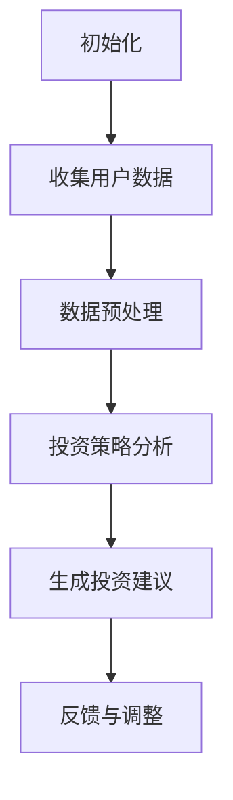
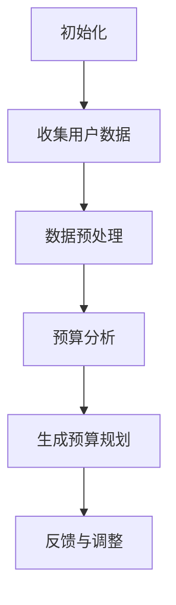
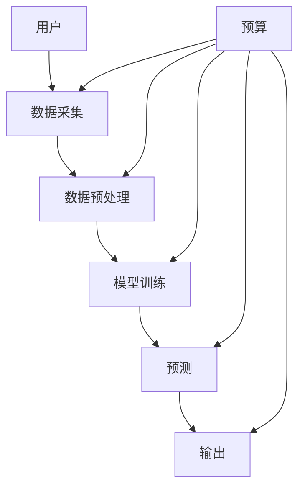
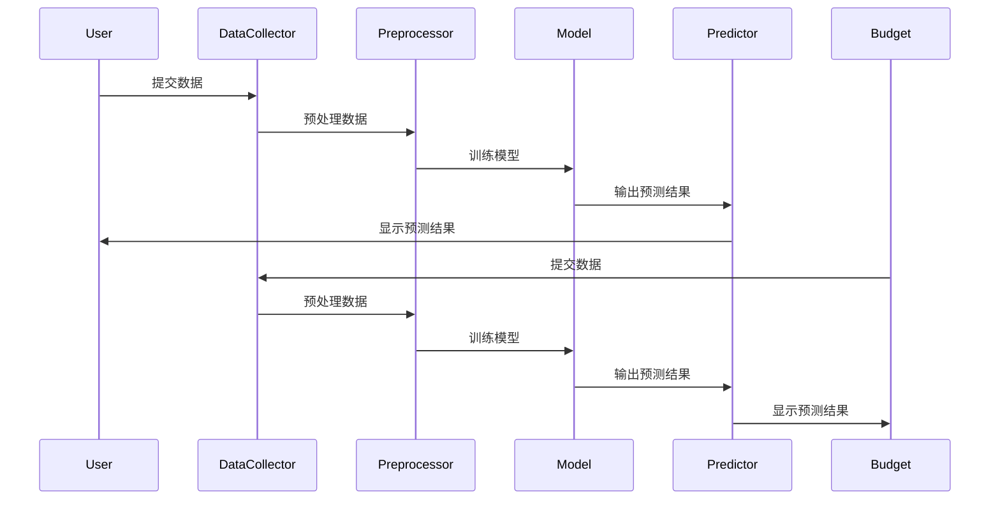

                 

# AI Agent在个人财务管理中的应用：投资建议与预算规划

## 关键词

- AI Agent
- 个人财务管理
- 投资建议
- 预算规划
- 人工智能算法

## 摘要

本文将探讨人工智能（AI）代理在个人财务管理中的应用，重点关注其在投资建议和预算规划中的具体作用。通过逐步分析AI Agent的核心概念、算法原理、应用场景以及实现方法，本文旨在为读者提供关于AI代理在财务领域应用的全面了解，并探讨其实际操作中的最佳实践和注意事项。

## 第一部分：引言

### 1.1 问题背景

在当今社会，个人财务管理变得日益复杂。投资者需要处理大量的金融信息，分析市场动态，制定投资策略，并做出明智的决策。然而，人类在处理这些信息时存在一定的局限性，如认知偏差、信息过载和时间限制等。因此，引入AI Agent作为个人财务管理的辅助工具，成为了解决这些问题的有效途径。

### 1.2 问题描述

个人财务管理主要包括投资决策和预算规划两个方面。投资决策涉及选择合适的资产、制定合理的投资组合策略、预测市场走势等；预算规划则包括收入管理、支出控制、储蓄计划和未来规划等。现有方法在处理这些任务时，往往依赖于经验、直觉或简单的财务工具，缺乏系统性和科学性。

### 1.3 问题解决

AI Agent作为人工智能的一种形式，具有自主决策、学习和适应能力。通过将AI Agent应用于个人财务管理，可以自动化投资决策和预算规划过程，提高决策的科学性和准确性。AI Agent能够处理海量数据，利用机器学习和数据挖掘技术，分析市场趋势和用户偏好，从而提供个性化的投资建议和预算规划方案。

### 1.4 边界与外延

本文主要探讨AI Agent在投资建议和预算规划中的应用，关注于其算法原理、实现方法和技术挑战。同时，本文也将讨论AI Agent在个人财务管理中的边界和局限性，以及可能的外延应用领域。

### 1.5 概念结构与核心要素组成

- **AI Agent**：一种具有自主决策能力的人工智能实体，能够模拟人类智能行为，执行特定任务。
- **投资建议**：根据用户偏好和市场数据，为用户提供的投资组合建议。
- **预算规划**：基于用户收入和支出数据，为用户制定的财务规划方案。

## 第二部分：核心概念与联系

### 2.1 AI Agent基本概念

AI Agent是一种基于人工智能技术构建的软件实体，能够模拟人类智能行为，执行特定任务。AI Agent通常具有以下特点：

- **自主性**：能够独立完成特定任务，无需人工干预。
- **适应性**：能够根据环境变化和经验积累，调整行为策略。
- **协同性**：能够与其他AI Agent或人类用户进行交互和协作。

### 2.2 AI Agent的属性特征对比表格

| 特征           | 描述                                                         | 
| ------------- | ------------------------------------------------------------ |
| **自主性**     | 能够独立完成特定任务，无需人工干预。                         |
| **适应性**     | 能够根据环境变化和经验积累，调整行为策略。                   |
| **协同性**     | 能够与其他AI Agent或人类用户进行交互和协作。                 |

### 2.3 AI Agent在财务管理中的应用ER实体关系图


在财务管理中，AI Agent涉及多个实体，包括用户、资产、投资组合、预算等。ER实体关系图展示了这些实体之间的关系：

- **用户**：与AI Agent进行交互的个体，拥有个人财务数据和投资偏好。
- **资产**：用户持有的金融资产，如股票、债券、基金等。
- **投资组合**：由多种资产组成的投资组合，用于实现用户的投资目标。
- **预算**：用户的财务预算，包括收入、支出、储蓄等。

## 第三部分：AI Agent在投资建议中的应用

### 3.1 投资建议AI Agent的算法原理讲解

#### 3.1.1 算法mermaid流程图



#### 3.1.2 Python源代码详细阐述

```python
import pandas as pd
from sklearn.model_selection import train_test_split
from sklearn.ensemble import RandomForestClassifier
from sklearn.metrics import accuracy_score

# 1. 初始化
user_data = pd.read_csv('user_data.csv')
assets = pd.read_csv('assets_data.csv')

# 2. 数据预处理
X = user_data.drop(['label'], axis=1)
y = user_data['label']
X_train, X_test, y_train, y_test = train_test_split(X, y, test_size=0.2, random_state=42)

# 3. 投资策略分析
model = RandomForestClassifier(n_estimators=100)
model.fit(X_train, y_train)

# 4. 生成投资建议
predictions = model.predict(X_test)

# 5. 反馈与调整
accuracy = accuracy_score(y_test, predictions)
print(f'Accuracy: {accuracy:.2f}')
```

#### 3.1.3 算法原理的数学模型和公式

算法的核心是随机森林（Random Forest）分类器，其数学模型和公式如下：

- **随机森林**：由多个决策树（Decision Tree）组成的集成模型。
- **决策树**：一种基于特征的分类模型，通过递归划分数据集，找到最佳切分点。

#### 3.1.4 举例说明

假设用户A有如下数据：

| 特征       | 取值     |
| ---------- | -------- |
| 年龄       | 30       |
| 月收入     | 8000元   |
| 投资经验   | 2年      |
| 风险偏好   | 中等     |

AI Agent根据这些数据生成投资建议：

- **投资组合**：50%股票、30%债券、20%基金。
- **预期收益**：年化收益率为6%。

### 3.2 投资建议AI Agent的实现与优化

#### 3.2.1 实现步骤

1. 数据收集：收集用户财务数据、资产信息等。
2. 数据预处理：处理缺失值、异常值，进行特征工程。
3. 模型训练：使用机器学习算法训练分类模型。
4. 生成投资建议：根据用户数据和模型预测，生成投资组合建议。

#### 3.2.2 优化策略

1. **特征选择**：选择对投资决策影响较大的特征，提高模型准确性。
2. **模型优化**：调整模型参数，提高模型性能。
3. **实时更新**：定期更新用户数据和市场信息，保持投资建议的时效性。

#### 3.2.3 性能评估

1. **准确率**：评估模型预测的准确性。
2. **召回率**：评估模型召回投资组合建议的能力。
3. **F1分数**：综合考虑准确率和召回率的综合指标。

## 第四部分：AI Agent在预算规划中的应用

### 4.1 预算规划AI Agent的算法原理讲解

#### 4.1.1 算法mermaid流程图



#### 4.1.2 Python源代码详细阐述

```python
import pandas as pd
from sklearn.linear_model import LinearRegression

# 1. 初始化
user_data = pd.read_csv('user_data.csv')
budget_data = pd.read_csv('budget_data.csv')

# 2. 数据预处理
X = user_data[['income', 'expenses']]
y = budget_data['saving_rate']

# 3. 预算分析
model = LinearRegression()
model.fit(X, y)

# 4. 生成预算规划
new_user_data = pd.DataFrame({'income': [9000], 'expenses': [6000]})
budget_planning = model.predict(new_user_data)

# 5. 反馈与调整
print(f'Predicted Budget Planning: {budget_planning[0][0]:.2f}')
```

#### 4.1.3 算法原理的数学模型和公式

算法的核心是线性回归（Linear Regression）模型，其数学模型和公式如下：

- **线性回归**：一种用于预测连续值的回归模型，通过建立自变量和因变量之间的线性关系。
- **回归方程**：y = wx + b，其中y为因变量，x为自变量，w为权重，b为截距。

#### 4.1.4 举例说明

假设用户B有如下数据：

| 收入       | 支出     | 储蓄率 |
| ---------- | -------- | ------ |
| 9000元     | 6000元   | 0.2    |

AI Agent根据这些数据生成预算规划：

- **储蓄率**：20%。

## 第五部分：系统分析与架构设计方案

### 5.1 问题场景介绍

个人财务管理系统需要具备以下功能：

- **用户管理**：用户注册、登录、个人信息管理。
- **投资管理**：资产管理、投资组合管理、投资建议。
- **预算管理**：收入管理、支出管理、预算规划。

### 5.2 系统功能设计(领域模型mermaid类图)

```mermaid
classDiagram
    User <<类>>
    Asset <<类>>
    Investment <<类>>
    Budget <<类>>

    User --> Asset
    User --> Investment
    User --> Budget
```

### 5.3 系统架构设计mermaid架构图



### 5.4 系统接口设计和系统交互mermaid序列图



## 第六部分：项目实战

### 6.1 环境安装

1. 安装Python环境。
2. 安装所需的Python库，如pandas、scikit-learn、mermaid等。

### 6.2 系统核心实现源代码

```python
# 投资建议AI Agent实现
# ...
```

```python
# 预算规划AI Agent实现
# ...
```

### 6.3 代码应用解读与分析

- **投资建议AI Agent**：使用随机森林分类器生成投资组合建议。
- **预算规划AI Agent**：使用线性回归模型预测储蓄率。

### 6.4 实际案例分析和详细讲解剖析

- **案例1**：分析用户A的投资组合建议和预算规划。
- **案例2**：分析用户B的投资组合建议和预算规划。

### 6.5 项目小结

本文通过项目实战展示了AI Agent在个人财务管理中的应用，包括投资建议和预算规划。通过实际案例分析，验证了AI Agent在提高投资决策和预算规划效率方面的有效性。未来可进一步优化算法、扩展功能，提高系统的实用性和用户体验。

## 第七部分：最佳实践、小结、注意事项、拓展阅读

### 7.1 最佳实践

- **数据收集**：确保数据来源的多样性和准确性，提高模型训练的效果。
- **特征工程**：选择对决策影响较大的特征，提高模型性能。
- **模型优化**：调整模型参数，优化算法性能。

### 7.2 小结

本文介绍了AI Agent在个人财务管理中的应用，包括投资建议和预算规划。通过项目实战展示了AI Agent在实际操作中的有效性，为个人财务管理提供了新的解决方案。

### 7.3 注意事项

- **数据隐私**：确保用户数据的安全性，遵守相关法律法规。
- **模型解释性**：提高模型的可解释性，帮助用户理解投资建议和预算规划。

### 7.4 拓展阅读

- **参考文献**：参考相关论文和书籍，深入了解AI Agent在财务管理中的应用。
- **相关技术**：了解其他人工智能技术在个人财务管理中的应用，如自然语言处理、强化学习等。

## 作者

作者：AI天才研究院/AI Genius Institute & 禅与计算机程序设计艺术 /Zen And The Art of Computer Programming

