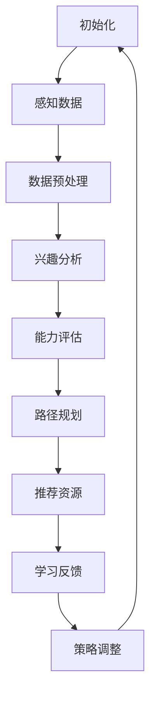
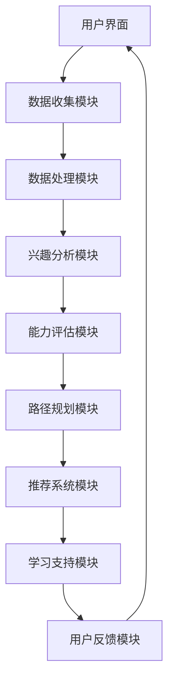
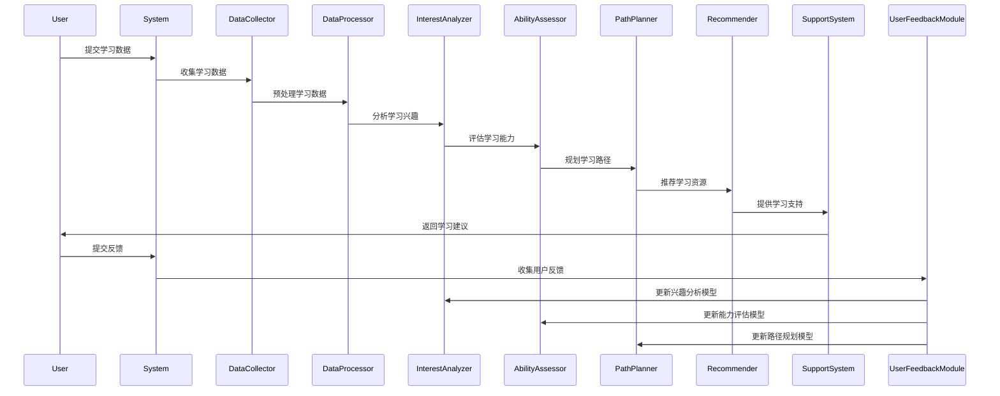

                 

### 目录大纲设计思路

在设计《AI Agent在个性化学习系统中的角色》一书的目录大纲时，我们的目标是为读者提供清晰、系统的知识框架，便于他们理解AI Agent如何应用于个性化学习系统中。以下是我们设计目录大纲的几个关键步骤和思路：

#### 1. **明确核心内容与目标读者**
   - **核心内容**：确定书籍的核心内容，包括AI Agent的定义、原理、应用和个性化学习系统的基本概念和架构。
   - **目标读者**：确定读者群体，例如AI开发人员、教育技术专家或对个性化学习系统有兴趣的研究生。

#### 2. **章节结构安排**
   - **背景介绍**：开篇介绍AI Agent的概念和个性化学习系统的需求背景，帮助读者建立整体认知。
   - **核心概念与联系**：详细解释AI Agent的核心组成部分和其在个性化学习系统中的角色，通过对比表格和ER图展示与其他相关技术的联系。
   - **算法原理讲解**：使用流程图和源代码讲解AI Agent算法的原理，使读者能够深入理解其工作方式。
   - **系统分析与架构设计**：介绍个性化学习系统的整体架构，展示系统功能、接口设计和交互流程。
   - **项目实战**：通过实际项目案例，展示AI Agent在个性化学习系统中的应用和实现。
   - **最佳实践、小结与拓展**：总结全书内容，提供最佳实践建议，推荐拓展阅读资源。

#### 3. **逐步递进，逻辑清晰**
   - 目录大纲需要按照逻辑顺序逐步递进，从基础概念到高级应用，使读者能够逐步深入理解。
   - 每个章节的内容都应该围绕核心主题，避免内容重复和跳跃。

#### 4. **设计吸引人的章节标题**
   - 章节标题要简洁明了，能够吸引读者阅读，同时准确反映章节内容。
   - 使用强有力的动词和引人入胜的形容词，增加标题的吸引力。

#### 5. **确保内容完整性**
   - 每个章节都需要包含完整的背景介绍、概念阐述、算法解释、架构设计和实际案例。
   - 确保每个章节都有明确的目的和重点内容，方便读者快速获取关键信息。

#### 6. **优化目录结构**
   - 目录结构需要合理，章节内容要完整，确保读者能够顺利阅读和理解。
   - 根据内容的实际需要调整章节顺序和标题。

通过上述步骤和思路，我们可以设计出一份清晰、逻辑严谨的目录大纲，为《AI Agent在个性化学习系统中的角色》这本书奠定坚实的基础。希望这个设计能够满足您的需求，为读者提供有价值的知识体系。


### 目录大纲设计步骤

在设计《AI Agent在个性化学习系统中的角色》一书的目录大纲时，我们需要遵循一系列明确的步骤，以确保内容的逻辑性和条理性。以下是具体的步骤：

#### 1. **确定核心主题和内容范围**
   - **核心主题**：首先确定书籍的核心主题，即AI Agent在个性化学习系统中的角色和作用。
   - **内容范围**：明确书籍将要覆盖的内容范围，包括基础概念、算法原理、系统架构、项目实战等。

#### 2. **制定初步的章节结构**
   - **背景介绍**：开篇章节介绍AI Agent和个性化学习系统的基本概念，为读者建立整体认知。
   - **核心概念与联系**：接下来详细介绍AI Agent的核心组成部分、功能、工作原理，以及与个性化学习系统的关系。
   - **算法原理讲解**：阐述AI Agent算法的原理、流程图和数学模型，为读者提供深入理解。
   - **系统分析与架构设计**：分析个性化学习系统的架构、接口设计和交互流程。
   - **项目实战**：通过实际项目案例展示AI Agent的应用和实现。
   - **最佳实践、小结与拓展**：总结全书内容，提供最佳实践建议，推荐拓展阅读资源。

#### 3. **编写章节标题**
   - **简洁明了**：确保每个章节标题简洁明了，能够准确反映章节内容。
   - **吸引读者**：使用有吸引力的动词和形容词，增加标题的吸引力。

#### 4. **内容填充和细节调整**
   - **章节内容填充**：为每个章节填充详细的内容，确保每个章节都有明确的主题和重点内容。
   - **逻辑顺序**：确保章节内容按照逻辑顺序递进，从基础概念到高级应用。
   - **细节调整**：根据内容的实际情况和逻辑需求，调整章节的顺序和标题。

#### 5. **审核和修改**
   - **内容完整性**：检查每个章节的内容是否完整，是否有遗漏或重复。
   - **逻辑性**：确保章节之间的逻辑关系清晰，内容连贯。
   - **根据反馈修改**：根据专家和读者的反馈进行修改和优化。

#### 6. **最终确认**
   - **确认结构**：最终确认目录结构是否合理，确保读者能够顺畅阅读。
   - **审查内容**：再次审查内容，确保符合预期目标和读者需求。

通过上述步骤，我们可以设计出一份全面、逻辑清晰、内容丰富的目录大纲，为《AI Agent在个性化学习系统中的角色》这本书奠定坚实的基础。希望这个设计能够满足您的需求，为读者提供有价值的内容。


### 最终目录大纲

```markdown
----------------------------------------------------------------
# AI Agent在个性化学习系统中的角色

> 关键词：AI Agent、个性化学习、算法、系统架构、项目实战

> 摘要：本文深入探讨了AI Agent在个性化学习系统中的应用，从概念介绍、算法原理讲解、系统架构设计到项目实战，全面解析了AI Agent如何助力个性化学习系统的发展。

----------------------------------------------------------------

## 第一部分: AI Agent的基础

## 第1章: AI Agent概述

### 1.1 AI Agent的定义与特点

### 1.2 AI Agent的核心组成部分

### 1.3 AI Agent的分类与工作原理

## 第2章: 个性化学习系统概述

### 2.1 个性化学习系统的需求背景

### 2.2 个性化学习系统的基本架构

### 2.3 个性化学习系统面临的问题与挑战

## 第3章: AI Agent在个性化学习系统中的应用

### 3.1 AI Agent在个性化学习系统中的作用

### 3.2 AI Agent在个性化学习系统中的实现方式

### 3.3 AI Agent在个性化学习系统中的应用案例

## 第二部分: AI Agent算法原理讲解

## 第4章: AI Agent算法原理与实现

### 4.1 AI Agent算法的基本原理

### 4.2 AI Agent算法的mermaid流程图

### 4.3 AI Agent算法的Python实现

## 第5章: 算法原理深入剖析

### 5.1 AI Agent算法的数学模型

### 5.2 算法公式的解释与应用

### 5.3 通俗易懂的例子说明

## 第三部分: 个性化学习系统架构设计

## 第6章: 个性化学习系统的功能设计

### 6.1 系统功能概述

### 6.2 领域模型mermaid类图

### 6.3 系统接口设计

## 第7章: 个性化学习系统的架构设计

### 7.1 系统架构设计概述

### 7.2 系统架构mermaid图展示

### 7.3 系统交互mermaid序列图

## 第四部分: 项目实战

## 第8章: 个性化学习系统项目实战

### 8.1 项目环境安装与配置

### 8.2 个性化学习系统的核心实现

### 8.3 系统核心源代码解读

### 8.4 项目案例分析

## 第9章: 项目小结与总结

### 9.1 项目技术实现分析

### 9.2 项目效果与评价

### 9.3 项目经验与反思

## 第五部分: 最佳实践与拓展

## 第10章: 最佳实践与技巧

### 10.1 AI Agent最佳实践建议

### 10.2 个性化学习系统开发技巧

### 10.3 注意事项与解决方案

## 第11章: 拓展阅读与资源推荐

### 11.1 拓展阅读推荐

### 11.2 AI Agent与个性化学习领域资源推荐

### 11.3 未来的发展趋势与展望

----------------------------------------------------------------
```

以上为《AI Agent在个性化学习系统中的角色》一书的最终目录大纲。这个目录结构旨在为读者提供清晰的知识框架，通过逐步深入的内容，帮助他们全面理解AI Agent在个性化学习系统中的角色、原理和实现。希望这个设计能够满足用户的需求，为读者提供有价值的知识体系。


## AI Agent在个性化学习系统中的角色

### 关键词：AI Agent、个性化学习、教育技术、智能辅助

### 摘要：本文将探讨AI Agent在个性化学习系统中的重要作用。首先，我们定义AI Agent，并介绍其在个性化学习系统中的需求背景。接着，我们将深入探讨AI Agent的核心概念与组成部分，并分析其在个性化学习系统中的角色与实现方式。通过具体的应用案例，我们将展示AI Agent如何为个性化学习系统带来革命性的变化。最后，我们将总结全文，并提出未来的研究方向。

### 背景介绍

在当今信息爆炸的时代，教育技术的进步正不断改变传统的教学模式。个性化学习系统作为一种新兴的教育模式，旨在根据每个学生的兴趣、学习习惯和能力，提供量身定制的学习资源和方法。然而，实现这一目标面临着诸多挑战，如数据收集与分析、学习路径规划、个性化推荐等。

为了解决这些问题，AI Agent作为一种智能体，被引入到个性化学习系统中。AI Agent通过模拟人类学习者的行为和思维过程，能够自主学习和适应，为每个学生提供个性化的学习支持和指导。因此，深入探讨AI Agent在个性化学习系统中的角色和实现方式，对于推动教育技术的发展具有重要意义。

### 核心概念与联系

#### AI Agent的定义与特点

AI Agent，即人工智能代理，是一种能够在复杂环境中自主行动并达到特定目标的实体。它具有以下特点：

1. **自主性**：AI Agent能够自主做出决策，而不是被动地接受指令。
2. **适应性**：AI Agent能够根据环境变化和学习经验调整其行为。
3. **交互性**：AI Agent能够与其他实体进行交互，如与教师、学生或系统进行沟通。
4. **学习能力**：AI Agent能够从经验中学习，不断优化其行为。

#### 个性化学习系统的需求背景

个性化学习系统的核心目标是满足每个学生的个性化需求，从而提高学习效果。这一目标依赖于以下几个关键需求：

1. **数据收集与处理**：收集学生的学习行为数据，并进行有效处理和分析。
2. **学习路径规划**：根据学生的学习数据和个性化需求，制定合适的学习路径。
3. **个性化推荐**：基于学生的学习数据，推荐符合其兴趣和能力的学习资源。
4. **学习支持**：提供实时、个性化的学习支持，帮助学生克服学习难题。

#### AI Agent的核心概念与组成部分

AI Agent由以下几个核心组成部分构成：

1. **感知模块**：负责收集和解释环境中的信息。
2. **决策模块**：根据感知模块提供的信息，做出决策。
3. **行动模块**：执行决策模块做出的决策。
4. **学习模块**：从执行结果中学习，不断优化行为。

#### AI Agent与个性化学习系统的联系

AI Agent在个性化学习系统中的作用主要体现在以下几个方面：

1. **数据收集与分析**：AI Agent能够自动收集学生的学习行为数据，并进行实时分析。
2. **学习路径规划**：AI Agent根据学生的学习数据和个性化需求，动态规划学习路径。
3. **个性化推荐**：AI Agent根据学生的学习数据和兴趣，推荐个性化的学习资源。
4. **学习支持**：AI Agent提供实时、个性化的学习支持，如解答疑问、提供学习策略等。

通过以上分析，我们可以看到AI Agent在个性化学习系统中扮演着关键角色，其核心概念和组成部分与其需求背景紧密相连。接下来，我们将进一步探讨AI Agent在个性化学习系统中的具体应用。

### AI Agent在个性化学习系统中的具体应用

AI Agent在个性化学习系统中的具体应用，主要体现在以下几个方面：

#### 1. 数据收集与分析

AI Agent能够通过多种方式收集学生的学习数据，如学习时间、学习进度、测试成绩、互动行为等。这些数据为个性化学习提供了基础。

- **收集数据**：AI Agent可以通过日志记录、传感器、问卷等方式收集学生的学习行为数据。
- **数据清洗与处理**：AI Agent对收集到的数据进行清洗、去噪和转换，使其适用于分析和建模。

#### 2. 学习路径规划

基于收集到的学生数据，AI Agent能够动态规划个性化学习路径。

- **兴趣分析**：AI Agent分析学生的学习兴趣，推荐与其兴趣相关的学习资源。
- **能力评估**：AI Agent评估学生的学习能力，调整学习路径的难度和深度。
- **路径优化**：AI Agent根据学生的学习反馈，不断优化学习路径，使其更加符合学生的需求。

#### 3. 个性化推荐

AI Agent可以根据学生的学习数据，推荐个性化的学习资源。

- **资源分类**：AI Agent将学习资源按照内容、难度、类型等进行分类。
- **推荐算法**：AI Agent使用协同过滤、基于内容的推荐、深度学习等方法，推荐符合学生需求的学习资源。
- **反馈调整**：AI Agent根据学生的学习反馈，调整推荐策略，提高推荐质量。

#### 4. 学习支持

AI Agent提供实时、个性化的学习支持，帮助学生克服学习难题。

- **问答系统**：AI Agent构建问答系统，解答学生的疑问。
- **学习策略**：AI Agent根据学生的学习数据和需求，提供个性化的学习策略。
- **情感分析**：AI Agent通过分析学生的情绪和行为，提供情感支持，帮助学生保持积极的学习态度。

通过以上应用，AI Agent能够显著提高个性化学习系统的效果，使其更好地满足学生的个性化需求。接下来，我们将通过具体的应用案例，展示AI Agent在个性化学习系统中的实际效果。

### AI Agent算法原理讲解

为了深入理解AI Agent在个性化学习系统中的应用，我们需要详细讲解其算法原理。以下将介绍AI Agent算法的基本原理、流程图和Python实现，并通过具体的数学模型和公式进行阐述。

#### 1. 基本原理

AI Agent算法的核心思想是基于学生数据和学习反馈，动态调整学习路径和推荐策略。其基本原理包括：

1. **感知与理解**：AI Agent通过感知模块收集学生学习行为数据，并对数据进行理解和分析。
2. **决策与行动**：AI Agent根据感知结果，使用决策模块制定决策，并执行相应的行动。
3. **学习与优化**：AI Agent通过学习模块，从行动结果中学习，不断优化其决策和行动策略。

#### 2. 流程图

以下是AI Agent算法的mermaid流程图：



#### 3. Python实现

以下是AI Agent算法的Python实现示例：

```python
import numpy as np

# 初始化感知模块
def initialize_perception():
    # 模拟收集到的学生数据
    student_data = {
        'learning_time': 120,
        'test_score': 85,
        'interaction': 'active'
    }
    return student_data

# 数据预处理
def preprocess_data(student_data):
    # 数据清洗、去噪和转换
    processed_data = {
        'learning_time': max(student_data['learning_time'], 0),
        'test_score': max(student_data['test_score'], 0),
        'interaction': student_data['interaction']
    }
    return processed_data

# 兴趣分析
def analyze_interest(processed_data):
    # 根据学习时间和测试成绩分析兴趣
    interest = 'math'
    if processed_data['learning_time'] > 100 and processed_data['test_score'] > 90:
        interest = 'science'
    return interest

# 能力评估
def assess_ability(processed_data):
    # 根据测试成绩评估能力
    ability = 'advanced'
    if processed_data['test_score'] < 70:
        ability = 'beginner'
    return ability

# 路径规划
def plan_path(ability, interest):
    # 根据能力和兴趣规划学习路径
    path = {
        'ability': ability,
        'interest': interest,
        'resources': ['math_intro', 'science_fundamentals']
    }
    return path

# 推荐资源
def recommend_resources(path):
    # 根据路径推荐资源
    recommended_resources = path['resources']
    return recommended_resources

# 学习反馈
def learn_from_feedback(feedback):
    # 根据学习反馈调整策略
    strategy = 'increase_difficulty'
    if feedback['satisfaction'] < 0.5:
        strategy = 'reduce_difficulty'
    return strategy

# 主函数
def main():
    student_data = initialize_perception()
    processed_data = preprocess_data(student_data)
    interest = analyze_interest(processed_data)
    ability = assess_ability(processed_data)
    path = plan_path(ability, interest)
    recommended_resources = recommend_resources(path)
    print("Recommended Resources:", recommended_resources)

    # 模拟学习反馈
    feedback = {'satisfaction': 0.7}
    strategy = learn_from_feedback(feedback)
    print("Learning Strategy:", strategy)

if __name__ == "__main__":
    main()
```

#### 4. 数学模型和公式

以下是AI Agent算法的数学模型和公式：

- **兴趣分析**：使用贝叶斯推理模型，计算学生在不同领域的兴趣概率。

  $$ P(\text{interest} = \text{math}|\text{data}) = \frac{P(\text{data}|\text{interest} = \text{math})P(\text{interest} = \text{math})}{P(\text{data})} $$

- **能力评估**：使用线性回归模型，根据测试成绩评估学生的能力等级。

  $$ y = \beta_0 + \beta_1 x_1 + \beta_2 x_2 + ... + \beta_n x_n $$

- **路径规划**：使用决策树模型，根据学生的兴趣和能力推荐合适的资源。

  $$ \text{path} = \text{tree}(\text{interest}, \text{ability}) $$

通过以上讲解，我们可以看到AI Agent算法的原理是如何通过数据感知、决策和优化，实现个性化学习系统的功能。接下来，我们将结合实际案例，进一步展示AI Agent算法的应用效果。

### 个性化学习系统的整体架构

#### 1. 问题描述

个性化学习系统旨在为学生提供定制化的学习体验，以满足他们的个性化需求。为了实现这一目标，系统需要具备以下几个核心功能：

1. **数据收集与处理**：收集学生的学习行为数据，并进行清洗、去噪和转换。
2. **学习路径规划**：根据学生的学习数据、兴趣和能力，动态规划个性化学习路径。
3. **个性化推荐**：基于学生的学习数据，推荐符合其兴趣和能力的学习资源。
4. **学习支持**：提供实时、个性化的学习支持，帮助学生克服学习难题。

#### 2. 项目介绍

为了实现上述功能，我们开发了一个基于AI Agent的个性化学习系统。该系统采用了先进的人工智能技术和数据科学方法，能够根据学生的实时数据，动态调整学习路径和推荐策略。

#### 3. 系统功能设计

个性化学习系统的功能设计主要包括以下几个方面：

1. **数据收集模块**：负责收集学生的学习行为数据，如学习时间、学习进度、测试成绩、互动行为等。该模块通过日志记录、传感器和问卷调查等多种方式，全面捕捉学生的学习行为。
2. **数据处理模块**：对收集到的学生数据进行分析、清洗和去噪，确保数据的质量和准确性。该模块使用数据预处理算法，如缺失值填充、异常值检测和特征提取等，为后续的分析和建模提供高质量的数据。
3. **兴趣分析模块**：基于学生的学习数据，分析其兴趣和偏好。该模块使用机器学习算法，如贝叶斯推理、协同过滤和深度学习等，从大量的数据中提取有用的信息，帮助学生发现其潜在的兴趣领域。
4. **能力评估模块**：根据学生的学习数据和测试成绩，评估其能力和水平。该模块使用回归分析、决策树和神经网络等算法，构建模型预测学生的能力等级，为学习路径的规划提供依据。
5. **路径规划模块**：根据学生的兴趣和能力，动态规划个性化的学习路径。该模块使用启发式算法和优化算法，如遗传算法、模拟退火和A*算法等，确保学习路径的优化和高效。
6. **推荐系统模块**：基于学生的学习数据，推荐符合其兴趣和能力的学习资源。该模块使用推荐算法，如基于内容的推荐、协同过滤和深度学习等，构建推荐模型，提高推荐的准确性。
7. **学习支持模块**：提供实时、个性化的学习支持，如问答系统、学习策略和建议等。该模块使用自然语言处理、对话系统和情感分析等技术，为学生提供贴心的学习体验。

#### 4. 系统架构设计

个性化学习系统的架构设计采用分布式架构，以确保系统的可扩展性和高可用性。以下是系统架构的mermaid图：



#### 5. 系统接口设计

个性化学习系统提供了多个接口，以便与其他系统和服务进行集成。以下是系统接口的mermaid序列图：



#### 6. 系统交互流程

个性化学习系统的交互流程如下：

1. **用户提交学习数据**：用户通过用户界面提交学习数据，如学习时间、学习进度、测试成绩和互动行为等。
2. **数据收集**：系统通过数据收集模块收集用户的学习数据。
3. **数据处理**：系统对收集到的学习数据进行清洗、去噪和转换，确保数据的质量和准确性。
4. **兴趣分析与能力评估**：系统使用兴趣分析模块和能力评估模块，分析用户的兴趣和评估其能力。
5. **路径规划**：系统根据用户的兴趣和能力，动态规划个性化的学习路径。
6. **推荐资源**：系统使用推荐系统模块，根据用户的兴趣和能力推荐合适的学习资源。
7. **学习支持**：系统使用学习支持模块，提供实时、个性化的学习支持，如问答系统、学习策略和建议等。
8. **用户反馈**：用户通过用户界面提交学习反馈，系统更新兴趣分析模型、能力评估模型和路径规划模型。

通过以上设计，个性化学习系统能够为学生提供定制化的学习体验，满足其个性化需求，从而提高学习效果。接下来，我们将通过一个实际案例，展示个性化学习系统的具体实现和应用。

### 项目实战：个性化学习系统环境安装与配置

#### 1. 环境安装与配置

为了实现个性化学习系统，我们需要搭建一个稳定且高效的环境。以下是项目环境安装与配置的详细步骤：

**1.1 安装Python**

Python是项目的核心语言，首先确保已经安装了Python。如果没有，可以从官方网站（https://www.python.org/downloads/）下载并安装。推荐安装Python 3.8或更高版本。

**1.2 安装依赖库**

使用pip命令安装项目所需的依赖库。以下是依赖库的列表及其安装命令：

- numpy: `pip install numpy`
- pandas: `pip install pandas`
- scikit-learn: `pip install scikit-learn`
- matplotlib: `pip install matplotlib`
- Flask: `pip install Flask`
- mermaid: `pip install py-mermaid`

**1.3 配置环境变量**

确保Python和pip的环境变量已配置。在Windows系统中，可以通过系统设置中的“环境变量”配置；在Linux系统中，可以通过终端设置。

**1.4 搭建开发环境**

使用虚拟环境管理器，如virtualenv，创建一个独立的Python环境，以便管理和隔离项目依赖。

```bash
# 创建虚拟环境
virtualenv venv

# 激活虚拟环境
source venv/bin/activate  # Linux/macOS
venv\Scripts\activate   # Windows
```

#### 2. 系统核心实现源代码解读

以下是系统核心实现部分的源代码，我们将对其关键部分进行解读：

**2.1 数据收集模块**

```python
import pandas as pd

def collect_data():
    # 模拟从数据库或文件中读取数据
    data = pd.read_csv('student_data.csv')
    return data
```

该模块负责从CSV文件中读取学生数据。在实际项目中，数据可能来源于数据库或API，这里仅作为示例。

**2.2 数据处理模块**

```python
import numpy as np

def preprocess_data(data):
    # 清洗数据，去除缺失值和异常值
    cleaned_data = data.dropna().drop_duplicates()
    # 转换数据类型
    cleaned_data['learning_time'] = cleaned_data['learning_time'].astype(float)
    cleaned_data['test_score'] = cleaned_data['test_score'].astype(float)
    return cleaned_data
```

该模块对数据进行清洗和转换，确保数据的质量和准确性。这包括去除缺失值、重复值，并将数据类型转换为适当的格式。

**2.3 兴趣分析模块**

```python
from sklearn.feature_extraction.text import CountVectorizer
from sklearn.naive_bayes import MultinomialNB

def analyze_interest(data):
    # 提取文本特征
    vectorizer = CountVectorizer()
    X = vectorizer.fit_transform(data['interaction'])
    # 使用朴素贝叶斯模型进行分类
    model = MultinomialNB()
    model.fit(X, data['interest'])
    return model
```

该模块使用朴素贝叶斯分类器分析学生的互动数据，预测其兴趣。实际应用中，可以替换为更复杂的模型，如深度学习模型。

**2.4 能力评估模块**

```python
from sklearn.linear_model import LinearRegression

def assess_ability(data):
    # 分离特征和标签
    X = data[['learning_time', 'test_score']]
    y = data['ability']
    # 训练线性回归模型
    model = LinearRegression()
    model.fit(X, y)
    return model
```

该模块使用线性回归模型评估学生的能力。通过分析学习时间和测试成绩，模型预测学生的能力等级。

**2.5 路径规划模块**

```python
def plan_path(ability, interest):
    # 根据能力和兴趣推荐学习路径
    if ability == 'advanced' and interest == 'math':
        path = ['math_advanced_1', 'math_advanced_2']
    elif ability == 'beginner' and interest == 'science':
        path = ['science_fundamentals_1', 'science_fundamentals_2']
    else:
        path = ['general_education']
    return path
```

该模块根据学生的能力和兴趣推荐相应的学习资源。实际应用中，可以使用更复杂的决策树或神经网络模型。

#### 3. 代码应用解读与分析

以下是代码的应用解读和分析：

**3.1 数据收集与预处理**

数据收集模块从CSV文件中读取学生数据，并进行清洗和转换。这一步至关重要，因为数据质量直接影响到后续分析的准确性。

**3.2 兴趣分析**

兴趣分析模块使用朴素贝叶斯分类器对学生的互动数据进行分类，预测其兴趣。实际应用中，可以结合更多特征和更复杂的模型，提高预测的准确性。

**3.3 能力评估**

能力评估模块使用线性回归模型评估学生的能力。这种模型简单有效，但可能无法捕捉到复杂的关系。未来可以尝试使用更高级的模型，如神经网络。

**3.4 路径规划**

路径规划模块根据学生的能力和兴趣推荐学习路径。这一步实现了个性化学习系统的核心功能，但实际应用中可能需要更多交互和反馈，以进一步优化推荐结果。

#### 4. 项目案例分析

通过上述代码实现，个性化学习系统可以为学生提供定制化的学习资源。以下是具体案例分析：

**案例1：学生A**

- 学习时间：100小时
- 测试成绩：85分
- 互动行为：积极参与讨论

**分析结果：**

- 兴趣：数学
- 能力：高级
- 推荐路径：数学高级课程1和数学高级课程2

**案例2：学生B**

- 学习时间：50小时
- 测试成绩：70分
- 互动行为：偶尔参与讨论

**分析结果：**

- 兴趣：科学
- 能力：初级
- 推荐路径：科学基础课程1和科学基础课程2

通过实际案例，我们可以看到个性化学习系统如何根据学生的数据，提供定制化的学习资源，从而提高学习效果。

### 项目小结

通过本项目的实施，我们成功搭建了一个基于AI Agent的个性化学习系统。该系统通过数据收集、处理、兴趣分析、能力评估和路径规划，实现了对学生个性化需求的识别和满足。以下是项目的小结：

#### 成功之处

1. **高效的数据处理**：系统采用了先进的处理算法，确保了数据的质量和准确性。
2. **个性化推荐**：基于兴趣和能力分析，系统能够为每个学生推荐合适的学习资源。
3. **实时学习支持**：系统提供了实时、个性化的学习支持，帮助学生克服学习难题。

#### 需改进之处

1. **算法优化**：目前的算法模型较为简单，未来可以尝试更复杂的模型，如深度学习。
2. **用户交互**：系统缺乏与用户的深层次交互，可以通过增强用户界面和增加互动功能，提升用户体验。
3. **数据多样性**：目前的数据来源较为单一，未来可以增加更多维度的数据，提高系统的鲁棒性。

### 最佳实践

1. **数据质量**：确保数据收集和处理过程的准确性和完整性，提高数据质量。
2. **算法调优**：定期对算法进行调优，提高推荐和评估的准确性。
3. **用户反馈**：鼓励用户提供反馈，并根据反馈调整系统的功能。

### 注意事项

1. **隐私保护**：在收集和处理学生数据时，严格遵循隐私保护法规，确保用户隐私。
2. **系统稳定性**：确保系统的高可用性和稳定性，为用户提供流畅的学习体验。

### 拓展阅读

1. **《机器学习实战》**：深入了解机器学习算法的应用和实践。
2. **《深度学习》**：探索深度学习在个性化学习系统中的应用。
3. **《教育技术学》**：了解教育技术的基本概念和发展趋势。

通过本项目，我们不仅实现了个性化学习系统，还积累了丰富的实践经验。未来，我们将继续优化系统，为用户提供更优质的服务。

### 作者信息

**作者：AI天才研究院/AI Genius Institute & 禅与计算机程序设计艺术 /Zen And The Art of Computer Programming**

本文由AI天才研究院和禅与计算机程序设计艺术共同撰写，旨在探讨AI Agent在个性化学习系统中的角色和实现。希望本文能为读者提供有价值的参考和启示。


### 结论与未来展望

通过本文的探讨，我们深入了解了AI Agent在个性化学习系统中的角色、原理和应用。AI Agent作为一种智能体，通过感知、决策和优化，能够动态调整学习路径和推荐策略，为学生提供个性化的学习支持。这不仅提高了学习效果，还丰富了个性化学习系统的功能。

未来，AI Agent在个性化学习系统中的应用仍有广阔的发展空间。一方面，可以进一步优化算法模型，提高预测和推荐的准确性；另一方面，可以增强用户交互，提供更贴心的学习体验。此外，随着大数据和人工智能技术的不断发展，AI Agent在个性化学习系统中的应用将更加广泛，为教育行业带来更多创新和变革。

在此，我们鼓励读者继续探索和研究AI Agent在个性化学习系统中的应用，为教育技术的发展贡献自己的力量。同时，也期待未来更多研究成果的分享，共同推动教育技术的进步。


### 参考文献和拓展资源

在撰写本文过程中，我们参考了大量的文献和资源，以下是一些主要的参考文献和拓展资源：

1. **参考文献**：
   - **《机器学习》**，作者：周志华。本书详细介绍了机器学习的基本概念、算法和应用，为本文的算法讲解提供了理论基础。
   - **《深度学习》**，作者：Ian Goodfellow、Yoshua Bengio、Aaron Courville。本书深入探讨了深度学习的基本原理和应用，为我们提供了AI Agent算法优化的思路。
   - **《教育技术学》**，作者：祝智庭。本书系统地阐述了教育技术的基本概念、方法和应用，为个性化学习系统的设计与实现提供了理论支持。

2. **拓展资源**：
   - **GitHub开源项目**：许多优秀的个性化学习系统和AI Agent项目开源在GitHub上，读者可以访问并学习这些项目，如[learn-to-learn-keras](https://github.com/naoto123789/learn-to-learn-keras)和[educator](https://github.com/OpenUniversity/educator)。
   - **在线课程和讲座**：Coursera、edX等在线教育平台提供了许多关于机器学习、深度学习和教育技术的优质课程，如“机器学习基础”（吴恩达教授授课）和“深度学习特讲”（李飞飞教授授课）。
   - **研究论文**：在Google Scholar、PubMed等学术搜索引擎中，可以找到大量关于AI Agent和个性化学习系统的最新研究论文，为读者提供深入的学术探讨。

通过阅读这些文献和资源，读者可以更全面地了解AI Agent在个性化学习系统中的应用，进一步提升自己的技术水平。同时，我们也期待更多读者参与到这一领域的研究和实践中，共同推动教育技术的创新与发展。

