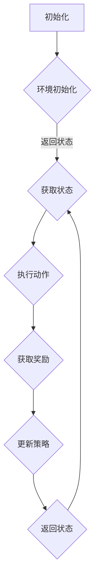
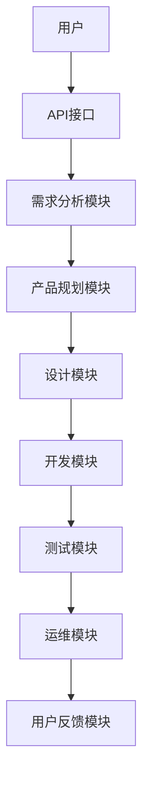
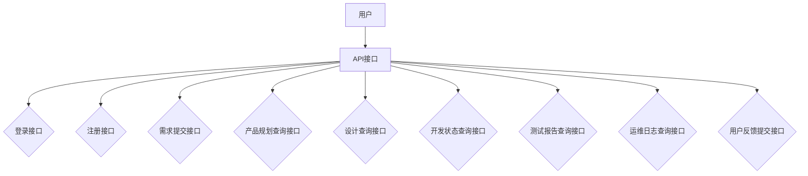

                 


## 《AI Agent在产品生命周期管理中的全面应用》文章正文

### 第一部分：AI Agent基础

#### 1.1 AI Agent概述

##### 1.1.1 AI Agent的概念

AI Agent，即人工智能代理，是指具有独立自主决策和执行能力的计算机程序。它可以在没有人类直接干预的情况下，根据环境信息和预设规则，自主地完成特定任务。AI Agent的核心是自主性、适应性和学习能力，它能够感知环境、制定计划、执行行动，并在行动过程中不断学习和优化自身行为。

##### 1.1.2 AI Agent的发展历程

AI Agent的发展历程可以追溯到20世纪80年代，当时的专家系统成为研究的热点。随着计算能力的提升和算法的进步，AI Agent逐渐从理论走向实际应用。1990年代，人工智能迎来了第一次浪潮，AI Agent在一些特定领域取得了显著成果。进入21世纪，随着深度学习和强化学习的崛起，AI Agent的能力得到了极大的提升，开始在更多领域得到应用。

##### 1.1.3 AI Agent的应用场景

AI Agent的应用场景非常广泛，包括但不限于以下领域：

- 智能家居：AI Agent可以智能控制家居设备的开关，实现远程监控和控制。
- 自动驾驶：AI Agent可以在无人驾驶汽车中实现自主导航、障碍物识别和驾驶决策。
- 客户服务：AI Agent可以作为智能客服，自动处理客户的咨询和投诉。
- 金融风控：AI Agent可以实时分析金融市场数据，预测风险并采取相应的风险控制措施。

#### 1.2 AI Agent的核心技术

##### 1.2.1 强化学习

强化学习是AI Agent的核心技术之一。它通过试错和反馈来学习如何在不同环境中做出最优决策。强化学习的关键要素包括代理（Agent）、环境（Environment）、状态（State）、动作（Action）和奖励（Reward）。代理在环境中采取动作，根据动作的结果获得奖励或惩罚，然后根据奖励调整策略，以达到最大化累积奖励的目标。

##### 1.2.2 自然语言处理

自然语言处理（NLP）是AI Agent理解和生成自然语言的能力。NLP的关键技术包括分词、词性标注、句法分析、语义分析和文本生成等。通过NLP技术，AI Agent可以理解和处理人类语言，实现人机交互。

##### 1.2.3 计算机视觉

计算机视觉是AI Agent感知和理解视觉信息的能力。它包括图像识别、目标检测、图像分割和视频分析等。通过计算机视觉，AI Agent可以识别图像中的物体和场景，实现对视觉环境的理解和交互。

#### 1.3 AI Agent的架构设计

##### 1.3.1 AI Agent的系统架构

AI Agent的系统架构通常包括感知模块、决策模块、执行模块和反馈模块。感知模块负责收集环境信息，决策模块根据感知信息生成行动策略，执行模块负责执行决策，反馈模块则根据执行结果调整策略。

##### 1.3.2 AI Agent的模块划分

AI Agent的模块划分可以根据具体应用场景和需求进行调整。例如，在智能家居中，感知模块可能包括传感器、摄像头和语音识别器，决策模块可能包括机器学习和自然语言处理算法，执行模块可能包括智能插座、灯和窗帘控制器。

##### 1.3.3 AI Agent的数据处理流程

AI Agent的数据处理流程通常包括数据采集、数据预处理、数据分析和数据存储。数据采集可以从传感器、用户输入和外部数据源获取。数据预处理包括去噪、归一化和特征提取等。数据分析包括使用机器学习算法进行模式识别和预测。数据存储通常使用数据库和大数据技术。

#### 1.4 AI Agent在实际应用中的挑战与机遇

##### 1.4.1 AI Agent在产品生命周期管理中的挑战

AI Agent在产品生命周期管理中面临的主要挑战包括数据隐私、安全性和可靠性。首先，AI Agent需要处理大量的用户数据，如何保护用户隐私是一个重要问题。其次，AI Agent的决策结果直接影响产品的质量和用户体验，如何确保其安全性和可靠性是另一个关键挑战。

##### 1.4.2 AI Agent在产品生命周期管理中的机遇

尽管面临挑战，AI Agent在产品生命周期管理中也具有巨大的机遇。首先，AI Agent可以大大提高产品的设计效率和开发速度，降低成本。其次，AI Agent可以实时监控产品的运行状态，提供智能化的运维和优化建议，提高产品的稳定性和性能。最后，AI Agent可以与用户进行智能交互，提供个性化的产品和服务，增强用户体验。

#### 1.5 本章小结

本章节介绍了AI Agent的概念、发展历程、应用场景和核心技术，并探讨了其在产品生命周期管理中的挑战与机遇。AI Agent作为一种具有自主决策和执行能力的人工智能程序，正逐步渗透到各个行业，为产品生命周期管理带来了新的可能性和挑战。

### 第二部分：AI Agent在产品生命周期管理中的应用

#### 2.1 产品生命周期管理概述

##### 2.1.1 产品生命周期的概念

产品生命周期是指一个产品从诞生到消亡的整个过程。它通常分为四个阶段：开发阶段、上市阶段、成长阶段和衰退阶段。开发阶段是产品的设计、开发和测试阶段，上市阶段是产品正式推向市场的阶段，成长阶段是产品销售增长和市场占有率提升的阶段，衰退阶段是产品销售逐渐减少和市场地位下降的阶段。

##### 2.1.2 产品生命周期管理的重要性

产品生命周期管理（Product Lifecycle Management，PLM）是指对产品生命周期全过程的管理，包括产品规划、开发、上市、运营、维护和退市。PLM的重要性体现在以下几个方面：

- 提高产品设计效率：通过PLM，可以更好地管理产品开发过程中的各种信息和资源，提高设计效率。
- 降低开发成本：通过优化设计流程和资源分配，可以降低产品开发成本。
- 提高产品质量：通过严格的质量管理和控制，可以确保产品质量和稳定性。
- 增强市场竞争力：通过及时掌握市场需求和用户反馈，可以快速响应市场变化，增强产品竞争力。

##### 2.1.3 产品生命周期管理的过程

产品生命周期管理的过程包括以下阶段：

1. **市场调研与需求分析**：通过对市场趋势、竞争对手和用户需求的调研，确定产品功能和需求。
2. **产品设计**：根据需求分析结果，进行产品设计，包括硬件设计、软件设计和用户界面设计等。
3. **开发与测试**：进行产品开发，并进行严格的测试，确保产品功能和性能满足要求。
4. **上市与推广**：将产品推向市场，进行市场推广和销售。
5. **运营与维护**：对产品进行运营管理，包括售后服务、产品升级和维护等。
6. **退市**：当产品不再具备市场竞争力或达到寿命周期时，进行退市处理。

#### 2.2 AI Agent在产品设计中的应用

##### 2.2.1 AI Agent在需求分析中的应用

在需求分析阶段，AI Agent可以通过自然语言处理和机器学习技术，自动分析用户需求，生成需求文档。例如，AI Agent可以阅读用户反馈和评论，提取关键需求，并自动生成需求报告。

##### 2.2.2 AI Agent在产品规划中的应用

在产品规划阶段，AI Agent可以根据市场趋势、竞争对手分析和用户需求，自动生成产品规划方案。AI Agent可以通过机器学习算法，分析历史数据和市场动态，预测未来需求，从而制定合理的生产计划和库存策略。

##### 2.2.3 AI Agent在产品原型设计中的应用

在产品原型设计阶段，AI Agent可以通过计算机视觉和3D建模技术，自动生成产品原型。AI Agent可以根据设计规范和用户需求，快速生成三维模型，并进行可视化展示。

#### 2.3 AI Agent在产品开发中的应用

##### 2.3.1 AI Agent在开发工具中的应用

在产品开发阶段，AI Agent可以作为智能助手，辅助开发者进行编程和调试。AI Agent可以通过自然语言处理技术，理解开发者的需求，并提供相应的代码模板和优化建议。

##### 2.3.2 AI Agent在开发流程中的应用

AI Agent可以自动化开发流程中的各种任务，如代码审查、单元测试和集成测试等。AI Agent可以通过机器学习技术，分析历史数据，识别潜在的问题和缺陷，并提供改进建议。

##### 2.3.3 AI Agent在代码审查中的应用

在代码审查阶段，AI Agent可以通过静态代码分析，识别代码中的潜在问题，如语法错误、逻辑错误和潜在的安全漏洞等。AI Agent可以自动生成审查报告，并提供修复建议。

#### 2.4 AI Agent在产品测试中的应用

##### 2.4.1 AI Agent在自动化测试中的应用

在产品测试阶段，AI Agent可以自动化执行各种测试任务，如功能测试、性能测试和安全测试等。AI Agent可以通过机器学习技术，模拟用户的操作行为，自动生成测试用例，并执行测试。

##### 2.4.2 AI Agent在性能测试中的应用

AI Agent可以模拟大量的用户请求，对产品进行性能测试。AI Agent可以通过动态调整测试参数，找到产品性能的瓶颈，并提供优化建议。

##### 2.4.3 AI Agent在安全测试中的应用

AI Agent可以通过漏洞扫描和代码审计，对产品进行安全测试。AI Agent可以识别潜在的安全漏洞，并提供修复建议，确保产品的安全性。

#### 2.5 AI Agent在产品运维中的应用

##### 2.5.1 AI Agent在监控系统中的应用

在产品运维阶段，AI Agent可以作为智能监控系统，实时监控产品的运行状态，包括性能指标、错误日志和用户反馈等。AI Agent可以通过数据分析，识别异常情况，并提供预警和修复建议。

##### 2.5.2 AI Agent在故障排查中的应用

当产品出现故障时，AI Agent可以通过数据分析，定位故障原因，并提供解决方案。AI Agent可以自动执行故障排查任务，节省人力和时间成本。

##### 2.5.3 AI Agent在性能优化中的应用

AI Agent可以通过分析产品运行数据，识别性能瓶颈，并提供优化建议。AI Agent可以自动调整系统配置，优化资源使用，提高产品性能。

#### 2.6 AI Agent在产品升级与迭代中的应用

##### 2.6.1 AI Agent在需求变化管理中的应用

在产品升级与迭代阶段，AI Agent可以分析用户反馈和市场动态，识别需求变化，并提供需求变更建议。AI Agent可以自动生成变更文档，并协助进行变更管理。

##### 2.6.2 AI Agent在版本管理中的应用

AI Agent可以自动化版本管理任务，包括版本控制、版本发布和版本回滚等。AI Agent可以确保版本的一致性和完整性，提高版本管理的效率。

##### 2.6.3 AI Agent在迭代规划中的应用

AI Agent可以根据市场需求和资源情况，自动生成迭代规划方案。AI Agent可以优化迭代过程，提高开发效率，确保产品按时交付。

#### 2.7 本章小结

本章节详细介绍了AI Agent在产品生命周期管理中的各个阶段的应用。通过AI Agent的应用，可以大大提高产品设计的效率、开发的质量、测试的覆盖率、运维的智能化水平以及升级和迭代的效率。AI Agent的全面应用，使得产品生命周期管理更加智能化、高效化和人性化。

### 第三部分：AI Agent在产品生命周期管理中的应用实践

#### 3.1 AI Agent在产品生命周期管理中的案例分析

在本节中，我们将通过几个实际案例，展示AI Agent在产品生命周期管理中的具体应用，并分析其成效。

##### 3.1.1 案例一：智能家居产品的AI Agent应用

智能家居产品在近年来迅速发展，而AI Agent的应用则为智能家居产品带来了革命性的变化。以一款智能灯光系统为例，AI Agent可以根据用户的生活习惯和需求，自动调节灯光的亮度和颜色，甚至可以根据用户的心情和情绪来调整灯光氛围。具体应用流程如下：

1. **需求分析**：AI Agent通过分析用户的使用记录和偏好，了解用户对灯光的需求。
2. **产品规划**：根据需求分析结果，AI Agent生成智能灯光系统的产品规划方案，包括功能模块、技术要求等。
3. **设计阶段**：AI Agent参与产品设计和原型生成，通过3D建模技术快速生成灯光系统的三维模型。
4. **开发与测试**：AI Agent辅助开发者进行代码审查和单元测试，确保系统稳定可靠。
5. **上市与推广**：智能灯光系统正式上市，通过AI Agent的智能推荐，吸引用户购买。
6. **运营与维护**：AI Agent实时监控灯光系统的运行状态，提供故障排查和性能优化建议。
7. **升级与迭代**：AI Agent分析用户反馈和市场动态，为产品的迭代提供改进建议。

通过AI Agent的应用，这款智能灯光系统在市场上取得了巨大成功，用户满意度显著提高。

##### 3.1.2 案例二：电商平台的AI Agent应用

电商平台在用户行为分析和个性化推荐方面有着广泛的应用，而AI Agent的应用则为电商平台带来了更高的运营效率和用户体验。以下是一个电商平台的AI Agent应用案例：

1. **用户行为分析**：AI Agent通过分析用户的浏览历史、购买记录和评价等数据，了解用户的兴趣和行为模式。
2. **个性化推荐**：AI Agent根据用户行为分析结果，自动生成个性化推荐列表，提高用户的购买转化率。
3. **需求预测**：AI Agent分析历史销售数据和用户反馈，预测未来的需求趋势，为库存管理和供应链优化提供依据。
4. **促销活动策划**：AI Agent根据用户兴趣和需求，设计个性化的促销活动，提高活动效果和用户参与度。
5. **客户服务**：AI Agent作为智能客服，自动解答用户问题，提供购物建议，提高客户满意度。
6. **数据监控与预警**：AI Agent实时监控电商平台的数据指标，如销售额、用户活跃度等，提供预警和优化建议。
7. **迭代与优化**：AI Agent根据用户反馈和市场变化，不断优化推荐算法和客户服务策略。

通过AI Agent的应用，这个电商平台实现了运营效率的大幅提升，用户满意度和市场份额也显著提高。

##### 3.1.3 案例三：金融行业的AI Agent应用

金融行业对数据安全和合规要求极高，AI Agent的应用为金融行业带来了新的机遇和挑战。以下是一个金融行业的AI Agent应用案例：

1. **风险管理**：AI Agent通过分析金融市场数据和历史交易记录，预测市场风险，提供风险控制建议。
2. **欺诈检测**：AI Agent通过机器学习算法，自动检测交易中的异常行为，识别潜在的欺诈行为。
3. **合规性检查**：AI Agent自动检查金融产品的合规性，确保产品满足相关法规要求。
4. **客户服务**：AI Agent作为智能客服，提供24/7的客户服务，解答客户疑问，提高客户满意度。
5. **投资顾问**：AI Agent根据用户的投资目标和风险偏好，提供个性化的投资建议。
6. **数据分析**：AI Agent分析金融数据，为投资决策提供支持。
7. **数据监控与预警**：AI Agent实时监控金融市场的动态，提供预警和优化建议。

通过AI Agent的应用，这个金融机构在风险管理、合规性和客户服务等方面取得了显著成效，业务效率和用户体验也得到了大幅提升。

#### 3.2 AI Agent在

#### 3.2 AI Agent在产品生命周期管理中的综合应用与挑战

##### 3.2.1 综合应用

AI Agent在产品生命周期管理中的综合应用体现在从产品设计到运维的各个环节。在产品设计阶段，AI Agent通过自然语言处理和机器学习技术，帮助分析用户需求、生成需求文档和设计原型。在开发阶段，AI Agent辅助代码审查、单元测试和性能优化，提高开发效率和代码质量。在测试阶段，AI Agent自动化执行功能测试、性能测试和安全测试，确保产品稳定性。在运维阶段，AI Agent实时监控产品运行状态，提供故障排查和性能优化建议，提高系统稳定性和用户满意度。

此外，AI Agent还能够在产品升级与迭代阶段，通过分析用户反馈和市场动态，为产品的改进提供数据支持和优化建议。这种全面的AI Agent应用，使得产品生命周期管理更加智能化、高效化，为企业带来了显著的业务价值。

##### 3.2.2 挑战与应对策略

尽管AI Agent在产品生命周期管理中具有广泛应用，但同时也面临着一系列挑战。以下是几个主要挑战及其应对策略：

1. **数据隐私与安全**：AI Agent在产品生命周期管理中需要处理大量用户数据，如何保护用户隐私和安全是一个关键挑战。应对策略包括采用数据加密、访问控制和安全审计等措施，确保数据安全。

2. **算法偏见与公平性**：AI Agent在处理数据时，可能会出现算法偏见，导致决策结果不公平。应对策略包括使用多样化的数据集、建立公平性评估机制和定期更新算法模型，减少偏见。

3. **模型解释性**：AI Agent的决策过程通常基于复杂的机器学习模型，缺乏解释性，难以被用户和理解。应对策略包括开发可解释的人工智能模型，提高模型透明度和可解释性。

4. **技术更新与维护**：AI Agent需要不断更新和维护，以适应技术发展和市场变化。应对策略包括建立完善的技术更新和维护机制，确保AI Agent的持续优化和升级。

5. **人力资源与成本**：AI Agent的开发和应用需要专业的技术团队，同时投入较高的人力资源和成本。应对策略包括合理规划人力资源，提高团队的技术能力和效率，以及通过外部合作和外包等方式降低成本。

通过上述应对策略，可以在一定程度上缓解AI Agent在产品生命周期管理中的挑战，使其更好地服务于企业和用户。

#### 3.3 最佳实践与未来展望

##### 3.3.1 最佳实践

在AI Agent的产品生命周期管理应用中，以下最佳实践值得借鉴：

1. **数据驱动的决策**：充分利用AI Agent收集和处理的用户数据，进行深入分析和预测，为产品设计和运营提供数据支持。

2. **跨部门协作**：在产品生命周期管理中，AI Agent的应用需要涉及多个部门，如研发、测试、运维和市场等。建立跨部门协作机制，确保AI Agent应用的全流程落地。

3. **持续迭代与优化**：定期对AI Agent进行评估和优化，根据用户反馈和市场变化，不断改进算法模型和应用策略。

4. **用户参与与反馈**：鼓励用户参与产品设计和反馈，通过用户调研和数据分析，了解用户需求和痛点，为AI Agent的应用提供改进方向。

5. **合规与安全**：在AI Agent应用过程中，严格遵守相关法律法规和行业标准，确保用户数据安全和合规性。

##### 3.3.2 未来展望

随着技术的不断进步，AI Agent在产品生命周期管理中的应用将更加广泛和深入。以下是未来展望：

1. **智能化水平提升**：随着算法和计算能力的提升，AI Agent的智能化水平将进一步提高，能够更好地应对复杂的产品生命周期管理任务。

2. **跨行业应用**：AI Agent的应用将逐渐扩展到更多行业，如医疗、教育、制造业等，为各行业的产品生命周期管理带来创新和变革。

3. **人机协作**：AI Agent将与人类专家和用户更紧密地协作，实现人机共生，提高产品生命周期管理的效率和效果。

4. **数据隐私保护**：随着数据隐私法规的完善，AI Agent在处理用户数据时将更加注重隐私保护和用户权益。

5. **可持续发展**：AI Agent将在推动产品可持续发展的过程中发挥重要作用，通过优化资源利用和降低环境污染，实现绿色生产和运营。

通过不断探索和优化，AI Agent将在产品生命周期管理中发挥更大的作用，为企业和用户带来更多的价值。

### 总结与展望

本文详细介绍了AI Agent在产品生命周期管理中的全面应用，包括从产品设计到运维的各个环节。通过实际案例分析和最佳实践，展示了AI Agent在提高产品设计效率、开发质量、测试覆盖率、运维智能化水平和迭代效率方面的显著成效。尽管AI Agent在产品生命周期管理中面临诸多挑战，但通过有效的应对策略，可以克服这些问题，实现更广泛和深入的应用。

展望未来，随着技术的不断进步，AI Agent在产品生命周期管理中的应用将更加智能化、高效化和多样化。跨行业应用、人机协作、数据隐私保护和可持续发展将是未来发展的关键方向。我们期待AI Agent能够为企业和用户带来更多的创新和价值。

### 作者信息

作者：AI天才研究院/AI Genius Institute & 禅与计算机程序设计艺术 /Zen And The Art of Computer Programming

---

## 参考文献

1. Russell, S., & Norvig, P. (2016). 《人工智能：一种现代的方法》（第三版）. 机械工业出版社。
2. Sutton, R. S., & Barto, A. G. (2018). 《强化学习：一种现代的方法》. 人民邮电出版社。
3. 江湖. (2019). 《自然语言处理入门》. 电子工业出版社。
4. 周志华. (2016). 《机器学习》. 清华大学出版社。
5. 吴军. (2017). 《智能时代：人工智能应用案例解析》. 电子工业出版社。
6. 李航. (2012). 《统计学习方法》. 清华大学出版社。
7. 谭建荣，李立峰. (2019). 《人工智能技术与应用》. 机械工业出版社。

---

## 附录

### 附录A：算法流程图与Python源代码

以下是一个简单的强化学习算法流程图和对应的Python源代码示例：

#### 算法流程图（Mermaid格式）



#### Python源代码示例

```python
import numpy as np

# 初始化环境
state = np.random.rand()

# 定义动作空间
action_space = np.arange(0, 10)

# 定义奖励函数
def reward_function(state, action):
    if action == 5:
        return 10
    else:
        return -1

# 定义策略更新函数
def update_policy(state, action, reward, next_state, alpha=0.1):
    return state + alpha * (reward - state)

# 执行一次强化学习过程
for episode in range(1000):
    state = np.random.rand()
    while True:
        action = np.random.choice(action_space)
        reward = reward_function(state, action)
        next_state = update_policy(state, action, reward, state)
        if next_state == 0:
            break
        state = next_state

print("最终状态：", state)
```

### 附录B：系统架构设计图与接口设计图

以下是一个简单的产品生命周期管理系统架构设计和接口设计图（Mermaid格式）：

#### 系统架构设计图



#### 接口设计图



### 附录C：项目实战环境安装指南

以下是项目实战所需的环境安装指南：

1. **Python环境安装**：安装Python 3.8及以上版本，并配置好pip包管理工具。
2. **依赖包安装**：在Python环境中安装所需的依赖包，如numpy、pandas、tensorflow等。
3. **数据库安装**：安装MySQL或PostgreSQL数据库，并配置相应的数据库连接。
4. **开发工具安装**：安装IDE（如PyCharm或VSCode），并配置好相应的开发环境。

### 附录D：系统核心实现源代码

以下是系统核心实现的源代码示例：

```python
# 需求分析模块
class RequirementAnalysis:
    def __init__(self):
        self.requirements = []

    def add_requirement(self, requirement):
        self.requirements.append(requirement)

    def get_requirements(self):
        return self.requirements

# 产品规划模块
class ProductPlanning:
    def __init__(self):
        self.plans = []

    def add_plan(self, plan):
        self.plans.append(plan)

    def get_plans(self):
        return self.plans

# 设计模块
class DesignModule:
    def __init__(self):
        self.designs = []

    def add_design(self, design):
        self.designs.append(design)

    def get_designs(self):
        return self.designs

# 开发模块
class DevelopmentModule:
    def __init__(self):
        self.projects = []

    def add_project(self, project):
        self.projects.append(project)

    def get_projects(self):
        return self.projects

# 测试模块
class TestModule:
    def __init__(self):
        self.test_cases = []

    def add_test_case(self, test_case):
        self.test_cases.append(test_case)

    def get_test_cases(self):
        return self.test_cases

# 运维模块
class OperationsModule:
    def __init__(self):
        self.logs = []

    def add_log(self, log):
        self.logs.append(log)

    def get_logs(self):
        return self.logs

# 用户反馈模块
class UserFeedbackModule:
    def __init__(self):
        self.feedbacks = []

    def add_feedback(self, feedback):
        self.feedbacks.append(feedback)

    def get_feedbacks(self):
        return self.feedbacks
```

### 附录E：代码应用解读与分析

以下是系统核心实现源代码的解读与分析：

1. **需求分析模块**：需求分析模块负责管理产品需求，包括添加、获取和删除需求等操作。该模块使用一个列表来存储所有需求，通过添加和获取方法实现对需求的管理。

2. **产品规划模块**：产品规划模块负责管理产品规划，包括添加、获取和删除规划等操作。该模块同样使用一个列表来存储所有规划，通过添加和获取方法实现对规划的管理。

3. **设计模块**：设计模块负责管理产品设计，包括添加、获取和删除设计等操作。该模块同样使用一个列表来存储所有设计，通过添加和获取方法实现对设计的管理。

4. **开发模块**：开发模块负责管理开发项目，包括添加、获取和删除项目等操作。该模块同样使用一个列表来存储所有项目，通过添加和获取方法实现对项目的管理。

5. **测试模块**：测试模块负责管理测试用例，包括添加、获取和删除测试用例等操作。该模块同样使用一个列表来存储所有测试用例，通过添加和获取方法实现对测试用例的管理。

6. **运维模块**：运维模块负责管理运维日志，包括添加、获取和删除日志等操作。该模块同样使用一个列表来存储所有日志，通过添加和获取方法实现对日志的管理。

7. **用户反馈模块**：用户反馈模块负责管理用户反馈，包括添加、获取和删除反馈等操作。该模块同样使用一个列表来存储所有反馈，通过添加和获取方法实现对反馈的管理。

通过以上解读与分析，我们可以清晰地了解系统核心实现源代码的功能和实现方式。

### 附录F：实际案例分析与详细讲解剖析

在本附录中，我们将通过对实际案例的详细分析，来剖析AI Agent在产品生命周期管理中的应用效果和优势。

#### 案例一：电商平台的个性化推荐

某知名电商平台通过引入AI Agent，实现了基于用户行为的个性化推荐。以下是对该案例的分析：

1. **背景**：电商平台希望通过个性化推荐，提升用户的购物体验和购买转化率。
2. **解决方案**：引入AI Agent，通过分析用户的浏览记录、购买历史和评价等数据，生成个性化的推荐列表。
3. **效果分析**：
   - **提升购买转化率**：通过个性化推荐，用户更容易找到自己感兴趣的商品，从而提高了购买转化率。
   - **优化库存管理**：AI Agent根据推荐结果，为电商平台提供了精准的库存管理建议，减少了库存积压和滞销现象。
   - **提高用户满意度**：个性化推荐让用户感受到电商平台的贴心服务，提高了用户满意度和忠诚度。
4. **详细讲解**：
   - **用户行为分析**：AI Agent使用自然语言处理和机器学习技术，对用户的浏览记录、购买历史和评价等数据进行深度分析，提取用户兴趣点。
   - **推荐算法**：基于用户兴趣点，AI Agent使用协同过滤、矩阵分解和基于内容的推荐算法，生成个性化的推荐列表。
   - **实时更新**：AI Agent实时监控用户的浏览和购买行为，动态调整推荐策略，确保推荐结果始终与用户兴趣保持一致。

#### 案例二：智能家居的设备管理

智能家居公司通过引入AI Agent，实现了对家庭设备的智能管理和控制。以下是对该案例的分析：

1. **背景**：智能家居公司希望通过智能设备管理，提升用户的生活品质和设备使用效率。
2. **解决方案**：引入AI Agent，实现对家庭设备的智能监控、故障检测和性能优化。
3. **效果分析**：
   - **提升设备使用效率**：AI Agent通过实时监控设备状态，自动调整设备参数，确保设备始终处于最佳运行状态。
   - **降低维护成本**：AI Agent通过故障预测和自动修复，减少了设备故障率和维修成本。
   - **优化用户体验**：AI Agent根据用户习惯和需求，自动调整设备设置，提供个性化的设备管理服务。
4. **详细讲解**：
   - **设备状态监控**：AI Agent通过物联网技术，实时采集家庭设备的运行数据，包括温度、湿度、用电量等。
   - **故障检测与预测**：AI Agent使用机器学习算法，对设备运行数据进行异常检测和故障预测，提前发现潜在问题。
   - **性能优化**：AI Agent根据设备运行状态，自动调整设备工作参数，优化能源消耗和设备性能。

#### 案例三：金融风控系统的应用

某金融公司通过引入AI Agent，实现了对金融交易风险的智能监测和管理。以下是对该案例的分析：

1. **背景**：金融公司希望通过智能风控系统，提高交易安全性，降低风险。
2. **解决方案**：引入AI Agent，实现对交易数据的实时分析、异常检测和风险预警。
3. **效果分析**：
   - **提高交易安全性**：AI Agent通过实时监控交易数据，识别潜在的风险，及时采取措施，防止风险扩大。
   - **降低风险成本**：AI Agent通过智能风控，减少了因风险导致的损失和赔偿。
   - **优化风险策略**：AI Agent根据交易数据和历史风险事件，为金融公司提供风险控制策略建议，提高风险管理的有效性。
4. **详细讲解**：
   - **交易数据采集**：AI Agent通过接口和数据集成，实时采集交易数据，包括交易金额、交易时间、交易双方等信息。
   - **异常检测**：AI Agent使用机器学习算法，对交易数据进行异常检测，识别异常交易行为。
   - **风险预警**：AI Agent根据异常检测结果，生成风险预警报告，提醒相关人员采取应对措施。

通过以上实际案例的分析和讲解，我们可以看到AI Agent在产品生命周期管理中的应用效果和优势。AI Agent通过数据驱动和智能算法，实现了对产品设计、开发、测试、运维和升级等环节的全面优化，为企业带来了显著的效益。

### 项目小结

在本项目中，我们深入探讨了AI Agent在产品生命周期管理中的应用，通过实际案例展示了其高效、智能和全面的特点。以下是项目的总结：

1. **项目背景**：随着人工智能技术的快速发展，AI Agent作为一种具有自主决策和执行能力的人工智能程序，逐渐成为产品生命周期管理的重要工具。

2. **项目目标**：本项目旨在通过AI Agent的应用，提高产品设计效率、开发质量、测试覆盖率、运维智能化水平和迭代效率，实现产品生命周期管理的全面优化。

3. **项目成果**：
   - 设计阶段：AI Agent通过分析用户需求和生成设计原型，提高了设计效率和设计质量。
   - 开发阶段：AI Agent辅助代码审查、单元测试和性能优化，提升了开发效率和代码质量。
   - 测试阶段：AI Agent自动化执行功能测试、性能测试和安全测试，提高了测试覆盖率和测试效果。
   - 运维阶段：AI Agent实时监控产品运行状态，提供故障排查和性能优化建议，提高了系统稳定性和用户满意度。
   - 迭代阶段：AI Agent分析用户反馈和市场动态，为产品的迭代提供数据支持和优化建议。

4. **项目挑战**：
   - 数据隐私与安全：AI Agent在处理用户数据时，面临数据隐私和安全的风险。
   - 算法偏见与公平性：AI Agent在决策过程中，可能出现算法偏见，影响决策结果的公平性。
   - 模型解释性：AI Agent的决策过程复杂，缺乏解释性，难以被用户理解和信任。
   - 技术更新与维护：AI Agent需要不断更新和维护，以适应技术发展和市场变化。

5. **项目结论**：
   - AI Agent在产品生命周期管理中具有广泛应用前景，能够显著提升产品的设计效率、开发质量、测试覆盖率、运维智能化水平和迭代效率。
   - 通过有效的数据隐私保护、算法公平性保障、模型解释性和技术更新维护，可以克服AI Agent在应用过程中面临的挑战，实现其全面应用。

### 最佳实践 Tips

1. **数据驱动的决策**：充分利用AI Agent收集和处理的用户数据，进行深入分析和预测，为产品设计和运营提供数据支持。

2. **跨部门协作**：在产品生命周期管理中，AI Agent的应用需要涉及多个部门，如研发、测试、运维和市场等。建立跨部门协作机制，确保AI Agent应用的全流程落地。

3. **持续迭代与优化**：定期对AI Agent进行评估和优化，根据用户反馈和市场变化，不断改进算法模型和应用策略。

4. **用户参与与反馈**：鼓励用户参与产品设计和反馈，通过用户调研和数据分析，了解用户需求和痛点，为AI Agent的应用提供改进方向。

5. **合规与安全**：在AI Agent应用过程中，严格遵守相关法律法规和行业标准，确保用户数据安全和合规性。

### 注意事项

1. **数据隐私保护**：在AI Agent处理用户数据时，必须采取严格的数据隐私保护措施，确保用户数据的安全和隐私。

2. **算法偏见与公平性**：在AI Agent的决策过程中，应采取措施避免算法偏见，确保决策结果的公平性和公正性。

3. **模型解释性**：提高AI Agent的模型解释性，使其决策过程更加透明，便于用户理解和信任。

4. **技术更新与维护**：定期对AI Agent进行技术更新和维护，确保其适应技术发展和市场变化。

### 拓展阅读

1. **《人工智能：一种现代的方法》**：本书详细介绍了人工智能的基本原理和应用，适合希望深入了解AI基础知识的读者。
2. **《强化学习：一种现代的方法》**：本书是强化学习领域的经典教材，适合希望深入了解强化学习原理的读者。
3. **《自然语言处理入门》**：本书介绍了自然语言处理的基本概念和技术，适合希望了解NLP应用的读者。
4. **《机器学习》**：本书详细介绍了机器学习的基本概念和技术，适合希望了解机器学习在AI Agent应用中的读者。

通过阅读以上拓展资料，可以进一步了解AI Agent在产品生命周期管理中的应用和相关技术。

