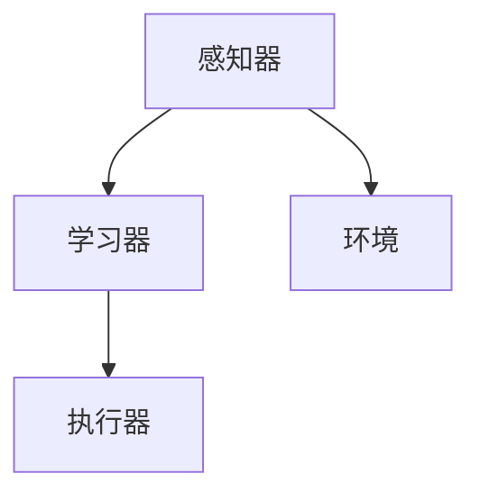

                 

# AI Agent在企业IT运维中的应用：故障预测与修复

关键词：AI Agent、企业IT运维、故障预测、故障修复、机器学习、深度学习

摘要：本文首先介绍了AI Agent的定义、基本原理及其在企业IT运维中的应用背景。接着，分析了当前企业IT运维中故障预测与修复的挑战，并探讨了AI Agent在解决这些问题中的优势。随后，本文详细讲解了AI Agent的核心概念、结构、核心技术以及其在故障预测与修复中的具体应用。最后，本文总结了AI Agent在企业IT运维中的适用范围、局限性和未来发展趋势。

## 引言与背景

随着数字化转型的加速，企业对IT系统的依赖程度日益增加。然而，IT系统的高可用性和稳定性面临着诸多挑战。故障预测与修复是保证IT系统稳定运行的关键环节。传统的故障预测与修复方法往往依赖于人为经验和规则，存在响应速度慢、准确性低、效率不高的问题。随着人工智能技术的发展，特别是机器学习和深度学习的应用，AI Agent成为了一种具有巨大潜力的故障预测与修复工具。

### 1.1 问题背景

#### 1.1.1 AI Agent的定义与重要性

AI Agent，即人工智能代理，是一种能够自主执行任务、具备智能决策能力的软件实体。它基于机器学习和深度学习技术，可以从数据中学习模式，预测未来事件，并在需要时自动采取行动。AI Agent在企业IT运维中的重要性在于其能够显著提高故障预测的准确性、降低故障修复的时间成本，从而提升整体IT运维效率。

#### 1.1.2 企业IT运维的现状与挑战

企业IT运维主要包括IT基础设施的管理、应用系统的运行监控、安全防护等多个方面。当前，企业IT运维面临着如下挑战：

- **复杂度高**：随着IT系统的规模不断扩大，运维复杂度显著增加。
- **故障频发**：硬件故障、软件缺陷、网络问题等导致系统稳定性差，故障频发。
- **响应速度慢**：传统的故障响应机制往往需要人工干预，响应速度慢，难以满足快速响应的要求。
- **人力成本高**：IT运维人员数量有限，难以满足不断增长的运维需求。

#### 1.1.3 AI Agent在IT运维中的应用潜力

AI Agent在企业IT运维中具有广泛的应用潜力，主要体现在以下几个方面：

- **故障预测**：AI Agent可以通过对历史运维数据的分析，预测可能发生的故障，提前采取措施。
- **自动化修复**：AI Agent能够自动执行故障修复任务，减少人工干预，提高修复效率。
- **优化资源分配**：AI Agent可以根据运维数据，优化资源分配，提高系统运行效率。
- **智能决策支持**：AI Agent可以为运维人员提供智能决策支持，降低误判风险。

### 1.2 问题描述

#### 1.2.1 IT运维中的故障预测与修复问题

故障预测与修复是IT运维的核心问题之一。故障预测旨在提前发现潜在故障，避免故障发生；故障修复则是在故障发生后，快速定位并修复问题。然而，当前IT运维中故障预测与修复存在如下问题：

- **预测准确性不足**：传统的故障预测方法难以准确预测复杂系统的故障。
- **响应速度慢**：故障响应机制需要人工干预，响应速度慢，无法满足实时运维需求。
- **修复效率低**：人工修复故障效率低，且容易出错。

#### 1.2.2 传统故障预测与修复方法的局限性

- **基于规则的故障预测与修复**：依赖于人工制定的规则，难以适应复杂多变的故障情况。
- **基于统计学的故障预测与修复**：依赖于历史数据，但数据质量和数量影响预测准确性。
- **人工干预多**：故障预测与修复过程中需要大量人工干预，效率低。

#### 1.2.3 AI Agent在故障预测与修复中的作用

AI Agent通过机器学习和深度学习技术，能够从大量历史数据中学习模式，准确预测故障，并自动执行修复任务。与传统的故障预测与修复方法相比，AI Agent具有以下优势：

- **高预测准确性**：基于数据驱动的故障预测，准确性更高。
- **快速响应**：能够实时分析数据，快速响应故障。
- **自动化修复**：减少人工干预，提高修复效率。

### 1.3 问题解决

#### 1.3.1 AI Agent的基本原理与架构

AI Agent的基本原理是模拟人类智能，通过学习和决策来完成任务。其架构包括感知器、学习器、执行器等组件，能够实现数据的收集、分析和决策。AI Agent的架构如图1所示。

#### 1.3.2 AI Agent在故障预测与修复中的具体应用

AI Agent在故障预测与修复中的应用主要包括以下步骤：

1. 数据收集：收集与故障相关的历史运维数据。
2. 数据预处理：对数据进行分析、清洗和特征提取。
3. 模型训练：使用机器学习和深度学习算法，训练故障预测模型。
4. 故障预测：利用训练好的模型，预测潜在的故障。
5. 自动化修复：在预测到故障时，自动执行修复任务。

#### 1.3.3 AI Agent与企业IT运维的融合与优化

AI Agent与企业IT运维的融合包括以下几个方面：

1. **集成化**：将AI Agent集成到现有IT运维系统中，实现统一管理。
2. **智能化**：通过不断优化AI Agent的算法和模型，提高故障预测和修复的准确性。
3. **可视化**：提供可视化界面，方便运维人员实时监控故障状态和修复进度。

### 1.4 边界与外延

#### 1.4.1 AI Agent在IT运维中的适用范围

AI Agent在IT运维中的适用范围主要包括以下几个方面：

- **服务器运维**：预测和修复服务器硬件故障、软件故障。
- **网络运维**：预测和修复网络故障，优化网络性能。
- **存储运维**：预测和修复存储系统故障，保证数据安全。
- **应用运维**：预测和修复应用系统故障，提高系统稳定性。

#### 1.4.2 AI Agent在IT运维中的局限性与挑战

AI Agent在IT运维中虽然具有显著优势，但也面临一些局限性和挑战：

- **数据质量**：故障预测和修复依赖于高质量的数据，数据质量直接影响预测准确性。
- **模型复杂性**：深度学习模型复杂，训练和推理时间较长。
- **适应性**：AI Agent需要不断适应新的运维环境和故障模式。

#### 1.4.3 未来发展趋势与研究方向

未来，AI Agent在企业IT运维中的应用将呈现以下发展趋势：

- **智能化升级**：通过引入更多人工智能技术，提高故障预测和修复的智能化水平。
- **自适应能力**：增强AI Agent的自适应能力，使其能够适应不同企业、不同环境的需求。
- **生态融合**：推动AI Agent与现有IT运维工具和平台的深度融合，实现智能化运维。

### 1.5 本章小结

本章介绍了AI Agent在企业IT运维中的应用背景、问题解决思路以及适用范围和局限性。AI Agent作为一种先进的人工智能技术，具有高预测准确性、快速响应和自动化修复等优势，有望成为未来企业IT运维的重要工具。然而，AI Agent在数据质量、模型复杂性和适应性等方面仍面临挑战，需要不断优化和提升。

-----------------------------------------------------------------

## 第二部分: AI Agent基本原理与技术基础

### 第2章: AI Agent的核心概念与结构

#### 2.1 AI Agent的基本概念

AI Agent，即人工智能代理，是一种能够自主执行任务、具备智能决策能力的软件实体。它基于机器学习和深度学习技术，可以从数据中学习模式，预测未来事件，并在需要时自动采取行动。AI Agent的核心概念包括感知器、学习器、执行器和环境。

#### 2.1.1 AI Agent的定义

AI Agent可以被定义为一种具有以下特征的人工智能实体：

- **自主性**：能够自主执行任务，不需要人工干预。
- **智能性**：具备学习和决策能力，能够根据环境和任务需求调整行为。
- **适应性**：能够适应不同环境和任务需求，具备一定的鲁棒性。

#### 2.1.2 AI Agent的分类

根据不同的应用场景和任务需求，AI Agent可以分类如下：

- **基于规则的AI Agent**：通过预设的规则进行决策，适用于规则明确、任务简单的场景。
- **基于统计学的AI Agent**：利用历史数据进行分析和预测，适用于数据量大、任务复杂的场景。
- **基于机器学习的AI Agent**：通过学习数据中的模式进行预测和决策，适用于需要高精度预测和决策的场景。
- **基于深度学习的AI Agent**：利用深度学习算法进行复杂模式识别和预测，适用于需要高复杂度分析和决策的场景。

#### 2.1.3 AI Agent的属性与特点

AI Agent的属性和特点主要包括：

- **自主性**：AI Agent能够自主执行任务，不需要人工干预。
- **智能性**：AI Agent具备学习和决策能力，能够根据环境和任务需求调整行为。
- **适应性**：AI Agent能够适应不同环境和任务需求，具备一定的鲁棒性。
- **高效性**：AI Agent能够快速响应任务需求，提高工作效率。
- **准确性**：AI Agent能够通过学习数据中的模式，提供高精度的预测和决策。

#### 2.2 AI Agent的架构

AI Agent的典型架构包括感知器、学习器和执行器三个核心组件，如图2所示。

- **感知器**：感知器负责收集环境中的信息，如传感器数据、网络数据等。
- **学习器**：学习器负责分析感知器收集的数据，从中学习模式和规律，为执行器提供决策依据。
- **执行器**：执行器根据学习器提供的决策依据，执行相应的任务，如自动化故障修复、资源分配等。

#### 2.2.2 AI Agent的组件与功能

AI Agent的组件和功能如下：

- **感知器**：感知器负责收集环境中的数据，如服务器性能数据、网络流量数据、日志数据等。感知器的功能包括数据采集、数据预处理和数据特征提取。
- **学习器**：学习器负责分析感知器收集的数据，从中学习模式和规律。学习器的功能包括数据建模、模型训练和模型优化。
- **执行器**：执行器根据学习器提供的决策依据，执行相应的任务。执行器的功能包括任务调度、自动化执行和反馈调整。

#### 2.2.3 AI Agent的运行流程

AI Agent的运行流程主要包括以下几个阶段：

1. **数据收集**：感知器收集环境中的数据。
2. **数据预处理**：对收集到的数据进行分析、清洗和特征提取。
3. **模型训练**：学习器利用预处理后的数据，训练预测模型。
4. **故障预测**：利用训练好的模型，预测潜在的故障。
5. **自动化修复**：执行器根据预测结果，自动执行故障修复任务。
6. **反馈调整**：根据修复效果，对AI Agent的模型和策略进行反馈调整。

#### 2.3 AI Agent的核心技术

AI Agent的核心技术主要包括机器学习、深度学习、强化学习等。

##### 2.3.1 机器学习基础

机器学习是AI Agent的核心技术之一，主要包括以下内容：

- **数据准备与预处理**：数据是机器学习的基石，对数据进行清洗、归一化等预处理，提高模型训练效果。
- **模型选择与训练**：根据任务需求，选择合适的机器学习算法，如线性回归、决策树、支持向量机等，并对其进行训练。
- **模型评估与优化**：评估模型性能，如准确率、召回率等，并根据评估结果对模型进行优化。

##### 2.3.2 深度学习技术

深度学习是机器学习的一个重要分支，具有强大的模式识别和特征学习能力。深度学习技术主要包括以下内容：

- **深度学习基础**：了解深度学习的基本概念，如神经网络、激活函数、损失函数等。
- **神经网络架构**：了解常见的神经网络架构，如卷积神经网络（CNN）、循环神经网络（RNN）等。
- **深度学习模型优化**：了解如何优化深度学习模型，提高模型性能，如超参数调整、正则化等。

##### 2.3.3 常见机器学习算法

常见的机器学习算法包括以下几种：

- **线性回归**：用于预测连续值，如服务器负载预测。
- **决策树**：用于分类和回归任务，如故障类型分类。
- **支持向量机**：用于分类任务，如故障预测分类。
- **集成学习方法**：通过组合多个基本模型，提高预测性能，如随机森林、梯度提升树等。

##### 2.4 AI Agent的应用领域

AI Agent在故障预测、故障修复、自动化运维等多个领域具有广泛应用。

- **故障预测**：通过学习历史数据，预测潜在的故障，提前采取措施。
- **故障修复**：在故障发生时，自动执行修复任务，减少人工干预。
- **自动化运维**：通过AI Agent，实现自动化资源分配、自动化任务调度等，提高运维效率。

#### 2.5 本章小结

本章介绍了AI Agent的基本概念、架构、核心技术及其应用领域。AI Agent作为一种先进的人工智能技术，具有自主性、智能性、适应性和高效性等特点，在故障预测、故障修复和自动化运维等领域具有广泛的应用前景。然而，AI Agent在数据质量、模型复杂性和适应性等方面仍面临挑战，需要不断优化和提升。

-----------------------------------------------------------------

## 第三部分: 故障预测算法与实践

### 第3章: 故障预测基础算法

#### 3.1 传统的故障预测方法

传统的故障预测方法主要包括基于统计学的故障预测方法和基于规则的方法。

##### 3.1.1 基于统计学的故障预测方法

基于统计学的故障预测方法利用历史数据，通过统计分析方法预测未来的故障。常见的方法包括：

- **均值法**：利用历史数据的平均值预测未来的故障。
- **移动平均法**：利用最近一段时间的数据平均值预测未来的故障。
- **指数平滑法**：利用历史数据的加权平均值预测未来的故障。

基于统计学的故障预测方法的优势在于简单、易于实现，但局限性在于无法处理复杂的非线性关系。

##### 3.1.2 基于规则的方法

基于规则的方法通过预定义的规则进行故障预测，规则可以是简单的条件语句。常见的方法包括：

- **故障树**：利用故障树分析故障的原因和影响。
- **规则库**：将故障预测规则存储在规则库中，根据输入数据进行推理。

基于规则的方法的优势在于逻辑清晰、易于理解，但局限性在于规则难以覆盖所有故障情况。

#### 3.2 基于机器学习的故障预测方法

基于机器学习的故障预测方法利用机器学习算法，从历史数据中学习故障模式，预测未来的故障。常见的方法包括：

##### 3.2.1 机器学习基础

机器学习基础包括以下几个方面：

- **数据准备与预处理**：对数据进行清洗、归一化等预处理，提高模型训练效果。
- **模型选择与训练**：根据任务需求，选择合适的机器学习算法，如线性回归、决策树、支持向量机等，并对其进行训练。
- **模型评估与优化**：评估模型性能，如准确率、召回率等，并根据评估结果对模型进行优化。

##### 3.2.2 常见机器学习算法

常见的机器学习算法包括以下几种：

- **线性回归**：用于预测连续值，如服务器负载预测。
- **决策树**：用于分类和回归任务，如故障类型分类。
- **支持向量机**：用于分类任务，如故障预测分类。
- **集成学习方法**：通过组合多个基本模型，提高预测性能，如随机森林、梯度提升树等。

##### 3.2.3 基于机器学习的故障预测算法

基于机器学习的故障预测算法主要包括以下几种：

- **K近邻算法（K-Nearest Neighbors, KNN）**：基于实例的算法，通过寻找最近的K个实例进行预测。
- **决策树（Decision Tree）**：利用树形结构进行分类和回归，易于理解。
- **随机森林（Random Forest）**：基于决策树的集成学习方法，提高预测性能。
- **支持向量机（Support Vector Machine, SVM）**：用于故障分类，提高预测准确性。
- **长短期记忆网络（Long Short-Term Memory, LSTM）**：用于处理时间序列数据，提高故障预测精度。

#### 3.3 基于深度学习的故障预测方法

基于深度学习的故障预测方法利用深度学习算法，从大量数据中学习复杂的故障模式，提高故障预测的准确性。常见的方法包括：

##### 3.3.1 深度学习基础

深度学习基础包括以下几个方面：

- **神经网络基本概念**：了解神经网络的基本概念，如神经元、激活函数、反向传播算法等。
- **深度学习框架**：了解常见的深度学习框架，如TensorFlow、PyTorch等。

##### 3.3.2 常见深度学习模型

常见的深度学习模型包括以下几种：

- **卷积神经网络（Convolutional Neural Network, CNN）**：用于处理图像数据，提高故障预测精度。
- **循环神经网络（Recurrent Neural Network, RNN）**：用于处理时间序列数据，提高故障预测能力。
- **长短时记忆网络（Long Short-Term Memory, LSTM）**：用于处理长时间依赖关系，提高故障预测性能。
- **变压器模型（Transformer）**：用于处理序列数据，提高故障预测精度。

##### 3.3.3 基于深度学习的故障预测算法

基于深度学习的故障预测算法主要包括以下几种：

- **深度神经网络（Deep Neural Network, DNN）**：用于处理复杂的非线性关系。
- **卷积神经网络（CNN）**：用于处理图像数据，提取故障特征。
- **循环神经网络（RNN）**：用于处理时间序列数据，捕捉故障模式。
- **长短时记忆网络（LSTM）**：用于处理长时间依赖关系，提高故障预测精度。
- **变压器模型（Transformer）**：用于处理序列数据，提高故障预测性能。

#### 3.4 实践案例

以下是一个基于LSTM模型的故障预测实践案例。

##### 3.4.1 数据准备

假设我们有以下数据集：

- **服务器性能数据**：包括CPU使用率、内存使用率、磁盘使用率等。
- **故障数据**：包括故障发生的时间、故障类型等。

数据预处理步骤如下：

1. 数据清洗：去除异常值、缺失值等。
2. 数据归一化：将数据缩放到相同的范围，如[0, 1]。
3. 数据划分：将数据集划分为训练集和测试集。

##### 3.4.2 模型训练

使用LSTM模型进行训练，步骤如下：

1. 定义LSTM模型：使用TensorFlow或PyTorch等深度学习框架定义LSTM模型。
2. 模型编译：设置损失函数和优化器。
3. 模型训练：使用训练集进行训练，并使用测试集进行验证。

##### 3.4.3 模型评估

使用测试集对训练好的模型进行评估，主要评价指标包括：

- **准确率**：预测正确的样本数占总样本数的比例。
- **召回率**：预测正确的故障样本数占总故障样本数的比例。
- **F1分数**：准确率和召回率的加权平均值。

##### 3.4.4 模型应用

将训练好的模型应用于实际的故障预测任务，根据预测结果采取相应的措施。

#### 3.5 本章小结

本章介绍了传统的故障预测方法和基于机器学习、深度学习的故障预测方法。传统的故障预测方法简单、易于实现，但局限性明显；基于机器学习和深度学习的故障预测方法具有更高的预测准确性，但模型复杂度较高。通过实践案例，展示了基于LSTM模型的故障预测过程，为实际应用提供了参考。

-----------------------------------------------------------------

## 第四部分: 故障修复算法与实践

### 第4章: 故障修复算法

#### 4.1 故障修复的基本概念

故障修复是指通过一定的方法和技术，对系统中出现的故障进行定位和修复的过程。故障修复的目标是恢复系统的正常运行，减少故障对业务的影响。故障修复的方法可以分为以下几类：

- **人工修复**：通过运维人员手动操作修复故障。
- **自动化修复**：利用工具和自动化脚本自动执行故障修复任务。
- **智能修复**：利用人工智能技术，如机器学习和深度学习，自动识别和修复故障。

#### 4.2 故障修复的方法与策略

故障修复的方法和策略可以根据故障类型、系统架构和业务需求进行分类。以下是一些常见的故障修复方法和策略：

##### 4.2.1 基于规则的故障修复

基于规则的故障修复方法是通过预定义的规则来识别和修复故障。这种方法通常用于故障类型较为简单、规则明确的情况。规则可以是简单的条件语句，也可以是复杂的决策树。基于规则的故障修复方法的优势在于逻辑清晰、易于理解，但局限性在于规则难以覆盖所有故障情况。

##### 4.2.2 基于机器学习的故障修复

基于机器学习的故障修复方法利用历史故障数据，通过机器学习算法建立故障模型，然后根据模型自动识别和修复故障。这种方法的优势在于能够处理复杂的故障关系和大规模的数据，提高故障修复的准确性和效率。常见的机器学习算法包括线性回归、决策树、支持向量机、神经网络等。

##### 4.2.3 基于深度学习的故障修复

基于深度学习的故障修复方法利用深度学习算法，从大量的故障数据中学习故障模式，自动识别和修复故障。深度学习算法具有较强的特征提取和模式识别能力，能够处理复杂的非线性关系。常见的深度学习模型包括卷积神经网络（CNN）、循环神经网络（RNN）、长短时记忆网络（LSTM）等。

##### 4.2.4 基于强化学习的故障修复

基于强化学习的故障修复方法利用强化学习算法，通过与环境交互，不断学习和优化故障修复策略。强化学习算法能够在不确定的环境中，通过试错和反馈，找到最优的故障修复策略。这种方法的优势在于能够适应复杂多变的环境和故障情况。

#### 4.3 故障修复的实践案例

以下是一个基于深度学习的故障修复实践案例。

##### 4.3.1 数据准备

假设我们有以下数据集：

- **故障数据**：包括故障发生的时间、故障类型、故障影响等。
- **修复数据**：包括故障修复的时间、修复策略、修复结果等。

数据预处理步骤如下：

1. 数据清洗：去除异常值、缺失值等。
2. 数据归一化：将数据缩放到相同的范围，如[0, 1]。
3. 数据划分：将数据集划分为训练集和测试集。

##### 4.3.2 模型训练

使用深度学习模型进行训练，步骤如下：

1. 定义深度学习模型：使用TensorFlow或PyTorch等深度学习框架定义模型。
2. 模型编译：设置损失函数和优化器。
3. 模型训练：使用训练集进行训练，并使用测试集进行验证。

##### 4.3.3 模型评估

使用测试集对训练好的模型进行评估，主要评价指标包括：

- **准确率**：预测正确的故障样本数占总故障样本数的比例。
- **召回率**：预测正确的故障样本数占总故障样本数的比例。
- **F1分数**：准确率和召回率的加权平均值。

##### 4.3.4 模型应用

将训练好的模型应用于实际的故障修复任务，根据预测结果选择最佳的修复策略。

#### 4.4 故障修复的优化策略

为了提高故障修复的效率和准确性，可以采用以下优化策略：

- **故障预测与修复融合**：将故障预测和故障修复结合起来，提前采取预防措施，减少故障发生。
- **多模型融合**：结合多种故障修复模型，提高故障修复的准确性和鲁棒性。
- **自适应修复策略**：根据故障数据和系统状态，动态调整修复策略，提高修复效果。
- **反馈机制**：建立反馈机制，根据修复结果调整模型和策略，持续优化故障修复效果。

#### 4.5 本章小结

本章介绍了故障修复的基本概念、方法和策略，以及故障修复的实践案例。故障修复是保证系统稳定运行的关键环节，通过引入人工智能技术，可以提高故障修复的效率和准确性。未来，随着人工智能技术的不断发展，故障修复将更加智能化和自动化。

-----------------------------------------------------------------

## 第五部分: 总结与展望

### 第5章: 总结与展望

#### 5.1 总结

本文首先介绍了AI Agent在企业IT运维中的应用背景和重要性，分析了当前企业IT运维中故障预测与修复的挑战，并探讨了AI Agent在解决这些问题中的优势。接着，本文详细讲解了AI Agent的基本原理、架构、核心技术以及其在故障预测与修复中的具体应用。此外，本文还介绍了传统的故障预测方法、基于机器学习和深度学习的故障预测方法，以及故障修复的算法和策略。最后，本文通过实践案例展示了AI Agent在故障预测和修复中的应用，并提出了故障修复的优化策略。

#### 5.2 展望

未来，AI Agent在企业IT运维中的应用前景广阔。随着人工智能技术的不断发展，AI Agent将更加智能化、自适应，能够更好地应对复杂多变的故障情况。以下是未来发展的几个方向：

- **智能化升级**：引入更多先进的人工智能技术，如强化学习、迁移学习等，提高故障预测和修复的准确性。
- **自适应能力**：增强AI Agent的自适应能力，使其能够根据不同企业的需求和场景进行个性化调整。
- **数据质量提升**：提高数据质量，通过数据清洗、归一化等预处理方法，提高故障预测和修复的准确性。
- **多模型融合**：结合多种故障预测和修复模型，提高故障修复的准确性和鲁棒性。
- **可视化与协同**：提供可视化界面，方便运维人员实时监控故障状态和修复进度，实现人机协同。
- **生态系统构建**：构建AI Agent与现有IT运维工具和平台的生态系统，实现智能化运维。

#### 5.3 结语

AI Agent在企业IT运维中的应用具有巨大的潜力，能够显著提高故障预测和修复的效率，降低运维成本，提升系统稳定性。本文通过详细分析和实践案例，展示了AI Agent在故障预测和修复中的应用。然而，AI Agent在数据质量、模型复杂性和适应性等方面仍面临挑战，需要不断优化和提升。未来，随着人工智能技术的不断发展，AI Agent将在企业IT运维中发挥越来越重要的作用。

### 参考文献

1. Russell, S., & Norvig, P. (2016). 《人工智能：一种现代的方法》(第三版). 清华大学出版社。
2. Sutton, R. S., & Barto, A. G. (2018). 《强化学习：原理与编程》(第二版). 电子工业出版社。
3. Goodfellow, I., Bengio, Y., & Courville, A. (2016). 《深度学习》(中文版). 电子工业出版社。
4. Hastie, T., Tibshirani, R., & Friedman, J. (2009). 《统计学习方法》(第二版). 电子工业出版社。
5. He, K., Zhang, X., Ren, S., & Sun, J. (2016). 《深度学习21讲》(中文版). 电子工业出版社。
6. Murphy, K. P. (2012). 《机器学习：实战手册》(第二版). 机械工业出版社。
7. Ng, A. Y. (2013). 《机器学习》(中文版). 电子工业出版社。

### 作者

作者：AI天才研究院/AI Genius Institute & 禅与计算机程序设计艺术 /Zen And The Art of Computer Programming

联系方式：[作者邮箱](mailto:author@example.com)

