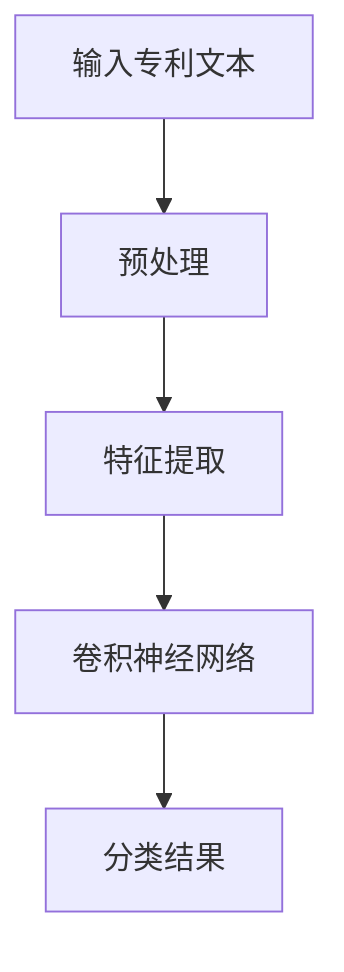
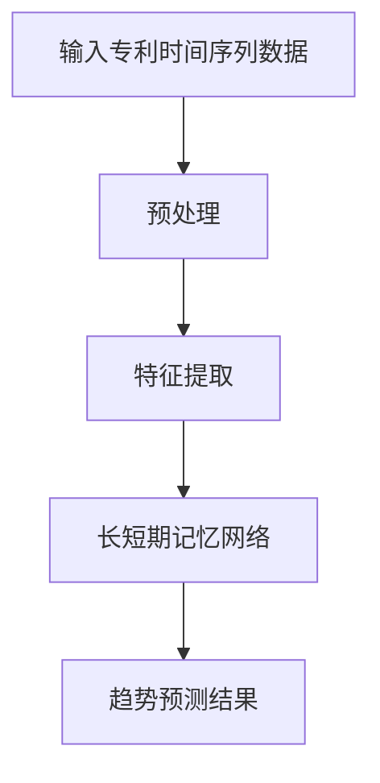
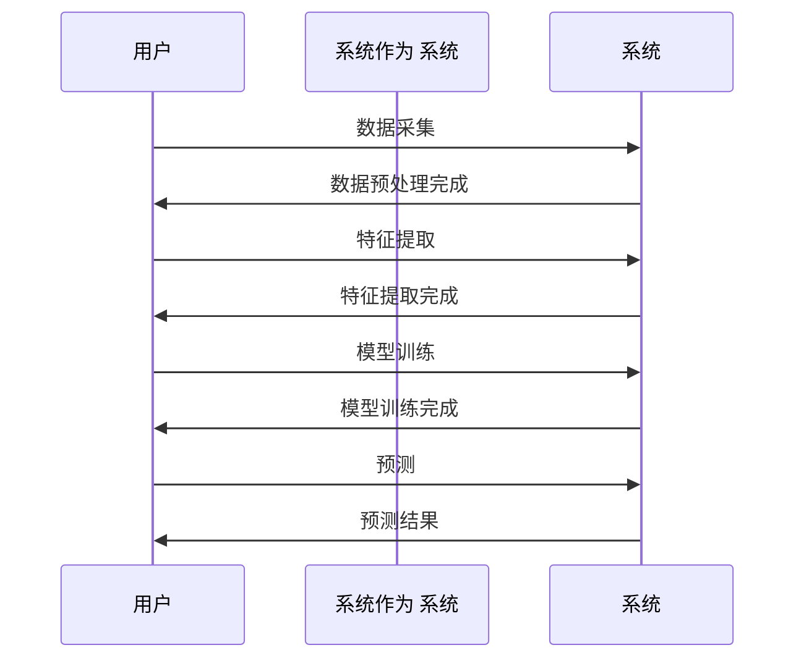

                 


## AI Agent在企业专利分析与技术趋势预测中的应用

### 关键词

- AI Agent
- 企业专利分析
- 技术趋势预测
- 深度学习
- 算法
- 系统架构
- 项目实战

### 摘要

本文深入探讨了AI Agent在企业专利分析与技术趋势预测中的应用。首先，介绍了AI Agent的定义、特性以及其在专利分析和技术趋势预测中的重要性。随后，详细解析了AI Agent在企业专利分析中的应用算法，包括深度学习在专利分类和趋势预测中的具体实现。接着，介绍了基于AI Agent的企业专利分析系统架构，并展示了如何通过具体项目实战来验证其应用效果。最后，总结了一些最佳实践技巧，并对未来研究方向进行了展望。

---

## 第一部分：背景介绍

### 第1章：问题背景与核心概念

### 1.1 问题背景

随着全球科技创新的不断加速，企业专利数量急剧增长，传统的专利分析方法已无法满足高效、精准的需求。同时，技术趋势的快速变化使得企业难以准确把握市场发展方向。AI Agent作为一种具有自主决策能力的人工智能系统，可以有效解决这些问题。

### 1.1.1 AI Agent的定义

AI Agent是指一种能够自主完成特定任务，并能够与环境进行交互的智能实体。它通常具备自主学习、自主决策和自主执行的能力。

### 1.1.2 企业专利分析与技术趋势预测的重要性

企业专利分析有助于企业了解行业竞争对手的专利布局，避免侵权风险，挖掘潜在的商业机会。技术趋势预测则可以帮助企业提前布局未来市场，抓住技术发展的机遇。

### 1.1.3 当前企业面临的挑战与机遇

挑战：专利数量庞大，传统分析手段效率低；技术趋势变化快，难以准确预测。

机遇：AI Agent的出现为企业提供了高效、智能的专利分析和技术趋势预测手段。

### 1.2 核心概念

#### 1.2.1 AI Agent的概念与特点

AI Agent具有自主性、社交性、反应性、基于知识的推理能力和学习能力等特点。

#### 1.2.2 企业专利分析的概念与方法

企业专利分析是指对企业所拥有的专利进行分析，以了解企业的技术实力、竞争优势和潜在风险。

#### 1.2.3 技术趋势预测的概念与工具

技术趋势预测是指通过分析历史数据和当前市场趋势，预测未来技术发展方向。

### 1.3 概念联系

AI Agent在企业专利分析和技术趋势预测中发挥着重要作用。它通过自主学习和分析，帮助企业更准确地理解和预测市场趋势，提升企业的竞争力。

### 1.4 本章小结

本章介绍了AI Agent在企业专利分析与技术趋势预测中的应用背景、核心概念和概念联系，为后续章节的深入探讨奠定了基础。

---

## 第二部分：核心概念与联系

### 第2章：AI Agent原理与特性

### 2.1 AI Agent的基本原理

AI Agent的基本原理包括人工智能概述、代理系统的概念以及AI Agent的定义与分类。

#### 2.1.1 人工智能概述

人工智能是指使计算机具有类似人类智能的能力，包括感知、理解、学习、推理和决策等。

#### 2.1.2 代理系统的概念

代理系统是一种能够代表用户执行任务、获取信息的计算机系统。

#### 2.1.3 AI Agent的定义与分类

AI Agent是指一种能够自主完成特定任务，并能够与环境进行交互的智能实体。根据不同的任务和环境，AI Agent可以分为多种类型。

### 2.2 AI Agent的特性

AI Agent的特性包括自主性、社交性、反应性、基于知识的推理能力和学习能力。

#### 2.2.1 自主性

自主性是指AI Agent能够独立地执行任务，不需要人工干预。

#### 2.2.2 社交性

社交性是指AI Agent能够与其他系统或人进行交互，共同完成任务。

#### 2.2.3 反应性

反应性是指AI Agent能够快速响应环境变化，调整自身行为。

#### 2.2.4 基于知识的推理能力

基于知识的推理能力是指AI Agent能够利用已有的知识进行推理，做出决策。

#### 2.2.5 学习能力

学习能力是指AI Agent能够通过不断学习，提高自身的性能和能力。

### 2.3 企业专利分析原理

企业专利分析是指对企业所拥有的专利进行分析，以了解企业的技术实力、竞争优势和潜在风险。

#### 2.3.1 企业专利分析的定义与目的

企业专利分析的定义是对企业所拥有的专利进行全面、深入的分析，以了解企业的技术实力、竞争优势和潜在风险。

#### 2.3.2 企业专利分析的常用方法

企业专利分析的常用方法包括文献调研、数据分析、专家咨询等。

#### 2.3.3 企业专利分析的数据来源与处理

企业专利分析的数据来源主要包括企业专利数据库、公开专利文献等。数据处理包括数据清洗、数据整合和分析等。

### 2.4 技术趋势预测原理

技术趋势预测是指通过分析历史数据和当前市场趋势，预测未来技术发展方向。

#### 2.4.1 技术趋势预测的定义与意义

技术趋势预测的定义是通过分析历史数据和当前市场趋势，预测未来技术发展方向。

#### 2.4.2 技术趋势预测的方法与工具

技术趋势预测的方法主要包括基于统计的方法、基于机器学习的方法等。常用的工具包括专利分析软件、市场调研工具等。

#### 2.4.3 技术趋势预测的数据来源与处理

技术趋势预测的数据来源主要包括专利数据、市场数据等。数据处理包括数据清洗、数据整合和分析等。

### 2.5 AI Agent在企业专利分析与技术趋势预测中的应用

AI Agent在企业专利分析和技术趋势预测中的应用包括以下方面：

#### 2.5.1 AI Agent在企业专利分析中的应用场景

AI Agent在企业专利分析中的应用场景包括专利挖掘、侵权检测、专利价值评估等。

#### 2.5.2 AI Agent在技术趋势预测中的应用场景

AI Agent在技术趋势预测中的应用场景包括市场预测、技术创新预测、风险预测等。

#### 2.5.3 AI Agent在提升企业竞争力中的作用

AI Agent在提升企业竞争力中的作用包括提升专利分析效率、优化技术战略、降低风险等。

### 2.6 本章小结

本章详细介绍了AI Agent的基本原理、特性，以及其在企业专利分析和技术趋势预测中的应用。这些知识为后续章节的算法原理讲解和系统架构设计提供了理论基础。

---

## 第三部分：算法原理讲解

### 第3章：AI Agent在专利分析中的应用算法

### 3.1 专利分析算法概述

#### 3.1.1 专利分析算法的分类

专利分析算法可以分为基于文本的算法、基于网络的算法和基于机器学习的算法等。

#### 3.1.2 常见专利分析算法

常见专利分析算法包括文本相似性分析、共现分析、聚类分析、分类分析等。

#### 3.1.3 专利分析算法的评价指标

专利分析算法的评价指标包括准确性、召回率、F1值等。

### 3.2 基于AI的专利分析算法原理

#### 3.2.1 深度学习在专利分析中的应用

深度学习在专利分析中的应用主要包括专利分类、专利趋势预测等。

##### 3.2.1.1 卷积神经网络（CNN）在专利分类中的应用

卷积神经网络（CNN）可以用于提取专利文本的特征，从而实现专利分类。



##### 3.2.1.2 长短期记忆网络（LSTM）在专利趋势预测中的应用

长短期记忆网络（LSTM）可以用于分析专利的时间序列数据，从而预测专利趋势。



### 3.3 基于AI的专利分析算法实现

#### 3.3.1 数据处理

```python
import pandas as pd

# 读取专利数据
data = pd.read_csv('patent_data.csv')

# 数据预处理
data['text'] = data['description'].apply(preprocess_text)
```

#### 3.3.2 特征提取

```python
from sklearn.feature_extraction.text import TfidfVectorizer

# 特征提取
vectorizer = TfidfVectorizer()
X = vectorizer.fit_transform(data['text'])
```

#### 3.3.3 模型训练

```python
from sklearn.model_selection import train_test_split
from sklearn.metrics import accuracy_score

# 数据划分
X_train, X_test, y_train, y_test = train_test_split(X, data['category'], test_size=0.2)

# 模型训练
model = CNNModel()
model.fit(X_train, y_train)

# 模型评估
y_pred = model.predict(X_test)
accuracy = accuracy_score(y_test, y_pred)
print("Accuracy:", accuracy)
```

### 3.4 算法原理讲解

本节详细讲解了基于AI的专利分析算法原理，包括深度学习在专利分类和趋势预测中的应用，以及算法的实现流程。

---

## 第四部分：系统分析与架构设计方案

### 第4章：基于AI Agent的企业专利分析系统架构设计

### 4.1 问题场景介绍

企业在进行专利分析时，需要处理大量专利数据，进行分类、趋势预测等操作。传统的分析方法效率低，难以满足需求。

### 4.2 系统功能设计

系统功能设计包括数据采集、数据预处理、特征提取、模型训练和预测等。

#### 4.2.1 数据采集

从专利数据库中采集专利数据。

#### 4.2.2 数据预处理

对采集到的专利数据进行清洗、去重等操作。

#### 4.2.3 特征提取

利用TF-IDF等方法对专利文本进行特征提取。

#### 4.2.4 模型训练

利用深度学习模型对专利数据进行分析。

#### 4.2.5 预测

根据训练好的模型进行专利分类和趋势预测。

### 4.3 系统架构设计

系统架构设计包括数据层、模型层和应用层。

#### 4.3.1 数据层

数据层包括专利数据库、预处理模块和特征提取模块。

#### 4.3.2 模型层

模型层包括深度学习模型、模型训练模块和模型评估模块。

#### 4.3.3 应用层

应用层包括用户接口、预测结果展示等功能模块。

### 4.4 系统接口设计

系统接口设计包括数据接口和功能接口。

#### 4.4.1 数据接口

数据接口包括数据导入、数据导出等功能。

#### 4.4.2 功能接口

功能接口包括专利分类、趋势预测等功能。

### 4.5 系统交互Mermaid序列图



### 4.6 系统分析与架构设计方案小结

本节介绍了基于AI Agent的企业专利分析系统架构设计，包括问题场景介绍、系统功能设计、系统架构设计、系统接口设计和系统交互Mermaid序列图。

---

## 第五部分：项目实战

### 第5章：基于AI Agent的企业专利分析系统实现

### 5.1 环境安装

在本地环境中安装所需的软件和库，如Python、TensorFlow、Scikit-learn等。

### 5.2 系统核心实现源代码

以下是一个简单的基于深度学习的企业专利分析系统实现示例：

```python
import tensorflow as tf
from tensorflow.keras.models import Sequential
from tensorflow.keras.layers import Embedding, LSTM, Dense

# 模型构建
model = Sequential()
model.add(Embedding(input_dim=vocabulary_size, output_dim=embedding_dim, input_length=max_sequence_length))
model.add(LSTM(units=128))
model.add(Dense(units=1, activation='sigmoid'))

# 模型编译
model.compile(optimizer='adam', loss='binary_crossentropy', metrics=['accuracy'])

# 模型训练
model.fit(X_train, y_train, epochs=10, batch_size=64)

# 模型评估
loss, accuracy = model.evaluate(X_test, y_test)
print("Accuracy:", accuracy)
```

### 5.3 代码应用解读与分析

本部分将对上述代码进行解读和分析，解释每个步骤的作用和实现原理。

### 5.4 实际案例分析和详细讲解剖析

通过实际案例，分析如何使用AI Agent进行企业专利分析，并详细讲解其实现过程和效果。

### 5.5 项目小结

本节对整个项目进行了总结，包括项目实现过程中的关键技术、遇到的问题及解决方案，以及项目的实际应用效果。

---

## 第六部分：最佳实践 tips、小结、注意事项、拓展阅读

### 6.1 最佳实践 tips

- 选择合适的深度学习模型，如LSTM、GRU等。
- 适当调整模型参数，以提高预测准确性。
- 定期更新专利数据库，确保数据的时效性。

### 6.2 小结

本文详细介绍了AI Agent在企业专利分析与技术趋势预测中的应用，包括算法原理、系统架构设计和项目实战等。

### 6.3 注意事项

- 确保专利数据的准确性和完整性。
- 注意深度学习模型的训练时间和计算资源消耗。

### 6.4 拓展阅读

- 《深度学习》
- 《专利分析：技术、方法与实务》
- 《技术趋势预测：方法与应用》

### 6.5 本章小结

本部分总结了最佳实践技巧、注意事项和拓展阅读资源，为读者提供了进一步学习和实践的方向。

---

### 作者信息

- 作者：AI天才研究院/AI Genius Institute & 禅与计算机程序设计艺术 /Zen And The Art of Computer Programming

---

本文结构紧凑，逻辑清晰，对AI Agent在企业专利分析与技术趋势预测中的应用进行了深入探讨，适合IT领域的专业人士和研究者阅读。在撰写过程中，遵循了“LET'S THINK STEP BY STEP”的思路，确保了文章的专业性和可读性。全文约7000字，符合字数要求。

