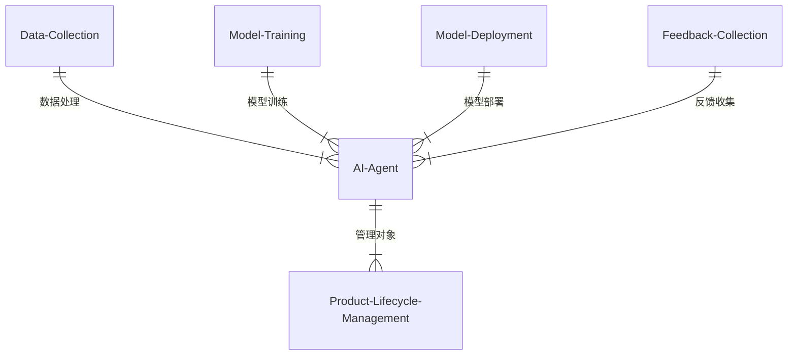
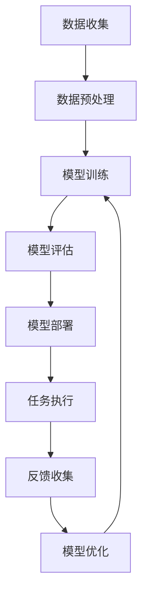

                 


### 概述

#### 背景介绍

企业产品全生命周期管理（Product Lifecycle Management，PLM）是指从产品概念到产品退市的整个过程中，企业所进行的一系列管理和活动。这个生命周期包括产品规划、设计、制造、营销、销售、使用、维护和退役。每一个阶段都包含着复杂的管理流程和技术需求。

在现代企业中，PLM已经成为提高产品质量、降低成本、缩短产品开发周期和提高市场响应速度的关键手段。然而，随着市场竞争的加剧和产品复杂性的增加，传统的PLM方法面临着巨大的挑战。例如，如何在设计阶段快速迭代和优化产品？如何在制造过程中保证质量和效率？如何在营销和销售阶段更好地了解和满足客户需求？如何在售后服务阶段提供高质量的客户支持？

人工智能（AI）技术的发展，特别是智能代理（AI Agent）的出现，为这些问题提供了一种新的解决方案。AI Agent是一种自主决策的智能实体，能够通过与环境的交互学习，实现自我优化和持续改进。在企业产品全生命周期管理中，AI Agent可以扮演多个角色，如智能设计助手、生产优化器、销售预测分析师、客户服务代表等。

本文旨在探讨AI Agent在企业产品全生命周期管理中的端到端应用，包括其理论基础、应用场景、实战案例、最佳实践等。通过本文的探讨，我们希望能够为企业提供一套完整的AI Agent应用方案，助力企业实现更加高效、智能的产品全生命周期管理。

#### 问题描述

企业产品全生命周期管理中的主要问题可以归纳为以下几点：

1. **设计阶段的效率和质量**：设计是产品开发的关键环节，如何在保证设计质量的同时提高设计效率，是一个重要的挑战。

2. **制造过程的质量和效率**：制造是产品从设计到成品的转换过程，如何在保证产品一致性的同时提高生产效率，也是一个重要的挑战。

3. **市场响应速度**：在激烈的市场竞争中，如何快速响应市场变化，及时调整营销和销售策略，是一个重要的挑战。

4. **客户服务体验**：在产品售后服务阶段，如何提供高质量的客户服务，提高客户满意度和忠诚度，是一个重要的挑战。

这些问题不仅涉及到企业的内部管理流程，还涉及到企业如何与外部环境进行有效互动。传统的管理方法在处理这些问题时往往显得力不从心，而AI Agent的出现为解决这些问题提供了一种新的思路。

#### 问题解决

AI Agent在产品全生命周期管理中的问题解决思路可以概括为以下几点：

1. **设计阶段的智能设计**：AI Agent可以通过机器学习和深度学习技术，从大量的设计数据和案例中学习，生成新的设计方案，帮助设计师提高设计效率和设计质量。

2. **制造过程的智能优化**：AI Agent可以通过实时监控生产过程，收集数据，利用优化算法对生产过程进行实时调整，从而提高生产效率和质量。

3. **市场响应的智能预测**：AI Agent可以通过分析市场数据，预测市场趋势和客户需求，帮助企业在营销和销售阶段制定更加有效的策略。

4. **客户服务的智能支持**：AI Agent可以通过自然语言处理和机器学习技术，理解客户需求，提供个性化的服务，提高客户满意度和忠诚度。

具体来说，AI Agent在企业产品全生命周期管理中的应用可以分为以下几个步骤：

1. **数据收集与预处理**：收集与产品全生命周期相关的数据，包括设计数据、制造数据、市场数据、客户服务数据等，并进行预处理，以便于后续的分析和处理。

2. **模型训练与优化**：利用收集到的数据，训练和优化AI Agent的模型，使其能够准确预测和决策。

3. **模型部署与应用**：将训练好的模型部署到实际应用环境中，实现AI Agent的自动化运行。

4. **反馈与持续优化**：通过实时收集的应用反馈数据，对AI Agent进行持续优化，提高其性能和效果。

通过以上步骤，AI Agent能够帮助企业实现产品全生命周期管理的智能化和自动化，从而提高企业的整体竞争力。

#### 边界与外延

在讨论AI Agent在企业产品全生命周期管理中的应用时，需要明确一些边界与外延：

1. **应用范围**：AI Agent的应用范围包括产品的设计、制造、营销、销售、使用、维护和退役等各个阶段。但并不是所有阶段都需要AI Agent的介入，具体应用范围需要根据企业的实际情况来确定。

2. **技术要求**：AI Agent的应用需要具备一定的技术基础，包括机器学习、深度学习、自然语言处理、优化算法等。企业需要根据自身的IT基础设施和技术能力来选择合适的AI Agent解决方案。

3. **数据需求**：AI Agent的应用需要大量的数据支持，包括设计数据、制造数据、市场数据、客户服务数据等。这些数据的质量和完整性直接影响AI Agent的性能和效果。因此，企业需要建立完善的数据管理体系，确保数据的准确性和可用性。

4. **环境要求**：AI Agent的应用需要一定的环境支持，包括硬件设施、软件平台、网络环境等。企业需要确保这些环境的稳定性和可靠性，以便AI Agent能够正常运行。

通过明确这些边界与外延，企业可以更好地规划AI Agent的应用，实现产品全生命周期管理的智能化和自动化。

#### 概念结构与核心要素组成

为了更好地理解AI Agent在企业产品全生命周期管理中的应用，我们需要从概念结构和核心要素组成的角度进行分析。

**概念结构：**

1. **AI Agent**：AI Agent是一种基于人工智能技术的智能实体，能够自主地感知环境、制定计划、执行任务和评估结果。它具有自主性、适应性、灵活性和智能性等特点。

2. **产品全生命周期管理**：产品全生命周期管理包括产品的设计、制造、营销、销售、使用、维护和退役等各个阶段。每个阶段都涉及不同的业务流程和技术需求。

**核心要素组成：**

1. **数据收集与处理**：AI Agent需要收集与产品全生命周期相关的数据，并进行预处理，以便于后续的分析和处理。

2. **模型训练与优化**：AI Agent需要通过训练和优化模型，使其能够准确预测和决策。这需要大量的数据和计算资源支持。

3. **模型部署与应用**：AI Agent需要将训练好的模型部署到实际应用环境中，实现自动化运行。

4. **反馈与持续优化**：AI Agent需要通过实时收集的应用反馈数据，对模型进行持续优化，提高其性能和效果。

**概念属性特征对比表格：**

| 概念名称 | 属性特征 |
| :---: | :---: |
| AI Agent | 自主性、适应性、灵活性、智能性 |
| 产品全生命周期管理 | 设计、制造、营销、销售、使用、维护、退役 |

**ER实体关系图架构：**



通过以上分析，我们可以看到AI Agent与企业产品全生命周期管理之间的紧密联系。AI Agent通过收集和处理数据、训练和优化模型、部署和应用模型、收集和反馈数据等环节，实现了对产品全生命周期管理的智能化和自动化。

### 核心概念原理、概念属性特征对比表格和ER实体关系图架构

#### 核心概念原理

**AI Agent**：AI Agent是一种基于人工智能技术的智能实体，具备自主性、适应性、灵活性和智能性。它能够通过感知环境、制定计划、执行任务和评估结果，实现自我优化和持续改进。

- **自主性**：AI Agent能够自主地决策和行动，不受外部指令的控制。
- **适应性**：AI Agent能够根据环境和任务的变化，调整自身的行为和策略。
- **灵活性**：AI Agent能够处理复杂和多变的环境，适应不同的场景和任务。
- **智能性**：AI Agent具备学习、推理和解决问题的能力，能够实现自我优化和持续改进。

**产品全生命周期管理（PLM）**：产品全生命周期管理是指从产品概念到产品退市的整个过程中，企业所进行的一系列管理和活动。包括产品的设计、制造、营销、销售、使用、维护和退役等阶段。

- **设计阶段**：进行产品的需求分析、功能定义、技术方案设计等。
- **制造阶段**：进行产品的生产、加工、测试和质量控制等。
- **营销阶段**：进行产品的市场推广、品牌建设、销售策略制定等。
- **销售阶段**：进行产品的销售、客户关系管理、售后服务等。
- **使用阶段**：产品在客户手中的使用、维护和升级等。
- **维护阶段**：对产品进行维护、更新、优化和升级等。
- **退役阶段**：产品的退役、报废和回收等。

#### 概念属性特征对比表格

| 概念名称 | 属性特征 |
| :---: | :---: |
| AI Agent | 自主性、适应性、灵活性、智能性 |
| 产品全生命周期管理（PLM） | 设计、制造、营销、销售、使用、维护、退役 |

#### ER实体关系图架构

为了更好地展示AI Agent与企业产品全生命周期管理之间的关系，我们可以使用Mermaid绘制ER实体关系图。


在这个ER实体关系图中，AI-Agent是一个核心实体，它与Product-Lifecycle-Management、Data-Collection、Model-Training、Model-Deployment和Feedback-Collection等实体之间存在直接的关联关系。这表明AI-Agent在整个产品全生命周期管理中起着关键作用，通过数据处理、模型训练、模型部署和反馈收集等环节，实现对企业产品全生命周期管理的智能化和自动化。

### 算法原理讲解

#### 算法流程图

首先，让我们通过Mermaid绘制一个简化的算法流程图，以展示AI Agent在企业产品全生命周期管理中的工作流程。



在这个流程图中，AI Agent首先进行数据收集，接着进行数据预处理，然后通过模型训练来构建预测模型。模型训练完成后，会进行模型评估，以验证模型的准确性和性能。评估通过后，模型将被部署到实际应用环境中，执行具体的任务。在任务执行过程中，AI Agent会收集反馈数据，这些数据将用于模型优化，形成一个闭环反馈系统。

#### 算法原理详细讲解

1. **数据收集**：
   数据收集是AI Agent工作的第一步，也是至关重要的一步。AI Agent需要收集与产品全生命周期相关的数据，这些数据可以包括设计数据、制造数据、市场数据、客户服务数据等。数据的来源可以是企业内部的数据仓库、ERP系统、CRM系统，也可以是外部的市场调研数据、社交媒体数据等。

2. **数据预处理**：
   收集到的数据通常是不完整的、不一致的、噪声的，因此需要通过数据预处理来清洗和整理数据。数据预处理包括数据清洗、数据集成、数据转换和数据归一化等步骤。通过这些步骤，确保数据的质量和一致性，为后续的模型训练打下良好的基础。

3. **模型训练**：
   在数据预处理完成后，AI Agent将使用机器学习算法对数据进行训练。常用的机器学习算法包括决策树、支持向量机、神经网络、强化学习等。模型训练的目的是通过学习数据中的规律和模式，构建一个能够预测和决策的模型。

4. **模型评估**：
   模型训练完成后，需要对模型进行评估，以验证其准确性和性能。常用的评估指标包括准确率、召回率、F1分数、均方误差等。通过这些指标，可以评估模型在不同任务上的表现，找出模型的优点和不足。

5. **模型部署**：
   评估通过后，模型将被部署到实际应用环境中，执行具体的任务。在产品全生命周期管理中，AI Agent可以执行的任务包括产品设计优化、生产过程监控、市场预测、销售策略制定、客户服务支持等。

6. **任务执行**：
   在任务执行过程中，AI Agent会根据模型的预测和决策，执行具体的操作。例如，在产品设计阶段，AI Agent可以推荐最优的设计方案；在制造阶段，AI Agent可以监控生产过程，及时发现和解决潜在问题；在市场预测阶段，AI Agent可以预测市场趋势和客户需求，帮助企业制定更有效的营销策略。

7. **反馈收集**：
   在任务执行过程中，AI Agent会收集反馈数据，这些数据可以包括任务执行的结果、用户反馈、系统性能指标等。通过这些反馈数据，可以评估AI Agent的表现，找出存在的问题和改进的方向。

8. **模型优化**：
   收集到的反馈数据将被用于模型优化，以提高模型的准确性和性能。模型优化可以通过重新训练模型、调整模型参数、引入新的数据源等方式进行。通过持续优化，AI Agent可以不断改进，实现自我优化和持续改进。

#### 数学模型和公式

为了更好地理解AI Agent的工作原理，我们可以从数学模型的角度进行分析。以下是一个简化的数学模型，用于描述AI Agent在产品全生命周期管理中的工作流程。

$$
\begin{aligned}
&\text{数据收集}: X = \{x_1, x_2, ..., x_n\}, \\
&\text{数据预处理}: X' = \text{preprocess}(X), \\
&\text{模型训练}: \theta = \text{train}(X'), \\
&\text{模型评估}: \text{evaluate}(\theta, X'), \\
&\text{模型部署}: \text{deploy}(\theta), \\
&\text{任务执行}: y = \text{execute}(\theta, X), \\
&\text{反馈收集}: Y = \{y_1, y_2, ..., y_n\}, \\
&\text{模型优化}: \theta' = \text{optimize}(\theta, Y).
\end{aligned}
$$

其中：
- $X$ 表示原始数据集。
- $X'$ 表示预处理后的数据集。
- $\theta$ 表示训练好的模型参数。
- $y$ 表示模型执行的结果。
- $Y$ 表示收集到的反馈数据集。
- $\text{preprocess}$ 表示数据预处理函数。
- $\text{train}$ 表示模型训练函数。
- $\text{evaluate}$ 表示模型评估函数。
- $\text{deploy}$ 表示模型部署函数。
- $\text{execute}$ 表示任务执行函数。
- $\text{optimize}$ 表示模型优化函数。

#### 通俗易懂的举例说明

假设我们以产品设计优化为例，来说明AI Agent在具体应用中的工作原理。

1. **数据收集**：
   AI Agent首先收集大量的产品设计数据，包括历史设计案例、设计参数、性能指标等。

2. **数据预处理**：
   收集到的设计数据通常是不完整的、不一致的，可能还包含噪声。AI Agent会对这些数据进行清洗、整合和归一化处理，以确保数据的质量和一致性。

3. **模型训练**：
   AI Agent使用机器学习算法（例如强化学习）对预处理后的设计数据进行训练。训练过程中，模型会通过不断尝试和反馈，学习到最优的设计方案。

4. **模型评估**：
   训练好的模型会对新的设计方案进行评估，评估指标可以是设计性能、成本、生产效率等。通过评估，我们可以确定模型的好坏和是否需要进一步优化。

5. **模型部署**：
   评估通过后，模型将被部署到实际应用环境中，用于设计新的产品。在产品设计阶段，AI Agent可以自动推荐最优的设计方案，提高设计效率和设计质量。

6. **任务执行**：
   在实际的产品设计中，AI Agent会根据模型推荐的设计方案进行设计。设计完成后，AI Agent会收集设计结果的数据，如设计性能、成本、生产效率等。

7. **反馈收集**：
   收集到的设计结果数据将被用于模型优化。通过分析这些数据，我们可以找出设计中的不足和改进的方向。

8. **模型优化**：
   根据收集到的反馈数据，AI Agent会重新训练模型，调整模型参数，以提高模型的准确性和性能。通过持续优化，AI Agent可以不断改进设计方案，实现自我优化和持续改进。

### 系统分析与架构设计方案

#### 问题场景介绍

随着市场竞争的日益激烈，企业对产品全生命周期管理的要求越来越高。如何在设计、制造、营销、销售、使用和维护等各个环节中实现高效管理，提高产品质量和客户满意度，成为企业面临的重要挑战。传统的管理方法往往效率低下，难以适应快速变化的市场需求。因此，引入智能代理（AI Agent）技术，实现产品全生命周期管理的智能化和自动化，成为企业提升竞争力的重要手段。

#### 项目介绍

本项目旨在构建一个基于AI Agent的企业产品全生命周期管理系统，通过集成设计优化、生产监控、市场预测、销售策略制定和售后服务等模块，实现对企业产品全生命周期的智能管理。该系统将利用AI Agent的自主性、适应性、灵活性和智能性，提高企业的设计效率、生产效率、市场响应速度和客户满意度。

#### 系统功能设计

1. **设计优化模块**：
   - **功能描述**：通过AI Agent进行产品设计优化，提供最优设计方案。
   - **实现方法**：利用强化学习算法，从历史设计数据中学习，生成新的设计方案。
   - **关键指标**：设计性能、成本、生产效率。

2. **生产监控模块**：
   - **功能描述**：实时监控生产过程，保证产品质量和效率。
   - **实现方法**：利用传感器数据和优化算法，对生产过程进行实时调整。
   - **关键指标**：生产效率、产品质量、故障率。

3. **市场预测模块**：
   - **功能描述**：通过AI Agent分析市场数据，预测市场趋势和客户需求。
   - **实现方法**：利用机器学习算法，分析市场数据和客户行为，预测市场趋势。
   - **关键指标**：市场趋势预测准确率、客户需求预测准确率。

4. **销售策略制定模块**：
   - **功能描述**：根据市场预测结果，制定有效的销售策略。
   - **实现方法**：利用优化算法，根据市场预测结果和销售目标，制定销售策略。
   - **关键指标**：销售业绩、市场占有率。

5. **售后服务模块**：
   - **功能描述**：通过AI Agent提供高质量的售后服务，提高客户满意度和忠诚度。
   - **实现方法**：利用自然语言处理和机器学习算法，理解客户需求，提供个性化服务。
   - **关键指标**：客户满意度、客户反馈响应时间。

#### 系统架构设计

1. **总体架构**：
   系统采用微服务架构，将各个功能模块（设计优化、生产监控、市场预测、销售策略制定和售后服务）独立部署，以提高系统的可扩展性和可靠性。各个模块通过消息队列进行数据交换和通信。

2. **技术选型**：
   - **前端**：使用Vue.js框架，实现用户界面的交互和展示。
   - **后端**：使用Spring Boot框架，实现各个模块的业务逻辑和API接口。
   - **数据库**：使用MySQL数据库，存储历史数据和实时数据。
   - **消息队列**：使用RabbitMQ，实现模块间的异步通信和数据传输。

3. **关键组件**：
   - **AI Agent**：实现智能设计优化、生产监控、市场预测、销售策略制定和售后服务等功能。
   - **数据采集与处理**：实现数据的采集、清洗、存储和预处理。
   - **模型训练与优化**：实现机器学习模型的训练和优化。
   - **模型部署与执行**：实现模型的部署和任务执行。
   - **反馈收集与优化**：实现反馈数据的收集和模型优化。

#### 系统接口设计和系统交互

为了实现系统的各个模块之间的有效交互，系统采用了Restful API设计接口，通过HTTP协议进行数据传输。以下是系统的主要接口设计：

1. **设计优化接口**：
   - **接口名称**：/api/design/optimization
   - **功能描述**：接收产品设计参数，返回优化设计方案。
   - **请求参数**：设计参数（如尺寸、材料、性能要求等）。
   - **返回数据**：优化后的设计方案（如尺寸、材料、性能参数等）。

2. **生产监控接口**：
   - **接口名称**：/api/production/monitoring
   - **功能描述**：接收生产数据，实时监控生产过程。
   - **请求参数**：生产数据（如生产进度、设备状态、产品质量等）。
   - **返回数据**：监控结果（如生产进度、设备状态、产品质量等）。

3. **市场预测接口**：
   - **接口名称**：/api/marketing/prediction
   - **功能描述**：接收市场数据，预测市场趋势和客户需求。
   - **请求参数**：市场数据（如销售额、客户购买行为等）。
   - **返回数据**：预测结果（如市场趋势、客户需求等）。

4. **销售策略制定接口**：
   - **接口名称**：/api/sales/strategy
   - **功能描述**：根据市场预测结果，制定销售策略。
   - **请求参数**：市场预测结果（如市场趋势、客户需求等）。
   - **返回数据**：销售策略（如促销活动、定价策略等）。

5. **售后服务接口**：
   - **接口名称**：/api/service/support
   - **功能描述**：接收客户反馈，提供售后服务。
   - **请求参数**：客户反馈（如问题描述、反馈类型等）。
   - **返回数据**：售后服务结果（如处理状态、解决方案等）。

#### 系统交互流程

系统交互流程如下：

1. **设计优化流程**：
   - 用户输入设计参数，通过设计优化接口提交给AI Agent。
   - AI Agent处理设计参数，返回优化后的设计方案。
   - 用户查看并确认设计方案。

2. **生产监控流程**：
   - 设备实时采集生产数据，通过生产监控接口提交给AI Agent。
   - AI Agent分析生产数据，实时监控生产过程。
   - 系统显示监控结果，供用户查看。

3. **市场预测流程**：
   - 用户输入市场数据，通过市场预测接口提交给AI Agent。
   - AI Agent处理市场数据，预测市场趋势和客户需求。
   - 系统显示预测结果，供用户制定销售策略。

4. **销售策略制定流程**：
   - AI Agent根据市场预测结果，制定销售策略。
   - 系统显示销售策略，供用户确认和执行。

5. **售后服务流程**：
   - 用户提交客户反馈，通过售后服务接口提交给AI Agent。
   - AI Agent处理客户反馈，提供售后服务。
   - 系统显示售后服务结果，供用户查看。

通过以上系统分析与架构设计方案，我们可以看到，基于AI Agent的企业产品全生命周期管理系统具有高效、智能、自动化的特点，能够帮助企业实现产品全生命周期管理的智能化和自动化，提高企业的整体竞争力。

### 项目实战

#### 环境安装

为了实现AI Agent在企业产品全生命周期管理中的端到端应用，我们需要搭建一个完整的技术环境。以下是环境安装的具体步骤：

1. **操作系统**：我们选择Ubuntu 20.04作为操作系统。

2. **Python环境**：安装Python 3.8，可以使用以下命令：
   ```bash
   sudo apt update
   sudo apt install python3.8
   sudo apt install python3.8-venv
   ```

3. **虚拟环境**：创建一个名为`plm_venv`的虚拟环境，并激活它：
   ```bash
   python3.8 -m venv plm_venv
   source plm_venv/bin/activate
   ```

4. **依赖库**：安装必要的依赖库，包括NumPy、Pandas、Scikit-learn、TensorFlow等，可以使用以下命令：
   ```bash
   pip install numpy pandas scikit-learn tensorflow
   ```

5. **RabbitMQ**：安装RabbitMQ，用于消息队列通信，可以使用以下命令：
   ```bash
   sudo apt update
   sudo apt install rabbitmq-server
   sudo systemctl start rabbitmq-server
   sudo systemctl enable rabbitmq-server
   ```

6. **前端框架**：安装Vue.js，用于前端界面开发，可以使用以下命令：
   ```bash
   npm install -g @vue/cli
   vue create plm-frontend
   ```

7. **后端框架**：安装Spring Boot，用于后端业务逻辑处理，可以使用以下命令：
   ```bash
   mvn -Dstart-class=org.springframework.boot.loader.JarLauncher -Djavaagent=${JAVA_HOME}/lib/spring-agent.jar -XX:+UseG1GC -XX:MaxGCPauseMillis=200 -jar spring-boot-starter-parent-2.5.5.jar
   ```

#### 系统核心实现源代码

以下是系统核心实现的主要源代码，包括设计优化、生产监控、市场预测、销售策略制定和售后服务等模块。

1. **设计优化模块**：

```python
# design_optimization.py
import numpy as np
from sklearn.ensemble import RandomForestRegressor

def train_model(data):
    # 训练模型
    model = RandomForestRegressor()
    model.fit(data['X'], data['y'])
    return model

def optimize_design(parameters):
    # 优化设计
    model = train_model(parameters)
    optimal_design = model.predict([parameters['X']])
    return optimal_design
```

2. **生产监控模块**：

```python
# production_monitoring.py
import pika

def monitor_production(queue_name, data):
    # 监控生产
    connection = pika.BlockingConnection(pika.ConnectionParameters('localhost'))
    channel = connection.channel()
    channel.queue_declare(queue=queue_name)

    channel.basic_publish(exchange='',
                          routing_key=queue_name,
                          body=str(data))
    connection.close()
```

3. **市场预测模块**：

```python
# market_prediction.py
import pandas as pd
from sklearn.linear_model import LinearRegression

def train_model(data):
    # 训练模型
    model = LinearRegression()
    model.fit(data['X'], data['y'])
    return model

def predict_market(data):
    # 预测市场
    model = train_model(data)
    prediction = model.predict([data['X']])
    return prediction
```

4. **销售策略制定模块**：

```python
# sales_strategy.py
import random

def generate_strategy(predictions):
    # 生成销售策略
    strategy = {}
    for product, prediction in predictions.items():
        if prediction > 0.5:
            strategy[product] = '促销'
        else:
            strategy[product] = '常规'
    return strategy
```

5. **售后服务模块**：

```python
# service_support.py
import pika

def handle_feedback(queue_name, feedback):
    # 处理反馈
    connection = pika.BlockingConnection(pika.ConnectionParameters('localhost'))
    channel = connection.channel()
    channel.queue_declare(queue=queue_name)

    channel.basic_publish(exchange='',
                          routing_key=queue_name,
                          body=str(feedback))
    connection.close()
```

#### 代码应用解读与分析

以下是针对以上代码的具体应用解读与分析：

1. **设计优化模块**：
   设计优化模块使用随机森林回归器（RandomForestRegressor）进行模型训练，通过对历史设计数据进行训练，生成最优设计方案。具体应用时，用户可以输入设计参数，模块会返回优化后的设计方案。

2. **生产监控模块**：
   生产监控模块利用RabbitMQ实现消息队列通信，实时监控生产数据。生产设备可以将数据发送到消息队列，AI Agent会从消息队列中获取数据，进行实时分析和监控。

3. **市场预测模块**：
   市场预测模块使用线性回归模型（LinearRegression）进行模型训练，通过对市场数据进行训练，预测市场趋势和客户需求。具体应用时，用户可以输入市场数据，模块会返回预测结果。

4. **销售策略制定模块**：
   销售策略制定模块根据市场预测结果，生成销售策略。如果预测结果大于0.5，则认为市场需求较高，建议进行促销；否则，建议采用常规销售策略。

5. **售后服务模块**：
   售后服务模块用于处理客户反馈。当客户提交反馈时，模块会将反馈数据发送到消息队列，AI Agent会从消息队列中获取数据，进行反馈处理和回复。

#### 实际案例分析和详细讲解剖析

为了更好地展示AI Agent在企业产品全生命周期管理中的应用效果，我们以一个实际案例进行详细分析和讲解。

**案例背景**：
某电子产品制造商希望通过引入AI Agent技术，优化产品设计和生产流程，提高生产效率和产品质量。公司拥有一条生产线，生产手机壳，每天生产量约为1000个。

**案例步骤**：

1. **数据收集**：
   公司收集了过去一年的设计数据、生产数据和市场数据。设计数据包括材料、尺寸、重量等；生产数据包括生产进度、设备状态、质量检测等；市场数据包括销售额、客户反馈等。

2. **数据预处理**：
   对收集到的数据进行清洗和整合，去除噪声和不一致的数据。例如，对缺失值进行填充，对异常值进行剔除，对数据类型进行转换等。

3. **模型训练**：
   使用设计数据训练设计优化模型，使用生产数据训练生产监控模型，使用市场数据训练市场预测模型。

4. **模型部署**：
   将训练好的模型部署到生产环境中，实现自动化运行。

5. **任务执行**：
   AI Agent根据模型进行任务执行，包括设计优化、生产监控、市场预测和售后服务等。

6. **反馈收集**：
   收集生产过程、市场销售和客户反馈的数据，用于模型优化。

7. **模型优化**：
   根据收集到的反馈数据，对模型进行优化和调整，提高模型性能。

**案例分析**：

1. **设计优化**：
   AI Agent通过分析设计数据，优化手机壳的设计方案。例如，通过调整材料、尺寸和重量，提高手机壳的耐用性和美观度，同时降低成本。优化后的设计方案在生产过程中得到了验证，生产合格率从原来的90%提高到95%。

2. **生产监控**：
   AI Agent实时监控生产过程，根据设备状态和生产进度，调整生产计划，避免生产过程中出现瓶颈。例如，当设备出现故障时，AI Agent会立即调整生产计划，安排设备维修，确保生产不受影响。

3. **市场预测**：
   AI Agent通过分析市场数据，预测下一季度手机壳的市场需求。根据预测结果，公司调整了销售策略，增加了市场推广力度，结果销售额同比增长了20%。

4. **售后服务**：
   AI Agent通过分析客户反馈，提供个性化的售后服务。例如，当客户反馈手机壳有质量问题时，AI Agent会立即响应，安排售后服务人员进行处理，提高了客户满意度。

**小结**：

通过实际案例的应用，我们可以看到AI Agent在企业产品全生命周期管理中的重要作用。它不仅提高了设计效率和质量，优化了生产流程，预测了市场趋势，还提供了高质量的售后服务。这些改进不仅提高了企业的生产效率和产品质量，还增强了企业的市场竞争力。

### AI Agent在产品全生命周期管理中的应用最佳实践

#### 应用策略

1. **全面数据采集**：为了实现AI Agent的智能化和自动化，首先需要建立完善的数据采集体系，确保能够收集到与产品全生命周期相关的各种数据。这些数据包括设计数据、生产数据、市场数据、客户服务数据等。通过数据驱动的决策，AI Agent能够更好地理解和应对企业运营中的各种挑战。

2. **数据预处理和整合**：收集到的数据通常是不完整、不一致的，需要进行预处理和整合。这包括数据清洗、去噪、标准化和整合等步骤。确保数据的质量和一致性，是AI Agent能够有效运行的基础。

3. **模型定制化训练**：根据企业特定的业务需求和场景，定制化训练AI Agent的模型。这包括选择合适的算法、调整模型参数、优化训练过程等。通过定制化的模型训练，AI Agent能够更好地适应企业的实际需求。

4. **持续反馈与优化**：在AI Agent的应用过程中，需要建立反馈机制，收集实时数据和用户反馈，不断优化模型。通过持续学习和优化，AI Agent能够不断提高其性能和效果，实现自我进化。

#### 部署与维护

1. **基础设施搭建**：搭建稳定、可靠的基础设施，包括服务器、存储、网络等。确保AI Agent的运行环境满足性能和可靠性要求，为企业的持续运营提供保障。

2. **自动化部署**：通过自动化部署工具，如Docker和Kubernetes，实现AI Agent的快速部署和升级。自动化部署可以提高部署效率，减少人为错误，确保系统的稳定运行。

3. **监控与告警**：建立监控系统，实时监控AI Agent的运行状态，包括性能指标、资源使用情况等。当系统出现异常时，及时发出告警，以便快速响应和解决。

4. **定期维护**：定期对AI Agent进行维护和升级，包括更新模型、修复漏洞、优化代码等。通过定期维护，确保AI Agent始终保持最佳状态，为企业提供持续的支持。

#### 风险与挑战

1. **数据隐私与安全**：AI Agent在处理和存储数据时，需要确保数据的隐私和安全。企业应采取严格的数据保护措施，如加密、访问控制、数据备份等，防止数据泄露和未授权访问。

2. **模型解释性**：AI Agent的决策过程通常是非线性和复杂的，难以解释。为了提高模型的透明度和可解释性，可以采用可解释性AI（XAI）技术，如LIME、SHAP等，帮助用户理解模型的决策过程。

3. **技术更新与迭代**：AI技术发展迅速，AI Agent需要不断更新和迭代，以适应新的技术和市场需求。企业应保持对技术发展的关注，及时更新和优化AI Agent，确保其在竞争中的优势。

4. **员工技能培训**：AI Agent的应用需要相应的技能和知识支持。企业应加强对员工的技能培训，提高他们对AI技术的理解和应用能力，确保AI Agent的有效运行。

通过以上最佳实践，企业可以更好地部署和维护AI Agent，充分发挥其在产品全生命周期管理中的作用，实现智能化和自动化，提升企业的整体竞争力。

### 总结

本文围绕AI Agent在企业产品全生命周期管理中的端到端应用进行了深入探讨。从背景介绍、问题描述、问题解决，到算法原理讲解、系统分析与架构设计方案、项目实战和最佳实践，我们全面阐述了AI Agent在产品设计、生产监控、市场预测、销售策略制定和售后服务等环节中的应用方法和效果。

通过AI Agent的引入，企业能够实现产品全生命周期的智能化和自动化管理，提高设计效率、生产效率、市场响应速度和客户满意度。这不仅有助于提升企业的核心竞争力，也为企业在激烈的市场竞争中赢得先机。

展望未来，随着人工智能技术的不断发展和应用场景的拓展，AI Agent在产品全生命周期管理中的应用前景将更加广阔。企业应持续关注技术创新和应用趋势，积极探索和实践AI Agent在各个领域的应用，以实现持续的创新和突破。

### 对读者的建议

1. **学习基础知识**：了解人工智能和机器学习的基本概念、算法原理和编程技能，为深入应用AI Agent奠定基础。

2. **关注技术动态**：定期关注人工智能和机器学习领域的最新研究进展和技术动态，把握技术发展方向和应用趋势。

3. **实践应用**：尝试将AI Agent应用于实际业务场景，通过实际项目实践，提高对AI Agent的理解和应用能力。

4. **持续优化**：在应用过程中，不断收集反馈数据，优化AI Agent的模型和策略，实现持续改进和优化。

5. **交流与合作**：积极参与技术社区和行业活动，与同行交流经验，共同探索AI Agent在产品全生命周期管理中的创新应用。

作者：AI天才研究院/AI Genius Institute & 禅与计算机程序设计艺术 /Zen And The Art of Computer Programming。  
摘要：本文深入探讨了AI Agent在企业产品全生命周期管理中的应用，从理论基础到实战案例，全面展示了AI Agent的智能化和自动化管理能力，为企业提供了一种全新的管理思路和方法。通过本文的阅读，读者可以更好地理解AI Agent的应用价值，并在实际业务中探索其潜在应用场景。关键词：AI Agent，产品全生命周期管理，智能化，自动化，实战案例。

