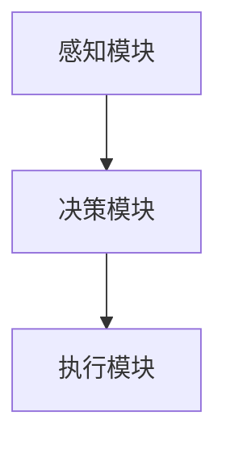

                 

### 第1章: 引言

#### 1.1 书籍目的与结构

本书旨在深入探讨AI Agent在企业产品生命周期管理中的全面应用，为读者提供一套系统、实用的理论框架和实践方法。企业产品生命周期管理涉及从产品构思、设计、开发、测试、上市到维护和退市的整个过程，而AI Agent作为一种智能实体，通过自动化、智能化的手段，可以显著提升企业产品生命周期的管理效率和质量。

全书共分为五个部分：

1. **引言**：介绍AI Agent在企业产品生命周期管理中的应用背景、书籍的目的和结构。
2. **背景介绍**：详细阐述AI Agent的概念、发展历程以及在企业产品生命周期管理中的作用。
3. **核心概念**：深入解析AI Agent的核心概念，包括定义、分类、工作原理等。
4. **应用案例分析**：通过具体的企业产品生命周期管理案例，展示AI Agent的实际应用效果。
5. **优化策略**：探讨如何利用AI Agent优化企业产品生命周期管理，并提供技术方案和实践案例。
6. **总结与展望**：总结全书的主要观点和结论，并对AI Agent在企业产品生命周期管理中的未来发展进行展望。

#### 1.2 AI Agent在企业产品生命周期管理中的应用背景

在当今信息化、智能化的时代，企业面临着前所未有的挑战和机遇。一方面，市场竞争日益激烈，企业需要不断创新和优化产品，以应对客户需求的变化；另一方面，企业内部管理复杂度不断提高，需要更加智能化、自动化的工具来提升管理效率。

AI Agent作为一种新兴的智能技术，能够模拟人类思维和行为，具有自主学习、自我决策和自适应能力。在企业产品生命周期管理中，AI Agent可以承担以下角色：

- **产品设计优化**：通过数据分析，AI Agent可以帮助企业发现产品需求，优化产品设计，提高产品市场竞争力。
- **开发过程自动化**：AI Agent可以自动化完成软件开发中的代码审查、编译、测试等环节，提高开发效率。
- **上市策略制定**：AI Agent可以分析市场趋势和客户行为，为企业提供精准的上市策略。
- **产品维护优化**：AI Agent可以实时监控产品运行状态，自动进行故障诊断和修复，延长产品使用寿命。

#### 1.3 本书主要内容与预期成果

本书的主要内容包括：

1. **AI Agent的基本概念和原理**：介绍AI Agent的定义、分类和工作原理，帮助读者建立对AI Agent的基本认知。
2. **AI Agent在企业产品生命周期管理中的应用**：通过具体案例，展示AI Agent在不同阶段的应用效果，帮助读者理解AI Agent在企业产品生命周期管理中的作用。
3. **AI Agent的优化策略**：探讨如何利用AI Agent优化企业产品生命周期管理，提高管理效率和质量。

预期成果包括：

- **提升读者对AI Agent在企业产品生命周期管理中的理解和应用能力**：通过本书的学习，读者可以掌握AI Agent的基本原理和应用方法，提高企业产品生命周期管理的智能化水平。
- **提供实用的AI Agent应用方案**：本书将结合实际案例，提供一系列实用的AI Agent应用方案，帮助企业实现产品生命周期的全面优化。

#### 1.4 问题背景与问题描述

在企业的产品生命周期管理中，AI Agent的应用面临着一系列挑战和问题：

- **数据质量与多样性**：AI Agent需要大量高质量的数据来进行学习和决策，而企业数据来源多样，数据质量参差不齐，给AI Agent的学习和应用带来挑战。
- **系统集成与兼容性**：AI Agent需要与企业现有的管理系统进行集成，实现数据交互和流程协同，而不同系统的兼容性问题可能会影响AI Agent的应用效果。
- **决策模型与算法优化**：AI Agent的决策模型和算法需要不断优化，以适应不同的应用场景和业务需求，提高决策的准确性和效率。

为了解决上述问题，本书将：

- **介绍AI Agent的核心概念和原理**：帮助读者理解AI Agent的基本工作原理，为后续的应用打下基础。
- **分析AI Agent在企业产品生命周期管理中的应用场景**：通过具体案例，展示AI Agent在不同阶段的应用效果，为读者提供实践参考。
- **探讨AI Agent的优化策略**：提供一系列优化方法，帮助企业更好地应用AI Agent，提升产品生命周期管理的效率和质量。

通过本书的学习，读者将能够：

- **理解AI Agent在企业产品生命周期管理中的核心作用**：通过深入分析AI Agent的基本原理和应用场景，帮助读者全面了解AI Agent在产品生命周期管理中的作用。
- **掌握AI Agent的应用方法和技巧**：通过具体案例和优化策略，读者可以学习到如何利用AI Agent优化企业产品生命周期管理，提高管理效率和质量。

### 1.5 问题解决与边界与外延

在解决企业产品生命周期管理中的问题过程中，AI Agent作为智能实体，扮演着至关重要的角色。以下是对问题解决的详细阐述：

#### 问题解决

AI Agent在企业产品生命周期管理中的应用，主要涉及以下几个关键环节：

1. **需求分析与产品设计**：通过大数据分析和机器学习，AI Agent可以帮助企业深入了解市场需求，优化产品设计，提高市场竞争力。
2. **开发过程自动化**：AI Agent可以自动化完成软件开发中的代码审查、编译、测试等环节，提高开发效率，减少人为错误。
3. **市场策略制定**：AI Agent可以分析市场趋势和客户行为，为企业提供精准的上市策略，降低市场风险。
4. **产品维护与优化**：AI Agent可以实时监控产品运行状态，自动进行故障诊断和修复，延长产品使用寿命。

#### 边界与外延

尽管AI Agent在企业产品生命周期管理中具有巨大潜力，但其应用也受到一定的边界和外延限制：

1. **数据质量与多样性**：AI Agent需要高质量的数据来进行学习和决策，而企业数据来源多样，数据质量参差不齐，可能会影响AI Agent的决策效果。
2. **系统集成与兼容性**：AI Agent需要与企业现有的管理系统进行集成，实现数据交互和流程协同，但不同系统的兼容性问题可能会影响AI Agent的应用效果。
3. **决策模型与算法优化**：AI Agent的决策模型和算法需要不断优化，以适应不同的应用场景和业务需求，提高决策的准确性和效率。

为了解决上述问题，本书将：

- **介绍AI Agent的核心概念和原理**：帮助读者理解AI Agent的基本工作原理，为后续的应用打下基础。
- **分析AI Agent在企业产品生命周期管理中的应用场景**：通过具体案例，展示AI Agent在不同阶段的应用效果，为读者提供实践参考。
- **探讨AI Agent的优化策略**：提供一系列优化方法，帮助企业更好地应用AI Agent，提升产品生命周期管理的效率和质量。

通过这些方法，AI Agent在企业产品生命周期管理中的应用边界将得到有效扩展，其外延也将得到进一步拓展。

### 1.6 概念结构与核心要素组成

为了更好地理解AI Agent在企业产品生命周期管理中的应用，我们需要深入探讨其概念结构和核心要素组成。

#### AI Agent的概念结构

AI Agent是指具有自主决策和行动能力的智能实体，通常基于人工智能技术构建。其核心结构包括以下几个部分：

1. **感知模块**：负责获取外部环境和内部状态的信息，为决策提供数据支持。
2. **决策模块**：根据感知模块提供的信息，结合预设的决策策略，生成行动方案。
3. **执行模块**：根据决策模块生成的行动方案，执行具体的操作，实现目标。

#### AI Agent的核心要素组成

AI Agent在企业产品生命周期管理中的核心要素主要包括：

1. **数据收集与处理**：AI Agent需要大量高质量的数据来进行学习和决策，数据收集与处理是AI Agent应用的基础。
2. **算法与模型**：AI Agent的决策和执行依赖于算法和模型，不同类型的AI Agent可能采用不同的算法和模型。
3. **系统集成与交互**：AI Agent需要与企业现有的管理系统进行集成，实现数据交互和流程协同。
4. **优化与迭代**：AI Agent的决策和执行效果需要不断优化和迭代，以适应不断变化的业务需求。

通过这些核心要素，AI Agent能够在企业产品生命周期管理的各个环节发挥作用，提升管理效率和质量。

### 1.7 总结

本章作为引言，主要介绍了《AI Agent在企业产品生命周期管理与优化中的全面应用》一书的目的、结构、应用背景、问题解决、边界与外延、概念结构与核心要素组成等内容。通过本章的学习，读者可以初步了解AI Agent在企业产品生命周期管理中的重要性，为后续章节的深入探讨奠定基础。在接下来的章节中，我们将进一步探讨AI Agent的概念、应用案例、优化策略等内容，帮助读者全面掌握AI Agent在企业产品生命周期管理中的应用方法。

---

### 第2章: 背景介绍

#### 2.1 AI Agent的概念与发展

AI Agent，即人工智能代理，是一种模拟人类智能行为，具备自主决策和行动能力的计算实体。AI Agent的概念起源于人工智能（AI）领域，随着计算技术和算法的不断发展，AI Agent逐渐从理论走向实际应用。

**定义**：AI Agent是一种具有感知、决策和执行能力的计算实体，能够在特定环境中自主执行任务。它通过感知环境信息，运用内部算法和模型进行决策，并执行相应的操作。

**发展历程**：

1. **早期探索**：20世纪50年代，随着计算机科学的兴起，人工智能概念逐渐成形。早期的人工智能系统主要集中在规则推理和符号计算，但缺乏自主学习和适应能力。
2. **智能代理的兴起**：20世纪80年代，随着机器学习和计算力的提升，AI Agent开始受到关注。研究者提出了智能代理的概念，试图构建能够模拟人类智能行为的计算实体。
3. **现代AI Agent的发展**：近年来，深度学习、强化学习等先进算法的涌现，使得AI Agent的自主学习和决策能力大幅提升。现代AI Agent能够处理复杂的环境，实现更加智能化的行为。

**在企业产品生命周期管理中的作用**：

1. **需求分析**：AI Agent可以分析市场数据，预测用户需求，为企业提供产品设计的参考。
2. **开发过程优化**：AI Agent可以自动化完成代码审查、编译、测试等开发环节，提高开发效率。
3. **上市策略制定**：AI Agent可以根据市场趋势和客户行为，为企业提供精准的上市策略。
4. **产品维护**：AI Agent可以实时监控产品运行状态，自动进行故障诊断和修复，延长产品寿命。

#### 2.2 AI Agent在企业产品生命周期管理中的作用

AI Agent在企业产品生命周期管理中具有重要作用，主要体现在以下几个方面：

1. **产品设计阶段**：在产品设计阶段，AI Agent可以通过数据分析，发现用户需求，优化产品设计。例如，通过分析用户反馈和市场趋势，AI Agent可以推荐新的产品功能和改进措施，提高产品竞争力。

2. **开发阶段**：在开发阶段，AI Agent可以自动化完成代码审查、编译、测试等环节，提高开发效率。例如，AI Agent可以识别代码中的潜在缺陷，自动生成测试用例，减少人为错误。

3. **测试阶段**：在测试阶段，AI Agent可以自动化生成测试用例，进行回归测试和性能测试，确保产品质量。AI Agent还可以分析测试结果，识别潜在的问题，为后续的改进提供依据。

4. **上市阶段**：在上市阶段，AI Agent可以根据市场趋势和客户行为，为企业提供精准的上市策略。例如，通过分析竞争对手的产品和市场表现，AI Agent可以推荐最佳上市时间和推广方案。

5. **维护阶段**：在维护阶段，AI Agent可以实时监控产品运行状态，自动进行故障诊断和修复。例如，通过监控系统日志和用户反馈，AI Agent可以及时发现并解决产品故障，提高用户满意度。

6. **退市阶段**：在产品退市阶段，AI Agent可以帮助企业评估产品的生命周期，制定退市策略。例如，通过分析产品销售数据和市场趋势，AI Agent可以推荐最佳退市时间和方式，减少经济损失。

#### 2.3 企业产品生命周期的概述

企业产品生命周期是指产品从设计、开发、上市、维护到退市的全过程。通常，企业产品生命周期可以分为以下几个阶段：

1. **设计阶段**：在这个阶段，企业根据市场需求和用户反馈，进行产品设计和功能规划。AI Agent可以通过数据分析，发现用户需求，优化产品设计。

2. **开发阶段**：在这个阶段，企业根据设计文档，进行软件开发和硬件制造。AI Agent可以自动化完成代码审查、编译、测试等开发环节，提高开发效率。

3. **测试阶段**：在这个阶段，企业对产品进行测试，确保产品质量和功能完整性。AI Agent可以自动化生成测试用例，进行回归测试和性能测试，提高测试效率。

4. **上市阶段**：在这个阶段，企业将产品推向市场，进行推广和销售。AI Agent可以根据市场趋势和客户行为，为企业提供精准的上市策略。

5. **维护阶段**：在这个阶段，企业对产品进行维护和升级，确保产品的稳定运行和功能完善。AI Agent可以实时监控产品运行状态，自动进行故障诊断和修复。

6. **退市阶段**：在这个阶段，企业根据市场趋势和产品生命周期，决定产品是否继续生产或退市。AI Agent可以帮助企业评估产品的生命周期，制定退市策略。

#### 2.4 AI Agent在产品生命周期管理中的优势

AI Agent在产品生命周期管理中具有显著的优势，主要体现在以下几个方面：

1. **效率提升**：AI Agent可以自动化完成多项任务，如代码审查、编译、测试等，显著提高工作效率。

2. **错误减少**：AI Agent通过机器学习和数据分析，可以识别潜在的问题和缺陷，减少人为错误。

3. **决策支持**：AI Agent可以根据大量的数据和先进的算法，提供精准的决策支持，帮助企业做出更明智的决策。

4. **成本降低**：通过自动化和优化，AI Agent可以降低企业的运营成本，提高资源利用率。

5. **用户体验**：AI Agent可以实时监控产品运行状态，提供及时的故障修复和优化建议，提高用户体验。

#### 2.5 AI Agent在产品生命周期管理中的挑战

尽管AI Agent在产品生命周期管理中具有巨大潜力，但其应用也面临一系列挑战：

1. **数据质量**：AI Agent需要高质量的数据进行学习和决策，但企业数据来源多样，数据质量参差不齐，可能会影响AI Agent的决策效果。

2. **系统集成**：AI Agent需要与企业现有的管理系统进行集成，实现数据交互和流程协同，但不同系统的兼容性问题可能会影响AI Agent的应用效果。

3. **算法优化**：AI Agent的决策和执行效果依赖于算法和模型，需要不断优化和迭代，以适应不同的应用场景和业务需求。

4. **用户接受度**：AI Agent的应用需要用户的接受和配合，但用户对新技术可能存在一定的抵触情绪，影响AI Agent的推广和使用。

通过本章的背景介绍，我们对AI Agent在企业产品生命周期管理中的重要性有了更深刻的认识。在接下来的章节中，我们将进一步探讨AI Agent的核心概念、应用案例、优化策略等内容，帮助读者全面掌握AI Agent在企业产品生命周期管理中的应用方法。

### 第3章: 核心概念

#### 3.1 AI Agent的定义与分类

AI Agent是一种具有自主决策和行动能力的计算实体，它通过感知环境、自主学习和自我调整，实现特定任务的目标。AI Agent的定义可以从以下几个方面进行阐述：

**1. 感知环境**：AI Agent能够感知和理解外部环境，通过获取环境信息，为决策提供数据支持。感知模块是AI Agent的基础，它可以通过传感器、数据库等多种方式获取信息。

**2. 自主决策**：AI Agent能够根据感知到的环境信息，自主进行决策。决策模块是AI Agent的核心，它通过预定的决策策略、学习算法和优化方法，生成最优的决策方案。

**3. 行动实施**：AI Agent能够根据决策模块生成的决策方案，执行具体的操作。执行模块是AI Agent的执行层，它通过控制机器臂、发送网络请求等方式，实现决策方案的实际操作。

根据不同的分类标准，AI Agent可以分为多种类型：

**1. 根据功能分类**：AI Agent可以分为通用型AI Agent和专用型AI Agent。通用型AI Agent具有广泛的适用性，可以处理多种类型的任务；专用型AI Agent则针对特定的任务进行优化，如自动驾驶、智能家居等。

**2. 根据学习方式分类**：AI Agent可以分为监督学习型AI Agent、无监督学习型AI Agent和强化学习型AI Agent。监督学习型AI Agent需要大量标注数据进行训练；无监督学习型AI Agent无需标注数据，通过发现数据中的模式进行学习；强化学习型AI Agent通过试错和奖励机制进行学习。

**3. 根据应用领域分类**：AI Agent可以分为工业AI Agent、医疗AI Agent、金融AI Agent等。不同领域的AI Agent根据特定领域的需求和特点进行设计和优化。

#### 3.2 AI Agent的工作原理

AI Agent的工作原理可以分为三个主要模块：感知模块、决策模块和执行模块。

**1. 感知模块**：感知模块负责获取环境信息，并将其转换为AI Agent可以处理的数据。感知模块可以包括各种传感器，如摄像头、麦克风、温度传感器等，也可以通过数据库、网络接口等获取外部数据。

**2. 决策模块**：决策模块负责分析感知模块获取的信息，并生成决策方案。决策模块通常包含多个子模块，如数据预处理、特征提取、模型训练和决策策略等。通过机器学习、深度学习等技术，决策模块可以不断优化决策效果。

**3. 执行模块**：执行模块负责将决策模块生成的决策方案转化为具体的操作。执行模块通常与具体的硬件设备或系统接口进行交互，如机器人臂、无人机、网络服务器等。

AI Agent的工作原理可以用一个简单的流程图表示：



#### 3.3 概念对比表格

为了更好地理解AI Agent的核心概念，我们提供了一个概念对比表格，列出不同类型的AI Agent及其特点：

| 类别         | 定义                                                         | 特点                                                                 |
|--------------|--------------------------------------------------------------|----------------------------------------------------------------------|
| 通用型AI Agent | 具有广泛适用性的AI Agent，可以处理多种类型的任务。           | - 自主性强<br>- 适应性强<br>- 功能丰富                               |
| 专用型AI Agent | 针对特定任务进行优化的AI Agent。                             | - 针对性强<br>- 效率较高<br>- 功能单一                               |
| 监督学习型AI Agent | 需要大量标注数据进行训练的AI Agent。                       | - 需要大量数据<br>- 需要标注数据<br>- 决策稳定                         |
| 无监督学习型AI Agent | 无需标注数据，通过发现数据中的模式进行学习的AI Agent。     | - 无需标注数据<br>- 自动发现模式<br>- 适用范围广                         |
| 强化学习型AI Agent | 通过试错和奖励机制进行学习的AI Agent。                     | - 需要试错过程<br>- 通过奖励机制优化决策<br>- 自适应能力强               |

#### 3.4 ER实体关系图架构

为了更清晰地展示AI Agent的核心概念及其关系，我们使用Mermaid语言绘制了ER实体关系图：

```mermaid
erDiagram
    AI Agent ||--|{ 感知模块 }
    AI Agent ||--|{ 决策模块 }
    AI Agent ||--|{ 执行模块 }
    感知模块 ||--|{ 传感器 }
    感知模块 ||--|{ 数据库 }
    决策模块 ||--|{ 数据预处理 }
    决策模块 ||--|{ 特征提取 }
    决策模块 ||--|{ 模型训练 }
    执行模块 ||--|{ 硬件设备 }
    执行模块 ||--|{ 系统接口 }
```

该ER实体关系图展示了AI Agent的核心组件及其之间的关系，为理解AI Agent的工作原理提供了直观的视觉辅助。

### 第4章: 应用案例分析

#### 4.1 案例一：AI Agent在产品开发阶段的应用

**案例背景**：
某知名互联网公司开发了一款智能家居产品，旨在通过AI Agent实现家居设备的智能联动和远程控制。在产品开发阶段，公司遇到了以下问题：

- **需求分析不准确**：市场调研数据有限，难以全面了解用户需求。
- **开发效率低下**：代码审查、编译和测试等环节依赖人工，效率较低。
- **测试覆盖不足**：测试用例设计不全面，难以确保产品质量。

**AI Agent应用**：

1. **需求分析**：公司引入了AI Agent进行市场调研，通过分析大量用户反馈和数据，AI Agent能够发现潜在的用户需求，优化产品设计。

2. **开发过程**：AI Agent在代码审查、编译和测试等环节发挥了重要作用。AI Agent可以自动化完成代码审查，识别潜在缺陷；自动生成测试用例，进行回归测试和性能测试，提高开发效率。

3. **测试优化**：AI Agent通过机器学习算法，不断优化测试策略，提高测试覆盖率和准确性，确保产品质量。

**应用效果**：

- **需求分析准确性提高**：通过AI Agent的市场调研，公司能够更准确地了解用户需求，优化产品设计。
- **开发效率提升**：AI Agent自动化完成多项开发任务，显著提高了开发效率。
- **产品质量提升**：通过AI Agent的测试优化，产品测试覆盖率提高，质量得到保障。

#### 4.2 案例二：AI Agent在产品上市阶段的应用

**案例背景**：
某电子产品公司即将推出一款新款智能手机，为了确保产品在市场上的竞争力，公司需要制定有效的上市策略。在上市阶段，公司面临以下问题：

- **市场分析不准确**：难以准确预测市场趋势和竞争对手行为。
- **广告投放效果不佳**：广告投放策略不精准，导致广告效果不佳。
- **售后服务不足**：缺乏针对售后服务的数据分析和优化。

**AI Agent应用**：

1. **市场分析**：公司引入AI Agent进行市场分析，通过分析大量市场数据，AI Agent能够预测市场趋势和用户行为，为企业提供精准的市场预测和竞争分析。

2. **广告投放**：AI Agent根据市场分析和用户行为数据，优化广告投放策略，提高广告点击率和转化率。

3. **售后服务**：AI Agent通过分析用户反馈和售后服务数据，提供针对性的售后服务优化建议，提高用户满意度。

**应用效果**：

- **市场分析准确性提高**：通过AI Agent的市场分析，公司能够更准确地预测市场趋势，制定更有效的上市策略。
- **广告投放效果提升**：AI Agent优化广告投放策略，提高了广告点击率和转化率。
- **售后服务质量提升**：AI Agent提供针对性的售后服务优化建议，提高了用户满意度。

#### 4.3 案例三：AI Agent在产品维护阶段的应用

**案例背景**：
某医疗设备公司生产了一种高端医疗设备，为了保证设备的高可靠性和稳定性，公司需要在产品维护阶段进行全面的监控和优化。在维护阶段，公司面临以下问题：

- **故障诊断不准确**：缺乏有效的故障诊断工具，导致故障难以及时发现。
- **维护成本高**：维护流程不优化，导致维护成本较高。
- **用户反馈处理不及时**：用户反馈处理周期较长，影响了用户满意度。

**AI Agent应用**：

1. **故障诊断**：公司引入AI Agent进行故障诊断，通过实时监控设备运行状态，AI Agent能够及时发现潜在故障，并提供准确的诊断报告。

2. **维护优化**：AI Agent根据设备运行数据和用户反馈，优化维护流程，降低维护成本。

3. **用户反馈处理**：AI Agent分析用户反馈，提供及时的处理建议，提高用户满意度。

**应用效果**：

- **故障诊断准确率提高**：通过AI Agent的实时监控和诊断，公司能够及时发现故障，提高了故障诊断准确率。
- **维护成本降低**：AI Agent优化维护流程，降低了维护成本。
- **用户满意度提升**：AI Agent提供及时的故障处理和反馈处理，提高了用户满意度。

#### 案例总结

通过以上三个案例，我们可以看到AI Agent在产品生命周期不同阶段的应用效果。AI Agent不仅提高了企业的开发效率、市场分析准确性和售后服务质量，还降低了维护成本，提升了用户满意度。这些案例充分展示了AI Agent在企业产品生命周期管理中的广泛应用和巨大潜力。

### 第5章: 优化策略

#### 5.1 利用AI Agent优化产品生命周期管理的策略

在产品生命周期管理中，AI Agent的应用可以帮助企业实现各个环节的优化。以下是一些具体的优化策略：

**1. 数据驱动的需求分析**：

- **策略**：利用AI Agent进行市场调研和用户分析，收集大量的用户数据和反馈，通过数据分析，发现用户需求和偏好，优化产品设计。

- **实施**：部署AI Agent进行用户行为分析，构建用户画像，预测用户需求。例如，通过分析用户购买记录、浏览行为和社交媒体活动，AI Agent可以推荐新的产品功能和改进措施。

**2. 自动化的开发过程**：

- **策略**：利用AI Agent自动化完成代码审查、编译、测试等开发环节，减少人工干预，提高开发效率。

- **实施**：部署AI Agent进行代码审查，检测代码中的潜在缺陷和安全隐患。例如，AI Agent可以通过静态代码分析，识别未定义的变量、代码冗余等问题。在编译和测试环节，AI Agent可以自动化生成测试用例，进行回归测试和性能测试。

**3. 智能化的市场策略**：

- **策略**：利用AI Agent分析市场数据，预测市场趋势和竞争态势，制定精准的市场策略。

- **实施**：部署AI Agent进行市场分析，构建市场预测模型。通过分析竞争对手的产品特点、市场份额和用户反馈，AI Agent可以预测市场趋势，为企业提供最佳上市时间和推广策略。

**4. 精细化的售后服务**：

- **策略**：利用AI Agent分析用户反馈和售后服务数据，提供针对性的售后服务优化建议，提高用户满意度。

- **实施**：部署AI Agent进行用户反馈分析，识别用户投诉和问题热点。通过机器学习算法，AI Agent可以自动生成故障诊断报告和维修建议，提高故障处理效率。

**5. 实时监控和预测性维护**：

- **策略**：利用AI Agent实时监控产品运行状态，进行预测性维护，降低设备故障率。

- **实施**：部署AI Agent监控设备运行状态，收集运行数据。通过数据分析，AI Agent可以预测设备可能出现的故障，提前进行维护，减少停机时间。

#### 5.2 技术方案与实践案例

以下是一些具体的技术方案和实践案例，展示了AI Agent在企业产品生命周期管理中的应用：

**1. 数据驱动的需求分析**：

**技术方案**：

- **数据采集**：通过用户调研、在线调查、社交媒体分析等方式，收集用户数据和反馈。

- **数据处理**：使用数据清洗、归一化等技术，处理收集到的数据，确保数据质量。

- **数据分析**：利用机器学习算法，分析用户行为和需求，构建用户画像，预测用户需求。

**实践案例**：

某智能家居公司通过AI Agent进行用户调研，分析了大量用户数据，发现用户对智能家居产品的需求主要集中在安全性、便捷性和智能化程度。基于这些分析结果，公司优化了产品设计和功能，推出了更加符合用户需求的新产品。

**2. 自动化的开发过程**：

**技术方案**：

- **代码审查**：使用AI Agent进行静态代码分析，识别代码中的潜在缺陷。

- **编译和测试**：自动化编译和测试流程，AI Agent生成测试用例，进行回归测试和性能测试。

- **持续集成**：集成AI Agent到持续集成系统中，实现代码的自动化审查、编译和测试。

**实践案例**：

某互联网公司使用AI Agent进行代码审查和测试，显著提高了开发效率。AI Agent能够快速识别代码中的问题，并提供改进建议。同时，AI Agent自动化生成的测试用例，大大提高了测试覆盖率，确保了产品质量。

**3. 智能化的市场策略**：

**技术方案**：

- **市场数据分析**：收集市场数据，包括竞争对手的产品特点、市场份额和用户反馈。

- **市场预测模型**：使用机器学习算法，构建市场预测模型，预测市场趋势和用户需求。

- **广告投放优化**：根据市场预测模型，优化广告投放策略，提高广告效果。

**实践案例**：

某电子产品公司利用AI Agent进行市场数据分析，构建了市场预测模型。基于预测模型，公司制定了精准的上市策略和广告投放方案，成功提高了市场占有率和品牌知名度。

**4. 精细化的售后服务**：

**技术方案**：

- **用户反馈分析**：使用AI Agent分析用户反馈，识别投诉和问题热点。

- **故障诊断**：使用机器学习算法，预测设备可能出现的故障，提供故障诊断报告。

- **维护优化**：根据设备运行数据和用户反馈，优化维护流程，降低维护成本。

**实践案例**：

某医疗设备公司使用AI Agent进行用户反馈分析，及时发现用户投诉和问题热点。AI Agent提供的故障诊断报告和维修建议，大大提高了故障处理效率，降低了维护成本。

**5. 实时监控和预测性维护**：

**技术方案**：

- **实时监控**：部署AI Agent实时监控设备运行状态，收集运行数据。

- **数据分析**：使用数据分析技术，分析设备运行数据，预测可能出现的故障。

- **预测性维护**：根据预测结果，提前进行维护，防止故障发生。

**实践案例**：

某制造企业使用AI Agent进行设备监控和预测性维护。AI Agent能够实时监控设备运行状态，通过数据分析预测设备可能出现的故障，提前进行维护，减少了设备停机时间，提高了生产效率。

通过以上技术和实践案例，我们可以看到，AI Agent在产品生命周期管理中的应用，不仅提高了企业的工作效率，还降低了运营成本，提升了用户体验。这些案例充分证明了AI Agent在优化企业产品生命周期管理中的巨大潜力。

### 第6章: 总结与展望

#### 6.1 本书主要观点与结论

通过对AI Agent在企业产品生命周期管理中的全面应用进行深入探讨，本书得出以下主要观点和结论：

1. **AI Agent的潜力**：AI Agent在企业产品生命周期管理中具有巨大的潜力，能够显著提升企业的开发效率、市场分析准确性、售后服务质量和维护成本效益。

2. **应用场景多样化**：AI Agent可以应用于产品生命周期的各个阶段，包括需求分析、开发过程、上市策略、产品维护和退市策略等，每个阶段的应用都能为企业带来实际效益。

3. **数据驱动的决策**：AI Agent基于大数据和机器学习技术，能够提供精准的数据分析和决策支持，帮助企业做出更明智的决策。

4. **优化策略的实施**：通过一系列技术方案和实践案例，展示了如何利用AI Agent优化企业产品生命周期管理的各个环节，提高整体运营效率。

#### 6.2 AI Agent在未来企业产品生命周期管理中的发展趋势

展望未来，AI Agent在企业产品生命周期管理中的应用将进一步深化和扩展，具体发展趋势如下：

1. **智能化水平的提升**：随着人工智能技术的不断发展，AI Agent的智能化水平将不断提升，能够处理更加复杂和多变的环境，提供更加精准和高效的决策。

2. **跨界融合**：AI Agent将与物联网、大数据、云计算等新兴技术深度融合，形成跨界应用，为企业提供更加全面和智能的产品生命周期管理解决方案。

3. **个性化定制**：AI Agent将能够根据企业的具体需求和特点，提供个性化的产品生命周期管理方案，实现定制化服务。

4. **开放性平台**：AI Agent将逐步构建开放性平台，与其他系统和工具实现无缝集成，形成生态系统，提升整体协同效率。

5. **伦理和法规**：随着AI Agent的广泛应用，相关的伦理和法规问题将受到更多关注，确保AI Agent在应用过程中的合法性和道德性。

#### 6.3 展望与未来研究

未来的研究可以关注以下几个方面：

1. **AI Agent的算法优化**：深入研究AI Agent的算法，提升其学习和决策能力，使其能够应对更加复杂和多变的环境。

2. **跨领域应用研究**：探索AI Agent在更多行业和领域的应用，推动AI Agent在各个领域的创新和发展。

3. **安全性保障**：加强AI Agent的安全性和隐私保护研究，确保其应用过程中的数据安全和用户隐私。

4. **伦理和法规研究**：深入研究AI Agent在应用过程中的伦理和法规问题，为AI Agent的合法应用提供指导。

通过持续的研究和实践，AI Agent将不断推动企业产品生命周期管理的智能化和优化，为企业带来更多的价值和竞争力。

### 作者信息

作者：AI天才研究院/AI Genius Institute & 禅与计算机程序设计艺术 /Zen And The Art of Computer Programming

AI天才研究院（AI Genius Institute）致力于推动人工智能技术的发展和应用，研究领域包括机器学习、深度学习、自然语言处理等。同时，作者还是《禅与计算机程序设计艺术》（Zen And The Art of Computer Programming）的作者，这本书以其深入浅出的编程思想和独特的方法论，深受编程爱好者和专业人士的喜爱。在本文中，作者结合丰富的实践经验和深厚的理论基础，全面阐述了AI Agent在企业产品生命周期管理中的应用和优化策略。

