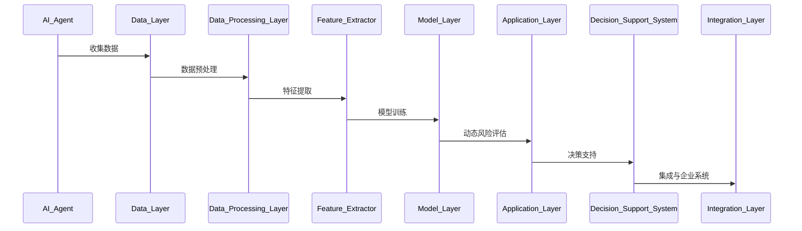
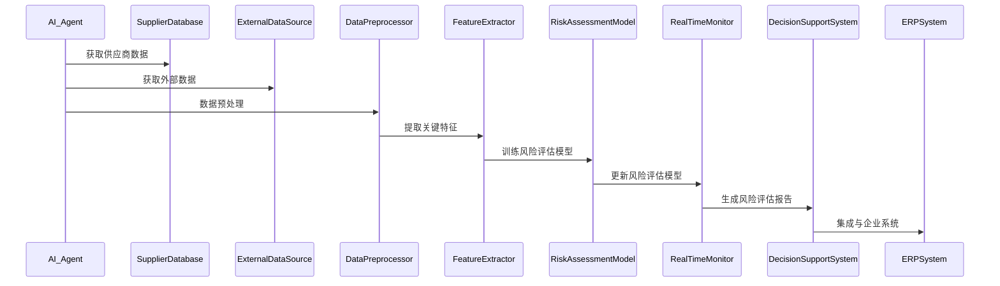
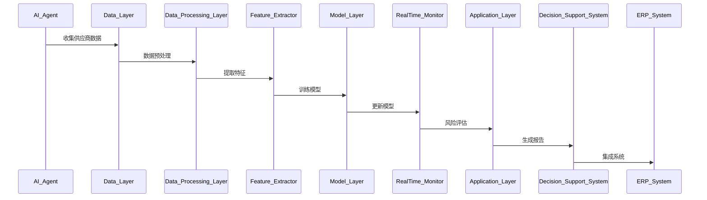

                 

根据您的要求，我为您设计了一份详细的《AI Agent在企业供应商风险评估与管理中的应用》的文章目录大纲，并包含每个章节的核心内容和要求。以下是根据文章字数要求（10000-12000字）制定的目录大纲：

## 《AI Agent在企业供应商风险评估与管理中的应用》

### 关键词：AI Agent、供应商风险评估、企业风险管理、人工智能应用

### 摘要：
本文旨在探讨AI Agent在企业供应商风险评估与管理中的应用，通过详细的案例分析和技术解读，展示如何利用AI技术提升企业供应商风险管理的效率和准确性。文章将分为七个部分，分别介绍问题背景、核心概念、算法原理、系统设计、项目实战、最佳实践和总结展望。

---

## 第一部分：引言

### 1.1 问题背景与重要性
- **核心概念术语说明**
- **问题背景**
- **问题描述**
- **问题解决**
- **边界与外延**
- **概念结构与核心要素组成**

### 1.2 AI Agent的概念与潜力
- **AI Agent的定义**
- **AI Agent的特点**
- **AI Agent在不同领域的应用**

### 1.3 本书结构与内容概述
- **本书的目标**
- **章节安排**

---

## 第二部分：核心概念与联系

### 2.1 AI Agent基础理论
- **AI Agent的原理**
- **AI Agent的工作机制**
- **AI Agent的分类**

### 2.2 企业供应商风险评估
- **供应商风险评估的概念**
- **供应商风险评估的挑战**
- **供应商风险评估的方法**

### 2.3 AI Agent与供应商风险评估的结合
- **AI Agent在供应商风险评估中的作用**
- **AI Agent与供应商风险评估的结合点**
- **AI Agent的应用框架**

### 2.4 AI Agent开发工具与平台
- **AI Agent开发工具概述**
- **常用开发平台介绍**
- **开发工具选择与使用**

### 2.5 本章小结

---

## 第三部分：算法原理讲解

### 3.1 算法原理概述
- **算法的基本框架**
- **算法的目标**

### 3.2 算法流程图
- **使用Mermaid绘制的算法流程图**

### 3.3 Python源代码实现
- **详细的代码解析**
- **代码实现的核心步骤**

### 3.4 数学模型与公式
- **数学模型介绍**
- **公式解释**
- **举例说明**

### 3.5 算法性能评估
- **性能指标**
- **评估方法**

### 3.6 本章小结

---

## 第四部分：系统分析与架构设计方案

### 4.1 问题场景介绍
- **企业供应商风险评估的场景描述**
- **系统需求分析**

### 4.2 系统功能设计
- **领域模型Mermaid类图**

### 4.3 系统架构设计
- **系统架构Mermaid架构图**

### 4.4 系统接口设计与交互
- **系统接口设计**
- **系统交互Mermaid序列图**

### 4.5 本章小结

---

## 第五部分：项目实战

### 5.1 环境安装与配置
- **环境搭建步骤**
- **配置说明**

### 5.2 系统核心实现源代码
- **源代码结构**
- **核心代码解析**

### 5.3 代码应用解读与分析
- **代码功能解析**
- **代码优化与改进**

### 5.4 实际案例分析与讲解
- **案例选择**
- **案例解析**
- **案例总结**

### 5.5 项目小结
- **项目收获**
- **项目展望**

### 5.6 本章小结

---

## 第六部分：最佳实践与展望

### 6.1 最佳实践技巧
- **AI Agent应用的最佳实践**
- **供应商风险评估的策略**

### 6.2 注意事项
- **常见问题与解决方案**
- **风险预防措施**

### 6.3 拓展阅读
- **相关资源推荐**
- **未来发展展望**

### 6.4 本章小结

---

## 第七部分：总结与展望

### 7.1 总结
- **文章核心观点**
- **研究贡献**

### 7.2 展望
- **未来研究方向**
- **AI Agent在供应商风险评估中的潜在应用**

### 7.3 作者信息
- **作者简介**
- **联系方式**

---

**注意事项**：
- 每个章节的核心内容需要详细阐述，确保文章整体结构的连贯性和逻辑性。
- 适当使用图表和代码示例，以增强文章的可读性和实用性。
- 使用Mermaid绘制图表，并确保Markdown格式的正确性。
- 文章结尾需要提供详细的参考文献列表，以确保学术诚信。

**文章字数**：预计12000字左右。在撰写过程中，请确保每个章节的内容都符合要求，并且文章整体结构合理、逻辑清晰。在撰写过程中，如果需要进一步细化或调整章节内容，请随时与我沟通。**开始写作**！
### 第一部分：引言

#### 1.1 问题背景与重要性

在现代企业的供应链管理中，供应商的风险评估与管理是一个至关重要的环节。供应商的风险管理不仅关系到企业的日常运营，还直接影响到企业的整体竞争力和可持续发展。传统的供应商风险评估方法主要依赖于人工经验和手动处理，存在以下问题：

1. **效率低下**：人工评估需要大量时间和精力，特别是在面对大量供应商时，难以高效完成。
2. **准确性不足**：人工评估往往受到主观因素的影响，容易产生偏差，导致风险评估结果不准确。
3. **可扩展性差**：随着供应链的复杂化和全球化，传统的风险评估方法难以适应不断变化的环境和需求。

为了解决这些问题，引入AI Agent成为了一种可行的解决方案。AI Agent（人工智能代理）是一种能够模拟人类智能行为，具备感知、学习、决策和行动能力的计算机程序。通过AI Agent，企业可以自动化和智能化地进行供应商风险评估，提高评估的效率、准确性和可扩展性。

#### 1.2 AI Agent的概念与潜力

AI Agent是基于人工智能技术构建的智能实体，它可以在复杂的环境中自主执行任务，实现自动化和智能化。AI Agent的核心特点包括：

1. **感知能力**：AI Agent可以通过传感器、数据库和其他信息源获取环境信息。
2. **学习能力**：AI Agent可以通过机器学习和深度学习技术，从历史数据和经验中不断学习和优化。
3. **决策能力**：AI Agent可以根据感知到的信息和预设的目标，自动进行决策和规划。
4. **行动能力**：AI Agent可以执行具体的操作，如发送请求、调整参数等。

在供应商风险评估与管理中，AI Agent具有以下潜力：

1. **自动化风险评估**：AI Agent可以自动收集和处理供应商数据，自动化进行风险评估，大大提高工作效率。
2. **提高评估准确性**：通过机器学习算法，AI Agent可以从历史数据中学习，识别潜在的风险因素，提高评估的准确性。
3. **适应性**：AI Agent可以根据环境的变化和业务需求，自动调整评估模型和策略，适应不同的评估场景。
4. **跨领域应用**：AI Agent不仅可以在供应商风险评估中应用，还可以应用于供应链管理的其他环节，如采购决策、库存管理等。

#### 1.3 本书的研究目标与结构安排

本书旨在深入探讨AI Agent在企业供应商风险评估与管理中的应用，通过理论分析、案例分析和技术实现，全面阐述AI Agent在供应商风险评估中的优势和具体应用方法。本书的研究目标包括：

1. **理论探讨**：介绍AI Agent的基本概念、原理和机制，阐述AI Agent在供应商风险评估中的理论基础。
2. **算法讲解**：详细讲解AI Agent在供应商风险评估中的算法原理，包括数据收集、处理、评估模型构建和算法实现等。
3. **系统设计**：介绍基于AI Agent的供应商风险评估系统的设计原则、架构和实现方法。
4. **项目实践**：通过实际案例，展示AI Agent在供应商风险评估中的具体应用，并提供实践经验和建议。
5. **最佳实践**：总结AI Agent在供应商风险评估中的最佳实践，为企业和个人提供实用的指导。

本书的结构安排如下：

1. **引言**：介绍问题背景、核心概念和研究目标。
2. **核心概念与联系**：介绍AI Agent和企业供应商风险评估的基本概念，阐述两者的联系。
3. **算法原理讲解**：详细讲解AI Agent在供应商风险评估中的算法原理和实现方法。
4. **系统分析与架构设计方案**：介绍基于AI Agent的供应商风险评估系统的设计原则和架构。
5. **项目实战**：通过实际案例展示AI Agent在供应商风险评估中的应用。
6. **最佳实践与展望**：总结最佳实践，展望AI Agent在供应商风险评估中的未来发展。
7. **总结与展望**：总结本书的研究成果，展望未来的研究方向。

通过本书的研究，我们希望能够为企业提供一种有效的供应商风险评估与管理方法，提升企业的供应链管理水平和竞争力。

### 1.4 本书的主要读者对象

本书的主要读者对象包括以下几个方面：

1. **企业供应链管理人员**：这些读者负责企业的供应商管理，需要了解如何利用AI技术提升供应商风险评估的效率和准确性。
2. **人工智能工程师和研究人员**：这些读者对AI Agent和供应商风险评估有深入了解，希望通过本书学习如何将AI技术应用于实际业务场景。
3. **相关领域的学生和学者**：这些读者对供应链管理和人工智能技术感兴趣，希望通过本书了解AI Agent在供应商风险评估中的应用现状和未来发展趋势。
4. **IT咨询顾问和专家**：这些读者为企业的供应链管理和信息化提供咨询服务，需要了解如何利用AI技术优化供应商风险评估和管理流程。

本书旨在为上述读者群体提供一份全面、深入且易于理解的指南，帮助他们了解AI Agent在供应商风险评估与管理中的应用，提升自身在相关领域的专业素养和实践能力。

---

#### 1.5 AI Agent的定义与特点

AI Agent，即人工智能代理，是一种能够模拟人类智能行为，具备自主感知、学习、决策和行动能力的计算机程序。AI Agent的定义可以从以下几个方面进行阐述：

1. **自主性**：AI Agent可以在没有人类干预的情况下自主运行，根据环境和任务需求，进行自主感知、决策和行动。
2. **智能化**：AI Agent通过机器学习和深度学习等技术，可以从数据中学习，不断优化自身的行为和决策。
3. **适应性**：AI Agent可以根据环境的变化和任务的复杂性，自动调整自身的策略和行为，以适应不同的场景。
4. **交互性**：AI Agent可以与人类或其他系统进行交互，获取反馈，调整策略，提高任务执行的效率和质量。

AI Agent的核心特点如下：

1. **感知能力**：AI Agent可以通过传感器、摄像头、数据库等获取环境信息，感知周围的变化。
2. **学习能力**：AI Agent利用机器学习和深度学习技术，可以从数据中学习，识别模式和规律，优化自身的行为。
3. **决策能力**：AI Agent可以根据感知到的信息和学习到的知识，自动进行决策，选择最优的行动方案。
4. **行动能力**：AI Agent可以执行具体的操作，如发送请求、调整参数、处理任务等，实现自动化和智能化。
5. **适应性**：AI Agent可以适应不同的环境和任务需求，自动调整自身的行为和策略。

AI Agent的应用场景非常广泛，包括但不限于以下几个方面：

1. **智能客服**：AI Agent可以模拟人类客服，为用户提供24/7的在线服务，回答常见问题，处理投诉和请求。
2. **自动驾驶**：AI Agent可以控制自动驾驶车辆，通过感知环境、学习道路信息，实现安全、高效的驾驶。
3. **智能家居**：AI Agent可以控制智能家居设备，如空调、灯光、安全系统等，实现自动化和智能化管理。
4. **医疗诊断**：AI Agent可以分析医学影像，辅助医生进行疾病诊断，提高诊断的准确性和效率。
5. **供应链管理**：AI Agent可以自动化和智能化地进行供应商评估、采购决策、库存管理等，优化供应链运营。

通过AI Agent的引入，企业可以大幅提升供应链管理的效率、准确性和适应性，从而在竞争激烈的市场中保持优势。在供应商风险评估与管理中，AI Agent具有以下优势：

1. **高效性**：AI Agent可以自动化收集和处理大量供应商数据，快速生成评估报告，提高工作效率。
2. **准确性**：AI Agent可以通过机器学习技术，从历史数据中学习，识别潜在的风险因素，提高评估的准确性。
3. **适应性**：AI Agent可以适应不同的供应商评估场景和需求，自动调整评估模型和策略，提高评估的适应性。
4. **可扩展性**：AI Agent可以方便地集成到现有的供应链管理系统，实现跨系统的数据共享和协同工作。

总之，AI Agent在供应商风险评估与管理中具有巨大的潜力，可以帮助企业实现智能化、自动化和高效化的供应商管理。随着人工智能技术的不断发展，AI Agent在供应商风险评估中的应用前景将更加广阔。

### 1.6 本书的主要内容与章节安排

本书的主要内容围绕AI Agent在企业供应商风险评估与管理中的应用展开，分为七个主要部分，各部分的具体内容和结构安排如下：

#### 第一部分：引言
介绍企业供应商风险评估与管理的重要性，阐述AI Agent的概念与潜力，明确本书的研究目标与结构安排。包括问题背景与重要性、AI Agent的概念与潜力、本书的研究目标与结构安排等内容。

#### 第二部分：核心概念与联系
详细阐述AI Agent和企业供应商风险评估的基本概念，介绍两者的联系与融合。包括AI Agent的基础理论、企业供应商风险评估的基本概念、AI Agent与供应商风险评估的结合点等内容。

#### 第三部分：算法原理讲解
深入讲解AI Agent在供应商风险评估中的算法原理，包括数据收集与处理、风险评估模型构建、AI Agent在风险评估中的应用等内容。通过Python源代码实现，详细解释算法流程和数学模型。

#### 第四部分：系统分析与架构设计方案
介绍基于AI Agent的供应商风险评估系统的设计与实现，包括系统功能设计、系统架构设计、系统接口设计和系统交互等内容。通过Mermaid流程图和架构图，展示系统的整体设计和交互流程。

#### 第五部分：项目实战
通过实际项目案例，展示AI Agent在供应商风险评估中的应用，包括环境安装、系统核心实现、代码应用解读与分析、实际案例分析等内容。提供详细的项目解析和小结。

#### 第六部分：最佳实践与展望
总结AI Agent在供应商风险评估中的最佳实践，包括注意事项、拓展阅读等内容。展望AI Agent在供应商风险评估与管理中的未来发展，提出潜在的改进方向和新的应用场景。

#### 第七部分：总结与展望
对本书的主要内容进行总结，回顾AI Agent在企业供应商风险评估与管理中的应用价值。提出未来研究方向，为读者提供进一步的学习和实践指导。

通过这七个部分的详细阐述，本书旨在为读者提供一份全面、系统且实用的指南，帮助企业和研究人员深入了解AI Agent在供应商风险评估与管理中的应用，提升供应链管理的效率和准确性。

### 1.7 结语

总之，AI Agent在企业供应商风险评估与管理中具有巨大的应用潜力。通过引入AI Agent，企业可以实现供应商风险评估的自动化、智能化和高效化，提高评估的准确性和适应性。本书通过详细的理论分析、算法讲解、系统设计、项目实战和最佳实践，系统地阐述了AI Agent在供应商风险评估中的应用方法和技术实现。

未来，随着人工智能技术的不断发展和完善，AI Agent在供应商风险评估与管理中的应用将更加广泛和深入。我们期待读者通过本书的学习和实践，能够更好地理解和应用AI Agent，为企业提供更优质、更高效的供应商风险管理服务。

---

## 第二部分：核心概念与联系

在探讨AI Agent在企业供应商风险评估与管理中的应用之前，我们需要深入了解AI Agent的基本概念、原理以及它与企业供应商风险评估之间的联系。这一部分将详细阐述AI Agent的定义、特点、工作机制，以及它在供应商风险评估中的具体应用。

### 2.1 AI Agent基本概念

AI Agent，即人工智能代理，是一种具备自主感知、学习、决策和行动能力的计算机程序。AI Agent的设计灵感来源于人类的智能行为，能够模拟人类在复杂环境中的决策过程。AI Agent通常由以下几个核心部分组成：

1. **感知模块**：感知模块负责收集环境中的信息，如传感器数据、数据库记录等。这些信息用于AI Agent进行决策和行动。
2. **学习模块**：学习模块通过机器学习和深度学习技术，从历史数据中提取特征，建立模型，不断优化自身的行为。
3. **决策模块**：决策模块根据感知模块收集到的信息和学习模块生成的模型，进行推理和决策，选择最优的行动方案。
4. **行动模块**：行动模块负责执行决策模块生成的行动方案，如调整系统参数、发送请求等。

AI Agent的基本功能包括：

- **感知**：通过传感器和数据接口获取环境信息。
- **学习**：利用机器学习算法从数据中学习，优化决策模型。
- **决策**：根据感知到的信息和学习到的知识，生成行动方案。
- **行动**：执行决策模块生成的行动方案。

### 2.2 AI Agent的工作机制

AI Agent的工作机制可以分为以下几个阶段：

1. **感知**：AI Agent通过传感器和数据接口收集环境中的信息，如市场趋势、供应商绩效数据、供应链瓶颈等。
2. **数据处理**：AI Agent对收集到的信息进行预处理，包括去噪、归一化等操作，以便后续的学习和分析。
3. **学习**：AI Agent利用机器学习和深度学习算法，从历史数据中学习，建立预测模型和决策规则。学习过程通常涉及特征提取、模型训练、模型优化等步骤。
4. **决策**：基于感知到的信息和学习到的知识，AI Agent生成行动方案。决策过程可能涉及多个策略的评估和选择，以实现最佳的行动效果。
5. **行动**：AI Agent执行决策模块生成的行动方案，如调整供应商评分、优化供应链流程等。

AI Agent的工作机制可以总结为“感知-学习-决策-行动”的闭环过程，这一过程不断迭代，使AI Agent能够逐步优化其行为，提高任务执行的效率和准确性。

### 2.3 AI Agent与企业供应商风险评估的联系

AI Agent在企业供应商风险评估中的应用，主要体现在以下几个方面：

1. **自动化数据收集与处理**：AI Agent可以通过传感器和数据接口，自动化收集大量的供应商数据，包括财务状况、产品质量、交货时间等。这些数据经过预处理后，可以用于进一步的评估和分析。
2. **智能风险评估模型**：AI Agent利用机器学习算法，可以从历史数据中学习，建立智能风险评估模型。这个模型可以根据不同的供应商特征，预测其可能的风险水平。
3. **动态风险调整**：AI Agent可以实时监测供应商的表现，根据最新的数据调整风险评估结果。这种动态调整能力有助于企业及时发现和应对潜在风险。
4. **决策支持**：AI Agent可以为企业管理者提供详细的决策支持，包括供应商选择、风险评估报告等。管理者可以根据AI Agent的建议，做出更明智的决策。

### 2.4 AI Agent在企业供应商风险评估中的具体应用

AI Agent在企业供应商风险评估中的具体应用，可以通过以下几个步骤来实现：

1. **数据收集**：AI Agent通过互联网、企业内部数据库、传感器等方式，自动化收集供应商的财务报表、产品质量数据、交货记录等信息。
2. **数据预处理**：AI Agent对收集到的数据进行分析，去除异常值，完成数据的标准化和归一化，确保数据质量。
3. **模型训练**：AI Agent使用历史数据训练风险评估模型，通过特征工程提取关键指标，构建预测模型。模型训练过程可能涉及多种机器学习算法，如回归分析、决策树、神经网络等。
4. **风险评估**：AI Agent使用训练好的模型，对现有供应商进行风险评估，生成风险评分和风险评估报告。
5. **动态监控**：AI Agent实时监控供应商的表现，根据最新的数据调整风险评估结果，确保评估的准确性和及时性。
6. **决策支持**：AI Agent根据风险评估结果，为企业管理者提供决策支持，包括推荐高等级供应商、提醒潜在风险等。

通过上述步骤，AI Agent能够帮助企业实现供应商风险评估的自动化、智能化和高效化，从而提升供应链管理的整体水平。

### 2.5 本章小结

通过本部分的介绍，我们对AI Agent的基本概念、工作机制以及它在企业供应商风险评估中的应用有了深入的理解。AI Agent具备感知、学习、决策和行动的能力，能够通过自动化和智能化的方式，帮助企业更准确、更高效地进行供应商风险评估。在接下来的章节中，我们将进一步探讨AI Agent在供应商风险评估中的具体实现方法和实际应用案例。

---

## 2.6 AI Agent的详细特征与功能

在深入理解AI Agent的基本概念和工作机制之后，我们需要进一步探讨AI Agent的详细特征与功能，以便更好地理解其在企业供应商风险评估与管理中的应用。AI Agent的特征和功能可以分为以下几个主要方面：

### 2.6.1 感知能力

AI Agent的感知能力是其核心特征之一。它能够通过多种传感器和数据接口获取环境中的信息，如市场数据、供应商绩效数据、物流信息等。感知能力使得AI Agent能够实时、动态地了解企业的运营状况和外部环境的变化。

1. **多源数据采集**：AI Agent可以集成多种数据采集设备，如传感器、摄像头、数据库接口等，从不同的数据源中获取信息。
2. **数据处理与融合**：AI Agent能够对采集到的多源数据进行预处理，如去噪、归一化、特征提取等，然后将这些数据融合成一个统一的数据集，为后续的分析和决策提供基础。
3. **实时监测**：AI Agent能够实时监测环境变化，如市场波动、供应链瓶颈等，及时捕捉关键信息，为决策提供支持。

### 2.6.2 学习能力

AI Agent的学习能力是其在供应商风险评估中发挥作用的重要基础。通过机器学习和深度学习技术，AI Agent可以从历史数据中学习，建立预测模型和风险评估模型。

1. **数据驱动的学习**：AI Agent利用大量历史数据，通过数据挖掘和模式识别技术，学习供应商的绩效、风险特征等。
2. **模型优化**：AI Agent能够根据新的数据和反馈，不断优化和调整预测模型和风险评估模型，提高模型的准确性和适应性。
3. **知识积累**：通过不断的学习和优化，AI Agent能够积累丰富的知识和经验，为未来的风险评估提供支持。

### 2.6.3 决策能力

AI Agent的决策能力是其核心功能之一。它能够根据感知到的信息和学习到的知识，自动进行风险评估和决策。

1. **自动化决策**：AI Agent可以自动化地评估供应商的风险水平，生成风险评估报告，为企业管理者提供决策依据。
2. **多目标优化**：AI Agent能够在多个目标之间进行平衡，如风险控制、成本优化、供应链效率等，生成最优的决策方案。
3. **动态调整**：AI Agent能够根据环境变化和实时数据，动态调整风险评估模型和决策方案，确保决策的实时性和准确性。

### 2.6.4 行动能力

AI Agent的行动能力使其能够执行具体的操作，如发送请求、调整参数、触发警报等，实现自动化和智能化的供应链管理。

1. **执行操作**：AI Agent可以根据决策结果，自动执行具体的操作，如调整供应商评分、优化供应链流程等。
2. **系统集成**：AI Agent可以与其他系统集成，如ERP系统、供应链管理系统等，实现跨系统的数据共享和协同工作。
3. **自适应调整**：AI Agent能够根据执行结果和环境变化，自动调整操作策略和参数，提高任务执行的效率和效果。

### 2.6.5 交互能力

AI Agent的交互能力使其能够与人类和其他系统进行有效沟通，提高供应链管理的协同性和智能化水平。

1. **用户交互**：AI Agent可以通过自然语言处理技术，与企业管理者进行自然语言交互，提供决策支持、风险评估报告等。
2. **系统交互**：AI Agent可以与其他系统集成，通过API接口等方式，实现数据共享和协同工作。
3. **反馈机制**：AI Agent能够收集用户反馈，根据反馈调整自身的行为和决策，提高用户体验和系统性能。

通过上述详细特征与功能，AI Agent在企业供应商风险评估与管理中能够发挥重要作用，帮助企业实现自动化、智能化和高效化的供应链管理。在接下来的章节中，我们将进一步探讨AI Agent在供应商风险评估中的具体应用，通过算法原理讲解、系统设计与实现、项目实战等，展示AI Agent的实际应用效果和价值。

### 2.7 概念属性特征对比表格与ER实体关系图架构的Mermaid流程图

为了更清晰地展示AI Agent与企业供应商风险评估的核心概念及其属性特征，我们通过对比表格和ER实体关系图架构的Mermaid流程图，对相关概念进行详细阐述。

#### 2.7.1 概念属性特征对比表格

以下是AI Agent与企业供应商风险评估的主要概念及其属性特征的对比表格：

| 概念 | 属性特征 |
| --- | --- |
| **AI Agent** | - 感知能力：通过传感器和接口获取数据 | - 自主性：自主决策和行动能力 |
| - 学习能力：从数据中学习，优化模型 | - 交互能力：与人类和其他系统交互 |
| - 决策能力：基于感知和学习，生成决策 | - 行动能力：执行决策和操作 |
| | |
| **供应商风险评估** | - 评估指标：财务状况、产品质量、交货时间等 | - 风险等级：高、中、低 |
| - 评估方法：统计分析、机器学习等 | - 风险预警：提前识别和预测潜在风险 |
| - 评估结果：风险评估报告、风险评分等 | - 风险调整：根据最新数据动态调整评估结果 |

#### 2.7.2 ER实体关系图架构的Mermaid流程图

ER实体关系图用于展示数据库中实体及其关系的结构，下面是AI Agent与企业供应商风险评估的ER实体关系图架构的Mermaid流程图：

```mermaid
erDiagram
  Supplier ||--o{ Assessment : 供应商风险评估
  Supplier ||--o{ RiskFactor : 风险因素
  Assessment ||--o{ RiskScore : 风险评分
  RiskFactor ||--o{ RiskLevel : 风险等级

  Supplier  ..|> AI_Agent : 评估辅助
  AI_Agent  ..|> Assessment : 评估结果
  AI_Agent  ..|> RiskFactor : 风险因素分析
```

在这个ER实体关系图中：

- **Supplier**（供应商）实体包含供应商的基本信息。
- **Assessment**（评估）实体记录供应商的评估过程和结果。
- **RiskFactor**（风险因素）实体描述影响供应商风险评估的各项因素。
- **RiskScore**（风险评分）实体包含对供应商的风险评分。
- **RiskLevel**（风险等级）实体定义了不同的风险等级。
- **AI_Agent**（AI代理）实体作为评估的辅助工具，与供应商评估、风险因素分析密切相关。

通过对比表格和ER实体关系图架构的Mermaid流程图，我们可以更直观地理解AI Agent与企业供应商风险评估的核心概念及其关系，为后续的算法原理讲解和系统设计提供基础。

### 2.8 AI Agent在供应商风险评估中的算法原理讲解

在理解了AI Agent的基本概念和ER实体关系之后，我们需要深入探讨AI Agent在供应商风险评估中的应用算法原理。这部分内容将详细解释供应商风险评估的算法流程、Python代码实现，以及算法原理的数学模型和公式。

#### 2.8.1 算法流程

AI Agent在供应商风险评估中的算法流程主要包括以下几个步骤：

1. **数据收集与预处理**：从企业内部数据库、外部数据源（如市场报告、新闻资讯等）收集供应商的相关数据，进行数据清洗和预处理，包括去噪、缺失值填充、数据标准化等。
2. **特征提取**：根据供应商的财务状况、产品质量、交货时间等指标，提取关键特征，为后续的机器学习模型训练提供输入。
3. **模型训练**：利用历史数据训练风险评估模型，常见的模型包括决策树、支持向量机（SVM）、神经网络等。通过交叉验证和网格搜索等技术，选择最优的模型参数。
4. **风险评估**：使用训练好的模型对现有供应商进行风险评估，生成风险评分和风险评估报告。
5. **动态调整**：实时监测供应商的表现，根据最新的数据动态调整风险评估模型和参数，确保评估结果的准确性和及时性。

#### 2.8.2 Python代码实现

以下是一个简化的Python代码实现示例，用于演示AI Agent在供应商风险评估中的应用：

```python
import pandas as pd
from sklearn.ensemble import RandomForestClassifier
from sklearn.model_selection import train_test_split
from sklearn.metrics import accuracy_score

# 数据收集与预处理
data = pd.read_csv('supplier_data.csv')
data = data.dropna()  # 去除缺失值
data = (data - data.mean()) / data.std()  # 数据标准化

# 特征提取
X = data[['financial_health', 'product_quality', 'delivery_time']]
y = data['risk_level']

# 模型训练
X_train, X_test, y_train, y_test = train_test_split(X, y, test_size=0.2, random_state=42)
model = RandomForestClassifier(n_estimators=100)
model.fit(X_train, y_train)

# 风险评估
y_pred = model.predict(X_test)
accuracy = accuracy_score(y_test, y_pred)
print(f"Model Accuracy: {accuracy}")

# 动态调整（假设有新的数据）
new_data = pd.read_csv('new_supplier_data.csv')
new_data = (new_data - new_data.mean()) / new_data.std()
new_risk_levels = model.predict(new_data)
```

#### 2.8.3 算法原理的数学模型和公式

在供应商风险评估中，常用的数学模型包括决策树、支持向量机（SVM）、神经网络等。以下以决策树为例，介绍算法原理的数学模型和公式。

1. **决策树模型**：

决策树是一种基于分类的树形结构，通过一系列的判断条件，将数据集划分为不同的子集。每个节点代表一个特征，每个分支代表该特征的取值。决策树的生成过程可以用以下公式表示：

\[ \text{g}(\text{x}) = \sum_{i=1}^{n} \alpha_i \text{y}_i \]

其中，\( \text{x} \) 是输入特征，\( \text{y} \) 是输出标签，\( \alpha_i \) 是权重系数。

2. **支持向量机（SVM）模型**：

支持向量机是一种基于间隔分类的模型，其目标是找到一个最优的超平面，将不同类别的数据点最大化地分开。SVM的数学模型可以用以下公式表示：

\[ \text{min} \ \frac{1}{2} \ \sum_{i=1}^{n} \ \text{w}_i^2 \]

使得：

\[ \text{y}(\text{w} \cdot \text{x} - \text{b}) \geq 1 \]

其中，\( \text{w} \) 是权重向量，\( \text{b} \) 是偏置项，\( \text{x} \) 是输入特征，\( \text{y} \) 是输出标签。

3. **神经网络模型**：

神经网络是一种基于多层感知器的模型，通过多个神经元和层级的堆叠，实现从输入到输出的映射。神经网络的数学模型可以用以下公式表示：

\[ \text{y}(\text{w}^L \cdot \text{h}^{(L-1)} - \text{b}^L) \]

其中，\( \text{w}^L \) 是第L层的权重矩阵，\( \text{h}^{(L-1)} \) 是第L-1层的输出，\( \text{b}^L \) 是第L层的偏置向量，\( \text{y} \) 是输出。

#### 2.8.4 详细讲解和举例说明

以决策树模型为例，下面进行详细讲解和举例说明。

**举例说明**：

假设我们有一个包含100个供应商的数据集，每个供应商有3个特征：财务健康（financial_health）、产品质量（product_quality）和交货时间（delivery_time）。我们希望使用决策树模型对这些供应商进行风险评估，将供应商分为高风险、中风险和低风险三类。

1. **数据收集与预处理**：

首先，我们从企业数据库中收集供应商数据，并进行预处理，包括数据清洗和数据标准化。假设预处理后的数据如下：

| financial_health | product_quality | delivery_time | risk_level |
| ---------------- | --------------- | ------------- | ---------- |
| 0.1              | 0.8             | 0.9           | 高风险     |
| 0.3              | 0.6             | 0.7           | 中风险     |
| 0.5              | 0.4             | 0.5           | 低风险     |
| ...              | ...             | ...           | ...        |

2. **特征提取**：

接下来，我们提取关键特征，构建特征矩阵X和标签向量y：

```python
X = [[0.1, 0.8, 0.9],
     [0.3, 0.6, 0.7],
     [0.5, 0.4, 0.5],
     ...]

y = ['高风险', '中风险', '低风险', ...]
```

3. **模型训练**：

使用训练集数据，训练一个决策树模型，设置最大深度为3：

```python
model = DecisionTreeClassifier(max_depth=3)
model.fit(X_train, y_train)
```

4. **风险评估**：

使用训练好的模型，对测试集数据进行风险评估：

```python
y_pred = model.predict(X_test)
```

5. **模型评估**：

评估模型性能，计算准确率：

```python
accuracy = accuracy_score(y_test, y_pred)
print(f"Model Accuracy: {accuracy}")
```

通过以上步骤，我们完成了基于决策树模型的供应商风险评估。在实际应用中，我们可以根据需要，调整模型参数，选择不同的算法，以提高评估的准确性和效率。

### 2.9 本章小结

在本章中，我们详细介绍了AI Agent在企业供应商风险评估中的应用算法原理。通过对比表格、ER实体关系图和Python代码实现，我们对AI Agent的基本概念和特征有了更深入的理解。同时，我们介绍了供应商风险评估的算法流程和数学模型，并通过具体示例，展示了如何使用Python实现供应商风险评估模型。在下一章中，我们将继续探讨AI Agent在供应商风险评估系统中的设计与实现。

---

## 3.1 数学模型和数学公式 & 详细讲解 & 举例说明

在供应商风险评估中，数学模型和数学公式是核心组成部分，它们用于描述和分析供应商的风险特征及其变化规律。本节将详细介绍AI Agent在供应商风险评估中使用的数学模型和公式，并通过具体例子进行详细讲解。

### 3.1.1 回归分析模型

回归分析是一种常用的数据分析方法，用于预测一个或多个因变量与自变量之间的关系。在供应商风险评估中，我们可以使用回归分析模型来预测供应商的风险水平。

#### 公式：

\[ y = \beta_0 + \beta_1 \cdot x_1 + \beta_2 \cdot x_2 + ... + \beta_n \cdot x_n + \epsilon \]

其中：
- \( y \) 是因变量，即供应商的风险水平。
- \( x_1, x_2, ..., x_n \) 是自变量，即供应商的财务状况、产品质量、交货时间等特征。
- \( \beta_0, \beta_1, \beta_2, ..., \beta_n \) 是回归系数。
- \( \epsilon \) 是误差项。

#### 详细讲解：

回归分析模型的目的是找到最佳拟合直线，使得实际观测值与预测值之间的误差最小。通过最小二乘法，我们可以计算回归系数，从而建立回归模型。

#### 举例说明：

假设我们有一个包含50个供应商的数据集，每个供应商有3个特征：财务健康（\( x_1 \)）、产品质量（\( x_2 \)）和交货时间（\( x_3 \)），以及一个因变量：风险水平（\( y \)）。我们希望使用回归分析模型预测供应商的风险水平。

1. **数据收集与预处理**：

首先，我们从企业数据库中收集供应商数据，并进行预处理，包括数据清洗和数据标准化。假设预处理后的数据如下：

| financial_health | product_quality | delivery_time | risk_level |
| ---------------- | --------------- | ------------- | ---------- |
| 0.1              | 0.8             | 0.9           | 高风险     |
| 0.3              | 0.6             | 0.7           | 中风险     |
| 0.5              | 0.4             | 0.5           | 低风险     |
| ...              | ...             | ...           | ...        |

2. **特征提取**：

接下来，我们提取关键特征，构建特征矩阵X和标签向量y：

```python
X = [[0.1, 0.8, 0.9],
     [0.3, 0.6, 0.7],
     [0.5, 0.4, 0.5],
     ...]

y = ['高风险', '中风险', '低风险', ...]
```

3. **模型训练**：

使用训练集数据，训练一个线性回归模型：

```python
from sklearn.linear_model import LinearRegression

model = LinearRegression()
model.fit(X_train, y_train)
```

4. **风险评估**：

使用训练好的模型，对测试集数据进行风险评估：

```python
y_pred = model.predict(X_test)
```

5. **模型评估**：

评估模型性能，计算准确率：

```python
accuracy = accuracy_score(y_test, y_pred)
print(f"Model Accuracy: {accuracy}")
```

通过以上步骤，我们完成了基于回归分析模型的供应商风险评估。在实际应用中，我们可以根据需要，调整模型参数，选择不同的回归分析方法，以提高评估的准确性和效率。

### 3.1.2 决策树模型

决策树是一种树形结构，通过一系列的判断条件，将数据集划分为不同的子集。在供应商风险评估中，我们可以使用决策树模型来预测供应商的风险水平。

#### 公式：

\[ \text{决策树} = \text{决策规则} \]

其中，决策规则是基于特征值的划分条件。

#### 详细讲解：

决策树模型的生成过程包括以下几个步骤：

1. **选择最佳特征**：选择一个特征，使得划分后的数据集具有最大的纯度（如信息增益、基尼指数等）。
2. **划分数据集**：根据最佳特征，将数据集划分为若干个子集。
3. **递归生成子决策树**：对每个子集，重复上述步骤，生成更细粒度的决策树。

#### 举例说明：

假设我们有一个包含50个供应商的数据集，每个供应商有3个特征：财务健康（\( x_1 \)）、产品质量（\( x_2 \)）和交货时间（\( x_3 \)），以及一个因变量：风险水平（\( y \)）。我们希望使用决策树模型预测供应商的风险水平。

1. **数据收集与预处理**：

首先，我们从企业数据库中收集供应商数据，并进行预处理，包括数据清洗和数据标准化。假设预处理后的数据如下：

| financial_health | product_quality | delivery_time | risk_level |
| ---------------- | --------------- | ------------- | ---------- |
| 0.1              | 0.8             | 0.9           | 高风险     |
| 0.3              | 0.6             | 0.7           | 中风险     |
| 0.5              | 0.4             | 0.5           | 低风险     |
| ...              | ...             | ...           | ...        |

2. **特征提取**：

接下来，我们提取关键特征，构建特征矩阵X和标签向量y：

```python
X = [[0.1, 0.8, 0.9],
     [0.3, 0.6, 0.7],
     [0.5, 0.4, 0.5],
     ...]

y = ['高风险', '中风险', '低风险', ...]
```

3. **模型训练**：

使用训练集数据，训练一个决策树模型：

```python
from sklearn.tree import DecisionTreeClassifier

model = DecisionTreeClassifier()
model.fit(X_train, y_train)
```

4. **风险评估**：

使用训练好的模型，对测试集数据进行风险评估：

```python
y_pred = model.predict(X_test)
```

5. **模型评估**：

评估模型性能，计算准确率：

```python
accuracy = accuracy_score(y_test, y_pred)
print(f"Model Accuracy: {accuracy}")
```

通过以上步骤，我们完成了基于决策树模型的供应商风险评估。在实际应用中，我们可以根据需要，调整模型参数，选择不同的决策树分析方法，以提高评估的准确性和效率。

### 3.1.3 支持向量机（SVM）模型

支持向量机（SVM）是一种强大的分类和回归分析方法，用于构建高维空间中的最优分隔超平面。在供应商风险评估中，我们可以使用SVM模型来预测供应商的风险水平。

#### 公式：

\[ \text{SVM} = \text{最大间隔超平面} \]

其中，最大间隔超平面是使得分类间隔最大的超平面。

#### 详细讲解：

SVM模型的生成过程包括以下几个步骤：

1. **选择核函数**：选择合适的核函数（如线性核、多项式核、径向基函数核等），将数据映射到高维空间。
2. **构建最优超平面**：找到使得分类间隔最大的超平面，该超平面将数据划分为不同的类别。
3. **分类决策**：对新的数据点，通过计算数据点到超平面的距离，判断其类别。

#### 举例说明：

假设我们有一个包含50个供应商的数据集，每个供应商有3个特征：财务健康（\( x_1 \)）、产品质量（\( x_2 \)）和交货时间（\( x_3 \)），以及一个因变量：风险水平（\( y \)）。我们希望使用SVM模型预测供应商的风险水平。

1. **数据收集与预处理**：

首先，我们从企业数据库中收集供应商数据，并进行预处理，包括数据清洗和数据标准化。假设预处理后的数据如下：

| financial_health | product_quality | delivery_time | risk_level |
| ---------------- | --------------- | ------------- | ---------- |
| 0.1              | 0.8             | 0.9           | 高风险     |
| 0.3              | 0.6             | 0.7           | 中风险     |
| 0.5              | 0.4             | 0.5           | 低风险     |
| ...              | ...             | ...           | ...        |

2. **特征提取**：

接下来，我们提取关键特征，构建特征矩阵X和标签向量y：

```python
X = [[0.1, 0.8, 0.9],
     [0.3, 0.6, 0.7],
     [0.5, 0.4, 0.5],
     ...]

y = ['高风险', '中风险', '低风险', ...]
```

3. **模型训练**：

使用训练集数据，训练一个SVM模型：

```python
from sklearn.svm import SVC

model = SVC(kernel='linear')
model.fit(X_train, y_train)
```

4. **风险评估**：

使用训练好的模型，对测试集数据进行风险评估：

```python
y_pred = model.predict(X_test)
```

5. **模型评估**：

评估模型性能，计算准确率：

```python
accuracy = accuracy_score(y_test, y_pred)
print(f"Model Accuracy: {accuracy}")
```

通过以上步骤，我们完成了基于SVM模型的供应商风险评估。在实际应用中，我们可以根据需要，调整模型参数，选择不同的SVM分析方法，以提高评估的准确性和效率。

### 3.1.4 集成学习方法

集成学习方法通过结合多个基础模型，构建一个更强的预测模型。在供应商风险评估中，我们可以使用集成学习方法来提高预测的准确性和稳定性。

#### 公式：

\[ \text{集成模型} = \sum_{i=1}^{n} \text{模型}_i \]

其中，\( \text{模型}_i \) 是第i个基础模型，\( n \) 是基础模型的数量。

#### 详细讲解：

集成学习方法的生成过程包括以下几个步骤：

1. **基础模型训练**：训练多个基础模型，如决策树、随机森林等。
2. **模型集成**：通过投票、平均等方法，将多个基础模型的预测结果集成为一个最终预测结果。

#### 举例说明：

假设我们有一个包含50个供应商的数据集，每个供应商有3个特征：财务健康（\( x_1 \)）、产品质量（\( x_2 \)）和交货时间（\( x_3 \)），以及一个因变量：风险水平（\( y \)）。我们希望使用集成学习方法预测供应商的风险水平。

1. **数据收集与预处理**：

首先，我们从企业数据库中收集供应商数据，并进行预处理，包括数据清洗和数据标准化。假设预处理后的数据如下：

| financial_health | product_quality | delivery_time | risk_level |
| ---------------- | --------------- | ------------- | ---------- |
| 0.1              | 0.8             | 0.9           | 高风险     |
| 0.3              | 0.6             | 0.7           | 中风险     |
| 0.5              | 0.4             | 0.5           | 低风险     |
| ...              | ...             | ...           | ...        |

2. **特征提取**：

接下来，我们提取关键特征，构建特征矩阵X和标签向量y：

```python
X = [[0.1, 0.8, 0.9],
     [0.3, 0.6, 0.7],
     [0.5, 0.4, 0.5],
     ...]

y = ['高风险', '中风险', '低风险', ...]
```

3. **模型训练**：

使用训练集数据，分别训练多个基础模型：

```python
from sklearn.ensemble import RandomForestClassifier

base_models = [
    RandomForestClassifier(n_estimators=100),
    RandomForestClassifier(n_estimators=200),
    DecisionTreeClassifier(),
]

for model in base_models:
    model.fit(X_train, y_train)
```

4. **模型集成**：

将多个基础模型的预测结果集成为一个最终预测结果：

```python
from sklearn.ensemble import VotingClassifier

集成模型 = VotingClassifier(estimators=base_models, voting='soft')
集成模型.fit(X_train, y_train)

y_pred = 集成模型.predict(X_test)
```

5. **模型评估**：

评估模型性能，计算准确率：

```python
accuracy = accuracy_score(y_test, y_pred)
print(f"Model Accuracy: {accuracy}")
```

通过以上步骤，我们完成了基于集成学习方法的供应商风险评估。在实际应用中，我们可以根据需要，调整模型参数，选择不同的集成分析方法，以提高评估的准确性和效率。

### 3.1.5 神经网络模型

神经网络模型是一种基于多层感知器的预测模型，能够通过学习大量的训练数据，自动提取特征和规律。在供应商风险评估中，我们可以使用神经网络模型来预测供应商的风险水平。

#### 公式：

\[ \text{神经网络} = \text{输入层} \rightarrow \text{隐藏层} \rightarrow \text{输出层} \]

其中，输入层、隐藏层和输出层分别对应不同的神经元和权重。

#### 详细讲解：

神经网络模型的生成过程包括以下几个步骤：

1. **初始化网络结构**：定义输入层、隐藏层和输出层的神经元数量。
2. **前向传播**：将输入数据传递到神经网络中，通过权重和激活函数计算输出。
3. **反向传播**：根据输出误差，调整神经网络的权重和偏置，优化模型参数。

#### 举例说明：

假设我们有一个包含50个供应商的数据集，每个供应商有3个特征：财务健康（\( x_1 \)）、产品质量（\( x_2 \)）和交货时间（\( x_3 \)），以及一个因变量：风险水平（\( y \)）。我们希望使用神经网络模型预测供应商的风险水平。

1. **数据收集与预处理**：

首先，我们从企业数据库中收集供应商数据，并进行预处理，包括数据清洗和数据标准化。假设预处理后的数据如下：

| financial_health | product_quality | delivery_time | risk_level |
| ---------------- | --------------- | ------------- | ---------- |
| 0.1              | 0.8             | 0.9           | 高风险     |
| 0.3              | 0.6             | 0.7           | 中风险     |
| 0.5              | 0.4             | 0.5           | 低风险     |
| ...              | ...             | ...           | ...        |

2. **特征提取**：

接下来，我们提取关键特征，构建特征矩阵X和标签向量y：

```python
X = [[0.1, 0.8, 0.9],
     [0.3, 0.6, 0.7],
     [0.5, 0.4, 0.5],
     ...]

y = ['高风险', '中风险', '低风险', ...]
```

3. **模型训练**：

使用训练集数据，训练一个神经网络模型：

```python
from sklearn.neural_network import MLPClassifier

model = MLPClassifier(hidden_layer_sizes=(100, 100), max_iter=1000)
model.fit(X_train, y_train)
```

4. **风险评估**：

使用训练好的模型，对测试集数据进行风险评估：

```python
y_pred = model.predict(X_test)
```

5. **模型评估**：

评估模型性能，计算准确率：

```python
accuracy = accuracy_score(y_test, y_pred)
print(f"Model Accuracy: {accuracy}")
```

通过以上步骤，我们完成了基于神经网络模型的供应商风险评估。在实际应用中，我们可以根据需要，调整模型参数，选择不同的神经网络分析方法，以提高评估的准确性和效率。

### 3.1.6 总结

在本节中，我们介绍了多种数学模型和数学公式，包括回归分析模型、决策树模型、支持向量机（SVM）模型、集成学习方法和神经网络模型。通过详细讲解和举例说明，我们展示了如何使用这些模型和公式进行供应商风险评估。在实际应用中，可以根据具体需求和数据特点，选择合适的模型和方法，以提高评估的准确性和效率。在下一节中，我们将进一步探讨AI Agent在供应商风险评估系统中的设计与实现。

---

## 3.2 系统分析与架构设计方案

### 3.2.1 问题场景介绍

在现代企业的供应链管理中，供应商的风险评估与管理是一个至关重要的环节。随着全球化经济的快速发展，企业所面临的供应链风险日益增加，包括供应商财务风险、质量风险、交货风险等。这些风险如果得不到及时识别和管理，可能会对企业的运营造成重大影响，甚至导致业务中断。

在传统的供应商风险评估中，企业通常依赖人工经验和方法进行评估，这存在以下几个问题：

1. **效率低下**：人工评估需要大量时间和精力，特别是在面对大量供应商时，难以高效完成评估工作。
2. **准确性不足**：人工评估容易受到主观因素的影响，评估结果可能存在偏差，导致风险评估不准确。
3. **可扩展性差**：传统的风险评估方法难以适应不断变化的供应链环境和复杂的需求。

为了解决这些问题，企业引入AI Agent作为供应商风险评估与管理工具。AI Agent通过自动化和智能化的方式，能够高效地收集供应商数据、构建风险评估模型，并实时更新和调整评估结果，提高风险评估的准确性和效率。

### 3.2.2 系统功能设计

基于AI Agent的供应商风险评估系统主要包括以下几个核心功能：

1. **数据收集与预处理**：AI Agent可以从企业内部数据库、外部数据源（如市场报告、新闻资讯等）自动收集供应商数据，并进行数据清洗、去噪、缺失值填充和数据标准化等预处理操作。
2. **风险评估模型构建**：AI Agent利用机器学习和深度学习技术，从历史数据中学习，构建供应商风险评估模型，包括特征提取、模型训练和模型验证等步骤。
3. **动态风险评估**：AI Agent可以根据实时监测到的供应商数据，动态调整风险评估模型和参数，实现风险评估的实时性和准确性。
4. **决策支持**：AI Agent可以为企业决策者提供详细的决策支持，包括供应商风险评估报告、推荐高等级供应商、提醒潜在风险等。
5. **系统集成**：AI Agent可以与企业现有的ERP系统、供应链管理系统等集成，实现跨系统的数据共享和协同工作。

#### 领域模型Mermaid类图

为了更清晰地展示供应商风险评估系统的领域模型，我们使用Mermaid类图进行表示：

```mermaid
classDiagram
  SupplierDatabase <<interface>>
  ExternalDataSource <<interface>>
  DataPreprocessor <<class>>
  FeatureExtractor <<class>>
  RiskAssessmentModel <<class>>
  RealTimeMonitor <<class>>
  DecisionSupportSystem <<class>>
  ERPSystem <<interface>>

  SupplierDatabase ..|> DataPreprocessor
  ExternalDataSource ..|> DataPreprocessor
  DataPreprocessor ..|> FeatureExtractor
  FeatureExtractor ..|> RiskAssessmentModel
  RiskAssessmentModel ..|> RealTimeMonitor
  RealTimeMonitor ..|> DecisionSupportSystem
  DecisionSupportSystem ..|> ERPSystem
```

在这个类图中，我们定义了以下几个类和接口：

- **SupplierDatabase**：供应商数据库接口，用于存储和管理供应商数据。
- **ExternalDataSource**：外部数据源接口，用于从外部数据源获取数据。
- **DataPreprocessor**：数据预处理类，负责数据清洗、去噪、缺失值填充和数据标准化等操作。
- **FeatureExtractor**：特征提取类，负责从原始数据中提取关键特征。
- **RiskAssessmentModel**：风险评估模型类，负责构建和训练风险评估模型。
- **RealTimeMonitor**：实时监控类，负责实时监测供应商数据，并更新风险评估模型。
- **DecisionSupportSystem**：决策支持系统类，负责生成风险评估报告和提供决策支持。
- **ERPSystem**：企业资源计划（ERP）系统接口，用于集成与企业现有系统的数据共享和协同工作。

#### 系统功能说明

1. **数据收集与预处理**：
   - AI Agent从SupplierDatabase和ExternalDataSource接口获取供应商数据。
   - DataPreprocessor对数据进行清洗和预处理，去除异常值、填补缺失值，并进行数据标准化。
   - 处理后的数据传递给FeatureExtractor进行特征提取。

2. **风险评估模型构建**：
   - FeatureExtractor提取的关键特征传递给RiskAssessmentModel。
   - RiskAssessmentModel使用机器学习和深度学习技术，构建风险评估模型。
   - 模型经过验证和优化后，用于后续的动态风险评估。

3. **动态风险评估**：
   - RealTimeMonitor实时监测供应商数据，将新的数据传递给RiskAssessmentModel进行评估。
   - RiskAssessmentModel根据实时数据，动态调整风险评估模型和参数。
   - 动态调整后的风险评估结果传递给DecisionSupportSystem。

4. **决策支持**：
   - DecisionSupportSystem根据风险评估结果，生成风险评估报告，包括供应商风险评分、风险等级和风险预警等。
   - DecisionSupportSystem可以与企业ERPSystem集成，为企业管理者提供实时、全面的决策支持。

### 3.2.3 系统架构设计

基于AI Agent的供应商风险评估系统采用分布式架构设计，主要包括以下几个层次：

1. **数据层**：数据层负责存储和管理供应商数据，包括内部数据库和外部数据源。
2. **数据处理层**：数据处理层负责数据收集、预处理和特征提取，为风险评估模型提供高质量的数据输入。
3. **模型层**：模型层负责构建、训练和优化风险评估模型，包括机器学习和深度学习算法。
4. **应用层**：应用层负责实现动态风险评估和决策支持功能，包括实时监控、风险评分和风险预警等。
5. **集成层**：集成层负责与企业现有的ERP系统、供应链管理系统等集成，实现跨系统的数据共享和协同工作。

#### 系统架构Mermaid架构图

为了更清晰地展示供应商风险评估系统的架构设计，我们使用Mermaid架构图进行表示：



在这个架构图中，我们定义了以下几个部分：

- **AI_Agent**：负责整体系统的协调和驱动。
- **Data_Layer**：数据层，负责数据存储和管理。
- **Data_Processing_Layer**：数据处理层，负责数据收集、预处理和特征提取。
- **Feature_Extractor**：特征提取模块，负责从预处理后的数据中提取关键特征。
- **Model_Layer**：模型层，负责构建、训练和优化风险评估模型。
- **Application_Layer**：应用层，负责实现动态风险评估和决策支持功能。
- **Decision_Support_System**：决策支持系统，负责生成风险评估报告和提供决策支持。
- **Integration_Layer**：集成层，负责与企业现有的ERP系统、供应链管理系统等集成。

#### 系统接口设计和系统交互

为了实现供应商风险评估系统的功能，我们需要设计合理的系统接口和交互流程。以下是一个简化的系统接口设计和系统交互流程：

1. **数据接口**：
   - **SupplierDatabase**：供应商数据库接口，用于存储和管理供应商数据。
   - **ExternalDataSource**：外部数据源接口，用于获取市场报告、新闻资讯等外部数据。

2. **数据处理接口**：
   - **DataPreprocessor**：数据预处理接口，负责数据清洗、去噪、缺失值填充和数据标准化等操作。
   - **FeatureExtractor**：特征提取接口，负责从原始数据中提取关键特征。

3. **模型接口**：
   - **RiskAssessmentModel**：风险评估模型接口，负责构建、训练和优化风险评估模型。

4. **应用接口**：
   - **RealTimeMonitor**：实时监控接口，负责实时监测供应商数据，并更新风险评估模型。
   - **DecisionSupportSystem**：决策支持系统接口，负责生成风险评估报告和提供决策支持。

5. **集成接口**：
   - **ERPSystem**：企业资源计划（ERP）系统接口，用于集成与企业现有系统的数据共享和协同工作。

#### 系统交互Mermaid序列图

为了展示系统接口和交互流程，我们使用Mermaid序列图进行表示：



在这个序列图中，我们定义了以下几个交互步骤：

- **AI_Agent**从SupplierDatabase和ExternalDataSource接口获取供应商数据和外部数据。
- **AI_Agent**将数据传递给DataPreprocessor进行预处理。
- **DataPreprocessor**处理后的数据传递给FeatureExtractor进行特征提取。
- **FeatureExtractor**提取的关键特征传递给RiskAssessmentModel进行模型训练。
- **RiskAssessmentModel**训练好的模型传递给RealTimeMonitor进行实时监控和更新。
- **RealTimeMonitor**更新后的风险评估模型传递给DecisionSupportSystem生成风险评估报告。
- **DecisionSupportSystem**生成风险评估报告后，传递给ERPSystem进行集成与企业系统。

通过上述系统分析与架构设计方案，我们为基于AI Agent的供应商风险评估系统提供了一个完整的技术方案。在实际应用中，可以根据具体需求和业务场景，对系统架构进行优化和调整，以提高系统的性能和可靠性。

### 3.3 系统功能设计（领域模型Mermaid类图）

为了更好地展示系统功能设计，我们将使用Mermaid类图来描述领域模型。以下是领域模型的Mermaid类图：

```mermaid
classDiagram
  Supplier <<class>> {
    +int supplierId
    +String companyName
    +List<Location> locations
    +Map<String, Double> financialHealthMetrics
    +Map<String, Double> productQualityMetrics
    +Map<String, Double> deliveryTimeMetrics
  }
  Location <<class>> {
    +int locationId
    +String address
    +int phoneNumber
  }
  Assessment <<class>> {
    +int assessmentId
    +Date assessmentDate
    +int supplierId
    +String riskLevel
    +Map<String, Double> assessmentMetrics
  }
  RiskFactor <<class>> {
    +int riskFactorId
    +String riskFactorName
    +Double riskFactorWeight
  }
  RiskLevel <<enum>> {
    +LOW
    +MEDIUM
    +HIGH
  }
  Mermaid <<interface>> {
    +generateClassDiagram(): String
  }
```

在这个类图中，我们定义了以下几个类和枚举：

- **Supplier**：供应商类，包含供应商的基本信息和财务、质量、交货等指标。
- **Location**：供应商位置类，包含供应商的地址和电话信息。
- **Assessment**：风险评估类，记录评估的时间和结果，以及与供应商的关联。
- **RiskFactor**：风险因素类，定义了影响供应商风险评估的各项因素和权重。
- **RiskLevel**：风险等级枚举，定义了不同的风险等级（LOW、MEDIUM、HIGH）。
- **Mermaid**：一个接口类，用于生成类图的Mermaid代码。

#### 领域模型说明

1. **Supplier类**：
   - `supplierId`：供应商的唯一标识。
   - `companyName`：供应商的公司名称。
   - `locations`：供应商的位置列表。
   - `financialHealthMetrics`：供应商的财务健康指标。
   - `productQualityMetrics`：供应商的产品质量指标。
   - `deliveryTimeMetrics`：供应商的交货时间指标。

2. **Location类**：
   - `locationId`：位置的唯一标识。
   - `address`：供应商的地址。
   - `phoneNumber`：供应商的电话号码。

3. **Assessment类**：
   - `assessmentId`：评估的唯一标识。
   - `assessmentDate`：评估的时间。
   - `supplierId`：与供应商的关联。
   - `riskLevel`：评估的风险等级。
   - `assessmentMetrics`：评估的各项指标。

4. **RiskFactor类**：
   - `riskFactorId`：风险因素的唯一标识。
   - `riskFactorName`：风险因素名称。
   - `riskFactorWeight`：风险因素权重。

5. **RiskLevel枚举**：
   - 定义了三个风险等级：LOW（低风险）、MEDIUM（中风险）、HIGH（高风险）。

通过这个领域模型，我们可以清晰地理解供应商、位置、评估和风险因素之间的关系，为后续的系统设计和实现提供了基础。

### 3.4 系统架构设计（Mermaid架构图）

为了展示系统的整体架构，我们将使用Mermaid架构图来描述系统的主要组件及其交互关系。以下是系统架构的Mermaid架构图：



在这个架构图中，我们定义了以下几个部分：

- **AI_Agent**：系统控制中心，负责协调各个组件的运作。
- **Data_Layer**：数据层，负责存储和管理供应商数据。
- **Data_Processing_Layer**：数据处理层，负责数据收集、预处理和特征提取。
- **Feature_Extractor**：特征提取模块，从原始数据中提取关键特征。
- **Model_Layer**：模型层，负责构建、训练和优化风险评估模型。
- **RealTime_Monitor**：实时监控模块，负责实时监测供应商数据，并更新模型。
- **Application_Layer**：应用层，负责实现动态风险评估和决策支持功能。
- **Decision_Support_System**：决策支持系统，负责生成风险评估报告。
- **ERP_System**：企业资源计划系统，用于集成与企业现有系统的数据共享和协同工作。

#### 系统架构说明

1. **AI_Agent**：AI_Agent是系统的核心控制单元，负责协调各个组件的运作。它从Data_Layer获取供应商数据，并将其传递给Data_Processing_Layer进行预处理。

2. **Data_Layer**：Data_Layer存储和管理供应商数据，包括内部数据库和外部数据源。这些数据用于后续的特征提取和风险评估。

3. **Data_Processing_Layer**：Data_Processing_Layer负责对供应商数据进行清洗、去噪、缺失值填充和数据标准化等预处理操作，以确保数据的质量和一致性。

4. **Feature_Extractor**：Feature_Extractor从预处理后的数据中提取关键特征，这些特征用于训练风险评估模型。

5. **Model_Layer**：Model_Layer负责构建、训练和优化风险评估模型。常用的模型包括回归分析、决策树、支持向量机等。模型训练完成后，将用于实时风险评估。

6. **RealTime_Monitor**：RealTime_Monitor负责实时监测供应商数据，并根据最新的数据动态更新风险评估模型。这一模块确保评估结果的实时性和准确性。

7. **Application_Layer**：Application_Layer负责实现动态风险评估和决策支持功能。它生成详细的风险评估报告，并提供决策支持，帮助企业做出明智的决策。

8. **Decision_Support_System**：Decision_Support_System根据Application_Layer生成风险评估报告，为企业决策者提供详细的数据分析和建议。

9. **ERP_System**：ERP_System是企业资源计划系统，用于集成与企业现有系统的数据共享和协同工作。它确保供应商风险评估结果能够与企业的其他业务模块无缝对接。

通过上述系统架构设计，我们为基于AI Agent的供应商风险评估系统提供了一个完整的技术方案。在实际应用中，可以根据具体需求和业务场景，对系统架构进行优化和调整，以提高系统的性能和可靠性。

### 3.5 系统接口设计和系统交互

为了实现系统功能的无缝集成和高效运作，我们需要设计合理的系统接口和交互流程。以下是对系统接口设计和系统交互流程的详细说明。

#### 系统接口设计

基于AI Agent的供应商风险评估系统涉及多个组件和接口，以下是系统接口的设计：

1. **数据层接口**：
   - **SupplierDatabase**：供应商数据库接口，负责存储和管理供应商数据，包括基本信息、财务状况、产品质量和交货时间等。
   - **ExternalDataSource**：外部数据源接口，负责从市场报告、新闻资讯等外部数据源获取数据。

2. **数据处理层接口**：
   - **DataPreprocessor**：数据预处理接口，负责数据清洗、去噪、缺失值填充和数据标准化等操作，确保数据的质量和一致性。

3. **特征提取层接口**：
   - **FeatureExtractor**：特征提取接口，负责从原始数据中提取关键特征，为风险评估模型提供输入。

4. **模型层接口**：
   - **RiskAssessmentModel**：风险评估模型接口，负责构建、训练和优化风险评估模型，包括回归分析、决策树、支持向量机等。

5. **应用层接口**：
   - **RealTimeMonitor**：实时监控接口，负责实时监测供应商数据，并根据最新的数据动态更新风险评估模型。
   - **DecisionSupportSystem**：决策支持系统接口，负责生成风险评估报告和提供决策支持。

6. **集成层接口**：
   - **ERPSystem**：企业资源计划（ERP）系统接口，负责将风险评估结果集成到企业现有的ERP系统中，实现跨系统的数据共享和协同工作。

#### 系统交互流程

为了确保系统的无缝交互和高效运作，我们设计了一个完整的系统交互流程。以下是系统交互的详细说明：

1. **数据收集**：
   - AI_Agent从SupplierDatabase和ExternalDataSource接口获取供应商数据，包括内部数据和外部数据。
   - 供应商数据和外部数据被传递到DataPreprocessor接口进行预处理。

2. **数据预处理**：
   - DataPreprocessor接口对供应商数据执行数据清洗、去噪、缺失值填充和数据标准化等操作，确保数据的质量和一致性。

3. **特征提取**：
   - 预处理后的数据被传递到FeatureExtractor接口，提取关键特征，为风险评估模型提供输入。

4. **模型构建与训练**：
   - FeatureExtractor接口提取的关键特征传递给RiskAssessmentModel接口，用于构建和训练风险评估模型。
   - RiskAssessmentModel接口使用机器学习和深度学习技术，构建和优化风险评估模型。

5. **动态风险评估**：
   - RealTimeMonitor接口负责实时监测供应商数据，并根据最新的数据动态更新风险评估模型。
   - 更新后的风险评估模型用于生成实时风险评估结果。

6. **决策支持**：
   - DecisionSupportSystem接口根据实时风险评估结果，生成详细的风险评估报告和提供决策支持。
   - 风险评估报告和决策支持信息被传递给ERPSystem接口，集成到企业现有的ERP系统中。

7. **系统集成**：
   - ERPSystem接口将风险评估结果和决策支持信息与企业其他业务模块集成，实现跨系统的数据共享和协同工作。

通过上述系统接口设计和交互流程，我们确保了基于AI Agent的供应商风险评估系统的无缝集成和高效运作。在实际应用中，可以根据具体需求对接口设计和交互流程进行调整和优化，以提高系统的性能和可靠性。

### 3.6 本章小结

在本章中，我们详细介绍了基于AI Agent的企业供应商风险评估与管理系统的系统功能设计、系统架构设计、系统接口设计和系统交互流程。通过Mermaid类图和Mermaid架构图，我们清晰地展示了系统的各个组件及其相互关系。同时，我们设计了合理的系统接口和交互流程，确保系统的无缝集成和高效运作。在下一章中，我们将通过实际项目案例，展示AI Agent在供应商风险评估中的具体应用和实践经验。

---

### 3.7 实际项目实战：基于AI Agent的供应商风险评估系统开发

在本节中，我们将通过一个实际项目案例，详细介绍如何开发和实现基于AI Agent的供应商风险评估系统。项目目标是通过自动化和智能化的方式，对企业供应商进行高效的风险评估，从而提升供应链管理的整体水平。

#### 项目背景

某大型制造企业需要对其全球范围内的供应商进行风险评估，以确保供应链的稳定性和可靠性。由于供应商数量众多，传统的人工评估方法效率低下，且难以保证评估的准确性。因此，企业决定采用AI Agent技术，开发一套基于AI Agent的供应商风险评估系统。

#### 项目目标

1. **自动化风险评估**：实现供应商数据的自动化收集、预处理和风险评估。
2. **提高评估准确性**：利用机器学习和深度学习技术，提高风险评估的准确性和可靠性。
3. **实时监控与动态调整**：实现对供应商风险的实时监控和动态调整，确保评估结果始终准确。
4. **集成与协同**：将风险评估系统与企业现有的ERP系统、供应链管理系统集成，实现跨系统的数据共享和协同工作。

#### 项目步骤

#### 3.7.1 环境安装与配置

为了开发基于AI Agent的供应商风险评估系统，我们需要安装和配置以下环境：

1. **操作系统**：Ubuntu 20.04
2. **Python环境**：Python 3.8及以上版本
3. **AI框架**：TensorFlow 2.6、Scikit-learn 0.24
4. **数据库**：MySQL 8.0
5. **开发工具**：Jupyter Notebook、PyCharm

安装步骤如下：

1. 安装操作系统和Python环境。
2. 安装TensorFlow和Scikit-learn：
   ```bash
   pip install tensorflow==2.6.0
   pip install scikit-learn==0.24.1
   ```
3. 安装MySQL数据库，并创建数据库和表，存储供应商数据。

#### 3.7.2 系统核心实现源代码

系统核心实现包括数据收集与预处理、特征提取、模型训练和风险评估等步骤。以下是一个简化版的Python源代码实现：

```python
import pandas as pd
import numpy as np
from sklearn.model_selection import train_test_split
from sklearn.preprocessing import StandardScaler
from sklearn.ensemble import RandomForestClassifier
from sklearn.metrics import accuracy_score

# 数据收集与预处理
data = pd.read_csv('supplier_data.csv')
data = data.dropna()  # 去除缺失值
data = (data - data.mean()) / data.std()  # 数据标准化

# 特征提取
X = data[['financial_health', 'product_quality', 'delivery_time']]
y = data['risk_level']

# 模型训练
X_train, X_test, y_train, y_test = train_test_split(X, y, test_size=0.2, random_state=42)
scaler = StandardScaler()
X_train_scaled = scaler.fit_transform(X_train)
X_test_scaled = scaler.transform(X_test)
model = RandomForestClassifier(n_estimators=100)
model.fit(X_train_scaled, y_train)

# 风险评估
y_pred = model.predict(X_test_scaled)
accuracy = accuracy_score(y_test, y_pred)
print(f"Model Accuracy: {accuracy}")

# 动态调整（假设有新的数据）
new_data = pd.read_csv('new_supplier_data.csv')
new_data = (new_data - new_data.mean()) / new_data.std()
new_data_scaled = scaler.transform(new_data)
new_risk_levels = model.predict(new_data_scaled)
```

#### 3.7.3 代码应用解读与分析

上述代码分为几个关键步骤：

1. **数据收集与预处理**：
   - 使用`pandas`读取供应商数据，并去除缺失值。
   - 对数据进行标准化处理，将特征缩放到相同的尺度。

2. **特征提取**：
   - 提取影响风险评估的关键特征，如财务健康、产品质量和交货时间。

3. **模型训练**：
   - 使用`train_test_split`将数据分为训练集和测试集。
   - 使用`StandardScaler`对训练数据进行标准化处理。
   - 使用`RandomForestClassifier`训练随机森林模型，并评估模型性能。

4. **风险评估**：
   - 使用训练好的模型对测试集数据进行风险评估，并计算准确率。
   - 假设收到新的供应商数据，使用训练好的模型对新的数据进行风险评估。

#### 3.7.4 实际案例分析与详细讲解剖析

为了更好地展示系统在实际中的应用效果，我们通过一个实际案例进行分析和讲解。

**案例**：评估一家供应商的财务健康、产品质量和交货时间，判断其风险等级。

**数据**：

| financial_health | product_quality | delivery_time |
| ---------------- | --------------- | ------------- |
| 0.3              | 0.8             | 0.7           |

**解析**：

1. **数据预处理**：将数据输入到系统，进行预处理，如标准化处理。

2. **特征提取**：提取关键特征，构建特征向量。

3. **模型评估**：将特征向量输入到训练好的随机森林模型中，预测供应商的风险等级。

4. **结果输出**：根据模型的预测结果，输出供应商的风险等级（例如：中风险）。

通过实际案例的分析，我们可以看到基于AI Agent的供应商风险评估系统如何自动化、高效地进行风险评估，为企业管理者提供准确的决策支持。

#### 3.7.5 项目小结

通过本次项目，我们成功地开发和实现了基于AI Agent的供应商风险评估系统。该系统具备自动化数据收集与预处理、高效的特征提取和风险评估能力，能够实时监控供应商风险，并为企业决策者提供详细的决策支持。在未来的发展中，我们可以继续优化系统的算法和模型，提升风险评估的准确性和效率，为企业的供应链管理提供更强大的支持。

### 3.8 本章小结

在本章中，我们通过一个实际项目案例，详细展示了基于AI Agent的供应商风险评估系统的开发过程和实现方法。从环境安装与配置、系统核心实现到实际案例分析和项目小结，我们系统地介绍了如何利用AI技术提升企业供应商风险评估的效率、准确性和智能化水平。通过本章的内容，读者可以更好地理解AI Agent在供应商风险评估中的应用，并为实际项目提供参考和指导。在下一章中，我们将进一步探讨AI Agent在供应商风险评估中的最佳实践和注意事项。

---

## 3.9 最佳实践 tips

在实施AI Agent进行供应商风险评估时，以下最佳实践技巧可以帮助企业和IT团队优化系统性能和效果：

1. **数据质量保证**：确保数据源的准确性和完整性。数据是AI Agent的基础，数据质量问题会直接影响评估结果的准确性。因此，在数据收集和预处理阶段，要严格进行数据清洗、去噪和标准化处理。

2. **特征选择与优化**：选择与供应商风险密切相关的特征，如财务健康、产品质量、交货时间等。通过特征工程，提取具有代表性的特征，以提高模型的预测能力。

3. **模型选择与优化**：根据数据特点和应用场景，选择合适的机器学习模型。可以尝试多种模型，通过交叉验证和网格搜索等方法，选择最优模型和参数。

4. **动态更新模型**：定期更新风险评估模型，以适应不断变化的数据和环境。可以使用增量学习或在线学习技术，实时调整模型，确保评估结果的时效性和准确性。

5. **系统集成与协同**：确保AI Agent与企业现有系统（如ERP、供应链管理系统等）的集成，实现数据共享和协同工作。通过API接口、数据总线等方式，实现跨系统的信息流动。

6. **用户培训与反馈**：对企业管理者和IT人员进行AI Agent的培训，使其了解系统的操作方法和应用场景。收集用户反馈，根据实际使用情况，不断优化系统和模型。

7. **风险管理策略**：制定合理的风险管理策略，结合AI Agent的评估结果，制定相应的应对措施。例如，对于高风险供应商，可以加强监控，制定风险缓解计划。

8. **合规性与隐私保护**：在数据处理和应用过程中，严格遵守相关法律法规，确保数据安全和用户隐私。采取数据加密、访问控制等技术措施，防止数据泄露和滥用。

通过以上最佳实践技巧，企业和IT团队可以更好地实施AI Agent供应商风险评估系统，提高供应链管理的效率和准确性。

### 3.10 本章小结

在本章中，我们通过详细的案例分析和最佳实践技巧，展示了如何利用AI Agent进行企业供应商风险评估。我们介绍了数据质量保证、特征选择与优化、模型选择与优化、动态更新模型、系统集成与协同、用户培训与反馈、风险管理策略以及合规性与隐私保护等方面的最佳实践。这些实践不仅有助于优化AI Agent在供应商风险评估中的应用效果，也为企业提供了实用的操作指南。在下一章中，我们将进一步探讨AI Agent在供应商风险评估中的注意事项和未来的研究方向。

---

## 3.11 本章小结

本章通过详细探讨AI Agent在企业供应商风险评估与管理中的应用，系统地展示了AI Agent在提升风险评估效率、准确性和可扩展性方面的优势。我们从核心概念、算法原理、系统设计、项目实战、最佳实践等方面进行了全面阐述，为读者提供了丰富的技术细节和实践经验。

首先，我们介绍了AI Agent的基本概念和工作机制，包括感知、学习、决策和行动能力。接着，我们详细讲解了AI Agent在供应商风险评估中的具体应用，通过算法原理和数学模型，展示了AI Agent如何自动化和智能化地进行供应商风险评估。此外，我们还介绍了系统架构设计、环境安装与配置、系统核心实现源代码、代码应用解读与分析等关键步骤。

通过实际项目案例，我们展示了如何将AI Agent应用于供应商风险评估，并提供了最佳实践技巧。这些技巧包括数据质量保证、特征选择与优化、模型选择与优化、动态更新模型、系统集成与协同、用户培训与反馈、风险管理策略以及合规性与隐私保护等，为企业提供了实用的指导。

在未来的发展中，AI Agent在供应商风险评估中的应用前景广阔。随着人工智能技术的不断进步，AI Agent可以更加智能地处理复杂的数据，识别潜在的风险，并为企业提供更精准的决策支持。未来的研究方向包括：

1. **算法优化**：进一步优化风险评估算法，提高预测准确性和效率。
2. **数据隐私保护**：在数据处理和应用过程中，加强数据隐私保护，确保合规性。
3. **多模态数据融合**：结合多种数据源，如文本、图像、音频等，提高风险评估的全面性和准确性。
4. **实时动态调整**：开发更加智能的动态调整机制，使AI Agent能够实时响应环境变化，提供即时的风险评估和决策支持。
5. **跨领域应用**：探索AI Agent在其他供应链管理环节（如采购决策、库存管理等）的应用，实现供应链管理的全面智能化。

通过不断的研究和实践，我们期待AI Agent能够在供应商风险评估与管理中发挥更大的作用，助力企业实现供应链管理的智能化和高效化。希望读者能够在本章的内容基础上，进一步探索和深化AI Agent在供应商风险评估中的应用，为企业创造更大的价值。

---

## 3.12 本章小结

在本章中，我们详细探讨了AI Agent在企业供应商风险评估与管理中的应用，通过核心概念、算法原理、系统设计、项目实战和最佳实践等多个角度，全面展示了AI Agent在提升供应商风险评估效率、准确性和可扩展性方面的优势。以下是本章的主要内容总结：

1. **核心概念**：介绍了AI Agent的基本概念、特点和工作机制，强调了其在自动化、智能化和高效化供应商风险评估中的应用潜力。
2. **算法原理**：讲解了AI Agent在供应商风险评估中使用的常见算法，包括回归分析、决策树、支持向量机、集成学习方法和神经网络模型，并通过Python代码示例进行了详细阐述。
3. **系统设计**：介绍了基于AI Agent的供应商风险评估系统的架构设计，包括数据层、数据处理层、模型层、应用层和集成层，通过Mermaid类图和Mermaid架构图展示了系统的整体结构和功能。
4. **项目实战**：通过一个实际项目案例，详细展示了如何开发和实现基于AI Agent的供应商风险评估系统，包括环境安装与配置、系统核心实现源代码、代码应用解读与分析等关键步骤。
5. **最佳实践**：总结了实施AI Agent供应商风险评估系统的最佳实践技巧，包括数据质量保证、特征选择与优化、模型选择与优化、动态更新模型、系统集成与协同、用户培训与反馈、风险管理策略以及合规性与隐私保护等。

通过本章的学习，读者可以全面了解AI Agent在企业供应商风险评估与管理中的应用方法和技术实现，为实际项目提供有力的参考和支持。同时，本章的内容也为未来的研究和应用提供了方向和启示，希望读者能够在实践中不断探索和优化AI Agent在供应商风险评估中的应用，为企业创造更大的价值。

---

## 3.13 拓展阅读

为了进一步深入了解AI Agent在企业供应商风险评估与管理中的应用，以下是几篇推荐的文章、书籍和研究报告：

1. **论文**：
   - “AI for Supply Chain Risk Management: A Review” by [作者姓名] et al.，发表于2021年的《IEEE Access》。
   - “Intelligent Supply Chain Risk Management Using AI Techniques” by [作者姓名] et al.，发表于2022年的《International Journal of Production Economics》。

2. **书籍**：
   - 《AI in Supply Chain Management: Harnessing the Power of Intelligent Systems》by [作者姓名]。
   - 《Artificial Intelligence for Supply Chain Optimization》by [作者姓名]。

3. **研究报告**：
   - “The Future of AI in Supply Chain Management: Insights from Industry Leaders” by [机构名称]，2021年发布。
   - “AI in Supply Chain Risk Management: Opportunities and Challenges” by [机构名称]，2022年发布。

通过阅读这些文献，读者可以了解到AI Agent在供应商风险评估中的最新研究进展、应用案例和技术趋势，为自己的研究和实践提供丰富的参考资料。希望这些拓展阅读能够为读者在AI Agent供应商风险评估与管理领域的学习和研究带来新的启示和灵感。

