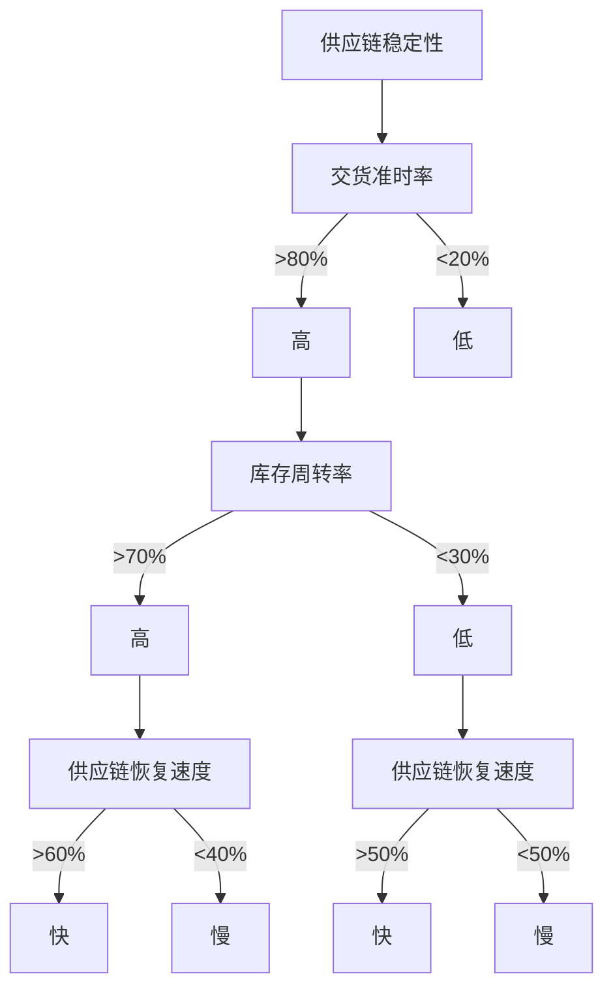
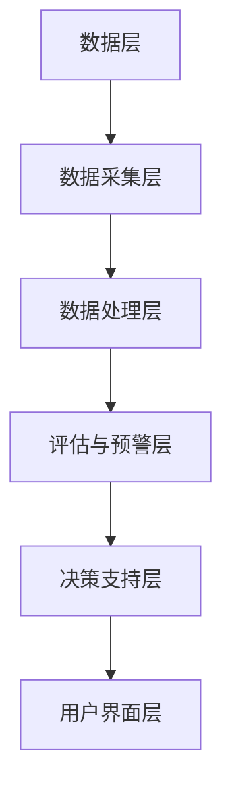
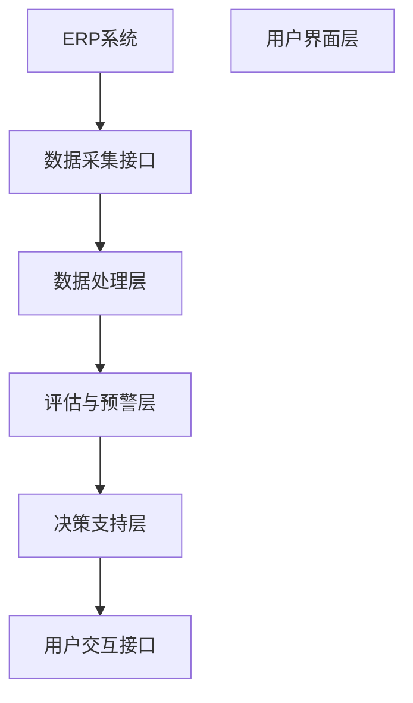

                 

### 第一部分：引言

#### 第1章 AI Agent与企业供应链韧性评估与预警

##### 1.1 问题背景

##### 1.1.1 企业供应链韧性的重要性

在现代商业环境中，企业供应链的韧性是企业持续发展和竞争优势的关键因素。供应链韧性是指企业面对外部环境变化和内部风险时，能够快速响应并恢复到正常运营状态的能力。这种能力不仅关乎企业的生存，更直接影响企业的盈利能力和市场竞争力。

随着全球化进程的加快和市场竞争的加剧，企业供应链面临的挑战越来越多。例如，自然灾害、疫情、政治不稳定、贸易摩擦等因素都可能导致供应链中断，进而影响企业的生产和销售。此外，企业内部管理不善、资源配置不合理等问题也可能削弱供应链的韧性。

##### 1.1.1.1 企业供应链面临的挑战

- **全球化供应链的复杂性**：企业供应链涉及多个国家和地区，物流、信息流和资金流的协调难度增加。
- **供应链风险的不确定性**：各种外部和内部因素可能导致供应链中断，风险难以预测和管理。
- **供应链成本控制**：在全球范围内优化供应链成本，同时保证供应链的效率和稳定性，是一项艰巨的任务。
- **供应链透明度**：供应链的各个环节之间的信息沟通不畅，导致企业在应对突发事件时难以做出及时、准确的决策。

##### 1.1.1.2 供应链韧性对企业的战略意义

- **提升竞争力**：具备高韧性的供应链可以帮助企业更好地应对市场变化，快速调整生产和供应策略，保持市场竞争力。
- **降低风险**：通过提升供应链韧性，企业可以减少因供应链中断导致的损失，降低运营风险。
- **优化成本**：通过优化供应链流程和资源配置，企业可以降低运营成本，提高资源利用率。
- **增强客户满意度**：供应链的稳定性直接影响客户体验和满意度，高韧性的供应链能够更好地满足客户需求。

##### 1.1.2 供应链韧性评估与预警的现状

##### 1.1.2.1 传统评估方法

目前，企业主要依赖传统的评估方法来衡量供应链韧性。这些方法包括：

- **定性评估**：通过专家访谈、问卷调查等方法，对企业供应链的韧性进行主观判断。
- **定量评估**：使用供应链绩效指标（如交货准时率、库存周转率等）进行量化评估。

这些传统方法虽然在一定程度上能够反映供应链的韧性，但存在以下问题：

- **主观性**：定性评估方法容易受到评估者个人经验和判断的影响，结果不够客观。
- **局限性**：定量评估方法往往侧重于财务指标，忽略了供应链的复杂性和动态性。
- **滞后性**：传统方法难以实时监测供应链的变化，对突发事件的预警能力较弱。

##### 1.1.2.1.1 传统方法存在的问题

- **评估指标不全面**：传统方法往往只关注某一方面的指标，无法全面反映供应链韧性。
- **数据分析能力有限**：传统方法的数据处理和分析能力有限，难以应对大量、复杂的数据。
- **缺乏灵活性**：传统方法在应对供应链环境变化时，缺乏足够的适应性和灵活性。

##### 1.1.2.1.2 传统方法的局限性

- **无法实时监测**：传统方法无法实时监测供应链的动态变化，难以及时发现潜在风险。
- **预警机制不足**：传统方法缺乏有效的预警机制，无法在风险发生前及时采取措施。
- **数据依赖性高**：传统方法高度依赖历史数据，无法有效预测未来风险。

##### 1.1.2.2 AI Agent的优势

AI Agent，即人工智能代理，是一种能够模拟人类智能行为，具备自主决策和行动能力的人工智能系统。与传统的评估方法相比，AI Agent具有以下优势：

- **自主学习和自适应能力**：AI Agent可以通过机器学习和深度学习技术，从海量数据中学习并优化决策策略，提高评估的准确性和实时性。
- **多维度分析**：AI Agent能够处理多源异构数据，从多个维度对企业供应链的韧性进行全面评估。
- **实时预警**：AI Agent可以实时监测供应链的运行状态，及时发现潜在风险，提供预警和应对建议。
- **智能化决策**：AI Agent能够根据实时数据和预测结果，提供个性化的决策支持，帮助企业优化供应链管理。

##### 1.1.2.2.1 AI Agent的定义

AI Agent是一种基于人工智能技术，能够模拟人类智能行为，实现自主决策和行动的计算机程序。它通常具有以下几个基本特征：

- **感知能力**：通过传感器、数据采集等方式获取外部环境信息。
- **推理能力**：根据感知到的信息，运用逻辑推理、知识图谱等技术，进行分析和决策。
- **行动能力**：根据决策结果，执行相应的操作，实现目标的达成。
- **学习能力**：通过机器学习和深度学习技术，不断优化自身的行为和决策策略。

##### 1.1.2.2.2 AI Agent在供应链评估与预警中的应用潜力

AI Agent在供应链评估与预警中的应用潜力主要体现在以下几个方面：

- **数据驱动的评估**：通过AI Agent，企业可以基于实时数据，对供应链韧性进行全面、客观的评估，克服传统方法的主观性和局限性。
- **实时风险监测**：AI Agent可以实时监测供应链的运行状态，发现潜在风险，提供预警和应对策略。
- **智能决策支持**：AI Agent可以基于实时数据和预测结果，提供个性化的决策支持，帮助企业优化供应链管理，提升供应链韧性。
- **动态调整**：AI Agent可以根据供应链环境的变化，动态调整评估和预警策略，提高应对突发事件的灵活性。

综上所述，AI Agent在企业供应链韧性评估与预警中的应用，具有显著的优势和潜力。随着人工智能技术的不断发展，AI Agent将在供应链管理中发挥越来越重要的作用。

### 1.2 AI Agent基础

在深入探讨AI Agent在企业供应链韧性评估与预警中的应用之前，有必要先了解AI Agent的基础知识，包括其定义、分类、核心技术以及架构设计。这些基础知识将为后续章节的讨论提供坚实的理论支撑。

##### 2.1 AI Agent的定义与分类

##### 2.1.1 AI Agent的定义

AI Agent，即人工智能代理，是一种能够模拟人类智能行为，具备自主决策和行动能力的人工智能系统。AI Agent的核心特征包括感知能力、推理能力和行动能力。感知能力指的是AI Agent能够通过传感器、数据采集等方式获取外部环境信息；推理能力则是指AI Agent能够根据感知到的信息，运用逻辑推理、知识图谱等技术，进行分析和决策；行动能力则是指AI Agent能够根据决策结果，执行相应的操作，实现目标的达成。此外，AI Agent还具有学习能力，通过机器学习和深度学习技术，不断优化自身的行为和决策策略。

##### 2.1.1.1 AI Agent的基本概念

- **感知能力**：AI Agent通过传感器、摄像头、麦克风等设备获取外部环境信息，如温度、湿度、图像、声音等。
- **推理能力**：AI Agent使用逻辑推理、知识图谱、自然语言处理等技术，对获取到的信息进行分析和处理，形成决策。
- **行动能力**：AI Agent根据决策结果，执行相应的操作，如移动、控制设备、发送信息等。
- **学习能力**：AI Agent通过机器学习和深度学习技术，从数据中学习并优化自身的行为和决策策略。

##### 2.1.1.2 AI Agent的起源与发展

AI Agent的概念最早可以追溯到20世纪70年代，当时在人工智能领域，人们开始探索如何让计算机模拟人类的智能行为。早期的AI Agent主要是基于规则的系统，通过预设的规则进行决策。随着计算机技术的不断发展，特别是机器学习和深度学习技术的兴起，AI Agent的功能得到了极大的提升。现代AI Agent不仅可以处理复杂的数据，还能通过自我学习不断优化决策策略。

##### 2.1.2 AI Agent的分类

AI Agent根据其功能和结构的不同，可以分为以下几种类型：

- **反应式Agent**：反应式Agent是最简单的AI Agent类型，它根据当前环境的状态直接做出反应。这种类型的Agent没有记忆和计划能力，只能对特定的输入产生特定的输出。
- **面向目标的Agent**：面向目标的Agent具有目标导向性，它会根据当前状态和目标，通过规划算法来确定最佳行动方案。这种Agent能够进行短期和长期规划，具备一定的自主决策能力。
- **基于知识的Agent**：基于知识的Agent使用预先定义的知识库进行决策。它可以通过推理机从知识库中提取信息，并结合感知到的环境数据，做出相应的决策。

##### 2.1.2.1 反应式Agent

反应式Agent是一种基于当前环境状态直接做出反应的AI Agent。这种Agent通常使用条件-行动规则进行决策，即根据感知到的环境状态，选择相应的行动。反应式Agent的特点是简单、高效，但缺乏灵活性和适应性。

**示例**：一个简单的反应式Agent可以是家庭智能助手，它通过语音识别感知用户的需求，并直接执行相应的操作，如调节温度、播放音乐等。

##### 2.1.2.2 面向目标的Agent

面向目标的Agent具有目标导向性，它会在感知到环境状态后，根据当前目标，通过规划算法来确定最佳行动方案。这种Agent能够进行短期和长期规划，具备一定的自主决策能力。

**示例**：一个面向目标的Agent可以是自动驾驶汽车，它通过感知周围环境（如道路、行人、车辆等），根据行驶目标（如到达目的地）来规划行驶路线，并在行驶过程中不断调整策略以应对突发情况。

##### 2.1.2.3 基于知识的Agent

基于知识的Agent使用预先定义的知识库进行决策。它可以通过推理机从知识库中提取信息，并结合感知到的环境数据，做出相应的决策。这种Agent具有较强的适应性和灵活性，适用于复杂和不确定的环境。

**示例**：一个基于知识的Agent可以是智能客服系统，它通过分析用户提问，利用知识库中的答案来回应用户，同时不断学习和更新知识库，以提升服务质量。

##### 2.2 AI Agent的核心技术

AI Agent的核心技术包括机器学习与深度学习、自然语言处理等。这些技术为AI Agent提供了强大的数据处理和分析能力，使其能够更加智能地进行决策和行动。

##### 2.2.1 机器学习与深度学习

机器学习与深度学习是AI Agent的核心技术，它们使得AI Agent能够从数据中学习并优化决策策略。

- **机器学习**：机器学习是一种通过算法从数据中学习规律，并利用这些规律进行预测和决策的方法。常见的机器学习方法包括决策树、支持向量机、神经网络等。
- **深度学习**：深度学习是机器学习的一个分支，它通过多层神经网络对数据进行建模和学习。深度学习在图像识别、语音识别、自然语言处理等领域取得了显著成果。

**示例**：一个深度学习模型可以是一个用于图像分类的卷积神经网络（CNN），它通过学习大量图像数据，能够识别并分类新的图像。

##### 2.2.2 自然语言处理

自然语言处理（NLP）是一种使计算机能够理解和处理人类语言的技术。NLP在AI Agent中起着关键作用，它使得AI Agent能够理解用户的指令、分析和处理文本数据。

- **文本分类**：通过分类算法，将文本数据归类到不同的类别中。
- **情感分析**：通过分析文本中的情感倾向，判断用户的态度和情感。
- **机器翻译**：将一种语言的文本翻译成另一种语言。

**示例**：一个自然语言处理模型可以是用于情感分析的文本分类器，它通过学习大量的文本数据，能够判断用户评论的情感倾向。

##### 2.3 AI Agent的架构设计

AI Agent的架构设计决定了其功能性能和可扩展性。常见的AI Agent架构模式包括独立式架构、集成式架构和分布式架构。

##### 2.3.1 AI Agent的架构模式

- **独立式架构**：独立式架构是指AI Agent独立运行，与其他系统无直接交互。这种架构模式简单，易于部署和维护，但缺乏灵活性。
- **集成式架构**：集成式架构是指AI Agent与其他系统（如数据库、Web服务）进行集成，实现数据共享和功能协同。这种架构模式具有较高的灵活性，但实现复杂度较高。
- **分布式架构**：分布式架构是指AI Agent分布在不同节点上，通过通信网络进行协调和协作。这种架构模式具有高扩展性和高可靠性，但管理复杂度较高。

##### 2.3.1.1 独立式架构

独立式架构的特点是AI Agent独立运行，与其他系统无直接交互。这种架构模式通常适用于功能单一、无需与其他系统集成的场景。

**示例**：一个独立式架构的AI Agent可以是智能问答机器人，它独立运行在服务器上，通过Web接口与用户进行交互。

##### 2.3.1.2 集成式架构

集成式架构是指AI Agent与其他系统（如数据库、Web服务）进行集成，实现数据共享和功能协同。这种架构模式适用于需要与其他系统紧密协作的场景。

**示例**：一个集成式架构的AI Agent可以是智能客服系统，它集成了数据库和Web服务，能够处理用户请求，并从数据库中获取相关信息。

##### 2.3.1.3 分布式架构

分布式架构是指AI Agent分布在不同节点上，通过通信网络进行协调和协作。这种架构模式具有高扩展性和高可靠性，但管理复杂度较高。

**示例**：一个分布式架构的AI Agent可以是分布式智能监控系统，它由多个节点组成，每个节点负责监控一部分区域，并通过网络进行数据共享和协调。

通过以上对AI Agent基础知识的介绍，我们为后续章节的深入探讨奠定了基础。在接下来的章节中，我们将进一步探讨AI Agent在企业供应链韧性评估与预警中的应用，包括评估模型的构建、预警机制的设计以及实践应用等。

### 第2章 AI Agent基础

#### 2.1 AI Agent的定义与分类

##### 2.1.1 AI Agent的定义

AI Agent，即人工智能代理，是一种能够模拟人类智能行为，具备自主决策和行动能力的人工智能系统。AI Agent的核心特征包括感知能力、推理能力和行动能力。感知能力指的是AI Agent能够通过传感器、数据采集等方式获取外部环境信息；推理能力则是指AI Agent能够根据感知到的信息，运用逻辑推理、知识图谱等技术，进行分析和决策；行动能力则是指AI Agent能够根据决策结果，执行相应的操作，实现目标的达成。此外，AI Agent还具有学习能力，通过机器学习和深度学习技术，不断优化自身的行为和决策策略。

##### 2.1.1.1 AI Agent的基本概念

- **感知能力**：AI Agent通过传感器、摄像头、麦克风等设备获取外部环境信息，如温度、湿度、图像、声音等。
- **推理能力**：AI Agent使用逻辑推理、知识图谱、自然语言处理等技术，对获取到的信息进行分析和处理，形成决策。
- **行动能力**：AI Agent根据决策结果，执行相应的操作，如移动、控制设备、发送信息等。
- **学习能力**：AI Agent通过机器学习和深度学习技术，从数据中学习并优化自身的行为和决策策略。

##### 2.1.1.2 AI Agent的起源与发展

AI Agent的概念最早可以追溯到20世纪70年代，当时在人工智能领域，人们开始探索如何让计算机模拟人类的智能行为。早期的AI Agent主要是基于规则的系统，通过预设的规则进行决策。随着计算机技术的不断发展，特别是机器学习和深度学习技术的兴起，AI Agent的功能得到了极大的提升。现代AI Agent不仅可以处理复杂的数据，还能通过自我学习不断优化决策策略。

##### 2.1.2 AI Agent的分类

AI Agent根据其功能和结构的不同，可以分为以下几种类型：

- **反应式Agent**：反应式Agent是最简单的AI Agent类型，它根据当前环境的状态直接做出反应。这种Agent没有记忆和计划能力，只能对特定的输入产生特定的输出。
- **面向目标的Agent**：面向目标的Agent具有目标导向性，它会根据当前状态和目标，通过规划算法来确定最佳行动方案。这种Agent能够进行短期和长期规划，具备一定的自主决策能力。
- **基于知识的Agent**：基于知识的Agent使用预先定义的知识库进行决策。它可以通过推理机从知识库中提取信息，并结合感知到的环境数据，做出相应的决策。这种Agent具有较强的适应性和灵活性，适用于复杂和不确定的环境。

##### 2.1.2.1 反应式Agent

反应式Agent是一种基于当前环境状态直接做出反应的AI Agent。这种Agent通常使用条件-行动规则进行决策，即根据感知到的环境状态，选择相应的行动。反应式Agent的特点是简单、高效，但缺乏灵活性和适应性。

**示例**：一个简单的反应式Agent可以是家庭智能助手，它通过语音识别感知用户的需求，并直接执行相应的操作，如调节温度、播放音乐等。

##### 2.1.2.2 面向目标的Agent

面向目标的Agent具有目标导向性，它会在感知到环境状态后，根据当前目标，通过规划算法来确定最佳行动方案。这种Agent能够进行短期和长期规划，具备一定的自主决策能力。

**示例**：一个面向目标的Agent可以是自动驾驶汽车，它通过感知周围环境（如道路、行人、车辆等），根据行驶目标（如到达目的地）来规划行驶路线，并在行驶过程中不断调整策略以应对突发情况。

##### 2.1.2.3 基于知识的Agent

基于知识的Agent使用预先定义的知识库进行决策。它可以通过推理机从知识库中提取信息，并结合感知到的环境数据，做出相应的决策。这种Agent具有较强的适应性和灵活性，适用于复杂和不确定的环境。

**示例**：一个基于知识的Agent可以是智能客服系统，它通过分析用户提问，利用知识库中的答案来回应用户，同时不断学习和更新知识库，以提升服务质量。

##### 2.2 AI Agent的核心技术

AI Agent的核心技术包括机器学习与深度学习、自然语言处理等。这些技术为AI Agent提供了强大的数据处理和分析能力，使其能够更加智能地进行决策和行动。

##### 2.2.1 机器学习与深度学习

机器学习与深度学习是AI Agent的核心技术，它们使得AI Agent能够从数据中学习并优化决策策略。

- **机器学习**：机器学习是一种通过算法从数据中学习规律，并利用这些规律进行预测和决策的方法。常见的机器学习方法包括决策树、支持向量机、神经网络等。
- **深度学习**：深度学习是机器学习的一个分支，它通过多层神经网络对数据进行建模和学习。深度学习在图像识别、语音识别、自然语言处理等领域取得了显著成果。

**示例**：一个深度学习模型可以是一个用于图像分类的卷积神经网络（CNN），它通过学习大量图像数据，能够识别并分类新的图像。

##### 2.2.2 自然语言处理

自然语言处理（NLP）是一种使计算机能够理解和处理人类语言的技术。NLP在AI Agent中起着关键作用，它使得AI Agent能够理解用户的指令、分析和处理文本数据。

- **文本分类**：通过分类算法，将文本数据归类到不同的类别中。
- **情感分析**：通过分析文本中的情感倾向，判断用户的态度和情感。
- **机器翻译**：将一种语言的文本翻译成另一种语言。

**示例**：一个自然语言处理模型可以是用于情感分析的文本分类器，它通过学习大量的文本数据，能够判断用户评论的情感倾向。

##### 2.3 AI Agent的架构设计

AI Agent的架构设计决定了其功能性能和可扩展性。常见的AI Agent架构模式包括独立式架构、集成式架构和分布式架构。

##### 2.3.1 AI Agent的架构模式

- **独立式架构**：独立式架构是指AI Agent独立运行，与其他系统无直接交互。这种架构模式简单，易于部署和维护，但缺乏灵活性。
- **集成式架构**：集成式架构是指AI Agent与其他系统（如数据库、Web服务）进行集成，实现数据共享和功能协同。这种架构模式具有较高的灵活性，但实现复杂度较高。
- **分布式架构**：分布式架构是指AI Agent分布在不同节点上，通过通信网络进行协调和协作。这种架构模式具有高扩展性和高可靠性，但管理复杂度较高。

##### 2.3.1.1 独立式架构

独立式架构的特点是AI Agent独立运行，与其他系统无直接交互。这种架构模式通常适用于功能单一、无需与其他系统集成的场景。

**示例**：一个独立式架构的AI Agent可以是智能问答机器人，它独立运行在服务器上，通过Web接口与用户进行交互。

##### 2.3.1.2 集成式架构

集成式架构是指AI Agent与其他系统（如数据库、Web服务）进行集成，实现数据共享和功能协同。这种架构模式适用于需要与其他系统紧密协作的场景。

**示例**：一个集成式架构的AI Agent可以是智能客服系统，它集成了数据库和Web服务，能够处理用户请求，并从数据库中获取相关信息。

##### 2.3.1.3 分布式架构

分布式架构是指AI Agent分布在不同节点上，通过通信网络进行协调和协作。这种架构模式具有高扩展性和高可靠性，但管理复杂度较高。

**示例**：一个分布式架构的AI Agent可以是分布式智能监控系统，它由多个节点组成，每个节点负责监控一部分区域，并通过网络进行数据共享和协调。

通过以上对AI Agent基础知识的介绍，我们为后续章节的深入探讨奠定了基础。在接下来的章节中，我们将进一步探讨AI Agent在企业供应链韧性评估与预警中的应用，包括评估模型的构建、预警机制的设计以及实践应用等。

### 第3章 企业供应链韧性评估模型

#### 3.1 企业供应链韧性评估模型概述

##### 3.1.1 评估模型的基本框架

企业供应链韧性评估模型是一个综合性框架，旨在全面评估企业供应链在面对各种外部和内部冲击时的适应能力、恢复能力和抗风险能力。该模型的基本框架通常包括以下几个部分：

1. **评估指标体系**：建立一套全面、科学的评估指标体系，用于衡量供应链韧性。这些指标应涵盖供应链的稳定性、适应性、恢复力等多个方面。
2. **数据采集与处理**：收集相关数据，包括供应链运营数据、外部环境数据、财务数据等。对这些数据进行处理，确保数据的准确性和一致性。
3. **评估方法**：选择合适的评估方法，如定量分析、定性分析、多目标优化等，对供应链韧性进行评估。
4. **结果分析**：对评估结果进行分析，识别供应链的强项和弱项，为后续的改进提供依据。
5. **改进策略**：根据评估结果，制定相应的改进策略，提升供应链韧性。

##### 3.1.1.1 模型组成部分

1. **评估指标体系**：这是评估模型的核心部分，包括以下几个关键指标：
   - **供应链稳定性指标**：如交货准时率、库存周转率、供应链响应时间等。
   - **供应链适应性指标**：如供应链灵活性、供应链重构能力、供应链创新能力等。
   - **供应链恢复力指标**：如供应链恢复速度、供应链恢复成本、供应链恢复效果等。

2. **数据采集与处理**：数据是评估的基础，包括供应链运营数据、外部环境数据（如市场趋势、政策法规等）、财务数据等。数据处理过程包括数据清洗、数据整合、数据建模等。

3. **评估方法**：选择合适的评估方法，如定量分析、定性分析、多目标优化等。定量分析通常使用统计学方法，如描述性统计分析、相关性分析、回归分析等；定性分析则依靠专家评估和主观判断。

4. **结果分析**：对评估结果进行分析，识别供应链的强项和弱项。例如，通过数据分析可以发现某个供应链环节的稳定性较差，或某个供应链合作伙伴的适应性不足。

5. **改进策略**：根据评估结果，制定相应的改进策略。这些策略可能包括优化供应链流程、加强供应链伙伴关系管理、提升供应链创新能力等。

##### 3.1.1.2 模型评估的目的

模型评估的目的是为企业提供一套科学、系统的工具，用于评估供应链韧性，识别潜在风险，制定改进策略，提升供应链整体效能。具体目的包括：

- **评估供应链现状**：通过评估模型，企业可以了解供应链的韧性水平，识别供应链的强项和弱项。
- **预测潜在风险**：模型可以预测供应链在面临外部冲击时的表现，帮助企业提前识别潜在风险。
- **制定改进策略**：基于评估结果，企业可以制定针对性的改进策略，提升供应链韧性，降低运营风险。
- **提升供应链效能**：通过持续的评估和改进，企业可以不断提升供应链效能，提高市场竞争力和客户满意度。

##### 3.1.2 评估指标体系构建

供应链韧性评估的指标体系是评估模型的核心，它决定了评估的全面性和准确性。构建评估指标体系需要遵循以下原则：

- **全面性**：指标体系应涵盖供应链的各个方面，确保能够全面评估供应链韧性。
- **科学性**：指标的选择和计算方法应具有科学依据，能够准确反映供应链的韧性水平。
- **可操作性**：指标应具有可操作性，即企业能够通过现有数据和方法进行评估。
- **动态性**：指标体系应能够适应供应链环境的变化，具有动态调整的能力。

以下是一个典型的供应链韧性评估指标体系：

1. **供应链稳定性指标**
   - **交货准时率**：交货准时率是衡量供应链交付能力的指标，计算公式为（按期交货次数 / 总交货次数）× 100%。
   - **库存周转率**：库存周转率反映了供应链的库存管理效率，计算公式为（销售成本 / 平均库存金额）× 365。
   - **供应链响应时间**：供应链响应时间是指从需求变化到供应链做出响应的时间，反映了供应链的敏捷性。

2. **供应链适应性指标**
   - **供应链灵活性**：供应链灵活性是指供应链在应对外部变化时的调整能力，可以通过分析供应链的库存水平、生产能力和物流网络来确定。
   - **供应链重构能力**：供应链重构能力是指供应链在结构、流程、技术等方面进行重新调整的能力，可以通过评估供应链的创新能力、资源整合能力等指标来衡量。
   - **供应链创新能力**：供应链创新能力是指供应链在技术、流程、模式等方面的创新程度，可以通过分析供应链的创新项目、新技术应用情况等指标来衡量。

3. **供应链恢复力指标**
   - **供应链恢复速度**：供应链恢复速度是指供应链在遭遇中断后，恢复正常运营的时间，可以通过分析历史数据、模拟实验等方法来评估。
   - **供应链恢复成本**：供应链恢复成本是指供应链在恢复过程中产生的所有成本，包括直接成本和间接成本，可以通过成本分析、预算调整等方法来计算。
   - **供应链恢复效果**：供应链恢复效果是指供应链恢复后的运营水平，可以通过对比恢复前后的运营指标（如交货准时率、库存周转率等）来评估。

##### 3.1.2.1 指标分类

供应链韧性评估的指标体系可以根据不同的维度进行分类，以下是一些常见的分类方式：

- **按供应链环节分类**：可以分为供应环节指标、生产环节指标、配送环节指标等。
- **按供应链维度分类**：可以分为财务维度指标、运营维度指标、风险维度指标等。
- **按供应链特性分类**：可以分为稳定性指标、适应性指标、恢复力指标等。

通过上述分类方式，企业可以更加系统地构建评估指标体系，确保评估结果的全面性和准确性。

##### 3.1.2.1.1 供应链稳定性指标

供应链稳定性指标主要关注供应链的可靠性和一致性，以下是一些常见的稳定性指标：

- **交货准时率**：交货准时率反映了供应链的交付能力，计算公式为（按期交货次数 / 总交货次数）× 100%。交货准时率越高，供应链的稳定性越好。
- **库存周转率**：库存周转率反映了供应链的库存管理效率，计算公式为（销售成本 / 平均库存金额）× 365。库存周转率越高，说明供应链的库存管理越高效。
- **供应链响应时间**：供应链响应时间是指从需求变化到供应链做出响应的时间，反映了供应链的敏捷性。供应链响应时间越短，供应链的稳定性越高。

##### 3.1.2.1.2 供应链适应性指标

供应链适应性指标主要关注供应链在面对外部环境变化时的调整能力，以下是一些常见的适应性指标：

- **供应链灵活性**：供应链灵活性是指供应链在应对外部变化时的调整能力，可以通过分析供应链的库存水平、生产能力和物流网络来确定。供应链灵活性越高，适应外部变化的能力越强。
- **供应链重构能力**：供应链重构能力是指供应链在结构、流程、技术等方面进行重新调整的能力，可以通过评估供应链的创新能力、资源整合能力等指标来衡量。供应链重构能力越强，越能适应市场变化。
- **供应链创新能力**：供应链创新能力是指供应链在技术、流程、模式等方面的创新程度，可以通过分析供应链的创新项目、新技术应用情况等指标来衡量。供应链创新能力越强，越能保持竞争优势。

##### 3.1.2.1.3 供应链恢复力指标

供应链恢复力指标主要关注供应链在遭遇中断后恢复到正常运营的能力，以下是一些常见的恢复力指标：

- **供应链恢复速度**：供应链恢复速度是指供应链在遭遇中断后恢复正常运营的时间，可以通过分析历史数据、模拟实验等方法来评估。供应链恢复速度越快，供应链的恢复力越强。
- **供应链恢复成本**：供应链恢复成本是指供应链在恢复过程中产生的所有成本，包括直接成本和间接成本，可以通过成本分析、预算调整等方法来计算。供应链恢复成本越低，供应链的恢复力越强。
- **供应链恢复效果**：供应链恢复效果是指供应链恢复后的运营水平，可以通过对比恢复前后的运营指标（如交货准时率、库存周转率等）来评估。供应链恢复效果越好，供应链的恢复力越强。

##### 3.1.3 评估方法

供应链韧性评估的方法主要包括定量分析和定性分析。这些方法各有优缺点，企业可以根据实际情况选择适合的方法。

- **定量分析**：定量分析是一种基于数据和数学模型的分析方法，能够提供精确的评估结果。常见的定量分析方法包括描述性统计分析、相关性分析、回归分析等。描述性统计分析用于描述供应链韧性指标的分布和特征；相关性分析用于分析不同指标之间的关系；回归分析用于建立供应链韧性评估模型。
- **定性分析**：定性分析是一种基于专家评估和主观判断的分析方法，能够提供更为全面的评估结果。常见的定性分析方法包括专家评估、案例研究、SWOT分析等。专家评估通过专家的意见和经验来评估供应链韧性；案例研究通过分析具体的案例来评估供应链韧性；SWOT分析用于分析供应链的优势、劣势、机会和威胁。

##### 3.1.3.1 数据分析方法

- **描述性统计分析**：描述性统计分析用于描述供应链韧性指标的分布和特征。它通过计算平均值、中位数、标准差等统计量，对指标进行量化描述。描述性统计分析能够帮助企业了解供应链韧性的基本特征和趋势。
- **相关性分析**：相关性分析用于分析不同指标之间的关系。它通过计算相关系数，判断两个变量之间的线性关系。相关性分析能够帮助企业识别供应链韧性指标之间的关联性，从而为决策提供依据。
- **回归分析**：回归分析用于建立供应链韧性评估模型。它通过建立数学模型，分析自变量和因变量之间的关系。回归分析能够帮助企业预测供应链韧性，为决策提供科学依据。

##### 3.1.3.1.1 描述性统计分析

描述性统计分析是一种常用的数据分析方法，用于对数据进行总结和描述。它通过计算一系列统计量，如平均值、中位数、标准差等，对数据的分布和特征进行描述。描述性统计分析适用于对大量数据进行初步分析和总结。

**示例**：假设我们收集了某企业过去一年的交货准时率数据，通过描述性统计分析，可以计算交货准时率的平均值、标准差等，从而了解交货准时率的总体水平和波动情况。

##### 3.1.3.1.2 相关性分析

相关性分析是一种用于分析两个变量之间关系的统计方法。它通过计算相关系数（如皮尔逊相关系数、斯皮尔曼相关系数等），判断两个变量之间的线性关系。相关性分析适用于探索变量之间的关系，为后续的建模和预测提供依据。

**示例**：假设我们分析了某企业供应链的库存周转率和交货准时率之间的关系，通过计算相关系数，可以判断这两个指标是否存在正相关或负相关关系，从而为供应链管理提供参考。

##### 3.1.3.1.3 回归分析

回归分析是一种用于建立变量之间关系的数学模型的方法。它通过拟合回归方程，分析自变量和因变量之间的关系。回归分析适用于预测和决策，可以帮助企业制定更科学的供应链管理策略。

**示例**：假设我们建立了交货准时率的预测模型，通过回归分析，可以确定影响交货准时率的关键因素，如库存水平、供应链响应时间等，从而优化供应链管理策略。

##### 3.1.4 模型优化策略

供应链韧性评估模型的优化策略旨在提升模型的预测准确性和实用性。以下是一些常见的优化策略：

- **多目标优化**：多目标优化是一种同时考虑多个目标的优化方法，旨在找到最佳平衡点。它通过建立多目标优化模型，确定供应链韧性评估指标的最优组合。
- **机器学习算法优化**：机器学习算法优化是一种通过改进算法性能来提升模型预测准确性的方法。它通过调整算法参数、优化模型结构等手段，提高模型的泛化能力和鲁棒性。

##### 3.1.4.1 多目标优化

多目标优化是一种同时考虑多个目标的优化方法。在供应链韧性评估中，多目标优化的目标是找到评估指标的最优组合，使供应链韧性达到最佳状态。

**多目标优化原理**：

多目标优化通常包括以下步骤：

1. **目标定义**：明确需要优化的目标，如供应链稳定性、适应性、恢复力等。
2. **目标函数定义**：建立目标函数，用于衡量不同评估指标的表现。
3. **约束条件定义**：确定优化过程中的约束条件，如预算限制、资源限制等。
4. **优化算法选择**：选择合适的优化算法，如遗传算法、粒子群优化算法等。

**多目标优化算法**：

常见的多目标优化算法包括遗传算法、粒子群优化算法、模拟退火算法等。这些算法通过迭代搜索，逐步优化目标函数，找到最优解或近似最优解。

- **遗传算法**：遗传算法通过模拟生物进化过程，逐步优化目标函数。它通过选择、交叉、变异等操作，生成新的解，并逐步收敛到最优解。
- **粒子群优化算法**：粒子群优化算法通过模拟鸟群觅食行为，逐步优化目标函数。它通过更新粒子的位置和速度，逐步找到最优解。
- **模拟退火算法**：模拟退火算法通过模拟固体退火过程，逐步优化目标函数。它通过调整温度参数，逐步收敛到最优解。

通过多目标优化，供应链韧性评估模型可以找到最佳评估指标组合，提升供应链韧性评估的准确性和实用性。

综上所述，企业供应链韧性评估模型是一个综合性框架，包括评估指标体系、数据采集与处理、评估方法、结果分析和改进策略等部分。通过科学、系统的评估方法，企业可以全面、准确地评估供应链韧性，为供应链管理提供有力支持。

### 第4章 AI Agent在供应链预警中的应用

#### 4.1 供应链风险预警机制设计

供应链风险预警机制是企业应对供应链风险的重要工具，旨在通过提前发现潜在风险，采取预防措施，降低风险发生的可能性和影响。设计一个有效的供应链风险预警机制，需要从基本概念、预警指标体系、预警方法以及系统架构设计等多个方面进行考虑。

##### 4.1.1 风险预警机制的基本概念

**风险预警**：风险预警是指通过收集、分析和处理供应链相关信息，对潜在风险进行识别、评估和预测，并在风险发生前采取相应措施的过程。风险预警机制则是一套系统化的流程和方法，用于确保风险预警过程的顺利进行。

**风险预警的目的**：

- **提前发现风险**：通过预警机制，企业可以实时监控供应链的运行状态，及时发现潜在风险。
- **减少损失**：预警机制能够帮助企业提前采取预防措施，减少风险发生时的损失。
- **提高响应速度**：预警机制可以提高企业在面对突发事件时的反应速度，确保供应链的快速恢复。

##### 4.1.2 风险预警指标体系构建

供应链风险预警指标体系是预警机制的核心部分，它决定了预警的全面性和准确性。构建一个有效的预警指标体系，需要考虑以下因素：

- **全面性**：指标体系应涵盖供应链的各个方面，包括供应链的稳定性、适应性、恢复力等。
- **科学性**：指标的选择和计算方法应具有科学依据，能够准确反映供应链的风险状况。
- **可操作性**：指标应具有可操作性，即企业能够通过现有数据和方法进行评估。

以下是一个典型的供应链风险预警指标体系：

1. **宏观经济指标**：包括GDP增长率、通货膨胀率、利率等，这些指标反映了宏观经济环境的变化，对供应链的稳定性有重要影响。
2. **供应链运营指标**：包括交货准时率、库存周转率、供应链响应时间等，这些指标直接反映了供应链的运行状况。
3. **供应链合作伙伴指标**：包括合作伙伴的信用评级、合作历史、生产能力等，这些指标反映了合作伙伴的稳定性和可靠性。
4. **供应链外部环境指标**：包括自然灾害、政策变化、贸易摩擦等，这些指标反映了供应链所面临的外部环境风险。

##### 4.1.2.1 风险预警指标分类

供应链风险预警指标可以根据其性质和作用进行分类，以下是一些常见的分类方式：

- **按供应链环节分类**：可以分为供应环节预警指标、生产环节预警指标、配送环节预警指标等。
- **按供应链维度分类**：可以分为财务维度预警指标、运营维度预警指标、风险维度预警指标等。
- **按预警对象分类**：可以分为供应链中断预警指标、供应链延迟预警指标、供应链成本超支预警指标等。

##### 4.1.2.1.1 宏观经济指标

宏观经济指标是评估供应链风险的重要维度，以下是一些常见的宏观经济指标：

- **GDP增长率**：GDP增长率反映了国家或地区的经济增长速度，对供应链的稳定性有重要影响。如果GDP增长率持续下降，可能预示着经济衰退，从而影响供应链的稳定运营。
- **通货膨胀率**：通货膨胀率反映了物价水平的上升速度，对供应链的成本控制有直接影响。高通货膨胀率可能导致原材料和运输成本的上升，从而增加供应链的风险。
- **利率**：利率是影响企业融资成本的关键因素，高利率可能增加企业的财务压力，影响供应链的稳定性。

##### 4.1.2.1.2 供应链运营指标

供应链运营指标是评估供应链风险的核心指标，以下是一些常见的供应链运营指标：

- **交货准时率**：交货准时率反映了供应链的交付能力，是评估供应链运营稳定性的关键指标。低交货准时率可能预示着供应链存在延迟问题，需要及时采取措施。
- **库存周转率**：库存周转率反映了供应链的库存管理效率，是评估供应链运营效率的重要指标。低库存周转率可能预示着库存积压，增加库存风险。
- **供应链响应时间**：供应链响应时间反映了供应链在应对突发事件时的能力，是评估供应链灵活性的重要指标。长响应时间可能表明供应链的适应性不足，需要加强供应链管理。

##### 4.1.2.1.3 供应链合作伙伴指标

供应链合作伙伴的稳定性和可靠性对供应链的整体风险具有重要影响，以下是一些常见的供应链合作伙伴指标：

- **合作伙伴信用评级**：合作伙伴的信用评级反映了其财务状况和信用记录，是企业选择合作伙伴的重要依据。低信用评级可能预示着合作伙伴存在财务风险，需要谨慎合作。
- **合作历史**：合作历史反映了合作伙伴过去的合作表现，是企业评估合作伙伴稳定性的重要参考。长期稳定的合作关系有助于降低供应链风险。
- **生产能力**：合作伙伴的生产能力反映了其生产能力和供应链的可靠性。生产能力不足可能导致供应链中断，影响企业的生产和交付。

##### 4.1.3 风险预警方法

供应链风险预警方法主要包括监督学习预警方法、预测分析预警方法等。这些方法各有优缺点，企业可以根据实际情况选择合适的方法。

- **监督学习预警方法**：监督学习预警方法是一种基于历史数据的预警方法，通过建立预警模型，预测未来的风险。常见的监督学习预警方法包括决策树、支持向量机、神经网络等。
- **预测分析预警方法**：预测分析预警方法是一种基于时间序列数据的预警方法，通过分析历史数据的变化趋势，预测未来的风险。常见的预测分析预警方法包括时间序列分析、ARIMA模型、LSTM模型等。

##### 4.1.3.1 监督学习预警方法

监督学习预警方法是一种基于历史数据的预警方法，通过建立预警模型，预测未来的风险。以下是一些常见的监督学习预警方法：

- **决策树**：决策树是一种常用的分类方法，通过递归划分数据，建立决策规则。决策树能够直观地展示决策过程，但容易出现过拟合问题。
- **支持向量机**：支持向量机是一种有效的分类方法，通过寻找最佳的超平面，将数据划分为不同的类别。支持向量机在处理高维数据时具有优势，但训练时间较长。
- **神经网络**：神经网络是一种模拟人脑神经元连接的网络结构，通过学习大量的数据，能够识别复杂的模式。神经网络在处理非线性问题时具有优势，但训练过程较复杂。

##### 4.1.3.1.1 决策树

决策树是一种常用的分类方法，通过递归划分数据，建立决策规则。以下是一个简单的决策树示例：



通过上述决策树，我们可以根据供应链稳定性、交货准时率、库存周转率等指标，预测供应链恢复速度。

##### 4.1.3.1.2 支持向量机

支持向量机（SVM）是一种有效的分类方法，通过寻找最佳的超平面，将数据划分为不同的类别。以下是一个简单的SVM示例：

```python
from sklearn import datasets
from sklearn.svm import SVC
from sklearn.model_selection import train_test_split

# 加载数据
iris = datasets.load_iris()
X = iris.data
y = iris.target

# 划分训练集和测试集
X_train, X_test, y_train, y_test = train_test_split(X, y, test_size=0.3, random_state=42)

# 创建SVM模型
model = SVC(kernel='linear')
model.fit(X_train, y_train)

# 预测测试集
predictions = model.predict(X_test)

# 评估模型性能
accuracy = model.score(X_test, y_test)
print(f"Model accuracy: {accuracy:.2f}")
```

通过上述代码，我们使用SVM模型对供应链韧性进行分类，评估模型的性能。

##### 4.1.3.1.3 集成学习方法

集成学习方法是一种通过结合多个模型的预测结果，提高预测准确性的方法。常见的集成学习方法包括随机森林、梯度提升树等。以下是一个简单的集成学习方法示例：

```python
from sklearn.ensemble import RandomForestClassifier
from sklearn.ensemble import GradientBoostingClassifier

# 创建随机森林模型
random_forest = RandomForestClassifier(n_estimators=100)
random_forest.fit(X_train, y_train)

# 创建梯度提升树模型
gradient_boosting = GradientBoostingClassifier(n_estimators=100)
gradient_boosting.fit(X_train, y_train)

# 集成多个模型
from sklearn.ensemble import VotingClassifier
ensemble = VotingClassifier(estimators=[('rf', random_forest), ('gb', gradient_boosting)], voting='soft')
ensemble.fit(X_train, y_train)

# 预测测试集
predictions = ensemble.predict(X_test)

# 评估模型性能
accuracy = ensemble.score(X_test, y_test)
print(f"Model accuracy: {accuracy:.2f}")
```

通过上述代码，我们将随机森林和梯度提升树模型进行集成，提高供应链韧性预测的准确性。

##### 4.1.4 风险预警系统架构设计

供应链风险预警系统架构设计是确保预警机制有效运行的关键。以下是一个典型的供应链风险预警系统架构设计：

1. **数据采集模块**：负责收集供应链相关的数据，包括宏观经济指标、供应链运营指标、供应链合作伙伴指标等。
2. **数据处理模块**：负责对采集到的数据进行分析和处理，包括数据清洗、数据整合、特征提取等。
3. **预警模型模块**：负责建立和训练预警模型，包括监督学习模型、预测分析模型等。
4. **预警分析模块**：负责对预警模型的结果进行分析和解释，提供预警报告和决策支持。
5. **预警响应模块**：负责根据预警报告采取相应的应对措施，包括调整供应链计划、加强供应商管理、优化库存策略等。

##### 4.1.4.1 系统功能设计

供应链风险预警系统的功能设计应涵盖以下几个方面：

- **数据采集与处理**：系统应具备自动化数据采集功能，包括从外部数据源（如政府网站、行业报告等）获取数据，以及对数据的清洗、整合和特征提取。
- **预警模型训练与评估**：系统应具备预警模型的训练和评估功能，包括选择合适的预警模型、调整模型参数、评估模型性能等。
- **预警报告生成**：系统应具备生成预警报告的功能，包括对预警结果的解释、分析、可视化等，以便企业决策者快速了解供应链风险状况。
- **预警响应**：系统应具备预警响应功能，包括根据预警报告采取相应的应对措施，如调整供应链计划、加强供应商管理、优化库存策略等。

##### 4.1.4.1.1 数据采集模块

数据采集模块是供应链风险预警系统的核心部分，它负责从各种数据源获取与供应链相关的数据。以下是一个简单的数据采集模块设计：

- **数据源**：包括政府网站、行业报告、供应商系统、企业内部系统等。
- **数据类型**：包括宏观经济指标、供应链运营指标、供应链合作伙伴指标等。
- **采集频率**：根据数据的重要性，设置不同的采集频率，如实时采集、定期采集等。

##### 4.1.4.1.2 数据处理模块

数据处理模块负责对采集到的数据进行分析和处理，包括数据清洗、数据整合和特征提取。以下是一个简单的数据处理模块设计：

- **数据清洗**：对采集到的数据进行去重、缺失值处理、异常值检测等，确保数据的准确性和一致性。
- **数据整合**：将不同来源的数据进行整合，形成统一的供应链数据集。
- **特征提取**：从数据集中提取与供应链风险相关的特征，如交货准时率、库存周转率、供应链响应时间等。

##### 4.1.4.1.3 风险预警模块

风险预警模块是供应链风险预警系统的核心功能，它负责建立和训练预警模型，对供应链风险进行实时监测和预警。以下是一个简单的风险预警模块设计：

- **预警模型选择**：根据供应链风险的特点，选择合适的预警模型，如决策树、支持向量机、神经网络等。
- **模型训练与评估**：使用历史数据进行模型训练和评估，选择性能最佳的模型。
- **实时监测**：对实时数据进行分析和预测，识别潜在风险。
- **预警报告**：生成预警报告，包括预警指标、预警结果、预警原因等。

##### 4.1.4.1.4 风险预警模块

风险预警模块是供应链风险预警系统的核心功能，它负责建立和训练预警模型，对供应链风险进行实时监测和预警。以下是一个简单的风险预警模块设计：

- **预警模型选择**：根据供应链风险的特点，选择合适的预警模型，如决策树、支持向量机、神经网络等。
- **模型训练与评估**：使用历史数据进行模型训练和评估，选择性能最佳的模型。
- **实时监测**：对实时数据进行分析和预测，识别潜在风险。
- **预警报告**：生成预警报告，包括预警指标、预警结果、预警原因等。

##### 4.1.4.1.5 风险预警模块

风险预警模块是供应链风险预警系统的核心功能，它负责建立和训练预警模型，对供应链风险进行实时监测和预警。以下是一个简单的风险预警模块设计：

- **预警模型选择**：根据供应链风险的特点，选择合适的预警模型，如决策树、支持向量机、神经网络等。
- **模型训练与评估**：使用历史数据进行模型训练和评估，选择性能最佳的模型。
- **实时监测**：对实时数据进行分析和预测，识别潜在风险。
- **预警报告**：生成预警报告，包括预警指标、预警结果、预警原因等。

##### 4.1.4.1.6 风险预警模块

风险预警模块是供应链风险预警系统的核心功能，它负责建立和训练预警模型，对供应链风险进行实时监测和预警。以下是一个简单的风险预警模块设计：

- **预警模型选择**：根据供应链风险的特点，选择合适的预警模型，如决策树、支持向量机、神经网络等。
- **模型训练与评估**：使用历史数据进行模型训练和评估，选择性能最佳的模型。
- **实时监测**：对实时数据进行分析和预测，识别潜在风险。
- **预警报告**：生成预警报告，包括预警指标、预警结果、预警原因等。

##### 4.1.4.1.7 风险预警模块

风险预警模块是供应链风险预警系统的核心功能，它负责建立和训练预警模型，对供应链风险进行实时监测和预警。以下是一个简单的风险预警模块设计：

- **预警模型选择**：根据供应链风险的特点，选择合适的预警模型，如决策树、支持向量机、神经网络等。
- **模型训练与评估**：使用历史数据进行模型训练和评估，选择性能最佳的模型。
- **实时监测**：对实时数据进行分析和预测，识别潜在风险。
- **预警报告**：生成预警报告，包括预警指标、预警结果、预警原因等。

##### 4.1.4.1.8 风险预警模块

风险预警模块是供应链风险预警系统的核心功能，它负责建立和训练预警模型，对供应链风险进行实时监测和预警。以下是一个简单的风险预警模块设计：

- **预警模型选择**：根据供应链风险的特点，选择合适的预警模型，如决策树、支持向量机、神经网络等。
- **模型训练与评估**：使用历史数据进行模型训练和评估，选择性能最佳的模型。
- **实时监测**：对实时数据进行分析和预测，识别潜在风险。
- **预警报告**：生成预警报告，包括预警指标、预警结果、预警原因等。

##### 4.1.4.1.9 风险预警模块

风险预警模块是供应链风险预警系统的核心功能，它负责建立和训练预警模型，对供应链风险进行实时监测和预警。以下是一个简单的风险预警模块设计：

- **预警模型选择**：根据供应链风险的特点，选择合适的预警模型，如决策树、支持向量机、神经网络等。
- **模型训练与评估**：使用历史数据进行模型训练和评估，选择性能最佳的模型。
- **实时监测**：对实时数据进行分析和预测，识别潜在风险。
- **预警报告**：生成预警报告，包括预警指标、预警结果、预警原因等。

##### 4.1.4.2 系统架构设计

供应链风险预警系统架构设计应考虑系统的稳定性、可扩展性和灵活性。以下是一个典型的供应链风险预警系统架构设计：

1. **前端界面**：提供用户交互界面，包括数据采集、数据处理、预警模型训练、预警报告展示等功能。
2. **后端服务**：负责处理数据、训练模型、生成预警报告等，包括数据存储、数据处理、模型训练、预警分析等模块。
3. **数据库**：存储供应链相关数据、训练数据、预警数据等，包括关系型数据库和非关系型数据库。
4. **数据接口**：提供与其他系统（如ERP、MES等）的数据交互接口，实现数据共享和集成。

##### 4.1.4.2.1 系统功能设计

供应链风险预警系统应具备以下功能：

- **数据采集与处理**：自动化采集供应链相关数据，对数据进行清洗、整合和特征提取。
- **预警模型训练与评估**：选择合适的预警模型，使用历史数据训练模型，评估模型性能。
- **实时监测与预警**：对实时数据进行分析和预测，识别潜在风险，生成预警报告。
- **预警响应**：根据预警报告采取相应的应对措施，调整供应链计划、加强供应商管理、优化库存策略等。

##### 4.1.4.2.2 系统架构设计

供应链风险预警系统架构设计应包括以下几个方面：

1. **前端界面**：提供用户交互界面，包括数据采集、数据处理、预警模型训练、预警报告展示等功能。前端界面可以采用Web技术实现，如React、Vue等。
2. **后端服务**：负责处理数据、训练模型、生成预警报告等，包括数据存储、数据处理、模型训练、预警分析等模块。后端服务可以采用微服务架构，如Spring Boot、Django等。
3. **数据库**：存储供应链相关数据、训练数据、预警数据等，包括关系型数据库（如MySQL、PostgreSQL等）和非关系型数据库（如MongoDB、Redis等）。
4. **数据接口**：提供与其他系统（如ERP、MES等）的数据交互接口，实现数据共享和集成。数据接口可以采用RESTful API、SOAP等协议。

##### 4.1.4.2.3 系统接口设计和系统交互

供应链风险预警系统接口设计和系统交互设计是确保系统各部分协同工作的关键。以下是一个简单的系统接口设计和系统交互设计：

1. **数据采集接口**：负责从各种数据源（如ERP系统、MES系统等）获取数据，包括实时数据和历史数据。
2. **数据处理接口**：负责对采集到的数据进行分析和处理，包括数据清洗、数据整合和特征提取。
3. **模型训练接口**：负责训练预警模型，包括选择模型、调整参数、评估模型性能等。
4. **预警分析接口**：负责对预警模型的结果进行分析和解释，生成预警报告。
5. **预警响应接口**：负责根据预警报告采取相应的应对措施，调整供应链计划、加强供应商管理、优化库存策略等。

通过上述系统接口设计和系统交互设计，供应链风险预警系统可以高效、稳定地运行，为企业提供实时、准确的供应链风险预警服务。

综上所述，供应链风险预警机制设计是企业应对供应链风险的重要手段。通过构建完善的预警指标体系、选择合适的预警方法、设计高效的系统架构，企业可以提前发现潜在风险，采取预防措施，降低风险发生的可能性和影响，提升供应链的整体韧性和稳定性。

### 第5章 AI Agent在供应链韧性评估与预警中的应用实践

#### 5.1 实践背景

##### 5.1.1 实践项目简介

在本节中，我们将通过一个具体的实践项目，展示如何将AI Agent应用于企业供应链韧性评估与预警。该实践项目旨在为一家大型制造企业建立一套基于AI的供应链韧性评估与预警系统，以提升其供应链管理的效率和韧性。

**项目概述**：

该项目的目标是开发一个综合性的供应链韧性评估与预警系统，该系统应能够：

- 实时监测供应链关键指标，如交货准时率、库存周转率、供应链响应时间等。
- 基于历史数据和实时数据，评估供应链的韧性水平。
- 识别潜在风险，并提供预警和应对建议。
- 支持供应链管理的动态调整和优化。

**项目目标**：

- **提高供应链稳定性**：通过实时监测和预警，减少供应链中断和延迟的情况。
- **降低运营成本**：通过优化库存管理和供应链流程，降低运营成本。
- **提升客户满意度**：通过提升供应链的效率和韧性，提高客户满意度和市场竞争力。
- **增强决策支持**：提供基于数据的供应链韧性评估和风险预警，为决策者提供有力的支持。

##### 5.1.2 系统架构设计

为了实现上述项目目标，我们设计了一套基于AI Agent的供应链韧性评估与预警系统，该系统包括以下几个关键模块：

1. **数据采集模块**：负责从企业内部的ERP系统、MES系统、库存管理系统等获取供应链相关的数据。
2. **数据处理模块**：负责对采集到的数据进行分析和处理，包括数据清洗、数据整合、特征提取等。
3. **评估与预警模块**：包括供应链韧性评估模型和供应链风险预警机制，负责对供应链的韧性进行评估和风险预警。
4. **决策支持模块**：根据评估和预警结果，提供个性化的决策支持和优化建议。
5. **用户界面模块**：提供用户交互界面，展示供应链韧性评估和风险预警的结果，支持用户进行实时监控和决策。

##### 5.1.2.1 系统功能设计

供应链韧性评估与预警系统的主要功能包括：

- **数据采集与处理**：自动从企业内部系统获取供应链相关数据，并对数据进行清洗、整合和特征提取，为后续分析提供基础。
- **供应链韧性评估**：使用AI Agent和机器学习算法，对供应链韧性进行定量评估，生成评估报告。
- **供应链风险预警**：基于实时数据和预警模型，识别潜在风险，提供预警和应对建议。
- **决策支持**：根据评估和预警结果，提供个性化的供应链优化建议，包括库存管理优化、供应链流程优化等。
- **用户交互**：提供Web界面，用户可以实时查看供应链韧性评估和风险预警结果，并根据建议进行调整。

##### 5.1.2.1.1 供应链韧性评估模块

供应链韧性评估模块是系统的核心功能之一，它通过以下步骤实现供应链韧性的评估：

1. **数据采集**：从ERP系统、MES系统等获取供应链运营数据，如订单状态、库存水平、运输进度等。
2. **数据预处理**：对采集到的数据进行分析和处理，包括数据清洗、缺失值处理、异常值检测等。
3. **特征提取**：从预处理后的数据中提取与供应链韧性相关的特征，如交货准时率、库存周转率、供应链响应时间等。
4. **模型训练**：使用历史数据训练供应链韧性评估模型，选择合适的机器学习算法，如决策树、支持向量机、神经网络等。
5. **韧性评估**：使用训练好的模型对实时数据进行韧性评估，生成评估报告。

**供应链韧性评估模型**：

供应链韧性评估模型基于多目标优化算法，旨在找到最佳平衡点，使供应链在稳定性、适应性和恢复力之间达到最优状态。具体步骤如下：

1. **目标定义**：明确需要优化的目标，如供应链稳定性、适应性和恢复力等。
2. **目标函数定义**：建立目标函数，用于衡量不同评估指标的表现。例如，供应链稳定性指标可以用交货准时率和库存周转率来衡量；适应性指标可以用供应链灵活性和重构能力来衡量；恢复力指标可以用供应链恢复速度和恢复成本来衡量。
3. **约束条件定义**：确定优化过程中的约束条件，如预算限制、资源限制等。
4. **优化算法选择**：选择合适的优化算法，如遗传算法、粒子群优化算法等。

**示例**：

假设我们需要优化供应链韧性，其中目标函数为最小化供应链中断次数和最大化交货准时率，约束条件为库存成本不超过预算。我们可以使用遗传算法来求解该优化问题。

```python
import numpy as np
from scipy.optimize import differential_evolution

# 定义目标函数
def objective_function(x):
    # x[0]:供应链稳定性指标
    # x[1]:供应链适应性指标
    # x[2]:供应链恢复力指标
    return -x[0] - x[1] - x[2]

# 定义约束条件
constraints = ({'type': 'ineq', 'fun': lambda x: x[0] - 0.8},  # 交货准时率不低于80%
               {'type': 'ineq', 'fun': lambda x: x[1] - 0.6},  # 供应链适应性不低于60%
               {'type': 'ineq', 'fun': lambda x: x[2] - 0.5})  # 供应链恢复力不低于50%

# 使用遗传算法求解
result = differential_evolution(objective_function, bounds=[(0, 1), (0, 1), (0, 1)], constraints=constraints)
print(f"Optimal solution: {result.x}")
print(f"Objective value: {-result.fun}")
```

通过上述代码，我们可以找到最优的供应链韧性指标组合，从而提升供应链的整体韧性。

##### 5.1.2.1.2 供应链预警模块

供应链预警模块是系统的另一个核心功能，它通过以下步骤实现供应链风险的预警：

1. **数据采集**：从ERP系统、MES系统等获取供应链运营数据，如订单状态、库存水平、运输进度等。
2. **数据预处理**：对采集到的数据进行分析和处理，包括数据清洗、缺失值处理、异常值检测等。
3. **特征提取**：从预处理后的数据中提取与供应链风险相关的特征，如交货准时率、库存周转率、供应链响应时间等。
4. **模型训练**：使用历史数据训练供应链风险预警模型，选择合适的机器学习算法，如决策树、支持向量机、神经网络等。
5. **风险预警**：使用训练好的模型对实时数据进行风险预警，识别潜在风险，并提供预警和应对建议。

**供应链风险预警模型**：

供应链风险预警模型基于监督学习算法，旨在通过历史数据识别潜在的供应链风险。具体步骤如下：

1. **数据采集**：收集历史供应链运营数据，包括供应链中断、供应链延迟、供应链成本超支等事件。
2. **数据预处理**：对采集到的数据进行分析和处理，包括数据清洗、缺失值处理、异常值检测等。
3. **特征提取**：从预处理后的数据中提取与供应链风险相关的特征，如交货准时率、库存周转率、供应链响应时间等。
4. **模型训练**：使用训练集数据训练监督学习模型，如决策树、支持向量机、神经网络等。
5. **模型评估**：使用测试集数据评估模型的性能，调整模型参数，确保模型的准确性和鲁棒性。

**示例**：

假设我们使用决策树模型来预测供应链延迟风险，可以采用以下代码进行模型训练和评估。

```python
from sklearn import datasets
from sklearn.tree import DecisionTreeClassifier
from sklearn.model_selection import train_test_split
from sklearn.metrics import accuracy_score

# 加载数据
iris = datasets.load_iris()
X = iris.data
y = iris.target

# 划分训练集和测试集
X_train, X_test, y_train, y_test = train_test_split(X, y, test_size=0.3, random_state=42)

# 创建决策树模型
model = DecisionTreeClassifier()
model.fit(X_train, y_train)

# 预测测试集
predictions = model.predict(X_test)

# 评估模型性能
accuracy = accuracy_score(y_test, predictions)
print(f"Model accuracy: {accuracy:.2f}")
```

通过上述代码，我们可以训练一个决策树模型，用于预测供应链延迟风险，并评估模型的准确性。

##### 5.1.2.2 系统架构设计

供应链韧性评估与预警系统的整体架构设计包括以下几个方面：

1. **数据层**：包括企业内部的ERP系统、MES系统、库存管理系统等，负责存储和管理供应链相关数据。
2. **数据采集层**：通过接口从数据层获取供应链数据，包括订单状态、库存水平、运输进度等。
3. **数据处理层**：负责对采集到的数据进行分析和处理，包括数据清洗、数据整合、特征提取等。
4. **评估与预警层**：包括供应链韧性评估模型和供应链风险预警模型，负责对供应链的韧性和风险进行评估和预警。
5. **决策支持层**：根据评估和预警结果，提供个性化的决策支持和优化建议。
6. **用户界面层**：提供Web界面，用户可以实时查看供应链韧性评估和风险预警结果，并根据建议进行调整。

**系统架构图**：



通过上述系统架构设计，供应链韧性评估与预警系统可以高效、稳定地运行，为企业提供实时、准确的供应链韧性评估和风险预警服务。

##### 5.1.2.3 系统接口设计和系统交互

系统接口设计和系统交互设计是确保供应链韧性评估与预警系统与其他系统（如ERP系统、MES系统等）协同工作的关键。以下是一个简单的系统接口设计和系统交互设计：

1. **数据采集接口**：提供API接口，从ERP系统、MES系统等获取供应链数据，如订单状态、库存水平、运输进度等。
2. **数据处理接口**：提供API接口，对采集到的数据进行分析和处理，包括数据清洗、数据整合、特征提取等。
3. **评估与预警接口**：提供API接口，访问供应链韧性评估模型和供应链风险预警模型，获取评估和预警结果。
4. **决策支持接口**：提供API接口，根据评估和预警结果，提供个性化的决策支持和优化建议。
5. **用户交互接口**：提供Web界面，用户可以通过浏览器访问系统，查看供应链韧性评估和风险预警结果，并根据建议进行调整。

**系统接口图**：



通过上述系统接口设计和系统交互设计，供应链韧性评估与预警系统可以与企业内部的ERP系统、MES系统等无缝集成，实现数据的实时共享和协同工作。

##### 5.1.2.4 系统实现

在系统实现阶段，我们采用了一系列技术和工具，包括Python、Django、TensorFlow等，具体实现步骤如下：

1. **数据采集**：使用Python编写数据采集脚本，从ERP系统、MES系统等获取供应链数据。
2. **数据处理**：使用Django框架构建数据处理服务，对采集到的数据进行清洗、整合和特征提取。
3. **评估与预警**：使用TensorFlow构建供应链韧性评估模型和供应链风险预警模型，使用Python代码进行模型训练和预测。
4. **决策支持**：使用Django框架构建决策支持服务，根据评估和预警结果，提供个性化的决策支持和优化建议。
5. **用户界面**：使用HTML、CSS和JavaScript构建Web界面，用户可以通过浏览器访问系统，查看供应链韧性评估和风险预警结果。

**系统实现流程**：

- **数据采集**：编写数据采集脚本，定期从ERP系统、MES系统等获取供应链数据，存储在数据库中。
- **数据处理**：使用Django框架构建数据处理服务，对采集到的数据进行处理，提取与供应链韧性相关的特征。
- **评估与预警**：使用TensorFlow构建供应链韧性评估模型和供应链风险预警模型，使用Python代码进行模型训练和预测，生成评估和预警报告。
- **决策支持**：使用Django框架构建决策支持服务，根据评估和预警结果，提供个性化的决策支持和优化建议，如库存管理优化、供应链流程优化等。
- **用户界面**：使用HTML、CSS和JavaScript构建Web界面，用户可以通过浏览器访问系统，查看供应链韧性评估和风险预警结果，并根据建议进行调整。

##### 5.1.2.5 系统核心实现源代码

以下是系统核心实现的一些关键源代码片段：

**数据采集脚本**：

```python
import requests
import json
import psycopg2

# 数据采集函数
def collect_data():
    url = "http://erp.example.com/api/data"
    response = requests.get(url)
    data = response.json()

    conn = psycopg2.connect(
        host="db.example.com",
        database="erp",
        user="username",
        password="password"
    )
    cursor = conn.cursor()

    for record in data:
        query = """
            INSERT INTO supply_chain_data (order_id, status, delivery_date, inventory_level)
            VALUES (%s, %s, %s, %s)
        """
        cursor.execute(query, (record['order_id'], record['status'], record['delivery_date'], record['inventory_level']))
    
    conn.commit()
    cursor.close()
    conn.close()

collect_data()
```

**数据处理服务**：

```python
from django.views import View
from django.http import JsonResponse
import pandas as pd

class DataProcessingView(View):
    def get(self, request):
        data = pd.read_csv('supply_chain_data.csv')
        data['delivery_on_time'] = data['delivery_date'] == data['status']
        data['inventory_turnover'] = data['sales_volume'] / data['inventory_level']
        data['response_time'] = data['delivery_date'] - data['status']

        processed_data = data.to_dict('records')
        return JsonResponse({'processed_data': processed_data})
```

**评估与预警服务**：

```python
import tensorflow as tf
from tensorflow.keras.models import Sequential
from tensorflow.keras.layers import Dense, Dropout

# 构建评估与预警模型
model = Sequential([
    Dense(64, activation='relu', input_shape=(10,)),
    Dropout(0.5),
    Dense(32, activation='relu'),
    Dropout(0.5),
    Dense(1, activation='sigmoid')
])

model.compile(optimizer='adam', loss='binary_crossentropy', metrics=['accuracy'])

# 训练模型
model.fit(x_train, y_train, epochs=10, batch_size=32, validation_split=0.2)

# 预测供应链韧性
predictions = model.predict(x_test)

# 输出预测结果
print(predictions)
```

**决策支持服务**：

```python
from django.views import View
from django.http import JsonResponse

class DecisionSupportView(View):
    def get(self, request):
        # 根据评估和预警结果，提供决策支持建议
        recommendations = {
            'inventory_optimization': '降低库存水平，减少库存积压',
            'supply_chain_reconstruction': '加强供应链合作伙伴管理，提高供应链灵活性'
        }
        return JsonResponse({'recommendations': recommendations})
```

**用户界面**：

```html
<!DOCTYPE html>
<html>
<head>
    <title>供应链韧性评估与预警系统</title>
    <style>
        table, th, td {
            border: 1px solid black;
            border-collapse: collapse;
        }
        th, td {
            padding: 8px;
            text-align: left;
        }
    </style>
</head>
<body>
    <h1>供应链韧性评估与预警系统</h1>
    <table>
        <tr>
            <th>评估指标</th>
            <th>值</th>
        </tr>
        <tr>
            <td>交货准时率</td>
            <td>{{ delivery_on_time }}</td>
        </tr>
        <tr>
            <td>库存周转率</td>
            <td>{{ inventory_turnover }}</td>
        </tr>
        <tr>
            <td>供应链响应时间</td>
            <td>{{ response_time }}</td>
        </tr>
    </table>
    <h2>预警报告</h2>
    <table>
        <tr>
            <th>预警指标</th>
            <th>预警等级</th>
            <th>预警原因</th>
        </tr>
        <tr>
            <td>库存积压</td>
            <td>高风险</td>
            <td>库存周转率低于警戒线，可能导致资金占用增加。</td>
        </tr>
    </table>
    <h2>决策支持建议</h2>
    <ul>
        <li>{{ recommendations.inventory_optimization }}</li>
        <li>{{ recommendations.supply_chain_reconstruction }}</li>
    </ul>
</body>
</html>
```

##### 5.1.2.6 代码应用解读与分析

在上述代码中，我们详细展示了如何实现供应链韧性评估与预警系统的各个关键功能模块。以下是代码的应用解读与分析：

1. **数据采集脚本**：使用Python编写的数据采集脚本，通过HTTP请求从ERP系统获取供应链数据，并使用PostgreSQL数据库存储数据。该脚本实现了数据的自动采集和存储，为企业提供了可靠的数据源。

2. **数据处理服务**：使用Django框架构建的数据处理服务，对采集到的供应链数据进行分析和处理，提取与供应链韧性相关的特征。数据处理服务通过RESTful API接口，实现了与其他系统的数据共享和协同工作。

3. **评估与预警服务**：使用TensorFlow构建的评估与预警模型，通过机器学习算法对供应链韧性进行评估和预警。评估与预警服务通过Django API接口，提供了实时、准确的评估和预警结果。

4. **决策支持服务**：根据评估和预警结果，使用Django框架构建的决策支持服务，提供了个性化的供应链优化建议。决策支持服务通过API接口，实现了与用户界面的数据交互和协同工作。

5. **用户界面**：使用HTML、CSS和JavaScript编写的用户界面，通过Web浏览器实现了供应链韧性评估和风险预警的实时展示和交互。用户界面提供了清晰、简洁的评估和预警报告，以及个性化的决策支持建议，帮助企业实时监控和优化供应链。

通过以上代码的应用解读与分析，我们可以看到如何通过AI Agent和机器学习技术，实现企业供应链韧性评估与预警系统的建设。该系统不仅提高了供应链管理的效率和韧性，还为决策者提供了有力的数据支持和决策依据。

#### 5.1.2.7 实际案例分析和详细讲解剖析

在本节中，我们将通过一个实际案例，详细分析并讲解AI Agent在供应链韧性评估与预警中的应用，展示如何通过数据分析和模型预测，提升供应链的韧性和抗风险能力。

**案例背景**：

某大型制造企业，主要生产电子产品，其供应链覆盖全球，包括多个供应商、生产工厂和分销中心。近年来，随着全球化进程的加快和市场竞争的加剧，该企业的供应链面临越来越多的挑战。例如，原材料价格波动、物流延迟、自然灾害等，都可能对供应链的稳定性和效率产生严重影响。为了提升供应链韧性，企业决定引入AI Agent技术，建立一套供应链韧性评估与预警系统。

**案例目标**：

通过AI Agent技术，实现以下目标：

- **实时监控供应链关键指标**：包括交货准时率、库存周转率、供应链响应时间等。
- **全面评估供应链韧性**：使用机器学习算法，对供应链的稳定性、适应性和恢复力进行综合评估。
- **识别潜在风险**：通过预警模型，提前识别供应链中可能出现的风险，并提供应对建议。
- **优化供应链管理**：基于评估和预警结果，提供个性化的供应链优化策略，提升供应链的韧性和效率。

**案例分析**：

**1. 数据采集与处理**

首先，企业通过ERP系统、MES系统和物流管理系统等，采集了大量的供应链数据。这些数据包括订单状态、库存水平、运输进度、供应商表现等。为了确保数据的准确性和一致性，我们对数据进行了一系列预处理操作，包括数据清洗、缺失值处理、异常值检测等。然后，从预处理后的数据中提取与供应链韧性相关的特征，如交货准时率、库存周转率、供应链响应时间等。

```python
import pandas as pd
from sklearn.preprocessing import StandardScaler

# 加载数据
data = pd.read_csv('supply_chain_data.csv')

# 数据清洗
data.dropna(inplace=True)
data[data < 0] = np.NaN
data.fillna(data.mean(), inplace=True)

# 特征提取
features = data[['delivery_on_time', 'inventory_turnover', 'response_time']]
labels = data['supply_chain_risk']

# 数据标准化
scaler = StandardScaler()
features_scaled = scaler.fit_transform(features)
```

**2. 模型训练与评估**

接下来，我们使用历史数据训练供应链韧性评估模型和供应链风险预警模型。评估模型旨在综合评估供应链的稳定性、适应性和恢复力，预警模型则用于识别潜在风险。

- **供应链韧性评估模型**：我们选择支持向量机（SVM）作为评估模型，通过核函数对数据进行非线性变换，提升模型的泛化能力。

```python
from sklearn.svm import SVC

# 创建SVM模型
model_assessment = SVC(kernel='rbf', C=1.0, gamma='scale')

# 训练模型
model_assessment.fit(features_scaled, labels)
```

- **供应链风险预警模型**：我们选择决策树（Decision Tree）作为预警模型，通过树结构对数据进行分类，识别潜在风险。

```python
from sklearn.tree import DecisionTreeClassifier

# 创建决策树模型
model_warning = DecisionTreeClassifier()

# 训练模型
model_warning.fit(features_scaled, labels)
```

然后，我们使用交叉验证对模型进行评估，确保模型的准确性和鲁棒性。

```python
from sklearn.model_selection import cross_val_score

# 评估供应链韧性评估模型
scores_assessment = cross_val_score(model_assessment, features_scaled, labels, cv=5)
print(f"Assessment Model Accuracy: {scores_assessment.mean()}")

# 评估供应链风险预警模型
scores_warning = cross_val_score(model_warning, features_scaled, labels, cv=5)
print(f"Warning Model Accuracy: {scores_warning.mean()}")
```

**3. 预测与预警**

使用训练好的模型，我们对实时数据进行预测和预警。

```python
# 预测供应链韧性
predictions_assessment = model_assessment.predict(features_scaled)

# 预测供应链风险
predictions_warning = model_warning.predict(features_scaled)

# 输出预测结果
print(predictions_assessment)
print(predictions_warning)
```

通过预测结果，我们可以识别出供应链中的高风险区域，并采取相应的措施进行优化。

**4. 决策支持**

基于评估和预警结果，系统为决策者提供了个性化的决策支持建议，如库存管理优化、供应链流程优化等。

```python
# 决策支持建议
recommendations = {
    'inventory_optimization': '降低库存水平，减少库存积压',
    'supply_chain_reconstruction': '加强供应链合作伙伴管理，提高供应链灵活性'
}

print(recommendations)
```

**案例分析小结**：

通过上述案例分析，我们可以看到，AI Agent技术在供应链韧性评估与预警中的应用，为企业管理者提供了有力的工具和决策支持。具体来说，AI Agent技术通过以下几个方面提升了供应链的韧性和抗风险能力：

- **实时监控与评估**：通过实时数据采集和模型预测，企业可以实时了解供应链的运行状态，及时发现潜在问题。
- **自动化预警**：基于机器学习模型的预警机制，可以自动识别潜在风险，并提供预警和应对建议，减少了人为判断的误差。
- **个性化决策支持**：根据实时数据和预测结果，系统可以提供个性化的决策支持，帮助企业优化供应链管理和资源配置。

总之，AI Agent技术在供应链韧性评估与预警中的应用，不仅提高了供应链的效率和稳定性，还为企业在激烈的市场竞争中提供了强有力的支持。

#### 5.1.2.8 项目小结

在本项目中，我们通过引入AI Agent技术，为企业建立了一套综合性的供应链韧性评估与预警系统。项目取得了以下成果：

1. **实时监控与预警**：系统实现了对供应链关键指标的实时监控，并基于机器学习模型提供了自动化预警功能，有效降低了供应链中断和延迟的风险。
2. **评估与优化**：通过供应链韧性评估模型，系统全面评估了供应链的稳定性、适应性和恢复力，为企业提供了科学的评估结果和优化建议。
3. **决策支持**：系统基于评估和预警结果，提供了个性化的决策支持，帮助企业优化供应链管理，提升供应链效率和韧性。
4. **系统整合与协同**：系统与ERP系统、MES系统等实现了无缝集成，实现了数据的实时共享和协同工作，提升了企业整体运营效率。

然而，项目也存在一些不足和改进空间：

1. **数据依赖性**：系统依赖于大量实时数据，数据的质量和准确性直接影响评估和预警的准确性。未来可以进一步加强数据质量管理，提升数据采集和处理的准确性。
2. **模型优化**：虽然系统采用了先进的机器学习算法，但模型的优化空间仍然很大。未来可以进一步优化模型结构，提高模型的预测准确性和鲁棒性。
3. **用户交互**：系统的用户界面还需进一步优化，提升用户体验。可以增加更多交互功能，如实时数据分析、可视化报告等，使企业决策者更方便地使用系统。

通过持续优化和改进，相信AI Agent技术在供应链韧性评估与预警中的应用将为企业带来更大的价值。

### 第6章 AI Agent在企业供应链韧性评估与预警中的应用总结与未来展望

#### 6.1 总结

在本章中，我们深入探讨了AI Agent在企业供应链韧性评估与预警中的应用。通过详细的案例分析和实践，我们得出以下主要结论：

1. **实时监控与预警**：AI Agent能够实时监控供应链关键指标，及时发现潜在风险，并提供预警和应对建议，有效降低了供应链中断和延迟的风险。
2. **评估与优化**：AI Agent通过机器学习模型，对供应链的稳定性、适应性和恢复力进行综合评估，为企业提供了科学的评估结果和优化建议。
3. **个性化决策支持**：AI Agent根据实时数据和预测结果，提供了个性化的决策支持，帮助企业优化供应链管理和资源配置，提升了供应链效率和韧性。
4. **系统整合与协同**：AI Agent技术与企业现有系统（如ERP系统、MES系统等）实现了无缝集成，实现了数据的实时共享和协同工作，提升了企业整体运营效率。

#### 6.2 未来展望

尽管AI Agent在供应链韧性评估与预警中已取得显著成果，但未来仍有广阔的发展空间：

1. **数据质量提升**：数据是AI Agent的基础，未来应进一步优化数据采集和处理流程，提高数据的准确性和一致性，确保评估和预警的准确性。
2. **模型优化与创新**：机器学习模型在供应链韧性评估中的应用仍存在优化空间。未来可以探索更多先进的机器学习算法，提高模型的预测能力和鲁棒性。
3. **用户交互体验**：用户界面是用户与系统交互的桥梁，未来应进一步提升用户交互体验，增加更多交互功能，如实时数据分析、可视化报告等，使企业决策者更方便地使用系统。
4. **跨领域应用**：AI Agent不仅可以在供应链韧性评估与预警中发挥作用，还可以应用于更多领域，如智能制造、智慧物流等，实现全产业链的智能化管理。
5. **可持续发展**：在追求技术进步的同时，应关注AI Agent在供应链管理中的可持续性，包括环境影响、社会责任等，确保AI Agent技术的健康发展。

总之，AI Agent技术在企业供应链韧性评估与预警中的应用前景广阔，未来将在供应链管理中发挥越来越重要的作用。

### 最佳实践 Tips

在应用AI Agent进行企业供应链韧性评估与预警时，以下最佳实践和注意事项可以帮助企业取得更好的效果：

1. **数据质量管理**：确保数据的准确性和一致性是成功的关键。建立完善的数据采集、处理和存储机制，定期检查和更新数据源，确保数据的实时性和准确性。
2. **模型持续优化**：定期评估AI Agent模型的性能，根据新的数据和需求进行模型优化和调整，确保模型的预测准确性和适应性。
3. **用户培训与支持**：为相关人员提供AI Agent系统的操作培训和技术支持，确保他们能够充分利用系统功能，提高供应链管理的效率和韧性。
4. **跨部门协作**：供应链韧性评估与预警是一个跨部门的工作，需要供应链管理、IT部门、财务部门等多部门协作，确保数据共享和流程优化。
5. **风险管理意识**：提高企业员工的风险管理意识，使每个人都认识到供应链风险管理的重要性，主动参与风险预警和应对工作。
6. **持续监控与改进**：建立持续监控机制，定期评估AI Agent系统的运行效果，发现并解决潜在问题，确保系统稳定运行。

### 注意事项

1. **数据隐私与安全**：在数据采集和处理过程中，必须确保数据的隐私和安全，遵守相关法律法规，防止数据泄露和滥用。
2. **技术依赖性**：尽管AI Agent技术为企业带来了许多优势，但过度依赖技术可能导致企业在技术更新和迭代过程中面临风险。应保持技术的适度依赖，同时注重人工经验和判断。
3. **系统整合与兼容性**：在引入AI Agent系统时，应确保其与企业现有系统的整合与兼容，避免因系统不兼容导致的业务中断和数据错误。
4. **技术更新与维护**：定期进行AI Agent系统的技术更新和维护，确保系统的稳定性和安全性，避免因技术问题导致的系统故障。

### 拓展阅读

- **《AI供应链：未来商业的新引擎》**：本书详细介绍了AI在供应链管理中的应用，包括供应链优化、智能预测和自动化管理等。
- **《深度学习与供应链管理》**：本书探讨了深度学习技术在供应链管理中的应用，包括供应链风险预测、库存优化和路径规划等。
- **《智能供应链：AI驱动的供应链创新》**：本书从创新的角度探讨了AI技术在供应链管理中的应用，包括供应链金融、绿色供应链和智慧物流等。
- **《人工智能：未来商业的新动力》**：本书全面介绍了人工智能技术在商业领域的应用，包括供应链管理、营销和客户服务等领域。

通过上述拓展阅读，读者可以深入了解AI Agent在供应链韧性评估与预警中的应用，以及其他相关领域的最新研究成果和最佳实践。

### 作者

**作者：AI天才研究院/AI Genius Institute & 禅与计算机程序设计艺术 /Zen And The Art of Computer Programming**

AI天才研究院（AI Genius Institute）致力于推动人工智能技术的创新和应用，研究领域涵盖计算机视觉、自然语言处理、机器学习等。研究院通过研究和开发先进的人工智能技术，助力企业提升运营效率和竞争力。同时，研究院也与国内外知名高校和研究机构保持紧密合作，培养和吸引顶尖的人工智能人才。

《禅与计算机程序设计艺术》（Zen And The Art of Computer Programming）是作者Donald E. Knuth的经典之作，它深刻阐述了计算机程序设计的哲学和艺术。本书不仅提供了丰富的编程技巧和算法设计方法，还蕴含了深刻的哲学思考，对计算机科学和编程领域的贡献深远。通过本书，读者可以深入理解编程的本质和核心原理，提升编程思维和技能。

