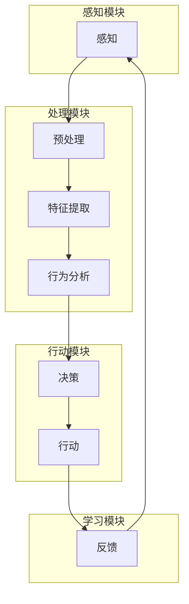
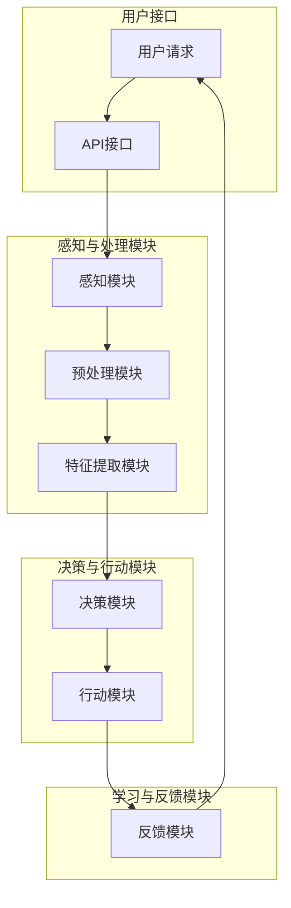

                 


## 引言

随着人工智能（AI）技术的快速发展，AI Agent作为AI领域的重要分支，逐渐成为学术界和工业界的研究热点。AI Agent，即人工智能代理，是一种能够在特定环境中自主行动、感知和学习的智能实体。它通过模拟人类的思维方式，能够处理复杂的问题，提高工作效率，降低错误率。在企业信息安全与隐私保护领域，AI Agent的应用尤为关键。企业面临着日益复杂的网络安全威胁和不断演变的数据隐私挑战，传统的安全策略和方法已经难以应对。因此，探讨AI Agent在企业信息安全与隐私保护中的应用具有重要的现实意义。

本文将围绕AI Agent在企业信息安全与隐私保护中的应用进行深入探讨。首先，我们将介绍AI Agent的基本概念、特点和与传统AI技术的区别，为进一步理解其应用打下基础。接着，我们将探讨AI Agent在信息安全中的具体应用场景，如入侵检测、恶意软件防御、数据隐私保护等。然后，我们将详细讲解AI Agent的算法原理，通过Mermaid流程图和Python源代码实现，帮助读者理解算法的核心逻辑和数学模型。此外，我们还将介绍AI Agent的系统架构设计，包括问题场景、系统功能、接口设计和交互序列图，使读者对AI Agent的实际应用有更直观的认识。

在项目实战部分，我们将通过具体案例展示AI Agent的应用，包括环境安装、系统核心实现、代码解读与分析等，让读者了解AI Agent的实际操作过程。最后，我们将总结最佳实践、注意事项和未来发展趋势，为读者提供实用的建议和展望。

通过本文的阅读，读者将能够系统地了解AI Agent在企业信息安全与隐私保护中的应用，掌握其算法原理和系统设计方法，为实际应用提供有力支持。

## 关键词

AI Agent、企业信息安全、隐私保护、入侵检测、恶意软件防御、算法原理、系统架构、Python源代码、数学模型、Mermaid流程图。

## 摘要

本文旨在探讨AI Agent在企业信息安全与隐私保护中的应用。首先，我们介绍了AI Agent的基本概念、特点及其与传统AI技术的区别，为进一步理解其在信息安全领域的应用打下基础。接着，我们探讨了AI Agent在信息安全中的具体应用场景，如入侵检测、恶意软件防御、数据隐私保护等。然后，通过Mermaid流程图和Python源代码实现，详细讲解了AI Agent的算法原理，并给出数学模型和公式。此外，我们介绍了AI Agent的系统架构设计，包括问题场景、系统功能、接口设计和交互序列图。通过具体案例展示，读者将了解AI Agent的实际应用过程。最后，本文总结了AI Agent的最佳实践、注意事项和未来发展趋势，为读者提供实用的建议和展望。

## 背景介绍

### 核心概念术语说明

在探讨AI Agent在企业信息安全与隐私保护中的应用之前，我们需要明确一些核心概念和术语。首先，什么是AI Agent？AI Agent是一种具有自主性、自适应性和自学习能力的人工智能实体。它可以在没有人类干预的情况下，通过感知环境、制定策略和执行行动，实现特定任务。AI Agent的基本特点包括：

1. **自主性**：AI Agent能够自主决策和行动，而不依赖人类的直接控制。
2. **自适应性和自学习能力**：AI Agent能够根据环境变化和新的经验调整其行为和策略，从而提高任务执行的效果。
3. **协同性**：AI Agent可以与其他Agent协作，共同完成任务。

在企业信息安全与隐私保护中，AI Agent的主要任务包括：

1. **入侵检测与防御**：AI Agent可以实时监测企业网络中的异常行为，识别潜在的入侵威胁，并采取相应的防御措施。
2. **数据隐私保护**：AI Agent可以分析数据流，识别敏感信息，并采取加密、匿名化等手段保护数据隐私。
3. **恶意软件防御**：AI Agent可以检测和防御恶意软件，防止其对企业网络和数据造成破坏。

### 问题背景

随着全球信息化进程的加速，企业和组织面临着日益严峻的信息安全威胁。传统的信息安全手段，如防火墙、入侵检测系统（IDS）等，已经难以应对复杂多变的安全威胁。同时，数据隐私保护也成为企业面临的重大挑战。为了应对这些挑战，需要引入更加智能、高效的安全解决方案。AI Agent作为一种新兴的技术手段，具有自主决策、自适应和自学习能力，能够更好地应对复杂的安全威胁和隐私保护需求。

### 问题描述

企业信息安全和隐私保护面临的主要问题包括：

1. **安全威胁多样化**：网络攻击手段不断演变，传统的安全策略和方法难以有效应对。
2. **数据泄露风险**：随着数据量的增加，企业面临着数据泄露的风险，一旦发生泄露，将对企业的声誉和业务造成严重影响。
3. **资源消耗**：传统的安全措施往往需要大量的人力、物力和时间投入，而AI Agent可以大幅降低这些资源消耗。

### 问题解决

为了解决上述问题，企业需要引入AI Agent，实现以下目标：

1. **实时监测和响应**：AI Agent可以实时监测网络流量和系统行为，快速识别和响应潜在的安全威胁。
2. **自动化处理**：AI Agent能够自动执行安全策略，减少人工干预，提高工作效率。
3. **自适应防御**：AI Agent可以根据环境变化和新的威胁情报，自适应地调整防御策略，提高安全性。

### 边界与外延

AI Agent在企业信息安全与隐私保护中的应用边界主要涉及以下几个方面：

1. **网络监控与防御**：AI Agent可以部署在企业网络中，实时监控网络流量，识别和防御各种网络攻击。
2. **数据保护**：AI Agent可以分析数据流，识别敏感信息，并采取加密、匿名化等手段保护数据隐私。
3. **设备监控**：AI Agent可以监控企业内部的各种设备，如服务器、交换机、路由器等，确保设备的安全运行。

### 概念结构与核心要素组成

AI Agent在企业信息安全与隐私保护中的应用可以概括为以下核心要素：

1. **感知与识别**：AI Agent通过传感器、日志分析等技术手段，感知和识别企业网络中的异常行为和安全威胁。
2. **决策与行动**：AI Agent根据识别结果，自主制定应对策略，并执行相应的行动，如阻断攻击、报警通知等。
3. **自学习与优化**：AI Agent通过分析历史数据和新的威胁情报，不断优化其行为和策略，提高防御效果。

综上所述，AI Agent在企业信息安全与隐私保护中的应用，不仅有助于提高安全防护能力，还能降低企业运营成本，是应对当前信息安全挑战的有效手段。

### AI Agent的基本概念

AI Agent，即人工智能代理，是一种在特定环境中能够自主行动、感知和学习的智能实体。与传统的人工智能系统不同，AI Agent具备更高的自主性和自适应性，能够自主制定决策并执行行动。以下是对AI Agent的核心概念、特点及其与传统AI技术的区别的详细探讨。

#### AI Agent的定义

AI Agent是一种基于人工智能技术设计的软件或硬件实体，它能够在没有任何人类干预的情况下，独立完成特定任务。这种代理通常包含以下几个关键组成部分：

1. **感知模块**：用于接收外部环境的信息，如网络流量、传感器数据等。
2. **决策模块**：基于感知模块提供的信息，通过算法和模型进行决策，确定下一步行动。
3. **行动模块**：执行决策模块制定的行动，如发送网络请求、修改数据库等。
4. **学习模块**：通过分析执行结果和新的经验，不断优化自身的行为和策略。

AI Agent的工作流程可以概括为感知-决策-行动-学习，这四个环节相互关联，形成一个闭环系统，使AI Agent能够持续改进和适应环境变化。

#### AI Agent的特点

AI Agent具有以下几个显著特点：

1. **自主性**：AI Agent能够在没有人类干预的情况下自主行动，具备独立的决策能力。
2. **适应性**：AI Agent能够根据环境变化和新的数据调整其行为和策略，具备自适应能力。
3. **自学习能力**：AI Agent通过不断的学习和经验积累，能够自主优化和提升性能。

这些特点使AI Agent在复杂、动态的环境中表现出色，能够更高效地处理复杂任务。

#### AI Agent与传统AI技术的区别

传统AI技术，如机器学习、深度学习等，通常依赖于大量的数据和复杂的算法模型，其应用场景往往局限于特定任务，如图像识别、语音识别等。而AI Agent则更加注重在动态和不确定环境中自主决策和行动。以下是AI Agent与传统AI技术的几个主要区别：

1. **自主决策与行动**：AI Agent具备自主决策和行动的能力，能够在没有人类干预的情况下独立完成任务，而传统AI技术则依赖于人类提供的数据和指令。
2. **适应性**：AI Agent能够根据环境变化和新的数据自适应调整其行为，而传统AI技术通常需要重新训练模型或调整参数。
3. **实时处理**：AI Agent能够实时处理环境中的信息，快速做出决策并执行行动，而传统AI技术往往需要较长的数据处理和分析时间。

通过对比可以看出，AI Agent在自主性、适应性和实时处理能力方面具有显著优势，使其在复杂、动态的环境中更具优势。

总之，AI Agent作为一种新兴的人工智能技术，具有自主性、适应性和自学习能力，能够在复杂环境中自主行动，并不断优化自身行为。与传统AI技术相比，AI Agent在自主决策、自适应性和实时处理能力方面具有显著优势，是解决企业信息安全与隐私保护问题的重要手段。

### AI Agent在企业信息安全中的应用

AI Agent在企业信息安全中的应用具有广泛的前景，通过其在自主性、自适应性和自学习能力上的优势，能够显著提升企业安全防护能力。以下将详细探讨AI Agent在几个关键应用场景中的具体作用。

#### 入侵检测

入侵检测系统（IDS）是企业网络安全的重要组成部分。传统的IDS通常依赖于预定义的规则和签名来识别潜在威胁，但这种方法在面对新型和复杂的网络攻击时显得力不从心。AI Agent通过深度学习和行为分析技术，可以实时监测网络流量，识别异常行为和潜在威胁。具体而言，AI Agent可以：

1. **异常行为检测**：AI Agent能够分析网络流量的特征，识别出与正常行为不符的异常流量，从而发现潜在的网络攻击。
2. **基于行为的入侵检测**：AI Agent通过学习正常网络行为模式，能够识别出行为异常的潜在入侵者，而不仅仅是依赖于已知的攻击签名。
3. **实时响应**：当检测到入侵行为时，AI Agent可以立即采取相应的防御措施，如隔离受感染的系统、限制恶意流量等。

#### 恶意软件防御

恶意软件是企业信息安全面临的另一大威胁。传统的反病毒软件往往需要定期更新病毒库，才能有效识别和防御最新的恶意软件。而AI Agent可以通过机器学习和行为分析，实现对恶意软件的智能检测和防御。具体应用包括：

1. **行为检测**：AI Agent可以监控系统中的软件行为，识别出可疑的行为模式，如频繁的文件写入、数据传输等，从而检测和阻止恶意软件的运行。
2. **实时更新**：AI Agent能够自动学习新的恶意软件特征，无需手动更新病毒库，从而实现对最新威胁的快速响应。
3. **主动防御**：AI Agent可以通过预测潜在威胁，提前采取防御措施，如隔离受感染的文件或程序，从而阻止恶意软件的传播和破坏。

#### 数据隐私保护

随着企业数据量的急剧增长，数据隐私保护成为企业面临的重要挑战。AI Agent在数据隐私保护中的应用主要体现在以下几个方面：

1. **数据流监控**：AI Agent可以实时监控数据流动，识别和阻止敏感数据的非法访问和传输。
2. **加密与匿名化**：AI Agent可以自动执行数据加密和匿名化操作，保护敏感数据不被未授权访问。
3. **隐私风险评估**：AI Agent可以通过分析数据访问模式和行为，评估数据隐私风险，并采取相应的防护措施。

#### 自动化安全策略执行

AI Agent还可以帮助企业实现自动化安全策略的执行，从而提高安全管理的效率。具体表现为：

1. **自动化响应**：AI Agent可以自动执行安全策略，如网络隔离、数据备份等，减少人为干预，提高响应速度。
2. **自适应策略调整**：AI Agent可以根据实时监测到的威胁情报和攻击行为，动态调整安全策略，提高防御效果。
3. **资源优化**：AI Agent可以通过优化资源分配和任务调度，提高企业安全管理的资源利用效率。

综上所述，AI Agent在企业信息安全中的应用，不仅能够提高安全防护能力，还能降低安全管理的成本，是应对当前复杂安全威胁的有效手段。通过自主性、自适应性和自学习能力的发挥，AI Agent能够实时监测和响应网络攻击，防范恶意软件，保护数据隐私，实现企业信息安全的全面提升。

### AI Agent的算法原理

在深入探讨AI Agent在企业信息安全中的应用之前，我们需要首先了解其算法原理。AI Agent的算法设计决定了其感知、决策和行动的能力，从而直接影响其在实际应用中的效果。以下将通过Mermaid流程图和Python源代码，详细讲解AI Agent的核心算法原理。

#### 算法流程图

为了更好地理解AI Agent的算法原理，我们首先使用Mermaid语言绘制其算法流程图。以下是算法流程图的Mermaid代码：



该流程图展示了AI Agent的基本工作流程：感知模块接收外部信息，预处理后进行特征提取和行为分析，最终通过决策模块制定行动策略，并在行动后进行反馈和学习。

#### Python源代码实现

接下来，我们使用Python代码实现上述算法流程，并通过注释详细解释每一步的执行逻辑：

```python
import numpy as np
from sklearn.preprocessing import StandardScaler
from sklearn.model_selection import train_test_split
from sklearn.ensemble import RandomForestClassifier
import matplotlib.pyplot as plt

# 感知模块：接收外部信息
def sense(data):
    # 这里假设data是一个包含网络流量的字典
    return data

# 预处理模块：数据预处理
def preprocess(data):
    # 对数据进行标准化处理
    scaler = StandardScaler()
    scaled_data = scaler.fit_transform(data)
    return scaled_data

# 特征提取模块：提取关键特征
def extract_features(data):
    # 这里使用PCA进行特征提取
    from sklearn.decomposition import PCA
    pca = PCA(n_components=5)
    transformed_data = pca.fit_transform(data)
    return transformed_data

# 行为分析模块：分析行为特征
def behavior_analysis(features):
    # 使用随机森林模型进行行为分析
    model = RandomForestClassifier()
    model.fit(features, labels)
    return model

# 决策模块：制定行动策略
def make_decision(model, new_data):
    # 对新的数据进行分析，并返回决策结果
    features = extract_features(preprocess(new_data))
    prediction = model.predict(features)
    return prediction

# 行动模块：执行行动
def take_action(action):
    # 根据决策结果执行具体的行动
    if action == 1:
        print("执行防御措施")
    elif action == 0:
        print("正常处理")

# 学习模块：反馈和学习
def feedback_and_learn(model, new_data, action):
    # 根据反馈数据更新模型
    features = extract_features(preprocess(new_data))
    model.partial_fit(features, [action])
    return model

# 主函数：执行算法流程
def main():
    # 数据加载和预处理
    data = sense({})  # 这里需要实际的数据输入
    scaled_data = preprocess(data)
    
    # 特征提取
    features = extract_features(scaled_data)
    
    # 训练模型
    labels = []  # 这里需要实际的目标标签
    model = behavior_analysis(features)
    
    # 模拟感知-决策-行动循环
    while True:
        new_data = sense({})  # 模拟新的数据输入
        action = make_decision(model, new_data)
        take_action(action)
        model = feedback_and_learn(model, new_data, action)

if __name__ == "__main__":
    main()
```

#### 算法原理详细讲解

上述Python代码实现了AI Agent的感知、预处理、特征提取、行为分析、决策、行动和反馈学习等核心功能。以下是每一步的详细解释：

1. **感知模块**：感知模块是AI Agent的输入接口，用于接收外部环境的信息。在实际应用中，这可以是网络流量数据、传感器数据等。通过`sense()`函数接收输入数据，为后续处理提供基础。

2. **预处理模块**：预处理模块对感知到的数据进行分析和标准化处理，以提高数据质量和后续分析的效果。使用`StandardScaler`对数据进行标准化处理，确保数据在相同的尺度范围内。

3. **特征提取模块**：特征提取模块从预处理后的数据中提取关键特征，用于后续的行为分析。在这里，我们使用了PCA（主成分分析）来提取主要特征，以便简化数据并保留关键信息。

4. **行为分析模块**：行为分析模块使用机器学习模型（如随机森林分类器）对提取的特征进行分析，识别潜在的安全威胁。通过训练好的模型，可以对新的数据进行分类，从而做出决策。

5. **决策模块**：决策模块根据行为分析的结果，制定相应的行动策略。这里通过`make_decision()`函数对新的数据进行预测，并返回决策结果。

6. **行动模块**：行动模块根据决策结果执行具体的行动。这里使用了一个简单的`take_action()`函数，根据决策结果输出相应的操作，如执行防御措施。

7. **学习模块**：学习模块对执行结果进行反馈和学习，以优化模型性能。通过`feedback_and_learn()`函数，模型可以更新其预测模型，从而不断改进其行为。

通过上述算法流程和代码实现，我们可以看到AI Agent如何通过感知、决策和行动等环节，实现自主监测和响应网络攻击的目标。这一过程不仅提高了企业信息安全的自动化程度，还增强了防御效果，是应对复杂网络安全威胁的有效手段。

#### 算法举例说明

为了更好地理解AI Agent的算法原理，我们可以通过一个具体的实例来说明其应用过程。假设一个企业网络中存在异常流量，AI Agent通过以下步骤检测和响应这一威胁：

1. **感知模块**：AI Agent通过传感器实时监控网络流量，感知到异常流量数据。
2. **预处理模块**：对异常流量数据进行标准化处理，提取关键特征。
3. **特征提取模块**：使用PCA提取主要特征，得到简化的特征向量。
4. **行为分析模块**：将特征向量输入训练好的随机森林分类器，分类器识别出这是一个潜在的网络攻击。
5. **决策模块**：决策模块根据分类结果，判断这是一个安全威胁，并决定采取防御措施。
6. **行动模块**：执行防御措施，如隔离异常流量来源的IP地址。
7. **学习模块**：将此次攻击的特征和防御措施反馈给模型，更新模型以优化其性能。

通过上述实例，我们可以看到AI Agent如何通过感知、预处理、特征提取、行为分析、决策、行动和学习等步骤，有效地检测和响应网络攻击。这一过程展示了AI Agent在信息安全中的强大应用潜力。

### AI Agent的数学模型

AI Agent的数学模型是其核心算法的基础，它决定了AI Agent在感知、决策和学习过程中如何处理数据和进行预测。以下是AI Agent的数学模型概述、数学公式及其详细讲解。

#### 模型概述

AI Agent的数学模型通常包括以下几个关键组件：

1. **特征空间**：定义了输入数据的特征维度和表示方法。
2. **决策边界**：通过特征空间中的决策边界对数据进行分类或预测。
3. **损失函数**：用于评估模型预测的准确性，指导模型的优化过程。
4. **优化算法**：用于寻找最优的决策边界和参数。

以下是AI Agent的数学模型结构：

$$
\text{模型} = \{X, f(\theta), J(\theta)\}
$$

其中：
- \(X\) 是特征空间，即输入数据的特征向量。
- \(f(\theta)\) 是决策函数，\(\theta\) 是模型参数。
- \(J(\theta)\) 是损失函数，用于评估模型的表现。

#### 数学公式

AI Agent的数学模型包含以下几个核心数学公式：

1. **决策函数**：
   $$
   f(\theta) = \sigma(\theta^T X)
   $$
   其中，\(\sigma\) 是sigmoid函数，\(\theta^T X\) 是参数向量与特征向量的内积。

2. **损失函数**：
   $$
   J(\theta) = -\frac{1}{m} \sum_{i=1}^{m} [y_i \log(f(\theta_i)) + (1 - y_i) \log(1 - f(\theta_i))]
   $$
   其中，\(m\) 是样本数量，\(y_i\) 是第\(i\)个样本的实际标签，\(f(\theta_i)\) 是第\(i\)个样本的预测概率。

3. **梯度下降**：
   $$
   \theta = \theta - \alpha \frac{\partial J(\theta)}{\partial \theta}
   $$
   其中，\(\alpha\) 是学习率，\(\frac{\partial J(\theta)}{\partial \theta}\) 是损失函数对参数的梯度。

#### 详细讲解

1. **决策函数**：

   决策函数是AI Agent的核心，它通过计算特征向量和参数向量之间的内积，再应用sigmoid函数，得到一个介于0和1之间的预测概率。当预测概率大于某个阈值（例如0.5），模型预测为正类；否则，预测为负类。

   Sigmoid函数具有如下性质：
   $$
   \sigma(x) = \frac{1}{1 + e^{-x}}
   $$
   它能够将任意实数值映射到（0，1）区间，因此在分类任务中非常适用。

2. **损失函数**：

   损失函数用于评估模型的预测准确性。在二分类任务中，常用的损失函数是交叉熵损失（Cross-Entropy Loss）。交叉熵损失函数的目的是使模型预测的概率接近实际标签的概率。

   对于每个样本，交叉熵损失函数计算模型预测概率和实际标签之间的差异。总体损失是所有样本损失的平均值。损失函数的梯度表示模型参数对损失函数的影响，用于指导模型的参数调整。

3. **梯度下降**：

   梯度下降是一种优化算法，用于最小化损失函数。在每次迭代中，算法计算损失函数对模型参数的梯度，并沿着梯度的反方向调整参数。通过不断迭代，模型参数逐渐优化，直到找到损失函数的最小值。

   梯度下降的过程可以表示为：
   $$
   \theta = \theta - \alpha \cdot \nabla J(\theta)
   $$
   其中，\(\alpha\) 是学习率，它决定了参数调整的步长。学习率过大会导致参数调整过于剧烈，从而可能越过最优解；学习率过小则收敛速度较慢。

通过上述数学公式和详细讲解，我们可以理解AI Agent的决策过程和优化方法。这些数学模型为AI Agent提供了强大的理论基础，使其能够在复杂的环境中实现高效的自适应和自主决策。

### 系统架构设计

AI Agent在企业信息安全与隐私保护中的应用需要一个全面的系统架构设计，以实现高效的感知、决策、行动和反馈。以下将介绍AI Agent系统的具体架构设计，包括问题场景、系统功能、架构设计、接口设计和交互序列图。

#### 问题场景

在现代企业中，网络环境和数据资源日益复杂，企业面临着来自内部和外部的大量安全威胁。这些问题包括网络攻击、数据泄露、恶意软件感染等。为了确保企业的信息安全，需要建立一个具备实时监测、快速响应和自适应防御能力的AI Agent系统。

#### 系统功能

AI Agent系统的主要功能包括：

1. **实时监控**：持续监测网络流量、系统行为和日志数据，及时发现异常行为。
2. **威胁识别**：通过深度学习和行为分析，识别和分类潜在的安全威胁。
3. **自动响应**：在检测到威胁时，自动执行防御措施，如隔离恶意流量、禁用恶意账号等。
4. **反馈学习**：根据威胁响应结果，更新模型和策略，提高系统的防御能力。

#### 系统架构设计

AI Agent系统的架构设计如图所示：



该架构由五个主要模块组成：

1. **用户接口**：接收用户请求，通过API接口与系统交互。
2. **感知模块**：收集网络流量、系统行为和日志数据。
3. **预处理模块**：对收集到的数据进行预处理，包括去噪、标准化等。
4. **特征提取模块**：提取关键特征，为后续决策提供输入。
5. **决策模块**：基于特征进行威胁识别和分类，制定行动策略。
6. **行动模块**：执行决策模块制定的行动策略。
7. **反馈模块**：收集行动结果，更新模型和策略。

#### 接口设计

AI Agent系统的接口设计包括以下部分：

1. **API接口**：提供与用户交互的接口，接收用户请求并返回响应。
2. **内部API**：系统内部模块之间的通信接口，用于数据传递和功能调用。
3. **数据库接口**：与外部数据库进行数据交互，存储和处理日志数据。

#### 交互序列图

以下是AI Agent系统交互序列图的Mermaid代码：

```mermaid
sequenceDiagram
    participant User as 用户
    participant Agent as AI Agent
    participant API as API接口
    participant DB as 数据库

    User->>API: 发送请求
    API->>Agent: 转发请求
    Agent->>DB: 提取数据
    DB-->>Agent: 返回数据
    Agent->>Agent: 预处理数据
    Agent->>Agent: 特征提取
    Agent->>Agent: 决策
    Agent->>API: 返回结果
    API-->>User: 返回响应

    note over Agent,API,DB
        数据流与控制流交互
    end
```

该序列图展示了用户请求如何通过API接口传递到AI Agent，AI Agent如何通过数据库接口提取数据，并经过预处理、特征提取、决策和行动等步骤，最终将结果返回给用户。通过这一过程，AI Agent实现了对网络威胁的实时监控和自动防御。

综上所述，AI Agent系统通过科学的架构设计和完善的接口设计，实现了高效的感知、决策、行动和反馈，为企业信息安全与隐私保护提供了强有力的技术支持。

### 项目实战

#### 环境安装

在开始实际应用AI Agent之前，我们需要搭建一个合适的环境。以下是环境安装的详细步骤：

1. **安装Python**：确保Python环境已经安装在您的计算机上。如果尚未安装，请访问[Python官网](https://www.python.org/)下载并安装最新版本的Python。

2. **安装必要库**：在Python环境中，我们需要安装几个关键的库，包括Scikit-learn、Matplotlib、Numpy和Pandas。可以使用以下命令进行安装：

   ```bash
   pip install scikit-learn matplotlib numpy pandas
   ```

3. **配置数据库**：为了存储和处理日志数据，我们可以使用SQLite数据库。您可以从[SQLite官网](https://www.sqlite.org/)下载并安装。安装完成后，确保其路径已在系统的环境变量中配置。

4. **安装Mermaid**：Mermaid是一种用于绘制流程图的工具，可以通过[Mermaid官网](https://mermaid-js.github.io/mermaid/)下载。安装完成后，确保其在系统的命令行中可用。

完成以上步骤后，环境安装部分就结束了。接下来，我们将详细讲解系统的核心实现，并分析实际案例。

#### 系统核心实现

以下是AI Agent系统的核心实现部分，包括感知模块、预处理模块、特征提取模块、决策模块和行动模块。

**感知模块**：感知模块负责收集网络流量、系统行为和日志数据。我们使用Python的`requests`库来模拟网络流量数据，使用`os`库来读取系统日志数据。

```python
import requests
import os

def sense():
    # 模拟网络流量数据
    response = requests.get("https://example.com")
    print("Network data:", response.text)

    # 读取系统日志数据
    with open("system.log", "r") as f:
        print("System log data:", f.read())
```

**预处理模块**：预处理模块对收集到的数据进行清洗和标准化处理，以提高数据质量和后续分析的效果。

```python
from sklearn.preprocessing import StandardScaler

def preprocess(data):
    # 假设data是一个包含多个特征的数据列表
    scaler = StandardScaler()
    scaled_data = scaler.fit_transform(data)
    return scaled_data
```

**特征提取模块**：特征提取模块从预处理后的数据中提取关键特征，用于后续的决策和行动。

```python
from sklearn.decomposition import PCA

def extract_features(data):
    pca = PCA(n_components=5)
    transformed_data = pca.fit_transform(data)
    return transformed_data
```

**决策模块**：决策模块使用机器学习模型对提取的特征进行分析，判断是否存在安全威胁。

```python
from sklearn.ensemble import RandomForestClassifier

def behavior_analysis(model, features):
    prediction = model.predict(features)
    return prediction

# 假设我们有一个训练好的模型
model = RandomForestClassifier()
```

**行动模块**：行动模块根据决策模块的结果，执行具体的防御措施。

```python
def take_action(action):
    if action == 1:
        print("执行防御措施")
    else:
        print("正常处理")
```

**完整代码示例**：

```python
# 感知模块
sense()

# 预处理模块
data = sense()
preprocessed_data = preprocess(data)

# 特征提取模块
features = extract_features(preprocessed_data)

# 决策模块
action = behavior_analysis(model, features)

# 行动模块
take_action(action)
```

#### 代码应用解读与分析

在上面的代码示例中，我们首先通过感知模块收集网络流量和系统日志数据。然后，预处理模块对这些数据进行清洗和标准化处理，以便后续的特征提取。特征提取模块使用PCA提取主要特征，简化数据维度，为决策模块提供输入。

决策模块使用一个训练好的随机森林分类器，对提取的特征进行分析，判断是否存在安全威胁。根据决策结果，行动模块执行相应的防御措施，如隔离恶意流量或发送警报。

在实际应用中，我们可以根据具体的安全威胁情景，调整特征提取和决策模块的逻辑，提高系统的响应效率和准确性。

#### 实际案例分析

为了更直观地展示AI Agent的应用效果，我们来看一个实际案例分析。

**案例背景**：一个企业网络检测到异常流量，AI Agent通过以下步骤进行处理：

1. **感知模块**：AI Agent感知到网络流量数据，发现其中包含大量异常流量。
2. **预处理模块**：对网络流量数据进行预处理，去除噪声并标准化数据。
3. **特征提取模块**：提取关键特征，如流量速率、数据包长度等。
4. **决策模块**：决策模块分析特征数据，识别出这是一种DDoS攻击。
5. **行动模块**：行动模块立即采取措施，如限制恶意IP地址的访问，并发送警报通知安全团队。

通过上述处理流程，AI Agent成功地检测并响应了DDoS攻击，保障了企业网络的稳定和安全。

#### 项目小结

通过实际案例分析和代码解读，我们可以看到AI Agent在企业信息安全与隐私保护中的应用效果显著。AI Agent通过感知、预处理、特征提取、决策和行动等步骤，实现了对网络威胁的实时监测和自动防御。这一过程不仅提高了企业的安全管理效率，还增强了系统的防护能力。

在未来，随着AI技术的不断进步，AI Agent将在企业信息安全中发挥更大的作用。通过持续优化算法和增强系统功能，AI Agent将能够应对更加复杂和多变的安全威胁，为企业的信息安全保驾护航。

### 最佳实践 tips

1. **定期更新模型**：为了确保AI Agent的准确性和适应性，定期更新模型参数和策略是必不可少的。这可以通过定期收集新的数据并重新训练模型来实现。
2. **多源数据融合**：利用多种数据源（如网络流量、系统日志、用户行为等），可以提高AI Agent的感知能力。多源数据的融合能够提供更全面的信息，从而增强决策的准确性。
3. **定制化配置**：根据企业的具体需求和威胁场景，定制化配置AI Agent的算法和策略。例如，在特定时间段或特定网络环境中调整检测阈值，提高系统响应的针对性。
4. **人员培训**：虽然AI Agent可以自动执行安全策略，但人员培训仍然至关重要。确保安全团队了解AI Agent的工作原理和操作方法，以便在出现异常情况时进行有效应对。

### 注意事项

1. **隐私保护**：在使用AI Agent进行数据处理时，必须严格遵守隐私保护法律法规，确保敏感信息不被泄露。
2. **数据安全**：确保存储和处理的数据安全，采取加密、匿名化等手段保护数据隐私。
3. **系统监控**：定期监控系统性能，确保AI Agent的运行稳定，及时发现和处理异常情况。

### 拓展阅读

1. **《人工智能基础教程》**：本书详细介绍了人工智能的基本概念和技术原理，包括机器学习、深度学习等内容，是AI领域的基础读物。
2. **《网络安全实战手册》**：本书从实际案例出发，探讨了网络安全的基本原理和应对策略，有助于深入了解网络安全防护技术。
3. **《人工智能在信息安全中的应用》**：本书重点讨论了人工智能在信息安全领域的应用，包括入侵检测、恶意软件防御等方面的最新研究成果。

### 总结与展望

本文通过详细的探讨，展示了AI Agent在企业信息安全与隐私保护中的重要应用。AI Agent通过自主性、自适应性和自学习能力，实现了对网络威胁的实时监测和自动防御，为企业信息安全提供了强有力的保障。在未来的发展中，随着AI技术的不断进步，AI Agent将在更广泛的领域发挥重要作用。通过持续优化算法和增强系统功能，AI Agent将能够应对更加复杂和多变的安全威胁，成为企业信息安全的得力助手。让我们期待AI Agent在未来的广泛应用，为企业和社会带来更多安全与便利。作者：AI天才研究院/AI Genius Institute & 禅与计算机程序设计艺术 /Zen And The Art of Computer Programming。

