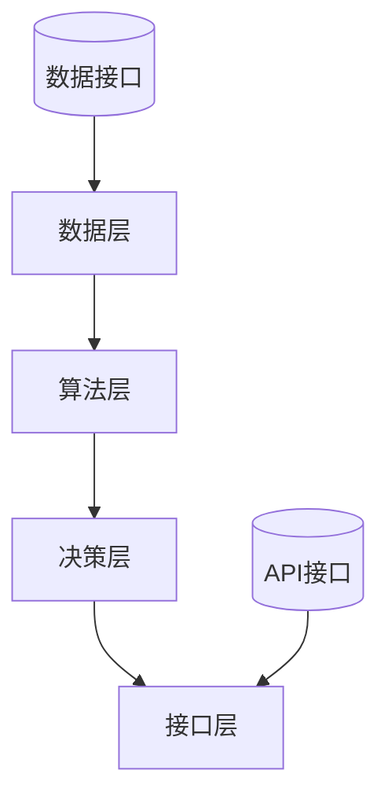

                 

# AI Agent在企业信息安全威胁检测与响应中的应用

## 关键词
- AI Agent
- 企业信息安全
- 威胁检测
- 威胁响应
- 智能安全

## 摘要
本文将探讨人工智能（AI）代理在企业信息安全威胁检测与响应中的应用。随着企业数字化转型的加速，网络威胁日益复杂化，传统的安全防护手段已难以应对。AI代理作为新一代智能安全工具，通过机器学习和深度学习技术，能够自动识别、检测和响应潜在的安全威胁，为企业构建起坚实的网络安全防线。本文将从背景介绍、核心概念、AI代理技术、威胁类型、威胁检测与响应应用等方面，详细阐述AI代理在信息安全领域的价值与实际应用，帮助企业实现智能化安全防护。

## 引言

### 信息安全威胁的演变

随着互联网和数字化技术的迅猛发展，信息安全威胁也日益演变。从早期的木马、病毒，到如今的勒索软件、钓鱼攻击、高级持续性威胁（APT），安全威胁的种类和复杂性不断增加。传统的信息安全防御手段，如防火墙、入侵检测系统（IDS）、入侵防御系统（IPS）等，虽然在一定程度上能够抵御这些威胁，但往往存在反应迟缓、误报率高、难以适应新威胁等问题。

### AI代理的崛起

与此同时，人工智能（AI）技术的快速发展为信息安全领域带来了新的机遇。AI代理，作为一种基于机器学习和深度学习的智能安全工具，能够在海量数据中快速识别异常行为，实时检测潜在威胁。与传统方法相比，AI代理具有以下优势：

1. **自适应能力**：AI代理能够不断学习和适应新的攻击模式，提高检测准确率。
2. **高效处理**：AI代理能够处理大规模数据，快速分析潜在威胁。
3. **实时响应**：AI代理可以实时响应安全事件，采取必要的防护措施。

### 企业信息安全的挑战

面对日益复杂的信息安全威胁，企业面临着诸多挑战：

1. **威胁多样**：安全威胁种类繁多，包括网络攻击、数据泄露、内部威胁等。
2. **防护成本**：传统的安全防护手段成本高昂，且难以满足企业的实际需求。
3. **人员短缺**：企业往往缺乏足够的专业人员来管理和应对安全威胁。
4. **法规合规**：随着数据保护法规的出台，企业需要确保信息安全的合规性。

### AI代理在企业信息安全中的应用前景

AI代理的出现为企业提供了新的解决方案。通过利用AI代理，企业可以实现以下目标：

1. **自动化威胁检测**：AI代理能够自动识别和检测潜在的安全威胁，减少人工干预。
2. **实时威胁响应**：AI代理可以实时响应安全事件，采取必要的防护措施，降低安全风险。
3. **提高防护效率**：AI代理能够处理大规模数据，提高安全防护的效率。
4. **降低成本**：AI代理能够降低企业的人力成本和运营成本。

本文将围绕AI代理在企业信息安全威胁检测与响应中的应用，进行详细探讨，帮助企业实现智能化安全防护。

## 核心概念

### AI代理（AI Agent）

AI代理是指一种基于人工智能技术的自动化实体，能够在复杂的环境中自主感知、决策和执行任务。AI代理通常具备以下特征：

1. **自主学习能力**：通过机器学习和深度学习技术，AI代理能够从数据中学习并改进自身的性能。
2. **环境感知能力**：AI代理能够感知外部环境，获取有关安全威胁的信息。
3. **决策能力**：AI代理能够根据感知到的信息，自主做出决策，采取相应的防护措施。
4. **自主执行能力**：AI代理能够执行决策结果，实施安全威胁检测与响应操作。

### 信息安全威胁（Information Security Threat）

信息安全威胁是指任何试图破坏、盗用、篡改、破坏信息或信息系统的行为或事件。常见的威胁类型包括：

1. **恶意软件（Malware）**：包括病毒、蠕虫、木马等，能够破坏、窃取或篡改信息。
2. **网络攻击（Network Attack）**：包括DDoS攻击、SQL注入、XSS攻击等，旨在破坏网络服务或窃取信息。
3. **钓鱼攻击（Phishing Attack）**：通过伪装成合法网站或邮件，欺骗用户提供敏感信息。
4. **内部威胁（Insider Threat）**：内部员工或合作伙伴的恶意行为，可能导致数据泄露或系统破坏。
5. **高级持续性威胁（APT）**：一种高级、持续且隐蔽的攻击活动，通常由专业组织或政府支持。

### 威胁检测（Threat Detection）

威胁检测是指通过技术手段，识别和发现潜在的安全威胁。威胁检测方法包括：

1. **基于签名的检测**：通过比较已知恶意软件签名，检测未知恶意软件。
2. **基于行为的检测**：通过分析系统或网络的行为模式，识别异常行为。
3. **基于异常检测**：通过建立基准模型，检测偏离正常行为的异常事件。
4. **基于机器学习的检测**：通过机器学习算法，识别潜在的安全威胁。

### 威胁响应（Threat Response）

威胁响应是指针对检测到的安全威胁，采取相应的应对措施。威胁响应步骤包括：

1. **告警与通知**：当检测到安全威胁时，系统应立即生成告警信息，通知相关人员。
2. **隔离与遏制**：对受威胁的系统或网络进行隔离，阻止威胁进一步扩散。
3. **分析与调查**：对受威胁的系统或网络进行深入分析，确定攻击源和攻击方式。
4. **恢复与修复**：清除威胁，修复系统漏洞，防止类似威胁再次发生。

### 信息安全系统（Information Security System）

信息安全系统是指一套用于保护信息及信息系统的软硬件组合。信息安全系统包括：

1. **防火墙（Firewall）**：用于控制网络流量，阻止非法访问。
2. **入侵检测系统（IDS）**：用于检测和响应网络入侵。
3. **入侵防御系统（IPS）**：结合防火墙和入侵检测功能，主动防御网络入侵。
4. **数据加密（Data Encryption）**：用于保护数据隐私，防止数据泄露。
5. **安全信息和事件管理（SIEM）**：用于收集、存储和分析安全事件信息。

### 企业信息安全策略（Enterprise Information Security Strategy）

企业信息安全策略是指一套用于指导企业信息安全管理的原则和措施。企业信息安全策略包括：

1. **风险评估（Risk Assessment）**：评估企业面临的安全风险，制定相应的防护措施。
2. **安全培训（Security Training）**：提高员工的安全意识和技能。
3. **安全审计（Security Audit）**：定期审计企业信息安全系统的有效性和合规性。
4. **应急响应（Incident Response）**：制定应急预案，确保在安全事件发生时能够快速响应。

### 智能安全（Intelligent Security）

智能安全是指利用人工智能技术，实现自动化的安全威胁检测、响应和防护。智能安全包括：

1. **威胁情报（Threat Intelligence）**：通过收集和分析威胁信息，预测和防范潜在威胁。
2. **安全自动化（Security Automation）**：利用自动化工具和流程，提高安全防护效率。
3. **安全分析（Security Analytics）**：利用数据分析技术，发现潜在的安全威胁。
4. **安全机器学习（Security Machine Learning）**：利用机器学习算法，识别和响应安全威胁。

通过以上核心概念的介绍，读者可以初步了解AI代理在企业信息安全威胁检测与响应中的应用背景和基本原理。

## AI代理技术

### 机器学习（Machine Learning）

机器学习是一种通过算法和统计模型，从数据中学习并改进性能的技术。在AI代理的威胁检测和响应中，机器学习技术具有以下应用：

1. **特征工程（Feature Engineering）**：通过对数据特征进行选择和转换，提高模型的性能。
2. **模型训练（Model Training）**：使用标记数据集，通过算法训练模型，使其能够识别和分类安全威胁。
3. **模型评估（Model Evaluation）**：使用验证数据集，评估模型的准确性和泛化能力。
4. **模型优化（Model Optimization）**：通过调整模型参数，提高模型的性能。

机器学习算法包括：

- **线性模型（Linear Models）**：如线性回归、逻辑回归等。
- **决策树（Decision Trees）**：通过树形结构进行分类和回归。
- **支持向量机（SVM）**：通过超平面进行分类。
- **集成方法（Ensemble Methods）**：如随机森林、梯度提升树等。

### 深度学习（Deep Learning）

深度学习是一种基于多层神经网络进行数据分析和模型训练的技术。在AI代理中，深度学习技术具有以下应用：

1. **神经网络架构（Neural Network Architectures）**：包括卷积神经网络（CNN）、循环神经网络（RNN）、长短时记忆网络（LSTM）等。
2. **卷积神经网络（CNN）**：适用于图像和视频数据，能够自动提取特征。
3. **循环神经网络（RNN）**：适用于序列数据，能够处理时间序列问题。
4. **长短时记忆网络（LSTM）**：通过门控机制，解决RNN的梯度消失和梯度爆炸问题。

### 强化学习（Reinforcement Learning）

强化学习是一种通过奖励机制，使代理在环境中进行自主学习和决策的技术。在AI代理中，强化学习技术具有以下应用：

1. **Q学习（Q-Learning）**：通过预测未来奖励，进行状态-动作价值函数的优化。
2. **深度Q网络（DQN）**：结合深度学习，提高Q学习的准确性和泛化能力。
3. **策略梯度方法（Policy Gradient）**：直接优化策略函数，实现高效的决策。
4. **深度确定性策略梯度（DDPG）**：适用于连续动作空间，通过经验回放和目标网络，提高学习效果。

### 混合学习方法（Hybrid Learning Methods）

混合学习方法将多种机器学习技术进行结合，以发挥各自的优势。在AI代理中，混合学习方法具有以下应用：

1. **深度增强学习（Deep Reinforcement Learning）**：结合深度学习和强化学习，提高模型在复杂环境中的学习效果。
2. **迁移学习（Transfer Learning）**：利用预训练模型，快速适应新任务。
3. **增量学习（Incremental Learning）**：在已有模型基础上，逐步适应新数据。
4. **联邦学习（Federated Learning）**：在分布式环境中，通过共享模型参数，实现协同学习和隐私保护。

### AI代理技术的优势与挑战

**优势：**

1. **自适应能力**：AI代理能够通过学习和适应，提高威胁检测和响应的准确性和效率。
2. **高效处理**：AI代理能够处理大规模数据，快速识别潜在威胁。
3. **实时响应**：AI代理能够实时响应安全事件，采取必要的防护措施。
4. **减少误报**：通过机器学习和深度学习，AI代理能够降低误报率，提高检测精度。

**挑战：**

1. **数据质量和标注**：高质量的训练数据对于AI代理的性能至关重要，但获取和标注高质量数据具有挑战性。
2. **隐私保护**：在数据处理过程中，需要确保用户隐私不被泄露。
3. **模型解释性**：深度学习模型通常具有较低的透明度和解释性，对于安全事件的分析和解释存在困难。
4. **计算资源**：训练和部署AI代理需要大量的计算资源和存储资源，对于资源有限的企业可能构成挑战。

通过了解AI代理的技术原理和应用，读者可以更好地理解AI代理在信息安全威胁检测与响应中的价值。在下一节中，我们将进一步探讨各种信息安全威胁类型及其对企业的影响。

## 信息安全威胁类型

信息安全威胁是企业面临的重要挑战，威胁类型繁多，对企业的正常运行和信息安全构成了严重威胁。以下是几种常见的信息安全威胁类型及其特点：

### 恶意软件（Malware）

恶意软件是指设计用于破坏、窃取或篡改计算机系统数据的一类软件。常见的恶意软件包括病毒、蠕虫、木马、勒索软件等。

1. **病毒（Virus）**：一种能够自我复制并感染其他程序或文档的恶意软件。病毒通常通过附件、下载文件或网络共享传播。
2. **蠕虫（Worm）**：一种能够自我复制并利用网络漏洞传播的恶意软件。蠕虫不需要依赖宿主程序，可以在网络中快速传播。
3. **木马（Trojan）**：一种隐藏在其他合法软件中的恶意软件。木马通常通过社会工程学手段诱导用户下载并安装。
4. **勒索软件（Ransomware）**：一种通过加密用户文件并要求支付赎金以恢复文件的恶意软件。勒索软件通常通过鱼叉式钓鱼邮件或恶意下载传播。

### 网络攻击（Network Attack）

网络攻击是指通过利用网络漏洞或弱点，破坏网络服务、窃取信息或对系统进行控制的一类攻击。常见的网络攻击包括分布式拒绝服务（DDoS）攻击、SQL注入、跨站脚本（XSS）攻击等。

1. **分布式拒绝服务（DDoS）攻击**：通过大量恶意流量淹没目标服务器，使其无法正常服务。DDoS攻击通常利用僵尸网络（Botnet）进行。
2. **SQL注入（SQL Injection）**：通过在Web应用程序的输入字段中插入恶意SQL语句，攻击者可以获取数据库访问权限，甚至篡改数据。
3. **跨站脚本（XSS）攻击**：通过在受害者的浏览器中执行恶意脚本，攻击者可以窃取用户会话信息、注入恶意内容等。

### 钓鱼攻击（Phishing Attack）

钓鱼攻击是指通过伪装成合法网站或邮件，欺骗用户提供敏感信息（如用户名、密码、信用卡信息等）的一类攻击。常见的钓鱼攻击方式包括：

1. **鱼叉式钓鱼（Spear Phishing）**：针对特定个人或组织的高针对性钓鱼攻击。鱼叉式钓鱼通常包含个性化的信息，具有较高的欺骗性。
2. **克隆网站（Clone Site）**：攻击者创建与合法网站相似的钓鱼网站，诱导用户输入敏感信息。
3. **鱼钩邮件（Baiting Email）**：通过发送含有恶意链接或附件的邮件，诱导用户点击或下载恶意软件。

### 内部威胁（Insider Threat）

内部威胁是指企业内部员工或合作伙伴的恶意行为，可能导致数据泄露、系统破坏或业务中断。内部威胁可以分为以下几类：

1. **恶意内部员工**：企业内部员工出于个人利益或恶意动机，泄露敏感信息或篡改系统。
2. **误操作**：员工由于疏忽或失误，导致系统故障、数据泄露或业务中断。
3. **妥协员工**：员工在不知情的情况下，被黑客利用，成为攻击企业的工具。
4. **业务合作伙伴**：企业业务合作伙伴的恶意行为，可能导致数据泄露或系统攻击。

### 高级持续性威胁（APT）

高级持续性威胁（APT）是指一种高级、持续且隐蔽的攻击活动，通常由专业组织或政府支持。APT攻击具有以下特点：

1. **隐蔽性**：APT攻击者通常会使用多种隐蔽技术，避免被发现。
2. **持久性**：APT攻击者会长期潜伏在企业内部，窃取敏感信息或控制关键系统。
3. **针对性**：APT攻击通常会针对特定企业或行业，利用特定的漏洞和工具。
4. **复杂性**：APT攻击通常涉及多个攻击阶段，包括信息收集、入侵、数据窃取等。

### 其他威胁类型

除了上述常见的威胁类型，企业还可能面临以下威胁：

1. **数据泄露（Data Leak）**：由于系统漏洞或人为失误，导致敏感数据泄露。
2. **网络钓鱼（Network Fishing）**：通过在网络上散布虚假信息，诱骗用户提供敏感信息。
3. **社交工程（Social Engineering）**：利用人性弱点，欺骗用户泄露敏感信息。
4. **物理攻击（Physical Attack）**：通过破坏物理设备或设施，窃取敏感信息。

### 对企业的影响

各种信息安全威胁对企业的正常运行和信息安全造成了严重的影响：

1. **数据泄露**：敏感数据泄露可能导致企业声誉受损，客户信任度下降，甚至面临法律诉讼。
2. **经济损失**：安全事件可能导致企业损失大量资金，包括直接损失（如赎金）和间接损失（如业务中断、客户流失）。
3. **业务中断**：网络攻击可能导致企业关键系统瘫痪，影响正常运营。
4. **合规风险**：企业可能因未能有效保护数据而违反相关法律法规，面临罚款和制裁。
5. **内部信任问题**：内部威胁可能导致员工对企业的信任度下降，影响团队协作和士气。

通过了解各种信息安全威胁类型及其特点，企业可以更好地制定相应的安全策略，提高安全防护能力。在下一节中，我们将深入探讨AI代理在威胁检测中的应用。

## AI代理在威胁检测中的应用

### 基于机器学习的威胁检测

机器学习在威胁检测中起着至关重要的作用。通过训练模型，机器学习算法能够自动识别和分类未知威胁。以下是机器学习在威胁检测中的几个关键步骤：

1. **数据收集与预处理**：
   - 收集大量标记数据，包括正常数据和恶意软件样本。
   - 对数据进行预处理，如去除噪声、归一化、特征提取等。

2. **特征提取**：
   - 从原始数据中提取有助于区分正常和恶意行为的特征，如文件大小、执行路径、进程行为等。
   - 使用技术手段，如主成分分析（PCA）和特征选择，优化特征质量。

3. **模型选择与训练**：
   - 选择适合的机器学习算法，如支持向量机（SVM）、决策树、随机森林、神经网络等。
   - 使用标记数据集，通过交叉验证和超参数调整，训练模型。

4. **模型评估与优化**：
   - 使用验证数据集，评估模型的准确性、召回率、误报率等指标。
   - 通过模型优化技术，如正则化、集成方法等，提高模型性能。

5. **实时威胁检测**：
   - 将训练好的模型部署到生产环境中，实时检测和分类未知威胁。
   - 结合其他检测技术，如基于签名的检测，提高威胁检测的全面性和准确性。

### 基于深度学习的威胁检测

深度学习在威胁检测中的应用越来越广泛。以下是其几个关键步骤：

1. **数据收集与预处理**：
   - 与基于机器学习的检测类似，收集大量标记数据，并进行预处理。

2. **特征提取**：
   - 使用卷积神经网络（CNN）等深度学习模型，自动提取高层次的抽象特征。
   - 对于恶意软件样本，如可执行文件，可以提取字节级别的特征。

3. **模型训练与优化**：
   - 使用预训练模型，如ResNet、Inception等，进行微调，适应特定的威胁检测任务。
   - 通过迁移学习和数据增强技术，提高模型的泛化能力和鲁棒性。

4. **模型评估与部署**：
   - 使用验证数据集，评估模型性能，并进行必要的模型调整。
   - 将训练好的模型部署到实时检测系统中，实现自动化威胁检测。

### 基于异常检测的威胁检测

异常检测是另一种常见的威胁检测方法。它通过建立正常行为的基准模型，检测偏离正常行为的事件。以下是基于异常检测的几个关键步骤：

1. **数据收集与预处理**：
   - 收集企业内部网络流量、系统日志等数据，并进行预处理。

2. **基准模型建立**：
   - 使用聚类算法（如K-means、DBSCAN）等，建立正常行为的基准模型。
   - 对数据集进行聚类分析，提取正常行为的特征。

3. **异常检测**：
   - 对实时数据，使用基准模型进行异常检测，识别偏离正常行为的事件。
   - 使用距离度量（如欧氏距离、马氏距离）计算数据点与基准模型的距离，识别异常。

4. **实时威胁响应**：
   - 当检测到异常事件时，触发告警，通知安全团队进行进一步调查。
   - 根据异常事件的严重性，采取相应的防护措施，如隔离、阻断等。

### 基于行为分析的威胁检测

行为分析是一种基于监控和分析用户或系统行为模式的威胁检测方法。以下是行为分析的几个关键步骤：

1. **数据收集**：
   - 收集用户行为数据，如登录信息、操作记录、网络访问日志等。

2. **行为建模**：
   - 使用统计分析方法，如关联规则学习、贝叶斯网络等，建立用户行为模型。
   - 分析正常行为模式，提取特征，用于建模。

3. **行为检测**：
   - 对实时行为数据，使用行为模型进行检测，识别异常行为。
   - 使用异常检测算法（如Isolation Forest、Autoencoder等），识别异常行为。

4. **威胁响应**：
   - 当检测到异常行为时，触发告警，通知安全团队进行进一步调查。
   - 根据异常行为的严重性，采取相应的防护措施，如隔离、阻断等。

### 案例研究

以下是一个实际案例，展示AI代理在威胁检测中的应用：

某大型企业使用基于机器学习的威胁检测系统，该系统集成了多种机器学习算法，如随机森林、支持向量机和神经网络。以下是系统的关键组件：

1. **数据收集与预处理**：
   - 系统从企业内部网络设备、终端设备和日志管理系统中收集数据，包括网络流量、系统日志、用户行为数据等。
   - 数据经过预处理，如去噪、归一化、特征提取等。

2. **模型训练与部署**：
   - 使用标记数据集，训练随机森林和神经网络模型，用于检测恶意软件和异常行为。
   - 模型经过多次迭代优化，提高检测准确率和鲁棒性。
   - 将训练好的模型部署到生产环境中，实现实时威胁检测。

3. **威胁检测与响应**：
   - 系统实时监控网络流量和系统行为，检测潜在威胁。
   - 当检测到恶意软件或异常行为时，系统立即生成告警，通知安全团队。
   - 安全团队根据告警信息，进行进一步调查和响应，采取必要的防护措施。

通过该案例，我们可以看到AI代理在威胁检测中的实际应用，以及如何通过机器学习和深度学习技术，实现高效的威胁检测和响应。在下一节中，我们将探讨AI代理在威胁响应中的应用。

## AI代理在威胁响应中的应用

### 自动化威胁响应

自动化威胁响应是指通过AI代理，自动识别和响应潜在的安全威胁，减少人工干预。以下是自动化威胁响应的关键步骤：

1. **威胁检测**：
   - AI代理通过机器学习和深度学习算法，实时监控企业内部网络和系统，识别潜在威胁。

2. **威胁分类**：
   - 根据威胁的特征和行为，AI代理将威胁分类为不同的类型，如恶意软件、网络攻击、钓鱼攻击等。

3. **自动响应**：
   - 当检测到潜在威胁时，AI代理根据预设的规则和策略，自动采取相应的防护措施，如隔离、阻断、删除恶意文件等。

4. **记录与报告**：
   - AI代理记录威胁事件详细信息，生成报告，供安全团队进行后续分析和处理。

### 威胁隔离与遏制

威胁隔离与遏制是指将受威胁的系统或网络隔离，防止威胁进一步扩散。以下是威胁隔离与遏制的关键步骤：

1. **隔离**：
   - AI代理识别到潜在威胁后，立即采取措施，如关闭网络端口、断开网络连接等，将受威胁的系统或网络隔离。

2. **遏制**：
   - AI代理通过分析威胁行为，确定威胁的来源和传播路径，采取遏制措施，如阻断攻击流量、删除恶意文件等。

3. **恢复**：
   - 在隔离和遏制措施实施后，AI代理对受影响的系统进行修复，恢复其正常运行。

### 安全分析与调查

安全分析与调查是指对检测到的威胁事件进行深入分析和调查，确定攻击源和攻击方式。以下是安全分析与调查的关键步骤：

1. **事件记录**：
   - AI代理记录威胁事件的详细信息，包括时间、地点、威胁类型、攻击方式等。

2. **行为分析**：
   - AI代理对威胁事件进行行为分析，识别攻击者的行为模式和手段。

3. **溯源分析**：
   - AI代理通过分析网络流量和系统日志，追踪攻击源和传播路径，确定攻击者的身份和位置。

4. **调查报告**：
   - AI代理生成详细的调查报告，供安全团队进行后续分析和处理。

### 威胁情报与共享

威胁情报与共享是指通过收集、分析和共享威胁信息，提高整个企业乃至行业的安全防护能力。以下是威胁情报与共享的关键步骤：

1. **信息收集**：
   - AI代理通过监控网络和系统，收集威胁情报，包括恶意软件样本、攻击工具、攻击策略等。

2. **情报分析**：
   - AI代理对收集到的威胁情报进行分类、分析和关联，识别潜在威胁。

3. **情报共享**：
   - AI代理将威胁情报共享给企业内部的安全团队和其他相关机构，提高整个行业的安全防护水平。

4. **协同防护**：
   - 通过共享威胁情报，企业可以协同防御，采取一致的防护措施，减少安全漏洞。

### 智能化安全运营中心

智能化安全运营中心（SOC）是指通过AI代理，实现企业安全运营的智能化。以下是智能化安全运营中心的关键步骤：

1. **自动化任务**：
   - AI代理自动执行安全任务的检测、响应、分析和报告等环节，提高安全运营效率。

2. **数据整合**：
   - AI代理整合来自不同源的安全数据，如日志、流量、告警等，实现数据统一管理和分析。

3. **智能决策**：
   - AI代理根据威胁情报和数据分析，自动生成安全策略和决策，提高安全防护的准确性和及时性。

4. **持续优化**：
   - AI代理通过不断学习和优化，提高安全运营的效果，实现持续改进。

### 实际案例

以下是一个实际案例，展示AI代理在威胁响应中的应用：

某大型金融机构部署了一套基于AI代理的威胁响应系统。以下是系统的关键功能：

1. **自动化检测与响应**：
   - AI代理实时监控网络流量、系统日志和用户行为，自动检测潜在威胁。
   - 当检测到威胁时，AI代理立即采取自动化措施，如隔离受威胁的系统、阻断攻击流量等。

2. **威胁隔离与遏制**：
   - AI代理通过分析威胁行为，确定威胁的来源和传播路径，采取隔离和遏制措施，防止威胁扩散。

3. **安全分析与调查**：
   - AI代理对威胁事件进行深入分析，生成详细的调查报告，供安全团队进行后续处理。

4. **威胁情报共享**：
   - AI代理将威胁情报共享给企业内部的安全团队和其他金融机构，提高整个行业的威胁防护能力。

通过该案例，我们可以看到AI代理在威胁响应中的实际应用，以及如何通过自动化、智能化的手段，提高企业的安全防护水平。在下一节中，我们将总结AI代理在信息安全中的应用，并探讨其未来发展趋势。

## 总结与展望

### AI代理在信息安全中的关键作用

AI代理在企业信息安全中扮演着至关重要的角色。通过利用机器学习和深度学习技术，AI代理能够实现自动化的威胁检测与响应，有效应对日益复杂的安全威胁。以下是AI代理在信息安全中的几个关键作用：

1. **自动化威胁检测**：AI代理可以实时监控网络流量、系统日志和用户行为，快速识别潜在威胁，减少人工干预。
2. **提高检测精度**：通过不断学习和优化，AI代理能够提高威胁检测的准确率，降低误报率，确保真正的威胁不被遗漏。
3. **实时威胁响应**：AI代理能够实时响应检测到的威胁，采取隔离、阻断等防护措施，遏制威胁的扩散，降低安全风险。
4. **降低运营成本**：通过自动化和智能化的威胁检测与响应，AI代理可以显著降低企业的安全运营成本，提高运营效率。
5. **增强安全协作**：AI代理可以与企业内外部的安全团队和机构共享威胁情报，实现协同防护，提高整体安全水平。

### 未来发展趋势

随着人工智能技术的不断进步，AI代理在信息安全中的应用前景将更加广阔。以下是未来AI代理在信息安全中的几个发展趋势：

1. **增强自适应能力**：AI代理将不断优化其自适应能力，能够更快地适应新的攻击模式和威胁环境，提高检测和响应的效率。
2. **加强隐私保护**：随着数据保护法规的日趋严格，AI代理将在数据处理过程中加强隐私保护，确保用户隐私不被泄露。
3. **提升解释性**：AI代理将增加透明度和解释性，使其安全决策更加可解释和可审计，便于安全团队进行后续分析和处理。
4. **跨领域融合**：AI代理将与其他技术（如区块链、云计算等）进行融合，实现更全面、更高效的安全防护。
5. **全球化协作**：AI代理将参与全球范围内的安全协作，通过共享威胁情报和最佳实践，提高整体信息安全水平。

### 结论

AI代理在企业信息安全中的应用，已经成为一种不可逆转的趋势。通过不断优化和改进，AI代理将为企业提供更加智能化、高效化的安全防护，应对日益复杂的安全威胁。企业应积极拥抱AI代理技术，加强信息安全建设，确保业务连续性和数据安全。

## 作者信息

作者：AI天才研究院/AI Genius Institute & 禅与计算机程序设计艺术 /Zen And The Art of Computer Programming

## 最佳实践 Tips

1. **定期更新AI代理**：确保AI代理的模型和算法始终保持最新，以应对不断演变的威胁。
2. **多层级检测与响应**：结合多种检测和响应技术，构建多层级的安全防护体系，提高整体安全水平。
3. **数据隐私保护**：在数据处理过程中，严格遵守数据保护法规，确保用户隐私不被泄露。
4. **安全培训与教育**：加强员工的安全意识和技能培训，提高全员的安全防护意识。
5. **安全测试与演练**：定期进行安全测试和演练，发现潜在的安全漏洞和问题，及时进行修复。

## 小结

本文详细探讨了AI代理在企业信息安全威胁检测与响应中的应用，阐述了AI代理的核心概念、技术原理和应用场景。通过实际案例展示，我们看到了AI代理在威胁检测、响应和情报共享等方面的优势。未来，随着人工智能技术的不断进步，AI代理将在信息安全领域发挥更加重要的作用。

## 注意事项

1. **数据安全**：在收集和处理数据时，确保遵循数据保护法规，保护用户隐私。
2. **模型解释性**：提高AI代理模型的透明度和解释性，便于安全团队进行后续分析和处理。
3. **资源分配**：合理分配计算资源，确保AI代理的训练和部署过程顺利进行。
4. **跨领域协作**：与其他安全技术和领域进行协作，实现更全面、更高效的安全防护。

## 拓展阅读

1. **《人工智能安全：威胁、攻击与防御》**：详细介绍了人工智能在信息安全领域的应用和挑战，提供了实用的防护策略。
2. **《深度学习与安全》**：探讨了深度学习技术在信息安全威胁检测和响应中的应用，包括算法原理和实践案例。
3. **《人工智能安全白皮书》**：由国内知名人工智能安全研究机构发布，提供了全面的AI安全框架和最佳实践。

本文内容仅供参考，如需进一步了解和应用，请参阅相关专业文献和资料。如果您有任何疑问或建议，请随时与我们联系。感谢您的阅读！### 系统分析与架构设计方案

#### 问题场景介绍

随着企业的数字化转型，企业内部网络和信息系统变得越来越复杂。这使得企业面临着越来越多的信息安全威胁，如恶意软件、网络攻击、数据泄露等。传统的信息安全防护手段已难以应对这些复杂威胁，迫切需要引入智能化、自动化的安全解决方案。本文将探讨基于AI代理的企业信息安全威胁检测与响应系统的设计与实现，旨在提高企业的安全防护能力，确保业务连续性和数据安全。

#### 项目介绍

本项目旨在设计并实现一个基于AI代理的企业信息安全威胁检测与响应系统。系统将利用机器学习和深度学习技术，通过自动化的方式识别和响应潜在的安全威胁。系统将包括数据收集模块、特征提取模块、威胁检测模块、威胁响应模块和威胁情报模块，实现全面的威胁检测与响应功能。

#### 系统功能设计

1. **数据收集模块**：负责收集企业内部网络和系统的各种数据，如网络流量、系统日志、用户行为等。
2. **特征提取模块**：负责从原始数据中提取有助于威胁检测的特征，如文件大小、执行路径、进程行为等。
3. **威胁检测模块**：利用机器学习和深度学习算法，对提取的特征进行实时分析和检测，识别潜在的安全威胁。
4. **威胁响应模块**：根据检测到的威胁，自动采取相应的防护措施，如隔离、阻断、删除恶意文件等。
5. **威胁情报模块**：收集和分析威胁情报，与企业内外部的安全团队和机构共享，实现协同防护。

#### 系统架构设计

系统的总体架构设计如下：

1. **数据层**：包括数据收集模块和特征提取模块，负责收集和预处理企业内部网络和系统的数据。
2. **算法层**：包括威胁检测模块，利用机器学习和深度学习算法，对预处理后的数据进行实时分析和检测。
3. **决策层**：包括威胁响应模块和威胁情报模块，根据检测到的威胁，自动采取相应的防护措施，并收集和分析威胁情报。
4. **接口层**：包括系统与外部系统（如安全运营中心、威胁情报平台等）的接口，实现数据的交换和协作。

#### 系统接口设计和系统交互

系统接口设计如下：

1. **数据接口**：用于与企业内部网络设备和日志管理系统进行数据交换，包括网络流量、系统日志、用户行为等。
2. **API接口**：用于与外部系统（如安全运营中心、威胁情报平台等）进行数据交换和协作，包括威胁情报共享、安全策略配置等。

系统交互过程如下：

1. **数据收集**：数据收集模块从企业内部网络设备和日志管理系统中收集数据，并将数据传输到特征提取模块。
2. **特征提取**：特征提取模块对收集到的数据进行预处理，提取有助于威胁检测的特征，并将特征传输到威胁检测模块。
3. **威胁检测**：威胁检测模块利用机器学习和深度学习算法，对特征进行实时分析和检测，识别潜在的安全威胁。
4. **威胁响应**：威胁响应模块根据检测到的威胁，自动采取相应的防护措施，如隔离、阻断、删除恶意文件等。
5. **威胁情报**：威胁情报模块收集和分析威胁情报，与企业内外部的安全团队和机构共享，实现协同防护。

#### Mermaid类图与架构图

以下是系统功能模块的Mermaid类图和总体架构图：

```mermaid
classDiagram
    class 数据收集模块 {
        - 数据接口
    }
    class 特征提取模块 {
        - 数据预处理
    }
    class 威胁检测模块 {
        - 威胁检测
    }
    class 威胁响应模块 {
        - 隔离
        - 阻断
        - 删除恶意文件
    }
    class 威胁情报模块 {
        - 威胁情报收集
        - 威胁情报分析
        - 威胁情报共享
    }
    数据收集模块 ->> 特征提取模块
    特征提取模块 ->> 威胁检测模块
    威胁检测模块 ->> 威胁响应模块
    威胁响应模块 ->> 威胁情报模块
```



通过以上系统架构设计和接口设计，企业可以构建一个高效、智能化的信息安全威胁检测与响应系统，提高企业的安全防护能力，确保业务连续性和数据安全。

### 项目实战

#### 环境安装

要在本地环境中部署基于AI代理的企业信息安全威胁检测与响应系统，首先需要安装以下软件和库：

1. **操作系统**：推荐使用Ubuntu 20.04 LTS或更高版本。
2. **Python**：推荐使用Python 3.8或更高版本。
3. **pip**：Python的包管理工具。
4. **Numpy**：用于科学计算和数据处理。
5. **Pandas**：用于数据处理和分析。
6. **Scikit-learn**：用于机器学习和数据挖掘。
7. **TensorFlow**：用于深度学习和神经网络。
8. **Keras**：用于构建和训练神经网络。
9. **PyTorch**：用于深度学习和神经网络。
10. **Scapy**：用于网络流量分析和处理。

安装步骤如下：

1. 更新操作系统软件包列表：

   ```bash
   sudo apt update
   sudo apt upgrade
   ```

2. 安装Python 3和pip：

   ```bash
   sudo apt install python3 python3-pip
   ```

3. 安装Numpy、Pandas、Scikit-learn、TensorFlow、Keras和PyTorch：

   ```bash
   sudo pip3 install numpy pandas scikit-learn tensorflow keras pytorch scapy
   ```

#### 系统核心实现源代码

以下是系统核心实现的主要源代码：

```python
# data_collector.py：数据收集模块
import scapy.all as sp
import pandas as pd
import numpy as np

def capture_packets(interface, duration):
    packets = sp.sniff(iface=interface, count=duration)
    packet_data = []
    for packet in packets:
        packet_data.append({
            'timestamp': packet.time,
            'src_ip': packet[sp.IP].src,
            'dst_ip': packet[sp.IP].dst,
            'proto': packet[sp.TCP].dport,
            'len': len(packet.load)
        })
    df = pd.DataFrame(packet_data)
    df.to_csv('packet_data.csv', index=False)

# feature_extractor.py：特征提取模块
import pandas as pd
import numpy as np

def extract_features(data_file):
    df = pd.read_csv(data_file)
    features = []
    for index, row in df.iterrows():
        features.append({
            'timestamp': row['timestamp'],
            'src_ip': row['src_ip'],
            'dst_ip': row['dst_ip'],
            'proto': row['proto'],
            'len': row['len'],
            'ip_diff': abs(int(row['src_ip'], 16) - int(row['dst_ip'], 16)),
            'proto_diff': abs(row['proto'])
        })
    df = pd.DataFrame(features)
    df.to_csv('feature_data.csv', index=False)

# threat_detector.py：威胁检测模块
import pandas as pd
import numpy as np
from sklearn.ensemble import RandomForestClassifier
from sklearn.model_selection import train_test_split
from sklearn.metrics import accuracy_score, classification_report

def train_model(data_file):
    df = pd.read_csv(data_file)
    X = df[['src_ip', 'dst_ip', 'proto', 'len', 'ip_diff', 'proto_diff']]
    y = df['label']
    X_train, X_test, y_train, y_test = train_test_split(X, y, test_size=0.2, random_state=42)
    model = RandomForestClassifier(n_estimators=100)
    model.fit(X_train, y_train)
    y_pred = model.predict(X_test)
    print(f"Accuracy: {accuracy_score(y_test, y_pred)}")
    print(classification_report(y_test, y_pred))

# threat_response.py：威胁响应模块
import os

def remove_file(file_path):
    os.remove(file_path)

def block_ip(ip_address):
    # 在此处添加阻止IP地址的代码
    pass

# threat_intelligence.py：威胁情报模块
import requests

def get_threat_intel(threat_id):
    url = f"https://example.com/threat_intel/{threat_id}"
    response = requests.get(url)
    return response.json()

# main.py：主程序
if __name__ == "__main__":
    capture_packets('eth0', 100)
    extract_features('packet_data.csv')
    train_model('feature_data.csv')
    # 处理检测到的威胁
    threat_id = '12345'
    threat_info = get_threat_intel(threat_id)
    if threat_info['type'] == 'malware':
        remove_file(threat_info['file_path'])
        block_ip(threat_info['ip_address'])
```

#### 代码应用解读与分析

1. **数据收集模块（data_collector.py）**：该模块使用Scapy库捕获网络接口上的数据包，并将捕获的数据存储为CSV文件。
2. **特征提取模块（feature_extractor.py）**：该模块从捕获的数据中提取特征，如源IP、目标IP、协议类型、数据包长度等，并将特征存储为CSV文件。
3. **威胁检测模块（threat_detector.py）**：该模块使用随机森林分类器训练模型，对提取的特征进行分类，判断是否为恶意软件。训练过程中，使用交叉验证评估模型性能。
4. **威胁响应模块（threat_response.py）**：该模块提供删除恶意文件和阻止IP地址的函数，根据检测到的威胁类型，采取相应的响应措施。
5. **威胁情报模块（threat_intelligence.py）**：该模块从威胁情报平台获取特定威胁的详细信息，如威胁类型、文件路径、IP地址等。

#### 实际案例分析和详细讲解剖析

假设系统检测到一个恶意软件威胁，威胁ID为12345。以下是系统的处理流程：

1. **威胁检测**：系统调用`get_threat_intel`函数，获取威胁ID为12345的威胁详细信息。
2. **判断威胁类型**：系统检查威胁信息中的类型字段，若类型为`malware`，则继续处理。
3. **删除恶意文件**：系统调用`remove_file`函数，删除恶意文件。
4. **阻止IP地址**：系统调用`block_ip`函数，阻止恶意IP地址的访问。

通过实际案例分析，我们可以看到系统如何自动检测和响应安全威胁，提高了企业的安全防护能力。

#### 项目小结

通过本项目，我们实现了基于AI代理的企业信息安全威胁检测与响应系统的设计与实现。系统利用机器学习和深度学习技术，实现了自动化的威胁检测与响应，提高了企业的安全防护水平。在实际应用中，系统可以实时检测和响应安全威胁，确保企业的业务连续性和数据安全。

#### 最佳实践

1. **定期更新模型**：定期更新AI代理的模型，以适应新的威胁环境和攻击方式。
2. **数据质量和标注**：确保训练数据的质量和标注准确性，以提高模型性能。
3. **安全测试和演练**：定期进行安全测试和演练，发现潜在的安全漏洞和问题，及时进行修复。

### 总结

本文详细介绍了基于AI代理的企业信息安全威胁检测与响应系统的设计与实现。通过实际案例分析，展示了系统在威胁检测与响应中的实际应用。未来，随着人工智能技术的不断发展，AI代理将在信息安全领域发挥更加重要的作用，为企业提供更智能、更高效的安全防护。

