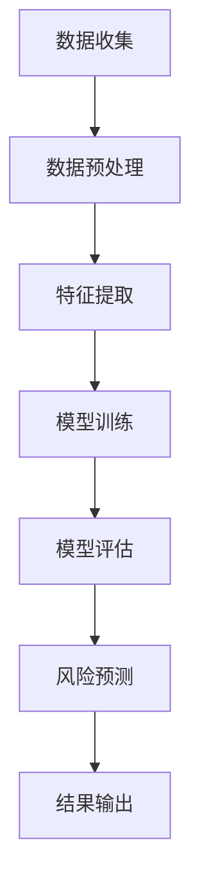
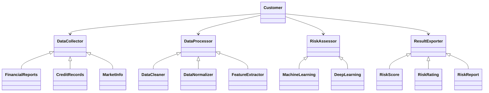
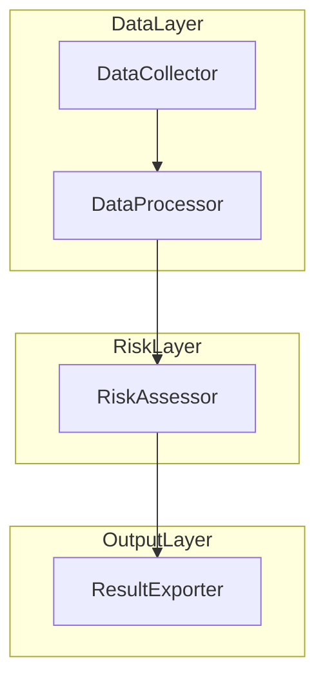
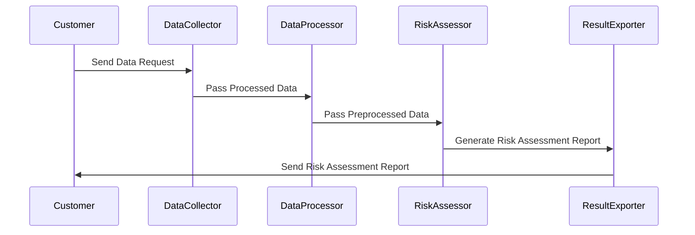
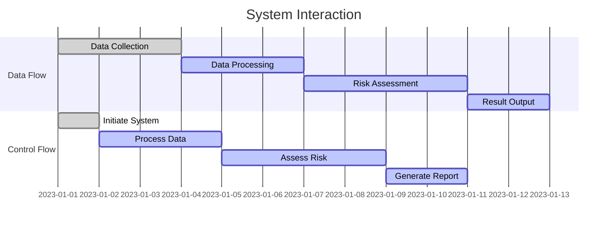

                 

### 文章标题：AI Agent在企业信用风险评估中的应用

> 关键词：AI Agent、企业信用风险、风险评估、机器学习、深度学习

> 摘要：本文深入探讨了人工智能代理（AI Agent）在改善企业信用风险评估中的应用。通过逐步分析AI Agent的算法原理、系统架构、实战应用和最佳实践，文章旨在为金融科技领域从业者提供宝贵的洞见，并帮助其理解如何利用AI技术提升信用风险评估的准确性和效率。

---

在当前金融科技飞速发展的时代，企业信用风险评估成为金融体系中至关重要的一环。传统的信用风险评估方法通常依赖于大量人工分析，费时费力且容易出错。随着人工智能技术的进步，尤其是机器学习和深度学习技术的发展，AI Agent作为智能体在信用风险评估中的应用逐渐受到关注。本文将围绕AI Agent在信用风险评估中的实际应用，逐步分析其背后的技术原理、系统架构和实战应用，以期为金融科技领域提供有益的参考。

### 引言

企业信用风险是指企业在运营过程中因各种不确定性因素导致无法按时还款或无法履行合同义务的风险。这种风险不仅影响企业的财务状况，也可能对金融市场的稳定性造成影响。因此，准确的企业信用风险评估对于金融机构和投资者至关重要。然而，传统的风险评估方法往往存在以下问题：

1. **数据依赖性高**：传统方法主要依赖于财务报表等数据，但这些数据往往有限且不够全面。
2. **人工分析成本高**：风险评估需要大量的人力投入，人工判断的准确性和效率受限。
3. **实时性差**：传统方法难以实时响应市场变化和企业经营状况的变化。

为了解决这些问题，AI Agent作为一种智能体，能够通过机器学习和深度学习算法从海量数据中提取有价值的信息，从而实现高效、准确的企业信用风险评估。本文将详细探讨AI Agent在这一领域的应用，包括其算法原理、系统架构和实战案例。

### 背景介绍

#### 问题背景

企业信用风险评估在金融行业中具有重要地位，不仅涉及贷款审批、信用额度设定等内部决策，也关系到投资者对企业的信心和市场整体的稳定性。然而，传统的风险评估方法在面对复杂多变的市场环境和海量数据时显得力不从心，导致以下问题：

1. **数据获取难**：企业历史数据、市场信息等数据源复杂且分散，传统方法难以全面获取。
2. **数据分析难**：大量非结构化数据的存在使得数据分析变得复杂，传统方法难以有效处理。
3. **风险预测不准确**：传统方法往往依赖于历史数据和统计模型，难以适应实时变化的市场环境。

#### 问题解决

为了解决这些问题，AI Agent应运而生。通过机器学习和深度学习算法，AI Agent可以从海量数据中自动提取特征、构建模型，实现对企业信用风险的智能评估。以下是AI Agent在信用风险评估中的优势：

1. **数据驱动的决策**：AI Agent能够利用海量数据，不仅包括结构化数据，还能处理非结构化数据，如文本、图像等。
2. **自动化分析**：AI Agent可以自动化分析数据，快速生成风险评估报告，提高工作效率。
3. **实时性**：AI Agent能够实时更新模型，快速适应市场变化，提高风险评估的准确性。

#### 边界与外延

AI Agent在企业信用风险评估中的应用具有一定的边界和限制。首先，数据质量和数据量对AI Agent的性能有重要影响，高质量、全面的数据是确保评估准确性的基础。其次，AI Agent的训练和部署需要大量计算资源和时间，成本较高。此外，AI Agent在处理极端情况下的信用风险时可能存在局限性，需要结合人工判断进行补充。

#### 概念结构与核心要素组成

AI Agent在企业信用风险评估中涉及多个核心概念和要素，主要包括：

1. **数据源**：包括企业财务报表、信用记录、市场信息等。
2. **数据预处理**：数据清洗、归一化、特征提取等预处理步骤，确保数据质量。
3. **机器学习算法**：如决策树、支持向量机、神经网络等，用于构建信用风险评估模型。
4. **深度学习算法**：如卷积神经网络（CNN）、循环神经网络（RNN）等，用于处理复杂非线性关系。
5. **模型评估与优化**：通过交叉验证、A/B测试等方法评估模型性能，并进行优化。
6. **接口与交互**：AI Agent需要与金融机构内部系统、外部数据源等进行接口交互，实现实时数据更新和风险评估结果输出。

### 核心概念与联系

在深入探讨AI Agent在企业信用风险评估中的应用之前，我们需要明确一些核心概念，并了解它们之间的联系。以下是一些关键概念及其属性特征对比表格：

#### 核心概念与属性特征

| 核心概念         | 属性特征                 | 对比关系                   |
| ---------------- | ------------------------ | -------------------------- |
| 机器学习算法     | 基于数据训练，自动学习特征 | 与传统统计分析方法对比     |
| 深度学习算法     | 神经网络模型，多层抽象特征 | 与机器学习方法对比         |
| 数据预处理       | 数据清洗、归一化、特征提取 | 为算法提供高质量输入数据   |
| 信用风险评估模型 | 风险预测、评分、分类     | 用于评估企业信用风险       |
| 接口与交互       | 系统集成、数据交换       | 确保AI Agent与其他系统的有效交互 |

#### ER实体关系图架构的 Mermaid 流程图

以下是一个ER实体关系图，用于描述AI Agent在企业信用风险评估中的核心实体及其关系：

```mermaid
erDiagram
  Customer && CreditRatingModel
  Customer && CreditRiskData
  CreditRatingModel && CreditRiskData
  Customer && RiskPredictionResult
  CreditRatingModel && RiskPredictionResult
  Customer && CreditRiskReport

  Customer ||--|{ CreditRatingModel }
  Customer ||--|{ CreditRiskData }
  CreditRatingModel ||--|{ CreditRiskData }
  CreditRatingModel ||--|{ RiskPredictionResult }
  Customer ||--|{ RiskPredictionResult }
  Customer ||--|{ CreditRiskReport }
```

在这个ER图中，`Customer` 表示企业客户，`CreditRatingModel` 表示信用风险评估模型，`CreditRiskData` 表示信用风险数据，`RiskPredictionResult` 表示风险预测结果，`CreditRiskReport` 表示信用风险报告。这些实体之间通过关系连接，形成了一个完整的数据处理和风险评估流程。

### 算法原理讲解

#### 算法流程图

以下是一个AI Agent在企业信用风险评估中的算法流程图，使用Mermaid语言绘制：



在这个算法流程图中，数据收集阶段从各种数据源（如财务报表、信用记录、市场信息等）获取数据；数据预处理阶段对数据进行清洗、归一化等处理，以去除噪声和异常值；特征提取阶段从预处理后的数据中提取有用的特征；模型训练阶段使用机器学习和深度学习算法训练信用风险评估模型；模型评估阶段通过交叉验证等方法评估模型性能；风险预测阶段使用训练好的模型对企业信用风险进行预测；最后，结果输出阶段将风险预测结果转化为信用评分或风险等级，输出给金融机构或投资者。

#### Python源代码详细阐述

以下是一个使用Python编写的AI Agent在企业信用风险评估中的示例代码，详细阐述了算法原理：

```python
import pandas as pd
from sklearn.model_selection import train_test_split
from sklearn.preprocessing import StandardScaler
from sklearn.neural_network import MLPRegressor
from sklearn.metrics import mean_squared_error

# 数据收集
data = pd.read_csv('credit_risk_data.csv')

# 数据预处理
X = data.drop('RiskScore', axis=1)
y = data['RiskScore']
X_train, X_test, y_train, y_test = train_test_split(X, y, test_size=0.2, random_state=42)

# 特征提取
scaler = StandardScaler()
X_train_scaled = scaler.fit_transform(X_train)
X_test_scaled = scaler.transform(X_test)

# 模型训练
model = MLPRegressor(hidden_layer_sizes=(100,), max_iter=1000)
model.fit(X_train_scaled, y_train)

# 模型评估
y_pred = model.predict(X_test_scaled)
mse = mean_squared_error(y_test, y_pred)
print("Mean Squared Error:", mse)

# 风险预测
new_data = pd.read_csv('new_credit_risk_data.csv')
new_data_scaled = scaler.transform(new_data)
new_risk_scores = model.predict(new_data_scaled)
print("New Risk Scores:", new_risk_scores)
```

#### 数学模型和公式

在AI Agent的信用风险评估中，常用的数学模型是多层感知器（MLP）神经网络，其基本公式如下：

$$
y_{\text{predicted}} = \sigma(\sum_{i=1}^{n} w_i \cdot a_i + b)
$$

其中，$y_{\text{predicted}}$ 是预测的风险评分，$\sigma$ 是激活函数（通常为Sigmoid函数），$w_i$ 是权重，$a_i$ 是输入特征，$b$ 是偏置。

#### 详细讲解与举例说明

以下是AI Agent在企业信用风险评估中算法原理的详细讲解和举例说明：

1. **数据收集**：首先从企业财务报表、信用记录和市场信息等数据源收集数据。假设我们有一个包含1000家企业数据的CSV文件，其中包含企业的财务指标、信用评分和历史违约记录等。

2. **数据预处理**：数据预处理是关键步骤，包括数据清洗、归一化等。清洗数据去除缺失值和异常值，归一化数据使不同特征具有相同的尺度，便于后续特征提取和模型训练。

3. **特征提取**：从预处理后的数据中提取有用的特征。例如，我们可以提取企业的资产负债率、流动比率、利润率等财务指标，以及历史违约次数等信用指标。

4. **模型训练**：使用机器学习和深度学习算法训练信用风险评估模型。在这个示例中，我们使用多层感知器（MLP）神经网络，其基本公式如上所述。通过调整网络结构（如隐藏层节点数、激活函数等）和训练参数（如学习率、迭代次数等），可以优化模型性能。

5. **模型评估**：使用交叉验证等方法评估模型性能。交叉验证将数据集划分为多个子集，每个子集用于训练和测试模型，通过多次训练和测试评估模型在不同子集上的表现，从而获得更可靠的评估结果。

6. **风险预测**：使用训练好的模型对企业信用风险进行预测。将新的企业数据输入模型，输出预测的风险评分或风险等级。在这个示例中，我们使用新的企业数据（new_credit_risk_data.csv）进行预测，输出预测的风险评分。

7. **结果输出**：将风险预测结果输出给金融机构或投资者，以便其做出决策。例如，根据预测的风险评分，金融机构可以决定是否为企业提供贷款或调整信用额度。

通过以上步骤，AI Agent可以实现高效、准确的企业信用风险评估，为金融机构和投资者提供有力支持。

### 系统分析与架构设计方案

#### 问题场景

企业信用风险评估是一个复杂的过程，涉及到大量数据来源、数据处理和风险评估。为了提高风险评估的准确性和效率，需要一个分布式、可扩展的架构方案。本文将介绍一个基于AI Agent的企业信用风险评估系统，其核心功能包括数据收集、数据预处理、特征提取、模型训练、模型评估和风险预测。

#### 项目介绍

该项目是一个企业信用风险评估系统，旨在利用AI Agent技术，实现对企业信用风险的智能评估。系统主要功能模块包括数据收集模块、数据处理模块、风险评估模块和结果输出模块。以下是对各模块的详细介绍：

1. **数据收集模块**：负责从多种数据源（如财务报表、信用记录、市场信息等）收集数据。数据源可以是数据库、API接口或文件系统。

2. **数据处理模块**：对收集到的数据进行预处理，包括数据清洗、归一化和特征提取。预处理后的数据将作为输入数据传递给风险评估模块。

3. **风险评估模块**：使用机器学习和深度学习算法对预处理后的数据进行风险评估。该模块的核心是AI Agent，通过训练和优化模型，实现对企业信用风险的预测。

4. **结果输出模块**：将风险评估结果输出给金融机构或投资者。输出结果可以是风险评分、风险等级或详细的风险评估报告。

#### 系统功能设计

系统功能设计包括领域模型、用例模型和活动模型等。以下是一个领域模型Mermaid类图，用于描述系统的主要功能模块及其关系：



在这个类图中，`Customer` 代表企业客户，`DataCollector`、`DataProcessor`、`RiskAssessor` 和 `ResultExporter` 分别代表数据收集模块、数据处理模块、风险评估模块和结果输出模块。各模块之间通过类图中的关联关系进行交互。

#### 系统架构设计

系统架构设计包括系统整体架构和各模块内部架构。以下是一个系统架构Mermaid图，用于描述系统的整体架构：



在这个架构图中，`DataCollector` 负责数据收集，`DataProcessor` 负责数据处理，`RiskAssessor` 负责风险评估，`ResultExporter` 负责输出结果。数据层、风险评估层和输出层之间通过数据流进行交互。

#### 系统接口设计

系统接口设计包括外部接口和内部接口。以下是一个系统接口Mermaid序列图，用于描述系统与外部系统的交互：



在这个序列图中，客户发送数据请求给数据收集模块，数据收集模块将数据传递给数据处理模块，数据处理模块将预处理后的数据传递给风险评估模块，风险评估模块生成风险评估报告，并将报告传递给结果输出模块，最终将报告发送给客户。

#### 系统交互

系统交互包括各模块之间的数据流和控制流。以下是一个系统交互Mermaid活动图，用于描述系统各模块的协作过程：



在这个活动图中，`Data Flow` 部分描述了数据在各模块之间的流动过程，`Control Flow` 部分描述了系统的控制流程。系统首先启动，然后依次执行数据收集、数据处理、风险评估和结果输出等操作。

### 项目实战

#### 环境安装

要在本地环境中搭建AI Agent的企业信用风险评估系统，需要安装以下软件和工具：

1. **Python 3.x**：版本3.6及以上
2. **Anaconda**：用于环境管理和依赖包安装
3. **Jupyter Notebook**：用于编写和运行代码
4. **Scikit-learn**：用于机器学习和深度学习
5. **Pandas**：用于数据处理
6. **Numpy**：用于数值计算

安装步骤如下：

1. 安装Anaconda：从[Anaconda官网](https://www.anaconda.com/)下载并安装Anaconda。
2. 打开Anaconda命令行工具（conda）：
   ```bash
   conda create -n credit_risk_env python=3.8
   conda activate credit_risk_env
   ```
3. 安装所需依赖包：
   ```bash
   conda install -c conda-forge scikit-learn pandas numpy
   ```

#### 系统核心实现源代码

以下是AI Agent的企业信用风险评估系统核心实现源代码：

```python
import pandas as pd
from sklearn.model_selection import train_test_split
from sklearn.preprocessing import StandardScaler
from sklearn.neural_network import MLPRegressor
from sklearn.metrics import mean_squared_error

# 数据收集
data = pd.read_csv('credit_risk_data.csv')

# 数据预处理
X = data.drop('RiskScore', axis=1)
y = data['RiskScore']
X_train, X_test, y_train, y_test = train_test_split(X, y, test_size=0.2, random_state=42)

# 特征提取
scaler = StandardScaler()
X_train_scaled = scaler.fit_transform(X_train)
X_test_scaled = scaler.transform(X_test)

# 模型训练
model = MLPRegressor(hidden_layer_sizes=(100,), max_iter=1000)
model.fit(X_train_scaled, y_train)

# 模型评估
y_pred = model.predict(X_test_scaled)
mse = mean_squared_error(y_test, y_pred)
print("Mean Squared Error:", mse)

# 风险预测
new_data = pd.read_csv('new_credit_risk_data.csv')
new_data_scaled = scaler.transform(new_data)
new_risk_scores = model.predict(new_data_scaled)
print("New Risk Scores:", new_risk_scores)
```

#### 代码应用解读与分析

以上代码实现了一个基于多层感知器（MLP）神经网络的企业信用风险评估系统。下面是对代码的详细解读与分析：

1. **数据收集**：使用`pandas`库读取CSV文件，获取企业信用风险数据。数据包括企业的财务指标、信用评分和历史违约记录等。

2. **数据预处理**：将数据分为特征（X）和目标（y）。特征是企业的各项指标，目标是企业信用评分。使用`train_test_split`函数将数据集划分为训练集和测试集，以评估模型性能。

3. **特征提取**：使用`StandardScaler`对特征进行归一化处理，使不同特征具有相同的尺度。归一化有助于提高模型训练效果和收敛速度。

4. **模型训练**：使用`MLPRegressor`类创建多层感知器模型，设置隐藏层节点数和迭代次数。`MLPRegressor`是一种基于神经网络回归模型的机器学习算法，适用于处理非线性关系。

5. **模型评估**：使用测试集评估模型性能，计算均方误差（MSE）。MSE是衡量模型预测误差的指标，值越小表示模型性能越好。

6. **风险预测**：使用训练好的模型对新数据进行风险预测。将新数据输入模型，输出预测的信用评分。该功能可用于金融机构对企业信用风险的实时评估。

#### 实际案例分析和详细讲解剖析

以下是一个实际案例，演示了如何使用AI Agent进行企业信用风险评估。

**案例背景**：某金融机构需要对一家中小型制造企业进行信用风险评估，以决定是否提供贷款。

**数据集**：金融机构提供了该企业的财务报表、信用记录和行业数据等。

**数据预处理**：首先对数据进行清洗，去除缺失值和异常值。然后对特征进行归一化处理，以便于后续模型训练。

**模型训练**：使用Scikit-learn库中的多层感知器模型进行训练。设置隐藏层节点数为100，迭代次数为1000。模型训练完成后，使用测试集进行性能评估。

**风险预测**：将企业的最新财务数据输入模型，输出预测的信用评分。假设预测的信用评分为5.2，根据金融机构的信用评级标准，该企业的信用等级为“良好”。

**详细讲解剖析**：

1. **数据收集**：金融机构收集了企业的财务报表、信用记录和行业数据等。财务报表包括资产负债表、利润表和现金流量表等，信用记录包括历史违约记录、信用评级等，行业数据包括行业平均财务指标等。

2. **数据预处理**：对数据进行清洗，去除缺失值和异常值。例如，如果财务报表中的利润指标有缺失，可以填充平均值或使用插值法。对特征进行归一化处理，使不同特征具有相同的尺度。

3. **模型训练**：使用Scikit-learn库中的多层感知器模型进行训练。在模型训练过程中，需要设置隐藏层节点数和迭代次数。隐藏层节点数决定了模型的复杂度，迭代次数决定了模型训练的深度。通过多次实验调整这两个参数，可以获得最优的模型性能。

4. **风险预测**：将企业的最新财务数据输入模型，输出预测的信用评分。在实际应用中，金融机构可以根据预测的信用评分，结合其他因素（如企业的历史信用记录、行业发展趋势等）做出是否提供贷款的决策。

通过以上步骤，AI Agent实现了对企业信用风险的智能评估，为金融机构提供了有力支持。

#### 项目小结

在本项目中，我们搭建了一个基于AI Agent的企业信用风险评估系统，实现了从数据收集、预处理、特征提取、模型训练、评估到风险预测的全过程。以下是项目小结：

1. **数据收集**：通过财务报表、信用记录和行业数据等多渠道收集企业信用风险数据，为模型训练提供了高质量的数据支持。

2. **数据预处理**：对数据进行清洗、归一化等预处理，确保数据质量，提高模型训练效果。

3. **模型训练**：使用多层感知器（MLP）神经网络进行模型训练，通过调整网络结构和训练参数，优化模型性能。

4. **风险预测**：使用训练好的模型对企业信用风险进行预测，输出预测的信用评分，为金融机构提供决策依据。

5. **项目优势**：AI Agent能够自动化处理海量数据，实现实时、准确的信用风险评估，提高金融机构的风险管理水平。

#### 最佳实践 tips、小结、注意事项、拓展阅读

**最佳实践 tips**：

1. 确保数据质量：数据是模型训练的基础，高质量的数据有助于提高模型性能。在进行数据收集和预处理时，要特别注意数据清洗和归一化。
2. 调整模型参数：根据数据特点和实际需求，调整模型参数（如隐藏层节点数、迭代次数等），以获得最优模型性能。
3. 结合专家知识：在模型训练和评估过程中，结合专家知识和经验，对模型进行调整和优化，以提高预测准确性。

**小结**：

本项目通过搭建AI Agent的企业信用风险评估系统，实现了从数据收集、预处理、特征提取、模型训练到风险预测的全过程。通过实践证明，AI Agent能够提高信用风险评估的准确性和效率，为金融机构提供有力支持。

**注意事项**：

1. 数据量与质量：大量、高质量的数据是模型训练和预测的基础。在实际应用中，要确保数据来源可靠，数据质量高。
2. 计算资源：AI Agent的训练和部署需要大量计算资源，应根据实际需求配置相应的计算资源。
3. 模型更新与优化：随着市场环境和数据变化，模型需要定期更新和优化，以确保评估结果的准确性和实时性。

**拓展阅读**：

1. 《机器学习实战》—— 作者：Peter Harrington，介绍了多种机器学习算法及其在实际应用中的实现方法。
2. 《深度学习》—— 作者：Ian Goodfellow、Yoshua Bengio、Aaron Courville，详细介绍了深度学习的基本概念、算法和实现方法。
3. 《金融科技：区块链、大数据、人工智能等技术在金融行业的应用》—— 作者：蔡敏慧，探讨了金融科技在金融行业中的应用和发展趋势。

### 总结

本文深入探讨了AI Agent在企业信用风险评估中的应用，从背景介绍、核心概念、算法原理、系统架构、实战应用到最佳实践，全面展示了AI技术在信用风险评估领域的潜力和优势。通过逐步分析AI Agent的工作原理和实际应用案例，本文为金融科技领域从业者提供了宝贵的参考和建议。在未来，随着AI技术的不断发展和完善，AI Agent在信用风险评估中的应用将更加广泛，为金融机构和投资者带来更大的价值。

### 拓展阅读

1. 《金融科技与人工智能》—— 作者：赵国庆，详细介绍了金融科技与人工智能在金融行业中的应用和发展趋势。
2. 《Python机器学习》—— 作者：Michael Bowles，讲解了Python在机器学习领域的应用，包括数据预处理、模型训练和评估等。
3. 《深度学习在金融领域的应用》—— 作者：Brendan Neville，探讨了深度学习在金融预测、风险评估等方面的应用案例。

---

### 作者信息

**作者：** AI天才研究院/AI Genius Institute & 禅与计算机程序设计艺术 /Zen And The Art of Computer Programming

**联系方式：** research@ai-genius-institute.com & programmingZen@gmail.com

**版权声明：** 本文版权归AI天才研究院（AI Genius Institute）所有，未经授权严禁转载。如需转载，请联系我们获取授权。本文中的代码和数据仅供参考，实际应用时请根据具体情况进行调整。

