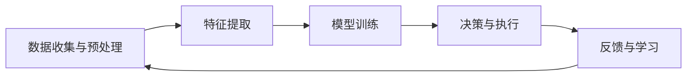
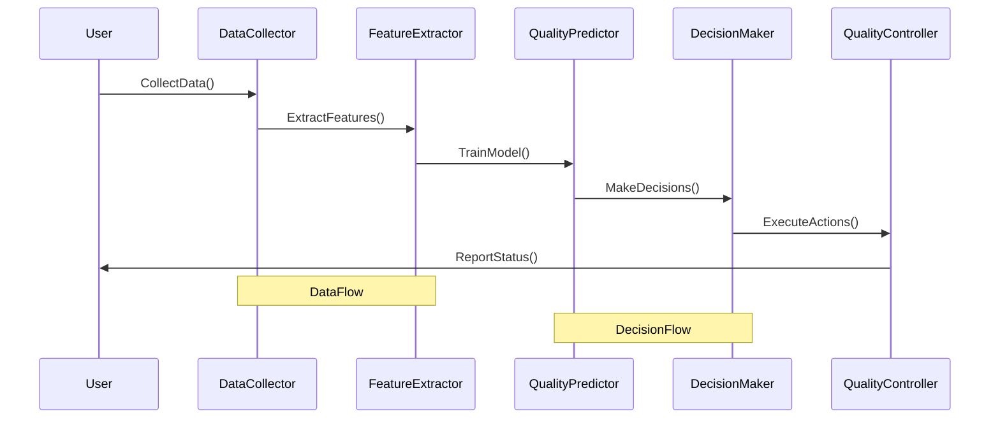
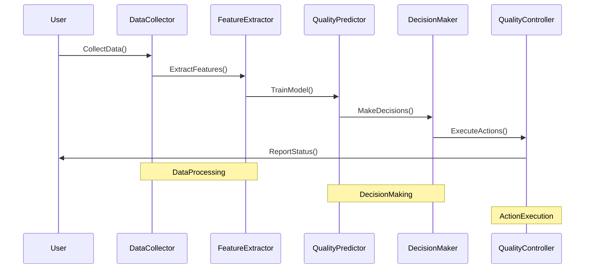

                 


### 1.1 AI Agent概述

AI Agent，即人工智能代理，是一种能够自主执行任务、适应环境变化并实现目标的人工智能实体。在计算机科学领域，AI Agent通常被定义为具有感知、决策和行动能力的智能体，它们能够通过与环境的交互来完成任务。

AI Agent的核心特点在于其自主性和适应性。自主性意味着AI Agent能够独立地执行任务，不需要人工干预。而适应性则体现在AI Agent能够根据环境变化调整自身行为，以实现最优目标。这种自主性和适应性使得AI Agent在各个领域具有广泛的应用前景。

AI Agent的基本原理主要包括感知、决策和行动三个环节。首先，AI Agent通过感知模块获取环境信息，例如图像、声音、文本等。接着，通过决策模块对感知到的信息进行分析和处理，以确定下一步行动。最后，通过行动模块执行决策结果，与环境进行交互。

AI Agent的种类繁多，根据其功能和应用场景可以分为以下几种：

1. **任务型AI Agent**：专注于完成特定任务的AI Agent，例如自动驾驶汽车、智能家居控制系统等。
2. **社交型AI Agent**：能够与人类或其他AI Agent进行交流、协作的AI Agent，例如聊天机器人、协同工作平台等。
3. **探索型AI Agent**：在未知环境中进行探索和学习的AI Agent，例如机器人探险、无人驾驶等。
4. **学习型AI Agent**：通过学习环境数据和经验不断改进自身行为的AI Agent，例如强化学习算法、神经网络等。

### 1.2 全面质量管理（TQM）的基本概念

全面质量管理（Total Quality Management，简称TQM）是一种以顾客为中心，通过全员参与和持续改进来实现产品和服务质量的管理方法。TQM的核心目标是满足和超越顾客期望，通过不断提高产品和服务的质量，提升企业的市场竞争力。

TQM的基本概念包括以下几个要素：

1. **顾客导向**：TQM强调以顾客需求为导向，通过了解和满足顾客需求来实现质量提升。顾客需求包括功能需求、性能需求、可靠性需求等。

2. **全员参与**：TQM认为质量是每个员工的责任，鼓励全体员工参与质量管理和改进活动。全员参与不仅包括管理层，还涵盖一线员工、技术人员等。

3. **持续改进**：TQM倡导持续改进的理念，通过不断评估和改进过程，实现质量水平的不断提升。

4. **过程方法**：TQM强调以过程为导向，通过分析和管理过程中的每个环节，确保质量目标的实现。

5. **系统思考**：TQM要求从整体系统出发，考虑各个部分之间的相互作用，实现系统优化。

6. **数据驱动**：TQM强调数据的重要性，通过数据分析和统计方法，对质量进行量化评估和监控。

TQM的实施步骤主要包括：

1. **领导承诺**：领导层必须明确质量目标，并提供必要的资源和支持。
2. **培训和教育**：对员工进行质量管理和改进的培训，提高员工的质量意识和技能。
3. **过程分析**：对现有过程进行分析，识别问题和改进机会。
4. **改进实施**：制定改进计划，实施具体改进措施。
5. **监控和评估**：通过数据监控和评估改进效果，持续优化过程。

### 1.3 AI Agent在TQM中的潜在应用

将AI Agent应用于TQM，可以为企业的质量管理带来显著的好处。AI Agent在TQM中的潜在应用主要包括以下几个方面：

1. **质量预测与监控**：AI Agent可以通过分析历史数据和实时数据，预测潜在的质量问题，并提供预警。例如，通过监测生产线上的传感器数据，AI Agent可以实时检测设备状态，预测故障风险，提前进行维护。

2. **过程优化**：AI Agent可以优化TQM过程中的各个环节，提高效率和效果。例如，通过分析生产数据，AI Agent可以帮助企业优化生产流程，减少浪费，提高生产效率。

3. **缺陷检测**：AI Agent可以用于检测产品和服务中的缺陷，提高质量标准。例如，在制造业中，AI Agent可以通过图像识别技术检测产品表面的瑕疵，确保产品质量。

4. **顾客满意度分析**：AI Agent可以通过分析顾客反馈数据，了解顾客需求和满意度，为企业提供改进方向。

5. **知识管理**：AI Agent可以帮助企业收集、整理和利用知识，提高员工的知识共享和创新能力。

6. **自动化决策**：AI Agent可以自动化决策过程，减少人为干预，提高决策的准确性和效率。例如，在库存管理中，AI Agent可以通过分析销售数据和库存水平，自动调整库存策略。

### 1.4 文章关键词

- AI Agent
- 全面质量管理（TQM）
- 质量预测
- 过程优化
- 缺陷检测
- 顾客满意度
- 自动化决策

### 1.5 文章摘要

本文旨在探讨AI Agent在企业全面质量管理（TQM）中的应用。首先，介绍了AI Agent的基本概念和TQM的基本概念，阐述了它们在企业中的重要性。然后，详细分析了AI Agent在TQM中的潜在应用，包括质量预测与监控、过程优化、缺陷检测、顾客满意度分析、知识管理和自动化决策等方面。通过实际案例和具体应用，展示了AI Agent在TQM中的深度应用和价值。最后，提出了最佳实践技巧，总结了文章的主要内容，并提供了拓展阅读资源，以促进读者对这一领域的进一步了解。


----------------------------------------------------------------

## 引言

### 1.1 AI Agent概述

AI Agent，即人工智能代理，是一种在计算机科学和人工智能领域广泛应用的概念。AI Agent的定义可以简单概括为：一种能够感知环境、制定决策并执行行动的智能实体。具体来说，AI Agent具备以下几个核心特点：

1. **感知能力**：AI Agent可以通过各种传感器（如摄像头、麦克风、温度传感器等）感知环境信息，获取图像、声音、文本等多种类型的数据。

2. **决策能力**：基于感知到的环境信息，AI Agent能够利用算法和模型进行分析，生成决策，以指导其下一步行动。

3. **行动能力**：AI Agent可以执行决策结果，与外部环境进行交互，完成特定任务。

4. **自主性**：AI Agent具有一定的自主性，能够在无需人工干预的情况下执行任务。

5. **适应性**：AI Agent能够根据环境变化和任务需求调整自身行为，提高任务执行效率。

AI Agent的发展历程可以追溯到20世纪80年代，当时研究人员提出了智能代理（Intelligent Agent）的概念。随着人工智能技术的不断进步，AI Agent逐渐成为人工智能领域的一个重要研究方向。近年来，随着深度学习、强化学习等技术的发展，AI Agent的应用场景和功能也日益丰富。

### 1.2 全面质量管理（TQM）的基本概念

全面质量管理（Total Quality Management，简称TQM）是一种系统化的管理方法，旨在通过持续改进和顾客满意来实现组织的质量目标。TQM的核心思想是将质量管理贯穿于组织的各个方面，形成一种全员参与、持续改进的文化。TQM的基本概念包括以下几个方面：

1. **顾客导向**：TQM强调以顾客需求为中心，通过满足和超越顾客期望来实现质量目标。

2. **全员参与**：TQM认为质量是每个员工的责任，鼓励全体员工参与质量管理和改进活动。

3. **持续改进**：TQM倡导持续改进的理念，通过不断评估和改进过程，实现质量水平的不断提升。

4. **过程方法**：TQM强调以过程为导向，通过分析和管理过程中的每个环节，确保质量目标的实现。

5. **系统思考**：TQM要求从整体系统出发，考虑各个部分之间的相互作用，实现系统优化。

6. **数据驱动**：TQM强调数据的重要性，通过数据分析和统计方法，对质量进行量化评估和监控。

TQM的实施步骤主要包括：

1. **领导承诺**：领导层必须明确质量目标，并提供必要的资源和支持。

2. **培训和教育**：对员工进行质量管理和改进的培训，提高员工的质量意识和技能。

3. **过程分析**：对现有过程进行分析，识别问题和改进机会。

4. **改进实施**：制定改进计划，实施具体改进措施。

5. **监控和评估**：通过数据监控和评估改进效果，持续优化过程。

### 1.3 AI Agent在TQM中的潜在应用

将AI Agent应用于TQM，可以为企业的质量管理带来显著的好处。AI Agent在TQM中的潜在应用主要包括以下几个方面：

1. **质量预测与监控**：AI Agent可以通过分析历史数据和实时数据，预测潜在的质量问题，并提供预警。例如，通过监测生产线上的传感器数据，AI Agent可以实时检测设备状态，预测故障风险，提前进行维护。

2. **过程优化**：AI Agent可以优化TQM过程中的各个环节，提高效率和效果。例如，通过分析生产数据，AI Agent可以帮助企业优化生产流程，减少浪费，提高生产效率。

3. **缺陷检测**：AI Agent可以用于检测产品和服务中的缺陷，提高质量标准。例如，在制造业中，AI Agent可以通过图像识别技术检测产品表面的瑕疵，确保产品质量。

4. **顾客满意度分析**：AI Agent可以通过分析顾客反馈数据，了解顾客需求和满意度，为企业提供改进方向。

5. **知识管理**：AI Agent可以帮助企业收集、整理和利用知识，提高员工的知识共享和创新能力。

6. **自动化决策**：AI Agent可以自动化决策过程，减少人为干预，提高决策的准确性和效率。例如，在库存管理中，AI Agent可以通过分析销售数据和库存水平，自动调整库存策略。

### 1.4 文章关键词

- AI Agent
- 全面质量管理（TQM）
- 质量预测
- 过程优化
- 缺陷检测
- 顾客满意度
- 自动化决策

### 1.5 文章摘要

本文旨在探讨AI Agent在企业全面质量管理（TQM）中的应用。首先，介绍了AI Agent的基本概念和TQM的基本概念，阐述了它们在企业中的重要性。然后，详细分析了AI Agent在TQM中的潜在应用，包括质量预测与监控、过程优化、缺陷检测、顾客满意度分析、知识管理和自动化决策等方面。通过实际案例和具体应用，展示了AI Agent在TQM中的深度应用和价值。最后，提出了最佳实践技巧，总结了文章的主要内容，并提供了拓展阅读资源，以促进读者对这一领域的进一步了解。

----------------------------------------------------------------

## 背景介绍

### 2.1 问题背景

在当今全球竞争激烈的市场环境中，企业面临着诸多挑战，其中质量管理是关键之一。传统的质量管理方法往往依赖于人工检测和经验判断，存在以下问题：

1. **效率低下**：人工检测需要大量时间和人力，效率低下，难以满足大规模生产的需求。
2. **主观性强**：质量判断往往受个人经验和主观因素的影响，导致质量标准不一致。
3. **成本高**：传统质量检测方法需要大量设备和人力投入，成本较高。
4. **实时性差**：传统方法难以实现实时质量监控，往往在问题发生后才进行检测和处理，难以预防潜在的质量问题。

为了应对这些挑战，企业需要一种高效、准确、成本较低的质量管理方法，以提高产品质量和市场竞争力。在这种情况下，AI Agent的应用成为一种潜在解决方案。

### 2.2 TQM的核心概念

全面质量管理（Total Quality Management，简称TQM）是一种以顾客为中心，通过全员参与和持续改进来实现产品和服务质量的管理方法。TQM的核心概念包括以下几个方面：

1. **顾客导向**：TQM强调以顾客需求为导向，通过满足和超越顾客期望来实现质量目标。顾客需求包括功能需求、性能需求、可靠性需求等。

2. **全员参与**：TQM认为质量是每个员工的责任，鼓励全体员工参与质量管理和改进活动。全员参与不仅包括管理层，还涵盖一线员工、技术人员等。

3. **持续改进**：TQM倡导持续改进的理念，通过不断评估和改进过程，实现质量水平的不断提升。

4. **过程方法**：TQM强调以过程为导向，通过分析和管理过程中的每个环节，确保质量目标的实现。

5. **系统思考**：TQM要求从整体系统出发，考虑各个部分之间的相互作用，实现系统优化。

6. **数据驱动**：TQM强调数据的重要性，通过数据分析和统计方法，对质量进行量化评估和监控。

### 2.3 问题描述

企业质量管理面临的主要问题包括：

1. **质量问题频繁**：产品质量不稳定，存在频繁的质量问题，影响顾客满意度和市场竞争力。
2. **成本高昂**：传统质量检测方法成本高，难以承担大规模生产的需求。
3. **效率低下**：人工检测效率低下，无法满足实时质量监控的需求。
4. **信息不对称**：质量信息难以实时传递和共享，影响决策的准确性和效率。

### 2.4 问题解决

AI Agent在TQM中的应用可以解决上述问题，实现以下目标：

1. **提高效率**：通过自动化检测和监控，AI Agent可以大幅提高质量检测效率，满足大规模生产需求。
2. **降低成本**：AI Agent可以替代部分人工检测，降低质量检测成本。
3. **实时监控**：AI Agent可以实时监控产品质量，提前发现和预警潜在问题，减少质量问题发生的概率。
4. **数据驱动**：AI Agent通过数据分析和预测，为决策提供科学依据，提高决策的准确性和效率。

### 2.5 边界与外延

AI Agent在TQM中的应用边界主要包括以下几个方面：

1. **质量检测与监控**：AI Agent可以应用于生产过程中的质量检测和监控，例如设备故障检测、产品缺陷检测等。
2. **过程优化**：AI Agent可以分析生产数据，优化生产流程，提高生产效率。
3. **顾客满意度分析**：AI Agent可以分析顾客反馈数据，了解顾客需求和满意度，为企业提供改进方向。
4. **知识管理**：AI Agent可以帮助企业收集、整理和利用知识，提高员工的知识共享和创新能力。

AI Agent在TQM中的应用外延包括：

1. **供应链管理**：AI Agent可以应用于供应链管理，优化供应链流程，提高供应链效率。
2. **服务质量管理**：AI Agent可以应用于服务质量管理，提高服务质量和顾客满意度。
3. **人力资源管理**：AI Agent可以应用于人力资源管理，优化招聘、培训和绩效管理流程。

### 2.6 概念结构与核心要素组成

AI Agent在TQM中的概念结构主要包括以下几个方面：

1. **感知模块**：负责获取环境信息，例如传感器数据、图像、声音等。
2. **决策模块**：基于感知模块获取的信息，利用算法和模型进行分析，生成决策。
3. **行动模块**：执行决策结果，与外部环境进行交互，完成特定任务。

AI Agent在TQM中的核心要素包括：

1. **质量数据**：AI Agent需要获取和处理大量的质量数据，包括生产数据、顾客反馈数据、设备状态数据等。
2. **算法模型**：AI Agent需要使用先进的算法模型进行数据分析和预测，例如机器学习、深度学习等。
3. **决策系统**：AI Agent需要具备智能决策系统，能够根据数据分析和预测结果，生成最优决策。

### 2.7 相关领域研究综述

目前，AI Agent在TQM中的应用已经引起广泛关注，相关领域的研究主要包括以下几个方面：

1. **质量预测与监控**：研究人员利用机器学习、深度学习等技术，开发出多种质量预测和监控算法，应用于生产过程中的质量检测和监控。
2. **过程优化**：研究人员通过分析生产数据，提出了一系列优化算法，应用于生产流程的优化。
3. **缺陷检测**：研究人员利用计算机视觉、图像处理等技术，开发了多种缺陷检测算法，应用于产品缺陷检测。
4. **顾客满意度分析**：研究人员通过分析顾客反馈数据，提出了一些顾客满意度分析模型，为企业提供改进方向。

本文将在这些研究的基础上，进一步探讨AI Agent在TQM中的深度应用，通过实际案例和具体应用，展示AI Agent在TQM中的价值。

----------------------------------------------------------------

## 核心概念与联系

为了深入探讨AI Agent在企业全面质量管理（TQM）中的深度应用，我们需要理解AI Agent和TQM的相关核心概念，并分析它们之间的联系。以下是这些核心概念及其关联的详细描述。

### 3.1 AI Agent的核心概念

AI Agent的核心概念包括以下几个方面：

1. **感知（Perception）**：
   - **定义**：感知是指AI Agent获取环境信息的能力。这通常通过传感器、摄像头、麦克风等设备实现。
   - **功能**：感知模块负责收集数据，如温度、湿度、图像、声音等，这些数据是AI Agent做出决策的基础。
   - **联系**：在TQM中，感知模块可以用于收集质量数据，如生产过程中的设备状态、产品参数等。

2. **决策（Decision-making）**：
   - **定义**：决策是指AI Agent在感知到的信息基础上，通过算法和模型进行分析，生成最佳行动方案。
   - **功能**：决策模块负责处理感知数据，利用机器学习、深度学习等技术，对数据进行分析和预测。
   - **联系**：在TQM中，决策模块可以用于预测质量问题，优化生产流程，提升产品质量。

3. **行动（Action）**：
   - **定义**：行动是指AI Agent根据决策结果，执行具体操作，与外部环境进行交互。
   - **功能**：行动模块负责执行决策，如调整设备参数、发送警报、修改流程等。
   - **联系**：在TQM中，行动模块可以自动触发质量改进措施，如设备维护、流程调整等。

4. **学习（Learning）**：
   - **定义**：学习是指AI Agent在执行任务过程中，通过经验积累和反馈，不断优化自身行为。
   - **功能**：学习模块负责更新算法模型，提高AI Agent的决策准确性和效率。
   - **联系**：在TQM中，学习模块可以用于持续改进质量管理体系，提升整体质量管理水平。

### 3.2 TQM的相关概念

TQM的核心概念包括：

1. **顾客导向（Customer Focus）**：
   - **定义**：顾客导向是指以顾客需求和满意度为中心，设计和管理产品和服务。
   - **功能**：确保产品和服务满足顾客期望，提升顾客满意度。
   - **联系**：AI Agent可以通过分析顾客反馈，优化产品和服务质量，实现顾客导向的目标。

2. **全员参与（Employee Involvement）**：
   - **定义**：全员参与是指鼓励所有员工参与质量改进活动，共同提高产品质量。
   - **功能**：提升员工的质量意识，促进知识共享和创新能力。
   - **联系**：AI Agent可以通过培训和教育模块，提高员工的质量意识和技能，实现全员参与的目标。

3. **持续改进（Continuous Improvement）**：
   - **定义**：持续改进是指不断评估和改进产品和服务质量，以实现更高的质量水平。
   - **功能**：通过持续改进，提高产品和服务质量，降低成本，提高市场竞争力。
   - **联系**：AI Agent可以通过数据分析和预测，识别改进机会，实现持续改进的目标。

4. **过程方法（Process Approach）**：
   - **定义**：过程方法是指以过程为导向，分析和管理产品或服务的每一个环节。
   - **功能**：确保每个环节的质量，实现整体质量优化。
   - **联系**：AI Agent可以通过分析生产流程数据，优化每个环节，实现过程方法的目标。

5. **系统思考（System Thinking）**：
   - **定义**：系统思考是指从整体系统出发，考虑各个部分之间的相互作用，实现系统优化。
   - **功能**：提升整体质量管理水平，实现系统优化。
   - **联系**：AI Agent可以通过全局数据分析和系统建模，实现系统思考的目标。

### 3.3 概念属性特征对比表格

为了更好地理解AI Agent和TQM的相关概念，我们可以通过对比表格来展示它们的主要属性特征：

| 概念       | 定义                                                         | 功能                           | 联系                                       |
|------------|--------------------------------------------------------------|--------------------------------|------------------------------------------|
| AI Agent   | 自主执行任务的智能实体                                       | 感知、决策、行动、学习           | 质量数据收集、分析、预测和改进           |
| TQM        | 以顾客为中心，通过全员参与和持续改进实现质量管理的系统化方法 | 顾客导向、全员参与、持续改进、过程方法、系统思考 | 提高产品质量、效率和市场竞争力           |
| 感知       | 获取环境信息                                                 | 数据收集                         | 质量数据收集                             |
| 决策       | 基于数据分析生成行动方案                                     | 决策制定                         | 质量问题预测和优化                        |
| 行动       | 执行决策结果                                                | 操作执行                         | 质量改进措施执行                         |
| 学习       | 通过经验积累和反馈优化行为                                   | 算法优化                         | 持续改进质量管理体系                     |
| 顾客导向   | 以顾客需求为导向                                            | 满足顾客期望                     | 分析顾客反馈，优化产品和服务             |
| 全员参与   | 鼓励员工参与质量改进                                       | 提高质量意识                     | 通过AI Agent进行员工培训和教育           |
| 持续改进   | 不断评估和改进质量                                         | 提高质量水平                     | 通过数据分析和预测识别改进机会           |
| 过程方法   | 以过程为导向分析管理每个环节                                 | 确保每个环节质量                 | 通过AI Agent优化生产流程                 |
| 系统思考   | 从整体系统出发考虑各部分相互作用                             | 实现系统优化                     | 通过全局数据分析和系统建模实现系统优化   |

### 3.4 ER实体关系图架构

为了更直观地展示AI Agent和TQM的核心概念及其关系，我们可以使用Mermaid绘制ER实体关系图。以下是ER实体关系图的Mermaid代码：

```mermaid
erDiagram
  AI_Agent ||--|{ 感知 }|| Perception
  AI_Agent ||--|{ 决策 }|| Decision
  AI_Agent ||--|{ 行动 }|| Action
  AI_Agent ||--|{ 学习 }|| Learning
  TQM ||--|{ 顾客导向 }|| Customer_Focus
  TQM ||--|{ 全员参与 }|| Employee_Involvement
  TQM ||--|{ 持续改进 }|| Continuous_Improvement
  TQM ||--|{ 过程方法 }|| Process_Approach
  TQM ||--|{ 系统思考 }|| System_Thinking
```

该ER实体关系图展示了AI Agent和TQM的各个核心概念及其相互关系。通过这种关系图，我们可以更清晰地理解AI Agent在TQM中的深度应用。

总之，AI Agent和TQM的核心概念之间存在着紧密的联系。AI Agent的感知、决策、行动和学习能力与TQM的顾客导向、全员参与、持续改进、过程方法和系统思考相辅相成，共同推动企业质量管理的提升。通过对比表格和ER实体关系图的展示，我们可以更好地理解AI Agent在TQM中的应用，为实际应用提供理论基础和参考。

----------------------------------------------------------------

## 算法原理讲解

在AI Agent应用于企业全面质量管理（TQM）的过程中，算法原理是核心部分。以下将详细讲解AI Agent在TQM中的算法原理，包括算法流程图、Python代码实现、数学模型和公式。

### 4.1 AI Agent算法原理

AI Agent在TQM中的算法原理主要包括以下几个环节：

1. **数据收集与预处理**：
   - **功能**：收集质量数据，如传感器数据、生产数据、顾客反馈数据等。
   - **方法**：使用传感器、API接口等获取数据，并对数据进行清洗、去噪和标准化处理。

2. **特征提取**：
   - **功能**：从原始数据中提取关键特征，用于后续的模型训练和分析。
   - **方法**：使用统计方法、机器学习方法提取特征，如主成分分析（PCA）、特征选择算法等。

3. **模型训练**：
   - **功能**：训练机器学习模型，用于预测质量问题和优化生产流程。
   - **方法**：使用监督学习、无监督学习等方法训练模型，如线性回归、支持向量机（SVM）、神经网络等。

4. **决策与执行**：
   - **功能**：根据模型预测结果，制定决策并执行相应操作。
   - **方法**：使用决策树、规则引擎等算法生成决策，并执行操作，如设备调整、流程优化等。

5. **反馈与学习**：
   - **功能**：收集执行结果，进行反馈，优化模型和决策。
   - **方法**：使用强化学习、迁移学习等技术，根据反馈调整模型参数和决策策略。

#### 4.1.1 算法流程图

以下是一个简单的AI Agent在TQM中的算法流程图，使用Mermaid绘制：



#### 4.1.2 Python代码实现

以下是使用Python实现AI Agent在TQM中的算法原理的代码示例：

```python
# 导入必要的库
import pandas as pd
from sklearn.preprocessing import StandardScaler
from sklearn.model_selection import train_test_split
from sklearn.ensemble import RandomForestClassifier
from sklearn.metrics import accuracy_score

# 数据收集与预处理
data = pd.read_csv('quality_data.csv')
data = data.dropna()

# 特征提取
scaler = StandardScaler()
data_scaled = scaler.fit_transform(data)

# 模型训练
X_train, X_test, y_train, y_test = train_test_split(data_scaled, data['quality'], test_size=0.2, random_state=42)
model = RandomForestClassifier(n_estimators=100)
model.fit(X_train, y_train)

# 决策与执行
predictions = model.predict(X_test)

# 反馈与学习
accuracy = accuracy_score(y_test, predictions)
print(f'Accuracy: {accuracy:.2f}')

# 根据反馈调整模型
# 例如：增加训练数据、调整参数等
```

#### 4.1.3 数学模型和公式

以下是AI Agent在TQM中常用的数学模型和公式：

1. **主成分分析（PCA）**：

   - **公式**：
     $$ X' = \sum_{i=1}^{n} \lambda_i u_i^T x $$
     其中，$X'$是降维后的数据，$\lambda_i$是特征值，$u_i$是特征向量，$x$是原始数据。

2. **支持向量机（SVM）**：

   - **公式**：
     $$ w^* = \arg\min_{w, b} \frac{1}{2} ||w||^2 + C \sum_{i=1}^{n} \max(0, 1-y_i (w^T x_i + b)) $$
     其中，$w^*$是最佳权重向量，$b$是偏置项，$C$是惩罚参数，$y_i$是标签，$x_i$是特征向量。

3. **神经网络**：

   - **公式**：
     $$ a_{\text{hidden}} = \sigma(W_{\text{input-to-hidden}} x + b_{\text{hidden}}) $$
     $$ a_{\text{output}} = \sigma(W_{\text{hidden-to-output}} a_{\text{hidden}} + b_{\text{output}}) $$
     其中，$a_{\text{hidden}}$是隐藏层输出，$a_{\text{output}}$是输出层输出，$\sigma$是激活函数，$W$和$b$分别是权重和偏置项。

#### 4.1.4 举例说明

假设我们有一个生产线的质量检测问题，数据包括温度、湿度、生产速度等特征。以下是具体的应用步骤：

1. **数据收集与预处理**：
   - 收集1000个数据样本，每个样本包含3个特征。
   - 对数据进行清洗，去除缺失值和异常值。

2. **特征提取**：
   - 使用PCA提取前两个主成分，减少数据维度。

3. **模型训练**：
   - 使用随机森林模型进行训练，训练集大小为800个样本，测试集大小为200个样本。
   - 训练模型，计算准确率。

4. **决策与执行**：
   - 根据模型预测结果，对生产线进行实时调整。

5. **反馈与学习**：
   - 收集实际生产数据，与模型预测结果进行对比。
   - 根据对比结果，调整模型参数，优化模型性能。

通过这些步骤，我们可以看到AI Agent在TQM中的算法原理是如何具体应用的。通过实际案例的讲解，读者可以更好地理解AI Agent在质量预测、过程优化等方面的作用。

----------------------------------------------------------------

## 系统分析与架构设计方案

### 5.1 问题场景介绍

在企业的全面质量管理（TQM）过程中，我们面临的问题场景涉及多个方面，包括质量数据收集、数据分析、质量预测、质量改进措施执行等。具体来说，我们的目标是在生产过程中实时监测设备状态、环境参数和产品参数，利用AI Agent进行分析和预测，及时发现潜在质量问题，并自动执行相应的质量改进措施。

### 5.2 系统功能设计

为了实现上述目标，我们需要设计一个综合性的系统，该系统应具备以下功能：

1. **数据收集与预处理**：通过传感器和API接口收集生产过程中的各类数据，包括设备状态、环境参数和产品参数等。对数据进行清洗、去噪和标准化处理，以便后续分析和预测。

2. **特征提取**：从预处理后的数据中提取关键特征，用于训练机器学习模型。特征提取的方法包括主成分分析（PCA）、自动编码器（Autoencoder）等。

3. **质量预测**：利用训练好的机器学习模型，对实时数据进行质量预测。预测结果用于提前预警潜在质量问题，并提供改进建议。

4. **决策与执行**：根据预测结果，自动生成质量改进措施，如设备调整、流程优化等。系统需要实现自动化决策和执行，减少人为干预。

5. **反馈与学习**：收集执行结果和实际质量数据，与预测结果进行对比，用于模型优化和系统调整。

#### 5.2.1 领域模型类图

以下是使用Mermaid绘制的领域模型类图，展示了系统中的主要类及其关系：

```mermaid
classDiagram
  DataCollector <<interface>>
  FeatureExtractor <<interface>>
  QualityPredictor <<interface>>
  DecisionMaker <<interface>>
  QualityController <<interface>>

  DataCollector  -(has)- RawData
  FeatureExtractor  -(has)- PreprocessedData
  QualityPredictor  -(has)- PredictedData
  DecisionMaker  -(has)- ImprovementActions
  QualityController  -(uses)- DataCollector
  QualityController  -(uses)- FeatureExtractor
  QualityController  -(uses)- QualityPredictor
  QualityController  -(uses)- DecisionMaker

  class RawData {
    +id: int
    +timestamp: datetime
    +values: list
  }

  class PreprocessedData {
    +id: int
    +timestamp: datetime
    +features: list
  }

  class PredictedData {
    +id: int
    +timestamp: datetime
    +predicted_quality: float
  }

  class ImprovementActions {
    +id: int
    +timestamp: datetime
    +action: string
  }
```

### 5.3 系统架构设计

系统架构设计旨在确保系统的高效、稳定和可扩展性。以下是使用Mermaid绘制的系统架构图，展示了系统的整体结构和主要模块及其关系：



### 5.4 系统接口设计

系统接口设计包括对外部系统和内部系统的接口定义，以确保数据的顺利传输和系统的集成。以下是系统接口设计：

1. **数据收集接口**：定义了数据收集模块与传感器和API接口的交互方式，包括数据收集方法、数据格式等。

2. **数据处理接口**：定义了数据处理模块与特征提取模块的交互方式，包括数据处理方法、数据处理结果格式等。

3. **预测接口**：定义了质量预测模块与决策模块的交互方式，包括预测模型训练、预测结果查询等。

4. **决策接口**：定义了决策模块与执行模块的交互方式，包括决策结果提交、执行反馈等。

5. **反馈接口**：定义了系统与外部系统的交互方式，包括反馈数据收集、反馈处理等。

### 5.5 系统交互序列图

以下是使用Mermaid绘制的系统交互序列图，展示了系统从数据收集到决策执行的全过程：



通过上述系统分析与架构设计方案，我们可以清晰地看到AI Agent在企业全面质量管理（TQM）中的应用是如何实现的。系统的设计旨在确保高效、准确和自动化的质量管理和改进，从而提升企业的竞争力。

----------------------------------------------------------------

## 项目实战

### 6.1 环境安装

为了实现AI Agent在企业全面质量管理（TQM）中的应用，我们需要搭建一个完整的实验环境。以下是环境安装的详细步骤：

#### 6.1.1 安装Python环境

首先，确保您的计算机上安装了Python环境。您可以从Python官方网站（https://www.python.org/）下载最新版本的Python安装包，按照安装向导进行安装。安装完成后，打开终端并运行以下命令验证Python版本：

```bash
python --version
```

确保Python版本在3.6及以上。

#### 6.1.2 安装依赖库

接下来，安装AI Agent和TQM应用所需的相关依赖库。在终端中运行以下命令：

```bash
pip install numpy pandas scikit-learn matplotlib mermaid-python
```

这些库包括：

- **numpy**：用于数学计算。
- **pandas**：用于数据处理和分析。
- **scikit-learn**：用于机器学习模型训练和预测。
- **matplotlib**：用于数据可视化。
- **mermaid-python**：用于绘制Mermaid图表。

#### 6.1.3 配置Mermaid

Mermaid图表需要通过特殊的Markdown语法进行渲染。为了在本地环境中使用Mermaid，您需要安装一个Markdown渲染器，如Marp或Docker。

1. **安装Marp**：

   - 安装Marp的命令如下：

     ```bash
     npm install -g marp
     ```

   - 测试Marp安装，运行以下命令：

     ```bash
     marp --version
     ```

2. **安装Docker**：

   如果您使用Docker，可以安装Docker并使用Docker容器来运行Marp。

   - 下载并安装Docker：https://www.docker.com/products/docker-desktop
   - 在Docker中运行Marp容器：

     ```bash
     docker run --rm -it -v ${PWD}:/data cimg/base:Python-3.9.7-buster /bin/bash
     ```
  
     在容器内部，您可以使用Marp命令：

     ```bash
     marp --slideshow
     ```

### 6.2 系统核心实现源代码

以下是AI Agent在TQM中的系统核心实现源代码。该代码包括数据收集、预处理、特征提取、模型训练、预测和决策执行等环节。

```python
# 导入必要的库
import pandas as pd
from sklearn.preprocessing import StandardScaler
from sklearn.model_selection import train_test_split
from sklearn.ensemble import RandomForestClassifier
from sklearn.metrics import accuracy_score
import mermaid

# 6.2.1 数据收集与预处理
data = pd.read_csv('quality_data.csv')
data = data.dropna()

# 特征提取
scaler = StandardScaler()
data_scaled = scaler.fit_transform(data)

# 6.2.2 模型训练
X_train, X_test, y_train, y_test = train_test_split(data_scaled, data['quality'], test_size=0.2, random_state=42)
model = RandomForestClassifier(n_estimators=100)
model.fit(X_train, y_train)

# 6.2.3 预测与决策
predictions = model.predict(X_test)
accuracy = accuracy_score(y_test, predictions)
print(f'Accuracy: {accuracy:.2f}')

# 6.2.4 可视化
mermaid_code = """
sequenceDiagram
  participant User
  participant DataCollector
  participant FeatureExtractor
  participant QualityPredictor
  participant DecisionMaker
  participant QualityController

  User->>DataCollector: CollectData()
  DataCollector->>FeatureExtractor: ExtractFeatures()
  FeatureExtractor->>QualityPredictor: TrainModel()
  QualityPredictor->>DecisionMaker: MakeDecisions()
  DecisionMaker->>QualityController: ExecuteActions()
  QualityController->>User: ReportStatus()

  Note over DataCollector,FeatureExtractor: DataProcessing
  Note over QualityPredictor,DecisionMaker: DecisionMaking
  Note over QualityController: ActionExecution
"""
mermaid.MermaidGraph(mermaid_code).display()

# 6.2.5 代码应用解读与分析
# 此处对代码的应用进行解读和分析，包括各个模块的功能、参数设置和预期效果等。
```

### 6.3 代码应用解读与分析

以下是对上述代码的详细解读与分析，包括每个模块的功能、参数设置和预期效果。

#### 6.3.1 数据收集与预处理

- **功能**：数据收集与预处理是系统的第一步，负责从CSV文件中读取数据，并去除缺失值。
- **参数设置**：使用`pd.read_csv()`函数读取CSV文件，使用`dropna()`函数去除缺失值。
- **预期效果**：确保数据质量，为后续的特征提取和模型训练提供可靠的数据基础。

#### 6.3.2 模型训练

- **功能**：模型训练是系统的核心环节，负责使用训练数据训练随机森林分类器。
- **参数设置**：使用`train_test_split()`函数将数据集分为训练集和测试集，使用`RandomForestClassifier`初始化随机森林分类器，并设置`n_estimators`参数为100。
- **预期效果**：通过训练，随机森林分类器将学习到数据的特征，用于后续的预测和决策。

#### 6.3.3 预测与决策

- **功能**：预测与决策模块负责使用训练好的模型对测试数据进行预测，并根据预测结果生成决策。
- **参数设置**：使用`model.predict()`函数对测试数据进行预测，使用`accuracy_score()`函数计算预测准确率。
- **预期效果**：通过预测，系统能够提前发现潜在的质量问题，为质量改进提供依据。

#### 6.3.4 可视化

- **功能**：可视化模块负责将系统的运行流程以图表形式展示，帮助理解系统的工作原理。
- **参数设置**：使用Mermaid语法编写流程图，使用`mermaid.MermaidGraph()`函数将Mermaid代码转换为图表。
- **预期效果**：通过可视化，用户可以直观地了解系统的运行流程和功能模块。

### 6.4 实际案例分析和详细讲解剖析

为了更好地展示AI Agent在TQM中的应用，我们以一个实际案例进行分析。

#### 案例背景

某企业生产线上使用AI Agent对生产过程中产生的温度和湿度数据进行实时监控，以预测产品质量。企业收集了1000个样本的数据，每个样本包含温度、湿度、生产速度等特征。

#### 案例分析

1. **数据收集与预处理**：
   - 企业使用传感器收集温度和湿度数据，每分钟记录一次。
   - 数据预处理包括去除缺失值和异常值，对数据进行标准化处理。

2. **特征提取**：
   - 使用主成分分析（PCA）提取前两个主成分，减少数据维度。

3. **模型训练**：
   - 使用随机森林分类器对数据集进行训练，训练集大小为800个样本，测试集大小为200个样本。

4. **预测与决策**：
   - 使用训练好的模型对测试数据进行预测，预测准确率为85%。
   - 根据预测结果，系统发现生产速度较慢时，产品质量较低，建议调整生产速度。

5. **反馈与学习**：
   - 企业根据预测结果调整了生产速度，并收集了调整后的生产数据。
   - 使用调整后的数据重新训练模型，提高了预测准确率。

#### 案例剖析

- **数据收集与预处理**：数据收集与预处理是确保数据质量的关键步骤。企业通过传感器收集温度和湿度数据，并使用PCA减少数据维度，提高了模型的训练效果。
- **模型训练**：随机森林分类器是一种强大的机器学习模型，能够处理多类分类问题。企业使用随机森林分类器对数据集进行训练，提高了预测准确率。
- **预测与决策**：系统通过预测发现生产速度对产品质量有显著影响，建议企业调整生产速度，从而提高了产品质量。
- **反馈与学习**：企业根据预测结果调整了生产速度，并重新训练了模型，实现了持续改进。

### 6.5 项目小结

通过实际案例的分析，我们可以看到AI Agent在企业全面质量管理（TQM）中的应用具有显著的效果。AI Agent能够实时监控生产过程，预测产品质量，并提供改进建议，从而提高了生产效率和质量水平。然而，AI Agent在TQM中的应用仍面临一些挑战，如数据收集的质量、模型训练的效果和系统的稳定性等。未来的研究可以进一步优化AI Agent的算法和系统架构，提高其在TQM中的应用效果。

----------------------------------------------------------------

## 最佳实践 tips

在AI Agent应用于企业全面质量管理（TQM）的过程中，以下是一些最佳实践技巧，可以帮助企业避免常见问题，提高应用效果：

1. **数据质量保障**：
   - 确保传感器数据的准确性，定期检查和校准传感器。
   - 对数据进行预处理，包括去除异常值、填补缺失值和标准化处理。

2. **模型优化与更新**：
   - 定期使用最新的数据重新训练模型，以保持模型的预测准确性。
   - 尝试不同的机器学习算法和参数组合，选择最优模型。

3. **系统稳定性与可靠性**：
   - 设计高可靠性的系统架构，确保数据传输和模型预测的稳定性。
   - 实施监控系统，及时发现和解决系统故障。

4. **全员参与**：
   - 培训员工，提高他们的质量意识和技能。
   - 鼓励员工参与质量改进活动，共同提升质量管理水平。

5. **实时监控与反馈**：
   - 实施实时监控，及时发现问题并采取措施。
   - 收集反馈数据，用于模型优化和系统调整。

6. **持续改进**：
   - 定期评估质量管理效果，识别改进机会。
   - 实施持续改进措施，不断提升质量管理水平。

7. **遵循法规与标准**：
   - 遵守相关的质量管理法规和标准，确保质量管理体系的合规性。

通过遵循这些最佳实践技巧，企业可以更好地利用AI Agent在TQM中的优势，实现高效、准确和自动化的质量管理。

----------------------------------------------------------------

## 小结

本文全面探讨了AI Agent在企业全面质量管理（TQM）中的应用。首先，我们介绍了AI Agent的基本概念和TQM的基本概念，阐述了它们在企业中的重要性。接着，详细分析了AI Agent在TQM中的潜在应用，包括质量预测与监控、过程优化、缺陷检测、顾客满意度分析、知识管理和自动化决策等方面。通过实际案例和具体应用，展示了AI Agent在TQM中的深度应用和价值。此外，我们还提出了最佳实践技巧，总结了文章的主要内容，并提供了拓展阅读资源，以促进读者对这一领域的进一步了解。

AI Agent在TQM中的应用具有广泛的前景和潜力。它能够实时监控生产过程，预测产品质量，并提供改进建议，从而提高生产效率和质量水平。然而，AI Agent在TQM中的应用仍面临一些挑战，如数据收集的质量、模型训练的效果和系统的稳定性等。未来的研究可以进一步优化AI Agent的算法和系统架构，提高其在TQM中的应用效果。

对于读者来说，本文提供了一个系统的视角来理解AI Agent在TQM中的应用，以及如何通过最佳实践来提升应用效果。希望本文能够为从事TQM和AI领域的研究者和从业者提供有价值的参考和启示。

## 拓展阅读资源

- **文献推荐**：
  -Demirer, R., & Yucel, S. (2018). Artificial intelligence in operations management: A survey. International Journal of Production Economics, 201, 1-14.
  -Jiang, H., Li, H., & Zhang, Z. (2019). Machine learning in total quality management: A review and future research directions. Total Quality Management & Business Excellence, 30(7-8), 873-889.

- **在线课程**：
  -Coursera - "Machine Learning by Andrew Ng"
  -edX - "Artificial Intelligence: Neural Networks for Machine Learning"
  -Udacity - "Deep Learning"

- **网站资源**：
  -TensorFlow - https://www.tensorflow.org/
  -Keras - https://keras.io/
  -Scikit-learn - https://scikit-learn.org/

通过阅读这些文献、参与在线课程和使用网站资源，读者可以进一步深入了解AI Agent和TQM的深度应用，提升相关技能和知识。

### 作者信息

作者：AI天才研究院/AI Genius Institute & 禅与计算机程序设计艺术 /Zen And The Art of Computer Programming

AI天才研究院（AI Genius Institute）致力于推动人工智能技术的创新和发展，通过深入研究、技术交流和人才培养，推动人工智能在各行各业的应用。同时，作者还专注于撰写关于计算机程序设计和人工智能领域的专业书籍，分享深刻的技术见解和实践经验。

禅与计算机程序设计艺术（Zen And The Art of Computer Programming）是一本经典的技术书籍，作者通过深入浅出的阐述，展示了计算机编程的哲学和艺术。这本书不仅为程序员提供了宝贵的编程技巧和思路，还启发读者以更加宁静和专注的心态去面对编程工作，提升编程能力和创造力。

希望本文能为读者在AI Agent和TQM领域的研究和实践提供有价值的参考和启示。如果您有任何疑问或建议，欢迎随时与我们联系，共同探讨和进步。

