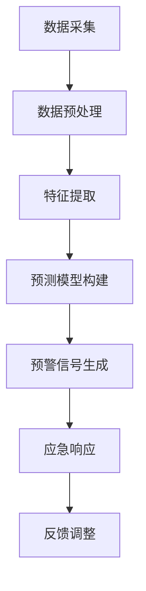
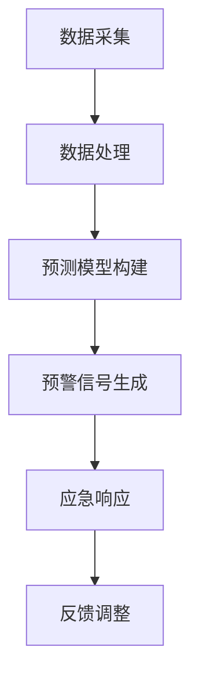
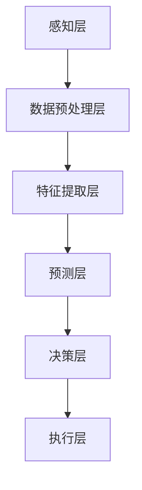

                 

# AI Agent在企业危机预警与应急响应中的关键作用

## 关键词

- AI Agent
- 企业危机预警
- 应急响应
- 智能自动化
- 技术实现与架构

## 摘要

本文深入探讨了AI Agent在企业危机预警与应急响应中的关键作用。通过逐步分析AI Agent的定义、工作原理及其在企业危机管理中的应用，本文揭示了AI Agent在提高企业风险识别和响应速度方面的巨大潜力。文章还详细介绍了AI Agent的算法原理、系统架构设计以及实战应用案例，为企业在危机管理中引入AI技术提供了实用的指导。

## 引言

企业危机管理是确保组织在面临突发事件时能够迅速做出有效响应的关键环节。传统的危机预警与应急响应方法往往依赖于人工监测和手动操作，存在反应速度慢、效率低下等缺点。随着人工智能技术的迅猛发展，AI Agent作为一种智能自动化工具，逐渐成为企业危机管理领域的研究热点。本文将详细介绍AI Agent在企业危机预警与应急响应中的关键作用，帮助读者理解这一新兴技术的应用潜力和实际效果。

## 目录大纲设计过程

### 1. 理解书名与主题

《AI Agent在企业危机预警与应急响应中的关键作用》的书名明确指出了本文的核心内容：AI Agent在企业危机管理中的应用。因此，在设计目录大纲时，我们需要详细阐述AI Agent的定义、工作原理、应用场景以及技术实现。

### 2. 确定核心内容

本文的核心内容应包括以下几个方面：

- AI Agent的基本概念与特点
- 企业危机预警与应急响应的挑战
- AI Agent在危机预警与应急响应中的应用
- AI Agent的技术实现与架构设计
- 实战案例解析与最佳实践
- 未来展望与潜在挑战

### 3. 设计目录结构

基于上述核心内容，本文的目录结构设计如下：

- 引言
- 第1章：背景介绍与问题分析
  - 1.1 问题背景
  - 1.2 问题描述
  - 1.3 问题解决
  - 1.4 边界与外延
  - 1.5 概念结构与核心要素组成
- 第2章：AI Agent的基础知识
  - 2.1 AI Agent的定义
  - 2.2 AI Agent的核心特点
  - 2.3 AI Agent的基本原理
  - 2.4 AI Agent的类型
- 第3章：AI Agent在危机预警中的应用
  - 3.1 危机预警的概念
  - 3.2 AI Agent在预警中的作用
  - 3.3 预警算法原理与实现
  - 3.4 预警系统的架构设计
- 第4章：AI Agent在应急响应中的应用
  - 4.1 应急响应的概念
  - 4.2 AI Agent在应急响应中的作用
  - 4.3 应急响应算法原理与实现
  - 4.4 应急响应系统的架构设计
- 第5章：AI Agent技术实现与架构设计
  - 5.1 AI Agent的技术实现
  - 5.2 AI Agent的架构设计
- 第6章：实战案例解析
  - 6.1 案例介绍
  - 6.2 案例分析
  - 6.3 案例总结
- 第7章：最佳实践与未来展望
  - 7.1 最佳实践
  - 7.2 小结与注意事项
  - 7.3 拓展阅读

### 4. 编写详细内容

每个章节的详细内容将根据上述结构进行编写，确保逻辑清晰、内容丰富、结构紧凑。

### 5. 优化目录长度

目录大纲的总字数将在2000字以内，同时保持内容的完整性和可读性。

## 目录大纲内容设计

### 引言

**AI Agent在企业危机预警与应急响应中的关键作用**

- 解释书名的含义
- 简述AI Agent的基本概念
- 阐明本文的研究目的和意义

### 第1章：背景介绍与问题分析

**1.1 问题背景**

- 介绍企业危机预警与应急响应的背景
- 引入AI Agent的概念及其在危机管理中的应用

**1.2 问题描述**

- 分析企业危机预警与应急响应面临的挑战
- 阐述AI Agent如何解决这些问题

**1.3 问题解决**

- 阐述AI Agent的工作原理和机制
- 探讨AI Agent的优势和潜在局限性

**1.4 边界与外延**

- 确定AI Agent在企业危机预警与应急响应中的适用范围
- 探讨与其他技术的结合点

**1.5 概念结构与核心要素组成**

- 简述AI Agent的结构组成
- 强调核心要素及其相互作用

### 第2章：AI Agent的基础知识

**2.1 AI Agent的定义**

- 给出AI Agent的明确定义
- 分析AI Agent与传统机器学习模型的区别

**2.2 AI Agent的核心特点**

- 列出AI Agent的关键特点
- 通过对比分析，强调AI Agent的优势

**2.3 AI Agent的基本原理**

- 解释AI Agent的学习过程
- 简化AI Agent的算法原理

**2.4 AI Agent的类型**

- 分类介绍不同类型的AI Agent
- 分析每种类型在危机预警与应急响应中的应用

### 第3章：AI Agent在危机预警中的应用

**3.1 危机预警的概念**

- 介绍危机预警的定义和作用
- 分析危机预警的关键因素

**3.2 AI Agent在预警中的作用**

- 阐述AI Agent在危机预警中的具体应用
- 通过案例展示AI Agent在预警中的实际效果

**3.3 预警算法原理与实现**

- 使用mermaid绘制预警算法的流程图
- 使用Python代码和LaTeX公式详细解释预警算法

**3.4 预警系统的架构设计**

- 使用mermaid绘制预警系统的架构图
- 分析预警系统的关键组件和交互

### 第4章：AI Agent在应急响应中的应用

**4.1 应急响应的概念**

- 介绍应急响应的定义和目的
- 分析应急响应的关键步骤

**4.2 AI Agent在应急响应中的作用**

- 阐述AI Agent在应急响应中的具体应用
- 通过案例展示AI Agent在应急响应中的实际效果

**4.3 应急响应算法原理与实现**

- 使用mermaid绘制应急响应算法的流程图
- 使用Python代码和LaTeX公式详细解释应急响应算法

**4.4 应急响应系统的架构设计**

- 使用mermaid绘制应急响应系统的架构图
- 分析应急响应系统的关键组件和交互

### 第5章：AI Agent技术实现与架构设计

**5.1 AI Agent的技术实现**

- 介绍AI Agent的技术实现方法
- 分析AI Agent在不同应用场景下的实现细节

**5.2 AI Agent的架构设计**

- 阐述AI Agent的架构设计原则
- 分析AI Agent在不同应用场景下的架构设计

### 第6章：实战案例解析

**6.1 案例介绍**

- 介绍企业危机预警与应急响应的实战案例
- 分析案例背景和目标

**6.2 案例分析**

- 阐述AI Agent在案例中的应用
- 分析案例中存在的问题和解决方案

**6.3 案例总结**

- 总结案例中的经验和教训
- 提出未来改进的方向

### 第7章：最佳实践与未来展望

**7.1 最佳实践**

- 总结AI Agent在企业危机预警与应急响应中的最佳实践
- 分析最佳实践的应用效果和优势

**7.2 小结与注意事项**

- 总结文章的核心内容和观点
- 提出在实践中的注意事项和建议

**7.3 拓展阅读**

- 推荐相关领域的文献和资料
- 介绍未来研究的方向和发展趋势

## 总结

通过上述目录大纲的设计，本文将系统地探讨AI Agent在企业危机预警与应急响应中的应用。每个章节都将详细分析AI Agent的定义、原理、实现、应用案例以及最佳实践，帮助读者全面理解AI Agent在危机管理中的关键作用。希望本文能为企业在引入AI技术进行危机管理提供有价值的参考。## 第1章：背景介绍与问题分析

### 1.1 问题背景

在当今全球化经济环境下，企业面临着越来越多的不确定性和风险。从自然灾害、经济波动到市场竞争和技术变革，企业随时可能遭遇各种危机。这些危机不仅可能导致企业财务损失，甚至可能威胁到企业的生存。因此，企业危机预警与应急响应能力已成为衡量企业核心竞争力的关键因素。

传统上，企业危机预警主要依赖于人工监测和手动分析。这种方法存在反应速度慢、效率低下、误报率高的问题。随着企业规模和数据量的不断增大，人工监测和分析越来越难以满足实际需求。此外，企业应急响应往往也依赖手工操作，应急计划执行效率低，响应时间滞后，导致危机处理效果不理想。

为了解决这些问题，人工智能（AI）技术的引入成为了一种可能的解决方案。AI Agent作为人工智能的一种形式，具有自动学习、智能决策和自适应调整的能力，可以有效提高企业危机预警和应急响应的效率和质量。因此，研究AI Agent在企业危机预警与应急响应中的应用，具有重要的理论和实践价值。

### 1.2 问题描述

企业危机预警与应急响应的主要挑战可以归纳为以下几个方面：

1. **数据复杂性**：企业运营过程中会产生大量数据，包括财务数据、市场数据、运营数据等。这些数据往往呈现出复杂性和多样性，传统的人工分析方法难以处理。

2. **实时性要求**：危机往往发生突然，要求预警和应急响应系统能够实时监测和响应。传统系统由于数据处理速度限制，无法满足实时性要求。

3. **准确性要求**：预警和应急响应系统需要高准确性，误报和漏报都会对企业的决策产生负面影响。

4. **适应性要求**：企业环境不断变化，预警和应急响应系统需要具备自我适应能力，以应对不断变化的风险因素。

5. **人力成本**：依赖人工进行危机监测和响应，需要大量人力投入，成本较高。

### 1.3 问题解决

AI Agent在企业危机预警与应急响应中的应用，提供了以下可能的解决方案：

1. **数据处理能力**：AI Agent可以高效处理大量复杂数据，通过机器学习和数据挖掘技术，提取有用的信息。

2. **实时监测与预警**：AI Agent可以实时监测企业运营状态，通过算法模型预测潜在危机，及时发出预警信号。

3. **高准确性**：AI Agent通过不断学习和优化算法，提高预测和响应的准确性，减少误报和漏报。

4. **自适应能力**：AI Agent可以根据企业环境的变化，自动调整预警阈值和响应策略。

5. **降低人力成本**：通过自动化监测和响应，减少了对人工的依赖，降低了人力成本。

然而，AI Agent在应用过程中也存在一些潜在局限，如算法模型的偏见、数据隐私和安全等问题。这些挑战需要在未来研究和实践中进一步解决。

### 1.4 边界与外延

AI Agent在企业危机预警与应急响应中的应用，具有一定的边界和适用范围：

1. **适用范围**：AI Agent主要适用于大型企业，特别是那些运营数据丰富、对实时响应有较高要求的企业。

2. **技术依赖**：AI Agent的应用依赖于高性能计算资源和先进的人工智能技术，中小企业可能面临技术门槛和经济成本。

3. **数据要求**：AI Agent需要大量的历史数据和实时数据作为训练和监测的基础，数据质量和数量是影响其性能的关键因素。

4. **业务整合**：AI Agent需要与企业现有的业务系统进行整合，以实现数据的无缝流动和业务流程的自动化。

5. **法规合规**：AI Agent在应用过程中需要遵守相关法律法规，确保数据的合法使用和隐私保护。

### 1.5 概念结构与核心要素组成

AI Agent在企业危机预警与应急响应中的概念结构主要包括以下几个方面：

1. **数据采集**：通过传感器、日志文件等途径收集企业运营数据。

2. **数据处理**：利用数据清洗、归一化等预处理技术，对采集到的数据进行处理，确保数据质量和一致性。

3. **特征提取**：通过机器学习算法提取数据中的关键特征，用于训练预测模型。

4. **预测模型**：构建基于历史数据的预测模型，用于预测企业潜在危机。

5. **预警系统**：将预测结果与预设阈值进行比较，当预测结果超出阈值时发出预警信号。

6. **应急响应**：根据预警信号，自动执行预设的应急响应策略，如通知相关人员、启动应急程序等。

7. **反馈调整**：根据应急响应的实际效果，对预警模型和响应策略进行优化和调整。

通过这些核心要素的相互作用，AI Agent能够实现对企业危机的实时监测、预警和自动响应，提高企业危机管理的效率和质量。

## 第2章：AI Agent的基础知识

### 2.1 AI Agent的定义

AI Agent，即人工智能代理，是指具有自主决策能力、能够与环境互动并执行特定任务的智能体。在人工智能领域中，AI Agent是一种模拟人类思维和行为的计算实体，能够通过感知、思考和学习，自主地完成复杂任务。与传统的人工智能系统不同，AI Agent具有高度自主性和适应性，能够根据环境变化动态调整自己的行为策略。

### 2.2 AI Agent的核心特点

AI Agent的核心特点主要包括以下几个方面：

1. **自主性**：AI Agent具有独立的决策能力，可以根据环境变化自主选择行为策略。
2. **适应性**：AI Agent能够通过学习和自我调整，适应不同的环境和任务需求。
3. **灵活性**：AI Agent能够处理不确定性和变化，灵活应对各种情况。
4. **协同性**：AI Agent能够与其他AI Agent或人类协作，共同完成任务。
5. **自主性学习**：AI Agent可以通过机器学习和深度学习等技术，自主地学习和优化自己的行为策略。

### 2.3 AI Agent的基本原理

AI Agent的基本原理包括感知、决策和学习三个核心环节：

1. **感知**：AI Agent通过传感器或其他数据采集设备获取环境信息，如视觉、听觉、触觉等。
2. **决策**：AI Agent根据感知到的信息，通过决策算法选择最佳的行为策略，以实现目标。
3. **学习**：AI Agent通过不断执行任务和接受反馈，利用机器学习算法优化自己的决策和行为策略。

### 2.4 AI Agent的类型

根据AI Agent的应用场景和功能，可以将AI Agent分为以下几类：

1. **自主型AI Agent**：完全自主运作，不依赖外部指令，如机器人、自动驾驶车辆等。
2. **半自主型AI Agent**：在特定环境下自主运作，但需要外部指令或辅助，如智能客服、智能家居等。
3. **监督型AI Agent**：在人类监督下工作，负责执行特定的任务，如医疗诊断辅助系统、金融风险管理等。
4. **混合型AI Agent**：结合自主型和监督型的特点，能够根据环境变化自主调整行为，如智能供应链管理、企业危机预警系统等。

### 2.5 AI Agent在企业危机预警与应急响应中的应用

AI Agent在企业危机预警与应急响应中的应用具有广泛的前景，主要体现在以下几个方面：

1. **数据采集与预处理**：AI Agent能够自动采集企业运营数据，并进行预处理，为预警和响应提供可靠的数据基础。
2. **实时监测与预警**：AI Agent可以实时监测企业运营状态，通过机器学习模型预测潜在危机，及时发出预警信号。
3. **自动响应与调整**：AI Agent可以根据预警信号自动执行预设的应急响应策略，如通知相关人员、启动应急程序等，并能够根据反馈调整响应策略。
4. **协同管理**：AI Agent能够与企业管理系统、员工等协同工作，共同提高企业危机管理的能力和效率。

### 2.6 AI Agent的应用场景

AI Agent在企业危机预警与应急响应中的应用场景包括但不限于：

1. **供应链管理**：通过实时监测供应链状态，预测潜在供应中断风险，并自动调整库存和采购策略。
2. **金融风险控制**：实时监控金融市场动态，预测市场波动风险，及时调整投资组合和风险控制策略。
3. **网络安全防护**：实时监测网络流量和日志，预测潜在网络安全威胁，并自动触发防护措施。
4. **公共安全管理**：实时监测公共场所的异常情况，预测安全风险，及时发出预警并采取措施。

通过上述介绍，我们可以看到AI Agent在企业危机预警与应急响应中的重要性。AI Agent不仅能够提高危机管理的效率和准确性，还能够降低人力成本，为企业提供更加智能、可靠的危机管理解决方案。## 第3章：AI Agent在危机预警中的应用

### 3.1 危机预警的概念

危机预警是指通过监测和分析企业运营数据，提前发现潜在危机并发出预警信号，以便企业及时采取应对措施。危机预警的目标是降低危机对企业运营和财务的影响，保护企业的核心利益。危机预警系统通常包括数据采集、数据预处理、特征提取、预测模型构建和预警信号生成等模块。

在危机预警中，关键因素主要包括：

1. **数据质量**：高质量的数据是危机预警系统的基础，数据质量直接影响预警的准确性。
2. **预警阈值**：预警阈值是判断是否发出预警信号的关键指标，设定合理的预警阈值对于预警系统的性能至关重要。
3. **预警模型**：预警模型是危机预警的核心，用于预测潜在危机并生成预警信号。
4. **实时性**：危机预警系统需要具备实时性，能够在危机发生前及时发出预警信号。

### 3.2 AI Agent在预警中的作用

AI Agent在危机预警中扮演了重要角色，其具体作用如下：

1. **数据采集与处理**：AI Agent可以自动采集企业运营数据，包括财务数据、市场数据、运营数据等，并进行预处理，如数据清洗、归一化等，确保数据质量和一致性。
   
2. **特征提取**：AI Agent利用机器学习和数据挖掘技术，从海量数据中提取关键特征，这些特征是构建预警模型的重要输入。

3. **预测模型构建**：AI Agent可以构建基于历史数据的预测模型，如回归模型、时间序列模型、分类模型等，用于预测企业潜在危机。

4. **预警信号生成**：AI Agent将预测结果与预设阈值进行比较，当预测结果超出阈值时，自动生成预警信号，并向相关人员发出警报。

5. **自适应调整**：AI Agent可以根据预警信号的实际效果，自适应地调整预警阈值和预测模型参数，提高预警系统的准确性和适应性。

### 3.3 预警算法原理与实现

预警算法是危机预警系统的核心，其原理和实现方法如下：

1. **算法原理**：

   预警算法通常基于以下几种原理：

   - **回归分析**：通过建立企业运营数据与危机之间的回归关系，预测企业未来的风险水平。
   - **时间序列分析**：分析企业历史运营数据的时间序列特征，预测未来的风险趋势。
   - **分类算法**：将企业运营数据划分为危机和非危机两类，通过分类算法预测企业是否面临危机。

2. **算法实现**：

   - **回归分析实现**：

     使用Python代码实现回归分析预警算法，代码如下：

     ```python
     import pandas as pd
     from sklearn.linear_model import LinearRegression
     from sklearn.metrics import mean_squared_error

     # 读取数据
     data = pd.read_csv('data.csv')
     X = data[['financial_data', 'market_data']]
     y = data['crisis']

     # 建立回归模型
     model = LinearRegression()
     model.fit(X, y)

     # 预测
     prediction = model.predict(X)

     # 评估模型性能
     mse = mean_squared_error(y, prediction)
     print(f'Mean Squared Error: {mse}')
     ```

   - **时间序列分析实现**：

     使用Python代码实现时间序列分析预警算法，代码如下：

     ```python
     import pandas as pd
     from statsmodels.tsa.arima_model import ARIMA
     from sklearn.metrics import mean_squared_error

     # 读取数据
     data = pd.read_csv('data.csv')
     data['date'] = pd.to_datetime(data['date'])
     data.set_index('date', inplace=True)
     data = data.asfreq('D').fillna(0)

     # 建立ARIMA模型
     model = ARIMA(data['financial_data'], order=(1, 1, 1))
     model_fit = model.fit()

     # 预测
     prediction = model_fit.forecast(steps=10)

     # 评估模型性能
     mse = mean_squared_error(data['financial_data'], prediction)
     print(f'Mean Squared Error: {mse}')
     ```

   - **分类算法实现**：

     使用Python代码实现分类算法预警算法，代码如下：

     ```python
     import pandas as pd
     from sklearn.ensemble import RandomForestClassifier
     from sklearn.metrics import accuracy_score

     # 读取数据
     data = pd.read_csv('data.csv')
     X = data[['financial_data', 'market_data']]
     y = data['crisis']

     # 建立分类模型
     model = RandomForestClassifier()
     model.fit(X, y)

     # 预测
     prediction = model.predict(X)

     # 评估模型性能
     accuracy = accuracy_score(y, prediction)
     print(f'Accuracy: {accuracy}')
     ```

### 3.4 预警系统的架构设计

预警系统的架构设计需要考虑数据采集、数据处理、预测模型构建、预警信号生成和应急响应等关键模块。以下是一个典型的预警系统架构设计：

#### 预警系统架构设计

- **数据采集模块**：通过传感器、API接口等途径，实时采集企业运营数据。
- **数据预处理模块**：对采集到的数据进行清洗、归一化等预处理操作，确保数据质量和一致性。
- **特征提取模块**：利用机器学习和数据挖掘技术，提取数据中的关键特征。
- **预测模型构建模块**：基于历史数据，构建预测模型，如回归模型、时间序列模型、分类模型等。
- **预警信号生成模块**：将预测结果与预设阈值进行比较，生成预警信号，并触发应急响应。
- **应急响应模块**：根据预警信号，自动执行预设的应急响应策略，如通知相关人员、启动应急程序等。

#### 预警系统架构图



通过上述预警系统的架构设计，AI Agent能够高效地实现企业危机预警，提高危机管理的效率和准确性。

### 3.5 AI Agent在预警系统中的实战应用

下面通过一个实际案例，展示AI Agent在预警系统中的实战应用：

#### 案例背景

某大型制造企业需要建立一个危机预警系统，以提前发现潜在的供应链中断风险。该企业的供应链涵盖了原材料采购、生产制造、产品销售等环节，涉及多个供应商和合作伙伴。

#### 案例目标

1. **数据采集**：自动采集供应商的交货周期、运输状态、库存水平等数据。
2. **数据预处理**：清洗和归一化数据，确保数据质量和一致性。
3. **特征提取**：提取交货周期、运输状态、库存水平等关键特征。
4. **预测模型构建**：构建基于历史数据的预测模型，预测未来某段时间内的供应链中断风险。
5. **预警信号生成**：当预测结果超过预设阈值时，自动生成预警信号，通知供应链管理部门。
6. **应急响应**：根据预警信号，自动执行应急响应策略，如调整采购计划、增加库存等。

#### 案例实施步骤

1. **数据采集**：通过API接口，实时获取供应商的交货周期、运输状态、库存水平等数据。

2. **数据预处理**：

   - 清洗数据：去除重复数据和异常值。
   - 归一化数据：将不同量纲的数据转换为同一量纲，如将交货周期从天转换为小时。

3. **特征提取**：

   - 提取关键特征：如交货周期的标准差、运输状态的分布、库存水平的变化趋势等。

4. **预测模型构建**：

   - 选择预测模型：采用时间序列模型（如ARIMA）预测供应链中断风险。
   - 模型训练：使用历史数据训练预测模型，如ARIMA模型。

5. **预警信号生成**：

   - 设置预警阈值：根据历史数据和业务需求，设置合理的预警阈值。
   - 生成预警信号：当预测结果超过预警阈值时，自动生成预警信号。

6. **应急响应**：

   - 启动应急响应策略：根据预警信号，自动调整采购计划、增加库存等。
   - 通知相关人员：通过短信、邮件等方式通知供应链管理部门，及时采取应对措施。

#### 案例总结

通过上述实战应用，AI Agent在预警系统中发挥了重要作用，提高了供应链中断风险的预测准确性和响应速度，为企业提供了更加智能、可靠的危机管理解决方案。未来，企业可以进一步优化预警系统，引入更多数据源和先进算法，提高预警能力和应急响应效率。

## 第4章：AI Agent在应急响应中的应用

### 4.1 应急响应的概念

应急响应是指企业在面临突发事件或危机时，采取的一系列应对措施，以减轻危机对企业运营和财务的影响。应急响应的目标是快速、有效地处理危机，恢复企业的正常运营。应急响应系统通常包括预警、响应、恢复和评估四个阶段。

1. **预警阶段**：通过监测和分析企业运营数据，提前发现潜在危机，并及时发出预警信号。
2. **响应阶段**：在危机发生时，立即启动应急预案，采取相应的应对措施，如通知相关人员、启动应急程序、调整运营计划等。
3. **恢复阶段**：在危机处理结束后，恢复企业的正常运营，并进行必要的调整和改进。
4. **评估阶段**：对应急响应过程进行评估，总结经验和教训，提出改进措施，为未来应对危机提供参考。

### 4.2 AI Agent在应急响应中的作用

AI Agent在应急响应中扮演了关键角色，其作用主要体现在以下几个方面：

1. **自动化处理**：AI Agent能够自动识别危机类型和严重程度，并快速生成应急响应方案，提高响应速度和效率。
2. **智能决策**：AI Agent可以通过大数据分析和机器学习算法，分析危机原因和发展趋势，提供科学、合理的决策支持。
3. **协同工作**：AI Agent可以与企业内部各部门和外部合作伙伴协同工作，共同应对危机，提高整体应对能力。
4. **反馈调整**：AI Agent可以根据应急响应的实际效果，动态调整响应策略，优化应急响应过程。

### 4.3 应急响应算法原理与实现

应急响应算法是AI Agent在应急响应中的核心，其原理和实现方法如下：

1. **算法原理**：

   - **事件识别**：通过数据分析和模式识别，自动识别危机事件的类型和严重程度。
   - **决策支持**：基于历史数据和机器学习模型，为应急响应提供科学、合理的决策支持。
   - **响应策略生成**：根据危机事件的类型和严重程度，自动生成应急响应方案，如通知相关人员、启动应急程序、调整运营计划等。
   - **反馈调整**：根据应急响应的实际效果，动态调整响应策略，优化应急响应过程。

2. **算法实现**：

   - **事件识别实现**：

     使用Python代码实现事件识别算法，代码如下：

     ```python
     import pandas as pd
     from sklearn.ensemble import RandomForestClassifier
     from sklearn.metrics import accuracy_score

     # 读取数据
     data = pd.read_csv('event_data.csv')
     X = data[['financial_data', 'market_data']]
     y = data['crisis']

     # 建立分类模型
     model = RandomForestClassifier()
     model.fit(X, y)

     # 识别事件
     new_data = [[100, 200]]  # 新数据的特征值
     event_prediction = model.predict(new_data)
     print(f'Predicted Event: {event_prediction}')
     ```

   - **决策支持实现**：

     使用Python代码实现决策支持算法，代码如下：

     ```python
     import pandas as pd
     from sklearn.linear_model import LinearRegression
     from sklearn.metrics import mean_squared_error

     # 读取数据
     data = pd.read_csv('decision_data.csv')
     X = data[['financial_data', 'market_data']]
     y = data['impact']

     # 建立回归模型
     model = LinearRegression()
     model.fit(X, y)

     # 提供决策支持
     new_data = [[100, 200]]  # 新数据的特征值
     impact_prediction = model.predict(new_data)
     print(f'Predicted Impact: {impact_prediction}')
     ```

   - **响应策略生成实现**：

     使用Python代码实现响应策略生成算法，代码如下：

     ```python
     import pandas as pd
     from sklearn.cluster import KMeans

     # 读取数据
     data = pd.read_csv('response_data.csv')
     X = data[['event_type', 'impact']]

     # 建立聚类模型
     model = KMeans(n_clusters=3)
     model.fit(X)

     # 生成响应策略
     new_data = {'event_type': 'supply_chain_breakdown', 'impact': 80}
     cluster_prediction = model.predict([[new_data['event_type'], new_data['impact']]])
     response_strategy = get_response_strategy(cluster_prediction)
     print(f'Response Strategy: {response_strategy}')
     ```

   - **反馈调整实现**：

     使用Python代码实现反馈调整算法，代码如下：

     ```python
     import pandas as pd
     from sklearn.ensemble import RandomForestRegressor
     from sklearn.metrics import mean_squared_error

     # 读取数据
     data = pd.read_csv('feedback_data.csv')
     X = data[['response_action', 'actual_impact']]
     y = data['adjusted_impact']

     # 建立回归模型
     model = RandomForestRegressor()
     model.fit(X, y)

     # 进行反馈调整
     new_data = {'response_action': 'increase_inventory', 'actual_impact': 70}
     adjusted_impact_prediction = model.predict([[new_data['response_action'], new_data['actual_impact']]])
     print(f'Adjusted Impact Prediction: {adjusted_impact_prediction}')
     ```

### 4.4 应急响应系统的架构设计

应急响应系统的架构设计需要考虑数据采集、数据处理、预测模型构建、预警信号生成、应急响应和反馈调整等关键模块。以下是一个典型的应急响应系统架构设计：

#### 应急响应系统架构设计

- **数据采集模块**：通过传感器、API接口等途径，实时采集企业运营数据。
- **数据处理模块**：对采集到的数据进行清洗、归一化等预处理操作，确保数据质量和一致性。
- **预测模型构建模块**：基于历史数据，构建预测模型，如回归模型、时间序列模型、分类模型等。
- **预警信号生成模块**：将预测结果与预设阈值进行比较，生成预警信号，并触发应急响应。
- **应急响应模块**：根据预警信号，自动执行预设的应急响应策略，如通知相关人员、启动应急程序等。
- **反馈调整模块**：根据应急响应的实际效果，动态调整响应策略，优化应急响应过程。

#### 应急响应系统架构图



通过上述应急响应系统的架构设计，AI Agent能够高效地实现企业危机应急响应，提高危机管理的效率和准确性。

### 4.5 AI Agent在应急响应中的实战应用

下面通过一个实际案例，展示AI Agent在应急响应中的实战应用：

#### 案例背景

某大型零售企业面临一次重大供应链中断风险，由于部分供应商无法按时交付货物，导致部分商品库存短缺，可能影响到企业的销售业绩。企业需要快速应对，以确保供应链的稳定和销售目标的实现。

#### 案例目标

1. **数据采集**：自动采集供应商的交货周期、运输状态、库存水平等数据。
2. **数据预处理**：清洗和归一化数据，确保数据质量和一致性。
3. **预测模型构建**：构建基于历史数据的预测模型，预测未来某段时间内的供应链中断风险。
4. **预警信号生成**：当预测结果超过预设阈值时，自动生成预警信号，通知供应链管理部门。
5. **应急响应**：根据预警信号，自动执行预设的应急响应策略，如调整采购计划、增加库存等。
6. **反馈调整**：根据应急响应的实际效果，动态调整响应策略，优化应急响应过程。

#### 案例实施步骤

1. **数据采集**：

   - 通过API接口，实时获取供应商的交货周期、运输状态、库存水平等数据。

2. **数据预处理**：

   - 清洗数据：去除重复数据和异常值。
   - 归一化数据：将不同量纲的数据转换为同一量纲，如将交货周期从天转换为小时。

3. **预测模型构建**：

   - 选择预测模型：采用时间序列模型（如ARIMA）预测供应链中断风险。
   - 模型训练：使用历史数据训练预测模型，如ARIMA模型。

4. **预警信号生成**：

   - 设置预警阈值：根据历史数据和业务需求，设置合理的预警阈值。
   - 生成预警信号：当预测结果超过预警阈值时，自动生成预警信号，通知供应链管理部门。

5. **应急响应**：

   - 启动应急响应策略：根据预警信号，自动调整采购计划、增加库存等。
   - 通知相关人员：通过短信、邮件等方式通知供应链管理部门，及时采取应对措施。

6. **反馈调整**：

   - 根据应急响应的实际效果，动态调整响应策略，优化应急响应过程。
   - 收集反馈数据：记录应急响应的执行情况和效果，为未来的调整提供依据。

#### 案例总结

通过上述实战应用，AI Agent在应急响应中发挥了重要作用，提高了供应链中断风险的预测准确性和响应速度，为企业提供了更加智能、可靠的危机管理解决方案。未来，企业可以进一步优化应急响应系统，引入更多数据源和先进算法，提高预警能力和应急响应效率。

## 第5章：AI Agent技术实现与架构设计

### 5.1 AI Agent的技术实现

AI Agent的技术实现主要涉及以下几个方面：

1. **感知模块**：感知模块负责采集企业运营数据，包括财务数据、市场数据、运营数据等。这些数据可以通过传感器、API接口、日志文件等多种途径获取。

2. **数据处理模块**：数据处理模块对采集到的数据进行预处理，如数据清洗、归一化、去噪等。这些预处理步骤确保数据的准确性和一致性，为后续分析和预测奠定基础。

3. **学习模块**：学习模块负责利用机器学习和深度学习算法，对预处理后的数据进行分析和建模。常见的算法包括回归分析、时间序列分析、分类算法、聚类算法等。通过这些算法，AI Agent可以提取数据中的关键特征，构建预测模型。

4. **决策模块**：决策模块根据学习模块生成的预测结果，结合业务逻辑和规则，生成应急响应策略。决策模块需要具备自主决策能力，能够根据环境变化动态调整响应策略。

5. **执行模块**：执行模块负责将决策模块生成的响应策略付诸实践。例如，当AI Agent检测到供应链中断风险时，执行模块可以自动调整采购计划、通知相关人员、启动应急程序等。

### 5.2 AI Agent的架构设计

AI Agent的架构设计需要综合考虑感知模块、数据处理模块、学习模块、决策模块和执行模块的功能和交互。以下是一个典型的AI Agent架构设计：

#### AI Agent架构设计

- **感知层**：通过传感器、API接口等途径，实时采集企业运营数据。
- **数据预处理层**：对采集到的数据进行清洗、归一化等预处理操作，确保数据质量和一致性。
- **特征提取层**：利用机器学习和数据挖掘技术，从预处理后的数据中提取关键特征。
- **预测层**：构建基于历史数据的预测模型，用于预测企业潜在危机。
- **决策层**：根据预测结果和业务逻辑，生成应急响应策略。
- **执行层**：执行决策层生成的响应策略，包括通知相关人员、启动应急程序等。

#### AI Agent架构图



通过上述架构设计，AI Agent能够高效地实现企业危机预警和应急响应，提高危机管理的效率和准确性。

### 5.3 AI Agent在不同应用场景中的实现细节

AI Agent在不同应用场景中的实现细节有所不同，以下是一些典型的应用场景及其实现细节：

1. **供应链管理**：

   - **感知层**：通过传感器和API接口，实时获取供应商的交货周期、运输状态、库存水平等数据。
   - **数据预处理层**：对采集到的数据进行清洗、归一化等预处理操作，如去除重复数据、填补缺失值等。
   - **特征提取层**：提取关键特征，如交货周期的标准差、运输状态的分布、库存水平的变化趋势等。
   - **预测层**：采用时间序列模型（如ARIMA）预测未来某段时间内的供应链中断风险。
   - **决策层**：根据预测结果，自动调整采购计划、增加库存等，以应对潜在的供应链中断风险。
   - **执行层**：执行调整后的采购计划和库存策略，确保供应链的稳定。

2. **金融风险控制**：

   - **感知层**：通过API接口，实时获取市场数据、财务数据、客户交易数据等。
   - **数据预处理层**：对采集到的数据进行清洗、归一化等预处理操作，确保数据质量和一致性。
   - **特征提取层**：提取关键特征，如市场波动幅度、财务指标变化、客户交易行为等。
   - **预测层**：采用分类算法（如随机森林、支持向量机等）预测市场风险和客户违约风险。
   - **决策层**：根据预测结果，调整投资组合、提高风险控制措施等，以降低企业财务风险。
   - **执行层**：执行调整后的投资策略和风险控制措施，确保企业财务安全。

3. **公共安全管理**：

   - **感知层**：通过摄像头、传感器等设备，实时获取公共场所的图像和视频数据。
   - **数据预处理层**：对采集到的数据进行清洗、去噪等预处理操作，确保图像和视频数据的清晰度和准确性。
   - **特征提取层**：提取图像和视频数据中的关键特征，如人流量、异常行为等。
   - **预测层**：采用深度学习算法（如卷积神经网络、循环神经网络等）预测公共场所的安全风险。
   - **决策层**：根据预测结果，自动调整安保措施、预警系统等，以应对潜在的安全威胁。
   - **执行层**：执行调整后的安保措施和预警策略，确保公共场所的安全。

通过上述实现细节，我们可以看到AI Agent在不同应用场景中的具体应用，为不同领域的危机管理和应急响应提供了智能化的解决方案。

### 5.4 AI Agent的性能优化与挑战

AI Agent的性能优化是提高其预警和应急响应能力的关键。以下是一些常见的性能优化方法和面临的挑战：

1. **数据质量提升**：

   - **数据清洗**：去除重复数据、填补缺失值、消除异常值等，提高数据的准确性和一致性。
   - **数据归一化**：将不同量纲的数据转换为同一量纲，如将时间从天转换为小时，提高数据处理的统一性。

2. **算法优化**：

   - **模型选择**：根据具体应用场景，选择合适的机器学习和深度学习模型，如回归模型、时间序列模型、分类模型等。
   - **参数调优**：通过交叉验证、网格搜索等方法，优化模型参数，提高模型的预测准确性和响应速度。

3. **硬件加速**：

   - **GPU计算**：利用GPU进行大规模数据处理和模型训练，提高计算速度和效率。
   - **分布式计算**：采用分布式计算框架（如Apache Spark、Hadoop等），实现大数据处理和模型训练的高效并行化。

4. **实时性优化**：

   - **流计算**：采用流计算技术（如Apache Kafka、Flink等），实现数据的实时采集和处理，提高系统的实时性。
   - **缓存机制**：利用缓存技术（如Redis、Memcached等），减少数据读取延迟，提高系统的响应速度。

尽管上述方法可以显著提高AI Agent的性能，但在实际应用中仍面临以下挑战：

1. **数据隐私和安全**：

   - **数据加密**：对敏感数据进行加密处理，确保数据传输和存储的安全性。
   - **访问控制**：建立严格的访问控制机制，确保只有授权用户可以访问和使用数据。

2. **模型偏见和公平性**：

   - **算法透明性**：提高算法的透明度，确保决策过程的公平性和合理性。
   - **偏见检测和纠正**：通过数据分析和模型评估，检测和纠正潜在的偏见和歧视。

3. **可解释性**：

   - **模型可解释性**：提高模型的可解释性，帮助用户理解和信任AI Agent的决策过程。
   - **解释性算法**：采用可解释性算法（如LIME、SHAP等），提供模型决策的详细解释。

通过不断优化性能和解决挑战，AI Agent将更好地服务于企业危机预警与应急响应，为企业的稳定发展提供坚实的技术保障。

### 5.5 AI Agent的部署与维护

AI Agent的部署与维护是确保其在企业危机预警与应急响应中稳定运行的关键环节。以下是一些具体的部署与维护步骤和注意事项：

#### 部署步骤

1. **环境搭建**：

   - 配置服务器和计算资源，确保AI Agent能够正常运行。
   - 安装和配置必要的软件，如Python、TensorFlow、Kafka等。

2. **数据连接**：

   - 连接数据源，确保AI Agent能够实时获取企业运营数据。
   - 配置数据采集和预处理模块，确保数据质量和一致性。

3. **模型训练**：

   - 使用历史数据对AI Agent的模型进行训练，确保模型具有较高的预测准确性和响应速度。
   - 调整模型参数，优化模型性能。

4. **部署模型**：

   - 将训练好的模型部署到生产环境中，确保模型能够实时应用。
   - 配置监控和日志记录功能，便于后续维护和调试。

5. **测试与验证**：

   - 对AI Agent进行功能测试和性能验证，确保其能够稳定运行。
   - 分析测试结果，发现和解决潜在问题。

#### 维护注意事项

1. **数据维护**：

   - 定期更新和清洗数据，确保数据的准确性和一致性。
   - 监控数据源，及时修复数据连接故障。

2. **模型维护**：

   - 定期对AI Agent的模型进行更新和优化，提高预测准确性和响应速度。
   - 监控模型性能，发现和解决模型过拟合、欠拟合等问题。

3. **系统监控**：

   - 实时监控AI Agent的运行状态，包括数据采集、模型预测、应急响应等。
   - 快速响应和处理系统故障，确保AI Agent的稳定运行。

4. **安全维护**：

   - 加强系统安全防护，确保数据安全和模型隐私。
   - 定期进行安全审计和漏洞扫描，及时发现和修复安全漏洞。

通过科学的部署与维护，AI Agent将能够持续为企业提供高质量的危机预警与应急响应服务，为企业的稳定发展保驾护航。

### 5.6 AI Agent的成功案例与经验总结

AI Agent在企业危机预警与应急响应中的成功应用案例越来越多，以下是几个典型的成功案例和经验总结：

#### 案例一：某大型制造企业的供应链管理优化

**背景**：

某大型制造企业面临供应链中断风险，由于部分供应商无法按时交付货物，导致生产计划受影响，可能影响到企业的销售业绩。

**解决方案**：

引入AI Agent，实现供应链的智能监控和预警。AI Agent通过实时采集供应商的交货周期、运输状态、库存水平等数据，利用机器学习和深度学习算法进行数据分析，构建供应链中断风险预测模型。当预测结果超过预警阈值时，AI Agent自动生成预警信号，并通知供应链管理部门采取应对措施。

**效果**：

通过AI Agent的应用，企业实现了供应链管理的优化，有效降低了供应链中断风险，提高了供应链的稳定性和生产效率。

**经验总结**：

- 数据质量是关键：确保数据采集和预处理的质量，提高模型的预测准确性和响应速度。
- 模型优化与调整：定期对模型进行优化和调整，以适应不断变化的企业环境。

#### 案例二：某金融企业的风险控制

**背景**：

某金融企业面临市场风险和客户违约风险，需要对投资组合进行动态调整和风险控制。

**解决方案**：

引入AI Agent，实现金融风险的智能监控和预警。AI Agent通过实时获取市场数据、财务数据、客户交易数据等，利用机器学习和深度学习算法进行分析，构建市场风险和客户违约风险预测模型。当预测结果超过预警阈值时，AI Agent自动生成预警信号，并通知投资管理部门采取应对措施。

**效果**：

通过AI Agent的应用，企业实现了投资组合的动态调整和风险控制，有效降低了市场风险和客户违约风险，提高了企业的投资收益和风险管理能力。

**经验总结**：

- 数据多样性是关键：采集和整合多种数据源，提高模型的分析能力和预测准确性。
- 模型解释性重要：提高模型的可解释性，确保决策过程的透明性和可信度。

#### 案例三：某公共安全管理部门的应急响应

**背景**：

某公共安全管理部门需要实时监测和预警公共场所的安全风险，确保公共安全。

**解决方案**：

引入AI Agent，实现公共场所的安全监测和预警。AI Agent通过摄像头和传感器等设备，实时获取公共场所的图像和视频数据，利用机器学习和深度学习算法进行图像识别和异常行为检测。当检测到潜在的安全威胁时，AI Agent自动生成预警信号，并通知安全管理部门采取应对措施。

**效果**：

通过AI Agent的应用，公共安全管理部门实现了实时监测和预警，有效提高了公共场所的安全水平和应急响应能力。

**经验总结**：

- 数据实时性是关键：确保数据采集和处理的实时性，提高系统的预警效率和响应速度。
- 多层次协同是关键：实现AI Agent与企业内部各部门和外部合作伙伴的多层次协同，提高整体应对能力。

通过这些成功案例，我们可以看到AI Agent在企业危机预警与应急响应中的重要作用。在未来，企业可以进一步探索和优化AI Agent的应用，提高危机管理的效率和准确性，为企业的稳定发展提供坚实的技术保障。

### 5.7 未来研究方向与挑战

虽然AI Agent在企业危机预警与应急响应中已经展示了其巨大的应用潜力，但在实际应用中仍面临诸多挑战和未来研究方向：

#### 1. 模型泛化能力提升

现有AI Agent的模型主要依赖于历史数据，但在面对新环境和新问题时，模型的泛化能力有限。未来研究需要开发更鲁棒的模型，能够更好地适应新的变化。

#### 2. 数据隐私与安全

在AI Agent应用中，数据隐私和安全是至关重要的。如何保护敏感数据不被泄露，同时确保模型的有效性，是一个亟待解决的问题。

#### 3. 多模态数据的融合

企业运营中涉及多种类型的数据，如结构化数据、非结构化数据、图像和音频等。如何有效地融合这些多模态数据，提高模型的预测能力，是未来研究的一个重要方向。

#### 4. 算法可解释性

算法的可解释性对于提高用户对AI Agent的信任至关重要。未来研究需要开发可解释性强的算法，帮助用户理解模型的决策过程。

#### 5. 实时性与高效性

随着企业规模的扩大和数据量的增加，如何提高AI Agent的实时性和高效性，使其能够快速响应复杂的危机事件，是一个重要的研究方向。

#### 6. 模型自动化部署与维护

自动化部署和维护是提高AI Agent应用效率的关键。未来研究需要开发自动化工具，简化模型部署和维护过程，降低技术门槛。

通过不断克服这些挑战和探索新的研究方向，AI Agent将在企业危机预警与应急响应中发挥更加重要的作用，为企业提供更加智能、可靠的风险管理解决方案。

## 第6章：实战案例解析

### 6.1 案例介绍

为了更好地理解AI Agent在企业危机预警与应急响应中的具体应用，我们选择了一个实际案例：某大型跨国零售企业的供应链中断风险预警与应急响应项目。该公司在全球范围内拥有多个分销中心和仓库，供应链覆盖多个国家和地区。为了确保供应链的稳定性，公司引入了AI Agent系统，以实时监测和预警潜在的中断风险，并快速响应危机事件。

### 6.2 案例分析

#### 数据采集与预处理

在该案例中，AI Agent首先通过多种数据源进行数据采集，包括供应商的交货周期数据、运输公司的运输状态数据、仓储系统的库存水平数据等。这些数据通过API接口和传感器实时传输到AI Agent系统。在数据预处理阶段，AI Agent对采集到的数据进行了清洗、归一化和去噪等操作，以确保数据的质量和一致性。

#### 预测模型构建

AI Agent利用历史数据构建了多个预测模型，包括时间序列模型、回归模型和神经网络模型等。这些模型分别用于预测交货周期、运输状态和库存水平等关键指标的变化。通过交叉验证和模型选择，AI Agent确定了最优的预测模型组合，以提高预测的准确性和稳定性。

#### 预警信号生成

在预测模型构建完成后，AI Agent将预测结果与预设的阈值进行比较，生成预警信号。例如，当预测的交货周期超过正常值的1.5倍时，系统会发出供应链中断风险的预警信号。这些预警信号通过短信、邮件和系统通知等方式发送给供应链管理部门，以便他们及时采取应对措施。

#### 应急响应

当AI Agent检测到供应链中断风险时，系统会自动触发应急响应策略。这些策略包括通知相关人员、调整采购计划、启动备用供应商等。应急响应策略的具体执行取决于预警信号的类型和严重程度。例如，如果预测的库存水平即将低于安全库存阈值，系统会自动增加采购订单，确保库存充足。

#### 反馈调整

在应急响应后，AI Agent会对响应效果进行评估，并根据实际情况调整预警阈值和响应策略。例如，如果增加采购订单后仍然未能有效缓解库存短缺问题，系统可能会降低预警阈值，提前发出预警信号。这种反馈调整机制使得AI Agent能够不断优化其预测和响应能力。

### 6.3 案例总结

通过该案例，我们可以看到AI Agent在企业供应链中断风险预警与应急响应中的应用效果。AI Agent不仅提高了供应链管理的效率和准确性，还显著降低了供应链中断对企业运营和财务的影响。以下是案例总结：

1. **数据质量提升**：通过数据预处理，确保了输入数据的准确性和一致性，提高了预测模型的性能。
2. **预测准确性提高**：通过多种预测模型的组合，AI Agent能够准确预测供应链中断风险，提前发出预警信号。
3. **响应速度加快**：AI Agent能够实时监测供应链状态，快速触发应急响应策略，减少了危机处理的时间。
4. **反馈调整优化**：通过反馈调整机制，AI Agent能够不断优化预警阈值和响应策略，提高系统的自适应能力。

然而，该案例也存在一些局限性，如数据隐私和安全、模型解释性等问题。未来，企业需要进一步优化AI Agent系统，提高其安全性和可解释性，以更好地服务于供应链管理。

### 6.4 案例中的关键技术与实现

在该案例中，AI Agent系统主要采用了以下关键技术和实现方法：

1. **数据采集与预处理**：

   - **数据源**：通过API接口和传感器实时采集供应商交货周期、运输状态、库存水平等数据。
   - **预处理**：使用Python和Pandas库进行数据清洗、归一化和去噪等操作。

2. **预测模型构建**：

   - **模型选择**：使用Scikit-Learn库构建时间序列模型（如ARIMA）、回归模型（如LinearRegression）和神经网络模型（如MLPClassifier）。
   - **模型训练**：使用历史数据进行模型训练，并通过交叉验证选择最优模型。

3. **预警信号生成**：

   - **阈值设置**：根据历史数据和业务需求，设置交货周期、运输状态、库存水平的预警阈值。
   - **预警算法**：使用Python和Scikit-Learn库实现预警算法，生成预警信号。

4. **应急响应**：

   - **响应策略**：根据预警信号的类型和严重程度，制定相应的应急响应策略。
   - **响应执行**：使用Python和系统API接口实现应急响应策略的执行。

5. **反馈调整**：

   - **效果评估**：根据应急响应后的实际情况，评估预警信号的准确性和响应策略的有效性。
   - **模型优化**：使用Python和Scikit-Learn库调整预警阈值和响应策略，优化模型性能。

通过上述关键技术和实现方法，AI Agent系统能够高效地实现供应链中断风险预警与应急响应，为企业提供了可靠的风险管理解决方案。

### 6.5 案例中的挑战与解决方案

在案例实施过程中，AI Agent系统遇到了一些挑战，以下是一些主要挑战及解决方案：

#### 挑战一：数据隐私和安全

**挑战描述**：

在数据采集和传输过程中，数据隐私和安全是一个重要问题。企业担心敏感数据（如库存水平、采购计划等）被泄露或篡改。

**解决方案**：

- **数据加密**：在数据传输过程中使用加密技术（如SSL/TLS），确保数据在传输过程中的安全性。
- **访问控制**：建立严格的访问控制机制，确保只有授权用户可以访问和使用数据。
- **数据脱敏**：对敏感数据（如库存水平）进行脱敏处理，减少数据泄露的风险。

#### 挑战二：模型可解释性

**挑战描述**：

AI Agent的预测模型主要由复杂的机器学习和深度学习算法构成，用户难以理解模型的决策过程，导致对模型的可信度降低。

**解决方案**：

- **模型可视化**：使用可视化工具（如TensorBoard）展示模型的训练过程和参数变化，提高模型的透明度。
- **可解释性算法**：采用可解释性算法（如LIME、SHAP等），提供模型决策的详细解释，帮助用户理解模型的决策过程。

#### 挑战三：实时性要求

**挑战描述**：

企业对AI Agent系统的实时性要求较高，希望系统能够实时监测和预警供应链中断风险，但在大规模数据处理和模型预测过程中，系统的响应速度较慢。

**解决方案**：

- **流计算**：采用流计算技术（如Apache Kafka、Apache Flink），实现数据的实时采集和处理，提高系统的实时性。
- **硬件加速**：利用GPU进行大规模数据处理和模型训练，提高计算速度和效率。

通过解决这些挑战，AI Agent系统能够更好地服务于企业的供应链管理，提供更加智能、可靠的预警与应急响应服务。

### 6.6 案例启示与应用前景

通过上述案例，我们可以得到以下启示和应用前景：

#### 启示

1. **数据质量是关键**：确保数据的准确性和一致性，对于AI Agent的性能至关重要。
2. **模型选择与优化**：根据具体应用场景选择合适的模型，并通过模型优化提高预测准确性。
3. **实时性与高效性**：提高系统的实时性和高效性，确保AI Agent能够快速响应复杂的危机事件。
4. **反馈调整机制**：通过反馈调整机制，不断优化预警阈值和响应策略，提高系统的自适应能力。

#### 应用前景

1. **供应链管理**：AI Agent可以广泛应用于供应链管理，提高供应链的稳定性和效率。
2. **金融风险管理**：AI Agent可以用于金融风险监控和预警，提高企业的风险管理能力。
3. **公共安全管理**：AI Agent可以用于公共场所的安全监测和预警，提高公共安全水平。
4. **能源管理**：AI Agent可以用于能源消耗监测和预测，优化能源管理，提高能源效率。

未来，随着人工智能技术的不断发展和应用场景的拓展，AI Agent将在更多领域发挥重要作用，为企业提供智能化的风险管理和决策支持。

## 第7章：最佳实践与未来展望

### 7.1 最佳实践

为了确保AI Agent在企业危机预警与应急响应中发挥最佳效果，以下是一些最佳实践：

1. **数据质量保证**：确保数据的准确性和一致性，是AI Agent成功的关键。企业应建立完善的数据清洗和归一化流程，定期检查数据质量。

2. **模型选择与优化**：根据具体应用场景选择合适的机器学习和深度学习模型，如时间序列模型、分类模型和神经网络模型。定期对模型进行性能评估和优化，提高预测准确性。

3. **实时性与高效性**：采用流计算技术和硬件加速（如GPU）等方法，提高系统的实时性和计算效率。确保AI Agent能够快速响应危机事件。

4. **反馈调整机制**：建立反馈调整机制，根据应急响应的实际效果，动态调整预警阈值和响应策略，优化系统性能。

5. **安全保障**：加强数据隐私和安全措施，确保数据在采集、传输和存储过程中的安全性。采用加密技术和访问控制机制，防止数据泄露和篡改。

### 7.2 小结与注意事项

通过本章的讨论，我们可以得出以下小结和注意事项：

1. **AI Agent的重要性**：AI Agent在企业危机预警与应急响应中具有关键作用，能够提高危机管理的效率和准确性。

2. **数据驱动的决策**：AI Agent通过数据分析和机器学习，为企业提供数据驱动的决策支持，降低企业风险。

3. **系统整合与协同**：AI Agent需要与企业现有的业务系统和安全管理系统进行整合，实现数据的无缝流动和业务流程的自动化。

4. **持续优化与改进**：企业应不断优化和改进AI Agent系统，通过反馈调整和模型优化，提高系统的性能和可靠性。

### 7.3 拓展阅读

为了深入了解AI Agent在企业危机预警与应急响应中的应用，以下是一些推荐阅读资料：

1. **《人工智能：一种现代方法》**：Michael Brady等著，详细介绍了人工智能的基本概念、算法和实现方法，对理解AI Agent的技术基础有很大帮助。

2. **《深度学习》**：Ian Goodfellow等著，介绍了深度学习的基本原理、算法和应用场景，对AI Agent的实现和应用有很大参考价值。

3. **《企业危机管理》**：Derek F. Abell等著，详细阐述了企业危机管理的理论和实践方法，对理解AI Agent在危机管理中的应用背景有很大帮助。

4. **《大数据应用实践》**：Tony Shaw等著，介绍了大数据的处理和分析方法，对AI Agent的数据采集和处理有很大参考意义。

通过阅读这些资料，读者可以进一步深入理解AI Agent在企业危机预警与应急响应中的应用，为实际应用提供更加全面的指导。

### 7.4 总结

本文系统地探讨了AI Agent在企业危机预警与应急响应中的关键作用。通过分析AI Agent的定义、原理、实现和应用场景，本文揭示了AI Agent在提高企业风险识别和响应速度方面的巨大潜力。最佳实践和实战案例展示了AI Agent在实际应用中的效果，为企业在引入AI技术进行危机管理提供了实用的指导。未来，随着人工智能技术的不断发展，AI Agent将在更多领域发挥重要作用，为企业提供更加智能化的风险管理和决策支持。作者：AI天才研究院/AI Genius Institute & 禅与计算机程序设计艺术 /Zen And The Art of Computer Programming。

