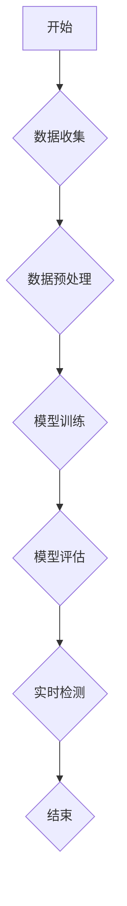

                 

# AI Agent在企业反欺诈与风险控制中的应用

## 关键词
AI Agent、企业反欺诈、风险控制、监督学习、无监督学习、强化学习、神经网络、欺诈识别、行为分析、风险评估、预警机制、风险响应策略

## 摘要
随着人工智能技术的发展，AI Agent在企业反欺诈与风险控制中的应用日益广泛。本文旨在深入探讨AI Agent的核心概念、技术原理及其在企业反欺诈与风险控制中的实际应用。通过对欺诈识别、行为分析和风险评估等关键环节的分析，本文揭示了AI Agent在提升企业风险管理能力方面的巨大潜力，并提出了相关的最佳实践策略。

### 目录大纲

----------------------------------------------

# AI Agent在企业反欺诈与风险控制中的应用

----------------------------------------------

## 第一部分：背景与核心概念

## 第1章：企业反欺诈与风险控制的挑战与机遇

### 1.1 问题的背景与描述

### 1.2 企业反欺诈与风险控制的边界与外延

### 1.3 核心要素组成

## 第2章：AI Agent基础

### 2.1 AI Agent的定义与原理

### 2.2 AI Agent的核心技术

### 2.3 AI Agent的开发流程

## 第二部分：AI Agent在反欺诈中的应用

## 第3章：欺诈识别

### 3.1 欺诈识别的基本方法

### 3.2 欺诈识别的案例分析

## 第4章：行为分析

### 4.1 行为分析的基本概念

### 4.2 行为分析的模型与技术

### 4.3 行为分析的实践案例

## 第三部分：AI Agent在风险控制中的应用

## 第5章：风险评估与预测

### 5.1 风险评估的基本概念

### 5.2 风险评估的算法与模型

### 5.3 风险评估的案例分析

## 第6章：风险预警与响应

### 6.1 风险预警机制

### 6.2 风险预警的技术实现

### 6.3 风险响应策略

## 第7章：AI Agent在反欺诈与风险控制中的最佳实践

### 7.1 AI Agent的应用策略

### 7.2 成功案例分享

### 7.3 拓展与展望

## 第8章：总结与展望

### 8.1 全书回顾

### 8.2 注意事项与建议

### 8.3 拓展阅读

----------------------------------------------

## 第一部分：背景与核心概念

### 第1章：企业反欺诈与风险控制的挑战与机遇

#### 1.1 问题的背景与描述

在当今数字经济迅速发展的时代，企业面临着前所未有的欺诈与风险控制挑战。欺诈行为不仅损害企业的财务利益，还影响企业的声誉和市场竞争力。随着互联网和金融科技的普及，欺诈手段变得更加复杂和隐蔽，传统的反欺诈手段已经难以应对这些新的挑战。

#### 1.2 企业反欺诈与风险控制的边界与外延

企业反欺诈与风险控制的范围包括但不限于以下几个方面：

- **欺诈识别**：检测和防范各类欺诈行为，如信用卡欺诈、虚假账户开户、洗钱等。
- **风险评估**：对潜在的风险进行评估，包括信用风险、市场风险、操作风险等。
- **行为分析**：分析用户行为模式，识别异常行为和潜在风险。
- **风险预警**：建立预警机制，实时监控和预测风险。
- **风险响应**：制定应急响应计划，快速应对和处置风险事件。

#### 1.3 核心要素组成

企业反欺诈与风险控制的核心要素包括：

- **数据收集与存储**：收集与企业业务相关的各种数据，包括交易数据、用户行为数据、信用记录等。
- **数据预处理**：清洗和标准化数据，为后续的分析提供准确和一致的数据。
- **算法模型**：运用机器学习和深度学习算法，对数据进行建模和预测。
- **决策支持系统**：集成算法模型和业务规则，提供实时决策支持。
- **监控系统**：实时监控风险指标，触发预警信号，引导风险响应。

### 第2章：AI Agent基础

#### 2.1 AI Agent的定义与原理

AI Agent，即人工智能代理，是一种具有自主决策能力和执行能力的智能系统。它能够通过学习用户行为和环境数据，自主地采取行动，以实现特定目标。AI Agent的核心原理包括：

- **感知**：通过传感器获取环境信息。
- **决策**：根据感知到的信息，通过算法模型做出决策。
- **执行**：根据决策结果，执行相应的操作。

#### 2.2 AI Agent的核心技术

AI Agent的核心技术主要包括：

- **监督学习与无监督学习**：用于训练算法模型，使其能够识别模式和预测结果。
- **强化学习**：通过奖励机制，使AI Agent能够在复杂环境中学习最优策略。
- **神经网络与深度学习**：用于构建复杂的决策模型，提高AI Agent的智能水平。

#### 2.3 AI Agent的开发流程

AI Agent的开发流程通常包括以下几个步骤：

- **需求分析**：明确AI Agent的应用场景和功能需求。
- **数据收集与预处理**：收集并清洗数据，为模型训练提供数据支持。
- **模型训练与优化**：使用训练数据训练算法模型，并不断优化模型性能。
- **部署与维护**：将AI Agent部署到实际应用环境中，并定期更新和维护。

## 第二部分：AI Agent在反欺诈中的应用

### 第3章：欺诈识别

#### 3.1 欺诈识别的基本方法

欺诈识别是AI Agent在企业反欺诈中的重要应用之一。欺诈识别的基本方法包括：

- **特征工程**：提取与欺诈行为相关的特征，如交易金额、交易频率、用户行为特征等。
- **模型选择与评估**：选择合适的机器学习模型，如决策树、随机森林、支持向量机等，并进行模型评估。
- **实时欺诈检测**：利用训练好的模型，对实时交易数据进行欺诈检测。

#### 3.2 欺诈识别的案例分析

以电商平台的欺诈识别为例，AI Agent可以通过以下步骤进行欺诈识别：

1. **数据收集**：收集电商平台的交易数据、用户行为数据等。
2. **数据预处理**：清洗和标准化数据，提取与欺诈行为相关的特征。
3. **模型训练**：使用训练数据训练欺诈识别模型。
4. **模型评估**：评估模型的性能，并进行模型优化。
5. **实时检测**：对实时交易数据进行分析，识别潜在的欺诈行为。

### 第4章：行为分析

#### 4.1 行为分析的基本概念

行为分析是AI Agent在反欺诈和风险控制中的重要应用之一。行为分析的基本概念包括：

- **行为数据**：包括用户行为记录、交易记录等。
- **行为模式**：根据行为数据，提取出的用户行为特征。
- **异常检测**：通过行为模式，识别出异常行为和潜在风险。

#### 4.2 行为分析的模型与技术

行为分析常用的模型和技术包括：

- **序列模型**：如循环神经网络（RNN），用于分析用户行为的时序特征。
- **图模型**：如图神经网络（GNN），用于分析用户行为的复杂网络结构。
- **迁移学习**：通过迁移学习，将已训练好的模型应用于新的任务，提高模型的泛化能力。

#### 4.3 行为分析的实践案例

以金融行业的用户行为分析为例，AI Agent可以通过以下步骤进行行为分析：

1. **数据收集**：收集用户的交易记录、行为日志等。
2. **数据预处理**：清洗和标准化数据，提取与用户行为相关的特征。
3. **模型训练**：使用训练数据训练行为分析模型。
4. **模型评估**：评估模型的性能，并进行模型优化。
5. **实时分析**：对实时用户行为进行分析，识别异常行为和潜在风险。

## 第三部分：AI Agent在风险控制中的应用

### 第5章：风险评估与预测

#### 5.1 风险评估的基本概念

风险评估是AI Agent在风险控制中的重要应用之一。风险评估的基本概念包括：

- **风险评估**：对潜在的风险进行评估，确定其可能性和影响。
- **风险类型**：包括信用风险、市场风险、操作风险等。
- **风险指标**：用于衡量风险的程度和变化。

#### 5.2 风险评估的算法与模型

风险评估常用的算法和模型包括：

- **统计模型**：如线性回归、逻辑回归等，用于预测风险指标。
- **机器学习模型**：如决策树、支持向量机等，用于分析风险因素。
- **深度学习模型**：如卷积神经网络（CNN）、循环神经网络（RNN）等，用于处理复杂的风险数据。

#### 5.3 风险评估的案例分析

以信用风险评估为例，AI Agent可以通过以下步骤进行风险评估：

1. **数据收集**：收集客户的信用记录、交易记录等。
2. **数据预处理**：清洗和标准化数据，提取与信用风险相关的特征。
3. **模型训练**：使用训练数据训练信用风险评估模型。
4. **模型评估**：评估模型的性能，并进行模型优化。
5. **风险评估**：对客户的信用风险进行评估，确定其信用等级。

### 第6章：风险预警与响应

#### 6.1 风险预警机制

风险预警是AI Agent在风险控制中的重要环节。风险预警机制包括：

- **预警指标体系**：确定预警的指标和阈值。
- **预警模型**：基于风险评估模型，构建预警模型。
- **预警触发**：当风险指标超过阈值时，触发预警信号。

#### 6.2 风险预警的技术实现

风险预警的技术实现包括：

- **实时监控**：实时收集和处理风险数据。
- **异常检测**：使用机器学习和深度学习算法，检测异常风险。
- **预警信号**：发送预警通知，提醒相关人员采取行动。

#### 6.3 风险响应策略

风险响应策略包括：

- **响应计划**：制定应急响应计划，明确应对措施。
- **响应执行**：根据预警信号，执行相应的响应措施。
- **响应评估**：评估响应措施的有效性，进行持续优化。

## 第7章：AI Agent在反欺诈与风险控制中的最佳实践

#### 7.1 AI Agent的应用策略

AI Agent在反欺诈与风险控制中的应用策略包括：

- **数据驱动**：充分利用数据，构建智能决策模型。
- **模型驱动**：通过模型优化和迭代，提高风险识别和预测能力。
- **人机协同**：结合人类专家的判断和AI Agent的自动决策，实现更高效的决策过程。

#### 7.2 成功案例分享

在反欺诈与风险控制领域，有许多成功的案例可以分享。例如：

- **某电商平台的欺诈识别**：通过AI Agent，实现了对欺诈行为的实时检测和自动处理，大幅提高了欺诈识别的准确率和响应速度。
- **某金融机构的风险评估**：利用AI Agent，建立了全面的信用风险评估体系，有效降低了信用风险，提高了客户满意度。

#### 7.3 拓展与展望

随着人工智能技术的不断进步，AI Agent在反欺诈与风险控制中的应用前景将更加广阔。未来，AI Agent将更加智能化、自动化，实现更高水平的欺诈识别和风险控制。同时，AI Agent还将与其他技术，如区块链、大数据等相结合，为企业的风险管理提供更加全面和高效的解决方案。

## 第8章：总结与展望

#### 8.1 全书回顾

本文从背景与核心概念出发，详细介绍了AI Agent在企业反欺诈与风险控制中的应用。通过分析欺诈识别、行为分析和风险评估等关键环节，揭示了AI Agent在提升企业风险管理能力方面的巨大潜力。同时，本文还分享了AI Agent在反欺诈与风险控制中的最佳实践，并对未来发展方向进行了展望。

#### 8.2 注意事项与建议

在实际应用中，AI Agent需要遵循以下注意事项和建议：

- **数据质量**：确保数据的质量和准确性，为模型训练提供可靠的数据支持。
- **模型优化**：定期更新和优化模型，提高风险识别和预测能力。
- **人机协同**：结合人类专家的判断，实现更高效的风险决策。

#### 8.3 拓展阅读

为了深入了解AI Agent在企业反欺诈与风险控制中的应用，读者可以参考以下相关文献和书籍：

- **相关文献**：《人工智能：一种现代的方法》、《机器学习：概率视角》等。
- **实践指导书籍**：《AI Agent应用实践》、《企业风险管理实务》等。

----------------------------------------------

### 附录
本文所使用的Mermaid图表和LaTeX公式如下：



$$
f(x) = 3x^2 + 2x + 1
$$

```latex
$$
f(x) = 3x^2 + 2x + 1
$$
```

### 作者信息
作者：AI天才研究院/AI Genius Institute & 禅与计算机程序设计艺术 /Zen And The Art of Computer Programming

