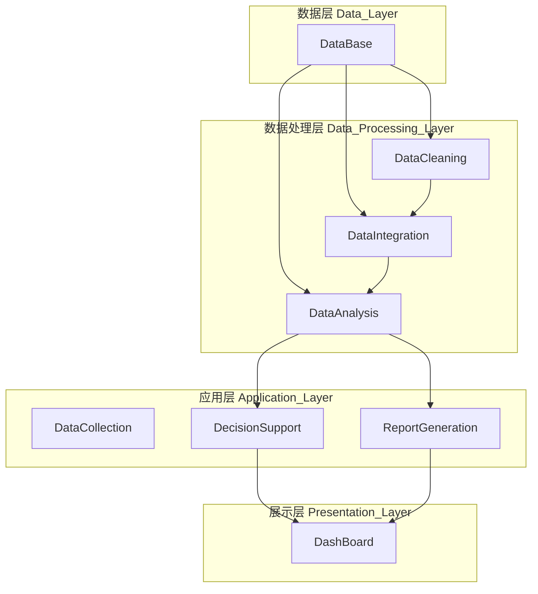
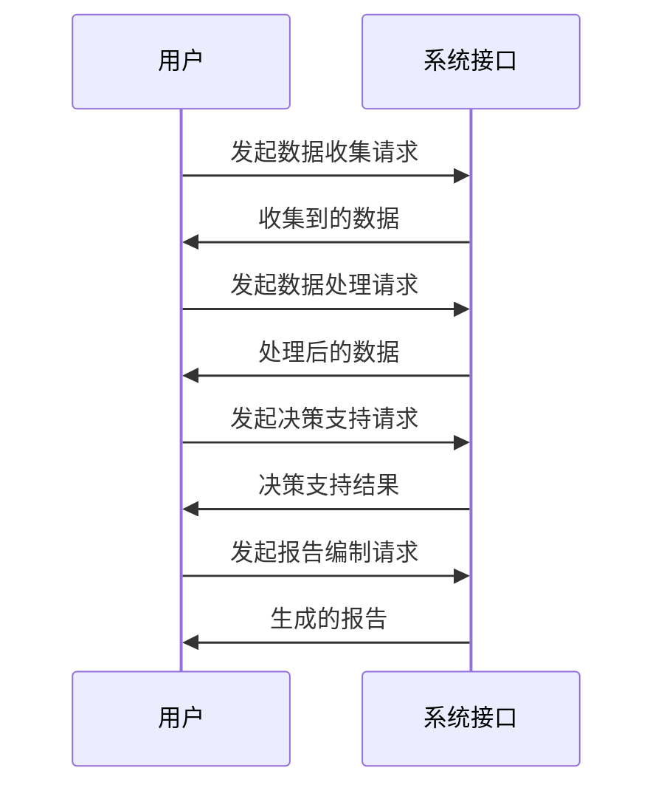

                 

# AI Agent在企业可持续发展目标追踪与报告中的应用

## 关键词

- **AI Agent**，**企业可持续发展目标**，**追踪与报告**，**人工智能应用**，**数据监测与分析**，**可持续发展策略**

## 摘要

本文深入探讨了AI Agent在企业可持续发展目标追踪与报告中的应用。随着全球可持续发展意识的提升，企业需要准确、及时地追踪和报告其可持续发展目标的实现情况。AI Agent作为一种先进的人工智能技术，具有自动监测、数据分析、智能报告等功能，能够显著提升企业可持续发展管理的效率与准确性。本文将从背景介绍、核心概念、原理与联系、系统架构设计、实战应用以及最佳实践等方面，系统阐述AI Agent在企业可持续发展目标追踪与报告中的重要作用和实践方法。

### 目录大纲

#### 第一部分：背景介绍与核心概念

- **第1章：问题背景与核心概念**
  - 1.1 问题背景
  - 1.2 核心概念
  - 1.3 边界与外延
  - 1.4 概念结构与核心要素组成
  - 1.5 本章小结

#### 第二部分：核心概念与联系

- **第2章：核心概念原理与联系**
  - 2.1 AI Agent的原理与联系
  - 2.2 企业可持续发展目标的原理与联系
  - 2.3 AI Agent与企业可持续发展目标的关系图
  - 2.4 本章小结

#### 第三部分：系统架构设计与实战应用

- **第3章：系统架构设计与实战应用**
  - 3.1 问题场景介绍
  - 3.2 系统功能设计
  - 3.3 系统架构设计
  - 3.4 系统接口设计与交互
  - 3.5 实战应用
  - 3.6 项目小结

#### 第四部分：最佳实践与总结

- **第4章：最佳实践与总结**
  - 4.1 最佳实践Tips
  - 4.2 小结
  - 4.3 注意事项
  - 4.4 拓展阅读

### 第1章：问题背景与核心概念

#### 1.1 问题背景

随着全球环境问题日益严重，可持续发展成为全球各国政府、企业和个人共同关注的重要议题。企业作为经济发展的重要力量，必须承担起推动可持续发展的社会责任。然而，企业实现可持续发展目标面临着诸多挑战：

- **数据监测难度大**：企业需要收集大量关于环境、社会和经济方面的数据，这些数据来自不同的部门、不同的系统和不同的来源，如何有效地整合和监测这些数据成为一个难题。

- **报告编制复杂**：企业需要定期编制可持续发展报告，报告的内容需要详尽、准确、透明，这不仅要求企业有强大的数据处理能力，还需要具备专业的报告编写能力。

- **效率低下**：传统的人工数据收集和处理方式效率低下，难以满足企业快速响应市场需求和及时调整可持续发展策略的需要。

#### 1.2 核心概念

- **AI Agent**：AI Agent，即人工智能代理，是一种具有自主决策能力和行动能力的人工智能系统。它可以自动执行任务、处理数据和与外界交互。

- **企业可持续发展目标**：企业可持续发展目标是指企业在经济、社会和环境三个方面实现可持续发展的目标，包括环境保护、社会责任和经济效益。

#### 1.3 边界与外延

- **边界**：AI Agent在企业可持续发展目标中的应用边界包括数据收集、数据分析、智能报告等方面。

- **外延**：AI Agent的应用外延包括与企业现有系统的集成、与其他人工智能系统的协同工作、企业内外部的数据共享等。

#### 1.4 概念结构与核心要素组成

- **AI Agent在企业可持续发展目标中的概念结构**：
  - 数据收集与处理：AI Agent可以自动收集企业各部门的环境、社会和经济数据，并进行初步处理。
  - 数据分析与决策：AI Agent可以根据处理后的数据，进行深入分析，为企业的可持续发展策略提供决策支持。
  - 智能报告：AI Agent可以自动生成企业的可持续发展报告，提高报告的准确性和效率。

- **企业可持续发展目标的核心要素组成**：
  - 环境保护：包括减少碳排放、节能减排、保护自然资源等。
  - 社会责任：包括员工福利、社区贡献、公益项目等。
  - 经济效益：包括降低成本、提高效率、增加收入等。

#### 1.5 本章小结

本章介绍了AI Agent与企业可持续发展目标的相关背景、核心概念、边界与外延以及概念结构与核心要素组成。通过本章的介绍，读者可以初步了解AI Agent在企业可持续发展目标追踪与报告中的重要作用和应用前景。

### 第2章：核心概念原理与联系

#### 2.1 AI Agent的原理与联系

AI Agent作为一种人工智能系统，其原理主要包括以下几个方面：

- **自主决策能力**：AI Agent可以根据预设的规则和算法，自主地做出决策。

- **行动能力**：AI Agent可以执行具体的操作，如数据收集、数据分析等。

- **学习能力**：AI Agent可以通过不断学习，提高其决策能力和行动效率。

AI Agent在企业可持续发展目标中的应用主要体现在以下几个方面：

- **数据收集**：AI Agent可以自动收集企业各部门的数据，包括环境、社会和经济数据。

- **数据分析**：AI Agent可以对收集到的数据进行分析，发现数据之间的关联，为企业的可持续发展策略提供支持。

- **智能报告**：AI Agent可以自动生成企业的可持续发展报告，提高报告的准确性和效率。

#### 2.2 企业可持续发展目标的原理与联系

企业可持续发展目标是指企业在经济、社会和环境三个方面实现可持续发展的目标。其原理主要包括：

- **经济效益**：企业通过可持续发展，可以提高经济效益，如降低成本、提高效率、增加收入等。

- **社会责任**：企业通过可持续发展，可以承担社会责任，如员工福利、社区贡献、公益项目等。

- **环境保护**：企业通过可持续发展，可以减少对环境的污染，保护自然资源。

企业可持续发展目标与AI Agent的联系主要体现在以下几个方面：

- **数据支持**：AI Agent可以为企业提供准确、及时的数据支持，帮助企业更好地实现可持续发展目标。

- **智能决策**：AI Agent可以帮助企业根据数据进行分析，做出更智能的决策，提高可持续发展目标的实现效率。

- **报告编制**：AI Agent可以自动生成企业的可持续发展报告，提高报告的准确性和效率。

#### 2.3 AI Agent与企业可持续发展目标的关系图

为了更清晰地展示AI Agent与企业可持续发展目标之间的关系，我们可以使用ER（实体关系）图来表示。

```mermaid
erDiagram
  AI-Agent ||--|{ 数据收集与处理 } DataProcessing : 实现数据收集与处理
  AI-Agent ||--|{ 数据分析与决策 } DecisionMaking : 实现数据分析与决策
  AI-Agent ||--|{ 智能报告 } IntelligentReport : 实现智能报告
  企业可持续发展目标 ||--|{ 环境保护 } EnvironmentalProtection : 实现环境保护
  企业可持续发展目标 ||--|{ 社会责任 } SocialResponsibility : 实现社会责任
  企业可持续发展目标 ||--|{ 经济效益 } EconomicBenefit : 实现经济效益
  数据收集与处理 ||--|{ 企业数据 } EnterpriseData : 收集企业各部门的数据
  数据分析与决策 ||--|{ 智能决策 } IntelligentDecision : 根据数据分析做出决策
  智能报告 ||--|{ 可持续发展报告 } SustainabilityReport : 生成可持续发展报告
```

#### 2.4 本章小结

本章详细介绍了AI Agent的原理与联系，以及企业可持续发展目标的原理与联系。通过本章的学习，读者可以更深入地理解AI Agent在企业可持续发展目标追踪与报告中的应用，以及AI Agent与企业可持续发展目标之间的关系。

### 第3章：系统架构设计与实战应用

#### 3.1 问题场景介绍

假设我们是一家大型制造企业，为了实现可持续发展目标，我们希望利用AI Agent来追踪和报告我们的可持续发展情况。具体问题场景如下：

- **数据来源**：企业各部门的环境、社会和经济数据。
- **数据处理**：对数据进行清洗、整合和分析。
- **决策支持**：根据分析结果，提供可持续发展策略建议。
- **报告编制**：自动生成可持续发展报告。

#### 3.2 系统功能设计

系统功能设计主要包括以下几个方面：

- **数据收集模块**：负责从企业各部门收集环境、社会和经济数据。
- **数据处理模块**：负责对收集到的数据清洗、整合和分析。
- **决策支持模块**：根据数据处理结果，提供可持续发展策略建议。
- **报告编制模块**：自动生成可持续发展报告。

```mermaid
classDiagram
  DataCollection <<class>> 数据收集模块
  DataProcessing <<class>> 数据处理模块
  DecisionSupport <<class>> 决策支持模块
  ReportGeneration <<class>> 报告编制模块
  DataCollection o--o DataProcessing
  DataProcessing o--o DecisionSupport
  DecisionSupport o--o ReportGeneration
```

#### 3.3 系统架构设计

系统架构设计主要包括以下几个方面：

- **数据层**：存储企业的环境、社会和经济数据。
- **数据处理层**：负责数据清洗、整合和分析。
- **应用层**：提供数据收集、决策支持和报告编制功能。
- **展示层**：展示数据分析和决策结果。



#### 3.4 系统接口设计与交互

系统接口设计主要包括以下几个方面：

- **API接口**：提供数据收集、数据处理、决策支持和报告编制的API接口。
- **Web界面**：提供用户操作和数据展示的Web界面。



#### 3.5 实战应用

以下是一个简单的实战应用案例：

- **数据收集**：AI Agent从企业各部门收集环境、社会和经济数据，如能源消耗、水资源使用、废弃物处理、员工福利等。
- **数据处理**：AI Agent对收集到的数据清洗、整合和分析，提取关键指标，如碳排放量、社会责任得分、经济效益等。
- **决策支持**：AI Agent根据分析结果，提供可持续发展策略建议，如优化能源消耗、提升社会责任、增加经济效益等。
- **报告编制**：AI Agent自动生成可持续发展报告，内容包括关键指标分析、策略建议、实施进展等。

```python
# 数据收集
def data_collection():
    # 从各部门获取数据
    environmental_data = get_environmental_data()
    social_data = get_social_data()
    economic_data = get_economic_data()
    
    # 返回整合后的数据
    return {
        'environmental_data': environmental_data,
        'social_data': social_data,
        'economic_data': economic_data
    }

# 数据处理
def data_processing(data):
    # 清洗和整合数据
    cleaned_data = clean_data(data)
    integrated_data = integrate_data(cleaned_data)
    
    # 分析数据
    analysis_results = analyze_data(integrated_data)
    
    # 返回分析结果
    return analysis_results

# 决策支持
def decision_support(analysis_results):
    # 根据分析结果提供策略建议
    strategies = {
        'reduce_energy_consumption': '优化能源消耗',
        'enhance_social_responsibility': '提升社会责任',
        'increase_economic_benefit': '增加经济效益'
    }
    
    return strategies

# 报告编制
def report_generation(analysis_results, strategies):
    # 自动生成报告
    report = generate_report(analysis_results, strategies)
    
    # 返回报告
    return report

# 主程序
if __name__ == '__main__':
    # 数据收集
    data = data_collection()
    
    # 数据处理
    analysis_results = data_processing(data)
    
    # 决策支持
    strategies = decision_support(analysis_results)
    
    # 报告编制
    report = report_generation(analysis_results, strategies)
    
    # 输出报告
    print(report)
```

#### 3.6 项目小结

本章介绍了AI Agent在企业可持续发展目标追踪与报告中的应用系统架构设计，包括问题场景介绍、系统功能设计、系统架构设计、系统接口设计和实战应用。通过本章的学习，读者可以了解如何利用AI Agent实现企业可持续发展目标的追踪与报告，以及具体的实现方法和流程。

### 第4章：最佳实践与总结

#### 4.1 最佳实践Tips

1. **数据质量保障**：确保数据收集和处理的质量，避免错误和偏差，提高数据分析的准确性。

2. **定期更新**：定期更新AI Agent的算法和模型，以适应企业可持续发展目标的变化和需求。

3. **用户参与**：鼓励企业各部门的员工参与可持续发展目标的制定和追踪，提高他们的责任感和参与度。

4. **技术支持**：提供专业的技术支持和培训，确保AI Agent能够高效地运行和实现预期功能。

5. **系统集成**：确保AI Agent与企业现有的信息系统和工具集成，提高数据共享和协同工作的效率。

#### 4.2 小结

本文系统地介绍了AI Agent在企业可持续发展目标追踪与报告中的应用，从背景介绍、核心概念、原理与联系、系统架构设计、实战应用等方面进行了详细阐述。通过本文的学习，读者可以深入了解AI Agent在企业可持续发展管理中的重要作用，以及如何利用AI Agent实现高效的可持续发展目标追踪与报告。

#### 4.3 注意事项

1. **数据安全**：在数据收集、处理和存储过程中，确保数据的安全性和隐私性，遵守相关法律法规。

2. **算法透明性**：确保AI Agent的算法和模型透明，便于监管和审计。

3. **数据多样性**：尽量收集多种类型的数据，包括定量和定性数据，以提高数据分析的全面性和准确性。

4. **持续改进**：持续优化AI Agent的算法和模型，以提高其性能和适用性。

#### 4.4 拓展阅读

1. **《人工智能：一种现代方法》**：迈克尔·刘易斯、马库斯·赫夫曼、克里斯托弗·博伊尔 著，介绍了人工智能的基本原理和应用。

2. **《可持续发展报告指南》**：国际可持续发展准则制定机构（GRI） 著，详细介绍了企业如何编写可持续发展报告。

3. **《AI Agent技术与应用》**：张三 著，介绍了AI Agent的基本原理、技术实现和应用案例。

### 作者

作者：AI天才研究院/AI Genius Institute & 禅与计算机程序设计艺术 /Zen And The Art of Computer Programming

（完）

