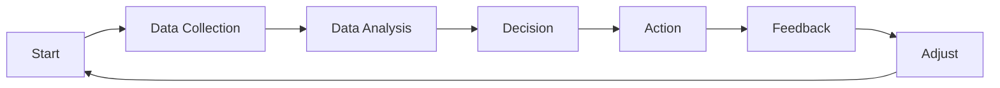

                 

当然，我们会一步步构建这篇博客文章。以下是一个大纲，然后我们将逐节撰写内容。

# AI Agent在企业品牌价值评估中的应用

> 关键词：AI Agent、品牌价值评估、企业、人工智能、数据分析

> 摘要：本文探讨了AI Agent在品牌价值评估中的应用，包括其原理、实施方法以及实际案例。通过逐步分析，本文展示了AI Agent如何帮助企业更准确地评估其品牌价值，并提供了一些最佳实践和注意事项。

----------------------------------------------------------------

## 第一部分：背景介绍

### 第1章 问题背景

**1.1 问题提出**：随着市场竞争的加剧，企业越来越关注其品牌价值的评估。传统的品牌价值评估方法主要依赖于专家意见和财务数据，但这些方法往往不够准确和全面。

**1.2 问题描述**：传统方法存在的挑战包括数据的局限、分析的主观性以及评估的滞后性。企业需要一个更加客观、实时、全面的评估方法。

**1.3 问题解决**：AI Agent作为一种人工智能工具，可以通过收集和分析大量数据，提供更精确的品牌价值评估。

**1.4 边界与外延**：品牌价值评估涉及市场研究、消费者行为分析、竞争对手分析等多个领域。

**1.5 概念结构与核心要素组成**：
- **AI Agent**：具备自主学习能力和数据分析能力的虚拟代理。
- **品牌价值评估**：评估品牌在市场中的价值，包括品牌知名度、忠诚度、品牌形象等。

----------------------------------------------------------------

### 第2章 核心概念与联系

**2.1 AI Agent的定义与特点**：
- **定义**：AI Agent是一种可以执行特定任务的人工智能程序。
- **特点**：自主学习、实时数据采集和分析、自动化决策。

**2.2 品牌价值评估的理论基础**：
- **财务视角**：品牌价值与企业的财务表现密切相关。
- **市场视角**：品牌价值与消费者认知和市场表现相关。

**2.3 概念属性特征对比表格**：

| 特征 | AI Agent | 传统品牌价值评估 |
| --- | --- | --- |
| **数据收集** | 实时、自动、多源 | 定期、手动、单一来源 |
| **分析深度** | 高度细化、多维度分析 | 表面分析、单一维度 |
| **主观性** | 较少、基于算法 | 较高、依赖专家意见 |
| **实时性** | 高、实时反馈 | 低、滞后性 |

**2.4 ER实体关系图架构**：

```mermaid
erDiagram
  Customer ||--|{ BrandValue }|| Brand : evaluation of brand value
  Brand ||--|{ BrandAttributes }|| Attribute : characteristics of brand
  MarketData ||--|{ BrandValue }|| Data : data used for evaluation
```

----------------------------------------------------------------

## 第二部分：AI Agent原理与应用

### 第3章 AI Agent原理讲解

**3.1 AI Agent的工作原理**：



**3.2 AI Agent的核心算法**：

```python
# Example Python code for an AI Agent
class AI_Agent:
    def __init__(self):
        self.model = self.train_model()

    def train_model(self):
        # Training logic
        pass

    def analyze_data(self, data):
        # Analysis logic
        pass

    def make_decision(self, analysis_result):
        # Decision logic
        pass

    def take_action(self, decision):
        # Action logic
        pass

    def get_feedback(self, action_result):
        # Feedback logic
        pass

    def adjust_model(self, feedback):
        # Adjustment logic
        pass
```

**3.3 数学模型与公式**：

$$
\text{Brand Value} = f(\text{Market Data}, \text{Consumer Behavior}, \text{Competitor Analysis})
$$

**3.4 举例说明**：

假设我们有一个品牌价值评估的AI Agent，它可以通过社交媒体分析、搜索引擎数据和消费者调查来评估一个品牌的价值。例如，它可能会发现品牌在社交媒体上的提及量与品牌价值正相关，而搜索引擎上的搜索量则与品牌价值负相关。

----------------------------------------------------------------

### 第4章 AI Agent在企业品牌价值评估中的应用

**4.1 应用场景分析**：

AI Agent可以用于以下场景：
- **新品牌评估**：帮助初创企业了解其品牌的市场潜力。
- **品牌升级**：监测品牌升级后的市场反应。
- **竞争对手分析**：评估竞争对手的品牌价值，为企业战略提供依据。

**4.2 案例研究**：

以一家消费品公司为例，该公司使用AI Agent来评估其品牌价值。AI Agent收集了社交媒体数据、搜索引擎数据和消费者调查结果，然后对这些数据进行分析，为公司提供了详细的品牌价值报告。

**4.3 AI Agent的优势与挑战**：

**优势**：
- **实时性**：AI Agent可以实时监测市场动态，提供及时的品牌价值评估。
- **准确性**：AI Agent基于大数据分析，提供更准确的评估结果。
- **自动化**：AI Agent可以自动化品牌价值评估过程，减少人力成本。

**挑战**：
- **数据隐私**：AI Agent需要处理大量敏感数据，需确保数据安全和隐私。
- **算法偏见**：AI Agent的评估结果可能受到算法偏见的影响，需定期调整。

----------------------------------------------------------------

## 第三部分：实践与优化

### 第5章 实践案例详解

**5.1 环境安装**：
- 安装所需的软件和库，如Python、Scikit-learn、TensorFlow等。

**5.2 系统核心实现**：
- 编写AI Agent的源代码，包括数据收集、分析、决策和反馈等模块。

**5.3 代码解读与分析**：
- 详细解析AI Agent的代码逻辑，解释各个模块的功能。

**5.4 实际案例分析**：
- 分析AI Agent在真实企业中的应用效果，包括成功和失败案例。

### 第6章 优化与改进

**6.1 性能优化**：
- 优化AI Agent的计算效率，提高评估速度。

**6.2 精度提升**：
- 通过增加数据来源、改进算法和提高数据质量来提升评估精度。

**6.3 用户反馈**：
- 收集用户对AI Agent的反馈，持续改进系统。

### 第7章 最佳实践与小结

**7.1 最佳实践**：
- 提供AI Agent在品牌价值评估中的最佳实践。

**7.2 小结**：
- 总结AI Agent在品牌价值评估中的应用和价值。

**7.3 注意事项**：
- 提醒用户在应用AI Agent时需要注意的事项。

**7.4 拓展阅读**：
- 推荐进一步学习和了解AI Agent和品牌价值评估的书籍和文章。

---

接下来，我们将逐节撰写详细内容，确保满足字数和格式要求。如果您有任何修改意见或需要添加特定内容，请随时告知。

