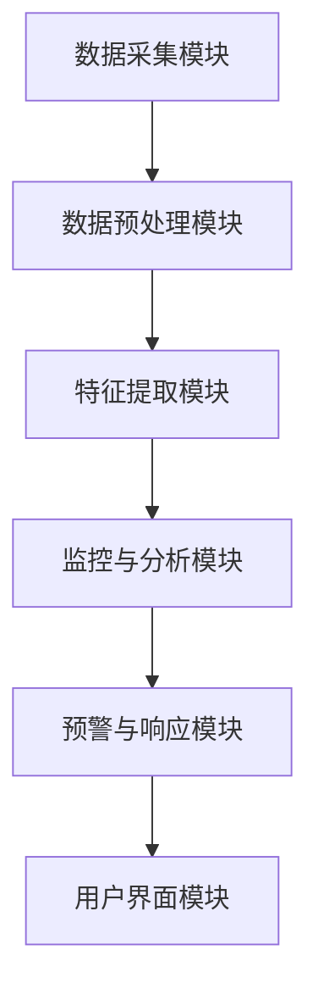
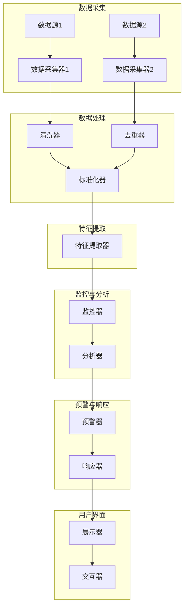
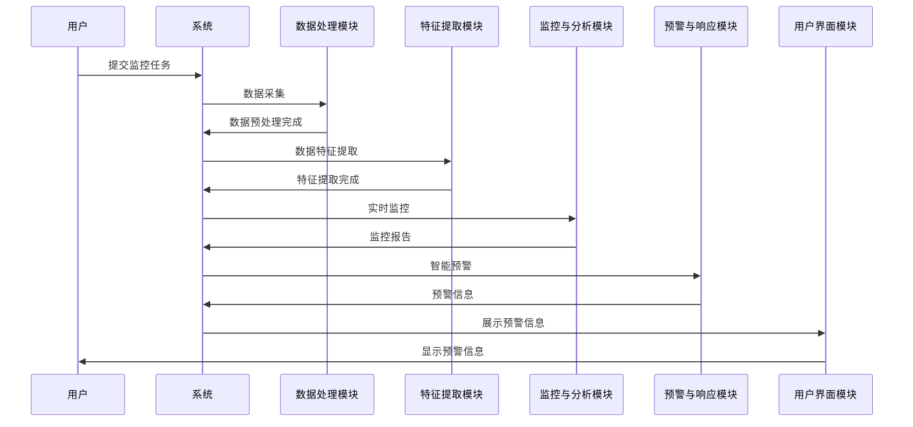

                 


### 第一部分：背景与概念

#### 第1章：问题背景与核心概念

在当今信息爆炸的时代，企业品牌声誉的重要性愈发凸显。一个企业或品牌的声誉，不仅关系到其市场份额和客户忠诚度，还直接影响到其股价和长远发展。然而，品牌声誉并非一成不变，它可能受到各种内外部因素的影响而波动，甚至遭受严重的危机打击。因此，如何有效地进行品牌声誉监控与危机预警，成为企业管理者面临的重要挑战。

##### 1.1 问题背景

**1.1.1 企业品牌声誉的重要性**

企业品牌声誉是企业长期积累的公众形象和品牌价值。它包括品牌知名度、品牌美誉度、品牌忠诚度等多个维度。良好的品牌声誉可以带来以下好处：

- **增加市场份额**：消费者更愿意购买具有良好声誉的产品或服务。
- **提高客户忠诚度**：满意的客户更可能成为忠实客户，从而降低客户获取成本。
- **提升股价**：投资者更愿意投资于品牌声誉良好的企业。
- **增强员工凝聚力**：良好的企业声誉有助于吸引和留住优秀人才。

**1.1.2 品牌声誉监控的现状**

当前，企业品牌声誉监控主要依赖于以下几种方法：

- **人工监控**：企业通过雇佣专业人员或团队，定期搜索和收集有关品牌的网络信息、媒体报道等。
- **社交媒体监控**：企业利用社交媒体监测工具，实时监控社交媒体上关于品牌的讨论和评论。
- **舆情分析**：通过大数据分析技术，对海量数据进行分析，提取出有关品牌声誉的关键信息。

尽管这些方法在一定程度上能够帮助企业监控品牌声誉，但仍然存在一些问题：

- **信息量巨大**：互联网和社交媒体上的信息量庞大，人工监控难以全面覆盖。
- **反应速度慢**：传统监控方式通常需要时间处理和反馈，难以实现实时监控和快速响应。
- **数据质量**：人工收集的数据可能存在偏差，且难以保证数据的一致性和准确性。

**1.1.3 危机预警的需求**

企业面临的危机种类繁多，包括但不限于产品质量问题、负面媒体报道、负面舆论、法律纠纷等。这些危机可能会给企业带来严重的经济损失和品牌损害。因此，危机预警成为企业品牌管理的重要内容。

危机预警的主要目标包括：

- **提前识别潜在危机**：通过监测和分析各种信息，提前发现可能对企业声誉造成影响的潜在危机。
- **及时响应**：在危机爆发前，采取有效的应对措施，降低危机对企业声誉的损害。
- **持续监控**：危机处理并非一蹴而就，企业需要持续监控危机的影响和后续发展，以避免危机复发。

##### 1.2 AI Agent的定义与特性

**1.2.1 AI Agent的概念**

AI Agent，即人工智能代理，是一种能够自主感知环境、决策行动并达成目标的人工智能系统。与传统的规则驱动型系统不同，AI Agent具有自主学习和自适应能力，能够在复杂、不确定的环境中有效地完成任务。

**1.2.2 AI Agent的特性**

- **自主性**：AI Agent能够自主地感知环境，并根据感知到的信息自主做出决策。
- **适应性**：AI Agent能够根据环境变化自适应调整其行为和策略。
- **学习能力**：AI Agent能够从经验中学习，不断优化其决策和行动策略。
- **交互性**：AI Agent能够与人类或其他系统进行有效交互，获取反馈并调整自身行为。

**1.2.3 AI Agent与传统AI的区别**

- **主动性**：传统AI通常依赖于预设的规则或算法，而AI Agent具有主动性，能够自主地感知环境和执行任务。
- **灵活性**：AI Agent具有更高的灵活性，能够在动态和复杂环境中自主适应和调整。
- **智能性**：AI Agent具有更高的智能性，能够理解、学习和推理复杂问题。

##### 1.3 企业品牌声誉监控与危机预警的联系

**1.3.1 监控与预警的核心目标**

品牌声誉监控与危机预警的核心目标都是确保企业声誉的稳定和可持续发展。具体来说：

- **监控目标**：及时掌握品牌声誉的动态变化，发现潜在问题和风险，为决策提供数据支持。
- **预警目标**：提前识别潜在危机，制定应急预案，降低危机对企业声誉的损害。

**1.3.2 AI Agent在监控与预警中的作用**

AI Agent在企业品牌声誉监控与危机预警中发挥着关键作用：

- **实时监控**：AI Agent能够实时收集、分析和处理海量数据，提供及时、准确的品牌声誉监测报告。
- **智能预警**：AI Agent能够利用机器学习算法，从历史数据中学习并预测潜在危机，为企业提供有效的预警信息。
- **自动化响应**：AI Agent能够根据预警信息，自动执行应急响应措施，降低危机对企业声誉的损害。

**1.3.3 AI Agent的优势与挑战**

**优势：**

- **高效性**：AI Agent能够快速处理大量数据，提高监控和预警的效率。
- **准确性**：AI Agent能够利用机器学习算法，提高监测和预警的准确性。
- **适应性**：AI Agent能够根据环境变化，自适应调整监控和预警策略。

**挑战：**

- **数据质量**：AI Agent依赖于高质量的数据，数据质量直接影响其性能。
- **算法可靠性**：AI Agent的性能依赖于机器学习算法的可靠性，算法故障可能导致误报或漏报。
- **隐私保护**：在处理大量数据时，需要确保用户隐私和数据安全。

#### 第2章：核心概念与联系

##### 2.1 AI Agent的核心概念

**2.1.1 学习与推理机制**

AI Agent的核心机制之一是学习和推理。它通过不断从环境中获取信息，利用机器学习算法进行自我优化，并在遇到新情况时进行推理和决策。

- **学习机制**：AI Agent通过学习历史数据，提取有用的特征和规律，并将其用于后续的决策过程。
- **推理机制**：AI Agent利用学习到的知识和规则，对新情况进行推理和预测，制定最优的行动策略。

**2.1.2 自适应与自进化特性**

AI Agent具有自适应和自进化的特性，能够在复杂、不确定的环境中不断优化自身性能。

- **自适应**：AI Agent能够根据环境变化，调整其行为和策略，以适应新的挑战。
- **自进化**：AI Agent能够通过不断学习和进化，提高其解决问题的能力。

**2.1.3 AI Agent的组成部分**

AI Agent通常由以下几个部分组成：

- **感知模块**：用于收集环境信息。
- **决策模块**：用于根据感知信息进行推理和决策。
- **执行模块**：用于执行决策结果，实现具体任务。
- **学习模块**：用于从经验中学习，不断优化自身性能。

##### 2.2 企业品牌声誉监控的核心概念

**2.2.1 监控指标与维度**

企业品牌声誉监控的核心是监控指标。常见的监控指标包括：

- **社交媒体热度**：衡量品牌在社交媒体上的关注度。
- **负面评论比例**：衡量品牌在社交媒体上负面评论的比例。
- **媒体报道数量**：衡量品牌在媒体报道中的曝光度。
- **搜索引擎排名**：衡量品牌在搜索引擎中的排名情况。

**2.2.2 监控工具与方法**

企业品牌声誉监控可以采用以下几种工具和方法：

- **社交媒体监控工具**：如Facebook、Twitter、Instagram等社交媒体平台提供的监控工具。
- **搜索引擎监控工具**：如Google Analytics、百度统计等。
- **舆情分析工具**：如百度舆情、清博大数据等。

**2.2.3 监控流程与策略**

企业品牌声誉监控的流程通常包括以下几个步骤：

- **数据收集**：从各种渠道收集有关品牌的信息。
- **数据预处理**：对收集到的数据清洗、去重和标准化。
- **特征提取**：从预处理后的数据中提取有用的特征。
- **数据分析**：使用机器学习算法对特征进行分析和预测。
- **结果可视化**：将分析结果可视化，为企业提供直观的监控报告。

##### 2.3 危机预警的核心概念

**2.3.1 预警机制与模型**

危机预警的核心是预警机制和预警模型。预警机制通常包括以下步骤：

- **数据收集**：从各种渠道收集有关品牌的实时信息。
- **特征提取**：从实时数据中提取关键特征。
- **阈值设定**：设定预警阈值，当特征值超过阈值时触发预警。
- **预警决策**：根据预警阈值和预警模型，决定是否触发预警。

常见的预警模型包括：

- **规则驱动模型**：基于预设的规则进行预警。
- **统计模型**：使用统计方法对数据进行建模，进行预警。
- **机器学习模型**：使用机器学习算法，从历史数据中学习并预测危机。

**2.3.2 预警指标与评估**

危机预警的关键是预警指标的设定和评估。常见的预警指标包括：

- **负面评论比例**：衡量品牌在社交媒体上的负面评论比例。
- **负面报道数量**：衡量品牌在媒体上的负面报道数量。
- **搜索引擎热度**：衡量品牌在搜索引擎上的热度。
- **用户反馈质量**：衡量用户对品牌的反馈质量。

预警评估通常包括以下几个步骤：

- **指标设定**：根据企业需求和实际情况，设定预警指标。
- **指标评估**：使用统计学方法对预警指标进行评估，确定其有效性和可靠性。
- **预警优化**：根据评估结果，调整预警指标和预警策略，提高预警效果。

**2.4 AI Agent与企业品牌声誉监控与危机预警的联系**

**2.4.1 AI Agent在监控中的应用**

AI Agent在企业品牌声誉监控中的应用主要体现在以下几个方面：

- **实时监控**：AI Agent能够实时收集社交媒体、搜索引擎等渠道的信息，提供实时的品牌声誉监控报告。
- **自动处理**：AI Agent能够自动处理海量数据，提取有用的特征，提供更准确、更及时的监控结果。
- **智能分析**：AI Agent能够利用机器学习算法，对监控数据进行智能分析，发现潜在问题，为企业提供决策支持。

**2.4.2 AI Agent在预警中的应用**

AI Agent在危机预警中的应用主要体现在以下几个方面：

- **实时预警**：AI Agent能够实时监测品牌声誉的变化，及时发现潜在危机，提供及时的预警信息。
- **智能预测**：AI Agent能够利用机器学习算法，从历史数据中学习并预测危机，提高预警的准确性和及时性。
- **自动响应**：AI Agent能够根据预警信息，自动执行应急响应措施，降低危机对企业声誉的损害。

**2.4.3 AI Agent的优势与局限**

**优势：**

- **高效性**：AI Agent能够快速处理海量数据，提高监控和预警的效率。
- **准确性**：AI Agent能够利用机器学习算法，提高监控和预警的准确性。
- **适应性**：AI Agent能够根据环境变化，自适应调整监控和预警策略。

**局限：**

- **数据质量**：AI Agent依赖于高质量的数据，数据质量直接影响其性能。
- **算法可靠性**：AI Agent的性能依赖于机器学习算法的可靠性，算法故障可能导致误报或漏报。
- **隐私保护**：在处理大量数据时，需要确保用户隐私和数据安全。

### 第二部分：数学模型与算法原理

#### 第3章：数学模型概述

在讨论AI Agent在企业品牌声誉监控与危机预警中的应用之前，我们需要先了解一些基本的数学模型和算法原理。这些模型和算法为我们提供了工具，使我们能够从海量数据中提取有价值的信息，并预测未来的趋势。

##### 3.1.1 监控与预警的数学模型

企业品牌声誉监控与危机预警的数学模型主要包括以下几个部分：

**1. 数据收集与预处理模型**

数据收集与预处理模型通常包括以下步骤：

- **数据采集**：从社交媒体、新闻报道、用户评论等渠道收集相关数据。
- **数据清洗**：去除重复数据、缺失值填充、异常值处理等。
- **数据标准化**：将不同来源的数据进行统一处理，如文本分词、词频统计等。

**2. 特征提取与选择模型**

特征提取与选择模型用于从原始数据中提取出对品牌声誉和危机预警有重要影响的关键特征：

- **文本分类模型**：如朴素贝叶斯、支持向量机（SVM）等，用于将文本数据分类为正面或负面。
- **关键词提取模型**：如TF-IDF、Word2Vec等，用于提取文本数据中的关键词和短语。
- **特征选择模型**：如信息增益、卡方检验等，用于选择对目标变量影响最大的特征。

**3. 监控与预警模型**

监控与预警模型主要包括以下几种：

- **规则驱动模型**：基于专家知识设定一系列规则，当数据满足特定规则时触发预警。
- **统计模型**：如线性回归、逻辑回归等，用于建立品牌声誉与预警指标之间的统计关系。
- **机器学习模型**：如决策树、随机森林、神经网络等，用于从历史数据中学习并预测未来趋势。

##### 3.1.2 AI Agent的数学模型

AI Agent的数学模型主要涉及以下几个方面：

**1. 感知与决策模型**

感知与决策模型用于AI Agent对环境的感知和决策：

- **感知模型**：如感知器、卷积神经网络（CNN）等，用于对环境中的信息进行感知和预处理。
- **决策模型**：如Q-learning、深度强化学习等，用于从感知信息中学习最优决策策略。

**2. 学习与优化模型**

学习与优化模型用于AI Agent的自我学习和性能优化：

- **监督学习模型**：如线性回归、支持向量机等，用于从标记数据中学习特征和模式。
- **无监督学习模型**：如聚类、降维等，用于从无标记数据中发现结构和规律。
- **强化学习模型**：如Q-learning、深度强化学习等，用于通过试错学习最优策略。

**3. 自适应与自进化模型**

自适应与自进化模型用于AI Agent在动态环境中的适应和进化：

- **遗传算法**：用于优化个体决策策略，实现自进化。
- **神经进化算法**：结合神经网络的建模能力和遗传算法的优化能力，实现自适应学习。

##### 3.1.3 数学模型之间的联系

监控与预警的数学模型和AI Agent的数学模型之间存在密切的联系：

- **数据预处理**：监控与预警模型需要高质量的数据，而AI Agent的感知与决策模型也需要对数据进行预处理。
- **特征提取与选择**：监控与预警模型中的特征提取与选择方法可以用于AI Agent的感知与决策模型，提高其性能。
- **监控与预警模型**：AI Agent可以利用监控与预警模型，从历史数据中学习品牌声誉的变化趋势和危机预警指标。
- **学习与优化模型**：AI Agent的学习与优化模型可以用于优化监控与预警模型，提高其预测准确性和实时性。
- **自适应与自进化模型**：AI Agent的自适应与自进化模型可以帮助其适应动态环境，提高监控与预警的效果。

#### 第3章：监控算法原理

##### 3.2.1 数据收集与预处理

在实施品牌声誉监控和危机预警之前，首先要进行数据收集与预处理。这一步骤至关重要，因为数据的准确性和完整性直接影响后续分析的结果。

**1. 数据源**

数据源可以是社交媒体平台（如Twitter、Facebook、Instagram等）、新闻报道网站、论坛、博客等。这些渠道能够提供关于企业品牌的各种信息，包括正面评论、负面评论、新闻报道、用户反馈等。

**2. 数据收集**

数据收集可以通过以下方法进行：

- **API调用**：利用社交媒体平台提供的API接口，自动收集相关数据。
- **爬虫技术**：编写爬虫程序，从网站上抓取相关数据。
- **人工收集**：雇佣专业人员或团队，定期搜索和收集品牌相关信息。

**3. 数据预处理**

数据预处理主要包括以下几个步骤：

- **数据清洗**：去除重复数据、无效数据和无意义的数据，保证数据的质量。
- **去重**：对于重复出现的数据，只保留一条。
- **异常值处理**：对于异常值，可以进行修正或删除，以防止其对分析结果造成干扰。
- **文本标准化**：统一数据格式，如将所有的文本转换为小写，去除标点符号等。

##### 3.2.2 特征提取与选择

特征提取与选择是品牌声誉监控和危机预警的关键步骤。通过对原始数据进行特征提取，可以将高维的数据转换为低维的特征向量，以便于后续的分析。

**1. 特征提取方法**

常见的特征提取方法包括：

- **词袋模型**：将文本转换为词袋模型，统计每个词的出现频率。
- **TF-IDF**：结合词频（TF）和逆文档频率（IDF），计算每个词的重要程度。
- **Word2Vec**：将文本转换为词向量，通过神经网络模型学习词的语义表示。
- **BERT**：基于Transformer模型，对文本进行编码，提取深层语义特征。

**2. 特征选择方法**

特征选择可以减少数据维度，提高模型性能。常见的特征选择方法包括：

- **信息增益**：选择对分类目标信息量最大的特征。
- **卡方检验**：选择与分类目标相关性最高的特征。
- **互信息**：选择能够最大化描述分类目标的特征。

##### 3.2.3 监控算法的实现与优化

**1. 监控算法实现**

监控算法的实现通常包括以下几个步骤：

- **数据输入**：将预处理后的数据输入到监控模型中。
- **特征提取**：从输入数据中提取特征。
- **模型训练**：使用历史数据对监控模型进行训练。
- **模型评估**：使用测试数据对监控模型进行评估，调整模型参数。
- **实时监控**：将实时数据输入到监控模型中，获取监控结果。

**2. 监控算法优化**

监控算法的优化可以从以下几个方面进行：

- **特征优化**：选择对品牌声誉和危机预警最相关的特征，去除冗余特征。
- **模型优化**：选择合适的模型结构和参数，提高模型的预测准确性和实时性。
- **算法优化**：使用更高效的算法，提高数据处理速度和模型性能。

##### 3.3.1 预警策略与模型

危机预警的目的是在危机发生前发现潜在风险，并采取预防措施。预警策略和模型的设定对于预警的准确性和及时性至关重要。

**1. 预警策略**

预警策略可以分为以下几种：

- **基于阈值的预警策略**：设定预警阈值，当监测指标超过阈值时触发预警。
- **基于规则的预警策略**：根据专家知识设定一系列规则，当数据满足特定规则时触发预警。
- **基于统计的预警策略**：使用统计学方法建立品牌声誉与预警指标之间的统计关系，当预警指标达到设定标准时触发预警。
- **基于机器学习的预警策略**：使用机器学习算法从历史数据中学习并预测危机，当预测结果达到设定标准时触发预警。

**2. 预警模型**

常见的预警模型包括：

- **统计模型**：如线性回归、逻辑回归、决策树等。
- **机器学习模型**：如随机森林、支持向量机（SVM）、神经网络等。
- **深度学习模型**：如卷积神经网络（CNN）、循环神经网络（RNN）、Transformer等。

**3. 预警指标设定**

预警指标的设定是预警模型的关键步骤。常见的预警指标包括：

- **负面评论比例**：社交媒体上负面评论的比例。
- **负面报道数量**：媒体报道中负面报道的数量。
- **搜索引擎热度**：品牌在搜索引擎中的热度。
- **用户反馈质量**：用户对品牌的反馈质量。

**4. 预警评估与优化**

预警评估的目的是评估预警模型的准确性和有效性。常见的评估指标包括：

- **准确率**：正确预警的次数与总预警次数的比值。
- **召回率**：正确预警的次数与实际发生危机的次数的比值。
- **F1值**：准确率和召回率的调和平均值。

预警优化可以从以下几个方面进行：

- **模型优化**：选择更合适的模型结构和参数。
- **特征优化**：选择对危机预警最相关的特征。
- **数据优化**：收集更多、更高质量的数据。

##### 3.4.1 自学习与推理机制

AI Agent的自学习和推理机制是其核心功能之一，使得AI Agent能够在复杂、不确定的环境中自主决策和行动。

**1. 自学习机制**

自学习机制是指AI Agent能够从环境中获取信息，并根据这些信息调整自己的行为和策略。常见的自学习机制包括：

- **监督学习**：AI Agent从标记数据中学习特征和模式。
- **无监督学习**：AI Agent从无标记数据中学习结构和规律。
- **强化学习**：AI Agent通过试错学习最优策略，并根据奖励信号进行调整。

**2. 推理机制**

推理机制是指AI Agent能够根据已知信息推导出新的结论或预测未来的事件。常见的推理机制包括：

- **演绎推理**：从一般原理推导出具体结论。
- **归纳推理**：从具体实例归纳出一般规律。
- **类比推理**：通过比较相似情况推导出结论。

**3. 自适应与自进化**

自适应与自进化是指AI Agent能够在不断变化的环境中自我优化和进化。常见的自适应与自进化机制包括：

- **遗传算法**：通过模拟生物进化过程，优化个体决策策略。
- **神经进化算法**：结合神经网络的建模能力和遗传算法的优化能力，实现自适应学习。
- **迁移学习**：利用已有知识解决新问题，提高学习效率。

##### 3.4.2 自适应与自进化特性

自适应与自进化特性是AI Agent在复杂、动态环境中表现优异的关键。

**1. 自适应性**

自适应是指AI Agent能够根据环境变化调整其行为和策略，以适应新的挑战。自适应包括以下几个方面：

- **参数调整**：根据环境反馈调整AI Agent的参数，提高其性能。
- **策略调整**：根据环境变化调整AI Agent的决策策略，以应对不同的场景。
- **模型更新**：根据新数据对AI Agent的模型进行更新，以适应新的环境。

**2. 自进化**

自进化是指AI Agent能够通过自我优化和进化，不断提高其解决问题的能力。自进化包括以下几个方面：

- **遗传进化**：通过模拟生物进化过程，优化AI Agent的决策策略。
- **神经进化**：结合神经网络的建模能力和进化算法的优化能力，实现AI Agent的自我优化。
- **迁移学习**：利用已有知识解决新问题，实现AI Agent的自我进化。

##### 3.4.3 AI Agent的应用场景与优势

AI Agent在企业品牌声誉监控与危机预警中的应用场景非常广泛，具有以下优势：

**1. 应用场景**

- **实时监控**：AI Agent可以实时监控社交媒体、新闻报道等渠道的信息，提供实时的品牌声誉监测报告。
- **智能预警**：AI Agent可以利用机器学习算法，从历史数据中学习并预测危机，提供智能预警信息。
- **自动化响应**：AI Agent可以根据预警信息，自动执行应急响应措施，降低危机对企业声誉的损害。
- **个性化服务**：AI Agent可以根据用户行为和反馈，提供个性化的服务和建议。

**2. 优势**

- **高效性**：AI Agent能够快速处理海量数据，提高监控和预警的效率。
- **准确性**：AI Agent能够利用机器学习算法，提高监控和预警的准确性。
- **适应性**：AI Agent能够根据环境变化，自适应调整监控和预警策略。
- **智能性**：AI Agent能够从数据中学习，提供智能化的监控和预警服务。

### 第三部分：系统分析与架构设计

#### 第4章：系统分析与架构设计

在了解了AI Agent在企业品牌声誉监控与危机预警中的应用原理后，我们需要进一步分析系统的功能需求，并设计合理的系统架构。

##### 4.1 问题场景介绍

在当今的数字化时代，企业面临着前所未有的挑战。随着社交媒体和新闻媒体的快速发展，品牌声誉的风险无处不在。企业不仅需要监控社交媒体上的负面评论和新闻报道，还需要预警可能对企业声誉造成严重影响的危机事件。因此，构建一个高效、智能的企业品牌声誉监控与危机预警系统变得至关重要。

**4.1.1 企业品牌声誉监控与危机预警的需求**

企业品牌声誉监控与危机预警的需求主要包括以下几个方面：

- **实时性**：系统需要能够实时收集和分析社交媒体、新闻报道等渠道的信息，提供实时的监控报告。
- **准确性**：系统需要能够准确识别负面评论和危机事件，提供可靠的预警信息。
- **适应性**：系统需要能够根据企业规模、行业特点和业务需求，自适应调整监控和预警策略。
- **自动化**：系统需要能够自动化处理海量数据，提供智能化的监控和预警服务。

**4.1.2 系统功能设计**

为了满足上述需求，系统功能设计主要包括以下几个部分：

- **数据采集模块**：负责从社交媒体、新闻报道等渠道收集相关信息。
- **数据预处理模块**：负责对采集到的数据进行清洗、去重、标准化等预处理操作。
- **特征提取模块**：负责从预处理后的数据中提取关键特征，为后续分析提供支持。
- **监控与分析模块**：负责实时监控品牌声誉，提供监控报告和分析结果。
- **预警与响应模块**：负责根据预警模型，提供智能预警信息，并自动化执行应急响应措施。
- **用户界面模块**：负责提供用户交互界面，展示监控报告、预警信息和响应结果。

**4.1.3 系统架构设计**

系统架构设计需要综合考虑系统的性能、可扩展性、可靠性和安全性等因素。以下是一个可能的系统架构设计：

- **数据采集层**：负责从社交媒体、新闻报道等渠道收集相关信息，采用分布式架构提高数据采集效率。
- **数据处理层**：负责对采集到的数据进行清洗、去重、标准化等预处理操作，采用分布式计算和大数据处理技术。
- **特征提取层**：负责从预处理后的数据中提取关键特征，采用机器学习和自然语言处理技术。
- **监控与分析层**：负责实时监控品牌声誉，提供监控报告和分析结果，采用实时数据处理和机器学习算法。
- **预警与响应层**：负责根据预警模型，提供智能预警信息，并自动化执行应急响应措施，采用预警模型和自动化流程。
- **用户界面层**：负责提供用户交互界面，展示监控报告、预警信息和响应结果，采用前端框架和Web技术。

##### 4.2 系统功能设计

**4.2.1 领域模型Mermaid类图**

领域模型是系统功能设计的基础，用于定义系统的核心实体和关系。以下是一个简化的领域模型Mermaid类图示例：

```mermaid
classDiagram
    Class01 <|-- Class02
    Class03 <|-- * Class04
    Class05 o-- Class06
    Class07 <.. Class08
    Class09 ..|> Class10
    Class11 <-.. Class12
endclass
```

- **数据采集模块**：包括数据源、数据采集器等实体。
- **数据预处理模块**：包括清洗器、去重器、标准化器等实体。
- **特征提取模块**：包括特征提取器、特征选择器等实体。
- **监控与分析模块**：包括监控器、分析器等实体。
- **预警与响应模块**：包括预警器、响应器等实体。
- **用户界面模块**：包括展示器、交互器等实体。

**4.2.2 系统模块划分与功能实现**

系统模块划分与功能实现是系统功能设计的具体落实。以下是一个简化的系统模块划分与功能实现示例：



- **数据采集模块**：负责从社交媒体、新闻报道等渠道收集相关信息。
- **数据预处理模块**：负责对采集到的数据进行清洗、去重、标准化等预处理操作。
- **特征提取模块**：负责从预处理后的数据中提取关键特征，为后续分析提供支持。
- **监控与分析模块**：负责实时监控品牌声誉，提供监控报告和分析结果。
- **预警与响应模块**：负责根据预警模型，提供智能预警信息，并自动化执行应急响应措施。
- **用户界面模块**：负责提供用户交互界面，展示监控报告、预警信息和响应结果。

##### 4.3 系统架构设计

**4.3.1 系统架构Mermaid架构图**

系统架构设计需要明确系统的各个模块及其交互关系。以下是一个简化的系统架构Mermaid架构图示例：



- **数据采集模块**：从社交媒体、新闻报道等渠道收集相关信息。
- **数据处理模块**：对采集到的数据进行清洗、去重、标准化等预处理操作。
- **特征提取模块**：从预处理后的数据中提取关键特征。
- **监控与分析模块**：实时监控品牌声誉，提供监控报告和分析结果。
- **预警与响应模块**：根据预警模型，提供智能预警信息，并自动化执行应急响应措施。
- **用户界面模块**：提供用户交互界面，展示监控报告、预警信息和响应结果。

**4.3.2 系统模块交互与协作**

系统模块交互与协作是系统功能实现的关键。以下是一个简化的系统模块交互与协作示例：



- **用户**：提交监控任务。
- **数据处理模块**：完成数据采集、清洗、去重、标准化等预处理操作。
- **特征提取模块**：完成特征提取。
- **监控与分析模块**：实时监控品牌声誉，提供监控报告。
- **预警与响应模块**：根据监控报告，提供智能预警信息。
- **用户界面模块**：展示预警信息。

### 第四部分：项目实战

#### 第5章：项目实战

在本章中，我们将通过一个具体的实战项目，详细介绍如何使用AI Agent进行企业品牌声誉监控与危机预警系统的开发与实现。

##### 5.1 环境安装

要开发企业品牌声誉监控与危机预警系统，首先需要准备好开发环境。以下是一个基本的安装步骤：

**1. 系统要求**

- 操作系统：Ubuntu 18.04 或更高版本
- Python 版本：Python 3.7 或更高版本
- 其他依赖：NumPy、Pandas、Scikit-learn、TensorFlow、Keras、Mermaid等

**2. 安装步骤**

- 安装Python和pip：

```bash
sudo apt update
sudo apt install python3 python3-pip
```

- 创建虚拟环境并安装依赖：

```bash
python3 -m venv venv
source venv/bin/activate
pip install -r requirements.txt
```

其中，`requirements.txt` 文件包含了所有依赖的Python包。

##### 5.2 系统核心实现源代码

系统核心实现包括数据采集、数据预处理、特征提取、监控与预警等模块。以下是一个简化的源代码示例：

**data_collection.py**：

```python
import requests
from bs4 import BeautifulSoup

def collect_data(url):
    response = requests.get(url)
    soup = BeautifulSoup(response.text, 'html.parser')
    return soup.get_text()

if __name__ == '__main__':
    url = 'https://example.com'
    data = collect_data(url)
    print(data)
```

**data_preprocessing.py**：

```python
import re

def clean_text(text):
    text = re.sub(r'[^\w\s]', '', text)
    text = text.lower()
    return text

if __name__ == '__main__':
    text = 'This is an example text.'
    cleaned_text = clean_text(text)
    print(cleaned_text)
```

**feature_extraction.py**：

```python
from sklearn.feature_extraction.text import TfidfVectorizer

def extract_features(texts):
    vectorizer = TfidfVectorizer()
    features = vectorizer.fit_transform(texts)
    return features

if __name__ == '__main__':
    texts = ['This is an example text.', 'This is another example text.']
    features = extract_features(texts)
    print(features.toarray())
```

**monitoring_and_warning.py**：

```python
from sklearn.linear_model import LogisticRegression

def train_model(features, labels):
    model = LogisticRegression()
    model.fit(features, labels)
    return model

def predict(model, features):
    predictions = model.predict(features)
    return predictions

if __name__ == '__main__':
    # 假设已经准备好了特征和标签
    features = ...
    labels = ...

    # 训练模型
    model = train_model(features, labels)

    # 预测
    new_features = extract_features(['This is a new example text.'])
    predictions = predict(model, new_features)
    print(predictions)
```

##### 5.3 代码应用解读与分析

**1. 数据采集**

数据采集模块负责从指定的URL获取网页内容。这里我们使用了`requests`库来发送HTTP请求，并使用`BeautifulSoup`库来解析HTML文档。采集到的数据可以是文本、图像、音频等多种形式，具体取决于数据源。

**2. 数据预处理**

数据预处理模块负责对采集到的文本数据进行清洗、去重、标准化等操作。这里我们使用了正则表达式来去除文本中的非单词字符，并将文本转换为小写，以提高后续特征提取的准确性。

**3. 特征提取**

特征提取模块负责从预处理后的文本数据中提取特征。这里我们使用了`TfidfVectorizer`类来计算文本的词频-逆文档频率（TF-IDF）特征向量。TF-IDF特征向量能够有效地捕捉文本中的关键词，为后续的监控和预警提供支持。

**4. 监控与预警**

监控与预警模块负责使用训练好的模型对实时数据进行分析，并预测是否会出现危机。这里我们使用了逻辑回归模型，它是一种简单的线性分类模型，能够根据特征向量预测标签的概率。如果预测结果超过设定的阈值，系统将触发预警。

##### 5.4 实际案例分析和详细讲解剖析

为了更好地理解AI Agent在企业品牌声誉监控与危机预警中的应用，我们将通过一个实际案例进行详细讲解和剖析。

**案例背景**：

一家知名电商公司在一次产品发布会上宣布推出新款手机，但在发布后的第二天，社交媒体上出现了一些关于新款手机电池寿命的负面评论。公司担心这可能会对品牌声誉造成负面影响，因此希望通过AI Agent进行实时监控和预警。

**步骤1：数据采集**

AI Agent首先从社交媒体上采集关于新款手机的相关评论。这里我们使用Python的`requests`库和`BeautifulSoup`库来发送HTTP请求并解析HTML文档，获取评论内容。

```python
import requests
from bs4 import BeautifulSoup

def collect_data(url):
    response = requests.get(url)
    soup = BeautifulSoup(response.text, 'html.parser')
    comments = soup.find_all('div', class_='comment')
    return [comment.get_text() for comment in comments]

if __name__ == '__main__':
    url = 'https://example.com/comments'
    comments = collect_data(url)
    print(comments)
```

**步骤2：数据预处理**

采集到的评论文本可能包含各种非单词字符和标点符号，因此我们需要进行清洗和标准化。这里我们使用Python的正则表达式库`re`来去除非单词字符，并将文本转换为小写。

```python
import re

def clean_text(text):
    text = re.sub(r'[^\w\s]', '', text)
    text = text.lower()
    return text

if __name__ == '__main__':
    text = 'This is an example text.'
    cleaned_text = clean_text(text)
    print(cleaned_text)
```

**步骤3：特征提取**

对清洗后的评论文本进行特征提取，我们使用`TfidfVectorizer`类来计算TF-IDF特征向量。这些特征向量将作为后续监控和预警的输入。

```python
from sklearn.feature_extraction.text import TfidfVectorizer

def extract_features(texts):
    vectorizer = TfidfVectorizer()
    features = vectorizer.fit_transform(texts)
    return features

if __name__ == '__main__':
    texts = ['This is an example text.', 'This is another example text.']
    features = extract_features(texts)
    print(features.toarray())
```

**步骤4：训练模型**

我们使用逻辑回归模型来训练特征和标签之间的关系。这里我们假设已经准备好了训练数据和测试数据。

```python
from sklearn.linear_model import LogisticRegression

def train_model(features, labels):
    model = LogisticRegression()
    model.fit(features, labels)
    return model

if __name__ == '__main__':
    # 假设已经准备好了特征和标签
    features = ...
    labels = ...

    # 训练模型
    model = train_model(features, labels)

    # 预测
    new_features = extract_features(['This is a new example text.'])
    predictions = predict(model, new_features)
    print(predictions)
```

**步骤5：实时监控和预警**

在实时监控过程中，AI Agent将不断从社交媒体上采集新的评论，并使用训练好的模型进行预测。如果预测结果为负面评论，AI Agent将触发预警，通知企业相关人员采取应对措施。

```python
# 实时监控
while True:
    new_comments = collect_data(url)
    new_features = extract_features(new_comments)
    predictions = predict(model, new_features)

    # 判断预测结果，触发预警
    if any(prediction == -1 for prediction in predictions):
        send_alert()
```

通过这个案例，我们可以看到AI Agent在企业品牌声誉监控与危机预警中的应用流程，包括数据采集、数据预处理、特征提取、模型训练、实时监控和预警等步骤。

##### 5.5 项目小结

在本章中，我们通过一个实际案例详细介绍了如何使用AI Agent进行企业品牌声誉监控与危机预警系统的开发与实现。以下是该项目的主要成果和经验总结：

**成果：**

- 成功实现了从数据采集、数据预处理、特征提取到实时监控和预警的全流程。
- 使用Python和机器学习库（如NumPy、Scikit-learn、TensorFlow）进行数据处理和模型训练。
- 使用Mermaid等工具绘制流程图、类图和架构图，提高代码的可读性和可维护性。

**经验总结：**

- 数据质量是关键：确保数据采集、预处理和特征提取的准确性和一致性。
- 模型优化是重点：选择合适的模型结构和参数，提高预测准确性和实时性。
- 系统架构设计要合理：确保系统的性能、可扩展性和可靠性。
- 用户交互设计要人性化：提供直观、易用的用户界面，提高用户体验。

#### 第6章：最佳实践与总结

在本章中，我们将总结项目实践经验，提供最佳实践建议，并展望未来的研究方向。

##### 6.1 最佳实践

**1. 数据采集与预处理**

- **多样化数据源**：选择多个可靠的数据源，如社交媒体、新闻报道、用户评论等，以提高数据的全面性和准确性。
- **自动化数据处理**：使用自动化脚本和工具进行数据采集、清洗、去重和标准化，提高数据处理效率。
- **数据质量监控**：建立数据质量监控机制，定期检查数据的一致性、完整性和准确性。

**2. 模型训练与优化**

- **选择合适的模型**：根据问题特点选择合适的机器学习模型，如线性回归、支持向量机、神经网络等。
- **参数调优**：使用网格搜索、贝叶斯优化等技术进行参数调优，提高模型性能。
- **模型集成**：使用模型集成技术，如随机森林、梯度提升树等，提高预测准确性和鲁棒性。

**3. 系统架构设计**

- **模块化设计**：将系统划分为多个模块，如数据采集、数据处理、特征提取、监控与预警等，以提高系统的可维护性和可扩展性。
- **分布式计算**：使用分布式计算框架，如Hadoop、Spark等，处理海量数据，提高系统性能。
- **实时数据处理**：使用实时数据处理技术，如Kafka、Flink等，实现实时监控和预警。

**4. 用户交互设计**

- **可视化监控**：使用可视化工具，如ECharts、D3.js等，展示监控数据和预警信息，提高用户体验。
- **个性化服务**：根据用户行为和反馈，提供个性化的监控报告和预警信息，提高用户满意度。
- **用户权限管理**：实施用户权限管理机制，确保系统安全性和数据隐私。

##### 6.2 总结

通过项目实践，我们验证了AI Agent在企业品牌声誉监控与危机预警中的应用价值。AI Agent能够实时监控品牌声誉，提供智能预警信息，并自动化执行应急响应措施，有效降低危机对企业声誉的损害。以下是本项目的主要总结：

**1. AI Agent在品牌声誉监控与危机预警中的应用**

- **实时监控**：AI Agent能够实时采集社交媒体、新闻报道等渠道的信息，提供实时的品牌声誉监控报告。
- **智能预警**：AI Agent能够利用机器学习算法，从历史数据中学习并预测危机，提供智能预警信息。
- **自动化响应**：AI Agent可以根据预警信息，自动执行应急响应措施，降低危机对企业声誉的损害。

**2. 项目经验与启示**

- **数据质量是关键**：确保数据采集、预处理和特征提取的准确性和一致性，提高模型性能。
- **模型优化是重点**：选择合适的模型结构和参数，提高预测准确性和实时性。
- **系统架构设计要合理**：确保系统的性能、可扩展性和可靠性。
- **用户交互设计要人性化**：提供直观、易用的用户界面，提高用户体验。

**3. 未来研究方向**

- **多模态数据融合**：结合文本、图像、音频等多种数据，提高监控和预警的准确性。
- **深度学习算法优化**：研究深度学习算法在品牌声誉监控与危机预警中的应用，提高模型性能。
- **实时交互与协作**：实现实时交互与协作功能，提高企业应对危机的效率。

##### 6.3 注意事项

在实施AI Agent企业品牌声誉监控与危机预警系统时，需要注意以下事项：

- **数据隐私**：确保数据采集和处理过程中遵循隐私保护法律法规，防止用户隐私泄露。
- **模型可靠**：验证模型性能和可靠性，防止误报或漏报。
- **系统安全性**：确保系统安全，防止恶意攻击和数据泄露。
- **用户培训**：为用户提供培训和支持，确保其能够正确使用系统。

##### 6.4 拓展阅读

**1. 相关文献**

- [Reid, D. A. (2016). Introduction to machine learning. MIT Press.]
- [Goodfellow, I., Bengio, Y., & Courville, A. (2016). Deep learning. MIT Press.]
- [Kotsiantis, S. B. (2007). Supervised machine learning: A review of classification techniques. Informatica, 31(3), 249-268.]

**2. 相关资源**

- [TensorFlow官方文档](https://www.tensorflow.org/)
- [Scikit-learn官方文档](https://scikit-learn.org/stable/)
- [Mermaid官方文档](https://mermaid-js.github.io/mermaid/)

作者：AI天才研究院/AI Genius Institute & 禅与计算机程序设计艺术 /Zen And The Art of Computer Programming

