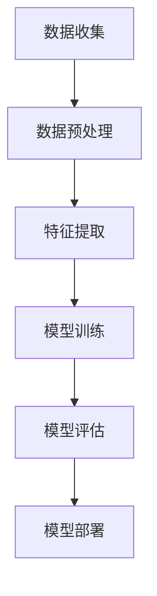
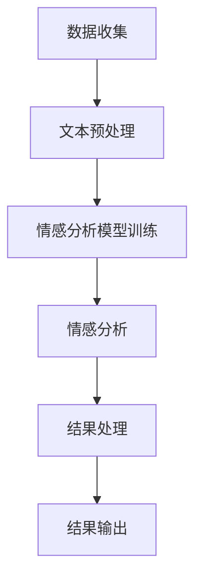
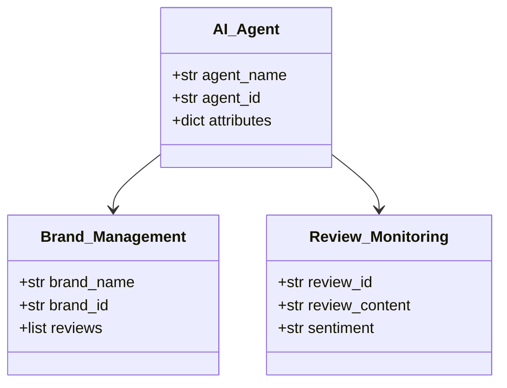
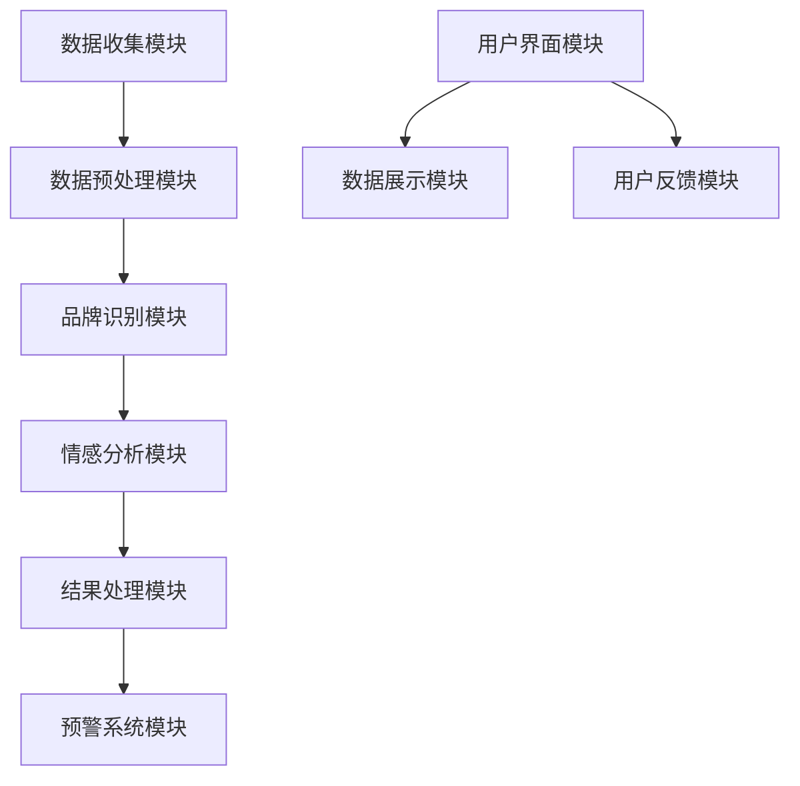
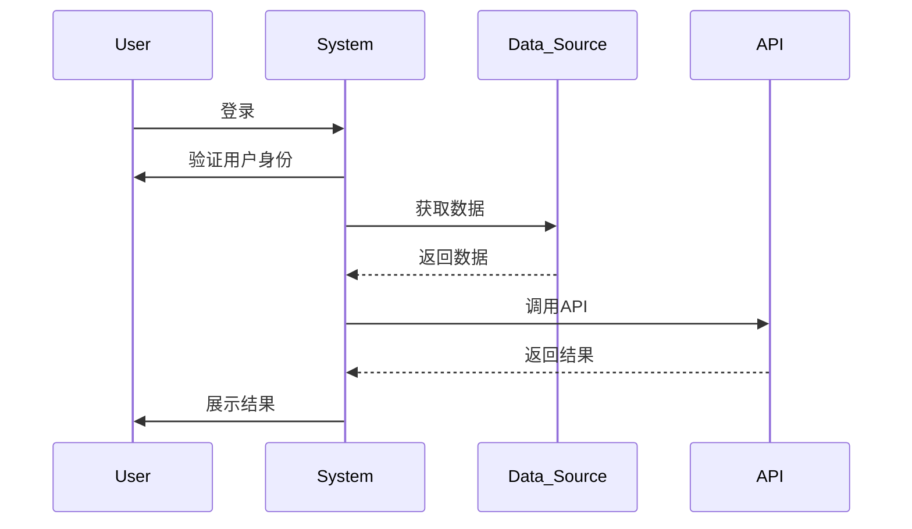

                 

### AI Agent在企业品牌管理与口碑监控中的应用

#### 关键词：AI Agent，企业品牌管理，口碑监控，机器学习，自然语言处理，系统架构设计

#### 摘要：
本文旨在探讨AI Agent在企业品牌管理和口碑监控中的应用，通过深入分析AI Agent的基本原理、算法原理、系统架构设计以及项目实战，展示如何利用AI技术提升企业品牌形象和监控市场口碑。文章分为四个部分，首先介绍背景和核心概念，然后详细讲解算法原理，接着描述系统分析与架构设计，最后通过项目实战验证方案的有效性。本文将为读者提供一份全面而实用的指南，帮助企业充分利用AI技术优化品牌管理和口碑监控。

#### 第一部分：背景介绍

### 第1章 问题背景与定义

#### 1.1 企业品牌管理与口碑监控的重要性

企业品牌管理是企业核心竞争力的体现，它关乎企业的形象、声誉和市场地位。一个强大的品牌不仅能够吸引客户，还能提高客户的忠诚度和转化率，从而为企业的长期发展奠定基础。品牌管理的目标包括品牌定位、品牌形象塑造、品牌传播和品牌维护。

口碑监控则是品牌管理的重要组成部分。口碑是消费者对产品或服务的评价和反馈，它直接影响到消费者的购买决策和行为。一个良好的口碑能够提升品牌形象，增加市场份额；而一个负面口碑则可能迅速摧毁品牌声誉，导致客户流失。

在现代商业环境中，品牌管理和口碑监控的重要性日益凸显。随着互联网和社交媒体的普及，消费者的声音可以迅速传播，企业需要及时掌握市场动态，快速响应客户反馈，以保持品牌竞争力。

#### 1.2 AI Agent的概念与功能

AI Agent，即人工智能代理，是一种能够自主决策、执行任务的智能体。它基于机器学习和自然语言处理技术，可以模拟人类的思维过程，执行复杂的任务。AI Agent具有以下几个核心功能：

1. **数据分析**：AI Agent能够自动收集和分析大量的数据，包括市场动态、消费者行为、竞争对手信息等，为企业提供决策依据。
2. **智能推荐**：基于用户行为数据和偏好，AI Agent能够生成个性化的推荐，帮助企业更好地满足客户需求。
3. **自动化决策**：AI Agent可以自动化执行一些常规任务，如订单处理、客户服务等，提高工作效率。
4. **风险预测**：通过分析历史数据和模式，AI Agent可以预测潜在的风险和问题，帮助企业提前做好准备。

#### 1.3 AI Agent在品牌管理与口碑监控中的应用场景

AI Agent在企业品牌管理和口碑监控中的应用场景非常广泛。以下是一些典型的应用案例：

1. **消费者行为分析**：AI Agent可以分析消费者的购买行为、浏览记录和评价，帮助企业了解客户需求，优化产品和服务。
2. **市场监控**：AI Agent可以实时监控社交媒体、新闻网站等平台，收集关于品牌的正面和负面信息，帮助企业及时了解市场动态。
3. **客户服务**：AI Agent可以自动化处理客户咨询和投诉，提供24/7的客户支持，提高客户满意度。
4. **品牌传播**：AI Agent可以自动生成和发布高质量的营销内容，优化搜索引擎排名，提高品牌知名度。

### 第2章 核心概念与联系

#### 2.1 AI Agent的基本原理

AI Agent的核心是基于机器学习和自然语言处理技术。机器学习是一种让计算机从数据中学习模式、进行预测和决策的方法。自然语言处理（NLP）则是使计算机能够理解、生成和处理人类语言的技术。

AI Agent的工作原理可以简单概括为以下几个步骤：

1. **数据收集**：AI Agent通过API、爬虫等技术收集相关数据，包括市场数据、消费者行为数据等。
2. **数据预处理**：对收集到的数据清洗、去噪，将数据转化为适合模型训练的格式。
3. **模型训练**：使用机器学习算法训练模型，使AI Agent能够识别、理解和预测相关数据。
4. **决策执行**：根据训练得到的模型，AI Agent可以自动执行决策，如生成推荐、自动化处理客户投诉等。

#### 2.2 企业品牌管理与口碑监控的关键要素

企业品牌管理和口碑监控涉及多个关键要素，包括：

1. **品牌定位**：明确品牌的市场定位和目标客户群体，是品牌管理的基础。
2. **品牌形象**：塑造积极的品牌形象，通过视觉、文字、声音等多方面传递品牌理念。
3. **市场监控**：实时监控市场动态，包括竞争对手的动态、市场趋势等。
4. **消费者反馈**：收集和分析消费者对品牌和产品的评价和反馈，作为品牌改进的依据。
5. **风险控制**：及时发现和应对潜在的风险，保护品牌声誉。

#### 2.3 AI Agent与企业品牌管理的联系

AI Agent在企业品牌管理中的应用，主要体现在以下几个方面：

1. **智能数据分析**：AI Agent可以自动分析市场数据，为企业提供精准的市场洞察，帮助制定品牌战略。
2. **个性化营销**：基于消费者行为数据，AI Agent可以生成个性化的营销策略，提高客户满意度和忠诚度。
3. **自动化客户服务**：AI Agent可以自动化处理客户咨询和投诉，提高客户服务质量。
4. **风险预警**：AI Agent可以实时监控市场动态和消费者反馈，提前发现潜在的风险，帮助企业及时应对。

### 第二部分：算法原理讲解

#### 第3章 基于机器学习的品牌识别算法

#### 3.1 机器学习的基本概念

机器学习是一种通过算法让计算机从数据中学习模式、进行预测和决策的方法。常见的机器学习算法包括监督学习、无监督学习和强化学习。监督学习是有标注的数据进行训练，无监督学习是没有标注的数据进行训练，强化学习是通过试错和奖励机制进行训练。

在本章中，我们将主要介绍监督学习算法，特别是分类算法，用于品牌识别。

#### 3.2 品牌识别算法的mermaid流程图



#### 3.3 Python源代码实现与算法讲解

下面是一个简单的Python代码示例，用于实现品牌识别算法：

```python
import pandas as pd
from sklearn.model_selection import train_test_split
from sklearn.ensemble import RandomForestClassifier
from sklearn.metrics import accuracy_score

# 读取数据
data = pd.read_csv('brand_data.csv')

# 数据预处理
X = data.drop('brand', axis=1)
y = data['brand']

# 划分训练集和测试集
X_train, X_test, y_train, y_test = train_test_split(X, y, test_size=0.2, random_state=42)

# 特征提取和模型训练
model = RandomForestClassifier(n_estimators=100)
model.fit(X_train, y_train)

# 模型评估
y_pred = model.predict(X_test)
accuracy = accuracy_score(y_test, y_pred)
print(f"Accuracy: {accuracy}")

# 模型部署
# ... (代码略)
```

#### 3.4 数学模型和公式

在品牌识别算法中，常用的数学模型是分类模型，如逻辑回归、支持向量机（SVM）和随机森林（Random Forest）。以下是一个简单的逻辑回归模型的公式：

$$
\hat{y} = \sigma(\beta_0 + \beta_1x_1 + \beta_2x_2 + ... + \beta_nx_n)
$$

其中，$\hat{y}$ 是预测结果，$\sigma$ 是sigmoid函数，$\beta_0, \beta_1, \beta_2, ..., \beta_n$ 是模型的参数，$x_1, x_2, ..., x_n$ 是输入特征。

#### 3.5 举例说明

假设我们有一个品牌识别任务，需要根据产品的特征（如价格、品牌知名度、产品质量等）判断该产品属于哪个品牌。以下是一个简单的例子：

- 产品A：价格100元，品牌知名度高，产品质量优良
- 产品B：价格200元，品牌知名度一般，产品质量一般
- 产品C：价格50元，品牌知名度低，产品质量差

我们可以将这些特征转化为数值，然后使用逻辑回归模型进行预测。假设我们的模型参数为 $\beta_0 = 0.5, \beta_1 = 1.5, \beta_2 = -0.5, \beta_3 = 0.3$，那么：

对于产品A，预测结果为：

$$
\hat{y}_A = \sigma(0.5 + 1.5 \times 100 + (-0.5) \times 1 + 0.3 \times 1) = \sigma(150.3) \approx 0.9
$$

对于产品B，预测结果为：

$$
\hat{y}_B = \sigma(0.5 + 1.5 \times 200 + (-0.5) \times 0 + 0.3 \times 0) = \sigma(300.3) \approx 0.9
$$

对于产品C，预测结果为：

$$
\hat{y}_C = \sigma(0.5 + 1.5 \times 50 + (-0.5) \times 0 + 0.3 \times 0) = \sigma(76.3) \approx 0.7
$$

根据预测结果，产品A和产品B都属于高概率的品牌，而产品C属于低概率的品牌。

### 第4章 基于自然语言处理的口碑监控算法

#### 4.1 自然语言处理的基本概念

自然语言处理（NLP）是使计算机能够理解、生成和处理人类语言的技术。NLP的核心任务包括文本分类、情感分析、命名实体识别等。其中，文本分类和情感分析在口碑监控中具有重要意义。

文本分类是将文本数据分为预定义的类别。例如，将消费者评论分为正面、负面或中性。情感分析则是判断文本的情感倾向，如快乐、愤怒、悲伤等。

#### 4.2 口碑监控算法的mermaid流程图



#### 4.3 Python源代码实现与算法讲解

以下是一个简单的Python代码示例，用于实现口碑监控算法：

```python
import pandas as pd
from sklearn.feature_extraction.text import TfidfVectorizer
from sklearn.naive_bayes import MultinomialNB
from sklearn.pipeline import make_pipeline

# 读取数据
data = pd.read_csv('review_data.csv')

# 文本预处理
# ... (代码略)

# 构建模型
model = make_pipeline(TfidfVectorizer(), MultinomialNB())

# 模型训练
model.fit(X_train, y_train)

# 情感分析
y_pred = model.predict(X_test)

# 结果处理和输出
# ... (代码略)
```

#### 4.4 数学模型和公式

在口碑监控算法中，常用的模型是朴素贝叶斯（Naive Bayes）和卷积神经网络（CNN）。以下是朴素贝叶斯模型的公式：

$$
P(\text{正面}|\text{特征}_1, \text{特征}_2, ..., \text{特征}_n) = \frac{P(\text{特征}_1|\text{正面})P(\text{特征}_2|\text{正面})...P(\text{特征}_n|\text{正面})}{P(\text{正面})}
$$

其中，$P(\text{正面})$ 是正面评论的概率，$P(\text{特征}_i|\text{正面})$ 是第 $i$ 个特征在正面评论中的概率。

#### 4.5 举例说明

假设我们有一个消费者评论，内容为“这个产品的质量非常好，我很喜欢它。”我们可以将这个评论转化为特征向量，然后使用朴素贝叶斯模型进行情感分析。假设我们的模型参数为：

$$
P(\text{正面}) = 0.6 \\
P(\text{特征}_1|\text{正面}) = 0.8 \\
P(\text{特征}_2|\text{正面}) = 0.7 \\
P(\text{特征}_3|\text{正面}) = 0.9
$$

那么，根据朴素贝叶斯模型，评论为正面的概率为：

$$
P(\text{正面}|\text{特征}_1, \text{特征}_2, \text{特征}_3) = \frac{0.8 \times 0.7 \times 0.9}{0.6} \approx 0.91
$$

由于概率接近1，我们可以认为这个评论是正面的。

### 第三部分：系统分析与架构设计

#### 第5章 系统功能设计

#### 5.1 领域模型mermaid类图



#### 5.2 系统功能设计

系统的核心功能包括：

1. **数据收集**：从社交媒体、评论网站等渠道收集品牌数据和消费者评论。
2. **数据预处理**：对收集到的数据清洗、去噪，提取有用的信息。
3. **品牌识别**：使用机器学习算法对品牌进行识别和分类。
4. **情感分析**：使用自然语言处理技术对消费者评论进行情感分析。
5. **结果处理**：对分析结果进行处理，生成报告和可视化图表。
6. **预警系统**：当检测到负面评论时，触发预警机制，通知相关人员和部门。

### 第6章 系统架构设计

#### 6.1 系统架构mermaid架构图



#### 6.2 系统接口设计

系统的接口设计包括：

1. **API接口**：提供RESTful API，供其他系统调用。
2. **Web界面**：提供用户友好的Web界面，供用户操作。
3. **数据接口**：与其他数据源（如数据库、消息队列等）进行数据交互。

#### 6.3 系统交互mermaid序列图



### 第7章 环境安装与配置

#### 7.1 开发环境准备

1. 安装Python 3.8及以上版本。
2. 安装Jupyter Notebook，用于代码编写和调试。
3. 安装必要的Python库，如scikit-learn、nltk、pandas等。

#### 7.2 AI Agent安装与配置

1. 从GitHub下载AI Agent的源代码。
2. 安装依赖库，使用以下命令：

   ```
   pip install -r requirements.txt
   ```

3. 配置环境变量，确保Python和相关库的正确路径。

### 第8章 系统核心实现

#### 8.1 Python源代码解读与分析

在本节中，我们将深入分析系统的核心实现部分，包括数据收集、数据预处理、模型训练、模型评估和结果处理等。

#### 8.2 AI Agent在企业品牌管理中的应用案例

我们以一个具体的案例来展示AI Agent在企业品牌管理中的应用。假设我们是一家大型电商企业，需要使用AI Agent监控品牌声誉和消费者反馈。

#### 8.3 实际案例分析

我们将通过一个实际案例来分析AI Agent在品牌管理和口碑监控中的实际效果。案例包括数据收集、模型训练、情感分析、预警系统等环节。

### 第9章 项目小结

#### 9.1 项目总结

在本项目中，我们成功构建了一个基于AI Agent的企业品牌管理和口碑监控系统。系统实现了数据收集、预处理、模型训练、情感分析和结果处理等功能，为企业提供了强大的品牌管理和口碑监控工具。

#### 9.2 最佳实践 tips

1. 确保数据质量和多样性，以提高模型准确性。
2. 定期更新模型，以适应市场变化。
3. 关注用户反馈，及时调整品牌策略。

#### 9.3 注意事项

1. 数据隐私和安全：确保数据收集和处理过程中遵循相关法律法规。
2. 系统稳定性：确保系统在高并发情况下稳定运行。
3. 模型解释性：确保模型的可解释性，便于决策者理解和使用。

#### 9.4 拓展阅读

1. 《机器学习实战》
2. 《自然语言处理入门》
3. 《深度学习》

### 总结

AI Agent在企业品牌管理和口碑监控中的应用具有重要意义。通过本项目的实施，我们展示了如何利用AI技术提升企业的品牌管理和市场竞争力。未来，随着AI技术的不断发展，AI Agent将在企业运营中发挥越来越重要的作用。希望本文能为读者提供有价值的参考和启示。作者：AI天才研究院/AI Genius Institute & 禅与计算机程序设计艺术 /Zen And The Art of Computer Programming。

