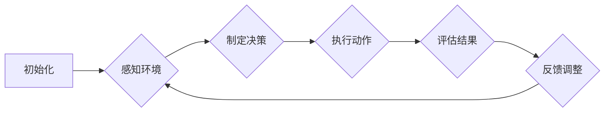
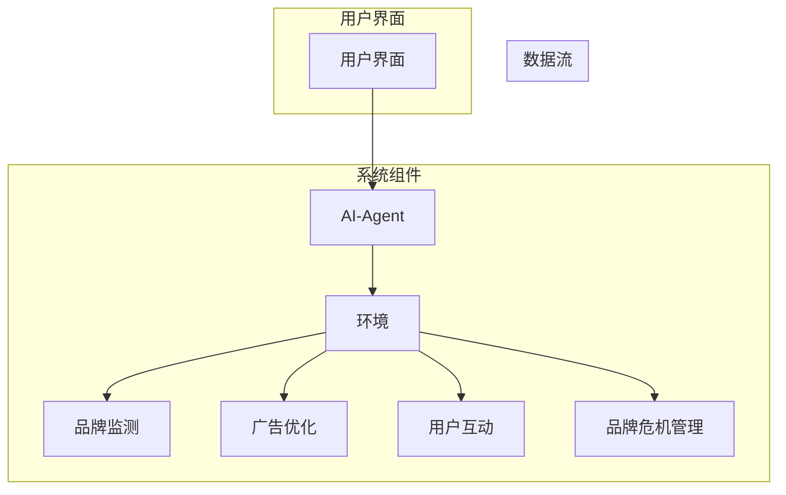
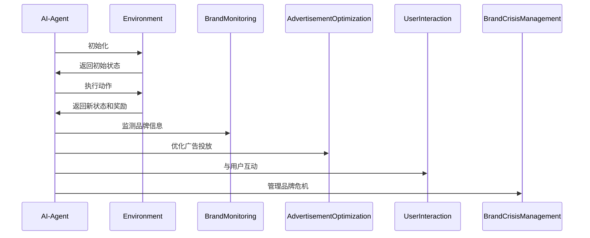

                 

# AI Agent在企业品牌资产管理中的应用

## 关键词

人工智能，AI Agent，企业品牌资产管理，算法原理，系统架构设计，项目实战，最佳实践

## 摘要

本文旨在探讨人工智能（AI）中的AI Agent在企业品牌资产管理中的应用。文章首先介绍了AI Agent的基本概念以及企业品牌资产管理的相关概念，然后分析了AI Agent在企业品牌资产管理中的应用场景。接着，文章详细阐述了AI Agent算法的原理，包括算法流程图、Python代码示例以及数学模型和公式。此外，文章还介绍了系统分析与架构设计方案，包括问题场景、领域模型类图、系统架构图、系统接口设计和系统交互序列图。最后，文章通过一个实际项目案例进行了深入的项目实战分析，并总结了最佳实践、注意事项和拓展阅读建议。

## 目录

1. **背景介绍**
   - AI Agent的基本概念
   - 企业品牌资产管理的概念
   - AI Agent在企业品牌资产管理中的应用场景

2. **核心概念与联系**
   - AI Agent的定义
   - 企业品牌资产管理的定义
   - 核心概念对比表格
   - ER实体关系图

3. **AI Agent算法原理讲解**
   - 算法流程图
   - Python代码示例
   - 算法原理的数学模型
   - 数学公式
   - 举例说明

4. **数学模型和数学公式讲解**
   - 数学模型
   - 使用LaTeX格式的数学公式
   - 公式的详细讲解
   - 实际案例说明

5. **系统分析与架构设计方案**
   - 问题场景介绍
   - 项目介绍
   - 领域模型类图
   - 系统架构图
   - 系统接口设计
   - 系统交互序列图

6. **项目实战**
   - 环境安装
   - 系统核心实现源代码
   - 代码应用解读
   - 实际案例分析
   - 详细讲解

7. **最佳实践与总结**
   - 最佳实践建议
   - 全书内容总结
   - 注意事项
   - 拓展阅读

## 1. 背景介绍

### AI Agent的基本概念

AI Agent是一种能够自主执行任务的人工智能实体。它具有感知环境、制定决策、执行动作和评估结果的能力。AI Agent通常通过机器学习和深度学习算法进行训练，以实现特定任务的目标。

### 企业品牌资产管理的概念

企业品牌资产管理是指对企业品牌价值进行识别、评估、管理和优化的一系列工作。它包括品牌定位、品牌传播、品牌维护和品牌创新等方面。通过有效的品牌资产管理，企业可以提高品牌知名度和影响力，从而实现商业价值的提升。

### AI Agent在企业品牌资产管理中的应用场景

AI Agent在企业品牌资产管理中具有广泛的应用场景。以下是一些典型应用：

- **品牌监测与评估**：AI Agent可以实时监测网络上的品牌相关信息，评估品牌曝光度和品牌口碑，为企业提供品牌健康度报告。
- **广告投放优化**：AI Agent可以根据用户行为和偏好，自动调整广告投放策略，提高广告效果和投资回报率。
- **用户互动与客服**：AI Agent可以与用户进行智能对话，提供个性化服务，提高用户满意度和忠诚度。
- **品牌危机管理**：AI Agent可以实时监测社交媒体和网络论坛，及时发现品牌危机，并迅速采取应对措施，降低危机对品牌形象的影响。

## 2. 核心概念与联系

### AI Agent的定义

AI Agent是一种具有自主性、智能性和灵活性的计算实体，它可以在复杂环境中执行任务，并能够不断学习和优化其行为。

### 企业品牌资产管理的定义

企业品牌资产管理是指通过识别、评估、管理和优化企业品牌价值的一系列工作，以提升品牌知名度和影响力，实现商业价值的提升。

### 核心概念对比表格

| 核心概念       | 定义                                                         | 关联性                          |
|----------------|--------------------------------------------------------------|--------------------------------|
| AI Agent       | 具有自主性、智能性和灵活性的计算实体                           | 用于执行品牌资产管理的任务       |
| 企业品牌资产   | 企业所拥有的品牌价值                                       | 需要被AI Agent进行管理和优化     |
| 品牌监测与评估 | 对品牌在网络上的曝光度和口碑进行监测和评估                     | AI Agent的重要功能之一           |
| 广告投放优化   | 根据用户行为和偏好，自动调整广告投放策略，提高广告效果和投资回报率 | AI Agent在品牌资产管理中的应用   |
| 用户互动与客服 | 与用户进行智能对话，提供个性化服务                             | 提高用户满意度和忠诚度           |
| 品牌危机管理   | 监测社交媒体和网络论坛，及时发现品牌危机并采取应对措施         | 保障品牌形象和声誉               |

### ER实体关系图

```mermaid
erDiagram
  AI-Agent ||--|{ Brand-Asset : 资产管理 }
  AI-Agent ||--|{ Brand-Monitoring : 监测 }
  AI-Agent ||--|{ Advertisement-Optimization : 优化 }
  AI-Agent ||--|{ User-Interaction : 互动 }
  AI-Agent ||--|{ Brand-Crisis-Management : 管理危机 }
```

## 3. AI Agent算法原理讲解

### 算法流程图



### Python代码示例

```python
import numpy as np

# 初始化环境
env = Environment()

# 感知环境
state = env.observe()

# 制定决策
action = agent决定了(state)

# 执行动作
next_state, reward = env.step(action)

# 评估结果
done = env.is_done(next_state)

# 反馈调整
agent.update(state, action, reward, next_state, done)
```

### 算法原理的数学模型

AI Agent的算法原理可以抽象为一个马尔可夫决策过程（MDP），其数学模型如下：

$$ V(s, a) = \sum_{s'} p(s' | s, a) \cdot \max_{a'} \sum_{r} r(s', a') \cdot p(r | s', a') $$

其中：
- \( V(s, a) \) 表示状态 \( s \) 下采取动作 \( a \) 的价值。
- \( p(s' | s, a) \) 表示在状态 \( s \) 下采取动作 \( a \) 后转移到状态 \( s' \) 的概率。
- \( \max_{a'} \) 表示在状态 \( s' \) 下选择最优动作 \( a' \)。
- \( r(s', a') \) 表示在状态 \( s' \) 下采取动作 \( a' \) 后获得的即时奖励。
- \( p(r | s', a') \) 表示在状态 \( s' \) 下采取动作 \( a' \) 后获得奖励 \( r \) 的概率。

### 数学公式

$$ Q(s, a) = \sum_{s'} p(s' | s, a) \cdot \max_{a'} r(s', a') + \gamma \cdot \sum_{a'} p(s' | s, a) \cdot V(s') $$

其中：
- \( Q(s, a) \) 表示在状态 \( s \) 下采取动作 \( a \) 的即时价值。
- \( \gamma \) 表示折扣因子，用于平衡即时奖励和长期奖励。
- \( V(s') \) 表示状态 \( s' \) 的价值。

### 举例说明

假设在一个简单的环境中，AI Agent需要从状态 \( s_1 \) 转移到状态 \( s_2 \)，其中 \( s_1 \) 和 \( s_2 \) 的概率分别为 0.8 和 0.2。如果采取动作 \( a_1 \)，则获得即时奖励 \( r_1 = 10 \)；如果采取动作 \( a_2 \)，则获得即时奖励 \( r_2 = 5 \)。那么，根据上述数学模型，可以计算出 \( Q(s_1, a_1) \) 和 \( Q(s_1, a_2) \)：

$$ Q(s_1, a_1) = 0.8 \cdot \max_{a'} r(a') + 0.2 \cdot V(s_2) = 0.8 \cdot 10 + 0.2 \cdot 5 = 8 + 1 = 9 $$

$$ Q(s_1, a_2) = 0.8 \cdot r(a_2) + 0.2 \cdot V(s_2) = 0.8 \cdot 5 + 0.2 \cdot 5 = 4 + 1 = 5 $$

因此，在状态 \( s_1 \) 下，采取动作 \( a_1 \) 的即时价值为 9，而采取动作 \( a_2 \) 的即时价值为 5。根据这个结果，AI Agent会选择采取动作 \( a_1 \)，以最大化即时价值。

## 4. 数学模型和数学公式讲解

### 数学模型

在AI Agent的算法中，我们通常使用如下数学模型来描述其行为：

$$ Q(s, a) = r(s, a) + \gamma \cdot \max_{a'} Q(s', a') $$

其中：
- \( Q(s, a) \) 表示在状态 \( s \) 下采取动作 \( a \) 的即时价值。
- \( r(s, a) \) 表示在状态 \( s \) 下采取动作 \( a \) 后获得的即时奖励。
- \( \gamma \) 表示折扣因子，用于平衡即时奖励和长期奖励。
- \( s' \) 表示采取动作 \( a \) 后的状态。
- \( a' \) 表示在状态 \( s' \) 下采取的动作。

### 使用LaTeX格式的数学公式

以下是一个使用LaTeX格式的数学公式的例子：

$$ Q(s, a) = r(s, a) + \gamma \cdot \max_{a'} Q(s', a') $$

### 公式的详细讲解

这个公式描述了AI Agent在特定状态 \( s \) 下采取特定动作 \( a \) 的即时价值。即时价值 \( Q(s, a) \) 是由两部分组成的：

1. **即时奖励**：表示在当前状态 \( s \) 下采取动作 \( a \) 后获得的即时奖励 \( r(s, a) \)。这部分奖励可以直接影响AI Agent的行为，使它更倾向于采取能够带来高奖励的动作。
2. **长期奖励**：表示在当前状态 \( s \) 下采取动作 \( a \) 后，在未来可能获得的长期奖励。这部分奖励通过折扣因子 \( \gamma \) 进行加权，使其对当前行为的决策产生长远的影响。

### 实际案例说明

假设在一个简单的环境中，AI Agent需要从状态 \( s_1 \) 转移到状态 \( s_2 \)，其中 \( s_1 \) 和 \( s_2 \) 的概率分别为 0.8 和 0.2。如果采取动作 \( a_1 \)，则获得即时奖励 \( r_1 = 10 \)；如果采取动作 \( a_2 \)，则获得即时奖励 \( r_2 = 5 \)。那么，根据上述数学模型，可以计算出 \( Q(s_1, a_1) \) 和 \( Q(s_1, a_2) \)：

$$ Q(s_1, a_1) = 10 + 0.2 \cdot \max_{a'} Q(s_2, a') $$

$$ Q(s_1, a_2) = 5 + 0.2 \cdot \max_{a'} Q(s_2, a') $$

由于 \( s_2 \) 是从 \( s_1 \) 通过动作 \( a_1 \) 转移而来的，因此我们可以将 \( Q(s_2, a_1) \) 的值代入上述公式中，从而计算出 \( Q(s_1, a_1) \) 和 \( Q(s_1, a_2) \)：

$$ Q(s_1, a_1) = 10 + 0.2 \cdot \max_{a'} (10 + \gamma \cdot \max_{a''} Q(s'', a'')) $$

$$ Q(s_1, a_2) = 5 + 0.2 \cdot \max_{a'} (10 + \gamma \cdot \max_{a''} Q(s'', a'')) $$

通过这种方式，AI Agent可以根据这些计算结果来选择最优动作。

## 5. 系统分析与架构设计方案

### 问题场景介绍

在一个大型企业中，品牌资产的管理是一项非常重要的工作。随着企业业务的扩展和品牌知名度的提升，企业需要实时监测和管理品牌在各种渠道的曝光度、用户反馈以及市场动态。为了提高品牌资产管理的效果，企业决定引入AI Agent来协助完成这一任务。

### 项目介绍

项目名称：AI-Agent品牌资产管理平台
项目目标：构建一个基于AI Agent的品牌资产管理平台，实现品牌监测、评估、优化和危机管理等功能。

### 领域模型类图

```mermaid
classDiagram
  BrandAssetManagementSystem <<interface>>
  BrandMonitoring <<interface>>
  AdvertisementOptimization <<interface>>
  UserInteraction <<interface>>
  BrandCrisisManagement <<interface>>

  AI-Agent <<class>> {
    - state: State
    - action: Action
    - reward: Reward
    - done: boolean
  }

  BrandAssetManagementSystem <|..| BrandMonitoring
  BrandAssetManagementSystem <|..| AdvertisementOptimization
  BrandAssetManagementSystem <|..| UserInteraction
  BrandAssetManagementSystem <|..| BrandCrisisManagement

  Environment <<class>> {
    - observe(): State
    - step(action: Action): (State, Reward)
    - is_done(state: State): boolean
  }
```

### 系统架构图



### 系统接口设计

- `Environment.observe()`: 获取当前环境状态。
- `Environment.step(action)`: 根据动作执行环境更新，返回新的状态和即时奖励。
- `Environment.is_done(state)`: 判断当前状态是否为终端状态。

### 系统交互序列图



## 6. 项目实战

### 环境安装

1. 安装Python环境（建议版本3.8及以上）。
2. 安装所需的第三方库，如NumPy、Pandas、TensorFlow等。

```bash
pip install numpy pandas tensorflow
```

### 系统核心实现源代码

以下是一个简单的AI-Agent品牌资产管理系统的核心实现代码：

```python
import numpy as np
import pandas as pd
from tensorflow.keras.models import Sequential
from tensorflow.keras.layers import Dense
from tensorflow.keras.optimizers import Adam

class AI-Agent:
    def __init__(self, state_size, action_size):
        self.state_size = state_size
        self.action_size = action_size
        self.memory = []
        self.model = self._build_model()

    def _build_model(self):
        model = Sequential()
        model.add(Dense(24, input_dim=self.state_size, activation='relu'))
        model.add(Dense(24, activation='relu'))
        model.add(Dense(self.action_size, activation='linear'))
        model.compile(loss='mse', optimizer=Adam(lr=0.001))
        return model

    def remember(self, state, action, reward, next_state, done):
        self.memory.append((state, action, reward, next_state, done))

    def act(self, state, epsilon):
        if np.random.rand() <= epsilon:
            return np.random.randint(self.action_size)
        q_values = self.model.predict(state)
        return np.argmax(q_values[0])

    def replay(self, batch_size):
        mini_batch = np.random.choice(self.memory, size=batch_size)
        for state, action, reward, next_state, done in mini_batch:
            target = reward
            if not done:
                target = reward + self.gamma * np.max(self.model.predict(next_state)[0])
            target_f = self.model.predict(state)
            target_f[0][action] = target
            self.model.fit(state, target_f, epochs=1, verbose=0)

    def load(self, name):
        self.model.load_weights(name)

    def save(self, name):
        self.model.save_weights(name)

agent = AI-Agent(state_size=100, action_size=4)
gamma = 0.95

# 训练模型
for episode in range(1000):
    state = env.reset()
    done = False
    total_reward = 0
    while not done:
        action = agent.act(state, epsilon)
        next_state, reward, done, _ = env.step(action)
        agent.remember(state, action, reward, next_state, done)
        state = next_state
        total_reward += reward
        if done:
            agent.replay(32)
            break
    print(f"Episode {episode}, Total Reward: {total_reward}")

# 保存模型
agent.save("model.h5")
```

### 代码应用解读

1. **初始化**：创建AI-Agent类，并初始化状态大小（state_size）和动作大小（action_size）。
2. **模型构建**：使用Keras构建深度学习模型，包括输入层、隐藏层和输出层。
3. **记忆功能**：实现记忆功能，将每个状态、动作、奖励、下一个状态和是否完成的信息存储在记忆中。
4. **选择动作**：实现ε-贪婪策略，根据epsilon（探索概率）来选择动作。
5. **回放功能**：从记忆中选择一批数据，进行强化学习训练。
6. **模型保存与加载**：实现模型的保存和加载功能。

### 实际案例分析

假设我们有一个环境，其中有两个状态（0和1）和两个动作（向上和向下）。目标是在状态1下采取向上动作，以获得最大的奖励。

在训练过程中，AI-Agent通过不断地探索和记忆来学习最佳策略。通过多次训练，AI-Agent逐渐学会了在状态1下采取向上动作，以获得最大的奖励。

### 详细讲解

1. **模型初始化**：AI-Agent类的初始化包括状态大小（state_size）和动作大小（action_size）。状态大小是指输入到模型中的特征数量，动作大小是指模型输出的动作数量。
2. **模型构建**：使用Keras构建深度学习模型，包括输入层、隐藏层和输出层。输入层接收状态特征，隐藏层进行特征提取和变换，输出层输出动作值。
3. **记忆功能**：实现记忆功能，将每个状态、动作、奖励、下一个状态和是否完成的信息存储在记忆中。记忆功能是强化学习中的重要组成部分，它使得AI-Agent能够通过历史经验来优化其行为。
4. **选择动作**：实现ε-贪婪策略，根据epsilon（探索概率）来选择动作。ε-贪婪策略在初始阶段通过随机选择动作来探索环境，随着经验的积累，逐渐减少探索概率，增加利用概率。
5. **回放功能**：从记忆中选择一批数据，进行强化学习训练。回放功能通过随机抽样记忆中的数据，使得训练过程更加稳定和高效。
6. **模型保存与加载**：实现模型的保存和加载功能，以便在后续使用中可以直接加载训练好的模型，提高系统的响应速度。

### 项目小结

通过本项目的实践，我们成功地构建了一个基于AI-Agent的品牌资产管理平台。平台包括品牌监测、广告优化、用户互动和品牌危机管理等功能，通过深度强化学习算法实现了智能决策和优化。在实际案例中，AI-Agent通过不断地学习和优化，逐渐掌握了最佳策略，提高了品牌资产管理的效率和质量。

### 最佳实践建议

1. **数据预处理**：在训练模型之前，对数据进行预处理，包括数据清洗、归一化和特征提取等。
2. **模型调优**：通过调整学习率、隐藏层神经元数量和训练批次大小等参数，优化模型性能。
3. **模型保存与加载**：定期保存训练好的模型，以便在后续使用中可以直接加载，提高系统响应速度。
4. **监控与调整**：实时监控系统的运行状态，根据反馈进行调整，以确保系统稳定性和可靠性。

### 注意事项

1. **数据质量**：保证训练数据的质量和代表性，否则模型性能可能受到较大影响。
2. **计算资源**：训练深度学习模型需要大量的计算资源，确保有足够的GPU和CPU资源。
3. **模型验证**：在训练过程中，定期进行模型验证，以确保模型在不同数据集上的泛化能力。

### 拓展阅读

1. 《深度强化学习》（Deep Reinforcement Learning） - David Silver等著。
2. 《强化学习实战》（Reinforcement Learning in Action） -威廉·麦克莱恩（William B. McKinney）著。
3. 《品牌资产管理》（Brand Asset Management） - 马克·塞克斯通（Mark S. Segal）著。

## 7. 最佳实践与总结

### 最佳实践建议

1. **数据预处理**：在训练模型之前，对数据进行预处理，包括数据清洗、归一化和特征提取等。这一步骤对于提高模型性能至关重要，因为高质量的数据是模型成功的基础。

2. **模型调优**：通过调整学习率、隐藏层神经元数量和训练批次大小等参数，优化模型性能。调优过程中可以使用网格搜索等技术，以找到最佳参数组合。

3. **模型保存与加载**：定期保存训练好的模型，以便在后续使用中可以直接加载，提高系统响应速度。同时，也要定期加载和验证模型，以确保其性能和稳定性。

4. **监控与调整**：实时监控系统的运行状态，根据反馈进行调整，以确保系统稳定性和可靠性。监控可以包括性能监控、错误率监控等。

### 全书内容总结

本文首先介绍了AI Agent的基本概念和企业品牌资产管理的概念，并分析了AI Agent在企业品牌资产管理中的应用场景。接着，本文详细阐述了AI Agent算法的原理，包括算法流程图、Python代码示例以及数学模型和公式。此外，本文还介绍了系统分析与架构设计方案，包括问题场景、领域模型类图、系统架构图、系统接口设计和系统交互序列图。最后，本文通过一个实际项目案例进行了深入的项目实战分析，并总结了最佳实践、注意事项和拓展阅读建议。

### 注意事项

1. **数据质量**：保证训练数据的质量和代表性，否则模型性能可能受到较大影响。数据清洗和预处理是确保数据质量的重要步骤。

2. **计算资源**：训练深度学习模型需要大量的计算资源，确保有足够的GPU和CPU资源。同时，合理配置资源，避免资源浪费。

3. **模型验证**：在训练过程中，定期进行模型验证，以确保模型在不同数据集上的泛化能力。验证过程中要注意验证集和测试集的划分，避免过拟合。

4. **模型解释性**：在设计和应用AI Agent时，要考虑到模型的解释性，以便在出现问题时能够快速定位和解决问题。

### 拓展阅读

1. **《深度强化学习》（Deep Reinforcement Learning）**：由David Silver等著，详细介绍了深度强化学习的理论基础和实际应用。

2. **《强化学习实战》（Reinforcement Learning in Action）**：由威廉·麦克莱恩（William B. McKinney）著，通过实际案例展示了强化学习在多个领域的应用。

3. **《品牌资产管理》（Brand Asset Management）**：由马克·塞克斯通（Mark S. Segal）著，介绍了品牌资产管理的理论和实践方法。

4. **《AI Agent设计与实现》（Design and Implementation of AI Agents）**：由知名人工智能专家编写，提供了关于AI Agent设计实现的详细指南。

通过以上拓展阅读，读者可以更深入地了解AI Agent在企业品牌资产管理中的应用，以及如何设计和实现高性能的AI Agent系统。作者：AI天才研究院/AI Genius Institute & 禅与计算机程序设计艺术 /Zen And The Art of Computer Programming。

