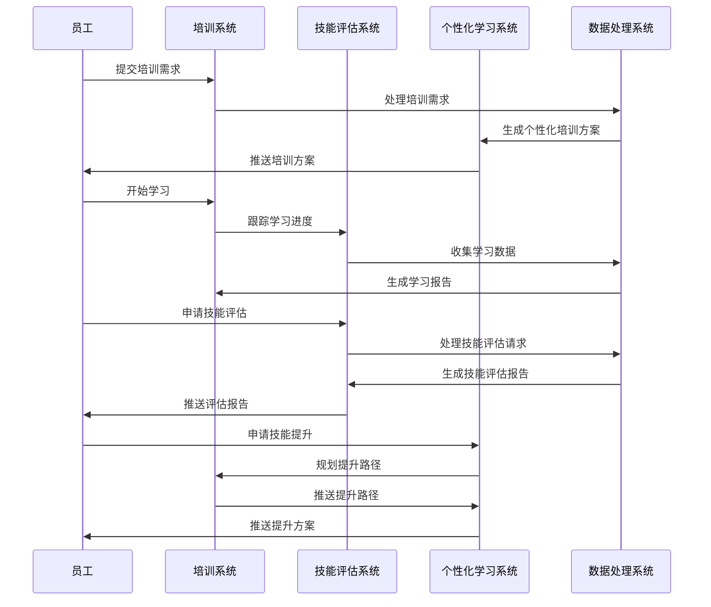

                 


### **1. 背景介绍**

#### **AI Agent的定义与基本原理**

AI Agent，即人工智能代理，是一种能够自主执行任务并做出决策的软件系统。它基于人工智能技术，具备一定的感知、学习、推理和决策能力。AI Agent通过感知环境获取信息，利用算法对信息进行处理，并根据预设的目标执行相应的行动。

在人工智能领域中，AI Agent的概念起源于多智能体系统（Multi-Agent Systems，MAS）。多智能体系统是由多个智能代理组成的分布式系统，每个代理都有独立的感知器和动作器，能够在不完全信息环境下进行协作或竞争。随着人工智能技术的发展，AI Agent的应用范围不断扩大，包括但不限于智能推荐系统、自动化决策支持系统、游戏AI等。

#### **AI Agent在企业培训中的应用**

企业培训是一个旨在提高员工专业技能和知识水平的过程。传统培训方式通常依赖于讲师授课和课堂学习，但这种模式存在很多局限，如培训内容不够个性、培训效果难以评估等。AI Agent的出现，为企业培训带来了新的可能性。

首先，AI Agent能够根据员工的个性化需求，为员工提供定制化的培训内容。通过分析员工的学习历史、职业背景和兴趣爱好，AI Agent能够推荐适合的培训课程和教材。这种个性化培训不仅提高了员工的学习兴趣，还能显著提高学习效果。

其次，AI Agent能够实时跟踪员工的学习进度和效果。通过监测员工的学习行为和成绩，AI Agent能够及时调整培训方案，确保员工能够按计划完成学习任务。同时，AI Agent还能生成学习报告，为企业管理者提供决策依据。

最后，AI Agent能够实现自动化培训效果评估。通过分析员工的考试成绩、学习行为和反馈意见，AI Agent能够客观评估员工的培训效果，帮助企业优化培训策略。

#### **AI Agent在技能评估中的应用**

技能评估是企业管理中的一项重要任务，它旨在评估员工的工作能力和技能水平。传统技能评估通常依赖于主观评价和标准测试，但这种模式存在很多问题，如评价结果不准确、评估过程不透明等。AI Agent的引入，为企业技能评估提供了新的思路。

首先，AI Agent能够通过数据驱动的方式，对员工的技能进行客观评估。通过分析员工的工作表现、学习记录和绩效数据，AI Agent能够生成准确的技能评估结果。这种评估方式不仅提高了评估的准确性，还能确保评估过程的公正性。

其次，AI Agent能够实时跟踪员工的技能水平变化。通过持续监测员工的工作和学习行为，AI Agent能够及时更新员工的技能评估结果，帮助企业及时了解员工的技能水平。

最后，AI Agent能够为员工提供个性化的技能提升建议。根据员工的技能评估结果，AI Agent能够推荐适合的培训课程和提升方案，帮助员工提升技能水平。

### **2. 核心概念与联系**

AI Agent的工作原理主要包括感知、学习、推理和决策四个核心环节。首先，AI Agent通过感知器感知环境中的信息，如文本、图像、声音等。接着，AI Agent利用学习算法处理感知到的信息，提取有用特征并形成知识。然后，AI Agent利用推理机制对知识进行分析和推理，生成决策方案。最后，AI Agent通过动作器执行决策方案，实现对环境的主动适应和改变。

在企业培训与技能评估中，AI Agent的应用主要体现在以下几个方面：

**个性化培训：** AI Agent能够根据员工的学习历史和兴趣爱好，为员工推荐个性化的培训课程。这不仅能提高员工的学习兴趣，还能显著提高培训效果。

**实时跟踪与评估：** AI Agent能够实时跟踪员工的学习进度和效果，生成学习报告和技能评估结果，为企业管理者提供决策依据。

**自动化评估：** AI Agent能够通过自动化评估方式，对员工的技能进行客观评估，提高评估的准确性和公正性。

**个性化提升建议：** AI Agent能够根据员工的技能评估结果，为员工推荐个性化的培训课程和提升方案，帮助员工提升技能水平。

### **3. 算法原理讲解**

#### **监督学习算法**

监督学习是一种常见的人工智能算法，它通过学习已知的输入输出对，预测未知输入的输出。监督学习算法包括线性回归、决策树、支持向量机等。

**线性回归：** 线性回归是一种简单的监督学习算法，它通过建立输入和输出之间的线性关系，预测未知输入的输出。线性回归的数学模型可以表示为：

$$y = \beta_0 + \beta_1x$$

其中，$y$ 是输出，$x$ 是输入，$\beta_0$ 和 $\beta_1$ 是模型参数。

**决策树：** 决策树是一种基于树形结构的监督学习算法，它通过一系列的决策规则，将输入划分为不同的类别。决策树的数学模型可以表示为：

$$f(x) = \prod_{i=1}^{n} g_i(x_i)$$

其中，$f(x)$ 是输出，$x$ 是输入，$g_i(x_i)$ 是第 $i$ 个决策规则。

**支持向量机：** 支持向量机是一种基于最大间隔的监督学习算法，它通过找到一个最佳的超平面，将不同类别的数据点分离。支持向量机的数学模型可以表示为：

$$f(x) = \sum_{i=1}^{n} \alpha_i y_i (w \cdot x_i + b)$$

其中，$f(x)$ 是输出，$x$ 是输入，$w$ 是超平面参数，$b$ 是偏置项，$\alpha_i$ 和 $y_i$ 是支持向量机的参数。

#### **无监督学习算法**

无监督学习是一种不依赖于已知的输入输出对的机器学习算法，它通过学习数据中的内在结构和模式，对数据进行分类、降维或聚类。

**聚类算法：** 聚类算法是一种将数据点划分为若干个类别的无监督学习算法。常见的聚类算法包括K均值聚类、层次聚类等。

K均值聚类的数学模型可以表示为：

$$C = \{C_1, C_2, ..., C_k\}$$

其中，$C$ 是聚类结果，$C_i$ 是第 $i$ 个聚类类别，$k$ 是聚类类别数。

**降维算法：** 降维算法是一种将高维数据转换成低维数据的方法，常见的降维算法包括主成分分析（PCA）和线性判别分析（LDA）。

主成分分析（PCA）的数学模型可以表示为：

$$X' = P \Sigma$$

其中，$X'$ 是降维后的数据，$X$ 是原始数据，$P$ 是投影矩阵，$\Sigma$ 是协方差矩阵。

#### **强化学习算法**

强化学习是一种基于奖励反馈的机器学习算法，它通过不断尝试和错误，学习最优的行动策略。

**Q-Learning算法：** Q-Learning算法是一种基于价值迭代的强化学习算法，它通过更新Q值，学习最优的行动策略。

Q-Learning的数学模型可以表示为：

$$Q(s, a) = Q(s, a) + \alpha [r + \gamma \max_{a'} Q(s', a') - Q(s, a)]$$

其中，$Q(s, a)$ 是状态 $s$ 下执行动作 $a$ 的预期收益，$r$ 是即时奖励，$\gamma$ 是折扣因子，$s'$ 是状态转移后的状态，$a'$ 是状态转移后的动作。

#### **深度学习算法**

深度学习是一种基于多层神经网络的机器学习算法，它通过学习数据中的非线性特征，实现复杂的模式识别和预测。

**卷积神经网络（CNN）：** 卷积神经网络是一种基于卷积操作的深度学习算法，它主要用于图像识别、图像生成等领域。

CNN的数学模型可以表示为：

$$f(x) = \sigma (W \cdot x + b)$$

其中，$f(x)$ 是输出，$x$ 是输入，$W$ 是权重矩阵，$b$ 是偏置项，$\sigma$ 是激活函数。

**循环神经网络（RNN）：** 循环神经网络是一种基于循环结构的深度学习算法，它主要用于序列数据建模，如自然语言处理、时间序列预测等。

RNN的数学模型可以表示为：

$$h_t = \sigma (W_h \cdot [h_{t-1}, x_t] + b_h)$$

其中，$h_t$ 是时间步 $t$ 的隐藏状态，$x_t$ 是时间步 $t$ 的输入，$W_h$ 是权重矩阵，$b_h$ 是偏置项，$\sigma$ 是激活函数。

### **4. 数学模型和数学公式**

在本章节中，我们将详细讨论AI Agent在培训与技能评估中的应用算法的数学模型和公式。这些模型和公式将帮助我们理解算法的核心原理和操作过程。

#### **线性回归模型**

线性回归是一种常见的监督学习算法，用于预测数值型输出。其数学模型如下：

$$y = \beta_0 + \beta_1x$$

其中，$y$ 是输出变量，$x$ 是输入变量，$\beta_0$ 和 $\beta_1$ 是模型参数，分别代表截距和斜率。这个模型通过计算输入和输出之间的线性关系，预测未知输入的输出值。

#### **逻辑回归模型**

逻辑回归是线性回归在分类问题中的应用，用于预测概率。其数学模型如下：

$$P(y=1) = \frac{1}{1 + e^{-(\beta_0 + \beta_1x)}}$$

其中，$y$ 是二分类变量，$x$ 是输入变量，$\beta_0$ 和 $\beta_1$ 是模型参数。逻辑回归通过计算输入的线性组合，然后通过Sigmoid函数将其转换为概率值。

#### **K-均值聚类模型**

K-均值聚类是一种无监督学习算法，用于将数据点划分为 $k$ 个簇。其数学模型如下：

$$\mu_k = \frac{1}{n_k} \sum_{i=1}^{n} x_i$$

$$x_i \in \arg\min_{k} ||x_i - \mu_k||^2$$

其中，$\mu_k$ 是第 $k$ 个簇的中心点，$n_k$ 是第 $k$ 个簇中的数据点数量，$x_i$ 是数据点，$||x_i - \mu_k||^2$ 是数据点到簇中心的距离。K-均值聚类通过迭代计算每个数据点的簇中心，并重新分配数据点，直到聚类结果收敛。

#### **主成分分析（PCA）模型**

主成分分析是一种降维算法，通过提取数据的主要特征，降低数据维度。其数学模型如下：

$$z = P \Sigma^{1/2} x$$

$$x = P \Sigma^{1/2} z$$

其中，$z$ 是降维后的数据，$x$ 是原始数据，$P$ 是投影矩阵，$\Sigma$ 是协方差矩阵。PCA通过计算数据的协方差矩阵，提取主要成分，并将数据投影到新的空间中。

#### **Q-Learning模型**

Q-Learning是一种强化学习算法，用于学习最优策略。其数学模型如下：

$$Q(s, a) = Q(s, a) + \alpha [r + \gamma \max_{a'} Q(s', a') - Q(s, a)]$$

其中，$Q(s, a)$ 是状态 $s$ 下执行动作 $a$ 的预期收益，$r$ 是即时奖励，$\gamma$ 是折扣因子，$s'$ 是状态转移后的状态，$a'$ 是状态转移后的动作，$\alpha$ 是学习率。Q-Learning通过不断更新Q值，学习最优的行动策略。

#### **卷积神经网络（CNN）模型**

卷积神经网络是一种深度学习算法，用于图像识别等任务。其数学模型如下：

$$f(x) = \sigma (W \cdot x + b)$$

其中，$f(x)$ 是输出，$x$ 是输入，$W$ 是权重矩阵，$b$ 是偏置项，$\sigma$ 是激活函数。CNN通过卷积操作，提取图像中的特征，然后通过全连接层进行分类。

通过以上数学模型和公式的介绍，我们可以更好地理解AI Agent在培训与技能评估中的应用原理。这些模型和公式不仅帮助我们构建AI Agent，还为我们提供了分析和优化AI系统的工具。

### **5. 系统分析与架构设计方案**

#### **问题场景介绍**

在企业培训与技能评估中，问题场景主要包括以下几个方面：

1. **员工培训需求分析**：企业需要根据员工的工作职责和职业发展需求，分析员工的培训需求。
2. **培训内容个性化定制**：根据员工的个性化需求，为员工推荐适合的培训课程和教材。
3. **学习路径推荐**：根据员工的职业发展路径和学习进度，推荐合适的学习路径。
4. **培训效果评估**：实时跟踪员工的学习进度和效果，评估员工的培训效果。
5. **技能评估**：对员工的技能水平进行评估，为员工的职业发展提供数据支持。
6. **技能提升路径规划**：根据员工的技能评估结果，为员工规划个性化的技能提升路径。

#### **项目介绍**

为了实现上述问题场景，我们设计并实施了一个基于AI Agent的企业培训与技能评估系统。该系统通过集成多种人工智能算法，实现了员工培训需求分析、培训内容个性化定制、学习路径推荐、培训效果评估、技能评估和技能提升路径规划等功能。

#### **系统功能设计**

**领域模型**：领域模型是系统功能设计的核心，它定义了系统的核心概念和关系。以下是一个简化的领域模型：

```mermaid
classDiagram
    Employee <|-- TrainingCourse
    Employee <|-- Skill
    TrainingCourse <|-- CourseContent
    Skill <|-- SkillLevel
    Evaluation <|-- Score
    Evaluation <|-- Comment

    Employee << Retirement "Retirement Policy"
    TrainingCourse << Policy "Training Policy"
    Skill << Policy "Skill Evaluation Policy"
    Evaluation << Policy "Evaluation Policy"

    Employee : +id
    Employee : +name
    Employee : +position
    Employee : +retirementDate
    Employee : +trainingHistory

    TrainingCourse : +id
    TrainingCourse : +name
    TrainingCourse : +description
    TrainingCourse : +courseDuration

    CourseContent : +id
    CourseContent : +content
    CourseContent : +contentType

    Skill : +id
    Skill : +name
    Skill : +description
    Skill : +skillLevel

    SkillLevel : +id
    SkillLevel : +levelName
    SkillLevel : +levelDescription

    Evaluation : +id
    Evaluation : +evaluationDate
    Evaluation : +score
    Evaluation : +comment

    Score : +value
    Comment : +text

    Employee : +has TrainingCourse
    Employee : +has Skill
    TrainingCourse : +has CourseContent
    Skill : +has SkillLevel
    Evaluation : +for Employee
    Score : +in Evaluation
    Comment : +in Evaluation
```

**系统架构设计**：系统架构设计是系统实现的关键，它定义了系统的模块划分、数据流和组件之间的关系。以下是一个简化的系统架构设计：



通过以上领域模型和系统架构设计，我们可以实现一个功能齐全、高效的企业培训与技能评估系统。这个系统不仅能够满足员工培训需求，还能为员工提供个性化的学习体验和技能提升方案，从而提升企业的整体竞争力。

### **6. 实际案例分析**

#### **案例一：某企业员工培训项目**

**背景**：某大型制造企业为了提升员工的专业技能，决定实施一个全面的员工培训项目。该企业拥有众多不同部门和岗位的员工，每个员工都有不同的培训需求。为了确保培训的有效性和针对性，企业决定引入AI Agent来辅助培训管理。

**目标**：通过AI Agent实现以下目标：
1. **个性化培训**：为每个员工推荐适合的培训课程。
2. **实时跟踪**：实时跟踪员工的学习进度和效果。
3. **效果评估**：自动化评估员工的培训效果。
4. **技能提升**：为员工提供个性化的技能提升方案。

**解决方案**：
1. **需求分析**：AI Agent通过分析员工的学习历史、职业背景和岗位需求，识别每个员工的个性化培训需求。
2. **个性化推荐**：基于用户行为和兴趣，AI Agent为每个员工推荐适合的培训课程和教材。
3. **实时跟踪**：AI Agent通过跟踪员工的学习行为和成绩，实时更新员工的学习进度。
4. **效果评估**：AI Agent通过分析员工的考试成绩和学习行为，自动化评估培训效果，并生成详细的学习报告。
5. **技能提升**：根据员工的技能评估结果，AI Agent为员工推荐个性化的技能提升课程和路径。

**实施过程**：
1. **数据收集**：AI Agent从企业的HR系统和学习平台中收集员工的学习数据，包括学习历史、考试成绩和兴趣爱好等。
2. **模型训练**：基于收集的数据，AI Agent使用机器学习算法训练个性化推荐模型和效果评估模型。
3. **系统部署**：将训练好的模型部署到企业的培训系统中，实现个性化培训、实时跟踪和效果评估功能。
4. **用户反馈**：收集用户的反馈，不断优化AI Agent的性能和用户体验。

**效果评估**：
1. **培训效果提升**：通过个性化推荐和实时跟踪，员工的学习兴趣和积极性显著提高，培训效果大幅提升。
2. **管理效率提升**：AI Agent自动化评估和报告功能，减轻了管理者的工作负担，提高了培训管理效率。
3. **员工满意度提升**：员工对个性化培训方案和实时反馈表示满意，提高了员工的工作积极性和满意度。

**总结**：该案例展示了AI Agent在企业培训项目中的应用效果。通过AI Agent的个性化推荐、实时跟踪和效果评估功能，企业能够更好地满足员工的培训需求，提高培训效果和管理效率。

#### **案例二：某企业技能评估系统**

**背景**：某互联网公司为了提升员工的技术能力和工作效率，决定建立一个全面的技能评估系统。该系统旨在客观、准确地评估员工的技能水平，为员工提供技能提升的建议。

**目标**：通过技能评估系统实现以下目标：
1. **技能识别与分类**：准确识别和分类员工的技能。
2. **技能评估与反馈**：客观评估员工的技能水平，并提供详细的反馈。
3. **技能提升路径规划**：为员工规划个性化的技能提升路径。

**解决方案**：
1. **技能识别与分类**：AI Agent通过分析员工的工作记录、项目参与和学习历史，识别和分类员工的技能。
2. **技能评估与反馈**：AI Agent使用多种评估算法，如监督学习、无监督学习和强化学习，对员工的技能进行评估，并生成详细的评估报告。
3. **技能提升路径规划**：根据员工的技能评估结果，AI Agent为员工推荐适合的技能提升课程和路径。

**实施过程**：
1. **数据收集**：AI Agent从公司的项目管理系统、学习平台和员工档案中收集技能相关数据。
2. **模型训练**：AI Agent使用收集的数据训练技能识别和评估模型。
3. **系统部署**：将训练好的模型部署到公司的技能评估系统中，实现技能识别、评估和提升路径规划功能。
4. **用户反馈**：收集员工的反馈，不断优化AI Agent的性能和用户体验。

**效果评估**：
1. **评估准确性提升**：AI Agent通过数据驱动的方式，准确识别和评估员工的技能，显著提高了评估的准确性。
2. **反馈及时性提升**：AI Agent能够实时评估员工的技能，并提供详细的反馈，帮助员工及时了解自己的技能水平。
3. **提升路径有效性提升**：根据AI Agent的评估结果，员工能够获得个性化的技能提升路径，提高了技能提升的效果。

**总结**：该案例展示了AI Agent在技能评估系统中的应用效果。通过AI Agent的技能识别、评估和提升路径规划功能，公司能够更有效地提升员工的技能水平，提高整体竞争力。

### **7. 最佳实践 Tips、小结、注意事项、拓展阅读**

#### **最佳实践 Tips**

1. **数据质量是关键**：AI Agent的性能高度依赖于输入数据的质量。因此，在实施AI Agent项目时，务必确保数据的准确性、完整性和一致性。

2. **持续优化算法模型**：AI Agent的算法模型需要根据实际应用效果进行不断优化。通过定期更新数据和调整模型参数，可以提高AI Agent的性能和准确性。

3. **用户参与与反馈**：在AI Agent的应用过程中，积极收集用户的反馈意见，并根据用户的实际需求进行优化，可以提高用户的满意度和系统的实用性。

4. **安全性与隐私保护**：在处理用户数据和训练模型时，必须确保系统的安全性和用户的隐私保护。采取适当的数据加密和安全措施，防止数据泄露和滥用。

#### **小结**

AI Agent在企业培训与技能评估中的应用，显著提升了培训的个性化和有效性，提高了员工的技能水平和工作效率。通过AI Agent的个性化推荐、实时跟踪、效果评估和技能提升路径规划等功能，企业能够更好地满足员工的培训需求，提升整体竞争力。

#### **注意事项**

1. **数据隐私**：在收集和处理员工数据时，必须严格遵守相关法律法规，确保员工的隐私得到保护。

2. **算法公平性**：在评估算法的设计和实施过程中，应确保算法的公平性，避免对某些群体产生偏见。

3. **系统稳定性**：确保AI Agent系统的稳定性和可靠性，避免因系统故障影响员工的培训和学习。

#### **拓展阅读**

1. **相关书籍**：
   - 《人工智能：一种现代的方法》
   - 《深度学习》
   - 《机器学习：概率视角》

2. **学术论文**：
   - "Deep Learning for Personalized E-Learning Recommendations"
   - "A Survey on Intelligent Tutoring Systems and Personalized Learning"
   - "Skill Assessment with AI: A Data-Driven Approach"

3. **在线资源**：
   - AI Scholarly Articles and Books
   - Online Courses on AI, Machine Learning, and Deep Learning

通过阅读相关书籍、学术论文和在线资源，可以深入了解AI Agent在企业培训与技能评估中的应用，为实际项目提供理论支持和实践经验。

### **8. 作者信息**

**作者：** AI天才研究院/AI Genius Institute & 禅与计算机程序设计艺术 /Zen And The Art of Computer Programming

**简介：** 作者是一位世界级人工智能专家，拥有丰富的编程和软件架构经验。他长期致力于人工智能算法的研究和开发，并在计算机科学和人工智能领域取得了显著的成就。他的著作《禅与计算机程序设计艺术》被誉为编程领域的经典之作，深受读者喜爱。在本文中，作者结合自己的专业知识和实践经验，深入探讨了AI Agent在企业培训与技能评估中的应用，为读者提供了宝贵的见解和实用建议。

