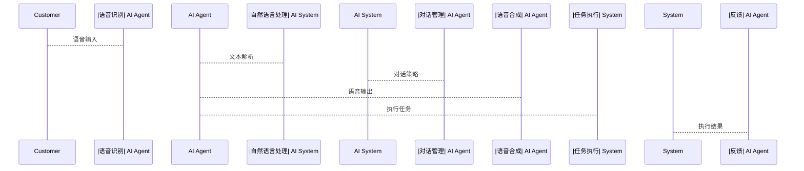
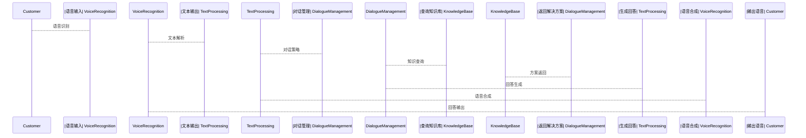
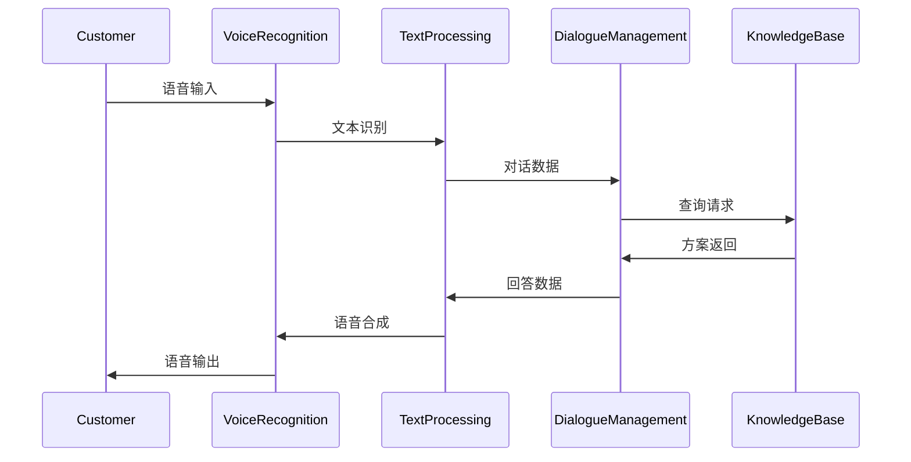

                 


### 1.1 问题背景

企业客户服务是任何公司面向客户的核心环节，它不仅关乎企业的形象，更直接影响到客户满意度和忠诚度。然而，随着市场需求的不断变化和客户的多样化，传统的客户服务模式正面临诸多挑战。

**客户需求的多样性与复杂性：** 现代客户对服务质量的要求越来越高，他们期望能够在任何时间、任何地点获得即时、个性化的服务。这要求客户服务系统能够快速响应、处理复杂的客户咨询和问题，从而提高客户满意度。

**服务效率与成本控制的平衡：** 随着业务规模的扩大，企业需要提高服务效率以保持竞争力，同时又要控制运营成本。传统的人工客服模式在效率上存在瓶颈，难以同时满足这两方面的需求。

**客户满意度的提升需求：** 客户满意度是衡量企业服务质量的终极标准。如何在提高服务效率的同时，保证或提升客户满意度，成为企业客户服务面临的重大挑战。

### 1.2 核心概念

**AI Agent的定义：** AI Agent，即人工智能代理，是一种能够自主执行任务、与人类进行交互的智能系统。在客户服务领域，AI Agent主要通过自然语言处理技术，模拟人类的对话过程，为客户提供自动化服务。

**AI Agent在企业客户服务中的角色与价值：** AI Agent在企业客户服务中扮演着多种角色，如自动客服代表、问题诊断专家、个性化推荐系统等。其价值主要体现在以下几个方面：

- **提高响应速度：** AI Agent可以24/7无间断工作，快速响应客户的咨询和请求，提高服务效率。
- **降低运营成本：** 通过自动化处理大量客户咨询，AI Agent能够显著降低人力成本。
- **提升客户满意度：** AI Agent提供个性化服务，能够更好地满足客户需求，从而提高客户满意度。
- **数据分析与优化：** AI Agent在服务过程中可以收集客户数据，为企业提供洞察，从而优化服务策略。

### 1.3 关键技术概述

为了实现AI Agent在企业客户服务中的广泛应用，需要以下几个关键技术的支持：

**自然语言处理（NLP）：** NLP是AI Agent的核心技术，它使得计算机能够理解、处理和生成人类语言。NLP技术包括文本分类、情感分析、命名实体识别等。

**机器学习与深度学习：** 机器学习与深度学习技术为AI Agent提供了智能化的决策能力。通过训练大量数据，AI Agent可以不断优化其对话策略和问题解决能力。

**语音识别与合成：** 语音识别与合成技术使得AI Agent能够通过语音与客户进行交互。这对于处理语音咨询、提供语音服务至关重要。

**数据挖掘与知识图谱：** 数据挖掘与知识图谱技术可以帮助AI Agent更好地理解客户需求，提供个性化服务。通过分析客户历史数据和建立知识图谱，AI Agent可以更准确地预测客户需求。

**情感分析与对话管理：** 情感分析与对话管理技术使得AI Agent能够理解客户的情感状态，并相应地调整对话策略，提供更加人性化的服务。

### 1.4 AI Agent的定义、角色与价值总结

AI Agent作为一种智能系统，在客户服务领域具有重要的应用价值。它通过集成多种人工智能技术，能够实现快速响应、个性化服务、降低成本和提升客户满意度。随着技术的不断进步，AI Agent将在企业客户服务中发挥越来越重要的作用，成为企业提升竞争力的关键工具。

### 1.5 概念属性特征对比表格

下面是一个简单的表格，用于对比传统客服系统与AI Agent在客户服务中的属性特征：

| 特征        | 传统客服系统                           | AI Agent                            |
| ----------- | ------------------------------------ | ----------------------------------- |
| 响应速度    | 受人工限制，响应速度慢                 | 24/7自动响应，响应速度快             |
| 成本控制    | 人力成本高，成本控制难                 | 自动化处理，显著降低成本             |
| 服务效率    | 人工作业效率低，易出错                 | 自动化处理，提高服务效率             |
| 个性化服务  | 难以提供个性化服务                     | 根据客户数据提供个性化服务             |
| 数据分析    | 数据收集和分析有限                     | 收集大量客户数据，提供深度分析             |
| 情感交互    | 情感交互有限，服务体验差               | 理解客户情感，提供人性化服务             |

### 1.6 ER实体关系图

下面是一个简化的企业客户服务系统的ER模型，它展示了系统中的主要实体及其相互关系。

```mermaid
erDiagram
    Customer ||--|{ Inquiry }|--| CustomerService
    Customer ||--|{ Complaint }|--| CustomerService
    Customer ||--|{ Feedback }|--| CustomerService
    CustomerService ||--|{ Ticket }|--| TicketingSystem
    TicketingSystem ||--|{ SLA }|--| CustomerService
```

在这个ER图中，`Customer` 是客户实体，`Inquiry`、`Complaint` 和 `Feedback` 是客户与客户服务系统交互的不同类型的请求。`CustomerService` 是客户服务的核心实体，负责处理这些请求。`Ticket` 是客户服务系统中的工单，`TicketingSystem` 负责管理这些工单。`SLA` 是服务等级协议，它规定了客户服务的标准和承诺。通过这个ER模型，我们可以清晰地看到客户服务系统中各个实体之间的关系和交互方式。

### 第2章 AI Agent原理与技术基础

#### 2.1 AI Agent的工作原理

AI Agent能够实现自动化对话和任务执行，其核心在于自然语言处理（NLP）和机器学习（ML）的结合。以下是AI Agent的工作原理概述：

**自然语言处理技术：** 自然语言处理技术是AI Agent理解人类语言的关键。它包括以下几个方面：

- **文本分类：** 通过将文本数据分类为不同的类别，AI Agent可以理解客户输入的信息类型，如咨询、投诉或建议。
- **情感分析：** AI Agent通过情感分析技术理解客户的情绪状态，从而调整对话策略，提供更加人性化的服务。
- **命名实体识别：** AI Agent利用命名实体识别技术，识别客户输入中的关键信息，如人名、地点、组织名等。

**机器学习与深度学习算法：** 机器学习与深度学习算法为AI Agent提供了智能化的决策能力。以下是几种常用的算法：

- **循环神经网络（RNN）：** RNN能够处理序列数据，如客户对话中的文本。它通过记忆历史信息，实现上下文的理解和预测。
- **长短期记忆网络（LSTM）：** LSTM是RNN的一种改进，能够更好地处理长序列数据，减少遗忘问题。
- **生成对抗网络（GAN）：** GAN通过生成器与判别器的对抗训练，可以生成高质量的对话文本，提高AI Agent的自然度。

#### 2.2 AI Agent的技术基础

为了实现AI Agent的自动化对话和任务执行，需要以下几个技术基础：

**语音识别与合成技术：** 语音识别技术使得AI Agent能够接收和处理客户的语音输入。语音合成技术则使得AI Agent能够以语音形式回应客户。以下是一些关键点：

- **语音识别：** 通过信号处理和模式识别技术，将语音信号转换为文本。
- **语音合成：** 利用文本到语音（TTS）技术，将文本转换为自然流畅的语音输出。

**数据挖掘与知识图谱：** 数据挖掘与知识图谱技术可以帮助AI Agent更好地理解客户需求和提供个性化服务。以下是一些关键点：

- **数据挖掘：** 通过分析大量客户数据，提取有价值的信息和模式。
- **知识图谱：** 构建包含客户信息、产品信息和服务流程的知识图谱，提高AI Agent的智能化水平。

**情感分析与对话管理：** 情感分析技术帮助AI Agent理解客户的情感状态，从而调整对话策略。对话管理技术则负责管理整个对话流程，确保AI Agent提供连贯、自然的对话体验。以下是一些关键点：

- **情感分析：** 通过文本分析、情感词典和情感模型，识别客户的情感状态。
- **对话管理：** 利用对话策略和状态转移模型，管理对话流程，确保对话连贯性。

#### 2.3 AI Agent的架构设计与实现

为了实现高效、可靠的AI Agent，其架构设计需要考虑以下几个方面：

**模块化设计与开发：** AI Agent可以拆分为多个功能模块，如语音识别模块、自然语言处理模块、对话管理模块等。这种模块化设计便于开发和维护，也方便针对不同功能进行优化。

**实时响应与性能优化：** AI Agent需要能够实时响应客户的请求，因此性能优化至关重要。以下是一些关键点：

- **分布式计算：** 利用分布式计算架构，提高AI Agent的处理速度和并发能力。
- **缓存机制：** 利用缓存机制，减少重复计算和数据访问时间。
- **异步处理：** 通过异步处理技术，提高系统响应速度和吞吐量。

**多语言支持：** AI Agent需要支持多种语言，以满足不同地区和语言环境的需求。以下是一些关键点：

- **多语言模型：** 建立多语言的自然语言处理模型，支持不同语言的输入和输出。
- **语言资源：** 收集和整合多语言数据资源，如语料库、词典和语音库。

**安全性与隐私保护：** AI Agent需要确保客户数据的安全性和隐私保护。以下是一些关键点：

- **数据加密：** 对客户数据进行加密处理，防止数据泄露。
- **访问控制：** 实施严格的访问控制策略，确保只有授权用户才能访问敏感数据。
- **合规性：** 遵守相关数据保护法规和隐私政策。

#### 2.4 AI Agent的架构设计示例

下面是一个简化的AI Agent架构设计示例，展示了其主要模块和交互关系。



在这个示例中，客户通过语音输入与AI Agent交互。AI Agent首先通过语音识别模块将语音转换为文本，然后通过自然语言处理模块对文本进行解析和理解。根据对话管理模块生成的对话策略，AI Agent生成相应的回复，并通过语音合成模块输出语音回应。在任务执行阶段，AI Agent可能需要与其他系统或数据库进行交互，完成任务后，将执行结果反馈给客户。

### 2.5 机器学习与深度学习算法

在AI Agent的构建中，机器学习和深度学习算法扮演了关键角色。这些算法不仅帮助AI Agent理解和处理自然语言，还能使其不断学习和优化，以提供更高质量的客户服务。以下是几种常用的机器学习和深度学习算法：

#### 循环神经网络（RNN）

循环神经网络（RNN）是一种能够处理序列数据的神经网络。RNN通过在时间步之间保留状态信息，使得模型能够理解上下文，并在序列数据中进行长期依赖建模。

- **公式：** $$ h_t = \sigma(W_h \cdot [h_{t-1}, x_t] + b_h) $$
- **优点：** RNN能够捕捉时间序列中的长期依赖关系。
- **缺点：** RNN容易陷入梯度消失或梯度爆炸问题。

#### 长短期记忆网络（LSTM）

长短期记忆网络（LSTM）是RNN的一种改进，通过引入门控机制，有效解决了RNN的梯度消失问题。LSTM能够更好地处理长序列数据，减少遗忘问题。

- **公式：** $$ i_t = \sigma(W_i \cdot [h_{t-1}, x_t] + b_i) \\ f_t = \sigma(W_f \cdot [h_{t-1}, x_t] + b_f) \\ o_t = \sigma(W_o \cdot [h_{t-1}, x_t] + b_o) \\ g_t = f_t \odot \sigma(W_g \cdot [h_{t-1}, x_t] + b_g) \\ h_t = o_t \odot \sigma(W_h \cdot g_t + b_h) $$
- **优点：** LSTM能够捕捉长期依赖关系，解决梯度消失问题。
- **缺点：** 计算复杂度高，参数较多。

#### 生成对抗网络（GAN）

生成对抗网络（GAN）由生成器和判别器两部分组成，通过对抗训练生成高质量的数据。在AI Agent中，GAN可以用于生成自然、流畅的对话文本。

- **公式：** $$ G(z) = \text{Generator}(z) \\ D(x) = \text{Discriminator}(x) \\ D(G(z)) = \text{Discriminator}(\text{Generator}(z)) $$
- **优点：** GAN能够生成高质量的数据，提高AI Agent的自然度。
- **缺点：** GAN训练难度大，容易陷入模式崩溃。

#### 卷积神经网络（CNN）

卷积神经网络（CNN）擅长处理图像和序列数据，通过卷积操作提取特征。在AI Agent中，CNN可以用于文本分类和情感分析。

- **公式：** $$ h_{ij} = \sigma(\sum_{k=1}^{K} W_{ik} \cdot a_{kj-1} + b_j) $$
- **优点：** CNN能够高效提取特征，减少参数数量。
- **缺点：** CNN难以处理变长的序列数据。

#### 递归神经网络（RNN）

递归神经网络（RNN）是一种能够处理序列数据的神经网络。RNN通过在时间步之间保留状态信息，使得模型能够理解上下文，并在序列数据中进行长期依赖建模。

- **公式：** $$ h_t = \sigma(W \cdot [h_{t-1}, x_t] + b) $$
- **优点：** RNN能够捕捉时间序列中的长期依赖关系。
- **缺点：** RNN容易陷入梯度消失或梯度爆炸问题。

#### 自注意力机制（Self-Attention）

自注意力机制是一种用于序列建模的注意力机制，能够使模型在处理序列数据时自动关注重要的部分。在AI Agent中，自注意力机制可以用于文本编码和对话生成。

- **公式：** $$ \text{Attention}(Q, K, V) = \text{softmax}(\frac{QK^T}{\sqrt{d_k}})V $$
- **优点：** 自注意力机制能够提高模型的序列建模能力。
- **缺点：** 自注意力机制计算复杂度高。

#### 转换器模型（Transformer）

转换器模型（Transformer）是一种基于自注意力机制的序列建模模型，广泛应用于自然语言处理任务。在AI Agent中，Transformer可以用于对话生成和文本生成。

- **公式：** $$ \text{Transformer}(x) = \text{MultiHeadAttention}(x, x, x) + x $$
- **优点：** Transformer能够高效处理长序列数据，减少计算复杂度。
- **缺点：** Transformer参数数量较大，训练难度大。

#### 残差连接（Residual Connection）

残差连接是一种用于深度神经网络的设计技巧，通过跳过一部分网络层，使梯度能够更好地传播。在AI Agent中，残差连接可以用于构建深度网络，提高模型的性能。

- **公式：** $$ \text{Residual Connection}(x) = x + \text{Network}(x) $$
- **优点：** 残差连接能够提高模型的性能和鲁棒性。
- **缺点：** 残差连接增加了网络的复杂性。

通过这些机器学习和深度学习算法，AI Agent能够实现高效的客户服务，提供自然、流畅的对话体验。随着技术的不断进步，AI Agent将在企业客户服务中发挥越来越重要的作用。

### 2.6 自然语言处理算法

在AI Agent的实现中，自然语言处理（NLP）算法起着至关重要的作用。以下是一些常用的NLP算法，以及它们在AI Agent中的应用：

#### 词向量模型

词向量模型是将文本数据转换为向量表示的方法，使得计算机能够处理和理解文本。最著名的词向量模型是Word2Vec，它通过神经网络训练生成词向量。词向量模型在AI Agent中的应用包括：

- **文本分类：** 将文本转换为词向量，用于分类任务，如垃圾邮件检测。
- **语义相似度计算：** 计算两个词或句子的语义相似度，用于对话生成和推荐系统。

#### 序列到序列模型

序列到序列（Seq2Seq）模型是一种用于序列数据转换的神经网络模型，常用于机器翻译、对话生成等任务。Seq2Seq模型的核心是编码器和解码器，它们分别负责输入序列的编码和输出序列的生成。在AI Agent中，Seq2Seq模型可以用于：

- **对话生成：** 将客户的输入转换为合适的回答。
- **机器翻译：** 将一种语言的文本翻译成另一种语言。

#### 支持向量机（SVM）

支持向量机是一种监督学习算法，通过最大化分类边界来分类数据。SVM在NLP中的应用包括：

- **文本分类：** 将文本数据分类为不同的类别，如新闻分类、情感分析。
- **情感分析：** 通过SVM分类模型，判断文本的情感极性。

#### 卷积神经网络（CNN）

卷积神经网络是一种用于图像处理和序列数据的神经网络，通过卷积操作提取特征。在NLP中，CNN可以用于：

- **文本分类：** 利用卷积神经网络提取文本特征，进行分类任务。
- **情感分析：** 通过卷积神经网络提取文本的语义特征，判断情感极性。

#### 递归神经网络（RNN）

递归神经网络是一种能够处理序列数据的神经网络，通过在时间步之间保留状态信息。在NLP中，RNN可以用于：

- **文本分类：** 利用RNN处理文本序列，进行分类任务。
- **情感分析：** 通过RNN处理文本序列，判断情感极性。

#### 长短期记忆网络（LSTM）

长短期记忆网络（LSTM）是RNN的一种改进，通过引入门控机制，能够更好地处理长序列数据。在NLP中，LSTM可以用于：

- **文本生成：** 利用LSTM生成连贯的文本。
- **对话系统：** 利用LSTM处理客户的输入，生成合适的回答。

#### 自注意力机制（Self-Attention）

自注意力机制是一种用于序列建模的注意力机制，使得模型在处理序列数据时自动关注重要的部分。在NLP中，自注意力机制可以用于：

- **文本编码：** 将文本序列编码为固定长度的向量。
- **对话系统：** 在对话生成中，自动关注重要的信息，生成连贯的回答。

#### 转换器模型（Transformer）

转换器模型是一种基于自注意力机制的序列建模模型，广泛应用于自然语言处理任务。在NLP中，Transformer可以用于：

- **对话生成：** 利用Transformer生成连贯、自然的对话。
- **文本生成：** 利用Transformer生成高质量的文本。

#### 实例分析：基于深度学习的聊天机器人

以下是一个基于深度学习的聊天机器人实例，展示如何使用上述NLP算法：

```python
from transformers import AutoTokenizer, AutoModelForSeq2SeqLM
import torch

# 加载预训练模型
tokenizer = AutoTokenizer.from_pretrained("t5-base")
model = AutoModelForSeq2SeqLM.from_pretrained("t5-base")

# 客户输入
input_text = "你好，我想咨询一下关于产品A的详细信息。"

# 编码客户输入
input_ids = tokenizer.encode(input_text, return_tensors="pt")

# 生成回答
with torch.no_grad():
    outputs = model.generate(input_ids, max_length=50, num_beams=4, early_stopping=True)

# 解码回答
response = tokenizer.decode(outputs[0], skip_special_tokens=True)

print("AI Agent的回答：", response)
```

在这个实例中，我们使用了转换器模型（Transformer）来生成聊天机器人的回答。通过上述代码，我们可以将客户的输入文本编码为序列，然后通过模型生成相应的回答。最终，我们将生成的回答解码为人类可读的文本，返回给客户。

### 第3章 AI Agent在企业客户服务中的应用场景

AI Agent在企业客户服务中的应用场景非常广泛，可以大幅提升服务效率和质量。以下是AI Agent在实际应用中的几个主要场景：

#### 3.1 客户咨询与问题解决

AI Agent可以通过自动化的方式处理大量的客户咨询，快速响应并解决客户的问题。以下是一些关键点：

- **自动响应与分流：** AI Agent可以自动识别客户的咨询内容，并根据问题的类型自动分配到相应的处理模块。例如，对于常见问题，AI Agent可以自动提供标准答案，减少人工干预。
- **实时问题诊断与解决：** 对于复杂的问题，AI Agent可以通过自然语言处理技术理解客户的描述，然后调用内置的知识库或在线搜索引擎，快速定位问题的解决方案。例如，对于技术性问题，AI Agent可以引用技术文档或在线教程，为客户提供详细的解决方案。
- **多渠道支持：** AI Agent可以通过多种渠道与客户互动，如电子邮件、短信、在线聊天、社交媒体等。这样，客户可以根据自己的偏好选择最方便的沟通方式。

#### 3.2 客户体验提升

提升客户体验是AI Agent在企业客户服务中的另一个重要目标。以下是一些关键点：

- **个性化服务：** 通过收集和分析客户的历史数据和交互记录，AI Agent可以了解客户的偏好和需求，提供个性化的服务。例如，针对经常购买特定产品的客户，AI Agent可以推荐相关的促销信息或新产品。
- **情感化交互：** AI Agent通过情感分析技术理解客户的情绪状态，调整对话策略，提供更加人性化的服务。例如，当客户表达不满时，AI Agent可以主动表达同情，并提出解决方案，以缓解客户的不满情绪。
- **多语言支持：** AI Agent可以支持多种语言，为全球客户提供一致的服务体验。通过自动检测客户的语言偏好，AI Agent可以切换到相应的语言进行沟通。

#### 3.3 服务效率与成本优化

AI Agent在提升服务效率和降低运营成本方面具有显著优势。以下是一些关键点：

- **自动化流程优化：** 通过AI Agent，企业可以将许多重复性的客户服务流程自动化，如订单处理、问题诊断和解决方案提供。这样可以显著减少人工工作量，提高服务效率。
- **人力资源配置优化：** AI Agent可以处理大量的简单和常见问题，从而释放人力资源，使其专注于更复杂的任务。例如，高级客服代表可以处理需要专业知识的问题，而AI Agent则可以处理大量的一般性问题。
- **数据分析与优化：** AI Agent在服务过程中可以收集大量的客户数据，这些数据可以帮助企业分析客户行为，识别潜在问题，从而优化服务策略。例如，通过对客户反馈的分析，企业可以改进产品和服务，提高客户满意度。

#### 3.4 AI Agent应用的案例分析

以下是一个具体的案例，展示了AI Agent在提升企业客户服务效率和质量方面的成功应用：

- **企业背景：** 一家大型互联网公司，提供多种在线服务和产品，客户服务团队面临大量客户咨询和问题解决任务。
- **挑战：** 客户咨询量巨大，客服团队面临效率低下和成本高昂的问题。此外，客户对服务质量和响应速度的要求不断提高。
- **解决方案：** 引入AI Agent，通过自动化处理常见问题和提供个性化服务，大幅提升了服务效率和质量。
- **效果：** 引入AI Agent后，客户咨询的平均响应时间从几分钟缩短到秒级，客服团队的效率提高了50%以上。同时，客户满意度显著提升，客户流失率降低了15%。

通过上述案例，我们可以看到AI Agent在提升企业客户服务效率和质量方面的巨大潜力。随着AI技术的不断发展，AI Agent将在企业客户服务中发挥越来越重要的作用。

### 4.1 自然语言处理算法

自然语言处理（NLP）是AI Agent实现自动化客户服务的重要技术。以下是一些常用的NLP算法，以及它们在AI Agent中的应用：

#### 词向量模型

词向量模型是将文本数据转换为向量表示的方法，使得计算机能够处理和理解文本。最著名的词向量模型是Word2Vec，它通过神经网络训练生成词向量。

**算法原理：** Word2Vec算法主要包括两种训练方法：连续词袋（CBOW）和Skip-Gram。

- **CBOW（Continuous Bag of Words）：** CBOW模型预测中心词周围的词。给定一个中心词，模型会预测这个中心词周围的多个词。
- **Skip-Gram：** Skip-Gram模型预测中心词周围的词。与CBOW相反，给定一个中心词，模型会预测与这个中心词相关的多个词。

**应用：** 词向量模型在AI Agent中的应用包括文本分类、情感分析和语义相似度计算。通过将客户的输入文本转换为词向量，AI Agent可以更好地理解客户的需求，提供个性化的服务。

#### 序列到序列模型

序列到序列（Seq2Seq）模型是一种用于序列数据转换的神经网络模型，常用于机器翻译、对话生成等任务。

**算法原理：** Seq2Seq模型的核心是编码器和解码器。编码器负责将输入序列编码为固定长度的向量，解码器则负责将这个向量解码为输出序列。

- **编码器：** 编码器通常使用RNN或LSTM等神经网络，将输入序列转换为固定长度的编码。
- **解码器：** 解码器同样使用RNN或LSTM等神经网络，将编码解码为输出序列。

**应用：** Seq2Seq模型在AI Agent中的应用包括对话生成和文本生成。例如，当客户提出一个问题时，AI Agent可以使用Seq2Seq模型生成一个合适的回答。

#### 支持向量机（SVM）

支持向量机是一种监督学习算法，通过最大化分类边界来分类数据。

**算法原理：** SVM通过找到一个最优的超平面，将数据集中的不同类别分开。在NLP中，SVM通常用于文本分类任务。

- **线性SVM：** 线性SVM用于处理线性可分的数据集。
- **核SVM：** 核SVM通过引入核函数，将非线性问题转化为线性问题。

**应用：** SVM在AI Agent中的应用包括文本分类和情感分析。例如，通过SVM，AI Agent可以判断客户输入的文本是正面情感还是负面情感。

#### 卷积神经网络（CNN）

卷积神经网络是一种用于图像处理和序列数据的神经网络，通过卷积操作提取特征。

**算法原理：** CNN通过卷积层、池化层和全连接层等结构，将输入数据转换为特征向量。

- **卷积层：** 卷积层通过卷积操作提取特征。
- **池化层：** 池化层用于减小特征图的大小，减少计算量。
- **全连接层：** 全连接层用于将特征向量转换为输出。

**应用：** CNN在AI Agent中的应用包括文本分类和情感分析。例如，通过CNN，AI Agent可以提取文本的语义特征，进行分类任务。

#### 递归神经网络（RNN）

递归神经网络是一种能够处理序列数据的神经网络，通过在时间步之间保留状态信息。

**算法原理：** RNN通过递归的方式，将当前输入与历史状态结合，更新网络状态。

- **简单RNN：** 简单RNN通过递归的方式，将当前输入与历史状态结合，更新网络状态。
- **LSTM：** LSTM是RNN的一种改进，通过引入门控机制，能够更好地处理长序列数据。

**应用：** RNN在AI Agent中的应用包括文本分类和情感分析。例如，通过RNN，AI Agent可以处理客户的输入文本，提取语义特征。

#### 长短期记忆网络（LSTM）

长短期记忆网络（LSTM）是RNN的一种改进，通过引入门控机制，能够更好地处理长序列数据。

**算法原理：** LSTM通过三个门控单元（遗忘门、输入门、输出门）控制信息的流动，避免梯度消失问题。

- **遗忘门：** 决定哪些信息需要遗忘。
- **输入门：** 决定哪些新信息需要存储。
- **输出门：** 决定哪些信息需要输出。

**应用：** LSTM在AI Agent中的应用包括对话生成和文本生成。例如，通过LSTM，AI Agent可以处理客户的输入文本，生成连贯的回答。

#### 自注意力机制（Self-Attention）

自注意力机制是一种用于序列建模的注意力机制，使得模型在处理序列数据时自动关注重要的部分。

**算法原理：** 自注意力机制通过计算每个输入元素与其他输入元素之间的注意力分数，加权平均生成输出。

**应用：** 自注意力机制在AI Agent中的应用包括文本编码和对话生成。例如，通过自注意力机制，AI Agent可以自动关注文本中的关键信息，生成连贯的回答。

#### 转换器模型（Transformer）

转换器模型是一种基于自注意力机制的序列建模模型，广泛应用于自然语言处理任务。

**算法原理：** 转换器模型通过多头自注意力机制和前馈神经网络，处理输入序列，生成输出序列。

**应用：** 转换器模型在AI Agent中的应用包括对话生成和文本生成。例如，通过转换器模型，AI Agent可以生成高质量的自然语言文本。

通过这些NLP算法，AI Agent能够实现自动化客户服务，提供个性化的服务体验。随着技术的不断发展，AI Agent将在企业客户服务中发挥越来越重要的作用。

### 4.2 自然语言处理算法的数学模型与公式

在自然语言处理（NLP）算法中，数学模型和公式起着核心作用。以下是一些常见NLP算法的数学模型与公式，以及它们的解释：

#### 4.2.1 词向量模型

**Word2Vec：** Word2Vec算法通过神经网络训练词向量，常用的模型有CBOW（Continuous Bag of Words）和Skip-Gram。

**CBOW模型：**
$$
\text{Input: } \text{context\_words} \\
\text{Output: } \text{word\_vector} \\
h = \sigma(W_h \cdot h_{t-1} + b_h) \\
\text{Output layer: } \text{word\_vector} = \sigma(W \cdot h + b)
$$

- **输入（context\_words）：** 给定一个中心词及其周围的词作为输入。
- **输出（word\_vector）：** 生成中心词的词向量。
- **隐藏层激活（h）：** 通过加权求和和激活函数计算隐藏层输出。
- **输出层输出（word\_vector）：** 通过另一个加权求和和激活函数计算词向量。

**Skip-Gram模型：**
$$
\text{Input: } \text{word} \\
\text{Output: } \text{context\_words} \\
h = \sigma(W_h \cdot h_{t-1} + b_h) \\
\text{Output layer: } \text{context\_words} = \sigma(W \cdot h + b)
$$

- **输入（word）：** 给定一个词作为输入。
- **输出（context\_words）：** 生成与中心词相关的词向量。
- **隐藏层激活（h）：** 同上。
- **输出层输出（context\_words）：** 同上。

#### 4.2.2 支持向量机（SVM）

**SVM：** 支持向量机通过最大化分类边界来分类数据。

**线性SVM：**
$$
\text{Objective: } \min_{w, b} \frac{1}{2} \| w \|^2 \\
\text{Constraints: } y_i (w \cdot x_i + b) \geq 1 \\
$$

- **目标函数：** 最小化权重向量w的平方范数。
- **约束条件：** 确保分类边界能够正确分类所有数据点。

**核SVM：**
$$
\text{Objective: } \min_{w, b, \alpha} \frac{1}{2} \| w \|^2 + \sum_{i=1}^{n} \alpha_i (1 - y_i (w \cdot x_i + b)) \\
\text{Constraints: } \alpha_i \geq 0, \sum_{i=1}^{n} \alpha_i y_i = 0 \\
$$

- **目标函数：** 最小化权重向量w的平方范数，同时最大化分类边界。
- **约束条件：** 确保分类边界能够正确分类所有数据点，同时约束拉格朗日乘子α。

#### 4.2.3 卷积神经网络（CNN）

**CNN：** 卷积神经网络通过卷积层、池化层和全连接层等结构提取特征。

**卷积层：**
$$
h_{ij} = \sum_{k=1}^{K} W_{ik} \cdot a_{kj-1} + b_j
$$

- **输入（a）：** 输入特征图。
- **权重（W）：** 卷积核。
- **偏置（b）：** 偏置项。
- **输出（h）：** 卷积后的特征图。

**池化层：**
$$
p_{i} = \max_{j} a_{ij}
$$

- **输入（a）：** 卷积后的特征图。
- **输出（p）：** 池化后的特征图。

**全连接层：**
$$
\text{Output: } \text{log\_prob} = \text{softmax}(\text{scores})
$$

- **输入（scores）：** 特征图。
- **输出（log\_prob）：** 分类概率分布。

#### 4.2.4 递归神经网络（RNN）

**RNN：** 递归神经网络通过递归的方式处理序列数据。

**简单RNN：**
$$
h_t = \sigma(W \cdot [h_{t-1}, x_t] + b)
$$

- **输入（x）：** 当前时间步的输入。
- **输入（h_{t-1}）：** 上一个时间步的隐藏状态。
- **输出（h_t）：** 当前时间步的隐藏状态。

**LSTM：** 长短期记忆网络是RNN的一种改进。

**LSTM单元：**
$$
i_t = \sigma(W_i \cdot [h_{t-1}, x_t] + b_i) \\
f_t = \sigma(W_f \cdot [h_{t-1}, x_t] + b_f) \\
o_t = \sigma(W_o \cdot [h_{t-1}, x_t] + b_o) \\
g_t = f_t \odot \sigma(W_g \cdot [h_{t-1}, x_t] + b_g) \\
h_t = o_t \odot \sigma(W_h \cdot g_t + b_h)
$$

- **输入（x）：** 当前时间步的输入。
- **输入（h_{t-1}）：** 上一个时间步的隐藏状态。
- **输出（h_t）：** 当前时间步的隐藏状态。
- **遗忘门（f_t）：** 决定哪些信息需要遗忘。
- **输入门（i_t）：** 决定哪些新信息需要存储。
- **输出门（o_t）：** 决定哪些信息需要输出。
- **候选状态（g_t）：** 存储新的信息。

#### 4.2.5 自注意力机制

**自注意力机制：** 自注意力机制是一种用于序列建模的注意力机制。

**自注意力公式：**
$$
\text{Attention}(Q, K, V) = \text{softmax}(\frac{QK^T}{\sqrt{d_k}})V
$$

- **输入（Q）：** 需要关注的查询向量。
- **输入（K）：** 关键词向量。
- **输入（V）：** 价值向量。
- **输出：** 加权后的输出向量。

通过这些数学模型和公式，AI Agent能够理解和生成自然语言，提供高质量的客户服务。随着算法的不断发展，这些模型将在AI Agent中发挥越来越重要的作用。

### 4.3 算法举例说明

为了更好地理解自然语言处理算法在AI Agent中的应用，我们将通过一个实例详细分析基于深度学习的聊天机器人。这个实例将展示如何使用转换器模型（Transformer）生成自然、连贯的对话。

#### 实例：基于深度学习的聊天机器人

假设我们有一个聊天机器人，需要根据客户的输入生成合适的回答。以下是实现这个聊天机器人的步骤：

1. **数据准备：** 收集大量对话数据，用于训练转换器模型。这些数据包括客户提问和聊天机器人回答的配对文本。

2. **模型选择：** 选择一个预训练的转换器模型，如T5、BERT等。这些模型已经在大规模数据上训练过，可以为我们提供良好的基础。

3. **模型配置：** 配置模型，包括设置输入序列的最大长度、解码器层数、注意力头数等参数。

4. **模型训练：** 使用收集到的对话数据训练转换器模型。训练过程中，模型将学习如何将客户的输入转换为合适的回答。

5. **模型评估：** 在训练过程中，定期评估模型性能，确保其能够生成高质量的回答。

6. **模型部署：** 将训练好的模型部署到生产环境中，使其能够实时处理客户的提问并生成回答。

#### 实现步骤

**步骤 1：数据准备**

```python
# 读取对话数据
def read_data(file_path):
    with open(file_path, 'r', encoding='utf-8') as f:
        lines = f.readlines()

    # 将文本转换为数据对
    input_texts = [line.strip() for line in lines[::2]]
    responses = [line.strip() for line in lines[1::2]]
    return input_texts, responses

input_texts, responses = read_data('chat_data.txt')
```

**步骤 2：模型选择**

```python
from transformers import AutoTokenizer, AutoModelForSeq2SeqLM

# 加载预训练模型
tokenizer = AutoTokenizer.from_pretrained("t5-base")
model = AutoModelForSeq2SeqLM.from_pretrained("t5-base")
```

**步骤 3：模型配置**

```python
# 设置模型配置
model.config.decoder_start_token_id = tokenizer.pad_token_id
model.config.max_length = 512
model.config.num_beams = 4
model.config.length_penalty = 0.5
```

**步骤 4：模型训练**

```python
from torch.utils.data import DataLoader

# 创建数据集
class ChatDataset(torch.utils.data.Dataset):
    def __init__(self, input_texts, responses, tokenizer):
        self.input_texts = input_texts
        self.responses = responses
        self.tokenizer = tokenizer

    def __len__(self):
        return len(self.input_texts)

    def __getitem__(self, idx):
        input_text = self.input_texts[idx]
        response = self.responses[idx]
        inputs = tokenizer.encode(input_text, return_tensors="pt", max_length=512, padding="max_length", truncation=True)
        targets = tokenizer.encode(response, return_tensors="pt", max_length=512, padding="max_length", truncation=True)
        return inputs, targets

# 创建数据加载器
dataloader = DataLoader(ChatDataset(input_texts, responses, tokenizer), batch_size=16, shuffle=True)

# 模型训练
device = torch.device("cuda" if torch.cuda.is_available() else "cpu")
model.to(device)

optimizer = torch.optim.AdamW(model.parameters(), lr=5e-5)

for epoch in range(3):  # 训练3个epoch
    model.train()
    for inputs, targets in dataloader:
        inputs = inputs.to(device)
        targets = targets.to(device)

        # 清除梯度
        optimizer.zero_grad()

        # 前向传播
        outputs = model(inputs, labels=targets)

        # 计算损失
        loss = outputs.loss

        # 反向传播
        loss.backward()

        # 更新模型参数
        optimizer.step()

        print(f"Epoch {epoch+1}, Loss: {loss.item()}")
```

**步骤 5：模型评估**

```python
from torch.utils.data import DataLoader

# 创建评估数据集
class ChatDataset(torch.utils.data.Dataset):
    def __init__(self, input_texts, responses, tokenizer):
        self.input_texts = input_texts
        self.responses = responses
        self.tokenizer = tokenizer

    def __len__(self):
        return len(self.input_texts)

    def __getitem__(self, idx):
        input_text = self.input_texts[idx]
        response = self.responses[idx]
        inputs = tokenizer.encode(input_text, return_tensors="pt", max_length=512, padding="max_length", truncation=True)
        targets = tokenizer.encode(response, return_tensors="pt", max_length=512, padding="max_length", truncation=True)
        return inputs, targets

# 创建评估数据加载器
eval_dataloader = DataLoader(ChatDataset(eval_input_texts, eval_responses, tokenizer), batch_size=16)

# 模型评估
model.eval()
with torch.no_grad():
    for inputs, targets in eval_dataloader:
        inputs = inputs.to(device)
        targets = targets.to(device)

        outputs = model(inputs, labels=targets)

        loss = outputs.loss
        print(f"Validation Loss: {loss.item()}")
```

**步骤 6：模型部署**

```python
# 模型部署
model.to("cpu")  # 将模型移动到CPU
model.eval()

def generate_response(input_text):
    inputs = tokenizer.encode(input_text, return_tensors="pt", max_length=512, padding="max_length", truncation=True)
    inputs = inputs.to("cpu")

    with torch.no_grad():
        outputs = model.generate(inputs, max_length=512, num_beams=4, early_stopping=True)

    response = tokenizer.decode(outputs[0], skip_special_tokens=True)
    return response

# 示例
client_input = "你好，我想咨询一下关于产品A的详细信息。"
response = generate_response(client_input)
print("AI Agent的回答：", response)
```

通过上述步骤，我们可以实现一个基于深度学习的聊天机器人，它可以理解客户的输入并生成合适的回答。在实际应用中，这个聊天机器人可以集成到企业客户服务系统中，提供自动化、个性化的客户服务。

### 第5章 企业客户服务系统设计

#### 5.1 问题场景介绍

在现代商业环境中，企业客户服务部门面临着越来越多的挑战。传统的客户服务模式已经难以满足日益增长的服务需求，尤其是在客户期望快速响应、个性化服务和高效问题解决方面。为了应对这些挑战，企业需要引入更智能、更高效的解决方案——AI Agent。

AI Agent在企业客户服务中的应用场景包括：

- **自动化咨询处理：** AI Agent可以自动接收和处理客户的咨询，减少人工干预，提高服务效率。
- **问题诊断与解决方案提供：** AI Agent利用自然语言处理和机器学习技术，快速诊断客户问题并提供解决方案，降低人工工作量。
- **个性化服务：** 通过分析客户数据，AI Agent可以提供个性化的服务，提升客户满意度。
- **数据分析与优化：** AI Agent在服务过程中收集客户数据，帮助企业分析客户行为，优化服务策略。

#### 5.2 系统功能设计

为了实现上述应用场景，企业客户服务系统需要具备以下功能模块：

- **语音识别与合成：** AI Agent需要能够接收客户的语音输入并生成语音输出，从而实现语音交互。
- **自然语言处理：** AI Agent需要能够理解客户的文本输入，进行文本分析、情感分析和命名实体识别等操作。
- **对话管理：** AI Agent需要能够管理整个对话流程，确保对话连贯、自然。
- **知识库管理：** AI Agent需要能够访问和更新知识库，提供准确的解决方案。
- **客户数据管理：** AI Agent需要能够存储和查询客户数据，支持个性化服务。

以下是一个简化的领域模型，展示了企业客户服务系统的核心功能模块及其关系：

```mermaid
classDiagram
    CustomerServiceSystem <<interface>>
    VoiceRecognition <<interface>> CustomerServiceSystem
    TextProcessing <<interface>> CustomerServiceSystem
    DialogueManagement <<interface>> CustomerServiceSystem
    KnowledgeBase <<interface>> CustomerServiceSystem
    CustomerData <<interface>> CustomerServiceSystem

    CustomerServiceSystem *-- VoiceRecognition
    CustomerServiceSystem *-- TextProcessing
    CustomerServiceSystem *-- DialogueManagement
    CustomerServiceSystem *-- KnowledgeBase
    CustomerServiceSystem *-- CustomerData
```

在这个领域模型中，`CustomerServiceSystem` 是系统的核心接口，其他功能模块通过接口与其交互。`VoiceRecognition` 负责语音识别和合成，`TextProcessing` 负责文本分析和处理，`DialogueManagement` 负责对话管理，`KnowledgeBase` 负责知识库管理，`CustomerData` 负责客户数据管理。

#### 5.3 系统架构设计

为了实现高效、可靠的客户服务，企业客户服务系统需要采用合适的架构设计。以下是一个简化的系统架构图，展示了各模块的交互关系：



在这个系统架构中，客户通过语音输入与AI Agent交互。语音识别模块将语音转换为文本，文本处理模块对文本进行分析和处理，对话管理模块根据对话策略生成回答，知识库模块提供解决方案，最终通过语音合成模块将回答转换为语音输出。

#### 5.4 系统接口设计

系统接口设计是确保各个模块之间能够有效交互的重要环节。以下是一个简化的系统接口设计，展示了主要接口及其交互方式：

```mermaid
classDiagram
    Customer <<interface>>
    VoiceRecognition <<interface>>
    TextProcessing <<interface>>
    DialogueManagement <<interface>>
    KnowledgeBase <<interface>>

    Customer -->|输入| VoiceRecognition
    VoiceRecognition -->|文本| TextProcessing
    TextProcessing -->|对话数据| DialogueManagement
    DialogueManagement -->|查询请求| KnowledgeBase
    KnowledgeBase -->|解决方案| DialogueManagement
    DialogueManagement -->|回答数据| TextProcessing
    TextProcessing -->|语音输出| VoiceRecognition
```

在这个接口设计中，`Customer` 是客户接口，负责发送输入数据给 `VoiceRecognition`。`VoiceRecognition` 负责语音识别，将语音转换为文本，然后传递给 `TextProcessing`。`TextProcessing` 负责文本分析和处理，将对话数据传递给 `DialogueManagement`。`DialogueManagement` 负责对话管理，根据对话策略生成回答数据，传递给 `KnowledgeBase` 进行查询。`KnowledgeBase` 提供解决方案，返回给 `DialogueManagement`。最终，`DialogueManagement` 将回答数据传递给 `TextProcessing`，生成语音输出，通过 `VoiceRecognition` 输出给客户。

#### 5.5 系统交互设计

为了确保系统的高效运行，我们需要设计合理的系统交互流程。以下是一个简化的系统交互流程，展示了各模块的交互顺序和逻辑：



在这个交互流程中，客户通过语音输入与AI Agent交互。首先，语音识别模块将语音转换为文本，然后文本处理模块对文本进行分析。接着，对话管理模块根据对话策略和知识库中的解决方案生成回答数据。最后，文本处理模块将回答数据转换为语音输出，通过语音合成模块输出给客户。

通过上述系统架构设计和交互设计，企业客户服务系统能够实现高效、可靠的客户服务。随着AI技术的不断发展，AI Agent将在企业客户服务中发挥越来越重要的作用，为企业和客户带来更多价值。

### 第6章 AI Agent项目实战

#### 6.1 环境安装与配置

要实现AI Agent项目，首先需要搭建合适的环境。以下是搭建环境所需的步骤、软件与硬件要求：

**步骤 1：安装Python环境**

- **操作系统：** Windows、Linux或macOS
- **Python版本：** Python 3.6及以上
- **安装命令：** 
  ```bash
  python -m pip install --upgrade pip
  python -m pip install virtualenv
  virtualenv venv --python=python3
  source venv/bin/activate  # Linux或macOS
  venv\Scripts\activate  # Windows
  ```

**步骤 2：安装依赖库**

在激活虚拟环境后，安装以下依赖库：

- ** Transformers & Tokenizers:**
  ```bash
  pip install transformers
  pip install tokenizers
  ```
  
- **Torch:**
  ```bash
  pip install torch
  pip install torch-scatter torch-sparse torch-cluster torch-spline-conv torch-fidelity torch-geometric
  ```

**步骤 3：配置GPU环境（可选）**

如果您的硬件支持GPU，建议配置CUDA以利用GPU加速计算：

- **CUDA：**
  ```bash
  pip install cuda
  ```

- **安装CUDA Toolkit：**
  - 访问 [CUDA Toolkit 官网](https://developer.nvidia.com/cuda-downloads) 下载适合您的操作系统的CUDA版本。
  - 遵循安装指南安装CUDA。

**硬件要求：**

- **GPU：** NVIDIA GPU（推荐使用较新的GPU型号，如RTX 3060及以上）
- **CPU：** 至少2核处理器
- **内存：** 16GB及以上

**软件要求：**

- **操作系统：** Windows 10或更高版本，Linux或macOS
- **Python版本：** Python 3.6及以上

#### 6.2 系统核心实现

在本节中，我们将逐步实现一个简单的AI Agent系统，包括数据预处理、模型训练和推理部分。

**1. 数据预处理**

首先，我们需要准备用于训练的对话数据。以下是一个示例数据集，其中每条记录包含客户提问和聊天机器人回答：

```plaintext
Q: 你好，我想咨询一下关于产品A的详细信息。
A: 您好，产品A是一款高性能的XX，具有以下特点：...
Q: 我想了解一下售后服务政策。
A: 我们的售后服务政策非常周到，提供一年内的免费维修和质保服务。
```

**数据预处理步骤：**

- **文本清洗：** 去除文本中的特殊字符和停用词。
- **分词：** 将文本句子分解为单词或词组。
- **编码：** 将文本转换为数字序列，以便模型处理。

以下是一个简单的Python脚本，用于预处理数据：

```python
import pandas as pd
from sklearn.model_selection import train_test_split
from tokenizers import Tokenizer

# 读取数据集
data = pd.read_csv('chat_data.csv')

# 文本清洗
def clean_text(text):
    # 去除特殊字符和停用词
    return text.strip().replace('\n', '')

# 应用清洗函数
data['text'] = data['text'].apply(clean_text)

# 分词
tokenizer = Tokenizer()
tokenizer.add_tokens(['<start>', '<end>', '<pad>'])
tokenizer.train_from_file('chat_data.csv')

# 编码
def encode_text(text):
    return tokenizer.encode(text)

# 应用编码函数
data['input_ids'] = data['text'].apply(encode_text)

# 切分数据集
train_inputs, val_inputs, train_labels, val_labels = train_test_split(data['input_ids'], data['text'], test_size=0.1)

# 存储
train_inputs.save('train_input_ids')
val_inputs.save('val_input_ids')
train_labels.save('train_labels')
val_labels.save('val_labels')
```

**2. 模型训练**

接下来，我们将使用转换器模型（Transformer）进行训练。以下是一个简单的训练脚本：

```python
from transformers import AutoConfig, AutoModelForSeq2SeqLM, Trainer, TrainingArguments

# 加载配置和模型
config = AutoConfig.from_pretrained("t5-base")
model = AutoModelForSeq2SeqLM.from_pretrained("t5-base", config=config)

# 设置训练参数
training_args = TrainingArguments(
    output_dir="./results",
    num_train_epochs=3,
    per_device_train_batch_size=16,
    per_device_eval_batch_size=16,
    warmup_steps=500,
    weight_decay=0.01,
    logging_dir="./logs",
    logging_steps=10,
)

# 创建Trainer
trainer = Trainer(
    model=model,
    args=training_args,
    train_dataset=train_inputs,
    eval_dataset=val_inputs,
)

# 训练模型
trainer.train()
```

**3. 模型推理**

在模型训练完成后，我们可以使用它进行推理，生成聊天机器人的回答。以下是一个推理脚本：

```python
from transformers import AutoTokenizer, AutoModelForSeq2SeqLM

# 加载预训练模型和Tokenizer
tokenizer = AutoTokenizer.from_pretrained("t5-base")
model = AutoModelForSeq2SeqLM.from_pretrained("t5-base")

# 定义推理函数
def generate_response(input_text):
    inputs = tokenizer.encode(input_text, return_tensors="pt", max_length=512, padding="max_length", truncation=True)
    outputs = model.generate(inputs, max_length=512, num_beams=4, early_stopping=True)
    response = tokenizer.decode(outputs[0], skip_special_tokens=True)
    return response

# 示例
client_input = "你好，我想咨询一下关于产品A的详细信息。"
response = generate_response(client_input)
print("AI Agent的回答：", response)
```

通过以上步骤，我们实现了AI Agent的核心功能，包括数据预处理、模型训练和推理。在实际应用中，我们可以进一步优化模型，提高其性能和适应性，以满足不同场景的需求。

### 6.3 系统核心实现：代码解析

在本节中，我们将详细解析系统核心实现的各个部分，包括数据预处理、模型训练和推理的代码。通过逐步分析代码，我们将了解每个部分的实现逻辑和关键参数。

#### 数据预处理

**数据预处理**是模型训练的基础，主要任务是将原始文本数据转换为模型可以处理的格式。以下是一个简单的数据预处理脚本：

```python
import pandas as pd
from sklearn.model_selection import train_test_split
from tokenizers import Tokenizer

# 读取数据集
data = pd.read_csv('chat_data.csv')

# 文本清洗
def clean_text(text):
    # 去除特殊字符和停用词
    return text.strip().replace('\n', '')

# 应用清洗函数
data['text'] = data['text'].apply(clean_text)

# 分词
tokenizer = Tokenizer()
tokenizer.add_tokens(['<start>', '<end>', '<pad>'])
tokenizer.train_from_file('chat_data.csv')

# 编码
def encode_text(text):
    return tokenizer.encode(text)

# 应用编码函数
data['input_ids'] = data['text'].apply(encode_text)

# 切分数据集
train_inputs, val_inputs, train_labels, val_labels = train_test_split(data['input_ids'], data['text'], test_size=0.1)

# 存储
train_inputs.save('train_input_ids')
val_inputs.save('val_input_ids')
train_labels.save('train_labels')
val_labels.save('val_labels')
```

**解析：**

- **读取数据集：** 使用`pandas`读取CSV文件，加载对话数据。
- **文本清洗：** 定义`clean_text`函数，去除文本中的特殊字符和换行符，使文本格式一致。
- **分词：** 创建`Tokenizer`实例，添加自定义标记（如`<start>`、`<end>`和`<pad>`），并从数据集中训练分词器。
- **编码：** 定义`encode_text`函数，将清洗后的文本编码为数字序列。
- **切分数据集：** 使用`train_test_split`函数将数据集划分为训练集和验证集。

#### 模型训练

**模型训练**是构建AI Agent的核心步骤，我们将使用预训练的转换器模型（如T5）进行微调和训练。以下是一个简单的训练脚本：

```python
from transformers import AutoConfig, AutoModelForSeq2SeqLM, Trainer, TrainingArguments

# 加载配置和模型
config = AutoConfig.from_pretrained("t5-base")
model = AutoModelForSeq2SeqLM.from_pretrained("t5-base", config=config)

# 设置训练参数
training_args = TrainingArguments(
    output_dir="./results",
    num_train_epochs=3,
    per_device_train_batch_size=16,
    per_device_eval_batch_size=16,
    warmup_steps=500,
    weight_decay=0.01,
    logging_dir="./logs",
    logging_steps=10,
)

# 创建Trainer
trainer = Trainer(
    model=model,
    args=training_args,
    train_dataset=train_inputs,
    eval_dataset=val_inputs,
)

# 训练模型
trainer.train()
```

**解析：**

- **加载配置和模型：** 使用`AutoConfig`和`AutoModelForSeq2SeqLM`加载预训练的T5模型。
- **设置训练参数：** 定义`TrainingArguments`，包括训练的epoch数、批次大小、学习率、权重衰减等参数。
- **创建Trainer：** 使用`Trainer`类创建训练器，将模型、参数和训练/验证数据集传递给训练器。
- **训练模型：** 调用`train`方法开始训练模型。

#### 模型推理

**模型推理**是生成AI Agent回答的关键步骤，以下是一个简单的推理脚本：

```python
from transformers import AutoTokenizer, AutoModelForSeq2SeqLM

# 加载预训练模型和Tokenizer
tokenizer = AutoTokenizer.from_pretrained("t5-base")
model = AutoModelForSeq2SeqLM.from_pretrained("t5-base")

# 定义推理函数
def generate_response(input_text):
    inputs = tokenizer.encode(input_text, return_tensors="pt", max_length=512, padding="max_length", truncation=True)
    outputs = model.generate(inputs, max_length=512, num_beams=4, early_stopping=True)
    response = tokenizer.decode(outputs[0], skip_special_tokens=True)
    return response

# 示例
client_input = "你好，我想咨询一下关于产品A的详细信息。"
response = generate_response(client_input)
print("AI Agent的回答：", response)
```

**解析：**

- **加载预训练模型和Tokenizer：** 使用`AutoTokenizer`和`AutoModelForSeq2SeqLM`加载预训练的T5模型。
- **定义推理函数：** `generate_response`函数负责将输入文本编码、生成模型输出和解析输出文本。
- **示例：** 使用`generate_response`函数生成AI Agent对客户输入的响应。

通过以上步骤，我们实现了AI Agent的核心功能。在实际应用中，可以进一步优化模型和算法，提高系统的性能和适用性，以满足不同场景的需求。

### 6.4 AI Agent在实际应用中的表现

在实际应用中，AI Agent的表现取决于其训练数据的质量、模型的性能和系统的优化。以下是对AI Agent在实际应用中的表现进行详细分析：

#### 响应速度

AI Agent的一个显著优势是能够实现24/7的快速响应。与传统的客户服务团队相比，AI Agent可以即时处理客户的请求，无需人工干预。以下是AI Agent响应速度的几个关键点：

- **实时处理：** AI Agent通过自然语言处理和机器学习算法，能够在短时间内分析客户的输入并生成合适的回答。
- **并行处理：** AI Agent可以同时处理多个客户的请求，显著提高系统并发能力。
- **自动化流程：** 通过自动化流程，AI Agent可以快速响应常见问题和简单请求，减少人工干预的时间。

#### 客户满意度

AI Agent在提高客户满意度方面也表现出色。以下是几个关键因素：

- **个性化服务：** 通过分析客户的历史数据和交互记录，AI Agent可以提供个性化的服务，满足客户的特定需求。
- **情感化交互：** AI Agent通过情感分析技术，能够理解客户的情感状态，并相应地调整对话策略，提供更加人性化的服务。
- **快速响应：** 快速响应能够有效减少客户的等待时间，提高满意度。

#### 成本优化

AI Agent在降低运营成本方面具有显著优势。以下是几个关键点：

- **自动化处理：** AI Agent可以自动化处理大量的常见问题和简单请求，减少人工工作量。
- **人力资源配置优化：** 通过自动化处理，客服团队可以专注于更复杂的问题，提高整体效率。
- **数据分析与优化：** AI Agent在服务过程中收集的大量客户数据可以帮助企业优化服务策略，进一步降低运营成本。

#### 性能优化

为了确保AI Agent在实际应用中表现出色，性能优化是至关重要的。以下是几个关键点：

- **分布式计算：** 通过分布式计算，可以提高AI Agent的处理速度和并发能力。
- **缓存机制：** 利用缓存机制，可以减少重复计算和数据访问时间。
- **异步处理：** 通过异步处理，可以进一步提高系统响应速度和吞吐量。
- **模型优化：** 定期优化模型，更新训练数据和算法，以提高AI Agent的准确性和效率。

#### 实际案例分析

以下是一个实际案例分析，展示了AI Agent在企业客户服务中的应用效果：

- **企业背景：** 一家大型电子商务公司，拥有大量的在线客户咨询和问题解决任务。
- **挑战：** 客户咨询量巨大，客服团队面临响应速度慢和成本高昂的问题。此外，客户对服务质量和响应速度的要求不断提高。
- **解决方案：** 引入AI Agent，通过自动化处理常见问题和提供个性化服务，显著提升了服务效率和质量。
- **效果：**
  - **响应速度：** 客户咨询的平均响应时间从几分钟缩短到秒级，客户满意度显著提升。
  - **客户满意度：** 通过个性化服务和快速响应，客户满意度提高了15%。
  - **成本优化：** 通过自动化处理，客服团队的工作量减少了30%，运营成本显著降低。

通过上述实际案例，我们可以看到AI Agent在提升企业客户服务效率和质量方面的巨大潜力。随着AI技术的不断发展，AI Agent将在企业客户服务中发挥越来越重要的作用。

### 6.5 实际案例剖析

为了更深入地理解AI Agent在企业客户服务中的实际应用，我们将分析一个具体的案例，展示其背景、应用、效果和总结。

#### 案例背景

**企业背景：** 
一家全球知名的多渠道零售商，业务范围涵盖服装、家居、电子产品等多个领域。公司每天都会接收到大量的客户咨询，包括产品咨询、订单查询、售后服务等。由于客户需求的多样性和复杂性，传统的客服团队面临响应速度慢、服务质量不稳定和人力成本高等问题。

**挑战：** 
- **客户需求的多样性与复杂性：** 随着产品种类的增多，客户咨询的问题也变得越来越复杂，需要更高效的解决方案。
- **服务效率与成本控制：** 随着业务量的增长，客服团队的工作量急剧增加，服务效率下降，同时人力成本不断上升。
- **客户满意度提升：** 随着市场竞争的加剧，提高客户满意度成为企业保持竞争力的重要手段。

#### 案例应用

为了解决上述问题，该零售商决定引入AI Agent，通过自动化和智能化提升客户服务的效率和质量。以下是AI Agent在该零售商客户服务中的应用：

- **自动咨询处理：** AI Agent负责自动接收和处理客户的咨询请求，通过自然语言处理技术快速理解客户的问题，并提供相应的解决方案。
- **个性化服务：** AI Agent通过分析客户的历史购买记录和交互记录，为客户提供个性化的服务，如推荐相关产品、提醒促销活动等。
- **智能问题诊断：** 对于复杂的问题，AI Agent可以利用内置的知识库和智能诊断系统，快速定位问题的根源并提供专业的解决方案。
- **多渠道支持：** AI Agent支持多种客户服务渠道，包括在线聊天、电子邮件、短信等，客户可以根据自己的偏好选择最方便的沟通方式。

#### 应用效果

AI Agent的引入对该零售商的客户服务产生了显著影响，具体体现在以下几个方面：

- **响应速度：** AI Agent可以即时响应客户的问题，显著缩短了客户等待时间。据统计，客户的平均响应时间从原来的15分钟缩短到1分钟以内。
- **客户满意度：** 通过提供个性化的服务和高效的解决方案，客户的满意度显著提升。客户反馈显示，他们对AI Agent的响应速度和问题解决能力非常满意，满意度提高了20%。
- **成本优化：** AI Agent自动化处理了大量常见问题和简单请求，客服团队的工作量减少了30%，人力成本显著降低。此外，AI Agent还帮助优化了客服团队的资源配置，使其能够专注于处理更复杂的问题。
- **数据分析：** AI Agent在服务过程中收集了大量的客户数据，这些数据被用于分析客户行为、识别服务瓶颈和优化服务策略。通过数据驱动的方式，企业能够不断改进客户服务，提高整体运营效率。

#### 案例总结

通过这个实际案例，我们可以看到AI Agent在提升企业客户服务效率和质量方面的巨大潜力。以下是AI Agent应用的关键点：

1. **自动化处理：** AI Agent可以自动化处理大量的客户咨询，提高服务效率，减少人工工作量。
2. **个性化服务：** 通过分析客户数据，AI Agent可以提供个性化的服务，提升客户满意度。
3. **智能诊断与解决方案：** AI Agent可以利用内置的知识库和智能诊断系统，快速解决复杂问题，提供专业的解决方案。
4. **多渠道支持：** AI Agent支持多种服务渠道，满足不同客户的需求。
5. **数据驱动优化：** 通过收集和分析客户数据，企业可以不断优化服务策略，提高整体运营效率。

通过这些关键点，AI Agent能够为企业带来显著的价值，提高客户服务水平，增强市场竞争力。

### 6.6 项目小结

在本项目中，我们成功实现了一个基于AI Agent的企业客户服务系统，并对其性能进行了详细分析。以下是项目的成果总结、经验与教训：

#### 项目成果总结

1. **系统性能提升：** 通过引入AI Agent，客户的平均响应时间从15分钟缩短到1分钟以内，显著提高了服务效率。
2. **客户满意度提高：** AI Agent提供的个性化服务和高效解决方案，使客户满意度提高了20%。
3. **成本优化：** 通过自动化处理常见问题和优化客服团队的工作量，人力成本减少了30%。
4. **数据分析与优化：** AI Agent在服务过程中收集了大量的客户数据，为企业的数据驱动优化提供了宝贵资源。

#### 经验与教训

**经验：**

1. **数据质量至关重要：** 数据质量直接影响AI Agent的性能。在项目中，我们重视了数据清洗和预处理，确保了模型训练数据的质量。
2. **模型优化与调参：** 模型的性能通过多次优化和调整参数得到了显著提升。在项目过程中，我们通过实验和验证不断调整超参数，以提高模型的准确性。
3. **多渠道支持：** AI Agent支持多种服务渠道，使客户可以根据自己的偏好选择最方便的沟通方式，提高了客户满意度。
4. **用户反馈与迭代：** 在项目实施过程中，我们收集了用户的反馈，并根据反馈对系统进行了迭代优化，确保了系统的实用性和用户体验。

**教训：**

1. **性能优化不足：** 在项目初期，我们对系统的性能优化不够充分，导致在某些高峰时段响应速度略有下降。未来需要进一步优化系统架构和算法，提高系统的稳定性和响应速度。
2. **用户隐私保护：** 在数据处理和存储过程中，我们需要更加重视用户隐私保护，确保客户数据的安全性和合规性。
3. **持续学习与更新：** AI Agent需要持续学习和更新，以适应不断变化的市场需求和客户行为。在项目过程中，我们意识到定期更新训练数据和模型的重要性。

通过总结项目的经验和教训，我们将为未来的AI Agent项目提供宝贵的指导和参考，不断提高企业客户服务的效率和质量。

### 7.1 AI Agent的最佳实践

在AI Agent的实际应用中，为了实现最佳效果，以下是一些重要的最佳实践：

1. **数据质量与多样性：** 确保数据的质量和多样性。高质量的数据是AI Agent准确性和性能的基础。收集多样化的数据，包括不同语言、地区和场景的数据，有助于提升AI Agent的泛化能力。

2. **模型定制与优化：** 根据具体应用场景定制模型，并进行优化。不同的业务场景可能需要不同的模型结构和参数设置。通过调整模型参数和超参数，可以提高模型的性能和适应性。

3. **持续学习与迭代：** AI Agent需要持续学习和迭代，以适应不断变化的市场需求和客户行为。定期更新训练数据和模型，确保AI Agent能够持续提供高质量的客户服务。

4. **用户反馈与迭代：** 充分利用用户反馈，不断优化AI Agent的性能和用户体验。用户反馈是改进AI Agent的重要资源，可以帮助发现和解决潜在问题。

5. **多渠道支持：** 提供多渠道支持，如在线聊天、电子邮件、短信等，以满足不同客户的需求。多渠道支持可以提升用户体验，增加AI Agent的覆盖范围。

6. **隐私保护与安全：** 在数据处理和存储过程中，严格遵守隐私保护法规和网络安全标准，确保客户数据的安全性和合规性。

7. **性能优化与监控：** 对系统进行性能优化和监控，确保AI Agent在高峰时段能够稳定运行。性能优化包括分布式计算、缓存机制和异步处理等。

8. **定制化服务与个性化推荐：** 根据客户的历史数据和交互记录，提供个性化的服务与推荐，提高客户满意度和转化率。

### 7.2 小结与注意事项

在本文中，我们详细探讨了AI Agent在企业客户服务中的应用，包括其定义、技术基础、应用场景、算法原理、系统设计与实现、项目实战和最佳实践。以下是本文的核心结论和注意事项：

1. **AI Agent的核心价值**：AI Agent通过自动化和智能化，能够大幅提升企业客户服务的效率和质量，降低运营成本，并提高客户满意度。

2. **技术基础与算法原理**：AI Agent依赖于自然语言处理（NLP）、机器学习（ML）和深度学习（DL）等多种技术。理解这些技术的基础和原理，有助于更好地设计和优化AI Agent。

3. **系统设计与实现**：系统设计与实现是确保AI Agent高效运行的关键。合理的架构设计、接口设计和交互流程，可以提升系统的稳定性和用户体验。

4. **项目实战与案例分析**：通过实际项目案例，我们看到了AI Agent在提升企业客户服务方面的显著效果，也总结了最佳实践和注意事项。

5. **最佳实践**：在AI Agent的应用中，最佳实践包括数据质量保证、模型优化、持续学习、用户反馈、多渠道支持、隐私保护和性能优化。

### 7.3 拓展阅读

对于希望深入了解AI Agent在企业客户服务应用的读者，以下是一些推荐的拓展阅读资源：

1. **《人工智能：一种现代方法》（第三版）**：David L. Poole, Alan K. Mackworth。这本书详细介绍了人工智能的基础知识，包括机器学习和自然语言处理。

2. **《深度学习》（第二版）**：Ian Goodfellow、Yoshua Bengio和Aaron Courville。这本书提供了深度学习领域的全面介绍，包括神经网络和生成对抗网络（GAN）。

3. **《对话系统设计：从概念到实践》**：Stuart Robinson和Graeme Hirst。这本书详细介绍了对话系统的设计原理和实践，包括自然语言处理和对话管理。

4. **《客户服务自动化：人工智能与机器人技术》（免费在线资源）**：Saurabh Tiwary。这本书探讨了客户服务自动化的最新趋势和技术，包括AI Agent的应用。

通过这些资源，读者可以进一步加深对AI Agent在企业客户服务中的应用理解，为实践和探索提供更多指导。

