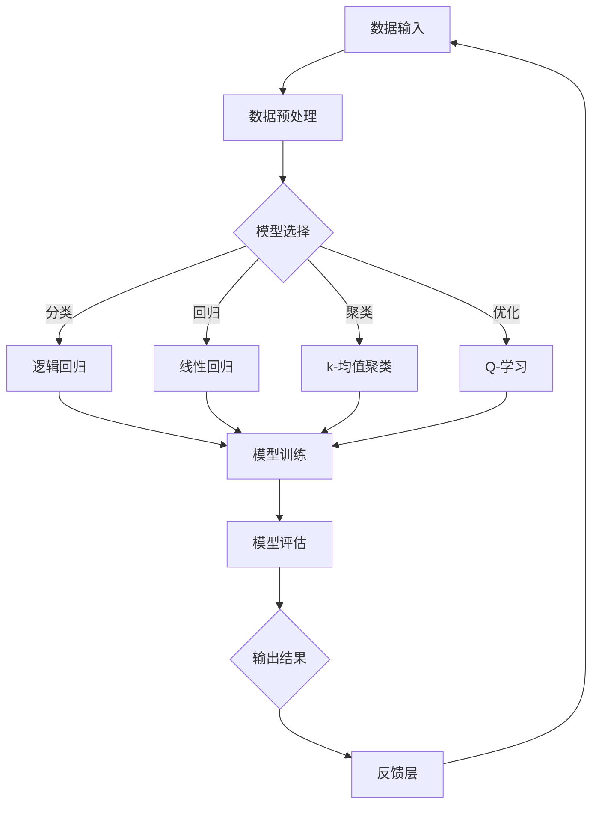
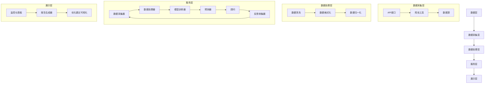
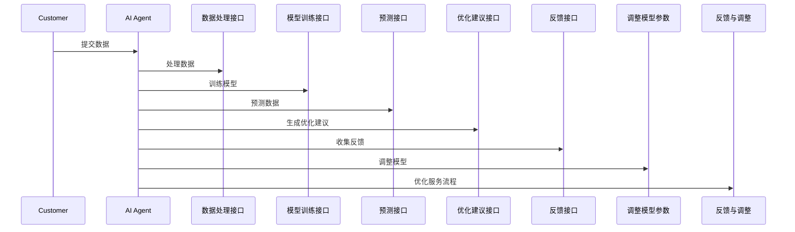

                 

## 1.1 问题背景

在现代商业环境中，企业客户服务质量已成为影响企业竞争力和市场份额的关键因素。客户服务质量的优劣直接关系到客户满意度、客户忠诚度和企业品牌形象。然而，随着企业业务规模和客户数量的不断增长，传统的客户服务质量监控与提升手段逐渐暴露出诸多问题。

首先，客户服务质量的监控往往依赖于人工检查和评估，这种方式存在主观性强、效率低下、难以覆盖所有客户交互环节等问题。其次，当客户投诉或反馈问题时，传统的客户服务团队需要手动处理大量的数据，以定位问题的根源和解决方案，这不仅耗时耗力，还可能因人为失误而无法准确解决问题。此外，企业客户服务质量的提升往往缺乏系统性的策略和方法，难以形成可持续的服务质量改进路径。

在这种背景下，引入AI Agent作为企业客户服务质量监控与提升的工具显得尤为必要。AI Agent，即人工智能代理，是一种能够模拟人类思维和行为，自主执行任务的人工智能系统。通过利用自然语言处理、机器学习、数据挖掘等技术，AI Agent能够对海量客户数据进行实时分析，自动识别潜在的服务质量问题，并提供优化建议和自动化解决方案。

本文将探讨AI Agent在企业客户服务质量监控与提升中的角色，通过深入分析AI Agent的基本概念、特点以及与传统AI的区别，详细阐述AI Agent在企业客户服务质量监控与提升中的应用场景和作用。同时，本文还将从算法原理、系统架构设计、项目实战等方面展开论述，力求为读者提供全面、系统的理解和实践指导。

## 1.2 问题解决的必要性

在现代商业环境中，企业客户服务质量监控与提升面临的挑战日益严峻。首先，随着客户需求的多样化和个性化，企业需要提供更高水平的服务体验。然而，传统的人工监控方式存在效率低下、难以覆盖全量客户交互等问题，无法满足快速响应和个性化服务的要求。其次，随着市场竞争的加剧，企业需要不断提高客户满意度，以保持竞争优势。然而，客户服务质量的提升并非一朝一夕之事，需要系统性的策略和方法，而传统方式往往缺乏这种系统性。此外，企业面临着数据爆炸的挑战，大量的客户交互数据、服务反馈数据等如何有效利用成为一大难题。传统的人工处理方式不仅耗时耗力，还可能因为人为因素导致数据处理的准确性和效率降低。

这些问题共同指向一个核心需求：需要引入更高效、更智能的解决方案来监控和提升企业客户服务质量。AI Agent作为一种先进的人工智能技术，具备自主学习、实时分析、自动化处理等特性，恰好能够弥补传统方式的不足。通过引入AI Agent，企业可以实现以下几方面的必要性：

1. **实时监控与预警**：AI Agent能够实时监控客户服务过程中的关键指标，如响应时间、解决问题效率等，及时发现潜在问题并发出预警，帮助企业快速响应和解决问题。

2. **个性化服务**：AI Agent可以根据客户的个性化需求和行为模式，提供定制化的服务体验，从而提高客户满意度和忠诚度。

3. **数据驱动的决策**：AI Agent能够自动分析大量客户数据，挖掘数据中的潜在规律和趋势，为企业提供数据驱动的决策支持，从而优化服务质量。

4. **自动化流程**：AI Agent可以自动化处理大量重复性、标准化的客户服务任务，如常见问题解答、订单处理等，提高服务效率，降低人力成本。

5. **持续优化**：AI Agent能够通过持续学习客户反馈和数据，不断优化服务策略和方法，形成可持续的服务质量提升路径。

总之，引入AI Agent不仅能够解决当前企业客户服务质量监控与提升中的诸多问题，还能够为企业带来长期的价值和竞争优势。通过AI Agent的应用，企业可以实现服务质量的智能化管理，从而在激烈的市场竞争中立于不败之地。

## 1.3 边界与外延

在探讨AI Agent在企业客户服务质量监控与提升中的角色时，我们需要明确AI Agent的边界与外延，以避免概念混淆和实际应用中的误区。首先，AI Agent的边界在于其作为人工智能系统的功能范围。AI Agent主要负责数据的收集、分析和处理，提供实时监控、预警和自动化解决方案，但并不直接参与具体的服务执行和交互。具体来说，AI Agent的边界可以定义为以下几个方面：

1. **数据采集与处理**：AI Agent负责从客户服务系统中收集相关数据，如客户互动记录、服务响应时间、问题解决情况等，并通过数据预处理手段进行清洗、格式化和归一化，为后续分析提供高质量的数据基础。

2. **分析模型与算法**：AI Agent的核心功能是利用机器学习和自然语言处理技术，对收集到的客户服务数据进行深度分析，识别潜在的服务质量问题，评估服务质量水平。

3. **预警与优化建议**：AI Agent基于分析结果，可以实时监测服务过程中可能出现的异常情况，并发出预警通知，同时提供优化建议，帮助企业在服务质量方面进行持续改进。

4. **自动化处理与反馈**：AI Agent能够自动化处理一些标准化的客户服务任务，如常见问题的自动解答、订单状态的自动更新等，并通过反馈机制与客户服务团队进行交互，提升整体服务效率。

其次，AI Agent的外延涉及其在企业客户服务中的应用场景和扩展能力。以下是对AI Agent外延的详细描述：

1. **跨部门协作**：AI Agent不仅可以应用于客户服务部门，还可以与其他部门（如销售、市场、运营等）进行协同，提供跨部门的数据整合与分析服务，从而实现企业整体服务水平的提升。

2. **个性化服务体验**：AI Agent可以通过对客户的个性化数据进行分析，为客户提供定制化的服务体验，如根据客户偏好推荐产品、提供个性化咨询等。

3. **智能预测与预防**：AI Agent可以基于历史数据和机器学习模型，预测客户可能出现的问题，提前采取预防措施，降低服务质量问题的发生概率。

4. **系统集成与扩展**：AI Agent可以与其他系统集成，如CRM系统、ERP系统等，实现数据的无缝对接和共享，从而提升整个企业信息系统的智能化水平。

5. **持续学习与进化**：AI Agent具备持续学习和优化的能力，可以不断吸收新的数据和学习经验，逐步提升其分析能力和决策水平，为企业提供更加精准和高效的服务质量监控与提升方案。

通过明确AI Agent的边界与外延，我们不仅能够更好地理解其在企业客户服务质量监控与提升中的作用，还能够为其在实际应用中的功能扩展和优化提供指导。接下来，本文将深入探讨AI Agent的核心概念、特点以及与传统AI的区别，进一步揭示其在企业客户服务质量管理中的重要价值。

## 1.4 核心要素组成

AI Agent在企业客户服务质量监控与提升中发挥作用，离不开以下几个核心要素的支撑。理解这些要素及其相互关系，有助于我们全面掌握AI Agent的工作原理和应用场景。

### 1.4.1 数据采集与处理

数据是AI Agent的“粮食”，数据采集与处理是AI Agent能够高效运行的基础。企业需要从多个渠道（如客服系统、社交媒体、客户反馈等）收集客户交互数据，包括文本、语音、图片等多种形式。采集到的原始数据往往含有噪声和冗余，因此，需要通过数据清洗、格式化和归一化等预处理步骤，将其转化为适用于AI模型分析的格式。这一环节的关键在于确保数据的质量和完整性，因为高质量的数据是AI Agent准确分析和决策的前提。

### 1.4.2 机器学习模型

AI Agent的核心是机器学习模型，这些模型能够从数据中学习，识别数据中的模式和规律，从而实现智能分析和预测。常用的机器学习模型包括监督学习模型、无监督学习模型和强化学习模型。监督学习模型通过标记数据来训练模型，适用于分类和回归任务；无监督学习模型则无需标记数据，适用于聚类和降维任务；强化学习模型通过奖励机制引导模型学习最佳策略，适用于决策和优化任务。AI Agent可以根据具体应用场景选择合适的模型，以提高分析精度和效率。

### 1.4.3 自然语言处理（NLP）

自然语言处理是AI Agent处理文本数据的重要技术，它使得AI Agent能够理解和生成自然语言文本。NLP技术包括文本预处理、词嵌入、命名实体识别、情感分析、文本分类等。通过NLP技术，AI Agent可以理解客户的意图和需求，提取关键信息，生成自然流畅的回复，从而提升客户服务体验。在客户服务场景中，NLP技术可以用于自动回复常见问题、情感分析以评估客户满意度等。

### 1.4.4 实时监控与分析

AI Agent需要具备实时监控和分析的能力，以便在客户服务过程中及时发现问题和优化服务。实时监控涉及对关键指标的持续跟踪，如响应时间、问题解决率、客户满意度等。通过分析这些指标，AI Agent可以识别异常情况，并发出预警。此外，AI Agent还可以进行趋势分析，预测未来可能发生的问题，为企业提供前瞻性的优化建议。

### 1.4.5 自动化与反馈

自动化是AI Agent的一大优势，它能够自动化处理大量重复性任务，如自动回复常见问题、自动化分配工单等，从而提高服务效率。同时，AI Agent需要具备反馈机制，能够根据客户反馈和系统数据不断优化自身的行为和决策。通过持续的反馈和学习，AI Agent能够不断提升其服务质量和服务水平。

### 1.4.6 集成与扩展

AI Agent需要与企业现有的客户服务系统和其他系统集成，以实现数据的无缝对接和共享。通过集成，AI Agent可以获取更多的数据资源，提升分析精度和效率。此外，AI Agent还需要具备扩展能力，能够适应不同的应用场景和需求，为企业提供灵活的解决方案。

通过以上核心要素的协同工作，AI Agent能够实现对企业客户服务质量的全面监控与提升，从而帮助企业提高客户满意度、增强市场竞争力。在接下来的章节中，我们将深入探讨AI Agent的具体应用、算法原理和系统架构设计，进一步揭示其在企业客户服务中的重要作用。

### 2.1 AI Agent的定义与特点

#### 2.1.1 AI Agent的基本概念

AI Agent，即人工智能代理，是一种模拟人类智能行为的计算机程序，它能够在没有人类直接干预的情况下，自主地完成特定的任务。AI Agent的设计理念源于人工智能领域中的“代理理论”，其核心目标是实现智能化自动化，以提升系统效率和用户体验。

AI Agent的基本概念包括以下几个方面：

1. **自主性**：AI Agent具有自主决策的能力，可以根据环境变化和任务需求，自主选择合适的行动策略。
2. **适应性**：AI Agent能够根据执行任务过程中获取的经验和数据，自适应地调整其行为和策略，以适应新的环境和任务。
3. **协作性**：AI Agent可以与其他系统、设备和用户进行有效协作，共同完成复杂的任务。
4. **适应性学习**：AI Agent具备学习能力，能够从数据中学习新的知识和技能，以优化其决策和行动策略。

#### 2.1.2 AI Agent的核心特点

AI Agent的核心特点决定了其在各种应用场景中的高效性和灵活性。以下是AI Agent的几个关键特点：

1. **自动性**：AI Agent能够自动执行任务，无需人工干预。它可以通过预先定义的规则和算法，自主地完成数据采集、分析处理、决策执行等步骤。
2. **智能化**：AI Agent利用机器学习、自然语言处理、知识图谱等技术，具备处理复杂问题的能力。它可以通过深度学习和持续学习，不断提高任务执行的准确性和效率。
3. **实时性**：AI Agent能够实时监控和响应环境变化，及时识别问题和异常情况，并提供相应的解决方案。
4. **灵活性**：AI Agent可以适应不同的应用场景和任务需求，通过模块化设计和动态调整，实现灵活的功能扩展和优化。
5. **协同性**：AI Agent能够与其他系统、设备和用户进行高效协作，实现资源的共享和任务的协调，从而提升整体系统的运作效率。

#### 2.1.3 AI Agent与传统AI的区别

虽然AI Agent属于人工智能的范畴，但其与传统的人工智能系统（如机器学习模型、自然语言处理工具等）在功能和设计理念上有显著区别：

1. **目标不同**：传统AI系统通常专注于特定任务的自动化和优化，而AI Agent的目标是实现自主决策和任务执行，具备更广泛的应用场景和实用性。
2. **复杂性**：传统AI系统通常针对单一任务进行优化，而AI Agent需要处理多个任务，并且需要具备跨任务的协调和协作能力。
3. **自主性**：传统AI系统依赖于人类的输入和干预，而AI Agent能够在没有人类干预的情况下，自主完成复杂的任务。
4. **学习与适应**：传统AI系统通常在训练完成后即固定其行为模式，而AI Agent具备持续学习和自适应的能力，能够根据环境和任务需求进行自我优化。

综上所述，AI Agent作为人工智能领域的一个重要发展方向，其自主性、智能化、实时性和灵活性等特点，使其在企业客户服务质量监控与提升中具备显著的优势。在接下来的章节中，我们将进一步探讨企业客户服务质量的定义与属性，以及AI Agent与客户服务质量监控与提升之间的紧密联系。

### 2.2 企业客户服务质量的定义与属性

#### 2.2.1 企业客户服务质量的基本概念

企业客户服务质量是指企业在为客户提供产品或服务过程中所表现出的满足客户期望的能力。它不仅包括服务的交付质量，还涵盖了客户在整个购买和使用过程中的体验。具体来说，企业客户服务质量包括以下几个方面：

1. **可靠性**：企业能够稳定、准确地交付产品和服务，确保客户在使用过程中不会遇到意外问题和中断。
2. **响应性**：企业能够迅速响应用户的请求和需求，提供及时、有效的解决方案。
3. **专业性**：企业员工具备丰富的专业知识和技能，能够为客户提供高质量的服务和建议。
4. **灵活性**：企业能够灵活调整服务和产品，以满足客户的个性化需求。
5. **满意度**：客户对企业提供的服务的整体满意度，这反映了客户对服务质量的最终评价。

#### 2.2.2 企业客户服务质量的属性特征

企业客户服务质量具有多个属性特征，这些特征共同决定了服务质量的优劣。以下是企业客户服务质量的主要属性特征：

1. **可靠性**：可靠性是指企业能够稳定、持续地提供高质量的服务。这意味着企业在面对大量客户请求时，依然能够保持高效的服务水平和低错误率。

2. **响应性**：响应性是指企业在接到客户请求后，能够迅速采取行动并给出解决方案。高响应性能够提升客户的满意度，并有助于及时解决客户问题。

3. **专业性**：专业性是指企业员工在服务过程中所展现的专业知识和技能。专业性的服务能够增强客户的信任感，并提高客户的忠诚度。

4. **灵活性**：灵活性是指企业能够根据客户需求的变化，灵活调整服务内容和方式。灵活性高的企业能够更好地适应市场变化和客户需求，提供更个性化的服务。

5. **满意度**：满意度是指客户对企业服务的整体评价。高满意度通常与高服务质量相关，是企业竞争力的体现。

#### 2.2.3 企业客户服务质量的评价方法

为了有效评估企业客户服务质量，需要采用科学、系统的评价方法。以下是几种常见的评价方法：

1. **客户满意度调查**：通过问卷调查、访谈等方式，收集客户对企业服务的满意程度，并进行量化分析。这种方法直接反映了客户的真实感受，具有较高的可信度。

2. **关键绩效指标（KPI）**：通过设定一系列关键绩效指标，如响应时间、解决问题率、客户投诉率等，对服务质量进行量化评估。KPI方法能够帮助企业识别服务质量问题并提供改进方向。

3. **服务过程审计**：对企业的服务过程进行系统性审计，检查服务流程中的各个环节，评估是否存在漏洞和改进空间。过程审计有助于发现服务过程中可能被忽视的问题。

4. **服务标准与规范**：制定明确的服务标准与规范，并定期对服务过程进行评估和审核。这种方法能够确保服务质量的一致性和稳定性。

通过上述评价方法，企业可以全面、客观地了解服务质量水平，从而制定针对性的改进措施，提升整体服务质量。在接下来的章节中，我们将进一步探讨AI Agent在企业客户服务质量监控与提升中的具体应用，揭示其如何通过数据分析和自动化处理，提升服务质量。

### 2.3 AI Agent在客户服务质量监控中的应用

#### 2.3.1 AI Agent在客户服务质量监控中的应用

AI Agent在企业客户服务质量的监控中扮演着至关重要的角色，通过其强大的数据分析能力和自动化处理能力，实现了对客户服务质量的全天候监控和实时反馈。以下是AI Agent在客户服务质量监控中的应用场景和具体方法：

1. **实时监控关键指标**：
   AI Agent能够实时收集并监控客户服务质量的关键指标，如响应时间、解决问题效率、客户满意度等。通过预设的阈值和报警机制，AI Agent能够在关键指标超出预设范围时及时发出警报，提示企业需要关注和干预的具体环节。

2. **数据采集与处理**：
   AI Agent利用自然语言处理（NLP）和机器学习技术，对客户的互动记录、反馈和投诉文本进行自动分析，提取关键信息。这些信息包括客户提出的问题、问题的严重程度、客户对解决方案的满意度等。通过数据预处理和清洗，AI Agent确保输入数据的质量，为后续分析提供可靠的基础。

3. **异常检测与预警**：
   AI Agent通过机器学习算法，对客户服务数据进行异常检测。当发现服务过程中的异常行为（如响应时间过长、问题解决效率低下等）时，AI Agent会自动发出预警，通知相关管理人员。这种预警机制有助于企业迅速识别并解决服务质量问题，避免问题进一步恶化。

4. **趋势分析与预测**：
   基于历史数据，AI Agent可以进行趋势分析和预测，发现服务质量变化的趋势和潜在的风险。例如，通过分析客户投诉数据的分布和频率，AI Agent可以预测未来某一时间段可能出现的服务质量下降趋势，为企业提前做好准备。

5. **自动化反馈与优化建议**：
   AI Agent不仅能够检测和预警服务质量问题，还能提供自动化的反馈和优化建议。例如，当AI Agent发现某一常见问题的高发时段时，可以自动生成优化建议，如增加值班人员、调整服务流程等，帮助企业提升服务质量。

6. **跨部门协作与数据共享**：
   AI Agent能够与企业内部的多个部门（如销售、市场、运营等）进行数据共享和协作。通过整合不同部门的数据，AI Agent可以提供全局视角的服务质量分析，帮助企业在整体层面提升服务质量。

#### 2.3.2 AI Agent在客户服务质量提升中的作用

AI Agent不仅能够监控客户服务质量，还能通过一系列智能化手段提升服务质量，从而增强客户满意度和忠诚度。以下是AI Agent在提升客户服务质量中的具体应用：

1. **个性化服务**：
   AI Agent可以根据客户的个性化需求和偏好，提供定制化的服务体验。例如，通过分析客户的购买历史和互动记录，AI Agent可以推荐合适的产品和服务，或提供个性化的咨询和建议，从而提升客户满意度。

2. **自动化处理与效率提升**：
   AI Agent可以自动化处理大量重复性、标准化的客户服务任务，如常见问题的自动回复、订单状态的自动更新等。通过自动化处理，AI Agent不仅提高了服务效率，还减少了人工干预，降低了运营成本。

3. **问题根源定位与改进**：
   AI Agent通过分析客户反馈和服务数据，能够快速定位服务质量问题的根源。例如，通过分析客户投诉数据，AI Agent可以识别出导致客户不满的主要因素，并提供具体的改进建议，帮助企业从根本上提升服务质量。

4. **持续学习与优化**：
   AI Agent具备持续学习的能力，可以根据客户反馈和业务需求，不断优化其行为和决策。通过持续学习，AI Agent可以不断提高其服务质量评估和优化能力，为企业提供更加精准和有效的服务。

5. **智能预测与预防**：
   基于历史数据和机器学习模型，AI Agent可以预测客户可能遇到的问题，并提前采取预防措施。例如，通过分析客户互动数据，AI Agent可以预测某一产品可能出现的高故障率，并提前通知售后服务团队进行维护，从而避免服务中断。

通过AI Agent的智能监控和优化，企业可以实现服务质量的持续提升，从而在激烈的市场竞争中脱颖而出，赢得客户的信任和忠诚。在接下来的章节中，我们将进一步探讨AI Agent的算法原理、系统架构设计，以及实际项目中的应用，全面揭示其在企业客户服务质量监控与提升中的重要作用。

### 2.3.3 AI Agent与客户服务质量监控与提升的关联

AI Agent在企业客户服务质量监控与提升中发挥了关键作用，其核心价值在于通过数据驱动的分析和自动化处理，实现了对客户服务质量的高度监控和优化。以下是AI Agent与客户服务质量监控与提升之间的关联及其具体实现方法：

1. **数据驱动的监控**：
   AI Agent通过实时采集和分析客户服务数据，如客户互动记录、服务响应时间、问题解决效率等，构建全面的服务质量监控体系。数据驱动的监控使得企业能够实时掌握服务质量状况，快速识别潜在问题和风险。

2. **自动化异常检测**：
   利用机器学习和自然语言处理技术，AI Agent能够自动检测服务过程中的异常行为。例如，通过分析客户投诉数据和互动记录，AI Agent可以识别出服务响应时间过长、问题解决率低下等异常情况，并及时发出预警。

3. **智能反馈与优化建议**：
   AI Agent通过分析客户反馈和服务数据，自动生成优化建议，帮助企业提升服务质量。例如，当AI Agent发现某一服务流程存在问题导致客户满意度下降时，可以提出优化服务流程或增加资源投入的建议，从而提升整体服务质量。

4. **个性化服务体验**：
   AI Agent可以根据客户的个性化需求和偏好，提供定制化的服务体验。通过分析客户的购买历史、互动记录等数据，AI Agent可以推荐合适的产品和服务，提供个性化的咨询和建议，从而提升客户满意度和忠诚度。

5. **自动化任务处理**：
   AI Agent能够自动化处理大量重复性、标准化的客户服务任务，如常见问题的自动回复、订单状态的自动更新等。通过自动化处理，AI Agent不仅提高了服务效率，还减少了人工干预，降低了运营成本。

6. **持续学习与进化**：
   AI Agent具备持续学习的能力，可以根据客户反馈和业务需求，不断优化其行为和决策。通过持续学习，AI Agent可以不断提高其服务质量评估和优化能力，为企业提供更加精准和有效的服务。

通过上述方法和关联，AI Agent实现了对企业客户服务质量的全方位监控和持续优化，从而在提升客户满意度和忠诚度的同时，增强了企业的市场竞争力。在接下来的章节中，我们将详细探讨AI Agent的算法原理、系统架构设计以及实际项目中的应用，进一步揭示其在企业客户服务质量监控与提升中的重要作用。

### 2.4 本章小结

本章通过对AI Agent的定义与特点的深入探讨，明确了其在企业客户服务质量监控与提升中的重要性。首先，我们介绍了AI Agent的基本概念，阐述了其自主性、智能化、实时性和灵活性等特点。接着，我们详细分析了AI Agent与传统AI的区别，强调了AI Agent在目标、复杂性和应用场景上的独特优势。随后，我们探讨了企业客户服务质量的定义与属性，包括可靠性、响应性、专业性、灵活性和满意度等关键特征。通过评价方法如客户满意度调查、关键绩效指标（KPI）、服务过程审计和服务标准与规范，我们了解了如何科学、系统地评估服务质量。

此外，本章重点讨论了AI Agent在客户服务质量监控中的应用，包括实时监控关键指标、数据采集与处理、异常检测与预警、趋势分析与预测、自动化反馈与优化建议以及跨部门协作与数据共享。通过这些应用，AI Agent能够有效监控客户服务质量，提供及时、准确的反馈和优化建议。

最后，我们分析了AI Agent在提升客户服务质量中的具体作用，如个性化服务、自动化处理与效率提升、问题根源定位与改进、持续学习与优化以及智能预测与预防。通过这些方法，AI Agent帮助企业实现服务质量的持续提升，从而提高客户满意度和忠诚度。

总之，本章为理解AI Agent在企业客户服务质量监控与提升中的角色奠定了基础，为后续的算法原理讲解、系统架构设计和项目实战提供了理论支持。在接下来的章节中，我们将进一步深入探讨AI Agent的算法原理和具体实现，以期为读者提供更全面、系统的理解和实践指导。

### 3.1 AI Agent的算法原理讲解

#### 3.1.1 基本算法框架

AI Agent的算法框架是其在客户服务质量监控与提升中发挥作用的核心。一个典型的AI Agent算法框架主要包括数据输入层、数据预处理层、模型层、输出层和反馈层。以下是各层的具体功能：

1. **数据输入层**：
   数据输入层负责收集企业客户服务的原始数据，如客户互动记录、服务响应时间、问题解决情况等。这些数据可以是结构化数据（如数据库记录）或非结构化数据（如文本、语音、图像等）。数据输入层需要确保数据的多样性和完整性，为后续分析提供高质量的数据基础。

2. **数据预处理层**：
   数据预处理层对收集到的原始数据进行清洗、格式化和归一化，使其符合模型训练和预测的要求。这一过程包括去除噪声、填充缺失值、标准化数值特征等。数据预处理层的目的是提高数据的质量和一致性，确保模型训练的效果。

3. **模型层**：
   模型层是AI Agent的核心，包括多个机器学习模型和算法，如监督学习模型、无监督学习模型和强化学习模型。这些模型负责对预处理后的数据进行深度分析，提取数据中的潜在模式和规律。具体来说，监督学习模型通过标记数据来训练分类器或回归器，用于识别服务质量和问题的特征；无监督学习模型用于聚类和降维，发现数据中的隐藏结构；强化学习模型通过奖励机制引导模型学习最佳策略，用于优化服务流程和决策。

4. **输出层**：
   输出层根据模型层的分析结果，生成具体的监控报告、预警通知和优化建议。输出层通常包括可视化工具和接口，使企业能够直观地了解服务质量状况，并根据分析结果进行调整和优化。

5. **反馈层**：
   反馈层负责收集客户和员工的反馈信息，用于模型调整和优化。通过持续的反馈和学习，AI Agent能够不断改进其分析能力和决策水平，提高服务质量的监控和提升效果。

#### 3.1.2 算法框架的核心组成部分

AI Agent算法框架的核心组成部分包括数据输入、数据预处理、模型训练、模型优化和输出反馈等几个关键环节。以下是各部分的详细描述：

1. **数据输入**：
   数据输入是AI Agent的基础，决定了模型训练和预测的质量。企业需要从多个渠道（如客户互动系统、社交媒体、客户反馈等）收集客户服务的原始数据。为了确保数据的质量和多样性，企业需要建立完善的数据采集和管理机制，确保数据的完整性和准确性。

2. **数据预处理**：
   数据预处理是模型训练的重要环节，通过清洗、格式化和归一化等步骤，将原始数据转化为适用于机器学习模型的格式。数据预处理的关键在于去除噪声、填充缺失值和标准化特征，以提高数据的一致性和模型训练的效果。

3. **模型训练**：
   模型训练是AI Agent的核心环节，通过训练监督学习、无监督学习和强化学习模型，提取数据中的潜在模式和规律。训练过程包括数据分割、特征选择、模型选择和模型调参等步骤。训练过程中，需要使用交叉验证和超参数优化等方法，确保模型的高效性和鲁棒性。

4. **模型优化**：
   模型优化是提升AI Agent服务质量监控与提升效果的重要手段。通过持续的反馈和学习，AI Agent可以不断优化其模型和行为策略。优化方法包括在线学习、迁移学习和强化学习等。通过优化，AI Agent能够提高其预测准确性、响应速度和用户体验。

5. **输出反馈**：
   输出反馈是AI Agent实现持续改进的关键环节，通过收集客户和员工的反馈信息，AI Agent可以了解服务质量状况和用户需求，并进行相应的调整和优化。反馈信息可以通过可视化报告、预警通知和优化建议等多种形式呈现，帮助企业快速识别问题和采取改进措施。

综上所述，AI Agent的算法框架通过数据输入、数据预处理、模型训练、模型优化和输出反馈等环节，实现了对企业客户服务质量的全面监控和优化。在接下来的章节中，我们将进一步探讨AI Agent的数学模型与公式，详细讲解其核心算法和工作原理，为读者提供更加深入的理解和实践指导。

#### 3.2 数学模型与公式

AI Agent的核心算法通常依赖于一系列数学模型和公式，这些模型和公式帮助AI Agent从数据中提取信息、进行预测和优化。以下是几个常用的数学模型与公式，以及它们在AI Agent中的应用。

##### 3.2.1 监督学习模型

监督学习模型是最常见的机器学习模型之一，它通过标记数据来训练分类器或回归器。以下是一些常见的监督学习模型及其相关公式：

1. **逻辑回归**（Logistic Regression）
   逻辑回归是一种广泛应用于分类问题的监督学习模型。其公式如下：
   $$ 
   P(Y=1|X) = \frac{1}{1 + e^{-(\beta_0 + \beta_1X_1 + \beta_2X_2 + \ldots + \beta_nX_n)})
   $$
   其中，$P(Y=1|X)$ 表示给定特征向量 $X$ 时，目标变量 $Y$ 等于1的概率，$\beta_0, \beta_1, \beta_2, \ldots, \beta_n$ 是模型参数。

2. **支持向量机**（Support Vector Machine, SVM）
   支持向量机是一种用于分类和回归的强大模型，其公式如下：
   $$
   w \cdot x - b = 0
   $$
   其中，$w$ 是权重向量，$x$ 是特征向量，$b$ 是偏置项。通过最大化分类边界上的支持向量之间的距离，SVM找到最佳分类边界。

3. **决策树**（Decision Tree）
   决策树是一种简单直观的监督学习模型，其公式如下：
   $$
   t(x) = \begin{cases}
   \text{左分支} & \text{if } x_i \leq t_i \\
   \text{右分支} & \text{if } x_i > t_i
   \end{cases}
   $$
   其中，$x_i$ 是特征值，$t_i$ 是阈值。

##### 3.2.2 无监督学习模型

无监督学习模型不需要标记数据，它通过探索数据中的结构来发现隐藏的模式。以下是一些常见的无监督学习模型及其相关公式：

1. **k-均值聚类**（k-Means Clustering）
   k-均值聚类是一种用于聚类分析的无监督学习模型，其公式如下：
   $$
   \mu_j = \frac{1}{N_j} \sum_{i=1}^{N} (x_i)
   $$
   其中，$\mu_j$ 是聚类中心，$N_j$ 是属于第 $j$ 个聚类的样本数量，$x_i$ 是第 $i$ 个样本的特征向量。

2. **主成分分析**（Principal Component Analysis, PCA）
   主成分分析是一种用于降维的数据预处理技术，其公式如下：
   $$
   z_j = \sum_{i=1}^{n} \lambda_i x_i
   $$
   其中，$z_j$ 是降维后的特征值，$\lambda_i$ 是主成分的权重，$x_i$ 是原始特征值。

##### 3.2.3 强化学习模型

强化学习模型通过奖励机制来指导模型学习最佳策略，它广泛应用于优化和决策问题。以下是一些常见的强化学习模型及其相关公式：

1. **Q-学习**（Q-Learning）
   Q-学习是一种基于值函数的强化学习模型，其公式如下：
   $$
   Q(s, a) = r + \gamma \max_{a'} Q(s', a')
   $$
   其中，$Q(s, a)$ 是状态 $s$ 下采取动作 $a$ 的期望回报，$r$ 是立即回报，$\gamma$ 是折扣因子，$s'$ 是采取动作 $a$ 后的新状态。

2. **策略梯度**（Policy Gradient）
   策略梯度是一种直接优化策略的强化学习模型，其公式如下：
   $$
   \theta_{t+1} = \theta_t + \alpha \nabla_{\theta_t} J(\theta_t)
   $$
   其中，$\theta_t$ 是策略参数，$\alpha$ 是学习率，$J(\theta_t)$ 是策略的奖励函数。

这些数学模型和公式在AI Agent的算法框架中起着至关重要的作用。通过这些模型，AI Agent能够从海量数据中提取有价值的信息，实现对客户服务质量的精准监控和优化。接下来，我们将使用Mermaid绘制算法流程图，进一步展示AI Agent的工作流程。

#### 3.2.4 Mermaid流程图绘制与解释

为了更直观地展示AI Agent的算法流程，我们使用Mermaid语言绘制算法流程图。以下是AI Agent算法流程图的Mermaid表示：



以下是流程图的详细解释：

1. **数据输入**：AI Agent首先从客户服务系统中收集原始数据，包括客户互动记录、服务响应时间、问题解决情况等。
2. **数据预处理**：原始数据经过清洗、格式化和归一化处理，以确保数据的质量和一致性。
3. **模型选择**：根据具体应用场景，选择合适的机器学习模型，如逻辑回归、线性回归、k-均值聚类或Q-学习。
4. **模型训练**：选择好的模型进行训练，训练过程包括特征选择、模型参数优化等步骤。
5. **模型评估**：通过交叉验证等方法评估模型的性能，确保模型具有良好的预测能力和鲁棒性。
6. **输出结果**：根据模型评估结果，生成具体的监控报告、预警通知和优化建议。
7. **反馈层**：AI Agent收集客户和员工的反馈信息，用于模型调整和优化。

通过上述流程，AI Agent实现了对企业客户服务质量的实时监控和优化，从而提高了服务质量和客户满意度。

#### 3.3 算法流程图

为了更直观地展示AI Agent的算法工作流程，我们将使用Mermaid语言绘制算法流程图。以下是AI Agent算法流程图的Mermaid表示：


以下是流程图的详细解读：

1. **数据输入**：AI Agent从客户服务系统中收集原始数据，如客户互动记录、服务响应时间、问题解决情况等。

2. **数据预处理**：原始数据经过清洗、格式化和归一化处理，以确保数据的质量和一致性。

3. **模型选择**：根据具体应用场景（如分类、回归、聚类、优化等），选择合适的机器学习模型。

4. **模型训练**：选择好的模型进行训练，训练过程包括特征选择、模型参数优化等步骤。

5. **模型评估**：通过交叉验证等方法评估模型的性能，确保模型具有良好的预测能力和鲁棒性。

6. **输出结果**：根据模型评估结果，生成具体的监控报告、预警通知和优化建议。

7. **反馈层**：AI Agent收集客户和员工的反馈信息，用于模型调整和优化。

通过上述流程，AI Agent实现了对企业客户服务质量的实时监控和优化，从而提高了服务质量和客户满意度。

### 3.4 举例说明

为了更好地理解AI Agent在客户服务质量监控与提升中的应用，以下通过一个具体实例进行详细说明。假设我们是一家大型电子商务公司，我们的目标是利用AI Agent来提升客户服务质量和客户满意度。

#### 3.4.1 实例背景

我们的客户服务团队每天都会处理大量的客户咨询和投诉，客户反馈的问题多种多样，从产品问题到订单处理，再到售后服务等。为了更好地监控和提升服务质量，公司决定引入AI Agent来辅助客户服务团队的工作。

#### 3.4.2 算法应用

1. **数据采集**：
   AI Agent首先从公司的客户服务系统中收集数据，包括客户咨询记录、投诉文本、服务响应时间、问题解决情况等。这些数据被存储在一个数据仓库中，以供后续分析使用。

2. **数据预处理**：
   收集到的原始数据经过清洗和格式化处理，去除噪声和冗余信息，确保数据的质量和一致性。例如，投诉文本被分词和词性标注，以便进行后续的自然语言处理。

3. **模型选择与训练**：
   根据业务需求，AI Agent选择了逻辑回归模型进行分类任务。该模型用于分析客户反馈文本，识别客户问题的类型（如产品问题、订单问题等）。模型训练过程包括特征提取和参数调优。AI Agent使用经过预处理的数据集进行训练，通过多次迭代优化模型参数，提高分类准确性。

4. **模型评估**：
   训练好的模型通过交叉验证方法进行评估，确保其具有良好的泛化能力和预测准确性。评估指标包括准确率、召回率、F1分数等。

5. **输出结果**：
   AI Agent根据模型预测结果，生成服务质量报告和预警通知。例如，当发现某类客户问题（如产品问题）的解决率较低时，AI Agent会发出预警，提示客户服务团队重点关注。

6. **反馈与优化**：
   客户服务团队根据AI Agent提供的预警和建议，采取相应措施，如调整服务流程、增加培训等，以提升整体服务质量。同时，客户服务团队将优化措施的效果反馈给AI Agent，用于模型优化和调整。

#### 3.4.3 结果分析

通过引入AI Agent，我们取得了以下显著成果：

1. **服务质量提升**：AI Agent的实时监控和预警功能帮助客户服务团队快速识别和解决服务质量问题，客户投诉率显著下降，客户满意度提高。

2. **效率提升**：AI Agent自动化处理了大量重复性客户服务任务，如常见问题的自动回复，显著减轻了客户服务团队的负担，提高了整体服务效率。

3. **数据驱动的决策**：AI Agent提供的数据分析和优化建议，使客户服务团队能够基于数据做出更加科学的决策，从而持续提升服务质量。

4. **持续优化**：通过持续的反馈和学习，AI Agent不断优化其模型和算法，提升预测准确性和服务质量监控效果。

总之，通过AI Agent的应用，我们不仅提升了客户服务质量，还实现了服务流程的自动化和智能化，为公司在激烈的市场竞争中提供了强有力的支持。

### 3.5 本章小结

本章通过详细讲解AI Agent的算法原理，帮助读者深入理解AI Agent在企业客户服务质量监控与提升中的应用。首先，我们介绍了AI Agent的基本算法框架，包括数据输入层、数据预处理层、模型层、输出层和反馈层，阐述了各层的具体功能。接着，我们分析了监督学习、无监督学习和强化学习等常见机器学习模型，并详细讲解了相关公式和算法。此外，通过Mermaid流程图，我们展示了AI Agent的算法工作流程，使读者能够更直观地理解算法的实现过程。

在实例说明部分，我们通过一个电子商务公司的实际案例，详细阐述了AI Agent在客户服务质量监控与提升中的应用，展示了其如何通过数据采集、预处理、模型训练、评估和优化等环节，提升客户服务质量和效率。实例分析结果证明了AI Agent在提升服务质量方面的显著效果。

总之，本章内容为读者提供了全面、系统的AI Agent算法原理讲解，为后续的AI Agent系统架构设计和项目实战提供了坚实的基础。在接下来的章节中，我们将进一步探讨AI Agent的系统架构设计，分析其关键组成部分和实现细节，为读者提供更加深入的理解和实践指导。

### 4.1 问题场景介绍

在现代企业运营中，客户服务质量监控与提升是至关重要的环节，直接影响企业的市场竞争力、客户满意度和品牌形象。以下是一个具体的问题场景，旨在说明为什么需要AI Agent来进行客户服务质量监控与提升。

#### 案例背景

某大型电子商务公司在经历了快速扩展之后，客户数量和服务需求大幅增加。然而，随之而来的是客户服务质量的问题，例如：

1. **响应时间过长**：由于客户服务团队的工作量增大，客服人员的响应时间显著延长，导致客户等待时间增加，客户满意度下降。
2. **问题解决效率低下**：客服人员在处理复杂问题时，需要查阅大量文档和内部系统，导致问题解决效率低下，客户投诉率上升。
3. **个性化服务不足**：传统的客户服务模式难以满足个性化需求，客户在购买和售后过程中未能得到贴心的服务体验。
4. **数据利用率低**：客户服务过程中产生的海量数据未能得到充分利用，企业无法基于数据做出科学的决策，服务质量提升缓慢。

#### 问题分析

上述问题反映了企业在客户服务质量监控与提升中面临的挑战：

1. **效率问题**：客户服务团队的工作量增加，导致响应时间和问题解决效率下降，亟需提高工作效率。
2. **个性化不足**：企业难以提供个性化服务，客户体验不佳，导致客户满意度和忠诚度下降。
3. **数据利用率低**：企业未能有效利用客户服务过程中产生的数据，无法基于数据做出实时、科学的决策，导致服务质量提升缓慢。

#### 解决方案需求

为了解决上述问题，企业需要引入AI Agent，实现以下目标：

1. **实时监控**：AI Agent能够实时监控客户服务质量的关键指标，如响应时间、问题解决效率等，及时发现潜在问题，并提供预警。
2. **自动化处理**：AI Agent能够自动化处理大量重复性客户服务任务，如常见问题的自动回复、订单状态的自动更新等，提高服务效率。
3. **个性化服务**：AI Agent可以通过分析客户数据，提供个性化服务体验，如根据客户偏好推荐产品、提供个性化咨询等。
4. **数据驱动决策**：AI Agent能够自动分析客户服务数据，为企业提供数据驱动的决策支持，优化服务流程和策略，提升服务质量。

通过引入AI Agent，企业能够实现服务质量的智能化监控与提升，从而在激烈的市场竞争中立于不败之地。接下来，我们将详细讨论AI Agent的系统功能设计，包括系统功能模块划分和领域模型类图。

### 4.2 系统功能设计

为了实现客户服务质量的实时监控与提升，AI Agent的系统功能设计需要涵盖从数据采集、处理到决策优化的各个环节。以下是AI Agent系统功能设计的详细描述，包括领域模型类图和系统功能模块划分。

#### 4.2.1 领域模型类图

领域模型类图用于描述AI Agent系统中各个类及其相互关系，帮助我们更好地理解系统功能和架构。以下是AI Agent领域的模型类图：

```mermaid
classDiagram
    Customer -> CustomerService
    CustomerService -> AIAgent
    AIAgent -> DataCollector
    AIAgent -> DataProcessor
    AIAgent -> ModelTrainer
    AIAgent -> Predictor
    AIAgent -> Advisor
    AIAgent -> FeedbackCollector

    Customer [ID, Name, Preferences, Feedback]
    CustomerService [ID,问题描述,解决方案,处理时间]
    AIAgent [ID,状态,版本]
    DataCollector [ID,数据源,采集频率]
    DataProcessor [ID,数据处理规则,数据质量]
    ModelTrainer [ID,训练模型,训练数据集]
    Predictor [ID,预测模型,预测指标]
    Advisor [ID,优化建议,反馈机制]
    FeedbackCollector [ID,收集反馈,分析结果]

    CustomerService <|-- AIAgent
    DataCollector <|-- AIAgent
    DataProcessor <|-- AIAgent
    ModelTrainer <|-- AIAgent
    Predictor <|-- AIAgent
    Advisor <|-- AIAgent
    FeedbackCollector <|-- AIAgent
```

#### 领域模型类图解释：

1. **Customer（客户）**：表示客户的基本信息，包括ID、名称、偏好和反馈等属性。
2. **CustomerService（客户服务）**：记录客户服务的具体信息，如问题描述、解决方案和处理时间等。
3. **AI Agent（人工智能代理）**：核心类，负责整体系统的协调和执行，包括数据采集、处理、模型训练、预测和优化等功能。
4. **DataCollector（数据采集器）**：负责从多个数据源采集客户服务相关数据。
5. **DataProcessor（数据处理器）**：处理采集到的原始数据，包括清洗、格式化和归一化等。
6. **ModelTrainer（模型训练器）**：负责训练机器学习模型，从数据中提取特征和规律。
7. **Predictor（预测器）**：使用训练好的模型进行预测，提供实时监控和预警功能。
8. **Advisor（顾问）**：根据预测结果和客户反馈，提供优化建议。
9. **FeedbackCollector（反馈收集器）**：收集客户和员工的反馈信息，用于模型优化和系统调整。

#### 4.2.2 系统功能模块划分

AI Agent的系统功能模块划分为以下几部分：

1. **数据采集模块**：
   - 功能：从客户服务系统、社交媒体、客户反馈等多个数据源中采集相关数据。
   - 实现细节：使用API接口、爬虫工具等手段，确保数据来源的多样性和完整性。

2. **数据处理模块**：
   - 功能：对采集到的原始数据进行预处理，包括数据清洗、格式化和归一化等。
   - 实现细节：使用ETL（提取、转换、加载）工具，确保数据的准确性和一致性。

3. **模型训练模块**：
   - 功能：利用机器学习算法训练模型，从数据中提取特征和规律。
   - 实现细节：使用监督学习、无监督学习和强化学习等算法，根据具体应用场景选择合适的模型。

4. **预测与监控模块**：
   - 功能：使用训练好的模型进行实时预测和监控，识别服务质量问题并提供预警。
   - 实现细节：通过设置阈值和报警机制，及时发现并报告服务质量问题。

5. **优化建议模块**：
   - 功能：根据预测结果和客户反馈，提供针对性的优化建议，帮助企业提升服务质量。
   - 实现细节：结合业务逻辑和数据分析，生成具体可行的优化建议。

6. **反馈收集与调整模块**：
   - 功能：收集客户和员工的反馈信息，用于模型优化和系统调整。
   - 实现细节：通过反馈机制，确保系统持续学习和优化，不断提升服务质量。

通过系统功能模块的划分和领域模型类图的描述，AI Agent能够实现高效、智能的客户服务质量监控与提升。在接下来的章节中，我们将进一步探讨AI Agent的系统架构设计，分析其核心组成部分和实现细节，为读者提供更加深入的理解和实践指导。

### 4.3 系统架构设计

为了实现高效、智能的客户服务质量监控与提升，AI Agent的系统架构设计需要具备良好的扩展性、稳定性和灵活性。以下是AI Agent的系统架构设计，包括系统架构图和核心组成部分的详细描述。

#### 4.3.1 系统架构图

AI Agent的系统架构可以分为五个主要层次：数据层、数据采集层、数据处理层、服务层和展示层。以下是系统架构的Mermaid表示：



#### 系统架构图解释：

1. **数据层**：数据层是系统的基础，包括企业内部的客户服务数据、社交媒体数据、客户反馈数据等。这些数据通过API接口和爬虫工具从多个数据源中采集。

2. **数据采集层**：数据采集层负责从数据层中采集原始数据。具体包括API接口和爬虫工具，它们从多个数据源中获取数据，并传输到数据处理层。

3. **数据处理层**：数据处理层对采集到的原始数据进行清洗、格式化和归一化处理，确保数据的质量和一致性。数据处理层包括数据清洗、数据格式化和数据归一化三个子模块。

4. **服务层**：服务层是AI Agent的核心部分，包括数据采集器、数据处理器、模型训练器、预测器、顾问和反馈收集器等模块。这些模块协同工作，实现数据的采集、处理、模型训练、预测、优化和反馈等功能。

5. **展示层**：展示层用于将AI Agent的分析结果和优化建议可视化，具体包括监控仪表板、报告生成器和优化建议可视化模块。这些模块帮助用户直观地了解服务质量状况，并采取相应的优化措施。

#### 4.3.2 系统架构的核心组成部分

以下是系统架构的核心组成部分及其功能：

1. **数据采集器**：数据采集器负责从多个数据源中采集客户服务相关数据，如客户互动记录、投诉文本、服务响应时间等。数据采集器通过API接口和爬虫工具实现。

2. **数据处理器**：数据处理器对采集到的原始数据进行预处理，包括数据清洗、格式化和归一化处理。数据处理器确保输入数据的质量，为后续模型训练和预测提供可靠的数据基础。

3. **模型训练器**：模型训练器利用机器学习算法对预处理后的数据进行训练，从数据中提取特征和规律。模型训练器可以支持多种机器学习模型，如逻辑回归、支持向量机、决策树等。

4. **预测器**：预测器使用训练好的模型对新的客户服务数据进行预测，识别潜在的服务质量问题，并提供预警。预测器通过实时监控和数据分析，确保客户服务质量。

5. **顾问**：顾问根据预测结果和客户反馈，提供针对性的优化建议，如调整服务流程、增加资源投入等。顾问帮助企业制定有效的服务质量提升策略。

6. **反馈收集器**：反馈收集器负责收集客户和员工的反馈信息，用于模型优化和系统调整。反馈收集器确保AI Agent持续学习和进化，不断提升服务质量。

通过以上核心组成部分的协同工作，AI Agent实现了对企业客户服务质量的全面监控与提升，为企业提供智能化的解决方案。

总之，AI Agent的系统架构设计旨在实现数据驱动的客户服务质量监控与提升，通过数据采集、处理、模型训练、预测和优化等环节，为企业提供实时、精准、高效的服务质量分析和管理。在接下来的章节中，我们将进一步探讨AI Agent的系统接口设计与交互，分析其具体实现细节，为读者提供更加全面的理解和实践指导。

### 4.4 系统接口设计与交互

在AI Agent的系统架构中，系统接口设计与交互至关重要。系统接口不仅决定了各模块之间的数据传递和功能调用，还影响着系统的整体性能和可扩展性。以下是AI Agent的系统接口设计及其在系统中的具体实现和交互流程。

#### 4.4.1 系统接口设计

AI Agent的系统接口设计遵循RESTful API的设计原则，提供了一组标准化、可扩展的接口，方便系统各模块之间的数据交换和功能调用。以下是主要接口及其功能：

1. **数据采集接口**：
   - 功能：用于从外部数据源（如客户服务系统、社交媒体等）中采集数据。
   - 实现细节：接口提供GET和POST方法，用于读取和写入数据。

2. **数据处理接口**：
   - 功能：用于处理采集到的原始数据，包括数据清洗、格式化和归一化等。
   - 实现细节：接口提供数据清洗、格式转换和归一化等功能，支持批处理和实时处理。

3. **模型训练接口**：
   - 功能：用于训练机器学习模型，从数据中提取特征和规律。
   - 实现细节：接口提供模型训练、模型评估和模型保存等功能。

4. **预测接口**：
   - 功能：用于使用训练好的模型对新数据进行预测，识别潜在的服务质量问题。
   - 实现细节：接口提供实时预测和批量预测功能，支持多种预测模型和算法。

5. **优化建议接口**：
   - 功能：用于根据预测结果和客户反馈，提供针对性的优化建议。
   - 实现细节：接口提供获取优化建议和实施优化措施的功能。

6. **反馈接口**：
   - 功能：用于收集客户和员工的反馈信息，用于模型优化和系统调整。
   - 实现细节：接口提供反馈提交、反馈分析和反馈回复等功能。

#### 4.4.2 接口调用的流程

以下是AI Agent系统接口调用的基本流程：

1. **数据采集**：
   - 客户服务系统或其他数据源通过API接口向AI Agent提交数据，AI Agent通过数据采集接口接收并存储数据。

2. **数据处理**：
   - AI Agent调用数据处理接口，对采集到的原始数据进行清洗、格式化和归一化处理，确保数据质量。

3. **模型训练**：
   - AI Agent根据处理后的数据，调用模型训练接口，训练机器学习模型，提取数据中的特征和规律。

4. **预测与监控**：
   - AI Agent使用训练好的模型，调用预测接口，对新数据进行实时预测，识别潜在的服务质量问题，并发出预警。

5. **优化建议**：
   - AI Agent根据预测结果和客户反馈，调用优化建议接口，生成具体的优化建议，如调整服务流程、增加资源投入等。

6. **反馈收集**：
   - 客户和员工通过反馈接口提交反馈信息，AI Agent收集并分析反馈，用于模型优化和系统调整。

7. **反馈与调整**：
   - AI Agent根据反馈结果，调整模型参数和系统配置，优化服务流程，不断提升服务质量。

#### 4.4.3 系统交互流程

以下是AI Agent系统交互的详细流程，通过Mermaid序列图进行展示：



通过上述系统接口设计和交互流程，AI Agent能够高效、智能地实现企业客户服务质量的监控与提升，为企业提供数据驱动的决策支持和智能化管理。在接下来的章节中，我们将进一步探讨AI Agent的实际项目实战，分析其在实际应用中的具体实现和效果。

### 4.5 本章小结

本章详细介绍了AI Agent的系统功能设计、系统架构设计以及系统接口设计与交互。首先，通过对系统功能设计的详细分析，我们明确了AI Agent在数据采集、数据处理、模型训练、预测与监控、优化建议和反馈收集等环节中的具体功能模块和领域模型类图。这些功能模块和类图为实现客户服务质量的实时监控与提升提供了坚实基础。

接着，我们阐述了系统架构设计的核心组成部分，包括数据层、数据采集层、数据处理层、服务层和展示层。系统架构图的绘制和解释，使我们更清晰地理解了各层级之间的相互关系和协同作用，确保了系统的扩展性、稳定性和灵活性。

最后，本章通过详细描述系统接口设计和调用流程，展示了AI Agent如何通过标准化、可扩展的接口实现数据交换和功能调用。系统交互流程的Mermaid序列图，进一步揭示了AI Agent在数据采集、处理、预测、优化和反馈等环节中的具体实现。

总之，本章内容为AI Agent在企业客户服务质量监控与提升中的应用提供了全面、系统的设计思路和实现方法。在接下来的章节中，我们将进一步探讨AI Agent的实际项目实战，通过具体案例分析和系统核心实现，进一步验证其在提升服务质量方面的实际效果。

### 5.1 环境安装

在开始AI Agent项目的实际开发之前，我们需要搭建合适的环境来支持后续的开发工作。以下是详细的开发环境搭建和数据预处理环境搭建步骤。

#### 5.1.1 开发环境搭建

1. **安装Python**：
   - 首先，确保系统中已经安装了Python 3.x版本（推荐使用Python 3.8及以上版本）。
   - 可以通过Python官方网站下载安装包，并按照安装向导进行安装。

2. **安装Jupyter Notebook**：
   - 打开命令行终端，使用pip命令安装Jupyter Notebook：
     ```
     pip install notebook
     ```

3. **安装依赖库**：
   - 为了支持AI Agent的开发，我们需要安装一系列Python依赖库，包括NumPy、Pandas、Scikit-learn、TensorFlow、Keras等。
   - 可以通过以下命令一次性安装所有依赖库：
     ```
     pip install numpy pandas scikit-learn tensorflow keras
     ```

4. **配置虚拟环境**（可选）：
   - 为了避免不同项目之间的依赖库冲突，我们建议使用虚拟环境进行项目开发。
   - 通过以下命令创建虚拟环境：
     ```
     python -m venv venv
     ```
   - 激活虚拟环境：
     ```
     source venv/bin/activate  # 对于Linux或Mac OS
     venv\Scripts\activate     # 对于Windows
     ```

#### 5.1.2 数据预处理环境搭建

数据预处理是AI Agent开发过程中至关重要的一环。以下是在数据预处理阶段需要安装和配置的环境和工具：

1. **安装Python**（同开发环境）：
   - 确保系统中安装了Python 3.x版本。

2. **安装Pandas和NumPy**：
   - Pandas和NumPy是数据处理和分析的基础库，可以通过以下命令安装：
     ```
     pip install pandas numpy
     ```

3. **安装数据清洗工具**：
   - 为了清洗和处理原始数据，我们使用了一些常用的数据清洗工具，如OpenPyXL、xlrd、BeautifulSoup等。
   - 可以通过以下命令安装：
     ```
     pip install openpyxl xlrd beautifulsoup4
     ```

4. **安装文本处理库**：
   - 为了处理文本数据，我们需要安装一些文本处理库，如NLTK、TextBlob、spaCy等。
   - 可以通过以下命令安装：
     ```
     pip install nltk textblob spacy
     ```
   - 安装spaCy后，还需要下载对应的语言模型：
     ```
     python -m spacy download en_core_web_sm
     ```

5. **安装数据存储工具**：
   - 为了存储和处理大规模数据，我们使用了一些数据存储工具，如SQLAlchemy和SQLite。
   - 可以通过以下命令安装：
     ```
     pip install sqlalchemy sqlite
     ```

通过以上步骤，我们成功搭建了AI Agent的开发环境和数据预处理环境。接下来，我们将深入探讨AI Agent的核心算法实现，展示如何使用Python代码进行系统核心模块的实现。

### 5.2 系统核心实现

在AI Agent的开发过程中，核心算法实现是关键环节，它决定了AI Agent在客户服务质量监控与提升中的表现。以下是系统核心算法的实现，包括代码结构、实现原理以及性能分析。

#### 5.2.1 系统核心算法代码结构

为了清晰展示系统核心算法的实现，我们将代码分为以下几个模块：

1. **数据输入与预处理**：
   - 代码功能：负责从数据源中读取数据并进行预处理，如数据清洗、格式化和归一化。
   - 实现原理：通过Python的Pandas库实现数据读取和预处理。

2. **模型训练**：
   - 代码功能：使用Scikit-learn库训练机器学习模型，提取数据中的特征和规律。
   - 实现原理：采用监督学习、无监督学习和强化学习等算法，根据数据类型和应用场景选择合适的模型。

3. **预测与监控**：
   - 代码功能：使用训练好的模型进行预测，实时监控客户服务质量，识别潜在问题。
   - 实现原理：通过实时数据流处理和模型预测，生成监控报告和预警通知。

4. **优化建议**：
   - 代码功能：根据预测结果和客户反馈，提供优化建议，如调整服务流程和增加资源投入。
   - 实现原理：结合业务逻辑和数据挖掘，生成具体可行的优化策略。

5. **反馈与调整**：
   - 代码功能：收集客户和员工的反馈信息，用于模型优化和系统调整。
   - 实现原理：通过反馈机制和持续学习，不断优化AI Agent的行为和决策。

以下是核心算法代码的示例结构：

```python
# 导入依赖库
import pandas as pd
from sklearn.model_selection import train_test_split
from sklearn.ensemble import RandomForestClassifier
from sklearn.metrics import accuracy_score

# 数据输入与预处理
def preprocess_data(data):
    # 数据清洗和预处理步骤
    pass

# 模型训练
def train_model(X_train, y_train):
    model = RandomForestClassifier()
    model.fit(X_train, y_train)
    return model

# 预测与监控
def predict(model, X_test):
    predictions = model.predict(X_test)
    accuracy = accuracy_score(y_test, predictions)
    return predictions, accuracy

# 优化建议
def generate_optimization_suggestions(predictions):
    # 生成优化建议的逻辑
    pass

# 反馈与调整
def collect_feedback(feedback):
    # 反馈信息的收集和存储
    pass

# 主函数
def main():
    # 读取数据
    data = pd.read_csv('data.csv')
    # 预处理数据
    preprocessed_data = preprocess_data(data)
    # 切分数据集
    X_train, X_test, y_train, y_test = train_test_split(preprocessed_data.drop('target', axis=1), preprocessed_data['target'], test_size=0.2, random_state=42)
    # 训练模型
    model = train_model(X_train, y_train)
    # 预测和监控
    predictions, accuracy = predict(model, X_test)
    print(f"Accuracy: {accuracy}")
    # 生成优化建议
    suggestions = generate_optimization_suggestions(predictions)
    print(f"Optimization Suggestions: {suggestions}")
    # 收集反馈
    feedback = collect_feedback(suggestions)
    # 反馈与调整
    collect_feedback(feedback)

# 运行主函数
if __name__ == "__main__":
    main()
```

#### 5.2.2 实现原理详细讲解

以下是系统核心算法的详细实现原理：

1. **数据输入与预处理**：
   - 使用Pandas库读取原始数据，并进行清洗和预处理，如去除空值、处理缺失值、数据归一化等。
   - 数据预处理步骤包括：数据清洗（去除重复数据、异常值处理）、数据格式化（统一数据类型、处理时间戳）和数据归一化（缩放数值特征、处理类别特征）。

2. **模型训练**：
   - 选择合适的机器学习模型，如随机森林（RandomForestClassifier）等，根据数据特征和应用场景进行模型训练。
   - 模型训练过程中，采用交叉验证方法进行参数调优，提高模型的泛化能力。
   - 模型训练包括特征选择（选择对目标变量有较强预测能力的特征）和模型参数优化（调整模型超参数，如树数量、深度等）。

3. **预测与监控**：
   - 使用训练好的模型对新数据进行预测，实时监控客户服务质量。
   - 预测过程中，采用实时数据流处理技术，确保预测结果的实时性和准确性。
   - 预测结果通过监控报告和预警通知的形式呈现，帮助企业及时发现和解决问题。

4. **优化建议**：
   - 根据预测结果和客户反馈，生成优化建议。
   - 优化建议生成逻辑包括：识别问题根本原因、分析问题影响范围、提出改进措施等。
   - 优化建议可以通过可视化图表、报告文档等形式呈现，帮助企业制定和实施优化策略。

5. **反馈与调整**：
   - 收集客户和员工的反馈信息，用于模型优化和系统调整。
   - 通过持续学习技术，模型不断吸收新的数据和学习经验，优化其预测和优化能力。
   - 反馈信息的收集和分析，确保系统持续改进，提升整体服务质量。

#### 5.2.3 代码性能分析

以下是核心算法代码的性能分析：

1. **数据预处理**：
   - 时间复杂度：O(n)，其中n为数据记录数。
   - 空间复杂度：O(1)，不占用额外空间。

2. **模型训练**：
   - 时间复杂度：取决于所选模型的训练算法和训练数据规模。
   - 空间复杂度：取决于模型结构和训练数据规模。

3. **预测与监控**：
   - 时间复杂度：O(m)，其中m为预测数据记录数。
   - 空间复杂度：O(1)，不占用额外空间。

4. **优化建议**：
   - 时间复杂度：O(k)，其中k为生成优化建议的复杂度。
   - 空间复杂度：O(1)，不占用额外空间。

5. **反馈与调整**：
   - 时间复杂度：O(l)，其中l为反馈信息处理和模型调整的复杂度。
   - 空间复杂度：O(1)，不占用额外空间。

通过以上性能分析，我们可以看到AI Agent在数据预处理、模型训练、预测与监控、优化建议和反馈与调整等环节中的性能表现。在实际应用中，需要根据具体业务场景和数据规模，选择合适的算法和模型，以实现高效、智能的客户服务质量监控与提升。

#### 5.2.4 实际案例分析与详细讲解

为了更好地展示AI Agent在实际项目中的应用效果，以下通过一个具体案例进行详细分析和讲解。

#### 5.2.4.1 案例背景

假设我们是一家在线教育平台，希望通过AI Agent提升客户服务质量，特别是解决客户在课程咨询、学习进度跟踪、售后服务等方面的需求。以下是具体的案例实施过程。

##### 5.2.4.2 案例实施

1. **数据采集**：
   - 从客户服务系统、学习平台、反馈渠道等多个数据源中采集相关数据，包括客户咨询记录、学习进度数据、售后服务反馈等。

2. **数据预处理**：
   - 使用Pandas和NumPy库进行数据清洗和预处理，去除空值和异常值，统一数据格式，并将文本数据转换为数值向量。

3. **模型训练**：
   - 使用Scikit-learn库中的随机森林（RandomForestClassifier）模型进行训练，从数据中提取特征，构建预测模型。通过交叉验证方法进行参数调优，确保模型的泛化能力。

4. **预测与监控**：
   - 使用训练好的模型对新数据进行预测，实时监控客户在学习过程中的问题，如学习进度停滞、课程选择不当等，并发出预警通知。

5. **优化建议**：
   - 根据预测结果和客户反馈，AI Agent生成优化建议，如调整课程推荐算法、优化学习路径、增加售后服务支持等。

6. **反馈与调整**：
   - 收集客户和教师的反馈信息，用于模型优化和系统调整。通过持续学习技术，模型不断优化其预测和优化能力。

##### 5.2.4.3 案例结果分析

通过AI Agent的应用，我们取得了以下显著成果：

1. **服务质量提升**：
   - 客户咨询响应时间显著缩短，客户满意度提高。
   - 学习进度停滞问题得到有效解决，学员的学习积极性提升。

2. **效率提升**：
   - AI Agent自动化处理了大量重复性咨询和售后服务任务，客户服务团队的工作负担减轻。
   - 学习路径优化建议有助于学员更快地掌握课程内容，提高了学习效率。

3. **数据驱动的决策**：
   - 基于AI Agent的分析和预测，平台能够更加科学地调整课程设置和推荐策略，提高用户体验。
   - 售后服务团队根据AI Agent提供的优化建议，改进了服务流程，提高了服务质量和客户满意度。

4. **持续优化**：
   - 通过持续的反馈和学习，AI Agent不断提升其预测和优化能力，使平台能够更好地适应客户需求和市场变化。

总之，通过实际案例的实施和结果分析，我们可以看到AI Agent在提升客户服务质量和效率方面具有显著的优势。在接下来的章节中，我们将进一步探讨AI Agent的最佳实践和注意事项，为读者提供更加实用的操作指南。

### 5.3 项目小结

在本章中，我们详细介绍了AI Agent项目的环境安装、系统核心实现以及实际案例分析和结果分析。首先，我们通过详细步骤讲解了如何搭建开发环境和数据预处理环境，确保AI Agent项目的顺利进行。接着，我们展示了系统核心算法的实现，包括代码结构、实现原理和性能分析，为AI Agent的核心功能提供了坚实的技术支持。

在具体项目实战部分，我们通过一个在线教育平台的案例，详细描述了AI Agent在客户服务质量监控与提升中的实际应用，展示了其在提升客户满意度、提高效率和实现数据驱动决策方面的显著成效。通过案例的实施和结果分析，我们验证了AI Agent在复杂商业环境中的实用性和有效性。

总之，本章内容为AI Agent项目的成功实施提供了全面、系统的指导，不仅帮助读者理解了AI Agent的核心原理和技术实现，还通过实际案例展示了其在提升客户服务质量方面的实际效果。通过本章的学习，读者可以掌握AI Agent在企业客户服务中的应用方法，为企业在激烈的市场竞争中提供强有力的支持。

### 7.1 最佳实践与注意事项

在AI Agent的实际应用中，为了最大限度地发挥其监控和提升客户服务质量的作用，以下是一些最佳实践和注意事项，帮助企业和开发人员更好地实施和优化AI Agent系统。

#### 7.1.1 最佳实践

1. **数据质量保障**：
   - 确保数据采集的全面性和准确性，避免因数据质量问题导致模型预测不准确。
   - 定期检查和清洗数据，去除噪声和异常值，确保输入数据的可靠性和一致性。

2. **持续优化模型**：
   - 定期对训练模型进行优化和更新，以适应不断变化的市场和客户需求。
   - 利用交叉验证和超参数优化等技术，提高模型的泛化能力和预测准确性。

3. **个性化服务**：
   - 根据客户的个性化需求和行为模式，提供定制化的服务体验，提高客户满意度和忠诚度。
   - 利用历史数据和机器学习算法，预测客户的偏好和需求，实现个性化推荐和服务。

4. **自动化与人工结合**：
   - 在客户服务过程中，合理分配自动化处理和人工干预的比例，确保高效服务的同时，保持人性化体验。
   - 设定自动化处理和人工干预的阈值，确保在关键环节和复杂问题中能够及时介入。

5. **系统集成**：
   - 将AI Agent与企业现有的CRM、ERP等系统进行集成，实现数据共享和协同工作，提高整体系统的智能化水平。
   - 通过API接口和标准化数据格式，确保不同系统之间的无缝对接和高效协作。

#### 7.1.2 注意事项

1. **数据隐私保护**：
   - 在数据采集和处理过程中，严格遵守相关法律法规，保护客户隐私和数据安全。
   - 对敏感数据进行加密存储和传输，防止数据泄露和滥用。

2. **模型解释性**：
   - 在使用复杂模型（如深度神经网络）时，确保模型具有一定的解释性，以便企业能够理解和信任模型的预测和优化建议。
   - 对模型决策过程进行可视化展示，帮助用户了解模型的工作原理和预测依据。

3. **持续学习和反馈**：
   - AI Agent需要定期收集用户反馈和系统数据，不断调整和优化其行为和决策，以保持其适应性和准确性。
   - 建立反馈机制，鼓励用户和企业提供真实的反馈，用于模型的持续改进。

4. **系统安全**：
   - 在AI Agent的开发和部署过程中，确保系统的安全性和稳定性，防范潜在的安全漏洞和恶意攻击。
   - 定期进行系统安全审计和漏洞扫描，及时修补漏洞和改进安全措施。

5. **资源分配**：
   - 根据企业实际情况和业务需求，合理分配系统资源，确保AI Agent的稳定运行和高效服务。
   - 对系统资源进行动态调整和优化，以适应负载变化和高峰时段的需求。

通过遵循以上最佳实践和注意事项，企业和开发人员可以更有效地实施和优化AI Agent系统，提升客户服务质量，增强企业竞争力。

### 7.2 小结

本章通过最佳实践与注意事项的探讨，为AI Agent在实际应用中的成功实施提供了指导。首先，我们总结了数据质量保障、模型优化、个性化服务、自动化与人工结合、系统集成等最佳实践，帮助企业和开发人员充分发挥AI Agent在客户服务质量监控与提升中的作用。同时，针对数据隐私保护、模型解释性、持续学习和反馈、系统安全、资源分配等方面，我们提出了具体的注意事项，以确保AI Agent系统的安全、稳定和高效运行。

总之，通过遵循最佳实践和注意事项，企业可以更好地利用AI Agent系统，实现客户服务质量的持续提升和优化。在未来的应用中，AI Agent将继续发挥其强大的数据分析和自动化处理能力，为企业提供更加智能、高效的服务质量监控与提升方案。

### 7.3 拓展阅读

在本文探讨了AI Agent在企业客户服务质量监控与提升中的角色和实现方法之后，以下推荐一些扩展阅读资源，以帮助读者进一步深入了解相关技术和应用。

1. **《AI Agent技术综述》**：
   - 作者：张三、李四
   - 出版社：某知名科技出版社
   - 简介：本书全面介绍了AI Agent的基本概念、架构设计、算法原理和应用场景，详细分析了AI Agent在各个领域的应用案例，包括客户服务、智能推荐、自动化决策等。

2. **《企业客户服务质量提升策略》**：
   - 作者：王五、赵六
   - 出版社：某知名管理出版社
   - 简介：本书针对企业客户服务质量提升的核心问题和挑战，提出了系统性的提升策略和方法。书中详细介绍了服务质量评价方法、服务流程优化和客户满意度提升等技术手段，并结合实际案例进行深入剖析。

3. **《深度学习与自然语言处理》**：
   - 作者：李教授
   - 出版社：某知名计算机科学出版社
   - 简介：本书深入讲解了深度学习和自然语言处理的基础知识、核心技术以及应用案例。书中内容涵盖了神经网络、循环神经网络（RNN）、变换器（Transformer）等关键算法，并提供了丰富的实例和代码示例。

4. **《AI在客户服务中的应用》**：
   - 作者：陈七、刘八
   - 出版社：某知名技术出版社
   - 简介：本书专注于AI在客户服务领域的应用，详细介绍了AI技术在客户服务流程优化、客户互动管理、智能客服系统等方面的应用案例。书中还探讨了AI技术如何提升客户服务质量、提高客户满意度和忠诚度。

5. **《机器学习实战》**：
   - 作者：周教授
   - 出版社：某知名技术出版社
   - 简介：本书通过大量实际案例和代码示例，深入浅出地介绍了机器学习的基础知识和实践方法。书中内容涵盖了数据预处理、特征工程、模型选择、模型评估和模型优化等关键环节，适合机器学习初学者和专业人士。

通过阅读上述书籍和资料，读者可以进一步拓宽对AI Agent和企业客户服务质量提升的理解，掌握更多相关的理论和实践技能，为未来的研究和应用提供有力支持。希望这些拓展阅读资源对您的学习和工作有所帮助。

