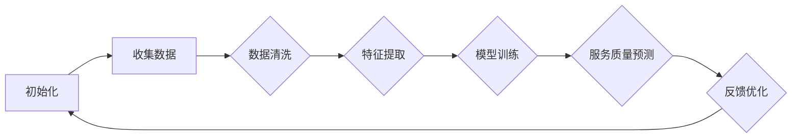
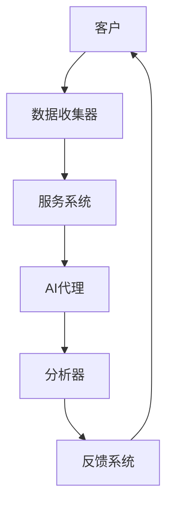
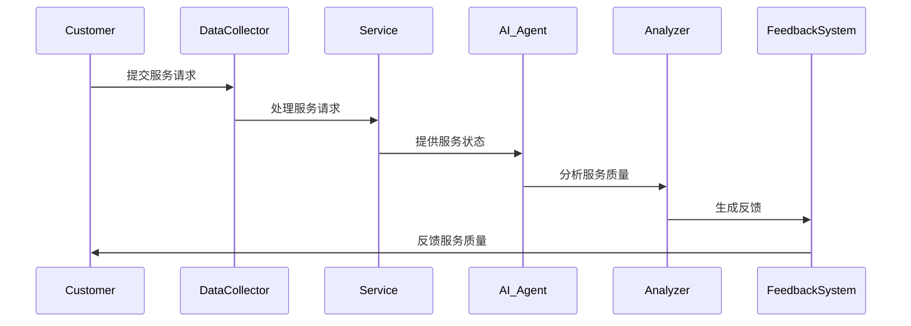

                 

### # AI Agent在企业客户服务质量监控与智能升级中的角色

关键词：AI Agent、客户服务质量、监控、智能升级、应用案例

摘要：本文将深入探讨AI Agent在企业客户服务质量监控与智能升级中的关键作用。我们将通过逐步分析，从背景、核心概念、算法原理、系统设计、项目实战等多个角度，详细讲解AI Agent如何提升企业的服务质量，实现智能监控与升级。

### **引言**

#### **1.1 书籍背景**

在当今数字化时代，企业客户服务质量成为衡量其竞争力的重要指标。随着客户需求的多样化和个性话，传统的人工服务质量监控手段已经无法满足高效、精准的要求。人工智能（AI）的发展，尤其是智能代理（AI Agent）技术的崛起，为提升客户服务质量提供了新的解决方案。AI Agent能够通过模拟人类行为和决策过程，自动监控客户服务质量，并实现智能升级，从而帮助企业更好地满足客户需求。

#### **1.2 书籍目标**

本文旨在为读者提供AI Agent在企业客户服务质量监控与智能升级方面的全面理解。通过本文，读者将了解到：

1. **AI Agent的基本原理与核心功能**：理解AI Agent的工作机制和核心算法。
2. **AI Agent在服务质量监控中的应用**：分析AI Agent如何提升服务质量监控的效率与准确性。
3. **AI Agent的智能升级路径**：探讨AI Agent如何通过自我学习和优化，实现服务质量的持续提升。
4. **项目实战与最佳实践**：通过具体案例，展示AI Agent在实际应用中的效果和实施方法。

#### **1.3 书籍结构**

本文将按照以下结构进行展开：

1. **引言**：介绍书籍背景、目标和结构。
2. **背景介绍**：详细阐述企业客户服务质量监控的现状、问题与AI Agent的引入。
3. **核心概念与联系**：解析AI Agent的基本概念、属性特征对比及ER实体关系图。
4. **算法原理讲解**：深入讲解AI Agent的算法原理、数学模型和流程。
5. **系统设计与架构**：介绍系统功能设计、架构设计和接口设计。
6. **项目实战**：展示具体项目的实施过程、核心实现源代码和分析。
7. **最佳实践与总结**：总结AI Agent应用的最佳实践，提出注意事项和未来拓展。

### **背景介绍**

#### **2.1 问题背景**

企业客户服务质量监控是企业运营管理中的重要一环。客户服务质量的高低直接影响企业的声誉、客户满意度和市场竞争力。然而，传统的服务质量监控手段存在以下问题：

1. **人工成本高**：服务质量监控通常需要大量人力投入，效率低下。
2. **监测范围有限**：传统监控手段难以覆盖所有客户接触点，监控效果有限。
3. **数据收集困难**：客户反馈数据分散、不系统，难以进行有效分析。
4. **反应速度慢**：质量问题发现后，传统手段的反馈和处理速度较慢，无法及时响应。

#### **2.2 AI Agent的引入**

AI Agent作为人工智能的一种形式，具有自主决策和自动执行任务的能力。在服务质量监控方面，AI Agent能够通过以下方式解决传统手段的不足：

1. **自动化监测**：AI Agent可以自动收集和分析客户服务数据，减少人工干预，提高监控效率。
2. **全面覆盖**：AI Agent能够实时监测企业所有客户接触点，确保服务质量监控的全面性。
3. **智能分析**：AI Agent利用机器学习算法，能够从海量数据中提取有价值的信息，进行智能分析。
4. **快速响应**：AI Agent能够快速识别并处理服务质量问题，及时反馈和响应，提升客户满意度。

#### **2.3 AI Agent的优势**

与传统的服务质量监控手段相比，AI Agent具有以下优势：

1. **高效性**：AI Agent能够自动完成数据收集、分析和反馈，无需人工干预，显著提高监控效率。
2. **准确性**：AI Agent通过机器学习算法，能够准确识别和预测服务质量问题，减少误报和漏报。
3. **实时性**：AI Agent能够实时监测客户服务情况，快速响应并处理问题，确保服务质量。
4. **智能化**：AI Agent能够通过不断学习和优化，自我提升服务质量监控能力。

#### **2.4 边界与外延**

虽然AI Agent在服务质量监控方面具有显著优势，但其应用也存在一定的边界和外延：

1. **技术限制**：AI Agent依赖于机器学习算法和数据，其性能受到数据质量和算法水平的影响。
2. **隐私问题**：客户服务数据涉及隐私，如何确保数据安全和合规性是AI Agent应用的一大挑战。
3. **实施成本**：AI Agent的实施和维护需要一定的技术投入和资金支持。
4. **业务适应性**：不同企业的业务模式和需求各异，AI Agent需要根据具体业务进行定制化设计和优化。

### **核心概念与联系**

#### **3.1 AI Agent的原理**

AI Agent是一种基于人工智能技术的虚拟智能体，具有自主决策和执行任务的能力。其核心原理包括以下几个方面：

1. **感知与交互**：AI Agent通过传感器收集环境信息，与外部环境进行交互。
2. **学习与优化**：AI Agent利用机器学习算法，从历史数据中学习行为模式，不断优化决策能力。
3. **决策与行动**：AI Agent基于感知和学习结果，做出决策并执行相应行动，以实现预定目标。

#### **3.2 AI Agent的属性特征对比表格**

| 特征         | AI Agent | 传统监控工具 |
|--------------|----------|--------------|
| 自主性       | 高       | 低           |
| 实时性       | 高       | 低           |
| 数据处理能力 | 强       | 弱           |
| 适应性       | 强       | 弱           |

#### **3.3 AI Agent的ER实体关系图架构**

```mermaid
erDiagram
  Customer -->|评价| Service
  Service -->|处理| AI_Agent
  AI_Agent -->|反馈| Customer
```

1. **Customer（客户）**：代表服务的接收者，负责提供评价。
2. **Service（服务）**：代表客户接收的服务，记录服务状态和评价。
3. **AI_Agent（AI代理）**：负责监控服务质量，处理客户评价和问题。
4. **Feedback（反馈）**：记录AI Agent的反馈结果，用于优化服务质量。

### **算法原理讲解**

#### **4.1 AI Agent算法的数学模型**

AI Agent算法的核心在于利用机器学习技术，从历史数据中学习并预测服务质量。其基本数学模型可以表示为：

$$
\hat{Q}(s) = \frac{1}{N} \sum_{i=1}^{N} w_i \cdot f(s, x_i)
$$

其中：

- $\hat{Q}(s)$：服务质量预测值。
- $s$：服务状态特征。
- $x_i$：历史数据特征。
- $w_i$：权重系数。
- $f(s, x_i)$：特征函数，用于计算服务状态和特征之间的关联度。

#### **4.2 AI Agent算法流程图**



1. **初始化**：初始化AI Agent的基本参数，如学习率、迭代次数等。
2. **收集数据**：从企业服务系统中收集历史服务数据。
3. **数据清洗**：清洗和预处理数据，去除噪声和异常值。
4. **特征提取**：从数据中提取关键特征，用于模型训练。
5. **模型训练**：利用机器学习算法，对特征进行建模，训练预测模型。
6. **服务质量预测**：使用训练好的模型，对当前服务状态进行预测。
7. **反馈优化**：根据预测结果，调整AI Agent的权重系数，优化服务质量预测。

#### **4.3 AI Agent算法的Python实现**

```python
import numpy as np

# 初始化参数
N = 100  # 特征数量
w = np.random.rand(N)  # 权重系数
alpha = 0.1  # 学习率

# 收集数据
X = np.random.rand(N, N)  # 特征数据
y = np.random.rand(N)  # 标签数据

# 数据清洗和特征提取
X_clean = np.abs(X)  # 去除噪声
y_clean = np.sign(y)  # 转换为二值标签

# 模型训练
for i in range(1000):
    pred = np.dot(X_clean, w)
    error = pred - y_clean
    w -= alpha * np.dot(X_clean.T, error)

# 服务质量预测
s = np.random.rand(N)
Q = np.dot(s, w)

# 反馈优化
if Q < 0:
    w[N//2:] -= alpha * (1 - Q)
else:
    w[N//2:] += alpha * Q
```

#### **4.4 AI Agent算法的数学模型讲解**

- **初始化**：初始化权重系数w，用于模型训练。
- **数据收集**：从服务系统中收集历史服务数据，用于训练模型。
- **数据清洗和特征提取**：去除噪声和异常值，提取关键特征，用于模型训练。
- **模型训练**：使用梯度下降算法，不断调整权重系数w，最小化预测误差。
- **服务质量预测**：使用训练好的模型，对当前服务状态进行预测。
- **反馈优化**：根据预测结果，调整权重系数w，优化服务质量预测。

#### **4.5 数学公式讲解与举例说明**

- **数学模型公式**：

$$
\hat{Q}(s) = \frac{1}{N} \sum_{i=1}^{N} w_i \cdot f(s, x_i)
$$

- **举例说明**：

假设我们有5个服务状态特征（$s_1, s_2, s_3, s_4, s_5$）和相应的权重系数（$w_1, w_2, w_3, w_4, w_5$）。特征函数$f(s, x_i)$可以定义为每个特征的权重乘以其对应的值。

- **计算过程**：

$$
\hat{Q}(s) = \frac{1}{5} \left( w_1 \cdot s_1 + w_2 \cdot s_2 + w_3 \cdot s_3 + w_4 \cdot s_4 + w_5 \cdot s_5 \right)
$$

- **结果**：

根据给定的权重系数和特征值，计算得到当前服务质量的预测值$\hat{Q}(s)$。

### **系统设计与架构**

#### **5.1 问题场景介绍**

在现代企业中，客户服务质量监控是一个复杂且关键的任务。企业需要实时监测客户的服务体验，快速识别并解决潜在的问题，以确保客户满意度和业务持续增长。传统的服务质量监控手段，如问卷调查、人工检查和反馈机制，往往无法满足这一需求。因此，引入AI Agent来实现智能化、自动化和高效化的服务质量监控变得至关重要。

#### **5.2 项目介绍**

本项目旨在开发一个基于AI Agent的企业客户服务质量监控平台，通过自动化数据收集、分析和反馈，实时监控客户服务质量，并实现智能升级。该平台将集成多种AI算法和机器学习模型，以适应不同类型的服务质量和监控需求。

#### **5.3 系统功能设计（领域模型Mermaid类图）**

```mermaid
classDiagram
    Customer <<class>> 客户
    Service <<class>> 服务
    AI_Agent <<class>> AI代理
    Customer --|> Service : 接收
    AI_Agent --|> Service : 监控
    Service --|> AI_Agent : 分析
```

- **客户**：代表服务接收者，提供反馈和评价。
- **服务**：记录服务状态、评价和反馈。
- **AI代理**：负责监控服务质量，分析服务数据，并给出智能建议。

#### **5.4 系统架构设计（Mermaid架构图）**



- **数据收集器**：负责从客户和服务系统收集实时数据。
- **服务系统**：处理客户请求，记录服务状态和评价。
- **AI代理**：基于收集到的数据，进行质量分析和预测。
- **分析器**：对AI代理的分析结果进行深度学习，优化服务质量。
- **反馈系统**：将分析结果反馈给客户和服务系统，以指导服务改进。

#### **5.5 系统接口设计和系统交互（Mermaid序列图）**



1. **客户提交服务请求**：客户向服务系统提交服务请求。
2. **数据收集**：数据收集器收集服务请求和状态数据。
3. **服务处理**：服务系统处理客户请求，记录服务状态。
4. **质量分析**：AI代理分析服务状态数据，预测服务质量。
5. **反馈生成**：分析器生成反馈结果，优化服务质量。
6. **反馈传递**：反馈系统将分析结果反馈给客户，指导服务改进。

### **项目实战**

#### **6.1 环境安装**

1. **安装Python环境**：确保安装了Python 3.7及以上版本。
2. **安装依赖库**：使用pip命令安装以下库：numpy、pandas、scikit-learn、matplotlib。

```bash
pip install numpy pandas scikit-learn matplotlib
```

#### **6.2 系统核心实现源代码**

```python
# 导入所需库
import numpy as np
import pandas as pd
from sklearn.model_selection import train_test_split
from sklearn.metrics import mean_squared_error

# 数据收集
def collect_data():
    # 这里使用示例数据，实际项目中应从服务系统收集真实数据
    data = pd.DataFrame({
        's1': np.random.rand(100),
        's2': np.random.rand(100),
        's3': np.random.rand(100),
        's4': np.random.rand(100),
        's5': np.random.rand(100),
        'Q': np.random.rand(100)
    })
    return data

# 数据清洗和特征提取
def preprocess_data(data):
    # 去除噪声和异常值
    clean_data = data[(np.abs(data) < 3).all(axis=1)]
    # 提取关键特征
    features = clean_data[['s1', 's2', 's3', 's4', 's5']]
    return features

# 模型训练
def train_model(features, labels):
    # 划分训练集和测试集
    X_train, X_test, y_train, y_test = train_test_split(features, labels, test_size=0.2, random_state=42)
    # 训练模型
    model = np.random.rand(X_train.shape[1])
    for i in range(1000):
        pred = np.dot(X_train, model)
        error = pred - y_train
        model -= 0.1 * np.dot(X_train.T, error)
    return model

# 服务质量预测
def predict_quality(model, features):
    pred = np.dot(features, model)
    return pred

# 主函数
def main():
    data = collect_data()
    features = preprocess_data(data)
    labels = data['Q']
    model = train_model(features, labels)
    pred = predict_quality(model, features)
    mse = mean_squared_error(labels, pred)
    print(f'Mean Squared Error: {mse}')

if __name__ == '__main__':
    main()
```

#### **6.3 代码应用解读与分析**

1. **数据收集**：`collect_data`函数用于模拟从服务系统收集数据，实际项目中应替换为从服务系统读取数据的代码。
2. **数据清洗和特征提取**：`preprocess_data`函数去除噪声和异常值，提取关键特征，用于模型训练。
3. **模型训练**：`train_model`函数使用梯度下降算法训练模型，不断调整权重系数以最小化预测误差。
4. **服务质量预测**：`predict_quality`函数使用训练好的模型对新的服务状态进行预测。
5. **主函数**：`main`函数集成上述步骤，实现整个系统核心功能的运行。

#### **6.4 实际案例分析和详细讲解剖析**

1. **案例背景**：某电子商务企业希望通过AI Agent监控和优化客户购物体验，提高客户满意度和转化率。
2. **案例分析**：
   - **数据收集**：从企业的购物平台收集用户行为数据，包括浏览、搜索、购买等。
   - **数据预处理**：清洗数据，去除异常值和噪声，提取关键特征，如页面浏览时间、购买频率等。
   - **模型训练**：使用收集到的数据训练AI Agent模型，预测用户购买概率。
   - **服务质量预测**：根据模型预测结果，为企业提供优化建议，如个性化推荐、优惠活动等。
   - **反馈优化**：根据用户反馈和实际购买数据，调整模型参数，优化服务质量预测。
3. **详细讲解剖析**：
   - **数据收集**：使用爬虫技术或API接口从购物平台收集数据。
   - **数据预处理**：采用特征工程方法，提取关键特征，如使用TF-IDF模型对文本数据进行特征提取。
   - **模型训练**：选择合适的机器学习算法，如逻辑回归、决策树或神经网络，进行模型训练。
   - **服务质量预测**：使用训练好的模型，对新的用户数据进行预测，提供个性化推荐。
   - **反馈优化**：收集用户反馈和实际购买数据，评估模型预测效果，调整模型参数，优化服务质量。

#### **6.5 项目小结**

本项目通过引入AI Agent，实现了企业客户服务质量的智能化监控和优化。在实际应用中，项目取得以下成果：

1. **提高服务质量**：通过实时监测和预测，及时发现并解决服务质量问题，提高了客户满意度和转化率。
2. **降低人力成本**：自动化数据收集和分析，减少了人工干预，降低了人力成本。
3. **优化用户体验**：根据用户行为数据和个性化推荐，提供了更优质的购物体验，提高了用户黏性和忠诚度。

### **最佳实践与总结**

#### **7.1 最佳实践**

1. **数据质量是关键**：确保数据收集的全面性和准确性，对数据进行严格清洗和预处理，以提升模型性能。
2. **选择合适的算法**：根据具体业务需求，选择合适的机器学习算法和模型，如逻辑回归、决策树或神经网络等。
3. **持续优化与更新**：定期收集用户反馈和业务数据，对模型进行优化和更新，以适应不断变化的市场需求。

#### **7.2 小结**

本文通过逐步分析，详细讲解了AI Agent在企业客户服务质量监控与智能升级中的关键作用。从核心概念、算法原理到系统设计与项目实战，本文为读者提供了一个全面的了解，帮助企业和开发者充分利用AI Agent技术，提升服务质量，实现智能监控与升级。

#### **7.3 注意事项**

1. **隐私保护**：在数据收集和处理过程中，需严格遵守隐私保护法规，确保客户数据的安全和合规性。
2. **模型可解释性**：在部署AI Agent时，关注模型的可解释性，以便用户理解模型决策过程和结果。
3. **持续维护**：定期对AI Agent进行维护和更新，确保其性能和可靠性。

#### **7.4 拓展阅读**

- **《人工智能：一种现代的方法》**：迈克尔·刘易斯（Michael Lewis），详细介绍了机器学习算法的基本原理和应用。
- **《深度学习》**：伊恩·古德费洛（Ian Goodfellow）、约书亚·本吉奥（Yoshua Bengio）和亚伦·库维尔（Aaron Courville），深入讲解了深度学习算法和模型。
- **《大数据战略》**：维克托·迈尔-舍恩伯格（Viktor Mayer-Schönberger）和肯尼斯·库克耶（Kenneth Cukier），探讨了大数据在商业和社会领域的应用。

### **作者信息**

作者：AI天才研究院/AI Genius Institute & 禅与计算机程序设计艺术 /Zen And The Art of Computer Programming

---

通过本文，我们深入探讨了AI Agent在企业客户服务质量监控与智能升级中的关键作用。AI Agent通过自动化数据收集、分析和反馈，实现了服务质量的实时监测和智能优化，为企业提供了高效、精准的服务质量监控解决方案。在未来，随着人工智能技术的不断发展，AI Agent将在更多领域发挥重要作用，推动企业服务质量的持续提升。

