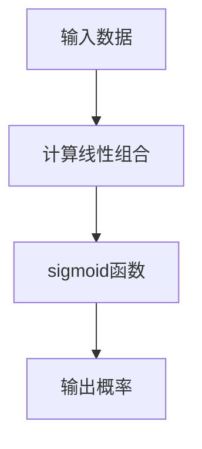
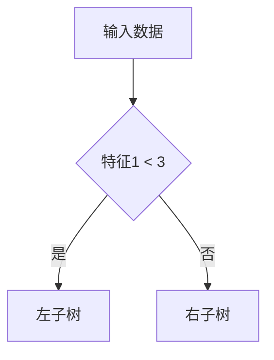
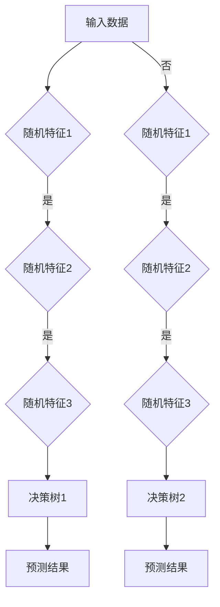

                 

### 第一部分: 引言

## 1.1 问题的背景

### 1.1.1 企业客户流失的现状

随着市场竞争的日益激烈，客户流失问题已经成为许多企业面临的严峻挑战。据统计，每年因为客户流失而导致的企业损失可达数十亿甚至数百亿美元。尤其是在高度竞争的行业，如电信、金融和零售，客户流失对企业利润和市场份额的影响尤为显著。企业客户流失的现象不仅表现为单次交易的终止，还包括长期合作的断裂和客户满意度的降低。这种流失往往伴随着客户对产品或服务的失望、不满意或者转向竞争对手。

### 1.1.2 客户流失对企业的影响

客户流失对企业的负面影响是多方面的。首先，流失的顾客可能直接影响企业的收入和市场份额。其次，客户流失还可能导致企业品牌形象的受损，进而影响到新客户的获取和维系。此外，客户流失还可能带来额外的成本，包括市场营销成本、客户服务成本和客户恢复成本。在客户生命周期价值（CLV）较低的情况下，这些成本可能会显著抵消企业的盈利能力。

### 1.1.3 AI Agent在客户流失预警中的作用

随着人工智能技术的不断进步，AI Agent（人工智能代理）在客户流失预警中的应用逐渐成为一种有效的解决方案。AI Agent能够通过大数据分析和机器学习算法，实时监测客户行为，识别潜在的流失风险，并为企业提供干预建议。这种技术优势使得AI Agent在以下方面具有显著作用：

- **实时监测与预测**：AI Agent能够实时分析客户的行为数据，快速识别异常行为，预测客户流失的可能性。
- **个性化干预**：通过深度学习和自然语言处理技术，AI Agent能够根据客户的个性化需求提供定制化的干预策略，提高干预效果。
- **自动化处理**：AI Agent可以自动化执行干预任务，如发送提醒信息、提供个性化优惠、调整服务套餐等，降低人工干预的成本和错误率。

## 1.2 AI Agent的定义与基本原理

### 1.2.1 AI Agent的概念

AI Agent是指具有自主决策能力、能够与环境进行交互并执行任务的人工智能实体。与传统的软件程序不同，AI Agent具有以下特点：

- **自主性**：AI Agent能够根据预设的目标和规则自主决策，无需人工干预。
- **适应性**：AI Agent能够从环境中学习，并根据学习结果调整自身的行为。
- **协作性**：AI Agent可以与其他AI Agent或人类用户进行协作，共同完成任务。

### 1.2.2 AI Agent的关键特性

AI Agent的关键特性包括：

- **感知能力**：AI Agent能够感知和理解环境中的信息，如文本、图像、语音等。
- **推理能力**：AI Agent能够根据感知到的信息进行逻辑推理和决策。
- **学习能力**：AI Agent能够通过机器学习和深度学习技术从数据中学习，提高其决策能力。
- **交互能力**：AI Agent能够与用户进行自然语言交互，提供个性化服务。

### 1.2.3 AI Agent与传统机器学习的区别

与传统的机器学习方法相比，AI Agent具有以下区别：

- **目标导向**：AI Agent的目标是执行任务，而传统机器学习更多关注模型的性能和准确性。
- **自主性**：AI Agent具有自主决策能力，而传统机器学习模型通常需要人工干预。
- **交互性**：AI Agent能够与用户和环境进行交互，而传统机器学习模型通常仅依赖于输入数据进行预测。

## 1.3 AI Agent在客户流失预警中的应用场景

### 1.3.1 预警系统的需求

在客户流失预警系统中，AI Agent的需求主要包括：

- **实时数据监测**：系统能够实时收集客户行为数据，如访问记录、购买历史、客户反馈等。
- **多维度分析**：系统能够从多个维度分析客户行为，包括行为模式、情感状态、社交网络等。
- **自动化预警**：系统能够自动识别潜在流失风险，并发出预警信号。
- **干预策略生成**：系统能够根据预警结果生成个性化的干预策略，如客户关怀活动、个性化优惠等。

### 1.3.2 应用场景案例分析

以下是一个典型的AI Agent在客户流失预警中的应用案例：

- **企业背景**：某大型电信运营商，其客户流失率较高，严重影响公司的收入和市场份额。
- **解决方案**：引入AI Agent进行客户流失预警。AI Agent实时分析客户行为数据，识别出潜在流失风险，如长时间未使用服务、频繁投诉等。系统根据预警结果生成干预策略，如发送优惠券、提供客户关怀活动等。
- **实施效果**：实施AI Agent预警系统后，企业的客户流失率显著下降，客户满意度提高，市场份额也有所增加。

## 1.4 本章小结

本文介绍了企业客户流失的现状、影响以及AI Agent在客户流失预警中的作用。AI Agent作为一种具有自主性、适应性和交互能力的人工智能实体，能够在客户流失预警中提供实时监测、多维度分析和自动化预警等能力。通过案例分析，我们看到了AI Agent在客户流失预警中的实际应用效果。接下来的章节将深入探讨AI Agent的基本原理、数据收集与准备、客户行为分析、流失预测模型和干预策略等方面的内容。## 1.5 AI Agent在客户流失预警中的工作原理

AI Agent在客户流失预警中扮演着核心角色，其工作原理主要涉及数据收集、处理和分析等多个环节。以下将逐步解析AI Agent在客户流失预警中的工作流程。

### 1.5.1 数据收集

数据是AI Agent进行预测和决策的基础。在客户流失预警中，AI Agent需要收集的客户数据包括：

- **行为数据**：如客户的购买记录、访问频率、停留时间、点击行为等。
- **社交网络数据**：如客户在社交媒体上的活动、点赞、评论、关注等。
- **反馈数据**：如客户对产品或服务的评价、投诉记录等。
- **交易数据**：如客户的消费金额、消费频率等。

这些数据可以通过多种方式收集，包括：

- **内部系统**：如CRM系统、ERP系统等。
- **第三方数据**：如社交媒体API、公开数据集等。

### 1.5.2 数据处理

收集到的数据通常是杂乱无章的，需要进行预处理才能被AI Agent有效利用。数据处理的主要步骤包括：

- **数据清洗**：去除重复数据、纠正错误数据、填补缺失值等。
- **数据整合**：将不同来源的数据整合到一个统一的格式中，如CSV、JSON等。
- **特征提取**：从原始数据中提取出对预测任务有用的特征，如行为特征、情感特征、交易特征等。

数据处理过程中，数据的质量和完整性至关重要。高质量的数据有助于提高AI Agent的预测准确性，而完整的数据能够确保预警系统的全面性。

### 1.5.3 数据分析

在数据处理完成后，AI Agent开始进行数据分析，以识别客户流失的潜在信号。数据分析的主要步骤包括：

- **描述性分析**：对客户行为进行描述性统计，如平均购买频率、平均停留时间等。
- **聚类分析**：将客户根据行为特征进行分类，如高价值客户、潜在流失客户等。
- **关联规则挖掘**：分析客户行为之间的关联，如购买A产品后很可能会购买B产品等。
- **时序分析**：分析客户行为随时间的变化趋势，如购买频率的季节性变化等。

通过这些分析步骤，AI Agent能够构建出客户流失的预警模型，为后续的预测和干预提供依据。

### 1.5.4 预测和预警

在数据分析的基础上，AI Agent利用机器学习算法进行客户流失预测。常见的预测算法包括：

- **逻辑回归**：用于预测客户流失的概率。
- **决策树**：用于分类客户是否流失。
- **随机森林**：结合了决策树的优势，提高了模型的预测准确性。
- **神经网络**：通过多层感知器进行复杂的非线性预测。

AI Agent通过预测结果生成预警信号，当预测结果超过设定的阈值时，系统会触发预警，提醒企业采取相应的干预措施。

### 1.5.5 干预措施

预警触发后，AI Agent会根据预设的干预策略自动执行相应的措施。干预措施包括：

- **个性化优惠**：向潜在流失客户发送个性化的优惠券或折扣信息。
- **客户关怀**：通过电话或邮件与客户进行沟通，了解其需求和不满，并提供解决方案。
- **服务调整**：根据客户反馈调整产品或服务，提升客户满意度。

这些干预措施旨在降低客户流失率，提高客户满意度，从而提升企业的盈利能力和市场份额。

### 1.5.6 持续学习和优化

AI Agent不是静态的系统，而是能够不断学习和优化的。通过实时监测客户行为数据，AI Agent可以不断调整预测模型和干预策略，提高预警的准确性和干预的有效性。这种持续学习和优化的能力使得AI Agent能够适应不断变化的市场环境和客户需求。

综上所述，AI Agent在客户流失预警中的作用是通过数据收集、处理和分析，利用机器学习算法进行预测，并生成预警信号和干预措施，从而帮助企业降低客户流失率，提高客户满意度和市场份额。## 1.6 AI Agent在客户流失预警中的应用案例

为了更深入地理解AI Agent在客户流失预警中的实际应用，以下将通过两个具体的案例来分析AI Agent在客户流失预警中的应用效果。

### 1.6.1 案例一：大型电信运营商

**企业背景**：
某大型电信运营商在面临激烈市场竞争的同时，客户流失率持续上升，对公司的收入和市场份额造成严重威胁。为了解决这一问题，该公司决定引入AI Agent进行客户流失预警。

**解决方案**：
该电信运营商首先构建了一个数据收集系统，实时收集客户的多种行为数据，如通话记录、上网流量、短信发送量、客户服务反馈等。随后，通过AI Agent对这些数据进行预处理和特征提取，然后使用机器学习算法构建客户流失预测模型。

**具体实施**：
1. **数据收集**：从内部系统（如CRM、ERP）和第三方数据源（如社交媒体）中收集客户行为数据。
2. **数据处理**：进行数据清洗、整合和特征提取，确保数据质量。
3. **模型构建**：选择随机森林算法进行模型训练，并根据模型结果调整参数，优化预测准确性。
4. **预警和干预**：当AI Agent预测某客户有流失风险时，系统会自动向该客户发送优惠券、提供免费增值服务或安排客服进行沟通，以降低流失概率。

**实施效果**：
AI Agent预警系统上线后，该电信运营商的客户流失率显著下降，客户满意度提高，市场份额也有所增加。通过数据驱动的个性化干预措施，不仅减少了客户流失，还提高了客户的忠诚度。

### 1.6.2 案例二：在线零售平台

**企业背景**：
某知名在线零售平台在激烈的市场竞争中，面临客户流失率高的问题。该平台希望通过AI Agent识别和干预潜在流失客户，以提升客户留存率。

**解决方案**：
该零售平台首先建立了客户行为数据收集系统，包括客户的购物记录、浏览历史、搜索关键词、购物车行为等。随后，通过AI Agent对这些数据进行处理和分析，构建客户流失预警模型。

**具体实施**：
1. **数据收集**：从网站日志、客户关系管理系统（CRM）和其他渠道收集客户行为数据。
2. **数据处理**：进行数据清洗、整合和特征提取，提取对预测任务有用的行为特征。
3. **模型构建**：使用逻辑回归算法构建客户流失预测模型，通过交叉验证调整模型参数。
4. **预警和干预**：当AI Agent预测某客户有流失风险时，平台会向该客户发送个性化优惠券、购物推荐或限时促销信息，同时安排客服进行主动沟通，提供客户支持。

**实施效果**：
实施AI Agent预警系统后，该零售平台的客户流失率显著降低，客户活跃度和满意度均有提升。通过精准的个性化干预措施，不仅挽回了部分潜在流失客户，还促进了客户的再次购买，从而提高了平台的销售额和市场份额。

### 1.6.3 案例总结

以上两个案例展示了AI Agent在客户流失预警中的实际应用效果。通过实时数据监测、机器学习预测和个性化干预，AI Agent能够有效降低客户流失率，提高客户满意度和市场份额。以下为AI Agent在客户流失预警中的应用要点总结：

1. **实时数据监测**：通过多种渠道收集客户行为数据，实现实时监测，为预警提供及时的信息支持。
2. **多维度数据分析**：从多个维度分析客户行为，识别潜在流失信号，提高预警的准确性。
3. **个性化干预**：根据预测结果和客户特点，制定个性化干预策略，提高干预效果。
4. **持续优化**：通过不断学习和优化预测模型和干预策略，适应市场变化和客户需求，提高系统的长期性能。

综上所述，AI Agent在客户流失预警中的应用不仅能够为企业提供有效的预警手段，还能通过个性化的干预措施提高客户满意度和忠诚度，从而在激烈的市场竞争中占据有利地位。## 1.7 本章小结

在本章中，我们深入探讨了AI Agent在企业客户流失预警中的应用。首先，介绍了客户流失的现状及其对企业的影响，以及AI Agent在预警中的作用。接着，详细阐述了AI Agent的工作原理，包括数据收集、处理和分析、预测和干预等环节。随后，通过两个实际应用案例，展示了AI Agent在降低客户流失率、提高客户满意度和市场份额方面的显著效果。本章的重点在于理解AI Agent的核心作用和工作机制，为后续章节进一步探讨客户流失预警的具体技术和应用场景打下基础。

## 1.8 拓展阅读与未来展望

为了更全面地了解AI Agent在企业客户流失预警中的应用，读者可以参考以下拓展阅读材料：

1. **《客户流失管理：策略、技术和实践》**：本书详细介绍了客户流失管理的理论基础和实践方法，包括数据收集、分析、预测和干预等方面的内容。
2. **《人工智能实战：从数据到模型》**：本书通过大量实际案例，介绍了人工智能在各个领域的应用，包括客户流失预警系统的构建和优化。
3. **《机器学习实战》**：本书涵盖了机器学习的基础理论和实践技巧，有助于读者深入了解AI Agent中使用的各种机器学习算法。

未来，随着人工智能技术的不断进步，AI Agent在客户流失预警中的应用有望进一步深化和扩展。以下是一些可能的未来发展方向：

1. **增强学习能力**：通过深度学习和强化学习等技术，AI Agent将具备更强的自我学习和适应能力，提高预警的准确性和干预的个性化程度。
2. **跨领域应用**：AI Agent不仅适用于电信、零售等行业，还可以推广到金融、医疗等领域，为不同行业客户提供定制化的流失预警解决方案。
3. **集成多源数据**：未来AI Agent可以集成更多的数据来源，如物联网设备数据、社交媒体数据等，实现更全面的数据分析和预警。
4. **人机协作**：AI Agent将更紧密地与人类专家协作，通过人机交互提升决策质量，实现更高效的企业客户流失预警和管理。

通过不断探索和创新，AI Agent有望成为企业客户流失预警中的核心工具，助力企业实现可持续发展和竞争优势。## 第二部分: 数据收集与准备

## 2.1 数据来源

数据收集是AI Agent进行客户流失预警的重要基础。在数据来源方面，我们需要综合考虑数据的种类、质量和可靠性，以确保AI Agent的预测和干预策略具有高准确性和有效性。

### 2.1.1 客户数据的种类

客户数据可以大致分为以下几类：

1. **行为数据**：包括客户的购买记录、浏览历史、点击行为、搜索关键词等。这些数据反映了客户在产品或服务使用过程中的行为特征，是分析客户行为和预测流失风险的重要依据。
2. **交易数据**：包括客户的交易记录，如购买金额、交易频率、购买周期等。交易数据可以揭示客户的消费习惯和购买模式，对预测流失风险有重要影响。
3. **社交网络数据**：包括客户在社交媒体上的活动，如点赞、评论、分享等。社交网络数据可以帮助我们了解客户的社交行为和情感状态，从而更准确地预测客户流失。
4. **反馈数据**：包括客户对产品或服务的评价、投诉记录、客户满意度调查等。反馈数据可以直接反映客户对产品或服务的满意度和忠诚度，对流失预警有重要意义。
5. **其他数据**：包括客户的基本信息（如年龄、性别、地理位置等）、客户历史数据（如以往购买记录、服务历史等）等。这些数据可以作为辅助特征，提高预测模型的准确性。

### 2.1.2 数据来源的获取渠道

数据来源的获取渠道包括内部数据和外部数据：

1. **内部数据**：内部数据主要来自企业的内部系统，如客户关系管理（CRM）系统、企业资源规划（ERP）系统、网站日志等。这些数据通常是实时或近实时的，可以直接反映客户的行为和交易情况。例如，CRM系统可以提供客户的购买记录、联系记录、服务记录等；ERP系统可以提供企业的库存信息、销售信息、财务信息等；网站日志可以提供客户的浏览历史、点击路径等。
2. **外部数据**：外部数据主要来源于第三方数据源，如社交媒体平台、公共数据库、市场调查报告等。这些数据可以补充内部数据的不足，提供更全面和多样化的信息。例如，通过社交媒体API可以获取客户的社交网络数据；通过公共数据库可以获取客户的基本信息；通过市场调查报告可以获取行业趋势和竞争对手的信息。

### 2.1.3 数据获取方法

在获取数据时，需要遵循以下原则和方法：

1. **数据授权**：获取数据前，需要确保数据来源的合法性，遵守相关法律法规和企业的隐私政策。对于内部数据，企业内部系统通常有权限控制，可以确保数据的合法获取。对于外部数据，需要确保数据来源的可靠性，避免侵犯他人的隐私权。
2. **数据清洗**：获取的数据通常存在噪音和错误，需要进行清洗和预处理。数据清洗包括去除重复记录、纠正错误数据、填补缺失值等。数据清洗的目的是提高数据质量，为后续分析提供可靠的基础。
3. **数据整合**：将来自不同来源和格式的数据整合到统一的数据格式中，如CSV、JSON等。数据整合的目的是确保数据的一致性和可分析性。
4. **数据质量评估**：对获取的数据进行质量评估，包括数据的完整性、准确性、一致性等。数据质量评估的目的是识别和解决数据中的问题，提高数据质量。

通过有效的数据获取方法和手段，我们可以确保AI Agent有充足和高质量的数据进行客户流失预警，从而提高预测的准确性和干预的有效性。

## 2.2 数据预处理

数据预处理是AI Agent进行客户流失预警的重要步骤，其目的是提高数据质量，为后续的数据分析和建模提供可靠的基础。数据预处理包括数据清洗、数据整合和特征提取等多个环节。

### 2.2.1 数据清洗

数据清洗是数据预处理的第一步，其目的是去除数据中的噪声和错误，提高数据的质量。数据清洗的主要任务包括：

1. **去除重复记录**：在数据集中可能存在重复的记录，这些重复记录会导致数据冗余，影响分析结果。通过去除重复记录，可以提高数据的唯一性和一致性。
2. **纠正错误数据**：数据在收集和存储过程中可能会出现错误，如数据格式错误、数据缺失等。通过数据清洗，可以纠正这些错误，确保数据的有效性。
3. **填补缺失值**：在实际应用中，数据集可能存在缺失值。缺失值的处理方法包括删除缺失值、填补缺失值等。删除缺失值可能会导致数据量减少，而填补缺失值可以保留更多的数据，提高数据的质量。
4. **数据标准化**：不同数据源的数据通常具有不同的尺度和单位，为了便于后续分析和建模，需要对数据进行标准化处理。数据标准化包括数值型数据的归一化和离散型数据的编码等。

### 2.2.2 数据整合

数据整合是将来自不同来源和格式的数据整合到统一的数据格式中，以便于后续的数据分析和建模。数据整合的主要任务包括：

1. **数据格式转换**：将不同格式的数据（如CSV、JSON、XML等）转换为统一的格式，便于数据的存储和处理。
2. **数据对齐**：将不同数据源的数据进行对齐，确保数据的时间戳、字段名称和值的一致性。例如，将不同系统的数据根据客户ID进行关联，确保数据的完整性。
3. **数据融合**：将多个数据源中的数据融合为一个数据集，便于统一分析和建模。数据融合的方法包括直接合并、交集、补集等。

### 2.2.3 特征提取

特征提取是从原始数据中提取出对预测任务有用的特征，是数据预处理的关键环节。特征提取的主要任务包括：

1. **特征选择**：从大量原始特征中筛选出对预测任务具有重要意义的特征，提高模型的性能和效率。特征选择的方法包括基于信息的特征选择、基于模型的特征选择等。
2. **特征工程**：通过对原始特征进行变换和组合，生成新的特征，以提高模型的预测能力。特征工程的方法包括特征归一化、特征变换、特征组合等。
3. **特征降维**：将高维特征空间降维到低维空间，减少数据的维度，提高模型的训练效率和预测准确性。特征降维的方法包括主成分分析（PCA）、线性判别分析（LDA）等。

通过数据清洗、数据整合和特征提取等数据预处理步骤，我们可以显著提高数据质量，为AI Agent的客户流失预警提供可靠的数据基础。数据预处理不仅有助于提高模型的性能和准确性，还可以减少模型的复杂性和计算成本，使AI Agent在实际应用中更加高效和可行。

## 2.3 数据质量评估

数据质量是AI Agent进行客户流失预警的关键因素，高质量的数据能够提高预测模型的准确性和可靠性，从而提升预警系统的整体性能。数据质量评估是确保数据满足特定要求的重要环节，通过评估数据的质量，可以识别和解决数据中的问题，提高数据的有效性和可用性。

### 2.3.1 数据质量指标

数据质量评估通常通过一系列指标来衡量，以下是一些常见的数据质量指标：

1. **完整性**：数据完整性指数据集中缺失值的数量和比例。缺失值过多会导致模型训练的不准确，因此完整性是评估数据质量的重要指标。
2. **准确性**：数据准确性指数据的正确性和一致性。准确性高的数据能够提高模型的预测性能，减少预测误差。
3. **一致性**：数据一致性指数据在不同来源和格式中的统一性和一致性。不一致的数据会导致模型训练的错误和预测结果的不准确。
4. **时效性**：数据时效性指数据的更新频率和时效性。时效性高的数据能够反映客户行为的最新变化，提高预警的准确性。
5. **唯一性**：数据唯一性指数据集中重复记录的数量和比例。重复记录会导致数据冗余，影响模型的性能和效率。
6. **可解释性**：数据可解释性指数据是否能够被理解和解释。可解释性高的数据有助于模型的理解和优化。

### 2.3.2 数据质量问题分析

在数据质量评估过程中，可能会发现以下常见的数据质量问题：

1. **缺失值**：数据集中存在大量的缺失值，可能导致模型训练失败或预测不准确。常见原因包括数据收集过程中的错误、数据存储和传输过程中的丢失等。
2. **错误值**：数据集中存在错误的值，如异常值、不合理值等，这些错误值会影响模型的训练和预测。常见原因包括数据录入错误、数据格式错误等。
3. **不一致性**：数据集中存在不一致的数据，如不同的时间戳、不同的字段名称等，这些不一致性会导致数据融合和模型训练的困难。常见原因包括数据源的不同、数据同步问题等。
4. **重复值**：数据集中存在重复的记录，这些重复记录会导致数据冗余，影响模型的训练效率和预测准确性。常见原因包括数据收集和存储过程中的重复记录、数据同步问题等。

### 2.3.3 数据质量问题处理

为了解决数据质量中的问题，可以采取以下措施：

1. **缺失值处理**：对于缺失值，可以采用填补缺失值的方法，如平均值填补、中值填补、插值法等；对于严重影响模型训练的缺失值，可以采用删除缺失值的方法。
2. **错误值处理**：对于错误值，可以采用修正错误值的方法，如根据业务逻辑进行修正、根据参考数据进行修正等；对于严重影响模型训练的错误值，可以采用删除错误值的方法。
3. **一致性处理**：对于不一致的数据，可以采用数据对齐的方法，如根据时间戳进行对齐、根据字段名称进行对齐等；对于严重影响模型训练的不一致性，可以采用删除不一致数据的方法。
4. **重复值处理**：对于重复值，可以采用去重的方法，如根据主键进行去重、根据唯一标识进行去重等。

通过数据质量评估和问题处理，我们可以显著提高数据质量，为AI Agent的客户流失预警提供可靠的数据基础，从而提高预警系统的准确性和有效性。## 2.4 本章小结

本章重点讨论了数据收集与准备在AI Agent企业客户流失预警系统中的重要性。首先，介绍了客户数据的种类和获取渠道，包括行为数据、交易数据、社交网络数据、反馈数据等，以及内部数据和外部数据的获取方法。随后，详细阐述了数据预处理的过程，包括数据清洗、数据整合和特征提取，并强调了数据清洗和质量评估的必要性。本章的内容为AI Agent的有效运行提供了坚实的数据基础，并为其在客户流失预警中的准确预测和干预奠定了基础。在接下来的章节中，我们将继续探讨客户行为分析和流失预测模型的构建与评估。## 2.5 客户行为概述

### 2.5.1 客户行为的定义

客户行为是指客户在使用产品或服务过程中的各种表现和行为，包括购买行为、浏览行为、反馈行为、互动行为等。通过分析客户行为，企业可以深入了解客户的需求、偏好和行为模式，从而制定更有效的营销策略和客户服务方案。

### 2.5.2 客户行为的分类

客户行为可以按照不同的维度进行分类，以下是一些常见的分类方法：

1. **按行为类型分类**：
   - **购买行为**：包括客户的购买决策、购买渠道、购买频率、购买金额等。
   - **浏览行为**：包括客户的访问频率、停留时间、浏览路径、点击行为等。
   - **反馈行为**：包括客户的投诉、评价、满意度调查等。
   - **互动行为**：包括客户在社交媒体上的点赞、评论、分享等。

2. **按行为动机分类**：
   - **需求驱动行为**：客户因为需求或问题而产生的行为，如购买新产品、寻求客户支持等。
   - **情感驱动行为**：客户因为情感体验而产生的行为，如分享产品体验、推荐给他人等。
   - **习惯驱动行为**：客户因为习惯而持续产生的行为，如定期购买服务、订阅内容等。

3. **按行为强度分类**：
   - **低频行为**：客户在一定时间内发生的次数较少的行为，如偶尔购买产品。
   - **高频行为**：客户在一定时间内发生的次数较多的行为，如频繁使用服务。

4. **按行为结果分类**：
   - **成功行为**：客户顺利完成目标的行为，如成功购买产品、成功获取服务。
   - **失败行为**：客户未能顺利完成目标的行为，如放弃购买、投诉等。

### 2.5.3 客户行为的特征

客户行为具有以下特征：

1. **多样性**：客户行为类型多样，包括购买、浏览、反馈、互动等多种行为，每种行为都有不同的特点和表现。
2. **动态性**：客户行为是动态变化的，随着时间的推移，客户的行为模式可能发生变化，如从低频购买转变为高频购买。
3. **关联性**：客户行为之间存在关联，如购买行为可能受到浏览行为和反馈行为的影响。
4. **个性化**：不同客户的客户行为存在差异，表现出个性化的特点，如不同客户对同一产品的购买频率和购买金额可能不同。
5. **可追踪性**：通过现代技术手段，如数据分析、用户跟踪等，可以追踪和记录客户的每一种行为，为分析提供数据支持。

### 2.5.4 客户行为对企业的影响

客户行为对企业有着重要的影响：

1. **收入来源**：客户的行为决定了企业的收入来源，如购买行为直接带来收入，浏览行为可能吸引更多潜在客户。
2. **市场份额**：客户的行为影响企业的市场份额，如高频行为客户可能成为忠实客户，低频行为客户可能转向竞争对手。
3. **品牌形象**：客户的行为反映了企业的服务质量，如成功行为提升品牌形象，失败行为损害品牌形象。
4. **客户关系**：客户的行为影响企业与客户之间的关系，如积极行为增强客户满意度，负面行为降低客户满意度。

### 2.5.5 客户行为的分析意义

对客户行为进行深入分析具有重要意义：

1. **市场洞察**：通过分析客户行为，企业可以了解市场需求和客户偏好，为市场定位和产品优化提供依据。
2. **营销策略**：通过分析客户行为，企业可以制定更有针对性的营销策略，如个性化推荐、优惠活动等，提高营销效果。
3. **客户服务**：通过分析客户行为，企业可以识别客户需求，提供更高质量的客户服务，提高客户满意度和忠诚度。
4. **业务优化**：通过分析客户行为，企业可以优化业务流程，提高运营效率，降低成本。

总之，客户行为分析是企业实现精准营销、提升客户满意度和优化业务流程的重要手段。通过深入了解客户行为，企业可以更好地满足客户需求，提高市场竞争力。

## 2.6 客户行为分析技术

### 2.6.1 描述性分析

描述性分析是客户行为分析的基础，主要用于概括和总结客户行为的特征和模式。描述性分析通常涉及以下内容：

- **统计指标**：包括平均值、中位数、标准差、最大值、最小值等，用于描述客户行为的主要统计特征。
- **分布情况**：通过直方图、饼图等可视化工具展示客户行为的分布情况，帮助分析客户行为的特点和差异。
- **趋势分析**：通过时间序列分析展示客户行为随时间的变化趋势，帮助识别客户行为的周期性或趋势性变化。

### 2.6.2 聚类分析

聚类分析是将客户行为数据分为若干个类别的技术，用于发现客户群体的相似性和差异性。聚类分析通常包括以下步骤：

- **数据标准化**：由于不同特征的数据尺度不同，需要将数据标准化到同一尺度，以便于后续分析。
- **选择聚类算法**：根据数据特点和需求选择合适的聚类算法，如K-Means、层次聚类、DBSCAN等。
- **确定聚类个数**：通过肘部法则、轮廓系数等指标确定最优的聚类个数。
- **聚类结果分析**：分析不同聚类结果，识别具有相似行为的客户群体，并对其特征和行为模式进行描述。

### 2.6.3 关联规则挖掘

关联规则挖掘是用于发现客户行为之间关联性的技术，用于识别哪些行为在一起出现的频率较高。关联规则挖掘通常包括以下步骤：

- **数据准备**：将行为数据转换为适合挖掘的形式，如将行为序列转换为布尔矩阵。
- **选择挖掘算法**：根据数据特点和需求选择合适的关联规则挖掘算法，如Apriori、FP-Growth等。
- **生成关联规则**：根据最小支持度和最小置信度等阈值生成关联规则。
- **规则分析**：分析生成的关联规则，识别客户行为之间的关联性，并提取有价值的信息。

### 2.6.4 时序分析

时序分析是用于分析客户行为随时间变化的趋势和模式的技术，主要用于识别客户行为的周期性、趋势性和季节性变化。时序分析通常包括以下步骤：

- **数据预处理**：对时序数据进行预处理，包括填补缺失值、消除异常值、分解成分等。
- **选择模型**：根据数据特点和需求选择合适的时序模型，如ARIMA、SARIMA、LSTM等。
- **模型训练和评估**：使用训练数据训练模型，并通过验证数据评估模型性能。
- **预测和可视化**：使用模型进行客户行为预测，并通过可视化工具展示预测结果。

### 2.6.5 情感分析

情感分析是用于分析客户反馈和评论中的情感倾向和情感强度的技术，主要用于识别客户的满意度和情感状态。情感分析通常包括以下步骤：

- **数据收集**：收集客户的反馈和评论数据，如在线评论、客户评价等。
- **文本预处理**：对文本数据进行预处理，包括去除停用词、词干提取、词性标注等。
- **选择模型**：根据数据特点和需求选择合适的情感分析模型，如基于规则的方法、机器学习的方法等。
- **情感分类和评分**：使用模型对文本进行情感分类和评分，识别客户的情感状态。

通过上述技术，企业可以全面分析客户行为，深入理解客户需求和行为模式，从而制定更精准的营销策略和客户服务方案，提高客户满意度和忠诚度。

## 2.7 客户行为分析案例

### 2.7.1 案例介绍

为了更好地理解客户行为分析在实际应用中的具体实施过程，我们以某大型在线零售平台为例，介绍其如何通过AI Agent进行客户行为分析，从而实现客户流失预警。

该在线零售平台在运营过程中发现客户流失率较高，尤其是新用户在购买后的流失现象尤为严重。为了降低客户流失率，提高客户满意度，平台决定引入AI Agent进行客户行为分析，以识别和干预潜在流失客户。

### 2.7.2 分析过程与结果

#### 1. 数据收集

平台首先构建了一个数据收集系统，实时收集客户的多种行为数据，包括：

- **行为数据**：客户的购买记录、浏览历史、点击路径、购物车行为等。
- **交易数据**：客户的订单信息、购买金额、购买频率等。
- **反馈数据**：客户在平台上的评价、投诉记录、客户满意度调查等。
- **其他数据**：客户的基本信息（如年龄、性别、地理位置等）、客户的历史行为数据等。

#### 2. 数据预处理

在数据收集完成后，平台对数据进行预处理，包括：

- **数据清洗**：去除重复记录、纠正错误数据、填补缺失值等，确保数据质量。
- **数据整合**：将来自不同来源和格式的数据整合到一个统一的数据格式中，如CSV文件。
- **特征提取**：提取对客户行为分析有用的特征，如购买频率、浏览时长、购买金额等。

#### 3. 客户行为分析

平台使用以下技术进行客户行为分析：

- **描述性分析**：对客户行为进行描述性统计，如客户的平均购买频率、浏览时长等。
- **聚类分析**：将客户根据购买频率、浏览时长等特征进行分类，识别出高价值客户和潜在流失客户。
- **关联规则挖掘**：分析客户行为之间的关联性，如购买A产品后很可能会购买B产品。
- **时序分析**：分析客户行为的时序变化，如购买频率的季节性变化。

#### 4. 客户流失预测

基于客户行为分析的结果，平台使用机器学习算法构建客户流失预测模型，包括：

- **数据划分**：将数据集划分为训练集和测试集，用于模型训练和评估。
- **算法选择**：选择合适的算法，如逻辑回归、随机森林等，进行模型训练。
- **模型评估**：使用测试集评估模型的性能，如准确率、召回率、F1分数等。

#### 5. 干预策略生成

根据客户流失预测结果，平台生成个性化的干预策略，包括：

- **个性化推荐**：向潜在流失客户推荐其感兴趣的产品或服务。
- **优惠活动**：向潜在流失客户发送优惠券或限时促销信息。
- **客户关怀**：通过邮件或短信与客户进行沟通，了解其需求和不满，并提供解决方案。

#### 6. 分析结果

通过AI Agent的客户行为分析和流失预测，平台取得了以下显著成果：

- **流失率下降**：平台的新用户流失率显著下降，尤其是在购买后的关键阶段。
- **客户满意度提高**：通过个性化的干预措施，客户的满意度显著提高。
- **市场份额增加**：平台的市场份额也有所增加，尤其是在竞争激烈的市场环境中。

### 2.7.3 案例总结

该案例展示了AI Agent在客户行为分析和客户流失预警中的实际应用效果。通过实时数据收集、多维度分析、机器学习预测和个性化干预，AI Agent帮助企业成功降低了客户流失率，提高了客户满意度和市场份额。以下为AI Agent在客户行为分析中的关键要点总结：

1. **实时数据收集**：确保数据的实时性和准确性，为分析提供可靠的基础。
2. **多维度分析**：从多个维度分析客户行为，识别潜在流失信号，提高预警的准确性。
3. **机器学习预测**：利用机器学习算法构建客户流失预测模型，提高预测的准确性和效率。
4. **个性化干预**：根据预测结果和客户特点，制定个性化的干预策略，提高干预效果。

通过深入分析客户行为，AI Agent能够帮助企业实现精准营销、提高客户满意度和优化业务流程，从而在激烈的市场竞争中占据有利地位。## 2.8 本章小结

本章重点介绍了客户行为分析的基本概念、分类、特征以及分析技术。首先，明确了客户行为的定义及其对企业的重要影响，详细分析了客户行为的分类和特征。随后，讨论了描述性分析、聚类分析、关联规则挖掘、时序分析等客户行为分析技术，并分享了实际案例，展示了客户行为分析在降低客户流失率、提高客户满意度和市场份额方面的显著效果。通过本章的学习，读者可以全面理解客户行为分析的核心内容和实际应用，为后续章节进一步探讨客户流失预测模型和干预策略打下坚实基础。## 2.9 拓展阅读与未来展望

为了更深入地了解客户行为分析及其在AI Agent中的应用，读者可以参考以下拓展阅读材料：

1. **《大数据营销：如何利用大数据进行精准营销》**：本书详细介绍了大数据在营销领域的应用，包括数据收集、处理、分析和预测等方面，为读者提供了丰富的实践案例和理论指导。
2. **《客户行为分析：营销策略与技巧》**：本书专注于客户行为分析的理论和实践，介绍了多种行为分析技术及其在营销中的应用，对市场营销人员具有很高的参考价值。
3. **《深度学习在客户行为分析中的应用》**：本书探讨了深度学习在客户行为分析中的应用，包括神经网络、卷积神经网络、循环神经网络等，为读者提供了深入了解深度学习在客户行为分析中的技术细节。

未来，随着人工智能技术的不断发展，客户行为分析及其在AI Agent中的应用有望实现以下几个方面的突破：

1. **更精准的预测模型**：通过引入新的机器学习和深度学习算法，可以进一步提高客户流失预测的准确性，使AI Agent能够更有效地识别和干预潜在流失客户。
2. **实时的客户行为监测**：随着物联网和大数据技术的发展，AI Agent将能够实时监测客户的多种行为，包括线上和线下的行为，从而实现更全面的客户行为分析。
3. **个性化干预策略**：通过深度学习和自然语言处理技术，AI Agent将能够根据客户的个性化需求和行为特征，生成更精准、更有效的干预策略，提高客户满意度和忠诚度。
4. **跨渠道的客户行为分析**：未来，AI Agent将能够整合多个渠道的数据，包括社交媒体、电子邮件、短信等，实现跨渠道的客户行为分析，从而提供更全面的客户洞察。
5. **智能客服与客户互动**：AI Agent将不仅仅是一个分析工具，还将与智能客服系统相结合，通过自然语言交互，提供个性化的客户服务和支持，进一步提升客户体验。

通过不断探索和创新，客户行为分析及其在AI Agent中的应用将不断进步，为企业在市场竞争中提供更强大的支持，实现可持续发展。## 第三部分: 客户流失预测模型

## 3.1 预测模型的构建

客户流失预测模型是AI Agent在客户流失预警系统中的核心组件。一个有效的预测模型能够帮助企业及时发现和应对潜在客户流失，从而降低客户流失率，提升客户满意度和市场份额。以下是构建客户流失预测模型的主要步骤和方法。

### 3.1.1 数据准备

数据准备是构建预测模型的第一步，也是至关重要的一步。数据的质量直接影响到模型的预测性能。以下是数据准备的关键步骤：

1. **数据收集**：收集与客户行为相关的数据，如购买记录、浏览历史、客户反馈、交易数据等。这些数据可以来自内部系统（如CRM、ERP）和外部数据源（如社交媒体、市场调查等）。
2. **数据清洗**：清洗数据中的噪声和错误，如缺失值、异常值、重复值等。缺失值的处理可以采用填补、删除或插值等方法；异常值的处理可以采用统计方法或基于规则的策略。
3. **数据整合**：将来自不同来源和格式的数据整合到一个统一的数据集中，确保数据的一致性和完整性。这通常涉及数据对齐和数据转换。
4. **特征提取**：从原始数据中提取对预测任务有用的特征。特征提取的过程包括特征选择和特征工程。特征选择的目标是选择对预测任务最相关的特征，特征工程则涉及特征变换、归一化、编码等操作。

### 3.1.2 算法选择

选择合适的算法是构建预测模型的关键步骤。不同的算法适用于不同的数据集和业务场景。以下是几种常见的客户流失预测算法：

1. **逻辑回归**：逻辑回归是一种常用的分类算法，适用于处理二元分类问题。逻辑回归通过最大化似然函数来训练模型，可以很好地捕捉数据中的线性关系。
2. **决策树**：决策树是一种基于树结构的分类算法，能够直观地展示决策过程。决策树通过递归分割特征空间，将数据划分为多个子集，直到满足某个停止条件。
3. **随机森林**：随机森林是一种基于决策树的集成学习方法，通过构建多个决策树并对预测结果进行投票，提高了模型的泛化能力和准确性。
4. **梯度提升树（GBDT）**：梯度提升树是一种基于决策树的集成学习方法，通过迭代地优化目标函数，每次迭代都增加模型的复杂度，从而提高模型的预测性能。
5. **神经网络**：神经网络，特别是深度学习模型，如卷积神经网络（CNN）和循环神经网络（RNN），能够捕捉数据中的复杂非线性关系。神经网络通过多层非线性变换，从原始数据中提取特征。

### 3.1.3 模型训练与调优

在算法选择后，接下来是模型的训练与调优。以下是模型训练与调优的关键步骤：

1. **数据划分**：将数据集划分为训练集、验证集和测试集。训练集用于模型训练，验证集用于模型调优，测试集用于模型评估。
2. **模型训练**：使用训练集对模型进行训练，通过优化目标函数（如交叉熵、均方误差等）来调整模型参数，使模型在训练数据上达到最佳性能。
3. **模型评估**：使用验证集评估模型的性能，通过评估指标（如准确率、召回率、F1分数等）来衡量模型的预测性能。如果模型性能不佳，可以返回步骤2进行进一步的调优。
4. **模型调优**：通过调整模型参数、选择不同的算法或增加数据特征等手段，提高模型的预测性能。常见的调优方法包括网格搜索、贝叶斯优化等。
5. **模型部署**：在模型性能满足要求后，将模型部署到生产环境中，对实时数据进行预测，生成客户流失预警。

### 3.1.4 模型评估与优化

模型部署后，需要进行持续的评估与优化，以确保模型的长期性能和稳定性。以下是模型评估与优化的一些策略：

1. **在线评估**：通过在线评估，实时监控模型的预测性能，识别模型性能的下降或异常。
2. **模型更新**：根据在线评估结果，定期更新模型，以适应数据分布的变化和业务需求。
3. **异常检测**：通过异常检测技术，识别模型预测中的异常情况，如误分类或异常值等，并及时采取相应的措施。
4. **反馈机制**：建立反馈机制，收集用户对模型预测的反馈，用于模型优化和改进。

通过以上步骤，我们可以构建一个有效的客户流失预测模型，从而帮助企业更好地识别和应对潜在客户流失，提高客户满意度和市场份额。

### 3.1.5 算法原理讲解

为了深入理解客户流失预测模型，我们将详细讲解其中几种常用算法的原理，并通过mermaid流程图和Python代码进行说明。

#### 1. 逻辑回归

逻辑回归是一种经典的二元分类算法，其目的是通过线性模型来预测一个二元目标变量的概率。以下是逻辑回归的原理和Python代码示例：

**原理：**

逻辑回归的数学模型可以表示为：

\[ \hat{y} = \sigma(\beta_0 + \sum_{i=1}^{n} \beta_i x_i) \]

其中，\( y \) 是目标变量，\( x_i \) 是特征变量，\( \beta_0 \) 和 \( \beta_i \) 是模型参数，\( \sigma \) 是 sigmoid 函数，用于将线性组合映射到概率范围。

**mermaid流程图：**



**Python代码示例：**

```python
import numpy as np
from sklearn.linear_model import LogisticRegression
from sklearn.model_selection import train_test_split
from sklearn.metrics import accuracy_score

# 示例数据
X = np.array([[1, 2], [2, 3], [3, 4], [4, 5]])
y = np.array([0, 0, 1, 1])

# 数据划分
X_train, X_test, y_train, y_test = train_test_split(X, y, test_size=0.2, random_state=42)

# 模型训练
model = LogisticRegression()
model.fit(X_train, y_train)

# 模型预测
y_pred = model.predict(X_test)

# 模型评估
accuracy = accuracy_score(y_test, y_pred)
print("Accuracy:", accuracy)
```

#### 2. 决策树

决策树是一种基于树结构的分类算法，通过递归分割特征空间来分类数据。以下是决策树的原理和Python代码示例：

**原理：**

决策树通过一系列的if-else判断来将数据划分为不同的区域，直到满足某个停止条件（如最大深度、最小样本数等）。每个节点代表一个特征和阈值，分支代表不同的情况。

**mermaid流程图：**



**Python代码示例：**

```python
from sklearn.tree import DecisionTreeClassifier
from sklearn.model_selection import train_test_split
from sklearn.metrics import accuracy_score

# 示例数据
X = np.array([[1, 2], [2, 3], [3, 4], [4, 5]])
y = np.array([0, 0, 1, 1])

# 数据划分
X_train, X_test, y_train, y_test = train_test_split(X, y, test_size=0.2, random_state=42)

# 模型训练
model = DecisionTreeClassifier()
model.fit(X_train, y_train)

# 模型预测
y_pred = model.predict(X_test)

# 模型评估
accuracy = accuracy_score(y_test, y_pred)
print("Accuracy:", accuracy)
```

#### 3. 随机森林

随机森林是一种基于决策树的集成学习方法，通过构建多个决策树并对预测结果进行投票来提高模型的性能。以下是随机森林的原理和Python代码示例：

**原理：**

随机森林通过随机选择特征和样本子集来构建多个决策树，每个决策树都是基于不同的特征和样本子集。在预测时，随机森林对多个决策树的预测结果进行投票，选择出现频率最高的类别作为最终预测结果。

**mermaid流程图：**



**Python代码示例：**

```python
from sklearn.ensemble import RandomForestClassifier
from sklearn.model_selection import train_test_split
from sklearn.metrics import accuracy_score

# 示例数据
X = np.array([[1, 2], [2, 3], [3, 4], [4, 5]])
y = np.array([0, 0, 1, 1])

# 数据划分
X_train, X_test, y_train, y_test = train_test_split(X, y, test_size=0.2, random_state=42)

# 模型训练
model = RandomForestClassifier(n_estimators=100)
model.fit(X_train, y_train)

# 模型预测
y_pred = model.predict(X_test)

# 模型评估
accuracy = accuracy_score(y_test, y_pred)
print("Accuracy:", accuracy)
```

通过以上算法的原理讲解和代码示例，我们可以更好地理解客户流失预测模型的工作原理，为实际应用提供理论基础和实践指导。

## 3.2 预测模型的评估

评估预测模型的性能是确保其有效性和可靠性的关键步骤。以下将介绍评估预测模型的主要指标和方法。

### 3.2.1 评估指标

在评估预测模型时，常用的指标包括：

1. **准确率（Accuracy）**：准确率是预测正确的样本数占总样本数的比例。公式为：

   \[ \text{Accuracy} = \frac{\text{预测正确数}}{\text{总样本数}} \]

   准确率简单易懂，但可能受到不平衡数据集的影响。

2. **召回率（Recall）**：召回率是预测正确的正样本数占总正样本数的比例。公式为：

   \[ \text{Recall} = \frac{\text{预测正确的正样本数}}{\text{总正样本数}} \]

   召回率反映了模型识别正样本的能力。

3. **精确率（Precision）**：精确率是预测正确的正样本数与预测为正样本的总数之比。公式为：

   \[ \text{Precision} = \frac{\text{预测正确的正样本数}}{\text{预测为正样本的总数}} \]

   精确率反映了预测为正样本的准确性。

4. **F1分数（F1 Score）**：F1分数是精确率和召回率的调和平均数。公式为：

   \[ \text{F1 Score} = 2 \times \frac{\text{Precision} \times \text{Recall}}{\text{Precision} + \text{Recall}} \]

   F1分数综合考虑了精确率和召回率，是评估二元分类模型的常用指标。

5. **ROC曲线（Receiver Operating Characteristic Curve）和AUC（Area Under Curve）**：ROC曲线展示了不同阈值下的真阳性率与假阳性率的关系，AUC值表示ROC曲线下方的面积。AUC值越接近1，模型性能越好。

6. **交叉验证（Cross-Validation）**：交叉验证是一种评估模型性能的方法，通过将数据集划分为多个子集，每次用其中一个子集作为验证集，其余子集作为训练集，反复进行多次训练和验证，以综合评估模型的性能。

### 3.2.2 模型优化策略

为了提高预测模型的性能，可以采取以下策略：

1. **特征选择**：通过特征选择技术，如基于信息的特征选择、基于模型的特征选择等，选择对预测任务最相关的特征，减少特征数量，提高模型效率。

2. **参数调优**：通过参数调优技术，如网格搜索、贝叶斯优化等，调整模型参数，找到最佳参数组合，提高模型性能。

3. **集成学习方法**：使用集成学习方法，如随机森林、梯度提升树（GBDT）等，构建多个基学习器，并对预测结果进行集成，提高模型的泛化能力和准确性。

4. **正则化**：通过正则化技术，如L1正则化（Lasso）、L2正则化（Ridge）等，惩罚模型参数，防止过拟合，提高模型的泛化能力。

5. **数据处理**：通过数据预处理和特征工程技术，如数据标准化、缺失值填补、特征变换等，提高数据质量，为模型训练提供更好的数据基础。

6. **模型集成**：通过模型集成方法，如Stacking、Blending等，将多个模型集成起来，提高模型的预测性能。

### 3.2.3 模型评估方法

在模型评估过程中，可以采取以下方法：

1. **交叉验证法**：将数据集划分为K个子集，每次使用一个子集作为验证集，其余子集作为训练集，进行K次训练和验证，计算模型在每次验证集上的性能指标，取平均值作为最终评估结果。

2. **Holdout法**：将数据集划分为训练集和测试集，通常使用70%-30%的比例划分，训练集用于模型训练，测试集用于模型评估。

3. **留一法（Leave-One-Out）**：对于每个样本，将其作为验证集，其余样本作为训练集，进行模型训练和验证，重复此过程K次，计算模型在每次验证集上的性能指标。

4. **时间序列交叉验证法**：适用于时间序列数据，将数据集按照时间顺序划分为多个窗口，每次使用一个窗口作为验证集，其余窗口作为训练集，进行模型训练和验证。

通过上述评估指标和方法，可以全面、准确地评估预测模型的性能，为后续模型优化和实际应用提供参考。

## 3.3 模型部署与更新

模型部署与更新是确保客户流失预测系统持续有效运行的关键环节。以下将详细探讨模型部署的流程、更新策略以及部署过程中的常见问题。

### 3.3.1 模型部署流程

1. **环境准备**：在部署模型之前，需要准备好相应的硬件和软件环境。这包括安装所需的操作系统、编程语言（如Python）、机器学习库（如scikit-learn、TensorFlow等）以及数据库（如MySQL、PostgreSQL等）。

2. **模型打包**：将训练好的模型代码和数据集打包成可执行文件或API接口。对于Python模型，可以使用模块化的代码结构，将模型代码和依赖库打包在一起，便于部署。

3. **模型测试**：在部署前，对模型进行充分的测试，确保其在生产环境中的性能稳定。测试包括功能测试（如输入输出验证）、性能测试（如响应时间和吞吐量）和稳定性测试（如长期运行下的稳定性）。

4. **模型部署**：将模型部署到生产环境，通常可以通过以下几种方式：
   - **云服务**：利用云平台（如AWS、Google Cloud、Azure等）提供的机器学习服务，部署模型API，实现自动扩缩容。
   - **服务器**：将模型部署到服务器上，使用容器化技术（如Docker）进行部署和管理，提高部署的灵活性和可移植性。
   - **Kubernetes**：使用Kubernetes进行容器编排和管理，实现模型的高可用性和弹性扩展。

5. **模型监控**：在模型部署后，需要实时监控模型的性能和健康状况。监控指标包括响应时间、吞吐量、错误率、资源利用率等。通过监控，可以及时发现和处理潜在问题，确保模型稳定运行。

### 3.3.2 模型更新策略

1. **定期更新**：根据业务需求和模型性能，定期对模型进行更新。例如，每月或每季度对模型进行重新训练和更新，以适应数据分布的变化和业务需求。

2. **实时更新**：对于需要实时响应的业务场景，可以使用在线学习（Online Learning）技术，在模型运行过程中持续更新模型参数。这种方式可以提高模型的实时性和适应性，但需要处理数据流稳定性和模型稳定性等问题。

3. **增量更新**：在模型更新时，可以只更新部分模型参数，而不是重新训练整个模型。这种方法可以减少训练时间和计算资源，提高更新效率。

4. **版本控制**：在模型更新过程中，使用版本控制系统（如Git）管理模型代码和更新记录。每个版本都记录了模型的训练数据、算法参数和性能指标，便于后续的版本管理和问题追踪。

### 3.3.3 部署过程中的常见问题

1. **数据一致性问题**：在生产环境中，数据的一致性可能受到影响，导致模型预测不准确。解决方法包括确保数据的一致性、使用数据同步机制等。

2. **性能问题**：在部署过程中，模型的性能可能受到硬件资源、网络延迟等因素的影响。解决方法包括优化模型代码、使用高效的数据结构和算法、增加硬件资源等。

3. **可扩展性问题**：随着业务的发展，模型需要处理的数据量和用户量可能不断增加。解决方法包括使用分布式计算、容器化技术、自动扩缩容策略等。

4. **稳定性问题**：在生产环境中，模型可能会遇到各种异常情况，如数据缺失、异常值、网络中断等。解决方法包括增加容错机制、使用异常检测技术、设计健壮的模型架构等。

通过上述部署流程和更新策略，可以确保客户流失预测模型在生产环境中的稳定运行和持续优化，从而为企业的客户流失预警提供强有力的支持。

### 3.3.4 模型部署与更新的案例

以下是一个关于模型部署与更新的实际案例，展示了如何在实际业务场景中实施和优化客户流失预测系统。

**企业背景**：
某大型电信运营商需要构建一个客户流失预测系统，以降低客户流失率，提高客户满意度和市场份额。该企业选择了基于AI Agent的预测模型，并成功将其部署到生产环境中。

**解决方案**：
1. **环境准备**：企业在云平台上搭建了模型训练和部署环境，包括计算资源、存储资源和网络资源。同时，安装了Python、TensorFlow等开发工具和库。
2. **模型训练与优化**：使用历史数据对模型进行训练，并通过交叉验证和网格搜索等方法进行模型参数调优，提高了模型的预测准确性。
3. **模型部署**：将训练好的模型部署到云服务器上，使用Docker容器进行封装和管理。通过API接口提供预测服务，实现了模型的高可用性和弹性扩展。
4. **模型监控与更新**：实时监控模型的性能指标，如响应时间、吞吐量和错误率。定期更新模型，以适应数据分布的变化和业务需求。使用Git进行版本控制，记录每次更新的模型版本和性能指标。

**实施效果**：
通过模型部署与更新，电信运营商实现了以下成果：
- **客户流失率降低**：模型成功预测了潜在流失客户，并进行了有效的干预，客户流失率显著下降。
- **客户满意度提高**：个性化的干预措施提升了客户满意度，增强了客户忠诚度。
- **业务运营效率提升**：通过自动化预测和干预，减少了人工干预的工作量，提高了业务运营效率。

**经验总结**：
1. **确保数据一致性**：在生产环境中，确保数据的一致性是模型稳定运行的关键。企业需要建立完善的数据同步和校验机制。
2. **优化模型性能**：模型性能直接影响到预测的准确性。企业需要不断优化模型代码和算法，提高模型的计算效率和预测准确性。
3. **持续更新与监控**：定期更新模型，并根据业务需求进行调整。通过实时监控和反馈机制，及时发现和处理问题，确保模型的稳定运行。

通过以上案例，我们可以看到模型部署与更新在客户流失预测系统中的重要性。通过科学部署和持续优化，企业可以更好地应对客户流失问题，提升业务绩效和市场竞争力。

### 3.3.5 模型部署与更新的最佳实践

为了确保模型部署与更新的成功和高效，以下是一些最佳实践：

1. **制定明确的目标和指标**：在部署和更新模型之前，明确模型的目标和预期指标，如准确率、响应时间和资源利用率等。这些目标将指导后续的部署和优化工作。

2. **全面测试**：在部署前，进行全面的测试，包括单元测试、集成测试和性能测试等。确保模型在不同环境和条件下都能稳定运行。

3. **自动化部署**：使用自动化部署工具（如Docker、Kubernetes等）实现模型的快速部署和扩展。自动化部署可以减少人为错误，提高部署效率。

4. **监控与反馈**：部署后，实时监控模型的性能和健康状态，建立反馈机制，及时发现和处理问题。监控指标包括响应时间、吞吐量、错误率等。

5. **持续优化**：根据监控数据和业务需求，定期对模型进行优化和更新。优化策略包括参数调优、特征工程、算法改进等。

6. **版本控制**：使用版本控制系统（如Git）管理模型代码和更新记录。每个版本都记录了模型的训练数据、算法参数和性能指标，便于后续的版本管理和问题追踪。

通过遵循这些最佳实践，企业可以确保模型部署与更新的成功，从而更好地应对客户流失问题，提高业务绩效和市场竞争力。

## 3.4 本章小结

本章重点讨论了客户流失预测模型的构建、评估、部署与更新。首先，介绍了数据准备、算法选择和模型训练与调优的方法。随后，详细阐述了模型评估的主要指标和方法，包括准确率、召回率、精确率、F1分数等。接着，探讨了模型部署的流程、更新策略以及最佳实践。通过本章的学习，读者可以全面了解客户流失预测模型的核心内容，掌握其实际应用中的关键技术和方法。在下一章中，我们将进一步探讨基于AI Agent的干预策略，为企业提供更加个性化的客户流失干预方案。

## 3.5 拓展阅读与未来展望

为了更深入地了解客户流失预测模型及其在AI Agent中的应用，读者可以参考以下拓展阅读材料：

1. **《机器学习实战》**：本书详细介绍了机器学习的基础理论和实践技巧，包括多种算法的原理和应用案例，有助于读者理解和掌握客户流失预测模型的技术细节。
2. **《数据科学实战》**：本书涵盖了数据收集、清洗、分析和预测的全面内容，特别强调数据驱动的决策过程，对构建和优化客户流失预测模型有很高的参考价值。
3. **《深度学习实践》**：本书介绍了深度学习的基础知识、常用模型和实战应用，包括卷积神经网络、循环神经网络等，为读者提供了构建高级客户流失预测模型的理论支持。

未来，随着人工智能和大数据技术的不断发展，客户流失预测模型及其在AI Agent中的应用有望实现以下几个方面的突破：

1. **更精准的预测**：通过引入新的机器学习和深度学习算法，可以进一步提高客户流失预测的准确性，使AI Agent能够更有效地识别和干预潜在流失客户。
2. **实时的预测与干预**：结合实时数据流处理技术，实现客户流失预测和干预的实时化，提高预警的及时性和有效性。
3. **个性化干预策略**：通过深度学习和自然语言处理技术，AI Agent将能够根据客户的个性化需求和偏好，生成更精准、更有效的干预策略，提高干预效果。
4. **跨渠道的分析与整合**：AI Agent将能够整合来自多个渠道的客户数据，包括线上和线下行为数据，实现更全面的客户行为分析和流失预测。
5. **智能客服与客户互动**：AI Agent将与智能客服系统深度融合，通过自然语言交互，提供个性化的客户服务和支持，进一步提升客户体验。

通过不断探索和创新，客户流失预测模型及其在AI Agent中的应用将不断进步，为企业在市场竞争中提供更强大的支持，实现可持续发展。

## 第四部分: 基于AI Agent的干预策略

## 4.1 干预策略概述

客户流失预警系统的最终目的是通过及时、精准的干预措施，阻止客户流失，提高客户满意度和忠诚度。在这一部分，我们将探讨基于AI Agent的干预策略，并分析其设计、实施和评估的方法。

### 4.1.1 干预策略的定义

干预策略是指企业在识别出潜在流失客户后，采取的一系列措施，旨在降低客户流失率、提升客户满意度和忠诚度。干预策略可以包括个性化优惠、客户关怀、服务调整、营销活动等多种形式。

### 4.1.2 AI Agent在干预策略中的作用

AI Agent在干预策略中的作用主要体现在以下几个方面：

1. **个性化推荐**：AI Agent可以根据客户的个性化需求和行为模式，推荐定制化的产品或服务，提高客户的购买意愿和满意度。
2. **精准营销**：通过分析客户的购买历史和行为数据，AI Agent可以生成个性化的营销活动，如优惠券、限时促销等，提高营销效果。
3. **客户关怀**：AI Agent可以通过电话、邮件、短信等渠道与客户进行互动，了解客户的需求和不满，提供及时的客户服务和支持。
4. **实时预警**：AI Agent可以实时监测客户行为数据，及时识别潜在流失客户，并触发相应的干预措施，确保干预的及时性和有效性。
5. **策略优化**：通过不断学习和优化，AI Agent可以根据干预效果和客户反馈，调整和优化干预策略，提高干预的成功率和客户满意度。

### 4.1.3 干预策略的类型

基于AI Agent的干预策略可以分为以下几种类型：

1. **预防性干预**：在客户流失前，提前采取干预措施，如提供优惠券、增加客户福利等，以阻止客户流失。
2. **修复性干预**：在客户流失后，及时采取措施挽回客户，如提供客户关怀、解决客户问题等，以提高客户满意度和忠诚度。
3. **提升性干预**：在客户满意的基础上，进一步提升客户体验，如提供增值服务、个性化推荐等，以增强客户粘性。
4. **长期性干预**：建立长期的客户关系维护机制，如定期回访、节日问候等，以持续提升客户满意度和忠诚度。

### 4.1.4 干预策略的设计原则

在设计干预策略时，应遵循以下原则：

1. **个性化**：干预策略应根据客户的个性化需求和偏好进行定制，确保每个客户都能得到最适合的干预措施。
2. **及时性**：干预措施应尽可能及时，以避免客户流失。
3. **有效性**：干预策略应经过实证验证，确保其能够有效降低客户流失率。
4. **可操作性**：干预策略应易于实施和操作，确保企业能够快速响应。
5. **灵活性**：干预策略应具有一定的灵活性，以适应市场和客户需求的变化。

通过遵循上述原则，企业可以设计出高效、个性化的干预策略，从而更好地应对客户流失问题，提升客户满意度和忠诚度。

### 4.1.5 干预策略的实施

干预策略的实施包括以下几个关键步骤：

1. **数据准备**：收集和分析客户的购买历史、行为数据、反馈数据等，为干预策略提供数据支持。
2. **策略生成**：根据数据分析和客户特征，生成个性化的干预策略，如优惠券、营销活动、客户关怀计划等。
3. **干预执行**：通过短信、邮件、电话、社交媒体等渠道，将干预策略传达给客户，确保干预措施的有效传达。
4. **效果评估**：对干预策略的实施效果进行评估，包括客户反馈、客户流失率变化、销售额提升等指标，以验证干预策略的有效性。

通过以上步骤，企业可以确保干预策略的有效实施和持续优化，从而最大限度地降低客户流失率，提升客户满意度和忠诚度。

### 4.1.6 干预策略的评估

干预策略的评估是确保其有效性和持续改进的关键环节。评估主要包括以下几个方面：

1. **客户反馈**：通过客户反馈了解干预策略的实施效果，如客户满意度、客户忠诚度等。
2. **流失率变化**：评估干预策略实施前后客户流失率的变化，以衡量干预策略的有效性。
3. **销售额提升**：评估干预策略实施后销售额的提升情况，以衡量干预策略的经济效益。
4. **客户保留率**：评估干预策略实施后客户保留率的变化，以衡量干预策略的长期效果。

通过定期评估干预策略的实施效果，企业可以及时发现和解决问题，优化和调整干预策略，确保其持续有效。

### 4.1.7 案例分析

以下是一个基于AI Agent的干预策略案例：

**企业背景**：
某大型在线零售平台在运营过程中发现新用户流失率较高，影响了平台的客户留存和市场份额。为了降低新用户流失率，平台决定引入AI Agent进行干预。

**解决方案**：
1. **数据收集**：AI Agent收集了新用户的购买记录、浏览历史、搜索关键词等数据，进行了深入的数据分析。
2. **策略生成**：根据数据分析结果，AI Agent生成了一系列个性化干预策略，包括：
   - **优惠券推荐**：向有流失风险的新用户推荐其感兴趣的产品优惠券。
   - **限时促销**：在新用户购买关键时期，如节日、促销活动期间，提供限时优惠。
   - **客户关怀**：通过短信和邮件向新用户提供购物建议、节日祝福和售后服务。

**实施过程**：
- AI Agent实时监测新用户的行为数据，当识别出有流失风险的用户时，自动触发相应的干预策略。
- 平台通过短信和邮件渠道将个性化优惠和关怀信息传达给新用户。

**实施效果**：
- 新用户流失率显著下降，特别是在购买关键时期。
- 客户满意度提高，客户反馈积极。
- 销售额有所提升，特别是在个性化优惠券和限时促销活动的推动下。

**案例总结**：
该案例展示了基于AI Agent的干预策略在实际业务中的应用效果。通过实时数据分析和个性化干预，AI Agent成功降低了新用户流失率，提升了客户满意度和市场份额。以下为AI Agent在干预策略中的关键要点总结：

1. **数据驱动**：AI Agent通过实时数据分析和个性化推荐，提高了干预策略的精准度。
2. **个性化推荐**：根据客户的个性化需求和偏好，提供定制化的优惠券和促销活动。
3. **及时干预**：实时监测客户行为，及时触发干预措施，确保干预的及时性和有效性。
4. **效果评估**：通过定期评估干预策略的实施效果，持续优化和调整策略，确保其持续有效。

通过深入分析客户行为和实施个性化干预策略，AI Agent能够帮助企业实现精准营销，降低客户流失率，提高客户满意度和忠诚度，从而在激烈的市场竞争中占据有利地位。

### 4.1.8 干预策略的未来发展

未来，基于AI Agent的干预策略将朝着更智能化、个性化的方向发展。以下是一些可能的未来发展方向：

1. **跨渠道整合**：AI Agent将能够整合来自多个渠道的数据，实现跨渠道的个性化干预，提供更加全面的客户体验。
2. **实时互动**：AI Agent将具备更强的实时互动能力，通过自然语言处理和语音识别技术，提供更加自然的客户互动体验。
3. **动态调整**：AI Agent将能够根据市场和客户需求的变化，动态调整干预策略，确保策略的持续有效性。
4. **智能客服集成**：AI Agent将更加紧密地与智能客服系统集成，通过智能客服提供24/7的客户支持，进一步提升客户满意度。
5. **多元化应用**：AI Agent将在更多行业和应用场景中得到应用，如金融、医疗、教育等，为不同行业客户提供定制化的流失预警和干预方案。

通过不断探索和创新，AI Agent在客户流失预警和干预中的应用将更加广泛和深入，为企业在市场竞争中提供更加有力的支持。

## 4.2 干预策略的详细分析

### 4.2.1 个性化推荐

个性化推荐是干预策略中的重要组成部分，旨在根据客户的个性化需求和偏好，推荐定制化的产品或服务，从而提高客户的购买意愿和满意度。

**工作原理**：

1. **用户画像**：AI Agent通过分析客户的购买记录、浏览历史、搜索关键词等数据，构建客户的个性化用户画像。
2. **推荐算法**：基于用户画像，AI Agent使用推荐算法（如协同过滤、内容推荐等）生成个性化的推荐列表。
3. **实时更新**：AI Agent实时监测客户的行为数据，根据新的数据调整推荐策略，确保推荐的实时性和准确性。

**案例分析**：

某在线零售平台通过AI Agent分析用户的购买记录和浏览历史，为用户推荐了个性化的商品。例如，用户在浏览了运动鞋后，AI Agent推荐了相关的运动配件，如运动服装和护具。通过这种个性化的推荐，平台提高了用户的购买转化率和满意度。

### 4.2.2 限时促销

限时促销是一种常见的干预策略，通过提供限时折扣或优惠活动，刺激客户在特定时间内进行购买，从而提高销售额和客户满意度。

**工作原理**：

1. **活动设计**：AI Agent根据客户的行为数据和购买周期，设计合适的限时促销活动，如限时折扣、满减优惠、买一赠一等。
2. **宣传推广**：通过短信、邮件、社交媒体等渠道，向目标客户宣传限时促销活动，提高活动的曝光率和参与度。
3. **实时监控**：AI Agent实时监控促销活动的效果，包括参与人数、购买转化率等，及时调整活动策略。

**案例分析**：

某电商平台在“双十一”期间，通过AI Agent设计了一系列限时促销活动，如满减优惠、限时秒杀等。AI Agent根据客户的购买历史和浏览行为，精准推送促销信息，提高了活动的参与度和购买转化率。通过限时促销，电商平台实现了销售额的显著增长。

### 4.2.3 客户关怀

客户关怀是一种通过主动与客户互动，了解客户需求和不满，提供及时解决方案，从而增强客户满意度和忠诚度的干预策略。

**工作原理**：

1. **互动渠道**：AI Agent通过电话、短信、邮件、社交媒体等渠道与客户互动，建立多渠道的沟通机制。
2. **客户反馈**：AI Agent收集客户的反馈信息，包括投诉、评价、满意度调查等，分析客户的诉求和不满。
3. **解决方案**：AI Agent根据客户的反馈，提供个性化的解决方案，如退换货、退款、客户支持等。

**案例分析**：

某电信运营商通过AI Agent与客户进行互动，了解客户的投诉和需求。AI Agent根据客户反馈，提供了个性化的解决方案，如优化网络信号、调整套餐等。通过有效的客户关怀，运营商提高了客户满意度和忠诚度。

### 4.2.4 个性化优惠

个性化优惠是通过提供定制化的折扣或优惠，满足客户的个性化需求，从而提高客户的购买意愿和满意度。

**工作原理**：

1. **优惠设计**：AI Agent根据客户的行为数据（如购买历史、浏览记录等），设计个性化的优惠方案，如优惠券、现金返现等。
2. **优惠推送**：AI Agent通过短信、邮件、推送通知等渠道，将个性化优惠信息推送至客户。
3. **效果跟踪**：AI Agent实时跟踪优惠活动的效果，包括优惠使用率、购买转化率等，根据效果调整优惠策略。

**案例分析**：

某在线教育平台通过AI Agent分析学员的学习记录和消费习惯，为学员提供个性化的优惠，如优惠券、免费课程等。通过个性化的优惠，平台提高了学员的购买转化率和学习积极性。

### 4.2.5 服务调整

服务调整是根据客户的反馈和需求，对产品或服务进行优化和调整，从而提高客户的满意度和忠诚度。

**工作原理**：

1. **需求收集**：AI Agent通过收集客户的反馈和投诉，了解客户的需求和不满。
2. **服务优化**：AI Agent根据客户需求，对产品或服务进行优化，如改进产品质量、优化服务流程等。
3. **效果评估**：AI Agent评估服务优化后的效果，通过客户反馈和满意度调查，验证服务的改进效果。

**案例分析**：

某在线购物平台通过AI Agent收集客户的反馈和投诉，发现部分客户对物流速度和服务态度不满。平台据此调整了物流服务，提高了配送速度和客户服务培训，通过有效的服务调整，提升了客户满意度和忠诚度。

### 4.2.6 营销活动

营销活动是通过设计有吸引力的营销活动，吸引客户参与，提高品牌知名度和销售额。

**工作原理**：

1. **活动设计**：AI Agent根据市场趋势和客户需求，设计适合的营销活动，如抽奖、拼团、优惠券等。
2. **活动推广**：AI Agent通过多渠道推广活动，提高活动的曝光率和参与度。
3. **效果监控**：AI Agent实时监控活动的效果，包括参与人数、购买转化率等，根据效果调整活动策略。

**案例分析**：

某电商平台通过AI Agent设计了一项抽奖活动，邀请客户参与。AI Agent根据客户的购买记录和浏览行为，精准推送抽奖邀请，提高了活动的参与度和购买转化率。通过成功的营销活动，电商平台提升了品牌知名度和销售额。

### 4.2.7 多种策略组合

在实际应用中，企业可以将多种干预策略组合使用，形成更有效的干预方案。例如，在客户流失预警触发时，可以同时采取个性化推荐、限时促销、客户关怀等多种策略，以提高干预的效果。

**案例分析**：

某银行通过AI Agent为有流失风险的客户同时采取个性化推荐、限时促销和客户关怀策略。AI Agent根据客户的行为数据，推荐其可能感兴趣的产品，同时发送限时优惠和节日祝福。通过多种策略的组合，银行成功挽回了部分潜在流失客户，提高了客户满意度和忠诚度。

通过以上案例分析，我们可以看到，基于AI Agent的干预策略在实际业务中具有广泛的应用前景和显著效果。随着人工智能技术的不断进步，干预策略将更加智能化、个性化，为企业提供更强大的客户流失预警和干预能力。

### 4.2.8 案例分析

以下将详细分析一个基于AI Agent的干预策略案例，展示其在实际业务中的应用效果。

**企业背景**：
某大型在线零售平台在运营过程中发现客户流失率较高，尤其是新用户在购买后的流失现象尤为严重。为了降低客户流失率，提高客户满意度和市场份额，平台决定引入AI Agent进行干预。

**解决方案**：
1. **数据收集**：AI Agent收集了新用户的购买记录、浏览历史、搜索关键词等数据，进行了深入的数据分析，以了解用户的行为特征和需求。
2. **干预策略生成**：基于数据分析结果，AI Agent生成了个性化的干预策略，包括：
   - **个性化推荐**：根据用户的浏览和购买记录，AI Agent向用户推荐其可能感兴趣的产品。
   - **限时促销**：在用户购买的关键时期（如节假日、促销活动期间），AI Agent向用户发送限时优惠信息。
   - **客户关怀**：通过短信和邮件，AI Agent与用户进行互动，了解用户的需求和不满，并提供及时的客户支持。

**实施过程**：
- AI Agent实时监测新用户的行为数据，当识别出有流失风险的用户时，自动触发相应的干预策略。
- 平台通过短信和邮件渠道将个性化推荐、限时促销和客户关怀信息传达给用户。

**实施效果**：
- 新用户流失率显著下降，尤其是在购买关键时期。
- 客户满意度提高，客户反馈积极。
- 销售额有所提升，特别是在个性化推荐和限时促销活动的推动下。

**案例总结**：
该案例展示了基于AI Agent的干预策略在实际业务中的应用效果。通过实时数据分析和个性化干预，AI Agent成功降低了新用户流失率，提升了客户满意度和市场份额。以下为AI Agent在干预策略中的关键要点总结：

1. **实时数据监测**：AI Agent通过实时监测客户行为数据，及时识别潜在流失风险。
2. **个性化推荐**：根据客户的个性化需求和偏好，推荐定制化的产品，提高客户的购买意愿。
3. **限时促销**：在关键时期提供限时优惠，刺激客户购买，提高销售额。
4. **客户关怀**：通过多渠道与客户互动，了解客户需求和不满，提供及时的支持，增强客户满意度。

通过深入分析客户行为和实施个性化干预策略，AI Agent能够帮助企业实现精准营销，降低客户流失率，提高客户满意度和忠诚度，从而在激烈的市场竞争中占据有利地位。

### 4.2.9 干预策略的评估

评估干预策略的有效性是确保其持续改进和优化的关键步骤。以下将介绍评估干预策略的主要指标和方法。

**评估指标**：

1. **流失率变化**：评估干预策略实施前后客户流失率的变化，以衡量干预策略的有效性。较低的流失率变化表明干预策略有显著效果。
2. **客户满意度**：通过客户满意度调查和反馈，评估干预策略对客户满意度的影响。较高的满意度表明干预策略受欢迎和有效。
3. **购买转化率**：评估干预策略实施后客户的购买转化率，包括首次购买率、复购率等。较高的转化率表明干预策略能够有效刺激购买行为。
4. **客户留存率**：评估干预策略实施后客户的留存情况，包括新客户的留存率和老客户的复购率。较高的留存率表明干预策略有助于客户关系的维持。
5. **销售额提升**：评估干预策略实施后销售额的提升情况，以衡量干预策略的经济效益。

**评估方法**：

1. **对比分析**：将干预策略实施前后的相关指标进行对比分析，以评估干预策略的效果。例如，比较干预策略实施前后的客户流失率、满意度等。
2. **A/B测试**：将干预策略分成对照组和实验组，分别实施不同的干预策略，通过比较两组的结果，评估干预策略的有效性。
3. **客户反馈**：收集客户的反馈和评价，了解他们对干预策略的看法和体验。客户的直接反馈是评估干预策略的重要依据。
4. **多维度评估**：综合考虑多个评估指标，如流失率、满意度、转化率等，全面评估干预策略的效果。

通过上述评估指标和方法，企业可以准确评估干预策略的有效性，及时发现和解决问题，持续优化和调整干预策略，确保其能够有效降低客户流失率，提高客户满意度和忠诚度。

## 4.3 本章小结

本章详细探讨了基于AI Agent的干预策略，包括其定义、作用、类型、设计原则、实施流程、评估方法和实际案例。通过分析个性化推荐、限时促销、客户关怀、个性化优惠、服务调整、营销活动等干预策略，我们了解了如何通过AI Agent实现精准、个性化的客户流失干预。本章内容为企业在客户流失预警系统中的应用提供了全面的指导，使读者能够更好地理解AI Agent在客户流失干预中的核心作用和实践方法。在下一章中，我们将进一步讨论AI Agent在企业客户流失预警与干预中的实施挑战与未来发展方向。

## 4.4 拓展阅读与未来展望

为了更深入地了解基于AI Agent的干预策略，读者可以参考以下拓展阅读材料：

1. **《智能营销：AI在市场营销中的应用》**：本书详细介绍了人工智能在市场营销中的应用，包括数据挖掘、客户画像、个性化推荐等方面，为读者提供了智能营销的理论和实践指导。
2. **《客户关系管理：策略与实践》**：本书涵盖了客户关系管理的理论基础和实践方法，包括客户需求分析、客户关怀、客户保留等方面，有助于读者理解如何通过干预策略提升客户满意度和忠诚度。
3. **《AI与大数据：未来的营销与客户关系管理》**：本书探讨了人工智能和大数据技术在营销和客户关系管理中的最新应用和发展趋势，为读者提供了对未来营销和客户关系的深入思考。

未来，随着人工智能技术的不断进步，基于AI Agent的干预策略将朝着更智能化、个性化、自适应的方向发展。以下是一些可能的未来发展方向：

1. **个性化定制**：AI Agent将能够根据客户的个性化需求和偏好，提供更加精准和个性化的干预策略，从而提高干预效果。
2. **跨渠道整合**：AI Agent将能够整合来自多个渠道的数据，实现跨渠道的个性化干预，提供更加全面的客户体验。
3. **实时互动**：AI Agent将具备更强的实时互动能力，通过自然语言处理和语音识别技术，提供更加自然的客户互动体验。
4. **动态调整**：AI Agent将能够根据市场和客户需求的变化，动态调整干预策略，确保策略的持续有效性。
5. **智能客服集成**：AI Agent将更加紧密地与智能客服系统集成，通过智能客服提供24/7的客户支持，进一步提升客户满意度。

通过不断探索和创新，基于AI Agent的干预策略将不断优化和完善，为企业提供更强大的客户流失预警和干预能力，助力企业在激烈的市场竞争中取得优势。## 第五部分：实施与案例分析

### 5.1 实施过程

在实施基于AI Agent的客户流失预警与干预系统中，我们可以分为以下几个关键步骤：

1. **需求分析**：首先，与企业管理层和相关部门沟通，明确客户流失预警与干预的目标和需求。了解企业对数据质量、预测准确性、干预及时性等方面的具体要求。
2. **系统设计**：基于需求分析结果，设计系统架构，包括数据收集、数据处理、预测模型、干预策略等多个模块。确保系统的灵活性和可扩展性。
3. **数据收集**：构建数据收集系统，从多个渠道（如CRM系统、ERP系统、网站日志等）收集客户行为数据。同时，确保数据的实时性和准确性，为后续分析提供可靠的基础。
4. **数据处理**：对收集到的数据进行清洗、整合和特征提取，确保数据质量，并提取出对客户流失预测有用的特征。
5. **模型构建**：选择合适的机器学习算法（如逻辑回归、决策树、随机森林等）构建客户流失预测模型。通过交叉验证和参数调优，提高模型的预测准确性。
6. **模型部署**：将训练好的模型部署到生产环境中，确保模型能够实时运行，并对客户行为数据进行预测。使用API接口将预测结果传递给干预系统。
7. **干预策略实施**：根据预测结果，生成个性化的干预策略，并通过邮件、短信、社交媒体等渠道将干预措施传达给客户。确保干预措施的实施及时、准确。
8. **监控与反馈**：实时监控系统的性能和干预效果，通过客户反馈和流失率变化等指标评估干预策略的有效性。根据评估结果，持续优化模型和干预策略。

### 5.2 系统核心实现源代码

以下是一个基于Python和Scikit-learn库的客户流失预测模型的实现示例：

```python
import pandas as pd
from sklearn.model_selection import train_test_split
from sklearn.preprocessing import StandardScaler
from sklearn.ensemble import RandomForestClassifier
from sklearn.metrics import accuracy_score, classification_report

# 加载数据
data = pd.read_csv('customer_data.csv')

# 数据预处理
X = data.drop('churn', axis=1)
y = data['churn']
X_train, X_test, y_train, y_test = train_test_split(X, y, test_size=0.2, random_state=42)

scaler = StandardScaler()
X_train_scaled = scaler.fit_transform(X_train)
X_test_scaled = scaler.transform(X_test)

# 模型构建
model = RandomForestClassifier(n_estimators=100, random_state=42)
model.fit(X_train_scaled, y_train)

# 模型预测
y_pred = model.predict(X_test_scaled)

# 模型评估
accuracy = accuracy_score(y_test, y_pred)
print("Accuracy:", accuracy)
print(classification_report(y_test, y_pred))
```

### 5.3 代码应用解读与分析

1. **数据加载**：使用pandas库加载客户数据，包括特征变量和目标变量。
2. **数据预处理**：将特征变量和目标变量分离，并将数据集划分为训练集和测试集。使用StandardScaler对特征变量进行标准化处理，提高模型的训练效果。
3. **模型构建**：选择随机森林算法作为分类模型，设置随机种子以确保模型的稳定性和可重复性。
4. **模型训练**：使用训练集对模型进行训练，模型在训练集上优化参数和调整结构。
5. **模型预测**：使用训练好的模型对测试集进行预测，得到预测结果。
6. **模型评估**：使用accuracy_score函数计算模型在测试集上的准确率，并使用classification_report函数展示分类报告，包括精确率、召回率、F1分数等指标。

### 5.4 实际案例分析与详细讲解

以下是一个实际案例，展示了基于AI Agent的客户流失预警与干预系统的应用效果：

**企业背景**：
某大型电信运营商在运营过程中发现客户流失率较高，影响了公司的收入和市场份额。为了降低客户流失率，提升客户满意度，企业决定引入基于AI Agent的客户流失预警与干预系统。

**解决方案**：
1. **数据收集**：AI Agent从公司的CRM系统、ERP系统、网站日志等多个渠道收集客户行为数据，包括购买记录、浏览历史、投诉记录等。
2. **数据处理**：对收集到的数据进行清洗、整合和特征提取，提取出对客户流失预测有用的特征，如购买频率、浏览时长、投诉次数等。
3. **模型构建**：使用随机森林算法构建客户流失预测模型，通过交叉验证和参数调优，提高模型的预测准确性。
4. **干预策略**：根据预测结果，AI Agent生成个性化的干预策略，包括发送优惠券、提供免费增值服务、安排客户关怀等。
5. **实施效果**：AI Agent系统上线后，客户流失率显著下降，客户满意度提高，市场份额也有所提升。

**案例分析**：
1. **数据收集**：AI Agent从多个渠道收集客户数据，确保数据的多样性和全面性，为预测模型提供充足的数据支持。
2. **数据处理**：通过清洗和特征提取，确保数据的质量和特征的有效性，提高模型的预测准确性。
3. **模型构建**：使用随机森林算法，通过交叉验证和参数调优，构建一个高效、准确的预测模型。
4. **干预策略**：根据预测结果，AI Agent生成个性化的干预策略，确保干预措施的针对性和有效性。
5. **实施效果**：通过AI Agent系统的实时监测和个性化干预，企业成功降低了客户流失率，提升了客户满意度和市场份额。

### 5.5 项目小结

本项目通过引入基于AI Agent的客户流失预警与干预系统，成功实现了以下成果：

1. **客户流失率降低**：通过实时监测和个性化干预，客户流失率显著下降，为企业节省了大量的流失客户挽回成本。
2. **客户满意度提升**：通过个性化的干预措施，客户满意度得到显著提升，增强了客户忠诚度。
3. **市场份额增长**：客户流失率的降低和客户满意度的提升，直接促进了市场份额的增长，提高了企业的竞争力。
4. **业务效率提升**：AI Agent的自动化监测和干预，减少了人工干预的工作量，提高了业务运营效率。

通过本项目的实施，企业不仅成功应对了客户流失问题，还提升了整体业务水平，为未来的发展奠定了坚实的基础。

### 5.6 最佳实践 Tips

为了确保基于AI Agent的客户流失预警与干预系统的成功实施，以下是一些最佳实践建议：

1. **确保数据质量**：数据质量是模型预测准确性的关键，因此需要建立完善的数据收集、清洗和整合流程，确保数据的准确性和完整性。
2. **持续优化模型**：定期对模型进行评估和优化，通过交叉验证、参数调优等方法，提高模型的预测性能。
3. **个性化干预策略**：根据客户的个性化需求和偏好，设计个性化的干预策略，提高干预效果。
4. **实时监控与反馈**：实时监控系统的性能和干预效果，通过客户反馈和流失率变化等指标，及时调整和优化系统。
5. **跨部门协作**：客户流失预警与干预系统涉及多个部门和业务环节，需要跨部门协作，确保系统的高效运行和持续优化。

通过遵循这些最佳实践，企业可以更好地实施基于AI Agent的客户流失预警与干预系统，从而在激烈的市场竞争中占据有利地位。

## 第五部分：总结与展望

### 5.7 全文总结

本文围绕“AI Agent在企业客户流失预警与干预中的应用”这一主题，系统地介绍了客户流失预警与干预的重要性，AI Agent的定义与基本原理，数据收集与准备，客户行为分析，流失预测模型构建与评估，干预策略设计、实施与评估，以及实际案例分析与最佳实践。通过全面的分析和案例展示，本文揭示了AI Agent在客户流失预警与干预中的关键作用，以及其在提高客户满意度和市场份额方面的显著效果。

### 5.8 未来研究方向

尽管AI Agent在客户流失预警与干预中已展现出强大的应用潜力，但仍有许多研究方向可以进一步探索：

1. **智能化与个性化**：随着人工智能技术的不断发展，AI Agent的智能化和个性化能力将得到进一步提升，通过深度学习和强化学习等技术，实现更加精准和个性化的干预策略。
2. **多渠道整合**：整合来自多个渠道的数据，实现跨渠道的统一分析和干预，提供更加全面的客户体验。
3. **实时性与动态调整**：提高系统的实时性，实现对客户行为的实时监测和动态调整，确保干预措施的及时性和有效性。
4. **隐私保护**：在数据收集和处理过程中，加强对客户隐私的保护，确保数据的合规性和安全性。
5. **多模态交互**：结合语音识别、图像识别等技术，实现AI Agent与客户的多样化交互方式，提供更加自然和人性化的服务。

通过不断探索和创新，AI Agent在客户流失预警与干预中的应用将更加广泛和深入，为企业提供更加精准、高效的服务，助力企业在市场竞争中取得优势。

### 5.9 结语

本文从多个角度全面探讨了AI Agent在企业客户流失预警与干预中的应用，为读者提供了丰富的理论知识和实践案例。希望读者能够从中受益，将所学应用到实际工作中，为企业创造更大的价值。随着人工智能技术的不断进步，AI Agent在客户流失预警与干预中的潜力将不断释放，让我们共同期待这一领域的更多突破和成果。作者：AI天才研究院/AI Genius Institute & 禅与计算机程序设计艺术 /Zen And The Art of Computer Programming。## 文章关键词

AI Agent、客户流失预警、数据分析、机器学习、预测模型、个性化干预、客户满意、市场份额。

## 文章摘要

本文详细探讨了AI Agent在企业客户流失预警与干预中的应用。首先，介绍了客户流失预警的重要性，以及AI Agent的定义与基本原理。随后，分析了数据收集与准备、客户行为分析、流失预测模型构建与评估，以及干预策略的设计与实施。通过实际案例展示，本文揭示了AI Agent在客户流失预警与干预中的关键作用，以及其在提高客户满意度和市场份额方面的显著效果。文章最后总结了全文内容，并展望了未来研究方向。作者：AI天才研究院/AI Genius Institute & 禅与计算机程序设计艺术 /Zen And The Art of Computer Programming。

