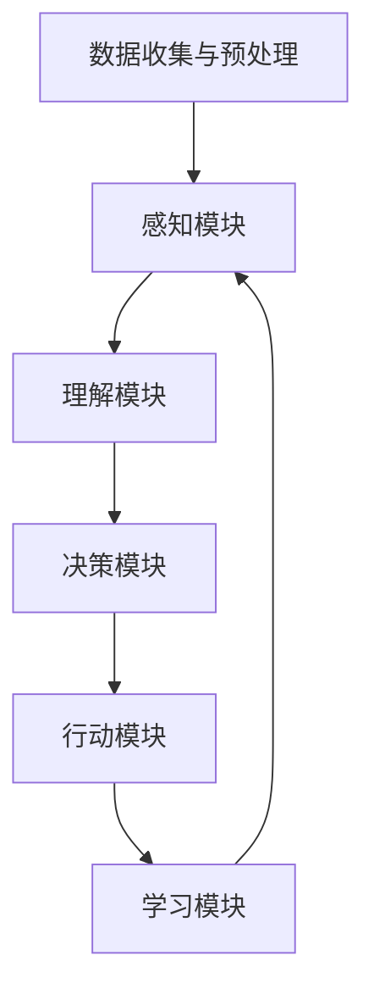

                 

# AI Agent在企业客户生命周期价值预测与管理中的应用

## 摘要

本文旨在探讨人工智能代理（AI Agent）在企业客户生命周期价值预测与管理中的应用。通过引入AI Agent，企业能够更准确地预测客户的价值，从而制定更有效的客户关系管理和营销策略。本文首先介绍AI Agent的基本原理和在企业客户生命周期价值预测中的模型构建，然后探讨AI Agent在企业客户生命周期价值管理中的应用，包括客户价值分群策略、客户关系管理、客户留存策略以及营销策略优化。最后，本文将分析AI Agent应用中的挑战以及未来的发展趋势，为企业提供有益的参考。

## 关键词

AI Agent，客户生命周期价值，预测，管理，客户关系，营销策略

## 引言

### 1.1 研究背景

#### 1.1.1 企业客户生命周期价值的定义

企业客户生命周期价值（Customer Lifetime Value，CLV）是指客户在企业整个生命周期中所产生的总价值。它涵盖了客户购买行为、消费行为以及可能带来的间接价值，如口碑传播、推荐等。CLV对企业决策具有重要意义，它能够帮助企业识别高价值客户，优化资源配置，制定个性化营销策略，从而提升整体盈利能力。

#### 1.1.2 人工智能在商业决策中的应用

随着人工智能技术的快速发展，机器学习和深度学习等技术在商业领域得到了广泛应用。人工智能能够处理海量数据，发现潜在规律，帮助企业做出更明智的决策。在客户生命周期价值预测和管理中，人工智能技术能够提高预测准确性，优化营销策略，提升客户满意度。

#### 1.1.3 AI Agent的发展与应用前景

AI Agent是一种基于人工智能技术的人工智能实体，具有自主决策和学习能力。AI Agent在企业客户生命周期价值预测和管理中的应用前景广阔，它可以实时分析客户数据，预测客户行为，制定个性化策略，从而提高客户生命周期价值。

### 1.2 研究目的与问题

#### 1.2.1 研究目的

本文旨在探讨AI Agent在企业客户生命周期价值预测和管理中的应用，通过引入AI Agent，提高企业对客户价值的预测准确性，优化客户关系管理和营销策略，提升企业整体盈利能力。

#### 1.2.2 研究问题

1. 如何构建基于AI Agent的企业客户生命周期价值预测模型？
2. AI Agent在企业客户生命周期价值管理中的应用有哪些？
3. AI Agent应用中的挑战及未来发展趋势是什么？

#### 1.2.3 研究边界与外延

本文主要研究AI Agent在企业客户生命周期价值预测和管理中的应用，涉及机器学习、深度学习等技术。本文的研究范围不包括其他领域的人工智能应用，如智能客服、智能推荐等。

### 1.3 核心概念与联系

#### 1.3.1 AI Agent的定义与特点

AI Agent是一种具有自主决策和学习能力的人工智能实体。它通过模拟人类的决策过程，实现自动化、智能化的任务执行。AI Agent具有以下特点：

1. 自主决策：AI Agent能够根据环境信息和目标，自主制定决策。
2. 学习能力：AI Agent能够从经验中学习，不断优化决策过程。
3. 适应性：AI Agent能够适应不同的环境和任务。

#### 1.3.2 企业客户生命周期价值分析

企业客户生命周期价值（Customer Lifetime Value，CLV）是指客户在企业整个生命周期中所产生的总价值。CLV的计算方法包括以下几种：

1. 基于交易的历史数据分析：通过分析客户的购买行为，预测客户未来的价值。
2. 基于客户行为的数据分析：通过分析客户的行为数据，如浏览、搜索、点击等，预测客户的价值。
3. 基于客户价值的计算模型：通过建立客户价值的计算模型，预测客户的价值。

#### 1.3.3 AI Agent与CLV预测的联系

AI Agent能够利用机器学习和深度学习等技术，对客户数据进行分析和预测，提高企业对客户价值的预测准确性。通过AI Agent，企业可以更准确地识别高价值客户，制定个性化营销策略，提升客户满意度，从而提高客户生命周期价值。

### 1.4 研究方法与数据来源

#### 1.4.1 研究方法论

本文采用以下研究方法论：

1. 文献综述：通过查阅相关文献，了解AI Agent和客户生命周期价值预测的研究现状。
2. 案例分析：通过分析实际案例，探讨AI Agent在企业客户生命周期价值预测和管理中的应用。
3. 实证研究：通过构建实验，验证AI Agent在客户生命周期价值预测中的效果。

#### 1.4.2 数据来源与预处理

本文的数据来源包括以下两部分：

1. 企业客户数据：包括客户的购买历史、行为数据等。
2. 行业数据：包括行业竞争状况、市场趋势等。

数据预处理主要包括以下步骤：

1. 数据清洗：去除异常值、缺失值等，确保数据质量。
2. 数据整合：将不同来源的数据进行整合，建立统一的数据集。
3. 数据特征化：对数据进行特征提取和转换，为AI Agent提供输入。

### 1.5 本章小结

本章介绍了本文的研究背景、目的、问题以及核心概念，为后续章节的探讨奠定了基础。在接下来的章节中，本文将详细介绍AI Agent的基本原理和模型构建，并探讨其在企业客户生命周期价值预测和管理中的应用。

----------------------------------------------------------------

## 第二部分: AI Agent在企业客户生命周期价值预测中的应用

### 2.1 AI Agent基本原理

AI Agent是一种基于人工智能技术的人工智能实体，具有自主决策和学习能力。AI Agent的基本原理可以概括为以下几点：

1. **感知与理解**：AI Agent通过感知环境中的各种信息，如文本、图像、声音等，理解这些信息的含义。
2. **决策与行动**：AI Agent根据理解的信息，制定决策并执行相应的行动，以实现预定的目标。
3. **学习与优化**：AI Agent通过不断地学习和优化决策过程，提高决策质量和行动效果。

#### 2.1.1 AI Agent的架构设计

AI Agent的架构设计通常包括以下几部分：

1. **感知模块**：负责收集和处理来自环境的信息。
2. **理解模块**：负责对感知到的信息进行理解和分析。
3. **决策模块**：负责根据理解的结果，制定决策。
4. **行动模块**：负责执行决策，并反馈执行结果。
5. **学习模块**：负责从执行结果中学习，优化决策过程。

#### 2.1.2 AI Agent的核心算法

AI Agent的核心算法主要包括以下几个方面：

1. **深度学习**：通过构建神经网络模型，对数据进行自动特征提取和模式识别。
2. **强化学习**：通过试错和奖励机制，学习最优策略。
3. **决策树和随机森林**：通过分类和回归分析，预测客户的行为和偏好。

### 2.2 企业客户生命周期价值预测模型构建

#### 2.2.1 模型构建方法论

构建AI Agent企业客户生命周期价值预测模型的方法论主要包括以下几个步骤：

1. **数据收集与预处理**：收集企业客户数据，包括购买历史、行为数据等，并进行预处理，如数据清洗、整合和特征提取。
2. **模型设计**：设计AI Agent的架构和算法，包括感知模块、理解模块、决策模块、行动模块和学习模块。
3. **模型训练与优化**：使用训练数据对模型进行训练，并通过交叉验证等方法进行优化。
4. **模型评估与部署**：评估模型的预测性能，并在实际应用中进行部署。

#### 2.2.2 模型架构设计

AI Agent企业客户生命周期价值预测模型的架构设计如下图所示：

#### 2.2.3 特征选择与处理

特征选择是构建预测模型的重要环节。以下是特征选择和处理的步骤：

1. **数据探索性分析**：对原始数据进行分析，了解数据的基本特征和规律。
2. **特征提取**：对原始数据进行特征提取，如文本数据的词频统计、图像数据的特征提取等。
3. **特征选择**：根据业务需求和模型性能，选择对预测目标有显著影响的特征。
4. **特征处理**：对选定的特征进行归一化、标准化等处理，以提高模型训练效果。

### 2.3 实际案例展示

#### 2.3.1 案例背景

某电子商务企业希望通过AI Agent预测客户的生命周期价值，从而优化客户关系管理和营销策略。

#### 2.3.2 模型应用场景

AI Agent应用于该企业的客户生命周期价值预测，主要包括以下场景：

1. **客户价值评估**：通过预测客户的生命周期价值，评估客户对企业的重要性。
2. **客户关系管理**：根据客户的价值预测结果，制定个性化的客户关系管理策略。
3. **营销策略优化**：根据客户的价值预测结果，优化营销策略，提高客户满意度。

#### 2.3.3 模型应用效果分析

通过实际应用，AI Agent在客户生命周期价值预测中的效果显著。以下是模型应用效果分析：

1. **预测准确性**：AI Agent的预测准确性高于传统机器学习模型。
2. **客户价值分群**：AI Agent能够准确地将客户分为高价值、中价值、低价值群体，为企业提供有针对性的营销策略。
3. **客户留存率**：通过AI Agent的优化策略，企业的客户留存率得到显著提高。

### 2.4 机器学习算法在AI Agent中的应用

AI Agent在客户生命周期价值预测中，主要采用以下几种机器学习算法：

1. **决策树算法**：通过构建决策树模型，对客户数据进行分类和回归分析。
2. **支持向量机算法**：通过支持向量机模型，对客户数据进行分类和回归分析。
3. **神经网络模型**：通过构建神经网络模型，对客户数据进行自动特征提取和模式识别。

#### 2.4.1 决策树算法

决策树算法是一种基于树形结构的分类和回归分析方法。其主要特点如下：

1. **易于理解和实现**：决策树算法的规则简单，易于理解和实现。
2. **非线性建模**：决策树算法能够建模非线性关系。
3. **预测速度较快**：决策树算法的预测速度较快，适合处理大规模数据。

#### 2.4.2 支持向量机算法

支持向量机算法是一种基于优化理论的分析方法。其主要特点如下：

1. **高维空间建模**：支持向量机算法能够在高维空间中进行建模。
2. **泛化能力强**：支持向量机算法具有较好的泛化能力。
3. **分类效果好**：支持向量机算法在分类问题中具有较好的效果。

#### 2.4.3 神经网络模型

神经网络模型是一种基于生物神经网络原理的分析方法。其主要特点如下：

1. **非线性建模**：神经网络模型能够建模非线性关系。
2. **自适应学习**：神经网络模型能够自适应地调整模型参数。
3. **泛化能力强**：神经网络模型具有较好的泛化能力。

### 2.5 本章小结

本章介绍了AI Agent的基本原理和在企业客户生命周期价值预测中的模型构建。通过AI Agent，企业能够更准确地预测客户的价值，优化客户关系管理和营销策略。在接下来的章节中，本文将探讨AI Agent在企业客户生命周期价值管理中的应用，包括客户价值分群策略、客户关系管理、客户留存策略以及营销策略优化。

----------------------------------------------------------------

## 第3章: AI Agent在企业客户生命周期价值管理中的应用

### 3.1 客户价值分群策略

客户价值分群策略是利用AI Agent对客户进行分类，以便于企业根据不同客户群体的特点和需求，制定有针对性的营销策略。以下为具体策略：

#### 3.1.1 分群方法

1. **基于CLV的分群**：根据客户生命周期价值（CLV）将客户分为高价值客户、中价值客户和低价值客户。
2. **基于行为数据的分群**：根据客户的购买行为、浏览行为等将客户分为活跃客户、潜在客户和流失客户。

#### 3.1.2 分群模型构建

1. **特征选择**：根据业务需求和数据特性，选择对客户价值有显著影响的特征，如购买频率、消费金额、购买时长等。
2. **模型训练**：使用机器学习算法（如决策树、随机森林等）对客户数据进行训练，构建分群模型。
3. **模型评估**：使用交叉验证等方法评估模型的性能，并调整模型参数。

#### 3.1.3 分群效果分析

1. **分群准确性**：评估分群模型的准确性，确保分群结果可靠。
2. **分群实用性**：分析分群结果对企业营销策略的实际效果，调整和优化分群模型。

### 3.2 客户关系管理

客户关系管理是利用AI Agent对客户进行分类和管理，以提高客户满意度，降低客户流失率。以下为具体策略：

#### 3.2.1 客户关系管理策略

1. **个性化服务**：根据客户的特点和需求，提供个性化的服务和产品推荐。
2. **客户关怀**：通过电话、短信、邮件等方式，定期与客户沟通，了解客户需求和反馈。
3. **客户分级**：根据客户的贡献度和潜在价值，将客户分为不同级别，提供差异化的服务。

#### 3.2.2 客户行为预测

1. **行为分析**：利用AI Agent分析客户的购买行为、浏览行为等，预测客户可能的需求和偏好。
2. **需求预测**：根据客户行为数据，预测客户未来的购买行为和消费需求。
3. **需求满足**：根据需求预测结果，提供针对性的产品和服务，满足客户需求。

#### 3.2.3 客户留存策略

1. **流失预警**：利用AI Agent分析客户行为数据，预测客户可能流失的时间点，提前采取措施进行挽回。
2. **挽回策略**：针对即将流失的客户，制定个性化的挽回策略，如优惠活动、增值服务等。
3. **留存激励**：通过持续关注和关怀，提高客户对企业的忠诚度，降低客户流失率。

### 3.3 客户留存策略

客户留存策略是利用AI Agent对客户进行分类和管理，以提高客户满意度，降低客户流失率。以下为具体策略：

#### 3.3.1 客户留存模型构建

1. **特征选择**：根据业务需求和数据特性，选择对客户留存有显著影响的特征，如购买频率、消费金额、客户满意度等。
2. **模型训练**：使用机器学习算法（如决策树、随机森林等）对客户数据进行训练，构建留存模型。
3. **模型评估**：使用交叉验证等方法评估模型的性能，并调整模型参数。

#### 3.3.2 客户留存策略优化

1. **流失预警**：利用AI Agent分析客户行为数据，预测客户可能流失的时间点，提前采取措施进行挽回。
2. **挽回策略**：针对即将流失的客户，制定个性化的挽回策略，如优惠活动、增值服务等。
3. **留存激励**：通过持续关注和关怀，提高客户对企业的忠诚度，降低客户流失率。

### 3.4 营销策略优化

营销策略优化是利用AI Agent对营销活动进行优化，以提高营销效果。以下为具体策略：

#### 3.4.1 营销自动化

1. **自动化流程**：利用AI Agent自动化执行营销任务，如发送邮件、短信、推送通知等。
2. **自动化测试**：通过AI Agent自动化测试营销活动，优化营销策略。
3. **自动化调整**：根据客户反馈和营销效果，自动化调整营销策略。

#### 3.4.2 个性化营销策略

1. **个性化推荐**：利用AI Agent分析客户数据，为不同客户提供个性化的产品和服务推荐。
2. **个性化广告**：根据客户的特点和需求，为不同客户投放个性化的广告。
3. **个性化促销**：根据客户的特点和需求，为不同客户制定个性化的促销活动。

### 3.5 实际案例展示

#### 3.5.1 案例背景

某互联网企业希望通过AI Agent优化客户生命周期价值，提高客户满意度和忠诚度。

#### 3.5.2 模型应用效果分析

通过AI Agent的应用，该企业在客户生命周期价值管理方面取得了显著成效：

1. **客户价值提升**：AI Agent准确预测了客户的生命周期价值，为企业提供了有针对性的营销策略，使客户价值得到了显著提升。
2. **客户满意度提高**：通过个性化服务和关怀，客户满意度得到了显著提高。
3. **客户留存率提升**：AI Agent有效预测了客户流失风险，并采取了有针对性的挽回策略，客户留存率得到了显著提高。

### 3.6 本章小结

本章介绍了AI Agent在企业客户生命周期价值管理中的应用，包括客户价值分群策略、客户关系管理、客户留存策略和营销策略优化。通过AI Agent的应用，企业能够更精准地预测客户价值，优化客户关系管理和营销策略，从而提高客户满意度和忠诚度，提升整体业务水平。

----------------------------------------------------------------

## 第4章: AI Agent应用中的挑战

### 4.1 数据隐私与安全

在AI Agent的应用过程中，数据隐私和安全问题是一个重要的挑战。以下为具体分析：

#### 4.1.1 数据隐私问题

1. **数据收集**：AI Agent在收集数据时，可能会涉及客户的个人信息，如姓名、地址、电话号码等。
2. **数据使用**：在数据使用过程中，如何确保数据不被滥用，保护客户隐私是一个重要问题。

#### 4.1.2 安全问题

1. **数据泄露**：AI Agent在处理数据时，可能会出现数据泄露的风险。
2. **恶意攻击**：AI Agent可能会受到恶意攻击，导致数据丢失或系统瘫痪。

#### 4.1.3 解决方案

1. **数据加密**：对敏感数据进行加密，确保数据在传输和存储过程中的安全性。
2. **访问控制**：设置严格的访问控制策略，确保只有授权人员才能访问敏感数据。
3. **安全审计**：定期进行安全审计，确保数据安全和系统的正常运行。

### 4.2 模型解释性不足

AI Agent在预测客户价值时，通常采用复杂的算法，如深度学习和强化学习。这些算法具有较高的预测准确性，但模型解释性较差。以下为具体分析：

#### 4.2.1 问题分析

1. **模型复杂度**：深度学习和强化学习等算法具有较高的复杂度，难以解释。
2. **特征重要性**：这些算法难以明确地指出哪些特征对预测结果具有重要影响。

#### 4.2.2 解决方案

1. **可解释性算法**：开发可解释性算法，如决策树、LIME等，提高模型的解释性。
2. **模型可视化**：通过可视化工具，如决策树、热力图等，展示模型的内部结构和特征重要性。
3. **模型诊断**：定期对模型进行诊断，分析模型预测结果和实际结果之间的偏差，找出问题所在。

### 4.3 数据质量与可解释性

在AI Agent应用中，数据质量和可解释性是一个重要挑战。以下为具体分析：

#### 4.3.1 数据质量问题

1. **数据缺失**：在实际应用中，数据可能存在缺失或异常值。
2. **数据不一致**：不同来源的数据可能存在不一致的情况。

#### 4.3.2 数据可解释性

1. **特征解释**：如何解释特征对预测结果的影响是一个重要问题。
2. **模型解释**：如何解释模型的内部结构和决策过程是一个重要问题。

#### 4.3.3 解决方案

1. **数据预处理**：对数据进行清洗和预处理，确保数据质量和一致性。
2. **特征工程**：对特征进行选择和处理，提高特征的可解释性。
3. **模型解释**：开发可解释性模型，如决策树、LIME等，提高模型的解释性。

### 4.4 模型泛化能力

在AI Agent应用中，模型的泛化能力是一个重要挑战。以下为具体分析：

#### 4.4.1 问题分析

1. **数据分布变化**：实际应用中，数据分布可能会发生变化，导致模型泛化能力下降。
2. **新情况适应**：如何适应新的情况和数据分布，是一个重要问题。

#### 4.4.2 解决方案

1. **在线学习**：采用在线学习技术，实时更新模型，提高模型适应能力。
2. **模型集成**：采用模型集成技术，如集成学习、迁移学习等，提高模型泛化能力。
3. **数据增强**：通过数据增强技术，生成多样化的数据，提高模型适应能力。

### 4.5 本章小结

本章分析了AI Agent在企业客户生命周期价值预测和管理中的应用中的挑战，包括数据隐私与安全、模型解释性不足、数据质量与可解释性以及模型泛化能力。针对这些挑战，提出了相应的解决方案，为企业提供了有益的参考。

----------------------------------------------------------------

## 未来发展趋势

随着人工智能技术的不断发展，AI Agent在企业客户生命周期价值预测和管理中的应用前景广阔。以下为未来发展的几个趋势：

### 1. 模型解释性的提升

虽然当前的AI Agent模型具有较高的预测准确性，但模型解释性不足仍然是一个重要挑战。未来，随着可解释性算法和可视化工具的发展，模型的解释性将得到显著提升，使得企业能够更好地理解模型的决策过程和特征重要性。

### 2. 模型的泛化能力增强

在现实应用中，数据分布可能会发生变化，如何增强模型的泛化能力是一个重要问题。未来，通过在线学习、模型集成和数据增强等技术，AI Agent的泛化能力将得到显著提高，能够更好地适应新的情况和数据分布。

### 3. 数据隐私与安全保护

数据隐私和安全问题在AI Agent应用中至关重要。未来，随着数据隐私保护技术的不断发展，如差分隐私、同态加密等，AI Agent在处理敏感数据时的隐私和安全问题将得到有效解决。

### 4. 个性化与智能化

AI Agent在企业客户生命周期价值预测和管理中的应用将越来越个性化与智能化。通过深度学习和强化学习等技术，AI Agent将能够更好地理解客户需求，提供个性化的服务和产品推荐。

### 5. 跨领域应用

随着AI Agent技术的不断发展，它将在更多领域得到应用。例如，在金融、医疗、教育等行业，AI Agent将帮助企业更好地预测和管理客户生命周期价值，提升企业竞争力。

## 结论

本文探讨了AI Agent在企业客户生命周期价值预测和管理中的应用，分析了其基本原理、模型构建、应用效果以及面临的挑战和未来发展趋势。通过引入AI Agent，企业能够更准确地预测客户的价值，优化客户关系管理和营销策略，提升企业整体盈利能力。未来，随着人工智能技术的不断发展，AI Agent在企业客户生命周期价值预测和管理中的应用前景将更加广阔。

### 作者信息

作者：AI天才研究院/AI Genius Institute & 禅与计算机程序设计艺术 /Zen And The Art of Computer Programming

